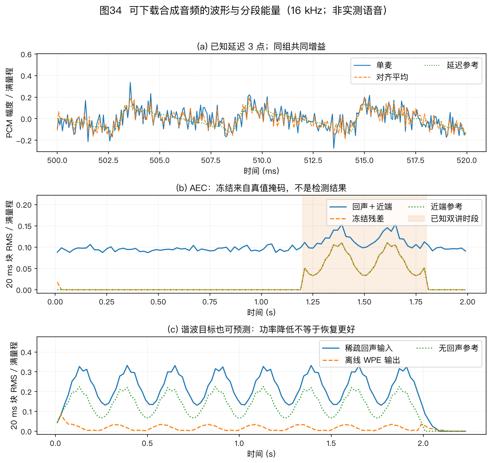

# 多麦克风阵列信号处理教程 · 导读与导航

本页是全套教程的入口，教程正文一共 14 个文件：本页导读＋11 章正文＋2 篇附录。另有 6 篇[源码研究手册](../codes/research/README.md)网页，展开实现与工业复现，不计入正文篇数。

11 章正文和 2 篇附录既可顺序阅读，也可按第 5 节的学习路径选读。每篇开头都列出上一篇、下一篇和首页链接。

全套教程配了 38 张图，图 18～20、图 26～32 和图 36～38 在第 6 章。插图分为几何示意、指定条件下的仿真和系统框图，阅读时要同时核对图注中的参数。

---

## 1. 这是一份什么样的教程

这是一份讲麦克风阵列的教程。零基础可以从头读，读完还可以当手册查。
文里配了 38 张图，先看图，再看公式。

教程从一个具体问题讲起：你站在 3 米外跟音箱说话，它怎样从噪声、混响和自身播放声中提取你的语音。全书依次讨论阵列几何、声源定位、定向拾音、回声与混响处理、重叠语音分离、移动声源追踪、系统评测和场景选型。

各章先建立直觉，再给出公式、符号、算例和适用边界。比较实验数字前，要先核对阵列几何、房间、数据集、实现和评测口径；条件不同的结果只能用于观察趋势。

---

## 2. 14 个文件一览

| 编号 | 文件 | 配图 | 难度 | 预计时间 |
|---|---|---|---|---|
| 00 | `00_overview.md`（本页） | 图34 | 入门 | 15～20 分钟，先读本页 |
| 01 | `01_problem-definition.md` | 图1 | 入门 | 10 分钟 |
| 02 | `02_basics-signal-model.md` | 图2～图7，共 6 张 | 进阶 | 45～60 分钟，建议完整读一遍 |
| 03 | `03_array-geometry.md` | 图8～图10，共 3 张 | 进阶 | 30 分钟 |
| 04 | `04_doa-estimation.md` | 图11～图14、图33，共 5 张 | 较难 | 60～90 分钟，建议分两次读 |
| 05 | `05_beamforming.md` | 图15～图17，共 3 张 | 较难 | 60～90 分钟，跟着手算一遍 |
| 06 | `06_aec.md` | 图18～20、图26～32、图36～38，共 13 张，另引用图23 | 较难 | 60～80 分钟，建议分两次读 |
| 07 | `07_wpe-dereverberation.md` | 图21、图24，共 2 张 | 进阶 | 30～45 分钟 |
| 08 | `08_speech-separation.md` | 0 张专属图，引用图23 | 进阶 | 30～45 分钟 |
| 09 | `09_source-tracking.md` | 本章专属图22，另引用图23 | 进阶 | 30～40 分钟 |
| 10 | `10_engineering-practice.md` | 新图 1 张（图25），另引用图23 | 进阶 | 约 45～60 分钟 |
| 11 | `11_selection-guide.md` | 0 张专属图 | 入门 | 20～30 分钟；按任务、约束和场景条件形成候选方案 |
| 附录 A（文件 12） | `12_appendix-symbols-math.md` | 0 张专属图 | 查阅 | 通读约 25 分钟，也可以当词典查 |
| 附录 B（文件 13） | `13_appendix-guide.md` | 图35 | 查阅 | 通读约 40 分钟，也可以按需查 |

预计时间的算法：中文每分钟读 450 字，每张图多加 2～3 分钟，推导部分再加停留时间。按上表逐篇相加，全部精读约需 9～11 小时；练习和复现实验另计。按路径读见第 5 节。

时间有限时，可先读本页、01 和 11，明确问题与选型条件，再读 02 补齐信号模型。需要定位、波束、AEC、去混响或分离时，分别选读 04～08；工程实现配合第 10 章和附录 B 的排错部分，研究选题配合第 4、9 章和附录 B 的领域地图。

---

## 3. 各篇内容与学习目标

### [01 · 问题定义与双耳启示](./01_problem-definition.md)

1 张图，入门。以智能音箱为例说明噪声、混响、干扰和麦克风自噪声，再区分定位、波束形成和追踪三项空间任务。阵列收益分三类度量：独立通道噪声看 WNG（白噪声增益），弥散场看 DI（指向性指数），定向干扰看零陷深度。三种指标的声场假设不同，不能直接互换。

人的听觉系统会利用双耳时间差、声级差和耳廓滤波线索。麦克风阵列也可利用通道间时延和幅相差，但需要显式的几何模型或实测阵列流形。细节见第 1 章。

学习目标：解释多麦克风相对单麦克风增加了哪些空间信息，复算理想白噪声模型下的阵列增益，并区分双耳线索与阵列观测。

### [02 · 基础：声音到达阵列时发生了什么](./02_basics-signal-model.md)

6 张图，进阶。全书的符号和概念都在这章第一次出现。建议完整读一遍，后面看不懂时再回来查。

- 2.1 节讲时延：声音到达每个麦克风有先有后。采样率 16 kHz 时，一格是 62.5 微秒，约等于 2.1 厘米。时延估计要用到比采样间隔更细的插值，多路信号还必须用同一个时钟录。
- 2.2 节讲远场和近场：对中心对称孔径，常用相位曲率尺度是两倍孔径平方除以波长；其他几何要按参考点到最远阵元的距离推导。分界同时取决于孔径和频率。
- 2.3 节讲导向矢量：时域的移位变成频域的相位旋转。导向矢量就是每个方向对应的标准相位组合，后面定位和波束形成都要用它。
- 2.4 节讲房间混响：声音经反射形成拖尾，$T_{60}$ 描述能量衰减 60 dB 所需时间，DRR（直达混响比）描述直达声与混响的相对能量。
- 2.5 节讲 STFT（短时傅里叶变换）：把波形分帧后得到复数时频表示，再由多通道快拍估计协方差矩阵。
- 2.6 节讲主瓣宽度、旁瓣、DI、WNG，还介绍分辨率尺度、栅瓣条件和 CRLB（克拉美－罗下界）。

本章结束时，读者应能从时延推到相位和导向矢量，解释协方差矩阵各元素的含义，并查清后续章节使用的基础符号。

### [03 · 阵列几何形态](./03_array-geometry.md)

3 张图，进阶。讲麦克风怎么摆，以及摆法决定什么上限。

双麦只有一条物理基线，正横、端射和中间角度是相对该基线的连续工作方向。随后比较线阵、圆阵、方阵、球阵、螺旋阵和分布式阵列。

共线阵列无法分辨绕阵列轴的方位，继续在同一直线上增加麦克风也不能消除这种几何模糊。端射附近的时延对角度变化不敏感，同样的时延误差会对应更大的角度误差。

本章归纳四条设计规律：孔径和波长的比值影响分辨率；圆阵在水平面各方向都能利用孔径；挡板会改变阵列流形；增加麦数能改善白噪声增益和统计稳定性，但收益取决于几何、频段和噪声场。

稀疏阵只占用密集参考网格中的部分候选位置，再把麦对位置差组织成差分协同阵。例子中的 6 麦嵌套阵产生 23 个连续的有符号滞后；要把这些滞后用于 MUSIC，还需构造虚拟协方差并做空间平滑或等价重构。

读者可以据此说明阵列形态怎样限制可观测方向、孔径和无混叠频带，并按覆盖范围、同步条件和安装空间筛选几何方案。

### [04 · 声源定位 DOA 估计](./04_doa-estimation.md)

5 张图，较难。DOA 是波达方向（Direction of Arrival），也就是判断声音从哪来。本章算法种类多，建议分两次读。

新增的 [§4.10 四麦分数采样时差](./04_doa-estimation.md#sec-4-10)把 4 cm 阵列的几何时差、理想相量计算和四通道合成 WAV 放在同一练习中；它只验证指定模型，不替代真实房间的定位评测。

本章把方法分为四类：两步法（互相关＋几何解算）、扫描法、子空间法、稀疏重构与深度学习方法。

- GCC-PHAT（广义互相关相位变换）从相位随频率的变化估计时延，混响会拖宽或扰乱相关峰，时延估计还要做亚采样插值。图 13 用 16 kHz、64 ms 分析帧和 150 次固定种子试验构造随机衰减尾。它用于说明固定尾能量时 $T_{60}$ 与 DRR 的联合作用，以及仿真参数口径可能改变趋势；该图不能当作“$T_{60}$ 越长性能越差”的单调证据，也不代表真实房间的通用正确率。
- SRP（可控响应功率）在每个候选位置累加各麦对的相关响应，再寻找最大值。算例里真点得分 6.0，偏 1.8 米的点 5.64，镜像点 2.08。粗到细两级搜索可减少需要评估的网格点；实际耗时取决于搜索范围、网格间距、麦对数、实现和硬件。
- 几何解算包括 Chan 算法和泰勒迭代。GDOP（精度稀释）描述几何摆位不好时误差怎样被放大。
- 扫描法包括 Bartlett 与 Capon（最小方差谱估计）。双麦例子中，0° 与 30° 两个候选方向的谱值比分别为 1.8 和 5.0；这里的 30° 不是旁瓣位置，不能把这个比值称为旁瓣抑制比。

子空间法 MUSIC（多重信号分类）利用信号子空间与噪声子空间的正交关系寻找谱峰。相干信号会使源协方差秩下降，均匀线阵可在满足子阵条件时用空间平滑恢复可用秩。ESPRIT（旋转不变子空间法）利用阵列的平移结构直接解角度，不用逐格扫描。

DNN（深度神经网络）方法可用带方向标签的多通道数据学习定位特征，效果取决于训练数据是否覆盖测试阵列、房间、噪声和声源数。CRLB（克拉美－罗下界）用来分析指定观测模型下的方差下界；对已知波形的时延估计，有效带宽增大通常会增加 Fisher 信息，但具体幂次和系数取决于 SNR、频谱和参数定义。

完成本章后，读者应能按阵列几何、源数、混响和计算预算比较四类定位方法，并解释互相关峰受多径影响、MUSIC 在相干源下失效的原因。

### [05 · 波束形成 Beamforming](./05_beamforming.md)

3 张图，较难。波束形成对多通道信号加权求和，在保持目标方向响应的同时降低指定噪声场或干扰方向的输出功率。正文给出可复算的权重和响应例子。

三类噪声需要不同模型：麦克风自身噪声用 WNG 评价，延迟求和是解析基线；弥散场用 DI 评价，可比较超指向设计；定向干扰则检查零陷和 MVDR（最小方差无失真响应）的输出。

DSB（延迟求和波束形成）的权重是导向矢量除以麦克风数，理想独立白噪声下 WNG 等于麦克风数。超指向在低频提高 DI 时可能显著降低 WNG。两麦端射算例在指定间距和频率下得到约 −10 dB 的 WNG 与约 6 dB 的 DI；间距减半时，该算例的 WNG 再降低约 6 dB。

MVDR 分四步推导。算例中，噪声协方差所含的定向干扰信息使 30° 处响应降至 −23.8 dB。LCMV（线性约束最小方差）加入多条约束，MWF（多通道维纳滤波）权衡降噪与失真。GSC（广义旁瓣对消器）分成固定波束、阻塞矩阵、自适应对消三路；在约束与实现一致时，它可表示 LCMV 解。

后置滤波调整时频增益，球谐方法用于球阵和球面声场表示。DNN 方法包括掩码估计、掩码结合 MVDR 和直接端到端映射。

本章要求读者能计算 WNG 与 DI，说明 MVDR 怎样利用协方差中的空间信息抑制定向干扰，并比较 GSC 与 LCMV 的约束表达。

### [06 · 声学回声消除 AEC](./06_aec.md)

13 张图（图18～20、图26～32、图36～38，另引用图23），较难。图 18、图 26～32 解释回声模型、收敛与工程条件，图 36 展示非线性残留，图37～38分别说明子带交叉项和 IPNLMS/RLS/Kalman 的不同状态。

AEC（声学回声消除）处理设备自己播放、又被自身麦克风收进来的声音。能预测回声波形时可估计后相减，这是本章区分减法处理与增益抑制的起点。

NLMS（归一化最小均方自适应滤波）给出基础更新式。PBFDAF（分区块频域自适应滤波）把长路径分区，按频点使用多个历史参考块更新；在第 6 章规定的同一分块、误差和归一化口径下，它就是频域多抽头 NLMS 的具体实现，不是与之并列的新算法。

子带方法、IPNLMS 和 FDKF（频域卡尔曼滤波）分别改变信号表示、系数分配或状态估计。扬声器非线性会限制线性 AEC，需根据失真来源考虑非线性模型或神经网络。DTD（双讲检测）用于控制近端和远端同时活动时的自适应更新。

AEC 与其他模块的参考关系见 §10.1 和图 23。评测要同时考虑远端单讲时的 ERLE、双讲稳定性、近端语音损伤和主观听测；ERLE 高并不能证明近端语音无损。WebRTC AEC3 可作为公开实现参考。

读者应能确定回声参考取点，解释 AEC 与波束顺序的条件，并为线性路径、非线性失真和双讲分别选择验证方法。

### [07 · 去混响 WPE](./07_wpe-dereverberation.md)

2 张图（图21、图24），进阶。讨论怎样利用跨帧预测估计并减弱晚期混响。

WPE（加权预测误差去混响）用历史帧预测晚期混响并相减，保护延迟用于避免直接预测当前直达声。正文算例在指定条件下展示混响能量变化；预测延迟和阶数要按帧长、混响与语音损伤验证。多人重叠语音在第 8 章讨论，模块启用条件和参考关系见 §10.1。

本章给出保护延迟 $\Delta$ 和预测阶数的选择依据，比较单通道与多通道 WPE，并说明 MINT、倒谱和谱方差方法各自依赖的假设。

### [08 · 语音分离](./08_speech-separation.md)

0 张专属图（引用全书链路总图23），进阶。讨论重叠语音的分离方法，以及时频掩码怎样连接分离、协方差估计和波束形成。

三条路线包括经典盲源分离（AuxIVA、ILRMA、MNMF、TRINICON）、GSS（引导源分离，用说话人活动标注处理输出排列）和深度分离（掩码估计、深度聚类、PIT、Conv-TasNet、状态空间模型及查询型分离）。§8.1 介绍方法，§8.2 与图 23 给出较完整前端的参考关系；实际顺序和模块启用条件以 §10.1 为准。

读者应能按源数与麦克风数的关系区分 AuxIVA、ILRMA、MNMF 和 TRINICON 的模型条件，解释 GSS 使用活动信息的原因，并用分离掩码估计目标或干扰协方差。

### [09 · 声源追踪 Source Tracking](./09_source-tracking.md)

2 张图，进阶。讨论方向观测随目标运动、漏检和野点变化时，怎样估计连续轨迹。状态可以包括角度、角速度和角加速度。

声音观测有四类困难：

- 语音时断时续；
- 定位结果含有野点；
- 说话人数会变化；
- 角度观测与状态之间可能是非线性关系。

KF（卡尔曼滤波）由状态预测、观测更新和协方差递推组成，观测与预测的权重由噪声模型决定，不是固定比例。PF（粒子滤波）用带权粒子近似后验分布，并通过重采样缓解权重退化。

多人追踪还会用到 IMM（交互多模型）、PHD（概率假设密度）、LMB 和 TBD（检测前追踪）。§9.4 讨论定位与波束之间的反馈；更新限幅、静默保持和重置条件都应由目标运动与帧率确定。

完成本章后，读者应能说明追踪器在定位与波束之间传递什么状态，比较单目标与多目标方法，并设置方向更新、静默保持和重捕获条件。

### [10 · 工程实现、评测与产业实践](./10_engineering-practice.md)

新图 1 张（图25），另引用图23，进阶。图 23 是参考依赖图，不表示每个项目都要启用全部模块。第 10 章按启用条件说明 AEC、WPE、定位、波束、NS 和后端的取点关系，并把延迟分为前瞻、缓冲、计算、调度和解码关键路径。

硬件部分区分数字样本格式、模拟动态范围、初始时差和 SRO（采样率偏移）。资源预算分别使用 MAC/s、MIPS、RTF、峰值内存和功耗，续航用 Wh 与整机平均功率计算。

评测部分说明 SI-SDR、STOI、PESQ/POLQA、WER/CER、OSPA 与主观听测各自回答什么问题。

本章结束时，读者应能编制延迟、同步和标定预算，选择与任务相符的评测指标，并列出部署时还需验证的资源与故障状态。

### [11 · 总结与选型指南](./11_selection-guide.md)

入门。11.1 从输出任务、覆盖区域、频带、干扰、目标运动和硬件边界六方面定义问题；11.2 给出不同模块的启用与替换条件；11.3 说明几何和算法怎样共同决定性能。

11.4 用四类场景演示怎样从条件推导候选方案；11.5 把方案写成可验证规格；11.6 配有七道练习，其中四道有独立代码。

本章把任务和约束转成候选方案，给出 AEC、WPE 和分离的启用条件，并示范怎样把几何、WNG/DI 权衡和资源预算写成可测的验收规格。

### [12 · 附录 A：符号、术语、数学](./12_appendix-symbols-math.md)

查阅用。12.1 节是符号表。12.2 节是术语词典，按信号与数学基础、房间声学、自适应滤波与分离、波束形成与阵列度量、定位与追踪、系统与硬件分组。12.3 节介绍复数、分贝、卷积和相关、期望和协方差、最小二乘与特征分解；12.4 节用三道代码题复算卷积、复二阶矩和秩亏最小二乘。

遇到未定义符号、术语或数学步骤时，可按主题查阅，无需顺序通读。

### [13 · 附录 B：路径、地图、前沿、排错、练习、复现](./13_appendix-guide.md)

查阅加动手。13.1 节是学习路径。13.2 节是教材、会议、期刊、挑战赛与历史地图。13.3 节介绍八个研究方向与泛化失配。13.4 节是排错指南，13.5 节是公式速查卡，13.6 节有 17 道练习题及共同增益代码题，13.7 节说明怎样复现 38 张图。

需要查学习资料、研究方向、排错方法、练习或复现步骤时，可直接进入对应小节。

---

## 4. 阅读顺序

1. 先读本页，再用约 10 分钟读第 1 章，建立问题意识。
2. 读第 2 章，补齐全书共用的信号模型。符号不懂时查附录 A。
3. 几何线从第 3 章开始，了解阵列形态怎样限制观测信息，再用 §11.1～§11.3 形成候选几何。
4. 空间处理线依次关联第 4 章的定位、第 9 章的追踪和第 5 章的波束。第 2、5、8 章介绍的时频掩码可用于估计目标或噪声协方差，再交给 MVDR 或分离模块。
5. 干扰处理线包括第 6 章的回声消除、第 7 章的去混响和第 8 章的语音分离；启用条件和参考依赖见 §10.1 与图 23。
6. 工程线用第 10 章核对链路、硬件、评测和芯片，再到第 11 章形成方案。

附录 A（文件 12）汇总符号、术语和数学。附录 B（文件 13）提供学习路径、领域地图、前沿、排错、练习和复现说明。

完成第 11 章后，工程读者可到 §10.10 制定联调与验收计划，遇到问题查 §13.4。研究读者可读 §13.3，再做 §13.6 的第 16、17 题，分别练习房间仿真和论文系统复核。两篇附录均可按需查阅。

---

## 5. 三条阅读路径

### 路径 A：零基础入门（能复现演示，约 2～3 周）

1. 先读本页和第 1 章，再读 §11.1～§11.3，了解选型需要哪些输入条件。
2. 02 精读 60 分钟。推导可以先跳，重点是会读图 2～图 7。
3. 03 读表格＋算例 30 分钟。04 读 4.2、4.3 节＋算例 60 分钟，对照看图 12、图 14。05 读 5.1、5.2、5.4 节，跟着手算 60 分钟，对照看图 16。
4. 06 读 6.1.1、6.1.2、6.1.7（AEC 在阵列里放哪）、6.1.9 共 60 分钟，对照看图 18。07 读 7.1 节直觉部分和 7.1.1（$\Delta$ 与 $K$ 的选择），对照看图 21、图24。08 读 8.1 节三条路线和掩码用途 30 分钟。09 读 9.2 节卡尔曼滤波五步 30 分钟。
5. 阅读 §10.1、§10.4 和 §10.6，了解参考链路、资源口径与房间仿真。按需查附录 A，再做附录 B 的第 2、3、5、7、10、11、14 题，并用 §13.4 检查常见问题。
6. 终点：重新生成并解释 38 张图，再在可用的多通道硬件上实现一个可测方向响应的基线系统。

### 路径 B：工程实现（形成可验证的前端方案，约 1 周精读）

1. 用 §11.1～§11.5 写清任务、几何、场景、模块启用条件和验收指标。第 5 章重点读 MVDR、稳健化与后置滤波；第 6 章核对回声参考、双讲和与波束的顺序条件；第 7 章根据目标房间验证 WPE；第 8 章在确有重叠语音需求时选择分离方法。更换阵列前阅读 §13.3 的泛化专栏。
2. 通读第 10 章，按关键路径核算延迟，区分多设备同步与 SRO，统一评测、算力和功耗口径。再查 §13.4，完成 §13.6 的第 7、8、9、11、14、15 题。
3. 终点：输出延迟、同步、标定三张预算表。对照 WebRTC AEC3 检查回声消除，分开评价远端单讲残余、双讲稳定性、近端损伤与主观质量；资源和时序仍须在目标设备测量。

### 路径 C：研究复现与公开评测（长期）

1. 02 的 CRLB 给出指定观测模型和正则条件下无偏估计方差的下界。03 的稀疏阵列。04 的 4.6、4.7 节（空间平滑、宽带子空间方法、学习型定位、ACCDOA 声事件定位表示）。05 的 RTF（相对传递函数）版 MVDR、球谐方法、掩码＋GEV（广义特征值波束形成）、端到端网络。
2. 06 的 FDKF、混合神经卡尔曼。07 的在线 WPE。08 的扩散模型、GSS 与掩码协方差估计。09 的 PHD、LMB、TBD。10 的指标口径（SI-SDR 和 BSS-eval 两套指标不能直接比数值）＋CHiME、LibriCSS、STARSS 数据集。
3. 用附录 B §13.2 查领域资料，阅读 §13.3 中与课题相关的方向和泛化专栏，再做 §13.6 的第 6、8、12、13、16、17 题，分别覆盖定位分辨、稳健波束、分离、追踪、房间仿真和论文系统复核。阅读 CHiME-8 系统报告时，可把实际前端结构与图 23 对照。
4. 终点：在一个公开数据集上固定阵列、训练/测试划分和指标，分别实现一个解析基线与一个数据驱动基线，并记录模型版本、输入特征和推理资源。

---

## 6. 插图地图：38 张图在哪篇

| 图 | 文件 | 所在文档 | 类型 | 内容 |
|---|---|---|---|---|
| 图1 | fig01_binaural | 01 | 示意＋曲线 | 双耳时间差和声级差，Rayleigh 双重理论 |
| 图2 | fig02_dsin_geometry | 02 | 示意 | 时延几何直角三角形 |
| 图3 | fig03_near_far_field | 02 | 示意 | 球面波和平面波，远场判据 |
| 图4 | fig04_delay_phase | 02 | 示意＋曲线 | 时延等于相位旋转，给互相关法铺垫 |
| 图5 | fig05_room_acoustics | 02 | 示意＋曲线 | 房间脉冲响应三段、T60、直达临界距离、直达混响比 |
| 图6 | fig06_stft_cov | 02 | 仿真＋矩阵 | 分帧语谱加协方差热图加特征谱 |
| 图7 | fig07_beampattern_anatomy | 02 | 仿真教学 | 主瓣、旁瓣、零陷、主瓣宽度、栅瓣 |
| 图8 | fig08_geometries | 03 | 布局示意 | 线阵、圆阵、球阵、螺旋阵、分布式 |
| 图9 | fig09_tradeoffs | 03 | 公式计算，分两幅看 | （a）独立同方差白噪声下的理想 WNG 为 $10\log_{10}M$；（b）输入通道数 $M$、无序麦对数 $M(M-1)/2$ 和完整协方差元素数 $M^2$，不等同于运行时间、功耗或价格 |
| 图10 | fig10_sparse_array | 03 | 集合图解 | 所有有序麦对形成有符号差分位置；图中 6 麦嵌套阵得到 23 个连续有符号滞后 |
| 图11 | fig11_doa_spectrum | 04 | 仿真 | 指定高信噪比、充足快拍条件下的三种谱形；Capon 使用相对对角加载 $\eta=10^{-6}$；不检验分辨极限 |
| 图12 | fig12_gcc_phat | 04 | 示意＋仿真 | 真值约 0.933 格；固定噪声样例经 16 倍时延网格插值得 58.59375 μs，即 0.9375 格、约 30.16° |
| 图13 | fig13_gcc_reverb | 04 | 参数口径反例 | 在 16 kHz、64 ms 分析帧、无传感器噪声的随机衰减尾模型中，每点 150 次固定种子试验；正确率带 95% Wilson 区间，峰对比度带四分位区间；用于检查固定尾能量时 $T_{60}$ 与 DRR 的联合作用，不支持单调退化结论 |
| 图14 | fig14_srp_grid | 04 | 仿真＋几何 | 麦对相关响应的网格累加与双曲线交汇 |
| 图15 | fig15_wng_di | 05 | 指定模型仿真 | 半径 4 cm 的 6 元圆阵；超指向使用相对对角加载 $10^{-6}$，两种方法均保持目标方向单位响应 |
| 图16 | fig16_beampattern | 05 | 指定模型仿真 | 三条曲线保持目标方向单位响应；DSB/MVDR 用 $d=\lambda/2$，超指向用 $d=0.2\lambda$，MVDR 干扰方向为 20° |
| 图17 | fig17_gsc | 05 | 系统框图 | 固定波束、阻塞矩阵、对消器三路 |
| 图18 | fig18_aec | 06 | 框图＋本书仿真 | 固定随机种子样例在 $0.45<t<0.8$ s 窗口的 NLMS ERLE 均值约 29.23 dB（图中取整约 29 dB）；双讲区间冻结更新 |
| 图19 | fig19_aec_landscape | 06 | 仿真＋方法分类 | （a）指定未建模非线性条件下的线性 AEC 性能平台；（b）按模型假设和处理对象区分四类方法，横向位置不表示年代或性能排名 |
| 图20 | fig20_aec_pipeline | 06 | 系统框图 | 经典链路与线性、神经网络混合链路对比 |
| 图21 | fig21_wpe | 07 | 仿真 | 共用谱幅参考值比较干净、混响和 WPE 输出；统计量按 10 ms 直达延迟对齐干净参考，再报告静音帧能量占比与活跃帧复增益对齐谱域 NMSE |
| 图22 | fig22_tracking | 09 | 仿真 | 单目标粒子滤波轨迹与两目标 PHD 强度示意 |
| 图23 | fig23_pipeline | 08、09、10 | 系统框图 | 较完整前端的参考依赖关系与方向反馈（08、09 只引用） |
| 图24 | fig24_wpe_frames | 07 | 示意 | WPE 帧结构：只用过去历史预测当前帧，保护延迟 Δ 的作用 |
| 图25 | fig25_latency_budget | 10 | 瀑布条 | 一组旧设计的延迟拆分示意；实际预算按 §10.1 的关键路径重新测量 |
| 图26 | fig26_aec_problem | 06 | 示意 | 回声怎么形成：房间冲激响应、卷积拖尾、麦克风三者相加 |
| 图27 | fig27_aec_concept | 06 | 示意 | 估计回声路径并相减，DTD 控制自适应更新 |
| 图28 | fig28_aec_nlms | 06 | 仿真 | NLMS 自适应过程：滤波器长成回声路径，步长取舍 |
| 图29 | fig29_aec_erle_freeze | 06 | 仿真 | 收敛与冻结：本图在已知双讲区间冻结，双讲段不以混合残差直接计算回声分量 ERLE；其他控制策略需另验证 |
| 图30 | fig30_aec_delay_dtd | 06 | 仿真 | 延迟对齐与双讲：不对齐掉几十分贝，对齐是第一要务 |
| 图31 | fig31_aec_nonlinear | 06 | 仿真 | 指定仿真条件下线性路径与 tanh 非线性路径的性能平台 |
| 图32 | fig32_aec_hybrid_select | 06 | 框图＋示意 | 线性与神经网络混合处理及条件化选型 |
| 图33 | fig33_gcc_two_ways | 04 | 对照 | 时域滑动乘加等于频域共轭乘加 IFFT，两条路算出同一条曲线、同一个峰 |
| 图34 | fig34_audio_examples | 00 | 合成音频对照 | 从实际 PCM 文件读取对齐平均、双讲冻结和 WPE 的波形/能量，不能代替实录语音质量评分 |
| 图35 | fig35_audio_counterexamples | 13 | 合成反例 | 相关噪声、极性错误、病态求逆的 PCM 对照；每组共同增益、无评分时延或增益拟合 |
| 图36 | fig36_nonlinear_echo | 06 | 非线性回声反例 | 500 Hz 输入经三次模型产生 1500 Hz 残留；同增益波形及 PCM 实测单边幅度 |
| 图37 | fig37_aec_subband | 06 | 精确代数示例 | 两带 Haar 表示下，一采样回声路径的跨带项；仅保留对角项会遗漏交叉项，不是自适应算法性能图 |
| 图38 | fig38_aec_four_methods | 06 | 手算状态图 | IPNLMS 抽头增益、RLS 逆相关矩阵及卡尔曼增益的指定小规模状态；不表示方法间性能排名 |

示意图用于解释几何关系，曲线展示指定条件下的可复现结果，框图说明模块之间的信号与控制关系。

---

## 7. 十处跨文档联系

1. 定位连着追踪连着波束：04 找方向，09 跟轨迹，05 指波束，见 9.4 节和图 23。
2. 前端模块的参考依赖与启用条件见 §10.1 和图 23。
3. 导向矢量：02 的 2.3 节定义，04、05、08、09 都要用。
4. 协方差矩阵：02 的 2.5 节定义，04、05、06 都要用。对角加载可改善条件数，但不能代替足够的独立观测。
5. WNG 和 DI 的权衡：02 的 2.6 节提出，05 详细计算，11 用于条件化选型。
6. 混响这条线：02 的 2.4 节讲混响是什么，04、05、06、07 讲各自怎么对付它。
7. 掩码估计：02 讲语音稀疏性，05 和 08 用掩码估计目标或噪声协方差，并把它们交给波束形成或导引分离。
8. 减法和乘法：06 的 6.1 节讲能预测波形就做减法，05 的 5.7 节讲只能估计幅度就做乘法。
9. 几何上限：03 讲摆位定的上限，04、09、10 都要回来看它。
10. 标定和同步：10 的 10.2 节讲标定同步，13 的附录 B 13.4 节讲排错时怎么查它。

---

## 8. 动手复现

`codes/` 先提供与公式相对应的小规模教学基线，`scripts/` 再生成书中的图。前者适合逐步检查时延、矩阵形状、约束残差和边界输入；后者适合复现正文的完整示意或仿真条件。算法覆盖状态见 `codes/COVERAGE.md`，第三方官方实现、固定提交和许可证边界见 `codes/THIRD_PARTY.md`。

在仓库根目录先运行三组章节例子：

```bash
.venv/bin/python codes/examples/ch02_05_baselines.py
.venv/bin/python codes/examples/ch06_09_baselines.py
.venv/bin/python codes/examples/ch10_engineering_baselines.py
.venv/bin/python -m unittest discover -s tests -p 'test_codes*.py' -v
```

再运行第 13.7 节列出的绘图命令，可重新生成 38 张图；运行时间取决于机器。具体构建步骤和错误处理见 `scripts/README.md`。Windows 上需把命令中的 `.venv/bin/python` 换成 `.venv\Scripts\python`。

另有 80 道带答案的[章节代码练习与音频实验](../codes/research/05_exercises_and_audio.md)，从第 1 章到附录 B 使用 E01-01 等稳定编号。第 6 章 E06-07～E06-18 包含算法边界手算与四种方法的小规模复算。每道题对应输入、执行代码和可核查结果，不替代原有练习题号。

55 个 WAV 样本由本书合成，分为 13 组，覆盖对齐平均、四麦分数采样时差、AEC、WPE、已知矩阵解混、工程失真、双声道声像，以及相关噪声、极性错误、病态求逆、非线性回声、四种 AEC 自适应方法和两带跨项。先运行 `codes/examples/generate_audio_samples.py`，再按手册比较参考、输入和输出；网页提供不自动播放的试听控件。三组反例见附录 B 图 35，非线性残留见第 6 章图 36，新增 AEC 示例见图 37～38 与研究手册第 15～16 节。

真实录音另存于 `codes/real_audio/`：DEMAND 河流场景的 10 s、16 通道摘录，以及单麦、双麦平均、16 麦平均三个派生文件。数据采用 CC BY-SA 3.0，来源、许可和修改记录随文件保留。该实验检验实际通道间的相关项，不提供干净语音参考或语音增强分数。



图 34 直接读取已导出的 PCM：**(a)** 在 500～520 ms 对比晚到 3 个采样的参考、单麦与对齐平均；**(b)** 用 20 ms 块 RMS 标出 1.2～1.8 s 的已知双讲冻结；**(c)** 对比含 40 ms、80 ms 副本的输入、离线 WPE 和无回声参考。三组均为 16 kHz 合成信号，每组共用导出增益，不作单文件峰值归一化。

图中的波形接近、能量降低和主观听感是不同证据。谐波目标本身可预测，WPE 也可能损伤它；已知冻结掩码不代表实现了双讲检测。样本不能用于报告真实语音 MOS 或产品性能。

这些 NumPy/标准库程序用于复算。进一步阅读[源码研究手册](../codes/research/README.md)：

- [空间处理与追踪](../codes/research/01_spatial_and_tracking.md)展开宽带定位、球谐编码、工业声源成像和数据关联；
- [AEC、WPE 与语音分离](../codes/research/02_aec_wpe_separation.md)展开自适应控制、跨帧状态、盲分离和神经系统；
- [工业部署与评测](../codes/research/03_industrial_deployment.md)展开设备接口、重采样、固件、推理运行时和官方评分器。

可获取的官方源码按固定提交保存在 `codes/upstream/_downloads/`，具体入口见[锁定清单](../codes/SOURCES.lock.json)。
源码、依赖构建、示例运行和数值对照分别记录；完整设备实现还要核对参考取点、时钟、缓冲及连续状态。
代码、模型、数据和示例录音的许可证分别适用，独立下载目录不随本书 Git 提交。

---

## 9. 常见问题

**图片看不到怎么办？**

请保留仓库目录结构并从仓库中打开文档；图片使用相对路径，单独复制 Markdown 文件会使链接失效。

**先读哪篇？**

先读本页，再读 01 和 11，再读 02。之后按第 5 节的路径走。赶时间只读 11 也能得到选型结论。

**公式看不懂怎么办？**

先查第 2 章和附录 A 中的符号、术语与数学基础，再结合图 7、图 11、图 15、图 16 阅读第 4、5、7、8 章的推导。

**想跑实验怎么办？**

先按第 8 节运行章节教学基线，确认公式约定和边界输入，再重绘 38 张图。之后可按锁定版本用 pyroomacoustics 建立房间仿真基线。公开数据、模型和硬件实验应根据任务、许可证与设备条件选择，练习入口见附录 B 的 §13.1、§13.6。

**不同实验的绝对数值能比吗？**

不能。阵列几何、房间、信噪比、数据集、实现和评测口径不同，绝对数值不能直接横向比较。先确认条件一致，再比较趋势和量级。

---

## 附录：下一步清单

- [ ] 15 分钟读完本页，选一条第 5 节的路径。
- [ ] 阅读第 1 章和第 11 章，分别明确问题定义与选型条件。
- [ ] 60 分钟读 02，学会读图 7（主瓣、旁瓣、零陷、主瓣宽度、栅瓣）。
- [ ] 按第 2 节的时间表读 04～08：04、05 各 60～90 分钟，06 约 60～80 分钟，07、08 各 30～45 分钟。
- [ ] 对照第 8 节画一遍 38 张图，打开 `figures/` 对照正文看图。
- [ ] 运行 `codes/examples/` 的三组基线，并从 `codes/COVERAGE.md` 选一个原理索引项目核对其官方实现边界。
- [ ] 做附录 B 的练习题（入门做 2、3、5、7、10、11、14 题，进阶再做 6、8、12、13、16、17 题）。
- [ ] 用附录 B §13.4 排查常见问题，并按第 10 章编制延迟、同步和标定预算。

- 阵列几何决定可观测的空间信息，算法在给定数据和模型下利用这些信息。
- 房间混响是远场拾音的主要困难之一。
- 比较波束形成器时，应同时说明目标保持、干扰抑制和失配鲁棒性。
