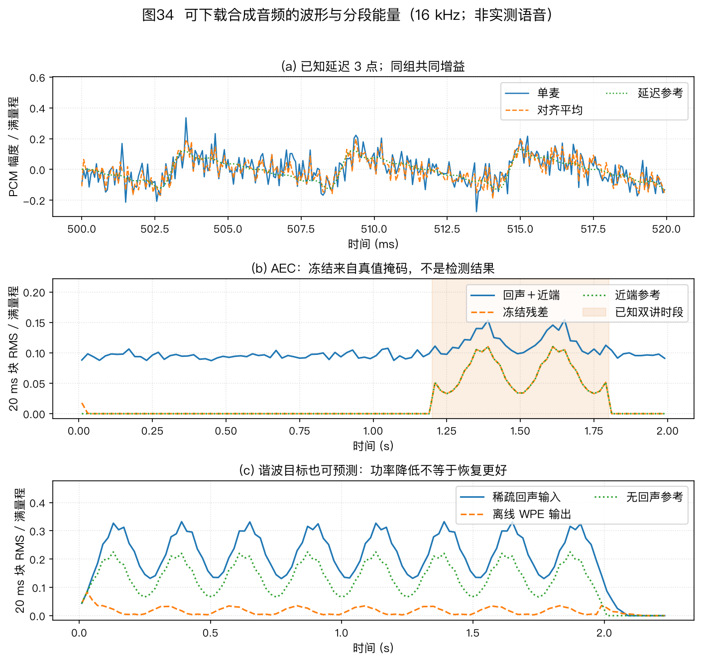

# 多麦克风阵列信号处理教程 · 导读与导航

本页是全套教程的入口，教程正文一共 14 个文件：本页导读＋11 章正文＋2 篇附录。另有 6 篇[源码研究手册](../codes/chapters/ch00/research/README.md)网页，展开实现与工业复现，不计入正文篇数。

11 章正文和 2 篇附录既可顺序阅读，也可按第 5 节的学习路径选读。每篇开头都列出上一篇、下一篇和首页链接。

全套教程配了 49 张图，图 18～20、图 26～32 和图 36～39 在第 6 章。插图分为几何示意、指定条件下的仿真和系统框图，阅读时要同时核对图注中的参数。

---

## 1. 这是一份什么样的教程

这份教程不要求预先学过麦克风阵列。推导会用到单位换算、三角函数、复数和矩阵；不熟悉这些工具时，可按需查[附录 A §12.3](12_appendix-symbols-math.md#sec-12-3)，再回到当前算例。读完后，各章的公式、边界和排错内容也可作为手册查阅。

文里配了 49 张图。第一次阅读时，可以先看图和算例，再回到公式核对条件与计算步骤。

教程从一个具体问题讲起：你站在 3 米外跟音箱说话，它怎样从噪声、混响和自身播放声中提取你的语音。如果另一个人同时讲话，或者你边说边走，系统还会遇到分离和追踪问题。这些任务需要的输入、输出和评价方式不同：

| 任务 | 在这个场景中解决什么 | 输出或必要信息 |
|---|---|---|
| 声源定位：估计波达方向（Direction of Arrival，DOA） | 判断讲话声相对阵列来自哪个方向 | 方向估计；不直接得到增强后的语音 |
| 波束形成（Beamforming） | 利用多通道空间差异定向拾音 | 加权合成的音频；需要方向或空间统计量 |
| 声学回声消除（Acoustic Echo Cancellation，AEC） | 减弱音箱自己播放后又被录入的声音 | 处理后的音频；需要与实际播放对应的参考 |
| 加权预测误差去混响（Weighted Prediction Error，WPE） | 减弱房间反射造成的晚期拖尾 | 延迟历史预测后的残差；需验证目标是否受损 |
| 语音分离（Speech Separation） | 区分同时讲话的不同声源 | 多路输出或指定目标的音频；需处理输出对应关系 |
| 声源追踪（Source Tracking） | 将含噪、间断的方向观测组织成连续轨迹 | 方向、运动状态及不确定度；需注明状态时刻 |

全书依次讨论阵列几何、上述处理方法、系统评测和场景选型。它们按任务条件启用，具体参考依赖见[§10.1](10_engineering-practice.md#sec-10-1)。

各章先建立直觉，再给出公式、符号、算例和适用边界。比较实验数字前，要先核对阵列几何、房间、数据集、实现和评测口径。条件不同的结果应先分别解释各自实验内的趋势；跨实验讨论差异时，还需对齐共同条件，并说明未对齐的因素。

---

## 2. 14 个文件一览

| 编号 | 文件 | 配图 | 难度 | 建议学习单元 |
|---|---|---|---|---|
| 00 | `00_overview.md`（本页） | 图34 | 入门 | 导航与复现入口 |
| 01 | `01_problem-definition.md` | 图1 | 入门 | 问题与评价口径 |
| 02 | `02_basics-signal-model.md` | 图2～图7，共 6 张 | 进阶 | 时延与流形；短时频谱与统计；波束度量，分三单元 |
| 03 | `03_array-geometry.md` | 图8～图10，共 3 张 | 进阶 | 几何可观测性；标定与稀疏阵 |
| 04 | `04_doa-estimation.md` | 图11～图14、图33，共 5 张 | 较难 | 时差与扫描；子空间；宽带与分辨率实验 |
| 05 | `05_beamforming.md` | 图15～图17，共 3 张 | 较难 | 约束解；稳健设计；掩码与工程接口 |
| 06 | `06_aec.md` | 图18～20、图26～32、图36～39，共 14 张，另引用图23 | 较难 | 参考与卷积；自适应更新；控制与评测；工业接口，分四单元 |
| 07 | `07_wpe-dereverberation.md` | 图21、图24，共 2 张 | 进阶 | 预测模型；求解与时间边界 |
| 08 | `08_speech-separation.md` | 图42～43，共 2 张，引用图23 | 进阶 | 盲分离；掩码/活动；深度方法与输出评测 |
| 09 | `09_source-tracking.md` | 本章专属图22、图44，另引用图23 | 进阶 | 状态递推；数据关联与时间边界 |
| 10 | `10_engineering-practice.md` | 图23、图25、图40、图45，共 4 张 | 进阶 | 模块依赖；设备时序；资源与评测，分三单元 |
| 11 | `11_selection-guide.md` | 图46、图47，共 2 张 | 入门 | 硬约束、非支配候选、评分口径和音频取舍 |
| 附录 A（文件 12） | `12_appendix-symbols-math.md` | 图48、图49，共 2 张 | 查阅 | 按符号、数学工具和反例查阅 |
| 附录 B（文件 13） | `13_appendix-guide.md` | 图35、图41 | 查阅 | 按学习路径、排错、综合练习查阅 |

每个单元都包括概念、推导和相应练习。完成判据是能说明变量与假设、独立复算一个例子、解释失败边界，再运行代码核对；阅读速度无法代表推导和实验需要的时间。因此不为全部精读给出统一小时数，长章可按表中单元分次完成。

时间有限时，可先读本页、01 和 11，明确问题与选型条件，再读 02 补齐信号模型。需要定位、波束、AEC、去混响或分离时，分别选读 04～08；工程实现配合第 10 章和附录 B 的排错部分，研究选题配合第 4、9 章和附录 B 的领域地图。

---

## 3. 各篇内容与学习目标

### [01 · 问题定义与双耳启示](01_problem-definition.md)

1 张图，入门。以智能音箱为例说明噪声、混响、干扰和麦克风自噪声，再区分定位、波束形成和追踪三项空间任务。

阵列收益分三类度量：各通道互不相关、噪声功率相同时看白噪声增益（White Noise Gain，WNG），弥散场看指向性指数（Directivity Index，DI），定向干扰看零陷深度。三种指标的声场假设不同，不能直接互换；具体定义见第 1 章。

人的听觉系统会利用双耳时间差、声级差和耳廓滤波线索。麦克风阵列也可利用通道间时延和幅相差，但需要显式的几何模型或实测阵列流形。细节见第 1 章。

学习目标：解释多麦克风相对单麦克风增加了哪些空间信息，复算理想白噪声模型下的阵列增益，并区分双耳线索与阵列观测。

### [02 · 基础：声音到达阵列时发生了什么](02_basics-signal-model.md)

6 张图，进阶。这章建立后续共用的时延、导向矢量、短时频谱和协方差等基础模型；各算法的专用概念仍在对应章节引入。建议完整读一遍，遇到基础符号时再回来查。

- 2.1 节讲时延：声音到达每个麦克风有先有后。采样率 16 kHz 时，一个采样间隔是 62.5 微秒；声速取 343 m/s 时，声音在这段时间传播约 2.1 厘米。亚采样时差可通过互相关峰插值或频域相位斜率拟合估计；多路录音还须同步采样或补偿相对时钟偏移。
- 2.2 节讲远场和近场：对中心对称孔径，常用相位曲率尺度是两倍孔径平方除以波长；其他几何要按参考点到最远阵元的距离推导。分界同时取决于孔径和频率。
- 2.3 节讲导向矢量：时域的移位变成频域的相位旋转。在等幅远场模型中，导向矢量描述各通道相对参考麦的相位组合，后面定位和波束形成都要用它；近场或含散射时，还需加入距离与幅度信息。
- 2.4 节讲房间混响：声音经反射形成拖尾，$T_{60}$ 描述能量衰减 60 dB 所需时间，直达混响比（Direct-to-Reverberant Ratio，DRR）描述直达声与混响的相对能量。
- 2.5 节讲短时傅里叶变换（Short-Time Fourier Transform，STFT）：把波形分帧后得到复数时频表示，再由多通道快拍估计协方差矩阵。
- 2.6 节讲主瓣宽度、旁瓣、DI、WNG，还介绍分辨率尺度、栅瓣条件和克拉美－罗下界（Cramér–Rao Lower Bound，CRLB）。

本章结束时，读者应能从时延推到相位和导向矢量，解释协方差矩阵各元素的含义，并查清后续章节使用的基础符号。

### [03 · 阵列几何形态](03_array-geometry.md)

3 张图，进阶。讲麦克风怎么摆，以及摆法决定什么上限。

双麦只有一条物理基线，正横、端射和中间角度是相对该基线的连续工作方向。随后比较线阵、圆阵、方阵、球阵、螺旋阵和分布式阵列。

共线阵列无法分辨绕阵列轴的方位，继续在同一直线上增加麦克风也不能消除这种几何模糊。端射附近的时延对角度变化不敏感，同样的时延误差会对应更大的角度误差。

本章归纳四条设计规律：孔径和波长的比值影响分辨率；圆阵在水平面各方向都能利用孔径；挡板会改变阵列流形；增加麦数能改善白噪声增益和统计稳定性，但收益取决于几何、频段和噪声场。

本书的网格化稀疏阵算例只占用密集参考网格中的部分候选位置，再把麦对位置差组织成差分协同阵；一般稀疏阵设计也可连续选址，不要求预设网格。例子中的 6 麦嵌套阵产生 23 个连续的有符号滞后；要把这些滞后用于子空间定位，还需构造虚拟协方差并做空间平滑或等价重构。

读者可以据此说明阵列形态怎样限制可观测方向、孔径和无混叠频带，并按覆盖范围、同步条件和安装空间筛选几何方案。

### [04 · 声源定位 DOA 估计](04_doa-estimation.md)

5 张图，较难。DOA 估计判断声音相对指定坐标系从哪个方向传来。本章算法种类多，建议先读时差与扫描，再读子空间与学习方法。

[§4.10 四麦分数采样时差](04_doa-estimation.md#sec-4-10)把 4 cm 阵列的几何时差、理想相量计算和四通道合成 WAV 放在同一练习中；它只验证指定模型，不替代真实房间的定位评测。

本章把方法分为四类：两阶段法（互相关估时差＋几何解算）、空间扫描、子空间法，以及稀疏与学习方法。

- 广义互相关相位变换（Generalized Cross-Correlation with Phase Transform，GCC-PHAT）从相位随频率的变化估计时延，混响会拖宽或扰乱相关峰；需要亚采样时差时，可对相关峰插值。

    图 13 用 16 kHz、64 ms 分析帧和每条件 150 次固定种子试验构造随机衰减尾。它用于说明固定尾能量时 $T_{60}$ 与 DRR 的联合作用，以及仿真参数口径可能改变趋势；该图不能当作“$T_{60}$ 越长性能越差”的单调证据，也不代表真实房间的通用正确率。

- 可控响应功率（Steered Response Power，SRP）在每个候选位置累加各麦对的相关响应，再寻找最大值。本书的理想相关峰手算中，真点得分 6.0，偏 1.8 m 的候选点得分 5.64，镜像方向候选点得分 2.08；这些不是录音中测得的相关峰。粗到细两级搜索可减少需要评估的网格点；实际耗时取决于搜索范围、网格间距、麦对数、实现和硬件。

- 几何解算包括 Chan 算法和泰勒迭代。几何精度稀释（Geometric Dilution of Precision，GDOP）描述几何摆位不好时误差怎样被放大。

- 扫描法包括 Bartlett 与 Capon（最小方差谱估计）。双麦例子比较 0° 与 30°：Bartlett 的两方向谱值比为 1.8，Capon 为 5.0，两个比值均为 0° 谱值除以 30° 谱值。这里的 30° 不是旁瓣位置，不能把这些比值称为旁瓣抑制比。

多重信号分类（Multiple Signal Classification，MUSIC）利用信号子空间与噪声子空间的正交关系寻找谱峰。相干信号会使源协方差秩下降，均匀线阵可在满足子阵条件时用空间平滑恢复可用秩。旋转不变子空间法（Estimation of Signal Parameters via Rotational Invariance Techniques，ESPRIT）利用阵列的平移结构直接解角度，不用逐格扫描。

深度神经网络（Deep Neural Network，DNN）方法可用带方向标签的多通道数据学习定位特征，效果取决于训练数据是否覆盖测试阵列、房间、噪声和声源数。

CRLB 用来分析指定观测模型下的方差下界；对已知波形的时延估计，有效带宽增大通常会增加 Fisher 信息，但具体幂次和系数取决于信噪比（Signal-to-Noise Ratio，SNR）、频谱和参数定义。

完成本章后，读者应能按阵列几何、源数、混响和计算预算比较四类定位方法，并解释互相关峰受多径影响、MUSIC 在相干源下失效的原因。

### [05 · 波束形成 Beamforming](05_beamforming.md)

3 张图，较难。波束形成对多通道信号加权求和。正文主线讨论在保持指定目标响应的约束下，降低某类噪声或干扰的输出功率；维纳滤波和广义特征值方法使用不同的优化目标，另作说明。各方法都给出相应的模型条件。

三类噪声需要不同模型：麦克风自身噪声用 WNG 评价，延迟求和是解析基线；弥散场用 DI 评价，可比较超指向设计；定向干扰则检查零陷和最小方差无失真响应（Minimum Variance Distortionless Response，MVDR）波束形成器的输出。

延迟求和波束形成器（Delay-and-Sum Beamformer，DSB）的权重是导向矢量除以麦克风数；在等幅远场、目标正确对齐和各麦独立同功率噪声模型下，线性 WNG 等于麦克风数。超指向在低频提高 DI 时可能显著降低 WNG。

两麦端射算例在间距为波长的 0.05 倍、三维各向同性弥散场条件下，得到约 −10.6 dB 的 WNG 与 6.0 dB 的 DI；间距减半时，该算例的 WNG 再降低约 6 dB。这一取舍不是任意几何与噪声场的保证。

MVDR 分四步推导。算例中，噪声协方差所含的定向干扰信息使 30° 处响应降至 −23.8 dB。线性约束最小方差（Linearly Constrained Minimum Variance，LCMV）加入多条约束，多通道维纳滤波（Multichannel Wiener Filter，MWF）权衡降噪与失真。

广义旁瓣对消器（Generalized Sidelobe Canceller，GSC）由固定波束、阻塞矩阵和自适应对消器组成；在约束与实现一致时，它可表示 LCMV 解。

后置滤波调整时频增益，球谐方法用于球阵和球面声场表示。DNN 方法包括掩码估计、掩码结合 MVDR 和直接端到端映射。

本章要求读者能计算 WNG 与 DI，说明 MVDR 怎样利用协方差中的空间信息抑制定向干扰，并比较 GSC 与 LCMV 的约束表达。

### [06 · 声学回声消除 AEC](06_aec.md)

14 张图（图18～20、图26～32、图36～39，另引用图23），较难。图 18、图 26～32 解释回声模型、收敛与工程条件，图 36 展示非线性残留；图 37～38 分别说明子带交叉项、比例更新、递归最小二乘（Recursive Least Squares，RLS）和卡尔曼的不同状态，图 39 拆开分区频域方法的预测和更新。

AEC 处理设备自己播放、又被自身麦克风收进来的声音。经典线性方法利用播放参考估计回声波形后相减；无法准确建模的残余可再由增益抑制处理。这两步的参考、输出取点与目标语音损伤需要分别验证。

归一化最小均方自适应滤波（Normalized Least Mean Squares，NLMS）给出基础更新式。分区块频域自适应滤波（Partitioned-Block Frequency-Domain Adaptive Filtering，PBFDAF）把长路径分区，按频点使用多个历史参考块更新；在第 6 章规定的同一分块、误差和归一化口径下，它就是频域多抽头 NLMS 的具体实现，不是与之并列的新算法。

子带方法、改进比例归一化最小均方（Improved Proportionate Normalized Least Mean Squares，IPNLMS）和频域卡尔曼滤波（Frequency-Domain Kalman Filter，FDKF）分别改变信号表示、系数分配或状态估计。扬声器非线性会限制线性 AEC，需根据失真来源考虑非线性模型或神经网络。

双讲检测（Double-Talk Detection，DTD）用于控制近端和远端同时活动时的自适应更新。

AEC 与其他模块的参考关系见 §10.1 和图 23。评测要同时考虑远端单讲时的回声返回损失增强（Echo Return Loss Enhancement，ERLE）、双讲稳定性、近端语音损伤和主观听测；ERLE 高并不能证明近端语音无损。WebRTC AEC3 可作为公开实现参考。

读者应能确定回声参考取点，解释 AEC 与波束顺序的条件，并为线性路径、非线性失真和双讲分别选择验证方法。

### [07 · 去混响 WPE](07_wpe-dereverberation.md)

2 张图（图21、图24），进阶。讨论怎样利用跨帧预测估计并减弱晚期混响。

WPE 用延迟历史帧预测晚期混响并相减。保护延迟降低误预测当前希望保留的直达声和早期反射的风险，不能保证预测项只含晚期混响。

正文算例在指定条件下展示混响能量变化；预测延迟和阶数要按帧长、混响与语音损伤验证。多人重叠语音在第 8 章讨论，模块启用条件和参考关系见 §10.1。

本章给出保护延迟 $\Delta$ 和预测阶数的选择依据，比较单通道与多通道 WPE，并说明已知路径逆滤波、倒谱和谱方差方法各自依赖的假设。

### [08 · 语音分离](08_speech-separation.md)

2 张专属图（图42、图43，另引用链路总图23），进阶。讨论重叠语音的分离方法，以及时频掩码怎样连接分离、协方差估计和波束形成。

三条路线包括经典盲源分离、导引源分离（Guided Source Separation，GSS）和深度分离。盲分离利用独立性及谱或空间统计模型；GSS 用说话人活动标注约束空间聚类，再以掩码估计协方差并计算目标波束；深度方法学习掩码、波形表示或查询条件与输出之间的映射。

[§8.2](08_speech-separation.md#sec-8-2) 与图 23 说明处理顺序；[§8.3](08_speech-separation.md#sec-8-3)、[§8.4](08_speech-separation.md#sec-8-4) 和 [§8.6](08_speech-separation.md#sec-8-6) 分别展开三条路线。具体方法名与缩写可查[附录 A §12.2](12_appendix-symbols-math.md#sec-12-2)，实际模块启用条件见 §10.1。

读者应能按源数、秩和统计假设区分各模型，复算独立向量分析的逐行投影、独立低秩模型的谱更新和多通道非负矩阵分解的源图像重构，解释活动信息如何影响 GSS。

23 道代码题进一步区分分离、尺度恢复和跨块身份；图 43 及四个合成音频演示仅用重叠信号作排列关联，静音时明确保留不确定性。

### [09 · 声源追踪 Source Tracking](09_source-tracking.md)

2 张本章新图（图 22、图 44），另引用图 23；进阶。讨论方向观测随目标运动、漏检和野点变化时，怎样估计连续轨迹。状态可以包括角度、角速度和角加速度。

声音观测有四类困难：

- 语音时断时续；
- 定位结果含有野点；
- 说话人数会变化；
- 角度观测与状态之间可能是非线性关系。

卡尔曼滤波（Kalman Filter，KF）由状态预测、观测更新和协方差递推组成，观测与预测的权重由噪声模型决定，不是固定比例。粒子滤波（Particle Filter，PF）用带权粒子近似后验分布，并通过重采样缓解权重退化。交互多模型（Interacting Multiple Model，IMM）用于在预设运动模式之间切换；单个目标也可以使用它。

本章有 19 道代码练习；图 44 从实际导出的双麦脉冲编码调制（Pulse-Code Modulation，PCM）音频计算时差观测，再进行缺测门控和追踪。两份合成音频采用独立清单，不是真实说话人录音。

多人追踪还需处理观测与轨迹的关联、目标数和身份。概率假设密度（Probability Hypothesis Density，PHD）传播目标强度，积分表示期望人数；标记多伯努利（Labeled Multi-Bernoulli，LMB）保留目标标签；检测前追踪（Track-Before-Detect，TBD）利用尚未越过检测阈值的谱证据。它们解决的子问题不同，不能仅按“多人算法”互相替换。

§9.4 讨论定位与波束之间的反馈；更新限幅、静默保持和重置条件都应由目标运动与帧率确定。

完成本章后，读者应能说明追踪器在定位与波束之间传递什么状态，比较单目标与多目标方法，并设置方向更新、静默保持和重捕获条件。

### [10 · 工程实现、评测与产业实践](10_engineering-practice.md)

本章有四张图：图 23 说明参考依赖，图 25 展示延迟拆分示意，图 40 展示采样时钟漂移逐渐改变双麦平均的幅度，图 45 展示分块自动增益控制（Automatic Gain Control，AGC）的实际 PCM 与状态。

图 23 不表示每个项目都要启用全部模块。第 10 章按启用条件说明 AEC、WPE、定位、波束、噪声抑制与后端的取点关系，并按前瞻、缓冲、计算、调度和解码核算实际延迟关键路径。

硬件部分区分数字样本格式、模拟动态范围、初始时差和采样率偏移（Sampling Rate Offset，SRO）。资源预算分开计算每秒乘加数、每秒指令数、处理时间与新增音频时长之比、峰值内存和功耗；续航用电池能量（Wh）除以整机平均功率计算。各口径的定义见[§10.4](10_engineering-practice.md#sec-10-4)。

评测部分分别检查波形保真度、语音可懂度、感知质量、识别错误、追踪集合误差和主观听感。指标名称、缩写与适用条件见[§10.5](10_engineering-practice.md#sec-10-5)；不同任务的指标不能互相代替。

本章结束时，读者应能编制延迟、同步和标定预算，选择与任务相符的评测指标，并列出部署时还需验证的资源与故障状态。

### [11 · 总结与选型指南](11_selection-guide.md)

入门。11.1 从输出任务、覆盖区域、频带、干扰、目标运动和硬件边界六方面定义问题；11.2 给出不同模块的启用与替换条件；11.3 说明几何和算法怎样共同决定性能。

11.4 用四类场景演示怎样从条件推导候选方案；11.5 把方案写成可验证规格；11.6 配有十九道练习，均有对应的可运行代码。图46把硬约束与候选权衡分开，图47从同一输入的实际PCM检验滤波器的目标保持与噪声抑制取舍。

本章把任务和约束转成候选方案，给出 AEC、WPE 和分离的启用条件，并示范怎样把几何、WNG/DI 权衡和资源预算写成可测的验收规格。

### [12 · 附录 A：符号、术语、数学](12_appendix-symbols-math.md)

查阅用。12.1 节是符号表。12.2 节是术语词典，按信号与数学基础、房间声学、自适应滤波与分离、波束形成与阵列度量、定位与追踪、系统与硬件分组。12.3 节介绍复数、分贝、卷积和相关、期望和协方差、最小二乘与特征分解；12.4 节用十三道代码题复算卷积、复二阶矩、秩亏最小二乘，并区分频谱相位加权与空间噪声白化。

遇到未定义符号、术语或数学步骤时，可按主题查阅，无需顺序通读。

### [13 · 附录 B：路径、地图、前沿、排错、练习、复现](13_appendix-guide.md)

查阅加动手。13.1 节是学习路径。13.2 节是教材、会议、期刊、挑战赛与历史地图。13.3 节介绍八个研究方向与泛化失配。13.4 节是排错指南，13.5 节是公式速查卡，13.6 节有 17 道综合书面题及 E13-01～10 稳定编号代码题，13.7 节说明怎样复现 49 张图；E13-02 配合图41检查插值失真，E13-03～10 复算房间结果、相位与来源证据。

需要查学习资料、研究方向、排错方法、练习或复现步骤时，可直接进入对应小节。

---

## 4. 阅读顺序

1. 先读本页，再读第 1 章，建立问题意识。

2. 读第 2 章，补齐全书共用的信号模型。符号不懂时查附录 A。

3. 几何线从第 3 章开始，了解阵列形态怎样限制观测信息，再用 §11.1～§11.3 形成候选几何。

4. 空间处理线依次关联第 4 章的定位、第 9 章的追踪和第 5 章的波束。第 2、5、8 章介绍的时频掩码可用于估计目标或噪声协方差，再交给 MVDR 或分离模块。

5. 干扰处理线包括第 6 章的回声消除、第 7 章的去混响和第 8 章的语音分离；启用条件和参考依赖见 §10.1 与图 23。

6. 工程线用第 10 章核对链路、硬件、评测和芯片，再到第 11 章形成方案。

附录 A（文件 12）汇总符号、术语和数学。附录 B（文件 13）提供学习路径、领域地图、前沿、排错、练习和复现说明。

完成第 11 章后，工程读者可到 §10.10 制定联调与验收计划，遇到问题查 §13.4。研究读者可读 §13.3，再做 §13.6 的第 16、17 题，分别练习房间仿真和论文系统复核。两篇附录均可按需查阅。

---

## 5. 三条阅读路径

### 路径 A：零基础入门（能复现演示）

1. 先读本页和第 1 章，再读 [§11.1～§11.3](11_selection-guide.md#sec-11-1)，了解选型需要哪些输入条件。

2. 第 2 章按三个学习单元阅读。第一次可先看图 2～图 7 和变量解释，再返回推导；需要补数学时查附录 A。先做 [E01-01](01_problem-definition.md#sec-u-13bdf48a99)，检查“麦数增加”怎样依赖噪声相关性，再做 [E01-02](01_problem-definition.md#sec-u-f277de1aa7)，区分音量变小与信噪比改善。

3. 第 3 章读表格与算例。第 4 章读 [§4.2](04_doa-estimation.md#sec-4-2)、[§4.3](04_doa-estimation.md#sec-4-3)，对照图 12、图 14；用 [E04-01](04_doa-estimation.md#sec-u-10983698db) 核对交换通道后的时差符号。第 5 章读 [§5.1](05_beamforming.md#sec-5-1)、[§5.2](05_beamforming.md#sec-5-2)、[§5.4](05_beamforming.md#sec-5-4)，先复算双麦目标响应，再做 [E05-02](05_beamforming.md#sec-u-fd25e81d6c) 检查加载的收益与代价，对照图 16。

4. 回声处理从 [§6.1](06_aec.md#sec-6-1) 的参考、卷积和更新开始，再读 [§6.6](06_aec.md#sec-6-6) 的阵列顺序与 [§6.8](06_aec.md#sec-6-8) 的公开实现，对照图 18。

    去混响读 [§7.1](07_wpe-dereverberation.md#sec-7-1) 和 [§7.8](07_wpe-dereverberation.md#sec-7-8)，核对保护延迟、抽头数和分析窗，对照图 21、图 24。分离读 [§8.1](08_speech-separation.md#sec-8-1) 与 [§8.4](08_speech-separation.md#sec-8-4)，了解输出任务和活动导引。追踪读 [§9.2](09_source-tracking.md#sec-9-2)，走通一次预测与观测更新。

5. 阅读 [§10.1](10_engineering-practice.md#sec-10-1)、[§10.4](10_engineering-practice.md#sec-10-4) 和 [§10.6](10_engineering-practice.md#sec-10-6)，了解参考链路、资源口径与房间仿真。再做附录 B 的第 2、3、5、7、10、11、14 题，并用 [§13.4](13_appendix-guide.md#sec-13-4) 检查常见问题。

6. 完成判据：运行第 8 节的随仓教学基线，能独立复算麦间时差和波束目标响应，说明采样率、导向方向与模型边界。有多通道硬件时，可进一步实测完整方向响应；合成演示通过不能替代这一步。

### 路径 B：工程实现（形成可验证的前端方案）

1. 用 [§11.1～§11.5](11_selection-guide.md#sec-11-1) 写清任务、几何、场景、模块启用条件和验收指标。

    第 5 章重点读 MVDR、稳健化与后置滤波；第 6 章核对回声参考、双讲和与波束的顺序条件；第 7 章根据目标房间验证 WPE；第 8 章在确有重叠语音需求时选择分离方法。更换阵列前阅读 [§13.3](13_appendix-guide.md#sec-13-3) 的泛化专栏。

2. 通读第 10 章，按关键路径核算延迟，区分多设备同步与 SRO，统一评测、算力和功耗口径。再查 [§13.4](13_appendix-guide.md#sec-13-4)，完成 [§13.6](13_appendix-guide.md#sec-13-6) 的第 7、8、9、11、14、15 题。

3. 完成判据：输出延迟、同步、标定三张预算表。对照 WebRTC AEC3 检查回声消除，分开评价远端单讲残余、双讲稳定性、近端损伤与主观质量；资源和时序仍须在目标设备测量。

### 路径 C：研究复现与公开评测（长期）

1. 定位研究先区分“观测信息不足”和“估计器没有利用好信息”。读第 2 章的 CRLB、第 3 章的几何可观测性，再读 [§4.6](04_doa-estimation.md#sec-4-6)、[§4.7](04_doa-estimation.md#sec-4-7)，比较空间平滑、宽带处理与学习方法；记录源数、快拍、相干性和阵列失配，不能只比较谱峰高度。

2. 拾音与回声研究先确定约束对象和递推状态。第 5 章比较目标相对传递函数约束、球谐表示、掩码波束与端到端方法；第 6 章比较频域卡尔曼和神经卡尔曼改变了哪些变量；第 7 章核对在线 WPE 的历史、更新时刻与未来等待。各自先保留可复算的解析基线，再增加学习模块。

3. 重叠语音与追踪研究先确定输出音轨和身份如何对应。第 8 章比较盲分离、GSS、掩码协方差与连续分离；第 9 章区分集合位置、人数和标签误差。扩散先验用于盲分离的研究另见 [§13.3](13_appendix-guide.md#sec-13-3)，不要把它当作第 8 章已经运行的教学基线。

4. 公开评测先按任务选数据。[CHiME-8 Task 1](https://www.chimechallenge.org/challenges/chime8/task1/) 关注多设备远场会议转写与说话人归属；[LibriCSS](https://github.com/chenzhuo1011/libri_css) 用语音录音回放形成连续语音分离与识别评测录音；[STARSS23 v1.1.0](https://zenodo.org/records/7880637) 提供空间声事件检测与定位数据。上述任务与版本入口核实于 2026-09-30。它们的标签、通道与评分目标不同，不能把同一个“提升”数字横向排名。按[§10.5](10_engineering-practice.md#sec-10-5) 和[§10.6](10_engineering-practice.md#sec-10-6) 固定参考、划分和评分协议。

5. 用 [§13.2](13_appendix-guide.md#sec-13-2) 查领域资料，再读 §13.3 中与课题相关的方向和泛化专栏。做 [§13.6](13_appendix-guide.md#sec-13-6) 的第 6、8、12、13、16、17 题，分别覆盖定位分辨、稳健波束、分离、追踪、房间仿真和论文系统复核。阅读 CHiME-8 系统报告时，可把实际前端结构与图 23 对照。

6. 完成判据：在一个公开数据集上固定阵列、训练/测试划分和指标，分别实现一个解析基线与一个数据驱动基线，记录模型版本、输入特征和推理资源。将源码获取、依赖构建、示例运行与数值对照分开记录，失败或缺失的步骤也应保留。

---

## 6. 插图地图：49 张图在哪篇

| 图 | 文件 | 所在文档 | 类型 | 内容 |
|---|---|---|---|---|
| 图1 | fig01_binaural | 01 | 示意＋曲线 | 双耳时间差和声级差，Rayleigh 双重理论 |
| 图2 | fig02_dsin_geometry | 02 | 示意 | 时延几何直角三角形 |
| 图3 | fig03_near_far_field | 02 | 示意 | 球面波和平面波，远场判据 |
| 图4 | fig04_delay_phase | 02 | 示意＋曲线 | 时延等于相位旋转，给互相关法铺垫 |
| 图5 | fig05_room_acoustics | 02 | 示意＋曲线 | 房间脉冲响应三段、T60、直达临界距离、直达混响比 |
| 图6 | fig06_stft_cov | 02 | 仿真＋矩阵 | 分帧语谱加协方差热图加特征谱 |
| 图7 | fig07_beampattern_anatomy | 02 | 仿真教学 | 主瓣、旁瓣、零陷、主瓣宽度、栅瓣 |
| 图8 | fig08_geometries | 03 | 布局示意 | 线阵、圆阵、球阵、螺旋阵、分布式 |
| 图9 | fig09_tradeoffs | 03 | 公式计算，分两幅看 | （a）独立同方差白噪声下的理想 WNG 为 $10\log_{10}M$；（b）输入通道数 $M$、无序麦对数 $M(M-1)/2$ 和完整协方差元素数 $M^2$，不等同于运行时间、功耗或价格 |
| 图10 | fig10_sparse_array | 03 | 集合图解 | 所有有序麦对形成有符号差分位置；图中 6 麦嵌套阵得到 23 个连续有符号滞后 |
| 图11 | fig11_doa_spectrum | 04 | 仿真 | 设定每阵元输入 SNR 20 dB、400 快拍、MUSIC 预先指定真实源数 $K=2$ 的三种谱形；Capon 使用相对对角加载 $\eta=10^{-6}$；不检验分辨极限或源数自动估计 |
| 图12 | fig12_gcc_phat | 04 | 示意＋仿真 | 真值约 0.933 格；固定噪声样例经 16 倍时延网格插值得 58.59375 μs，即 0.9375 格、约 30.16° |
| 图13 | fig13_gcc_reverb | 04 | 参数口径反例 | 在 16 kHz、64 ms 分析帧、无传感器噪声的随机衰减尾模型中，每点 150 次固定种子试验；正确率带 95% Wilson 区间，峰对比度带四分位区间；用于检查固定尾能量时 $T_{60}$ 与 DRR 的联合作用，不支持单调退化结论 |
| 图14 | fig14_srp_grid | 04 | 仿真＋几何 | 左侧 8×6 点阵只示意几何，右侧 90×68 网格才计算麦对响应与峰值；非退化距离差轨迹形成双曲线 |
| 图15 | fig15_wng_di | 05 | 指定模型仿真 | 半径 4 cm 的 6 元圆阵；超指向使用相对对角加载 $10^{-6}$，两种方法均保持目标方向单位响应 |
| 图16 | fig16_beampattern | 05 | 指定模型仿真 | 三条曲线保持目标方向单位响应；DSB/MVDR 用 $d=\lambda/2$，超指向用 $d=0.2\lambda$，MVDR 干扰方向为 20°；条件不同，不可横向按曲线高低排名 |
| 图17 | fig17_gsc | 05 | 系统框图 | 固定波束、阻塞矩阵、对消器三路 |
| 图18 | fig18_aec | 06 | 框图＋本书仿真 | 固定随机种子样例在 $0.45<t<0.8$ s 窗口的 NLMS ERLE 均值约 29.23 dB（图中取整约 29 dB）；双讲区间冻结更新 |
| 图19 | fig19_aec_landscape | 06 | 仿真＋方法分类 | （a）指定未建模非线性条件下的线性 AEC 性能平台；（b）按模型假设和处理对象区分四类方法，横向位置不表示年代或性能排名 |
| 图20 | fig20_aec_pipeline | 06 | 系统框图 | 经典链路与线性、神经网络混合链路对比 |
| 图21 | fig21_wpe | 07 | 仿真 | 共用谱幅参考值比较干净、混响和 WPE 输出；统计量按 10 ms 直达延迟对齐干净参考，再报告静音帧能量占比与活跃帧复增益对齐谱域归一化均方误差 |
| 图22 | fig22_tracking | 09 | 仿真 | 单目标 PF 轨迹及有效粒子数；两目标人工 PHD 强度示意，非 PHD 递推 |
| 图23 | fig23_pipeline | 10；06、08、09 引用 | 系统框图 | 播放参考与主链、方向/GSS/分离三支路；R、S、M、D、C 的取点与条件控制 |
| 图24 | fig24_wpe_frames | 07 | 示意 | WPE 帧结构：只用过去历史预测当前帧，保护延迟 Δ 的作用 |
| 图25 | fig25_latency_budget | 10 | 瀑布条 | 一组旧设计的延迟拆分示意；实际预算按 §10.1 的关键路径重新测量 |
| 图26 | fig26_aec_problem | 06 | 示意 | 回声怎么形成：房间冲激响应、卷积拖尾、麦克风三者相加 |
| 图27 | fig27_aec_concept | 06 | 示意 | 估计回声路径并相减，DTD 控制自适应更新 |
| 图28 | fig28_aec_nlms | 06 | 仿真 | NLMS 自适应过程：滤波器长成回声路径，步长取舍 |
| 图29 | fig29_aec_erle_freeze | 06 | 仿真 | 收敛与冻结：本图在已知双讲区间冻结，双讲段不以混合残差直接计算回声分量 ERLE；其他控制策略需另验证 |
| 图30 | fig30_aec_delay_dtd | 06 | 仿真 | 延迟对齐与双讲：不对齐掉几十分贝，对齐是第一要务 |
| 图31 | fig31_aec_nonlinear | 06 | 仿真 | 指定仿真条件下线性路径与 tanh 非线性路径的性能平台 |
| 图32 | fig32_aec_hybrid_select | 06 | 框图＋示意 | 线性与神经网络混合处理及条件化选型 |
| 图33 | fig33_gcc_two_ways | 04 | 对照 | 两条 128 点输入用 256 点零填充快速傅里叶变换求互谱，再逆变换，与时域滑动乘加得到同一条线性互相关曲线、同一个峰；PHAT 加权不在本图范围内 |
| 图34 | fig34_audio_examples | 00 | 合成音频对照 | 从实际 PCM 文件读取对齐平均、双讲冻结和 WPE 的波形/能量，不能代替实录语音质量评分 |
| 图35 | fig35_audio_counterexamples | 13 | 合成反例 | 相关噪声、极性错误、病态求逆的 PCM 对照；每组共同增益、无评分时延或增益拟合 |
| 图36 | fig36_nonlinear_echo | 06 | 非线性回声反例 | 500 Hz 输入经三次模型产生 1500 Hz 残留；同增益波形及 PCM 实测单边幅度 |
| 图37 | fig37_aec_subband | 06 | 精确代数示例 | 两带 Haar 表示下，一采样回声路径的跨带项；仅保留对角项会遗漏交叉项，不是自适应算法性能图 |
| 图38 | fig38_aec_four_methods | 06 | 手算状态图 | IPNLMS 抽头增益、RLS 逆相关矩阵及卡尔曼增益的指定小规模状态；不表示方法间性能排名 |
| 图39 | fig39_aec_pbfdaf_flow | 06 | 算法流程图 | 播放参考、声学路径、分区频域预测、有效区残差、冻结控制及梯度合法区投影 |
| 图40 | fig40_clock_drift | 10 | 解析与PCM对照 | 两时钟相差100 ppm；同索引时间差、单频平均包络与双音功率；理想共同时钟目标不是已测补偿器 |
| 图41 | fig41_interpolation_error | 13 | 解析曲线与PCM测量 | 固定分数延迟的幅度失真；两次半采样与纯一采样延迟的区别 |
| 图42 | fig42_gss_flow | 08 | 系统框图 | 方向单位化、活动约束、原始复谱的空间协方差及目标波束的独立依赖 |
| 图43 | fig43_css_overlap | 08 | 受控合成与PCM测量 | 两槽跨块交换、仅用重叠区的相关匹配及输出频率幅度；不是真实盲分离 |
| 图44 | fig44_tracking_audio | 09 | 连续运动合成 PCM 实算 | 同一音频的广义互相关方位、缺测门控、KF 与逐帧方差；状态时刻和整帧可用时刻分开 |
| 图45 | fig45_agc_blocks | 10 | 合成 PCM 与块状态 | 四路共同增益音频的 10 ms 均方根，以及 10/100 ms 块在整块到达后的增益；不是设备性能图 |
| 图46 | fig46_selection_pareto | 11 | 构造候选与权重曲线 | 四候选先筛延迟/功率硬界，再区分被支配者和A/B偏好权衡；数字不是设备实测 |
| 图47 | fig47_selection_audio_tradeoff | 11 | 合成 PCM 读回 | 同一三音混合输入经过 3/9 抽头有限冲激响应滤波器后，从 PCM 重测 500/1500 Hz 目标保持、3500 Hz 干扰衰减与对齐误差；不代表自然语音质量 |
| 图48 | fig48_fft_frequencies | 12 | 频点约定图 | 8 点离散傅里叶变换的完整有符号频率与实信号单边频率；Nyquist 格点只有一个 |
| 图49 | fig49_fft_block_boundary | 12 | 合成 PCM 读回 | 同一脉冲输入、同一增益下的线性分块卷积与故意错误的逐块循环卷积；标明 512 点块边界与绕回位置 |

示意图用于解释几何关系，曲线展示指定条件下的可复现结果，框图说明模块之间的信号与控制关系。

---

## 7. 十处跨文档联系

1. 定位连着追踪连着波束：04 找方向，09 跟轨迹，05 指波束，见 9.4 节和图 23。
2. 前端模块的参考依赖与启用条件见 §10.1 和图 23。
3. 导向矢量：02 的 2.3 节定义，04、05、08、09 都要用。
4. 协方差矩阵：02 的 2.5 节定义，04、05、06 都要用。对角加载可改善条件数，但不能代替足够的独立观测。
5. WNG 和 DI 的权衡：02 的 2.6 节提出，05 详细计算，11 用于条件化选型。
6. 混响这条线：02 的 2.4 节讲混响是什么，04、05、06、07 讲各自怎么对付它。
7. 掩码估计：02 讲语音稀疏性，05 和 08 用掩码估计目标或噪声协方差，并把它们交给波束形成或导引分离。
8. 回声减法与谱增益：第 6 章 [§6.1](06_aec.md#sec-6-1) 讲经典 AEC 怎样利用播放参考估计回声波形并相减；第 5 章 [§5.7](05_beamforming.md#sec-5-7) 讲仅估计干扰功率的实数后置增益怎样缩放谱幅度。复掩码等方法还可改变相位，见 [§8.6](08_speech-separation.md#sec-8-6)；不能把减法与乘法概括成所有增强方法的二选一规则。
9. 几何上限：03 讲摆位定的上限，04、09、10 都要回来看它。
10. 标定和同步：10 的 10.2 节讲标定同步，13 的附录 B 13.4 节讲排错时怎么查它。

---

## 8. 动手复现

[`codes/`](../codes/chapters/README.md) 提供与公式对应的小规模教学基线，`scripts/` 生成书中的图。先用基线检查时延、矩阵形状、约束残差和边界输入，再复现正文的完整示意或仿真条件。各方法实际覆盖哪些步骤，见[算法覆盖表](../codes/chapters/ch00/COVERAGE.md)；外部实现身份、固定版本和许可边界见[第三方记录](../codes/chapters/ch00/THIRD_PARTY.md)。

从网站直接进入本页时，先按[README 的快速开始](../README.md#快速开始)建立虚拟环境并安装 `requirements.txt` 中的固定依赖。以下命令都在仓库根目录执行。Windows 将 `.venv/bin/python` 换成 `.venv\Scripts\python`；已有环境的读者可直接运行。

```bash
.venv/bin/python codes/chapters/ch00/cross_chapter/ch02_05_baselines.py
.venv/bin/python codes/chapters/ch00/cross_chapter/ch06_09_baselines.py
.venv/bin/python codes/chapters/ch10/examples/ch10_engineering_baselines.py
```

三组程序只打印结果，不生成音频。第一次运行先核对以下输出，再返回对应章节手算；程序正常结束只是第一步，结果的单位与成立条件还需核对。

| 输出 | 怎样核对 | 支持什么判断 |
|---|---|---|
| `STFT round-trip maximum error` | 在本例浮点精度下接近零，本机约为 $8.9\times10^{-16}$；末位可随环境变化 | 指定窗、帧移和长度下的分析/重建一致，不能证明降噪有效 |
| `GCC-PHAT tau12 (samples): 3.0` | 第一个输入的脉冲位于第 23 点，第二个位于第 20 点；$3/16000$ s = 187.5 μs | 第一个输入晚 3 点，检查输入次序和时差正号；换通道后符号应相反 |
| `DSB target response`、`MVDR target response` | 复数结果接近 1，虚部接近舍入误差；用共轭内积 $\vec w^H\vec a$ 独立核对 | 指定导向下单位目标响应成立，不能保证失配或其他方向的效果 |
| `matched-noiseless ERLE` | 回声由同一三抽头路径合成，没有近端声和噪声；只看是否收敛到该路径 | 极高值属于算术收敛检查，不能当作设备回声消除性能 |
| 工程例子的 `Schedule` | 输入处理时间为 6、7、18、18、4 ms，新增帧周期为 10 ms | 用构造的超期和排队解释实时预算，不是处理器实测速率 |

随后运行代码回归，检查正常、退化和错误输入。需要排查某个章节时，可先按[代码地图](../codes/chapters/README.md)选择对应入口和测试。

```bash
.venv/bin/python -m unittest discover -s tests -p 'test_codes*.py' -v
```

要复现生成过程时，再按[构建说明](../scripts/README.md)生成音频、重画相关图并核验。附录 B 的 [§13.7](13_appendix-guide.md#sec-13-7)列出 49 张图的复现入口；房间题重生需固定版本的独立环境和新输出目录。图有问题时修改绘图源，音频有问题时修改生成源。

另有 234 道带答案的[章节代码练习与音频实验](../codes/chapters/ch00/research/05_exercises_and_audio.md)，从第 1 章到附录 B 使用 E01-01 等稳定编号。第 6 章 E06-07～E06-20 包含算法边界手算与子带、IPNLMS、RLS、Kalman 的小规模复算；附录 B 的 E13-03～10 复算房间结果、相位与来源证据。每道题对应输入、执行代码和可核查结果；附录 B 的 1～17 题另用一套编号。

音频按生成模型和证据用途选择，以下各行独立管理。试听前先调低播放音量；网页控件默认不自动播放，载入文件和客观读回检查不等于人工听测。

| 资产与清单 | WAV 数量 | 先看什么 |
|---|---|---|
| [主合成清单](../codes/chapters/ch00/audio/MANIFEST.json) | 27 组、109 个 | 对齐与平均、AEC/WPE、已知矩阵解混及工程反例；完整组目录见音频手册 |
| [双耳时间差与声级差](../codes/chapters/ch01/binaural_audio/MANIFEST.json) | 5 个 | 左右通道时间差、幅度差及线索冲突；固定增益、没有头部散射或个体 HRTF |
| [GSS 教学链](../codes/chapters/ch08/gss_audio/MANIFEST.json) | 5 个 | 活动约束、共同增益与中间状态；不是已运行官方 GPU 整链 |
| [自由场移动声源](../codes/chapters/ch09/moving_audio/MANIFEST.json) | 3 个 | 连续传播时延、距离衰减与轨迹真值 |
| [PCM 观测到追踪](../codes/chapters/ch09/tracking_audio/MANIFEST.json) | 2 个 | 从导出后重读的音频计算时差、门控与逐帧状态 |
| [六位置房间题](../codes/chapters/appendix_b/room_audio/MANIFEST.json) | 18 个 | 白噪声源、仅直达与完整房间响应；结合独立数值报告 |
| [DEMAND 真实摘录与派生](../codes/chapters/ch02/real_audio/MANIFEST.json) | 4 个 | 环境录音的通道相关项；没有干净语音或位置真值 |

主清单按章保存，每组使用共同导出增益。它包括空间处理与极性/相关噪声反例，回声和去混响的参考、更新及损伤例子，以及时钟、插值、断流、AGC、分块卷积和 FIR 选型实验。五套独立合成资产及真实录音均不计入主 109 个样本，生成条件和评分参考不能互相替代。

已有随仓样本可先只读核对，无需先重写文件：

```bash
.venv/bin/python codes/chapters/ch00/examples/generate_audio_samples.py --check
.venv/bin/python codes/chapters/ch02/examples/prepare_real_recordings.py --check
```

三组反例见附录 B 图 35，非线性残留见第 6 章图 36。图 37 解释两带子带模型的交叉项；图 38 分别展示 IPNLMS、RLS 和卡尔曼滤波的受控状态变化，三幅子图不构成性能排名。图 39 展示分区块频域自适应滤波（PBFDAF）如何用播放参考的历史块预测回声、计算残差并更新滤波器。

对应的 AEC 合成音频在研究手册第 15～16 节；谱减试听与前奏数字在第 18 节。音频可用于听辨指定合成条件下的差别，图 39 则用于核对 PBFDAF 的信号与更新路径。

真实录音来自 [DEMAND v1.0 官方记录](https://zenodo.org/records/1227121)。本书保留 NRIVER 河流场景前 10 s 的同步 16 通道摘录，并生成单麦、双麦平均和 16 麦平均三个派生文件。数据采用 CC BY-SA 3.0；摘录区间、通道次序和处理改动见[数据清单](../codes/chapters/ch02/real_audio/MANIFEST.json)与[署名及修改记录](../codes/chapters/ch02/real_audio/ATTRIBUTION.txt)，来源和许可于 2026-09-30 复核。

这个真实录音实验检验通道间的相关项，不提供干净语音参考或语音增强分数。它与本书的数学合成信号用途不同。



图 34 直接读取已导出的 PCM：**(a)** 在 500～520 ms 对比晚到 3 个采样的参考、单麦与对齐平均；**(b)** 用 20 ms 块的均方根（Root Mean Square，RMS）标出 1.2～1.8 s 的已知双讲冻结；**(c)** 对比含 40 ms、80 ms 副本的输入、离线 WPE 和无回声参考。三组均为 16 kHz 合成信号，每组共用导出增益，不作单文件峰值归一化。

图中的波形接近、能量降低和主观听感是不同证据。谐波目标本身可预测，WPE 也可能损伤它；已知冻结掩码不代表实现了双讲检测。样本不能用于报告真实语音平均意见分（Mean Opinion Score，MOS）或产品性能。

这些 NumPy/标准库程序用于复算。进一步阅读[源码研究手册](../codes/chapters/ch00/research/README.md)：

- [空间处理与追踪](../codes/chapters/ch00/research/01_spatial_and_tracking.md)展开宽带定位、球谐编码、工业声源成像和数据关联；
- [AEC、WPE 与语音分离](../codes/chapters/ch00/research/02_aec_wpe_separation.md)展开自适应控制、跨帧状态、盲分离和神经系统；
- [工业部署与评测](../codes/chapters/ch00/research/03_industrial_deployment.md)展开设备接口、重采样、固件、推理运行时和官方评分器。

官方 Git 源码按完整提交固定，见[Git 锁表](../codes/chapters/ch00/SOURCES.lock.json)；发布归档按文件摘要固定，见[归档锁表](../codes/chapters/ch00/ARCHIVE_SOURCES.lock.json)。可按需获取到 Git 忽略的 `codes/chapters/ch00/upstream/_downloads/`；实际内容随本地环境而异，不随本书 Git 提交。

[Git 源码核验记录](../codes/chapters/ch00/SOURCE_STATUS.json)和[归档核验记录](../codes/chapters/ch00/ARCHIVE_SOURCE_STATUS.json)只报告来源与源码范围。研究手册的四类证据表另区分教学复算、源码核验、方法运行和设备验收。完整设备实现还要检查参考取点、时钟、缓冲及连续状态；代码、模型、数据和示例录音的许可证分别适用。

---

## 9. 常见问题

**图片看不到怎么办？**

请保留仓库目录结构并从仓库中打开文档；图片使用相对路径，单独复制 Markdown 文件会使链接失效。

**先读哪篇？**

先读本页，再读第 1 章和第 11 章的问题与约束部分，再读第 2 章。之后按第 5 节的路径走。时间有限时，可先用第 11 章整理候选方案及需要测量的条件；具体性能和最终选择仍需对应模型与实验支持。

**公式看不懂怎么办？**

先查第 2 章和附录 A 中的符号、术语与数学基础。第 4 章的定位谱与时差看图 11、图 12，第 5 章的波束权衡看图 15、图 16，第 7 章的 WPE 帧关系与结果看图 24、图 21；第 8 章的 GSS 依赖和跨块拼接分别看图 42、图 43，盲分离的矩阵步骤仍须对照正文算例。

**想跑实验怎么办？**

先按第 8 节运行章节教学基线，确认公式约定和边界输入，再重绘 49 张图。之后可按锁定版本用 pyroomacoustics 建立房间仿真基线。公开数据、模型和硬件实验应根据任务、许可证与设备条件选择，练习入口见附录 B 的 §13.1、§13.6。

**不同实验的绝对数值能比吗？**

阵列几何、房间、信噪比、数据集、实现和评测口径不同时，绝对数值不能直接横向排名；总体趋势也可能受场景组成等因素影响。先分别解释各自实验内的变化，再核对共同条件、基线和统计方式。条件可比时才讨论方法差异，仍需报告未对齐的因素与失败项。

---

## 附录：下一步清单

- [ ] 读完本页，选一条第 5 节的路径。
- [ ] 阅读第 1 章和第 11 章，分别明确问题定义与选型条件。
- [ ] 阅读第 2 章，学会读图 7（主瓣、旁瓣、零陷、主瓣宽度、栅瓣）。
- [ ] 按路径 A 完成 E01-01、E01-02、E04-01 和 E05-02，能解释噪声相关性、音量与信噪比、时差符号和加载代价。
- [ ] 按第 2 节的学习单元读第 4～8 章；每完成一种方法，先手算对应练习，再用代码复核。
- [ ] 对照第 8 节画一遍 49 张图，打开 `figures/` 对照正文看图。
- [ ] 运行 `codes/chapters/` 的三组基线，并从 `codes/chapters/ch00/COVERAGE.md` 选一个原理索引项目核对其官方实现边界。
- [ ] 做附录 B 的练习题（入门做 2、3、5、7、10、11、14 题，进阶再做 6、8、12、13、16、17 题）。
- [ ] 用附录 B §13.4 排查常见问题，并按第 10 章编制延迟、同步和标定预算。
