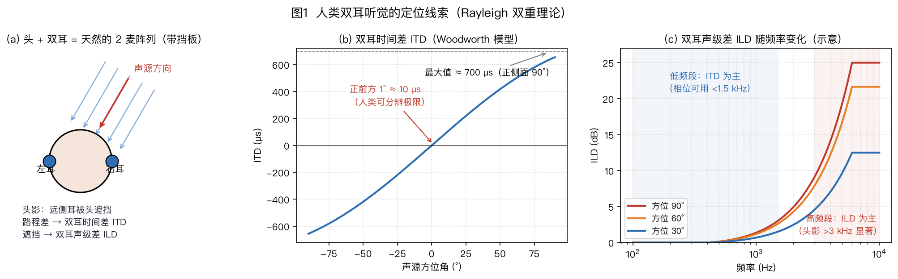

> ⚠️ 本篇是教程正文第 1 章（正文共 11 章，另有附录 A/B），可独立阅读，前后篇见下方导航。
>
> 🏠 首页导读：[`00_overview.md`](./00_overview.md) ｜ 上一篇：（无） ｜ 下一篇：[02_basics-signal-model.md](./02_basics-signal-model.md)

---

## 1. 从一个生活场景出发：问题定义

本章从客厅里的远场语音交互出发，依次说明空间处理的三项任务、阵列增益的不同度量，以及双耳听觉为机器阵列提供的线索。

**客厅里那句“今天天气怎么样”**

想象你坐在客厅里，对 3 米外的智能音箱说“今天天气怎么样”。音箱听清这句话，要同时战胜四个敌人：

1. **环境噪声**：空调声、车声；
2. **房间混响**：声音经墙壁、桌面、天花板反射形成“拖尾”，把音节糊在一起；
3. **干扰说话人**：旁边有人在看电视或说话；
4. **麦克风自噪声**：传感器自身的底噪，包括热噪声和电路噪声。普通环境里，它往往低于环境噪声；超指向波束形成依赖通道间的精确相消，可能显著放大自噪声，因此自噪声会限制阵列性能（见 §2.6 的白噪声增益 WNG 和 §5.3）。

人用两只耳朵毫不费力就能做到的事，机器要靠**一群麦克风**来做到：因为每个麦克风处于空间不同位置，同一声音到达它们的**时间、强度略有不同**——这些“不同”里藏着声音的**方向信息**，也给了机器**挑选某个方向**的能力。

这些干扰的结构不同，不能用同一个“降噪增益”概括。先区分阵列空间处理承担的任务，再分别定义收益。

**空间处理的三项任务**

下面三项是阵列空间处理的核心任务：

| 任务 | 类比 | 回答的问题 |
|---|---|---|
| **声源定位** | 你闭着眼判断声音从哪来 | “声音在哪个方向？” |
| **波束形成** | 你扭头把耳朵和注意力转向说话人 | “怎么只听这个方向？” |
| **声源追踪** | 你跟着走动的说话人持续转头 | “他动了，怎么一直盯着听？” |

它们没有覆盖开头的全部问题。设备自己的回声由 AEC 处理，房间拖尾由去混响处理，多人同时说话还需要语音分离；这些任务分别在第 6～8 章展开。

定位、波束形成和追踪回答的问题不同，对应的评价指标也不同。下面先计算最基础的白噪声阵列增益。

**三类阵列收益**

麦克风阵列最容易算清的一项理论收益，是对白噪声的**阵列增益**：$M$ 元延迟求和阵列在理想条件下可得到 $10\log_{10}M$ dB（功率 2 倍约 3 dB，10 倍为 10 dB；4 麦约 6 dB、8 麦约 9 dB）。这里的条件是：各通道噪声互不相关、目标可按远场平面波对齐、各麦增益和相位一致。定向干扰、弥散混响和模型失配不能直接并入这一个数字；它们要分别看零陷、DI 与稳健性，具体收益随场景变化。[Kumatani–McDonough–Raj《Microphone Array Processing for Distant Speech Recognition》CMU 课程讲义，2012](https://course.ece.cmu.edu/~ece792/handouts/KumataniEtAl12.pdf "citation")

这三类收益不能混用。$10\log_{10}M$ 描述独立、等功率通道噪声下的**白噪声增益**（WNG，§2.6），延迟求和阵列在理想无失真归一化下达到这一数值。四面八方到来的**弥散场**，例如晚期混响，要用**指向性指数**（DI）评价；超指向设计可获得高于同麦数延迟求和阵列的 DI，但通常会牺牲 WNG（§5.3）。单个定向干扰则看零陷深度，§5.4 的算例给出一个 −24 dB 零陷。三种声场分别对应 WNG、DI 和零陷深度，不能用其中一个指标替代另外两个。

**白噪声增益的推导**（各麦噪声相互独立）：

1. **信号侧**：各麦收到的是“同一个声音错开一点时间”，对齐后同相相加——幅度变成 $M$ 倍，所以功率变成 $M^2$ 倍（功率正比于幅度的平方）；
2. **噪声侧**：各麦的噪声互相独立（不相关），相加时不会同相叠加而是“随机抵消一部分”——功率只变成 $M$ 倍（独立随机变量的和的方差 = 方差的和）；
3. **相除**：信噪比提升 $= M^2 / M = M$，换成分贝就是 $10\log_{10}M$。

以 4 只麦为例：信号幅度变为 4 倍，功率变为 16 倍；独立噪声的总功率变为 4 倍。因此信噪比提高 4 倍，约为 6 dB。满足上述条件时，麦数翻倍可增加约 3 dB。

对白噪声而言，**信号同相相加，独立噪声只按功率相加**。这给出延迟求和的 WNG 上限；它不是 DI、零陷深度或所有阵列算法的共同上限。

这个结果只依赖相干信号与独立噪声的叠加规律。真实系统还可利用双耳听觉中类似的时差、声级差和方向相关频谱线索。

### 1.1 双耳听觉的三类定位线索

从阵列模型看，双耳可以近似为带有头部散射的双传感器系统。人类主要利用三组线索判断声源方向，并在嘈杂环境中进行选择性聆听：

1. **ITD（双耳时间差）**：声音先到近耳、后到远耳，正侧面时两耳的时间差最大，量级约为数百微秒；按常见成人头部尺寸和 Woodworth 绕头模型估算，约为 700 μs（图1(b)）。人耳能利用很小的时间差，但可辨阈值随频率、声级和实验任务变化。频率升高后，相位会绕圈，听觉神经的波形锁相也逐渐减弱，因此纯相位 ITD 会出现歧义。
2. **ILD（双耳声级差，Interaural Level Difference）**：头颅遮挡使远耳听到的高频变弱；频率越高、入射越偏向一侧，声级差通常越明显（图1(c)）。低频波长比头部尺寸大，绕射更强，ILD 较小。低频主要利用 ITD、高频更多利用 ILD，是瑞利**双重理论（duplex theory）**的直觉版本。机器阵列不能照搬这个频段划分：当均匀阵间距不满足半波长安全条件时，高频窄带相位会产生空间混叠，但非均匀几何、实测阵列流形和宽带融合仍可利用高频信息（§2.6、§3.2）。
3. **HRTF（头相关传递函数，Head-Related Transfer Function）**：耳廓的褶皱，加上头和肩膀的散射，对不同方向、尤其是不同俯仰角的声音产生不同的滤波（谱峰/谱谷位置变化），这是人类分辨前后、上下的依据。

这些听觉线索在机器阵列中都有对应的观测量或处理方法。

**双耳线索与阵列方法的对应关系**

下表列出双耳听觉现象与阵列处理方法之间的联系：

| 人类的办法 | 机器阵列的对应技术（术语先不用记） | 章节 |
|---|---|---|
| ITD 双耳时间差 | GCC-PHAT 测 TDOA（§4.2） | §4 |
| 头颅当挡板 | 挡板效应放大麦间相位差（§3.2） | §3 |
| ILD 与 HRTF 谱线索 | 测量每个方向的“标准答案”（导向矢量；全体方向的集合叫阵列流形，标定见 §3.4、§10.2）、DNN 学习方向特征（§4.7） | §3、§4、§10 |
| 优先效应（先到声主导方位感） | 提醒算法区分直达声、早期反射与晚期混响；WPE 主要预测晚期混响，机制与听觉优先效应不同 | §2.4、§7.1 |
| 鸡尾酒会效应（多人里挑一个听） | 波束形成 + 语音分离 | §5、§8.1 |

人类用两只耳朵、头部与耳廓产生 ITD、ILD 和 HRTF，再由神经系统融合这些线索。硬件形态先提供可观测信息，后端算法再利用信息；机器阵列也是同一分工。解析模型负责约束和可解释边界，数据驱动方法可补足难以精确建模的细节。

第 2 章将从传播时延出发，把这些空间差异写成阵列信号模型。

---

> 📄 本篇信息：约 86 行 ｜ 字符约 3430 ｜ 配图 1 张 ｜ [回首页](./00_overview.md)
