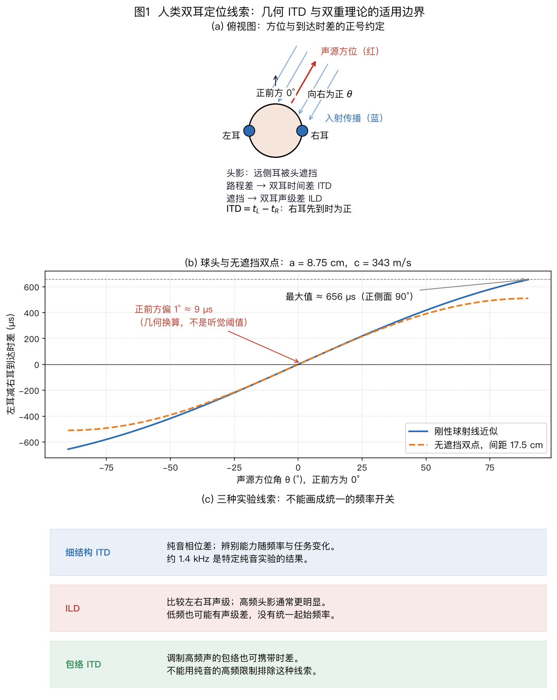

> ⚠️ 本篇是教程正文第 1 章（正文共 11 章，另有附录 A/B），可独立阅读，前后篇见下方导航。
>
> 🏠 首页导读：[`00_overview.md`](./00_overview.md) ｜ 上一篇：（无） ｜ 下一篇：[02_basics-signal-model.md](./02_basics-signal-model.md)

---

## 1. 从一个生活场景出发：问题定义

本章从客厅里的远场语音交互出发，区分定位、波束形成和追踪的输入输出，再计算阵列为什么有时能降低噪声、有时却会削弱目标。双耳听觉则提供一个参照：时间差、声级差和方向相关谱形分别包含什么信息，机器阵列能借鉴到哪一步。

读完本章，应能复算四麦理想增益，说明它为什么不是每段录音都能得到的保证，并分清几何模型的预测与人的听觉实验结果。

### 导入：从客厅场景认识阵列任务

#### 客厅里的远场语音问题

想象你坐在客厅里，对 3 米外的智能音箱说“今天天气怎么样”。音箱要听清这句话，需要面对几类不同的干扰：

1. **环境噪声**：空调声、车声，与目标说话声同时进入麦克风。
2. **房间混响**：同一句话经墙壁、桌面、天花板反射后多次到达，后到的声音与后续音节重叠。
3. **干扰说话人**：旁边的人或电视中的人声。它们也具有语音的结构，仅判断“有没有人声”不能确定谁是目标。
4. **麦克风自噪声**：传感器及其电路自身产生的底噪。环境很安静时，自噪声仍然存在；某些依靠通道相消的波束形成器还会放大它。
5. **设备播放回声**：如果音箱正在播放音乐，扬声器的声音也会经房间传回麦克风。设备能够取得自己的播放信号作为参考；外部电视的播放参考通常不在设备手中。

人的听觉系统会合并双耳线索来定位和选择性聆听。机器可以用**一组同步采样的麦克风**观测空间差异：同一声音到达不同位置的时间、幅度和频谱响应可能不同。这些差异包含方向信息，也使系统能够优先保留目标方向的声音。

这里的“同步”是指各路样本对应同一个时间基准。两路各录到一段声音，并不意味着可以直接按相同样本编号相加。没有校准的采样偏移会与真实传播时差混在一起；后面的 E01-05 会展示仅差一个采样点对高低频的不同影响。

#### 空间处理的三项任务

| 任务 | 直观参照 | 要回答的问题 |
|---|---|---|
| **声源定位** | 闭眼判断声音从哪来 | 声音在哪个方向或位置？ |
| **波束形成** | 把注意力转向目标说话人 | 如何优先保留目标方向的声音？ |
| **声源追踪** | 持续跟随走动的说话人 | 目标如何移动，当前估计还可靠吗？ |

把这些问题落实到一段四路录音，三项任务的输入和输出分别是：

- **定位**读入同步的多路信号，输出一个或多个候选方向；有些配置还能估计距离。方向分数可用于排序，但未经过校准的分数不等于“这个方向正确的概率”。
- **波束形成**把多路信号按延时与权重组合，产生一条更偏向目标的输出音频。目标方向可以来自定位，也可以预先指定；后续章节还会介绍利用信号统计量的设计。
- **追踪**联合连续时刻的观测与运动模型，更新目标状态，并在观测缺失时保持预测或重新捕获。多个目标交叉时，还要判断新观测属于哪条轨迹。

定位结果可以控制波束，但三项任务的输出不相同。定位要检查角度或位置误差，波束要检查目标保留与干扰抑制，追踪还要检查身份错配；输出声音更响，不能证明方向更准。

空间选择也有边界。两个远场说话人若处在几乎相同的方向，可能产生很相近的通道时差，仅靠方向不能把他们完全分开。有限尺寸的阵列也不会只接受一条无宽度的方向线：邻近方向仍可能进入输出。

它们没有覆盖开头的全部问题。设备播放回声由**声学回声消除（Acoustic Echo Cancellation，AEC）**利用播放参考处理，房间拖尾由去混响处理，多人同时说话还可能需要语音分离；这些任务分别在第 6～8 章展开。

#### 先分清音量、功率与信噪比

本章用数字样本的**均方值**描述功率。长度为 $N$ 的实数序列 $u[n]$ 的均方值是把每个样本平方后相加，再除以样本数：

$$
P_u=\frac{1}{N}\sum_{n=0}^{N-1}u[n]^2. \tag{1-1}
$$

其中 $n$ 是样本编号，$N$ 是所选记录的样本数。若样本是无量纲数字幅度，$P_u$ 也是相应的数字域量，不能直接称为多少瓦的声功率。本章计算不先减去样本均值；只有零均值模型的均方值才与方差相同。

在仿真中，若能分别取得目标分量 $s[n]$ 和噪声分量 $v[n]$，就能在相同时间段上分别计算 $P_s$、$P_v$。**信噪比（Signal-to-Noise Ratio，SNR）**及其改善量定义为：

$$
\begin{aligned}
\mathrm{SNR}&=\frac{P_s}{P_v},\qquad
\mathrm{SNR}_{\mathrm{dB}}=10\log_{10}\frac{P_s}{P_v},\\
G&=\frac{\mathrm{SNR}_{\mathrm{out}}}{\mathrm{SNR}_{\mathrm{in}}},\qquad
G_{\mathrm{dB}}=10\log_{10}G.
\end{aligned} \tag{1-2}
$$

这里的功率分母均要求大于零；目标完全被抵消时，SNR 的对数值按极限解释。下面以任意一只具有相同目标和噪声功率的麦克风为输入基准。实际录音通常只有混合波形，单看混合波形的总功率不能分辨其中多少属于目标、多少属于噪声。

例如目标功率为 1、噪声功率为 1 时，SNR 为 1，即 0 dB。若目标仍为 1、噪声降到 0.25，SNR 变为 4，即约 6.02 dB。若目标与噪声同时缩小到四分之一，声音变轻，SNR 却没有变化。

#### 三类阵列收益与白噪声增益

不同噪声模型对应不同评价量，不能用一个“降噪增益”替代全部结果：

| 输入噪声或干扰的假设 | 主要检查量 | 这个量能说明什么 |
|---|---|---|
| 各通道零均值、互不相关、等功率的噪声 | **白噪声增益（White Noise Gain，WNG）** | 在该模型下，阵列相对单麦的 SNR 改善；也用于检查自噪声放大风险 |
| 理想各向同性弥散噪声场 | **指向性指数（Directivity Index，DI）** | 对来自各个方向的噪声积分后，目标相对背景的改善 |
| 指定方向的单个干扰 | 该方向的响应、零陷深度 | 对这个方向抑制多少；不代表其他方向也有同样抑制 |

WNG 中需要分清**空间白**与**时间白**。本章的关键条件是：完成目标对齐后，不同通道的噪声交叉二阶矩为零，而且各路噪声功率相同。这是空间维度的条件。各路噪声在时间上是否具有平坦频谱，是另一个问题；同一段时间白噪声复制到四路，四路之间依旧完全相关。

相互独立的零均值噪声满足这里的不相关条件，但不相关本身已经足够支持功率推导。有限长度的记录只能计算样本平均，偶然的交叉项可能不为零；E01-04 将逐样本检查这个差别。

晚期混响有时可近似为弥散场，但有限房间未必满足理想各向同性条件。超指向设计可以提高特定模型下的 DI，同时可能牺牲 WNG、放大自噪声或通道误差（§5.3）。指定方向的零陷则要连同目标响应和实际方向偏差一起检查（§5.4）。

#### 从求和到平均：四麦的 6 dB 怎样得到

本节采用远场、等幅目标与准确时延补偿的简化模型。记对齐后的第 $m$ 路信号为 $x_m[n]=s[n]+v_m[n]$，$m=1,\ldots,M$，$M$ 是麦克风数。各路目标都变成同一个 $s[n]$；噪声零均值、等功率，并且在通道之间不相关。

远场是实现等幅对齐的一种常用近似。推导本身依赖的是补偿后目标相同；近场在完成对应的幅度与时延补偿后，也可以满足这一数学条件。

**先看直接求和。** 输出 $z[n]$ 与再除以 $M$ 的平均输出 $y[n]$ 分别是：

$$
\begin{aligned}
z[n]&=\sum_{m=1}^{M}x_m[n]
     =M s[n]+\sum_{m=1}^{M}v_m[n],\\
y[n]&=\frac{z[n]}{M}
     =s[n]+\frac{1}{M}\sum_{m=1}^{M}v_m[n].
\end{aligned} \tag{1-3}
$$

求和使目标幅度变成 $M$ 倍，因此目标功率变成 $M^2P_s$。噪声则要先展开平方：每一路提供自己的平方项，不同路之间还存在乘积项。例如两路时，$(v_1+v_2)^2=v_1^2+v_2^2+2v_1v_2$。在上述噪声模型的统计期望下，交叉乘积为零，剩下 $M$ 项 $P_v$，所以求和噪声功率为 $MP_v$。

**再看平均。** 把整个输出除以 $M$，目标和噪声的功率都除以 $M^2$。目标功率恢复为 $P_s$，噪声功率成为 $P_v/M$，因此：

$$
\mathrm{SNR}_{\mathrm{out}}=\frac{P_s}{P_v/M}
=M\,\mathrm{SNR}_{\mathrm{in}},\qquad
G_{\mathrm{dB}}=10\log_{10}M. \tag{1-4}
$$

式(1-4)使用模型的总体二阶矩计算理论 SNR 比值，不是把许多短记录的 SNR 比值再求平均；后者是不同的统计量。实际短记录不保证恰好得到式(1-4)。以每路目标和噪声功率均为 1 的四麦为例，可逐列核对：

| 处理方式 | 目标功率 | 噪声功率 | SNR（线性比） | 相对单麦改善 |
|---|---|---|---|---|
| 单麦 | 1 | 1 | 1 | 0.00 dB |
| 四路直接求和 | 16 | 4 | 4 | 6.02 dB |
| 四路取平均 | 1 | 0.25 | 4 | 6.02 dB |

求和与平均的输出电平不同，但 SNR 相同。平均的好处是目标幅度保持原尺度，便于比较与避免数值幅度过大。满足相同条件时，8 麦为 9.03 dB；麦数翻倍增加的是约 3.01 dB 的 SNR 改善，不是把所有环境干扰都再消除一半。

这个结果也说明了 WNG 的上界。对已经等幅对齐的目标，若使用实权重且要求 $\sum_m w_m=1$，目标保持不变，独立单位功率噪声的输出功率为 $\sum_m w_m^2$。由

$$
\sum_{m=1}^{M}\left(w_m-\frac{1}{M}\right)^2
=\sum_{m=1}^{M}w_m^2-\frac{1}{M}\ge0,
$$

可知噪声功率不低于 $1/M$；只有每个权重都是 $1/M$ 才取到等号。复数频域权重也有相应的柯西不等式上界，后面会结合导向矢量说明。因此，在相同单位模导向响应与空间白噪声定义下，$M$ 是线性波束形成器的 WNG 上界，延迟求和达到它。这个界不限制 DI、其他噪声模型下的增益或语音分离指标。

上述最小模型由本书展开计算。阵列处理及其语音识别应用的系统介绍可参见 Kumatani、McDonough 与 Raj 的 [《Microphone Array Processing for Distant Speech Recognition: From Close-Talking Microphones to Far-Field Sensors》，IEEE Signal Processing Magazine，29(6)，127–140，2012](https://doi.org/10.1109/MSP.2012.2205285 "citation")；[CMU 课程页面托管了论文副本](https://course.ece.cmu.edu/~ece792/handouts/KumataniEtAl12.pdf "citation")。

### 1.1 双耳听觉的三类定位线索

双耳可以近似为带有头部散射的双传感器系统，但听觉还会利用头部运动、经验和神经处理。下面区分时间差、声级差和方向相关谱形，分别说明它们与机器阵列的联系。



图1(a)标出双耳与方向约定；图1(b)比较球头模型和无遮挡双点模型的 ITD；图1(c)区分纯音细结构、双耳声级差和高频包络的实验条件。曲线是指定几何模型的计算，不是人体测量；文字框也不表示所有人的统一频率截止。

#### 双耳时间差：把几何模型算清楚

**双耳时间差（Interaural Time Difference，ITD）**描述声音到达两耳的先后。这里把正前方定为 $0^\circ$，朝右转为正，定义 $\tau=t_{\mathrm{左}}-t_{\mathrm{右}}$。右侧声源先到右耳，所以 ITD 为正；对称的左侧声源为负。

Woodworth 模型把头近似成半径 $a$ 的刚性球，两耳位于直径两端，入射声近似为远场平面波。对前半平面 $-\pi/2\le\theta\le\pi/2$，常用的射线路程近似为：

$$
\tau_{\mathrm{球头}}(\theta)
=\frac{a}{c}\bigl(\theta+\sin\theta\bigr). \tag{1-5}
$$

$a$ 以米计，$c$ 是声速，单位 m/s；括号内的 $\theta$ 必须用弧度，所以结果单位为秒。$a\theta$ 对应沿球面绕行的弧长项，$a\sin\theta$ 是与入射方向有关的投影路程项。两者相加后除以声速，得到时差。

取 $a=8.75\ \mathrm{cm}=0.0875\ \mathrm{m}$、$c=343\ \mathrm{m/s}$。正右方对应 $90^\circ=\pi/2$，有

$$
\tau_{\mathrm{球头}}(90^\circ)
=\frac{0.0875}{343}\left(\frac{\pi}{2}+1\right)
\approx0.000655815\ \mathrm{s}
\approx656\ \mu\mathrm{s}.
$$

正前方偏 $1^\circ$ 时，先换成 $\theta=\pi/180\approx0.0174533$，再代入 $\sin\theta\approx0.0174524$，得到约 $8.9045\ \mu\mathrm{s}$，即图中的约 $9\ \mu\mathrm{s}$。这只说明模型中一度角对应多少时差，不能据此断言人能分辨一度或九微秒。

如果拿掉头部，只保留间距 $2a$ 的两个点传感器，声波不需绕头传播，远场投影给出：

$$
\tau_{\mathrm{双点}}(\theta)=\frac{2a}{c}\sin\theta. \tag{1-6}
$$

同样参数下，正侧面只有约 $510\ \mu\mathrm{s}$。图1(b)中两条曲线的差别来自模型不同，不能用穿过头颅的直线路程去解释球头曲线。小角度下 $\sin\theta\approx\theta$，两式都接近 $2a\theta/c$，所以靠近正前方时两线很接近。

Woodworth 模型是高频射线近似，不是覆盖任意频率、耳位与个体形状的精确人体模型。低频绕射会改变结果，模型扩展还要考虑非对径耳和有限距离；参见 [Aaronson 与 Hartmann，JASA 135(2)，817–823，2014](https://doi.org/10.1121/1.4861243 "citation")。本章只用它说明几何假设怎样影响数值，不用它推算人的听觉阈值。

#### 声级差、细结构与包络要分别判断

**双耳声级差（Interaural Level Difference，ILD）**描述两耳接收声级的差异。头部遮挡使远耳的高频通常更弱，低频绕射则会减小这种差异；大小还取决于方向、频率和具体头部形状。声级差并不等于简单的“两耳离声源远近之差”。

瑞利**双重理论（duplex theory）**把低频细结构 ITD 与高频 ILD 作为重要线索。这是帮助理解的概括，不是两条没有重叠的频段规则。这里的“细结构”指声波逐周期的快速起伏；“包络”指声音强弱随时间较慢的变化。高频载波即使周期很短，也可以带有较慢的强弱调制。

| 实验观察对象 | 可以得出的结论 | 不能直接推广为什么 |
|---|---|---|
| 耳机呈现的纯音细结构 ITD | 在 Brughera 等的任务与判据下，最敏感听者的可测上限接近 1.4 kHz | 所有人、所有声音的 ITD 都在同一频率突然消失 |
| 不同方向的双耳声级差 | 头部散射提供另一类方向线索，低频也可能存在 ILD | ILD 只在某个固定频率以上存在 |
| 带调制包络的高频声 | 包络 ITD 仍可影响侧向感知 | 高频纯音的相位 ITD 因而也一定可用 |

[Brughera、Dunai 与 Hartmann，2013，实验结果 §II.C、讨论 §II.E](https://pmc.ncbi.nlm.nih.gov/articles/PMC3663869/ "citation")中，最敏感的两位听者在 1400 Hz 仍得到收敛阈值，1450 Hz 的阶梯程序已经发散；其他听者的表现更弱。因此“接近 1.4 kHz”应连同纯音刺激、任务和测量判据理解。[Bernstein 与 Trahiotis，2003](https://doi.org/10.1121/1.1570431 "citation")研究的 4 kHz 高频调制刺激则说明，包络能提供另一种时间线索。

机器阵列不能照搬人的这条纯音实验界限。以 2 kHz 纯音为例，一个周期是 $1/2000=0.0005$ 秒，即 $500\ \mu\mathrm{s}$。延迟 $100\ \mu\mathrm{s}$ 与延迟 $600\ \mu\mathrm{s}$ 相差一个完整周期，对无限持续的这个纯音产生相同的相位；只有在几何允许两种时延时，二者才同时构成候选。由相位绕圈产生的数学歧义，与听觉神经对快速细结构的锁相能力下降，是两件不同的事。

对机器而言，相位歧义还取决于麦间距和几何。宽带信息、非均匀阵列或实测阵列响应可以提供额外约束，但不是自动消除歧义的保证（§2.6、§3.2）。

#### 方向相关频谱与头相关传递函数

耳廓的褶皱，以及头、肩膀的散射，会改变不同方向声音到耳朵时的频谱。某些频率加强形成谱峰，某些频率减弱形成谱谷；这些位置随方向变化，可以提供俯仰和前后方向的线索。

**头相关传递函数（Head-Related Transfer Function，HRTF）**描述指定声源位置到某一耳的频率响应，通常相对头部不存在时的自由场参考来定义。左右耳各有一个传递函数。它同时包含幅度和相位信息，因此 ITD、ILD 与 HRTF 并不是三种互不相关的物理信号；这里第三类线索专指方向相关的谱形变化。

谱形线索也受声源本身的频谱影响：耳朵接收的频谱同时包含声源谱与传播滤波，某个频率很弱，既可能来自方向相关谱谷，也可能是声源原本就很弱。单一纯音只在一个频率上提供信息，不能展示一段完整的谱峰与谱谷。因此，不能仅凭一个未知声音的单耳谱谷就唯一判定方向；较宽频带的声音、双耳比较、运动和已有经验能提供更多约束。

方向相关谱形有助于减少前后混淆，但听觉还联合 ITD、ILD、头部运动和经验。仅有两个耳朵并不意味着只靠一个时差就能唯一确定三维方向。经典综述可参见 [Middlebrooks 与 Green，1991](https://doi.org/10.1146/annurev.ps.42.020191.001031 "citation")。

#### 双耳线索怎样对应机器阵列

| 听觉现象或观测量 | 机器阵列中的对应问题 | 继续阅读 |
|---|---|---|
| 双耳时间差 | 估计麦克风之间的到达时间差，再结合几何解算方向 | §4.2 |
| 头部与耳廓散射 | 外壳、挡板和安装位置也会改变各方向的幅相响应 | §3.2 |
| 方向相关幅度与频谱 | 测量目标方向的通道响应，即导向矢量；多个方向的响应构成阵列流形 | §3.4、§10.2 |
| 先到声影响方位感的优先效应 | 区分直达声、早期反射与晚期混响；机器去混响不等于复制听觉机制 | §2.4、§7.1 |
| 多人中选择性聆听的鸡尾酒会现象 | 结合波束形成与语音分离，并检验目标保留情况 | §5、§8.1 |

硬件形状决定能观测到哪些差异，算法决定怎样利用这些差异。增加麦克风数量、改变外壳或采用学习方法，都需要检查输入信息、模型假设与失效情况，不能只凭方法名称推断效果。第 2 章将从传播时延出发，把这些差异写成完整阵列信号模型。

### 本章练习

E01-01～E01-03 使用 [`exercises_spatial.py`](../codes/examples/exercises_spatial.py)；E01-04～E01-06 使用 [`chapter01_experiments.py`](../codes/examples/chapter01_experiments.py)。均不需下载数据；在仓库根目录运行：

```bash
.venv/bin/python -m codes.examples.exercises_spatial
.venv/bin/python -m codes.examples.chapter01_experiments
```

以下数字来自本书手算及确定性实验，不是设备或听者实测。中间计算保留更多位，表中按所列精度舍入。

#### E01-01：四只麦不一定得到 6 dB

目标已经等幅对齐，四路零均值噪声的功率均为 1，任意两路噪声的相关系数均为 $\rho$。对四路信号取平均，分别计算 $\rho=0、0.5、1$ 时的输出噪声功率和相对单麦的 SNR 改善。为什么完全相同的噪声不会被平均消除？

**参考答案。** 噪声输出为 $(v_1+v_2+v_3+v_4)/4$。平方展开后有四项 $v_m^2$；不同麦克风共有六对，每一对在平方展开中出现两次，所以交叉项共有十二项。各路功率为 1，交叉二阶矩为 $\rho$，于是

$$
P_{v,\mathrm{out}}
=\frac{4+12\rho}{16}
=\frac{1+3\rho}{4}. \tag{1-7}
$$

平均后的目标功率不变，所以 SNR 改善为 $10\log_{10}(1/P_{v,\mathrm{out}})$：

| 噪声相关系数 $\rho$ | 输出噪声功率 | SNR 改善量 |
|---|---|---|
| 0 | 0.250 | 6.02 dB |
| 0.5 | 0.625 | 2.04 dB |
| 1 | 1.000 | 0.00 dB |

当 $\rho=1$，四路等功率零均值噪声相同，平均后仍是原噪声。噪声不会仅因为麦克风数增加就减少。

**扩展：负相关可以随便取吗？** 这个等相关协方差矩阵沿 $[1,1,1,1]^\top$ 方向的特征值是行和 $1+3\rho$；在分量之和为零的三个独立方向上，特征值都是 $1-\rho$。协方差必须半正定，即任意加权组合的噪声功率不能为负，因此要求 $-1/3\le\rho\le1$。

取 $\rho=-0.2$，平均输出功率为 0.1，改善为 10 dB；这不是违反 WNG 的四麦上界，因为输入已经不是空间白噪声。取 $\rho=-1/3$，模型中四路噪声之和恒为零；理想零残余对应发散的 SNR，但微小模型失配和自噪声都会破坏这个精确抵消。取 $\rho=-0.4$ 会得到负输出功率，说明这个矩阵不可能是所要求的噪声协方差。

等相关模型用于单独观察相关性的影响。真实弥散场的相关性随频率和麦间距变化，不能用一个固定 $\rho$ 描述整段语音。

#### E01-02：更轻的声音是否一定更干净

对序列 $[0,1,0,-1]$ 整体乘 0.5，计算均方功率比和电平变化。如果目标与噪声同时乘 0.5，SNR 会提高吗？

**参考答案。** 原序列的平方是 $[0,1,0,1]$，均方为 $2/4=0.5$。缩放后序列是 $[0,0.5,0,-0.5]$，平方和为 $0.25+0.25=0.5$，均方为 $0.5/4=0.125$。

因此功率比为 $0.125/0.5=0.25$，电平变化为 $10\log_{10}0.25=20\log_{10}0.5\approx-6.02$ dB。目标与噪声功率同时变成四分之一，二者之比不变，SNR 不提高。

比较音频时应保留共同的幅度尺度；若分别归一化到同一峰值，整体增益变化会被隐藏。这里的 dB 是相对均方变化，不是声压级 dB SPL。

#### E01-03：噪声较大的麦应当占多少权重

两路目标已经对齐且幅度相同，零均值噪声互不相关，功率分别为 1 和 4。用实权重 $w_1,w_2$ 相加，要求 $w_1+w_2=1$。先算等权平均的输出噪声，再求使输出噪声最小的权重。

**参考答案。** 约束保证目标响应为 1。噪声功率按权重平方计算，所以等权平均得到 $(1+4)/4=1.25$，比只用第一路的噪声功率 1 还大。

代入 $w_2=1-w_1$，再配方：

$$
\begin{aligned}
P_{v,\mathrm{out}}&=w_1^2+4(1-w_1)^2\\
&=5w_1^2-8w_1+4\\
&=5(w_1-0.8)^2+0.8.
\end{aligned}
$$

平方项非负，所以 $w_1=0.8$、$w_2=0.2$ 时达到最小值 0.8。逐项核对也得到 $0.8^2\times1+0.2^2\times4=0.64+0.16=0.8$：噪声较大的麦仍提供信息，但只占较小权重。

两种组合都保持目标，因此最优组合相对等权平均改善 $10\log_{10}(1.25/0.8)\approx1.94$ dB，相对只取第一路改善 $10\log_{10}(1/0.8)\approx0.97$ dB。两个数的基准不同，不能混写。

本题依赖噪声互不相关、准确功率估计和目标对齐。第 5 章的最小方差无失真响应（Minimum Variance Distortionless Response，MVDR）波束形成，将“保持目标响应、最小化输出噪声”的思路推广到复权重和相关噪声。

#### E01-04：短记录里的交叉项为什么不能丢

给定两路确定性噪声序列 $v_1=[1,1,-1,-1]$、$v_2=[1,-1,1,-1]$。先使用全部四个样本，再只截取前三个样本。分别计算各路均方、交叉乘积均值和平均输出均方。所有量都直接按样本计算，不减样本均值。

**参考答案。** 无论窗口长短，把平方展开都得到精确恒等式：

$$
\begin{aligned}
P_{\mathrm{平均}}&=\frac{P_1+P_2+2C_{12}}{4},\\
C_{12}&=\frac{1}{N}\sum_{n=0}^{N-1}v_1[n]v_2[n].
\end{aligned}\tag{1-8}
$$

$C_{12}$ 是未去均值的交叉二阶矩；裁切后三点的样本均值不为零，不能直接把它称为去均值协方差。

| 使用窗口 | 逐样本乘积 | $P_1,P_2$ | $C_{12}$ | 平均输出 | 输出均方 |
|---|---|---|---|---|---|
| 全部四点 | $[1,-1,-1,1]$ | 1，1 | 0 | $[1,0,0,-1]$ | $2/4=0.5$ |
| 前三点 | $[1,-1,-1]$ | 1，1 | $-1/3$ | $[1,0,0]$ | $1/3$ |

四点窗口中，式(1-8)为 $(1+1+0)/4=0.5$；三点窗口中为 $(1+1-2/3)/4=1/3$。相对第一路的噪声功率降低量分别为 $10\log_{10}2\approx3.01$ dB 和 $10\log_{10}3\approx4.77$ dB。

两个窗口共用样本，并非两次独立随机实验。四点的乘积均值刚好为零，也不能证明两个随机过程统计独立。这道题说明的是：有限记录必须保留实际交叉项；换一个截取范围就可能改变估计值。这里没有加入目标，不能仅凭这两项噪声读数宣称某个语音增强算法的 SNR 性能提高。

#### E01-05：差一个采样点，为什么高频损失更大

采样率为 $f_s=16000$ Hz，两路等幅目标分别为 $s[n]$ 和 $s[n-1]$，残余时差为 $1/f_s=62.5\ \mu\mathrm{s}$。不做补偿就取平均，分别计算 1 kHz 和 4 kHz 正弦目标的幅度与功率变化。本题没有噪声。

**参考答案。** 令 $s[n]=\cos(\omega n)$，其中数字角频率 $\omega=2\pi f/f_s$。用两个余弦相加的恒等式：

$$
\begin{aligned}
y[n]&=\frac{\cos(\omega n)+\cos(\omega(n-1))}{2}\\
&=\cos(\omega/2)\cos\bigl(\omega(n-1/2)\bigr).
\end{aligned} \tag{1-9}
$$

第二项表示相对第一路的半采样相位延迟；第一项是目标幅度比例。在本题两个频率上它为正，功率比例是 $\cos^2(\pi f/f_s)$。

| 频率 | $\pi f/f_s$ | 幅度比例 | 功率比例 | 目标电平变化 |
|---|---|---|---|---|
| 1 kHz | $\pi/16$ | 0.980785 | 0.961940 | −0.17 dB |
| 4 kHz | $\pi/4$ | 0.707107 | 0.500000 | −3.01 dB |

时间差相同，高频在这段时间内转过的相位更多，平均时抵消也更多。这里的 dB 是目标电平损失，不是 SNR 改善，更不是完整语音的可懂度分数。

若把先到的第一路再延迟一个样本，两路都成为 $s[n-1]$，平均后目标幅度恢复，同时保留一个样本的共同延迟。因果实现可以延迟先到声；不能把“把后到声提前”当成不需未来样本的操作。

**试听与复算。** 本书的 `alignment_error` 音频组使用 2 秒的 1 kHz 与 4 kHz 双音，每个正弦幅度为 0.18，首尾各有 20 ms 线性淡入淡出。四个文件使用共同增益 1：`alignment_array.wav` 保存两路输入，`alignment_unaligned.wav` 是直接平均，`alignment_aligned.wav` 是补偿后平均，`alignment_reference.wav` 是具有同样共同延迟的参考。补偿后文件与参考相同，是这一确定性对齐实验的预期结果。

程序在样本半开区间 $[1600,30400)$，即 0.1～1.9 秒，按各频率的正弦与余弦投影测量幅度。该区间避开淡入淡出且包含整数周期，避免把起止边缘、共同延迟和幅度衰减混为同一种误差。PCM 量化使读回数值与解析值有微小差异。这组样本没有真实语音、噪声或房间混响，只用于检查对齐与频率相关抵消。

#### E01-06：有头部与没有头部，时差能差多少

使用式(1-5)、式(1-6)，取 $a=0.0875$ m、$c=343$ m/s，分别计算 $0^\circ$、$1^\circ$、$30^\circ$、$90^\circ$ 的 ITD。再判断负角度的符号，以及球头正侧面时差在 16 kHz 下相当于几个采样间隔。

**参考答案。** 先把每个角度乘 $\pi/180$ 转成弧度。例如 $30^\circ=\pi/6$、$\sin30^\circ=0.5$，球头时差为 $(0.0875/343)(\pi/6+0.5)$ 秒，无遮挡双点为 $(0.175/343)\times0.5$ 秒。

| 方位角 | 球头 ITD | 无遮挡双点 ITD |
|---|---|---|
| 0° | 0.000 μs | 0.000 μs |
| 1° | 8.905 μs | 8.904 μs |
| 30° | 261.122 μs | 255.102 μs |
| 90° | 655.815 μs | 510.204 μs |

角度反号时，两式都反号；正前方都为零。球头正侧面为 $0.000655815\times16000\approx10.493$ 个采样间隔，不是整数，说明连续传播时延不必落在整数样本上。表中小数用于复算模型，不表示人的头部尺寸或时差已经测到微秒的小数精度。

两种模型在正前方附近很接近，正侧面却相差约 146 μs。因此选择传播模型必须先看是否存在头部或挡板，以及近似条件是否成立。这个计算既不验证人体定位准确率，也不能作为两麦硬件在房间中的实测结果。

可在[章节代码练习与音频实验](../codes/research/05_exercises_and_audio.md)中试听既有“单麦输入”“对齐后平均”和本章的残余时差样本。文件保留各组共同增益，使用数学合成信号；先从低播放音量开始。听音帮助发现差别，功率、延迟与模型判断仍需以上述计算为准。

---

> 📄 本篇信息：配图 1 张 ｜ [回首页](./00_overview.md)
