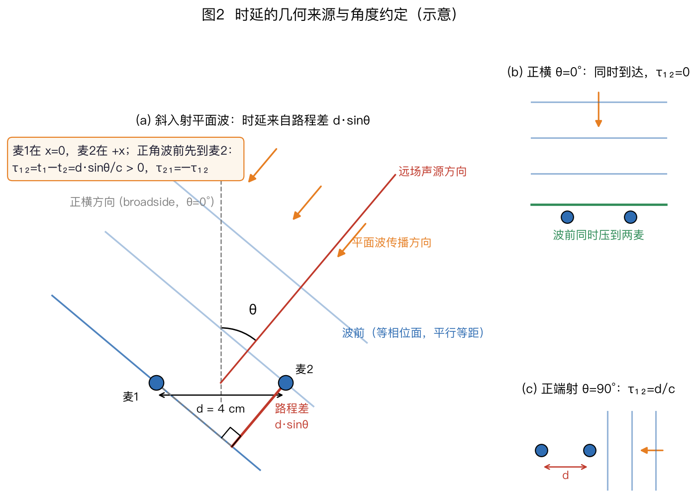
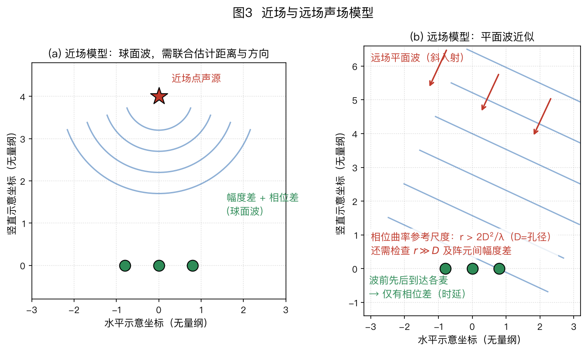
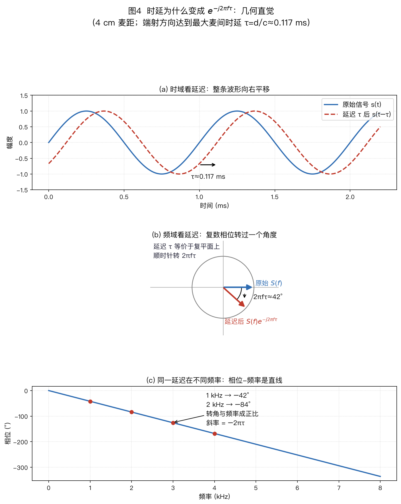
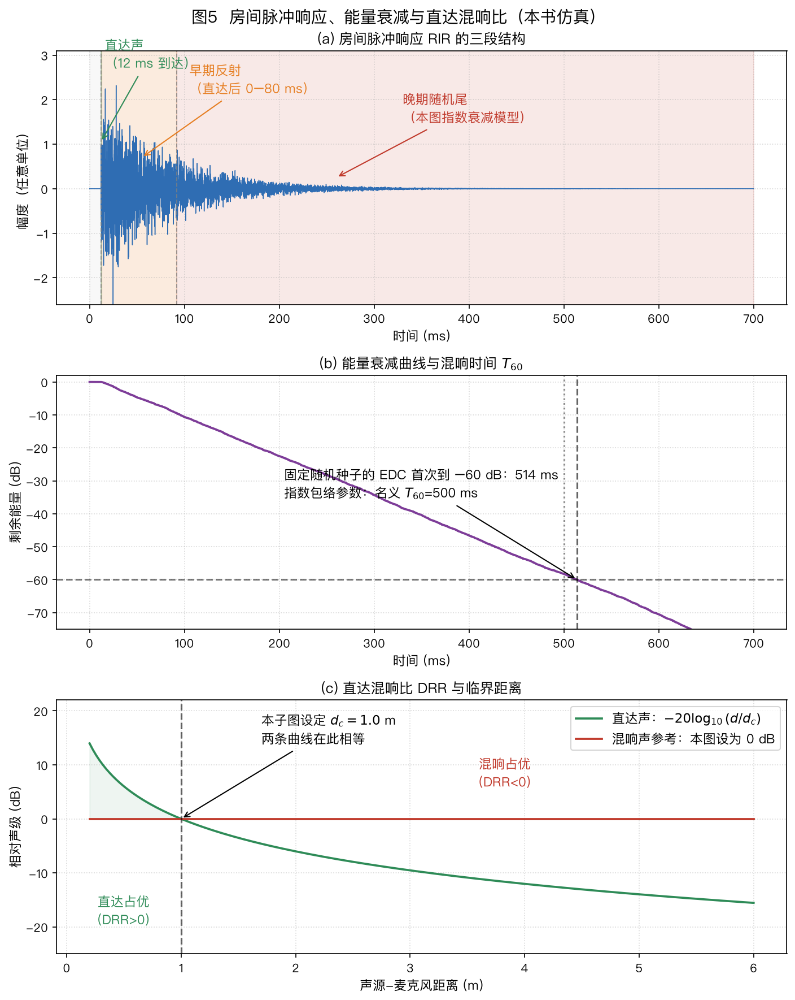
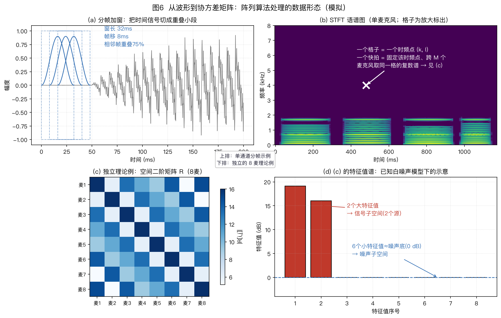
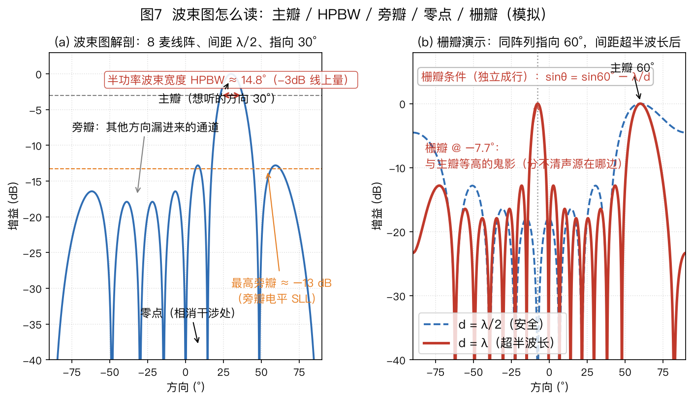

> ⚠️ 本篇是正文第 2 章（正文共 11 章，另有附录 A/B），可独立阅读，前后篇见下方导航。
>
> 🏠 首页导读：[`00_overview.md`](./00_overview.md) ｜ 上一篇：[01_problem-definition.md](./01_problem-definition.md) ｜ 下一篇：[03_array-geometry.md](./03_array-geometry.md)

---

## 2. 基础：声音到达阵列时发生了什么

### 2.1 核心事实：同一声音，到达各麦克风有先有后

本书取声速 $c\approx343$ m/s，这是约 20°C 干空气中的常用近似；温度、湿度和气体成分改变时，声速也会改变。[Cramer 1993 给出湿空气声速计算式及适用范围，JASA 93(5)](https://doi.org/10.1121/1.405827 "citation")。

两个相距 4 cm 的麦克风，当声音沿两麦连线的方向传来时，先到近麦、后到远麦，时差幅值最大，约为 $0.04/343\approx0.116$ ms。当声音垂直于连线传来时，两麦同时收到，时差为零。这个到达时间差称为**到达时间差（Time Difference of Arrival，TDOA）**。

**坐标、方向和时差约定。** 把麦 1 放在 $x=0$，麦 2 放在 $x=d>0$；正横方向为 $\theta=0°$，正角朝 $+x$、即麦 2 一侧。单位向量 $\vec u(\theta)$ 从阵列指向声源，声波实际传播方向为 $-\vec u$。到达时刻之差统一定义为 $\tau_{ij}=t_i-t_j$。

按这些约定，正角时波前先到麦 2，有 $t_2<t_1$，即 $\tau_{21}<0$、$\tau_{12}>0$。

平面波下，麦 1 相对麦 2 的带符号路程差为 $d\sin\theta$（图2），所以带符号的麦对时差为

$$\tau_{12}=t_1-t_2=\frac{d\sin\theta}{c},\qquad \tau_{21}=-\frac{d\sin\theta}{c}\text{。}$$

其中 $d$ 为两麦间距（m），$\theta$ 为声源方向角，$c$ 为声速。只讨论大小时可写 $|\tau_{12}|=d|\sin\theta|/c$；不能把无符号“时差”直接代入需要方向的公式。

**全书角度约定（后文凡涉角度一律沿用）**：$\theta$ 从**正横方向**（broadside，垂直于两麦连线的方向）起算。正横 $\theta=0°$ 时两麦同时收到波前，时差为零；**端射方向**（endfire，沿两麦连线）$\theta=\pm90°$ 时路程差幅值为 $d$、时差幅值最大。有些文献从阵列轴起算，此时关系写成 $\Delta\tau=d\cos\theta/c$。比较公式前应先统一角度零点和正方向；两种起算方式相差 90°。

图 2 中麦 1 位于左侧、麦 2 位于右侧。正角声源位于麦 2 一侧，波前先到麦 2；直角三角形给出 $\tau_{12}=d\sin\theta/c>0$。正横时差为零，端射时差幅值达到最大。

**离散化。** 16 kHz 采样率下，采样间隔为 $1/16000=62.5$ μs，对应约 $343\times62.5\,\mu s\approx2.1$ cm 的传播距离。4 cm 阵列的最大时差约为 117 μs，不到两个采样间隔。仅按整数采样点定位会得到很粗的方向，因此实际系统需要亚采样 TDOA 估计，例如对互相关峰插值、对相关函数上采样，或在频域拟合相位斜率（见 §4.2）。

**同步。** 多路信号必须同步采样。同一设备可让多通道模数转换器（ADC，Analog-to-Digital Converter）共享时钟；分布式设备则有独立晶振。相对偏移为 50 ppm 时，1 小时累积约 $50\times10^{-6}\times3600=0.18$ 秒，远大于阵列所测的微秒级时差，因此需要时钟同步或采样率偏移补偿（§10.2）。

声速失配会直接变成角度偏差。示意地，若真实声速为 331 m/s、真实方向为 60°，系统却按 343 m/s 反算，则 $\hat\theta=\arcsin[(343/331)\sin60°]\approx63.8°$，偏差约 3.8°。这不是“331 m/s 对应某一固定气温”的断言，只用于隔离声速参数失配；实际系统应按工作环境估计或校准 $c$。

上式是 §2.3 远场向量模型的几何基础；式(2-1)将在那里给出。声源接近阵列时，波前曲率不能忽略，需要先区分近场与远场。

### 2.2 近场与远场

- **近场**（声源很近）：波前（波阵面，即相位相同的面）是球面，各麦克风信号的**时间和幅度都有差别**；
- **远场**（声源距离远大于阵列尺寸）：波前近似平面，各麦克风收到的是“同一个信号错开一些时间”，幅度几乎相同。

Fraunhofer 距离 $r_F=2D^2/\lambda$（$D$ 为阵列最大孔径、$\lambda$ 为波长）是常用的**相位曲率**尺度。这个等式针对以阵列中心对称的孔径：点声源位于中心法线上，最远阵元到中心的距离为半孔径 $a=D/2$，并以中心到该阵元的路程差不超过 $\lambda/16$ 为容限。

非中心对称阵列应直接使用从选定参考点到最远阵元的距离 $a$，得到 $r_F=8a^2/\lambda$。对其他方位，这个尺度只能作为起始检查，而不是精确边界。该 $\lambda/16$ 口径及几何推导也见 [ETSI ETR 273-1-1 条款 7.2.3.1（p.76）](https://www.etsi.org/deliver/etsi_etr/200_299/2730101/01_60/etr_2730101e01p.pdf "citation")。

当 $r$ 大于该尺度，且同时满足下面展开所需的 $r\gg a$ 时，可以把球面波的相位近似为平面波。对实际拾音距离，还应检查阵列到声源的距离比、各阵元的幅度差，以及最高使用频率。

例如，7 cm 中心对称阵列在 1 kHz（$\lambda=0.343$ m）时的公式值是 $2\times0.07^2/0.343\approx2.9$ cm，但 2.9 cm 并不满足 $r\gg D$，不能据此宣称从 3 cm 开始整个房间都是远场。作为对照，1.26 m 的中心对称线阵在 1 kHz 下有 $r_F\approx9.3$ m，普通会议室内应核对球面波模型。

**Fraunhofer 判据的推导**：

1. 球面波到达阵列**中心**与到达最远阵元的路程不一样。把中心到最远阵元的距离记作 $a$；中心对称阵列有 $a=D/2$。由勾股定理，额外路程是 $\sqrt{r^2+a^2}-r$。
2. $r \gg a$ 时用近似 $\sqrt{1+x}\approx 1+x/2$ 展开：$\sqrt{r^2+a^2}-r \approx \dfrac{a^2}{2r}$。
3. 工程约定：只要这个“球面弯曲造成的误差”小于约十六分之一波长（$\lambda/16$，相位误差约 22.5°，平面波假设就足够准），就算远场：$\dfrac{a^2}{2r} \le \dfrac{\lambda}{16}\;\Rightarrow\; r \ge \dfrac{8a^2}{\lambda}$。只有在 $a=D/2$ 时，这才化为 $r\ge\dfrac{2D^2}{\lambda}$。

> **泰勒展开的中间步**：先提出 $r^2$：$\sqrt{r^2+a^2}-r = r\left[\sqrt{1+x}-1\right]$，其中 $x=(a/r)^2$。当 $x\ll1$ 时，$\sqrt{1+x}\approx1+x/2$，因此路程差近似为 $r\cdot x/2=a^2/(2r)$。中心对称孔径代入 $a=D/2$ 后才得到 $D^2/(8r)$。

所以 Fraunhofer 距离不是物理突变点，而是“相位误差还能忍”的约定线。

> **为何选 $\lambda/16$（22.5°）作为示例容限**：路程误差 $\Delta$ 对应相位误差 $2\pi\Delta/\lambda$；当 $\Delta=\lambda/16$ 时，相位误差为 22.5°。若只看两路等幅信号、其中一路存在这项相位误差，归一化相干和的幅度为 $|1+e^{\mathrm j\pi/8}|/2=\cos(\pi/16)\approx0.981$，即约 −0.17 dB。$\lambda/16$ 是本节为了说明数量级采用的工程容限，不是普适常数；要求更深零陷或更小相位误差时，所需距离会更大。

图 3 对比两种波前：近场采用球面波模型，各通道同时存在传播时延和幅度差；远场近似为平面波，传播模型主要由方向决定。这是下一节远场向量模型的前提。

确定远场条件后，可以把麦克风之间的传播时延写成导向矢量。

### 2.3 信号模型：把“声音有先有后”写成数学

> **符号约定（全书通用）**：标量用普通斜体，如 $s$、$\tau$、$\theta$、$\sigma^2$；向量用头顶箭头，如 $\vec{x}$、$\vec{a}$、$\vec{w}$（默认列向量，零向量记 $\vec{0}$）；矩阵用加粗大写，如 $\mathbf{R}$、$\mathbf{C}$、$\mathbf{\Gamma}$、$\mathbf{E}_n$。
>
> 再认几枚上标：$^H$ 是共轭转置（频域复数用）、$^\top$ 是转置（时域实数用）、$^*$ 是共轭、$^{-1}$ 是逆；$\hat{\ }$ 表示估计值，$\|\cdot\|$ 为范数、$|\cdot|$ 为幅度。
>
> **标量上标星号 vs 向量上标 H**：单个复数取共轭用上标星号（如 $X_2^*$），整列向量转置再共轭用上标 H（如 $\vec{x}^H$）——后文凡见上标 H 都是向量/矩阵操作，凡见上标星号都是标量操作，对上号就不会认错。
>
> **大写谱值仍可为标量**：语音文献习惯用 $X(f)$、$X(f_k,\ell)$ 这类大写字母表示某一物理频率或时频点上的复数谱值。它们是标量，不是矩阵；本书沿用这一惯例，并在首次出现处注明。

> **字母复用**：受文献惯例所限，$k$ 可表示频点索引、波数或 WPE 的滞后帧号；$D$ 可表示阵列孔径或 PHD 强度函数；$\lambda$ 可表示波长、WPE 功率谱或矩阵特征值；$K$ 可表示声源数或 WPE 预测阶数；$s$ 可表示源信号或追踪状态。每个符号以所在公式的定义为准。

> **频率与帧索引**：本章的连续频率统一记作 $f$，单位 Hz；DFT/STFT 的频点索引记作 $k$，其物理频率为 $f_k=kf_s/N$；帧索引记作 $\ell$。文献中常见的 $\vec x(f,t)$ 是简写，本书需要区分离散网格时写成 $\vec x(f_k,\ell)$。复指数 $e^{-\mathrm j2\pi f\tau}$ 中必须代入 Hz 频率 $f$ 或 $f_k$，不能直接代入无量纲索引 $k$。

本节只做一件事：把 §2.1 那句“同一声音到达各麦有先有后”一步步写成可以计算的式子。分三步走，每一步都交代“为什么”。

**第一步：时域模型——每个麦克风一个式子**

远场、单声源时，先把各麦相对麦 1 的到达时延定义为 $\tau_{m1}=t_m-t_1$。由 §2.1 的方向约定，

$$\tau_{m1}=-\frac{(\vec r_m-\vec r_1)^\top\vec u}{c}\text{。}$$

正角 ULA 上 $\vec r_m-\vec r_1$ 的 $x$ 分量为正，所以 $m>1$ 时 $\tau_{m1}<0$：右侧麦更早收到。把麦 1 的到达时刻作为时间原点，第 $m$ 个麦克风（$m=1,2,\dots,M$）录到的信号为

$$x_m(t) = s(t - \tau_{m1}) + n_m(t)\text{。}$$

- $x_m(t)$：第 $m$ 路录音波形——这是**你实际拿到的数据**；下标 $m$ 表示“第几个麦克风”，$t$ 是时间；
- $s(t)$：麦 1 处的理想直达目标分量，源端到参考麦的公共传播延迟和幅度衰减已经吸收入其中。它不带下标 $m$，因为等幅远场模型把其余通道写成它的相对时移，而不是声源端原波形的直接副本；
- $\tau_{m1}$：第 $m$ 个麦相对麦 1 的带符号到达时延（秒），它由声源方向决定，可为负数；
- $n_m(t)$：第 $m$ 路的噪声。

时移位于 $s(t-\tau_{m1})$ 的自变量中。变换到频域后，它会成为可直接相乘的复相位因子。

**第二步：搬到频率域——延迟从“移位”变成“转个角度”**

本书采用前向傅里叶变换 $X(f)=\int x(t)e^{-\mathrm j2\pi ft}\,\mathrm dt$。在此约定下，时移性质为

$$s(t-\tau)\ \xrightarrow{\mathcal{F}}\ S(f)\,e^{-\mathrm{j}2\pi f\tau}$$

箭头上的 $\mathcal F$ 表示傅里叶变换。

左边表示时域延迟 $\tau$ 秒，右边表示频域中乘以复相位因子。频域形式便于把宽带信号分频点处理，也便于将卷积近似为乘法，因此许多阵列算法采用 STFT 实现；这种近似的边界见 §2.5。

这个 $e^{-\mathrm{j}2\pi f\tau}$ 到底是什么？**它是复平面上一个长度为 1 的箭头，从正实轴出发顺时针转过角度 $2\pi f\tau$**（图4(b)）。其中 $\mathrm{j}$ 是虚数单位（$\mathrm{j}^2=-1$）；$e$ 的复指数由欧拉公式定义：$e^{\mathrm{j}\phi} = \cos\phi + \mathrm{j}\sin\phi$；有些书把 $2\pi f$ 写成 $\omega$（角频率），两者是一回事。

直觉检验：延迟恰好等于一个周期（$\tau = 1/f$）时转过整整一圈 $2\pi$——波形平移一个周期后与原波形重合，箭头也转回原地，两边对上了 ✓。

图 4 的三幅子图采用同一组参数：4 cm 麦距、声速 343 m/s、端射方向，因此 $\tau=d/c\approx0.1166$ ms。时域波形右移约 0.117 ms；1 kHz 复相量顺时针旋转约 $2\pi\times1000\times0.1166\text{ ms}\approx42°$；相位—频率图的斜率为 $-2\pi\tau$，2 kHz 处约为 −84°。§4.2 的 GCC-PHAT 正是利用这项关系估计时延。

图 4（c）还说明，同一时延引起的相位旋转与频率成正比。相位展开后，直线斜率为 $-2\pi\tau$；实际数据中的相位缠绕、噪声和混响会使估计更复杂。

**第三步：把 $M$ 个式子摞起来，写成向量**

对第 $m$ 路、物理频率 $f$，时移性质给出：

$$X_m(f) = e^{-\mathrm{j}2\pi f\tau_{m1}(\theta)}\,S(f) + N_m(f)\text{。}$$

- $X_m(f)$、$S(f)$、$N_m(f)$：第 $m$ 路/声源在物理频率 $f$ 处的复数谱值——**都是标量**（单个复数）；
- $e^{-\mathrm{j}2\pi f\tau_{m1}(\theta)}$：相对时延造成的相位旋转因子，也是标量。

把 $M$ 路的式子竖着摞起来。相对时延满足 $\tau_{m1}=-(\vec r_m-\vec r_1)^\top\vec u/c$，所以第 $m$ 个导向分量也可写为

$$a_m(f,\theta)=e^{-\mathrm j2\pi f\tau_{m1}}
=e^{+\mathrm j2\pi f(\vec r_m-\vec r_1)^\top\vec u/c}\text{。}$$

于是

$$\underbrace{\begin{bmatrix} X_1(f) \\ X_2(f) \\ \vdots \\ X_M(f) \end{bmatrix}}_{\vec{x}(f)} \;=\; \underbrace{\begin{bmatrix} e^{-\mathrm{j}2\pi f\tau_{11}(\theta)} \\ e^{-\mathrm{j}2\pi f\tau_{21}(\theta)} \\ \vdots \\ e^{-\mathrm{j}2\pi f\tau_{M1}(\theta)} \end{bmatrix}}_{\vec{a}(f,\theta)} \,S(f) \;+\; \underbrace{\begin{bmatrix} N_1(f) \\ \vdots \\ N_M(f) \end{bmatrix}}_{\vec{n}(f)}\text{。}$$

每一行就是上面那个标量式子；把公共的 $S(f)$ 提到列向量外面，就得到全书最常用的紧凑形式：

$$\vec{x} = \vec{a}(\theta)\,s + \vec{n}\text{。}\tag{2-1}$$

- $\vec{x}$：$M$ 路信号的列向量，$M$ 为麦克风数量；
- $\vec{a}(\theta)$：**导向矢量（steering vector）**，描述声源位于 $\theta$ 方向时各麦克风相对麦 1 的相位；
- $\theta$：声源方向，也是定位时想求的量；
- $s$：该频点的声源谱，是标量，即上面逐行式子中的 $S(f)$；
- $\vec{n}$：噪声向量。

式(2-1)省略了频点自变量 $(f)$，下文沿用此简写。在本节的等幅远场模型中，$\vec{a}(\theta)$ 每个分量的模长为 1，分量差异来自相对时延 $\tau_{m1}(\theta)$。定位算法可用候选方向的导向矢量解释观测，波束形成器则用它规定目标方向响应；近场或含散射时还要加入距离和幅度项。

**手算一遍**：3 麦 ULA 的麦 1、2、3 依次位于 $x=0,4,8$ cm；声源位于正角 30°，$f=1$ kHz。

相邻麦的 $\tau_{m1}$ 变化量为 $-d\sin30°/c\approx-58.3$ μs，所以相邻导向相位变化为 $-2\pi f(-58.3\,\mu\mathrm s)\approx+0.366$ rad，即约 +21°。因此

$$\vec a=[1,e^{+\mathrm j0.366},e^{+\mathrm j0.733}]^\top\text{。}$$

时域解释是麦 2 比麦 1 早 58.3 μs。在本书的傅里叶约定下，较早到达对应相对麦 1 的正相位。

**混响**：实际房间中麦克风收到直达声与多条反射路径的叠加，即声源与房间脉冲响应（Room Impulse Response，RIR）的卷积。$T_{60}$ 描述混响尾的衰减时间；下一节给出定义、计算和适用边界。

> 直达声模型明确后，§2.4 再加入房间反射，说明混响会怎样改变观测。

### 2.4 房间声学：混响到底是怎么来的

房间脉冲响应说明反射怎样进入录音，混响时间描述拖尾的衰减，直达混响比描述两种能量的相对大小。以下分别建立这三个量，再说明怎样仿真和测量。

#### 2.4.1 房间脉冲响应与早晚反射

**房间脉冲响应（Room Impulse Response，RIR）**：RIR 是房间和收发位置固定时，系统对理想单位冲激的响应。在线性、时不变近似下，麦克风信号等于声源信号与 RIR 的卷积。

拍手录音可以粗略显示直达声和衰减尾，却不是严格的 RIR：拍手本身有有限时长和频谱，麦克风响应也会进入录音。要得到可用于计算的 RIR，通常播放已知测试信号并反卷积，测量方法见本节末。

RIR 可按图5(a)作教学性分段：

1. **直达声**：从声源直线到达，最干净、携带最准的方向信息；
2. **早期反射**：直达声后较早到达、仍能分辨出路径结构的反射。图5(a)用 80 ms 作示意分界；80 ms 也是音乐清晰度指标 $C_{80}$ 的积分分界，而语音清晰度常用 50 ms 的 $C_{50}$。这不是早、晚反射的普适物理边界，80 ms 内的反射次数也取决于房间尺度和路径。早期反射可能增加响度，也会模糊方向线索；
3. **晚期混响**：经多次反射后形成的弥散尾音。统计建模时，常把充分弥散的晚期混响近似为各向同性声场；这个近似适合分析波束形成器的 DI（指向性指数，§2.6），但不表示混响在时间上就是独立白噪声。WPE（第 7 章）正是利用晚期混响仍有时间相关性来做预测消除。

图 5（a）把房间脉冲响应分为直达声、早期反射和晚期混响；图 5（b）用能量衰减 60 dB 所需时间定义 $T_{60}$；图 5（c）固定 $d_c=1.0$ m，展示直达声与混响声的相对声级怎样随声源—麦克风距离变化。该子图是归一化示例，不直接给出体积或混响时间不同的房间结果。

#### 2.4.2 混响时间：从吸声量算衰减

**$T_{60}$ 与赛宾公式**。$T_{60}$ 是声能衰减 60 dB 所需的时间（图5(b)），可用赛宾（Sabine）公式估算。原始理论可追溯到 Sabine 的声学论文集。实测时要按空间类型选标准：[ISO 3382-1:2009](https://www.iso.org/standard/40979.html "citation")面向演出空间，[ISO 3382-2:2008](https://www.iso.org/standard/36201.html "citation")面向普通房间：

$$T_{60} = \frac{0.161\,V}{A}, \qquad A = \sum_i S_i\,\alpha_i\text{。}$$

- $V$：房间体积（m³）；$S_i$、$\alpha_i$：第 $i$ 个表面的面积与吸声系数（0=全反射的光滑瓷砖，1=全吸声的开放窗户）。
- **算例**（本例是参数演示，不代表某类房间的通用测量值）：房间尺寸取 5 m × 4 m × 2.8 m，故 $V=56$ m³；再假设各表面的赛宾吸声量合计为 $A=18$ m²，则 $T_{60}=0.161\times56/18\approx0.50$ s。改变表面材料或摆设会改变 $A$，因此同尺寸房间也可能得到不同结果。

**这个公式怎么推出来的**（五步，能量守恒 + 一个几何事实）：

1. **模型**：混响期的声能在房间里近似均匀分布（扩散场假设），声线不断撞墙，每撞一次被吸收掉一部分；
2. **几何事实**：声线在房间中平均飞行 $\ell_{\rm mfp} = \dfrac{4V}{S}$ 米撞一次墙（统计几何的经典结果，$S$ 是所有墙面的总面积）。直觉检验：房间越大飞得越远、墙越多撞得越勤，都对得上；
3. **每秒能量损失率**：撞墙频率 $= \dfrac{c}{\ell_{\rm mfp}} = \dfrac{cS}{4V}$（次/秒），每次损失能量比例 $\bar\alpha$（平均吸声系数），于是每秒损失率 $= \dfrac{cS\bar\alpha}{4V} = \dfrac{cA}{4V}$；
4. **列方程求解**：$\dfrac{\mathrm{d}E}{\mathrm{d}t} = -\dfrac{cA}{4V}E$——“损失率正比于当前能量”的方程，解是指数衰减 $E(t) = E_0\,e^{-\frac{cA}{4V}t}$；
5. **代入定义收尾**：$T_{60}$ 是能量衰减 60 dB 的时间——注意 60 dB 是能量比 $10^6$（不是 $10^3$：能量的 dB 用 $10\log_{10}$，$10\log_{10}10^6 = 60$）。令 $e^{-\frac{cA}{4V}T_{60}} = 10^{-6}$，两边取对数：$\frac{cA}{4V}T_{60} = 6\ln 10$，解出

$$T_{60} = \frac{24\ln 10}{c}\cdot\frac{V}{A} = \frac{55.3}{343}\cdot\frac{V}{A} \approx 0.161\,\frac{V}{A}\ \checkmark\text{。}$$

> **平均自由程中的因子 4**：在声线方向各向同性、房间为凸体的假设下，墙面对各方向的平均投影面积是总表面积的 $1/4$。因此单位体积内声线单位时间的墙面碰撞率为 $cS/(4V)$，两次碰撞间的平均距离为其传播距离形式的倒数 $\ell_{\rm mfp}=4V/S$。量纲检查：$V/S$ 是长度；立方房间边长为 $L$ 时，$\ell_{\rm mfp}=4L^3/(6L^2)=2L/3$。
>
> **常数 0.161 的来源**：$24\ln10\approx55.26$；取声速 $c=343$ m/s，$55.26/343\approx0.161$。其中 $6\ln10$ 来自 60 dB 的能量比，几何平均路径项再带来因子 4。

**适用边界**：推导用了“扩散场 + 弱吸收”假设。平均吸声系数不再很小时，赛宾的一阶近似会逐渐偏离，可改用 Eyring 公式 $T_{60} = \dfrac{-0.161V}{S\ln(1-\bar\alpha)}$（极端检查：$\bar\alpha=1$ 时 Eyring 给出 $T_{60}=0$，赛宾却给出非零值）。这里不设一个适用于所有房间的硬阈值；应按频带、声场扩散程度和测量标准核对。公式来源见 [Eyring 1930 原论文](https://doi.org/10.1121/1.1915175 "citation")。

#### 2.4.3 直达混响比与临界距离

**直达混响比（Direct-to-Reverberant Ratio，DRR）**比较同一声源的直达分量与混响分量能量：$\mathrm{DRR}=10\log_{10}(E_{\rm direct}/E_{\rm reverberant})$ dB。DRR 为正表示直达能量较大，为负表示混响能量较大。

两项能量须来自同一次声学条件与相同频带、幅度参考；直达窗与混响窗的各自边界也要说明。图 5（c）采用下述理想扩散场模型，真实房间的直达与反射分界仍要按测量方法确定。

直达声随距离按平方反比衰减（每远一倍弱 6 dB），而理想扩散场中的晚期混响能量密度近似不随位置变化。两者相等的位置称为**临界距离** $d_c$：

$$d_c \approx 0.057\sqrt{\frac{V}{T_{60}}}\ \text{(m)}\text{。}$$

（此式默认声源全向辐射，即指向性因子 $Q=1$；若声源有指向性（如人声朝前更响），把 $Q$ 乘进根号内的分子：$d_c \approx 0.057\sqrt{QV/T_{60}}$。）

**临界距离公式的推导**（四步）：

1. **直达声的声强与能量密度**：全向声源的功率 $W$ 均匀分布在半径 $r$ 的球面上，声强为 $I_d=W/(4\pi r^2)$，单位是 W/m²。对向外传播的平面波局部近似，能量密度为 $E_d=I_d/c=W/(4\pi r^2c)$，单位是 J/m³；
2. **混响声能量密度**：房间里的混响能量不断被墙面吸收、又不断被声源补充，稳态扩散场中的能量密度为 $E_r=4W/(cA)$（$A$ 是赛宾吸声量），与位置无关；
3. **令两个能量密度相等**（临界距离的定义）：$\dfrac{W}{4\pi r^2c} = \dfrac{4W}{cA}$；$W$ 和 $c$ 消去后，$d_c = \sqrt{\dfrac{A}{16\pi}}$；
4. **代入赛宾公式** $A = \dfrac{0.161V}{T_{60}}$：$d_c = \sqrt{\dfrac{0.161V}{16\pi\,T_{60}}} = \sqrt{0.00321\,\dfrac{V}{T_{60}}} \approx 0.057\sqrt{\dfrac{V}{T_{60}}}$。

> **可跳过：弥散能量式中 4 从哪里来（$4W/(cA)$）**：稳态能量平衡是“注入功率 $=$ 吸收功率”。墙面每秒吸收的功率 $=$ 能量密度 $E$ $\times$ 声速 $c$ $\times$ 有效吸收面积。关键一步：各向同性声场中，只有面向墙面方向的能量流才会被吸收，对半球方向平均后有效因子恰为 $1/4$（各向同性场向墙面投影平均带来的 $1/4$ 因子，直觉版的严格说法见上），于是吸收功率 $=E\cdot cA/4$。令它等于注入功率 $W$，解得 $E=4W/(cA)$。与上一步平均自由程里的 4 是同一个几何根源：都是“各向同性场向一面墙投影”带来的 $1/4$。
>
> **常数 0.057 的来源**：$0.161/(16\pi)\approx0.003203$，再开平方得到 $0.0566\approx0.057$。因此该常数同时包含赛宾公式中的 0.161 和球面扩散项 $16\pi$。

图 5（b）的指数包络把名义 $T_{60}$ 设为 0.5 s；加入固定随机尾和早期反射后，[Schroeder 剩余能量积分](https://doi.org/10.1121/1.1909343 "citation")曲线最接近 −60 dB 的位置约为 0.514 s。因此 0.5 s 是生成模型的名义参数，不表示该固定样例恰好在 0.500 s 穿过 −60 dB。

这里直接寻找 −60 dB 交点，只用于核对这条合成曲线。实测应按场所选择 ISO 3382 的相应分册，常对衰减曲线的 −5～−25 dB（$T_{20}$）或 −5～−35 dB（$T_{30}$）区间回归，再外推到 60 dB。

图 5（c）是设定 $d_c=1.0$ m 的归一化示例。在该模型中，3 m 处的 DRR 为 $-20\log_{10}(3/1)\approx-9.5$ dB，表示混响能量高于直达声；这个数不能外推到未测量的房间。实际 $d_c$ 还随体积、吸声量和声源指向性变化。

DRR 可作为距离估计的声学线索，但必须同时考虑房间和声源指向性。在上述线性模型中，直达声与混响声能量都正比于声源功率 $W$，两者相除后 $W$ 抵消，因此只把声源整体调大并不会改变 DRR。若从含噪或发生削波的录音估计 DRR，测得的比值还可能受噪声和非线性影响。

#### 2.4.4 仿真与实测房间脉冲响应

**仿真怎么造混响**：镜像法（Image Method，镜像声源法）把墙面反射等效为镜像声源的叠加，算法定义见 [Allen 与 Berkley 1979 原论文](https://doi.org/10.1121/1.382599 "citation")。开源库 pyroomacoustics 可生成给定房间和阵列的 RIR；本书固定链接到 [pyroomacoustics 0.10.0 的 PyPI 发布页](https://pypi.org/project/pyroomacoustics/0.10.0/ "citation")，示例接口以该版本为准。不同版本的接口、默认值或依赖可能变化，复现时应记录实际安装版本。

**反过来，怎么实测一个房间的混响**：拍手或爆破气球后观察衰减只能作粗略估计。更可控的做法是**指数正弦扫频（Exponential Sine Sweep，ESS）**：播放频率指数上升的已知扫频，录音后反卷积得到 RIR，方法见 [Farina 2000，AES Convention Paper 5093](https://aes.org/publications/elibrary-page/?id=10211 "citation")。

在系统近似时不变、没有削波且扫频长度足够时，ESS 可将若干谐波失真成分与线性 RIR 在反卷积结果中分开。环境噪声、削波、时变非线性和播放/录音链路的频响仍会影响测量。

无法播放测试音的在线场景也可以用普通语音**盲估** $T_{60}$ 和 DRR，例如利用两麦相干函数估计直达－弥散比。

房间传播模型解释了麦克风信号的组成。算法实现还需要把连续波形组织成 STFT、快拍和协方差矩阵。

### 2.5 数据怎么组织：STFT、快拍与协方差矩阵

后面的算法反复出现三个词——STFT、快拍、协方差矩阵，先在这里一次讲清。

#### 2.5.1 从波形到逐频点的短时谱

**STFT（短时傅里叶变换，Short-Time Fourier Transform）**把波形切成重叠短帧，每帧加窗后做快速傅里叶变换（Fast Fourier Transform，FFT），得到时间—频率复数网格，即语谱图（图 6（a）（b））。每个时频点同时包含幅度与相位。

增强或波束示例可用 32 ms 窗、8 ms 帧移；自动语音识别（Automatic Speech Recognition，ASR）前端常见另一组设置为 25 ms/10 ms。比较文献时应核对采样率、窗函数、窗长和帧移。

为什么需要这张表？因为 STFT 把宽带语音分解为一组**近似窄带**问题。时延 $\tau$ 对应的相位旋转 $2\pi f_k\tau$ 随频率变化，因此第 $k$ 个频点要使用自己的 $\vec a(f_k,\theta)$。

把卷积在每个时频点写成 $\vec{x}(f_k,\ell)\approx\vec{a}(f_k,\theta)s(f_k,\ell)+\vec n(f_k,\ell)$ 仍是窄带近似。窗函数会使直线卷积在 STFT 中产生频带内和跨频带项，长房间响应、过短窗或频率变化过快时误差更大。第 4、5 章逐频点处理时，需把窗长与有效冲激响应长度纳入验证。

**STFT 分帧数字例子**：阵列配置为 4 麦常规小间距，采样率 16 kHz、窗长 32 ms、帧移 8 ms。

- 窗长为 $16000\times0.032=512$ 点，FFT 常用 512 点。
- 帧移为 $16000\times0.008=128$ 点，相邻帧重叠率为 $(512-128)/512=75\%$。
- 不在信号两端补零、只取完整窗时，1 s 语音共有 $\lfloor(16000-512)/128\rfloor+1=122$ 帧。
- 每帧 FFT 给出 257 个有效频点（0～8 kHz），相邻频点间隔为 $16000/512=31.25$ Hz。

这个 31.25 Hz 是 DFT 网格间隔，不等于能分开两条相邻谱线的频率分辨能力；后者还取决于窗函数的主瓣宽度等条件。[Harris 1978](https://doi.org/10.1109/PROC.1978.10837 "citation")详细讨论了窗函数对谱分析的影响。

分帧还要单独指定端点策略。本书 [`spectral.py`](../codes/array_tutorial/spectral.py) 的默认设置 `center=True` 会在两端各补半窗，并把末端补到完整帧，因此同一段 1 s 信号得到 126 帧；设为 `center=False` 时，本例才得到 122 帧。一般长度若不能恰好覆盖，代码仍会补齐末帧，不能直接套用只取完整窗的向下取整式。

信号端点补零会改变帧数；固定一帧后，把 FFT 从 512 点补到 1024 点则只加密频率网格，两者不是同一个操作。外部接口也应分别检查端点扩展和末尾补齐设置，见 [SciPy STFT 的 `boundary` 与 `padded` 定义](https://docs.scipy.org/doc/scipy/reference/generated/scipy.signal.stft.html "citation")。

按上述不补端点、只取完整窗的口径，1 s、4 麦录音展开为 $122\times257=31354$ 个时频点，每个点上有一个 4 维快拍向量。这就是后文协方差矩阵 $\hat{\mathbf{R}}(f_k)$ 在每个频点上平均的对象，每个频点有 122 个快拍参与平均。

#### 2.5.2 从多通道快拍到空间二阶矩

**快拍（snapshot，快照向量）**：固定频点索引 $k$、取第 $\ell$ 帧，把 $M$ 个麦克风在该时频点 $(f_k,\ell)$ 的复数谱排成列向量 $\vec{x}(f_k,\ell)$，就是一个快拍——相当于阵列在某一短帧拍下的一张“空间照片”（图6(b) 里标的那个格子就是它）。

**空间二阶矩（阵列文献常称空间协方差矩阵）**：单张快拍太噪，把几十到几百个快拍平均：

$$\hat{\mathbf{R}}(f_k) = \frac{1}{L}\sum_{\ell=1}^{L} \vec{x}(f_k,\ell)\,\vec{x}^H(f_k,\ell)\text{。}\tag{2-2}$$

式(2-2)没有减去样本均值，严格说是未中心化的样本二阶矩；当 STFT 快拍在所用时间段内可视为零均值，或已经去均值时，它才等于样本协方差。阵列文献常把两者都简称为空间协方差，使用实现或论文时要核对其定义。

$\hat{\mathbf{R}}$ 是 $M\times M$ 的复数矩阵，第 $m,n$ 个元素记录麦 $m$ 与麦 $n$ 在该频点上的相关幅度与相位差。Capon、MVDR、MUSIC 都以它为输入；MUSIC 再用特征分解把观测空间分成信号子空间和噪声子空间。

只有在窄带远场模型正确、$K<M$、导向矩阵与源协方差均满秩、噪声为空间白噪声且快拍足够多时，才可把高于噪声底的 $K$ 个特征值解释成 $K$ 个声源。相干反射、彩色噪声、有限快拍和阵列失配都会破坏这种分组。

图 6（a）（b）来自单通道示意语音，用来解释分帧和时频点。图 6（c）（d）是另一组独立的 8 麦、2 个互不相干窄带源加空间白噪声理论例，并非由（a）（b）的单通道波形累积得到。

图 6（c）只画 $|R_{ij}|$，相位仍包含在复数 $R_{ij}$ 中但未在图上显示。图中 $(k,l)$ 依次表示频点索引和帧索引；正文用 $\ell$ 代替容易与数字 1 混淆的字母 $l$，对应物理频率为 $f_k$。

只有在源协方差满秩、噪声为空间白噪声、阵列模型正确且快拍充足等条件下，才能把较大特征值的个数与声源数联系起来。

**协方差估计的两个细节**：

1. 快拍数太少时，$\hat{\mathbf{R}}$ 的估计方差增大，小特征值也会明显波动。这是 Capon/MVDR 使用对角加载（§5.4）的原因之一。
2. 帧移小、相邻帧高度重叠时，快拍间并不独立，有效快拍数会少于帧数。

其中 $L$ 是参与平均的快拍数，$\ell$ 是快拍（帧）索引。**快拍不够时会发生什么**（处理方法见 §5.4、§8.4）：样本协方差是 $L$ 个秩一外积之和，因此

$$\operatorname{rank}(\hat{\mathbf{R}}(f_k))\le \min(M,L)\text{。}$$

若未去均值，$L<M$ 时它必然奇异；若先用同一批样本估计并减去均值，秩至多为 $L-1$，此时 $L\le M$ 就必然奇异。

即使 $L\ge M$，强相关快拍、很差的条件数和估计误差仍可能让求逆不稳，所以不存在通用的“$L\ge2M$ 就安全”门槛。

第一类处理是收缩估计：

$$\hat{\mathbf{R}}_{\mathrm{shrink}}(f_k)=(1-\rho)\hat{\mathbf{R}}(f_k)+\rho\frac{\operatorname{tr}\hat{\mathbf{R}}(f_k)}{M}\mathbf{I}\text{，}$$

其中 $0\le\rho\le1$，用于在样本统计量和各向同性先验之间折中；§5.4 的对角加载与它目标相近。

第二类处理是用时频掩码为快拍加权，分别估计目标或噪声协方差（§8.4）。掩码可以减少干扰泄漏，但也会减少有效样本数，仍须检查矩阵的条件数并配合加载。

**本书代码采用的数组与流式约定。** [`spectral.py`](../codes/array_tutorial/spectral.py) 中的 STFT 固定输出 `通道数 × 频点数 × 帧数`，即 $M\times F\times L$；[`covariance.py`](../codes/array_tutorial/covariance.py) 再把它变成 $F$ 个 $M\times M$ 空间二阶矩。示例使用前向变换 $e^{-\mathrm j2\pi ft}$、周期 Hann 窗和加权重叠相加。

`center=True` 会在两端补半窗，因此离线重构可对齐原波形；实时系统不能据此把延迟写成零，还要把首帧等待、窗长、帧移、分块缓存和可能的前瞻一并计入端到端延迟。

协方差实现同时给出批量估计和指数递归更新。掩码在某个频点全为零时，代码会报错，而不是用 $\varepsilon$ 伪造一个无统计依据的矩阵。非零掩码先除以该频点的最大权重，再累积归一化二阶矩；这个共同缩放不改变估计值，却避免把很小的权重单位误判成没有数据。

有限精度造成的非厄米残差会被对称化；中间计算超出浮点数范围时明确报错。需要加载时采用无量纲相对口径 $\alpha\operatorname{tr}(\hat{\mathbf R})\mathbf I/M$。权重可归一化不代表独立快拍充足，还需检查秩、权重集中程度和模型条件。

上线还应记录遗忘因子、VAD/SPP 更新门控、每频点有效权重、条件数以及回退方式；这些参数共同决定跟踪速度，不能只记录“用了 MVDR”。可运行的端到端小例见 [`ch02_05_baselines.py`](../codes/examples/ch02_05_baselines.py)，解析边界测试见 [`test_codes_doa_beam.py`](../tests/test_codes_doa_beam.py)。

#### 2.5.3 真实录音：交叉项为何不能随意省去

**真实录音 R01：忽略通道交叉项会怎样？** [DEMAND 数据库](https://zenodo.org/records/1227121 "citation")的 NRIVER 场景提供真实同步环境噪声。本书取其 16 kHz 版本前 10 s，即各通道样本 `[0,160000)`，分别平均通道 1～2 和 1～16。

16 只麦克风由同一设备采集，原始通道增益未经彼此校准；没有干净语音参考或声源位置真值。数据及本书派生音频按 CC BY-SA 3.0 分发，作者、采集条件、几何和修改说明见[真实录音说明](../codes/real_audio/README.md)。

PCM 整数除以 32768 后，直接计算未去均值的二阶矩 $R_{ij}=T^{-1}\sum_n x_i[n]x_j[n]$，这里 $T=160000$。等权平均功率包含全部 $R_{ij}$；若只保留对角项，就得到“交叉项为零”的预测。这个预测仍保留各通道自身功率，不另行假设麦克风等增益。非零均值下，统计独立也不自动意味着二阶交叉项为零。

| 使用通道 | 仅对角项预测功率 | 保留交叉项的平均功率 | WAV 读回相对预测（dB） |
|---|---:|---:|---:|
| 1～2 | $5.653225\times10^{-6}$ | $6.683714\times10^{-6}$ | 0.7272 |
| 1～16 | $6.857479\times10^{-7}$ | $1.809816\times10^{-6}$ | 4.2148 |

功率单位为数字满刻度幅度平方，不是 Pa²。全部文件导出增益为 1，无去直流、时移或逐文件归一化；平均后仅做一次 PCM16 舍入，故 WAV 读回功率与表中量化前功率有微小差别。数值为本书对该固定片段的计算，表格最后统一舍入。

本片段的交叉项为正，忽略它们会低估平均后的数字功率；增加通道并没有消除这个偏差。平均后的音量下降不等于语音增强成功，因为这里没有目标语音可供检验。练习 R01 的逐步计算、10 个连续 1 s 子段、代码及三个单通道试听对照见[真实河流录音实验](../codes/research/05_exercises_and_audio.md#12-r01真实河流录音中的通道相关项)。子段范围不是独立重复实验的置信区间。

#### 2.5.4 语音信号会改变哪些估计条件

**语音信号对阵列处理的影响**：

1. 语音既含低频基频及谐波，也含更高频的辅音和摩擦音；具体频带随说话人、发音和采集链路变化。谐波结构会让互相关出现周期性假峰，因此 TDOA 算法常做宽带加权（§4.2）。
2. 语音短时近似平稳、长时非平稳，所以常按几十毫秒分帧。
3. 多说话人语音在时频域常呈近似稀疏：不少时频点由某个声源占优，这是掩码类方法与聚类方法能工作的依据（§8.4），但混响和同频谐波会削弱这一近似。

阵列能否利用高频定位，还要同时检查混叠：4 cm 间距对应的全视场安全上限约 4.3 kHz，3 cm 间距约 5.7 kHz（§2.6）。超过上限并非一律不能用，而是必须结合转向范围、阵列几何和宽带融合处理歧义。

有了协方差和导向矢量，便可以定义波束图及其分辨率、旁瓣、WNG 和 DI。

### 2.6 怎么衡量一个波束好不好：先学会读波束图

**本节路线图**：四个度量回答四个问题——主瓣多窄（看得多细）？旁瓣多高（漏多少）？DI（抗混响/弥散噪声的能力）？WNG（抗自身底噪的能力）？

波束形成器让指定方向保持所需响应，同时改变其他方向的增益。把各方向的增益画出来就是**波束图（beampattern）**；图7(a)标出本节使用的四个读图要素：

- **主瓣（main lobe）**：想听的方向上拱起的那个大峰。峰顶增益 0 dB（无失真通过）；
- **旁瓣（side lobes）**：主瓣两侧一连串越来越矮的小峰——它们是其他方向的声音**漏进来的通道**；
- **零点（nulls）**：瓣与瓣之间的深谷——这些方向上各麦信号恰好相消干涉，几乎完全听不到；
- 为什么长这样：同相叠加形成峰、反相抵消形成谷——完整推导（等比数列求和）见 §5.2，此处先会读图。

图 7（a）标出主瓣、旁瓣、零点和半功率宽度；数值结果约为 14.8°，离散 ULA 近似为 14.7°。图 7（b）把间距增至 $\lambda$，在 −7.7° 出现与主瓣等高的栅瓣。

#### 2.6.1 半功率波束宽度：主瓣有多宽

**半功率波束宽度（Half-Power Beam Width，HPBW）**是主瓣两侧功率降到峰值一半的两个点之间的夹角。

**半功率点与 −3 dB 点**：功率减半为 $10\log_{10}0.5=-3.01$ dB。波束图若按幅度绘制，半功率对应幅度 $1/\sqrt{2}\approx0.707$，同样得到 $20\log_{10}0.707=-3.01$ dB。因此“半功率点”和“−3 dB 点”指同一位置（图 7（a）的红色双箭头）。幅度减半则是 −6 dB，对应功率变为四分之一。

对常规波束扫描而言，HPBW 可用来估计角分辨率：两个源的间隔小于主瓣宽度时，扫描谱往往难以形成两个清楚峰值。对 $M$ 元、等权、等间距 ULA，其离散阵因子给出的宽阵列近似为

$$\mathrm{HPBW} \approx \frac{0.886\,\lambda}{Md\cos\theta_0}\ \text{rad}\text{。}\tag{2-3}$$

> **可跳过：系数 0.886 从哪里来**：均匀线阵的归一化阵因子是 Dirichlet 核 $\dfrac{\sin(M\psi/2)}{M\sin(\psi/2)}$（§5.2 的等比数列求和结果），其中 $\psi=2\pi d(\sin\theta-\sin\theta_0)/\lambda$。半功率点要求幅度 $=1/\sqrt2$，即 $|\sin(M\psi/2)/(M\psi/2)|\approx1/\sqrt2$（大 $M$ 时分母 $\sin(\psi/2)\approx\psi/2$）。
>
> 解 $\sin x/x=1/\sqrt2$ 得 $x\approx1.3916$（$x=M\psi/2$），于是单边 $\psi_{3dB}=2\times1.3916/M=2.7832/M$；双边宽度换算到 $\sin\theta$ 域再除以 $\cos\theta_0$（$\mathrm{d}\sin\theta$ 微分带来 $1/\cos\theta_0$），得 $\mathrm{HPBW}=2\times1.3916/(\pi)\times\lambda/(Md\cos\theta_0)$，而 $2\times1.3916/\pi=0.8859\approx0.886$。
>
> 系数 0.886 来自方程 $\sin x/x=1/\sqrt2$ 的解。分母中的 $Md$ 是离散阵因子近似产生的尺度，物理首末阵元跨度仍为 $D_{\mathrm{phys}}=(M-1)d$。当 $M$ 较大时两者接近；$\lambda/D_{\mathrm{phys}}$ 可用于孔径量级判断，但不是上述离散 ULA 公式的精确替换。

读法：阵列的电尺寸越大、频率越高（波长越短），主瓣越窄；转向接近端射时，$\cos\theta_0$ 变小，主瓣变宽。

该式还用了主瓣附近的小角近似，因此主瓣很宽或转向接近端射时，应直接计算阵因子，而不是把公式外推到几百度。若只知道小阵列的物理跨度 $D_{\mathrm{phys}}=7$ cm，用 $\lambda/D_{\mathrm{phys}}$ 可看出：1 kHz 时比整个可视范围还宽，8 kHz 时进入几十度量级。这只是孔径尺度判断。

图7(a) 的条件是 8 麦、$d=\lambda/2$、指向 30°。代入离散 ULA 公式得 $0.886/(8\times0.5\times\cos30°)\approx0.256$ rad $\approx14.7°$，与图中约 14.8° 一致。

> **孔径尺度的明细**：$0.886\times0.343/0.07\approx4.34$ rad。这个量已超过线阵的 180° 可视范围，说明窄主瓣近似不适用；正确结论是“该物理孔径在 1 kHz 几乎没有方向选择能力”，而不是把 249° 当成可测的 HPBW。

#### 2.6.2 旁瓣电平：其他方向漏进多少

**旁瓣电平（Side Lobe Level，SLL）**是最高可见旁瓣相对主瓣的电平。均匀加权的延迟求和波束形成器（Delay-and-Sum Beamformer，DSB，详见 §5.2）在阵元数较多、可见角域包含第一旁瓣时，最高旁瓣趋近 −13.26 dB，对应功率比约 $10^{-13.26/10}\approx0.047$。

定向干扰位于旁瓣方向时仍会进入输出。加窗权重（例如汉明权重）可降低旁瓣，代价是主瓣变宽；MVDR 可根据噪声协方差在干扰方向自适应形成零陷（§5.4）。

阵元数和转向范围会改变实际 SLL。图 7（a）的 8 麦半波线阵指向 30°，精确离散阵因子在可见角域的最高旁瓣约为 −12.8 dB。若改成 4 麦半波线阵并指向正横，最高可见旁瓣约为 −11.3 dB；同样正横指向的 2 麦半波线阵在可见角域没有旁瓣，也就不能给它套一个 −13 dB 的 SLL。

> **可跳过：−13.26 dB 与 4 麦结果从哪里来**：阵元数较多时，均匀加权阵因子在主瓣及第一旁瓣附近近似为 $\sin x/x$。第一个旁瓣的极值位置约 $x=4.4934$（满足 $\tan x=x$），幅度比 $|\sin x/x|\approx0.2172$，所以电平趋近 $20\log_{10}0.2172\approx-13.26$ dB。
>
> 4 麦正横指向、间距 $d=\lambda/2$ 时，令 $u=\sin\theta$，精确阵因子的幅度为 $|\cos(\pi u/2)\cos(\pi u)|$。第一旁瓣位于 $1/2<|u|<1$；设 $z=\cos(\pi|u|/2)$，幅度变为 $z(1-2z^2)$，在 $z=1/\sqrt6$ 处取最大值 $2/(3\sqrt6)\approx0.2722$。因此实际 SLL 为 $20\log_{10}[2/(3\sqrt6)]\approx-11.30$ dB。这个有限阵元结果不能用大阵元数近似替代。
>
> 直觉上，等权矩形窗的傅里叶变换是 sinc，旁瓣是 sinc 振铃的第一个波峰，高度由 sinc 包络 $1/x$ 决定。加窗（汉明等）相当于把矩形边沿削薄，振铃随之降低。

#### 2.6.3 指向性指数：弥散场中的目标方向优势

充分弥散的晚期混响常近似为从各方向入射的声场；实际风噪通常由局部湍流激发，不能无条件按弥散场处理。**指向性指数（Directivity Index，DI）**表示在指定的各向同性弥散场模型下，波束对目标方向的信噪比改善。它由主瓣方向增益的平方除以全空间平均增益的平方，再取对数：

$$\mathrm{DI} = 10\log_{10}\frac{4\pi\,|B(\Omega_0)|^2}{\int_{4\pi} |B(\Omega)|^2\,\mathrm{d}\Omega}\text{。}\tag{2-4}$$

$\Omega=(\theta,\phi)$ 表示三维方向，$B(\Omega)$ 是该方向上的复响应，$\Omega_0$ 是目标方向；$\mathrm{d}\Omega$ 是立体角微元，整个球面的立体角为 $4\pi$。分母对波束图在整个球面上积分，表示弥散场中各方向输入的总贡献。只有波束图轴对称时，才能把 $B(\Omega)$ 简写为单角变量。

DI = 0 dB 表示所选目标方向的功率响应等于全空间平均功率响应。全向波束满足这一条件，但非全向波束在某个方向也可能满足它，所以仅凭一个 DI 数字不能判断整个波束图是否平坦。对固定的目标方向，DI 越大，表示该方向相对弥散场平均响应的增益越大。超指向波束形成（§5.3）的目标之一就是提高这一指标。

#### 2.6.4 白噪声增益：独立通道底噪怎样进入输出

每个麦克风自己有底噪（热噪声），各通道互相独立。**白噪声增益（White Noise Gain，WNG）**衡量目标响应相对独立通道底噪的增益：

$$\mathrm{WNG} = 10\log_{10}\frac{|\vec{w}^H\vec{a}(\theta)|^2}{\|\vec{w}\|^2}\text{。}\tag{2-5}$$

分子是目标方向的增益平方，分母是权重自身的能量。无失真约束下，WNG 为负表示输出白噪声功率高于单通道参考。

超指向设计在低频可能产生较大的正负权重，使通道增益、相位和位置失配显著改变主瓣或零陷。单位幅度导向矢量下的 WNG 上限是 $10\log_{10}M$，DSB 达到该上限（§5.2）。

DI 与 WNG 的定义及其在阵列设计中的用法可参见 [Brandstein 与 Ward 编《Microphone Arrays》，第 2 章，2001](https://doi.org/10.1007/978-3-662-04619-7 "citation")。引用这些指标时仍须说明声场模型、导向归一化和积分范围。

**DI 与 WNG 需要联合检查**（详见 §5.3、图 15）：在固定紧凑阵列上，超指向设计为提高弥散场 DI 往往会增大权重范数并降低 WNG，但变化幅度取决于频率、几何、对角加载和失配。不能只按其中一个指标选择权重。

#### 2.6.5 分辨率尺度与空间混叠

HPBW 的量级约为 $\lambda/D$，因此它常被用作常规波束扫描能否分开两个近邻源的经验尺度。

这不是所有估计器都不能越过的普适物理边界。MUSIC 等子空间方法在模型正确、信噪比和快拍数足够时可以得到窄于常规主瓣的谱峰，所以称为**超分辨（super-resolution）**；代价是对源相关性、阵列失配和有限样本更敏感。

**空间混叠（栅瓣）**：相邻麦间距超过半波长后，不同方向可能产生相同的离散空间相位。图 7（b）中，8 麦阵列指向 60°，间距从 $\lambda/2$ 增至 $\lambda$ 后，−7.7° 出现与主瓣等高的栅瓣，因而无法仅凭该频点区分两个方向。

这个 −7.7° 可以手算验证：栅瓣条件 $\sin\theta-\sin\theta_0=\pm\lambda/d$，取 $d=\lambda$、$\theta_0=60°$，得 $\sin\theta=\sin60°-1=0.8660-1=-0.1340$，$\theta=\arcsin(-0.1340)\approx-7.7°$。这个结果与图7(b) 标注一致。

对麦距为 2～4 cm 的阵列，按上述半波长条件换算，无混叠带宽约为 4.3～8.6 kHz：$c/(2d)=343/(2\times0.04)\approx4.3$ kHz，$343/(2\times0.02)\approx8.6$ kHz。

这与时间域奈奎斯特采样具有相似结构：时间采样要求 $f_s\ge2f_{max}$ 以避免频谱混叠；工程上常用 $d\le\lambda/2$ 作为均匀线阵的全视场安全线。

若把可视角写成闭区间 $[-90°,90°]$，等号处仍有一个端点退化：$+90°$ 与 $-90°$ 的相邻相位分别为 $+\pi$ 与 $-\pi$，两者相差 $2\pi$，无法仅凭该频点区分。要求闭区间内严格一一对应时应取 $d<\lambda/2$。

**为什么 $d \le \lambda/2$ 是安全线**（三步推导）：

1. 相邻两麦对来自 $\theta$ 方向的平面波，相位差为 $\psi = 2\pi d\sin\theta/\lambda$（正横方向起算）；
2. 相位以 $2\pi$ 为周期，因此 $\psi$ 与 $\psi+2\pi$ 不可区分。当 $\dfrac{2\pi d}{\lambda}(\sin\theta-\sin\theta_0)=2\pi$，即 $\sin\theta-\sin\theta_0=\dfrac{\lambda}{d}$ 时，另一个方向与指向方向产生相同的阵元相位序列，波束图上出现等高栅瓣；
3. $\sin$ 的取值范围是 $[-1,1]$，所以 $|\sin\theta-\sin\theta_0|\le2$。当 $d<\lambda/2$ 时，$\lambda/d>2$，上式在可见范围内无解。反之，$d>\lambda/2$ 只表示不再保证全视场无栅瓣；某个特定转向是否出现可见等高栅瓣，还要检查上式是否有可见解。

等号边界可直接代入核对：$d=\lambda/2$、$\theta=+90°$ 与 $\theta_0=-90°$ 时，$\sin\theta-\sin\theta_0=2=\lambda/d$。因此“半波长安全线”包含端射两端重合这一边界例外。

#### 2.6.6 精度理论下界：克拉美－罗界

这一部分的统计内容较重，第一遍可以跳过，在第 4 章需要分析定位精度时再读。**克拉美－罗界（Cramér–Rao Bound，CRB）**是在给定观测模型和正则条件下，对无偏波达方向（Direction of Arrival，DOA）估计器方差的下界。

下面的显式式子采用单源、窄带、确定性信号模型。每个快拍的未知复幅度作为干扰参数；阵列是 $M$ 元均匀线阵（Uniform Linear Array，ULA）、间距为 $d$；共有 $T$ 个独立快拍；噪声为各阵元方差均为 $\sigma^2$ 的圆对称复白高斯噪声。

这里的单阵元线性 SNR 定义为 $\mathrm{SNR}=\sum_{t=1}^{T}|s_t|^2/(T\sigma^2)$。在这些约定下可得到下式。改变复/实噪声、已知/未知幅度或 SNR 定义会改变常数，推导口径见 [Stoica 与 Nehorai 1989](https://doi.org/10.1109/29.17564 "citation")：

$$\mathrm{CRB}(\theta) = \frac{6}{T \cdot \mathrm{SNR} \cdot M(M^2-1) \cdot \left(\frac{2\pi d}{\lambda}\right)^2 \cos^2\theta}\quad(\text{rad}^2)\text{。}\tag{2-6}$$

误差方差与 SNR、快拍数和阵元位置的二阶矩成反比，并在端射方向（$\cos\theta\to0$）发散。

- 固定间距 $d$ 并增加阵元时，$M(M^2-1)d^2$ 约按 $M^3d^2$ 增长。
- 固定物理孔径 $D=(M-1)d$ 时，同一项可写成 $M(M+1)D^2/(M-1)$，约按 $MD^2$ 增长，不能仍称为 $M^3$ 标度。

公式里的 $M(M^2-1)$ 来自各麦位置绕阵列中心的二阶矩 $\sum_m (m-\frac{M-1}{2})^2 = \frac{M(M^2-1)}{12}$。

#### 2.6.7 算例 2-1：复算 CRB 的五个因子

阵列配置——6 麦、间距 1.4 cm、孔径 7 cm；正横方向、$f=1$ kHz、$T=100$ 快拍。

在上述模型内，任何满足正则条件的无偏估计器，其方差都不低于该 CRB。它不直接约束有偏估计器的均方误差，也不能脱离模型解释成所有算法的绝对极限。

本例取正横方向（$\theta=0°$，即 $\cos\theta=1$）、$\lambda=0.343$ m。SNR 要换成线性值再代入：SNR $=10$ dB 对应 10，0 dB 对应 1。代入上式：

$$\mathrm{CRB} = \frac{6}{100\times10\times6\times35\times(2\pi\times0.014/0.343)^2\times1} \approx 4.3\times10^{-4}\ \text{rad}^2\text{。}$$
> **CRB 分母的五个因子**：$T=100$（快拍数）；$\mathrm{SNR}=10$（10 dB 的线性值）；$M(M^2-1)=6\times35=210$（麦克风位置方差项）；$(2\pi d/\lambda)^2\approx0.0658$（电尺寸项）；$\cos^2\theta=1$（正横方向）。分母乘积约为 13800，因此 $6/13800\approx4.3\times10^{-4}$ rad²。改变阵列或频率时，应重新计算这五项。

开方得标准差 $\approx0.021$ rad $\approx$ **1.2°**；SNR 降到 0 dB（线性值 1）时，标准差约为 **3.8°**。

阵列的物理跨度为 $(M-1)d=5\times1.4$ cm $=7$ cm；CRB 里的 $M(M^2-1)d^2$ 则来自全部阵元位置的二阶矩，不能用一个 HPBW 孔径项代替。

这组数只说明：在本例的窄带、无偏估计和白噪声模型内，低信噪比会显著抬高方差下界。实际误差还受混响、失配、源相关性和估计器偏差影响。

#### 2.6.8 算例 2-2：同一阵列的 DI 与 WNG

本例采用 4 元半波线阵，核对两项指标在这一频点为何都约为 6 dB。

阵列配置——4 麦、间距 $\lambda/2$、孔径 $1.5\lambda$；延迟求和（DSB，Delay-and-Sum Beamforming）指向正横。

这个例子用同一组权重比较 WNG 与 DI：

- **WNG**：DSB 恰好达到上限（§5.2 有证明），$\mathrm{WNG} = 10\log_{10}M = 10\log_{10}4 \approx$ **6 dB**；
- **DI**：把 DSB 波束图按定义式在整个球面上数值积分，得 $\mathrm{DI} \approx$ **6 dB**，这里采用 3D 各向同性弥散场口径。

    对 $\lambda/2$ 间距的线阵，DI 与 WNG 的数值恰好相等。相距 $q$ 个阵元间隔的两麦，其弥散场相干系数为 $\mathrm{sinc}(q\pi)$；整数 $q\ne0$ 时为 0，所以该频点的弥散噪声空间二阶矩与等功率白噪声成同比例。这里比较的是二阶空间统计量，不是声场的所有统计性质。

    口径注：此处 $\mathrm{sinc}$ 取 $\sin x/x$ 定义；§5.1 用归一化定义 $\sin(\pi x)/(\pi x)$，相邻麦的同一物理量在该口径下写作 $\mathrm{sinc}(1)=0$。两种写法只差自变量里的 $\pi$，对照时应先换算。

量级结论：在本例的半波间距、空间白噪声近似下，4 元 DSB 的 WNG 和 DI 都是 6 dB。若针对某个弥散噪声模型提高 DI，权重通常会变得更敏感，WNG 可能下降；具体上限取决于阵列几何、频率、噪声相关矩阵和稳健性约束，不能只由麦克风数给出。

上述度量基于远场平面波模型。声源进入近场后，导向模型、搜索空间和定位参数都要加入距离维度。

### 2.7 小结：声源走近了，平面波不够用——近场要换的三样东西

远场模型把波前当平面，只剩方向一个未知数；声源走近后波前弯成球面，到达各麦的**距离**本身也携带信息。本小节把近场需要换掉的三样东西一次列清。

**① 球面导向矢量**

远场导向矢量的第 $m$ 个分量只有相对相位旋转 $e^{-\mathrm{j}2\pi f\tau_{m1}(\theta)}$，幅度视为相同。近场要写成球面波形式：声源在位置 $\vec{p}$ 时，第 $m$ 个麦克风位于 $\vec{r}_m$，它收到的复增益正比于

$$\frac{e^{-\mathrm{j}2\pi f\|\vec{p}-\vec{r}_m\|/c}}{\|\vec{p}-\vec{r}_m\|}\text{。}$$

与远场相比，近场有两处变化：相位按**真实距离** $\|\vec{p}-\vec{r}_m\|$ 计算，不再是方向投影 $d\sin\theta$；幅度按距离的倒数衰减，各麦幅度不再相等。以麦 1 归一化后得到近场导向矢量 $\vec{a}(\vec{p})$，其自变量从方向 $\theta$ 变成位置 $\vec{p}$，定位输出也由角度扩展为角度和距离。

**② 距离估计从哪里来**

球面弯曲在阵列边缘相对中心造成的额外路程约为 $D^2/(8r)$（§2.2 第 2 步），它同时改变相位曲率与幅度差。声源越近，波前越弯，边缘麦相对平面波预测的相位偏差越大；拟合这部分曲率可以估计距离 $r$。

距离是否可观测取决于 $D^2/(r\lambda)$、信噪比、带宽、麦数和几何形态。孔径很小或声源很远时，球面模型与平面模型几乎不可区分，此时距离估计会很不稳定。距离误差用米、角度误差用弧度，不能用“相差一个量级”直接比较。

**③ 何时换球面模型**

对中心对称孔径，Fraunhofer 距离 $r_F=2D^2/\lambda$；一般应从选定参考点到最远阵元的距离 $a$ 出发，用 $r_F=8a^2/\lambda$ 作相位曲率的起始检查。它不是跨过就立即从近场变为远场的物理分界。

使用平面波模型前，还要满足推导里的 $r\gg a$，并核对幅度差和允许的相位误差。条件不满足时，改用球面导向 $\vec{a}(\vec{p})$，SRP 搜索网格也从角度一维扩展为位置二维或三维（§4.3 的 $\tau_{ij}(\vec{r})$ 已按距离差写出）。

7 cm 中心对称阵列在 1 kHz 下有 $r_F\approx2.9$ cm，该数只表示相位曲率尺度，不能单独支持“整个房间都是远场”。1.26 m 中心对称线阵在同频率下有 $r_F\approx9.3$ m，会议室内常需要球面波模型。频率越高、波长越短，$r_F$ 越大；宽带系统应在目标频带内逐频检查建模误差。

本章从传播时延建立了远近场模型，并定义了 STFT、快拍、协方差及四项阵列度量。第 3 章将讨论麦克风几何如何限制这些观测与指标。

### 本章练习

1. STFT 分帧换算：采样率 8 kHz、窗长 32 ms、帧移 8 ms，求窗长采样点数、帧移采样点数、重叠率和 1 s 语音的帧数。

    参考答案：窗长 $8000\times0.032=256$ 点；帧移 $8000\times0.008=64$ 点；重叠率 $(256-64)/256=75\%$；不补信号端点、只取完整窗时，帧数 $\lfloor(8000-256)/64\rfloor+1=122$。采用同一端点策略且采样点数恰好对应这些时间值时，帧数与 16 kHz 情形相同。

    口径注：另取 FFT 点数等于窗长点数，即 256 点窗做 256 点 FFT。若同一帧补零到 512 点，单边频点数从 129 增为 257，网格间隔从 31.25 Hz 减为 15.625 Hz；观测窗没有变长，分开相邻谱线的能力并不因此提高。端点补零对帧数的影响见 E02-01。

2. 协方差读数：2 麦在某频点上信号完全相干（互相关系数幅值为 1、相位差 30°），各麦总功率都是 2，写出 $2\times2$ 协方差矩阵 $\hat{\mathbf{R}}$。

    参考答案：$\hat{\mathbf{R}}=\begin{bmatrix}2 & 2e^{\mathrm{j}\pi/6}\\ 2e^{-\mathrm{j}\pi/6} & 2\end{bmatrix}$。对角线是各麦功率，非对角线的模是相干强度，辐角是麦间相位差；矩阵应满足对角元为实数且整体共轭对称。这里约定麦 1 相位超前 30°；若采用相反的通道顺序，非对角元的相位符号也相反。

3. CRB 估算：阵列配置沿用算例 2-1（6 麦、间距 1.4 cm、孔径 7 cm）与 100 快拍，若 SNR 从 10 dB 提到 20 dB（线性值从 10 到 100），角度标准差从约 1.2° 变成多少？再想想：快拍数翻 10 倍与 SNR 提 10 dB，哪个更划算？

    参考答案：方差与 SNR 成反比，标准差缩小 $\sqrt{10}\approx3.16$ 倍，约为 $1.2°/3.16\approx0.38°$。在该模型里，独立快拍数与 SNR 成乘积关系，两种变化对下界的影响相同。增加观测时间不需要提高单帧 SNR，却会增加等待时间；声源移动或统计量变化时，也不能把更多帧当作同一方向的独立快拍。因此要按延迟预算和场景平稳性选择，而不能断言增加快拍总是更合算。

以下六题的复算入口为 [`exercises_spatial.py`](../codes/examples/exercises_spatial.py)，结果采用稳定标识 E02-01～E02-06。

**E02-01：同一段录音为什么有两种帧数？** 对 8 kHz、1 s 的信号，取窗长 256 点、帧移 64 点，分别使用 `center=False` 和 `center=True`。再对其中同一个 256 点窗做 256 点与 512 点实 FFT。哪些输出数量改变，哪些物理信息没有增加？

**参考答案**：不居中时为 $(8000-256)/64+1=122$ 帧。居中时两端各补 128 点，为 $(8256-256)/64+1=126$ 帧。两种 FFT 的单边频点数分别是 $256/2+1=129$ 和 $512/2+1=257$。FFT 补零改变网格密度，不增加观测时长；端点补零增加的帧也不是新录到的独立声音。

**E02-02：用复数协方差检查通道顺序。** 各路功率为 2，麦 1 相位超前麦 2 为 30°。构造两帧 $\vec x$ 和 $-\vec x$，使样本均值为零，计算二阶矩、特征值和交换通道后的非对角相位。

**参考答案**：可取 $\vec x=\sqrt2[e^{\mathrm j\pi/6},1]^\top$。两帧的外积相同，因此平均后 $R_{11}=R_{22}=2$，$R_{12}=2e^{\mathrm j\pi/6}=\sqrt3+\mathrm j$，$R_{21}=R_{12}^*$。行列式为 $4-|R_{12}|^2=0$，迹为 4，特征值为 0 和 4。

交换通道后 $R_{12}$ 变为 $\sqrt3-\mathrm j$，相位由 +30° 变成 −30°。这不是另一个声源方向，而是坐标与通道顺序变化；不能交换音频而不交换麦克风坐标。

**E02-03：窗重叠足够，为什么首点仍可能无法恢复？** 用固定种子 20260922 生成 8 kHz、1 s 的零均值高斯样本，周期 Hann 窗长 256 点、帧移 64 点，完成 STFT/iSTFT 往返。比较居中与不居中两种边界处理。

**参考答案**：居中并保留原长度时，双精度实现的最大绝对重建误差应小于 $10^{-12}$。不居中时，第一点只被 Hann 窗的零端点覆盖，合成分母为零，本书实现会拒绝输出而不是把错误样本补成零。

需要检查的是每个保留样本的窗平方和是否非零，不能只看“重叠了 75%”。[SciPy 的 NOLA 条件说明](https://docs.scipy.org/doc/scipy/reference/generated/scipy.signal.check_NOLA.html "citation")给出这一归一化分母。这个实验只验证分析与合成的一致性，不证明修改过频谱后仍无失真，也不代表居中处理适合零前瞻实时系统。

**E02-04：掩码总和非零，协方差就可逆吗？** 两通道的三帧快拍为 $[1,0]^\top$、$[0,1]^\top$、$[1,1]^\top$。按 $\sum_tq_t\vec x_t\vec x_t^H/\sum_tq_t$ 计算加权二阶矩，分别取掩码 $[1,0,1]$ 和 $[1,0,0]$。再将第一组权重全部乘 2，结果是否改变？

**参考答案**：第一组保留首、末两帧，外积相加再除以 2，得到

$$\mathbf R_A=\begin{bmatrix}1&1/2\\1/2&1/2\end{bmatrix},\qquad
\mathbf R_B=\begin{bmatrix}1&0\\0&0\end{bmatrix}.$$

$\mathbf R_A$ 的行列式为 $1/4$、秩为 2；$\mathbf R_B$ 的行列式为 0、秩为 1。所有权重同时乘 2 时，分子与分母等比放大，$\mathbf R_A$ 不变。权重集中程度可用本题的辅助量 $L_w=(\sum_tq_t)^2/\sum_tq_t^2$ 比较，两组分别为 2 和 1。

$L_w$ 只描述权重分布，不自动等于统计独立的快拍数，也不保证满秩：即使均匀保留很多帧，若它们彼此成比例，协方差仍可能秩一。全零掩码没有可用统计量，本书代码会拒绝计算，而不是仅在分母加一个小数后宣称得到有效协方差。

**E02-05：递归协方差启动时为何偏小？** 固定快拍 $\vec x=[1,2]^\top$，从零矩阵开始，使用 $\mathbf S_t=0.5\mathbf S_{t-1}+0.5\vec x\vec x^H$。计算前三步的矩阵和累计权重，再按累计权重归一化。

**参考答案**：外积为 $\mathbf Q=\begin{bmatrix}1&2\\2&4\end{bmatrix}$。第一步为 $0.5\mathbf Q$；第二步为 $(0.5^2+0.5)\mathbf Q=0.75\mathbf Q$；第三步为 $(0.5^3+0.5^2+0.5)\mathbf Q=0.875\mathbf Q$。

| 步数 $t$ | 累计权重 $b_t=1-2^{-t}$ | 未归一化矩阵 | $\mathbf S_t/b_t$ |
|---|---|---|---|
| 1 | 0.500 | $0.500\mathbf Q$ | $\mathbf Q$ |
| 2 | 0.750 | $0.750\mathbf Q$ | $\mathbf Q$ |
| 3 | 0.875 | $0.875\mathbf Q$ | $\mathbf Q$ |

这是零初始化造成的权重总和不足，不是信号功率随时间上升。归一化修正这一尺度，却不会增加独立观测，也不会把本题的秩一矩阵变成可逆矩阵。有跳帧、可变遗忘因子或掩码时，应按实际更新递推累计权重，不能继续照搬 $1-2^{-t}$。

**E02-06：掩码很小，是否意味着没有数据？** 沿用 E02-04 的三帧 $[1,0]^\top$、$[0,1]^\top$、$[1,1]^\top$，令掩码为 $a[1,0,1]$，分别取 $a=10^{-200},1,10^{200}$。计算归一化二阶矩，并说明为什么全零掩码必须另行处理。

**参考答案**：对任意 $a>0$，加权外积之和与权重之和分别为

$$\sum_t q_t\vec x_t\vec x_t^H=a\begin{bmatrix}2&1\\1&1\end{bmatrix},\qquad \sum_t q_t=2a。$$

相除后，三种尺度都得到

$$\mathbf R=\frac{1}{2a}\,a\begin{bmatrix}2&1\\1&1\end{bmatrix}=\begin{bmatrix}1&1/2\\1/2&1/2\end{bmatrix}。$$

直接把原始权重和与固定小数比较，会把第一组误判为没有数据；先除以最大权重后，三组掩码都变为 $[1,0,1]$，再累积即可。

全零掩码无法执行这项归一化，也没有可用观测权重，因此本书代码拒绝计算。共同缩放保持的是这三个既定快拍的加权结果，不会增加独立样本，也不会提高源数估计的可信度。结果与独立手算逐元素比较，双精度绝对误差应小于 $10^{-14}$。

[音频实验总览](../codes/research/05_exercises_and_audio.md)提供已知采样率与通道顺序的 WAV，可用同一分析/合成参数检查边缘重建；比较时保留原长度，不把端点丢失误认为降噪效果。

---

> 📄 本篇信息：配图 6 张 ｜ [回首页](./00_overview.md)
