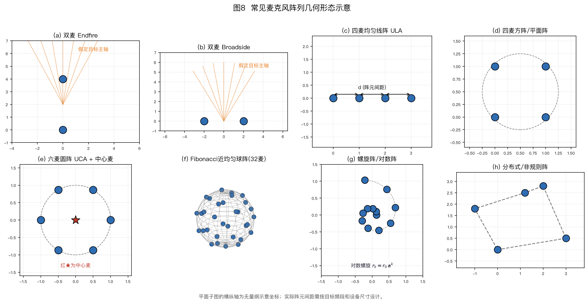
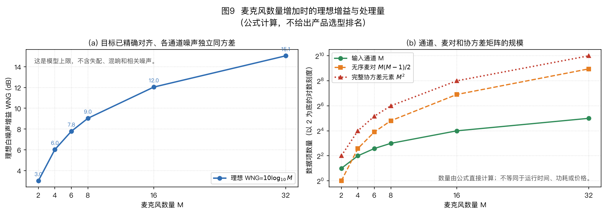
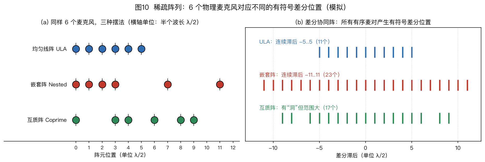

> ⚠️ 本篇是正文第 3 章（正文共 11 章，另有附录 A/B），可独立阅读，前后篇见下方导航。
>
> 🏠 首页导读：[`00_overview.md`](./00_overview.md) ｜ 上一篇：[02_basics-signal-model.md](./02_basics-signal-model.md) ｜ 下一篇：[04_doa-estimation.md](./04_doa-estimation.md)

---

## 3. 阵列几何形态

### 3.1 形态总览

图8 画出八种常见形态：（a）双麦前后排（Endfire）、（b）双麦左右排（Broadside）、（c）四麦均匀线阵、（d）四麦方阵、（e）六麦圆阵加中心麦、（f）按斐波那契球面（Fibonacci sphere）规则确定性布置的 32 麦近均匀球阵、（g）螺旋或对数阵、（h）分布式或非规则阵。（a）（b）的橙色射线表示采用相应波束形成器后的目标主轴：裸露的全向麦克风只有几何位置，不会仅凭摆成前后或左右排列就产生主瓣。（d）的四只麦虽然也落在同一个圆周上，这里按方阵的平面几何分析。

**两种基础双麦摆法**（只有 2 麦时仅这两种有意义）：

- **Endfire（前后排列）**：配合延时和差分等处理后，目标主轴可沿连线方向，形成前方保留、后方抑制的响应。用于真无线立体声（True Wireless Stereo，TWS）耳机、手机；

#### 专栏（算例独立）：算例 3-1 双麦耳机的差分——1 cm 间距怎么做心形指向

TWS 耳机上的双麦常采用端射（endfire）摆法：两个麦前后排列、间距 $d = 1$ cm，主轴沿两麦连线。它构成 §5.3 所述的**一阶差分麦克风阵列（DMA，Differential Microphone Array）**。若只把两路信号乘实数增益后相减，即 $y = x_1 - g\,x_2$（$g$ 为标量），无法形成心形指向。纯实增益不改变相位；前方与后方来声的麦间相位差分别为 $-\Delta\phi$ 和 $+\Delta\phi$，而前方 $|1-ge^{-j\Delta\phi}|$ 与后方 $|1-ge^{+j\Delta\phi}|$ 相等，结果是前后对称的 8 字形。要打破这种对称性，需先引入时延再相减：把后路麦的信号延迟 $\tau_0=d/c$，再从前路麦信号中减去：

$$y(t) = x_1(t) - x_2\!\left(t - \tfrac{d}{c}\right) \qquad\xrightarrow{\mathcal F}\qquad Y(f) = X_1(f) - e^{-j2\pi f d/c}\,X_2(f)$$

$\mathcal F$ 表示傅里叶变换。

其中 $x_1$ 是前路麦，$x_2$ 是后路麦，$d/c$ 是声音传播一个麦间距所需的时间。下面分别计算前方和后方来声的响应。

**第 1 步：两麦之间的相位差**。声音沿连线方向传来时，两麦时差最大：
$$\Delta\tau = \frac{d}{c} = \frac{0.01}{343} \approx 29.2\ \mu s$$
1 kHz 时对应的相位差（时延在频域就是相位旋转，§2.3）：
$$\Delta\phi = 2\pi f\,\Delta\tau = \frac{2\pi\times1000\times0.01}{343} \approx 0.183\ \text{rad} \approx 10.5°$$

**第 2 步：后方来声——恰好抵消（零陷）**。后方的声音先到后路麦 $x_2$、晚 $\Delta\tau$ 才到前路麦 $x_1$；而我们人为给 $x_2$ 补上的延迟 $\tau_0 = d/c$ 正好等于这个自然时差——两路在减法器里对齐成完全一样的波形，$y = 0$。**后方被挖出一个理论上无穷深的零陷。**

**第 3 步：前方来声——还剩多少**。前方的声音先到 $x_1$、晚 $\Delta\tau$ 到 $x_2$；$x_2$ 又被电延迟推后 $\Delta\tau$，两路共错开 $2\Delta\tau$，即相位差 $2\Delta\phi \approx 21°$。两路信号是复平面上两个长度相同、夹角 $21°$ 的箭头，相减得到连接两尖端的弦。剩余幅度（两路幅度归一化为 1）：
$$|Y| = \left|1 - e^{-j2\Delta\phi}\right| = 2\sin\Delta\phi = 2\sin 10.5° \approx 0.365$$
换算成分贝：$20\log_{10}0.365 \approx$ **−8.8 dB**。前方保留而后方出现零陷，因此得到心形指向。低频近似下，只要电延迟与几何时差的关系保持不变，归一化波束形状随频率变化较小。

**第 4 步：计算输出信噪比变化**。与单个麦克风相比，前方信号幅度为 0.365，对应 −8.8 dB。两路独立自噪声相减后功率相加，噪声功率增加约 3 dB，因此输出信噪比降低约 $8.8+3=11.8$ dB。这是一阶 DMA 在低频 WNG 较低的原因：间距越小、频率越低，$\Delta\phi$ 越小，目标信号在相减中保留得越少。

**第 5 步：失配最先伤害哪里**。后方零陷靠的是“两路幅度精确相等、相减归零”。若麦 2 的增益是 1.01，后方响应的绝对幅度为 $|1-1.01|=0.01$；相对单麦输入是 $20\log_{10}0.01=-40$ dB。波束图通常将目标方向归一化为 0 dB，这时还要除以失配后的前方响应：

$$|B_{\rm front}|=\left|1-1.01e^{-\mathrm j2\Delta\phi}\right|\approx0.367,\qquad 20\log_{10}\frac{0.01}{0.367}\approx-31.3\ \mathrm{dB}。$$

因此，“约 −40 dB”是以单麦幅度为参考的绝对残差；本算例归一到前方主响应后，零陷约为 −31 dB。两个数的参考量不同，不能混用。增益失配主要限制后方零陷的深度，依赖精确相消的微型差分阵列因此需要通道配对和标定。

端射摆法利用延迟与相减形成前后不对称；正横（Broadside）摆法则把主轴放在麦克风连线的垂直方向。

- **Broadside（左右排列）**：配合相应波束形成器后，目标主轴可设为垂直于连线，用于笔记本、平板通话降噪。

双麦只有 1 个独立时延观测。在预先限定声源位于某个平面或半空间时，它可以估计一维入射角并形成固定波束；若要在三维空间同时求方位和俯仰，一个时延方程不够，同一时延对应绕阵列轴的一圈方向，形成锥面模糊。

双麦只有一个独立时延约束。增加阵元并改变几何后，覆盖范围、歧义形式和端射灵敏度也会变化。

**多麦形态对比**：

| 形态 | 覆盖 | 优点 | 缺点 | 典型应用 |
|---|---|---|---|---|
| **均匀线阵 ULA** | 一维 ±90° | 算法最成熟（MUSIC/ESPRIT 天然适配）、孔径利用率高 | 分不清俯仰、端射区分辨率崩塌、前后模糊 | Soundbar、会议条 |
| **均匀圆阵 UCA** | 水平 360° | 水平面几何比 ULA 均衡、紧凑 | 有限阵元只有离散旋转对称，波束仍随频率和转向变化；俯仰分辨弱、小半径低频差 | 智能音箱、桌面会议设备 |
| **方阵/平面阵** | 单侧半空间；若两侧都开放则有镜像歧义 | 方位+俯仰都能测 | 阵列平面两侧的镜像方向具有相同时延，需挡板或先验消歧 | 视频会议一体机 |
| **球阵（刚性/开放球）** | 全 $4\pi$ 立体角 | 三维覆盖较均匀，可录 3D 声场 | 成本高、体积大；有限阵元下波束仍随频率和方向变化 | 机器人听觉头、3D 录音、学术研究 |
| **螺旋阵/对数阵** | 宽频带 | 非均匀间距可打散周期性栅瓣 | 设计与宽带优化较复杂；自由场导向矢量仍可按已知坐标计算 | 高品质远场录音 |
| **分布式/随机阵** | 超大孔径 | 房间级间距换高分辨率、抗混响（空间分集） | 标定与同步困难 | 多房间节点、大型会议室 |

*（表中的算法名词如 MUSIC/ESPRIT 可先跳过，读完 §4 后回看本表会更清晰。）*

**读表时要区分两种模糊**。线阵只有沿阵列轴的位置投影信息，因此同一组时延对应以阵列轴为轴的锥面；把麦继续加在同一直线上，能提高阵列增益和估计精度，却不能消除这类锥面模糊。非共线的平面阵能同时估计两个方向余弦，但若阵列两侧都开放，平面法向两侧的镜像方向仍可能产生相同时延，需要挡板、幅度模型或半空间先验消歧。另一类问题是端射分辨率下降：正横起算时 $\Delta\tau=(d/c)\sin\theta$，在 $\theta\to\pm90°$ 处导数趋近于零，同样的时延误差会对应更大的角度区间；这与 §2.6 CRB 中 $\cos\theta\to0$ 时下界发散一致。

#### 专栏（算例独立）：算例 3-2 端射灵敏度——同一个 10 μs 误差在不同方向的影响

§3.1 说线阵「端射区分辨率崩塌」，根源是时延与角度的关系 $\Delta\tau = \frac{d}{c}\sin\theta$（$\theta$ 从正横方向起算，$d$ 为麦间距）。对 $\theta$ 求导：
$$\frac{d\Delta\tau}{d\theta} = \frac{d}{c}\cos\theta \quad\Rightarrow\quad d\theta \approx \frac{c}{d\cos\theta}\,d\Delta\tau$$
即：**同样的时延误差 $d\Delta\tau$，换算成角度误差时要除以 $\cos\theta$**。取 $d = 4$ cm 的线阵（与 §4.4 的例子一致）、时延误差 $d\Delta\tau = 10\ \mu s$（16 kHz 采样下不到 1/5 个采样点，是很容易残留的误差量级），算两个方向。

**正横方向（$\theta = 0°$）**：$\cos 0° = 1$，
$$d\theta = \frac{343\times10\times10^{-6}}{0.04\times1} \approx 0.0858\ \text{rad} \approx 4.9°$$
10 μs 误差对应约 5° 的角度误差。这也复现了 §4.4“4 cm 间距下 10 μs 误差对应约 5°”的结论。

**端射附近（$\theta = 85°$）**不能继续把 10 μs 当作“小扰动”。本例最大物理时延是 $d/c\approx116.6$ μs，85° 对应 $\tau\approx116.2$ μs。若估计值增加 10 μs，便超过物理上限，没有实数角度与之对应，系统应当判为越界或把结果限制在端射。若估计值减少 10 μs，则

$$\hat\theta=\arcsin\!\left(\frac{(116.2-10)\times10^{-6}\times343}{0.04}\right)\approx65.6°\text{，}$$

误差约 19.4°。微分式在足够小的误差下仍说明灵敏度按 $1/\cos\theta$ 增大，但不能把 85° 处的 10 μs 线性外推成 56° 并当作精确误差。实际可用角域由允许误差、信噪比、快拍数和几何共同决定，不存在统一的“端点扣掉 30°”规则。

端射方向的非线性算例说明，阵列灵敏度随入射角变化。下面把几何设计中最常用的四条规律集中列出。

### 3.2 四条设计规律

1. **常规波束的分辨率尺度由孔径与波长之比决定**（约 $\lambda/D$）：7 cm 级圆阵在 1 kHz 的这个尺度已经超过线阵的整个可视角域，方向选择性很弱；到 4 kHz 才进入几十度量级（见算例 3-3）。高频虽然能提供更大的电尺寸，却也更容易遇到空间混叠、传播衰减和阵列失配。设计时必须把这些因素一起考虑。

**算例 3-3：6 麦圆环的数字**

考虑一个用于教学的 6 麦均匀圆环，环径取 7.5 cm，即半径 $r = 3.75$ cm。这个尺寸只用于展示计算方法，不对应某一款产品；声速取 $c = 343$ m/s。

**第 1 步：相邻麦距**。6 个麦均匀分布在圆周上，相邻两麦的连线是正六边形的一条边。相邻麦距
$$d = 2r\sin\frac{\pi}{6} = 2\times0.0375\times0.5 = 0.0375\ \text{m} = 3.75\ \text{cm}$$
正六边形的边长恰好等于半径——这是 6 麦圆环特有的整齐性质。

**第 2 步：相邻间距的保守检查**。对均匀线阵，全视场无空间混叠的充分安全线是 $d \le \lambda/2$（§2.6）。圆阵不是一条周期均匀线阵，这里只把相邻弦长代入同一条件，作为保守的设计检查；超过该频率表示不再得到全视场无歧义保证，不表示每个转向都必然出现等高栅瓣。代入：
$$f_{\max} = \frac{c}{2d} = \frac{343}{2\times0.0375} \approx 4573\ \text{Hz} \approx 4.6\ \text{kHz}$$
因此，按相邻间距的半波长充分条件，这个阵列约在 4.6 kHz 以下满足全视场无混叠要求。16 kHz 采样时，4.6～8 kHz 频段不再得到这一保证。可选措施包括降低高频子带权重、采用非均匀间距以减弱周期性歧义，以及定位时主要使用无混叠频段、增强时再利用高频信息。

**第 3 步：波长与孔径的比**。阵列孔径（阵列的最大尺寸）$D = 2r = 7.5$ cm。
- 1 kHz：波长 $\lambda = c/f = 343/1000 = 0.343$ m $= 34.3$ cm，孔径比 $D/\lambda = 0.075/0.343 \approx 0.22$——**整个阵列只有约五分之一波长大小**；
- 4 kHz：$\lambda = 343/4000 \approx 0.0858$ m $= 8.6$ cm，$D/\lambda = 0.075/0.0858 \approx 0.87$——孔径接近一个波长。

**第 4 步：常规波束的角宽量级**。用 $\lambda/D$（弧度，§2.6）做孔径尺度估计：
- 1 kHz：$\lambda/D \approx 0.343/0.075 \approx 4.6$ rad $\approx 262°$——这个数已经超过了整个可视范围（线阵 ±90°、圆阵水平面 360° 一圈），物理含义是：**1 kHz 下这只 7.5 cm 的环几乎没有方向分辨能力**，主瓣宽到接近全向；
- 4 kHz：$\lambda/D \approx 1.14$ rad $\approx 66°$，对应主瓣宽度量级 $\approx 0.886\lambda/D \approx 58°$（借用线阵公式估量级，圆阵精确系数不同）——进入「几十度」的量级，总算能分出「大概在哪一边」。

**结论**：4 kHz 时阵列的电尺寸接近 1，常规波束已可能呈现几十度量级的方向选择性；1 kHz 时电尺寸只有约 0.22，常规波束很宽。子空间估计或学习方法能在合适条件下利用微弱的跨通道差异，但不会凭空增加观测信息；低信噪比、强混响或模型失配时，低频方向仍难估。

**算例 3-4：ULA 主瓣宽度计算**

取一条 4 麦均匀线阵（ULA，uniform linear array，等间距直线排列的阵列），间距 $d = 3$ cm，指向正横。首末阵元的物理跨度为 $(M-1)d=9$ cm；§2.6 从离散阵因子推得的窄主瓣近似则是

$$\mathrm{HPBW} \approx \frac{0.886\,\lambda}{Md}\ \text{rad}$$

这里的 $Md=12$ cm 来自 Dirichlet 核的近似尺度，不等于物理跨度。对小阵列要保留这个区别。

**1 kHz**：波长 $\lambda = 343/1000 = 0.343$ m。若强行代入窄主瓣近似，会得到 $0.886\times0.343/0.12\approx2.53$ rad，但这个数不是该阵列的 HPBW。直接计算精确阵因子：端射处 $\psi=2\pi d/\lambda\approx0.550$ rad，

$$\left|B(90°)\right|=\left|\frac{\sin(M\psi/2)}{M\sin(\psi/2)}\right|\approx0.821，$$

即 $20\log_{10}0.821\approx-1.71$ dB。从 $-90°$ 到 $90°$ 都没有降到 −3 dB，所以本例在 1 kHz 下**没有可定义的 −3 dB 主瓣宽度**。

**8 kHz**：波长 $\lambda = 343/8000 \approx 0.0429$ m，
$$\mathrm{HPBW} \approx \frac{0.886\times0.0429}{0.12} \approx 0.317\ \text{rad} \approx 18.1°$$

**这两个结果怎么读**：1 kHz 下精确阵因子在可视范围内没有 −3 dB 交点，只能说明波束方向选择性很弱；不能把近似式给出的 145° 当成实际 HPBW。8 kHz 下近似估计约为 18.1°，主瓣明显收窄。只要几何和转向不变，处在窄主瓣近似的适用区间时，频率减半会使 HPBW 约增大一倍。

2. **圆阵与线阵各有适用方向**：线阵在正横附近投影孔径最大，转向端射时灵敏度下降；圆阵在水平面各方位的几何更均衡。球阵还可提供俯仰信息。哪一种识别率更高，取决于尺寸、挡板、房间、算法和评测方向分布，不能只按阵形下结论。[Kumatani–McDonough–Raj《Microphone Array Processing for Distant Speech Recognition》CMU 课程讲义，2012](https://course.ece.cmu.edu/~ece792/handouts/KumataniEtAl12.pdf "citation")
3. **挡板效应必须纳入导向模型**：麦克风装在刚性圆柱或球体上时，绕射和散射会改变跨通道的幅相响应。某些频段和方向上，它能增加可辨的幅相差；另一些位置也可能出现阴影或共振。因此应使用相应的解析散射模型或实测阵列流形，不能把挡板一概等效为固定倍数的“虚拟孔径”。
4. **麦克风数量没有通用最优值**：增加麦克风通常能提高统计稳定性和可控自由度，但收益取决于是否同时增加孔径、噪声相关性、带宽、算法和计算预算。对独立等功率自噪声，理想 DSB 的 WNG 为 $10\log_{10}M$，麦数翻倍增加约 3 dB；这只是特定噪声模型下的基准，不能单独决定产品所需的麦克风数量。

图 9（a）在目标精确对齐、各通道噪声独立同方差的条件下，按 $10\log_{10}M$ 画出理想 DSB 白噪声增益。（b）分别按 $M$、$M(M-1)/2$ 和 $M^2$ 计算输入通道、无序麦对与完整协方差矩阵的元素数量。右图的纵轴采用以 2 为底的对数刻度。这些数量用于说明数据结构怎样随 $M$ 增长，不等同于具体实现的运行时间、功耗或价格。

> §3.3 转向非均匀稀疏阵，说明怎样用差分协同阵扩展虚拟孔径。

### 3.3 稀疏阵列与差分协同阵

#### 协同阵的概念：从麦的位置到麦对的间距

均匀线阵若要在整个可视角域避免栅瓣，阵元间距需不大于半波长（§2.6）。在给定麦克风数量下，这一条件限制了物理孔径。**稀疏阵列（sparse array）**采用非均匀位置，并利用麦克风对的位置差构造更长的虚拟阵列。

**核心概念：差分协同阵（difference co-array）**。理想远场窄带模型下，协方差矩阵第 $i,j$ 个元素的相位由麦 $i$ 与麦 $j$ 的位置差决定。收集所有麦对的位置差，就得到差分协同阵。6 麦均匀线阵的位置是 {0,1,2,3,4,5}（单位 $\lambda/2$），不同的有符号滞后是 {0, ±1, …, ±5}，共 11 个；6 麦嵌套阵 {0,1,2,3,7,11} 可得到 {0, ±1, …, ±11}，共 23 个连续滞后（图10）。这 23 个数是连续的**有符号差分滞后**，不是 23 路彼此独立的物理快拍。若按滞后平均、构造 Toeplitz 虚拟协方差并做空间平滑，可得到比物理阵更长的虚拟 ULA；在模型和秩条件满足时，部分协同阵方法因而可能估计多于物理麦数的非相干源。可分辨源数仍取决于连续单侧滞后长度、重构方法、平滑后的矩阵维数、信噪比和快拍数，不能直接等同于 23。

差分集合只给出虚拟阵列的位置。要把这些位置用于子空间估计，还需要从协方差中构造相应的二阶统计量。

#### 协方差为什么能当虚拟观测

**为什么协方差能提供虚拟滞后观测**：对互不相干的远场源，$\mathbf{R}$ 的第 $i,j$ 个元素是各源功率乘相位项 $e^{-j2\pi f(\tau_i-\tau_j)}$ 的和，只依赖两麦位置差。相同位置差的麦对可做平均，降低估计方差；不同位置差提供不同滞后。把协方差元素按滞后重排后，可把连续的一段滞后解释为虚拟 ULA 的二阶统计量。它不是原始阵列快拍，因此标准 MUSIC 不能不经处理直接套用；通常还需 Toeplitz 重构、直接协同阵处理或空间平滑，才能形成满足子空间方法要求的虚拟协方差。相干源、宽带混响、有限快拍和有洞差集都会降低可用秩和自由度。

可以把它理解为重新整理“麦对间距表”：相同间距的观测合并，不同间距按顺序排成一条虚拟标尺。标尺更长，潜在孔径更大；但只有完成统计重构并满足秩条件后，这些滞后才会转化为可用的子空间自由度。

图 10 左侧比较均匀、嵌套和互质三种摆法，横轴单位是半波长；右侧枚举所有有序麦对的位置差，得到有符号差分位置（也称有符号滞后）。均匀阵有 11 个连续滞后，图中的嵌套阵有 23 个连续滞后，互质阵覆盖范围更大但中间有空缺。连续滞后数描述虚拟孔径结构，不应直接写成 MUSIC 可分辨的源数。

这种虚拟观测依赖统计重构和秩条件；差分集合中的空缺、宽带信号和混响都会限制可用自由度。

#### 代价与边界：差分空缺、宽带和混响

**代价与边界**：协同阵使用的是二阶统计量，需要专门的协同阵 MUSIC、Toeplitz 重构、空间平滑或稀疏重构；差分滞后中的洞还会使可用连续虚拟孔径缩短，插值或矩阵补全又会引入额外假设。嵌套阵与互质阵最初主要在窄带阵列模型下发展。语音宽带、混响和频率相关阵列流形会增加处理难度，因此实际使用前应在目标频带和房间条件下验证，而不能只按理论差集长度选型。[Pal 与 Vaidyanathan 的嵌套阵原始论文](https://doi.org/10.1109/TSP.2010.2049264 "citation")、[Vaidyanathan 与 Pal 的互质阵原始论文](https://doi.org/10.1109/TSP.2010.2089682 "citation")。

稀疏阵与分布式阵不是同一概念。稀疏阵通常指按特定非均匀位置设计的阵列；分布式阵由多个独立设备组成，除了几何布局，还要处理节点标定、独立时钟和通信。

上述几何分析默认通道和位置准确。实际系统还需要通过标定减小增益、相位、耦合和位置误差。

### 3.4 阵列校准：麦克风个个不一样时怎么办

前面的理想公式假设各通道增益和相位一致、阵元位置准确，并忽略壳体散射、声学耦合和电串扰。实际偏差会使导向模型与观测不匹配。本节把常见偏差写进模型，再说明怎样测量和补偿。

#### 3.4.1 增益相位自校准：利用未知声源的多位置观测

**1. 增益相位自校准的思想**。把每只麦的响应误差写成一个复数：增益误差是幅度缩放，相位误差是额外旋转，合起来第 $m$ 路的实际增益是 $(1+\Delta g_m)e^{\mathrm{j}\Delta\phi_m}$（理想值是 1）。导向矢量 $\vec{a}(\theta)$ 的每个分量都会乘上这个误差，因此 MUSIC 谱峰会变宽或偏移，波束零陷也会变浅。麦克风阵列实测校准的一个原始例子见 [Sachar、Silverman 与 Patterson 2004](https://doi.org/10.1109/TSA.2004.834459 "citation")。

自校准可以不用已知方向的专用声源。常见做法是交替估计：先固定通道误差估方向，再固定方向估各麦的复增益，循环到目标函数收敛。它依赖可辨识条件。若只有一个固定方向，声源相位、传播相位和麦克风相位误差可能互相混淆；加入多个充分分散的方向、频点或几何约束后，才有机会分离这些未知量。具体需要多少方向取决于模型参数和约束，不能用一条固定数字概括。

复增益标定处理单通道幅相偏差；跨通道电串扰可在一定线性近似下写成频率相关混合矩阵，壳体散射则通常还随入射方向变化。

#### 3.4.2 互耦补偿：把串音矩阵抵消掉

**2. 耦合与串扰补偿**。电路走线或器件间的线性串扰，在近似不随声源方向变化时可写成频率相关矩阵 $\mathbf{C}(f)$，实际导向矢量变为 $\mathbf{C}(f)\vec{a}(f,\theta)$。壳体绕射和散射直接改变声场，通常应写成方向相关的实测流形 $\vec a_{\rm meas}(f,\theta)$，或在确有依据时用 $\mathbf C(f,\theta)\vec a(f,\theta)$ 表示，不能无条件并入固定 $\mathbf C(f)$。可用已知方向的测量拟合模型，也可直接把实测阵列流形存入系统。若对固定混合矩阵显式求逆，$\mathbf{C}(f)$ 条件数很大时会放大噪声，因此通常需要正则化，而不是无条件左乘精确逆矩阵。依赖深零陷的差分或超指向设计通常比 DSB 更容易受失配影响。

耦合矩阵描述通道间混合，但不能替代麦克风坐标标定。位置误差会直接改变传播相位。

#### 3.4.3 位置自标定：有锚测绘、无锚边走边建图

**3. 位置自标定**。8 kHz 的波长约为 4.3 cm，2 mm 位置误差对应的相位误差为 $2\pi\times0.002/0.0429\approx0.29$ rad，即约 17°；低频下同一位置误差造成的相位偏差较小。位置标定有两类方法：①**有锚点标定**，在多个已知位置播放信号，由 TDOA 反解麦克风坐标；②**无锚点自标定**，同时估计声源位置与麦克风位置，要求声源运动或多位置观测满足可辨识条件。无外部锚时，观测至少不能区分整体平移、旋转和镜像；只用方向观测时还可能不能确定尺度。实现中要固定参考麦克风、坐标轴和尺度，或加入已知距离，才能报告唯一的绝对坐标。相关可辨识性分析可参见 [Kuang 等，ICASSP 2013](https://doi.org/10.1109/ICASSP.2013.6638384 "citation")。分布式阵列还需同时估计节点时钟关系（§10.2），否则 TDOA 会包含系统偏差。

下表汇总不同失配首先影响的量、误差尺度和补偿方法。

#### 3.4.4 失配灵敏度表：先坏哪、坏多少

**4. 失配灵敏度表**：

| 失配类型 | 典型量级 | 最先坏掉的东西 | 数量感 | 补救 |
|---|---|---|---|---|
| 增益失配 | 1%（约 0.1 dB） | 差分/超指向的零陷深度 | 本例残差相对单麦为 −40 dB；波束图归一到前方响应后约 −31 dB（§3.1 算例 3-1 第 5 步） | 产线逐只配对、出厂标定系数 |
| 相位失配 | 2°（高频段） | 高频指向精度 | 2° 相位误差在 8 kHz 约等于 0.24 mm 等效位置误差，MUSIC 峰偏、旁瓣抬高 | 同增益，一起标 |
| 位置误差 | 2 mm | 高频导向矢量 | 8 kHz 下约 17° 相位误差；1 kHz 下约 2°。后者对常规主瓣可能较小，但在依赖精确相消的零陷中仍可能显著：两路残余幅度约 $2\sin(1°)=0.0349$，相对单路约 −29 dB | 有锚/无锚位置标定 |
| 耦合与壳体散射 | 随结构、频率而变 | 零陷深度、旁瓣电平 | 不能仅由一个间距门槛判断；须比较自由场模型与实测流形 | 使用实测流形，或正则化估计 $\mathbf{C}(f)$ |
| 时钟漂移（分布式） | 晶振几十 ppm | TDOA 系统性偏差 | 跑 1 小时即差约 0.18 秒（百毫秒级），是百微秒级时差的上千倍（§2.1、§10.2） | 共时钟/在线同步补偿 |

位置误差造成的相位偏差随频率增大；增益漂移、耦合和噪声则未必遵循同一单调关系。依赖精确相消的零陷和超指向设计通常最敏感。固定一体式阵列常用出厂标定，分布式阵列还需处理节点位置、时钟偏移和采样率漂移，并根据设备移动或时钟变化决定是否在线更新。

**工程流程**通常分三步：先在受控声场中测各通道的频率响应和阵列流形，再把补偿参数写入设备，最后用若干已知方向复测主瓣、旁瓣和零陷。若设备结构、温度或节点位置会变化，还要定义重新标定的触发条件。采用逐只通道修正、整机流形查表还是在线联合估计，取决于硬件一致性、存储、算力和使用环境。

几何决定可观测的空间信息，标定决定理论模型能否用于实测数据。第 4 章将从 GCC-PHAT 开始介绍声源定位算法。

### 本章练习

1. 协同阵数差集验证：6 麦均匀线阵位置记为 {0, 1, 2, 3, 4, 5}（单位 $\lambda/2$），列出全部麦对位置差，验证连续差集是 {0, ±1, …, ±5}、共 11 个有符号滞后；再对嵌套阵 {0, 1, 2, 3, 7, 11} 做一遍，验证是 {0, ±1, …, ±11}、共 23 个连续滞后。为什么还不能直接说它能分辨 22 个声源？
   答案要点：这些数是二阶统计量中的有符号滞后，不是 23 路独立快拍。必须先按滞后平均并构造满足结构约束的虚拟协方差，必要时再做空间平滑。可分辨源数由平滑后矩阵的维数和秩、源相关性、信噪比及快拍数共同决定，不能直接用 23 减 1。
2. 栅瓣与挡板二选一：7.5 cm 环径的 6 麦圆环（§3.2 算例 3-3），若把工作频率推到 8 kHz，会发生什么？挡板（规律 3）又是在补哪一段的短板？
   答案要点：8 kHz 波长约 4.3 cm，半波长约 2.1 cm，小于 3.75 cm 相邻麦距，已经不满足全视场无混叠的充分条件。圆阵是否在某一转向出现等高歧义，要看完整几何和宽带融合，不能只套 ULA 的单一栅瓣角公式。挡板会以频率和方向相关的方式改变幅相响应；若模型使用得当，这些额外差异可帮助消歧，但它不是固定地把低频下限移动某个倍频程。

---

> 📄 本篇信息：配图 3 张 ｜ [回首页](./00_overview.md)
