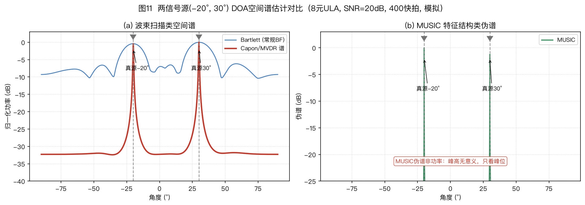
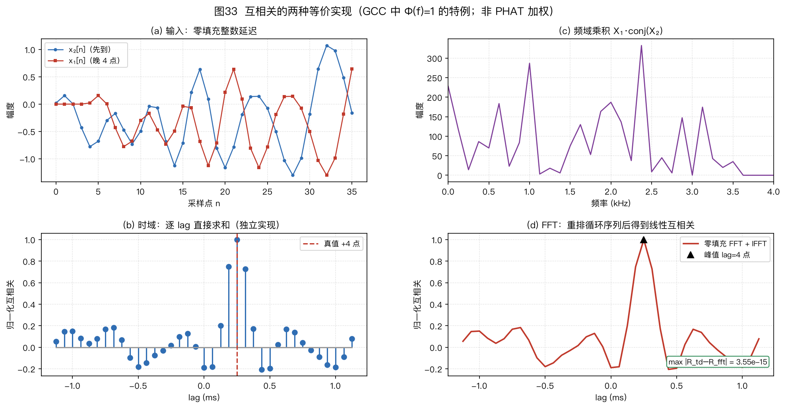
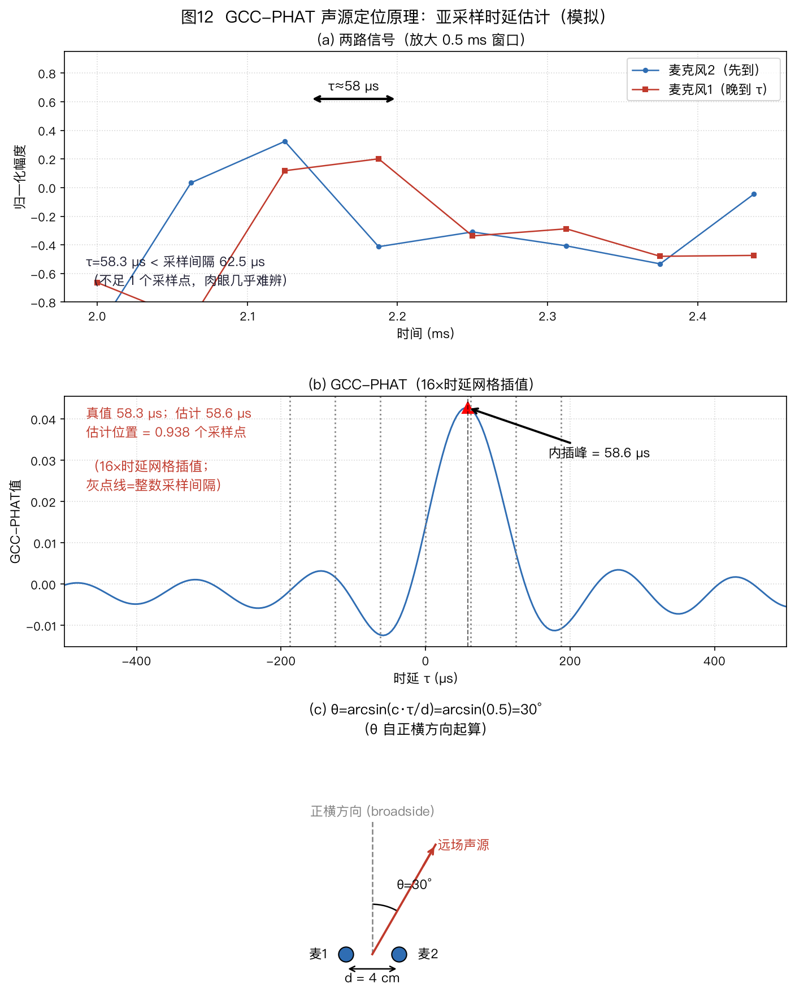
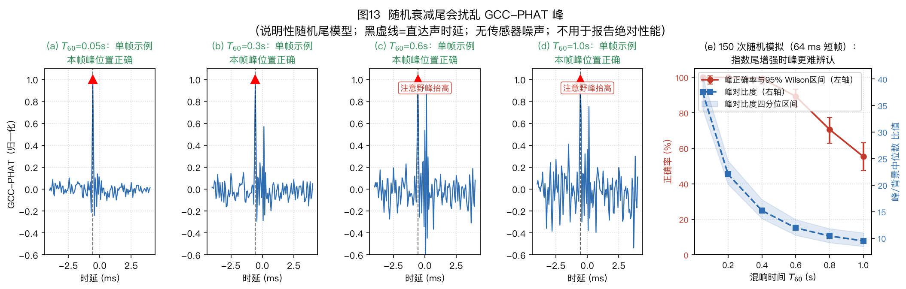
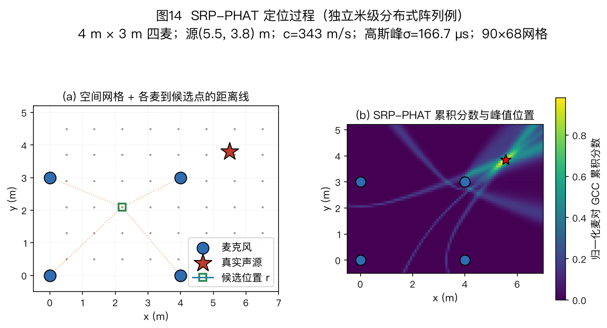

> ⚠️ 本篇是教程正文第 4 章（正文共 11 章，另有附录 A/B），可独立阅读，前后篇见下方导航。
>
> 🏠 首页导读：[`00_overview.md`](./00_overview.md) ｜ 上一篇：[03_array-geometry.md](./03_array-geometry.md) ｜ 下一篇：[05_beamforming.md](./05_beamforming.md)

---

## 4. 声源定位（波达方向，Direction of Arrival，DOA）

### 4.1 总览：四大类思路

```
声源定位算法
├── A. 两阶段法（到达时间差，Time Difference of Arrival，TDOA）：先从麦对估计时延，再解算位置
│     ├── GCC 加权互相关（SCOT / Roth / PHAT / ML）估计麦对时延
│     └── 多麦对几何解算（LS，least squares，最小二乘 / 泰勒迭代）
├── B. 直接空间扫描类：逐候选位置或方向计算全阵列得分
│     ├── SRP-PHAT（按候选时延查各麦对的整条 GCC 曲线并累积）
│     ├── Bartlett 波束形成谱
│     └── Capon / MVDR（最小方差无失真响应）谱
├── C. 子空间类（超分辨）
│     └── 多重信号分类（Multiple Signal Classification，MUSIC）/
│         借助旋转不变技术估计信号参数（ESPRIT）（相干源需配空间平滑预处理）
└── D. 稀疏重构与深度学习类
      ├── L1-SVD / SBL（压缩感知；SBL = sparse Bayesian learning）
      └── DNN（deep neural network，深度神经网络；SRP-CNN、GCC-PHAT+CRNN、ACCDOA）
```

图 11 在同一个两源仿真（−20°、30°）中比较 Bartlett、Capon 和 MUSIC。条件为 8 元半波长 ULA、每阵元总输入 SNR 20 dB、400 个快拍，两源相隔 50°。这个较容易的条件只展示三种谱形，不检验最小可分辨角度。

Bartlett 按标准空间谱计算。Capon 在样本协方差上使用相对对角加载 $\eta=10^{-6}$，即 $\hat{\mathbf R}+\eta\operatorname{tr}(\hat{\mathbf R})\mathbf I/M$。MUSIC 给出伪谱，峰高不是功率。

只有在源间隔、信噪比、快拍数、源数和阵列失配都明确时，才能用重复试验比较分辨成功率。



**图示说明**：比较三类方法的谱形，不比较图中的绝对峰高。Bartlett 的分辨率受阵列孔径限制；Capon 利用协方差逆矩阵抑制其他方向；MUSIC 依赖信号子空间与噪声子空间的正交性。谱峰个数也不能无条件当作源数：旁瓣、相干多径和有限快拍都可能产生假峰或合并真峰，源数估计要按下一节的方法独立完成。

#### 4.1.1 源数估计：确定信号子空间维数

子空间类（MUSIC、ESPRIT）必须先确定源数 $K$。$K$ 定错后，信号子空间与噪声子空间的切分位置也会错。

MUSIC 还要满足 $K<M$，否则没有非零维噪声子空间可供正交检验。ESPRIT 的两个子阵也都必须至少有 $K$ 维，实际通常保留更多阵元以降低有限快拍误差。下面给出两种常用估计方法。

**方法 1：特征值间隙（eigen-gap）**。把固定频点 $f_k$ 的协方差矩阵 $\hat{\mathbf{R}}(f_k)$（读作“R 帽”，帽子表示用有限快拍估计出来的版本）的特征值从大到小排列。前 $K$ 个特征值包含信号与噪声功率，后面 $M-K$ 个在白噪声模型下接近 $\sigma^2$。

算例 4-4 的无噪声单源给出 $3,\,0,\,0$，因此 $K=1$。实际数据中，低信噪比或快拍不足会缩小相邻特征值之间的间隔；可比较相邻特征值的比值或差值，并把最大间隙所在位置作为候选分界。这种方法计算简单，但在低信噪比或快拍不足时不稳定。

**方法 2：信息准则（AIC/MDL）**。增加候选源数通常会改善数据拟合，同时也会增加模型复杂度。AIC（Akaike information criterion，赤池信息准则）和 MDL（minimum description length，最小描述长度）用不同的复杂度惩罚项平衡这两部分，并取准则值最小的候选 $K$。

Wax 与 Kailath 的[1984 年原始会议论文，式(10)～(15)](https://doi.org/10.1109/ICASSP.1984.1172389 "citation")给出了复数观测、空间白噪声、独立快拍模型下的推导；[1985 年期刊论文](https://doi.org/10.1109/TASSP.1985.1164557 "citation")题为 *Detection of signals by information theoretic criteria*。两篇论文的题名和公式编号不能混用。MDL 比较剩余特征值的几何均值与算术均值，再加入源数惩罚；[§4.9](#sec-4-9)给出完整定义、逐候选计算和代码练习。

实现时必须核对复/实数据、快拍数和惩罚项口径。低 SNR、快拍不足、彩色噪声或相干源导致的信号协方差降秩都会造成误判。

信噪比高、快拍充足时，可以先看特征间隙；需要自动选择 $K$ 时可用 MDL，并用特征值谱交叉检查。

相干源场景还存在一个实际循环：空间平滑要按候选源数选择子阵长度，而源数又要从平滑后的谱估计。可先给出源数上界 $K_{\max}$，对候选 $K$ 和子阵长度联合扫描，再检查结果对参数是否稳定。对 $M$ 元均匀线阵（Uniform Linear Array，ULA）做前向空间平滑时，若切成 $L$ 个长度为 $P=M-L+1$ 的重叠子阵，要分辨 $K$ 个完全相干源，至少需要 $L\ge K$ 且 $P>K$。这两个条件同时限制可分辨源数和剩余有效孔径。[Shan、Wax 与 Kailath 的空间平滑分析](https://doi.org/10.1109/TASSP.1985.1164649 "citation")。

> 子空间法需要源数，GCC-PHAT 不需要。下一节先从双通道时延估计讲起。

### 4.2 GCC-PHAT：“对齐两段录音，找最吻合的错位”

本章沿用 §2.1～§2.3：麦 1 在 $x=0$，麦 2 在 $+x$；正横为 0°，正角朝麦 2；$\vec u$ 从阵列指向声源，传播方向为 $-\vec u$；$\tau_{ij}=t_i-t_j$。

采用前向核 $e^{-\mathrm j2\pi ft}$ 时，

$$\tau_{m1}=-(\vec r_m-\vec r_1)^\top\vec u/c,$$

$$a_m=e^{-\mathrm j2\pi f\tau_{m1}}=e^{+\mathrm j2\pi f(\vec r_m-\vec r_1)^\top\vec u/c}。$$

因此正角双麦有 $\tau_{21}<0、\tau_{12}>0$。

**直觉**：把第二路录音左右平移，平移到与第一路最像的那个错位量就是时间差。

**时域定义**。两路离散信号 $x_1(n)$、$x_2(n)$，定义时延 $\tau$ 处的互相关值（$\tau$ 以采样点为单位，取遍 $\cdots,-2,-1,0,1,2,\cdots$）：

$$R(\tau) = \sum_n x_1(n)\,x_2(n-\tau)\text{。}$$

把 $x_2$ 往右挪 $\tau$ 格，和 $x_1$ 上下对齐，逐点相乘再求和。加总越大，这个错位下两路越像。最后取峰：$\hat\tau = \arg\max_\tau R(\tau)$（$\arg\max$ 返回峰的位置，不是峰高）。直接计算需要 $O(N^2)$ 次乘加；频域实现可把复杂度降到 $O(N\log N)$。

> **频域等价式（相关定理）**：时域逐点算出的整条 $R(\tau)$，等于频域共轭相乘后再作逆变换——
>
> $$R(\tau) = \mathrm{IFFT}\{X_1(f)X_2^*(f)\}$$
>
> 连续时间形式写成积分，见下文的快速实现公式。
>
> 两边是同一个相关函数，只是计算路线不同。本文把 $\tau_{12}>0$ 定义为“信号到麦 1 比到麦 2 晚”，即 $x_1(t)=x_2(t-\tau_{12})$。在这个定义下，`ifft(X1·conj(X2))` 的峰位是 $+\tau_{12}$；若交换两路，峰位变成 $-\tau_{12}$。实现和论文若采用不同的信号次序或相关定义，符号也会随之改变。

**频域实现：用一次 IFFT 计算整条相关曲线**。两路信号为 $x_1,x_2$，$X_1(f)$、$X_2(f)$ 是它们在第 $f$ 个频点上的复数谱值，都是标量。运算顺序是先对 $X_2(f)$ 取共轭得到 $X_2^*(f)$，再与 $X_1(f)$ 逐频点相乘：

$$R_{x_1x_2}(\tau) = \int \Phi(f)\,X_1(f)X_2^*(f)\,e^{\mathrm{j}2\pi f\tau}df, \qquad \hat\tau = \arg\max_\tau R(\tau)\text{。}$$

代码里就是 `ifft(Φ·X1·conj(X2))` 后找最大值索引。快速傅里叶变换（Fast Fourier Transform，FFT）负责计算整条相关曲线，$\arg\max$ 负责从曲线上读峰位，两者是前后两步。

复杂度从 $O(N^2)$ 降到 $O(N\log N)$。实际加速比还取决于帧长、补零长度、FFT 库和硬件，不能只由渐近复杂度给出固定倍数。



**图示说明**：图33(a)给出零填充整数延迟信号；(b)按定义逐个 lag 直接求和；(c)计算频域乘积 $X_1X_2^*$；(d)用零填充 FFT 和 IFFT 得到线性互相关。时域与频域由独立代码计算，图中给出最大数值误差。该图对应 $\Phi(f)=1$ 的普通互相关，不包含 PHAT 加权。

**线性相关与补零**：FFT 算的是**圆周相关**（序列尾部会卷绕到开头），帧不够长时两端的 $R(\tau)$ 会被卷绕项污染；工程上补零到 $N\ge N_1+N_2-1$（两帧长度之和减一）再做 FFT。下文 8 点手算例因脉冲远离边缘、考察点无混叠，所以未补零也能得到相同结果；一般输入仍须补零。

这项有限长度等价针对未加权互谱 $X_1X_2^*$。PHAT 再除以互谱幅度后，逆变换一般不再具有原来长度的有限支撑；补零可以加密频率采样、减轻周期边界影响，但不能据此称为精确的有限长线性互相关。比较实现时须记录 FFT 长度、加权和保留的 lag 范围。图 33 的严格时域等价不应外推为任意 PHAT 权重下的同一有限求和式。

**符号说明**：这里的 $R(\tau)$ 是时延 $\tau$ 的标量互相关函数；后文 §4.5 起的 $\hat{\mathbf{R}}(f_k)$ 是频点 $f_k$ 上的 $M\times M$ 协方差矩阵，以黑体和估计符号相区别。

**为什么相位里藏着时延**：沿用“麦 1 晚到”为正的定义，$x_1(t)=x_2(t-\tau_0)$，因此 $X_1(f)=X_2(f)e^{-\mathrm{j}2\pi f\tau_0}$。于是

$$X_1(f)X_2^*(f) = |X_2(f)|^2\,e^{-\mathrm{j}2\pi f\tau_0}\text{，}$$

相位 $\angle\{X_1X_2^*\}=-2\pi f\tau_0$ 的斜率是 $-2\pi\tau_0$。例如 $\tau_0=58.3\,\mu$s 时，1 kHz 和 2 kHz 处的相位分别约为 $-0.366$ rad 和 $-0.733$ rad。逆变换在 $\tau=\tau_0$ 处乘上 $e^{\mathrm{j}2\pi f\tau_0}$，恰好抵消这条负斜率，各频点同相相加形成峰。

PHAT 把互谱除以其幅度，使每个保留频点只贡献单位幅度的相位项。理想单时延模型下，这样可以减少谱包络对相关峰形的展宽。

PHAT 不会修复混响或噪声造成的错误相位，还可能放大原本很弱、信噪比很低的频点。因此实现时通常在分母加 $\varepsilon$，并可配合频带筛选或可靠度加权。

**算例 4-0bis：8 点脉冲手算——时域与频域结果一致**

下面用最简单的脉冲分别计算时域相关和频域等价式，核对峰值位置与数值。

**设定**：$N=8$，序列（$n=0\ldots7$）为

- $x_1=[0,0,3,0,0,0,0,0]$，3 在 $n=2$ 处，即 $x_1$ 比 $x_2$ 晚到 2 拍；
- $x_2=[2,0,0,0,0,0,0,0]$，2 在 $n=0$ 处。

线性互相关定义为 $R(\tau)=\sum_n x_1(n)x_2(n-\tau)$，越界按 0 处理。考察 $\tau=0/1/2$ 时，下标 $2-\tau=2/1/0$ 都落在序列范围内，因此线性相关与 8 点圆周相关在这三点没有回绕混叠、数值相等。一般情况仍要补零到 $N\ge N_1+N_2-1$，见上文补零提醒。

**时域计算：逐 $\tau$ 算 $R(0)$、$R(1)$、$R(2)$，取最大值**。$x_1$ 只在 $n=2$ 处非零（值为 3），加总只剩一项：$R(\tau)=3\cdot x_2(2-\tau)$。$R(0)=3\cdot x_2(2)=3\times0=\mathbf{0}$；$R(1)=3\cdot x_2(1)=3\times0=\mathbf{0}$；$R(2)=3\cdot x_2(0)=3\times2=\mathbf{6}$（最大值，$\hat\tau=2$，即 $x_1$ 晚到 2 个采样点，峰在 $+2$，与设定一致）。

**频域手算：DFT 共轭乘 + IDFT**。记 $W=e^{-\mathrm{j}2\pi/8}$，DFT 定义 $X[k]=\sum_n x[n]W^{kn}$。$x_2$ 只有 $n=0$ 项，所以 $X_2[k]=2$，$k=0\ldots7$ 全是 2。

$x_1$ 只有 $n=2$ 项，因此 $X_1[k]=3W^{2k}=3e^{-\mathrm{j}\pi k/2}$。逐个写出：

$$X_1=[3,-3\mathrm{j},-3,3\mathrm{j},3,-3\mathrm{j},-3,3\mathrm{j}],$$

$$X_2^*=[2,2,2,2,2,2,2,2],$$

$$G[k]=X_1X_2^*=[6,-6\mathrm{j},-6,6\mathrm{j},6,-6\mathrm{j},-6,6\mathrm{j}]。$$

IDFT 为 $r[\tau]=\frac{1}{8}\sum_k G[k]e^{+\mathrm{j}2\pi k\tau/8}$。分别计算三个候选点：

1. $\tau=0$ 时，$\frac{1}{8}(6-6\mathrm{j}-6+6\mathrm{j}+6-6\mathrm{j}-6+6\mathrm{j})$ 的实部和虚部各自相消，得 $\mathbf{r[0]=0}=R(0)$；
2. $\tau=1$ 时，$G[k]\cdot e^{\mathrm{j}2\pi k/8}=6(e^{-\mathrm{j}\pi/4})^k$。$k=0\ldots7$ 构成公比不等于 1 的完整周期几何级数，配对相消，得 $\mathbf{r[1]=0}=R(1)$；
3. $\tau=2$ 时，$G[k]\cdot e^{\mathrm{j}2\pi k\cdot2/8}=6e^{-\mathrm{j}\pi k/2}\cdot e^{+\mathrm{j}\pi k/2}=6$。8 项全是 6，得 $r[2]=48/8=\mathbf{6}=R(2)$。

在 $\tau=2$ 处，各频点的相位因子精确抵消，8 个实数 6 同相相加；其他两个候选时延的正负项相消。

**时域与频域结果对照**：$\tau=0$ 处时域和频域均为 0；$\tau=1$ 处均为 0；$\tau=2$ 处均为最大值 6，因此两种计算都得到 $\hat\tau=2$。

**本例的 PHAT 结果**：$|G[k]|=6$ 在所有频点相等，所以归一化不改变相对频谱。PHAT 谱 $\Psi[k]=G[k]/|G[k]|=[1,-\mathrm{j},-1,\mathrm{j},1,-\mathrm{j},-1,\mathrm{j}]$，IDFT 在 $\tau=2$ 处为 1，其余位置为 0。理想单时延、无噪条件下峰位不变；实际数据中，PHAT 改变各频点权重，峰位仍会受噪声和混响影响。

核心是加权函数 $\Phi(f)$ 的选择：

| 加权 | 公式 | 特点 |
|---|---|---|
| 互相关 CC | $\Phi=1$ | 不作频谱加权，峰形受源的自相关与噪声统计影响；是否优于 PHAT 取决于信号带宽与噪声条件 |
| Roth | $1/(\hat G_{11}+\varepsilon)$ | 用通道 1 的平滑自功率谱对互谱加权；结果与通道次序有关，谱估计很小时需要 $\varepsilon$ 避免过度放大 |
| SCOT（Smoothed Coherence Transform，平滑相干变换） | $1/\sqrt{\hat{G}_{11}\hat{G}_{22}}$ | 用两路自功率谱估计的几何平均对互谱作对称归一化；$\hat G_{11}$、$\hat G_{22}$ 可由时间平均、频率平滑或 Welch 方法估计，必须记录具体口径 |
| **PHAT（相位变换）** | $1/(|X_1X_2^*|+\varepsilon)$ | 归一化互谱幅度、保留相位；理想单时延下峰更尖，但不会消除错误相位，低信噪比频点需筛选或再加权 |
| ML | 由信号与噪声统计模型决定 | 只在指定概率模型与参数假设下谈最优；不能用一条通用权重概括 |

单帧直接代入时，$\sqrt{|X_1|^2|X_2|^2}=|X_1X_2^*|$，SCOT 与 PHAT 的分母数值相同。使用统计谱估计后，SCOT 的分母来自两路自谱，而 PHAT 的分母来自互谱幅度；两者的偏差和方差取决于平均窗、频带、信噪比及谱估计方法，不能笼统断言哪一个始终更稳。

教学实现 [`gcc_phat`](../codes/array_tutorial/doa.py) 把 `epsilon` 解释为**相对本麦对互谱最大幅值**的无量纲门限，并先缩放输入以避免大幅度有限样本的中间乘法溢出。全零麦对没有可估时差，函数会报错；这不是返回 $0^\circ$ 或“静音方向”。门限、麦序与实际频带都必须随实验记录，不能把这里的数值保护误认为噪声下的方向置信度。

由时延换算角度：$\hat\theta = \arcsin(c\,\hat\tau/d)$。先检查 $|c\hat\tau/d|\le1$：轻微超限若能由已验证的数值舍入界解释，可限幅后计算；明显超限说明该峰不满足双麦平面波几何，应判为野值或低置信度，不能一律吸附到端射方向。

**这个换算怎么来的**：几何推导见 §2.1“时差的几何来源”。平面波以角 $\theta$ 斜入射，路程差 $\Delta=d\sin\theta$（图12(c)），因此 $\hat\tau=d\sin\theta/c$；$\theta$ 从正横方向起算。若论文把角度定义为相对麦克风连线，则同一关系写成 $\hat\tau=d\cos\theta/c$。

双麦只给一个标量时延。三维中相容方向构成以连线为轴的锥面；要解除该模糊，需要增加不共线的麦克风或加入其他先验。

**两个实用细节**：

1. 16 kHz 下一个采样点为 62.5 μs。对 4 cm 间距，从正横方向的 0 延迟跳到 1 个采样点对应 $\arcsin(343\times62.5\,\mu\mathrm{s}/0.04)\approx32.4°$，而且越靠近端射方向，同样的时延误差造成的角度误差越大。实际系统要对相关峰插值或拟合相位斜率，得到亚采样时延。
2. PHAT 提高了相位的相对权重，因此麦克风相位响应不一致会直接造成定位偏差（见 §10.2）。



**图示说明**：图 12（a）的两路波形设定为 $d=4$ cm、$\theta=30°$，对应 $\tau_0\approx58.3\,\mu$s，即 16 kHz 下约 0.933 个采样点。

图 12（b）将两路固定噪声样例做 16 倍时延网格插值后计算 GCC-PHAT，峰值落在 $58.59375\,\mu$s，即 0.9375 个原始采样点；虚线标出 $58.3\,\mu$s 真值。图 12（c）把时差乘声速得到路程差，再除以间距得到角度正弦，$\theta$ 从正横起算，与 §2.1 约定一致。

这个固定样例的估计接近真值，但单个样例不能代表误差分布。

**算例：GCC-PHAT 完整数字链（$d=4$ cm、$\theta=30°$）**：按 §2.1 几何关系，真值时延 $\tau_0=d\sin\theta/c=0.04\times0.5/343\approx58.3\,\mu$s；16 kHz 下 1 个采样点 $=62.5\,\mu$s，故真值在 $58.3/62.5\approx0.933$ 格。直接取整读峰只能得到 1 格，对应 $\arcsin(343\times62.5\,\mu s/0.04)\approx32.4°$。

图 12 的脚本不是三点抛物线拟合，而是对互谱补零，把 GCC-PHAT 的时延网格细化到 $62.5/16\approx3.91\,\mu$s，再在相关序列上取最大值。固定随机种子的噪声样例得到 $58.59375\,\mu$s，即 $0.9375$ 格；换算角度为

$$\hat\theta=\arcsin\!\left(\frac{343\times58.59375\times10^{-6}}{0.04}\right)\approx30.16°。$$

该估计比 30° 真值高约 0.16°。这个固定样例说明时延网格插值能避免只在整数采样点上搜索；实际偏差仍取决于信号带宽、观测长度、噪声、混响和插值方法，需要在多次试验或实测数据上统计。

**优缺点**：频域实现的主导运算量为 $O(N\log N)$；是否满足实时要求仍取决于窗长、帧移、麦对数量、FFT 库、硬件、线程、缓存和计时范围，不能由复杂度记号直接推出。但一对麦每帧通常只读一个主峰，多源时会出现多个峰且跨麦对难以配对。强混响或低信噪比还会使峰展宽或选错。GCC 加权家族的定义、统计模型和最大似然权重见 [Knapp 与 Carter, *IEEE TASSP*, 1976](https://doi.org/10.1109/TASSP.1976.1162830 "citation")。

**参数口径反例：$T_{60}$ 不能单独推出定位趋势**。反射会把多个延迟副本叠到直达声上，使相关背景抬高、主峰展宽并出现旁峰；但一张合成图的变化方向还取决于如何归一化反射尾。

图 13 把两个因素分开控制：每路冲激响应的直达能量固定为 1，随机指数尾分别归一到 DRR=+6、0、−6 dB；尾长取 $1.1T_{60}$，考察 $T_{60}=0.1、0.4、0.8$ s。采样率为 16 kHz，帧长约 64 ms，无额外传感器噪声，每个 $T_{60}\times\mathrm{DRR}$ 条件做 150 次固定种子的试验。

互谱按 $X_1X_2^*$ 定义。第二路比第一路晚 9 点时，$\tau_{12}=-9$ 点，真峰 lag 也为 −9。估计峰落在真值 ±1 点内算正确。

正确率给出 Wilson 95% 区间；峰值对比度采用 $\max g/\operatorname{median}|g|$，汇报中位数和四分位区间。

这个受控试验把每条随机尾的**总能量**固定在目标 DRR，并为两个通道独立生成随机尾。因此，增大 $T_{60}$ 会把同一总能量分散到更长的时间；在 64 ms 短帧内，瞬时尾能量可能反而降低，所以正确率和峰对比度不必随 $T_{60}$ 单调变差。这不能解释为“混响更长有利于 GCC-PHAT”。

独立通道随机尾没有模拟真实晚期混响随麦距和频率变化的空间相干性。这些随机尾不是几何房间的镜像法 RIR，也不是实测数据。图 13 只比较该说明模型内两个因素对峰统计量的影响，不能外推绝对性能。



**图示说明**：图13(a)在 DRR=0 dB 下比较三个 $T_{60}$ 的固定种子单帧；(b)分别画出三种 DRR 下的正确率和 Wilson 95% 区间；(c)画峰值对比度的中位数和四分位区间。读图时应同时指定 $T_{60}$ 与 DRR：前者控制尾的衰减时长，后者控制尾相对直达声的总能量。

> 双麦 GCC 只提供一个麦对时延。三维定位或多源场景通常需要 §4.3 的 SRP-PHAT，联合多个麦对进行空间扫描。

### 4.3 SRP-PHAT：跨麦对累积空间响应

对空间中每个候选位置 $\vec{r}$：由几何算出“若声源在此，各麦对时延应是多少” $\tau_{ij}(\vec{r})$，再查 GCC-PHAT 值并累加：

$$\hat{\vec{p}} = \arg\max_{\vec{r}} \sum_{i<j} R^{PHAT}_{x_ix_j}\big(\tau_{ij}(\vec{r})\big)\text{。}\tag{4-1}$$

其中 $\tau_{ij}(\vec{r})=\big(\|\vec{r}_i-\vec{r}\|-\|\vec{r}_j-\vec{r}\|\big)/c$——候选点到麦 $i$ 的距离减去到麦 $j$ 的距离，再除以声速；几何意义即下文 §4.4 的双曲线（等时差线）。

候选位置正确时，各麦对会在各自预测 TDOA 附近取得较大的 GCC-PHAT 值，累积得分随之升高；候选位置错误时，各麦对的取值通常无法同时达到峰值。扫描可扩展到三维网格，也可从空间响应图中寻找多个局部峰。多个峰是否对应真实声源，仍需结合最小峰距、置信度和跨帧一致性判断。

SRP-PHAT 使用每个麦对的整条相关曲线，在候选位置所预测的时延处取值；它不要求先为每个麦对挑出一个峰，再把这些峰送入几何解算。后者是 §4.4 的两阶段路线。反射或多源造成麦对相关曲线多峰时，两条路线因此会保留不同的信息。

教学 `srp_phat` 对每个有效麦对分别做相对幅度归一化；如果输入全零或只有不能提供方向信息的直流分量，便明确报错，而不是返回一张全零图让 `argmax` 捏造网格的第一个方向。输入有声仍不保证方向可靠；宽带有效性、反射和多源峰的判断由调用者另行处理。

SRP-PHAT 把 PHAT 加权引入可控响应功率扫描的原始系统论述见 [DiBiase, Brown University 博士论文, 2000](https://www.glat.info/ma/av16.3/2000-DiBiaseThesis.pdf "citation")。式(4-1)采用麦对 GCC-PHAT 在预测时延处求和的实现形式；搜索区域、网格间距、频带和插值共同决定响应图的离散化与峰形。

**算例 4-1：SRP-PHAT 的六麦对累积**

下面用两个候选点计算预测时延，再比较六个麦对的累积得分。

**设定**：平面 4 麦矩形阵，坐标 $\vec{r}_1=(0,0)$、$\vec{r}_2=(4\,\text{cm},0)$、$\vec{r}_3=(0,3\,\text{cm})$、$\vec{r}_4=(4\,\text{cm},3\,\text{cm})$；真实声源在 $\vec{p}=(2\,\text{m},\,1.5\,\text{m})$；声速 $c=343$ m/s，采样率 $f_s=16$ kHz（1 个采样点 $=1/f_s=62.5\,\mu$s，折合成路程 $c/f_s=343/16000=0.0214375$ m——后文所有“采样点”都靠这个数换算）。

**第 1 步：算出几何真值**。声源在 $\vec{p}$，各麦到声源的距离由勾股定理（$d_i=\|\vec{p}-\vec{r}_i\|$）：

| 麦 $i$ | 算式 | $d_i$ (m) |
|---|---|---|
| 1 | $\sqrt{2^2+1.5^2}=\sqrt{6.25}$ | $2.500000$ |
| 2 | $\sqrt{1.96^2+1.5^2}=\sqrt{6.0916}$ | $2.468117$ |
| 3 | $\sqrt{2^2+1.47^2}=\sqrt{6.1609}$ | $2.482116$ |
| 4 | $\sqrt{1.96^2+1.47^2}=\sqrt{6.0025}$ | $2.450000$ |

（$\vec{r}_4$ 那行数值凑得正好：$6.0025=2.45^2$ 恰好开方开尽，方便手算核对。）

麦对 $(i,j)$ 的真实 TDOA（到达时间差）折成采样点：

$$\tau_{ij}=\frac{d_i-d_j}{c}\,f_s=\frac{d_i-d_j}{0.0214375}\text{。}$$（单位：采样点。）

例如麦对 $(1,2)$：$\tau_{12}=(2.500000-2.468117)/0.0214375=0.031883/0.0214375\approx+1.4873$ 个采样点——物理含义：声波到麦 1 的路程比到麦 2 长 3.19 cm，所以麦 2 早到约 1.49 个采样点。本例没有生成麦克风波形，也没有运行 GCC-PHAT；这个数是由已知声源位置算出的时差真值，不是实测峰位置。全部 6 对的结果见下表“真值”列。

**第 2 步：计算候选点的几何预测**。假设声源在候选点 $\vec{r}$，预测每对麦的时延 $\tau_{ij}(\vec{r})=\big(\|\vec{r}_i-\vec{r}\|-\|\vec{r}_j-\vec{r}\|\big)f_s/c$，再按第 4 步规定的理想峰模型计算对应分数。实际处理录音时，这一步才读取观测得到的 GCC 曲线。

- 候选点 A $=(2,\,1.5)$（就是真源）：距离与第 1 步完全相同，预测的 $\tau_{ij}$ 与真值**逐对相等**；
- 候选点 B $=(0.5,\,0.5)$（离阵列很近的错误点）：$d_1=\sqrt{0.5^2+0.5^2}=0.707107$、$d_2=\sqrt{0.46^2+0.5^2}=0.679412$、$d_3=\sqrt{0.5^2+0.47^2}=0.686222$、$d_4=\sqrt{0.46^2+0.47^2}=0.657647$ m。

**第 3 步：对比表**（单位均为采样点；“错位” = 候选点预测值 − 真值）：

| 麦对 $(i,j)$ | 真值 = A 的预测 | B 的预测 | B 的错位 |
|---|---|---|---|
| $(1,2)$ | $+1.4873$ | $+1.2919$ | $-0.1954$ |
| $(1,3)$ | $+0.8342$ | $+0.9742$ | $+0.1400$ |
| $(1,4)$ | $+2.3324$ | $+2.3071$ | $-0.0252$ |
| $(2,3)$ | $-0.6530$ | $-0.3177$ | $+0.3354$ |
| $(2,4)$ | $+0.8451$ | $+1.0152$ | $+0.1701$ |
| $(3,4)$ | $+1.4981$ | $+1.3329$ | $-0.1652$ |

**第 4 步：由时延偏差计算得分**。为便于手算，这里用理想全带、无窗截断条件下的 sinc 峰模型：真实时延处取值 1，偏离 $\Delta\tau$ 个采样点后取 $\sin(\pi\Delta\tau)/(\pi\Delta\tau)$。实际 GCC 峰形还受带宽、窗函数、补零和混响影响，因此该模型只用于说明累积过程。

- **候选点 A**：6 对麦的预测时延都等于真值，每对贡献 1，SRP 得分 $=6\times1=\mathbf{6.0000}$；
- **候选点 B**：6 对的贡献分别为 $0.9384$、$0.9681$、$0.9989$、$0.8250$、$0.9531$、$0.9557$，合计 $\mathbf{5.6392}$。各麦对的时延偏差不同，累积得分低于 A；
- 镜像方向候选点 $(-1,\,1.5)$ 的六对贡献约为 $0.12$、$0.83$、$0.10$、$0.05$、$0.86$、$0.12$，合计约 $2.08$。其中多组预测时延已落到 sinc 主峰之外。

**结果解释**：候选点 B 虽然与真源相距较远，得分仍接近峰值，说明小孔径阵列的空间响应峰可能较宽。错位量以采样点计时，16 kHz 下 1 个采样点对应约 2.14 cm 的传播距离，因此实际系统常用亚采样插值（§4.2 细节①）。网格间隔、插值方式和 GCC 峰宽都会影响最终定位精度。

本手算采用 sinc 峰便于逐项计算；图14采用高斯 GCC 峰便于显示连续的等时差亮带。两者都在演示式(4-1)的麦对累积过程，数值不能相互代入。




**图示说明**：图 14 是与前述厘米级手算独立的米级分布式阵列例。四麦坐标为 $(0,0)$、$(4,0)$、$(0,3)$、$(4,3)$ m，真实声源为 $(5.5,3.8)$ m，声速取 343 m/s。

图 14（a）给出几何和候选点；图 14（b）在 $x\in[-0.5,7.0]$ m、$y\in[-0.5,5.2]$ m 的 $90\times68$ 网格上扫描。每个麦对的理想高斯 GCC 峰标准差取 $1/6000$ s $\approx166.7\,\mu$s。亮带对应单个麦对的近似等时差轨迹，多条亮带在真实声源附近相交。

色标是六个麦对 GCC 取值的平均数，不是实测声功率。峰宽还取决于设定的 GCC 峰宽和网格间隔。

**计算口径**：全网格计算量约随 $N_{\mathrm{grid}}M(M-1)/2$ 增长。网格间距只给出离散化误差的下限，实际误差还受孔径、混响、信噪比、标定和插值影响。工程上常先粗扫，再只在主峰邻域细扫；节省多少计算量取决于两级网格范围，不能脱离配置给出固定倍数。

> SRP 的计算量随网格点数和麦对数增加。若已获得可靠且已配对的 TDOA，也可以采用 §4.4 的几何解算，直接估计位置坐标。

### 4.4 两阶段法的几何解算

**从时延到几何**：一对麦克风测得时延差 $\tau_{ij}$，意味着声源到两麦的距离差为 $c\tau_{ij}$。平面上“到两定点距离差为常数”的轨迹是双曲线，三维中是双曲面。图14(b)用理想化高斯 GCC 峰给这些等时差轨迹赋予有限宽度，再累加六个麦对的分数；多条亮带在声源附近相交。

以麦 1 为参考，各麦对的 TDOA 构成方程组：

$$\|\vec{p}-\vec{r}_i\| - \|\vec{p}-\vec{r}_1\| = c\,\tau_{i1}, \quad i=2..M\text{。}$$

- $\vec{p}$：待求声源位置，远场只需方向；
- $\vec{r}_i$：第 $i$ 个麦的坐标，已知且依赖标定；
- 方程共 $M-1$ 个。对一般近场非线性方程，二维至少需要 3 只不共线麦、三维至少需要 4 只不共面麦，且某些几何仍可能有多个候选解。方程数超过位置维数后可用最小二乘吸收测量误差；
- 下面的 Chan 线性化还引入参考距离这一附加未知量，因此其第一阶段无正则最小二乘在二维至少需要 4 只麦、三维至少需要 5 只麦，并要求线性方程组满列秩。

**算例 4-2：TDOA 几何解算数值例——两个时延怎么变成一个方向**

§4.4 给出了方程组 $\|\vec{p}-\vec{r}_i\|-\|\vec{p}-\vec{r}_1\|=c\tau_{i1}$。远场条件下它退化为非常简单的几何：每对麦给出方向的一个“方向余弦”分量。用具体数字走一遍。

**设定**：3 麦直角布置，$\vec{r}_1=(0,0)$（参考麦）、$\vec{r}_2=(4\,\text{cm},0)$、$\vec{r}_3=(0,4\,\text{cm})$；测得 $\tau_{21}=+0.0583$ ms、$\tau_{31}=+0.0825$ ms（按 §4.4 的约定，$\tau_{i1}$ = 声波到麦 $i$ 的路程减去到麦 1 的路程，再除以 $c$）。求声源方向。

**第 1 步：时延折成路程差**。

$$c\tau_{21}=343\times0.0583\times10^{-3}=0.0199969\ \text{m}\approx2.00\ \text{cm}$$
$$c\tau_{31}=343\times0.0825\times10^{-3}=0.0282975\ \text{m}\approx2.83\ \text{cm}$$

物理读法：声波到麦 2 比到麦 1 多走约 2.00 cm，到麦 3 比到麦 1 多走约 2.83 cm。

**第 2 步：除以间距，得方向余弦的绝对值**。远场平面波假设下，麦 1–2 连线（$x$ 轴）方向上的路程差就是 $d\,|u_x|$（$u_x$ 是声源方向单位向量 $\vec{u}$ 在 $x$ 轴上的分量，即“方向余弦”），于是：

$$\frac{c\tau_{21}}{d}=\frac{0.0199969}{0.04}=0.4999\approx0.5\quad\Rightarrow\quad \theta_x=\arcsin(0.5)=30.0°$$
$$\frac{c\tau_{31}}{d}=\frac{0.0282975}{0.04}=0.7074\approx\frac{\sqrt2}{2}\quad\Rightarrow\quad \theta_y=\arcsin(0.7074)\approx45.0°$$

（这里 $\theta_x$ 是从麦 1–2 连线的**正横方向**起算的角度，与 §4.2 的约定一致。给定的两个 $\tau$ 本身是四舍五入过的：精确的 30° 对应 $\tau_{21}=0.058309$ ms，精确的 45° 对应 $\tau_{31}=0.082461$ ms，保留 3 位有效数字正是题给数值。）

**第 3 步：定符号**。方向余弦的符号由时延的正负直接读出：$\tau_{21}>0$ 说明声波到麦 2 的路程**更长**，即声源在麦 1 那一侧、沿 $-x$ 方向；同理声源沿 $-y$ 方向。所以

$$u_x=-0.5,\qquad u_y=-\frac{\sqrt2}{2}\approx-0.7071$$

**第 4 步：一致性检查与第三个分量**。方向余弦必须满足 $u_x^2+u_y^2+u_z^2=1$。先检查：$u_x^2+u_y^2=0.25+0.5=0.75\le1$ ✓——**若这一步算出大于 1，说明时延测量有野值，方程无解**，这是工程上最便宜的自检。于是

$$u_z=\pm\sqrt{1-0.75}=\pm0.5$$

$\pm$ 号**无法由数据决定**：三只麦共面，平面上下两侧镜像的方向产生完全相同的 TDOA——这正是 §3.1 所说平面阵“上下镜像模糊”的具体实例。取上半球 $u_z=+0.5$。

**第 5 步：合成方位角与俯仰角**。本书从 $+y$ 正横方向起算，朝 $+x$ 为正，因此三维单位方向写成

$$\vec u=[\cos\phi_{\mathrm{el}}\sin\theta,\ \cos\phi_{\mathrm{el}}\cos\theta,\ \sin\phi_{\mathrm{el}}]^\top。$$

代入 $\vec u=(-0.5,-\sqrt{1/2},0.5)$，方位角应交换通常数学坐标中的两个参数：

$$\theta=\mathrm{atan2}(u_x,u_y)=\mathrm{atan2}(-0.5,-\sqrt{1/2})\approx-144.74°。$$

俯仰角为 $\phi_{\mathrm{el}}=\arcsin(u_z)=30°$。回代得到 $u_x=\cos30°\sin(-144.74°)\approx-0.5$、$u_y=\cos30°\cos(-144.74°)\approx-0.7071$。

若改从 $+x$ 轴逆时针量角，才使用 $\varphi=\mathrm{atan2}(u_y,u_x)\approx-125.26°$。两种角描述同一方向，但零点与正向不同；转换关系为 $\theta=90°-\varphi$ 后按 $360°$ 取模。不能将后一数值直接传给本书的导向矢量函数。[NumPy 的 atan2 参数定义](https://numpy.org/doc/2.0/reference/generated/numpy.atan2.html "citation")明确第一参数对应常规坐标的纵坐标，第二参数对应横坐标。

**第 6 步：代回几何模型验证**。把这个方向代回平面波公式 $c\tau_{i1}=-\vec{u}\cdot\vec{r}_i$：

- $c\tau_{21}=-\vec{u}\cdot\vec{r}_2=-(-0.5)\times0.04=0.020000$ m $\Rightarrow\tau_{21}=0.020000/343=0.058309$ ms $\approx+0.0583$ ms ✓
- $c\tau_{31}=-\vec{u}\cdot\vec{r}_3=-(-0.7071)\times0.04=0.028284$ m $\Rightarrow\tau_{31}=0.028284/343=0.082461$ ms $\approx+0.0825$ ms ✓

完全回到给定值。

**近场修正的量级**：若声源位于 $L=2$ m 处的 $\vec{p}=2\vec{u}=(-1,\,-1.4142,\,1)$ m，按球面波精确计算得 $\tau_{21}=0.0592$ ms、$\tau_{31}=0.0830$ ms。它们分别比远场结果大 1.5% 和 0.7%，说明不同麦对不能共用一个固定修正比例；$L=10$ m 时差异约为 0.3%。

本例阵列孔径为 $\sqrt{4^2+4^2}\approx5.66$ cm，2 m 已满足较大的距离孔径比，因此残余曲率误差处于百分比量级。


**怎么解**：方程带根号、非线性，有两条经典路线。

**路线 1：Chan 算法**。把方程平方并重组为线性方程组。第一阶段把参考距离 $R_1=\|\vec p-\vec r_1\|$ 当作附加未知量，与位置一起求解；第二阶段再利用 $R_1$ 与位置的平方关系做加权修正。

二维时未知量为 $(p_x,p_y,R_1)$，所以第一阶段至少要 $M-1\ge3$，即 4 只麦；三维至少要 5 只麦。计数只是必要条件，还需阵列几何使矩阵满列秩、通道同步、TDOA 与麦对关联正确，并满足点声源近场模型。低噪声且误差模型匹配时，两步加权最小二乘可接近相应的 CRLB。[Chan & Ho, IEEE TSP 1994](https://doi.org/10.1109/78.301830 "citation")

> **可跳过·进阶★★：平方消根号的线性化展开（以 $i=2$ 为例）**
>
> 记 $R_1=\|\vec{p}-\vec{r}_1\|$。原方程 $\|\vec{p}-\vec{r}_i\|=r_{i,1}+R_1$ 两边平方得 $\|\vec{p}\|^2-2\vec{r}_i^\top\vec{p}+\|\vec{r}_i\|^2=r_{i,1}^2+2r_{i,1}R_1+R_1^2$。
>
> 又有 $R_1^2=\|\vec{p}\|^2-2\vec{r}_1^\top\vec{p}+\|\vec{r}_1\|^2$。代入后，$\|\vec{p}\|^2$ 在等式两边恰好相消。整理得
>
> $$(\vec{r}_1-\vec{r}_i)^\top\vec{p}-r_{i,1}R_1=\tfrac{1}{2}(r_{i,1}^2+\|\vec{r}_1\|^2-\|\vec{r}_i\|^2)。$$
>
> 左边对未知量 $(\vec{p},R_1)$ 是线性的，右边全是已知量。把 $i=2..M$ 的行摞起来，即得线性方程组 $\mathbf{G}\,[{\vec{p}}^\top,R_1]^\top=\vec{h}$。
>
> 例如 $M=3$、估计二维位置时，未知量 $(p_x,p_y,R_1)$ 共 3 个，方程 $i=2,3$ 只有 2 行，$\mathbf{G}$ 是 $2\times3$ 的矮胖矩阵。这就是为什么二维定位至少要 4 只麦，即三对时延：方程数 $M-1$ 必须不少于未知量个数。第一步最小二乘先解该线性方程组，第二步再用 $R_1=\|\vec{p}-\vec{r}_1\|$ 的平方关系加权修正一次。
>
> 以 $i=2$ 代入算例 4-2 的数验量纲：$\vec{r}_1=(0,0)$、$\vec{r}_2=(0.04,0)$、$r_{2,1}=0.02$ m。右边 $=\tfrac{1}{2}(0.02^2+0-0.04^2)=\tfrac{1}{2}(0.0004-0.0016)=-0.0006$ m²；左边 $(\vec{r}_1-\vec{r}_2)^\top\vec{p}-0.02R_1$ 也是“米×米”量级，等式两边单位均为 m²。

**路线 2：泰勒级数迭代**。从 SRP-PHAT 的粗解出发，在当前估计点 $\vec{p}_k$ 把方程一阶展开，用最小二乘解修正量并更新：

$$\vec{p}\leftarrow\vec{p}+(\mathbf{J}^\top\mathbf{J})^{-1}\mathbf{J}^\top\boldsymbol{\varepsilon}\text{。}$$

令观测距离差为 $\vec z=[c\tau_{21},\ldots,c\tau_{M1}]^\top$，模型预测为 $\vec h(\vec p)$，这里定义残差 $\boldsymbol\varepsilon=\vec z-\vec h(\vec p)$，即实测减预测；$\mathbf J=\partial\vec h/\partial\vec p$。在这个残差定义下，上式使用加号。若把残差定义成预测减实测，更新式必须改用减号。$\mathbf J$ 的第 $i$ 行是两个单位方向向量之差。

上面的逆矩阵写法只在 $\mathbf J$ 满列秩且条件良好时适用。基线方向过于单一或声源处于不利位置时，实现应用 QR/SVD、伪逆或阻尼 Gauss–Newton，而不是显式求 $\mathbf J^\top\mathbf J$ 的逆。

各 TDOA 共用同一参考麦时，其测量误差通常相关；若已知或能估计误差协方差，应用加权最小二乘。迭代还需要足够接近真解的初值。要抗野点需配合稳健损失或剔除机制，普通最小二乘本身并不抗野点。

**几何怎样放大测量误差（GDOP，geometric dilution of precision，几何精度因子）**：把 TDOA 模型在真值附近线性化后，位置或角度误差由几何雅可比矩阵传播。麦对基线过短、方向过于相似或声源位于端射等不利方位时，雅可比矩阵接近秩亏，固定的时延误差会被放大。对双麦、正横附近的一维角度模型，有

$$\mathrm{var}(\theta)\;\approx\;\Big(\frac{c}{d\cos\theta}\Big)^2\sigma_\tau^2$$

- $\sigma_\tau$：时延估计误差的标准差；$d$：麦间距。这个一阶近似来自 $\mathrm d\theta=\dfrac{c}{d\cos\theta}\,\mathrm d\tau$。因此角度标准差相对正横方向放大 $1/|\cos\theta|$，角度方差放大 $1/\cos^2\theta$；例如 $\theta=60°$ 时，标准差放大 2 倍，方差放大 4 倍。端射附近 $\cos\theta\to0$，线性化失效，有限时延偏差应按反正弦精确计算并检查物理时延上限（见 §4.11 第 1 题）。4 cm 间距下 10 μs 的时延误差在正横附近对应约 5° 的角度误差。

这条近似只说明基线和方位对局部角度误差的影响。分布式阵列可以用更长基线降低部分几何放大，但厘米级位置误差还要求足够带宽、同步、标定、信噪比和可控多径；不能只由阵列尺寸推出。

> 两阶段几何法需要先把各麦对 TDOA 归属于同一声源；多源时数据关联会显著变难。§4.5 的 Bartlett 和 Capon 改为空间扫描，可直接从多个谱峰寻找候选方向。

### 4.5 波束扫描类：Bartlett 与 Capon

**Bartlett**：在固定频点 $f_k$，$P_B(f_k,\theta) = \vec{a}^H(f_k,\theta)\hat{\mathbf{R}}(f_k)\vec{a}(f_k,\theta)$。按式(2-2)，$\hat{\mathbf{R}}(f_k)=L^{-1}\sum_{\ell=1}^{L}\vec{x}(f_k,\ell)\vec{x}^H(f_k,\ell)$；$L$ 是快拍数，$\ell$ 是快拍索引。

矩阵对角元是各通道自功率，非对角元是通道间互功率。二次型给出按候选导向矢量转向后的平均输出功率。若各方向的 $\|\vec a(f_k,\theta)\|$ 相同，省略统一归一化不改变峰位。

Bartlett 的典型分辨尺度由该阵列的常规波束主瓣决定。Rayleigh 类判据是约定的分辨标准，不是所有噪声和检测条件下的绝对物理边界。下面的单频算例为减轻记号负担，省略固定的 $f_k$。

**Capon/MVDR 谱**：对每个候选方向设计“该方向增益为 1、输出功率最小”的滤波器：

$$P_C(f_k,\theta) = \frac{1}{\vec{a}^H(f_k,\theta)\,\hat{\mathbf{R}}^{-1}(f_k)\,\vec{a}(f_k,\theta)}\text{。}\tag{4-2}$$

这个式子来自约束优化：最小化 $\vec{w}^H\hat{\mathbf{R}}\vec{w}$，同时要求 $\vec{w}^H\vec{a}(\theta)=1$。拉格朗日乘子法给出 $\vec{w}=\hat{\mathbf{R}}^{-1}\vec{a}/(\vec{a}^H\hat{\mathbf{R}}^{-1}\vec{a})$；把该权重代回输出功率，得到上面的 Capon 谱。完整推导见 §5.4 和式(5-3)。

候选方向与真实源方向一致时，无失真约束保留该源，因此最小输出功率较大；方向不匹配时，优化器可进一步压低输出功率。$\hat{\mathbf R}$ 是 $M\times M$ 协方差矩阵。

Capon 在模型准确、快拍充分时通常比 Bartlett 得到更窄的谱峰。快拍不足、相干多径或协方差病态时，应加正则并检查稳健性。

这里的“加载”必须注明口径。绝对加载用 $\hat{\mathbf R}+\delta\mathbf I$，$\delta$ 与协方差元素同量纲；相对加载用 $\hat{\mathbf R}+\eta\operatorname{tr}(\hat{\mathbf R})\mathbf I/M$，$\eta$ 无量纲。

图11的 Capon 采用相对加载 $\eta=10^{-6}$；图15的超指向波束也采用相对加载，但两图的数据模型不同，不能比较裸谱值。不同信号幅度下直接复用同一个绝对 $\delta$ 会改变实际正则强度，因此比较实现时不能只比较裸数值。

> **可跳过·进阶★★★：拉格朗日求解三步**：
>
> 第 1 步——列函数、求梯度：拉格朗日函数 $L(\vec{w},\lambda)=\vec{w}^H\hat{\mathbf{R}}\vec{w}+\lambda(1-\vec{w}^H\vec{a})+\lambda^*(1-\vec{a}^H\vec{w})$；对 $\vec{w}^H$ 求梯度并置零得 $\hat{\mathbf{R}}\vec{w}=\lambda\vec{a}$，即 $\vec{w}=\lambda\hat{\mathbf{R}}^{-1}\vec{a}$；
>
> 第 2 步——代约束、定倍数：把上式代入约束 $\vec{w}^H\vec{a}=1$，定出 $\lambda=1/(\vec{a}^H\hat{\mathbf{R}}^{-1}\vec{a})$，于是最优权重 $\vec{w}_{\rm opt}=\hat{\mathbf{R}}^{-1}\vec{a}/(\vec{a}^H\hat{\mathbf{R}}^{-1}\vec{a})$；
>
> 第 3 步——代回、看相消：最小输出功率 $\vec{w}_{\rm opt}^H\hat{\mathbf{R}}\vec{w}_{\rm opt}$ 里分子分母的 $\hat{\mathbf{R}}$ 与 $\hat{\mathbf{R}}^{-1}$ 相消一次，剩下 $1/(\vec{a}^H\hat{\mathbf{R}}^{-1}\vec{a})$；Capon 谱把这个“最小功率”直接当作该方向的空间谱值——干扰方向的功率被约束优化主动压掉，谱峰于是比 Bartlett 尖锐。

**算例 4-3：Bartlett vs Capon 最小可算例——同一个 $\hat{\mathbf{R}}$，两种读法**

§4.5 说 Capon 谱“更尖”，尖多少？用一个 $2\times2$ 的例子把两种谱在同一组数据上各算两个点。

**设定**：$M=2$ 麦，间距 $d=\lambda/2$；单源在 $\theta=0°$（正横方向），信号功率归一为 1，各麦独立白噪声功率 $\sigma^2=0.25$（SNR $=10\lg(1/0.25)\approx6$ dB）。导向矢量（§2.6 相位差公式的 $M=2$ 版本）：

$$\vec{a}(\theta)=[1,\ e^{+\mathrm{j}\pi\sin\theta}]^\top\text{。}$$（横写加 $^\top$ 与列向量等价，省版面。）

**第 1 步：写出协方差矩阵**。源在正横、两麦同相（$\sin0°=0$，$\vec{a}=[1,1]^\top$），于是 $\hat{\mathbf{R}}=\vec{a}\vec{a}^H+\sigma^2\mathbf{I}$：非对角元 $=1\times1=1$（两麦的二阶互矩，尚未除以各自标准差），对角元 $=$ 信号 1 $+$ 噪声 0.25：

$$\hat{\mathbf{R}}=\begin{bmatrix}1.25 & 1\\ 1 & 1.25\end{bmatrix}$$

**第 2 步：Bartlett 谱读两个点**。$P_B(\theta)=\vec{a}^H\hat{\mathbf{R}}\vec{a}$。

- 源方向 $\theta=0°$：$\vec{a}=[1,1]^\top$，$P_B=$ 四个元素之和 $=1.25+1+1+1.25=\mathbf{4.5}$，其中对角自功率贡献 $2\times1.25=2.5$，非对角互功率贡献 $2\times1=2$；
- 错开方向 $\theta=30°$：$\vec{a}=[1,\ +\mathrm{j}]^\top$。先算 $\hat{\mathbf{R}}\vec{a}=[1.25+\mathrm{j},\ 1+1.25\mathrm{j}]^\top$，再左乘 $\vec{a}^H=[1,\ -\mathrm{j}]$：$P_B=(1.25+\mathrm{j})-\mathrm{j}(1+1.25\mathrm{j})=2.5$。虚部精确相消，符合厄米二次型为实数的自检。

源方向与 30° 候选方向的谱值比 $=4.5/2.5=1.8$，约 2.6 dB；30° 处仍为峰值的 56%，说明这个两阵元示例的主峰较宽。这里只比较两个方向，不把 30° 误称为旁瓣峰。

**第 3 步：Capon 谱读同样两个点**。先求逆：$\det\hat{\mathbf{R}}=1.25^2-1^2=0.5625$，

$$\hat{\mathbf{R}}^{-1}=\frac{1}{0.5625}\begin{bmatrix}1.25 & -1\\ -1 & 1.25\end{bmatrix}$$

- 源方向 $\theta=0°$：$\vec{a}^H\hat{\mathbf{R}}^{-1}\vec{a}=\dfrac{1.25-1-1+1.25}{0.5625}=\dfrac{0.5}{0.5625}\approx0.889$，$P_C=1/0.889=\mathbf{1.125}$；
- 错开方向 $\theta=30°$：$\hat{\mathbf R}^{-1}\vec a=[1.25-\mathrm j,\,-1+1.25\mathrm j]^\top/0.5625$，再左乘 $\vec a^H=[1,-\mathrm j]$，得 $\vec{a}^H\hat{\mathbf{R}}^{-1}\vec{a}=2.5/0.5625\approx4.444$，所以 $P_C=\mathbf{0.225}$。

源方向与 30° 候选方向的谱值比 $=1.125/0.225=\mathbf{5.0}$，约 7.0 dB；30° 处只剩峰值的 20%。

**为什么这个例子的 Capon 对比更明显**：Bartlett 在 30° 候选方向计算固定导向矢量的二次型，不会根据观测协方差主动抑制 0° 强源；Capon 则在 30° 保持无失真响应的同时最小化总输出功率。代入本例得到权重 $[0.5-0.4\mathrm j,-0.4+0.5\mathrm j]^\top$，对 0° 的复响应为 $0.1-0.1\mathrm j$，功率响应为 0.02。因此这里是降低强源泄漏，而不是在 0° 形成精确零点。

保留一条目标无失真约束后，$M=2$ 最多再施加一条独立零陷约束；Capon 没有显式施加这条约束。阵元增多会增加空间自由度，但实际抑制深度和谱峰形状仍受约束数、快拍数和模型失配影响。

> 扫描类方法的分辨率受阵列孔径和频率限制。§4.6 的 MUSIC 与 ESPRIT 可在模型匹配时获得更窄的峰，但对源数、标定误差和相干源更敏感。

### 4.6 子空间类：MUSIC 与 ESPRIT

#### MUSIC（多重信号分类，Schmidt, 1986）

**思想三步**：

1. 由数据估协方差矩阵 $\hat{\mathbf{R}}$ 并特征分解：前 $K$ 个大特征值张成**信号子空间** $\mathbf{E}_s$，其余 $M-K$ 个小特征值张成**噪声子空间** $\mathbf{E}_n$（$K$ 为源数）；

2. 利用模型关键性质——**真实方向上的导向矢量与噪声子空间正交**；

3. 构造伪谱，分母在真实 DOA 处趋零，出现尖峰：

    $$P_{MU}(\theta) = \frac{1}{\vec{a}^H(\theta)\,\mathbf{E}_n\mathbf{E}_n^H\,\vec{a}(\theta)}\text{。}\tag{4-3}$$

    正交检验的含义是：候选导向矢量若属于信号子空间，它在理想噪声子空间上的投影为零，伪谱分母趋近零；候选方向不匹配时，该投影通常非零，伪谱保持有限。

**第 2 步为什么成立**：信号模型下协方差矩阵是 $\mathbf{R} = \mathbf{A}\mathbf{S}\mathbf{A}^H + \sigma^2\mathbf{I}$，其中 $\mathbf{A}$ 是 $M\times K$ 的导向矢量矩阵、$\mathbf{S}$ 是 $K\times K$ 的源协方差矩阵。

只有当 $K<M$、$\mathbf A$ 列满秩且 $\mathbf S$ 满秩时，$\mathbf{A}\mathbf{S}\mathbf{A}^H$ 的秩才等于 $K$，其列空间才等于 $\operatorname{span}(\mathbf A)$。空间白噪声项 $\sigma^2\mathbf I$ 只平移特征值，不改变特征向量；其余 $M-K$ 个特征向量因此与真实导向矢量正交。

相干源使 $\mathbf S$ 降秩，彩色噪声也不再只平移特征值。这两种情况都破坏上述论证。[Schmidt 的 MUSIC 原始论文](https://doi.org/10.1109/TAP.1986.1143830 "citation")。

输入的样本协方差必须是厄米半正定矩阵；秩亏不等于非法，但负特征值若超出舍入容差，就不再代表有效功率。教学 `music_spectrum` 会拒绝这类矩阵，也会拒绝全零协方差，因为此时无法由数据区分信号与噪声子空间。Bartlett 教学接口采用同样的协方差有效性检查。

> **可跳过·进阶★★：正交三步的秩论证（分步说明）**
>
> 1. $\mathrm{rank}(\mathbf{A}\mathbf{S}\mathbf{A}^H)\le\min(M,K,K)=K$。非相干源时，$\mathbf{S}$ 满秩且 $\mathbf{A}$ 列满秩，取等号。于是 $\mathbf{R}$ 的前 $K$ 个大特征值对应信号，其余 $M-K$ 个特征值等于 $\sigma^2$。
> 2. 信号子空间 $\mathrm{span}(\mathbf{E}_s)=\mathrm{span}(\mathbf{A})$，且 $\mathbf{E}_n\perp\mathbf{E}_s$，所以 $\mathbf{E}_n^H\mathbf{A}=\mathbf{0}$。
> 3. 分母 $\|\mathbf{E}_n^H\vec{a}(\theta)\|^2$ 在真实 DOA 处为零，偏离时通常大于零，扫描 $\theta$ 因而得到峰值。
>
> 源数 $K$ 对应 $K$ 维信号子空间和 $M-K$ 维噪声子空间；算例 4-4 的 $M=3、K=1$ 给出特征值 $3,0,0$。相干源会使 $\mathbf S$ 秩降低，第一步的等号不再成立，这正是空间平滑所处理的条件。

**算例 4-4：MUSIC 最小可算例——逐项验证正交性**

§4.6 的 MUSIC 基于一个条件：**真实方向的导向矢量与噪声子空间正交**。用一个 $3\times3$ 的例子把这句话算成看得见的数字。

**设定**：$M=3$ 麦均匀线阵，间距 $d=\lambda/2$（$\lambda$ 为波长）；单源，方向 $\theta=0°$（正横方向，即垂直于阵列连线）；无噪声。

**第 1 步：写出导向矢量的显式形式**。$d=\lambda/2$ 时相邻麦相位差为 $\psi=\dfrac{2\pi d}{\lambda}\sin\theta=\pi\sin\theta$（§2.6 的相位差公式），以麦 1 为参考：

$$\vec{a}(\theta)=[1,\ e^{+\mathrm{j}\pi\sin\theta},\ e^{+\mathrm{j}2\pi\sin\theta}]^\top\text{。}$$（横写加 $^\top$ 与列向量等价，省版面。）

代入 $\theta=0°$（$\sin\theta=0$）：$\vec{a}(0°)=[1,\ 1,\ 1]^\top$——正横方向声波同时到达三只麦，相位全同，符合直觉 ✓。

**第 2 步：写出无噪声协方差矩阵**。无噪声时快拍 $\vec{x}=\vec{a}\,s$，于是 $\mathbf{R}=E\{\vec{x}\vec{x}^H\}=\vec{a}\vec{a}^H\cdot E\{|s|^2\}$，取信号功率归一（$E\{|s|^2\}=1$）即 $\mathbf{R}=\vec{a}\vec{a}^H$。第 $m$ 行第 $n$ 列为 $e^{\mathrm{j}(m-n)\pi\sin\theta}$：

$$\mathbf{R}=\begin{bmatrix}1 & e^{-\mathrm{j}\pi\sin\theta} & e^{-\mathrm{j}2\pi\sin\theta}\\ e^{+\mathrm{j}\pi\sin\theta} & 1 & e^{-\mathrm{j}\pi\sin\theta}\\ e^{+\mathrm{j}2\pi\sin\theta} & e^{+\mathrm{j}\pi\sin\theta} & 1\end{bmatrix}\ \xrightarrow{\ \theta=0°\ }\ \begin{bmatrix}1&1&1\\1&1&1\\1&1&1\end{bmatrix}$$

若改用 $\theta=30°$，则 $\psi=\pi/2$，
$$\mathbf R=\begin{bmatrix}1&-\mathrm j&-1\\\mathrm j&1&-\mathrm j\\-1&\mathrm j&1\end{bmatrix}\text{。}$$
这能直接检查复协方差的两个性质：$R_{nm}=R_{mn}^*$，所以 $\mathbf R=\mathbf R^H$；对角元是各通道功率，必须为非负实数。

**第 3 步：口算特征值**。两个事实就够：①$\mathbf{R}=\vec{a}\vec{a}^H$ 是**秩 1** 矩阵（每一列都是 $\vec{a}$ 的倍数——这里三列完全相同），秩 1 意味着只有一个非零特征值；②特征值之和 = 矩阵的迹（对角线之和）$=1+1+1=3$。所以三个特征值必是

$$\lambda_1=3,\qquad \lambda_2=\lambda_3=0\text{。}$$（此处 $\lambda$ 表矩阵特征值，不是波长——字母复用，见 §2.3 清单。）

**“1 个大特征值 = 1 个源”**——这就是 §4.6“前 $K$ 个大特征值张成信号子空间”在最简单情形下的样子。（附注：若加入功率为 $\sigma^2$ 的白噪声，特征值变成 $3+\sigma^2,\ \sigma^2,\ \sigma^2$——大特征值被整体抬高，噪声子空间的地板露出来，数值验证 $\sigma^2=0.01$ 时得 $3.01,\ 0.01,\ 0.01$，与理论一致。）

**第 4 步：找出噪声子空间**。零特征值对应的特征向量满足 $\mathbf{R}\vec{e}=\vec{0}$，即“与 $[1,1,1]^\top$ 正交的向量”。任取两个互相也正交的：

$$\vec{e}_2=\frac{1}{\sqrt2}\begin{bmatrix}1\\-1\\0\end{bmatrix},\qquad \vec{e}_3=\frac{1}{\sqrt6}\begin{bmatrix}1\\1\\-2\end{bmatrix}$$

验证 $\mathbf{R}\vec{e}_2$：每一行都是 $1\times1+1\times(-1)+1\times0=0$，再除以 $\sqrt2$ 仍是 0 ✓；$\mathbf{R}\vec{e}_3$：每行 $1+1-2=0$ ✓；且 $\vec{e}_2^H\vec{e}_3=(1\times1+(-1)\times1+0\times(-2))/\sqrt{12}=0$ ✓。$\{\vec{e}_2,\vec{e}_3\}$ 张成噪声子空间 $\mathbf{E}_n$。

**第 5 步：见证正交性**。拿真实方向 $\theta=0°$ 的导向矢量与噪声子空间做内积：

$$\vec{a}^H(0°)\,\vec{e}_2=\frac{1}{\sqrt2}(1\times1+1\times(-1)+1\times0)=0$$
$$\vec{a}^H(0°)\,\vec{e}_3=\frac{1}{\sqrt6}(1\times1+1\times1+1\times(-2))=0$$

两个内积**精确为零**——MUSIC 伪谱的分母 $\vec{a}^H\mathbf{E}_n\mathbf{E}_n^H\vec{a}=|0|^2+|0|^2=0$，因此理想无噪模型下真实方向的谱值趋于无穷大。

**第 6 步：对照——候选方向不匹配时投影非零**。试 $\theta=30°$：$\psi=\pi\sin30°=\pi/2$，$\vec{a}(30°)=[1,\ e^{+\mathrm{j}\pi/2},\ e^{+\mathrm{j}\pi}]^\top=[1,\ \mathrm{j},\ -1]^\top$。逐个算：

$$\begin{aligned}
\vec{a}^H(30°)\,\vec{e}_2
&=\frac{1}{\sqrt2}\big(1\times1+(-\mathrm{j})\times(-1)+(-1)\times0\big)\\
&=\frac{1+\mathrm{j}}{\sqrt2},\\
\Big|\frac{1+\mathrm{j}}{\sqrt2}\Big|^2&=1.
\end{aligned}$$

$$\begin{aligned}
\vec{a}^H(30°)\,\vec{e}_3
&=\frac{1}{\sqrt6}\big(1\times1+(-\mathrm{j})\times1+(-1)\times(-2)\big)\\
&=\frac{3-\mathrm{j}}{\sqrt6},\\
\Big|\frac{3-\mathrm{j}}{\sqrt6}\Big|^2&=\frac53.
\end{aligned}$$

分母 $=1+\frac53=\frac83\approx2.667\ne0$，伪谱 $P_{MU}(30°)=\dfrac{1}{8/3}=\dfrac38=0.375$。0° 处在理想无噪模型下趋于无穷大，而 30° 处是有限值 0.375；数值上对应“匹配方向的噪声子空间投影为零，不匹配方向的投影非零”。实际有限快拍和噪声会使峰值有限。


**能力**：在高 SNR、快拍充分、源数正确、标定准确且没有未处理相干多径时，MUSIC 的谱峰可窄于同一阵列的常规波束主瓣。这种超分辨能力仍依赖孔径和阵列几何：孔径决定不同方向导向矢量的可区分程度，SNR、快拍数、源间隔和模型失配共同决定有限数据下能否分开近邻源。

**三个适用边界**：

- 需事先知道源数 $K$。可按 §4.1.1 比较特征值间隙，或使用 AIC/MDL 信息准则。低 SNR、快拍不足和相干源都会削弱特征值分界，进而造成子空间维数误判；

- **相干源失效**：混响多径使信号子空间塌缩。设反射是直达信号延迟 3 个采样点后再衰减一半，$s_2(n)=0.5s_1(n-3)$。在频点 $f$ 上定义 $q(f)=0.5e^{-\mathrm j2\pi f(3/f_s)}$，则 $S_2(f)=q(f)S_1(f)$。若 $E\{|S_1(f)|^2\}=1$，两路源谱的协方差为

    $$\mathbf S(f)=\begin{bmatrix}1&q^*(f)\\q(f)&|q(f)|^2\end{bmatrix}。$$

    第二行等于第一行乘 $q(f)$，因此行列式为零、秩为 1。非对角元含有 3 个采样点延迟造成的复相位，只有 $q(f)=0.5$ 的特殊频点才能直接写成实数 0.5。于是 $\mathbf{A}\mathbf{S}\mathbf{A}^H$ 随之降为秩 1，两个物理传播方向只对应一个非零信号特征值。

    **空间平滑**可在均匀线阵上处理这种相干性：切成 $L$ 个重叠子阵，分别估计协方差再平均。恢复可用秩至少需要子阵数 $L\ge K$，并且子阵长度 $P=M-L+1>K$，还需不同方向等模型条件成立（§4.1.1）。

    代价是有效子阵孔径减小；恢复两个非零特征值并不等于保持原阵列的全部分辨能力。

- 对模型误差敏感。麦位标定、相位响应或阵列流形不准确时，真实方向不再满足理想正交关系。与 SRP-PHAT 比较时，应在相同失配条件下检验方向误差，不能只比较理想协方差上的谱峰宽度。

**变体**：root-MUSIC 把 ULA 的 MUSIC 分母写成 $z$ 域多项式，选择靠近单位圆的根并由根相位反演角度，从而免去角度网格扫描。宽带语音则需在多个频点合并信息；非相干叠加、CSSM/WAVES 聚焦和 TOPS 的处理方式不同，下一节分别说明。

> **专栏：NormMUSIC——宽带逐频叠加时，为什么要先归一化**
>
> 语音是宽带信号，而窄带 MUSIC 每次只处理一个频点。非相干平均先在各频点计算 MUSIC 伪谱，再跨频率相加。各频点的阵列电尺寸、信噪比和伪谱尺度不同：低频谱峰可能较宽，高频谱峰可能较窄且数值更大。未经归一化直接相加时，少数峰值尺度较大的频点可能主导结果，低可靠度频点的旁瓣也可能形成伪峰。
>
> 本书把“NormMUSIC”限定为 pyroomacoustics 0.10.0 中 `frequency_normalization=True` 的实现口径：各频点伪谱先归一化，再沿频率轴平均。[pyroomacoustics 0.10.0 NormMUSIC 官方文档](https://pyroomacoustics.readthedocs.io/en/pypi-release/pyroomacoustics.doa.normmusic.html "citation")。其他论文或软件的同名实现可能采用不同归一化，比较前应核对源码。频率归一化会削弱不同频点绝对峰高的差异，但也可能把纯噪声频点放大，因此仍需按信噪比或峰背比筛选频点。
>
> **宽带合并前的频点筛选**：归一化伪谱接近平坦时，该频点提供的方向信息有限。可按信噪比、谱峰与背景之比或统计可靠度选择频点；门限应在目标数据集上验证，不能把某个经验值当作通用标准。

#### ESPRIT（借助旋转不变技术估计信号参数，Estimation of Signal Parameters via Rotational Invariance Techniques）

先看单源情形：两个平移子阵接收的信号子空间只差一个由子阵位移决定的相位因子，求出该因子即可反演方向，不需要逐角度扫描。

多源时，每个源对应 $\boldsymbol\Psi$ 的一个特征值。具体地，$\mathbf{E}_{s2} = \mathbf{E}_{s1}\boldsymbol\Psi$，其中 $\mathbf{E}_{s1}$、$\mathbf{E}_{s2}$ 是两个子阵的信号子空间，$\boldsymbol\Psi$ 是二者之间的旋转矩阵；其特征值相位由子阵位移和 DOA 决定。

ESPRIT 的优点是免谱搜索。它仍需准确知道两子阵的相对位移与取向，并要求阵列具有平移不变结构。相干源需要先做去相关处理，宽带或球阵扩展也会受混响和模型误差影响。[Roy 与 Kailath 的 ESPRIT 原始论文](https://doi.org/10.1109/29.32276 "citation")。

**算例：ESPRIT 最小数字链（$M=3$、$d=\lambda/2$）**：子阵 1 取麦 {1,2}，子阵 2 取麦 {2,3}。在本章导向矢量约定下，旋转因子为 $\Psi=e^{+\mathrm{j}\pi\sin\theta}$，因此反演式是

$$\theta=\arcsin\!\left(\frac{\arg\Psi}{\pi}\right)\text{。}$$

$\theta=0°$ 时 $\Psi=1$，反演得 0°；$\theta=30°$ 时 $\Psi=+\mathrm j$、$\arg\Psi=+\pi/2$，反演得 30°。

不能对 $\arg\Psi$ 取绝对值，否则会丢失左右方向的符号。在此理想、单位模的移位关系中，若交换两子阵的次序，旋转因子变为共轭，反演式中的符号也要同时改变。

实际估计到的信号子空间会有误差，移位后的两段通常不能精确相等。单源时把两段看作列向量 $\vec e_1,\vec e_2$，选择复数 $\hat\Psi$ 使 $\|\vec e_2-\vec e_1\hat\Psi\|_2^2$ 最小。展开平方并对 $\hat\Psi^*$ 求导，得到 $\vec e_1^H\vec e_1\hat\Psi=\vec e_1^H\vec e_2$；只要 $\vec e_1\ne\vec0$，解为 $\hat\Psi=(\vec e_1^H\vec e_2)/(\vec e_1^H\vec e_1)$。

多源时，对应目标是 $\min_{\boldsymbol\Psi}\|\mathbf E_{s2}-\mathbf E_{s1}\boldsymbol\Psi\|_F^2$。若 $\mathbf E_{s1}$ 满列秩，可解正规方程；病态时应检查奇异值，而不能盲目求逆。[Roy 与 Kailath 的 ESPRIT 原始论文](https://doi.org/10.1109/29.32276 "citation")。

**E04-09：用两行子阵手算 ESPRIT 最小二乘解。** 先用本书构造的理想信号子空间向量 $\vec e=[1,\mathrm j,-1]^\top$，令 $\vec e_1=[e_1,e_2]^\top$、$\vec e_2=[e_2,e_3]^\top$；再把第三项改为 $-0.9+0.1\mathrm j$，其余两项不变。两次分别计算 $\vec e_1^H\vec e_1$、$\vec e_1^H\vec e_2$、$\hat\Psi$、残差范数和反演方向。取 $d=\lambda/2$，数字只代表子空间扰动的教学示例，不代表某个快拍数或 SNR 下的统计误差。

**参考答案**：两次都有 $\vec e_1=[1,\mathrm j]^\top$，故分母为 $1+|\mathrm j|^2=2$。理想情形分子是 $1^*\mathrm j+(\mathrm j)^*(-1)=2\mathrm j$，于是 $\hat\Psi=\mathrm j$，残差为 0，方向为 $\arcsin((\pi/2)/\pi)=30°$。

扰动后分子是 $\mathrm j+(-\mathrm j)(-0.9+0.1\mathrm j)=0.1+1.9\mathrm j$，故 $\hat\Psi=0.05+0.95\mathrm j$。残差向量为 $[-0.05+0.05\mathrm j,\,0.05+0.05\mathrm j]^\top$，范数为 $\sqrt{0.01}=0.1$；相位约 $86.987°$，方向约 $28.90°$。

这说明最小二乘只能拟合被扰动的移位关系，不保证角度仍精确。若交换子阵次序，新的最小二乘因子一般**不等于**原因子的共轭（分母也会改变），但这里其相位变号；反演公式须同时改变符号。代码入口为 [`exercises_spatial.py`](../codes/examples/exercises_spatial.py) 的 `E04-09`，并用 [`doa.py::esprit_ula`](../codes/array_tutorial/doa.py) 核对由这两个向量构造的协方差。

上式还假定相位没有空间混叠。$d>\lambda/2$ 时，主值相位可能对应多个角度，必须限制搜索区间或使用额外频率消歧。

> MUSIC 与 ESPRIT 的上述推导基于窄带模型。宽带语音需要在频率维度合并信息，下一节讨论相干与非相干宽带处理。

#### 4.6.1 宽带聚焦：跨频率合并子空间信息

MUSIC、ESPRIT 的基本推导采用窄带假设：在单个频点内，导向矢量 $\vec{a}(f,\theta)$ 固定。宽带语音的波长随频率变化，同一个物理方向在不同频点对应不同的阵列流形。NormMUSIC 在各频点独立计算伪谱后再合并，不能利用跨频率的相干信息。聚焦类方法先把不同频点的导向矢量映射到共同的参考频率，再合并协方差并进行特征分解。

**聚焦矩阵的思想**。选定参考频率 $f_0$ 后，对每个频点 $f_j$ 构造变换矩阵 $\mathbf{T}(f_j)$，使选定角度集合上的 $\mathbf{T}(f_j)\vec{a}(f_j,\theta)\approx\vec{a}(f_0,\theta)$。各频点协方差经 $\mathbf{T}\hat{\mathbf{R}}(f_j)\mathbf{T}^H$ 变换后再合并。

CSSM（coherent signal-subspace method，相干信号子空间方法）是代表方法；经典构造通常依赖初始 DOA 或聚焦角集合，初值偏差会造成聚焦损失。[Wang 与 Kaveh 的 CSSM 原始论文](https://doi.org/10.1109/TASSP.1985.1164667 "citation")。

**初始角从哪来**。CSSM 可先用 Bartlett 或 SRP-PHAT 粗扫得到候选角，再据此构造聚焦集合。是否迭代、迭代次数和停止条件属于具体实现，不能假定一两轮必然收敛。

**相干源为什么影响聚焦子空间法**。混响多径中的直达与反射可能相干，使源协方差矩阵降秩（§4.6 的 $2\times2$ 例子中，完全相干时 $\mathbf S$ 的秩从 2 降为 1）。若聚焦后仍直接使用降秩协方差，MUSIC 可能合并谱峰或产生方向偏差。均匀线阵可在各频点聚焦前做空间平滑以恢复可用秩，代价是有效子阵孔径减小。

**TOPS：不使用聚焦初值**。TOPS（test of orthogonality of projected subspaces，投影子空间正交性检验）用候选方向构造频率间变换，检验变换后的信号子空间与各频点噪声子空间的正交性。它不需要 CSSM/WAVES 的初始值预处理，但性能仍取决于频点选择、快拍数、源数和信噪比。[Yoon、Kaplan 与 McClellan 的 TOPS 原始论文](https://doi.org/10.1109/TSP.2006.872581 "citation")。

**WAVES：聚焦后加权信号子空间**。WAVES（weighted average of signal subspaces，加权信号子空间平均）把聚焦矩阵与按可靠度加权的信号子空间结合，以降低传统 CSSM 对聚焦误差的敏感性；它仍属于需要初始值预处理的相干宽带方法，不能写成免聚焦初值。[Di Claudio 与 Parisi 的 WAVES 原始论文](https://doi.org/10.1109/78.950774 "citation")。

选择时先区分是否有可靠初值和阵列是否满足各方法的模型：CSSM 与 WAVES 依赖聚焦预处理，TOPS 不需要该初值。相干源还会使频点内源协方差降秩；ULA 可尝试空间平滑，但必须同时检查子阵长度、源数上界和损失的有效孔径。

> 子空间法完成宽带扩展后，§4.7 转向稀疏重构与数据驱动定位。

### 4.7 稀疏重构与深度学习

**稀疏重构**：把角度网格化（$N_{\mathrm{grid}}\gg M$ 个候选方向），每个方向摆一个“模板”（导向矢量）。真实信号只来自其中少数几个方向，因此“用模板拼出观测数据”的系数向量是稀疏的，绝大多数位置为零。用 $\ell_1$ 正则或稀疏贝叶斯学习（SBL，sparse Bayesian learning，稀疏贝叶斯学习）估计少数非零位置，即得 DOA。

不同算法不能共用“单快拍、超分辨、免源数估计”这一组无条件标签。例如 [L1-SVD 原论文](https://doi.org/10.1109/TSP.2005.850882 "citation")先用奇异值分解汇总多个时间或频率样本，再做稀疏重构；SBL 的输入统计量、超参数和选峰规则又不同。

稀疏先验可在条件合适时产生窄于常规波束的峰，也可不显式预设源数，但结果仍受正则强度、信噪比、样本数和停止或选峰规则影响。共同代价是优化开销与离散网格失配。

**网格无关方法：FRIDA 与原子范数**。离散稀疏重构存在网格失配：真实方向是连续值，若声源位于两个候选角之间，估计能量可能分散到相邻网格并产生角度偏差。网格越细，离散误差通常越小，但字典规模和计算量随之增加。网格无关方法直接在连续角度域中估计参数，避免预先量化角度。

两条代表路线如下：

- **FRIDA**（finite rate of innovation DOA，有限新息率波达方向估计）把任意阵列的空间协方差元素线性变换为均匀采样的指数和，再从连续参数反解方向，不需要离散角度网格。其可辨识条件和误差受阵列几何、源数、标定与噪声影响。[Pan et al. 的 FRIDA 原始论文](https://doi.org/10.1109/ICASSP.2017.7952744 "citation")。
- **原子范数**（atomic norm）把连续频率或角度上的复指数导向矢量集合定义为“原子”，用这些原子的最小加权组合解释观测。对满足结构条件的线阵模型可转化为半定规划，定义与条件见 [Tang 等 2013](https://doi.org/10.1109/TIT.2013.2277451 "citation")及其阵列扩展 [Yang 与 Xie 2015](https://doi.org/10.1109/TSP.2015.2420541 "citation")。

两类方法避免了预设角度网格的量化误差，但仍有阵列结构、最小间隔、样本数和噪声条件，计算量也通常高于固定网格扫描。实时性、精度和源数条件必须绑定到具体实现与数据，不能用统一的 1° 门限选择算法。

**DNN 定位**：网络用带方向标签的多通道数据学习噪声、混响与直达声线索之间的映射。训练规模、房间覆盖范围和阵列几何决定其泛化边界。

| 路线 | 代表（骨干 × 输出格式） | 做法 | 效果特征 |
|---|---|---|---|
| GCC-PHAT 特征 + DNN | Vesperini、Vecchiotti 等（*Computer Speech & Language*, vol.49, 2018）：MLP（multilayer perceptron，多层感知机）/CNN 骨干 × 角度网格分类输出 | 多麦对 GCC-PHAT Patterns 向量 → MLP/CNN 角度网格分类 | 输出分辨率由角度类别间距决定；抗噪性取决于训练与测试条件 |
| 球面 SRP 图 + 等变 CNN | icoDOA：二十面体 CNN 骨干 × soft-argmax 连续方向回归 | 先把多麦对信息形成二十面体网格上的 SRP-PHAT 图；网络对正二十面体的 60 个离散旋转对称保持等变，再用 soft-argmax 把末层球面分布变成连续三维方向 | 这 60 个离散旋转近似而不等于任意连续三维旋转；收益须在同一数据和网格上与直接取 SRP 峰比较 |
| 直达声 IPD 估计 | IPDnet（IEEE/ACM TASLP，2024）：交替窄带/全带层 × 多轨直达声 IPD 输出 | 从多通道谱估计多个声源的直达声麦间相位差（DP-IPD），再结合已知阵列几何转换为位置；原文还给出可变麦数与拓扑的训练方式 | 不是“粗分类＋细回归”；跨房间和跨阵列结果须按原文数据及未见阵列设置核对 |
| 相位图分类 | Chakrabarty & Habets 2017/2019：CNN 骨干 × 多标签方位类别输出 | 多通道 STFT 相位图 → CNN 的 sigmoid 方位类别后验；原文把方位离散成类别，并在已知声源数时取后验最高的若干类，不是连续 DOA 回归 | 可输出多个离散方向；类别间距限制输出网格，性能数字只适用于原论文的数据、阵列和噪声条件 |
| 序列模型 | CRNN/Transformer 骨干 × ACCDOA 输出格式（ACCDOA = activity-coupled Cartesian DOA，活动耦合笛卡尔方向） | 向量长度表示活动强度，方向表示 DOA；此处沿用外部笛卡尔示意从 $+x$ 朝 $+y$ 计角的约定，30°、活动值 0.9 的输出为 $0.9(\cos30°,\sin30°)\approx(0.78,0.45)$，同一方向在本书角度约定下为 60° | 原始 ACCDOA 每类每帧一条向量，不能表示同类同时多源；multi-ACCDOA 用多轨输出处理该情况 |

**球面 SRP 图 + 等变 CNN 的使用边界**：它解决的是把经纬度球面图直接送入平面 CNN 时邻域畸变、极区采样和旋转模式不一致的问题。相对解析 SRP 基线，它不替换麦对几何累积，而是在二十面体网格上学习空间响应的球面局部模式。

成立条件是阵列坐标与声速模型已知、训练与推理使用兼容的球面采样，并且训练数据覆盖部署时的声源数、混响和噪声。

最小比较应在同一批多通道数据上生成相同分辨率的 SRP-PHAT 球面图，以直接取峰为基线，再训练 icoDOA，并在未参与训练的旋转和房间上用同一角误差与检出规则比较。若没有这些数据覆盖或算力，解析 SRP-PHAT 更适合作为可解释基线。算法定义、60 个离散旋转等变性和 soft-argmax 输出见 [Díaz-Guerra、Miguel 与 Beltrán 的原论文](https://doi.org/10.1109/TASLP.2022.3224282 "citation")。

官方 [icoDOA 代码仓库](https://github.com/DavidDiazGuerra/icoDOA "citation")给出的最小入口是 `1sourceTracking_icoCNN.py`。README 记录的验证环境为 Python 3.8.1、PyTorch 1.8.1，并依赖 gpuRIR；合成训练需准备 LibriSpeech，实录测试需准备 LOCATA，输入图分辨率由脚本参数 `r` 控制，预训练模型和对应结果位于 `models/`、`results/`。这些版本和路径是仓库的复现口径，不是对其他版本的兼容性保证。

该仓库采用 [AGPL-3.0](https://github.com/DavidDiazGuerra/icoDOA/blob/master/LICENSE "citation")，并明确定位为论文复现代码而非通用软件库。本书将固定版本源码保留在独立的 `codes/upstream/_downloads/icodoa/` 研究目录，保留上游许可，不将其改标为本书教学代码的许可，也不把模型或录音授权与源码授权合并。许可证与环境信息核实于 2026-09-22，完整提交为 `04d1a89594c78ae3cf42f07d94c3737bdc1f7c82`；取得源码不代表本机已经完成训练或论文复现。

**数据驱动结果的比较范围**：定位网络必须在相同数据集、阵列、信噪比、混响、训练数据和误差指标下比较。上表只归纳输入与输出形式，不给出跨论文排名。使用时还需评估标注成本、跨房间泛化和模型复杂度。

卷积空间谱定位可参见 Chakrabarty & Habets [期刊论文](https://doi.org/10.1109/JSTSP.2019.2901664 "citation")；IPDnet 见 Wang、Yang 与 Li 的 [IEEE/ACM TASLP 2024 正式论文](https://doi.org/10.1109/TASLP.2024.3507560 "citation")；ACCDOA 见 [Shimada et al., ICASSP 2021](https://doi.org/10.1109/ICASSP39728.2021.9413609 "citation")。

**SELD（声事件定位与检测，sound event localization and detection）**同时估计事件类别、方向和活动时段。STARSS23 是 DCASE 2023 Task 3 使用的带距离元数据示例；当届正式输出并未要求距离。任务定义、划分和指标应按[当届官方任务页](https://dcase.community/challenge2023/task-sound-event-localization-and-detection-evaluated-in-real-spatial-sound-scenes)核对，不能把某一届设置外推为长期不变的“前沿”。

这些方法的源码也应分别阅读。IPDnet 的作者实现位于 `Audio-WestlakeU/FN-SSL` 的 `IPDnet/`，固定与可变阵列网络分别在 `FixedAarryIPDnet.py`、`VariableArrayIPDnet.py`，训练入口是 `runIPDnetOn.py`/`runIPDnetOff.py`；先检查阵列、麦对顺序与相位标签，再读网络。[IPDnet 作者目录](https://github.com/Audio-WestlakeU/FN-SSL/tree/76fcb281be92caf068c712dfb015e354f437260f/IPDnet "citation")。

DCASE2022 基线则通过 `seldnet_model.py` 与 `cls_data_generator.py` 连接 multi-ACCDOA 输出和 ADPIT 训练标签，不能直接把模型轨号当作第 9 章的持久身份。[DCASE2022 官方基线](https://github.com/sharathadavanne/seld-dcase2022 "citation")。

最小输出检查可以先做手算：单轨二维 ACCDOA 预测 `(0.433,0.25)`，按上表从 $+x$ 朝 $+y$ 计角的约定，其方向约为 30°；换成本书从 $+y$ 朝 $+x$ 计角，用 $90°$ 减去外部方位角，得到约 60°。向量的模约为 0.5，角度正确不表示活动判定一定通过。再放入两个同类别同时发声的方向，单轨输出无法表示二者，需要多轨输出、允许的标签置换与重复预测合并。

换到 DCASE2025 基线时，每轨的第三个音频输出是距离，不是旧三维方向中的 z 分量；把它一起归一化会混淆方向和距离。[DCASE2025 输出层](https://github.com/partha2409/DCASE2025_seld_baseline/blob/42a48b6456b73be35ad0e1a9ffeb6ceef83ae0bd/model.py "citation")。

上述三个基线的固定提交、读码顺序、数据条件、最小实验和许可缺口分别记录在[空间处理研究文档](../codes/research/01_spatial_and_tracking.md)。IPDnet 根 README 仅给出 MIT 字样，两个 DCASE 基线在本次检查中未建立明确再分发授权，因此暂保留官方源码索引，不自动复制；不能把这一限制误写成“没有官方实现”。

> **DCASE 任务变化（核实于 2026-09-21）**
>
> - 2024 Task 3 把[声源距离估计](https://dcase.community/challenge2024/task-audio-and-audiovisual-sound-event-localization-and-detection-with-source-distance-estimation)纳入正式输出。
> - 2025 Task 3 改用[常规视频内容中的双声道音频](https://dcase.community/challenge2025/task-stereo-sound-event-localization-and-detection-in-regular-video-content)。因双声道几何存在前后与上下歧义，该届只评水平方位，同时保留距离。
> - 2026 Task 3 转向[语义声学成像](https://dcase.community/challenge2026/task-semantic-acoustic-imaging-for-sound-event-localization-and-detection-from-spatial-audio-and-audiovisual-scenes)。
>
> 2026 开发阶段提供 32 通道 Eigenmike 录音和高分辨率声学图标签。评测阶段不提供标签、元数据或 32 通道录音，只给 4 通道四面体阵列/一阶 Ambisonics 音频，视听赛道另给视频。
>
> 每个提交 JSON 的 `annotations` 条目必须写 `metadata_frame_index`、`category_id`、`score` 和 `segmentation`；其中 `segmentation` 是一个或多个由 `[x,y,intensity]` 三元组构成的空间掩码，`distance` 为可选字段。
>
> 这些变化说明，学习式定位的“输出”已经从稀疏 DOA 向量扩展到距离和稠密空间图。复现时必须绑定届次，不能只写“DCASE Task 3”。

**距离估计：从方向扩展到三维位置**：远场平面波的相对时延模型只给方向；近场球面波的通道间时延还随距离变化（见 §2.7）。网络也可能利用波前曲率、直达混响比（DRR）和绝对声级。

绝对声级对应的距离线索依赖未知声源级别；在 §2.7 所用的同一声源功率同时缩放直达声与混响声的理想模型下，DRR 是两者之比，声源功率会约去。实际 DRR 仍受房间、源与麦克风指向性、距离及录音噪声影响，不能当作单独可靠的距离刻度。距离结果必须在明确的数据集、误差定义和范围内报告，不能与只估方向的结果直接比较。

#### 4.7.1 近场模型失配：角度相同，距离仍会改变导向矢量

取 3 麦 ULA，阵元横坐标为 $[-5,0,5]$ cm；声源距阵列中心 $r=20$ cm，方位 $\theta=30°$（从正横起算）。声源坐标为 $(r\sin\theta,r\cos\theta)=(0.10,0.1732)$ m。三个传播距离约为 $[0.22913,0.20000,0.18028]$ m，因此相对中心麦的路程差为

$$\boldsymbol\delta_{\rm sph}=[+29.13,\ 0,\ -19.72]\ \text{mm}。$$

若误用远场平面波，预测值是 $-x_m\sin\theta$，即 $[+25,0,-25]$ mm。两者的路程差均方根误差为

$$\sqrt{\frac{(29.13-25)^2+0^2+(-19.72+25)^2}{3}}\approx3.87\ \text{mm}，$$

相当于约 $11.3\ \mu$s；在 4 kHz（$\lambda\approx85.8$ mm）处对应约 $16.2°$ 的均方根相位误差。

**锚点算法：角度 × 距离球面扫描。** 为把“加入距离维度”变成可复算步骤，仍取上面的 3 麦阵列，并假定单个点声源、自由场、已知声速 $c=343$ m/s、通道同步且已校准；这个最小例只用 TDOA，不使用 $1/d_m$ 幅度线索。对候选 $(r,\theta)$：

1. 把候选点写成 $\vec p(r,\theta)=(r\sin\theta,r\cos\theta)$；

2. 计算到第 $m$ 个麦的距离 $d_m(r,\theta)=\|\vec p(r,\theta)-[x_m,0]^\top\|$，并以中心麦 $m=2$ 为参考，得到相对路程差 $\delta_m=d_m-d_2$；

3. 将观测相对路程差记作 $\delta_m^{\rm obs}$，对每个候选计算 TDOA 均方根失配

    $$J(r,\theta)=\sqrt{\frac{1}{3}\sum_{m=1}^{3}\left(\frac{\delta_m(r,\theta)-\delta_m^{\rm obs}}{c}\right)^2}\text{，}$$

    这里把参考麦 $m=2$ 的恒零项 $\delta_2-\delta_2^{\rm obs}=0$ 也计入三通道均方根，所以分母为 3。若只对两个非参考麦取均方根，分母应改为 2，$J$ 的数值会整体乘以 $\sqrt{3/2}$，但最小点不变。

实际 SRP 或宽带最大似然会用多频复数观测和噪声权重打分；这里的 $J$ 只用于手算几何核心。算法选择 $J$ 最小的网格点。

真值 $(0.20\text{ m},30°)$ 给出 $\boldsymbol\delta^{\rm obs}=[29.13,0,-19.72]$ mm，即相对时延约 $[84.9,0,-57.5]$ μs。取角度网格 $\{20°,30°,40°\}$、距离网格 $\{0.20,0.50,2.00\}$ m，逐格代入上式：

| 距离 $r$ | $\theta=20°$ | $\theta=30°$ | $\theta=40°$ |
|---:|---:|---:|---:|
| 0.20 m | 18.6 μs | **0.0 μs** | 17.1 μs |
| 0.50 m | 18.6 μs | 6.8 μs | 19.7 μs |
| 2.00 m | 20.1 μs | 10.2 μs | 21.1 μs |

因此这个无噪、真值落在网格上的例子选中 $(0.20\text{ m},30°)$。它说明角度相同不等于近场导向矢量相同，也说明网格范围和间距本身会限制输出精度。

若真实位置落在格点之间，应做局部细化或连续优化，不能把粗网格误差归因于观测噪声。球面波下联合估计角度与距离的宽带最大似然模型可参见 [Chen、Hudson 与 Yao 2002](https://doi.org/10.1109/TSP.2002.800420 "citation")。

**距离不可观测边界**：当 $r\to\infty$ 时，$d_m-d_2\to-x_m\sin\theta$，对 $r$ 的导数趋近 0；不同大距离候选的 TDOA 因而趋于同一平面波值。此时表中同角度的失配差会继续缩小，距离维度形成平坦谷。孔径很小、带宽或 SNR 不足、通道相位未标定时也会出现相同现象；算法应报告距离低置信度或只输出 DOA，而不是把搜索边界当成可靠距离。

#### 4.7.2 可执行基线的输入契约、回退与外部实现边界

本书的原创 NumPy 基线位于 [`doa.py`](../codes/array_tutorial/doa.py)。`gcc_phat` 对应 §4.2，返回的正时延严格表示 $\tau_{12}=t_1-t_2$；它对输入补零、计算 PHAT 加权的周期逆变换，再截取物理时延范围，可选三点插值。有限补零只对未加权互相关保证线性相关等价，不能为 PHAT 保证有限支撑。

`srp_phat` 对应式(4-1)，输入多通道谱的形状固定为 `通道 × 频点 × 帧`。`bartlett_spectrum`、`capon_spectrum`、`music_spectrum` 和 `esprit_ula` 分别对应 §4.5、§4.6；平面波和近场导向矢量来自 [`geometry.py`](../codes/array_tutorial/geometry.py)。完整小例与手算回归见 [`ch02_05_baselines.py`](../codes/examples/ch02_05_baselines.py) 和 [`test_codes_doa_beam.py`](../tests/test_codes_doa_beam.py)。

接入实际录音时还要固定 WAV 数值口径、采样率、通道顺序、麦克风坐标及单位、参考麦、坐标轴、声速和时间戳。GCC 必须按物理孔径裁剪 lag，并同时输出峰值、峰背比和有效频带；SRP 还要记录阵元对、二维或三维搜索范围、网格单位、插值和粗到细规则。扫描谱要记录快拍窗口、频带合并、源数、选峰间距和加载口径。

Capon/MVDR 使用线性求解，不显式形成矩阵逆；协方差奇异或超过接口的条件数上限且没有适当加载时，示例代码会报错。调用方应明确选择增加快拍、相对加载、保持上次可靠估计或退回 SRP/Bartlett，不能把 NaN 当成方向。

MUSIC 使用厄米特征分解 `eigh`，不需要协方差可逆。例如无噪声单源的秩一协方差仍可用于已知源数的理想子空间演示，不能一概要求先加载。能完成特征分解也不证明真实源数、白噪声或非相干模型成立；这些前提仍需单独检查。

定位源码分为本书教学实现和按完整提交号取得的外部参考。后者保存在 `codes/upstream/_downloads/` 的独立工作目录；版本、代码许可与入口见 [`SOURCES.lock.json`](../codes/SOURCES.lock.json)，具体阅读步骤和验证方案见[空间处理与追踪研究](../codes/research/01_spatial_and_tracking.md)。取得源码、运行一次示例和复现论文结论应分别记录。

| 本章方法 | 外部源码入口 | 读码时先核对什么 |
|---|---|---|
| AIC/MDL、空间平滑、root-MUSIC | doatools 的 `estimation/source_number.py`、`preprocessing.py`、`music.py` | 特征值排序、有效快拍数、子阵数与长度、半波长默认间距 |
| CSSM、WAVES、TOPS | pyroomacoustics 的 `doa/cssm.py`、`waves.py`、`tops.py` | 初始峰、参考频点、频点筛选与协方差是否同步、迭代停止 |
| FRIDA | pyroomacoustics 的 `doa/frida.py` 与 `tools_fri_doa_plane.py`；原论文库 `LCAV/FRIDA` 的 `doa/fri.py` | 协方差可见度、连续角恢复、截断阶数、随机初值和重建残差 |
| 分层 SRP 与持续定位 | ODAS 的 `src/module/mod_ssl.c`、`src/signal/scan.c` 及设备配置 | 粗细网格、保留候选数、麦对筛选、插值与几何坐标 |
| 组稀疏与协方差匹配 | doatools 的 `estimation/sparse.py` | 快拍模型与功率模型的区别、正则参数、字典归一化和求解器状态 |
| 多快拍、多频 SBL | 作者 SBL 的 `SBL_MF_Python/sbl.py::SBL` 与 `SBL_MF_matlab/SBL_v4.m` | 字典、快拍轴顺序、给定源数、剪枝与噪声方差更新 |
| 合并麦对的 SMP-PHAT | 作者 `smpphat` 的 `src/system.c::smp_construct/smp_call` | 远场、等长平行基线、反向共轭、坐标单位与分组容差 |

这些实现不能共用一个未经转换的角度和数组约定。例如本书麦位置为 `通道 × 空间维度`，pyroomacoustics 为 `空间维度 × 通道`；doatools 的 root-MUSIC 还要求 ULA，不能因它不扫描角度就用于任意阵列。定位输出应保留源数未满足、统计无效、优化不可行和峰歧义等状态，不应始终给一个看似确定的角度。

固定版本也可能有实现缺陷。研究文档登记了 pyroomacoustics 0.10.0 的 CSSM/WAVES 频点剔除与协方差下标对应、TOPS 真实 FFT bin 与列表下标对应的静态疑点，并给出最小下标推演；尚未完成外部包完整声学回归，因此不把这些入口写成已经通过设备验收的实现。原子范数和神经定位则仍需按具体论文确认优化器、模型、训练数据与许可。来源为 [doatools 作者文档](https://morriswmz.github.io/doatools.py/references/doatools.estimation.html "citation")、[pyroomacoustics 官方仓库](https://github.com/LCAV/pyroomacoustics "citation")、[ODAS 官方仓库](https://github.com/introlab/odas "citation")，源码核实于 2026-09-22。

SBL 作者实现输入为 `通道 × 候选方向 × 频点` 的字典，以及 `通道 × 快拍 × 频点` 的观测，不能直接传入本书 `通道 × 频点 × 帧` 的 STFT。其 `Nsource` 参与选峰和噪声估计，因而不是免源数方案。[固定 SBL 核心](https://github.com/gerstoft/SBL/blob/d4bba35e9b60907d3024473ba5a41046450baae0/SBL_MF_Python/sbl.py "citation")。

遇到异常大幅快拍时，RobustSBL 提供 Gauss、t、Huber、Tyler 损失的对照入口；不同模式改变快拍权重，不代表能修正错误几何或任意空间有色噪声。[RobustSBL 作者实现](https://github.com/NoiseLabUCSD/RobustSBL/blob/d746266a1336d4467f60b6f7b7e8b4695a01d26d/_common/SBL_v5p12.m "citation")。

SMP-PHAT（Steered response power by Merging Pairs with PHAse Transform）适合有重复基线的远场阵列。它先合并等长平行麦对的互谱，反向基线取共轭，再减少逆变换和时延查表次数；这不是 SVD 的低秩近似。近场下相同基线位于不同位置时，其距离差不再普遍相等，不能沿用这一合并保证。[2022 预印本 §3](https://arxiv.org/html/2203.14409v1 "citation")。

本书在 Apple clang/arm64 上编译该固定版本后，发现负时延转无符号查表索引的实现问题，原版全方向分数未通过独立数值对照。它不推翻等效麦对合并的数学条件，但说明不能直接把这个版本当成已验证的可移植实现。具体反例和未改动源码的运行记录见[空间研究文档](../codes/research/01_spatial_and_tracking.md)。

上述 SBL 与 SMP-PHAT 代码为 GPL-3.0，RobustSBL 为 MIT；模型、录音与依赖另行核对。SMP 固定构建含 x86 SIMD 选项，RobustSBL 部分模式需要 MATLAB 统计功能。入口、版本、实际运行结果及仍未执行的范围分别见[空间研究文档](../codes/research/01_spatial_and_tracking.md)，不能把源码可读写成实验已通过。

本书的[SBL 合成实验](../codes/examples/reproduce_sbl_reference.py)使用四麦半波距线阵、200 个复高斯快拍、−80°～80° 的 1° 网格和已知两源数。在总源功率相对单麦白噪声功率为 20 dB 时，一次固定随机输入得到 −30°、30° 两个正确网格峰；低至 −10 dB 的对照则得到 −21°、31°，且达到 1000 次迭代上限。

这里的停止判据是功率超参数的相对变化，不是定位正确性。每组只有一次实现，各条件共享基础随机输入，不能据此估计成功率；离网格、有色噪声和源数错设的完整结果见研究文档。

### 4.8 定位算法总对比

| 方法 | 主要输入与输出 | 是否预先给源数 | 主要模型条件 | 典型失败模式 | 主要计算项 |
|---|---|---|---|---|---|
| GCC-PHAT | 一对通道 → 一个主 TDOA | 否 | 同一主导源、带宽足够、通道同步 | 多源峰难配对；混响或低 SNR 选错峰 | FFT：$O(N\log N)$ |
| SRP-PHAT | 多麦对 GCC → 角度/位置响应图 | 找多个峰时需峰选择规则 | 几何与声速已知；搜索区覆盖真值 | 网格误差、宽峰、多径假峰 | 约 $O(N_{\rm grid}M^2)$，另有 GCC |
| Bartlett | 协方差 → 常规空间谱 | 否；找多峰需规则 | 导向模型已知 | 主瓣宽、旁瓣或失配形成假峰 | $O(TM^2+N_{\rm grid}M^2)$ |
| Capon | 协方差逆 → 自适应空间谱 | 否；找多峰需规则 | 协方差可稳定求逆、导向模型准确 | 少快拍、病态矩阵、相干多径、流形失配 | $O(M^3+N_{\rm grid}M^2)$ |
| MUSIC/root-MUSIC | 噪声子空间 → 伪谱/多项式根 | 是 | $K<M$、源协方差满秩、白噪声或已白化 | 源数错误、相干源、有限快拍、标定误差 | 特征分解 $O(M^3)$，MUSIC 另需扫描 |
| ESPRIT | 两个平移子阵的信号子空间 → 参数 | 是 | 已知且准确的平移不变子阵结构 | 子阵几何失配、相干源、空间混叠 | 特征/奇异值分解，量级常为 $O(M^3)$ |
| 稀疏/连续参数法 | 字典或连续阵列模型 → 少量 DOA | 取决于正则与实现 | 稀疏源、阵列模型准确 | 网格失配或优化代价；连续法也有可辨识条件 | 随求解器、网格和迭代次数变化 |
| 学习型方法 | 多通道特征 → DOA/位置/活动 | 取决于输出格式 | 训练数据覆盖目标阵列、房间和源数 | 训练—测试失配、置信度失准 | 绑定到具体模型、硬件和批量大小报告 |

表中的复杂度只列主导运算量，不等同于延迟、内存或功耗。不同方法的分辨率和鲁棒性不能脱离阵列、SNR、混响、快拍数、搜索网格与训练数据排成统一星级。

**Cramér–Rao 下界（CRLB）的适用口径**。CRLB 给出指定观测模型下无偏估计量的方差下界。对已知波形、加性白噪声中的时延估计，Fisher 信息随线性 SNR、观测量以及信号的均方根带宽平方增加，因此时延方差下界随这些量减小。

精确系数取决于单通道还是双通道模型、SNR 定义、单边或双边谱、波形是否已知以及是否同时估计未知幅度等条件。条件未写全时，不能把某个系数或微秒数当成通用下界。

对 DOA 而言，还要通过阵列几何的雅可比把时延下界换成角度下界。定性上，SNR、有效带宽、快拍数和有效孔径增大通常会降低方差，端射方向和退化阵列几何会放大误差。

**选择依据**：先检查几何与采样率带来的可观测性，包括孔径、GDOP、空间混叠和亚采样时延能力。算法可在明确模型或先验下改善统计效率，但不能恢复几何中不存在的信息。资源受限且不使用训练数据时，可把 SRP-PHAT 作为基线并验证粗到细搜索；满足源数、秩和标定条件时，可评估 MUSIC/root-MUSIC；学习型方法只有在训练数据覆盖目标阵列、房间、噪声与源数，并在同条件验证集上优于解析基线时，才有采用依据。

**定位置信度与丢轨判据**：单帧给一个方向是不够的，在线系统还要回答“这个方向值不值得信、目标跟丢了没有”。三个常用健康度量如下：

1. **峰值显著度**：主峰与次高峰或背景均值的比值，例如 SRP 功率图或 GCC 峰背比；比值越大，指向越明确；
2. **帧间一致性**：连续多帧 DOA 的方差或中值偏移；平稳声源下跳动大即不可信；
3. **信号存在性**：该方向波束输出的 SNR 或语音存在概率；静音段的方向估计直接弃用。

丢轨阈值必须用本系统验证集标定。满足丢轨条件后，追踪器应转入重捕获状态，而不是继续输出抖动角度。这三类量是第 9 章追踪状态机的输入。

### 4.9 MDL 源数估计：逐候选评分与数值例

本节把 §4.1.1 的源数选择写成可复算步骤。输入是在同一频点估计的 $M\times M$ 样本协方差的特征值，以及用于估计它的独立快拍数 $N$。MDL 输出候选信号子空间维数，不直接输出方位，也不保证等于房间里的物理声源数。

**模型与适用条件**。采用已知零均值、独立同分布的圆对称复高斯观测 $\vec x_n\in\mathbb C^M$。空间噪声协方差为 $\sigma^2\mathbf I$，其中 $\sigma^2>0$ 未知；噪声与源信号不相关，阵列流形 $\mathbf A$ 满列秩，源协方差 $\mathbf S$ 正定，源数 $K<M$。于是 $\mathbf R=\mathbf A\mathbf S\mathbf A^H+\sigma^2\mathbf I$ 有 $M-K$ 个相等的总体噪声特征值。有限快拍下，这些样本特征值通常不再完全相等。

样本协方差取 $\hat{\mathbf R}=N^{-1}\sum_{n=1}^N\vec x_n\vec x_n^H$，不另行估计并减去样本均值。由于它的秩不超过 $N$，$N\ge M$ 是满秩的必要条件，但不是正确检测的保证；若先减去样本均值，则秩不超过 $N-1$，必要条件变为 $N>M$。本节直接使用严格正的样本特征值，不能把前面无噪声算例的 $3,0,0$ 代入对数。

**从尾部特征值到评分**。将样本特征值按 $\hat\lambda_1\ge\cdots\ge\hat\lambda_M>0$ 排列。对候选源数 $k=0,\ldots,M-1$，把最大的 $k$ 个划入信号部分，剩余 $q_k=M-k$ 个暂作噪声，定义

$$\begin{aligned}
a_k&=\frac{1}{M-k}\sum_{i=k+1}^{M}\hat\lambda_i,\\
g_k&=\left(\prod_{i=k+1}^{M}\hat\lambda_i\right)^{1/(M-k)}。
\end{aligned}\tag{4-4}$$

$a_k$ 是算术均值，也是该候选模型下噪声方差的最大似然估计；$g_k$ 是几何均值。两者具有相同的功率单位，因此 $a_k/g_k$ 无量纲。算术均值不小于几何均值，且相等当且仅当剩余特征值全相等，所以 $\ln(a_k/g_k)$ 衡量把它们用同一个噪声方差解释时损失了多少拟合。

复高斯对数似然中，与候选有关的部分是 $-N[\ln\det\mathbf R+\operatorname{tr}(\mathbf R^{-1}\hat{\mathbf R})]$。用前 $k$ 个样本特征值和尾部均值 $a_k$ 代替该候选的总体特征值后，迹项为 $M$，对所有候选相同。减去同样与候选无关的 $N\sum_{i=1}^M\ln\hat\lambda_i$ 后，负对数似然的差为

$$N\left[(M-k)\ln a_k-\sum_{i=k+1}^{M}\ln\hat\lambda_i\right]
=N(M-k)\ln(a_k/g_k)。$$

复杂度不能只数 $k$ 个特征值。$k$ 个复特征向量原有 $2Mk$ 个实参数；正交归一约束减去 $k^2$ 个，不改变协方差的各列相位再减去 $k$ 个。再加上 $k$ 个信号特征值和一个公共噪声方差，得到 $\nu_k=k(2M-k)+1$ 个实自由参数。MDL 的惩罚为 $\nu_k\ln N/2$；去掉每个候选都有的 $\ln N/2$，采用

$$\begin{aligned}
\mathrm{MDL}(k)&=N(M-k)\ln(a_k/g_k)
                 +\frac{k(2M-k)}{2}\ln N,\\
\hat K&=\underset{0\le k<M}{\arg\min}\;\mathrm{MDL}(k)。
\end{aligned}\tag{4-5}$$

全部对数都是自然对数，评分无单位、越小越好，但不是概率或置信度。$k=M-1$ 时只剩一个特征值，拟合项必为零；没有复杂度惩罚就会偏向这类过大的模型。实高斯观测的似然系数和自由参数计数不同，不能直接把原始实数 PCM 的协方差当作本节复高斯模型使用。

上述模型、最大似然估计与评分对应 Wax 与 Kailath，*Determining the number of signals by information theoretic criteria*，ICASSP 1984，§II～IV、式(10)～(15)，[作者公开原文](https://www.researchgate.net/profile/Mati-Wax/publication/3177764_Detection_of_signals_by_information_theoretic_criteria/links/56cacde408aee3cee54041cd/Detection-of-signals-by-information-theoretic-criteria.pdf "citation")。本书用 $M,N,k$ 统一记号，并展开参数计数；这不是阵列几何已知时按方位参数重新推导的另一种 MDL。

**算例 4-5：为什么选择两个源，而不是三个？** 给定四麦、$N=100$ 和样本特征值 $[9,4,1.1,0.9]$，功率单位统一为任意参考单位。这是一组为手算指定的输入，不是真实录音或论文性能数据；不需要假设某个阵列几何、采样率或 SNR 来执行此评分，也不能由这四个数反推出这些条件。

以 $k=1$ 为例，剩下 $4,1.1,0.9$，故 $a_1=6/3=2$、$g_1=(4\times1.1\times0.9)^{1/3}\approx1.582092$。拟合项为 $100\times3\times\ln\bigl(2/(3.96)^{1/3}\bigr)\approx70.319752$，惩罚项为 $\tfrac12\times1\times7\times\ln100\approx16.118096$，合计约 86.437847。表中计算使用未舍入中间值，最后统一保留六位小数。

| 候选 $k$ | $a_k$ | $g_k$ | 拟合项 | 惩罚项 | MDL 总分 |
|---|---:|---:|---:|---:|---:|
| 0 | 3.750000 | 2.443343 | 171.355476 | 0.000000 | 171.355476 |
| 1 | 2.000000 | 1.582092 | 70.319752 | 16.118096 | 86.437847 |
| 2 | 1.000000 | 0.994987 | 1.005034 | 27.631021 | 28.636055 |
| 3 | 0.900000 | 0.900000 | 0.000000 | 34.538776 | 34.538776 |

从 $k=1$ 增至 2，拟合项减少约 69.314718，超过惩罚增加的 11.512925。再从 2 增至 3，拟合项只减少约 1.005034，却多付约 6.907755 的惩罚，所以最小值在 $\hat K=2$。本例说明 MDL 不要求尾部两个特征值精确相等；它比较改善拟合是否值得增加模型维数。

这个结论依赖指定的谱和快拍数。保持同一组特征值、仅在评分中把 $N$ 改为 4，四个总分约为 $6.854219,7.664820,8.357968,10.397208$，会选择 $k=0$。这是固定谱下的参数敏感性手算，不是从 100 个真实快拍删到 4 个快拍的实验：真正删减数据后，样本特征值也会变化。

**E04-05：复算 MDL，并检验哪些输入不成立。** 复算表中四个候选，再计算特征值全为 1 的情况。把原谱整体乘以 $10^{-200}$ 后，源数是否应改变？若最后一个特征值为零，能否随意补一个很小的常数继续评分？

**参考答案**：原谱选 2；全为 1 时所有拟合项为零，惩罚最小的 $k=0$ 胜出。共同正尺度在 $a_k/g_k$ 中约去，所以缩放后评分和选择应在浮点误差内不变。零特征值使几何均值和对数不满足本节定义，本书接口明确拒绝；对角加载会改变谱和准则结果，不能不加说明地当作原算法的数值修补。

复算入口为 [`exercises_spatial.py`](../codes/examples/exercises_spatial.py) 的 `E04-05`；通用教学接口是 [`doa.py::mdl_source_count`](../codes/array_tutorial/doa.py)。它接受任意顺序的严格正实特征值，内部排序但不修改输入，返回所选源数和 $k=0$ 至 $M-1$ 的全部评分。实现直接用对数求几何均值，并在每个尾部内用最大对数平移后求算术均值的对数，避免先连乘或把极小特征值除到零。独立测试用高精度标量计算核对本表，并覆盖尺度、排序、纯噪声、秩亏和样本数错误。

实际工程还要区分三类失效：空间有色噪声使尾部不平；完全相干源使信号协方差降秩；重叠 STFT 帧使独立快拍假设不成立。不能把帧数直接当成有效独立样本数，也不能随意用窗口时长替代 $N$。

平滑、白化或有效样本数校正需要另行验证模型；本节代码不自动执行这些步骤，不以一次选对源数证明长期检测可靠。

#### 重复抽样：把模型失败与有限样本误差分开

**E04-06：真正减少快拍后，MDL 会怎样变化？** 使用四麦均匀线阵，$f=1000$ Hz、$c=343$ m/s、间距 $d=0.1715$ m，即半波长；两源方向为 $-30^\circ,+30^\circ$。分别改变独立快拍数 $N$、每源功率 $p$、源间相关性和噪声空间协方差。每个条件重新生成 200 次观测，统计输出 $k=0,1,2,3$ 的次数，不沿用上一题的固定特征值。

这是本书的窄带数学仿真，不是真实录音或语音质量测试。每个复高斯变量用两份独立标准正态数 $u,v$ 构造 $(u+\mathrm jv)/\sqrt2$，使总复数功率为 1。白噪声条件下，每通道噪声功率为 1；独立双源的每源功率为 $p$，所以按阵列平均功率定义的 SNR 为 $10\log_{10}(2p)$，$p=1$ 时为 3.01 dB，$p=0.1$ 时为 −6.99 dB。完全相干条件令两源使用同一个随机序列，仍各有功率 1，但各通道叠加功率不再相同，不能把阵列平均 SNR 写成每通道 SNR。

每次直接计算已知零均值模型的 $\hat{\mathbf R}=\mathbf X\mathbf X^H/N$，不减样本均值、不加载、不作特征值下限处理。输入是独立复快拍，因此没有音频采样率、窗长和帧移。程序按条件编号使用 `SeedSequence([20260922, 条件编号])` 与 PCG64，编号按下表从 0 开始；每次试验都重新抽取源和噪声。以下结果实运行于 NumPy 2.5.3，统计次数保留整数，比例与区间保留一位小数。

| 条件 | $N$ | 总体协方差特征值（降序） | 200 次中输出 $[0,1,2,3]$ 的次数 | 与物理源数相符的比例；95% 区间 |
|---|---:|---|---|---|
| 独立双源，$p=1$ | $100$ | $[5,5,1,1]$ | $[0,0,200,0]$ | 100.0%；[98.1%, 100.0%] |
| 独立双源，$p=1$ | $16$ | $[5,5,1,1]$ | $[4,19,163,14]$ | 81.5%；[75.5%, 86.3%] |
| 独立双源，$p=0.1$ | $100$ | $[1.4,1.4,1,1]$ | $[199,1,0,0]$ | 0.0%；[0.0%, 1.9%] |
| 独立双源，$p=0.1$ | $16$ | $[1.4,1.4,1,1]$ | $[192,7,1,0]$ | 0.5%；[0.1%, 2.8%] |
| 完全相干双源，$p=1$ | $100$ | $[9,1,1,1]$ | $[0,199,1,0]$ | 0.5%；[0.1%, 2.8%] |
| 无源、空间白噪声 | $100$ | $[1,1,1,1]$ | $[200,0,0,0]$ | 100.0%；[98.1%, 100.0%] |
| 无源、空间有色噪声 | $100$ | $[9,4,1,1]$ | $[0,0,200,0]$ | 0.0%；[0.0%, 1.9%] |

最后一行的噪声协方差为 $\operatorname{diag}(9,4,1,1)$，没有加入任何声源，因此与物理源数相符应指输出 0；不能把输出 2 当成成功检测了两个声源。

每行区间使用二项比例的双侧 Wilson 95% 区间，计算对象是这个条件下“输出恰好等于物理源数”的重复试验事件；它不是单次 MDL 的后验概率，也不是七个条件同时覆盖的区间。公式依据 [NIST/SEMATECH 手册 §7.2.4.1](https://itl.nist.gov/div898/handbook/prc/section2/prc241.htm "citation")。即便 200 次全相符，区间下限仍小于 100%，不能声称以后绝不会出错。

**参考答案与解释**：先不运行随机试验，也能核对总体谱。两列导向矢量各有平方范数 4，内积为零；独立源的信号协方差因此有两个非零特征值 $4p$，加单位白噪声后为 $[1+4p,1+4p,1,1]$。完全相干时，信号变为 $(\vec a_1+\vec a_2)s$，平方范数为 8，信号秩只有 1，所以总体谱为 $[9,1,1,1]$。物理声源数 2 与可分辨信号秩 1 不是同一件事。

再看随机表：第一、二行只改变快拍数，较短窗口出现漏检与过检。第三、四行的源功率较弱，有限样本下拟合改善常不足以抵消惩罚；100 个快拍仍远不足以保证检出。一次或少数次偶然输出 2 不能证明更短窗口更好。

第五行的相干模型与第七行的有色噪声已经违背用该 MDL 估计物理源数的前提，增加快拍不能自动修复这种模型失配。表格只说明这些指定条件，不给出一般声源检测率，也没有检验重叠 STFT 帧的影响。

运行 [`mdl_repeated_trials.py`](../codes/examples/mdl_repeated_trials.py) 可单独复算全部条件，用 `--trials` 和 `--seed` 修改试验次数与种子；[`exercises_spatial.py`](../codes/examples/exercises_spatial.py) 的 `E04-06` 也会实际执行默认 7×200 次并输出相同结构。输出保留总体谱、模型是否满足物理源数解释的前提、完整计数、比例区间、种子和软件版本；[`test_codes_mdl_repeated.py`](../tests/test_codes_mdl_repeated.py) 另用标量算术—几何均值式核对实际抽样后的评分，并检查总体谱与区间，不把硬编码一次随机计数当作算法正确性的证明。

### 4.10 四麦亚采样时差：从几何到可听信号

前面的整数点脉冲适合检查 GCC 的正负号，但物理阵列的时差通常不是整数采样。这里另外给出一组可核验的四麦数学合成音频。

四个麦克风在 $x=0,0.04,0.08,0.12$ m，$y=0$；正横为 $0^\circ$，声源方位为 $30^\circ$，声速取 343 m/s，采样率为 16 kHz。远场平面波从 $+x$ 一侧先到达麦 4，再到达麦 1；相邻时差的绝对值为 $0.04\sin30^\circ/343=58.3090\ \mu\mathrm{s}$，相当于 $0.932945$ 个采样点。

| 麦克风 | 相对麦 1 的到达时差／$\mu$s | 对齐到最晚的麦 1 所需因果延迟／采样点 |
|---|---:|---:|
| 1 | 0 | 0 |
| 2 | −58.309 | 0.932945 |
| 3 | −116.618 | 1.865889 |
| 4 | −174.927 | 2.798834 |

不能把后三列直接四舍五入成整数再宣称严格对齐。合成器以线性插值定义分数采样的传播和对齐，在源信号之外补零；源信号是 383 Hz 六谐波音叠加固定种子的宽带噪声，每个麦再加独立传感器噪声，所有文件在同组共用一个导出增益。麦 1 的无噪版本是参考，不是来自真实录音的“干净语音”。

**E04-07：算出时差并区分理想相量与实际 WAV。** 手算表中四个时差。若只取 2298 Hz 的理想单音、暂时忽略噪声与插值，四麦未经对齐直接平均后，相对单麦的幅度是多少？按表中因果时延对齐后是多少？

然后读取下列 WAV，对参考计算 20～1980 ms 的均方误差，比较两种平均方式；不得对输出逐文件调增益，也不要把单次合成结果写成真实场景的平均性能。

**参考答案。** 相邻理想相位差的大小是 $2\pi(2298)(0.04\sin30^\circ/343)\approx0.84191$ rad。未经对齐时的幅度为 $\left|\sum_{m=0}^{3}e^{\mathrm j m(0.84191)}/4\right|\approx0.607893$，即相对单麦约 −4.32345 dB；理想对齐后四个相量同相，目标幅度为 1。

音频还含宽带成分、两次线性插值、独立噪声和 PCM16 量化，因此 WAV 的逐样本均方误差不会等于这两个单频幅度。运行 [`exercises_spatial.py`](../codes/examples/exercises_spatial.py) 的 `E04-07` 可复算理想相量，按[练习与音频实验](../codes/research/05_exercises_and_audio.md#14-四麦分数采样时差)读取 WAV 并检查全频结果。

- [无噪麦 1 参考](../codes/audio/fractional_reference.wav)
- [四通道阵列原始输入](../codes/audio/fractional_array.wav)
- [未经对齐的四麦平均](../codes/audio/fractional_unaligned.wav)
- [按已知几何延迟对齐后的四麦平均](../codes/audio/fractional_aligned.wav)

音频中的角度和传感器时差是真值，因为它们由合成器设定；它们并不是某种 DOA 算法在真实房间中“测出”的值。先用这组样本检查算法的单位、角度零点和输出符号，仍需另用未知方向、反射及真实多通道录音评价定位性能。

### 4.11 本章练习

1. ★基础（TDOA + GDOP）：4 cm 双麦、正横方向附近，时延估计偏了 10 μs，角度会偏多少？

    参考答案：正横附近 $\Delta\theta\approx c\Delta\tau/d=343\times10\times10^{-6}/0.04\approx0.086$ rad，即约 4.9°。线性近似只能在偏差足够小时使用。

    真值为 85° 时，时延约为 116.2 μs；增加 10 μs 会超过物理上限 $d/c\approx116.6$ μs，应标成越界。减少 10 μs 后用反正弦精确反算约为 65.6°，误差约 19.4°。这与 §3.1 算例 3-2 一致：端射附近的有限偏差不能把微分式的 56.4° 当成精确答案。

2. ★★进阶（CRLB 口径题）：为什么只写“带宽 4 kHz、SNR 0 dB”还不足以算出唯一的 TDOA CRLB？

    参考答案需要补齐三组条件：

    - 观测模型：单通道或双通道、波形是否已知、未知幅度等干扰参数；
    - 功率口径：SNR 定义、单边或双边谱、实际谱形和均方根带宽；
    - 数据量：观测时长或独立快拍数。

    条件不同，Fisher 信息和常数系数也会变化，因此不能仅凭名义带宽和一个 SNR 数字给出唯一答案。

以下四题用 [`exercises_spatial.py`](../codes/examples/exercises_spatial.py) 复算。它们检查时延符号、统计秩、几何歧义和空间平滑，不把谱峰尖锐程度当作准确性的唯一依据。

ESPRIT 最小二乘练习 E04-09 随推导放在 [§4.6](#sec-4-6)；MDL 练习 E04-05、E04-06 随完整算例放在 [§4.9](#sec-4-9)；四麦音频练习 E04-07 放在 [§4.10](#sec-4-10)。题号保持稳定，建议先读对应专题，再做本节综合练习。

**E04-01：交换两段录音，延迟应怎样变化？** 16 kHz 下，让麦 1 比麦 2 晚 3 点，零填充而不循环移动信号。对单脉冲和固定种子宽带噪声各算一次 GCC-PHAT，再交换两通道。静音输入应返回哪个方向？

**参考答案**：$\tau_{12}=3/16000=187.5$ μs，交换后为 −187.5 μs。两类输入都应得到 +3、−3 点；零能量输入没有可辨的相关峰，本书函数会明确报错，不能把首个搜索点当成方向。

这个 3 点延迟至少对应 $343\times187.5\,\mu\mathrm{s}=6.43$ cm 的麦距，不能把它再代入 4 cm 双麦反算实数角度。本题隔离代码符号与零输入行为，不模拟混响或亚采样误差。

[音频总览的“对齐与平均”实验](../codes/research/05_exercises_and_audio.md#3-对齐与平均)另提供含噪的双通道 WAV，也采用第一通道晚 3 点的约定。先读取采样率和通道顺序，再估计时差；谐波样本可能产生多个相关峰，不能把 E04-01 的宽带、无噪结果直接当作该文件的误差保证。

**E04-02：两个声源为什么可能只产生一个大特征值？** 取四麦 ULA、$d=\lambda/2$，两个方向为 −30°、+30°，两源功率均为 1、无传感器噪声。比较源协方差为单位阵和全 1 矩阵时的阵列协方差特征值。

**参考答案**：两列导向矢量的范数平方均为 4，内积为 $1-1+1-1=0$。非相干时 $\mathbf R=\mathbf A\mathbf A^H$，特征值为 $4,4,0,0$；完全相干时观测方向向量为两列之和，$\mathbf R=(\vec a_1+\vec a_2)(\vec a_1+\vec a_2)^H$，其范数平方为 8，特征值为 $8,0,0,0$。

物理声源数在两种情况下都是 2，变化的是二阶统计量的秩。本题用理论协方差避免有限样本扰动，不能据此宣称实际录音一定得到精确零特征值。

**E04-03：MUSIC 能消除由间距造成的歧义吗？** 四麦 ULA 取 $d=\lambda$，比较 −30°、+30° 的导向矢量。在真实方向的秩一协方差上加 $0.1\mathbf I$，分别计算这两个候选方向的 MUSIC 值。

**参考答案**：相邻相位分别为 $-\pi$、$+\pi$，复指数相同，两个导向矢量均为 $[1,-1,1,-1]^\top$。所以两个候选的噪声子空间投影相同；本书用 $10^{-15}$ 限制伪谱分母，二者均达到约 $10^{15}$。这个数由数值保护决定，不是置信度，也不是信噪比。

更密的角度扫描或更尖的谱峰不能分开完全相同的观测模型。需要改变几何、引入其他频率或限定已知可见区域；限定区域所用的先验也应随结果说明。

**E04-04：空间平滑怎样恢复两维信号子空间？** 沿用 E04-02 的完全相干双源，截取麦 1～3 与麦 2～4 的两个子阵协方差，再等权平均。计算平滑矩阵与特征值，并比较处理前后的孔径。复算入口仍为 [`exercises_spatial.py`](../codes/examples/exercises_spatial.py)。

**参考答案**：两个源的合成导向为 $[2,0,-2,0]^\top$。两个子阵的向量分别为 $[2,0,-2]^\top$ 和 $[0,-2,0]^\top$，外积平均得到

$$\mathbf R_{\mathrm{sm}}=
\begin{bmatrix}2&0&-2\\0&2&0\\-2&0&2\end{bmatrix}。$$

向量 $[1,0,1]^\top$、$[0,1,0]^\top$、$[1,0,-1]^\top$ 分别给出特征值 0、2、4。原矩阵只有特征值 8 非零，平滑后恢复两个非零特征值；物理源数始终为 2。

原孔径为 $3d$，平滑后为 $2d$，所以恢复秩并不保留全部孔径。记子阵数量为 $L$、物理源数为 $K$、每个子阵的麦数为 $P$，本例满足 $L=2\ge K=2$、$P=3>K$；任意非均匀阵不能只滑动矩阵下标套用。代码在本题中直接平均两个子矩阵，不提供通用空间平滑器。[doatools 官方接口](https://morriswmz.github.io/doatools.py/references/doatools.estimation.preprocessing.html "citation")同样区分子阵数量与输出矩阵维数。

---

> 📄 本篇信息：配图 5 张 ｜ [回首页](./00_overview.md)
