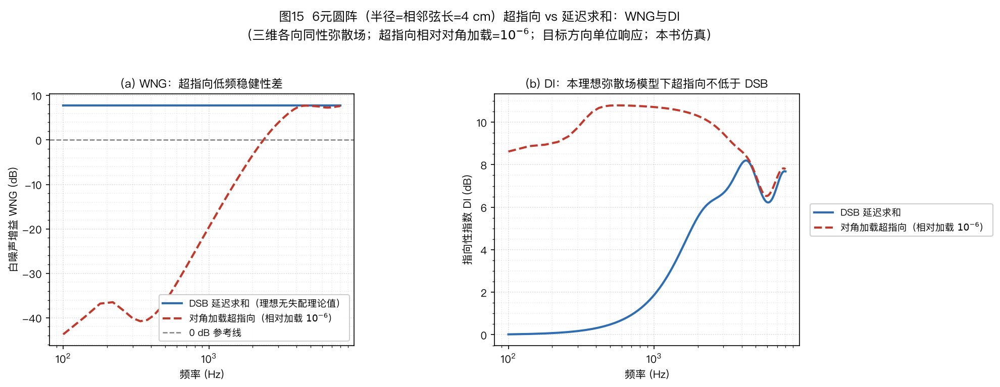
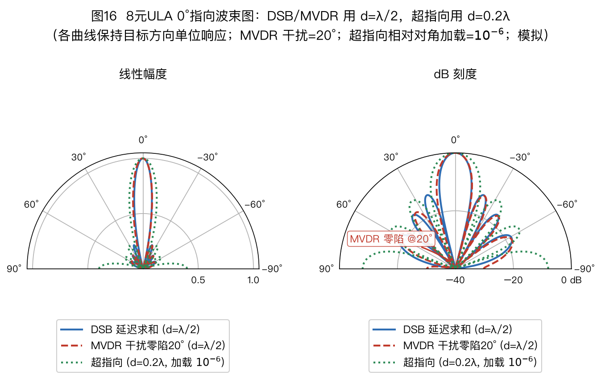
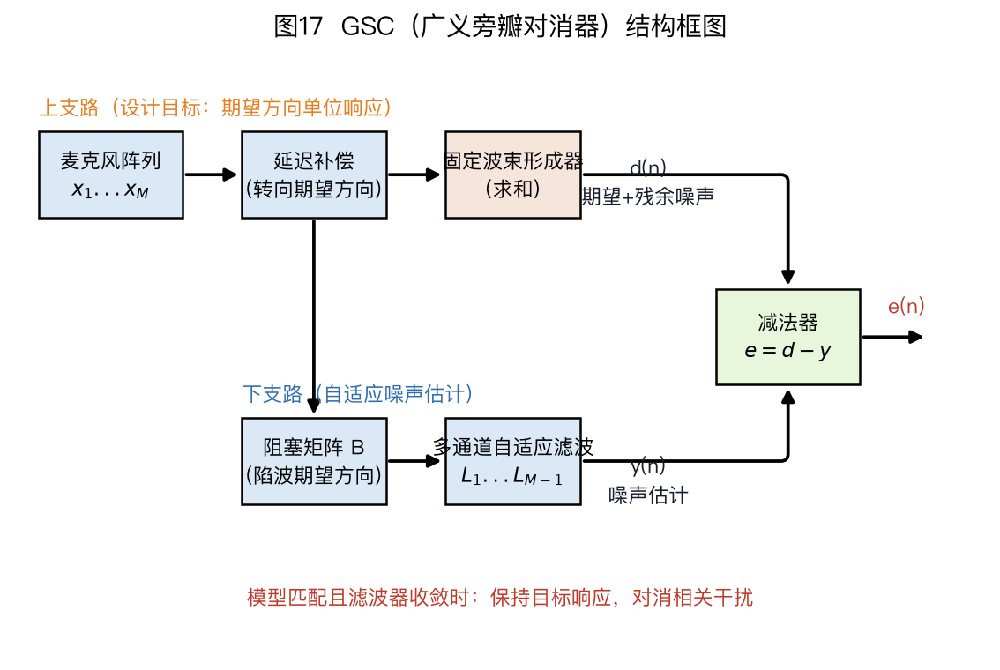

> ⚠️ 本篇是教程正文第 5 章（正文共 11 章，另有附录 A/B），可独立阅读，前后篇见下方导航。
>
> 🏠 首页导读：[`00_overview.md`](./00_overview.md) ｜ 上一篇：[04_doa-estimation.md](./04_doa-estimation.md) ｜ 下一篇：[06_aec.md](./06_aec.md)

---

## 5. 波束形成（Beamforming）

### 5.1 统一问题表述

波束形成器对 $M$ 路信号做线性组合（频域）：

$$y(k,n) = \vec{w}^H(k,n)\,\vec{x}(k,n)\text{。}$$

本章沿用第 2 章的几何约定，并把相位符号写全：均匀线阵的麦 1 在左端、位置为 $x_1=0$，麦 2 及后续阵元沿 $+x$ 方向排列；正角声源位于 $+x$ 一侧，单位向量 $\vec u$ 从阵列指向声源。到达时刻差定义为 $\tau_{ij}=t_i-t_j$。因此正角远场声源先到达右侧阵元，$\tau_{21}=-d\sin\theta/c$；以麦 1 为相位参考时，

$$a_m(f,\theta)=e^{+\mathrm j2\pi f(m-1)d\sin\theta/c},\qquad m=1,\ldots,M\text{。}$$

输出始终写成 $y=\vec w^H\vec x$。所以延迟求和权重为 $\vec w=\vec a/M$，真正乘到第 $m$ 路观测上的系数是 $w_m^*$；后面的正负号与共轭都按这组约定计算。

本章先研究一类共同问题：在期望方向 $\theta_0$ 无失真（$\vec{w}^H\vec{a}(\theta_0)=1$）的前提下，最小化某类噪声或干扰的输出功率。延迟求和波束形成器（Delay-and-Sum Beamformer，DSB）、超指向、最小方差无失真响应（Minimum Variance Distortionless Response，MVDR）和线性约束最小方差（Linearly Constrained Minimum Variance，LCMV）可用噪声模型与线性约束的差异统一描述。

多通道维纳滤波（Multichannel Wiener Filter，MWF）直接最小化均方误差，广义特征值（Generalized Eigenvalue，GEV）波束形成最大化输出信噪比，并不满足同一个无失真优化问题。它们在后文单独说明。

三类噪声的现实对应如下：

- **传感器白噪声**：麦克风自噪声 → 对应度量白噪声增益（White Noise Gain，WNG）；本章把线性量记为 $G_{\mathrm{WNG}}$，dB 量记为 $\mathrm{WNG}_{\mathrm{dB}}$；
- **弥散噪声**：充分弥散的晚期混响。在球面各向同性场模型中，协方差矩阵 $\mathbf{\Gamma}$ 的第 $i,j$ 个元素为 $[\mathbf{\Gamma}]_{ij}=\mathrm{sinc}(2fd_{ij}/c)$，$d_{ij}$ 为两麦间距。本章 sinc 用归一化定义 $\mathrm{sinc}(x)=\sin(\pi x)/(\pi x)$，部分文献用 $\sin x/x$，对照时要换算自变量。对应的线性量为指向因数（directivity factor）$Q$，dB 量为指向性指数（Directivity Index，DI）。DI 越高，表示对目标方向保持单位响应时，指定弥散场模型下的输出噪声功率越低。风噪常由麦克风附近的局部湍流产生，不能无条件纳入这个各向同性模型；
- **定向点干扰**：竞争说话人、电视 → 在干扰方向形成零陷。

前两类噪声分别用白噪声增益的线性量 $G_{\mathrm{WNG}}$ 和指向因数 $Q$ 衡量；换成 dB 后分别记为 $\mathrm{WNG}_{\mathrm{dB}}$ 和指向性指数 DI。DSB、超指向、WNG 约束和对角加载都可在这两个指标下比较：

$$G_{\mathrm{WNG}}=\frac{|\vec{w}^H\vec{a}|^2}{\vec{w}^H\vec{w}},\quad
\mathrm{WNG}_{\mathrm{dB}}=10\log_{10}G_{\mathrm{WNG}},\qquad
Q=\frac{|\vec{w}^H\vec{a}|^2}{\vec{w}^H\mathbf{\Gamma}\vec{w}},\quad
\mathrm{DI}=10\log_{10}Q\text{。}\tag{5-1}$$

$G_{\mathrm{WNG}}$ 是阵列对**通道独立白噪声**的输出 SNR 线性增益，$Q$ 是指定弥散场模型下的输出 SNR 线性增益；式(5-1)明确区分了线性量和 dB 量。无失真约束下两个线性量的分子恒为 1，只需比较分母。4 元 $\lambda/2$ 线阵的算例见算例 2-2。图 15 的纵轴标成 WNG (dB) 和 DI (dB)，分别对应 $\mathrm{WNG}_{\mathrm{dB}}$ 与 DI。

弥散场有两种常用理想模型：**球面各向同性**假定声音从三维各方向等概率到达，相干系数为 $\mathrm{sinc}$ 形；**柱面各向同性**只对水平面方位角积分，相干系数为零阶贝塞尔函数 $J_0(2\pi f d/c)$。[Habets, JASA 2008](https://israelcohen.com/wp-content/uploads/2018/05/JASA_Nov2008.pdf "citation") 实际会议室中的说话人、反射和设备噪声通常不满足严格的柱面各向同性分布，应由测得的空间相干性或验证集结果选择模型，不能仅凭场景名称判定。

**时域还是频域实现？** 本章公式写在频域，每个频点各有一组权重 $\vec{w}(k)$。短时傅里叶变换（Short-Time Fourier Transform，STFT）把宽带语音分解为一组近似窄带的问题（§2.5），逐频点求解后再逆变换。

对应的时域形式称为**滤波求和（filter-and-sum）**：每路麦克风经过一段有限冲激响应（Finite Impulse Response，FIR）滤波器后求和。DSB 是滤波器退化为纯延迟的特例；Frost 波束形成器则是时域自适应 LCMV 的经典实现。[Frost, *Proceedings of the IEEE*, 1972](https://doi.org/10.1109/PROC.1972.8817 "citation")

两种实现的计算量、算法延迟和约束实现方式取决于帧长、滤波器长度与硬件，不应只凭“时域”或“频域”作统一判断。

### 5.2 延迟求和波束形成器（Delay-and-Sum Beamformer，简称 DSB）：“合唱前先把大家对齐”

$\vec{w}_{DSB} = \frac{1}{M}\vec{a}(\theta_0)$：按导向矢量把各通道时延补偿后等权相加。若不除以 $M$，对齐后的目标幅度是单通道的 $M$ 倍；本章采用的 $1/M$ 归一化使目标响应为 1。这两种写法的输出 SNR 相同，但绝对幅度增益不同。

**手算例子**：2 麦相距 $d=4$ cm，声源与阵列正横方向夹角 $30°$（从正横量角，§2.1 约定，本章统一用此约定），频率 $f=1$ kHz。

1. 时延差：$\Delta\tau = \frac{d\sin 30°}{c} = \frac{0.04\times0.5}{343} \approx 58.3$ μs；
2. 相位差：$\Delta\phi = 2\pi f\Delta\tau = 2\pi\times1000\times58.3\mu s \approx 0.366$ rad ≈ 21°；
3. 麦 2 在 $+x$ 侧，正角声源先到达麦 2，所以有符号时延为 $\tau_{21}=-58.3$ μs。以麦 1 为参考的导向矢量是 $\vec{a} = [1,\ e^{+\mathrm{j}0.366}]^\top$；
4. DSB 权重：$\vec{w} = \vec{a}/2 = [0.5,\ 0.5e^{+\mathrm{j}0.366}]^\top$，验证无失真约束：$\vec{w}^H\vec{a} = \frac{1}{2}(1 + e^{-\mathrm{j}0.366}e^{+\mathrm{j}0.366}) = 1$ ✓；
5. 含义：$y=\vec w^H\vec x$ 中，麦 2 实际乘以 $w_2^*=0.5e^{-\mathrm j0.366}$，抵消其相对麦 1 的 $+0.366$ rad 相位，两路目标信号同相相加。

    若直接求和，目标幅度变为 2 倍、目标功率变为 4 倍，独立同功率白噪声的功率只变为 2 倍，因此输出 SNR 提高 2 倍，即 3 dB（$10\log_{10}2$）。写成 $\vec{w}=\vec{a}/M$ 的平均形式时，目标响应保持为 1，噪声功率减半，所得 SNR 增益相同。

**波束图的等比数列推导**：

1. 把波束指向 $\theta_0$ 后，去测另一个方向 $\theta$ 的输出：各通道先按 $\theta_0$ 补偿相位，再求和。记相邻两麦的**残余相位差** $\psi = \dfrac{2\pi d}{\lambda}(\sin\theta - \sin\theta_0)$，则第 $m$ 个麦在求和时带着因子 $e^{\mathrm{j}m\psi}$；
2. 输出幅度就是等比数列求和（公比 $e^{\mathrm{j}\psi}$）：

    $$B(\psi) = \sum_{m=0}^{M-1} e^{\mathrm{j}m\psi} = e^{\mathrm{j}(M-1)\psi/2}\,\frac{\sin(M\psi/2)}{\sin(\psi/2)}$$

3. 取模：$|B| = \left|\dfrac{\sin(M\psi/2)}{\sin(\psi/2)}\right|$。$\psi=0$（即 $\theta=\theta_0$）时分子分母都趋于零，取极限得最大值 $M$。离开目标方向后，该比值随 $\psi$ 周期变化，形成主瓣、零点和旁瓣；
4. 主瓣边缘：第一个零点在 $M\psi/2 = \pi$，即 $\psi = 2\pi/M$。

    正横附近用 $\sin\theta\approx\theta$，并把主瓣内离散阵因子近似为连续孔径时，“零点到零点”宽度约为 $2\lambda/(Md)$，半功率宽度约为 $0.886\lambda/(Md)$；斜指向时还要按 §2.6 除以 $\cos\theta_0$。后一个系数是充分大 $M$、正横小角度下的近似值，小阵列应直接从上式数值求半功率点。

    这里的 $Md$ 来自 $M$ 项离散阵因子，不等于阵列首尾的物理跨度 $D=(M-1)d$。用 $\lambda/D$ 表示的是孔径尺度估计；两者只在 $M$ 较大时接近，小阵列中必须说明采用哪一种口径。两种写法都表达同一趋势：阵元数或间距增大、波长减小时，主瓣变窄。

均匀加权等价于空间域的矩形窗。其第一旁瓣随 $M$ 增大才趋近相对主瓣约 −13.26 dB；例如按上面的离散阵因子复算，$M=3,4,8,16$ 时约为 −9.54、−11.30、−12.80、−13.15 dB，$M=2$ 则没有常规意义下的旁瓣。因此小阵列不能直接套用“−13 dB”。非均匀加权（如 Dolph–Chebyshev 加权）可按设计值降低旁瓣，但会展宽主瓣；因此必须在旁瓣电平、主瓣宽度和有效孔径之间权衡。

**WNG 上限是怎么算出来的**（两步，柯西-施瓦茨不等式）：

1. 代入 DSB 权重 $\vec{w} = \vec{a}/M$：$G_{\mathrm{WNG}} = \dfrac{|\vec{w}^H\vec{a}|^2}{\|\vec{w}\|^2} = \dfrac{|\vec{a}^H\vec{a}/M|^2}{\|\vec{a}\|^2/M^2} = \dfrac{1}{M/M^2} = M$，所以 DSB 的 $\mathrm{WNG}_{\mathrm{dB}}=10\log_{10}M$ dB；
2. 若各阵元目标响应幅度均为 1，则 $\|\vec a\|^2=M$。柯西-施瓦茨不等式给出 $|\vec{w}^H\vec{a}| \le \|\vec{w}\|\,\|\vec{a}\|$，所以满足精确无失真约束的权重有 $G_{\mathrm{WNG}}\le M$，等号在 $\vec w\propto\vec a$ 时成立。这个结论针对空间白噪声、精确导向矢量和单位幅度阵列流形；阵元增益不等、噪声相关或导向失配时不能直接套用。

- **优点**：在上述理想模型下达到最大 $G_{\mathrm{WNG}}$，结构简单；若实际导向矢量等于设计值，目标响应为 1；
- **缺点**：不能根据干扰方向自适应放置零陷；波束图中仍可能存在由阵元数、间距和频率决定的固定零点。课程讲义引用的球阵/圆阵实验称其所测小阵列 DSB 几乎无法改善识别率，该结论只适用于讲义中的阵列、数据和识别器。[Kumatani et al.](https://course.ece.cmu.edu/~ece792/handouts/KumataniEtAl12.pdf "citation")

DSB 常作为固定波束基线，也可作为自适应算法的初始权重。

### 5.3 超指向的白噪声增益—指向性权衡

在期望方向无失真约束下最大化 $Q$，也就最大化 DI（等价于 MVDR 对阵各向同性噪声）：

$$\min_{\vec{w}}\ \vec{w}^H\mathbf{\Gamma}\vec{w} \quad \text{s.t.}\ \ \vec{w}^H\vec{a}(\theta_0)=1\text{，}
\;\Rightarrow\;
\vec{w}_{SD} = \frac{\mathbf{\Gamma}^{-1}\vec{a}}{\vec{a}^H\mathbf{\Gamma}^{-1}\vec{a}}\text{。}\tag{5-2}$$

式(5-2)最大化的是线性指向因数 $Q$；由于对数单调，它也最大化 DI。其推导与式(5-3)使用同一个带线性约束的二次型优化，只是把噪声协方差 $\mathbf{R}_{nn}$ 换成弥散噪声相干矩阵 $\mathbf{\Gamma}$。完整推导见 §5.4。

小间距阵列可利用相邻通道的差分获得高于 DSB 的弥散场指向性。代价是低频 $G_{\mathrm{WNG}}$ 降低，阵元自噪声、增益误差、相位误差和阵列模型误差都会被放大。

实际设计通常加入 $\vec{w}^H\vec{w}\le\delta$ 形式的 $G_{\mathrm{WNG}}$ 下限约束，或按频段选择不同权重：低频在白噪声增益预算内提高指向性，高频在 $\mathbf{\Gamma}\approx\mathbf{I}$ 时使用接近 DSB 的解。

课程讲义给出了特定小尺寸球阵条件下的对比结果，不能脱离其阵列与数据条件外推。[Kumatani et al.（出处同 §5.2 引文）]

**算例 5-1：超指向权重与 $\mathrm{WNG}_{\mathrm{dB}}$**

**题设**：2 麦小间距 $d=0.05\lambda$，弥散噪声相干矩阵 $\mathbf{\Gamma} = \begin{bmatrix}1 & \mathrm{sinc}(0.1)\\ \mathrm{sinc}(0.1) & 1\end{bmatrix}$（§5.1：$[\mathbf{\Gamma}]_{ij} = \mathrm{sinc}(2d_{ij}/\lambda)$，这里 $\mathrm{sinc}(x) = \sin(\pi x)/(\pi x)$，$\mathrm{sinc}(0.1) = \dfrac{\sin(0.1\pi)}{0.1\pi} \approx 0.9836$）。超指向权重 $\vec{w}_{SD} = \dfrac{\mathbf{\Gamma}^{-1}\vec{a}}{\vec{a}^H\mathbf{\Gamma}^{-1}\vec{a}}$（§5.3）。

**第 1 步：检查 $\mathbf{\Gamma}$ 的病态程度**

$$\det\mathbf{\Gamma} = 1 - 0.9836^2 = 0.0325,\qquad \mathbf{\Gamma}^{-1} = \frac{1}{0.0325}\begin{bmatrix}1 & -0.9836\\ -0.9836 & 1\end{bmatrix} \approx \begin{bmatrix}30.80 & -30.29\\ -30.29 & 30.80\end{bmatrix}$$

两麦噪声的相干系数为 $\rho=0.9836$，所以 $\mathbf{\Gamma}$ 接近奇异，逆矩阵元素达到 30 量级。后续求得的权重会相应放大。

**第 2 步：正横指向的退化情形**

若 $\theta_0 = 0°$，则 $\vec{a}_0 = [1, 1]^\top$ 恰好是 $\mathbf{\Gamma}$ 的特征向量（$\mathbf{\Gamma}\vec{a}_0 = (1+\rho)\vec{a}_0$），于是 $\mathbf{\Gamma}^{-1}\vec{a}_0 = \vec{a}_0/(1+\rho) \propto \vec{a}_0$，归一化后

$$\vec{w}_{SD} = [0.5,\ 0.5]^\top = \vec{w}_{DSB},\qquad \mathrm{WNG}_{\mathrm{dB}} = +3.0\ \mathrm{dB}$$

——超指向解退化成普通延迟求和。对称双麦阵在正横方向的导向矢量正好是弥散相干矩阵的特征向量，因此没有额外收益。随着指向偏离正横方向，超指向解与 DSB 的差异增大，端射附近通常最明显；不能概括成“只有端射才有增益”。下面用端射方向展示最强的差分效应。

**第 3 步：端射指向的权重**

$\psi = 2\pi\times0.05\times\sin90° = 0.1\pi \approx 0.3142$ rad（18°），$\vec{a} = [1,\ e^{+\mathrm{j}0.3142}]^\top = [1,\ 0.9511+0.3090\mathrm{j}]^\top$。

分子：$\mathbf{\Gamma}^{-1}\vec{a} \approx \begin{bmatrix}1.9869-9.3616\mathrm{j}\\ -1.0033+9.5174\mathrm{j}\end{bmatrix}$（模长接近 10，且两分量近乎反号）；

分母：$\vec{a}^H\mathbf{\Gamma}^{-1}\vec{a} \approx 3.9737$（正实数）；

相除：

$$\vec{w}_{SD} \approx \begin{bmatrix}0.5000-2.3559\mathrm{j}\\ -0.2525+2.3951\mathrm{j}\end{bmatrix},\qquad |w_1| = |w_2| \approx 2.41$$

**第 4 步：验证无失真约束**

$$\vec{w}^H\vec{a} = \underbrace{(0.5000+2.3559\mathrm{j})}_{w_1^*\cdot a_1} + \underbrace{(0.5000-2.3559\mathrm{j})}_{w_2^*\cdot a_2} = 1\ \checkmark$$

每一项的模长都是 2.41，而两项虚部 $\mp2.356\mathrm{j}$ 相消后留下单位目标响应。权重分量明显大于最终目标响应，因此很小的通道误差也会破坏这种相消关系。

**第 5 步：算 $\mathrm{WNG}_{\mathrm{dB}}$，看代价**

$$\|\vec{w}\|^2 = 2.41^2 + 2.41^2 \approx 11.60,\qquad \mathrm{WNG}_{\mathrm{dB}} = 10\log_{10}\frac{1}{11.60} \approx \mathbf{-10.6\ dB}$$

对照：同一指向的 DSB 有 $\mathrm{WNG}_{\mathrm{dB}}=+3.0$ dB。负的 $\mathrm{WNG}_{\mathrm{dB}}$ 表示独立的阵元自噪声被权重能量放大；本例 $\|\vec w\|^2\approx11.6$，即相对单麦高约 10.6 dB。作为交换，在本例的理想各向同性弥散场、紧凑双麦端射模型下，指向因数 $Q=1/(\vec w^H\mathbf\Gamma\vec w)\approx3.97$，所以 $\mathrm{DI}\approx+6.0$ dB。这个结果依赖模型和极限条件，不是任意双麦几何、频率与噪声场的保证。

**第 6 步：通道失配的影响**

给麦 2 加 1% 的增益失配，即把 $\vec{a}$ 的第二分量乘以 1.01：

$$\vec{w}^H\vec{a}_{mis} = 1.0050 - 0.0236\mathrm{j}\text{。}$$目标响应误差幅度约 $2.4\%$。

相同的 1% 增益失配作用在 DSB 上时，目标响应误差为 0.5%；本例超指向误差约为其 5 倍。权重范数越大，通道增益与相位误差造成的响应偏差通常越明显。因此超指向设计应结合器件规格做失配扫描，并加入 $G_{\mathrm{WNG}}$ 下限约束或对角加载（§5.4）。

**第 7 步：比较不同归一化间距**（均指向端射 90°）：

| $d$ | $0.5\lambda$ | $0.1\lambda$ | $0.05\lambda$ | $0.02\lambda$ | $0.01\lambda$ |
|---|---|---|---|---|---|
| 权重模长 $&#124;w_i&#124;$ | 0.50 | 1.24 | 2.41 | 5.98 | 11.94 |
| $\mathrm{WNG}_{\mathrm{dB}}$ | +3.0 dB | −4.9 dB | −10.6 dB | −18.5 dB | −24.6 dB |

在本例的双麦端射模型中，间距减半时权重模长近似翻倍，$\mathrm{WNG}_{\mathrm{dB}}$ 约降低 6 dB；这一近似来自权重随 $\lambda/d$ 增长、白噪声输出功率随 $(\lambda/d)^2$ 增长。表中数值只对应所列理想模型，实际设计还要加入通道失配、自噪声与阵列几何误差。

**图示说明**：图 15 使用半径 4 cm 的 6 元均匀圆阵；六边形相邻阵元的弦长也为 4 cm。导向矢量与三维各向同性弥散场相干矩阵都由同一组二维阵元坐标计算。

左图比较 DSB 与超指向的 $\mathrm{WNG}_{\mathrm{dB}}$，右图比较二者的 DI。两种算法同时用颜色和线型区分，灰度打印时仍可辨认。

超指向协方差矩阵加入相对对角加载 $10^{-6}$，即绝对加载量为 $10^{-6}\operatorname{tr}(\mathbf\Gamma)/M$；两种方法均归一化为目标方向单位响应。曲线只展示该模型下的频率趋势，不代表硬件实测，也不能把某个交点当作通用设计门限。

**差分麦克风阵列（Differential Microphone Array，简称 DMA）**是与紧凑超指向设计密切相关的一类时域结构，但两者不是可以直接互换的名称。超指向设计先规定弥散噪声模型并优化 $Q$；DMA 则用通道差分、延迟和均衡合成目标方向图，只有在相应噪声模型、约束与近似条件下才可能实现某个超指向解。

一阶两抽头形式可写为 $y(t)=x_1(t)-g\,x_2(t-\tau)$，其中 $g$ 是实数幅度系数，$\tau$ 是内延迟。更一般的时域实现用 FIR 滤波器提供频率相关的幅相响应。$\tau=0$ 且 $g=1$ 的纯实数相减只能得到前后对称的偶极子；心形需要延迟与相减配合，推导见算例 3-1。

在 $\kappa d\ll1$（$\kappa=2\pi f/c$，麦距远小于波长）的低频近似下，配合所需的幅度均衡后，归一化指向形状可在一段频带内近似不变。有限间距、离散延迟、壳体散射和失配都会破坏该近似。DMA 尺寸小，但 $\mathrm{WNG}_{\mathrm{dB}}$ 可能很低，对麦距和通道失配敏感。

**四项诊断量**：超指向或 MVDR 权重求出后，应检查以下指标，再进入录音评估。

1. **白噪声增益余量**：算 $G_{\mathrm{WNG}}=1/\|\vec{w}\|^2$（精确无失真约束下），再按式(5-1)换成 $\mathrm{WNG}_{\mathrm{dB}}$。最低允许值应由本机自噪声、增益/相位公差和目标输出余量共同确定，不能用一个固定 dB 数覆盖所有设备；
2. **条件数**：算 $\mathbf{\Gamma}$ 或 $\hat{\mathbf{R}}_{nn}$ 的条件数 $\kappa=\lambda_{\max}/\lambda_{\min}$。条件数增大表示求逆对协方差估计误差更敏感；可通过对角加载（§5.4）、降阶或减少约束改善。可接受上限应由浮点精度、快拍数和失配仿真共同确定；
3. **削波率与动态余量**：把权重作用于代表性录音或按目标电平生成的测试信号，检查输出峰值和削波率。权重范数大时，通道叠加可能增加峰值；应预留数字动态余量，并在需要时收紧 WNG 约束；
4. **通道失配灵敏度**：按照麦克风数据手册、标定残差和装配误差给导向矢量逐通道施加增益、相位与位置扰动，统计目标响应 $|\vec{w}^H\vec{a}_{mis}-1|$、零陷位置与 WNG 的变化。算例 5-1 第 6 步提供了 1% 增益失配的手算；实际扰动范围和验收门限必须按设备确定。

#### 专栏：差分麦克风（DMA）——从一阶心形到高阶与神经差分

上一节末尾把 DMA 归入紧凑超指向设计。下面说明差分、延迟和均衡如何共同形成一阶方向图，以及提高阶数时为什么必须同时检查 WNG。

**一阶差分原理**：两个相距很近的麦克风接收同一远场声波时存在小的传播时延差。对其中一路施加内部延迟和增益后相减，可使某些方向相消、另一些方向保留。输出写成 $y(t)=x_1(t)-g\,x_2(t-\tau)$：$g$ 控制两路幅度与相位配比，$\tau$ 控制相减前的内部延迟；改变 $(g,\tau)$ 就会改变零点位置和指向图形状。

**后向零点怎样变成近似心形**：设端射双麦间距为 $d$，某方向的传播时延差为 $\tau_p(\theta)$。该方向的频率响应可写成

$$H(\omega,\theta)=1-g\,e^{-\mathrm j\omega[\tau+\tau_p(\theta)]}。$$

选择 $g$ 和内部延迟 $\tau$ 可以令后向响应在设计频率或低频近似下为零。仅有这个零点还不能证明整个宽带方向图是心形。

当 $\kappa d=2\pi fd/c\ll1$，把指数项作一阶展开，并用均衡器补偿差分器随频率上升的幅度后，归一化方向图才可在一段频带内近似“全向项加偶极项”；取相应系数时得到心形、超心形或 8 字形。

频率升高、间距不再远小于波长、延迟量化或通道失配都会使形状偏离该近似。$\tau=0$ 且 $g=1$ 的纯相减只产生前后对称的偶极响应。[Elko & Pong, ICASSP 1997](https://doi.org/10.1109/ICASSP.1997.599609 "citation")

**算例：一阶 DMA 的零点、均衡与 WNG。** 取端射双麦 $d=2$ cm、$c=343$ m/s，则 $T=d/c=58.31\ \mu$s。沿用式中的符号约定，令后向 $\tau_p=-T$、前向 $\tau_p=+T$，并取 $g=1,\tau=T$。后向响应为 $H_b=1-e^0=0$。在 $f=500$ Hz，前向响应

$$H_f=1-e^{-\mathrm j2\omega T},\qquad |H_f|=2\sin(\omega T)=2\sin(0.1832)\approx0.3644。$$

因此要把前向响应归一到 1，均衡器幅度需乘 $1/0.3644\approx2.744$。两路独立、单位功率的阵元自噪声在均衡后功率为 $2/|H_f|^2\approx15.06$，所以 $\mathrm{WNG}_{\mathrm{dB}}=10\log_{10}(1/15.06)\approx-11.78$ dB。

若第二通道有 1% 增益误差，原本的后向零点变为 $|1-1.01|/|H_f|\approx0.0274$，即相对前向约 −31.2 dB；零点不再无限深。

这个单频点数例只验证相消和噪声放大的代价。它不证明宽带心形：500 Hz 时 $\kappa d\approx0.183$ 尚可作低频近似，频率升高、均衡器限幅或误差增大时必须重新计算方向图和 WNG。

**提高阶数改变了什么**：多个一阶差分单元级联可形成高阶方向图，并提供更多可配置零点。阶数增加并不对应一个脱离条件的固定 DI 增量。理想 DI 取决于采用球面还是柱面弥散场、目标方向图和归一化方式；换成 dB 后也不能概括为“每阶线性增加”。

高阶差分包含更强的相消和低频均衡，通常增大权重范数，使阵元自噪声和增益、相位、位置误差更容易进入输出。

设计时应按每个频点同时报告方向图、DI、WNG、条件数和失配扫描，而不是只按阶数选型。[Elko, *Differential Microphone Arrays*](https://doi.org/10.1007/1-4020-7769-6_2 "citation")

| 设计变化 | 可能获得的能力 | 同时增加的风险 | 必须固定的比较条件 |
|---|---|---|---|
| 增加差分阶数 | 可配置更多零点和更细的空间变化 | 权重范数增大，低频自噪声和失配更易被放大 | 频率、间距、噪声场、目标图形与均衡器 |
| 减小阵元间距 | 在更高频率前维持 $\kappa d\ll1$ 近似 | 通道观测更相似，差分后的 WNG 可能降低 | 麦克风自噪声、标定残差与数值精度 |
| 增强低频均衡 | 补偿差分器的低频衰减 | 同时放大低频传感器噪声和风噪 | 最大增益、削波余量与 WNG 下限 |

学习方法若用于 DMA，更适合估计受约束的系数、掩码或正则化参数，再由解析差分结构形成输出。这样仍可检查零点、WNG 和失配；若网络直接输出任意滤波器，则应按 §5.9 的端到端方法评价，不能仅因输入来自小间距阵列就称为 DMA。

在精确导向和空间白噪声模型下，DSB 达到最大的 $G_{\mathrm{WNG}}$；超指向针对弥散噪声提高 $Q$ 与 DI，但通常降低低频 $\mathrm{WNG}_{\mathrm{dB}}$。后面的 MVDR 和稳健波束形成把这种指标权衡推广到估计得到的噪声协方差与导向误差。

### 5.4 最小方差无失真响应

最小方差无失真响应（Minimum Variance Distortionless Response，简称 MVDR）在设计导向矢量上施加单位响应，同时最小化输出噪声功率。只有设计导向矢量与真实目标传递向量一致时，“无失真”才对真实目标成立。

$$\min_{\vec{w}}\ \vec{w}^H\mathbf{R}_{nn}\vec{w} \quad \text{s.t.}\ \ \vec{w}^H\vec{a}(\theta_0)=1\text{。}$$

符号：$\mathbf{R}_{nn}$ 是 $M\times M$ 噪声协方差矩阵。对角元表示各通道噪声功率，非对角元表示通道间相关性。它与 §4.2 的标量互相关函数 $R(\tau)$ 不同。

**推导（拉格朗日乘子法，四步，每步都有物理读法）**：

**第 1 步：把约束加入目标。** 复约束 $\vec w^H\vec a=1$ 要与其共轭约束成对写入拉格朗日函数：

$$L(\vec{w}, \lambda) = \vec{w}^H\mathbf{R}_{nn}\vec{w} + \lambda\big(1-\vec{w}^H\vec{a}\big)+\lambda^*\big(1-\vec a^H\vec w\big)。$$

$\lambda$ 是复标量拉格朗日乘子。后两项互为共轭，所以 $L$ 保持为实数。

**第 2 步：求梯度并令它为零。** 复数向量求导用 Wirtinger 规则——把 $\vec{w}$ 和它的共轭 $\vec{w}^*$ 当成两个独立变量，对 $\vec{w}^*$ 求偏导：

$$\frac{\partial L}{\partial \vec{w}^*} = \mathbf{R}_{nn}\vec{w} - \lambda\vec{a} = \vec{0}\quad\Rightarrow\quad \vec{w} = \lambda\,\mathbf{R}_{nn}^{-1}\vec{a}$$

物理读法：**最优权重与经噪声协方差白化后的导向矢量成比例**。$\mathbf{R}_{nn}^{-1}$ 根据噪声空间相关结构调整各方向的响应，比例系数再由无失真约束确定。

**第 3 步：用约束确定倍数。** 把结果代回无失真约束 $\vec{w}^H\vec{a}=1$：

$$\lambda^*\,\vec{a}^H\mathbf{R}_{nn}^{-1}\vec{a} = 1。$$

由于 $\vec a^H\mathbf R_{nn}^{-1}\vec a$ 是正实数，所以 $\lambda^*=\lambda$，并且

$$\lambda = \frac{1}{\vec{a}^H\mathbf{R}_{nn}^{-1}\vec{a}}$$

协方差矩阵一般是半正定的；这里写普通逆矩阵，额外假定 $\mathbf R_{nn}$ 正定。若快拍不足或矩阵奇异，应加正则、使用降秩方法或在明确秩条件下用伪逆。正定时分母是正实数。

**第 4 步：把倍数代回第 2 步。**

$$\boxed{\ \vec{w}_{MVDR} = \frac{\mathbf{R}_{nn}^{-1}\vec{a}}{\vec{a}^H\mathbf{R}_{nn}^{-1}\vec{a}}\ }\text{。}\tag{5-3}$$

正定时 $\vec a^H\mathbf R_{nn}^{-1}\vec a$ 为正实数，因此上面由 $\vec w^H\vec a=1$ 求得的乘子无需再区分共轭值。

此权重代回输出功率即得式(4-2)的 Capon 谱——同一优化器的两种读法（推导见 §4.5）。

**推导关系**：梯度条件给出 $\vec w\propto\mathbf R_{nn}^{-1}\vec a$，无失真约束再确定比例系数，使 $\vec w^H\vec a=1$。因此 $\mathbf R_{nn}^{-1}$ 决定噪声抑制方向，分母负责目标响应归一化。LCMV（§5.5）沿用同一二次型优化，只把一条约束推广为多条约束。

**两个特例**：白噪声下 $\mathbf{R}_{nn}\propto\mathbf{I}$，MVDR 退化为 DSB；协方差中含定向强干扰时，MVDR 会降低该方向的响应。图 16 的 MVDR 曲线使用 8 元阵和 20° 干扰，参数与下面算例 5-2 的 2 元阵、30° 干扰不同。

**算例 5-2：2 麦 MVDR 数值推导**

**题设**：2 麦，间距 $d=\lambda/2$；目标方向 $\theta_0=0°$（正横）；干扰来自 $\theta_i=30°$，干扰噪声功率比 INR $=10$（干扰功率是各麦白噪功率的 10 倍）。求 MVDR 权重 $\vec{w}_{MVDR} = \dfrac{\mathbf{R}_{nn}^{-1}\vec{a}}{\vec{a}^H\mathbf{R}_{nn}^{-1}\vec{a}}$（式(5-3)的闭式解），并验证它的两个承诺。

**第 1 步：写出两个导向矢量**

- 目标方向：$\psi_0 = \pi\sin 0° = 0$，所以 $\vec{a}_0 = [1,\ 1]^\top$；
- 干扰方向：$\psi_i = \pi\sin 30° = \dfrac{\pi}{2}$，所以 $\vec{a}_i = [1,\ e^{+\mathrm{j}\pi/2}]^\top = [1,\ +\mathrm{j}]^\top$（相对麦 1，麦 2 的频域相位为 $+90°$）。

**第 2 步：构造噪声协方差矩阵 $\mathbf{R}_{nn}$**

噪声模型 = 定向干扰 + 各麦独立白噪（功率归一化为 1）：

$$\mathbf{R}_{nn} = 10\cdot\vec{a}_i\vec{a}_i^H + \mathbf{I}$$

先算外积 $\vec{a}_i\vec{a}_i^H = \begin{bmatrix}1\\+\mathrm{j}\end{bmatrix}[1,\ -\mathrm{j}] = \begin{bmatrix}1 & -\mathrm{j}\\ +\mathrm{j} & 1\end{bmatrix}$（注意 $(\vec{a}_i\vec{a}_i^H)_{12} = 1\cdot(+\mathrm{j})^* = -\mathrm{j}$），于是

$$\mathbf{R}_{nn} = \begin{bmatrix}11 & -10\mathrm{j}\\ +10\mathrm{j} & 11\end{bmatrix}$$

读法：对角元 11 = 干扰功率 10 + 白噪功率 1（每个麦收到的总噪声功率）；非对角元 $\pm10\mathrm{j}$ 记录两麦噪声的相关性和相位差。对本例的单个定向干扰，方向信息体现在这对非对角元中；一般 MVDR 还同时依赖整个协方差矩阵、导向矢量和无失真约束，不能把零陷归因于所有非对角元的某个通用模式。

**第 3 步：求逆 $\mathbf{R}_{nn}^{-1}$**

2×2 矩阵求逆公式 $\begin{bmatrix}p & q\\ r & s\end{bmatrix}^{-1} = \dfrac{1}{ps-qr}\begin{bmatrix}s & -q\\ -r & p\end{bmatrix}$。行列式：

$$\det\mathbf{R}_{nn} = 11\times11 - (-10\mathrm{j})(10\mathrm{j}) = 121 - 100 = 21$$

注意 $(-10\mathrm{j})(10\mathrm{j})=-100\mathrm{j}^2=+100$。2×2 行列式为 $ps-qr$，所以这里得到 $121-100=21$。

该矩阵的特征值为 21 和 1，2-范数条件数为 21；算例 5-1 的 $\mathbf\Gamma$ 特征值约为 1.9836 和 0.0164，条件数约为 121。条件数而不是未归一化的行列式可直接比较求逆敏感度。于是

$$\mathbf{R}_{nn}^{-1} = \frac{1}{21}\begin{bmatrix}11 & +10\mathrm{j}\\ -10\mathrm{j} & 11\end{bmatrix} \approx \begin{bmatrix}0.5238 & +0.4762\mathrm{j}\\ -0.4762\mathrm{j} & 0.5238\end{bmatrix}$$

**第 4 步：算权重**

分子：$\mathbf{R}_{nn}^{-1}\vec{a}_0 = \dfrac{1}{21}\begin{bmatrix}11+10\mathrm{j}\\ 11-10\mathrm{j}\end{bmatrix} \approx \begin{bmatrix}0.5238+0.4762\mathrm{j}\\ 0.5238-0.4762\mathrm{j}\end{bmatrix}$；

分母：$\vec{a}_0^H\mathbf{R}_{nn}^{-1}\vec{a}_0 = \dfrac{1}{21}\big[(11+10\mathrm{j})+(11-10\mathrm{j})\big] = \dfrac{22}{21} \approx 1.0476$（正实数，与 §5.4 推导第 3 步的论断一致）；

相除：

$$\vec{w}_{MVDR} = \frac{1}{22}\begin{bmatrix}11+10\mathrm{j}\\ 11-10\mathrm{j}\end{bmatrix} = \begin{bmatrix}0.5000+0.4545\mathrm{j}\\ 0.5000-0.4545\mathrm{j}\end{bmatrix}$$

两个权重模长相同（$\approx0.676$）、虚部符号相反，不再是 DSB 的 $[0.5, 0.5]$。这组反号的相位分量使干扰方向的两路加权响应接近相消。

**第 5 步：验证两个承诺**

① 目标无失真：$\vec{w}^H\vec{a}_0 = (0.5-0.4545\mathrm{j})\cdot1 + (0.5+0.4545\mathrm{j})\cdot1 = 1$ ✓（两个虚部恰好抵消）；

② 干扰方向零陷：

$$\vec{w}^H\vec{a}_i = (0.5-\tfrac{5}{11}\mathrm{j})\cdot1 + (0.5+\tfrac{5}{11}\mathrm{j})(+\mathrm{j}) = \frac{1}{22}(1+\mathrm{j}) \approx 0.0455+0.0455\mathrm{j}$$

$|\vec{w}^H\vec{a}_i| = \dfrac{\sqrt{2}}{22} \approx 0.0643$，即 **−23.8 dB**。干扰幅度约为输入阵元响应的 $1/15.6$，输出干扰功率 $10\times0.0643^2 \approx 0.041$，低于输出白噪声功率 $\|\vec{w}\|^2 \approx 0.913$。

**为什么不是精确的 0？** MVDR 只显式约束目标方向，不强制干扰方向响应为零。干扰的空间相关信息包含在 $\mathbf{R}_{nn}$ 的非对角元中；本例 INR 为 10，优化得到约 −24 dB 的残余响应，INR 增大时该响应继续降低并趋近零。若必须在已知方向形成精确零陷，应使用 §5.5 的 LCMV 约束。

**第 6 步：检查波束图的五个方向**（$|B(\theta)| = |\vec{w}^H\vec{a}(\theta)|$，完整曲线见图16）：

| 角度 | 增益 (dB) | 含义 |
|---|---|---|
| $0°$ | **0.00** | 无失真约束保持单位响应 |
| $+30°$ | **−23.84** | 零陷正对干扰 |
| $+15°$ | −5.05 | 过渡带，被连带压低 |
| $-30°$ | +2.61 | 无干扰一侧被抬高 |
| $+45°$ | −8.62 | 远旁瓣残余 |

读图：0° 处因无失真约束保持 0 dB，30° 干扰方向的响应为 −23.8 dB；波束图不再左右对称。干扰一侧（+$\theta$）整体降低，而 −30° 附近增益升高 2.6 dB。该权重是在本例协方差与单位目标响应约束下使输出功率最小的解；协方差或干扰方向改变后，曲线也会改变。

**WNG 代价**：这组权重的 $G_{\mathrm{WNG}}=1/\|\vec w\|^2=1/0.9133$，所以 $\mathrm{WNG}_{\mathrm{dB}}\approx+0.39$ dB，比同一双麦阵的 DSB 低约 2.6 dB。该差值与干扰抑制量都只对应本算例的 INR、几何和噪声模型。

**图示说明**：图 16 的三组权重都满足目标方向单位响应。线性幅度图保留这一绝对响应，dB 图以目标响应为 0 dB 参考，并截断到 −40 dB。

DSB 与 MVDR 使用 8 元、$d=\lambda/2$，MVDR 协方差模型含 20° 定向干扰。超指向使用另一个 $d=0.2\lambda$ 的紧凑阵列和相对对角加载 $10^{-6}$。

由于阵元间距和噪声模型不同，超指向曲线不能作为与前两条曲线的同几何性能排名；该图也不能直接给出 WNG 或 DI。图中参数与算例 5-2 的 2 元阵、30° 干扰不同，零陷深度不能直接互比。

**实现中的三个问题**：
1. **$\mathbf{R}_{nn}$ 从哪来**：无目标帧估计（语音活动检测即 VAD 辅助）；语音场景经典做法是时频掩码（Time-Frequency mask，简称 TF-mask）——神经网络预测每个时频点是语音还是噪声，分别加权估出目标/噪声协方差（在 CHiME 系列远场语音识别挑战赛中验证有效的主流做法；这类掩码做法在完整系统里的效果证据见 §8.1）；
2. **病态与对角加载**：小快拍下 $\hat{\mathbf{R}}$ 可能病态，可改用 $\hat{\mathbf R}+\varepsilon\mathbf I$。它抬高小特征值并限制权重范数；与显式 WNG 约束的关系见下文，二者不能不加条件地写成同一个问题；
3. **混响中的约束对象**：自由场导向矢量只描述直达传播。混响房间中的目标通道还包含早期反射，因此实际目标传递向量可能与自由场模型不一致。可估计相对传递函数（Relative Transfer Function，简称 RTF），用各麦相对参考麦的目标传递函数作为约束向量；RTF 估计误差仍需通过失配仿真评估。

**对角加载、WNG 约束与正则化的关系**：绝对加载写成 $\hat{\mathbf R}+\varepsilon\mathbf I$，其中 $\varepsilon$ 与协方差矩阵的元素具有相同量纲；它等于在目标函数中加入 $\varepsilon\|\vec w\|^2$。

为使输入整体缩放后加载强度不变，本节比较表改用无量纲相对加载量 $\alpha$：

$$\hat{\mathbf R}_{\mathrm{load}}=\hat{\mathbf R}+\alpha\,\frac{\operatorname{tr}(\hat{\mathbf R})}{M}\mathbf I。$$

在无失真约束下，显式约束 $\|\vec w\|^2\le\delta$ 就是在设置 WNG 下限。若该约束在最优点处有效，其拉格朗日乘子会产生同形的对角加载。

给定 $\delta$ 对应的 $\alpha$ 依赖 $\hat{\mathbf R}$、$\vec a$ 和频点，不能把任意加载量与任意 WNG 门限视为相同。$\alpha$ 应按协方差条件数、器件失配仿真和所需 WNG 扫描选择。[Li, Stoica & Wang, IEEE TSP 2003](https://doi.org/10.1109/TSP.2003.812831 "citation")

**对角加载的代价表（相对加载量 $\alpha$ 从小到大）**：

| $\alpha$ 取值 | 加载相对平均特征值的大小 | 白噪声增益 | 指向性/零陷深度 | 稳健性 | 适用场合 |
|---|---|---|---|---|---|
| 较小 | 只轻微抬高特征值 | 接近未加载解 | 接近未加载解 | 小快拍下求逆仍可能病态 | 快拍充足、标定较好的离线处理 |
| 中等（由验证集确定） | 小特征值被抬高 | 通常回升 | 通常变浅 | 对估计误差和轻微失配较稳 | 按 WNG 与目标失真联合调参 |
| 较大 | 加载项主导小特征值，继续增大时可主导整个矩阵 | 趋近 DSB 上限 | 深零陷逐渐变浅 | 解逐渐接近固定波束 | 稳健模式或诊断对照 |

读法：$\alpha$ 增大时，条件数通常改善、权重范数减小，零陷和指向性也可能减弱。变化多少由协方差特征值、导向矢量与加载归一化口径共同决定，不能预先保证若干 dB。应画出 WNG、目标失真和噪声输出随归一化加载量的曲线，再按系统预算选点。

#### 5.4.1 稳健波束形成方法

对角加载主要限制协方差求逆的敏感度和权重范数，不能覆盖所有失配来源。下面按四类误差分别说明可选方法、假设和代价：

- **A：导向矢量失配**：DOA 误差、通道增益/相位不一致或阵列标定误差使约束向量偏离真实目标传递向量；
- **B：协方差估计误差**：快拍不足、噪声非平稳或目标泄漏使 $\hat{\mathbf{R}}_{nn}$ 偏离真实噪声协方差，求逆会放大其中的小特征值误差；
- **C：相干干扰或混响**：早期反射与直达声相干，可能降低信号子空间秩并改变零陷位置；
- **D：目标自消**：含目标的协方差与失配约束共同作用，使自适应权重抑制真实目标。

**方法 1：最差情况优化（Worst-Case Optimization）**。若把真实导向矢量限制在球形不确定集 $\|\vec a_{true}-\vec a_0\|\le\epsilon$ 中，可要求集合内所有导向矢量都满足最低响应。对常见球形、范数有界模型，其 KKT 条件常导出对角加载形式，但加载量需由不确定集半径和数据共同求得；任意固定加载并不等同于完整的鲁棒 Capon 问题。$\epsilon$ 应由 DOA 误差和通道标定统计确定，取大时会牺牲 DI 与零陷深度。[Vorobyov, Gershman & Luo, *IEEE TSP*, 2003](https://doi.org/10.1109/TSP.2002.806865 "citation")

**方法 2：特征空间波束形成（Eigenspace Beamforming）**。对含目标的采样协方差做特征分解，把权重投影到由主要特征向量张成的子空间中，可减小小特征值估计误差造成的权重偏差。代价是必须选择子空间维数；低信噪比或弱目标条件下，信号与噪声特征值难以分开，投影也可能删除有用成分。[Chang & Yeh, *IEEE Transactions on Antennas and Propagation*, 1992](https://doi.org/10.1109/8.202711 "citation")

**方法 3：协方差重构（Covariance Reconstruction）**。MVDR 需要干扰加噪声协方差，但 VAD 选出的噪声段可能含目标残留和混响尾音。以 Capon 谱积分重构为例，可在非目标角度区域估计空间谱，再积分重建 $\hat{\mathbf R}_{nn}$。代价是增加谱估计与积分计算；目标区域或积分区域设错时，也会删除干扰信息或保留目标泄漏。[Gu & Leshem, *IEEE TSP*, 2012](https://doi.org/10.1109/TSP.2012.2194289 "citation")

**方法 4：前后向空间平滑（Forward-Backward Spatial Smoothing）**。均匀线阵可切成重叠子阵，先平均前向子阵协方差，再加入共轭反转的后向项。该处理可恢复部分相干源条件下的协方差秩。代价是子阵长度小于原阵列，因而有效孔径和剩余自由度下降；子阵数量必须同时满足去相关与可分辨性要求。[Shan, Wax & Kailath, *IEEE TASSP*, 1985（空间平滑）](https://doi.org/10.1109/TASSP.1985.1164649 "citation")、[Pillai & Kwon, *IEEE TASSP*, 1989（前后向扩展）](https://doi.org/10.1109/29.17496 "citation")

**方法选择表**（对角加载主要处理病态求逆和权重范数，其他误差还需针对性处理）：

| 现象 | 主要误差来源 | 首选 | 备选/联合 | 验证重点 |
|---|---|---|---|---|
| DOA 偏差达到设备验证集中的高分位值时，目标响应下降 | A 导向失配 | 最差情况优化（$\epsilon$ 按 DOA 误差定） | 导数约束（LCMV，§5.5）降低主瓣内响应起伏 | 先测 DOA 误差分布和目标响应，再定 $\epsilon$ |
| 更换麦克风批次后结果变化明显 | A 通道不一致 | 通道标定 + 最差情况优化 | 对角加载 | 用批次间标定残差设置不确定集 |
| 噪声段含目标，自适应后目标衰减 | D 目标自消 | 改善 VAD/SPP 与协方差估计 | 特征空间投影 | 同时报目标响应和噪声降低量 |
| 快拍少、噪声时变，求逆病态 | B 估计误差 | 对角加载 + 协方差重构 | 减少约束或降阶 | 扫描加载量、WNG 与目标失真 |
| 强早期反射或相干干扰造成零陷偏移 | C 相干 | 适用阵列上的空间平滑 | RTF 约束 | 检查子阵结构和剩余孔径 |
| 低频 WNG 很低、权重范数很大 | 超指向固有 | WNG 约束/对角加载，分频段设计 | 降阶 DMA | 见算例 5-1 第 7 步 |

使用该表时，应先用 §5.3 的四项诊断量确定主要误差来源，再分别验证候选方法。每次改变稳健化参数，都应重新测量 WNG、目标响应、噪声输出和任务指标。

MVDR 的闭式解依赖准确的协方差和约束向量。对角加载、最差情况优化、特征空间投影、协方差重构与空间平滑分别针对不同误差来源，选择前应先确定失配模型。

### 5.5 线性约束最小方差（Linearly Constrained Minimum Variance，简称 LCMV）：多约束推广

多个线性约束写成矩阵形式 $\mathbf{C}^H\vec{w}=\vec{f}$（$\mathbf{C}$：约束矩阵，每列是一个约束方向/约束向量；$\vec{f}$：对应的约束值向量），LCMV 闭式解为：

$$\vec{w}_{LCMV} = \mathbf{R}^{-1}\mathbf{C}\big(\mathbf{C}^H\mathbf{R}^{-1}\mathbf{C}\big)^{-1}\vec{f}\text{。}\tag{5-4}$$

（$\mathbf{R}$ 可以是噪声协方差 $\mathbf{R}_{nn}$；目标缺席样本不可得时也会使用含目标的 $\mathbf{R}_{xx}$，但目标泄漏会带来自消风险。快拍少会使两种采样协方差都不稳定，仍需对角加载、收缩估计或降阶，不能把 $\mathbf R_{xx}$ 当作小快拍问题的自动解法；见 §5.4 工程要点。）

**推导**：与式(5-3)使用相同的拉格朗日乘子法，只是标量乘子改为 $K_c\times1$ 向量 $\vec\lambda$。要保证对 $\vec w^*$ 求导时约束项确实产生 $\mathbf C\vec\lambda$，完整写法为

$$L=\vec w^H\mathbf R\vec w+\vec\lambda^H(\vec f-\mathbf C^H\vec w)+(\vec f^H-\vec w^H\mathbf C)\vec\lambda。$$

对 $\vec w^*$ 求导并置零：$\mathbf R\vec w-\mathbf C\vec\lambda=\vec0$，因此 $\vec w=\mathbf R^{-1}\mathbf C\vec\lambda$。代入 $\mathbf C^H\vec w=\vec f$ 得

$$\vec\lambda=(\mathbf C^H\mathbf R^{-1}\mathbf C)^{-1}\vec f。$$

再代回就得到式(5-4)。原先只写 $\vec\lambda^H(\mathbf C^H\vec w-\vec f)$ 时，该项不含 $\vec w^*$，不能导出下一步；必须保留与之成对的共轭项。除 $M\times M$ 的 $\mathbf R$ 外，还要对 $K_c\times K_c$ 的约束矩阵求逆。

> **维度核对**：约束有 $K_c$ 条，$\vec f$ 和 $\vec\lambda$ 都是 $K_c\times1$ 向量；$\mathbf C$ 是 $M\times K_c$，所以 $\mathbf C^H\vec w$ 与 $\vec f$ 维度一致。矩阵 $\mathbf C^H\mathbf R^{-1}\mathbf C$ 为 $K_c\times K_c$。若 $\mathbf C$ 满列秩，$K_c$ 条独立复线性约束把可调子空间的复维数从 $M$ 降为 $M-K_c$；$K_c=M$ 时，权重通常由约束唯一确定。

**解的结构**由两部分组成：$\mathbf{R}^{-1}$ 按噪声与干扰的空间相关结构加权，后半部分把结果投影并归一化到满足全部约束的可行集合。常用约束包括：

1. 期望方向无失真，即 $f=1$；
2. 已知干扰方向响应为零，即 $\vec{a}^H(\theta_i)\vec{w}=0$；
3. **导数约束**：令波束图在期望方向处对角度的一阶导数为零，以展宽目标方向附近的低失真区域。

导数约束可降低小幅 DOA 失配的影响，但会占用自由度并改变 WNG。

**约束不是免费的**：若 $\mathbf C$ 满列秩，数学上可有 $K_c\le M$ 条独立约束。$K_c=M$ 时权重通常被约束唯一确定，没有剩余自由度用于根据 $\mathbf R$ 压噪；若希望保留至少一个自适应自由度，则需 $K_c<M$。约束增多不必然使 WNG 单调恶化，但会缩小可行集合，必须逐频点检查 WNG 与目标响应。

**算例 5-2 补充：LCMV 双约束**

**题设**：沿用算例 5-2 的 2 麦阵（$d=\lambda/2$，目标 0°，干扰 30°），但这次干扰方向已知，要求同时满足两条约束：目标方向增益为 1、干扰方向增益为 0。约束矩阵 $\mathbf{C}=[\vec{a}_0,\ \vec{a}_i]$（$2\times2$），约束值 $\vec{f}=[1,\ 0]^\top$，噪声取白噪 $\mathbf{R}=\mathbf{I}$（先看约束本身的效果，不掺自适应）。

**求解**：$\mathbf{R}=\mathbf{I}$ 时 $\mathbf{C}^H\mathbf{R}^{-1}\mathbf{C}=\mathbf{C}^H\mathbf{C}$。$\vec{a}_0=[1,1]^\top$，$\vec{a}_i=[1,+\mathrm{j}]^\top$，所以

$$\mathbf{C}^H\mathbf{C}=\begin{bmatrix}2 & 1+\mathrm{j}\\ 1-\mathrm{j} & 2\end{bmatrix}。$$

该矩阵的行列式为 $4-|1+\mathrm{j}|^2=2$，逆为 $\frac{1}{2}\begin{bmatrix}2 & -(1+\mathrm{j})\\ -(1-\mathrm{j}) & 2\end{bmatrix}$。

$\vec{w}=\mathbf{C}(\mathbf{C}^H\mathbf{C})^{-1}\vec{f}$ 取逆矩阵第一列：$\vec{w}=\frac{1}{2}\big(2\vec{a}_0-(1-\mathrm{j})\vec{a}_i\big)$。展开得 $\vec{w}=[0.5+0.5\mathrm{j},\ 0.5-0.5\mathrm{j}]^\top$。

**验证约束**：$\vec{w}^H\vec{a}_0=(0.5-0.5\mathrm{j})+(0.5+0.5\mathrm{j})=1$ ✓；$\vec{w}^H\vec{a}_i=(0.5-0.5\mathrm{j})+(0.5+0.5\mathrm{j})(+\mathrm{j})=0$ ✓。干扰方向满足精确零响应约束。

此时 $\|\vec{w}\|^2=1$，$\mathrm{WNG}_{\mathrm{dB}}=0$ dB，比 DSB 的 +3 dB 低 3 dB。2 个麦和 2 条独立约束使权重由约束唯一确定，没有剩余自由度再根据 $\mathbf R$ 调整白噪声输出。

相比之下，算例 5-2 的 MVDR 只约束目标，得到 $\mathrm{WNG}_{\mathrm{dB}}=+0.39$ dB 和干扰方向 −23.8 dB。LCMV 适合方向先验可靠且需要硬约束的情形；MVDR 根据估计协方差自适应抑制干扰。两者的选择还取决于方向误差和协方差估计质量。

多通道维纳滤波（Multichannel Wiener Filter，简称 MWF）直接在均方误差准则下权衡目标失真与残余噪声；MVDR 则施加硬的无失真约束，两者不能一般性地视为同一个解。语音失真加权多通道维纳滤波（Speech Distortion Weighted MWF，简称 SDW-MWF）写成

$$J(\vec{w}) = E\{|n_{out}|^2\} + \frac{1}{\mu}\,E\{|s_{out}-s_{ref}|^2\}\quad\Rightarrow\quad \vec{w}_{SDW} = \big(\mathbf{R}_{ss} + \mu\mathbf{R}_{nn}\big)^{-1}\mathbf{R}_{ss}\,\vec{e}_r\text{。}\tag{5-5}$$

- $\mathbf{R}_{ss}, \mathbf{R}_{nn}$：目标与噪声协方差矩阵；$\vec{e}_r$：参考麦选择向量（第 $r$ 位为 1 的单位向量，即“以第 $r$ 个麦收到的目标为基准”）；
- $\mu=1$ 是普通 MWF；$\mu>1$ 更重视噪声项，抑制增强而目标失真通常增大；$\mu<1$ 更重视目标保真。令 $\mu\to\infty$ 时权重趋近零，并不趋近 MVDR。只有秩一目标模型 $\mathbf R_{ss}=\phi_s\vec a\vec a^H$ 且参考麦归一化 $a_r=1$ 时，才有
$$\vec w_{SDW}=\frac{\phi_s q}{\mu+\phi_s q}\,\vec w_{MVDR},\qquad q=\vec a^H\mathbf R_{nn}^{-1}\vec a\text{。}$$
此时 SDW-MWF 是 MVDR 输出再乘一个标量 Wiener 增益，并在 $\mu\to0^+$ 时趋近 MVDR。目标协方差满秩时没有这个简单关系。[Doclo, Spriet, Wouters & Moonen, *Speech Communication*, vol.49, p.636, 2007](https://hal.science/hal-00499178v1/document "citation")

前文给出的是 LCMV 的频域闭式解。Frost 算法是它的一种经典时域在线实现；下面给出更新式，并与 GSC 的结构对照。

**Frost 波束形成器（1972）：LCMV 的时域在线版**。§5.1 末提过它是滤波求和的自适应代表，这里把更新式写出来：每路麦接一段 $J$ 抽头 FIR，第 $m$ 路第 $j$ 抽头权重记 $w_{m,j}$，全权重向量 $\vec{w}$ 共 $MJ$ 个系数。约束是"看目标方向"的线性约束 $\mathbf{C}^H\vec{w}=\vec{f}$（比如每列约束钉住一个抽头时刻的目标响应），更新分两步走：

$$\vec{w}(l+1) = \mathbf{P}\big[\vec{w}(l) - \mu\,\vec{x}(l)y^*(l)\big] + \vec{w}_q\text{。}$$

方括号中是复数 LMS 的瞬时负梯度步：对 $|y(l)|^2$ 求导得到与 $\vec x(l)y^*(l)$ 同向的梯度。投影矩阵 $\mathbf{P}=\mathbf{I}-\mathbf{C}(\mathbf{C}^H\mathbf{C})^{-1}\mathbf{C}^H$ 把更新限制在约束零空间，$\vec{w}_q=\mathbf{C}(\mathbf{C}^H\mathbf{C})^{-1}\vec{f}$ 是满足约束的最小范数特解。约束模型匹配时，更新不改变受约束的目标响应；指向或传递函数失配时，真实目标仍可能失真。步长太大会发散，太小则跟不上非平稳干扰。

**Frost 与 GSC 对照表**（同一类 LCMV 约束的两种实现结构）：

|  | Frost（1972） | GSC |
|---|---|---|
| 域 | 时域 FIR 抽头 | 频域逐频点（TF-GSC）或时域皆可 |
| 约束怎么装 | 投影矩阵 $\mathbf{P}$，每步拽回约束平面 | 结构吸收：固定上支路 + 阻塞矩阵，下支路无约束自适应 |
| 自适应算法 | 原始 Frost 使用带投影的 LMS；也可研究其他受约束更新 | 下支路可使用 LMS、NLMS、RLS 等无约束更新 |
| 收敛与跟踪 | 由自适应算法、输入协方差特征值分布、步长和约束实现共同决定 | 还受阻塞矩阵、下支路输入统计和所选自适应算法影响；结构本身不保证比 Frost 更快 |
| 失配症状 | 目标泄漏进 LMS，实际目标不再满足设计约束 | 目标泄漏进阻塞矩阵下支路，被当作干扰对消 |
| 延迟 | 不含 STFT 分帧等待，但仍有滤波器群时延、约束对齐延迟、输入输出缓冲和硬件分块延迟 | 频域版另有窗、帧移、重叠相加和前瞻造成的等待；时域版仍有滤波与缓冲延迟 |
| 约束实现 | 每次更新后投影回约束子空间 | 固定支路与阻塞矩阵从结构上满足约束 |

Frost 用投影更新实现时域 LCMV；下一节的 GSC 用固定支路和阻塞矩阵实现同一类约束。

### 5.6 广义旁瓣对消器（Generalized Sidelobe Canceller，简称 GSC）：把约束改装成“噪声对消器”

**广义旁瓣对消器**把 LCMV 约束吸收进结构，分两条支路。[Griffiths & Jim, *IEEE Transactions on Antennas and Propagation*, 1982](https://doi.org/10.1109/TAP.1982.1142739 "citation")

**图示说明**：上支路固定波束形成器输出目标与残留噪声 $d$；下支路的阻塞矩阵在模型匹配时消除目标，得到近似不含目标的干扰参考 $u$；自适应滤波器由 $u$ 估计上支路中与它相关的残留干扰 $y$，最后相减得到 $e=d-y$。图中的“目标无失真”和“干扰/噪声被自适应对消”表示设计目标，只有固定支路满足约束、阻塞矩阵模型匹配且自适应滤波器收敛时才成立。数值过程见算例 5-3。

- **上支路**：固定波束形成器的设计目标是在期望方向保持规定响应，输出 $d$ 包含目标与残留噪声；
- **下支路**：阻塞矩阵 $\mathbf{B}$（设计条件为 $\mathbf{B}^H\vec{a}(\theta_0)=\vec{0}$）在模型匹配时消除目标，产生干扰与噪声参考；多通道自适应滤波器再估计上支路中与该参考相关的分量 $y$；
- **相减** $e = d - y$：在上支路满足目标约束、阻塞矩阵精确消除目标且自适应滤波器收敛时，对消与下支路相关的噪声，同时保持设计目标响应。任一条件失配都可能造成目标衰减。

**算例 5-3：GSC 数字走一遍——干扰是怎么被“减掉”的**。`scripts/make_figures.py::fig_gsc` 只生成图17的结构框图；本例直接求给定单快拍模型下的最优系数，不模拟有限步自适应收敛。

**题设**：2 麦，$d=\lambda/2$；目标 0°，即正横方向；干扰 60°。

上支路使用延迟求和。下支路使用阻塞矩阵 $\mathbf{B} = [1,\ -1]^\top$，其维度为 2×1，两路相减。这是 2 麦特例；$M$ 麦时 $\mathbf{B}$ 为 $M\times(M-1)$，常用相邻通道相减或取 $\vec{a}(\theta_0)$ 的正交补基。

2 麦阻塞后只剩 1 路噪声参考，因此自适应滤波器退化为 1 个复数抽头 $h$。

**预备数字**：$\psi_{60} = \pi\sin60° = 2.7207$ rad（155.9°），$\vec{a}(0°) = [1,\ 1]^\top$，$\vec{a}(60°) = [1,\ e^{+\mathrm{j}2.7207}]^\top = [1,\ -0.9127+0.4086\mathrm{j}]^\top$。

**第 1 步：上支路（延迟求和）漏进多少干扰**

上支路权重 $\vec{w}_u = [0.5,\ 0.5]^\top$。目标方向增益 $\vec{w}_u^H\vec{a}(0°) = 1$ ✓（无失真）；60° 方向的泄漏增益：

$$g_u = \vec{w}_u^H\vec{a}(60°) = \tfrac{1}{2}\big(1 + e^{+\mathrm{j}2.7207}\big) = 0.0436+0.2043\mathrm{j},\qquad |g_u| = |\cos\tfrac{\psi}{2}| = 0.2089\ (\text{−13.6 dB})$$

干扰在目标支路里还残留约 21% 的幅度——这就是图17 中“$d$ = 目标 + 漏入噪声”里那部分“漏入噪声”。

**第 2 步：下支路把目标陷掉、只留干扰**

验证阻塞：$\mathbf{B}^H\vec{a}(0°) = 1\times1 + (-1)\times1 = 0$ ✓。目标方向被精确陷掉，下支路里没有目标。这是整个结构的关键前提；§5.6 所说的“阻塞矩阵失配”，就是指这个 0 在实际中保不住。

干扰在下支路的增益为

$$g_\ell = \mathbf{B}^H\vec{a}(60°) = 1 - e^{+\mathrm{j}2.7207} = 1.9127-0.4086\mathrm{j},\qquad |g_\ell| = 2|\sin\tfrac{\psi}{2}| = 1.9559$$

两路相减反而把干扰放大了近 2 倍（因为 60° 方向上两麦相位差 155.9°，接近反相，相减近乎同相叠加）——没关系，它只是一份“干扰参考样本”。

**第 3 步：拿一个具体快拍走一遍**

设该频点目标谱 $s = 1$、干扰谱 $i = 1$（都是标量复数），则阵列快拍：

$$\vec{x} = \vec{a}(0°)\cdot 1 + \vec{a}(60°)\cdot 1 = \begin{bmatrix}2.0000\\ 0.0873+0.4086\mathrm{j}\end{bmatrix}$$

上支路输出：$d = \vec{w}_u^H\vec{x} = \dfrac{2.0000 + 0.0873+0.4086\mathrm{j}}{2} = 1.0436+0.2043\mathrm{j} = \underbrace{1}_{s} + \underbrace{(0.0436+0.2043\mathrm{j})}_{g_u\cdot i}$；（花括号下第二项即泄漏项 $g_u\cdot i$。）

下支路输出：$u = \mathbf{B}^H\vec{x} = 2.0000 - (0.0873+0.4086\mathrm{j}) = 1.9127-0.4086\mathrm{j}$（$= g_\ell\cdot i$，纯干扰，目标分量为 0）。

**第 4 步：自适应滤波器学出的那个系数**

对消器要减掉的正是泄漏项 $g_u\cdot i$，而它手里只有 $u = g_\ell\cdot i$，所以最优系数：

$$h^* = \frac{g_u}{g_\ell} = +0.1068\mathrm{j},\qquad h=-0.1068\mathrm{j}$$

（直接乘子 $h^*$ 是纯虚数：把下支路的干扰副本旋转 $+90°$，再缩放到 0.107 倍。）验证：

$$h^*\cdot u = +0.1068\mathrm{j}\times(1.9127-0.4086\mathrm{j}) = 0.0436+0.2043\mathrm{j}\text{。}$$（在给定舍入精度内与泄漏项一致。）

$$e = d - h^*u = (1.0436+0.2043\mathrm{j}) - (0.0436+0.2043\mathrm{j}) = 1.0000 = s\ \checkmark$$

在本例的单个相干干扰、精确阵列模型和最优系数下，输出只剩目标。把同一路径上的干扰标量换成 $i = 0.5\mathrm{j}$、$-2$、$0.3+0.7\mathrm{j}$ 再算，$e$ 仍等于 1，因为上下支路的干扰都按同一标量缩放。加入不相关噪声、第二个独立干扰、阻塞泄漏或有限步自适应后，这个结论不再成立。

**第 5 步：$h$ 不是算出来的，是“学”出来的**

实际系统不知道 $g_u$、$g_\ell$。按 $e=d-h^*u$ 的复数约定，NLMS 更新应写成 $h \leftarrow h + \mu\,u e^*/(|u|^2+\varepsilon)$。若阻塞支路中只有与目标不相关的干扰，这个更新会学习上支路中与 $u$ 相关的分量。本例的收敛目标是 $h=-0.1068\mathrm{j}$，等价的直接乘子 $h^*$ 为 $+0.1068\mathrm{j}$；具体稳定步长和收敛帧数取决于输入统计，不能由这一帧手算固定。

**第 6 步：检查阻塞矩阵失配**

上述对消依赖 $\mathbf{B}^H\vec{a}(0°)=0$。若目标实际方向偏到 2°，则 $\mathbf{B}^H\vec{a}(2°) = 1-e^{+\mathrm{j}\pi\sin2°} \approx 0.0060-0.1094\mathrm{j}$；其模约为 0.1096，功率约为 1.2%。自适应滤波器会把泄漏目标的一部分当作干扰抵消，造成语音衰减或断续。可使用自适应阻塞矩阵（ABM）和语音存在门控降低这一风险。

**优点**：约束由固定支路与阻塞矩阵实现，下支路可用 LMS 等无约束自适应算法。**主要边界——阻塞矩阵失配**：目标因 DOA 误差或混响泄漏进下支路时，会被当作噪声对消。可使用自适应阻塞（ABM）、语音存在概率门控步长和泄漏均衡（CA-GSC）。

**LCMV 与 GSC 的等价条件**：若固定权重满足 LCMV 约束，阻塞矩阵的列满秩且张成约束矩阵的零空间，无约束支路又达到同一二次目标的最优解，那么 GSC 与 LCMV 给出同一个最优权重。GSC 把“带约束求解”改写成“固定支路 + 零空间内的无约束优化”。有限步自适应、阻塞矩阵失配、秩不足或不同的正则化都会破坏严格等价，因此工程实现仍要分别检查收敛和目标泄漏。[Breed & Strauss, IEEE SPL 2002](https://doi.org/10.1109/LSP.2002.800506 "citation")

LCMV 把 MVDR 的单约束推广为多约束；Frost 用投影更新实现时域 LCMV；GSC 用固定支路和阻塞矩阵实现相同约束。三者都受约束失配影响，GSC 还要单独检查目标向下支路的泄漏。

### 5.7 后置滤波

波束形成后仍可能保留弥散噪声、旁瓣干扰和估计误差。后置滤波利用时频统计进一步衰减这些残留，本节依次讨论 SPP 噪声估计（§5.7.1）、Wiener 增益（§5.7.2）和音乐噪声代价（§5.7.3）。

波束输出通常仍含残留混响与弥散噪声，可再级联单通道增强器。基本过程是在波束输出上估计残留噪声谱，再按每个时频点的信噪比计算增益。不同方法的主要区别在于噪声谱估计方式：

- **Zelinski（1988）**：先按目标方向做时延/相位对齐，并通常把各通道目标传递幅度归一化；随后假设对齐后的目标在各麦间同相同幅、噪声互不相关，用“各麦自谱平均 − 互谱实部平均”估计噪声功率谱：
$$\hat{\Phi}_{nn}(k) = \frac{1}{M}\sum_{i=1}^{M}\Phi_{x_ix_i}(k)\;-\;\frac{2}{M(M-1)}\sum_{i<j}\mathrm{Re}\big\{\Phi_{x_ix_j}(k)\big\}\text{。}$$
（式中 $\Phi$ 均为功率谱：$\Phi_{x_ix_i}$ 为自功率谱，$\Phi_{x_ix_j}$ 为互功率谱。）
若没有先对齐，目标互谱带有传播相位，其实部不再等于目标功率，公式会把目标的一部分误判为噪声。即使已对齐，噪声相关或通道目标幅度不同也会造成偏差；
- **McCowan（2003）的改进**：Zelinski 的“各麦噪声互不相关”假设不适用于弥散混响场；相邻麦噪声具有相干性，直接使用互谱关系可能低估噪声功率，有限样本下还可能得到负估计。McCowan 方法引入弥散噪声场的理论相干函数（sinc 形的 $\mathbf{\Gamma}$，§5.1）修正互谱项。其效果取决于实际声场与弥散模型的匹配程度（本节算例给出指定输入下的偏差量级）；
- **对数谱幅度（Log-Spectral Amplitude，LSA）/优化修正 LSA（Optimally Modified LSA，OM-LSA）**：在对数谱幅度最小均方误差准则下估计增益；OM-LSA 还显式结合语音存在不确定性。[Habets & Cohen, IWAENC 2006](https://webee.technion.ac.il/Sites/People/IsraelCohen/Publications/IWAENC2006_Habets.pdf "citation")

#### 5.7.1 逐时频点语音存在概率（SPP）

SPP（Speech Presence Probability，语音存在概率）记为 $p(k,n)\in[0,1]$，表示第 $k$ 个频点、第 $n$ 帧含语音的后验概率。它不同于 VAD 的帧级 0/1 判决，可用于在语音保留与噪声更新之间连续加权。

**最小值控制递归平均（Minima-Controlled Recursive Averaging，MCRA）**：算法在每个频点跟踪一段时间内的平滑功率最小值，并根据当前功率相对该最小值的偏离估计 SPP。SPP 较低时更新噪声谱，SPP 较高时减慢或冻结更新，以减少语音泄漏对噪声估计的污染。改进最小值控制递归平均（Improved Minima-Controlled Recursive Averaging，IMCRA）进一步改进了最小值跟踪和概率估计；具体窗口与门限应按所用文献版本实现。

**对前级自适应模块的门控**：GSC 可把 NLMS 步长乘以 $(1-p)$，在语音存在概率高时减慢更新；MVDR 也可主要使用低 SPP 时频点更新噪声协方差。这些门控都依赖 SPP 的校准质量，错误的高概率会降低跟踪速度，错误的低概率会增加目标泄漏。

#### 5.7.2 Wiener 后滤通用式：SPP 加权与 MWF 级联

上面 Zelinski/McCowan 都是"先估噪声谱、再按信噪比打折"，统一写成 Wiener 通用式：

$$G(k,n) = \max\!\left(1 - \frac{\hat\Phi_{nn}(k,n)}{\Phi_{yy}(k,n)},\, G_{\min}\right),\qquad \hat S = G\cdot Y\text{。}$$

$Y$ 是波束输出，$\Phi_{yy}$ 是其功率谱，$\hat\Phi_{nn}$ 是估计的残留噪声谱，$G_{\min}$ 是最小允许增益，也称增益地板。它限制最大衰减量，以减轻谱估计误差造成的音乐噪声；取值应按听感、目标失真和残留噪声共同确定。SPP 可用于条件更新噪声谱，也可连续调节增益。优化修正 LSA（OM-LSA）是在对数谱幅度最小均方误差准则下结合语音存在不确定性的一类方法。

**与 MWF 的关系**：MWF（§5.5 末）在一个均方误差目标中联合权衡残留噪声和目标失真。MVDR 与单通道 Wiener 后滤级联时，前级施加空间无失真约束，后级再按时频统计抑制残留噪声；两级的估计误差和延迟会累加。两种结构没有无条件的优劣，应在同一目标参考、延迟预算和任务指标下比较。

#### 5.7.3 音乐噪声与三项调节参数

**音乐噪声**表现为随时间和频率随机出现的窄带音调成分。主要原因是噪声谱估计误差使相邻时频点的增益变化不连续，以及 $G_{\min}$ 过低导致被强衰减点与残留点之间反差过大。

三项参数分别影响不同误差：

1. 提高增益地板 $G_{\min}$ 会减小相邻时频点之间的衰减反差，通常也会保留更多残留噪声。
2. 帧间或频间平滑会减小增益的局部波动，但平滑时间或频带过宽时会模糊语音起止和瞬态。
3. 把增益改为 $1-\alpha\hat\Phi_{nn}/\Phi_{yy}$ 且取 $\alpha>1$，会增大估计噪声的扣除量，同时提高目标语音被衰减的风险。$\alpha$ 没有脱离算法版本、噪声估计偏差和数据集的通用范围。

参数选择应在同一组验证片段上做受控扫描，同时报告残留噪声、目标失真和音乐噪声的听评或指标。比较某一参数时保持其余参数不变。

**算例 5-4：残留噪声谱估计与逐点增益**

**题设**：3 麦已按目标对齐。某频点三路输入功率谱都是 $\Phi_{xx}=4$（目标功率 3、噪声功率 1），两两噪声互谱实部为 $+0.3$，所以总互谱实部为 $3.3$。用 Zelinski 式估噪声谱，再算维纳型后置增益。

**第 1 步（估噪声谱）**：自谱平均为 4，互谱实部平均为 3.3，因此 $\hat\Phi_{nn}=4-3.3=0.7$。真实噪声功率是 1，Zelinski 低估了 0.3：正相关噪声被误当成相干目标。若噪声互不相关，互谱实部为 3.0，估计才等于 1.0；若噪声相关实部为负，偏差方向会相反。

**第 2 步（算增益）**：若波束输出功率谱取 4，则 $G=1-0.7/4=0.825$。同一个实数增益会把该时频点的目标和噪声功率都乘以 $G^2$，所以单个时频点的 SNR 不变。整段信号的 SNR 改善来自不同点使用不同增益：语音缺席、噪声占优的点应压得更多。具体改善量取决于语音存在率、谱估计偏差、增益平滑和评价区间，不能由这个单点例子推出固定的 dB 数。

**为什么放在最后、且通常只改幅度**：波束形成先利用空间信息，后置滤波再按时频统计压制残留噪声。实数非负增益保留波束输出相位，但仍会改变目标幅度；降噪量与目标失真必须在同一测试集、同一参考信号和同一统计区间内同时报告，不能脱离条件承诺固定 dB 收益。学习型后置滤波器也要按相同口径检查目标失真、因果延迟和目标硬件上的资源消耗，不能仅凭模型名称推断效果。

### 5.8 球谐域波束形成（球阵专属）

球阵把声场分解为球谐系数：

$$p(\kappa,\Omega) = \sum_{n=0}^{N}\sum_{m=-n}^{n} b_n(\kappa r)\,Y_n^m(\Omega)\,\varphi_{nm}(\kappa)$$

逐个符号说明如下。式中已省略与方向无关的常数因子。

- $p(\kappa,\Omega)$ 是波数 $\kappa=2\pi f/c$、方向 $\Omega$ 处的声压；这里改用 $\kappa$，避免与前文的 STFT 频点索引 $k$ 混淆；
- $Y_n^m(\Omega)$ 是球谐函数，阶数 $n$ 表示球面上的空间变化快慢，同一阶有 $2n+1$ 个不同的 $m$；
- $b_n(\kappa r)$ 是径向项，描述半径 $r$ 的球阵对第 $n$ 阶成分的响应；刚性球与开放球的形式不同；
- $\varphi_{nm}(\kappa)$ 是声场在第 $(n,m)$ 个空间模式上的系数。

球谐展开与时间傅里叶展开的共同点是都把信号投影到一组正交基。两者的定义域和物理单位不同，不能把波数直接当作频点编号。

在理想球谐表示、相同阶数截断和正确旋转下，波束图可通过旋转系数转向而不改变自身形状。该性质支持高阶立体声（Higher-Order Ambisonics，简称 HOA）录音、最大 DI 波束和相位模式超指向。

表示到 $N$ 阶共有 $(N+1)^2$ 个系数，因此 $M\ge(N+1)^2$ 只是阵元数量的必要条件。采样矩阵还必须满列秩，阵元布局要能稳定区分这些模式，径向响应也不能落入未正则化的深零点。高阶重建常因径向补偿和采样条件数而放大噪声。

课程讲义引用的特定实验称小球阵可接近大线阵的识别性能，该结论只适用于其阵列、数据和识别器。[Kumatani et al.（出处同 §5.2 引文）]

**圆阵的二维对应：相位模式（phase-mode / 圆谐波）处理**。智能音箱的圆阵用同一思想的二维版：圆环上的声场做方位角傅里叶分解（Jacobi–Anger 展开），各阶圆谐波系数经模态补偿（除以贝塞尔函数 $J_n(\kappa r)$）后，可在模型成立的频带内合成可电子旋转的目标波束。代价与球阵同族：模态阶数受麦数限制，$J_n(\kappa r)$ 接近零时补偿会放大噪声，需要正则化和 WNG 约束。同心多环圆阵（Concentric Circular Microphone Array，同心圆麦克风阵列，CCMA）可扩展可控频带与空间自由度（Huang, Chen & Benesty, *Insights into Frequency-Invariant Beamforming with Concentric Circular Microphone Arrays*, IEEE/ACM TASLP, vol.26, no.12, pp.2305–2318, DOI [10.1109/TASLP.2018.2862826](https://doi.org/10.1109/TASLP.2018.2862826)）。

**球谐域实现步骤**：

1. **设备选型**：先定最高工作频率 $f_{\max}$ 与球半径 $r$，算 $\kappa r=2\pi f_{\max}r/c$；阵元数要满足 $M\ge(N+1)^2$，还要检查实际采样矩阵的秩和条件数。刚性球与开放球的径向响应不同，选型时应计算目标频带内各阶 $b_n(\kappa r)$ 的最小幅度，而不能只按麦数定阶；
2. **定阶数**：$N\approx \kappa r$ 可作为声场截断的起点，因为远高于 $\kappa r$ 的阶成分幅度通常较小。如 $r=4.2$ cm、$f=4$ kHz，$\kappa r\approx3.1$，可先评估 $N=3$（至少需要 16 个稳定、独立的采样通道）；最终阶数还要受 WNG 和径向条件数约束；
3. **径向补偿**：球谐系数 $\varphi_{nm}$ 要从麦克风声压反推，需除以径向项 $b_n(\kappa r)$。当 $|b_n|$ 很小时，补偿会放大噪声；应对逆径向滤波做正则化或显式限制模态 WNG，并报告阈值的归一化口径；
4. **正则化**：对高阶模态加入特征波束正则。它与 §5.4 的对角加载都通过限制病态方向上的增益改善数值稳定性，但作用域和参数定义不同；
5. **实现检查**：先用球谐变换把阵列信号转成 $\varphi_{nm}(\kappa)$，再在模态域设计权重。固定目标波束可用 Wigner-D 矩阵旋转系数；涉及数据相关 SCM 的 MVDR 仍要更新统计量和权重，不能把所有波束都概括为“一次闭式求解”。

### 5.9 深度神经网络（Deep Neural Network，简称 DNN）波束形成

神经网络最适合先解决解析波束形成中难估计的统计量，而不是把多个模型名称并列成性能等级。以掩码波束形成为例，固定频点 $k$，多通道观测为 $\vec x(k,n)\in\mathbb C^M$，网络输出目标掩码 $m_s(k,n)$ 和噪声掩码 $m_n(k,n)$。一个可复现的处理顺序如下。

1. **掩码到空间协方差矩阵（Spatial Covariance Matrix，SCM）**：
$$\hat{\mathbf R}_{ss}(k)=\frac{\sum_n m_s(k,n)\vec x(k,n)\vec x^H(k,n)}{\sum_n m_s(k,n)+\epsilon},\quad
\hat{\mathbf R}_{nn}(k)=\frac{\sum_n m_n(k,n)\vec x(k,n)\vec x^H(k,n)}{\sum_n m_n(k,n)+\epsilon}。$$
分母只做掩码权重归一化；$\epsilon$ 防止整段掩码接近零。协方差是否使用未来帧决定这一步能否在线运行。
2. **SCM 到约束向量或广义特征向量**：在秩一目标近似下，可取 $\hat{\mathbf R}_{ss}$ 的主特征向量并按参考麦归一化，得到相对传递函数 $\hat{\vec a}$。MVDR 再用式(5-3)求权重。另一条路线直接解
$$\hat{\mathbf R}_{ss}\vec w_{GEV}=\lambda_{\max}\hat{\mathbf R}_{nn}\vec w_{GEV}，$$
最大化估计输出 SNR。GEV 没有无失真约束，$c\vec w_{GEV}$ 对任意非零复数 $c$ 都表示同一广义特征向量，因此必须注明参考麦归一化、盲解析归一化（Blind Analytic Normalization，BAN）或后置滤波的尺度规则。[Warsitz & Haeb-Umbach 2007](https://doi.org/10.1109/TASL.2007.898454 "citation")
3. **滤波与检查**：输出 $Y=\vec w^H\vec x$。除信号指标外，还要检查 $\hat{\mathbf R}_{nn}$ 条件数、目标响应、WNG、掩码泄漏和通道置换。网络训练集未覆盖的阵列几何或混响条件可能使 SCM 估计偏离真实统计量；解析求解并不会自动消除这种误差。[Erdogan et al., Interspeech 2016](https://doi.org/10.21437/Interspeech.2016-552 "citation")、[Heymann et al., ICASSP 2017](https://doi.org/10.1109/ICASSP.2017.7952140 "citation")

**两麦小例子**：设掩码估得 $\hat{\mathbf R}_{nn}=\operatorname{diag}(2,1)$，目标 RTF 为 $\hat{\vec a}=[1,1]^\top$。则 $\hat{\mathbf R}_{nn}^{-1}\hat{\vec a}=[0.5,1]^\top$，归一化分母为 $1.5$，所以 $\vec w_{MVDR}=[1/3,2/3]^\top$。

可直接验证 $\vec w^H\hat{\vec a}=1$，输出噪声功率为 $\vec w^H\hat{\mathbf R}_{nn}\vec w=2/3$。

若目标掩码把干扰大量计入 $\hat{\mathbf R}_{ss}$，RTF 会偏移，上述无失真条件只对错误的 $\hat{\vec a}$ 成立。

端到端网络也可以直接估计复数权重、时域滤波器或输出波形。它不再自动满足无失真、WNG 或因果约束，必须把阵列泛化、前瞻帧数、目标失真和目标硬件上的资源消耗列入评测。若与 ASR 联合训练，还应固定后端识别器和评分脚本，同时报告前端信号指标与词错误率（Word Error Rate，WER）。[Gu et al., IEEE/ACM TASLP 2023](https://doi.org/10.1109/TASLP.2022.3229261 "citation")

### 5.10 波束形成算法总对比

不同方法的混响抑制量不能脱离阵列、数据、因果性和指标压成星级。下表只比较可由定义确定的目标、输入与失败条件；运算量仍要按通道数、频点数、滤波长度和实现测量。

| 方法 | 优化目标或固定规则 | 需要的统计量/先验 | 目标保持条件 | 主要失败模式 | 主要计算 |
|---|---|---|---|---|---|
| DSB | 导向后等权平均 | 导向矢量或时延 | 导向匹配 | 空间分辨率有限；混叠或导向误差 | 延迟/相位补偿与求和 |
| 超指向 | 在弥散场模型下最大化 DI | 阵列几何、弥散相干矩阵 | 精确模型与单位响应约束 | 低频 WNG、阵元失配、矩阵病态 | 每频点线性方程求解 |
| DMA | 小间距差分形成目标图形 | 间距、内部延迟、均衡器 | $\kappa d\ll1$ 近似及标定成立 | 自噪声和失配经差分、均衡放大 | 延迟、FIR 与求和 |
| MVDR | 无失真约束下最小输出噪声 | 噪声 SCM、导向矢量或 RTF | 约束向量等于真实目标传递向量 | SCM 误差、目标泄漏、导向失配 | SCM 估计与矩阵求解 |
| LCMV | 多个线性约束下最小输出功率 | SCM、全部约束向量与响应 | 约束模型匹配且可行 | 约束占用自由度、约束失配 | MVDR 外加小型约束矩阵求解 |
| GSC | 在约束零空间内自适应对消 | 固定支路、阻塞矩阵、噪声参考 | 精确阻塞且自适应支路收敛 | 目标泄漏到阻塞支路 | 阻塞变换与自适应滤波 |
| MWF/SDW-MWF | 最小化目标估计均方误差 | 目标与噪声 SCM、参考麦 | 不保证严格无失真 | 统计失配和目标—噪声权衡设置错误 | SCM 估计与矩阵求解 |
| 掩码 + MVDR/GEV | 网络估计 SCM，解析层求权重 | 多通道谱、训练得到的掩码 | MVDR 还需正确 RTF；GEV 需定尺度 | 掩码泄漏、训练分布和阵列变化 | 网络推理、SCM 与矩阵求解 |
| 端到端滤波 | 按训练损失直接估计权重或输出 | 训练数据与固定输入定义 | 由损失和结构决定，通常无硬保证 | 域外阵列、未知设备、目标失真 | 由模型、上下文和硬件决定 |

**贯穿全章的约束**：在单位幅度导向矢量和精确无失真约束下，$G_{\mathrm{WNG}}\le M$，等价地 $\mathrm{WNG}_{\mathrm{dB}}\le10\log_{10}M$ dB。DI 同时受阵列几何、频率、噪声场模型和白噪声增益预算限制。紧凑端射阵在理想弥散场模型下可能获得高于 DSB 的 DI，但逼近强相消解通常伴随很低的 $\mathrm{WNG}_{\mathrm{dB}}$；脱离阵列几何、频率、噪声场和稳健性约束，不应给出统一的 DI 上限。

上表“目标保持条件”列只说明算法约束，并不是目标失真的数值。若要量化目标损伤，必须先固定基线。以参考麦选择向量 $\vec e_r$ 为基线，噪声降低量定义为
$$\mathrm{NR}_{ref}=10\log_{10}\frac{\vec e_r^H\mathbf R_{nn}\vec e_r}{\vec w^H\mathbf R_{nn}\vec w}\text{。}$$
分子、分母要用同一频带和统计窗口。若以 DSB 为基线，就把分子换成 DSB 的输出噪声功率并明确标注。存在导向失配时，只报 NR 会掩盖目标衰减，还应同时报告 $|\vec w^H\vec a_{true}-1|$，或报告相对同一参考麦的输出 SNR 改善。

#### 延伸阅读：Kumatani 等的 CMU 课程讲义

本章 §5.2、§5.3、§5.8 引用的是同一份 [Kumatani et al.（出处同 §5.2 引文）] CMU 远场语音识别课程讲义，其中讨论球阵、圆阵上的波束形成与识别实验。该材料是课程讲义而非期刊论文，适合用来比较算法结构与识别评测；公式与适用条件仍需回到相应原始论文核对。阅读时可围绕以下三点整理记录。

第一，**GEV 与 MVDR 的约束差异**。GEV 最大化输出信噪比，没有无失真约束，输出尺度由后续归一化确定；MVDR 对设计导向矢量施加单位响应。阅读讲义的对比表时，应同时记录噪声抑制、目标失真、归一化方法和最终识别率，不能只比较单一分数。

第二，**特征波束（eigen-beam）的结构**。球谐或圆谐波域中的各阶模态可分别正则化。高阶模态通常提供更细的空间变化，也更容易放大噪声；应按 WNG 预算限制其增益。该处理与阵元域对角加载都用于限制病态逆问题，但作用矩阵和参数口径不同。

第三，**与识别联合的评估视角**。讲义同时报告前端波束形成和后端词错误率（WER）。前端 SNR 改善不能保证 WER 同步改善，因为目标失真、相位变化和谱空洞也会影响识别器。复现实验时应在固定后端、数据划分和评分脚本下同时报告信号指标与任务指标。

这份讲义适合作为阵列算法与远场语音识别评估之间的补充材料；公式与适用条件仍应回到本章相应小节及原始论文核对。

> **本章小结**：DSB 提供固定波束基线；超指向在弥散场 DI 与 WNG 之间权衡；MVDR、LCMV、Frost 和 GSC 用不同形式实现协方差驱动的约束优化；后滤波处理残留噪声；球谐域方法适用于球阵；神经网络可估计掩码、协方差或滤波器。选型时应同时报告目标响应、WNG、噪声降低量、延迟和任务指标。

### 5.11 本章练习

1. DSB 增益与 WNG 上限：4 麦均匀线阵、DSB 指向目标，白噪声增益是多少 dB？再用柯西-施瓦茨不等式说明：任何满足无失真约束（$\vec{w}^H\vec{a}=1$）的权重，$G_{\mathrm{WNG}}$ 都不超过 4。（参考答案：$\mathrm{WNG}_{\mathrm{dB}}=10\log_{10}4\approx$**6 dB**；$1=|\vec{w}^H\vec{a}|\le\|\vec{w}\|\|\vec{a}\|=\|\vec{w}\|\sqrt4$，故 $G_{\mathrm{WNG}}=1/\|\vec{w}\|^2\le4$——等号在 $\vec{w}\propto\vec{a}$ 即 DSB 时成立，完整两步见 §5.2 的上限推导。）
2. GSC 阻塞失配：沿用算例 5-3 的 2 麦阵，若目标实际偏到 2°（DOA 估计差 2°），下支路会漏进多少目标功率？自适应对消器会如何处理这部分泄漏，输出会出现什么变化？（参考答案：$\mathbf{B}^H\vec{a}(2°)\approx0.0060-0.1094\mathrm{j}$，模约为 0.1096，漏进约 **1.2%** 的目标功率（见算例第 6 步）；下支路的目标与上支路相关，对消器会把它也当干扰抵消，导致目标语音衰减或断续。对策见 §5.6 末。）

---

> 📄 本篇信息：配图 3 张 ｜ [回首页](./00_overview.md)
