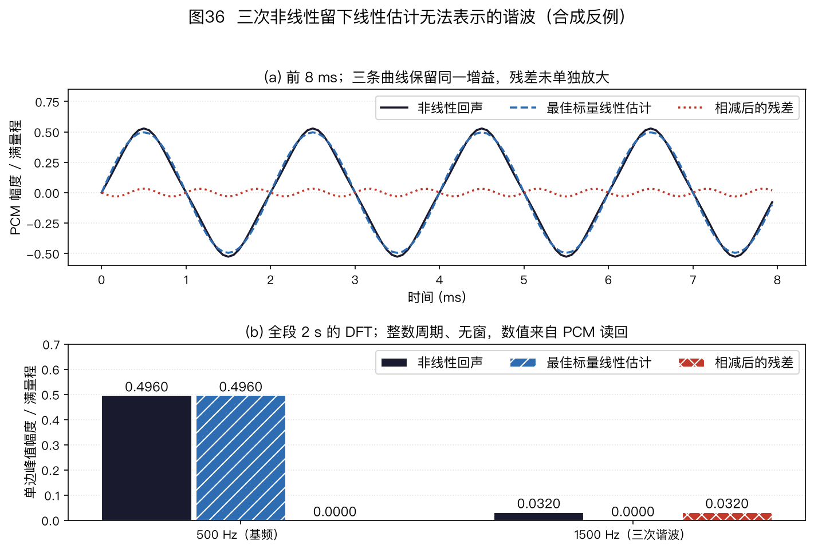

> ⚠️ 本篇是教程正文第 6 章（正文共 11 章，另有附录 A/B），可独立阅读，前后篇见下方导航。
>
> 🏠 首页导读：[`00_overview.md`](./00_overview.md) ｜ 上一篇：[05_beamforming.md](./05_beamforming.md) ｜ 下一篇：[07_wpe-dereverberation.md](./07_wpe-dereverberation.md)

---

## 6. 声学回声消除（Acoustic Echo Cancellation，AEC）

第 4、5 章和第 9 章讨论声源方向、波束和轨迹。本章转向设备播放声返回麦克风所形成的回声。混响拖尾和多说话人混合分别见第 7、8 章。

### 6.1 AEC 的模型、算法与实现

**问题**：音箱放音乐时，扬声器的声音经房间反射回到自己的麦克风。回声相对近端语音的强弱取决于播放音量、距离、房间和器件耦合；当回声占优时，唤醒和通话都会受到影响。

回声有一个可利用的条件：设备保存着播放信号 $x(n)$。未知的是播放信号经过扬声器、房间和麦克风之后形成的回声路径。本节先建立线性近似，再讨论非线性、双讲、残余抑制以及它与波束形成的顺序。

**线性模型与自适应滤波（§6.1.1～§6.1.3）**

#### 6.1.1 回声从哪来：系统模型与四种场景

**信号模型**。先把播放链路近似成有限长、线性、时不变系统。麦克风录到的信号可以写成三项之和：

$$\begin{aligned}
d(n) &= s(n) + (x*h)(n) + v(n),\\
(x*h)(n)&=\sum_{\ell=0}^{L-1}h[\ell]x[n-\ell]\text{。}
\end{aligned}\tag{6-1}$$

其中，$d(n)$ 是第 $n$ 个采样时刻的麦克风样本；$s(n)$ 是需要保留的近端语音；$x(n)$ 是设备保存的远端播放参考；$h[\ell]$ 是长度为 $L$ 的线性回声路径冲激响应，$\ell$ 是抽头索引；$v(n)$ 是环境噪声，$*$ 表示卷积。短时间内采用固定的 $h[\ell]$；若要显式描述路径随时间变化，可写成 $h_n[\ell]$。AEC 要估计并减去 $x*h$，同时尽量保留 $s$。

这个模型不是完整的扬声器—房间—麦克风模型。它只覆盖参考抽头之后、在分析时间内可近似为线性且缓慢变化的部分。扬声器削顶、功放压缩和结构振动不能由单个线性卷积准确表示；人移动、设备转动和温度变化又会使 $h$ 随时间改变。实际系统因此把 $h$ 当作短时间内有效的近似，并用持续自适应跟踪变化；非线性残余另由 §6.1.4 和 §6.1.6 的模块处理。


图26（a）的合成路径显式放置直达分量和若干早期反射，再叠加逐渐衰减的晚期尾声；这些成分只用于说明卷积结构，不代表某个实测房间。

图26（b）给出远端参考、卷积后的回声和 0.8～1.2 s 加入的合成近端干扰。该干扰取自白高斯随机样本，不是语音录音；图26（c）显示它们在麦克风信号 $d(n)$ 中叠加。AEC 根据参考估计回声分量，再从 $d(n)$ 中减去该估计。

$h[\ell]$ 表示从参考抽头到麦克风之间的**线性等效路径**，包括转换器、扬声器的小信号响应、声学传播和麦克风响应。它与 §2.4 的纯声学房间冲激响应有关，但还包含电声器件的线性响应，二者不能完全等同。滤波器所需覆盖时间应由目标设备的实测回声路径确定；16 kHz 下 1 ms 对应 16 个抽头，64 ms 对应 1024 个抽头。滤波器没有覆盖的晚期部分会留在残差中，再由残余回声抑制器处理。

**四种工作场景**（谈论任何 AEC 指标前先声明场景，否则数字没有意义）：

1. **远端单讲（Single-Talk Far-End，STFE）**：只有扬声器在响，$s(n)=0$，适合检查回声衰减；
2. **近端单讲（Single-Talk Near-End，STNE）**：只有用户在说话，回声路径没有激励，AEC 不应改变近端通道；
3. **双讲（Double-Talk，DT）**：两者同时存在。残差 $e$ 中含近端语音，继续更新会使路径估计偏离，残余抑制也可能损伤近端语音，控制方法见 §6.1.5；
4. **双方沉默（idle）**：回声与语音都没有。滤波器不应在纯噪声激励下持续漂移，残余抑制也不应把背景压成突兀的静音。测试矩阵应覆盖沉默期路径变化以及重新播放后的恢复过程（§6.1.9、§6.1.12）。

免提通话需要同时控制远端单讲时的残余回声和双讲时的近端语音损伤。远端单讲可用输入、输出功率近似回声返回损失增强（Echo Return Loss Enhancement，ERLE）；双讲的回声分量真值例外和统计口径见 §6.1.8。具体验收阈值应由目标场景、适用标准和主观听测确定。

**主要难点**（Breining et al. 1999 年的综述系统讨论了以下四项）：

1. **冲激响应长**：回声路径覆盖时间增加时，时域滤波器需要更多抽头，计算量增加，收敛也可能变慢；§6.1.3 说明分区频域方案怎样降低长滤波器的计算量；
2. **非线性**：微型扬声器与功放在大音量下可能产生线性卷积无法表示的分量，具体模型和参考取点见 §6.1.4；
3. **双讲**：参考与目标同时存在，近端语音会使自适应更新产生偏差，见 §6.1.5；
4. **路径时变**：人走动、门开关、设备被挪动都会改变等效路径 $h_n[\ell]$；参考具有足够激励时，滤波器需要更新以跟踪这些变化。[Breining et al., IEEE Signal Processing Magazine 1999](https://doi.org/10.1109/79.774933 "citation")

> **边栏：温度如何搬动回声。**
>
> 声速随温度变化 $v\approx331+0.61\,T$ m/s，$T$ 为摄氏温度。温度每变化 1 °C，声速改变约 0.18%；变化 10 °C，就是约 1.8%。对固定 1 m 路径，传播时延从 20 °C 的 $1/343.2\approx2.914$ ms 变为 30 °C 的 $1/349.3\approx2.863$ ms，缩短约 51 µs，在 16 kHz 下约 0.82 个采样。
>
> 反射路径长度各不相同，所以每条路径按自身长度产生不同的时延变化，并非整条冲激响应统一平移 50 µs。
>
> Elko、Diethorn 与 Gänsler（IWAENC 2003）的实测表明，缓慢的热漂移会侵蚀已收敛 AEC 的性能。这是“路径时变”比较隐蔽、也无法靠出厂标定消除的一种形式。[Elko, Diethorn & Gänsler, IWAENC 2003](https://www.iwaenc.org/proceedings/2003/data/0025.pdf "citation")、[Frontiers in Signal Processing 2024（温度对 AEC 影响的实测研究）](https://www.frontiersin.org/journals/signal-processing/articles/10.3389/frsip.2024.1426082/full "citation")

**减法与乘法两类处理**。AEC 有已知参考，可以估计回声的幅度和相位后做减法；相位估计错误时，减法也可能放大残余。降噪（§5.7）通常没有噪声波形参考，只能估计能量并施加 0～1 的增益。§6.1.9 的非线性处理（Nonlinear Processing，NLP）残余抑制和第 5 章的后置滤波都属于后一类方法。


图27显示基本信号流：播放参考一支经过扬声器和房间进入麦克风，另一支进入自适应滤波器以估计回声路径。估计回声从麦克风信号中减去，双讲检测控制滤波器是否更新。

#### 6.1.2 线性自适应滤波：NLMS 回顾

**做法**：用一个**自适应滤波器** $\hat{\vec{w}}(n)$ 去模仿这条回声路径 $h[\ell]$，把参考信号过滤一遍得到“回声副本” $\hat y(n)$，再从麦克风信号里减掉：

先固定抽头顺序：$\vec{x}(n)=[x(n),x(n-1),\ldots,x(n-L+1)]^\top$ 是最近 $L$ 个参考样本，$\hat{\vec w}(n)=[\hat w_0(n),\ldots,\hat w_{L-1}(n)]^\top$ 是同样长度的实数系数向量，当前位置的样本对应第 0 个抽头。二者的内积才与式(6-1)的卷积索引一致。

$$e(n) = d(n) - \hat{\vec{w}}^{\top}(n)\,\vec{x}(n)$$

滤波器当前的路径估计作用于播放参考，产生估计回声；$e(n)$ 是麦克风样本 $d(n)$ 与估计回声之差。远端单讲、参考充分激励且线性模型匹配时，残差功率下降可以支持路径估计改善；单个样本或高度相关参考上的低残差，并不保证系数接近真实路径。抽头数须结合采样率、参考到麦克风的纯延迟、实测路径覆盖时间和可接受残余确定。

经典更新算法是**归一化最小均方（Normalized Least Mean Squares，NLMS）**：

$$\hat{\vec{w}}(n+1) = \hat{\vec{w}}(n) + \mu\,\frac{e(n)\,\vec{x}(n)}{\|\vec{x}(n)\|^2 + \varepsilon}\text{。}\tag{6-2}$$

更新量与残差和输入向量成正比，并由输入能量归一化。$\varepsilon$ 防止静默时分母接近零。若实现为了手算或节省运算而省略 $\varepsilon$，必须另设零能量保护：$\|\vec x(n)\|^2=0$ 时跳过更新，不能计算未定义的 $0/0$。

**这个更新式怎么来的**（三步）：

1. **定目标**：想让残差功率最小。最直接的瞬时目标 $J(n) = e(n)^2$，对 $\hat{\vec{w}}$ 求梯度：$\dfrac{\partial J}{\partial \hat{\vec{w}}} = -2\,e(n)\,\vec{x}(n)$（因为 $e = d - \hat{\vec{w}}^\top\vec{x}$，链式法则一步得出）；
2. **最速下降**：沿负梯度方向走一小步 $\hat{\vec{w}} \leftarrow \hat{\vec{w}} + \mu'\,e(n)\,\vec{x}(n)$，得到**最小均方（Least Mean Squares，LMS）**算法；
3. **归一化步长**：固定步长 $\mu'$ 对输入幅度敏感，幅度较大时可能发散，较小时又会减慢收敛。NLMS 用 $\|\vec{x}(n)\|^2+\varepsilon$ 对更新归一化，$\varepsilon$ 是防止静音时除以零的小正数。

    当线性路径在观察期固定、参考充分激励、没有近端干扰，并忽略正则项时，同一样本的后验误差缩放为 $1-\mu$；因此 $0<\mu<2$ 使这个**单步**误差幅度减小。

    它不是任意有色参考、噪声、双讲和时变路径下的统一均方稳定保证。$\mu=1$ 只对应同一帧给定输入下的瞬时最优，并非统计最优。实际步长要在目标参考信号、双讲控制和路径变化条件下扫描；图 18（b）的本书仿真使用 $\mu=0.5$。

**算例 6-1：NLMS 的一步手算**

**题设**：3 抽头滤波器，参考向量 $\vec{x}(n)=[1,\ 0.5,\ -0.5]^\top$（最近 3 个播放样本），当前滤波器 $\hat{\vec{w}}(n)=[0,\ 0,\ 0]^\top$（零初值），麦克风信号 $d(n)=0.8$，步长 $\mu=0.5$，$\varepsilon$ 很小先忽略。按式(6-2)更新一步。

**第 1 步：算回声副本与残差**。$\hat y(n)=\hat{\vec{w}}^\top(n)\vec{x}(n)=0\times1+0\times0.5+0\times(-0.5)=0$——滤波器还是零，回声一点没被减掉，残差 $e(n)=d(n)-\hat y(n)=0.8$ 就是全部。

**第 2 步：算归一化因子**。$\|\vec{x}(n)\|^2=1^2+0.5^2+(-0.5)^2=1.5$。用输入能量归一化后，播放幅度增大时分母也随之增大，可降低固定步长对输入幅度变化的敏感性。

**第 3 步：算更新量、更新滤波器**。

$$\mu\,\frac{e(n)}{\|\vec{x}(n)\|^2}\,\vec{x}(n)=\frac{0.5\times0.8}{1.5}\begin{bmatrix}1\\0.5\\-0.5\end{bmatrix}=\frac{0.4}{1.5}\begin{bmatrix}1\\0.5\\-0.5\end{bmatrix}\approx\begin{bmatrix}0.267\\0.133\\-0.133\end{bmatrix}$$

$$\hat{\vec{w}}(n+1)=[0,\ 0,\ 0]^\top+\Delta\vec w\approx[0.267,\ 0.133,\ -0.133]^\top$$

这里 $\Delta\vec w$ 就是上式算出的更新向量。

这一步只修正了当前输入方向上的误差；其他方向需要后续不同的输入向量提供梯度信息。更新方向与 $\vec{x}(n)$ 平行。

**第 4 步：用更新后的系数重算回声副本**。

$$\begin{aligned}
\hat y'(n)&=\hat{\vec{w}}^\top(n+1)\vec{x}(n)\\
&=0.267\times1+0.133\times0.5+(-0.133)\times(-0.5)\\
&\approx0.267+0.067+0.067\approx0.4
\end{aligned}$$

新残差 $e'(n)=0.8-0.4=0.4$。把更新式代回残差可得 $e'(n)\approx(1-\mu)\,e(n)$，因此 $\mu=0.5$ 时同一帧的后验残差减半；$\mu=1$ 时到达该帧的瞬时最优。连续输入上的多次更新使滤波器逐步收敛。

> **$e'\approx(1-\mu)e$ 的推导。** 把更新式代回**同一帧**的残差：
>
> $$\begin{aligned}e'(n)&=d-\hat{\vec{w}}^\top(n+1)\vec{x}\\&=[d-\hat{\vec{w}}^\top(n)\vec{x}]-\mu\,e(n)\,\frac{\vec{x}^\top\vec{x}}{\|\vec{x}\|^2+\varepsilon}\\&=e(n)\left[1-\mu\,\frac{\|\vec{x}\|^2}{\|\vec{x}\|^2+\varepsilon}\right]\end{aligned}$$
>
> $\varepsilon\ll\|\vec{x}\|^2$ 时方括号约等于 $(1-\mu)$，即 $e'(n)\approx(1-\mu)e(n)$。$\mu=1$ 时 $e'\approx0$，只表示本帧给定 $\vec{x}$ 下的瞬时最优；下一帧输入变化后仍需继续更新。$\mu=0.5$ 时本帧残差减半。$\mu=1.8$ 时 $e'\approx-0.8e$，残差变号且幅度仍为原来的 80%；$\mu=2$ 对应幅度不减的临界情况。

**第二个手算例**（换一组数，验证“减半”不是巧合）：$\vec{x}=[0.8,-0.4,0.4]^\top$，$d=0.6$，$\hat{\vec{w}}(n)=0$，$\mu=0.5$。

$\|\vec{x}\|^2=0.64+0.16+0.16=0.96$，更新量 $=0.5\times0.6/0.96\times\vec{x}=[0.25,-0.125,0.125]^\top$。重算得到

$$\begin{aligned}
\hat y'&=0.25\times0.8+(-0.125)\times(-0.4)+0.125\times0.4\\
&=0.2+0.05+0.05=0.3\text{，}
\end{aligned}$$

新残差为 $0.6-0.3=0.3$。

残差同样减半，说明规律 $e'\approx(1-\mu)e$ 与这组具体数字无关。


图18（a）给出整体结构；（b）给出 NLMS 在模拟回声路径上的收敛曲线。仿真取 $\mu=0.5$，回归向量按 $\vec x(n)=[x(n),x(n-1),\ldots,x(n-L+1)]^\top$ 排列，与生成回声的卷积索引一致，不额外引入一拍延迟。图中标注的是固定随机种子下 $0.45<t<0.8$ s 远端单讲窗口的 ERLE 均值；粉色区域表示双讲期间冻结更新，该区间不统计 ERLE。


图28（a）显示 $\hat{\vec{w}}$ 从零开始逐步逼近真实路径 $h$。（b）显示本次仿真中，系数欧氏失配下降时 ERLE 总体上升；两者不是互为相反数，因为有色输入下的残余功率还由输入协方差加权，纵轴也使用不同统计口径。（c）比较不同步长在有限观察时段内的收敛轨迹。

本图使用固定、完全可表示的线性路径，没有近端语音或噪声，因此不能从曲线起伏推出含噪系统的稳态失调。较大步长在含噪时可能增加稳态误差，须另在固定噪声和统计窗口下测试；$\mu\in(0,2)$ 也不是实际系统的无条件稳定范围。


图29上方三行使用共同尺度的均方根包络，分别显示参考 $x$、麦克风信号 $d$ 和残差 $e$。粉色区域加入合成近端干扰，所用白高斯随机样本不是语音录音；此时残差含干扰，不能用输入/输出总功率评价回声抵消量，因此 ERLE 曲线在该区间不绘制。

滤波器在该区间冻结更新，之后继续沿原路径工作。图28中的“0步”曲线表示更新前的全零初值；后续编号表示已完成的更新次数。

**步长与正则项。** 较大的 $\mu$ 通常使初期收敛较快；在有观测噪声、近端干扰或路径变化时，也可能增大稳态失调和误更新。图28的无噪声仿真不能单独证明后一项。

$\varepsilon$ 防止静默时分母趋近于零。固定下限与随参考功率缩放的正则项使用不同量纲和归一化口径，不能照搬同一个数值。可扫描静音、低电平参考和正常播放三类输入，选择既不在静音时产生大更新、又不过度减慢小信号收敛的取值。

**收敛还需要充分激励**。NLMS 每步只能沿当前输入方向 $\vec{x}(n)$ 修正（见算例 6-1 第 3 步）。纯音或窄带参考不能充分激励所有滤波器系数，未被激励的方向会收敛得很慢。调试时可用已知宽带测试信号检查滤波器是否能辨识目标路径；这项测试不能代替真实节目内容上的收敛与双讲验证。

单位脉冲是一个容易混淆的边界例子。对 $L$ 抽头回归器，单个单位脉冲会依次产生 $L$ 个标准基向量，因此方向并不缺失；但每个方向只更新一次。若 $\mu=0.5$、初值为零且忽略非零 $\varepsilon$ 的微小影响，每个抽头只走到真实值的一半。要继续逼近真实路径，需要重复脉冲或其他持续激励；输入归零后应按上面的零能量规则跳过更新。

#### 6.1.3 工程化自适应：频域、子带、比例、卡尔曼

**时域实现的计算量**。若每个样本重新计算长度 $L$ 的参考能量，时域 NLMS 的滤波、更新和能量求和各约需 $L$ 次乘法，即朴素实现约 $3L$ 次。参考窗口每次只移入、移出一个样本时，也可递推能量 $p_n=p_{n-1}+x[n]^2-x[n-L]^2$，使这一项每样本只需常数次运算；滤波与更新仍约需 $2L$ 次乘法。

$L=1024$、8 kHz 时，朴素口径约为 2500 万次乘法/秒，能量递推口径的主要项约为 1600 万次/秒；两者都不含内存访问和控制开销。能量递推需按启动零填充初始化，并在长时浮点运行中定期核对直接求和，避免累计舍入误差。

48 kHz、4096 抽头时主要项达到每秒数亿次；抽头越多、输入频谱越不均匀，收敛通常越慢。常见改进包括频域分块、子带处理、比例步长和卡尔曼估计。

以 $L=3$、参考样本依次为 $1,2,3,4$ 为例，前一窗口能量 $1^2+2^2+3^2=14$；移入 4、移出 1 后得到 $14+4^2-1^2=29$，与直接计算 $2^2+3^2+4^2=29$ 一致。递推只减少分母的重复求和，不减少回声估计和系数更新的 $L$ 个抽头运算。

**分区块频域自适应滤波（Partitioned-Block Frequency-Domain Adaptive Filtering，PBFDAF）**。它沿用多延迟块频域（Multidelay Block Frequency-Domain，MDF）方法的思路，把 $L$ 个抽头分成 $P=\lceil L/N\rceil$ 个长度为 $N$ 的分区，并用长度 $2N$ 的快速傅里叶变换（Fast Fourier Transform，FFT）完成重叠保存卷积。

每块的频域滤波和梯度相关都要遍历 $P$ 个分区，因此不能只写成 $O((L/N)\log N)$。忽略实现常数时，无梯度约束版本每个新样本约为 $O(\log N+L/N)$；若每个分区都做时域梯度约束，还会增加约 $O((L/N)\log N)$。FFT 的固定成本随块长对数增长，分区乘法则随 $L/N$ 线性增长。

具体倍数还取决于实数或复数 FFT、频谱共轭对称复用、功率估计、约束频率以及一次乘加如何计数，不能脱离这些约定比较。[KU Leuven DSP-CIS 讲义第 13 章](https://homes.esat.kuleuven.be/~dspuser/DSP-CIS/2018-2019/material/chapter13.pdf "citation")

**算例 6-2：PBFDAF 的乘法计数**（$L=1024$、$N=128$、8 kHz，看“一个数量级”是怎么省出来的）

**时域 NLMS 的账**：每样本滤波 $L$ 次乘法、更新 $L$ 次；朴素重算功率再加 $L$ 次，共约 $3L=3072$ 次乘法/样本。若按上文滑动窗口递推参考能量，主要项是 $2L=2048$ 次，另有常数次标量运算；递推版本与下面的朴素版本应分别比较。

**PBFDAF 的账**：块长 $N=128$，FFT 长度取 $2N=256$（overlap-save 结构，防循环卷积混叠），分区数 $P=L/N=8$。每来一块 128 个新样本，要做的活是：

1. 新参考块算 1 次 FFT——旧分区的频谱整体平移复用，不必重算，这是“分区”省钱的根源；
2. 8 个分区各做一次长度 256 的复数相乘（滤波 = 频域相乘），合起来做 1 次逆快速傅里叶变换（Inverse Fast Fourier Transform，IFFT）得到输出块；
3. 误差块 1 次 FFT，8 个分区各做一次共轭相关复乘（梯度方向）；
4. 若对每个分区施加时域梯度约束，要把该分区的频域梯度做 IFFT、把无效的后半段清零，再 FFT 回频域，因此每个分区增加一对变换；无约束版可省掉这一步，间歇约束版则按实际约束频率折算。

为使下面的算术可逐项复算，这里采用一个保守的**全复数上界口径**：不利用实信号频谱的共轭对称，把每次 $2N$ 点变换按完整复 FFT 计为约 $4N\log_2(2N)=4\times128\times8=4096$ 次实乘法，长度 256 的逐点复乘按 $256\times4=1024$ 次实乘法计。实际实 FFT 只需保存 $N+1=129$ 个独立频点，若复用共轭对称，FFT 和逐点乘法都应按具体库重新计数，不能沿用下面的 4096 和 1024：

- 无约束版：$3\times4096 + 2\times8\times1024 = 12288+16384=28672$ 次/块 → 每样本 $28672/128\approx224$ 次；
- 逐分区约束版：再加 $2\times8\times4096=65536$，共 $94208$ 次/块 → 每样本约 736 次。

在上述未复用共轭对称的上界口径下，无约束版约为 224 次实乘法/样本，逐分区每块约束版约为 736 次。与朴素时域 NLMS 的 3072 次相比，乘法计数约差 14 倍和 4.2 倍；与递推能量版本的 $2L=2048$ 次主要项相比，约差 9.1 倍和 2.8 倍。前者的频域变换按完整复 FFT 上界估算，后者未计标量运算，两边都不是优化实现的实测速度，不应把这些比值当作公平的产品性能排名。

这些数不能当作实 FFT 库的操作数或实测速度。若约束不是每块、每分区都执行，平均开销会降低，报告时要注明约束周期。

块长 $N=128$、采样率 8 kHz 时，每块含 16 ms 新数据；实际算法延迟由重叠保存、调度方式和系统缓冲共同决定，不能仅凭“两个块”固定写成 32 ms。滤波器加长时，时域复杂度按 $L$ 增长，而分区频域方法的主要项按 $L/N$ 增长，因此长回声路径更适合用分区频域实现。[Soo & Pang 1990](https://doi.org/10.1109/29.103078 "citation")

**算例 6-3：两个样本一块，为什么要丢掉前半块。** 本书取 $N=2$、$P=2$、路径 $h=[1,2\mid3,4]$、参考 $x=[1,2,3,4]$，负时间样本为零。直接按式(6-1)卷积，前四个回声样本依次为 $[1,4,10,20]$。竖线只标示两段抽头的分区边界，不表示时域路径在这里中断。

第 0 块把两点新参考 $[1,2]$ 接在两点历史零之后，形成四点输入 $[0,0,1,2]$。它与首分区 $[1,2,0,0]$ 作四点循环卷积，只保留后两点 $[1,4]$；更早的分区历史为零。

第 1 块的四点输入是 $[1,2,3,4]$。它与首分区的四点循环卷积为 $[9,4,7,10]$，其中前两点已受到循环折回影响，必须丢弃。

后两点 $[7,10]$ 加上**上一参考块** $[0,0,1,2]$ 与第二分区 $[3,4,0,0]$ 的有效后两点 $[3,10]$，得到 $[10,20]$。若第二分区错用当前块，或把前两点当作线性卷积结果，答案都会错。配套代码只复算这一段分区卷积，不冒充完整自适应 PBFDAF；误差反馈还须按下式另行处理。

> **PBFDAF 更新式。** 记第 $m$ 块、第 $k$ 个频点的参考谱为 $X(k,m)$，第 $p$ 个分区的滤波器谱为 $W_p(k,m)$，误差谱为 $E(k,m)$，其中 $p=0,\ldots,P-1$。$\mu$ 是块更新步长，$\delta>0$ 是防止参考功率为零时除零的归一化地板。一种按全部分区参考功率归一化的更新写成
>
> $$W_p(k,m+1)=W_p(k,m)+\mu\,\frac{E(k,m)\,X^*(k,m-p)}{\sum_{q=0}^{P-1}|X(k,m-q)|^2+\delta}\text{。}\tag{6-3}$$
>
> 分区 $p$ 使用延迟了 $p$ 个块的参考 $X(k,m-p)$；若省略该下标，公式就只描述单分区 FDAF。与时域 NLMS 相比，分子仍是“误差 × 参考共轭”，分母仍做参考功率归一。
>
> 实际重叠保存实现只把每块线性卷积的后 $N$ 个输出作为有效残差。以上面 $N=2$ 的第 1 块为例，若两个有效先验误差为 $[e_2,e_3]$，构造四点误差谱时先排成 $[0,0,e_2,e_3]$ 再做 FFT；不能把循环污染区的输出当成新观测。这里的 $E(k,m)$ 是用旧滤波器产生的这类先验误差谱。文献和代码也会为每个分区维护独立平滑功率，比较实现时必须核对归一化定义。
>
> 若执行时域梯度约束，应对更新量做 IFFT、清零循环相关对应的无效抽头，再 FFT 回频域；完全不约束的版本可能有不同的稳态权重和误差，不能只比较上面的乘法计数。以 $N=128$、8 kHz 为例，每秒更新约 $8000/128\approx62.5$ 次；每次更新同时利用 128 个新样本，整体乘法量见算例 6-2。[Shynk，*IEEE Signal Processing Magazine* 1992，§IV](https://course.ece.cmu.edu/~ece792/handouts/Shynk92.pdf "citation")讨论频域更新的循环相关与梯度约束。

**子带自适应**先用分析滤波器组把参考和麦克风信号分带，再在各带降采样、估计回声，最后合成输出。降采样减少每秒更新次数；各带的输入谱通常比全带平坦，但分带滤波、跨带耦合和合成延迟也有代价。

关键不能把“滤波器组可完美重建”与“用独立子带滤波器可精确表示回声路径”混为一谈。即使分析—合成滤波器组对未处理信号可重建，临界采样后的回声系统在某些条件下仍需要交叉子带滤波器来表示。只看未滤波的降采样示意：$\cos(2\pi n/8)$ 与 $\cos(2\pi3n/8)$ 隔点取样后都变为 $\cos(\pi m/2)$；实际分析滤波器会抑制混叠，不能拿这个示意直接计算系统的残余回声。比较实现时要核对滤波器组、降采样率、跨带项和总延迟。[Gilloire 与 Vetterli，*IEEE Transactions on Signal Processing* 40(8), 1992](https://doi.org/10.1109/78.149989 "citation")

**IPNLMS：按稀疏度分配步长**。真实回声路径通常由直达声和少数强反射贡献主要能量，其余抽头较小。NLMS 对所有抽头使用同类更新；比例归一化最小均方（Proportionate Normalized Least-Mean-Square，PNLMS；Duttweiler 2000）与改进比例归一化最小均方（Improved Proportionate Normalized Least-Mean-Square，IPNLMS；Benesty & Gay，ICASSP 2002）按系数当前幅度分配更新量，使较大的系数优先收敛。

用 $\kappa\in[-1,1]$ 表示混合系数，$\delta>0$ 防止更新分母为零，$\varepsilon_g>0$ 防止比例项分母为零。一种常用写法是

$$\begin{aligned}
g_l&=\frac{1-\kappa}{2L}
    +\frac{(1+\kappa)|\hat w_l|}
           {2\|\hat{\vec w}\|_1+\varepsilon_g},\\
\hat{\vec w}^{+}
   &=\hat{\vec w}
     +\mu\frac{eG\vec x}
                {\vec x^{\top}G\vec x+\delta}.
\end{aligned}\tag{6-4}$$

这里 $g_l$ 是第 $l$ 个抽头的非负权重，$G=\operatorname{diag}(g_0,\ldots,g_{L-1})$；$G$ 调整更新方向和归一化，而不改变回声副本的卷积定义。

$\kappa=-1$ 时各 $g_l=1/L$，更新退化为带相应正则项的 NLMS。$\kappa=1$ 时只剩比例项；零初值下它会全部为零而无法起步，实际实现须保留均匀分量或权重下限。不同文献可能使用 $\alpha$ 并改变归一化，比较参数前要先核对定义。[Benesty 等，EUSIPCO 2004，表 1](https://www.eurasip.org/Proceedings/Eusipco/Eusipco2004/defevent/papers/cr1026.pdf "citation")

**两抽头手算。** 设 $\hat{\vec w}=[0.8,0.2]^\top$、$\vec x=[1,1]^\top$、$d=1.2$、$\mu=1$，则先验残差 $e=1.2-(0.8+0.2)=0.2$。忽略极小的正则项，$\kappa=0$ 时 $g=[0.65,0.35]$，更新量为 $[0.13,0.07]^\top$；$\kappa=-1$ 时 $g=[0.5,0.5]$，更新量为 $[0.10,0.10]^\top$。

这个单步例子只说明权重如何分配，不证明长期收敛优劣；声学路径是否足够稀疏还需用目标录音检验。

**递归最小二乘与卡尔曼方法。** 递归最小二乘（Recursive Least Squares，RLS）不只沿当前样本的梯度走一步，而是递推求解带遗忘的加权最小二乘。对时刻 $n$，目标函数为

$$J_n(\vec w)=\sum_{i=0}^{n}\lambda^{n-i}[d(i)-\vec w^{\top}\vec x(i)]^2,\qquad 0<\lambda\leq1\text{。}\tag{6-5}$$

$\lambda$ 越小，旧样本权重衰减越快，对路径变化可能反应更快，但噪声下的估计方差也会增大。单抽头、两个参考都为 1、两个观测分别为 1 和 3 时，$\lambda=1$ 给出 $w=(1+3)/2=2$，$\lambda=0.5$ 给出 $w=(0.5\times1+3)/1.5=7/3$。此例只是加权目标的精确解，不是 AEC 性能实测。

若持续有输入，$1/(1-\lambda)$ 可粗略表示指数权重的记忆样本数，例如 $\lambda=0.99$ 约为 100；它不是固定时长，采样率和分块方式都会改变对应时间。标准全矩阵 RLS 每样本 $O(L^2)$，长回声路径下还须处理输入病态、协方差初始化和数值稳定性。[Elisei-Iliescu 等，2017 年 AEC 自适应算法综述](https://www.thinkmind.org/articles/tele_v10_n34_2017_2.pdf "citation")

**频域卡尔曼滤波**（Frequency-Domain Kalman Filter，FDKF）把每个频点的回声路径系数当作随时间缓慢变化的状态。卡尔曼增益的作用类似自适应步长，但只有在状态模型、过程噪声方差和观测噪声方差与实际相符时才是相应模型下的最小均方误差增益。双讲时，如果观测噪声估计能及时包含近端语音能量，增益会减小；估计滞后或模型失配时仍可能误更新，所以工程实现通常还会结合双讲检测或增益上限。

FDKF 把回声路径作为状态变量，其状态方程和观测方程可写为（实际在频域逐频点计算，此处用时域记号示意）：

$$\vec{h}(n) = a\,\vec{h}(n-1) + \Delta\vec{h}(n),\qquad d(n) = \vec{x}^{\top}(n)\,\vec{h}(n) + s(n) + v(n)$$

第一行是**状态方程**：上一时刻的路径乘状态转移因子 $a$，再加过程噪声 $\Delta\vec{h}$，用来描述缓慢漂移和偶发突变。第二行是**观测方程**：麦克风信号由参考经过路径滤波后，再叠加近端语音和噪声。对应 §9.2 的卡尔曼递推，状态是 $\vec{h}$，观测是 $d$，近端语音与噪声合并为观测噪声。

双讲时，若观测噪声估计 $\Psi_m$ 随近端语音能量增大，卡尔曼增益会减小。路径变化后，先验残差 $E_m$ 可能增大，但下文式(6-6)中的增益并不直接依赖 $E_m$；只有过程噪声、误差协方差或状态重置策略相应调整时，增益才可能上升并加快重新收敛。每个频点还需维护误差方差或协方差，因此计算量高于普通 PBFDAF。

逐频点写完整的一次递推。省略频点下标，$W_{m-1}$ 是上一块的路径系数，$P_{m-1}$ 是其误差方差，$a$ 是状态转移因子，$\Phi_m$ 和 $\Psi_m$ 分别是过程噪声与观测噪声方差：

$$\begin{aligned}
\hat W_m^-&=aW_{m-1},& P_m^-&=|a|^2P_{m-1}+\Phi_m,\\
E_m&=D_m-X_m\hat W_m^-,& K_m&=\frac{P_m^-X_m^*}{|X_m|^2P_m^-+\Psi_m},\\
W_m&=\hat W_m^-+K_mE_m,& P_m&=(1-K_mX_m)P_m^-.
\end{aligned}\tag{6-6}$$

前两式先预测路径和不确定度；协方差传播使用 $|a|^2$，因为复数状态模型的一般形式是 $APA^H+Q$。中间两式根据先验残差计算增益；最后两式更新系数和误差方差。标量复数模型中 $K_mX_m$ 为实数且位于 0 与 1 之间。实际分区频域实现还要处理矩阵协方差、块卷积约束和频点平滑。[Enzner & Vary 2006](https://doi.org/10.1016/j.sigpro.2005.09.013 "citation")

若暂时固定 $W$，并把残差视为零均值圆对称复高斯变量，单帧负对数似然中与 $\Psi$ 有关的部分为 $|E|^2/\Psi+\log\Psi$。正确的导数是

$$\frac{\partial}{\partial\Psi}\left(\frac{|E|^2}{\Psi}+\log\Psi\right)=-\frac{|E|^2}{\Psi^2}+\frac{1}{\Psi}.$$

令它为零得到单帧极大似然估计 $\hat\Psi=|E|^2$。单帧估计波动很大，还把未建模回声混入“观测噪声”，所以实际系统会做时间平滑、双讲判决或由网络估计 $\Psi$，不能直接把当前 $|E|^2$ 当成准确的近端语音功率。

最小数例取 $X=1$、$P^-=1$。远端单讲时若 $\Psi=0.01$，$K=1/1.01\approx0.990$，残差的大部分用于更新；双讲时若 $\Psi=10$，$K=1/11\approx0.091$，同一残差下的更新量约为前者的 9.2%。这说明软门控会缩小更新，但并没有严格冻结。

另固定 $X=1$、$P^-=1$、$\Psi=1$，无论先验残差为 0 还是 10，增益都为 $K=1/2$。若路径突变检测后把预测方差调整为 $P^-=4$，在其余条件不变时才得到 $K=4/5$。这是式(6-6)的代入，不表示实际检测器一定能正确区分路径突变与双讲；两者都可能增大残差，却需要不同的更新控制。

**完整的一轮标量递推。** 取实数特例 $W_{m-1}=0.2$、$P_{m-1}=0.5$、$a=1$、$\Phi_m=0.1$、$X_m=2$、$D_m=1.4$、$\Psi_m=0.4$。预测得到 $\hat W_m^-=0.2$、$P_m^-=0.6$；先验残差 $E_m=1.4-2\times0.2=1.0$。于是

$$K_m=\frac{0.6\times2}{2^2\times0.6+0.4}=\frac{1.2}{2.8}\approx0.4286,$$

$$\begin{aligned}
W_m&=0.2+0.4286\times1.0\approx0.6286,\\
P_m&=(1-0.4286\times2)0.6\approx0.0857\text{。}
\end{aligned}$$

用更新后的系数回看该观测，残差为 $1.4-2\times0.6286\approx0.1429$；它是后验检查，不应代替式(6-6)中用于更新的先验残差。若 $\Psi_m\to\infty$，则 $K_m\to0$，路径几乎不更新；若理想化地令 $\Psi_m\to0$ 且 $X_m\ne0$，标量模型会令 $K_m\to1/X_m$、$P_m\to0$。实际系统存在模型失配和数值误差，需要为方差设置正下限，不能把 $P_m=0$ 当作永久确定。

**分区块频域卡尔曼滤波**（Partitioned-Block Frequency-Domain Kalman Filter，PBFDKF）还要把长回声路径分区并维护跨分区状态统计量；不能把上述单频点、单状态演示直接当作完整 PBFDKF 的计算量或稳定性证明。Zhu 等（Interspeech 2021，§2–3）的具体推导针对双声道声学回声消除，并比较保留不同协方差子矩阵的两种简化；跨分区和跨声道相关如何近似，会改变估计与资源开销。[Zhu 等原论文](https://www.isca-archive.org/interspeech_2021/zhu21d_interspeech.pdf "citation")

**方法对比。** 下表比较模型和资源依赖，不给没有共同输入、路径、收敛目标与实现条件支撑的“快、中、慢”排名。若要比较实际收敛，需在同一播放参考、回声路径、双讲安排和统计窗口上运行各实现，并分别报告初始收敛、突变恢复与稳态误差。图32给出排障流程，而不是算法性能排序。

| 算法 | 每样本主要计算 | 收敛受什么影响 | 双讲更新控制 | 适用条件 |
|---|---|---|---|---|
| 时域 NLMS | $O(L)$；朴素约 $3L$，能量递推主要项约 $2L$ | 输入谱、步长、路径变化 | 需外部冻结或连续步长控制 | 路径较短，或资源允许逐样本更新 |
| IPNLMS | $O(L)$，另有比例权重计算 | 稀疏路径可能更快；稠密尾声不能照搬该趋势 | 仍需双讲控制 | 有明显强抽头且已测得收益 |
| PBFDAF | 无约束约 $O(\log N+L/N)$；逐分区约束另加 $O((L/N)\log N)$ | 频点归一化、块长和梯度约束 | 需二值或连续控制 | 长路径且可接受分块处理 |
| 子带自适应 | 分带、降采样与每带短滤波 | 带内谱、分析/合成混叠 | 仍需双讲控制 | 已核对带间混叠和系统延迟 |
| RLS | 标准全矩阵实现 $O(L^2)$ | 遗忘因子、参考条件数和噪声 | 干扰会影响更新，不能只调遗忘因子 | 短滤波器或研究对照 |
| 频域卡尔曼 FDKF | 分区滤波外另维护状态统计量 | 过程/观测噪声估计与状态模型 | 增益可软门控，但不自动识别双讲 | 路径变化且统计模型可校验 |

§6.1.1～§6.1.3 建立了线性回声模型，并比较了 NLMS、分区频域方法、比例步长和频域卡尔曼滤波。常用的输入/输出功率近似 ERLE 应在远端单讲统计；线性滤波只能处理参考可表示的线性回声，参考抽头位置和双讲控制还需另行设计。

**非线性回声与双讲控制（§6.1.4～§6.1.5）**

#### 6.1.4 非线性回声：模型失配与处理方法

**非线性从哪来**。微型扬声器的悬边与磁路在大振幅下不再线性（悬边变硬、音圈跑出匀强磁场区），功放或数字播放链在大音量下可能削顶（clipping），机壳与结构件也可能随声压振动产生二次辐射。Birkett & Goubran（WASPAA 1995）实测讨论了免提终端中的非线性回声，Klippel（JAES 2006）从扬声器物理模型分析了相关机制。这里不作“最早提出”的优先权判断。

**平台从哪里来**。线性滤波器只能估计播放参考的线性组合。扬声器软削波产生的谐波和互调分量不在这个线性子空间内，因此即使路径估计已经收敛，残差仍会保留非线性分量。

图 19（a）用一组独立定量仿真展示这项能力边界，图 31 则用另一组受控仿真和静态映射检查同一机制。两图都取 3 s 输入、256 抽头、步长 0.3 和驱动系数 1.1。

两图的随机种子、参考序列边界成形方式、具体输入和路径实现不同，属于两次独立单次仿真，ERLE 数值不能横向比较。每个平台高度只属于各自图示配置，不能外推为某类设备固定的 ERLE 上限。


图19（a）是独立定量仿真，只支持其图示配置下“非线性失配使线性 AEC 出现残差平台”这一结论；它与图31不是同一实验，不能比较两图的平台高低。（b）按模型假设和处理对象区分逐样本时域 LMS/NLMS、分区块频域 MDF/PBFDAF、状态空间频域卡尔曼滤波和残余抑制。横向位置不表示年代或性能排名；选择方法时要结合路径长度、变化速度、非线性程度和资源约束。

> **`tanh` 的最小手算。**
>
> 图 31 使用归一化映射 $y=\tanh(1.1x)/\tanh(1.1)$，使 $x=1$ 时 $y=1$。取 $x=0.3$，得到 $y\approx0.398$；取 $x=1.5$，得到 $y\approx1.160$。相对参考直线 $y=x$，两点的偏差分别约为 $+0.098$ 和 $-0.340$。
>
> 该映射在零点附近的斜率为 $1.1/\tanh(1.1)\approx1.37$，所以 $y=x$ 只是图中的参考线，不是它的小信号切线。
>
> 这两个采样点只说明映射具有曲率，不能推出整段语音的失真功率或 ERLE。平台数值还取决于输入分布、路径、最佳线性拟合和统计窗口。


图31（a）在当前仿真参数下比较线性路径与 $\tanh(1.1x)/\tanh(1.1)$ 非线性路径，后段均值由脚本按图示窗口计算，不是设备性能上限。（b）显示同一映射相对参考直线 $y=x$ 的曲率。图31的唯一职责是把“映射曲率—线性模型残差平台”对应起来；线性滤波器无法精确表示由此产生的非线性分量，因此只增加抽头或调整步长不能消除该模型失配。

**显式建模非线性。** 二阶 Volterra（沃尔泰拉）模型在线性核之外加入历史样本的两两乘积。对实数输入，令对称的二阶核只保留 $0\leq i\leq j<L$，可写成

$$\begin{aligned}
\hat y(n)
&=\sum_{i=0}^{L-1}w_i x(n-i)\\
&\quad+\sum_{0\leq i\leq j<L}q_{ij}x(n-i)x(n-j).
\end{aligned}\tag{6-7}$$

线性部分有 $L$ 个系数，二阶部分有 $L(L+1)/2$ 个；$L=256$ 时仅二阶部分就有 32,896 个。式(6-7)直接把 $q_{ij}$ 定义为独立的上三角系数；若从完整对称核 $H$ 改写，非对角项应取 $q_{ij}=H_{ij}+H_{ji}=2H_{ij}$，对角项仍是 $q_{ii}=H_{ii}$，不能简单删除下三角而不合并交叉项。

限制核的跨度、秩或保留的交互项可降低资源需求，却也改变可表达的失真。二阶模型不能自动处理所有非线性：纯单频输入的平方只有直流和二次谐波，不能生成练习 E06-06 中三次项的三次谐波。[Stenger 与 Rabenstein，NSIP 1999，§3.1 式(1)–(2)](https://www.eurasip.org/Proceedings/Ext/NSIP99/Nsip99/papers/146.pdf "citation")

级联模型要按处理顺序区分：Hammerstein 是静态非线性后接线性动态（$N\to L$），Wiener 是线性动态后接静态非线性（$L\to N$），Wiener–Hammerstein 则是 $L\to N\to L$。如果失真发生在扬声器前、声学传播在后，$N\to L$ 可以作为候选；实际扬声器和播放链可能更复杂，不能仅凭框图确定结构。Nollett 与 Jones（NSIP 1997，§2）研究的是 Wiener–Hammerstein 结构，而不是上述两段模型；其摘要报告在论文测得的扬声器信号条件下，相对线性基线改善 8.4 dB。[Nollett 与 Jones 1997](https://www.iwaenc.org/proceedings/1997/nsip97/pdf/author/ns970521.pdf "citation")

这个数值与论文中的输入、失真模型、路径和统计口径绑定。当真实失真偏离模型假设时，需要重新测量收益。

**改变参考取点。** 非线性发生在播放链路里，可以把参考取在更接近扬声器的一端，使参考包含更多已经发生的失真。这样减少了需要由自适应模型解释的链路，但并不消除参考点之后的机电或结构非线性。

- **电信号参考**直接采样扬声器端子的电压或电流。Shah 等（*IEEE/ACM Transactions on Audio, Speech, and Language Processing*, 2015）的作者机构摘要报告，真实设备实验相对其比较基线的 ERLE 改善**最高为 6 dB**，不是对所有设备的保证；该参考仍不能捕捉其取点之后的全部机电或结构失真。[作者机构论文页](https://scholarsmine.mst.edu/ele_comeng_facwork/6620/ "citation")
- **机械振动参考**用加速度计采集振膜或机壳振动，需增加传感器和采集通道。

两种做法都要比较新增参考带来的收益、噪声、同步误差和硬件代价。

**学习型残余抑制。** 深度神经网络（Deep Neural Network，DNN）可以从数据学习残余抑制，适用条件和验证方法见 §6.1.6。它与改变参考取点、显式建模并非互斥；评估时要分别报告线性副本和最终输出。

#### 6.1.5 双讲检测与自适应控制

双讲时，残差同时包含路径失配和近端语音。若仍按普通 NLMS 更新，近端语音会进入梯度并使路径估计偏离。双讲检测（Double-Talk Detection，DTD）用于降低步长或冻结更新。门限过于敏感会延迟路径跟踪，门限过于迟钝则可能导致误更新。

**常见 DTD 方法**（DTD = 双讲检测，double-talk detection；NCC = 归一化互相关，normalized cross-correlation）：

1. **Geigel 幅度比较**：设 $x_a$ 为已经补偿纯延迟、送入长度 $L$ 自适应滤波器的参考。先检查 $M(n)=\max_{0\le j<L}|x_a(n-j)|$ 是否大于参考活动门限；只有活动时才计算 $\xi(n)=|d(n)|/M(n)$，高于判决阈值时判为双讲。$M(n)=0$ 时不能做除法，也不能把本次观测当成可靠双讲判决。

    经典示例阈值 $T=0.5$ 来自线路回声中混合器至少衰减 6 dB 的假设（$20\log_{10}2\approx6$ dB），不是任意声学回声路径的固定阈值。多抽头路径的若干项还会在同一样本叠加，单个参考峰值与麦克风回声峰值之间没有通用的 0.5 上界。

    两抽头反例令 $x_a(n)=x_a(n-1)=1$、真实路径 $h=[0.4,0.4]$、$s=0$，则 $d=0.8$、$M=1$、$\xi=0.8>0.5$；明明没有近端讲话，仍被判为双讲。反过来，回声很弱时小声近端也可能漏检。因此它适合低成本初筛，不宜单独承担声学双讲检测。[Duttweiler，*IEEE Transactions on Communications*, 1978](https://doi.org/10.1109/TCOM.1978.1094133 "citation")；

2. **互相关 / 归一化互相关（NCC）**（Benesty、Morgan 与 Cho）：原方法用播放参考向量与**麦克风观测 $d$** 的归一化互相关构造双讲统计量，不是把残差 $e$ 与参考 $x$ 去相关后直接判双讲。简化为单抽头、零均值且近端 $s$ 与参考 $x$ 不相关的 $d=hx+s$，有 $|\rho_{xd}|=|h|\sigma_x/\sqrt{h^2\sigma_x^2+\sigma_s^2}$：只有远端回声时为 1，近端语音功率增加时下降。例如 $h=0.5$、$\sigma_x^2=1$、$\sigma_s^2=0.25$ 时为 $0.5/\sqrt{0.5}\approx0.707$。实际多抽头检测用参考向量和协方差归一化，不能把这个单抽头值当通用门限。$x$ 与 $e$ 的相关性更适合提示回声路径失配；单凭它低或高都不能可靠区分双讲和路径变化。[Benesty、Morgan 与 Cho，*IEEE Transactions on Speech and Audio Processing* 2000](https://doi.org/10.1109/89.824701 "citation")、[Benesty 与 Gänsler，IWAENC 2001，§3](https://www.iwaenc.org/proceedings/2001/main/data/benesty.pdf "citation")；

3. **频域 NCC**（Gänsler & Benesty, *Signal Processing* 2001）：在频域逐频点估计相关性，可与 PBFDAF 复用部分频域表示；额外计算量取决于平滑、频带汇总和判决实现；

4. **相干函数法**：用 $d$ 与 $x$ 的幅度平方相干判别，与 NCC 同族；

5. **双滤波器法**：前台滤波器负责输出，后台滤波器用更大的步长寻找新路径。后台并不是“不怕双讲”；双讲时照常大步更新同样会偏离真实路径，所以它也要根据双讲置信度缩小步长或冻结。

    只有当后台滤波器在一段保持时间内持续得到更小的远端单讲残差，才把系数复制到前台。切换判决需要门限和迟滞，避免两套滤波器来回切换。

    WebRTC AEC3 的 refined/coarse 结构采用了相近的快慢滤波思路，但具体更新和切换规则以对应版本源码为准。

> **Geigel 判决的数字例子。** 只为复算经典线路回声假设，设参考历史窗的峰值为 1.0，并把回声简化为单个衰减 6 dB 的副本，则远端单讲时 $|d|\approx0.5$，阈值 0.5 位于边界。这个数字没有包含声学多径叠加、背景噪声或参考失配，不能据此为声学 AEC 固定阈值。实际强回声可能在远端单讲时误判，弱回声叠加小声近端语音又可能漏检。

**从二值冻结到连续步长**。冻结是 0/1 开关，也可以根据残余回声与近端干扰的相对功率连续调整步长。Mäder、Puder & Schmidt（*Signal Processing* 2000）推导的最优步长 $\alpha(k)$ 在 $[0,1]$ 内变化：回声占优时增大，双讲占优时减小。连续控制可减少硬切换造成的跟踪迟滞。


图 30 属于本节的时序控制例。图 30（a）在前 4000 个样本上计算参考与麦克风信号的**有符号互相关**，最大正相关峰位于约 331 个采样。仿真设置的纯延迟是 300 个采样；参考是有色信号，路径又含多个正负抽头，因此相关峰是输入自相关与整条路径共同作用的结果，不能解释成“300 加某个主抽头位置”。若改取互相关绝对值、使用广义互相关（Generalized Cross-Correlation，GCC）加权或改变参考频谱，峰值也可能改变。

图 30（b）中，对齐后的远端单讲 ERLE 约为 28 dB，不对齐时约为 2 dB。本例的纯延迟超过 128 抽头滤波器的覆盖范围，因此差异较大。

**覆盖长度的硬边界。** 设纯延迟为 $D$ 个样本，随后真实路径仍有从索引 0 到 $R$ 的非零尾声。若不先对齐，长度 $L$ 的因果 FIR 要覆盖整个路径，至少需要 $L\geq D+R+1$；对齐后才只需覆盖尾声。

若参考到达处理器的时间晚于麦克风回声所对应的播放内容，增加因果抽头无法预测尚未拿到的样本，必须修正参考取点、缓冲或时序。此式是支持集长度条件，不保证满足后一定能在有噪声和双讲时收敛。

单次相关峰只提供候选延迟。负极性回声可使最大**正**相关峰选错位置，工程上需同时检查绝对峰或更合适的加权估计，并结合播放、采集时间戳。

固定偏移表现为滞后长期近似常数；采样时钟偏移（SRO）通常表现为随时间渐变的斜率；设备切换或缓冲欠载则可能表现为突跳。三者要分别记录和处置，不应全靠调大滤波器长度。[排障与源码核对](../codes/research/02_aec_wpe_separation.md#aec)

图 30（c）比较合成近端干扰期间冻结和继续更新；后者会使路径估计偏离，干扰结束后需要重新收敛。该段是白高斯随机样本，不是语音双讲录音；排查时应分别检查延迟估计方法和双讲控制。

**神经 DTD**。Ivry et al. 的深度变步长（Deep Variable Step-Size，DVSS，ICASSP 2022）用 DNN 预测逐帧步长。在该论文的数据、路径突变定义、成功判据和基线实现下，DVSS 的重收敛时间为 3.4 s、成功率为 95%，NLMS 加经典 DTD 基线分别为 7.9 s 和 58%。这些是论文实验结果，不是产品验收阈值；复现时要沿用论文的判据，部署时则按目标设备另定恢复条件。[Ivry et al., ICASSP 2022](https://israelcohen.com/wp-content/uploads/2022/04/Deep_Adaptation_Control_for_Acoustic_Echo_Cancellation.pdf "citation")

§6.1.4～§6.1.5分别说明了非线性失配和双讲误更新。非线性残余可通过显式建模、改变参考位置或学习型抑制处理；双讲期间应根据检测置信度冻结或减小步长。由于输出含近端语音，双讲区间不能用普通 ERLE 评价。

**学习型残余抑制、阵列顺序与评测（§6.1.6～§6.1.8）**

#### 6.1.6 学习型 AEC

**微软 AEC Challenge 的评测变化**。以下只摘录 ICASSP 2021 会议报告和介绍 2023 年挑战的 IEEE OJSP 2024 期刊报告中可直接定位的信息。挑战赛年份与论文出版年份不同；挑战赛的届次名称、任务、排名指标和延迟约束也会改变，不能由仓库更新时间推断后续赛事状态。

| 报告 | 可复核的设置 | 读取时的限定 |
|---|---|---|
| ICASSP 2021 报告 | 发布真实设备录音并引入 ITU-T P.808 众包主观评价 | 数据数量、系统排名和分数应直接查报告的数据与结果表 |
| 2023 挑战（IEEE OJSP 2024 报告） | 包含一般 AEC 和个性化 AEC 任务，并同时考查主观质量与语音识别 | 注册语音、延迟和排名条件只属于该届规则，不是通用产品规范 |

[Sridhar et al.（ICASSP 2021 AEC Challenge 报告）](https://arxiv.org/pdf/2009.04972.pdf "citation")、[Cutler et al.（2023 AEC Challenge，IEEE OJSP, vol. 5, pp. 675–685, 2024）](https://doi.org/10.1109/OJSP.2024.3376289 "citation")

这些报告说明，ERLE 不能单独表示双讲质量或近端语音损伤，因此评测还需主观质量和下游识别指标。参赛系统同时包含线性 AEC 加学习型后滤波的混合方案和端到端方案。两类方法应按延迟、算力、泛化和故障诊断要求分别评估。

后续报告继续加入全频带、个性化和下游识别等条件。复现时应从对应年份的规则和论文表格读取采样率、延迟、注册语音与排名指标，不把某届数字写成后续系统的通用限值。

**混合式结构：线性估计加学习型残余抑制**。自适应滤波器利用已知参考估计线性回声，不需要训练数据；神经网络则处理线性模型未覆盖的残余回声、环境噪声和部分晚期混响。两者分工可以减少网络需要学习的动态范围，同时保留线性段的路径与收敛诊断。

可以用 SER（信号回声比，signal-to-echo ratio）为 -20 dB 的时频点说明两类方法的差别：此时回声能量是近端语音的 100 倍。

只考虑相位完全正确的标量幅度误差，令真实回声为 $y$、副本为 $\hat y=0.9y$，则残差为 $0.1y$，残余能量是原回声的 $|0.1|^2=1\%$，相当于降低 20 dB。若副本还有相位误差，残余比应按 $|1-\alpha e^{\mathrm j\phi}|^2$ 计算，不能沿用 1%。

若只对混合信号施加同一个增益 $g$，回声和近端语音会同比缩放，该时频点的 SER 不变。混合结构因此先用参考完成线性减法，再对无法建模的残余施加增益抑制。


图32只画一类混合流程，不含（a）（b）（c）子图。参考 $x$ 经延迟估计得到对齐参考 $x_a$，线性 AEC 用 $x_a$ 估计回声并输出残差 $e$；图中的控制框从 $x_a$ 和 $e$ 提取统计量来调整更新，不表示所有双讲检测器都只用这两个输入。学习型残余抑制可使用残差与可选参考，最终输出须同时检查回声泄漏和近端语音损伤。此图说明信号依赖，不是 NLMS、PBFDAF、FDKF 的性能排序。

**后滤波器的输入与输出**：输入可以包括残差 $e$、参考 $x$ 的逐帧谱，以及滤波器系数范数、当前步长和各频带相干性等线性 AEC 内部量。网络输出逐频带增益或其他滤波参数。频带划分、特征维度和训练目标属于具体模型版本，不能在不同实现之间直接套用。

代表方案如下：

- **PercepNet**：在传统线性 AEC 之后，用网络估计 Bark 频带增益和周期性滤波参数，联合抑制残余回声与噪声。这个结构说明了解析路径估计与学习型后处理的功能分工；论文中的实时性只适用于所述模型、处理器和计时口径，换设备后仍需重测双讲近端保护与资源占用。[Valin et al., ICASSP 2021](https://doi.org/10.1109/ICASSP39728.2021.9414140 "citation")；
- **Ma et al. 2020**：自适应滤波器加 RNN 后处理的公开实现展示了同一混合思路；该来源是 arXiv 预印本，结果应按文中的数据与基线解读。[Ma et al., arXiv:2005.09237](https://arxiv.org/abs/2005.09237 "citation")；
- **DeepVQE**（Interspeech 2023）：单模型联合 AEC、降噪和去混响，用交叉注意力在参考与麦克风信号之间做软对齐。论文报告了作者实现面向 Teams 场景的实时测试；这一结论只适用于论文所述模型、硬件和软件配置，不能据此推断其他实现的实时性。[DeepVQE, DOI 10.21437/Interspeech.2023-1028](https://doi.org/10.21437/Interspeech.2023-1028 "citation")

**端到端神经 AEC**把问题写成条件语音分离：输入麦克风信号和播放参考，直接估计近端语音。它能联合建模非线性与残余噪声，但低 SER 下的近端保护、未见设备上的泛化、因果延迟和故障诊断都需要单独验证。深度滤波不只输出 0～1 掩码，而是估计复数时频滤波器，可以同时调整幅度和相位。不同方案的 MOS 与 ERLE 只有在数据、场景、延迟和统计区间相同的条件下才能比较。

**训练数据**。回声路径可以用§2.4 的镜像法生成不同房间尺寸和 $T_{60}$，非线性失真可以用随机 Wiener–Hammerstein 级联参数化，SER 和 SNR 也可按区间采样。真实设备录音仍用于覆盖仿真中缺少的扬声器、结构振动和系统链路特性。常见做法是先用合成数据训练，再用目标设备录音微调并验证。

**神经卡尔曼滤波：保留递推结构，学习难以建模的部分。** “神经卡尔曼”并不是单一网络接口，不能把所有论文概括为直接预测卡尔曼增益。例如 NeuralKalman（ASRU 2023，§2.2、图 1(b)）用网络学习非线性参考变换 $g$、状态转移因子 $A$ 和非线性状态转移 $t$，其余递推仍须结合论文方程理解。另有直接估计频域卡尔曼增益的 NKF 方案；两者改变的变量不同，不宜合并成一行实验结果。[NeuralKalman 原论文](https://arxiv.org/pdf/2301.12363 "citation")、[NKF 原论文](https://arxiv.org/pdf/2207.11388 "citation")

NeuralKalman 已发表于 ASRU 2023；引用性能结果时需同时给出论文中的数据集、基线和表格位置。[NeuralKalman，DOI 10.1109/ASRU57964.2023.10389780](https://doi.org/10.1109/ASRU57964.2023.10389780 "citation")

Deep Adaptive AEC 把自适应滤波器写成可微分层，并由网络估计参考变换和时变学习因子。这种联合训练仍需在目标设备上验证路径突变与双讲时的稳定性。[Zhang et al., ICASSP 2022](https://doi.org/10.1109/ICASSP43922.2022.9746039 "citation")

Seidel et al. 的综述发表于 *IEEE Signal Processing Magazine*, vol. 41, no. 6, pp. 24–38, 2024。各方法的收敛、双讲保护和计算量应按该文的具体实验设置解读。[Seidel et al., DOI 10.1109/MSP.2024.3449557](https://doi.org/10.1109/MSP.2024.3449557 "citation")

把混合式方案按功能拆开，可分为自适应控制、线性路径估计和残余抑制。网络可以估计步长、卡尔曼统计量或残余增益；PBFDAF/FDKF 等解析结构仍提供可检查的路径估计和收敛状态。具体分工取决于延迟、算力和训练数据，不能写成固定的行业结论。

**个性化 AEC（personalized AEC，pAEC）**：2023 年 AEC Challenge 报告描述了个性化任务，系统要消除回声并保留注册用户的近端语音。注册语音时长、延迟和评分条件应按该报告的对应规则复现，不能写成所有 pAEC 产品的通用标准。[Cutler et al., IEEE OJSP 2024](https://doi.org/10.1109/OJSP.2024.3376289 "citation")

系统从注册语音提取声纹嵌入，并把它作为网络条件。这一思路与目标说话人提取（Target Speaker Extraction，TSE；见 §13.3）相近。[GTCNN, Interspeech 2022](https://www.isca-archive.org/interspeech_2022/zhang22t_interspeech.pdf "citation") 合规与验收细节见 §6.1.14。

> **pAEC 门限例子。** 设注册嵌入为 $\vec e_{\mathrm{enroll}}$，逐帧近端嵌入为 $\vec e_t$，余弦相似度 $c=\cos(\vec e_t,\vec e_{\mathrm{enroll}})$。阈值不能从通用经验直接照搬，应在目标设备、注册时长、距离和噪声条件下，用目标用户和非目标用户验证集标定。可以设置放行、抑制和不确定三个区间。若优先保护目标用户，不确定区间应减弱或旁路**身份条件的**抑制，但非目标语音泄漏可能增加；若提高抑制强度，则必须接受目标用户被误压的风险。普通线性回声抵消仍可独立工作。验收时分别报告目标用户误抑制率、非目标用户泄漏率和普通双讲质量，而不是只报一个相似度阈值。

**多通道扩展**：网络的输入通道数由训练时的结构决定，不能把任意数量的麦克风或播放参考直接拼接给固定模型。常见做法有三种：

1. 固定阵列几何和通道数训练；
2. 先用共享编码器逐通道提取特征，再用池化或注意力聚合可变通道；
3. 先做逐通道线性 AEC 和波束形成，只让单通道网络处理波束输出。

第二种能适应缺失通道，但仍需在训练中覆盖通道数、阵列几何和通道置换。多通道网络还要保持跨通道相位一致性，否则会损害后续波束形成。

对实时语音交互，设备播放语音时仍要检测用户插话。通常先用线性 AEC 降低设备自身播放，再把残差送入语音活动检测和识别；残余抑制的工作点要同时检查回声泄漏、近端语音失真和下游识别。若参考信号只能在远端获得，模块顺序需要按实际接口重新设计。

**三类神经方案对比**（定性；需要在相同数据、延迟和硬件下实测）：

| 路线 | 代表方案 | 可检查的内部量 | 主要风险 | 资源验证 |
|---|---|---|---|---|
| 混合式 | 线性 AEC 加学习型残余抑制 | 线性段路径、残差和 ERLE | 后滤波可能损伤近端语音 | 按频带数、模型版本和目标硬件测量 |
| 端到端 | 以麦克风信号和播放参考直接估计近端语音 | 通常缺少显式路径估计 | 域外设备、低 SER 和故障定位 | 按模型、上下文和目标硬件测量 |
| 神经卡尔曼 | 保留状态递推并学习增益或统计量 | 递推增益、状态估计和残差 | 统计量估计失配、模型计算量 | 同时报递推部分与网络部分 |

**按设备条件选型**：

- 耳机和手表受算力、内存与功耗限制，可比较端侧小模型与传统频域方案；
- 音箱和会议终端可评估 PBFDAF 或 FDKF 加神经后滤波；
- 双讲条件复杂且需要保留递推诊断量时，可进一步评估神经卡尔曼；
- 需要只保留注册用户时再评估 pAEC。

语音助手还要单独验证用户插话（barge-in）时的近端保护。无论采用哪条路线，系统设计仍需处理 §6.1.9 所列的参考、延迟、双讲和残余回声问题。

#### 6.1.7 阵列中的 AEC：与波束形成的三种顺序

多麦克风设备里，AEC 与波束形成（第 5 章）谁先做，是系统级的架构决策，教科书上三种排法：

1. **AEC→BF（每通道独立 AEC）**：每个麦克风通道各配一套 AEC，波束形成在回声消除之后进行。优点是各通道回声路径 $h_m(n)$ 不受波束权重变化影响；代价是线性 AEC 的计算与状态量随麦克风数 $M$ 增加，量化见本节算力表。

    当波束权重持续变化且计算资源允许时，这是优先评估的结构；

2. **BF→AEC（波束后单 AEC）**：线性 AEC 从每个麦克风一路减少为波束输出的一路；实际节省量还要扣除波束处理和共享计算。

    频域波束权重变化时，第 $k$ 个频点的等效回声传递函数为 $H_{\mathrm{eff}}(k,n)=\sum_m w_m^*(k,n)H_m(k,n)$；若采用固定时域 FIR 波束器，则相应形式是各路波束 FIR 与 $h_m$ 卷积后求和。

    权重变化会使等效路径变化，AEC 需要重新跟踪，暂态可能出现回声泄漏。暂时保持波束权重可以减小该变化，但会降低追踪灵活性；

3. **联合优化（GEIC，广义回声与干扰对消，Generalized Echo and Interference Canceller）**：Herbordt 与 Kellermann 把回声路径与波束权重放进同一个约束优化框架联合求解。在相应模型和目标函数下可得到联合最优解，但实现需要维护更多统计量和滤波系数。经典出处为 Kellermann（ICASSP 1997）与 Springer《Microphone Arrays》（2001）第 13 章。

**联合分析**：Schwartz et al.（Interspeech 2024）在论文所述的多通道维纳滤波（Multichannel Wiener Filter，MCWF）模型下分析了 AEC 与波束形成的顺序。结论依赖其统计模型和目标函数；实际系统若采用波束后 AEC，需要验证权重变化期间的回声泄漏，也可评估在重收敛期间暂时保持波束权重。[Schwartz et al., Interspeech 2024](https://www.isca-archive.org/interspeech_2024/schwartz24_interspeech.pdf "citation")

> **边栏：立体声 AEC 的非唯一性问题。** 两个扬声器的参考完全线性相关时，参考相关矩阵秩亏，正常方程奇异：除了真实回声路径，还存在无穷多组解能拟合当前数据。参考只是高度相关而非完全相关时，矩阵通常不是严格奇异，但可能病态，对噪声和节目内容变化很敏感（Sondhi, Morgan & Hall, *IEEE Signal Processing Letters* 1995）。去相关方法给各路参考加轻微且互不相同的处理，以改善条件数；非线性处理的可闻影响和改善程度要另行测量（Benesty et al., ICASSP 1997）。[Benesty et al. 1997](https://www2.spsc.tugraz.at/people/franklyn/ICASSP97/pdf/scan/ic970303.pdf "citation") 完整选型见 §6.1.10。

> **立体声非唯一性的数字例子。** 若 $x_1=x_2=x$，真实路径 $h_1=0.8$、$h_2=0.2$ 与另一组 $h'_1=1.3$、$h'_2=-0.3$ 都产生 $(h_1+h_2)x=x$，仅凭当前参考无法区分。相关系数 $\rho=0.99$ 时，归一化相关矩阵的特征值为 $1\pm\rho$，条件数约为 199，说明估计对噪声和信号变化很敏感。去相关的目标是改善条件数，但改善程度仍应由实际节目内容和处理强度测量。

排序理由见本节，参考链路见 §10.1 和图23。波束权重变化会使波束后 AEC 看到的等效路径变化，因此不能只按麦克风数量决定顺序。选型时应同时测量逐通道 AEC 的资源开销，以及波束后 AEC 在权重切换、目标移动和双讲条件下的恢复过程。

**多通道计算量手算**。下面只比较能够从本章计数规则复算的乘法量。共同条件为 16 kHz、$L=2048$、PBFDAF 块长 $N=128$。

时域 NLMS 每样本按 $3L=6144$ 次实乘法计。PBFDAF 沿算例 6-2 的同一口径，16 个分区时无约束版约 352 次/样本。若每块对每个分区执行“IFFT、清零、FFT”梯度约束，再加 $2\times16\times4096/128=1024$ 次/样本，总计约 1376 次/样本。

结果不含延迟搜索、双讲检测、残余抑制、内存访问和硬件并行。

| 算法 | 单通道本书手算 | $M$ 通道关系 | 仍需实测的资源 |
|---|---:|---:|---|
| 时域 NLMS | $6144\times16000\approx98.3$ 百万次实乘法/s | 约为 $M_{\mathrm{mic}}\times98.3$ 百万次实乘法/s | 指令数、内存带宽、系数与历史缓冲 |
| PBFDAF，无逐分区梯度约束 | $352\times16000\approx5.6$ 百万次实乘法/s | 约为 $M_{\mathrm{mic}}\times5.6$ 百万次实乘法/s | FFT 实现、功率估计、约束频率与缓冲 |
| PBFDAF，每块逐分区梯度约束 | $1376\times16000\approx22.0$ 百万次实乘法/s | 约为 $M_{\mathrm{mic}}\times22.0$ 百万次实乘法/s | 同上，并计入每个分区的一对约束变换；间歇约束另算 |
| FDKF 或神经后滤波 | 不给固定倍数 | 由状态维度或模型结构决定 | 目标实现的算子、线程、内存和实时因子 |

逐通道线性 AEC 的主要计算量随麦克风数 $M$ 近似线性增长；放在波束后的单通道处理只运行一路，但会面对等效路径随波束权重变化的问题。两种结构应分别在目标实现上测量资源，并检查波束切换期间的回声泄漏。

#### 6.1.8 评测体系与工程验收清单

**客观指标与适用边界**。ERLE（echo return loss enhancement，回声返回损失增强）应在远端单讲的同一统计窗口内计算：

$$\mathrm{ERLE}=10\log_{10}\frac{\sum_n |y(n)|^2}{\sum_n |e_{\mathrm{echo}}(n)|^2}\text{。}\tag{6-8}$$

其中 $y$ 是进入消除器前的真实回声分量，$e_{\mathrm{echo}}$ 是消除后的回声分量；在线性路径模型下才有 $y=x*h$。

真实录音通常不能直接分离这两项。测试时可用远端单讲录音，以 AEC 输入和输出功率近似，但背景噪声会给分母设置下限。报告中应注明采样率、统计窗口、是否去除初始收敛段，以及输出是否包含残余抑制。

双讲时若只有混合输入和最终输出，二者总功率之比不再表示回声衰减；应改用双讲回声和近端语音质量指标。若合成数据另有干净回声及残余回声分量真值，式(6-8)仍可对这些分量单独计算，但必须说明取得真值的办法。图 18、图 19（a）、图 29 和图 31 来自不同仿真配置，数值不能横向比较。

> **ERLE 换算。** 若残余回声能量与输入回声能量之比为 0.0063，ERLE 为 $10\log_{10}(1/0.0063)\approx22$ dB；比值为 0.0001 时，ERLE 为 40 dB。双讲段的输出还含近端语音，不能把总输出能量直接代入 ERLE 分母。

**主观与自动感知指标**。ERLE 只度量能量衰减，不能反映残余回声的音色或近端语音损伤。AECMOS（Purin et al., ICASSP 2022）分别预测回声感知分和“Other”维度；后者表示回声之外的其他可闻退化，例如语音失真和噪声。[AECMOS](https://arxiv.org/abs/2110.03010 "citation") 自动感知模型会受到训练域、版本和输入处理影响，不能替代双盲听测；报告时应固定模型版本，并与真人听测和下游任务一起使用。

**系统验收的三类结果**：

1. **收敛后残余回声**：在远端单讲稳定期分别报告线性滤波输出和最终输出。前者用于检查路径估计，后者还包含残余抑制；两者不能共用一个 ERLE 名称而不说明取点。
2. **重收敛过程**：规定路径突变方式，并报告从突变发生到恢复到项目基线的时间及成功比例。§6.1.5 的 DVSS 数字只适用于论文实验，不能作为产品验收阈值。
3. **双讲期质量**：同时评估近端语音损伤和残余回声。阈值要绑定具体标准版本、测试序列和目标设备基线；自动指标可用于固定版本的回归测试，不能替代真人听测。

§6.1.6～§6.1.8比较了混合式、端到端和神经卡尔曼方案，并说明了阵列中的模块顺序和评测口径。线性 ERLE、最终输出质量和近端语音损伤应分别报告；AEC 放在波束形成之后时，还需验证波束权重变化造成的路径突变。

**系统实现与验收（§6.1.9～§6.1.18）**

#### 6.1.9 WebRTC AEC3 的结构与排障

**完整 AEC 的通用系统功能**（图20（a）给出部分信号流；下列功能不表示 WebRTC AEC3 为每项都设置独立的二值模块）：

1. **参考—麦克风延迟对齐**：播放缓冲、采集缓冲和声学传播共同决定总延迟，其大小应在目标音频路径上测量。若参考与麦克风信号里的回声没有对齐，滤波器会用部分抽头覆盖纯延迟，延迟超出覆盖范围时则无法表示完整路径（抽头点细节见 §6.1.11）；
2. **双讲期的更新控制**：双讲期的 $e$ 含近端语音，更新不受控会使路径估计偏离。二值 DTD 冻结和连续减小学习率是两类实现策略；图18（b）、图29和图30（c）使用的是本书已知真值的冻结示例，不表示 AEC3 内部有同样的显式冻结开关；
3. **非线性处理器（Nonlinear Processor，NLP）残余回声抑制**：频域进一步衰减线性滤波器未建模的回声分量，工作点设置见 §6.1.13；
4. **舒适噪声生成（Comfort Noise Generation，CNG）**：强抑制可能使背景噪声突然消失，听感上形成不连续的静音。CNG 可按真实底噪的频谱和电平合成背景；频谱或电平失配时，合成噪声本身会变得可辨认。

NLP 可以处理扬声器失真和路径时变留下的一部分残余回声，但采集端麦克风或模数转换器削波还会破坏近端语音；已丢失的幅度不能由 NLP 恢复。设备应优先用模拟/数字增益控制避免削波，并用饱和检测触发冻结更新或降级处理。


图20（a）显示参考输入、延迟估计与自适应滤波的基本信号流；该子图没有绘出本节所述的 NLP 和 CNG。（b）显示混合式结构，橙色框表示可采用学习型残余抑制的部分。完整产品还需按前述顺序接入 NLP、CNG 和对应的双讲保护。

**WebRTC AEC3 架构示例**。AEC3 的内部模块和参数会随源码版本及构建配置变化，下面依据 WebRTC 官方源码提交 `0467d2b91cc20b9b001c2bbb73d43ea6b2491f3e` 说明一种开源实现的分工，不把内部常数当作产品规格：

- **分块流水处理**：采集和参考按内部子块推进。子块大小、采样率转换和缓冲共同决定延迟，需针对所用源码版本实测；
- **Render Buffer**：保存远端参考历史，为延迟估计和路径滤波提供候选数据。所需覆盖范围由播放、采集和传输链路的实测延迟及抖动确定；
- **降采样参考—采集延迟估计**：锁定版本的 `echo_path_delay_estimator.cc` 对降采样的播放与采集数据运行匹配滤波，再由 lag 聚合器选择延迟；`block_processor.cc`据此调整参考缓冲。它不是比较下述 refined/coarse 两个消除滤波器的残差来搜索延迟；路径或输出设备切换后还要检查缓冲和重新对齐过程；
- **refined/coarse 双滤波器**：两组滤波器使用不同更新增益。该版本的 `echo_remover.cc` 比较 refined/coarse 残差功率、回声功率等量来选择线性输出并平滑切换；`subtractor.cc` 在 coarse 连续较差时还会用 refined 系数重置它。这是线性回声抵消和更新控制，不是上条的延迟候选搜索，也不能概括成检测到双讲就统一冻结；
- **频域抑制器和舒适噪声**：线性部分之后按频带控制残余回声，并在需要时生成与背景相符的舒适噪声。具体增益规则应以所用版本源码和目标设备测试为准。[WebRTC `echo_path_delay_estimator.cc`](https://webrtc.googlesource.com/src/+/0467d2b91cc20b9b001c2bbb73d43ea6b2491f3e/modules/audio_processing/aec3/echo_path_delay_estimator.cc "citation")、[`block_processor.cc`](https://webrtc.googlesource.com/src/+/0467d2b91cc20b9b001c2bbb73d43ea6b2491f3e/modules/audio_processing/aec3/block_processor.cc "citation")、[`subtractor.cc`](https://webrtc.googlesource.com/src/+/0467d2b91cc20b9b001c2bbb73d43ea6b2491f3e/modules/audio_processing/aec3/subtractor.cc "citation")、[`echo_remover.cc`](https://webrtc.googlesource.com/src/+/0467d2b91cc20b9b001c2bbb73d43ea6b2491f3e/modules/audio_processing/aec3/echo_remover.cc "citation")。

**线性输出不是只能靠内部日志取得。** 在上述锁定版本，公开配置 `EchoCanceller::export_linear_aec_output` 默认关闭；启用后，经 APM 处理可调用 `GetLinearAecOutput()` 并检查其布尔返回值。该接口导出约 10 ms、16 kHz、单声道的线性段数据，比较最终输出前须按采样率、通道及处理延迟对齐。失败返回不能用全零代替成功输出。

`set_stream_delay_ms()` 的请求值在该版本会被截到 0～500 ms，越界给警告；调试时应检查返回状态、实际设置值和播放/采集时间戳，而不是只记录请求参数。[锁定版本 APM 公开头文件](https://webrtc.googlesource.com/src/+/0467d2b91cc20b9b001c2bbb73d43ea6b2491f3e/api/audio/audio_processing.h "citation")

**接口故障的反例。** SpeexDSP 的异步 `playback`/`capture` 队列在启动或参考欠载时可能把原始麦克风帧直接送出；这段输出不说明自适应算法已经收敛或失败。先检查参考帧是否在采集帧前进入、首帧是否被丢弃、欠载次数及通道交织顺序。多麦或多扬声器测试应给各物理通道注入不同位置的脉冲，不能给所有通道同一脉冲后宣称顺序正确。[SpeexDSP `mdf.c` 锁定源码](https://gitlab.xiph.org/xiph/speexdsp/-/blob/8e29a256ef0235ebbe7fcb8417b5ac7731eb8307/libspeexdsp/mdf.c "citation")、[工业接口核对](../codes/research/03_industrial_deployment.md)

**排障清单**（回声消不掉，按顺序查）：

1. **检查参考抽头位置**：优先选择包含混音、音量、均衡和限幅等已知数字处理的最晚可用参考。抽头后的时变或非线性变换可能留下线性滤波器无法表示的残余；见 §6.1.11；
2. **检查延迟估计**：逐步注入已知延迟并记录 ERLE 和路径估计。失配仍在滤波器覆盖范围内时，影响取决于剩余可用抽头和路径能量分布；失配超过滤波器跨度时，滤波器无法覆盖完整路径。图30（b）只展示本书仿真的一个越界例子；
3. **检查双讲冻结或步长缩减**：否则近端语音会使路径估计偏离（见图30（c））；
4. **比较算法前先排除接口问题**：确认参考内容、取点、延迟覆盖、削波和双讲控制，再在同一录音与统计窗口上比较算法。收敛时间和稳态 ERLE 应相对项目基线判断，不使用通用秒数或 dB 阈值。

#### 6.1.10 多参考 AEC 模型与去相关选型

单参考 AEC 假设只有一路播放；立体声外放、双扬声器和多分区播放属于多参考问题。模型是否可辨识取决于参考声道之间的相关性和各条回声路径，不能用固定 ERLE 损失概括。

**三种多参考模型**：

| 模型 | 结构 | 可辨识性 | 资源关系 | 适用条件 |
|---|---|---|---|---|
| 独立单声道（dual-mono） | 各参考分别运行单参考 AEC，再合成估计回声 | 参考强相关时仍可能得到不唯一的路径估计 | 近似随参考路数增加 | 参考内容近似独立，并已验证合成残差 |
| 联合 MISO（多输入单输出，Multiple-Input Single-Output） | 多路参考联合估计到一个麦克风的多条路径 | 仍受参考相关矩阵条件数限制 | 同时维护多组路径和交叉统计量 | 单个麦克风接收多路播放回声 |
| MIMO 阵列联合 | 多参考和多麦克风联合估计，例如广义回声与干扰对消（GEIC）和扩展多通道维纳滤波（extended Multichannel Wiener Filter，MWFext） | 可联合利用跨通道统计量，但仍需满秩激励 | 随参考数、麦克风数和状态维度增加 | 需要联合回声与空间干扰处理 |

参考声道越多，待估参数越多；声道内容越相关，正常方程越接近奇异。去相关用于改善相关矩阵的条件数。

**去相关方法对照**（以立体声 AEC 为例）：

| 方法 | 做法 | 可能的副作用 | 验证方法 |
|---|---|---|---|
| 半波整流（half-wave rectification） | 各声道施加不同的轻微非线性 | 谐波失真、声像变化 | 同时测参考相关矩阵条件数、远端单讲残余和主观音质 |
| 时变相位调制 | 各声道施加独立的慢变全通相位 | 瞬态或声像可能变化 | 在语音与音乐材料上分别盲听，并检查路径跟踪 |
| 独立小频移 | 各声道施加方向或大小不同的微小频移 | 音乐可能出现拍频或音高扰动 | 扫描移频量，比较可辨识性与可闻失真 |
| 低电平去相关噪声注入 | 各声道叠加独立、整形后的低电平噪声 | 底噪升高 | 按目标播放电平测条件数、底噪和听感 |

是否启用去相关，应根据目标节目材料在工作频带内的相干函数、相关矩阵条件数和路径估计稳定性判断。确定候选方法后，逐步增加处理强度，并同时复测远端单讲残余、近端单讲失真、双讲质量和主观音质；处理强度的上限由项目听测与任务指标共同决定。

> **多参考相关性的数字例子。** 两路等功率参考的归一化相关矩阵为 $\begin{bmatrix}1&\rho\\\rho^*&1\end{bmatrix}$。本书由其特征方程得到特征值 $1\pm|\rho|$；当 $|\rho|<1$ 时，二范数条件数为 $(1+|\rho|)/(1-|\rho|)$。$\rho=0.95$ 和 $\rho=-0.95$ 都得到 39，$|\rho|=0.6$ 时降为 4；$|\rho|=1$ 时矩阵奇异。
>
> 反相参考与同相参考一样可能缺少独立信息，不能因相关系数为负就判断容易辨识。去相关能改善条件数，但不能直接换算成固定的 ERLE 增益；实际收益还取决于声道内容、回声路径、去相关失真和估计器。

#### 6.1.11 播放链参考抽头位置及其对 ERLE 的影响

播放链路是一串变换：应用音源 → 混音 → 音效/均衡（Equalization，EQ）→ 自动增益控制（Automatic Gain Control，AGC）/动态范围压缩（Dynamic Range Compression，DRC）→ 限幅 → 重采样 → 编解码 → 数模转换器（Digital-to-Analog Converter，DAC）→ 功放 → 扬声器。

参考抽头越早，抽头之后未反映在参考中的处理越多。固定线性变换可以并入等效回声路径；时变增益、削波、丢帧和编解码伪影则可能造成难以稳定建模的残余。

**抽头点对照表**（T1 最早、T5 最晚；实际系统可能只能访问其中一部分）：

| 抽头点 | 位置 | 抽头之后的变换 | 主要风险 | 检查方法 |
|---|---|---|---|---|
| T1 应用层原始音源 | 应用输出 | 混音、系统音量及全部后处理 | 参考可能缺少其他应用声音和时变处理 | 切换音源、通知音和音量，观察参考是否同步变化 |
| T2 混音后、音效前 | 混音器输出 | EQ、AGC/DRC、限幅及后续处理 | 时变增益或限幅造成失配 | 分别旁路后处理，比较残余与路径估计 |
| T3 音效后、AGC 前 | 均衡后 | AGC/DRC 增益包络、限幅及后续处理 | 增益变化和削波未进入参考 | 扫描播放电平并记录残余、削波和恢复过程 |
| T4 限幅后、编解码前 | 限幅器输出 | 重采样、编解码和传输链路 | 延迟抖动、丢帧或编码伪影 | 注入已知信号并记录端到端延迟分布和残余 |
| T5 最晚可用数字参考 | DAC 前的可访问节点 | DAC、功放、扬声器和声学路径 | 模拟与声学非线性仍不在参考中 | 作为候选基线，与电压/电流参考及更早抽头对照 |

在可访问的节点中，通常优先评估包含更多数字处理且时间戳可靠的较晚参考。

若音量增益发生在抽头之后，线性区内播放增益变化会等比例改变等效路径增益；收敛时间和 ERLE 变化量需在目标实现上测量。抽头位于时变增益之前时，可以比较包络补偿与改取较晚参考两种方案。

无线或外接播放链路还要实测延迟分布、突变和丢帧，并让延迟搜索与缓冲覆盖所需分位数，而不是采用固定抖动范围。

云端若拿不到与麦克风时钟对齐、且能代表实际播放链路的参考，就不能直接运行依赖该参考的线性 AEC；此时可在端侧完成 AEC，云端再做无参考或弱参考的声学回声抑制（Acoustic Echo Suppression，AES）。另一种方案是上传对齐后的参考波形或特征，但会增加上行带宽、同步、隐私和故障恢复负担。选择哪种划分应同时记录参考取点、时间戳精度、传输抖动与端云总延迟，不能把“云端只做 AES”当作架构定律。

#### 6.1.12 测试覆盖与验收矩阵

下面的矩阵用于组织测试，不给出通用认证阈值。若项目受某项通信、车载或主观听测标准约束，应记录标准号、版本、测试序列、设备配置和适用 profile，并直接采用该版本规定的判据。

| # | 测试项 | 条件 | 记录结果 | 阈值来源 |
|---|---|---|---|---|
| C1 | STFE 收敛后线性段 ERLE | 远端单讲，排除初始收敛段 | 均值或分位数、统计窗口、输入与线性输出取点 | 目标设备线性段基线 |
| C2 | STFE 最终输出 | 与 C1 使用同一录音 | 最终残余、AECMOS 回声维和听测结果 | 目标应用的可闻回声要求 |
| C3 | 初始收敛 | 规定冷启动状态和播放材料 | 从播放开始到达到项目基线的时间分布 | 交互延迟与任务要求 |
| C4 | 路径突变重收敛 | 规定移动、遮挡或设备切换动作 | 恢复时间、成功比例和暂态最大残余 | 目标场景允许的中断时间 |
| C5 | 双讲语音质量 | 规定 SER、说话人和双讲序列 | 近端质量、内容保持与残余回声 | 选定标准或项目听测基线 |
| C6 | 双讲回声泄漏 | 与 C5 同一批样本 | AECMOS 回声维及真人听测 | 固定模型版本和听测协议 |
| C7 | STNE 近端损伤 | 近端单讲，AEC 开关对照 | 频谱、客观质量、下游任务与听测差异 | 旁路基线和允许损伤 |
| C8 | 沉默期稳定性 | 覆盖项目最长空闲段并在期间改变路径 | 系数漂移及重新播放后的恢复过程 | 最长会话和使用状态 |
| C9 | 非线性播放 | 覆盖目标播放电平和材料，并含双讲 | 线性段残余、最终残余和近端损伤 | 设备声学过载与音质要求 |
| C10 | 时钟偏移 | 覆盖实际播放与采集时钟域及最长会话 | 延迟漂移、重采样状态和残余趋势 | 时钟规格和最长运行时间 |
| C11 | 输出切换与丢帧 | 执行目标系统支持的切换和故障注入 | 延迟重搜、恢复时间和音频连续性 | 交互与通话连续性要求 |
| C12 | 适用的认证指标 | 按所选标准及 profile 生成条件 | 标准要求的指标和统计过程 | 所选标准的明确版本与条款 |
| C13 | 下游任务 | AEC 旁路与启用使用同一批输入 | 唤醒、识别或通信任务的差异 | 任务基线与允许退化 |

发布或产线回归可以从上述矩阵抽取一组稳定测试，但抽样长度、重复次数和验收判据要来自项目的历史分布、器件公差和故障成本，不能从本教程复制固定数值：

| # | 回归项 | 快速方法 | 判定依据 |
|---|---|---|---|
| A1 | 参考内容与取点 | 查信号图，并改变音源、通知音、音量和后处理 | 参考包含预期播放内容；未覆盖的处理已有补偿或风险记录 |
| A2 | 延迟覆盖 | 读取延迟估计日志，并注入链路抖动和切换 | 搜索范围与滤波器跨度覆盖目标延迟分布并留有设计余量 |
| A3 | STFE 双取点 | 固定远端单讲样本，分别记录线性段和最终输出 | 两个取点分别达到对应项目基线，口径见 §6.1.8 |
| A4 | 双讲 | 使用固定且版本化的双讲测试集 | 近端损伤、残余回声和滤波器稳定性均满足项目基线 |
| A5 | 路径突变 | 执行可重复的移动、遮挡或切换动作 | 在规定时间内恢复到项目基线，并报告失败比例 |
| A6 | 真人听测 | 按预先定义的样本量、随机化和播放协议盲听 | 使用所选协议的统计判据，不以单个听众意见代替结果 |
| A7 | 自动多指标复核 | 固定模型、软件版本和输入集 | 只用于回归；阈值由版本基线和人工复核结果确定 |

#### 6.1.13 AEC 诊断方法与 NLP 工作点

**诊断表**（按“征兆 → 量测 → 工具 → 判据”排列）：

| # | 征兆 | 量测 | 工具/信号 | 判断依据 |
|---|---|---|---|---|
| D1 | ERLE 低于项目基线 | 参考与真实播放是否一致 | 对比参考与实际播放内容；查抽头点 | 改变音源、音量或后处理时，参考应包含相同变化或有明确补偿 |
| D2 | ERLE 不再上升 | 延迟失配 | 互相关峰、图30（a）和延迟日志 | 峰位置应落入滤波器覆盖范围；多峰时检查多路径与周期信号 |
| D3 | 双讲后恢复慢 | 自适应控制 | DTD 判决、步长和路径失配日志 | 恢复过程相对同一设备的远端单讲基线无异常停滞 |
| D4 | ERLE 随播放电平出现平台 | 非线性占比 | 多个播放电平的 ERLE 与失真对比 | 电平降低后残余非线性同步减小，见图31的仿真机制 |
| D5 | 断续/闷罐/背景声突然消失 | NLP 过度抑制 | 旁路 NLP，对比适用版本的 ITU-T P.863、AECMOS Other 维和听测；历史回归若保留 PESQ，须固定 P.862 实现与带宽口径 | 旁路后语音改善 → 减小 NLP 抑制量 |
| D6 | 沉默段背景突变 | CNG 频谱与电平 | 沉默段频谱与真实底噪对照 | 以盲听和频带差异共同调节，不使用统一 dB 阈值 |
| D7 | 长通话逐渐变差 | 采样率偏移（Sample Rate Offset，SRO）累积漂移 | 覆盖最长目标会话的延迟估计曲线 | 残余速率差应满足相干性和任务指标要求 |
| D8 | 切歌或切设备后失效 | 延迟突变 | 对齐切换事件的 ERLE 与延迟轨迹 | 在项目规定时间内恢复，并检查搜窗是否覆盖新路径 |

D1～D3检查参考、延迟和双讲控制；D4用于判断非线性残余；D5～D6检查近端语音和舒适噪声；D7～D8检查长时漂移和链路切换。

ITU-T 已于 2024 年 1 月 5 日删除 P.862、P.862.1、P.862.2 和 P.862.3，并指向 P.863、P.863.1 与 P.863.2；因此 PESQ 只宜用于需要延续既有 P.862 基线的历史回归，新测试应先确认 P.863 的带宽、预处理和适用条件。[ITU-T P.862 状态页](https://www.itu.int/rec/T-REC-P.862 "citation")、[ITU-T P.863](https://www.itu.int/rec/T-REC-P.863-201803-I "citation")

> **采样率偏移（Sample Rate Offset，SRO）。** 播放与采集时钟相差 10 ppm 时，16 kHz 下每秒相差 $16000\times10^{-5}=0.16$ 个采样；1 小时累积 576 个采样，即 36 ms。延迟重搜只能重新选择整数或分数延迟，不能消除持续增长的速率差；长通话通常要估计 SRO 并对参考做重采样补偿。若硬件允许，共用时钟可以从源头消除该偏移。

**NLP 工作点**（NLP = 非线性处理器，nonlinear processor）。NLP 对各频带施加增益；抑制增强时，残余回声可能降低，但近端语音损伤、背景抽动和断续风险会上升。工作点不能只用一个最大抑制深度定义：

| 调节方向 | 需要控制的量 | 同时观察 | 回退条件 |
|---|---|---|---|
| 近端保护优先 | 提高增益地板，减慢或限制双讲期抑制 | 近端频谱、下游识别、双讲听感 | 仍有回声时再逐步增强抑制，而不是一次设置固定档位 |
| 回声抑制优先 | 在远端单讲置信度高的频带降低增益 | 残余回声、音乐噪声和背景连续性 | 出现近端内容丢失、抽动或背景突变 |
| 状态自适应 | 用远端活动、双讲置信度和残余估计连续控制增益 | 状态切换时的暂态和恢复时间 | 置信度不足或切换产生可闻伪影 |
| 舒适噪声配合 | 根据真实底噪估计 CNG 频谱与电平 | 沉默段的连续性与噪声颜色 | CNG 可单独辨认或掩盖近端弱语音 |

设置时先固定测试集和取点，从旁路 NLP 开始逐步增加抑制，绘制残余回声、近端质量、下游任务和听测结果之间的曲线。增益地板由曲线的折中点和双讲保护要求确定，不存在通用的 −20 dB 下限。

#### 6.1.14 个性化 AEC 的合规检查

pAEC（个性化 AEC，personalized AEC）在 §6.1.6 定义。注册语音和算法延迟的具体限制应从采用的挑战赛规则、论文实验设置或产品需求中逐项读取，不能把某一届任务条件直接当作通用产品规格。实现时还要检查以下隐私、访问控制与体验问题：

| # | 检查项 | 需要明确的设计 | 不满足的后果 |
|---|---|---|---|
| P1 | 注册数据量与质量 | 在目标距离、噪声和说话变化下绘制注册数据量与错误率曲线 | 嵌入不可靠，双讲时误压目标用户 |
| P2 | 告知与授权 | 按适用法律和产品政策说明用途、处理位置、保留期与删除方式 | 用户无法判断数据怎样使用 |
| P3 | 嵌入存储 | 明确端侧或云侧位置、访问控制、加密和备份范围 | 未授权访问或数据范围扩张 |
| P4 | 首帧可用性 | 若要求从开头保护目标用户，应在首个处理帧前准备嵌入；延迟计入系统关键路径 | 开场语音可能未受个性化条件保护 |
| P5 | 删除与退出 | 定义删除入口、传播范围、完成时间和退出后的普通 AEC 行为 | 用户无法撤回个性化处理 |
| P6 | 低置信度处理 | 规定无注册、低置信度和多人混淆时的旁路、回退或提示 | 误抑制非注册说话人或目标用户 |
| P7 | 共享设备 | 明确多用户配置、权限、切换和未成年人场景的授权流程 | 配置串用或家庭成员被误抑制 |
| P8 | 验收加测 | 在 C5/C6 基础上加入目标用户、非目标用户及多人双讲组合 | 普通双讲测试无法覆盖身份条件错误 |

#### 6.1.15 研究方向

当前研究主要沿四条路线展开：学习自适应步长或卡尔曼统计量、在多通道上联合处理回声与干扰、把声纹条件加入个性化 AEC，以及用感知模型评价残余回声。阅读新工作时要先检查因果性、总延迟、通道数、参考抽头位置、双讲数据构成和指标口径。预印本或挑战赛结果只有在版本、测试集和基线一致时才能比较，因此本章不列无法按这些条件复核的近期性能数字。

> **图表对照。**
>
> | 图 | 内容 | 对应正文 | 口径提醒 |
> |---|---|---|---|
> | 图27 | 播放参考、路径估计与相减结构 | §6.1.1 | 顶部 DTD 控制自适应滤波器更新 |
> | 图18 | （a）结构 + DTD 开关；（b）NLMS 收敛 + 双讲冻结 | §6.1.2 | current-first 回归向量与回声卷积索引一致；图中均值来自固定种子和标示窗口 |
> | 图28 | （a）$\hat w$ 逼近 $h$；（b）失配与 ERLE 的关系；（c）不同 $\mu$ 的有限时段轨迹 | §6.1.2 | 无噪声仿真不能证明稳态失调；“0步”是更新前初值 |
> | 图19 | （a）独立仿真线性/非线性场景；（b）按模型假设和处理对象分类 | §6.1.4、§6.1.6 | （a）支持自身配置下的定量结论；与图31配置不同，ERLE 数值不可横向比较 |
> | 图20 | （a）系统信号流；（b）混合结构 | §6.1.9、§6.1.6 | 橙色模块表示可选的学习型残余抑制 |
> | 图29 | 三路均方根包络与远端单讲 ERLE | §6.1.2 末、§6.1.5 | 粉色区是合成近端干扰，非语音；双讲区不绘制 ERLE |
> | 图30 | （a）有符号互相关的最大正峰约 331 采样；（b）对齐约 28 dB、不对齐约 2 dB；（c）冻结与继续更新 | §6.1.5、§6.1.9 | 设置的纯延迟为 300 个采样；相关峰还受有色参考和多径影响，且该延迟超过 128 抽头滤波器跨度 |
> | 图31 | （a）线性与归一化 `tanh` 非线性路径；（b）同一映射 | §6.1.4 | 唯一职责是量化映射曲率与线性模型残差平台；后段均值由图示配置计算 |
> | 图32 | 混合处理信号与控制流程 | §6.1.6、§6.1.3 | $x_a,e$ 进入控制框是图示方案，不给固定性能档次 |

#### 6.1.16 可执行基线与开源实现边界

本书提供只依赖 NumPy 的时域 NLMS 与 ERLE 基线，源码见 [`codes/array_tutorial/aec.py`](../codes/array_tutorial/aec.py)，四章联合示例见 [`codes/examples/ch06_09_baselines.py`](../codes/examples/ch06_09_baselines.py)。在仓库根目录运行：

```bash
.venv/bin/python -m codes.examples.ch06_09_baselines
```

`nlms(reference, microphone, filter_length, ...)` 接收两个等长一维实数数组，返回残差、估计回声和最终抽头。`freeze[n]=True` 时仍产生当前样本输出，但不更新抽头；参考回归向量能量为零时也跳过更新。信号、初始抽头和正则项必须有限，抽头长度必须是正整数；掩码必须为布尔数组，不能用数值或字符串隐式转换。非法输入会明确报错，不继续产生 NaN 残差。

**跨块续算的状态不能只存抽头。** 在线性卷积中，块首样本仍需要前一块末尾的 $L-1$ 个参考样本。教学类 `NLMSState` 同时保留当前抽头和这段历史，`process()` 接受任意长度的连续块；`reset()` 同时恢复构造时的抽头与历史。状态的 `history` 按旧到新存放，参与点积的回归向量则按当前到过去排列。它仍不检测双讲、不搜索参考延迟，也不提供实时线程安全保证。

可运行的[流式边界实验](../codes/examples/aec_streaming_demo.py)用 $h=[0.5,0.25]$、$x=[1,2,3,4]$ 和 $\mu=0$ 验证：完整或在第 2 个样本后切块，已知真值抽头给出的残差都是 $[0,0,0,0]$；若仅续接抽头而把参考历史归零，第二块的首个残差变成 $0.5$。这不是算法收敛失败，而是上一块的 $x[1]=2$ 未参与当前卷积。运行：

```bash
.venv/bin/python -m codes.examples.aec_streaming_demo
```

[AEC 算法小实验](../codes/examples/aec_algorithm_minicases.py)把四个易误解的边界写成可运行、可与手算逐项比对的 JSON：$N=2,P=2$ 的分区卷积有效半块、两抽头 IPNLMS 的一步权重分配、Geigel 多径误判与零参考门控，以及负极性路径使最大正相关峰选错延迟。运行：

```bash
.venv/bin/python -m codes.examples.aec_algorithm_minicases
```

这些输出是无量纲固定算例，不是完整自适应 PBFDAF、真实录音实验或工业性能测试；相应独立测试在 [`test_codes_aec_minicases.py`](../tests/test_codes_aec_minicases.py)。

`erle_db()` 用 `double_talk_mask` 明确排除双讲样本；调用者还需用 `valid_mask` 排除初始收敛段、近端单讲和静音段。函数在输入、输出平均功率上都加上正的 `epsilon` 地板，因此完美抵消也会报告有限的、随地板而变的 dB 数值，不能把这个上限解释成设备噪声底。该实现用于核对式(6-2)的抽头顺序、冻结语义和指标窗口，不包含延迟搜索、非线性处理、舒适噪声或实时音频接口。

自动测试见 [`tests/test_codes_aec_wpe_sep_track.py`](../tests/test_codes_aec_wpe_sep_track.py)和[流式边界测试](../tests/test_codes_aec_streaming.py)，覆盖零能量参考、已知路径、路径突变、冻结更新、跨块一致性、空块与复位以及双讲样本不进入 ERLE。接入设备时还必须增加参考断流、纯延迟超过滤波器覆盖范围、削波、多参考高度相关和长时路径漂移测试；异常时的安全回退是冻结自适应更新或旁路线性抵消，而不是继续用不可信残差更新。

外部源码按完整提交保存在 `codes/upstream/_downloads/` 的相应项目目录中，具体获取状态见[代码获取说明](../codes/upstream/README.md)。该目录是按需取得的参考源码，教学算法与第三方代码各自保留来源和许可。研究细节见 [AEC 源码研究](../codes/research/02_aec_wpe_separation.md#aec)，其中逐项列出信号接口、读码顺序、状态参数、最小实验与失效实验。

| 方法或组件 | 应从哪段源码读起 | 它实际解决什么 | 复现时单独检查 |
|---|---|---|---|
| MDF/PBFDAF 与 AUMDF | SpeexDSP `libspeexdsp/mdf.c`，从 `speex_echo_state_init_mc()` 到 `speex_echo_cancellation()` | 把长路径拆成频域分区，并调度约束和更新 | 重叠保存有效区、FFT 归一化、分区历史、块尾 |
| 连续自适应控制 | 同文件的学习率与比例更新段 | 根据残余回声、双讲和噪声调节学习率 | Speex 此处不使用独立的二值 DTD，不能套用固定冻结语义 |
| AEC3 线性路径与延迟 | WebRTC `aec3/echo_canceller3.cc`、`block_processor.cc`、`subtractor.cc`、`render_delay_controller.cc` | 组织参考、时间对齐和线性回声抵消 | 渲染/采集调用顺序、断流、路径变化与重置 |
| AEC3 残余抑制 | `residual_echo_estimator.cc`、`suppression_gain.cc`、`comfort_noise_generator.cc` | 估计未抵消回声、施加增益并控制输出噪声表现 | 同时保存线性残差和最终输出，避免抑制掩盖失配 |
| DTLN-aec | 作者仓库 `run_aec.py` 与两阶段模型输入/输出 | 用麦克风和播放参考联合估计近端语音 | 采样率、循环状态、块拼接、TFLite 与权重许可 |
| NKF-AEC | 作者仓库 `src/nkf.py`，仅作来源索引 | 学习卡尔曼更新增益，仍是线性 AEC | 16 kHz、参考延迟补偿；未确认再分发许可 |
| Meta-AF | `metaaf/filter.py`、`core.py` 与更新器 | 学习滤波器更新规则并管理分块状态 | 核心库与 `zoo/`、权重采用不同许可证 |
| 学习步长控制 CTF-AEC | `main_train.py` → `libPython/class_frontend.py` → `class_aec_ctf.py` | 保留线性 CTF 回声模型，由 DNN 控制频率选择性步长与误差归一化 | 无预训练 checkpoint；序列边界重置状态，`center_stft=True`，不能直接当作跨块流式接口 |
| Integrated AEC/NR | `Main.m` → `Util/Process/process.m` → 各 AEC、NR、MWF 与后滤模块 | 在多麦、多扬声器模型中比较联合设计和 AEC/NR 顺序 | MATLAB R2024a；原实验用干净语音与干净回声生成预言活动判决 |
| 原始 FDKF/PBFDKF、NeuralKalman、DeepVQE | 本章原论文与研究文档的结构对应说明 | 分别改变状态统计、学习递推或联合增强 | 未确认的作者官方完整软件不能由同名第三方复现替代 |

SpeexDSP 的 `mdf.c` 文件头直接说明 AUMDF 与连续学习率控制，并引用 Soo–Pang 的 MDF 和 Valin 的双讲学习率论文；因此 MDF、DTD 控制与残余抑制应分别检查。FDKF 则需要显式核对状态转移、过程噪声、观测噪声和增益递推，不能因为某库含频域 AEC，就把它列为 FDKF 的实现。[SpeexDSP 官方源码](https://gitlab.xiph.org/xiph/speexdsp/-/blob/8e29a256ef0235ebbe7fcb8417b5ac7731eb8307/libspeexdsp/mdf.c)、[WebRTC AEC3 固定版本](https://webrtc.googlesource.com/src/+/0467d2b91cc20b9b001c2bbb73d43ea6b2491f3e/modules/audio_processing/aec3/)

**三类实现不能只按“消得更干净”排序。** 本书 `NLMSState` 接受连续的等长参考与麦克风数组，需要调用者提供冻结掩码和已对齐参考，适合核对抽头、块边界与算法算术。

锁定版 WebRTC 通过音频处理模块（Audio Processing Module，APM）接入：应用约每 10 ms 交付播放与采集帧，先调用 `ProcessReverseStream()` 交播放参考，在处理对应采集帧前按缓冲时间设置 `set_stream_delay_ms()`，再调用 `ProcessStream()`。APM 外部帧长与 AEC3 内部的 64 样本处理块是不同层级；`set_stream_delay_ms()` 也不是房间传播时延或回声滤波器长度。[WebRTC APM 固定版本接口](https://webrtc.googlesource.com/src/+/0467d2b91cc20b9b001c2bbb73d43ea6b2491f3e/api/audio/audio_processing.h)。

SpeexDSP 的同步 `speex_echo_cancellation()` 由应用提供已对应的播放帧，不再额外放入两帧播放缓冲；异步 `speex_echo_playback()`/`speex_echo_capture()` 自带两帧缓冲，但实际声卡延迟不一定等于该假设。多通道时先核对交织顺序与该版本异步辅助函数的通道跨度。

`speex_echo_cancellation()` 给出核心 MDF 输出；如需预处理器利用残余回声估计，须用 `SPEEX_PREPROCESS_SET_ECHO_STATE` 绑定回声状态，并把预处理后的输出另存为第二个取点。[SpeexDSP 固定版接口](https://gitlab.xiph.org/xiph/speexdsp/-/blob/8e29a256ef0235ebbe7fcb8417b5ac7731eb8307/include/speex/speex_echo.h)、[官方手册 §6](https://www.speex.org/docs/manual/speex-manual/node7.html)。

教学 NLMS 提供可解释的线性基线，WebRTC AEC3 与 SpeexDSP 还包含各自的延迟缓冲、更新控制与可选或内置后处理。若只拿 AEC3 最终输出与教学 NLMS 的线性残差计算输入/输出能量比，前者更安静也不能单独证明其线性回声路径估计更准。

同条件实验应锁定播放参考抽头、输入 PCM、采样率、增益、有效采样窗口和状态重置，分别记录远端单讲回声泄漏、双讲近端损伤、路径突变恢复、参考丢块、资源消耗及端到端延迟。取得不到的内部线性取点要标为“未取得”，不能用最终输出冒名顶替。

**真实配对录音的一次接口验证。** 本书从 Microsoft AEC Challenge 固定版本按同一 GUID 取得一对远端单讲录音：Windows 播放环回 `lpb` 与麦克风 `mic`，均为 16 kHz、单声道 PCM16。

将共同的 11.77 s 原样交给锁定版 SpeexDSP 的同步 `speex_echo_cancellation()`；每帧 160 样本，滤波覆盖 4096 样本，并显式设置、读回 16 kHz。用前 3 s 收敛，余下 `[3,11.77)` s 计算同一窗口的麦克风输入/输出数字功率比。

正确配对参考时功率下降 **5.57 dB**，全零参考控制仍下降 **3.95 dB**，故意把参考推迟 1 s 时则为 **−0.23 dB**。本片段的输出对参考条件敏感，但不能把 5.57 dB 全部归因于回声路径估计。

原录音没有独立的干净回声或近端真值，输出还可能受 Speex 核心处理的其他作用影响。这些是输入/输出功率变化，**不是真值 ERLE**，更不能证明双讲时保留了近端语音。文件 SHA-256、半开样本区间、构建配置、零参考控制与复做命令见[真实配对实验记录](../codes/research/02_aec_wpe_separation.md#aec)及[可运行脚本](../codes/examples/aec_real_pair_experiment.py)。录音留在 Git 忽略缓存，不随本书再分发。

本仓库已经运行这一组 SpeexDSP 真实配对实验，但**尚未**完成 WebRTC AEC3、SpeexDSP 与教学 NLMS 的同输入、同取点比较，也没有把无播放参考的 DEMAND 环境录音称为 AEC 实录。

学习步长控制的[官方固定版本](https://github.com/ThomasHaubner/e2e_dnn_ad_control_for_lin_aec/tree/7a003133d742698de7acba9510d9586d7d57a584)适合回答“网络究竟替换了什么”：线性回声估计仍由 CTF 自适应滤波器完成，网络输出用于调节更新。源码逐帧运行，不等于部署接口已经支持任意分块续算；前端使用居中 STFT，并在每个序列重新初始化滤波器。没有匹配训练数据和权重时，只能核对结构与状态，不能把论文结果写成本仓库实测。

[Integrated_AEC_NR 固定版本](https://github.com/Arnout-Roebben/Integrated_AEC_NR/tree/23c6b567c7863a8ee9bafd38bad0d3ff2f25e185)可用于比较 AEC→NR、NR→AEC 和联合扩展结构，但 [`Util/Process/process.m`](https://github.com/Arnout-Roebben/Integrated_AEC_NR/blob/23c6b567c7863a8ee9bafd38bad0d3ff2f25e185/Util/Process/process.m)直接由分解后的干净期望语音与干净回声生成活动判决。这是受控研究条件，不是设备输入。源码采用 MIT；仓库的 [`ReadMe.md`](https://github.com/Arnout-Roebben/Integrated_AEC_NR/blob/23c6b567c7863a8ee9bafd38bad0d3ff2f25e185/ReadMe.md)另列示例音频来源，代码许可不能替代音频许可。

最小的工业对照实验可以保持输入录音不变，依次检查参考正常、固定延迟、参考丢块和路径突变四种情况。每种情况同时记录线性段回声、线性残差、抑制后输出、更新控制与恢复时间。双讲段另看近端语音损伤；只看最终能量降低，不能区分成功抵消和过度抑制。外部系统还应固定源码、构建选项、帧长、参考抽头、允许延迟和状态重置规则，不能用本节教学 NLMS 的测试代替这些验收。

#### 6.1.17 常见误区与自测题

**常见误区**：

- 参考抽头过早；
- 双讲段仍计算 ERLE；
- 双讲时加大步长；
- 静音时继续更新；
- 把 AEC 固定放在时变波束之后；
- 靠增加线性抽头处理扬声器非线性；
- 只看自动分数而不听双讲语音。

各项对应的模型和检查方法见 §6.1.4、§6.1.5、§6.1.7、§6.1.8 和 §6.1.11。

**自测题**（按下方相同编号核对答案）：

1. 默写三项模型并说出每个符号的含义。
2. 换算 16 kHz 下 64 ms 与 128 ms 对应的抽头数。
3. 在播放链路上标出抽头点 T1–T5，并说明怎样用参考完整性、延迟和残余测量选择抽头。
4. 手推 LMS 到 NLMS 的归一化三步。
5. 复算算例 6-1，验证残差关系 $e'\approx(1-\mu)e$。
6. 说出步长 $\mu$ 的大小取舍，并设计目标信号上的扫描方法。
7. 已知残余能量比 0.0063 与 0.0001，分别算出 ERLE。
8. 写出 Geigel 判决的参考历史窗，并解释阈值 0.5 对应的线路回声假设为什么不能直接当作声学 AEC 的固定阈值。
9. 对着图31 说清非线性平台从哪来。
10. 按算例 6-2 的计数规则比较时域 NLMS、无约束 PBFDAF 和逐分区约束 PBFDAF。
11. 在 SER=-20 dB 下算一笔减法与乘法的账。
12. 为 A3、A4 和 A6 分别写出测试输入、取点、统计量与项目阈值来源。
13. 说清双讲冻结与连续小步长的取舍。
14. 对三种阵列方案各说一句选型话。
15. 画出 AEC3 示例中的参考缓冲、延迟估计、自适应滤波、残余抑制与舒适噪声关系。
16. 说出客观 ERLE、主观 MOS 和自动 AECMOS 各自评价什么，并说明双讲时为什么不能用 ERLE。

**自测题答案**

1. 式(6-1)为 $d=s+x*h+v$。$d$ 是麦克风观测，$s$ 是近端目标，$x$ 是已知播放参考，$h$ 是回声路径，$v$ 是背景噪声。要减去的是 $x*h$，不是整个 $d$。
2. $16000\times0.064=1024$ 抽头；$16000\times0.128=2048$ 抽头。纯延迟也会占用抽头跨度，因此不能只按混响拖尾配置长度。
3. T1 为应用音源；T2 为混音后音效前；T3 为音效后 AGC 前；T4 为限幅后编解码前；T5 为最晚可访问数字参考。逐点改变音量、音效和输出设备，检查参考是否包含实际播放内容、时间戳是否可靠、延迟能否覆盖，再比较同一远端单讲窗口的残差。位置图和限制见 §6.1.11。
4. 对 $J=e^2$ 求梯度得 $-2e\vec x$；沿负梯度得到 $\Delta\vec w=\mu'e\vec x$，其中系数 2 并入步长；令 $\mu'=\mu/(\|\vec x\|^2+\varepsilon)$ 得式(6-2)。零参考能量时跳过更新。
5. $\|\vec x\|^2=1.5$，更新量是 $[0.4/1.5,0.2/1.5,-0.2/1.5]^\top$；重算估计回声为 0.4，后验残差为 0.4。式中的“减半”针对同一输入的后验检查，不是下一样本的输出保证。
6. 较大步长可加快适应，也会提高稳态波动和双讲误更新风险。保持输入、路径变化、噪声、初值和评价窗口不变，扫描步长；同时比较收敛过程、稳态残差和双讲近端损伤，不只选 ERLE 最大者。
7. $10\log_{10}(1/0.0063)=22.0066\ldots$ dB，约 22.0 dB；$10\log_{10}(1/0.0001)=40$ dB。两个比值必须来自远端单讲回声能量。
8. 参考窗为 $x_a(n),\ldots,x_a(n-L+1)$，取其中绝对值最大者。线路中的约 6 dB 衰减给出约 0.5 幅度比；声学多径可叠加，路径增益也不同，不能沿用同一阈值，见 §6.1.5。
9. 图31的非线性映射产生线性参考组合无法完全表示的分量；路径估计收敛后这些分量仍留在残差。平台随输入、非线性强度、路径及统计窗口而变，不是设备类别的固定上限。
10. 全复数计数口径下，NLMS 为 3072 次实乘法/样本；无约束 PBFDAF 为 $28672/128=224$；逐分区约束为 $94208/128=736$。两项比值约为 13.7 和 4.17。该计算未计实际 FFT 库优化、控制模块和内存访问，不能当作实测加速比。
11. SER 为 −20 dB 意味着回声能量是近端的 100 倍。相位正确的 $0.9y$ 副本留下 $0.1y$，残余回声能量变为原来的 0.01，理想残余 SER 到 0 dB；统一乘增益会同时缩放近端和回声，SER 不变。存在相位误差时要重新计算复数差。
12. A3 用固定远端单讲数据，在线性段和最终段分别取点并报告同窗口残余；A4 用规定 SER 与双讲区间的数据，同时报告近端损伤、回声和系数稳定性；A6 使用随机化、盲听的样本和播放协议，报告所选主观统计量。阈值来自明确版本的标准或目标设备历史基线，本题没有通用合格数字。
13. 冻结可以阻止检测到的双讲进入梯度，但期间路径变化也不能跟踪；小步长保留跟踪能力，也保留误更新风险。两者都需要检查检测滞后、错误判决和双讲结束后的恢复。
14. 逐通道 AEC 保持每路声学路径与波束权重解耦，但需要更多状态和计算；波束后 AEC 只运行一路，但要跟踪等效路径变化；联合方法利用共同统计模型，代价是更复杂的统计量和约束。按 §6.1.7 的输入条件选择并测试。
15. 播放参考先进入历史缓冲和延迟搜索，对齐参考参与自适应滤波，麦克风减去回声估计形成线性残差；残余估计控制后续抑制，舒适噪声用于缓和背景突变。refined/coarse 更新和输出选择必须按固定版本源码检查，见 §6.1.9。
16. ERLE 度量规定远端单讲窗口的回声能量衰减；平均意见分（Mean Opinion Score，MOS）来自规定协议下的真人评分；AECMOS 是模型预测的回声和其他可闻退化分。双讲输出包含应保留的近端语音，直接拿总输出功率计算 ERLE 会混淆回声泄漏与近端保留。

**可运行练习 E06-01～E06-06**

下面六题由 [`exercises_enhancement.py`](../codes/examples/exercises_enhancement.py) 的 `run_exercises()` 复算。在仓库根目录运行 `.venv/bin/python -m codes.examples.exercises_enhancement`，按稳定 ID 查 JSON 结果。音频与共同播放增益见[练习及音频手册](../codes/research/05_exercises_and_audio.md)。这些数例不替代设备收敛或听感评测。

- **E06-01：脉冲是否能让全部抽头收敛？** 取 $x=[1,0,0]$、$d=[0.8,-0.2,0.1]$，3 抽头、零初值、$\mu=0.5$、$\varepsilon=0$。逐样本写回归向量、先验残差和最终抽头。

    **解答**：回归向量依次是三个标准基；各方向只有一次更新，先验残差仍依次是 $0.8,-0.2,0.1$。最终抽头为 $[0.4,-0.1,0.05]$，恰为路径一半。完整参考回归向量归零后才停止更新；当前参考样本为零时，历史样本仍可能触发更新。单次方向覆盖不等于持续激励或完全收敛。

- **E06-02：两点延迟能由两抽头表示吗？** 取 $x=[1,0,0,0]$，纯延迟回声 $d=[0,0,1,0]$，$\mu=1$。比较 2 抽头和 3 抽头的最终权重。均使用最近样本在前的回归向量。

    **解答**：2 抽头只包含时延 0 和 1，回声出现时参考回归向量已为零，因此残差仍为 $[0,0,1,0]$。3 抽头覆盖时延 2，更新后得到 $[0,0,1]$。首次回声样本仍先输出再更新；最终权重正确不代表已经消掉过去的样本。参考对齐和长度的关系也见 [Speex 官方排障说明](https://www.speex.org/docs/manual/speex-manual/node7.html)。

- **E06-03：双讲冻结保护了什么？** 令 $x=[1,1,1,1]$、$d=[1,1,2,2]$，单抽头初值 0.9，$\mu=0.5$、$\varepsilon=0$；后两样本是已知双讲。比较后两样本冻结与持续更新，并只在前两样本计算 ERLE。

    **解答**：前两次权重更新为 0.95、0.975。冻结后的残差为 $[0.1,0.05,1.025,1.025]$；继续更新会得到 1.4875、1.74375，把近端成分错误计入路径。前两样本残差均方为 $(0.1^2+0.05^2)/2=0.00625$，ERLE 约为 22.04 dB。

    本题真值双讲标记是人为给定的控制输入，不是双讲检测器；这两个启动样本只用于检验算术，不能作为稳态 ERLE。

- **E06-04：相减为什么反而更响？** 在单频点上，真实回声为非零 $y$，副本为 $e^{\mathrm j\phi}y$，两者幅度相同。分别取相位误差 0°、60°、180°，计算残余能量与原回声能量之比及理想 ERLE。

    **解答**：本书从复数减法得到 $|y-e^{\mathrm j\phi}y|^2/|y|^2=2-2\cos\phi$。三个能量比分别是 0、1、4；理想 ERLE 分别为正无穷、0 dB、约 −6.02 dB。180° 副本其实是 $-y$，相减得到 $2y$，所以能量翻为四倍。

    这是已知副本的代数检查，不是自适应器收敛结果。代码用 `null` 表示零残差对应的无限理想分数，避免在 JSON 中写非有限数字；真实系统还受噪声、量化和模型误差限制。

- **E06-05：噪声底能否掩盖继续改善的回声抵消？** 取 $y=[1,1,-1,-1]/2$、$v=[1,-1,1,-1]/20$，麦克风为 $d=y+v$。理想抵消后只剩 $e=v$，计算麦克风输入/输出能量比。

    **解答**：$y^\top v=0$，$\|y\|^2=1$、$\|v\|^2=0.01$，故输入能量为 1.01、输出为 0.01，$10\log_{10}(101)\approx20.04$ dB。此时真实回声残余为零，但含背景噪声的输入/输出测量仍为有限值。

    本书使用正交序列使交叉项精确为零；普通短录音不保证该条件。这个数字是含噪取点的测量结果，不是回声分量 ERLE 的理论上限，也不是设备只能抵消约 20 dB 的证据。

- **E06-06：纯单频参考经过三次非线性后，最佳线性副本还剩什么？** 采样率为 16 kHz，取 32000 点、500 Hz、幅度 0.4 的参考 $x[n]=0.4\sin\theta_n$，其中 $\theta_n=2\pi(500)n/16000$。令麦克风中的纯远端回声为 $d[n]=x[n]+2x^3[n]$，没有传播滤波、近端语音或噪声。用整段最小二乘标量 $g=\langle x,d\rangle/\langle x,x\rangle$ 构造线性副本 $\hat d=gx$，求残差和 ERLE。

    **解答**：由 $\sin^3\theta=(3\sin\theta-\sin3\theta)/4$，有

    $$d[n]=0.496\sin\theta_n-0.032\sin3\theta_n\text{。}$$

    两秒记录恰含 1000 个 500 Hz 周期，500 Hz 与 1500 Hz 正弦在这个窗口内正交。因此 $g=0.496/0.4=1.24$，$\hat d[n]=0.496\sin\theta_n$，残差为 $e[n]=-0.032\sin3\theta_n$。理论功率为 $P_d=(0.496^2+0.032^2)/2=0.12352$、$P_e=0.032^2/2=0.000512$，所以

    $$\mathrm{ERLE}=10\log_{10}(P_d/P_e)=10\log_{10}(241.25)\approx23.8247\ \mathrm{dB}\text{。}$$

    

    图36(a)比较回声、共同最小二乘增益得到的线性副本与残差；图36(b)读取配套 PCM 后显示 500 Hz 和 1500 Hz 的离散周期幅度。上面的功率和 ERLE 来自未量化解析序列，PCM 读回值会有量化误差。本题的标量估计不是在线自适应器，但它给出了所有线性时不变滤波器都无法跨频率产生 1500 Hz 分量的稳态反例；改变输入频谱、非线性或统计窗口后，数值不会保持不变。

**边界练习 E06-07～E06-10。** 下面四题可用 [`aec_algorithm_minicases.py`](../codes/examples/aec_algorithm_minicases.py) 的 JSON 字段逐项核对：E06-07 对应 `overlap_save`，E06-08 对应 `ipnlms`，E06-09 对应 `geigel`，E06-10 对应 `delay_polarity`。先独立手算，再运行程序；这些题只检验运算和判决边界，不是工业算法性能实验。

- **E06-07：循环卷积的哪半块能用？** 取 $N=2,P=2$、$h=[1,2\mid3,4]$、$x=[1,2,3,4]$，负时刻输入为零。写出第 1 块 $[1,2,3,4]$ 与第一分区 $[1,2,0,0]$ 的四点循环卷积，再加上延迟一个块的第二分区，指出哪些样本可用。

    **解答**：第一分区循环结果为 $[9,4,7,10]$，第二分区从上一块 $[0,0,1,2]$ 得到 $[8,0,3,10]$。各自前半块含循环折返，不用于当前块；后半块相加为 $[7+3,10+10]=[10,20]$。连同第 0 块的 $[1,4]$，与直接时域卷积一致。这只检查固定路径的分区卷积，不含自适应系数更新。

- **E06-08：IPNLMS 的混合系数如何改变一步更新？** 取 $\hat w=[0.8,0.2]$、$x=[1,1]$、$d=1.2$、$\mu=1$，忽略本题非零分母上的极小正则项。分别取式(6-4)的 $\kappa=-1,0,1$，求 $g$ 与 $\Delta w$。

    **解答**：先验误差为 $0.2$，三组 $g$ 依次为 $[0.5,0.5]$、$[0.65,0.35]$、$[0.8,0.2]$；分母均为 1，因此 $\Delta w$ 依次为 $[0.1,0.1]$、$[0.13,0.07]$、$[0.16,0.04]$。$\kappa=1$ 且权重全零时比例项也全零，需要均匀分量或抽头下限才可启动；单步数字不能推出长期性能排名。

- **E06-09：没有近端语音，Geigel 为什么报双讲？** 两抽头 $h=[0.4,0.4]$、参考窗 $[1,1]$、近端为零，门限为 0.5。算判决比；再令参考窗全零，判断能否沿用同一公式。

    **解答**：远端单讲时 $d=0.8$，参考峰值为 1，比值为 $0.8>0.5$，故裸判据误报。全零参考使分母为零，应先门控参考活动，不形成数值判决；把零参考强行除以小数会改变判据含义。

- **E06-10：负极性回声怎样骗过最大正峰？** 令 $x=[1,0,0,0]$、$d=[0,0,-1,0]$，定义非负滞后相关 $r_{xd}[k]=\sum_n x[n]d[n+k]$，$k=0,1,2,3$。分别用最大有符号值、最大绝对值选延迟。

    **解答**：相关序列为 $[0,0,-1,0]$；只取最大有符号值会在并列零峰中按首个位置选 $k=0$，而最大绝对值选 $k=2$，与真实纯延迟一致。多径或周期参考仍可能使绝对峰有歧义，设备测试还要结合时间戳与宽带激励。

#### 6.1.18 延伸阅读

1. **Hänsler & Schmidt, *Acoustic Echo and Noise Control*（Wiley 2004）**——AEC 领域的经典大部头，从自适应理论到免提终端工程全覆盖。[Wiley 在线版](https://onlinelibrary.wiley.com/doi/book/10.1002/0471678406 "citation")
2. **Benesty, Gänsler, Morgan, Sondhi & Gay, *Advances in Network and Acoustic Echo Cancellation*（Springer 2001）**——可用于阅读频域自适应与立体声 AEC 的背景；IPNLMS 参见前文所列的 2002 年方法与 2004 年参数化，不能把 2001 年著作当成它的原始出处。
3. **Enzner et al., *Acoustic Echo Control*（Elsevier 2014）**——IEEE SPM 经典综述的扩展版，卡尔曼路线讲得最透。
4. **Breining et al., IEEE SPM 1999**——四大难点的经典出处，一节一引，入门必读（链接见 §6.1.1）。
5. 中文参考：《语音识别服务实战》第 3.4 节，侧重工程实现。

§6.1.9～§6.1.18讨论了 AEC3 的信号流、多参考相关性、参考抽头、验收、诊断、个性化处理、代码基线和研究方向。部署时应先确认参考信号与延迟对齐，再检查自适应控制和残余抑制。

> 第 7 章讨论 WPE 去混响，第 8 章讨论多说话人分离。

---

> 📄 [回首页](./00_overview.md)
