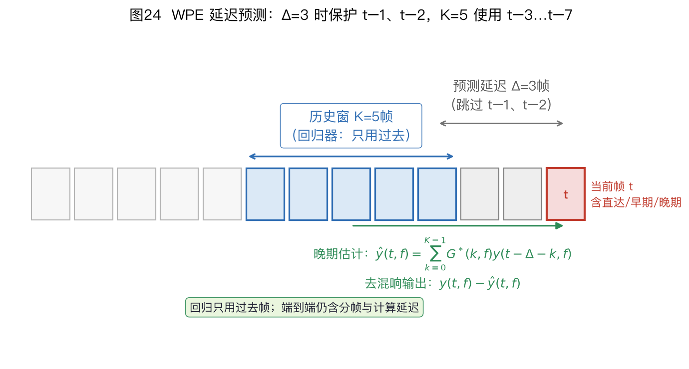
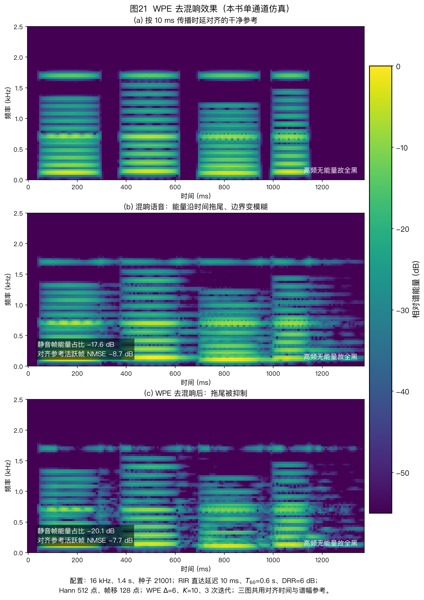

> ⚠️ 本篇是教程正文第 7 章（正文共 11 章，另有附录 A/B），可独立阅读，前后篇见下方导航。
>
> 🏠 首页导读：[`00_overview.md`](./00_overview.md) ｜ 上一篇：[06_aec.md](./06_aec.md) ｜ 下一篇：[08_speech-separation.md](./08_speech-separation.md)

## 7. 去混响（WPE）

第 6 章处理设备播放声返回麦克风形成的回声。本章讨论房间混响的晚期拖尾及 WPE 去混响。多说话人分离、掩码估计和完整处理顺序见第 8 章。

### 7.1 WPE 去混响

声学回声消除（Acoustic Echo Cancellation，AEC）处理已知播放参考产生的回声；加权预测误差法（Weighted Prediction Error，WPE）利用语音跨帧预测结构估计晚期混响。保护延迟用来减少对直达声和早期反射的损伤，但不能保证它们完全不受影响；估计误差、过小的保护延迟和模型失配都可能产生语音失真。

去混响有三条常见路线：**波束形成**（第 5 章，利用空间选择性压低弥散混响）、**盲逆滤波或线性预测**，以及神经网络谱增强。本节重点介绍 WPE。WPE 既指它采用的加权预测误差准则，也常用来指基于该准则的去混响算法。

**WPE 之前的三类方法**。多通道逆滤波、倒谱分离和谱方差抑制分别依赖已知路径、倒谱域可分性或晚期混响功率估计。它们的假设和局限有助于理解 WPE 的设计。

**多通道逆滤波定理（Multiple-input/output INverse Theorem，MINT；Miyoshi & Kaneda 1988）**。它假设房间冲激响应（Room Impulse Response，RIR）已知，且各通道传递函数没有公共零点，再用有限冲激响应（Finite Impulse Response，FIR）逆滤波器抵消房间响应。条件满足时可作为理想逆滤波的参考，但它对 RIR 估计误差、公共零点和加性噪声敏感，滤波器长度也随混响时间增加。因此实际系统很少依赖预先精确测得的 RIR。

**倒谱 liftering**。这类单通道方法假设声门激励与声道、房间响应在倒谱域占据不同区域。对数功率谱经逆傅里叶变换进入倒谱域后，用窗函数保留指定倒谱区间。计算量较低，但重混响和强谐波会使两类成分重叠，窗口选择不当会同时损伤语音。

**谱方差抑制**。该方法假设晚期混响与直达声统计独立，并从历史帧递推晚期混响功率谱，再用维纳增益或谱减法抑制。它可以按帧因果运行，但会受到功率估计滞后、非平稳噪声和音乐噪声影响。现代学习型谱增强仍沿用“估计干扰功率或增益，再施加频带增益”的基本形式。

MINT 说明已知房间响应时的逆滤波条件；倒谱方法说明单通道频谱分解的局限；谱方差方法提供了逐帧功率估计与增益抑制思路。WPE 不要求预先测量 RIR，并可扩展到多通道，同时通过保护延迟只预测晚期成分。

**三路线对照表**。不同论文使用的阵列、数据集、识别器和因果条件不同，不能把词错率改善幅度横向拼成统一范围。表中只比较处理对象与实现条件；需要性能数字时，应引用同一数据集上的原始实验。

| 路线 | 代表 | 主要处理对象 | 所需输入或假设 | 因果性与计算 | 主要限制 |
|---|---|---|---|---|---|
| 空间选择 | 最小方差无失真响应（Minimum Variance Distortionless Response，MVDR）、广义特征值（Generalized Eigenvalue，GEV）波束形成，见[第 5 章 §5.4](./05_beamforming.md#sec-5-4) | 弥散混响与定向干扰 | 多通道信号，以及目标方向或掩码 | 可按帧流式处理；计算随通道数和频点数增加 | 混响占优且方向线索弱时，空间选择性有限 |
| 延迟预测 | WPE、在线 WPE | 可由历史帧预测的晚期混响 | 短时傅里叶变换（Short-Time Fourier Transform，STFT）复谱、保护延迟与足够统计量 | 批处理版迭代整段数据；在线版递推统计量 | 短语音、模型失配或预测阶数过大时不稳定 |
| 谱增益估计 | 深度神经网络（Deep Neural Network，DNN）去混响、谱方差抑制 | 全带混响，也可联合处理噪声 | 训练数据或可靠的晚期混响功率估计 | 是否因果取决于网络前瞻与特征窗；计算量依模型而定 | 跨房间、跨设备泛化和语音失真需单独验证 |

长混响可先评估 WPE；存在定向干扰时再结合波束形成；学习型后滤波还需满足算力和训练数据条件。多通道 WPE、波束形成与单通道后滤波可以组成一条候选链路，但实际顺序取决于统计量和通道数，见[第 10 章 §10.1](./10_engineering-practice.md#sec-10-1)。

**REVERB 挑战赛中的 WPE**：REVERB 包含 8 通道、2 通道和单通道设置，仿真数据的混响时间约为 0.25～0.7 s，另含真实房间录音。

Kinoshita 等在 *EURASIP Journal on Advances in Signal Processing* 2016 的挑战总结表明，WPE 对远场识别的改善与通道数和数据条件有关；引用结果时必须注明通道数与测试集。[REVERB Challenge 官方任务说明](https://reverb2014.audiolabs-erlangen.de/index.html "citation")、[Kinoshita et al., 2016, §2、§4.1.1 与图5](https://doi.org/10.1186/s13634-016-0306-6 "citation")

图21（b）中音节结束后的横向能量拖尾，在（c）中得到减弱。

**WPE 的直觉**：晚期混响在所选时频模型中被近似为可由历史观测线性预测的成分，再从当前帧减去该预测。这不要求语音或混响全程平稳；算法用随帧变化的功率 $\lambda(n,f)$ 表示语音非平稳性。保护延迟 $\Delta$ 隔开当前帧与预测历史，跳过最近的 $\Delta-1$ 帧，以降低直达声和早期反射进入预测项的程度。

WPE 的预测式只引用当前帧之前的观测，这使它可以改造成流式算法。但经典批处理 WPE 会用整段录音反复估计滤波器和时变功率，仍然是非因果处理。只有把统计量、滤波器和功率估计都改为只使用当前及历史数据，并计入 STFT 分帧带来的等待时间，才能称为因果在线 WPE。

**模型**（每个频点 $f$ 独立处理；本节 $X$、$E$、$G$ 都是**逐时频点的复数标量**，多通道版才升级为向量）：

$$X(n,f) = E(n,f) + \sum_{k=\Delta}^{\Delta+K-1} G^*(k,f)\,X(n-k,f)\text{。}\tag{7-1}$$

这里 $E(n,f)$ 表示希望保留的直达声与早期反射。

式(7-1)把当前观测分成早期成分 $E$ 和由历史帧线性预测的晚期成分。不同频点的混响衰减不同，因此每个频点分别估计一组 $G$，实现时可并行计算。$\Delta$ 将当前帧与预测历史隔开，避免使用最近几帧预测直达声和早期反射。其中：

- $X(n,f)$：第 $n$ 帧、频点 $f$ 的观测谱（拿到的数据）；$E(n,f)$：想恢复的干净早期成分；
- $G(k,f)$：预测滤波器系数；$\Delta$：保护延迟，求和的 $k$ 从 $\Delta$ 起算，因此跳过最近 $\Delta-1$ 帧；$K$：预测阶数，决定使用多少个历史帧。$\Delta$ 和 $K$ 没有脱离帧移、数据量和目标失真指标的通用默认值。



图24 使用与 `nara_wpe` 一致的索引：$\Delta=3$、$K=5$ 时，受保护而不参与预测的是 $t-1$、$t-2$；五个预测帧依次为 $t-3$ 到 $t-7$。统一写成

$$\hat r(t)=\sum_{q=0}^{K-1}G_q^*X(t-\Delta-q).$$

因此 $q=0$ 对应 $t-\Delta$，不是保护区的一部分。该预测式只含历史样本；批处理还是在线处理，则取决于 $G_q$ 和功率统计是否使用未来帧。

**算例 7-1：WPE 的一步直觉数值例（单通道、单频点）**

WPE 用历史观测预测晚期混响，再从当前帧中减去预测值。完整算法要交替估计系数 $G$ 和时变功率；本例将 $G$ 视为已知，只计算一次预测与相减。

取单通道、单频点、预测阶数 $K=2$、保护延迟 $\Delta=2$。预测使用第 $n-2$、$n-3$ 帧，跳过最近的第 $n-1$ 帧。已知：

- 过去帧观测：$X(n-2)=0.8+0.1\mathrm{j}$，$X(n-3)=0.5-0.2\mathrm{j}$（都是复数标量，实部虚部分别携带该时频点的幅度与相位信息）；
- 预测系数：$G(2)=0.5+0.1\mathrm{j}$，$G(3)=0.3-0.05\mathrm{j}$；
- 当前帧观测：$X(n)=0.9+0.4\mathrm{j}$。

用到的唯一工具是**复数乘法**：$(a+b\mathrm{j})(c+d\mathrm{j})=(ac-bd)+(ad+bc)\mathrm{j}$。

教程模型里出现的是共轭 $G^*$（共轭 = 虚部变号），所以 $G^*(2)=0.5-0.1\mathrm{j}$，$G^*(3)=0.3+0.05\mathrm{j}$。

**第 1 步：用 $n-2$ 帧预测一份拖尾**

$$G^*(2)\,X(n-2)=(0.5-0.1\mathrm{j})(0.8+0.1\mathrm{j})$$

实部 $=ac-bd=0.5\times0.8-(-0.1)\times0.1=0.40+0.01=0.41$；

虚部 $=ad+bc=0.5\times0.1+(-0.1)\times0.8=0.05-0.08=-0.03$。

所以 $G^*(2)\,X(n-2)=0.41-0.03\mathrm{j}$。

**第 2 步：用 $n-3$ 帧再预测一份拖尾**

$$G^*(3)\,X(n-3)=(0.3+0.05\mathrm{j})(0.5-0.2\mathrm{j})$$

实部 $=0.3\times0.5-0.05\times(-0.2)=0.15+0.01=0.16$；

虚部 $=0.3\times(-0.2)+0.05\times0.5=-0.06+0.025=-0.035$。

所以 $G^*(3)\,X(n-3)=0.16-0.035\mathrm{j}$。

**第 3 步：两份拖尾相加，得到当前帧里“可预测的陈旧成分”**

$$\hat{r}(n)=0.41-0.03\mathrm{j}+0.16-0.035\mathrm{j}=0.57-0.065\mathrm{j}$$

这个 $\hat{r}(n)$ 是当前帧晚期混响拖尾的估计。

**第 4 步：从当前帧观测中减掉它**

$$E(n)=X(n)-\hat{r}(n)=(0.9+0.4\mathrm{j})-(0.57-0.065\mathrm{j})=0.33+0.465\mathrm{j}$$

$E(n)=0.33+0.465\mathrm{j}$ 就是去混响后的输出：实部 $0.9-0.57=0.33$，虚部 $0.4-(-0.065)=0.465$。

观测幅度为 $|X(n)|\approx0.985$，相减后的幅度为 $|E(n)|\approx0.570$；对应能量从约 0.97 降到约 0.325，相差约 4.7 dB。

这个数例只检查复数乘法、共轭和帧索引。系数 $G$ 是人为给定的，因此能量下降不能作为去混响效果证据，也不能据此断言剩余量恰好等于直达声与早期反射。

真实 WPE 还要从多帧数据估计 $G$ 与功率 $\lambda(n,f)$，并用独立的干净参考或识别指标评价失真。


**算例 7-2：保护期加宽一帧（$\Delta=3$、$K=2$）**

题设为单通道、单频点，$\Delta=3$、$K=2$。已知：

- 过去帧为 $X(n-3)=0.6+0.2\mathrm{j}$、$X(n-4)=0.4+0.3\mathrm{j}$；
- 预测系数为 $G(3)=0.4-0.2\mathrm{j}$、$G(4)=0.2+0.1\mathrm{j}$；
- 当前帧为 $X(n)=1.0+0.5\mathrm{j}$。

要求去混响输出 $E(n)$。

求和下标为 $k=3,4$，因此使用第 $n-3$、$n-4$ 帧；第 $n-1$、$n-2$ 帧位于保护区，不参与预测。若当前帧 $n=10$，预测使用第 7、6 帧，跳过第 9、8 帧。相较算例 7-1，保护期增加一帧。

**第 1 步：计算第一个预测项。** 先取 $G^*(3)=0.4+0.2\mathrm{j}$，再计算

$$
\begin{aligned}
G^*(3)X(n-3)
&=(0.4+0.2\mathrm{j})(0.6+0.2\mathrm{j})\\
&=(0.4\times0.6-0.2\times0.2)
+(0.4\times0.2+0.2\times0.6)\mathrm{j}\\
&=0.20+0.20\mathrm{j}。
\end{aligned}
$$

**第 2 步：计算第二个预测项。** 取 $G^*(4)=0.2-0.1\mathrm{j}$，得到

$$
\begin{aligned}
G^*(4)X(n-4)
&=(0.2-0.1\mathrm{j})(0.4+0.3\mathrm{j})\\
&=(0.2\times0.4+0.1\times0.3)
+(0.2\times0.3-0.1\times0.4)\mathrm{j}\\
&=0.11+0.02\mathrm{j}。
\end{aligned}
$$

**第 3 步：相加预测项并从当前观测中减去。** 拖尾估计为

$$\hat{r}=0.20+0.20\mathrm{j}+0.11+0.02\mathrm{j}=0.31+0.22\mathrm{j}，$$

因此

$$E=(1.0-0.31)+(0.5-0.22)\mathrm{j}=0.69+0.28\mathrm{j}。$$

输入与输出的幅度分别为 $|X|=\sqrt{1.25}\approx1.118$、$|E|=\sqrt{0.4761+0.0784}\approx0.745$；能量从 1.25 降到约 0.55，相差约 3.5 dB。

本例的能量变化约为 3.5 dB，小于算例 7-1 的约 4.7 dB。两组系数为人为设定，差异不能作为一般性能结论。

固定 $K=2$ 时，$\Delta$ 从 2 增至 3 并没有减少预测帧数量，仍使用两帧；它只是排除更多靠近当前帧的样本，并把长度相同的历史窗整体移远。$\Delta$ 的选择见 §7.1.1。

**交替估计 $G$ 与 $\lambda$（Nakatani et al., 2010）**。假设早期成分 $E$ 服从零均值复高斯分布，方差 $\lambda(n,f)$ 随时间变化；这里的 $\lambda$ 表示第 $n$ 帧的功率谱。时变方差使不同能量的语音帧获得不同权重，减少高能量帧对估计的支配。下面在固定频点 $f$ 上写出从最大似然到加权最小二乘的推导。[Nakatani et al., IEEE TASLP 2010](https://doi.org/10.1109/TASL.2010.2052251 "citation")

**中间行 1——写出似然**：各帧独立，观测 $X(n)$ 在给定 $G$、$\lambda(n)$ 下服从均值为预测值 $\sum_k G^*(k)X(n-k)$、方差为 $\lambda(n)$ 的复高斯，总似然是各帧密度连乘：

$$p(X\mid G,\lambda)=\prod_n \frac{1}{\pi\lambda(n)}\exp\!\left(-\frac{|X(n)-\sum_k G^*(k)X(n-k)|^2}{\lambda(n)}\right)$$。

**中间行 2——取负对数**：最大化似然等价于最小化负对数似然。去掉与 $G$ 无关的常数后，权重 $1/\lambda(n)$ 直接来自高斯密度指数项的分母：

$$-\log p = \sum_n \frac{|X(n)-\sum_k G^*(k)X(n-k)|^2}{\lambda(n)} + \sum_n\log\lambda(n) + \mathrm{const}$$。

固定 $\lambda$ 时第二项是常数，最小化第一项就是**加权最小二乘**。用后文的历史向量 $\vec x(n)$ 和系数向量 $\vec g$ 可写成

$$\hat{\vec g}=\arg\min_{\vec g}\sum_n\frac{|X(n)-\vec g^H\vec x(n)|^2}{\lambda(n)}\text{。}\tag{7-2}$$

**中间行 3——对 $G$ 求导得正规方程**：把历史帧排成向量 $\vec{x}(n)=[X(n-\Delta),\dots,X(n-\Delta-K+1)]^\top$，记 $\vec{g}=[G(\Delta),\dots,G(\Delta+K-1)]^\top$。求和式可写成 $E(n)=X(n)-\vec{g}^H\vec{x}(n)$，其中上标 $H$ 表示共轭转置。

对 $\vec{g}^*$ 使用 Wirtinger 导数并令其为零，得到 $K\times K$ 加权正规方程：

$$\begin{aligned}
\mathbf R&=\sum_n \frac{\vec{x}(n)\vec{x}^H(n)}{\lambda(n)},\\
\vec r&=\sum_n \frac{\vec{x}(n)X^*(n)}{\lambda(n)},\\
\mathbf R\vec g&=\vec r.
\end{aligned}\tag{7-3}$$

$\mathbf R$ 是加权自相关矩阵，$\vec r$ 是加权互相关向量；解式(7-3)即可得到式(7-2)的预测系数 $\vec g$。

$R$ 是 $K\times K$ 共轭对称矩阵；当正则化后的 $R$ 为正定矩阵时，可用 Cholesky 分解求解。

$K$ 应根据可用帧数、拖尾覆盖范围、通道数和矩阵条件数在目标数据上选择，不能只凭固定区间设定。

算法交替固定 $\lambda$ 求 $G$、固定 $G$ 更新 $\lambda$；第一次迭代的 $\lambda$ 可用观测能量初始化。在线版改用递推统计量，并需要单独处理样本不足和矩阵病态。

固定 $G$ 后再更新逐帧功率；在未平滑的标量模型中有 $\lambda(n,f)=|E(n,f)|^2$。

固定 $G$ 后，对 $\lambda(n)>0$ 求导：

$$\frac{\partial}{\partial\lambda(n)}\left(\frac{|E(n)|^2}{\lambda(n)}+\log\lambda(n)\right)=-\frac{|E(n)|^2}{\lambda^2(n)}+\frac{1}{\lambda(n)}.$$

令导数为零得到 $\hat\lambda(n)=|E(n)|^2$。实际实现通常会在频率或时间上平滑并设置正数下限，避免单个近零残差造成权重过大。

**离线单通道 WPE 的完整一轮**：下面把散落的公式按实现顺序连起来。每个频点独立执行，所有下限和正则化强度都要随信号尺度定义。

1. 由观测功率初始化 $\lambda^{(0)}(n,f)$，并设相对功率下限，避免静音帧产生过大的 $1/\lambda$；
2. 对有效帧构造 $\vec x(n)=[X(n-\Delta),\ldots,X(n-\Delta-K+1)]^\top$。最早有效帧为 $n=\Delta+K-1$；
3. 用当前 $\lambda^{(i)}$ 累加 $\mathbf R$ 和 $\vec r$。为保持输入整体缩放时的相对正则化强度，可解
$$\left[\mathbf R+\epsilon\,\frac{\operatorname{tr}(\mathbf R)}{K}\mathbf I\right]\vec g^{(i+1)}=\vec r，$$
其中无量纲 $\epsilon$ 是相对对角加载量；若 $\operatorname{tr}(\mathbf R)=0$，该频点应旁路或使用单独定义的正数下限；
4. 更新 $E^{(i+1)}(n)=X(n)-[\vec g^{(i+1)}]^H\vec x(n)$，再由平滑后的 $|E^{(i+1)}(n)|^2$ 更新 $\lambda^{(i+1)}$；
5. 达到预设迭代次数，或目标函数相对变化低于预先声明的阈值时停止。报告结果时同时给出迭代次数/停止阈值、功率下限、平滑方式和 $\epsilon$。

边界检查包括：$K=0$ 时输出应退化为输入；全零频点不应求逆；把输入整体乘以常数时，采用上述相对加载的滤波器形状不应因绝对幅度而改变。

**算例 7-3：加权最小二乘求解器的手算（单抽头 $K=1$、3 帧）**

取单频点、$K=1$，只估计一个抽头 $g=G(\Delta)$。3 帧观测为 $X=[1.0,\ 0.6,\ 0.2]$，历史样本为 $x=[0.8,\ 0.5,\ 0.4]$，权重 $w(n)=1/\lambda(n)=[1,\ 4,\ 1]$。

为简化运算，本例使用实数。要求闭式解 $\hat g$。

标量正规方程为 $R\,g=r$，其中 $R=\sum w x^2$、$r=\sum w x X$。代入可得

$$R=1\times0.64+4\times0.25+1\times0.16=1.80，$$

$$r=1\times0.8\times1.0+4\times0.5\times0.6+1\times0.4\times0.2=2.08，$$

因此 $\hat g=2.08/1.80\approx1.156$。该人为数例中的 $\hat g$ 大于 1，不代表一般路径系数范围。

若所有权重都为 1，则 $R=1.05$、$r=1.18$、$\hat g\approx1.124$。较大的第二帧权重使估计更接近该帧对应的比值。$K>1$ 时，同样的加权关系写成矩阵正规方程。

**多通道版（MIMO-WPE，Yoshioka & Nakatani 2012）**：预测第 $m$ 个通道的当前帧时，使用所有 $M$ 个通道的历史帧：

$$X_m(n,f) = E_m(n,f) + \sum_{m'=1}^{M}\sum_{k=\Delta}^{\Delta+K-1} G^*_{m,m'}(k,f)\,X_{m'}(n-k,f)$$。

每个滞后 $k$ 对应一个 $M\times M$ 系数矩阵。把 $K$ 个滞后的所有通道历史堆叠后，回归向量长度为 $MK$，联合系数可写成 $MK\times M$。因此每个频点的正规方程矩阵是 $MK\times MK$，而不是单通道的 $K\times K$。

例如 $M=8,K=10$ 时矩阵为 $80\times80$。有效帧数若只接近 80，样本协方差很容易病态，还要为非平稳性、掩码和相关帧留出余量。

晚期混响会同时出现在多个麦克风上，但幅度和相位不同，多通道观测因此提供额外空间信息。相对收益取决于混响、阵列和数据长度，具体数字应查原论文的实验条件。[Yoshioka & Nakatani 2012](https://doi.org/10.1109/TASL.2012.2210879 "citation")



图21 的横轴约为 0～1400 ms，纵轴约为 0～2.5 kHz，颜色表示相对能量的 dB 值。三幅语谱图在显示前都已补偿合成路径的 10 ms 直达传播时延，因此横轴表示同一对齐时间基准。

（a）给出无混响参考；（b）加入合成混响后，音节结束处出现横向拖尾；（c）经本书单通道 WPE 示例处理后，拖尾减弱但仍有残留。

脚本按对齐后的无混响参考帧功率定义活动帧和安静帧，随后报告安静帧能量占比，以及活动帧相对该对齐参考、经复增益校准后的谱域归一化均方误差（Normalized Mean Square Error，NMSE）。前者下降而后者增大时，说明去拖尾与语音损伤之间存在权衡。

功率 $\lambda$ 使用居中的 5 帧移动平均，因此会读取左右各 2 帧，图中实现是离线而非因果；功率下限为该频点峰值的 $10^{-5}$。正规方程使用 $\epsilon\operatorname{tr}(R)\mathbf I/K$ 的相对对角加载，$\epsilon=10^{-6}$。

合成混响的全卷积尾部被裁到 1.4 s 记录长度，图中指标只统计保留的对齐窗口，不覆盖被裁掉的尾部。这些量来自同一个固定随机种子的合成例，不代表公开数据集上的平均性能。

**与其他模块的组合**：WPE 可先减弱晚期混响，掩码 MVDR 再抑制噪声与定向干扰。Drude et al.（Interspeech 2018）在其测试条件下报告了联合系统相对单模块的改善。[Interspeech 2018 论文](https://www.isca-archive.org/interspeech_2018/drude18_interspeech.html "citation")

WPE → GSS → MVDR/GEV 也可不使用神经分离网络，见第 8 章。Raj et al.（Interspeech 2023）展示了 GSS 的 GPU 并行实现；速度比较只能按其论文的硬件、数据、代码版本和计时范围解读，不将加速倍数外推到其他实现。

开源实现 `nara_wpe` 的离线与在线接口需要分开选择。

**在线版**分为按块更新和逐帧递推两类。块在线 WPE 在最近一段历史上估计统计量；递推 WPE 用遗忘因子逐帧更新相关矩阵和滤波器。[在线 WPE](https://www.isca-archive.org/interspeech_2017/kinoshita17_interspeech.html "citation")

短块提供的有效样本较少，$\lambda$ 和相关矩阵的方差更大；块过长又会增加等待时间，并使旧房间统计占比过高。

在线实现还要处理初始化、矩阵正则化、静音冻结和路径突变，不能只把批处理迭代次数改成 1。DNN-WPE 可以用网络估计 $\lambda$，但是否优于传统估计取决于训练数据与测试房间是否匹配。

**三帧因果递推小例。** 对单频点、单抽头实数特例，令历史回归量为 $x_t=X_{t-\Delta}$，遗忘因子 $\alpha=0.5$、$\lambda_t=1$，并按

$$R_t=\alpha R_{t-1}+x_t^2/\lambda_t,\qquad r_t=\alpha r_{t-1}+x_tX_t/\lambda_t,\qquad g_t=r_t/(R_t+\delta)$$

递推。本例为便于手算取 $\delta=0$，且 $R_0=r_0=0$。三帧 $(x_t,X_t)$ 依次为 $(1,0.8),(2,1.6),(1,1.0)$：

1. 第 1 帧：$R_1=1$，$r_1=0.8$，$g_1=0.8$；
2. 第 2 帧：$R_2=0.5\times1+4=4.5$，$r_2=0.5\times0.8+3.2=3.6$，$g_2=0.8$；
3. 第 3 帧：$R_3=0.5\times4.5+1=3.25$，$r_3=0.5\times3.6+1=2.8$，$g_3\approx0.8615$。

流式输出应先用上一帧已有的 $g_{t-1}$ 预测当前拖尾，再用当前 $(x_t,X_t)$ 更新出 $g_t$ 供下一帧使用；初始化阶段可旁路。

这个例子只演示因果统计量顺序，不包含交替更新的功率估计。$\lambda_t$ 也必须只用当前与历史信息，不能沿用图21的居中平滑。

$\alpha\to1$ 记忆更长但跟踪更慢，$\alpha\to0$ 跟踪更快但估计方差增大，实际实现还需 $\delta>0$ 和静音冻结。[Drude et al., 2018，§4.2～§4.3](https://groups.uni-paderborn.de/nt/pubs/2018/ITG_2018_Drude_Paper.pdf "citation")、[Kinoshita et al., Interspeech 2017](https://www.isca-archive.org/interspeech_2017/kinoshita17_interspeech.html "citation")

帧移为 8 ms 时，0.25 s 约含 31 帧，2 s 含 250 帧。这个换算可以用来估计统计样本量和块等待时间，但不能单独决定参数。起始值应在目标数据上同时检查拖尾衰减、语音失真、计算量和端到端延迟，再调整块长、遗忘因子、预测阶数和正则化强度。

**开源实现 `nara_wpe`** 是常用的 MIMO-WPE 参考实现。下面固定 PyPI 0.0.11 版；其他版本的轴序和在线接口应重新检查。

```bash
pip install nara-wpe==0.0.11
```

```python
from nara_wpe.wpe import wpe
Z = wpe(Y, taps=10, delay=3,   # taps=K（预测阶数），delay=Δ（保护延迟）
        iterations=3)          # 离线交替迭代次数；改成 1 仍是离线调用
```

其中 $Y$ 是复数 STFT。后两轴为通道 $D$、帧 $T$，其余前轴可用于频点等维度；0.0.11 版 `help(wpe)` 标注为 `(..., D, T)`。

上述 `wpe()` 会在已给整段数据上交替估计，属于离线调用。

逐帧递推可从 `nara_wpe/wpe.py` 的 `OnlineWPE.step_frame()` 阅读：输入一帧 `(频点, 通道)`，对象跨调用保存逆相关矩阵、预测抽头、功率和历史缓冲。先产生当前输出，再更新状态，才符合本节三帧例子的时间顺序。若每个音频块重新创建对象，就会反复经历启动阶段。

同一文件的 `OnlineWPE.step_block()`要求包含指定历史长度的缓冲形状；锁定版本 `_get_prediction()`还注明只支持 `block_shift=1`。它不能被当作任意帧移的块处理器。TensorFlow 路线在 `tf_wpe.py` 中另有 `block_wpe_step()` 和 `recursive_wpe()`，依赖、状态和接口也不同。[`nara_wpe` NumPy 源码](https://github.com/fgnt/nara_wpe/blob/a166779cca2088817e330481bd20af1a2c598555/nara_wpe/wpe.py)、[TensorFlow 源码](https://github.com/fgnt/nara_wpe/blob/a166779cca2088817e330481bd20af1a2c598555/nara_wpe/tf_wpe.py)

**DNN 与 WPE 的位置**。神经网络可以预测干净复谱、时频掩码或 WPE 所需的功率 $\lambda$。常见位置取决于网络输出：

- 网络若对每个通道独立做波形或复谱映射，可能改变跨通道相位关系，通常放在多通道 WPE 和波束形成之后；
- 网络若只估计共享掩码、空间协方差或 $\lambda$，而多通道复谱仍由解析滤波器处理，可以放在 WPE 或波束形成内部；
- 联合训练的多通道模型可以同时完成去混响与波束形成。

模块位置应由输入输出是否保留空间相位、是否使用未来帧和训练目标决定，不能简单规定所有 DNN 都在链尾。

**局限与处理办法**：WPE 的模型目标是抑制可由延迟历史预测的晚期混响，而不是主动消除直达声与早期反射；保护延迟、功率估计或预测模型失配时，输出仍可能改变这些希望保留的成分。下列条件会使估计不稳定、早期成分失真或收益有限：

| 场景 | 现象 | 对策 |
|---|---|---|
| 可用帧数与待估参数数量接近 | 二阶统计量方差增大，相关矩阵可能病态 | 降低预测阶数、增加正则化；流式实现另行调节遗忘因子 |
| 弱混响或高信噪比近讲 | 可预测拖尾较弱，处理收益可能小于失真 | 先测混响时间、直混比和旁路差异，再决定是否启用 |
| 强加性噪声 | 模型里没有独立噪声项，$G$ 与 $\lambda$ 被污染 | 采用显式含噪模型或联合卷积波束形成；不能把单独去噪器的收益算作 WPE 本身 |
| 大间距分布式阵列 | 统一 $\Delta$ 让参考与预测仍相关，输出失真 | 麦克风相关延迟：按到达时延给各通道定各自延迟（[Lohmann et al., ICASSP 2023](https://doi.org/10.1109/ICASSP49357.2023.10096992 "citation")） |

启用 WPE 前应检查可用帧数、混响强度、加性噪声和通道时延。任一条件不满足时，应调整块长、模型或旁路策略。

卷积功率最小无失真响应（Weighted Power minimization Distortionless response，WPD）把多帧、多通道滤波写进同一个无失真最小功率问题，可同时处理去混响与波束形成。它不是简单串联两个现成模块，也不能用条件不同的 WPE、MPDR 数字相加预测收益。

把当前多通道帧及延迟历史堆成 $\bar{\vec x}_t=[\vec x_t^\top,\vec x_{t-\Delta}^\top,\ldots]^\top$，并把目标导向约束扩展为 $\bar{\vec v}=[\vec v^\top,\vec0^\top,\ldots]^\top$。在加权协方差 $\bar{\mathbf R}=\sum_t\bar{\vec x}_t\bar{\vec x}_t^H/\lambda_t$ 下，解为

$$\bar{\vec w}_{\mathrm{WPD}}=\frac{\bar{\mathbf R}^{-1}\bar{\vec v}}{\bar{\vec v}^H\bar{\mathbf R}^{-1}\bar{\vec v}}。$$

最小维度检查：2 麦、1 个历史块时，$\bar{\vec x}$ 和 $\bar{\vec w}$ 都有 4 个元素。若 $\bar{\mathbf R}=\operatorname{diag}(2,1,4,4)$、$\vec v=[1,1]^\top$，则扩展约束向量为 $\bar{\vec v}=[1,1,0,0]^\top$。

此时 $\bar{\mathbf R}^{-1}\bar{\vec v}=[0.5,1,0,0]^\top$，分母为 1.5，故

$$\bar{\vec w}=[1/3,2/3,0,0]^\top，$$

并可直接验证 $\bar{\vec w}^H\bar{\vec v}=1$。

这里当前帧与历史块没有互相关，历史权重退化为零，WPD 退化到当前帧的加权 MPDR（weighted minimum power distortionless response，加权最小功率无失真响应）。$\bar{\mathbf R}$ 仍是用 $1/\lambda_t$ 加权的观测协方差，不是噪声协方差。只有把优化中的矩阵明确取为目标缺席时的噪声协方差 $\mathbf R_{nn}$，同形闭式解才对应 MVDR。

延迟历史与当前晚期混响之间存在可利用相关性时，历史权重才会参与去混响。

该模型还假设希望保留的早期目标可由当前块的导向向量描述、$\lambda_t>0$ 且加载后的协方差可逆；若 $\lambda_t$ 或协方差使用未来帧，所得实现仍是离线的。

原始 WPD 工作见 Nakatani 与 Kinoshita 2019，后续因式分解工作说明了它与 WPE、波束形成的关系。[Nakatani & Kinoshita, EUSIPCO 2019](https://arxiv.org/abs/1908.02710 "citation")、[Boeddeker et al., ICASSP 2020](https://doi.org/10.1109/ICASSP40776.2020.9054393 "citation")

**可执行 WPE 基线。** [`codes/array_tutorial/dereverberation.py`](../codes/array_tutorial/dereverberation.py) 提供只依赖 NumPy 的最小离线 WPE。`offline_wpe()` 接收复数 STFT，单通道轴序为 `(频点, 帧)`，多通道轴序为 `(频点, 通道, 帧)`，输出保持相同形状；它实现保护延迟、按滞后堆叠多通道历史、共享功率权重、相对对角加载和复共轭预测。`taps=0`、迭代次数为零、记录短于首个有效回归帧或整个频点为零时直接旁路。输入必须是复谱，不能把幅度谱传入后再补相位。

联合示例用 `.venv/bin/python -m codes.examples.ch06_09_baselines` 运行，边界测试见 [`tests/test_codes_aec_wpe_sep_track.py`](../tests/test_codes_aec_wpe_sep_track.py)。测试固定检查 $K=0$、短输入、全零频点、单抽头复共轭方向、多通道形状和整体幅度缩放等变性。实际音频管线还要自行固定 STFT 的窗、帧移、`center`/补零约定与 ISTFT 长度，并测试短语音、静音权重、病态矩阵、通道交换及块边界。求解失败时应增加加载、降低 $K$ 或旁路该频点，不能输出 NaN。

该基线是整段离线估计，不宣称因果或实时。离线、在线、学习功率与联合滤波的源代码入口分别如下，完整读码顺序和失效实验见 [WPE 源码研究](../codes/research/02_aec_wpe_separation.md#wpe)。

| 实现 | 主要源码 | 与教学基线的差别 | 最小核对实验 |
|---|---|---|---|
| nara_wpe 离线/MIMO | `nara_wpe/wpe.py` 的 `build_y_tilde()`、`wpe_v6()`等 | 更多求解与统计区间实现 | 单抽头手算、多通道历史排列、零功率与短输入 |
| nara_wpe 逐帧 | 同文件 `OnlineWPE` | 保留递推状态，每次处理一帧 | 同一帧流按不同外层批次输入，检查是否误重置 |
| nara_wpe 块/递推 TensorFlow | `nara_wpe/tf_wpe.py` | 显式块统计与递推接口 | 对照帧时间戳，检查历史窗口和新输入是否混淆 |
| ESPnet DNN-WPE | `espnet2/enh/layers/dnn_wpe.py`、`wpe.py`、`mask_estimator.py` | 网络估计掩码/功率，解析层解预测滤波 | 先用固定正数功率核对求解，再接 checkpoint；测未来帧依赖 |
| ESPnet WPD | `espnet2/enh/layers/beamformer.py`、`dnn_beamformer.py` 的 WPD 分支 | 在当前通道和历史上联合做无失真滤波 | 复算正文历史权重为零的退化例，再加入当前—历史相关 |
| CuPy WPE/GPU-GSS | `desh2608/wpe` 与 `gss/wpe/` | 以 GPU 批处理服务会议增强 | 同参数核对 CPU/GPU 输出、精度与峰值显存 |

ESPnet 的 DNN-WPE 外层输入为 `(批, 帧, 通道, 频点)`，内部才转成 `(批, 频点, 通道, 帧)`；换库时必须显式转换，不能仅凭数组同为四维就直接传入。DNN-WPE 中只做一次解析更新，也不表示网络或功率估计没有使用未来帧。[ESPnet DNN-WPE 源码](https://github.com/espnet/espnet/blob/be79590bb2ff26ffb01bc825c5f68cb9418b7f0d/espnet2/enh/layers/dnn_wpe.py)

工程比较应固定通道数、上下文长度、硬件、计时范围和实际因果条件。训练权重、语料和 CUDA 环境是独立前提；取得源代码并不表示训练或设备实时性已经验证。

本书另提供[独立实现数值对照](../codes/examples/compare_wpe_reference.py)：把教学版 `offline_wpe()` 与未经修改的 `nara-wpe 0.0.11` 的 `wpe_v6()` 比较。固定复数随机输入、预测阶数 2、保护延迟 3，检查单通道、双通道、通道置换和整体缩放，每种分别迭代 1 次和 3 次。两种实现对启动帧的处理不同，因此只比较零起始索引 $t=4$ 起的有效预测区间；本次 8 组检查的最大绝对误差约为 $2.7\times10^{-15}$。

[完整参数与误差口径](../codes/research/02_aec_wpe_separation.md#wpe)说明为何要对齐统计区间和功率下限。该检查验证复数代数、维度和迭代口径，不是语音质量、流式延迟或论文全量实验的复现。

#### 7.1.1 $\Delta$ 与 $K$ 的参数换算

先把帧数换成物理时间。若帧移为 $H$ ms，最近的预测帧是 $t-\Delta$，其时延为 $\Delta H$；$K$ 个预测帧从 $t-\Delta$ 到 $t-(\Delta+K-1)$，最远时延为 $(\Delta+K-1)H$。这个索引关系比“$\Delta+K$ 帧”少一帧，因为起点已算入 $K$ 个样本。

以图 21 的本书仿真为例：采样率 16 kHz，短时傅里叶变换（Short-Time Fourier Transform，STFT）窗长 512 点（32 ms），帧移 128 点（8 ms），$\Delta=6$、$K=10$、交替迭代 3 次。因此使用 $t-6$ 到 $t-15$ 的十帧：最近预测帧延迟 $6\times8=48$ ms，最远为 $15\times8=120$ ms。这些数值只是图 21 的可复现配置，不是会议室、教室或其他房间的通用起点。

选参时，先对 $\Delta$ 扫描并检查直达声和早期成分的失真；再在数据量足够的条件下增大 $K$，检查晚期拖尾、矩阵条件数、计算量和下游任务指标。增大 $K$ 会增加参数量，在短语音或强噪声下反而可能使估计不稳定。$T_{60}$ 只描述整体衰减时间，不能单独决定 $\Delta$、$K$ 或迭代次数。

#### 7.1.2 常见错误与练习

**五项常见错误**：

1. 取 $\Delta=0$，使回归器包含当前帧，允许恒等或近恒等的退化预测，而不只是“多减一点直达声”；
2. 无条件增大 $K$，导致数据不足时过拟合；
3. 用 WPE 处理本应保留的早期反射；
4. 把 WPE 当作加性噪声抑制器，忽略模型中没有独立噪声项；
5. 在弱混响条件下仍强制启用 WPE。

对应的检查量分别是当前帧泄漏与早期语音损伤、有效样本数、直混比、噪声强度和混响时间。

> **练习 7-1（自测九题）**
>
> 1. 默写单通道 WPE 模型并解释 $\Delta$、$K$。（要点：$X=E+\sum G^*X$；$\Delta$ 保护延迟，$K$ 预测阶数）
> 2. $\Delta=2$、$K=2$、$n=10$ 时用哪几帧、跳过哪几帧？（要点：用第 8、7 帧；跳过第 9 帧）
> 3. 复算算例 7-1 第 1 步的复数乘法。（要点：$(0.5-0.1\mathrm{j})(0.8+0.1\mathrm{j})=0.41-0.03\mathrm{j}$）
> 4. 独立完成算例 7-2 并算出 dB 数。（要点：$E=0.69+0.28\mathrm{j}$；能量约 1.25→0.55，约 3.5 dB）
> 5. 写出最大似然交替的两步，并写出固定 $\lambda$ 时的正规方程 $R\vec{g}=\vec{r}$。（要点：固定 $\lambda$ 时用加权最小二乘解 $G$；固定 $G$ 时用 $\lambda=|E|^2$ 更新功率；迭代次数或停止条件要随实现与数据一并报告；$R$、$\vec{r}$ 为 $\lambda$ 加权的自相关和互相关）
> 6. 手算算例 7-3，并解释权重如何改变估计。（要点：$\hat g\approx1.156$；第 2 帧权重较大，因此对结果影响更大）
> 7. 图 21 的帧移为 8 ms，$\Delta=6$、$K=10$。写出最近和最远预测帧及对应的物理时延。（要点：用 $t-6$ 到 $t-15$；最近 48 ms，最远 120 ms；这是本书仿真配置，不是由 $T_{60}$ 唯一决定的通用参数）
> 8. 说出在线版相对离线版打折的两处来源与对策。（要点：短块 $\lambda$ 不准；老 $G$ 过时；对策是 DNN 估计功率谱、遗忘因子）
> 9. 神经网络可以放在 WPE 前、后或内部吗？（要点：独立改写各通道复谱的网络通常放在多通道处理之后；只估计共享掩码、协方差或 $\lambda$ 的网络可以放在解析算法内部；还要检查是否使用未来帧）

#### 7.1.3 研究方向

WPE 的改进主要围绕四个限制展开：分布式阵列需要按通道到达时延调整预测延迟；麦克风很多时需要参考通道或子集选择；短块和强噪声下需要更稳健的功率估计；系统级方法尝试把去混响与波束形成联合求解。神经网络可以为这些解析结构估计功率、掩码或先验，但比较结果时要对齐数据集、通道数、因果性和延迟。本章不列无法按这些条件复核的近期性能数字。

参数设置应先在目标数据上把直达声和早期反射的损伤控制在声明的指标阈值内，再根据晚期拖尾长度和可用帧数选择 $K$。保护延迟不能保证早期成分完全不变；弱混响时可以旁路 WPE。多说话人分离见第 8 章。


> 📄 本篇信息：配图 2 张 ｜ [回首页](./00_overview.md)
