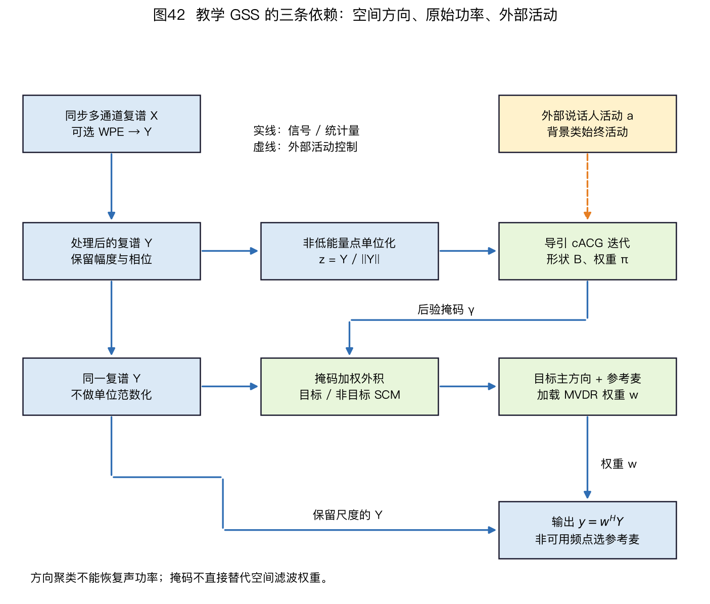
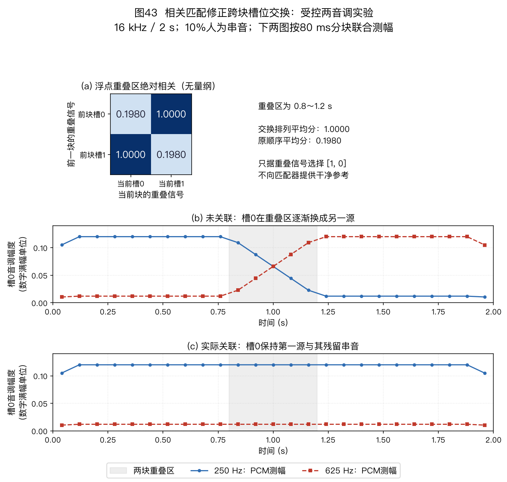

> ⚠️ 本篇是教程正文第 8 章（正文共 11 章，另有附录 A/B），可独立阅读，前后篇见下方导航。
>
> 🏠 首页导读：[`00_overview.md`](00_overview.md) ｜ 上一篇：[07_wpe-dereverberation.md](07_wpe-dereverberation.md) ｜ 下一篇：[09_source-tracking.md](09_source-tracking.md)

## 8. 语音分离

第 7 章讨论传播形成的混响拖尾，本章讨论多个说话人同时发声时的混合与分离。主要方法包括免训练盲源分离（Blind Source Separation，BSS）、导引源分离（Guided Source Separation，GSS）和深度分离；§8.2再说明这些方法在前端系统中的顺序。

### 8.1 多说话人语音分离：鸡尾酒会问题

去混响关注传播的时间拖尾，语音分离处理多个声源在同一观测中的叠加。本节依次介绍免训练 BSS、GSS 和深度分离。时频掩码既可用于分离，也可用于 §5.9 的空间协方差估计。

#### 最小术语与阅读顺序

| 缩写 | 含义 | 本章中的作用 |
|---|---|---|
| STFT | 短时傅里叶变换（Short-Time Fourier Transform） | 把波形分成复数时频观测 |
| BSS | 盲源分离（Blind Source Separation） | 从混合观测估计源及混合关系 |
| SCM | 空间协方差矩阵（Spatial Covariance Matrix） | 描述跨麦克风的二阶统计 |
| RTF | 相对传递函数（Relative Transfer Function） | 指定目标相对于参考麦的响应 |
| NMF | 非负矩阵分解（Nonnegative Matrix Factorization） | 用谱基与时间激活描述功率 |
| PIT | 置换不变训练（Permutation Invariant Training） | 在训练损失中处理输出槽位对应 |
| CSS | 连续语音分离（Continuous Speech Separation） | 处理长录音的分块、拼接和对应 |

先区分“源波形”“参考麦上的源图像”和“解混输出”，再读各方法。前者是发声信号；源图像包含传播；解混输出还可能带任意尺度与排列。去混响与分离可以作用于同一段多源录音，并不是按人数划分的互斥任务。

#### 卷积混合与源数

第 $m$ 个麦克风接收各说话人经过相应房间冲激响应后的叠加，再加上噪声：

$$\begin{aligned}
x_m(t)&=\sum_{n=1}^{N}\sum_{\tau=0}^{L_h-1}
h_{mn}(\tau)s_n(t-\tau)\\
&\quad+v_m(t).
\end{aligned}\tag{8-1}$$

$t$ 和 $\tau$ 均为离散采样索引，$L_h$ 为此有限冲激响应（Finite Impulse Response，FIR）模型的长度，$v_m$ 是附加噪声。$h_{mn}$ 是第 $n$ 个声源到第 $m$ 个麦克风的房间冲激响应，$s_n$ 是第 $n$ 个源信号。源数 $N$ 与麦克风数 $M$ 有三种关系：

- $N=M$ 是确定混合，表示源数与通道数相同，并不保证混合矩阵满秩；
- $N<M$ 是超定混合，可保留冗余通道、先降维或使用超定扩展；
- $N>M$ 是欠定混合，不能只靠一个方阵解混器恢复全部源，还要利用时频稀疏性、源谱模型或满秩空间协方差等结构。

标准方阵辅助函数型独立向量分析（Auxiliary-function-based Independent Vector Analysis，AuxIVA）和独立低秩矩阵分析（Independent Low-Rank Matrix Analysis，ILRMA）通常针对 $N=M$。多通道非负矩阵分解（Multichannel Nonnegative Matrix Factorization，MNMF）能表示 $N>M$，但可靠性仍取决于源数、数据长度、初始化和模型匹配。

单麦 $M=1$ 时没有跨通道方向信息。此时多说话人分离只能依赖源信号先验或监督学习，不能使用后文的多通道方向聚类作为证据。

#### 窄带模型与空间统计

STFT 常把卷积近似为每个频点上的瞬时混合：

$$\begin{aligned}
X_m(f,k)&\approx\sum_{n=1}^{N}A_{mn}(f)S_n(f,k)\\
&\quad+V_m(f,k).
\end{aligned}\tag{8-2}$$

其中 $k$ 是帧号，$A_{mn}(f)$ 是 $h_{mn}$ 在频率 $f$ 处的近似频响。写成向量形式为 $\mathbf X(f,k)=\mathbf A(f)\mathbf S(f,k)+\mathbf V(f,k)$：$\mathbf X\in\mathbb C^{M\times1}$、$\mathbf A\in\mathbb C^{M\times N}$、$\mathbf S\in\mathbb C^{N\times1}$、$\mathbf V\in\mathbb C^{M\times1}$。

这个窄带近似要求分析窗相对通道冲激响应的有效长度足够长，并且源与通道在窗内变化不快。$T_{60}$ 不能单独给出一个“超过多少就失效”的通用阈值；窗长、早晚期能量分布、帧移和允许误差都会影响近似质量。

对等间距线阵，若采用远场直达声、等通道增益和忽略反射的模型，并以第一麦归一化，则相应一列可用纯相位导向矢量表示。实际 $\mathbf A$ 还可包含距离衰减、设备频响和房间传播，不能总按下面的纯相位式替代：

$$\begin{aligned}
a_m(f,\theta)&=e^{\mathrm j(m-1)\phi},\\
\phi&=2\pi f d\sin\theta/c,\\
\mathbf a&=[a_1,\ldots,a_M]^\top.
\end{aligned}\tag{8-3}$$

例如麦间距 $d=4$ cm、声速 $c=343$ m/s、目标方向 $\theta=30°$。按第 5 章约定，麦 1 在左端，正角声源位于 $+x$ 一侧，$\tau_{21}=t_2-t_1=-d\sin\theta/c\approx-58.3\ \mu$s。在 $f=2$ kHz 时，相位差的绝对值为 $2\pi f|\tau_{21}|\approx0.733$ rad，即约 42°；以麦 1 为参考的 4 麦导向矢量约为 $[1,e^{+\mathrm j42°},e^{+\mathrm j84°},e^{+\mathrm j126°}]^\top$。

频率升到 4 kHz 时，相位差绝对值增至约 84°。2 kHz 的波长约 17 cm，4 cm 间距小于半波长；8 kHz 的波长约 4.3 cm，此间距会产生空间混叠和栅瓣。

最小方差无失真响应（Minimum Variance Distortionless Response，MVDR）和广义特征值（Generalized Eigenvalue，GEV）波束形成直接使用空间协方差矩阵（Spatial Covariance Matrix，SCM）；MNMF 也以源相关的 SCM 描述传播。在下述统计条件下，省略频点与帧参数，可写

$$\begin{aligned}
\mathbf R&=E[\mathbf X\mathbf X^H],\\
\mathbf R&\approx\mathbf A\mathbf R_s\mathbf A^H+\mathbf R_v.
\end{aligned}\tag{8-4}$$

这个相加式假定当前统计区间内传播矩阵可视为固定，且 $E[\mathbf S\mathbf V^H]=0$；否则展开外积还会出现 $\mathbf A E[\mathbf S\mathbf V^H]$ 及其共轭转置。这里的 $R$ 是未减均值的二阶矩；只有信号已去均值或均值为零时，才与严格定义的协方差相等。源之间是否相关体现在 $R_s$ 的非对角项，不能再无条件把它写成对角矩阵。

复角中心高斯混合模型（Complex Angular Central Gaussian Mixture Model，cACGMM）先把每个观测归一化到复单位球面，拟合只描述方向分布的形状矩阵。它不把未归一化的观测功率 SCM 直接当作概率密度。

GSS 和部分深度方法先由 cACGMM 或网络估计时频掩码，再用原始 $\mathbf X\mathbf X^H$ 加权计算目标与干扰 SCM；加权统计步骤见第 5 章 §5.9 的式(5-21)。

波束形成一次输出通常针对一个目标，但可以用不同导向或掩码构造多组权重，分别输出多个人的信号。因此“波束形成”和“语音分离”不是互斥方法：GSS 正是先估掩码，再为每个目标计算一组波束权重。下面按解混矩阵、空间聚类和监督学习三条路线比较。

| 路线 | 代表 | 思想 | 局限 |
|---|---|---|---|
| 经典盲源分离（BSS） | 独立成分分析（Independent Component Analysis，ICA）/独立向量分析（Independent Vector Analysis，IVA） | 假设各说话人统计独立，找一组解混矩阵让输出互相独立；IVA 用“同一声源跨频点相关”解决逐频点排列混乱（置换问题） | 这里的方阵 ICA/IVA 要求确定混合及可辨识条件；不能推广到所有 BSS |
| 空间混合模型（免训练） | **cACGMM → GSS** | 见下文展开 | 依赖较长的上下文，计算量随通道数、源数、时频点数和迭代次数增加；GPU 并行化的适用边界见本节“GSS 的源数与计算规模” |
| 深度学习分离 | 掩码网络、深度聚类、Conv-TasNet | 用带答案的混合录音训练模型，再估计每个声源的信号 | 依赖训练数据；换房间、设备或说话人后需重测 |

表中的**深度聚类（deep clustering）**先把每个时频点映射成一个数值向量，再把相似的向量分到同一说话人；**Conv-TasNet** 则直接处理波形的学习表示，不先计算传统短时傅里叶变换。它们解决的问题相同，但输入表示和分离步骤不同。模型结构及其适用条件见 §8.6。

#### PIT 与输出槽位

训练时还有一个对应关系问题：模型的“输出 1”不一定总是说话人甲。置换不变训练（Permutation Invariant Training，PIT）把输出与参考说话人的所有排列都试一遍，用总损失最小的排列更新模型。对 $N$ 个输出，其定义为

$$\mathcal L_{\mathrm{PIT}}=\min_{\pi\in\mathcal S_N}\sum_{n=1}^{N}\mathcal L\!\left(\hat s_n,s_{\pi(n)}\right)\text{，}\tag{8-5}$$

其中 $\mathcal S_N$ 是 $N$ 个对象的排列集合。

**PIT 的 2×2 手算例**。分离器输出为 $\hat s_1,\hat s_2$，参考为 $s_1,s_2$。假设某种失真损失的矩阵为

$$
\mathbf L=
\begin{bmatrix}
L(\hat s_1,s_1)&L(\hat s_1,s_2)\\
L(\hat s_2,s_1)&L(\hat s_2,s_2)
\end{bmatrix}
=
\begin{bmatrix}0.4&3.1\\2.8&0.6\end{bmatrix}.
$$

保持对应关系时总损失是 $0.4+0.6=1.0$；交换参考时是 $3.1+2.8=5.9$，所以本次更新使用前一种对应关系。

这个例子说明 PIT 解决的是“输出槽位没有固定说话人标签”，并不自动解决未知人数或跨长录音的身份保持。逐帧独立选择排列会让同一输出在相邻帧换人；整句级置换不变训练（utterance-level PIT，uPIT）在整句上只选一次排列，可减少这种帧间交换。

只有当总目标确实分解成式(8-5)这种“每个输出—参考对各贡献一个代价，再把所选代价相加”的形式时，才能把 $N\times N$ 成对损失矩阵交给线性指派算法求最小总代价。若损失含有跨输出耦合项、集合级正则项或共同解码约束，就不能直接用匈牙利算法代替全排列目标。[PIT 正式论文](https://doi.org/10.1109/ICASSP.2017.7952154)、[uPIT 正式论文](https://doi.org/10.1109/TASLP.2017.2648230)。

教学函数 `pit_permutation()` 为了让读者直接核对每种排列，采用全排列枚举并把源数上限设为 8；其计算量随 $N!$ 增长。超过 8 个源时，该函数明确拒绝运行。若目标确实满足上一段的成对可加条件，应改用线性指派求解器，而不是放宽枚举上限。

### 8.2 处理模块的顺序

回声、混响和多说话人混合对应不同的信号模型。以下顺序由参考可用性、空间相位保持和统计量依赖关系决定，接口定义见 §10.1。

一种较完整的音频主链见[第 10 章 §10.1](10_engineering-practice.md#sec-10-1)：**采集 → AEC → WPE → 解析波束形成 → 单通道增强**。定位/追踪、说话人分割/GSS/SCM 是为解析波束提供条件的支路；神经或 CSS 分离则是从多通道特征到单通道/多流输出的替代音频路径，不与 GSS 掩码或解析波束合并成一个黑箱。项目只启用满足输入条件且能改善目标指标的模块。

1. **启用声学回声消除（Acoustic Echo Cancellation，AEC）时先处理回声**：回声参考与麦克风回声之间的线性关系可能被后续自适应波束、非线性增益或单通道增强改变，见[第 10 章 §10.1](10_engineering-practice.md#sec-10-1)；
2. **多通道 WPE 通常在波束之前**：晚期混响会污染波束形成所需的协方差估计。WPE 是线性处理，但各通道的预测滤波器不同，不能笼统保证所有跨通道相位关系完全不变。应验证处理后的目标相对传递函数和协方差是否仍适用于后续波束；
3. **导向或掩码给解析波束提供目标统计量**：DSB 和导向型 MVDR 可由定位/追踪提供方向或相对传递函数；掩码 MVDR 可从目标 SCM 提取相对传递函数，GEV 则直接由目标/干扰 SCM 求广义特征向量，二者都不必先得到显式 DOA。定位仍可作为稳定的方向先验或控制支路（见[第 5 章](05_beamforming.md)与[第 9 章](09_source-tracking.md)）；
4. **diarization 在 GSS 聚类之前、掩码在 MVDR 之前**：diarization 提供“谁在何时说话”的标注，用于约束 cACGMM 的跨频点置换；掩码随后用于估计目标和噪声协方差，再计算波束权重（见 §5.4 和 §8.4）；
5. **DNN 的位置由输出决定**：逐通道改写复谱或波形的网络可能破坏跨通道相位，通常放在波束形成后的单通道链路；只输出共享掩码、协方差或 WPE 功率先验的网络可以放在多通道算法内部；联合多通道网络则可能同时完成分离和波束形成。还要单独检查网络是否使用未来帧。

对于“逐通道线性前端—波束形成—单通道增强”这类实现，逐通道处理通常位于前端，单通道增强位于波束形成之后。若神经网络只估计解析算法所需的统计量，或本身联合建模多通道相位，则不受这个顺序限制。

AEC 与降噪的顺序也不是脱离统计假设的固定结论。[Integrated_AEC_NR 固定实现](https://github.com/Arnout-Roebben/Integrated_AEC_NR/tree/23c6b567c7863a8ee9bafd38bad0d3ff2f25e185)同时提供 AEC→NR、NR→AEC 与联合扩展结构，适合在相同输入下比较顺序；但其 `process.m` 借助干净期望语音和干净回声真值生成理想活动判决。设备运行时拿不到这两条干净真值。把结论移到实际设备前，必须改用可取得的活动估计，并重新测试参考相关、非平稳噪声、双讲和路径变化。

**本章模块与图 23 的对应关系**（图的信号取点与启用条件见[第 10 章 §10.1](10_engineering-practice.md#sec-10-1)）：

| 本章模块 | 图 23 中的位置 | 作用 |
|---|---|---|
| diarization / GSS | “说话人分割 → GSS/cACGMM 掩码”支路 | diarization 约束活动时间与跨频点置换；它不直接输出 SCM 或音频 |
| 目标/干扰 SCM 与解析波束 | “GSS 掩码 + 同阶段 WPE 输出未方向归一 STFT → SCM → DSB/MVDR/GEV”支路 | 掩码只给权重，SCM 仍由 $\mathbf Y\mathbf Y^H$ 加权计算；不能改用单位向量 $\mathbf z$ |
| 神经分离 / CSS | WPE 后的替代音频路径，可绕过解析波束后接单通道增强 | 是否输出固定多流、使用未来上下文和跨块排列，都要单独说明 |
| DNN 后滤波 / DNN 后端 | 波束形成或分离后的单通道增强或后端 | 独立改写复谱的网络通常放在多通道 WPE/MVDR 之后，以免破坏空间相位 |
| 降噪（Noise Suppression，NS）/自动增益控制（Automatic Gain Control，AGC）/语音活动检测（VAD）/关键词检出（Keyword Spotting，KWS） | 单通道增强与可选 KWS 旁路；VAD 属控制面 | 各模块按目标任务启用，不在本章展开 |

回声、混响和分离使用不同的参考与统计假设，模块顺序需要服从这些条件。下一章讨论如何把逐帧定位结果连接成连续轨迹。

### 8.3 经典盲源分离：AuxIVA、ILRMA、MNMF 与 TRINICON

以下先说明可辨识条件，再比较源统计、空间模型和重构方式。没有真值输入估计器，并不意味着仅凭任何观测都能唯一恢复源。

#### ICA 的可辨识条件与解混约定

在无附加噪声、确定混合且 $\mathbf A_f$ 可逆的模型中，令 $\mathbf W_f\in\mathbb C^{M\times M}$ 为解混矩阵。第 $n$ 行存储列向量 $\mathbf w_{nf}$ 的共轭转置：

$$\begin{aligned}
\mathbf y_f(k)&=\mathbf W_f\mathbf x_f(k),\\
y_{nf}(k)&=\mathbf w_{nf}^H\mathbf x_f(k).
\end{aligned}\tag{8-6}$$

ICA 希望不同输出在统计上独立。零相关只约束二阶矩，通常比独立性弱。即使确实独立，也还要检查模型是否可辨识：取两个独立标准实高斯变量，联合密度仅依赖 $s_1^2+s_2^2$。用 45° 正交矩阵旋转后，平方和、联合密度和单位协方差都不变，两个新分量仍独立。于是仅凭这种静态分布不能找回原来的两个轴。

这不是“高斯信号总不能分离”的结论；不同的时间相关结构或非平稳方差可提供额外证据。本章后面的不同包络高斯载波实验就不能与同分布、平稳高斯反例混为一谈。经典静态 ICA 的非高斯条件和旋转歧义见 [Hyvärinen 等作者版教材 §7.5，印刷页 161–163](https://www.cs.helsinki.fi/u/ahyvarin/papers/bookfinal_ICA.pdf)。

#### AuxIVA 的目标与迭代投影

**AuxIVA（辅助函数型独立向量分析，Auxiliary-function IVA，Ono 2011）**。它假设不同说话人统计独立，并联合建模同一说话人在各频点的分量。频域 ICA 在各频点独立求解，可能得到不同的输出排列；IVA 利用跨频点包络相关性缓解该置换问题。AuxIVA 使用辅助函数进行闭式更新，不需要设置梯度步长，目标函数在理论条件下单调下降。

标准实现仍是整段迭代，在线版本需要递推改写；强混响可能使短时窄带近似失配；说话人包络高度相关会削弱联合模型区分源的线索；短语音则减少统计支持。不能把这些情况一律解释成原声源不再独立。它常作为免训练分离基线。

一次迭代怎样真正改变解混矩阵，见[练习 E08-08](#e08-08)：先用跨频点输出范数形成权重，再解线性方程，最后按加权二次型归一化。它把下面的排列直觉接到可计算的迭代投影步骤。

设统计帧数为 $T$。在每帧把同一个源的所有频点组成向量，取球对称复 Laplace 工作模型 $p(\mathbf y_n)\propto\exp(-2\|\mathbf y_n\|_2)$。复数线性变换的实 Jacobian 为 $|\det W_f|^2$；负对数按帧数 $T$ 归一后为

$$\begin{aligned}
r_n(k)&=\sqrt{\sum_f|y_{nf}(k)|^2},\\
J_{\rm IVA}&=\frac2T\sum_{n,k}r_n(k)\\
&\quad-2\sum_f\log|\det W_f|.
\end{aligned}\tag{8-7}$$

第一项偏好符合联合源模型的输出；行列式项阻止把所有输出缩到零来降低代价。辅助函数的关键一步是：对 $u\ge0,u_0>0$，凹函数的切线上界给出 $2\sqrt u\le u/\sqrt{u_0}+\sqrt{u_0}$。把旧输出的平方范数代作 $u_0$，便得到按旧 $r_n$ 加权的二次型。随后逐行求解和归一化，而不是凭经验选梯度步长。

下面以 $t$ 表示帧，沿用式(8-6)的共轭行约定。在当前旧输出处固定本轮跨频点范数，形成加权二阶矩，再作迭代投影（Iterative Projection，IP）：

$$\begin{aligned}
r_n(t)&=\sqrt{\sum_f|y_{nf}(t)|^2},\\
V_{nf}&=\frac1T\sum_{t=1}^{T}\frac{\vec x_f(t)\vec x_f^H(t)}{r_n(t)},\\
\vec u&=(W_fV_{nf})^{-1}\vec e_n,\\
\vec w_{nf}&=\frac{\vec u}{\sqrt{\vec u^H V_{nf}\vec u}}.
\end{aligned}\tag{8-8}$$

这里 $T$ 为统计帧数，$\vec e_n$ 为第 $n$ 项为 1 的 $M$ 维基向量，$V_{nf}$ 为 $M\times M$ Hermitian 矩阵；使用求解器解方程，不显式形成矩阵逆。需有 $r_n(t)>0$、正定的 $V_{nf}$ 和可逆 $W_f$。每更新一行就把 $\vec w_{nf}^H$ 写回 $W_f$，后续行读取已更新的矩阵，而本轮权重保持固定；静音地板、加载和初始化是另外的实现选择。

这一路线来自 [Ono 2011](https://doi.org/10.1109/ASPAA.2011.6082320)，可对读 [pyroomacoustics v0.10.0 的 `auxiva.py`](https://github.com/LCAV/pyroomacoustics/blob/0dd39f2614b7fc44b2cc63dbe7d60f4641068890/pyroomacoustics/bss/auxiva.py)。该实现的 Laplace 分母使用 $2r_n(t)$，与式(8-8)有整体尺度差异：$V$ 减半时，归一后的解混列放大 $\sqrt2$，方向不变；不能用未回投影的幅度逐项声称两种约定相同。

数学单调性针对相同模型、合法正定统计和精确更新；加入地板、加载、重置后，要重新说明目标或把目标值仅作诊断。原始算法依据为上述 Ono 论文，本书的尺度与复数代数也可逐项对读 [ssspy 固定实现](https://github.com/tky823/ssspy/blob/38b9389e8b1914422561f1936d9b28d042d62d2c/ssspy/bss/iva.py)。

#### ILRMA 的功率模型与交替更新

**ILRMA（独立低秩矩阵分析，Independent Low-rank Matrix Analysis）**。ILRMA 在独立性假设之外，再用非负矩阵分解（Nonnegative Matrix Factorization，NMF）表示每个源的低秩功率谱，并联合优化解混矩阵与谱模型。它增加了基数、谱参数及其交替更新；具体成本和初始化敏感性取决于配置，不能仅凭方法名断言总高于 AuxIVA。复杂音乐、重叠笑声和强混响可能不满足低秩或独立性假设，需用目标数据验证。[E08-09](#e08-09)用两频点、两帧的乘法解释“谱基”和“激活”，并说明分解的尺度歧义。

记 $\ell=1,\ldots,K$ 为谱基编号。为避免与前文帧号 $k$ 混淆，这里用 $t$ 表示帧；$B_n\in\mathbb R_+^{F\times K}$、$H_n\in\mathbb R_+^{K\times T}$：

$$\lambda_{nft}=\sum_{\ell=1}^K B_{nf\ell}H_{n\ell t}.\tag{8-9}$$

取相互独立的零均值 proper 复高斯分量，密度为 $\exp(-|y|^2/\lambda)/(\pi\lambda)$。实部和虚部各有方差 $\lambda/2$，所以 $\lambda=E|y|^2$ 是功率。合法密度要求 $\lambda>0$；单个因子可非负，但不能让某个待评分点的预测功率为零。省略与参数无关的常数，负对数似然是

$$\begin{aligned}
J_{\rm ILRMA}&=\sum_{n,f,t}\frac{|y_{nft}|^2}{\lambda_{nft}}\\
&+\sum_{n,f,t}\log\lambda_{nft}\\
&-2T\sum_f\log|\det W_f|.
\end{aligned}\tag{8-10}$$

固定谱模型后，空间 IP 更新仍用式(8-8)的求解与归一化，但 $V_{nf}$ 中的权重换成 $1/\lambda_{nft}$。固定 $W$ 后，令 $P_{nft}=|y_{nft}|^2$，以下用逐元素运算紧凑表示 NMF 更新：

$$\begin{aligned}
U_n&=P_n\oslash\lambda_n^2,\\
D_n&=1\oslash\lambda_n,\\
B_n&\leftarrow B_n\odot\sqrt{\frac{U_nH_n^\top}{D_nH_n^\top}},\\
H_n&\leftarrow H_n\odot\sqrt{\frac{B_n^\top U_n}{B_n^\top D_n}}.
\end{aligned}\tag{8-11}$$

$\odot,\oslash$ 表示同形数组逐元素运算；式中的分式、平方和根号也逐元素计算，普通并置表示矩阵乘法。

先更新 $B_n$，重算 $\lambda_n=B_nH_n$，据新功率重算 $U_n,D_n$ 后再更新 $H_n$。这里的 $D_n$ 只是该小步的逐元素倒数矩阵，不是回投影中的尺度矩阵。

固定 $W$ 的目标是 $\sum(P/\lambda+\log\lambda)$；当 $P>0$ 时，它与 Itakura–Saito 散度仅差常数。零初始化可能因乘法而始终为零，通常使用正初值，再明确功率地板的工程口径。E08-19 展开一次基和激活更新；它不把更低的拟合代价当成更好的真实分离。

#### MNMF 的满秩模型与维纳重构

**MNMF（多通道 NMF，Multichannel NMF）**。MNMF 同样使用低秩源谱模型，但以满秩空间协方差描述传播，不要求方阵解混矩阵可逆，因此可以表示欠定混合。谱基、激活和空间协方差需要联合估计，参数数量和局部最优使初值十分重要。可利用 AuxIVA 或 ILRMA 结果辅助初始化，但欠定模型中多出的源还需另作设置。本章未在相同硬件和输入下测定这些方法的速度，不按方法名推断固定运行时长。

以 $\mathbf c_{nft}\in\mathbb C^M$ 表示第 $n$ 个源在所有麦克风上的源图像。满秩工作模型取不同源图像统计独立，协方差 $R_{nft}=\lambda_{nft}G_{nf}$；$G_{nf}$ 是空间形状，$\lambda_{nft}$ 可由 NMF 给出。其乘积才是带功率的协方差。总模型和负对数似然为

$$\begin{gathered}
R_{nft}=\lambda_{nft}G_{nf},\\
R_{ft}=\sum_nR_{nft},\\
\mathbf x_{ft}\sim\mathcal{CN}(0,R_{ft}),\\
\begin{aligned}
J_{\rm MNMF}&=\sum_{f,t}\log\det R_{ft}\\
&\quad+\sum_{f,t}\mathbf x_{ft}^H R_{ft}^{-1}\mathbf x_{ft}.
\end{aligned}
\end{gathered}\tag{8-12}$$

这里要求总协方差正定；标准满秩模型通常也取 $G_{nf}$ 正定。用 $G$ 的迹归一并反向补偿 $\lambda$ 可消除两者的尺度歧义。即使两种源分解得到完全相同的 $R_{ft}$，它们也可能给出不同的单源结果；E08-20 用三个源、两个麦克风展示这一点。

模型拟合后，用多通道维纳滤波（Multichannel Wiener Filter，MWF）取条件均值：

$$\widehat{\mathbf c}_{nft}=R_{nft}R_{ft}^{-1}\mathbf x_{ft}.\tag{8-13}$$

实际先解 $R_{ft}\mathbf u=\mathbf x_{ft}$，再左乘 $R_{nft}$。两个矩阵一般不交换，不能颠倒次序。选其第 $r$ 个元素才得到参考麦 $r$ 的源图像。若模型已包含所有分量，总和必为输入；这个恒等式不证明每个源都估准，也不保证目标无失真。该模型与重构定义见 [FastMNMF 原论文 §II-A，式(1)～(4)](https://www.eurasip.org/Proceedings/Eusipco/eusipco2019/Proceedings/papers/1570533283.pdf)。

#### FastMNMF 的共同合同对角化

MNMF 反复处理随时频点变化的满矩阵。FastMNMF 增加结构约束：同一频点的全部源空间矩阵，能用一个可逆的 $Q_f$ 同时作合同对角化：

$$\begin{aligned}
Q_fG_{nf}Q_f^H&=\operatorname{diag}(g_{nf}),\\
\mathbf z_{ft}&=Q_f\mathbf x_{ft},\\
d_{ftm}&=\sum_n\lambda_{nft}g_{nfm}.
\end{aligned}\tag{8-14}$$

$Q_f$ 为 $M\times M$，$g_{nf}$ 为 $M$ 维非负向量，$d_{ftm}$ 是变换后第 $m$ 个通道的总方差。$Q_f$ 不必是酉矩阵，也不是为每个源各找一套特征向量。这个约束使变换域协方差为对角阵，许多矩阵运算变成逐元素运算；$Q_f$ 自身仍需更新。

变换域的一个通道仍可能含多个源。重构时，第 $n$ 源在通道 $m$ 的系数是 $\lambda_{nft}g_{nfm}/d_{ftm}$，对 $\mathbf z_{ft}$ 逐元素加权后再乘 $Q_f^{-1}$。E08-21 给出不共享酉特征向量、却可共同合同对角化的两张矩阵，并复算此重构。

FastMNMF2 进一步采用跨频共享的空间对角参数 $g_{nm}$，不能把它的参数轴直接当作第一版的 $g_{nfm}$。这改变模型约束，不是仅把同一代码跑得更快。见 [2019 原文 §III](https://www.eurasip.org/Proceedings/Eusipco/eusipco2019/Proceedings/papers/1570533283.pdf)及 [2020 期刊版](https://doi.org/10.1109/TASLP.2020.3019181)。

#### TRINICON 的时域卷积模型

**TRINICON（三重 N 卷积混合盲分离，TRIple-N ICA for CONvolutive mixtures）**直接优化时域解混滤波器，框架可结合非白性、非平稳性和非高斯性处理卷积混合，因此不依赖逐频点瞬时混合近似。代价是滤波器与统计窗口较长、优化量大，声源或房间变化时还要重新适应。滤波器长度决定能表示多长的卷积逆，但不等于端到端延迟：因果 FIR 可逐样本输出，块实现的额外等待由分块、缓冲、FFT 和是否使用未来样本决定。

AuxIVA 适合确定混合的免训练基线；ILRMA 进一步利用源谱低秩结构；MNMF 用满秩空间协方差表示欠定混合；TRINICON 直接处理时域卷积混合。选择时需同时检查源数与麦克风数、混响强度、数据长度和实时预算。

#### 回投影与尺度恢复

**BSS 的排列与尺度歧义**。若 $\mathbf W(f)$ 能把混合信号分开，交换 $\mathbf W$ 的两行只会交换两个输出；把某一行乘非零复数，也不会破坏输出间的统计独立性。因此 BSS 只能在排列和复尺度因子意义下恢复声源。IVA、ILRMA 用跨频点结构缓解频点间排列错乱，但仍要固定输出尺度。方阵情形可令 $\hat{\mathbf A}(f)=\mathbf W^{-1}(f)$，选参考麦克风 $r$，再做

$$\tilde Y_n(f,k)=\hat A_{rn}(f)Y_n(f,k).\tag{8-15}$$

这一步称为回投影（projection back）：在正确解混条件下，它恢复第 $n$ 个源在参考通道上的幅度和相位尺度。回投影不能修复分离错误，也不能保证不同时间块中的说话人编号一致；连续录音仍要做跨块排列对齐。

若 $W=DP A^{-1}$，其中 $D$ 是可逆对角尺度、$P$ 是排列矩阵，则 $W^{-1}=AP^{-1}D^{-1}$，回投影逐路抵消 $D$，却保留参考通道的传播。即使 $W$ 没有分离任何源，只要可逆，$\sum_n(W^{-1})_{rn}y_n=x_r$ 仍成立，因此“加起来等于混合”不是分离成功的证据。

方阵逆矩阵回投影、对所有输出的联合最小二乘、对每路输出单独拟合一个系数，要按定义区分。输出相关时，逐路单回归会把其他输出的相关部分也吸收进去，E08-13 给出不同结果。参考麦某源的真实系数若为零，其源图像就是零，此时不能对它报告有效 SI-SDR，见 E08-14。

#### 跨频排列的两频点手算

**两频点的排列小例。** 假设每个频点已经各自分出槽位 1、槽位 2 两路，但槽位编号在不同频点之间没有说话人身份含义。取两帧，频点 $f_1$ 的槽位 1、2 幅度序列分别为 $[2,0.5]$、$[0.5,2]$；频点 $f_2$ 也出现这两条序列。这里的数字是人为给出的非负幅度，不是语音录音或 AuxIVA 的运行输出。

用一个说明跨频点耦合的球对称源先验作检查：设两频点的联合复谱向量满足示意密度 $p(\vec y)\propto\exp(-\|\vec y\|_2)$，其负对数中与排列有关的部分就是范数。把候选的同一路输出在一帧的两频点组成 $\vec y_n(k)$，计算局部代价 $C=\sum_{k=1}^{2}\sum_{n=1}^{2}\|\vec y_n(k)\|_2$。这项代价只用候选输出自身，不读取说话人身份或干净参考。

两频点保持槽位 1 对 1、2 对 2 时，每帧的两个范数是 $\sqrt{2^2+2^2}=2\sqrt2$ 与 $\sqrt{0.5^2+0.5^2}=1/\sqrt2$，两帧合计 $C=5\sqrt2\approx7.071$。

若只交换 $f_2$ 的两个槽位，每帧两路都变成 $[2,0.5]$ 或 $[0.5,2]$，各有范数 $\sqrt{4.25}$；合计 $C=4\sqrt{4.25}\approx8.246$。因此这个选定的**联合代价**偏好前一种跨频点排列。对固定的逐频解混矩阵做行交换不会改变行列式的绝对值，所以在这种只比较排列的演示中，其行列式项也不能区分两种方案。

完整 AuxIVA 也不能预先拿到这两条已分离的幅度序列；它要从混合复谱迭代估计逐频解混矩阵，并同时处理复尺度、初始化和局部最优。两人的跨频包络若高度相似，本例的差异可能消失。该数例只展示 IVA 利用跨频点结构缓解排列歧义的一个机制，不是一次 AuxIVA 参数更新或分离性能实验。[AuxIVA 原始论文](https://doi.org/10.1109/ASPAA.2011.6082320 "citation")给出完整辅助函数更新。

#### BSS 方法的规模与计算成本

**BSS 方法的规模例子**。以下计算用于说明参数量和迭代规模；性能数字必须以各论文的测试集和评测脚本为准。

AuxIVA 的规模例子：2 源 2 麦、8 kHz、3 s 语音，STFT 取 256 点窗和 64 点帧移。名义帧率为 $8000/64=125$ 帧/s，3 s 约为 375 帧。

若不补零、从首样本开始取完整窗，精确帧数是 $\lfloor(24000-256)/64\rfloor+1=372$。非负频点数为 $256/2+1=129$；每个频点维护一个 $2\times2$ 解混矩阵，所以参数数目为 $129\times2\times2=516$ 个复数。

辅助函数迭代不需要学习率。帧数还取决于是否居中、边界补零和丢弃尾部不完整窗。算法见 [AuxIVA 原始论文](https://doi.org/10.1109/ASPAA.2011.6082320)（Ono, WASPAA 2011, pp. 189–192；公开实现见 [piva](https://github.com/fakufaku/piva)）。

ILRMA 在同一 2 源 2 麦例子中，还要为每个源维护 NMF 基矩阵和激活矩阵。若每源取 2 个基，沿用上述不补零的 372 帧，则矩阵尺寸分别为 $129\times2$ 和 $2\times372$，并与解混矩阵交替更新。

基数、迭代次数和初值都会影响计算量与结果。语音与音乐是否满足同样的低秩假设，需要分别验证。见 [ILRMA 原始论文](https://doi.org/10.1109/TASLP.2016.2577880)（Kitamura et al., IEEE/ACM TASLP 24(9), 2016, pp. 1626–1641）。

MNMF 可以表示 3 个说话人、2 个麦克风的欠定混合。每个频点、每个源对应一个 $2\times2$ Hermitian 空间协方差；129 个频点和 3 个源共需 $129\times3=387$ 个协方差矩阵，还要联合估计谱基和激活。

计算量和局部最优问题使初始化十分重要，AuxIVA 或 ILRMA 结果可作为初值。见 [MNMF 原始论文](https://doi.org/10.1109/TASL.2013.2239990)（Sawada et al., IEEE TASL 21(5), 2013, pp. 971–982）。

用 $F,T,M,N$ 分别表示频点、帧、麦克风和源数，不计结构化加速时，每个时频点分解一个 $M\times M$ 的稠密总协方差，单次遍历的主要分解运算量为 $O(FTM^3)$。存储全部源空间矩阵需 $O(FNM^2)$ 个数，全部源功率需 $O(FNT)$ 个数；分块或逐频处理可改变峰值内存。这些是按矩阵尺寸得到的运算与存储阶数，不是测得的运行时间，也不包含每种方法全部参数更新。

TRINICON 的长度换算可以这样看：8 kHz 下，0.5 s 对应 $8000\times0.5=4000$ 个采样，但这不表示解混滤波器必须取 4000 点，也不表示算法延迟就是 0.5 s。实际长度是在可表示的卷积范围、估计方差、计算量和块实现之间折中。

例如 1024 点与 2048 点分别覆盖 $1024/8000=128$ ms 和 $2048/8000=256$ ms 的滤波器记忆；系统仍要单独报告块大小、帧移、前视和输入输出缓冲，才能得到算法延迟。见 [TRINICON 原始论文](https://www.buchner-net.com/publications.html)（Buchner、Aichner 与 Kellermann，ICASSP 2004，iii-889～iii-892）。

本书索引的 pyroomacoustics TRINICON 则依据 [Aichner 等 2006，§2～3、表1](https://www.buchner-net.com/lnt2006_19.pdf)，是利用非白性与非平稳性的二阶统计特例；不能据总框架的名称声称该实现也执行高阶独立性更新。

### 8.4 GSS：活动导引、空间聚类与波束形成

#### 8.4.1 输入、空间模型与完整处理链

**GSS（导引源分离，guided source separation）**在 CHiME-5/6 的真实晚宴多通道任务中得到广泛使用（Boeddeker et al., CHiME-5 2018；CHiME-8 任务设置已经变化，引用时应按当届规则）。先说明原论文的活动标注来源，再写聚类与波束的依赖关系：

1. **cACGMM 空间聚类**：记 WPE 输出、尚未做方向归一化的多通道 STFT 为 $\mathbf Y(f,k)$。先剔除 $\|\mathbf Y(f,k)\|_2\le\varepsilon_E$ 的低能量点，再对保留点严格归一化为 $\mathbf z=\mathbf Y/\|\mathbf Y\|_2$，主要保留通道间的复数比例。第 $n$ 个分量的密度满足

    $$\begin{aligned}
    q_n&=\mathbf z^H\mathbf B_n^{-1}\mathbf z,\\
    p(\mathbf z\mid\mathbf B_n)&\propto\frac{q_n^{-M}}{\det\mathbf B_n},\\
    \|\mathbf z\|_2&=1.
    \end{aligned}\tag{8-16}$$

    其中 $\mathbf B_n$ 是正定的形状矩阵。cACG 密度对 $\mathbf B_n$ 的正比例缩放不变，所以每次更新后需要选择固定尺度，例如令 $\operatorname{tr}(\mathbf B_n)=M$。这用于消除参数的尺度不唯一性，不是观测声功率的归一化。式(8-16)建模的是归一化方向 $\mathbf z$ 的密度，不是 $\mathbf Y$ 的功率 SCM。

    混合模型的后验概率 $\gamma_n(f,k)$ 用作软时频掩码。“免训练”只表示聚类参数在当前录音上用期望最大化（Expectation-Maximization，EM）估计，不需要预先训练分离网络；完整系统仍需活动标注。

2. **导引（Guided）**：各频点独立聚类会产生簇标签置换。GSS 使用**说话人活动时间标注**限制每个说话人可出现的帧，从而减少不同频点的簇标签置换。Boeddeker 等的 CHiME-5 2018 原实验使用挑战组织者提供的说话人时间标注；部署时若改用自动说话人分割（diarization）输出，其漏标和错标必须作为新误差来源测试。原系统还增加一个始终允许活动的背景噪声分量，使所有说话人静音时仍有可归一化的分量；

3. **级联**：WPE 去混响 → GSS 得到掩码 → 掩码估计目标/非目标协方差 → MVDR 波束形成。Boeddecker 等在 CHiME-5 2018 原论文 §3.3 实际采用最小方差无失真响应（MVDR）及盲解析归一化（BAN）。[GSS 原始论文 §3.3、式(9)～(12)及表 1～2](https://www.isca-archive.org/chime_2018/boeddecker18_chime.pdf "citation")

    广义特征值（GEV）波束形成可作为使用这些统计量的另行评估选择，不能把原论文表 1～2 的词错误率归给 GEV。MVDR 的约束与解见 §5.4，掩码协方差与 GEV 见 §5.9。原论文的识别结果限于 CHiME-5 的特定阵列、赛方时间标注和开发集；引用数字时必须同时给出表号、阵列配置、标注来源、打分集和基线，不能把它当成自动 diarization 的整链成绩。

#### 8.4.2 活动约束下的 EM 迭代

**紧凑实现顺序**。下面是本书严格门控、带正则化的教学迭代，强调依赖关系，不替代具体实现中的复数矩阵更新式。

1. 从 WPE 输出 $\mathbf Y$ 中剔除 $\|\mathbf Y\|_2\le\varepsilon_E$ 的点；对其余点计算严格单位向量 $\mathbf z=\mathbf Y/\|\mathbf Y\|_2$。给 $J$ 位说话人各设一个分量，并增加背景噪声分量 $j=0$；说话人的活动指示 $a_j(k)$ 由时间标注给出，噪声始终取 $a_0(k)=1$。活动标注约束混合权重，$\mathbf B_j$ 另用单位阵或空间统计量初始化，不能把活动标注当作形状矩阵。
2. E 步对保留的时频点先计算非负分数 $q_j(f,k)=a_j(k)\pi_j(f)p(\mathbf z(f,k)\mid\mathbf B_j(f))$，再令 $\gamma_j(f,k)=q_j(f,k)/\sum_{\ell=0}^{J}q_\ell(f,k)$。这里 $\pi_j$ 为混合权重；若噪声权重和密度为正，即使所有说话人都静音，分母仍为正，此时频点的噪声后验为 1。实际实现宜在对数域计算，并明确处理非有限值；若去掉噪声分量，全员静音时分母为零，不能强行归一化。
3. M 步按 cACG 的固定点更新形状矩阵：每个 $\mathbf z\mathbf z^H$ 外积除以当前二次型 $\mathbf z^H\mathbf B_j^{-1}\mathbf z$，再用 $\gamma_j$ 加权求和。对更新矩阵施加保持正定的正则化后，固定尺度，例如令 $\operatorname{tr}(\mathbf B_j)=M$。本书实现中，后验总质量小于通道数时重置为单位阵并计数；其他退化通过迹检查和加载处理。不能把这一具体保护策略泛称为所有 cACGMM 的共同规则。
4. 重复活动导引与形状更新，采用明确的最大轮数或变化诊断；报告实际轮数、停止条件和重置次数。收缩、权重地板与重置后的算法不能自动继承无约束 EM 的似然单调性。
5. 将后验作为掩码，但用同一 WPE 阶段、未做方向归一化的 $\mathbf Y\mathbf Y^H$ 按式(8-21)估计目标/非目标 SCM，再计算每个目标的 MVDR 或 GEV 权重。对于一个目标，非目标掩码包含其余说话人与背景噪声；这里不能把单位向量 $\mathbf z$ 的外积误当成带功率信息的 SCM。

活动先验需要先在本帧允许的类别中归一。设 $a_{jt}$ 为活动标记，$\pi_j$ 为全局非负权重，背景类权重为正：

$$\begin{aligned}
\pi_{jt}^{\rm act}&=\frac{a_{jt}\pi_j}{\sum_\ell a_{\ell t}\pi_\ell},\\
\gamma_{jt}&=\frac{a_{jt}\pi_jp_j(z_t)}
{\sum_\ell a_{\ell t}\pi_\ell p_\ell(z_t)}.
\end{aligned}\tag{8-17}$$

先验归一化的分母在后验中抵消，所以第二行可直接计算。原论文还采用 $\pi_j\leftarrow T^{-1}\sum_t\gamma_{jt}$，本书受控链加上先验地板再归一化；形状另按下一式更新。[GSS 原论文 §3.2，式(5)～(8)](https://www.isca-archive.org/chime_2018/boeddecker18_chime.pdf)明确给出这套算法，但“论文采用的更新”与“某个条件似然的精确最大化”仍须分别核验。

固定责任权重 $\gamma_t$ 后，省略频点和分量下标，其形状负对数目标为

$$\begin{aligned}
Q(B)&=\sum_t\gamma_t\bigl[\log\det B\\
&\qquad+M\log(z_t^HB^{-1}z_t)\bigr].
\end{aligned}\tag{8-18}$$

对 $B$ 求驻点时，右侧仍含有 $B^{-1}$，用旧值代入便得到固定点迭代：

$$\begin{aligned}
q_t^{(r)}&=z_t^H(B^{(r)})^{-1}z_t,\\
\widetilde B^{(r+1)}
&=\frac{M}{\sum_t\gamma_t}
\sum_t\frac{\gamma_t}{q_t^{(r)}}z_tz_t^H,\\
B^{(r+1)}&=\frac{M\widetilde B^{(r+1)}}{\operatorname{tr}\widetilde B^{(r+1)}}.
\end{aligned}\tag{8-19}$$

$B$ 为 $M\times M$ 复厄米正定矩阵，$z_t$ 为 $M$ 维单位列向量，$\gamma_t\ge0$ 且总质量为正。固定 $\gamma$ 是这一形状子步骤的条件；完整 cACGMM 还要更新责任权重与混合权重。该迭代依据见 [Ito 等，EUSIPCO 2016，§III-B、式(14)](https://www.eurasip.org/Proceedings/Eusipco/Eusipco2016/papers/1570256519.pdf)。

第 3 步是带当前形状矩阵的固定点迭代，不是对方向外积做一次普通平均就完成极大似然估计。一次更新与收敛后的估计也要区分。[E08-11](#e08-11)展开其中的二次型、外积和迹归一化，并用所有方向相同的输入展示奇异边界。

对于已知活动的条件密度，省略频点后，对数似然为

$$\begin{gathered}
\ell(\pi,B)\\
=\sum_t\log\left(\sum_j a_{jt}\pi_jp_j(z_t)\right)\\
-\sum_t\log\left(\sum_j a_{jt}\pi_j\right).
\end{gathered}\tag{8-20}$$

第二项也依赖 $\pi$，因此简单的后验均值不一定最大化这个条件目标。E08-18 用固定形状、三帧输入算出 $\ell$ 从 $\log5$ 降为 $\log3.4$。这不否认原文确实使用该更新；它说明不能把其名称、或正则化教学链的固定迭代，直接当作条件似然单调上升的证明。

本节伪代码和 E08-07 的“禁用类后验为零”是本书严格活动门控约定。固定 GPU-GSS 默认 `bss_iterations_post=1` 时，最后一次预测不再传活动标记；其训练路径还使用非零后验地板。因此该默认最终掩码不保证非活动类恰为零。源码配置和静态/实际核查范围见[研究 B09](../codes/chapters/ch00/research/02_aec_wpe_separation.md#bss)，不能把本书受控链冒充所有官方配置。

#### 8.4.3 活动门控手算与错误标注反例

**活动门控的最小算例**：只看一个频点的相邻两帧，并按“说话人 1、说话人 2、背景噪声”排列。假设混合权重为 $[0.5,0.3,0.2]$，三个分量在这两帧观测上的相对密度都为 $[2,1,1]$。第一帧的活动指示为 $[1,0,1]$，E 步的未归一化分数为 $[1,0,0.2]$，总和为 $1.2$，后验为 $[5/6,0,1/6]$。第二帧两位说话人都静音，活动指示为 $[0,0,1]$，分数为 $[0,0,0.2]$，后验为 $[0,0,1]$。

这些密度是题目给定的相对数值，只检验 E 步归一化；它们不是从录音拟合出的 cACG 密度，也不构成分离性能实验。完整手算及代码见练习 E08-07。

**活动错误的三帧反例**。再固定 $\pi=[0.4,0.4,0.2]$，顺序仍为“说话人 1、说话人 2、背景噪声”。三帧的相对空间密度依次是 $[8,1,1]$、$[1,8,1]$、$[1,1,1]$；真实说话人活动依次是“仅说话人 1、仅说话人 2、两人都静音”。正确标注下，首帧说话人 1 的分数为 $0.4\times8=3.2$，背景分数为 $0.2$，故其后验为 $3.2/(3.2+0.2)=16/17\approx0.9412$。

若漏标首帧的说话人 1，门控会把其后验强制置零，无论该分量的固定空间密度多高。若把第三帧的说话人 1 错标为活动，其后验会从 0 变成 $0.4/(0.4+0.2)=2/3$，本应占 1 的背景后验变为 $1/3$。

这组数字由[`gss_activity_error_demo.py`](../codes/chapters/ch08/gss_activity_error_demo.py)和独立分数测试复算，只描述**固定密度、固定权重时的 E 步**。完整 GSS 还会让错误活动参与参数更新，并经 SCM、波束形成影响音频；上述后验变化不能直接换算成 SI-SDR 或 WER 的变化。原论文的活动门控见[Boeddeker 等 §3.2、式(5)～(8)](https://www.isca-archive.org/chime_2018/boeddecker18_chime.pdf "citation")。

活动标注只限制允许的簇，不会自动修复错误分割。如果目标说话人在所选片段内始终活动，目标与恒活动噪声类仍可能交换标签；原论文通过扩展目标片段前后的上下文，让目标类出现静音帧来降低这种置换风险，不能保证完全消除。短活动段、空分量或近奇异形状矩阵还需要正则化和失败检测。[原始论文 §3.2、图 3、式(5)～(8)](https://www.isca-archive.org/chime_2018/boeddecker18_chime.pdf "citation")

#### 8.4.4 协方差、波束权重与适用边界

**GSS 的源数与计算规模**：输入通常是一段包含重叠语音的会议录音。cACGMM 的分量数通常由日志或系统配置预先给定；它不会仅凭式(8-16)可靠推断未知说话人数。

$M\ge2$ 才有跨通道方向信息。当 $N\le M$ 时，掩码波束形成通常还有空间自由度；当 $N>M$ 时，仍可为每个已知目标估计掩码和 SCM，但分离依赖时频占优、活动标注与数据量，不能获得方阵解混的可逆性保证。

WPE 先减弱晚期混响；cACGMM 在目标段附近的上下文上做 EM 聚类，为每个时频点输出说话人后验掩码；目标和非目标掩码分别用于估计 SCM，再计算 MVDR 或 GEV 权重。

上下文长度和 EM 迭代次数会共同影响估计方差、延迟与计算量。GPU 并行化的收益必须绑定硬件、数据、代码版本和计时范围，不能作为跨实现的通用加速倍数。

以 16 kHz 采样、512 点窗、128 点帧移为例，每秒有 125 帧，30 s 的名义帧数为 3750；若从首样本开始、只取完整窗且不补零，实际是 $\lfloor(480000-512)/128\rfloor+1=3747$ 帧。257 个非负频点对应 962979 个时频点，约 96 万。居中和边界补零会改变实际帧数。这个换算只给出待处理样本数，不能保证 EM 在固定次数内收敛。实现应记录所用目标的变化与最大迭代次数；空分量、近奇异 $\mathbf B_n$ 和低能量时频点还需要正则化或重置。

掩码换成目标协方差时，用

$$\begin{gathered}
\gamma_{fk}=\gamma(f,k),\\
\mathbf Y_{fk}=\mathbf Y(f,k),\\
\mathbf R_{\mathrm{tar}}(f)
=\frac{\sum_k\gamma_{fk}\mathbf Y_{fk}\mathbf Y_{fk}^H}
{\sum_k\gamma_{fk}+\varepsilon}.
\end{gathered}\tag{8-21}$$

式(8-21)展示分母加正数的稳定化写法；无稳定项且权重和非零时，它是加权平均。教学函数 `masked_spatial_covariance()` 采用另一种明确口径：分母为 $\max(\sum_k\gamma,\varepsilon)$，只在权重和低于地板时改变归一化。两种写法不能在极小权重下当成数值相同，练习 E08-05 给出差别；空掩码在教学代码中返回零矩阵，不能解释为可靠的噪声估计。

噪声协方差可用相应的非目标掩码估计。软权重的集中程度可用 Kish 公式描述；它不是“$\gamma>0.8$ 的帧数”，也不直接等于独立观测数量。对非负且总质量为正的权重，定义：

$$N_{\mathrm{eff}}(f)=\frac{\left(\sum_k\gamma(f,k)\right)^2}{\sum_k\gamma^2(f,k)}.\tag{8-22}$$

例如 900 帧权重全为 1 时 $N_{\mathrm{eff}}=900$；若权重集中在少数帧，有效样本数会明显更小。

记正权重非零快照数为 $T_+$，避免与源数 $N$ 混淆。相应 $M\times M$ 协方差的秩至多为 $\min(T_+,M)$。满秩估计至少需要 $M$ 个线性独立的非零快照；$T_+\ge M$ 只是必要条件，不是充分条件。Kish $N_{\mathrm{eff}}$ 只是软权重集中程度的近似，$N_{\mathrm{eff}}\ge M$ 也不能保证快照张成 $\mathbb C^M$。

高度相关的连续帧不能当作同等数量的独立空间状态；工程上还应检查矩阵秩或条件数，并在必要时做对角加载。

说话人活动标注用于限制各簇可出现的时间区间，从而减少跨频点置换。见 [cACGMM 原始工作](https://doi.org/10.1109/EUSIPCO.2016.7760429)（Ito et al., EUSIPCO 2016, pp. 1153–1157）与 [GSS 原始论文](https://www.isca-archive.org/chime_2018/boeddecker18_chime.pdf)。

**掩码到波束权重的小例子**。以下实数向量只是 WPE 输出复数 STFT 的简化手算。两个时频快照取 $\mathbf Y_1=[1,1]^\top$、$\mathbf Y_2=[1,-1]^\top$，目标掩码为 $\gamma=[0.9,0.1]$。本题显式取 $\varepsilon=0$，因为权重和为 1，目标协方差为

$$
\mathbf R_{\mathrm{tar}}=0.9\mathbf Y_1\mathbf Y_1^H+0.1\mathbf Y_2\mathbf Y_2^H
=\begin{bmatrix}1&0.8\\0.8&1\end{bmatrix}.
$$

若这个二分类例子中用 $1-\gamma=[0.1,0.9]$ 估计干扰协方差，则 $\mathbf R_{\mathrm{int}}=\begin{bmatrix}1&-0.8\\-0.8&1\end{bmatrix}$。正的非对角项表示目标快照中两通道同相成分占优，负的非对角项表示干扰快照中反相成分占优。

随后可从 $\mathbf R_{\mathrm{tar}}$ 的主方向估计目标相对传递函数，并与 $\mathbf R_{\mathrm{int}}$ 一起计算 MVDR。GEV 则直接求矩阵对 $(\mathbf R_{\mathrm{tar}},\mathbf R_{\mathrm{int}})$ 的主广义特征向量，并需另做尺度归一化。

本例还可以算到输出：目标矩阵的主特征方向为 $[1,1]^\top$，以第一麦归一后取 $\vec v=[1,1]^\top$。干扰矩阵满足 $R_{\mathrm{int}}\vec v=0.2\vec v$，所以 $R_{\mathrm{int}}^{-1}\vec v=5\vec v$，MVDR 分母为 10，权重为 $[0.5,0.5]^\top$；对两个快照的输出分别是 1 和 0。完整特征值、GEV 比值及尺度边界见 [E08-10](#e08-10)。

从主特征向量提取 RTF 是模型相关的估计。若目标 SCM 是秩一 $\phi aa^H$，主方向与 $a$ 一致；掩码泄漏、各向异性污染或强晚期混响会破坏这个条件，重合的最大特征值更没有唯一主方向。参考分量还必须非零才能按该麦归一化。

本书反例取真实 $a=[1,1]^\top$、目标统计 $aa^H+\operatorname{diag}(0,3)$。其主特征向量按第一麦归一后为 $[1,(3+\sqrt{13})/2]^\top$，约为 $[1,3.3028]^\top$。以单位干扰 SCM 求 MVDR，对这一估计方向响应为 1，对真实 $a$ 的响应却仅约 0.3613。相反，若目标统计为单位阵，任意方向都是主方向；求得一个数值特征向量不代表找到了目标。

真实的“目标 + 多个说话人 + 环境噪声”并非二分类，$1-\gamma$ 会把所有非目标成分合在一起，不能解释成纯噪声掩码。实际实现还要检查有效样本数、条件数和对角加载。[掩码波束形成实例](https://doi.org/10.1109/ICASSP.2016.7471664 "citation")。

定位结果可以给分离提供方向先验；分离网络输出的掩码又能用于估计 MVDR 的目标与干扰协方差。

#### 8.4.5 可运行的 cACGMM—SCM—MVDR 受控链

前面的三帧例子只计算固定密度的 E 步。本书另提供原创 NumPy [教学整链](../codes/chapters/ch08/core/gss_teaching.py)：逐频点把两麦复谱严格归一化为单位向量，使用说话人活动和恒活动背景类对复角中心高斯混合模型（cACGMM）进行 8 轮活动导引与形状迭代；各类形状矩阵采用迹归一化与正定加载，空类显式重置。然后用未做方向归一化的原始复谱和后验掩码计算目标/非目标 SCM，最终使用两麦 MVDR 输出目标复谱。

低能量点归入背景；代码同时返回掩码、SCM、权重、低能量点数、重置次数以及波束求解诊断，便于核查每一步。

教学实现用向量范数判断有效点，不用范数平方。每个频点先取所有帧的最大范数，门限为该峰值的 $10^{-7}$ 与绝对下限 $10^{-12}$ 中较大者；范数严格大于门限才参与更新，相等也归背景。绝对项与 STFT 幅度同单位，相对系数无量纲，两者均为公开参数。绝对项主导时，整体缩小输入可能改变门控。

[固定脚本](../codes/chapters/ch08/examples/gss_teaching_demo.py)用种子 20260924 合成 16 kHz、2 s 的**两条独立高斯测试波形**，并给它们设置已知活动区间。第一路在麦 0 直接到达、麦 1 晚 2 个采样；第二路相反，另加每麦独立均方根约 0.003 的高斯噪声。STFT 窗长 256 点、帧移 128 点，活动按帧中心给出。

这个合成阵列没有房间混响，因此演示时旁路 WPE；代码可显式调用本书的离线 WPE 实现，但**本实验没有据此验证 WPE**。说话人活动作为外部输入提供，不是从混合录音自动识别。

| 同一目标、同一评分区间 $[0.2,1.45)$ s | 去均值 SI-SDR（dB） | 说明 |
|---|---:|---|
| 参考麦 0 的混合输入 | 1.28 | 含另一合成源和独立噪声 |
| 正确活动标注的输出 | 13.76 | 受控单次合成运行；不代表真实会议录音 |
| 目标活动全部漏标的输出 | 1.28 | 目标后验被门控为零，教学波束回退参考麦 |

这一组数字只说明在给定模型、固定输入和已知活动下，整条教学链能产生可复核音频；不能推断在其他说话人、房间或活动标注上必有 12.48 dB 的改善。

所有说话人静音的帧上，背景后验为 1；错误标注条件下目标后验为 0。正确条件下本次形状矩阵重置次数为 0，后验每点求和与 1 的最大差约为 $2.22\times10^{-16}$。这些数值可由[独立测试](../tests/test_codes_gss_teaching.py)和[完整状态文件](../codes/chapters/ch08/gss_audio/STATE.npz)复算。

状态文件分别保存更新前后两套参数：`posterior` 来自末次 E 步使用的 `e_step_shapes`、`e_step_priors`；`shape_matrices`、`post_update_priors` 是随后形状与先验更新的结果，没有再用它们执行一次 E 步。重算后验须选前一套，并读取 `valid_points` 区分强制背景点。全为低能量的频点执行零轮，其余固定执行八轮；实际轮数另存，固定八轮不等于已经收敛。

先调低播放音量。各文件采用同一导出增益；文件摘要和参数见[独立清单](../codes/chapters/ch08/gss_audio/MANIFEST.json)。

[第一路源](../codes/chapters/ch08/gss_audio/source_1.wav)

[第二路源](../codes/chapters/ch08/gss_audio/source_2.wav)

[混合双麦](../codes/chapters/ch08/gss_audio/mixture.wav)

[正确活动输出](../codes/chapters/ch08/gss_audio/enhanced_correct.wav)

[漏标输出](../codes/chapters/ch08/gss_audio/enhanced_missed.wav)都按同一增益导出，文件摘要和精确参数见[独立清单](../codes/chapters/ch08/gss_audio/MANIFEST.json)。这五个 WAV 属独立 GSS 资产，不并入本书主清单的 109 个样本。

官方 [GPU-GSS 固定源码](https://github.com/desh2608/gss/tree/10fad18cae85e2e4342c77421abc70c9c5da23ed)还包含 CuPy、Lhotse/RTTM、分段上下文及完整会议处理；本机未运行其官方整链，也没有使用 CHiME 语料或计算 WER。本段的教学结果不能充当 Boeddeker 等原论文的复现成绩。[GSS 原论文 §3.1～§3.3](https://www.isca-archive.org/chime_2018/boeddecker18_chime.pdf "citation")。

图42把控制信息与音频统计分开：活动标注进入聚类的允许类别；WPE 后的复谱一支做方向归一并估计掩码，另一支保留幅度供 SCM 计算。形状矩阵 $B$ 与功率 SCM 不是同一个对象。本书受控实验无混响，因此旁路 WPE；真实系统只有满足前置条件时才启用。低能量归背景、空统计回参考麦和失败诊断也应随结果报告。

### 8.5 分离指标与数据集口径

#### SI-SDR 的正交投影

常用的尺度不变信号失真比（scale-invariant signal-to-distortion ratio，SI-SDR）把等长实数估计信号 $\hat s$ 投影到非零参考 $s$ 上，再比较投影能量与正交残差能量。采用去均值口径时，应先分别去掉两信号的均值：

$$\begin{gathered}
\alpha=\frac{\langle\hat s,s\rangle}{\|s\|^2},\\
s_{\mathrm{tar}}=\alpha s,\\
\mathrm{SI\!\text{-}\!SDR}=10\log_{10}\frac{\|s_{\mathrm{tar}}\|^2}{\|\hat s-s_{\mathrm{tar}}\|^2}.
\end{gathered}\tag{8-23}$$

这一系数来自一维最小二乘：对 $\|\hat s-\alpha s\|^2$ 求导，令 $-2s^\top\hat s+2\alpha s^\top s=0$。所以残差与参考正交，投影与残差的能量能够分开比较。若采用去均值口径，非零常量也会变成零参考，必须拒绝评分。

投影会把估计中与参考平行的部分全部归入 $s_{\mathrm{tar}}$，不能把任何人工加入的“噪声”都直接当作分母。若该噪声含与 $s$ 同方向的分量，必须先做投影。该指标不自动消除时间偏移、频率响应差异或跨块换人。[Le Roux et al., ICASSP 2019，§2.3、式(3)～(5)](https://www.merl.com/publications/docs/TR2019-013.pdf)。

SI-SDR 提升量（SI-SDRi）是输出 SI-SDR 减去混合输入的 SI-SDR，两项必须使用同一预处理和实现。精确数学中，非零完美估计对应正无穷，非零且与参考正交的估计对应负无穷；零参考或零估计不能给出有效分数。实现通常另设数值边界，必须在报告中说明。

“参考麦克风上的源图像”是声学术语，这里的“图像”**不是图片**。它指某个声源单独经过传播、到达指定麦克风后形成的波形；即使原声是同一句话，不同麦克风上的源图像也会因时延、幅度和房间响应而不同。因此评分前须说清参考是无混响干声、带混响波形，还是某支麦克风上的源图像。

#### 分离指标的报告口径

**分离指标的最小报告模板**：

- 写明目标信号定义（无混响干声、带混响参考或参考麦克风图像）、参考通道、采样率与截断长度；
- 说明是否去均值，以及固定传播时延、算法时延和整体增益怎样对齐；
- 给出活动区间、静音段处理、输出—参考排列规则和输入混合基线；
- 固定指标实现及版本，并对多次随机实验报告种子、次数和离散程度。

若其中任一项不同，SI-SDRi、SI-SNRi 或 WER 数字不能直接横向排名。

#### 数据集的录音与任务范围

**数据集口径速查**：下表先回答“选择哪个数据集”。它们的录音来源、通道和任务不同，没有可横向排名的统一性能数字。随后逐个列出复现实验必须交代的口径。

| 数据集 | 首要用途 | 录音类型 |
|---|---|---|
| REVERB | 去混响与识别 | 仿真混响及另行录制的真实房间语音 |
| CHiME-5 / CHiME-6 | 真实晚宴多说话人识别 | 同一批家庭场景录音的不同数据版本 |
| WHAMR | 噪声、混响与重叠同时存在时的分离 | 合成混合及房间响应 |
| WSJ0-2mix / 3mix | 干净两人或三人重叠分离 | 干声合成混合 |
| LibriMix | 跨语料干净或含噪重叠分离 | 干声或加环境噪声的合成混合 |
| LibriCSS | 连续会议重叠与长录音识别 | 真实会议室中的扬声器回放录音 |

**REVERB。** 仿真部分的混响时间约分 0.25 / 0.5 / 0.7 s 三档，另有以 MC-WSJ-AV 为基础的真实房间录音；基线语音来自 WSJCAM0。存在 8 通道、2 通道及单通道设置。比较 WPE 时，应同时写通道数、识别器、测试子集，以及 WER 的绝对值或相对变化。

**CHiME-5。** 录音来自真实家庭的厨房、餐厅和客厅，包含自然混响和生活噪声。每场有 6 台 Kinect，每台 4 个同步麦克风；每位参与者还佩戴双耳麦。

原始 CHiME-5 的双耳录音仅提供于训练集和开发集，评测集不提供，不能把三组数据都写成可取得双耳通道。[Boeddecker 等 CHiME-5 2018 原论文 §2](https://www.isca-archive.org/chime_2018/boeddecker18_chime.pdf "citation")。6 台设备不能缩写成“6 麦阵列”；可用的双耳录音用于辅助转写和时间对齐，不是干净评分参考。[CHiME-5 官方数据说明](https://www.chimechallenge.org/challenges/chime5/overview "citation")

**CHiME-6。** 该版本重新对齐了 CHiME-5 的部分录音，必须写明具体版本和划分。总计 32 个物理通道，其中 6 台四麦阵列给出 24 通道，4 套双耳设备给出 8 通道。

CHiME-6 Track 2 官方数据规则对 **evaluation set** 的双耳录音限定为仅可用于阵列同步，不可用于说话人分割、增强或识别；不能把这一条直接扩写为训练集和开发集的同一限制。[CHiME-6 Track 2 官方数据页 Audio Note](https://www.chimechallenge.org/challenges/chime6/track2_data "citation")。报告 GSS 还须注明实际选用哪些阵列、日志输入、打分集和原论文表号。

**WHAMR。** 使用合成房间冲激响应，$T_{60}$ 的低、中、高混响档分别从 0.1～0.3 s、0.2～0.6 s、0.4～1.0 s 均匀采样；这三档表示混响程度，不表示房间大小。

数据以 WSJ0-2mix 加 WHAM 噪声为基础，提供 8 kHz / 16 kHz、min（截短对齐）/ max（全长）版本。报告时写清源数、目标是无混响还是带混响语音，以及 SI-SDRi 实现。[WHAMR 正式论文 §2 与表 1](https://doi.org/10.1109/ICASSP40776.2020.9053327 "citation")

**WSJ0-2mix / 3mix。** 语音素材直接叠加，无另加噪声或混响。[Hershey 等原始论文 §3.1](https://www.merl.com/publications/TR2016-003 "citation")对双人混合报告 30 小时训练、10 小时验证、5 小时测试，并在处理前统一降采样至 8 kHz；其三人实验采用另行构造的样本集，不能照搬双人时长。

[MERL 原始资源页](https://shadow.merl.com/research/highlights/deep-clustering "citation")提供 `wsj0-mix` 混合生成脚本；使用 8 kHz / 16 kHz、min（按最短源截断）/ max（全长补零）等配置时，须以实际生成版本为准，写清源数、静态还是动态混合及指标实现。本仓库未取得 WSJ0 语料，生成脚本不包含原始语音；原始 [LDC93S6A 语料](https://catalog.ldc.upenn.edu/LDC93S6A "citation")另有 LDC 使用许可。

**LibriMix。** clean 版无额外污染，noisy 版叠加 WHAM 环境噪声；提供 8 kHz / 16 kHz、train-100/train-360、min/max 等版本。SparseLibriMix 是另行发布的稀疏重叠测试集。跨语料实验须同时注明训练集、测试集、噪声版本及是否使用 SparseLibriMix。[LibriMix 论文](https://arxiv.org/abs/2005.11262 "citation")与[官方生成仓库](https://github.com/JorisCos/LibriMix "citation")

**LibriCSS。** 将 LibriSpeech 语音从扬声器在真实会议室回放，用 7 通道圆阵录制。共 10 个约 1 h 会话，每个分为 6 个约 10 min 小会话；0S、0L、10%、20%、30%、40% 表示不同重叠条件，0S 与 0L 虽都无重叠，句间静音长度却不同。报告连续分离或识别时须写明条件、分块、跨块排列、输出流数和说话人分配规则。[LibriCSS 正式论文](https://doi.org/10.1109/ICASSP40776.2020.9053426 "citation")

REVERB 主要用于去混响与识别，CHiME-5/6 用于真实重叠语音的分离与识别，WHAMR 同时包含噪声、混响和重叠，WSJ0-2mix/3mix 是干净混合基准，LibriMix 还可检查跨数据集泛化，LibriCSS 则把问题扩展到连续会议。CHiME-6 重新对齐了 CHiME-5 的部分录音，引用结果时不能把两个版本混为同一数据版本。[CHiME-6 官方说明](https://www.chimechallenge.org/challenges/chime6 "citation")。不同数据集的数字不能直接比较。

### 8.6 连续语音分离与深度模型

#### 连续录音的分块与说话人对应

**连续语音分离（Continuous Speech Separation，CSS）**不能把整句分离器机械地逐块调用。长录音中的活动人数会变化，同一输出槽位还可能在相邻块交换说话人。

实现需明确四件事：

1. 每块使用多少左、右上下文；
2. 重叠块怎样加权拼接；
3. 跨块排列依据声纹、波形相关性还是联合优化；
4. 输出流数固定还是随活动人数变化。

一个不依赖干净参考的最小关联方法是比较相邻块的真实重叠样本。记前块第 $i$ 路和后块第 $j$ 路的重叠向量为 $u_i,v_j$，去均值后在能量非零时计算绝对归一化相关 $C_{ij}$，再选择对应关系：

$$\begin{aligned}
C_{ij}&=\frac{|u_i^\top v_j|}{\|u_i\|\|v_j\|},\\
\hat\pi&=\arg\max_{\pi\in\mathcal S_N}
\frac1N\sum_i C_{i,\pi(i)}.
\end{aligned}\tag{8-24}$$

只有最佳排列有足够优势且重叠含有效信号时才接受；全静音、两路完全相同或新说话人刚出现时，要返回未确定并使用其他连续性证据。绝对相关忽略整体极性，应用还须单独对齐尺度和极性，否则直接拼接可能相消。

排列对齐后，将第 $b$ 块的第 $n$ 路放回全局时间轴，记为 $y_{bn}[t]$。重叠加权的定义是

$$\begin{aligned}
\hat s_n[t]&=\frac{\sum_b w_b[t]y_{bn}[t]}{\sum_b w_b[t]},\\
\sum_b w_b[t]&>0.
\end{aligned}\tag{8-25}$$

窗之和为 1 时可以省略分母，但不能默认任意窗口、块移都满足。边界只含一块时也须保持非零支持。E08-23 只从实际重叠区判断两个模拟输出槽位的对应，随后按互补线性窗拼接；干净参考仅留给评分。

连续识别的指标也要写清分配规则。连接最小排列词错误率（Concatenated Minimum-Permutation WER，cpWER）、最优参考组合词错误率（Optimal Reference Combination WER，ORC-WER）和说话人归属词错误率（Speaker-Attributed WER，sa-WER）处理说话人对应的方式不同，不能只写“WER”。

CSS 解决长录音的分块与输出一致性，不保证身份永久不交换；需要稳定身份时还要结合分割或说话人跟踪。

#### 时频掩码与深度模型

VarArray 的正式论文发表于 ICASSP 2022（pp. 6027–6031，DOI [10.1109/ICASSP43922.2022.9746876](https://doi.org/10.1109/ICASSP43922.2022.9746876)），通过通道置换/数量不变的聚合结构适配不同麦克风数量和论文评测中的多种同步阵列几何。“阵列几何无关”不表示对任意未见孔径、异步时钟、通道失配或设备频响都有保证；这些条件仍需在目标设备上验证。

**时频稀疏性与掩码**：在某些语音混合中，同一时频点往往由一个声源占优，文献将这种近似称为 W-不重叠正交性（W-disjoint orthogonality，WDO）。掩码方法可以据此估计每个时频点属于各声源的权重。说话人在同一时频区域强烈重叠时，WDO 近似变差。波束形成的区别不是“对整个频带统一加权”：宽带 STFT 波束形成通常在每个频点使用一组复权重，利用通道间的幅度和相位关系做空间选择。

最直接的复谱掩码模型是

$$\hat S_n(f,k)=M_n(f,k)X(f,k).\tag{8-26}$$

若 $M_n$ 被限制为 $[0,1]$ 的实数，它只能保留混合相位并缩小幅度。两源强相消时，单个源的幅度可以大于混合；若相位不同，实数掩码也不能任意旋转它。E08-22 用两个复数时频点复算这两种表示限制。复掩码或直接复谱映射扩大了表示能力，但并不提供未知源的真实答案。

可学习波形表示中的对应过程为

$$\begin{aligned}
z&=E_\theta(x),\\
\hat s_n&=D_\theta(m_n\odot z).
\end{aligned}\tag{8-27}$$

编码器 $E_\theta$ 把波形变为学习系数，分离网络估计与它同形的 $m_n$，解码器 $D_\theta$ 恢复波形。编码系数不一定等于 STFT，也不必逐维对应物理频率。Conv-TasNet 属于这一路线；深度聚类则学习时频点的嵌入，再由聚类取得掩码。后者的嵌入相似关系与最终波形输出要分开，见 [Hershey 等原论文](https://arxiv.org/abs/1508.04306)。

**深度分离的几类结构**。下表只比较建模方式。原论文的指标、数据生成和评测代码并不完全相同，不在表中按单个 dB 数排名。

| 结构 | 代表 | 主要结构 | 结果复现要求 | 优点与限制 |
|---|---|---|---|---|
| 时域卷积 | Conv-TasNet（Luo & Mesgarani, 2019） | 可学习的短窗编码器代替 STFT，时序卷积网络（Temporal Convolutional Network，TCN）的空洞卷积建模长上下文，再对编码系数施加掩码 | 核对数据版本、采样率、因果设置和 SI-SNRi 实现 | 端到端延迟取决于编码窗、感受野和缓冲。见 [Conv-TasNet 正式论文](https://doi.org/10.1109/TASLP.2019.2915167) |
| 双路径循环 | 双路径循环神经网络（Dual-Path Recurrent Neural Network，DPRNN；Luo et al., 2020） | 长序列分块，块内循环神经网络（Recurrent Neural Network，RNN）建模局部，块间 RNN 建模较长时间关系 | 核对模型规模、块长、静态/动态混合和 SI-SNRi 实现 | RNN 顺序计算会限制并行度，块长影响内存与上下文。见 [DPRNN 正式论文](https://doi.org/10.1109/ICASSP40776.2020.9054266) |
| 双路径注意力 | SepFormer（Subakan et al., 2021） | 在双路径结构中用 Transformer 替换 RNN | 核对源数、数据生成、模型版本和 SI-SNRi 实现 | 注意力内存随序列长度增长，长句通常需分块。见 [SepFormer 正式论文](https://doi.org/10.1109/ICASSP39728.2021.9413901) |
| 状态空间 | S4M（Chen et al., 2023） | 用多尺度编码和结构化状态空间块替换分离骨干中的循环或注意力时序建模 | 原文使用固定两源的 WSJ0-2Mix、LibriMix 与 LRS2-Mix；核对 8/16 kHz 数据版本、源数和官方配置 | 状态递推提供长程建模的另一种实现，但原论文未验证严格因果的前瞻量与端到端延迟。见 [Interspeech 2023 正式论文](https://doi.org/10.21437/Interspeech.2023-696) 与[官方复现仓库](https://github.com/JusperLee/S4M) |
| 时频网格 | TF-GridNet（Wang et al., 2023） | 在时频域分别建模时间、频率与跨帧关系，并结合子带长短期记忆网络（Long Short-Term Memory，LSTM）和注意力 | 会议版是单通道分离，原文主表使用 SI-SDRi；多通道混响扩展是另一模型与实验设置 | 整句注意力需要改造后才能流式运行。见[单通道会议正式论文](https://doi.org/10.1109/ICASSP49357.2023.10094992)与[多通道混响期刊扩展](https://doi.org/10.1109/TASLP.2023.3304482 "citation") |
| 时频注意力与局部卷积 | TF-Locoformer（Saijo et al., 2024） | 沿频率、时间交替使用注意力，并把前馈网络改成卷积门控，直接预测单通道各源复谱 | 固定输入轴序、源数、STFT、训练任务与模型权重；源码的 Macaron 残差系数与论文有已说明的差异 | 全局归一化和无因果掩码的时间注意力使用整段上下文。见[原论文 §2](https://arxiv.org/abs/2408.03440)与[固定源码研究 N15](../codes/chapters/ch00/research/02_aec_wpe_separation.md#tflocoformer) |
| 长时多通道因果网络 | Online SpatialNet（Quan & Li, 2024） | 用在线掩码注意力、Retention 或 Mamba 沿时间建模，同时保留多通道空间特征 | 核对静止/移动源、麦数、训练配置、CUDA/Mamba 依赖和跨调用状态接口 | 源码附有固定配置的因果前缀自测，但顶层 `forward()` 不暴露跨调用状态，不能直接推定任意块续算等价。见[SPL 2024 正式论文](https://doi.org/10.1109/LSP.2024.3418714)与[固定源码](https://github.com/Audio-WestlakeU/NBSS/blob/cc42fc8ad2e6642c09b8f4169a85b4766dc22b7e/models/arch/OnlineSpatialNet.py) |

比较分离数字时要对齐采样率、`min`/`max` 混合方式、静态或动态混合、源数、评测脚本和指标名称。分离文献中的 SI-SNR 常采用与 SI-SDR 相同的正交投影公式，二者在相同去均值与数值实现下可以相等；也有代码把均值处理、截断长度或稳定项写得不同。不能笼统地说两者固定相差若干 dB。引用 SI-SNRi 或 SI-SDRi 时，应给出实现或至少说明是否去均值，并始终用同一指标计算输入基线和输出结果。

**深度分离的结构选择**。卷积、循环网络、注意力和状态空间模型都可以作为分离骨干。S4M 改变的是编码器—分离器—解码器中的时序建模骨干：多尺度表示送入结构化状态空间块，而不是仅更换损失函数。

论文实验使用已知的两个输出源和监督干净参考。核实至 2026-09-22，官方仓库提供 `S4M.py`、`s4.py` 等模型结构文件，但没有完整的数据准备、训练入口和已训练模型参数文件（checkpoint）。因此，能阅读模型结构代码，不等于已有材料足以复现整套训练。未知源数、无监督会议录音或任意麦克风阵列不属于这项结果的直接覆盖范围。论文把该结构称为流式分离的潜在方案，但没有报告严格因果实现的前瞻样本数、首帧延迟或端到端延迟。[S4M 固定版本](https://github.com/JusperLee/S4M/tree/4990b3fe9d7391e59d652c5a7d2803d1354fd0ae)

部署前仍需检查双向上下文与缓冲。选择时不要只看单个榜单分数，还要检查模型是否使用整句上下文、块边界如何处理、状态能否在流式推理中延续，以及计算量和内存怎样随语句长度变化。生成式方法还要检查采样步数和语音幻觉。

因果性也不能替代状态接口检查。Online SpatialNet 的固定源码末尾写有“前 1000 帧输入”和“同一输入再附加 24 帧”的前缀一致性自测，但本书当前环境没有 PyTorch、Mamba 与 CUDA，未实际运行这项检查。顶层 `forward()` 调用子层时传入 `state=None`，没有把卷积或 Retention 状态作为顶层输入输出返回；所以即使固定配置的前缀自测通过，也只能说明该次整段计算没有读取未来帧，不能说明应用把录音任意切块并分别调用时会得到相同结果。部署测试要另做整段、跨块保留状态和逐块重置三路比较。[NBSS 固定版本](https://github.com/Audio-WestlakeU/NBSS/tree/cc42fc8ad2e6642c09b8f4169a85b4766dc22b7e)

近期模型若没有在相同数据、采样率、混合方式和评测脚本下比较，本章不按论文年份或模型名称给出性能排序。

#### 按注册身份提取说话人

目标说话人提取（Target Speaker Extraction，TSE）不要求输出所有声源，而是用注册语音、视觉或方向等与目标说话人绑定的条件提取一条音轨。声纹网络可把注册语音变成定长数值向量（嵌入），再让混合语音的各帧使用同一个向量；嵌入可在编码器入口拼接，也可用特征线性调制（Feature-wise Linear Modulation，FiLM）或交叉注意力注入。

嵌入维度、注册时长和余弦阈值由具体模型和训练数据决定，不存在跨模型通用的“同人区间”。部署时要验证注册信道失配、非目标泄漏、目标误抑制和首帧延迟。

§6.5 的 pAEC 也使用声纹条件，但训练目标还包含回声消除。见 [SpeakerBeam/TSE 系列](https://arxiv.org/abs/1705.10687 "citation")；声纹嵌入的端侧存储、加密和删除要求见 §6.13。

#### 用文字指定要分离的声音

文本查询声音分离是另一项任务：查询词描述“警报声”“狗叫”等声音类别，不保证对应某个可注册的说话人。对比语言—音频预训练（Contrastive Language-Audio Pretraining，CLAP）可把文字与音频变成可比较的数值向量，但 CLAP 本身不是分离器；实际系统还需要用文字向量控制掩码或波形生成模块。

见 [CLAP](https://arxiv.org/abs/2206.04769 "citation")与使用语言查询的 AudioSep。AudioSep 已正式发表于 *IEEE/ACM Transactions on Audio, Speech, and Language Processing*, vol. 33, pp. 458–471，DOI [10.1109/TASLP.2024.3520017](https://doi.org/10.1109/TASLP.2024.3520017)；[官方仓库](https://github.com/audio-agi/audiosep)提供模型与推理入口。

TSE 的身份泄漏、注册信道和声纹保护测试，不能由文本查询分离的类别级结果替代。

### 8.7 教学代码与源码复现

#### 本地可运行模块与回退

[`codes/chapters/ch08/core/separation.py`](../codes/chapters/ch08/core/separation.py) 提供五个只依赖 NumPy 的小模块：

- `si_sdr()` 接收等长一维估计与参考。先各自按峰值缩放再去均值，避免绝对幅度引起溢出；能量下限是估计能量乘 `epsilon`，而不是固定绝对能量。默认 `epsilon=1e-12` 时，完美和正交样本分别返回约 +120/−120 dB 的有限边界值；这些上限不是测量精度。零信号及去均值后为零的信号明确报错。
- `pit_permutation()` 接收 `(源, 样本)` 数组并枚举排列，返回“第几个输出对应第几个参考”的元组和平均 SI-SDR。这是已知参考下的评价，不是在线说话人身份恢复。
- `masked_spatial_covariance()` 接收 `(频点, 通道, 帧)` 复谱与 `(频点, 帧)` 非负掩码；`epsilon` 必须是有限正数，空掩码返回零矩阵而不是 NaN。
- `mask_mvdr_2x2()` 用目标 SCM 的主特征向量估计相对传递函数，再以干扰 SCM 求两麦 MVDR，返回 `(频点, 帧)` 输出和 `(频点, 2)` 权重；启用 `return_diagnostics=True` 时另返回逐频处理路线及目标相对特征值间隙。
- `guided_activity_posterior()` 对已给定的空间相对密度和混合权重执行说话人活动门控，背景分量恒活动；它不估计 cACG 形状矩阵。

两麦 MVDR 先按每频点所有通道共同的实部/虚部峰值缩放观测，再计算统计量；两组非空掩码还分别按自身峰值归一化，然后估计 SCM。这样共同正比例缩放掩码不会仅因落到一个绝对分母地板以下而误触发旁路。解方程前再按干扰 SCM 的平均对角元素归一化；共同信号尺度在 MVDR 权重的分子、分母中抵消，输出恢复原尺度。

掩码全空、有效目标或干扰统计为零、参考分量不可用或求解失败时仍退回参考麦；不把这些情形计为成功分离。诊断中的特征值间隙供调用方判断主方向是否明确；当前函数不会仅凭间隙小就自动拒绝。这里的掩码归一化只属于 `mask_mvdr_2x2()`，不能反推上一节直接调用 `masked_spatial_covariance()` 时也具有相同的极小掩码行为。

联合示例用 `.venv/bin/python -m codes.chapters.ch00.cross_chapter.ch06_09_baselines` 运行，测试见 [`tests/test_codes_aec_wpe_sep_track.py`](../tests/test_codes_aec_wpe_sep_track.py)。测试覆盖输出交换、静音参考和静音估计拒绝、SCM 厄米性、MVDR 无失真约束，以及目标或干扰掩码为空时回退参考麦。实际评测还必须固定去均值、时延/增益对齐、静音段、截断长度和输入基线；秩亏 SCM、单通道输入、$N>M$、跨块换人及 STFT 重构均需单独测试。教学版 MVDR 在目标或干扰统计不可用时退回参考麦克风，不应把这一回退的输出解释成成功分离。

#### 外部源码及运行边界

本章的外部实现已经按具体算法定位，不能把“正文尚未实现”写成“没有可用源码”。[盲分离与 GSS 研究](../codes/chapters/ch00/research/02_aec_wpe_separation.md#bss)和[神经分离研究](../codes/chapters/ch00/research/02_aec_wpe_separation.md#neural)进一步列出读码顺序、状态、最小实验与失败条件。

| 方法 | 已定位的源码入口 | 复现与工业使用的主要限制 |
|---|---|---|
| AuxIVA、ILRMA | pyroomacoustics `bss/auxiva.py`、`ilrma.py`；ssspy `bss/iva.py`、`ilrma.py` | 区分 IP/ISS 更新、源数条件、功率下限和 projection-back |
| MNMF、FastMNMF/FastMNMF2 | ssspy `bss/mnmf.py`；pyroomacoustics `bss/fastmnmf.py`、`fastmnmf2.py` | 固定初值、NMF 基数、空间模型、参考麦与重构尺度 |
| TRINICON | pyroomacoustics `bss/trinicon.py` | 此实现固定两个输出，不能当作任意源数版本；块长和滤波器长度分开 |
| cACGMM | pb_bss `distribution/cacgmm.py` | 方向归一、空分量、密度数值稳定与功率 SCM 分开检查 |
| GPU-GSS | `gss/core/enhancer.py` → `gss/wpe/` → `gss/cacgmm/` → `gss/beamformer/` | 需活动标注、同步多通道音频及匹配的 CUDA/CuPy；活动错误会传播 |
| Conv-TasNet、DPRNN | Asteroid `models/conv_tasnet.py`、`dprnn_tasnet.py` | 配套 recipe、编码窗、归一化、源数、循环方向和权重 |
| SepFormer | SpeechBrain `lobes/models/dual_path.py` 与 WSJ0Mix 分离 recipe | 双路径注意力和整句上下文不能直接当作流式状态 |
| TF-GridNet | ESPnet `enh/separator/tfgridnet_separator.py` | 此类明确为离线，固定输入麦数；单/多通道版本分别核对 |
| TF-Locoformer | MERL `standalone/tflocoformer_separator.py` 与 ESPnet 适配版 | 单通道复谱映射；已执行默认参数及 4D 轴序静态检查，未运行神经网络推理，详见[研究 N15](../codes/chapters/ch00/research/02_aec_wpe_separation.md#tflocoformer) |
| S4M、SPMamba、Mamba-TasNet | 各作者模型/训练目录，详见研究文档 | 三者不是同一算法；S4M 训练资产不完整，双向模型使用未来上下文 |
| Online SpatialNet | NBSS `models/arch/OnlineSpatialNet.py`、`SharedTrainer.py` 与 `configs/onlineSpatialNet.yaml` | 依赖 PyTorch/Mamba/CUDA；因果前缀与跨调用状态连续性分别检查 |
| SpeakerBeam、AudioSep | 注册语音条件模型、`pipeline.py` 等各自入口 | 身份条件与文本类别条件不同；代码、权重和数据许可分别核对 |

固定版本的接口边界也已单独复核：pyroomacoustics 两麦一源的 `init_eig=True` 分支实际发生轴广播错误；其 ILRMA 在关闭回投影时，返回输出与返回解混矩阵乘输入不一致。它们是具体版本与分支的实跑记录，不是上述数学模型的反例，也不表示所有初始化都会失败。复现输入、源码摘要与诊断见[研究 B12](../codes/chapters/ch00/research/02_aec_wpe_separation.md#separation-upstream-audit)。

网络归一化则需要区分静态读码与实际推理：Conv-TasNet 原论文的 cLN 表示累计归一化，而 Asteroid 的同名别名表示逐帧通道归一化，`cgLN` 才对应累计统计。固定 ESPnet TF-GridNet 在输入标准差归一化处未设零方差下限，全零或常量输入因此存在非有限风险。本书仅完成这些路径的源码核对，未运行对应神经网络；具体定位见[神经分离研究](../codes/chapters/ch00/research/02_aec_wpe_separation.md#neural)。

FastMNMF 的可用实现还体现了许可需要逐来源检查：作者 `SoundSourceSeparation` 整库限定学术研究，而 pyroomacoustics 的 `fastmnmf.py` 文件有独立 MIT 许可。SpeakerBeam 作者仓库采用内部评估协议，限制修改与再分发，不能把它与 MIT/Apache-2.0 项目统一称为可自由纳入产品的开源代码。[FastMNMF 文件许可](https://github.com/LCAV/pyroomacoustics/blob/v0.10.0/pyroomacoustics/bss/fastmnmf.py)、[作者仓库许可](https://github.com/sekiguchi92/SoundSourceSeparation/blob/897fe87fea3d85a243d8a3fd36c2232bb0548ad3/LICENSE)、[SpeakerBeam 评估协议](https://github.com/BUTSpeechFIT/speakerbeam/blob/91af02cc617afa35fedfbdbf32533012cd0a8672/LICENSE.txt)

#### AuxIVA 的盲估计实验

**已运行的 AuxIVA 盲估计最小实验**。本书的[`reproduce_auxiva_reference.py`](../codes/chapters/ch08/examples/reproduce_auxiva_reference.py)直接从锁定的 [ssspy `bss/iva.py`](https://github.com/tky823/ssspy/blob/38b9389e8b1914422561f1936d9b28d042d62d2c/ssspy/bss/iva.py "citation") 调用 `AuxLaplaceIVA` 的 IP 更新。混合矩阵只用于合成两麦观测和制作参考，未传给估计器；它接收的只有混合 STFT，自己估计逐频解混矩阵。输出经参考麦 0 回投影和 iSTFT 后才评分。

测试运行命令为 `.venv/bin/python -m codes.chapters.ch08.examples.reproduce_auxiva_reference`；源码必须先按[锁表](../codes/chapters/ch00/SOURCES.lock.json)取得到隔离目录。

本书仿真采用两路独立高斯随机载波乘不同的八段固定包络，各路按自身标准差归一；随机种子 2468、采样率 8 kHz、每路 32000 点，观测为 $\left[\begin{smallmatrix}1&0.9\\0.8&1\end{smallmatrix}\right]\mathbf s$，矩阵条件数约 12.24。无噪声、无混响。周期 Hann 窗长 256 点、帧移 64 点、中心补零，整段运行 30 次 IP 迭代。

评分参考是两路在**麦克风 0 上的源图像** $s_1$ 与 $0.9s_2$，并非统一干声；使用整段去均值、无时延对齐的 SI-SDR。输入基线为同一麦克风 0 混合波形分别对两个源图像评分，输出用真实参考只做离线 PIT 评分。

| 数学合成输入 | 输入两路 SI-SDR / dB | 输出两路 SI-SDR / dB | 平均 SI-SDRi / dB |
|---|---:|---:|---:|
| 随机包络，8 kHz | 0.90、−0.94 | 37.70、36.80 | 37.27 |
| 双谐波合成信号，16 kHz | 6.02、−6.02 | 2.38、−2.10 | 0.14 |

第二行使用本书的双谐波合成音频，其瞬时混合矩阵为 $\left[\begin{smallmatrix}1&0.5\\0.2&1\end{smallmatrix}\right]$。两行各只有一次确定输入，采样率、源统计和混合矩阵都不同，**不能按行比较算法优劣**。

第一行输出的参考麦 RMS 比为 0.999、0.999；单看尺度不变 SI-SDR 无法验证回投影，故另做这个增益检查。第一行的 ssspy 目标值从 568.99 降到 −8.69，但不同输入的目标值不可横比，也不能据此推断分离质量必然提高。第二行虽使用相同 IP 配置，输出平均 SI-SDR 仅 0.14 dB，且回投影后的两路 RMS 比约 0.536、1.674，不能称为成功恢复源图像。

把随机包络例子的混合矩阵第二行改成与第一行相同，会使观测秩从 2 降为 1；锁定实现本机在该输入上以 `LinAlgError: Singular matrix` 失败。即使某实现返回两路数值输出，只有一路独立观测也不足以凭这套方阵盲解混模型辨识两个任意独立源。

该脚本没有语音语料、房间卷积或设备录音；它证明了**一次数学输入上的盲估计链**，没有复现 Ono 论文的语音指标或任何工业实时性。[原始 AuxIVA 论文](https://doi.org/10.1109/ASPAA.2011.6082320 "citation")。

后续完整实验还应分别改变混响、初始化及片段长度，在相同统计口径下记录失败次数。CSS 还需测试跨块换人和静音后重新出现，不能让每块用真实答案独立排列后再拼接。cACGMM 的正文伪代码仅解释依赖关系；完整实现中的空分量处理、对数域计算与收敛检查仍须核对。

单帧乘性传递函数（Multiplicative Transfer Function，MTF）近似若不足以描述跨帧传播，可进一步研究多帧满秩空间协方差分析（multi-frame Full-rank Spatial Covariance Analysis，mfFCA）。它把多个帧的观测堆叠，扩大空间协方差以直接建模跨帧相关，与“先 WPE、再单帧分离”不是同一模型。最小核查应固定堆叠帧的次序、协方差维数和重构取点，再比较单帧退化情形。本章不声称已经运行这一整链。见 [Sawada 等，TASLP 2023，31卷3589–3602页原文](https://www.kecl.ntt.co.jp/icl/signal/sawada/mypaper/IEEEtaslp2023sawada.pdf)与[研究 B11](../codes/chapters/ch00/research/02_aec_wpe_separation.md#mffca)；NTT 代码只供许可范围内的内部评估，不能修改或再分发。

### 8.8 练习与可复算答案

#### 自测三题

> **练习 8-1（自测三题）**
>
> 1. 说明 WDO 假设及其失效条件。
>
>     **答案要点**：时频不交叠（W-disjoint Orthogonality，WDO）近似认为，不同说话人在同一时频点很少同时有显著能量。于是可按某个时频点的主导说话人分配掩码。若两人的谐波、共振峰或瞬态落在同一点，硬分配会丢失弱者或留下串音；重叠越重，近似通常越差。这是分离假设，不能仅凭两人总体能量相近或不同就断定某个点是否满足。
>
> 2. GSS 三步顺序是什么？
>
>     **答案要点**：先用 WPE 的延迟线性预测减少晚期混响，降低混响对后续统计量的污染；再由 cACGMM 利用空间特征估计各类后验掩码；随后按掩码汇总目标和干扰的 SCM，最后以这些 SCM 计算 MVDR 或 GEV 权重并输出波束。活动信息可约束聚类，但不能直接代替空间观测。
>
> 3. 掩码换协方差要写哪两个矩阵？
>
>     **答案要点**：至少要明确目标协方差 $\mathbf R_{\mathrm{tar}}$ 与干扰协方差 $\mathbf R_{\mathrm{int}}$。例如对各帧复数观测 $\vec x_n$，目标 SCM 可取 $\sum_n\gamma_n\vec x_n\vec x_n^H/\sum_n\gamma_n$；干扰 SCM 则用本模型定义的非目标权重同样求和。分母为零时要跳过或正则化，不能除零。
>
>     二分类例子可分别用 $\gamma$ 与 $1-\gamma$ 加权；多说话人加环境噪声时应按模型分别定义非目标掩码，不能把 $1-\gamma$ 一律解释成纯噪声。两种 SCM 还须使用同一观测尺度和明确的参考通道。

**可运行练习 E08-01～E08-07**

运行 `.venv/bin/python -m codes.chapters.ch00.cross_chapter.exercises_enhancement` 复算以下七题。逐题结果和代码见 [`exercises_enhancement.py`](../codes/chapters/ch00/cross_chapter/exercises_enhancement.py)，GSS 活动门控函数见 [`guided_activity_posterior()`](../codes/chapters/ch08/core/separation.py)，合成混合与已知矩阵解混音频见[练习及音频手册](../codes/chapters/ch00/research/05_exercises_and_audio.md)。

#### E08-01：尺度不变是否意味着时移不变？

取零均值 $s=[1,0,-1,0]$、$u=[0,1,0,-1]$，$\hat s=s+0.1u$。分别计算原幅度、两信号同乘 $10^{-5}$、固定 $s$ 为参考、将估计改成循环右移一采样的 $s$ 时的 SI-SDR。

**解答**：$\langle s,u\rangle=0$、两者能量均为 2，故 $\alpha=1$，能量比 $2/(0.01\times2)=100$，原幅度与低幅度都为 20 dB。循环右移一采样恰好得到 $u$，与 $s$ 正交，数学分数为负无穷，教学实现报 −120 dB 边界。

循环移位只是四点数组反例；真实延迟应补零、对齐并固定共同窗口，不能用 `roll` 把尾部声波移回开头。该题说明 SI-SDR 忽略整体增益，不忽略时间轴。

#### E08-02：PIT 分数高是否证明身份连续？

沿用上题 $s,u$。参考顺序为 $[s,u]$，输出为 $[u+0.1s,s+0.1u]$；比较固定顺序评分与最优排列评分。

**解答**：固定顺序时每个输出的目标幅度是 0.1、正交干扰幅度是 1，分数为 −20 dB。交换对应关系后每路均为 20 dB，输出到参考的零起始索引为 `[1,0]`。

PIT 利用真实参考选取评价排列；若相邻块不断交换输出而每块各自评分，仍可能得到高分。连续系统必须另外检查跨块对应和身份切换，不能用这个最优排列作为实际可用的身份标签。

#### E08-03：已知混合矩阵为何仍可能不稳？

令两源组成 $S$，两麦观测 $X=AS$，其中 $A=\begin{bmatrix}1&0.5\\0.5&1\end{bmatrix}$。用线性方程求解恢复 $S$，再给单个观测列加上 $[0.01,-0.01]^\top$。将两个非对角元素改成 0.99 后重复。

**解答**：第一种矩阵特征值为 1.5、0.5，二范数条件数为 3；观测误差恢复为 $[0.02,-0.02]^\top$。第二种特征值为 1.99、0.01，条件数为 199，同一误差恢复为 $[1,-1]^\top$。无噪声且矩阵准确时，两者都可在浮点误差内恢复源；噪声和矩阵误差会暴露病态风险。

这里直接给定了 $A$，因此只是已知瞬时混合的代数实验，不是 ICA、IVA 或其他盲分离算法，也不代表实际卷积房间中的性能。

#### E08-04：分开了是否就恢复了参考麦的幅度？

沿用 E08-03 的 $A$ 和 E08-01 的两源 $s,u$。人为指定解混矩阵 $W=\operatorname{diag}(2,-3)A^{-1}$，计算原始输出和以第一支麦克风为参考的回投影。

**解答**：$WA=\operatorname{diag}(2,-3)$，所以原输出为 $[2s,-3u]^\top$。逆解混矩阵为 $W^{-1}=A\operatorname{diag}(1/2,-1/3)$，第一行为 $[1/2,-1/6]$。逐路相乘后恢复 $[s,0.5u]^\top$，二者之和恰为第一支麦克风的无噪混合 $s+0.5u$。

回投影恢复的是参考麦上的各源图像，不是把每个源都归一成干声。原输出虽然增益和极性不同，对各自非零参考的理想 SI-SDR 都可为正无穷；尺度不敏感的评分不能验证绝对增益。该题给定 $W$，只检验回投影代数，不宣称实现了盲分离。

#### E08-05：所有掩码乘同一个数，SCM 一定不变吗？

单通道两帧复谱简化为 $[2,4]$，两帧权重相同，取教学函数分母地板 $\varepsilon=10^{-12}$。分别令每个权重为 1、2、$\varepsilon/2$、$\varepsilon/4$。

**解答**：每个权重为 $a$ 时，分子为 $a(2^2+4^2)=20a$，分母为 $\max(2a,\varepsilon)$。四种结果依次是 10、10、10、5；前两项的共同尺度被分母抵消，最后一项已经进入地板区。

若改用式(8-21)的加性稳定项，$a=\varepsilon/2$ 时分母为 $2\varepsilon$，结果是 5，而非教学地板实现的 10。这是本书针对数值约定的手算。最后两项只说明共同缩放已经触及本函数的绝对分母地板，不能仅凭权重的绝对尺度断定统计支持是否充足；统计支持还要结合归一化权重的分布、非零快照数量、$N_{\mathrm{eff}}$、矩阵秩与条件数判断。

#### E08-06：每块 PIT 都是 20 dB，直接拼接为何仍会换人？

沿用 E08-01 的 $s,u$。第一块输出为 $[s+0.1u,u+0.1s]$，第二块把两个槽位交换为 $[u+0.1s,s+0.1u]$。分别对两块独立做 PIT，再把原始固定槽位直接拼接；最后使用每块的真实参考排列对齐后再拼接。

**解答**：两块的最优“输出到参考”排列分别为 `[0,1]` 和 `[1,0]`，每块的平均 SI-SDR 都是 20 dB。若把固定的输出槽 0 和槽 1 直接跨块拼接，各自前半段属于一个说话人、后半段属于另一个说话人；对整段固定参考评分时，两路均约为 −3.6900 dB。按每块真实参考排列重排后，两条长流都回到 20 dB。

这里的重排使用了真实参考，是评分用的预言信息，不是部署算法。可用系统还要从重叠区、说话人嵌入、活动状态或其他连续性线索估计跨块对应，并在静音后重新出现和三人以上重叠时检查误连。本题只证明“逐块最优 PIT 分数”不能证明长录音身份连续。

#### E08-07：所有说话人静音时，GSS 后验怎样归一化？

只算一个频点的相邻两帧，分量顺序为说话人 1、说话人 2、背景噪声。给定混合权重 $\pi=[0.5,0.3,0.2]$，两帧各分量的相对密度均为 $L=[2,1,1]$。

两帧的说话人活动分别是 $[1,0]$、$[0,0]$，背景噪声始终活动。用 $q_j=a_j\pi_jL_j$ 算未归一化分数及后验，再说明删除背景噪声类后第二帧会发生什么。

**解答第 1 步：补背景活动。** 函数把两帧的说话人活动补上恒为 1 的背景活动，得到 $[1,0,1]$ 和 $[0,0,1]$。

**第 2 步：逐项相乘并归一化。** 第一帧的未归一化分数为 $[1\times0.5\times2,\;0\times0.3\times1,\;1\times0.2\times1]=[1,0,0.2]$。分母是 $1.2$，故后验为 $[5/6,0,1/6]$。第二帧的分数为 $[0,0,0.2]$，分母是 $0.2$，后验为 $[0,0,1]$。

**第 3 步：检查失效边界。** 若删去背景类，第二帧的两个分数和为零，后验无定义。该结果说明背景类在全体说话人静音时提供了可归一化的候选；它不表示这一帧已被正确分离。

本题给的是固定相对密度，只检验式(8-16)之后的活动门控与 E 步归一化。它没有估计 cACG 形状矩阵、执行 M 步或输出分离音频；后验属于背景类也不证明目标语音已被正确分离。代码中 `speaker_activity` 只输入两位说话人的标记，背景活动由函数自动补上。见 [`exercises_enhancement.py`](../codes/chapters/ch00/cross_chapter/exercises_enhancement.py) 中的 `E08-07`。

#### E08-08：AuxIVA 怎样更新一个解混行？

使用 §8.3 的式(8-8)，固定本轮加权矩阵，复算一个 IP 子步骤。

**题目与手算。** 只复算 IP 子步骤，给定 $W=I_2$、$V=\left[\begin{smallmatrix}2&1\\1&2\end{smallmatrix}\right]$，更新第一行。消元求 $2u_1+u_2=1$、$u_1+2u_2=0$，得 $u=[2/3,-1/3]^\top$。因为 $Vu=e_1$，二次型 $u^\top Vu=u_1=2/3$，故

$$\vec w=[\sqrt{2/3},-1/\sqrt6]^\top\approx[0.81650,-0.40825]^\top.$$

直接代回有 $\vec w^\top V\vec w=1$；$V$ 的特征值为 1、3，满足正定条件。它不是欧氏长度归一，$\vec w^\top\vec w=5/6$。复数情形存入矩阵行时必须共轭，不能把列 $\vec w$ 原样当行。

本题的 $V$ 是已给定的正定输入，未从语音运行范数估计、所有行更新或回投影，因此只验证 IP 子步骤；源码和独立复数检查见 [enhancement_step_exercises.py](../codes/chapters/ch00/cross_chapter/enhancement_step_exercises.py) 的 `E08-08`。秩亏、零范数和源数大于麦数不满足本题前提，不能原样求解。

#### E08-09：ILRMA 的谱基与激活具体相乘得到什么？

对某一个源，以频点为行、时间为列，设非负谱基 $B$ 和激活 $H$ 为

$$B=\begin{bmatrix}1&0.2\\0.5&1\end{bmatrix},\qquad
H=\begin{bmatrix}2&0.5\\0.1&3\end{bmatrix}.$$

按式(8-9)计算 $\lambda=BH$。

每个 $B$ 列规定一个跨频率的谱形，每个 $H$ 行规定该谱形随时间的强度。四个输出逐项为 $1\times2+0.2\times0.1=2.02$、$1\times0.5+0.2\times3=1.10$、$0.5\times2+1\times0.1=1.10$、$0.5\times0.5+1\times3=3.25$，因此 $\lambda=BH=\left[\begin{smallmatrix}2.02&1.10\\1.10&3.25\end{smallmatrix}\right]$。

这是预测功率，不是带相位的复谱；不能直接对 $BH$ 作逆 STFT 得到声源。把 $B$ 第一列乘以 2、$H$ 第一行除以 2，功率矩阵不变，说明两因子有尺度歧义。若只保留第一项，预测为 $\left[\begin{smallmatrix}2&0.5\\1&0.25\end{smallmatrix}\right]$，其行列式为零、秩为 1；原例使用两个基只是演示乘法，在 $2\times2$ 里并没有强制低于满秩。真实大谱图取较小 $K$ 才形成更强的结构限制。

方法定义见 [Kitamura 等 2016](https://doi.org/10.1109/TASLP.2016.2577880)；本题不执行基、激活与解混矩阵的交替优化，也不证明增加基数总会改善分离。代码标记为 `E08-09`。

#### E08-10：从两张掩码 SCM 一直算到 MVDR 与 GEV。

沿用 §8.4.4 的两个快照和掩码，取 $R_{\mathrm{tar}}=\left[\begin{smallmatrix}1&0.8\\0.8&1\end{smallmatrix}\right]$、$R_{\mathrm{int}}=\left[\begin{smallmatrix}1&-0.8\\-0.8&1\end{smallmatrix}\right]$。求两矩阵的同相、反相特征值，MVDR 权重与输出，再求主广义特征值。

**先找空间方向。** 对 $v_+=[1,1]^\top$，目标/干扰的特征值分别为 1.8、0.2；对 $v_-=[1,-1]^\top$，则为 0.2、1.8。两矩阵都正定，且条件数均为 $1.8/0.2=9$。

**再施加目标约束。** 选 $v=v_+$ 表示以第一麦为参考的目标相对传递函数。由 $R_{\mathrm{int}}u=v$ 得 $u=5v$，分母 $v^Hu=10$，所以 $w=u/10=[0.5,0.5]^\top$。检验 $w^Hv=1$；对快照 $[1,1]^\top$ 输出 1，对 $[1,-1]^\top$ 输出 0。按给定 SCM，目标输出功率 $w^HR_{\mathrm{tar}}w=0.9$，干扰输出功率 $w^HR_{\mathrm{int}}w=0.1$。

**最后核对 GEV。** 两个方向的广义特征值分别为 $1.8/0.2=9$、$0.2/1.8=1/9$，故主方向也是 $v_+$。GEV 本身只决定方向，直接用 $v_+$ 会把目标输出变成 2；另施加 $w^Hv=1$ 后才与本例 MVDR 的尺度一致。比值 9 不表示已经测到真实录音改善 9 倍；这里只有两个给定快照、软掩码和已选目标方向。一般 SCM 未必共享特征向量，不能外推为 GEV 与 MVDR 总相同。代码对应 `E08-10`。

上述三题与 E06-21、E07-06 共同运行：`.venv/bin/python -m codes.chapters.ch00.cross_chapter.enhancement_step_exercises`。检验见 [test_codes_enhancement_steps.py](../tests/test_codes_enhancement_steps.py)。

#### E08-11：cACG 的形状更新为什么要除以二次型，又为什么没有声功率尺度？

固定一个频点和一个混合分量，保留两帧单位方向 $z_1=[1,0]^\top,z_2=[0,1]^\top$，该分量在两帧的责任权重为 $\gamma_1=3/4,\gamma_2=1/4$，旧形状矩阵 $B^{(0)}=I_2$。其他分量的参数固定且不参与本题。求一次形状固定点更新，再计算两个方向的相对密度。

**第 1 步：写出这一小步究竟优化什么。** 固定责任权重后，式(8-16)对应的加权负对数似然，除去常数，是 $\sum_t\gamma_t[\log\det B+M\log(z_t^HB^{-1}z_t)]$。对矩阵求驻点得到的等式仍在右边含 $B^{-1}$，所以用旧矩阵代入右边迭代；它不是一次求逆得到的闭式最优解。

形状固定点的完整定义与矩阵条件见式(8-19)。本题固定责任权重，只复算其中的小步。

**第 2 步：分别计算每帧贡献。** 旧矩阵为单位阵，所以 $q_1=q_2=1$。两帧责任权重之和为 1，外面的系数为 $M/1=2$。

| 帧 | 单位方向 | 二次型 $q_t$ | 加权外积 $\gamma_tz_tz_t^H/q_t$ |
|---|---|---:|---|
| 1 | $[1,0]^\top$ | 1 | $\operatorname{diag}(3/4,0)$ |
| 2 | $[0,1]^\top$ | 1 | $\operatorname{diag}(0,1/4)$ |

因此 $\widetilde B^{(1)}=\operatorname{diag}(3/2,1/2)$。其迹恰为 2，本次迹归一化不改变数值。第一个方向在当前责任权重下被赋予较大的形状轴，这不是它的原始音频能量较高的证据。

**第 3 步：用新形状重新读密度。** 新矩阵行列式为 $3/4$，逆矩阵为 $\operatorname{diag}(2/3,2)$。省略对两方向相同的球面归一化常数，密度因子分别为 $(4/3)(2/3)^{-2}=3$ 和 $(4/3)2^{-2}=1/3$。这些是密度的相对因子，不是两个相加为 1 的类别后验；后验还需乘各分量混合权重并跨分量归一。

对任意 $c>0$，$\det(cB)=c^M\det B$，而 $z^H(cB)^{-1}z=q/c$。密度中出现的 $c^{-M}$ 与 $(1/c)^{-M}$ 恰好抵消，所以 $B$ 与 $2B$ 给相同密度。固定迹只是从这些等价矩阵里选一个代表。相反，后级原始复谱 SCM 乘以 2 会改变功率，不能把这两种尺度混为一谈。

**第 4 步：不要把一步迭代误认成稳定估计。** 若继续固定本题的责任权重，下一轮二次型为 $2/3,2$，未归一矩阵为 $\operatorname{diag}(9/4,1/4)$，迹归一后为 $\operatorname{diag}(1.8,0.2)$。这组只有两个正交方向且权重不均衡的数据会把形状推向边界；它不是证明已收敛的训练集。若两帧都改成 $[1,0]^\top$，第一步就得到 $\operatorname{diag}(2,0)$，虽然迹为 2，矩阵却奇异，下一轮密度没有合法逆矩阵。

教学整链在归一化后使用向单位阵收缩等显式正则化，并在质量不足时重置分量；例如将奇异矩阵收缩为 $(1-0.02)B+0.02I$，其特征值为 $1.98,0.02$。这样改变了无正则化迭代，必须保留参数，不能把“迹已经归一化”当成正定保证。

运行 `.venv/bin/python -m codes.chapters.ch00.cross_chapter.enhancement_structure_exercises`；[原创代码](../codes/chapters/ch00/cross_chapter/enhancement_structure_exercises.py)和[独立测试](../tests/test_codes_enhancement_structure.py)检查分数结果、正比例尺度不变、复数外积的共轭以及秩亏拒绝。这里只执行形状子步骤，没有重新运行官方 GSS、生成该题音频或测量分离质量。

以下 E08-12～23 的确定性输入与步骤由本书推导；运行 `.venv/bin/python -m codes.chapters.ch08.chapter08_experiments`，入口为 [chapter08_experiments.py](../codes/chapters/ch08/chapter08_experiments.py) 的 `run_experiments()`。其中矩阵题只验证指定数学步骤，E08-23 使用人为给定的输出槽位检验连续拼接，均不冒充新训练的分离网络。

#### E08-12：复数 IP 为什么要共轭写回并逐行更新？

**题设。** 取 $W_0=I_2$，两行暂用同一个加权矩阵

$$V=\begin{bmatrix}2&\mathrm j\\-\mathrm j&2\end{bmatrix}.$$

按式(8-8)先更新第一行，再用新 $W$ 更新第二行；与两行同时读取 $W_0$ 比较。这里只给定一个正定统计矩阵，不计算完整 AuxIVA 的各源权重。

**第一步：更新第一列向量。** $V^{-1}=\tfrac13\left[\begin{smallmatrix}2&-\mathrm j\\\mathrm j&2\end{smallmatrix}\right]$，所以 $u_1=[2/3,\mathrm j/3]^\top$。其二次型为 $2/3$，归一后

$$w_1=\begin{bmatrix}\sqrt{2/3}\\\mathrm j/\sqrt6\end{bmatrix}.$$

写回的是 $w_1^H$，第一行第二项应为 $-\mathrm j/\sqrt6$。漏掉共轭会改变变换。

**第二步：使用已经改变的矩阵。** 此时 $W$ 第一行与 $V$ 相乘为 $[\sqrt{3/2},0]$，第二行与 $V$ 相乘为 $[-\mathrm j,2]$。解 $WV u_2=e_2$ 得 $u_2=[0,1/2]^\top$，二次型为 $1/2$，故第二行是 $[0,1/\sqrt2]$。最后

$$W_{\rm seq}=\begin{bmatrix}
\sqrt{2/3}&-\mathrm j/\sqrt6\\0&1/\sqrt2
\end{bmatrix}.$$

**第三步：比较同时更新。** 若第二行仍读取单位阵，得到 $w_2=[-\mathrm j/\sqrt6,\sqrt{2/3}]^\top$。两个结果满足

$$\begin{aligned}
W_{\rm seq}VW_{\rm seq}^H&=I_2,\\
W_{\rm parallel}VW_{\rm parallel}^H
&=\begin{bmatrix}1&-\mathrm j/2\\\mathrm j/2&1\end{bmatrix}.
\end{aligned}$$

各行自己的二次型都为 1，却不能据此断定交叉项为零。一般 AuxIVA 为不同源使用不同 $V_n$，本题整体白化恒等式只属于“各行共用 $V$”的指定子例；它不要求所有正常 AuxIVA 迭代都白化同一张矩阵。

#### E08-13：联合回投影与逐路单回归为何不同？

**题设。** 三帧的两路实输出组成矩阵，给定一个参考通道：

$$Y=\begin{bmatrix}1&0&1\\0&1&1\end{bmatrix},\qquad
x_r=\begin{bmatrix}1&2&3\end{bmatrix}.$$

固定这些输出，不重新估计分离器。求联合最小二乘系数 $a$，使 $aY$ 拟合 $x_r$；再分别求每路单独拟合参考的系数。

**联合计算。** 正规方程为 $a(YY^H)=x_rY^H$，两个统计量是

$$YY^H=\begin{bmatrix}2&1\\1&2\end{bmatrix},\qquad
x_rY^H=\begin{bmatrix}4&5\end{bmatrix}.$$

解 $2a_1+a_2=4$、$a_1+2a_2=5$，得到 $a=[1,2]$，所以 $aY=[1,2,3]=x_r$。

**逐路计算。** 第一行能量为 2，与参考内积为 4，系数为 2；第二行能量为 2，内积为 5，系数为 $5/2$。两路分别回投影再求和得到 $[2,5/2,9/2]$，与参考不同。原因是两路内积为 1，并非正交；单回归将另一输出的相关部分也归到本路。

**复数接口。** 若 $Y=[1,\mathrm j]$，$x_r=(2+\mathrm j)Y$，直接乘输出的系数是 $2+\mathrm j$。某接口返回其共轭 $2-\mathrm j$，并要求调用者再共轭后相乘，这可以是合法约定。固定 pyroomacoustics 回投影接口采用后一种方式；要一起核对返回量与实际应用，不能只比较返回数组。

方阵可逆且 $Y=WX$ 时，联合拟合可与 $W^{-1}$ 对应；秩亏、统计窗口不同或单路回归不满足这个等价条件。本题没有用参考计算新的盲解混矩阵。

#### E08-14：某源在参考麦上的图像为零怎么办？

**题设。** 取两条零均值序列 $s=[1,-1,0,0]$、$u=[0,0,1,-1]$，已知

$$A=\begin{bmatrix}1&0\\1&1\end{bmatrix},\qquad
W=A^{-1}=\begin{bmatrix}1&0\\-1&1\end{bmatrix}.$$

先用 $W$ 解混，再选麦 0 回投影，最后改选麦 1。

**计算。** 观测为 $[s,s+u]^\top$，解混得到 $[s,u]^\top$。麦 0 的混合系数为 $[1,0]$，回投影输出自然是 $[s,0]^\top$；麦 1 的系数为 $[1,1]$，则得到 $[s,u]^\top$。

**解释。** 第二源能从两路观测中恢复，但它在麦 0 的真实源图像确实为零。这个零不构成分离错误，也不能给它计算有效 SI-SDR；教学评分器应拒绝零参考。应按任务选择有目标能量的参考，或将这类片段排除并报告，而不是把零分数或有限上限当成绩。本题的 $A$ 已知，是代数边界，不是盲估计实验。

#### E08-15：输出总和等于混合，能证明已经分离吗？

**题设。** 沿用 E08-14 的正交序列，取单通道混合 $x=s+u$。假设两路初始估计都为零，把尚未重构的混合残差等分给两路。

**计算。** 残差为 $x$，修正后两路均为 $x/2$，两路之和精确等于 $x$。但相对于源 $s$，第一路的投影是 $s/2$，正交残差为 $u/2$；两者能量都为 $1/2$，故 SI-SDR 为 $10\log_{10}1=0$ dB。另一源同理。

两个输出完全相同，组成的输出矩阵只有秩 1。所谓混合一致性（mixture consistency）只约束总和，不负责分配各源。它可以作为已有分离器的约束，但不能单独提供身份、空间或源统计信息。也不能由本反例推断加入这一约束总会降低分离质量。

#### E08-16：相同方向数据为什么能有不同功率 SCM？

**题设。** 单频点两帧，先取 $X=[e_1,e_2]$，再改为 $X'=[e_1,3e_2]$，其中 $e_1=[1,0]^\top$、$e_2=[0,1]^\top$。两帧等权，分别计算单位方向、$B=I$ 的相对 cACG 密度以及原始功率 SCM。

**方向计算。** 正的径向放大在除以范数时抵消，所以两组方向都为 $[e_1,e_2]$。$\det I=1$，每个单位方向的二次型为 1，因此四个相对密度因子都为 1。

**功率计算。** 原始外积仍保留幅度平方：

$$\begin{aligned}
R&=\tfrac12(e_1e_1^H+e_2e_2^H)
=\operatorname{diag}(1/2,1/2),\\
R'&=\tfrac12(e_1e_1^H+9e_2e_2^H)
=\operatorname{diag}(1/2,9/2).
\end{aligned}$$

因此方向聚类看不见的径向变化，可能显著改变波束形成所需的功率统计。cACG 的全局复相位也会在二次型中抵消，保留的是跨通道比例；单麦时该方向密度退化为常数，不能据它进行空间聚类。

#### E08-17：相同活动与初值能自动分成两个人吗？

**题设。** 12 帧方向按 $e_1,e_2$ 交替，两名说话人与背景类全程允许活动。三类初始形状都为 $I_2$，先验都为 $1/3$。执行三轮本书受控更新。

**E 步。** 三类对每个方向给相同密度，活动也一样，故三类后验都为 $1/3$。每类总责任质量为 $12/3=4$。

**形状步。** 旧二次型为 1，每个方向有六帧。对任一类，带权外积和为 $2I$，式(8-19)的外系数是 $2/4=1/2$，更新后仍为 $I$。迹归一化及向 $I$ 收缩都不改变它，质量 4 又不触发本例阈值为 2 的重置。先验均值继续是 $1/3$。

**结果与边界。** 以上是一个对称固定点，三轮后仍各为 $1/3$。增加迭代次数不会凭空打破精确对称性。不同初值、独占活动帧或额外空间先验可以打破对称，但不保证一定找到正确说话人。后验归一化和矩阵正定均通过，也不能据此断言已经分离。

#### E08-18：活动门控后的先验均值更新一定提高似然吗？

**题设。** 只取目标和恒活动背景两类，三帧活动为 $[1,1]$、$[0,1]$、$[0,1]$，初始全局权重为 $[1/2,1/2]$。固定形状不更新：首帧两类相对密度为 $[9,1]$，后两帧背景密度为 1。首帧可取 $z=e_1$、目标形状与 $\operatorname{diag}(9,1)$ 成比例、背景形状为 $I$，因此这个密度比可由合法模型产生。

**后验。** 首帧归一后为 $[9/10,1/10]$，后两帧都是 $[0,1]$。对三帧取均值得到新全局权重 $[3/10,7/10]$。

**条件似然。** 使用式(8-20)。首帧两类都允许活动，初始密度为 $(9+1)/2=5$，新密度为 $0.3\times9+0.7\times1=3.4$。后两帧只剩背景，活动条件归一后密度始终为 1。因此

$$\begin{aligned}
\ell_{\rm old}&=\log5\approx1.609438,\\
\ell_{\rm new}&=\log3.4\approx1.223775,\\
\ell_{\rm new}-\ell_{\rm old}&=\log0.68\approx-0.385662.
\end{aligned}$$

这里没有形状加载、浮点溢出或近似求逆；差别来自条件先验的归一化也依赖全局权重。原 GSS 论文确实列出后验均值更新，本题不改写其历史算法，而是限制“该步精确最大化活动条件似然”的过强解释。若选择另一联合概率模型，须明确活动如何生成，并重新推导其目标。

#### E08-19：固定解混后，ILRMA 怎样更新一次谱基和激活？

**题设。** 对一个源固定解混输出功率，取两个频点、两帧、一个谱基：

$$P=\begin{bmatrix}1&1\\9&9\end{bmatrix},\quad
B_0=\begin{bmatrix}1\\1\end{bmatrix},\quad H_0=\begin{bmatrix}1&1\end{bmatrix}.$$

求式(8-11)的一次先基后激活更新，比较固定 $W$ 的子目标 $J=\sum_{f,t}(P_{ft}/\lambda_{ft}+\log\lambda_{ft})$。

**初值。** $\lambda_0=B_0H_0$ 全为 1，故 $J_0=1+1+9+9=20$。

**更新谱基。** 对频点 1，乘法系数为 $\sqrt{(1+1)/(1+1)}=1$；频点 2 为 $\sqrt{(9+9)/(1+1)}=3$。因此 $B_1=[1,3]^\top$，重算 $\lambda_1$ 的两行为 $[1,1]$、$[3,3]$。每列目标为 $1+3+\log3$，两列总计

$$J_1=8+2\log3\approx10.197225.$$

**更新激活。** 使用新 $B_1,\lambda_1$：对每列，分子为 $1\times1+3\times(9/9)=4$，分母为 $1\times1+3\times(1/3)=2$。因此两个激活均乘 $\sqrt2$，

$$\begin{aligned}
H_1&=[\sqrt2,\sqrt2],\\
\lambda_2&=\begin{bmatrix}\sqrt2&\sqrt2\\3\sqrt2&3\sqrt2\end{bmatrix},\\
J_2&=4\sqrt2+2\log2+2\log3\\
&\approx9.240373.
\end{aligned}$$

这一次更新降低了指定功率子目标，却没有估计解混矩阵，也没有验证分离质量。只更新一次尚未取得该子问题的最优值；使用旧 $\lambda_0$ 更新第二步也不再是本题的顺序。输入正值确保分母合法，不能不加说明地把零功率代入含对数与除法的表达式。

#### E08-20：欠定 MNMF 能写出三源，是否就能辨认三源？

**题设。** 两个麦克风、三个源，单时频点，各源功率系数都取 1。比较两组合法的正定源协方差：

$$\begin{aligned}
\text{甲： }R_1&=\tfrac12I,\quad R_2=R_3=\tfrac14I,\\
\text{乙： }R_1&=\operatorname{diag}(0.6,0.2),\\
R_2=R_3&=\operatorname{diag}(0.2,0.4).
\end{aligned}$$

**观测模型。** 两组的总和都为 $I_2$，所以零均值复高斯观测模型完全相同，对任意观测给相同似然。本题只有一个时频点，不存在额外的谱形或时间变化可区分两组。

**重构。** 对 $x=[1,2]^\top$，总协方差的逆仍为 $I$。甲的第一源维纳均值是 $[1/2,1]^\top$，乙则为 $[0.6,0.4]^\top$，两者不同。两组各自所有源的重构和仍都等于 $x$。

能容纳三个分量只是模型表示能力；要辨识它们还依赖跨频、跨时间、空间差异或其他先验。不能由本单点反例断言所有欠定分离均不可能，也不能把相同总模型的任意分解当作已经找回三个真实波形。

#### E08-21：共同合同对角化后，怎样重构源图像？

**题设。** 给定两张正定空间矩阵、一个可逆变换，两源功率均为 1：

$$\begin{aligned}
G_1&=\begin{bmatrix}3&2\\2&2\end{bmatrix},\\
G_2&=\begin{bmatrix}4&1\\1&1\end{bmatrix},\\
Q&=\begin{bmatrix}1&-1\\0&1\end{bmatrix}.
\end{aligned}$$

对观测 $x=[2,1]^\top$，先验证合同对角化，再按对角域 Wiener 系数重构。

**第一步：验证模型。** 直接相乘得 $QG_1Q^H=\operatorname{diag}(1,2)$、$QG_2Q^H=\operatorname{diag}(3,1)$。但

$$\begin{aligned}
QQ^H&=\begin{bmatrix}2&-1\\-1&1\end{bmatrix}\ne I,\\
G_1G_2-G_2G_1&=\begin{bmatrix}0&-5\\5&0\end{bmatrix}\ne0.
\end{aligned}$$

因此这里不是用一组共同酉特征向量对角化两矩阵。

**第二步：分配变换域功率。** $z=Qx=[1,1]^\top$，总方差为 $[4,3]^\top$。第一源的逐通道比例为 $[1/4,2/3]^\top$，第二源为 $[3/4,1/3]^\top$。$z$ 的两个通道并不是已经分开的两个源。

**第三步：返回原麦克风域。** $Q^{-1}=\left[\begin{smallmatrix}1&1\\0&1\end{smallmatrix}\right]$，故

$$\widehat c_1=\begin{bmatrix}11/12\\2/3\end{bmatrix},\qquad
\widehat c_2=\begin{bmatrix}13/12\\1/3\end{bmatrix}.$$

两者相加等于 $[2,1]^\top$，与直接计算 $G_n(G_1+G_2)^{-1}x$ 一致。这验证指定模型下两条重构路径等价，不证明模型参数来自正确盲估计，也不把条件均值称为样本级真实源。空间矩阵此处未作迹归一；若归一，应相应补偿源功率才能保持相同模型。

#### E08-22：为什么有界实掩码不能恢复所有复数叠加？

**题设。** 两个时频点上，第一源为 $S_1=[1,\mathrm j]$，第二源为 $S_2=[-0.8,1]$，混合为 $X=[0.2,1+\mathrm j]$。分别求有真值的复理想掩码，以及限制在 $[0,1]$ 内的最小平方误差实掩码。

**复掩码。** 两点 $X$ 均非零，直接取 $S_1/X$，得到 $[5,(1+\mathrm j)/2]$，乘回 $X$ 恰为 $S_1$。第一点中两源相消，所以目标比混合大；第二点还需要相位旋转。

**有界实掩码。** 对实数 $m$，展开 $|mX-S_1|^2$，无约束最小点为 $\operatorname{Re}(S_1X^*)/|X|^2$，再截到 $[0,1]$。两点分别得到 $m=[1,1/2]$，输出为 $[0.2,(1+\mathrm j)/2]$。平方误差为

$$\begin{aligned}
|0.2-1|^2&=0.64,\\
|(1+\mathrm j)/2-\mathrm j|^2&=0.5.
\end{aligned}$$

这只是表示能力的反例，真值用于构造最优掩码，并没有盲估计。复掩码遇到混合为零而单源不为零时也不能用有限乘法系数恢复；直接预测复谱与估计掩码的数值边界因此不同。

#### E08-23：用实际重叠区关联输出，再拼接长音频

**题设。** 本书数学合成两条 2 s、16 kHz 正弦信号，频率分别为 250 Hz、625 Hz，幅度均为 0.12；全局首尾各 320 点用平方正弦淡入淡出。人为给定模拟分离槽位 $v_1=s_1+0.1s_2$、$v_2=s_2+0.1s_1$。第一块覆盖采样区间 $[0,19200)$，槽位为 $[v_1,v_2]$；第二块覆盖 $[12800,32000)$，槽位交换为 $[v_2,v_1]$。这一步没有运行盲分离器或神经网络。

**第一步：只读取重叠区。** 两块共同区间是 $[12800,19200)$，共 6400 点，即 0.4 s。两正弦在这里均为完整整数周期，内积为零且能量相同。两种模拟槽位的互相关是 $0.2E$，各自能量为 $1.01E$，不同槽位的归一化相关为 $20/101$，同一槽位则为 1。

以矩阵行表示前块槽位，列表示后块槽位，有

$$C=\begin{bmatrix}20/101&1\\1&20/101\end{bmatrix}.$$

保持顺序的平均得分为 $20/101$，交换为 1，优势为 $81/101$。算法根据观测重叠选择 `[1,0]`，即前块第 0 路接后块第 1 路，前块第 1 路接后块第 0 路。两路干净参考没有进入这一步。

**第二步：重排与加权。** 在重叠 6400 点上，令第二块权重从 0 线性增加到 1，第一块取其补数；两端点都包含在权重数组中。权重之和恒为 1，非重叠区只保留对应块。正确关联后，两块同槽位的样本相同，所以加权拼接精确恢复 $[v_1,v_2]$。若不关联，重叠区会逐渐换人，重叠区后继续保持错误槽位。

**评分与试听。** 全段统一去均值、不做时移或增益对齐，分别对固定身份的 $s_1,s_2$ 评分。浮点参考下，未关联两路约为 −3.3407 dB，正确关联两路约为 20.0000 dB；输入单通道混合分别对两源的分数约为 0 dB。这里改善的是已给定槽位的连续对应，没有降低模拟槽位中原有的 0.1 倍串音。

实际导出 PCM 后，以 PCM 参考同口径评分：未关联两路为 −3.3408、−3.3405 dB，已关联为 19.9989、19.9997 dB，混合基线约为 0 dB。量化使这些值略有变化，不能把浮点解析值当作 PCM 实测值。精确参数见[练习及音频手册](../codes/chapters/ch00/research/05_exercises_and_audio.md)。

所有文件用共同增益 1 导出。先调低播放音量；参考文件与两个输出文件的左右声道表示源身份槽位，不是物理左右麦克风。

[双声道源参考，仅用于评分](../codes/chapters/ch08/audio/css_overlap_reference.wav)

[单通道混合](../codes/chapters/ch08/audio/css_overlap_mixture.wav)

[未关联的双声道拼接](../codes/chapters/ch08/audio/css_overlap_naive.wav)

[按实际重叠关联的双声道拼接](../codes/chapters/ch08/audio/css_overlap_aligned.wav)

图43(a)给出未量化重叠波形的相关矩阵；(b)(c)分别从直接拼接与关联拼接的第一输出槽 PCM 中，每 80 ms 联合拟合 250 Hz 和 625 Hz 正弦幅度。后两幅采用相同坐标，阴影标出 0.8～1.2 s 重叠区。频率标签用于解释两条指定参考源，评分另用参考；排列器只读取重叠样本。无房间混响、设备噪声或新分离网络，不能把这幅图的改善归为实际会议分离性能。

**失效边界。** 若重叠区全零，相关没有有效分母；若两槽均为 $[1,-1,1,-1]$，所有相关都为 1，两种排列同分。

教学匹配器在两种情况都返回 `status="ambiguous"`、无排列。默认要求去均值 RMS 严格大于 $10^{-8}$、被选每对相关不小于 0.5、最优平均得分优势严格大于 0.05；这些阈值是工程策略，不是正确身份的概率。不能取枚举第一项就声称恢复身份。静音后新说话人出现、增益或极性跳变、三个以上源及活动人数变化还需额外测试。

---

> 📄 本篇信息：配图 2 张 ｜ [回首页](00_overview.md)
