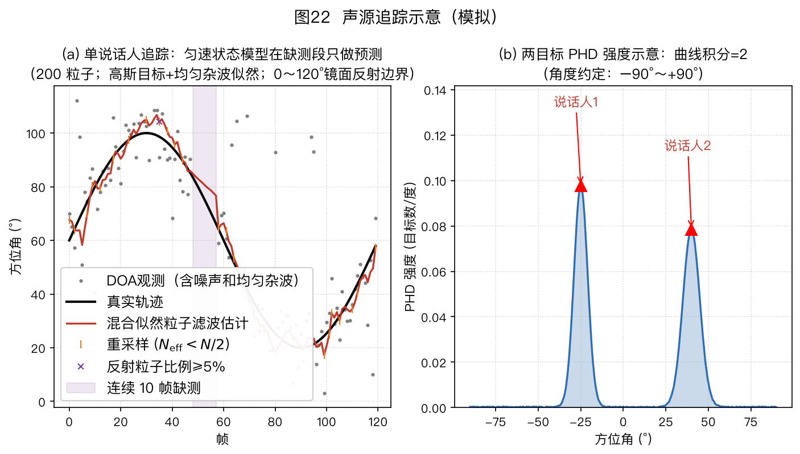
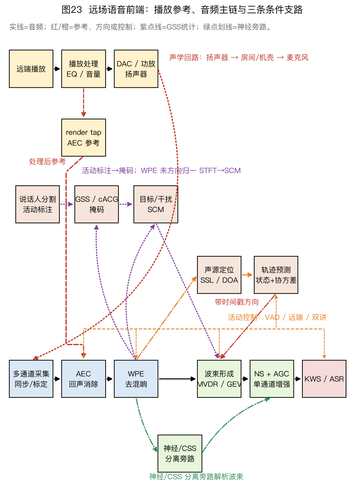

> ⚠️ 本篇是教程正文第 9 章（正文共 11 章，另有附录 A/B），可独立阅读，前后篇见下方导航。
>
> 🏠 首页导读：[`00_overview.md`](./00_overview.md) ｜ 上一篇：[08_speech-separation.md](./08_speech-separation.md) ｜ 下一篇：[10_engineering-practice.md](./10_engineering-practice.md)

---

## 9. 声源追踪

### 9.1 问题与声学特殊性

声源追踪持续估计运动声源状态 $\vec{s}_t=[\theta_t,\dot\theta_t,\ddot\theta_t]^\top$，其中三项分别为角度、角速度和角加速度。它把含噪且可能间断的逐帧定位结果融合成连续轨迹，再为波束形成提供抖动较小的因果方向估计。[LOCATA 声源定位与追踪挑战](https://www.locata.lms.tf.fau.de/ "citation")包含静止或运动的声源与阵列录音，并提供光学动捕真值；使用时要按任务编号区分单源/多源、静止/运动和阵列配置，数据选择的一般原则见 §10.6。

声学追踪有四个特点：

- 说话人停顿会造成间歇观测，需要语音活动检测（Voice Activity Detection，VAD）门控和轨迹维持；
- 混响会产生非高斯误差和野点；
- 声源数会随时间变化；
- 到达方向（Direction of Arrival，DOA）与笛卡尔位置之间是非线性关系。

若状态为平面位置与速度 $[x,y,\dot x,\dot y]$，阵列中心为 $(x_0,y_0)$，则观测函数为 $\theta=\operatorname{atan2}(y-y_0,x-x_0)$。

单个固定阵列的一次方位观测不能确定距离。令阵列中心为 $(0,0)$，声源在 $(1\ \mathrm m,1\ \mathrm m)$ 与 $(2\ \mathrm m,2\ \mathrm m)$ 时都得到 $45^\circ$；沿同一射线缩放位置不会改变 `atan2` 的结果。

连续仅测方位观测只有在已知运动约束和足够的阵列—声源相对运动使系统可观测时，才可能逐步估计距离。否则，即使用扩展卡尔曼滤波（Extended Kalman Filter，EKF）或无迹卡尔曼滤波（Unscented Kalman Filter，UKF），径向位置仍不能由滤波器自行产生。

位置级追踪通常还要引入已知中心不同的多个阵列、到达时间差（Time Difference of Arrival，TDOA）或距离观测，或利用满足可观测条件的移动阵列轨迹。[仅测方位可观测性分析](https://doi.org/10.1080/00207178908559665 "citation")。

EKF 用该观测函数的雅可比做一阶线性化。标准对称或缩放无迹变换的 UKF 通常传播 $2L+1$ 个 sigma 点；对位置—速度状态 $[x,y,\dot x,\dot y]^\top$，状态维数 $L=4$，因此是 9 个点。单纯方位—角速度状态只有 $L=2$，对应 5 个点。也有单纯形、球面径向等减少点数的变体，不能把 $2L+1$ 写成所有 UKF 的定义。近距离或声源越过阵列附近时非线性更强，应比较 UKF、粒子滤波或其他非线性方法，而不是直接套用线性卡尔曼滤波（Kalman Filter，KF）。

### 9.2 单目标追踪

状态与观测模型写为

$$\vec{s}_t=\mathbf F\vec{s}_{t-1}+\vec v_t,\qquad \vec z_t=\mathbf H\vec s_t+\vec w_t\text{。}\tag{9-1}$$

其中 $\mathbf F$ 描述匀速或匀加速运动，$\vec v_t$ 是未建模运动造成的过程噪声。若状态维数为 $d$、观测维数为 $p$，则过程噪声协方差 $\mathbf Q=E[\vec v_t\vec v_t^\top]\in\mathbb R^{d\times d}$，观测噪声协方差 $\mathbf R=E[\vec w_t\vec w_t^\top]\in\mathbb R^{p\times p}$。

协方差元素的单位由对应状态分量相乘决定。例如 $[\theta,\dot\theta]^\top$ 的对角线单位分别是 $\mathrm{deg}^2$ 和 $(\mathrm{deg/frame})^2$。若定位器只输出角度，$\vec z_t$ 退化为标量 $\theta_t^{obs}$，$\vec w_t$ 是观测噪声，$\mathbf R$ 也退化为角度方差。

三维状态时 $\mathbf H=[1,0,0]$；下文二维简化状态 $[\theta,\dot\theta]^\top$ 使用 $\mathbf H=[1,0]$。

贝叶斯递推包含预测和更新。预测阶段依据运动模型外推状态，并增加因过程噪声带来的不确定度；更新阶段用观测与预测之差，即新息，修正状态和协方差。在线性高斯假设下，卡尔曼滤波给出这两个阶段的闭式递推。

**卡尔曼滤波（KF）的五步递推**（状态取 [角度, 角速度]）：

1. **预测状态**：

    $$\hat{\vec{s}}^-_t = \mathbf{F}\hat{\vec{s}}_{t-1}\text{。}\tag{9-2}$$

2. **预测协方差**：

    $$\mathbf{P}^-_t = \mathbf{F}\mathbf{P}_{t-1}\mathbf{F}^\top + \mathbf{Q}\text{。}\tag{9-3}$$

    $\mathbf F$ 先把上一帧协方差传播到当前状态，$\mathbf Q$ 再加入未建模运动的过程噪声。不能据此断言任意 $\mathbf F$ 下每个协方差元素都必然增大；本章的无观测匀速数例中，角度方差会增大。

3. **计算卡尔曼增益**：

    $$\mathbf{K}_t = \mathbf{P}^-_t\mathbf{H}^\top(\mathbf{H}\mathbf{P}^-_t\mathbf{H}^\top + \mathbf{R})^{-1}\text{。}\tag{9-4}$$

    $\mathbf R$ 是式(9-1)定义的观测噪声协方差。观测噪声较小时增益增大，更新更依赖观测；预测协方差较小时增益减小，更新更依赖运动模型。

4. **更新状态**：

    $$\hat{\vec{s}}_t = \hat{\vec{s}}^-_t + \mathbf{K}_t\big(\theta^{obs}_t - \mathbf{H}\hat{\vec{s}}^-_t\big)\text{。}\tag{9-5}$$

    括号里的差称为新息（innovation），即观测与预测之差。

5. **更新协方差**：

    $$\mathbf{P}_t = (\mathbf{I}-\mathbf{K}_t\mathbf{H})\mathbf{P}^-_t\text{。}\tag{9-6}$$

方位角跨越表示区间边界时，新息不能直接相减。若角度约定为 $[-180^\circ,180^\circ)$，定义

$$\operatorname{wrap}_{180}(\alpha)=((\alpha+180^\circ)\bmod 360^\circ)-180^\circ\text{。}\tag{9-7}$$

并在第 4 步使用 $\operatorname{wrap}_{180}(\theta_t^{obs}-\mathbf H\hat{\vec s}_t^-)$。预测和更新完成后，还应把状态中的角度分量按式(9-7)映射回同一表示区间；角速度等非角度分量不做环绕。

例如预测为 $+179^\circ$、观测为 $-179^\circ$，直接相减得到 $-358^\circ$，最短圆周角差却是 $+2^\circ$。不做环绕会让滤波器沿错误方向大幅更新，门控也可能把正确观测判成野点。

若设备只搜索一个不跨边界的有限扇区，则应使用该扇区的边界模型，不能把 $-180^\circ$ 与 $+180^\circ$ 自动视为相邻。

式(9-6)便于手算；浮点实现可使用数值上更稳健的 Joseph 形式

$$\mathbf P_t=(\mathbf I-\mathbf K_t\mathbf H)\mathbf P_t^-(\mathbf I-\mathbf K_t\mathbf H)^\top+\mathbf K_t\mathbf R\mathbf K_t^\top\text{。}\tag{9-8}$$

式(9-6)与式(9-8)在精确算术和标准卡尔曼增益下等价。Joseph 形式把两个半正定项相加，更不容易因舍入误差得到不对称或负方差；实现中仍应检查 $\mathbf P_t$ 的对称性和最小特征值。

**算例 9-1：卡尔曼滤波单步数值例（跟住一个正在转头的说话人）**

下面用一组数值复算式(9-2)至式(9-6)。状态向量取 §9.1 三维状态的二维简化版 $\vec{s}=[\theta,\dot\theta]^{\top}$，单位分别为度和度/帧。该模型省略加速度，适合运动较平缓的示例；频繁机动时可改用含加速度的模型或后文的 IMM。已知：

- 上一帧估计：$\hat{\vec{s}}_{t-1}=[30,\ 0.5]^{\top}$（目标在 30°，每帧向右走 0.5°）；
- 上一帧不确定度：$\mathbf{P}_{t-1}=\begin{bmatrix}4&0\\0&0.25\end{bmatrix}$（角度方差 4°²，即标准差 2°；角速度方差 0.25）；
- 状态转移矩阵（匀速模型）：$\mathbf{F}=\begin{bmatrix}1&1\\0&1\end{bmatrix}$（“新角度 = 旧角度 + 1 帧 × 角速度，角速度不变”的矩阵写法）；
- 过程噪声：$\mathbf{Q}=\begin{bmatrix}0.1&0\\0&0.01\end{bmatrix}$（“目标其实会乱动”的程度，$\mathbf{Q}$ 越大滤波器越不敢信自己的预测）；
- 观测矩阵：$\mathbf{H}=[1,\ 0]$（DOA 算法只报角度，不报角速度）；
- 本帧观测：$\theta^{obs}_t=32°$；观测噪声 $\mathbf{R}=25$（标准差 5°，反映单帧 DOA 估计相当粗糙）。

**第 1 步：预测** $\hat{\vec{s}}^-_t=\mathbf{F}\hat{\vec{s}}_{t-1}$

$$\hat{\vec{s}}^-_t=\begin{bmatrix}1&1\\0&1\end{bmatrix}\begin{bmatrix}30\\0.5\end{bmatrix}=\begin{bmatrix}1\times30+1\times0.5\\0\times30+1\times0.5\end{bmatrix}=\begin{bmatrix}30.5\\0.5\end{bmatrix}$$

“他上一帧在 30°、每帧走 0.5°，这帧大概到 30.5°。”

**第 2 步：预测的不确定度** $\mathbf{P}^-_t=\mathbf{F}\mathbf{P}_{t-1}\mathbf{F}^{\top}+\mathbf{Q}$

先算 $\mathbf{F}\mathbf{P}_{t-1}=\begin{bmatrix}1&1\\0&1\end{bmatrix}\begin{bmatrix}4&0\\0&0.25\end{bmatrix}=\begin{bmatrix}4&0.25\\0&0.25\end{bmatrix}$（第一行：$1\times4+1\times0=4$，$1\times0+1\times0.25=0.25$；第二行照算）。

再乘 $\mathbf{F}^{\top}=\begin{bmatrix}1&0\\1&1\end{bmatrix}$：

$$\begin{aligned}
\mathbf{F}\mathbf{P}_{t-1}\mathbf{F}^{\top}
&=\begin{bmatrix}4&0.25\\0&0.25\end{bmatrix}\begin{bmatrix}1&0\\1&1\end{bmatrix}\\
&=\begin{bmatrix}4\times1+0.25\times1 & 4\times0+0.25\times1\\ 0\times1+0.25\times1 & 0\times0+0.25\times1\end{bmatrix}\\
&=\begin{bmatrix}4.25&0.25\\0.25&0.25\end{bmatrix}.
\end{aligned}$$

左上角从 4 增加到 4.25，因为角速度的不确定度会在预测后传播到角度。再加上 $\mathbf Q$：

$$\mathbf{P}^-_t=\begin{bmatrix}4.25&0.25\\0.25&0.25\end{bmatrix}+\begin{bmatrix}0.1&0\\0&0.01\end{bmatrix}=\begin{bmatrix}4.35&0.25\\0.25&0.26\end{bmatrix}$$

即预测的角度不确定度为标准差 $\sqrt{4.35}\approx2.09°$。

**第 3 步：卡尔曼增益** $\mathbf{K}_t=\mathbf{P}^-_t\mathbf{H}^{\top}(\mathbf{H}\mathbf{P}^-_t\mathbf{H}^{\top}+\mathbf{R})^{-1}$

$\mathbf{H}\mathbf{P}^-_t\mathbf{H}^{\top}$ 只是取出 $\mathbf{P}^-_t$ 的左上角元素 $4.35$（因为 $\mathbf{H}=[1,0]$ 起到“挑出角度分量”的作用），于是分母是标量：

$$\mathbf{H}\mathbf{P}^-_t\mathbf{H}^{\top}+\mathbf{R}=4.35+25=29.35$$

分子 $\mathbf{P}^-_t\mathbf{H}^{\top}=\begin{bmatrix}4.35&0.25\\0.25&0.26\end{bmatrix}\begin{bmatrix}1\\0\end{bmatrix}=\begin{bmatrix}4.35\\0.25\end{bmatrix}$（取 $\mathbf{P}^-_t$ 的第一列）。

$$\mathbf{K}_t=\frac{1}{29.35}\begin{bmatrix}4.35\\0.25\end{bmatrix}=\begin{bmatrix}0.148\\0.0085\end{bmatrix}$$

中间值分别为 0.1482 和 0.00852，这里保留三位和两位有效数字。

增益是 $2\times1$ 向量：$K_1=0.148$（角度分量信观测的比例）、$K_2=0.0085$（角速度分量分到的一点残差信息——观测虽只报角度，但角度残差里也藏着“速度估偏了”的线索）。

**$K_1\approx0.148$ 表示角度更新量取新息的约 14.8%**。观测噪声方差 25 大于预测角度方差 4.35，因此估计更接近预测值。若 $\mathbf R$ 减小，$K_1$ 会增大，观测对更新的影响也会增加。

**第 4 步：更新** $\hat{\vec{s}}_t=\hat{\vec{s}}^-_t+\mathbf{K}_t(\theta^{obs}_t-\mathbf{H}\hat{\vec{s}}^-_t)$

新息（innovation，观测与预测之差）为 $\theta^{obs}_t-\mathbf{H}\hat{\vec{s}}^-_t=32-30.5=1.5°$。

$$\hat{\vec{s}}_t=\begin{bmatrix}30.5\\0.5\end{bmatrix}+\begin{bmatrix}0.148\\0.0085\end{bmatrix}\times1.5=\begin{bmatrix}30.5+0.222\\0.5+0.0128\end{bmatrix}=\begin{bmatrix}30.72\\0.513\end{bmatrix}$$

角度由预测值向观测值修正约 0.22°，角速度更新为 0.513°/帧。最终角度 30.72° 位于预测值 30.5° 与观测值 32° 之间，并因 $K_1$ 较小而更接近预测值。

**第 5 步：更新的不确定度** $\mathbf{P}_t=(\mathbf{I}-\mathbf{K}_t\mathbf{H})\mathbf{P}^-_t$

先算 $\mathbf{K}_t\mathbf{H}=\begin{bmatrix}0.148\\0.0085\end{bmatrix}[1,\ 0]=\begin{bmatrix}0.148&0\\0.0085&0\end{bmatrix}$，于是

$$\mathbf{I}-\mathbf{K}_t\mathbf{H}=\begin{bmatrix}1-0.148&0\\-0.0085&1\end{bmatrix}=\begin{bmatrix}0.852&0\\-0.0085&1\end{bmatrix}$$

$$\mathbf{P}_t=\begin{bmatrix}0.852&0\\-0.0085&1\end{bmatrix}\begin{bmatrix}4.35&0.25\\0.25&0.26\end{bmatrix}=\begin{bmatrix}3.705&0.213\\0.213&0.258\end{bmatrix}$$

（第一行：$0.852\times4.35=3.705$，$0.852\times0.25=0.213$；第二行：$-0.0085\times4.35+1\times0.25=0.213$，$-0.0085\times0.25+1\times0.26=0.258$。）

角度方差从 4.35 降到 3.71（标准差约 1.93°）。在线性模型、协方差和卡尔曼增益满足本节条件时，观测更新降低或保持估计协方差；错误观测或错误噪声模型仍可能让真实误差增大。

若下一帧说话人停顿没有观测，就只做第 1、2 步：本例角度方差再次增大，波束指向维持外推，这就是“静默保持”（§9.4）。

算例 9-1说明了单步卡尔曼递推。下表比较常见单目标追踪方法的假设、计算量和适用条件。其中，α-β 滤波器所说的“免 Riccati 迭代”，是把第 2、3、5 步的不确定度递推（Riccati 方程）换成固定增益。

| 方法 | 原理 | 优点 | 缺点 | 适用 |
|---|---|---|---|---|
| 滑动平均/中值/直方图众数 | 对 DOA 序列低通 | 结构简单，不需递推协方差 | 隐含局部平稳假设；延迟大、跟不上机动、多源混杂 | 目标缓慢、观测较密时的基线 |
| α-β / α-β-γ | 稳态增益卡尔曼 | 免 Riccati 迭代 | 增益非最优 | 嵌入式 |
| **卡尔曼滤波 KF** | 高斯线性贝叶斯递推（预测+新息加权更新） | 在线性高斯模型正确时得到最小均方误差估计 | 稠密实现随状态维数 $d$、观测维数 $p$ 约为 $O(d^3+p^3)$；标量 DOA 更新可更低，但仍需在目标硬件计时；抗野点差、需调 Q/R | 观测质量较好且模型近似成立 |
| EKF（扩展卡尔曼滤波）/UKF（无迹卡尔曼滤波） | 一阶线性化/无迹变换处理非线性 | 可处理位置到角度的非线性观测 | EKF 对线性化误差敏感；标准对称/缩放 UKF 常传播 $2L+1$ 个 sigma 点，其他变体点数不同 | 分布式阵列位置级追踪 |
| IMM 交互多模型 | 静止、匀速、加速等多个运动模型各自运行 KF，再按新息似然加权融合 | 可在多个预设运动模式之间平滑切换 | 计算量随模型数增加；未包含的运动模式仍会失配，且需标定模型转移概率 | 包含启动、停止和匀速段的机动场景 |
| **粒子滤波（Particle Filter，PF）/序贯重要性重采样（Sequential Importance Resampling，SIR）** | 带权粒子近似后验；预测、加权、按需重采样 | 能表示非线性、非高斯和多峰后验 | 鲁棒性取决于似然与杂波模型；会权重退化和样本贫化 | 观测多峰或运动模型明显非线性 |

**IMM 的模型切换**：IMM 并行运行静止、匀速或加速等运动模型，再根据各模型的新息似然更新权重。它适合包含启动、停止和匀速段的轨迹。

两模型例子可使用静止与匀速模型；转移矩阵的对角元素表示保持当前运动模式的概率。IMM 的转移概率和各模型过程噪声需要用目标运动数据标定。0.95 或 0.9 只能作为示例，实际数值不能脱离帧率和目标运动数据直接照搬。

**EKF 与 UKF**：EKF 对 $\theta=\operatorname{atan2}(y-y_0,x-x_0)$ 求雅可比，并在当前估计附近做一阶线性化；估计偏离真实状态较大时，线性化误差可能导致发散。标准对称或缩放 UKF 不显式求导，而是将 $2L+1$ 个 sigma 点通过原始非线性观测函数，再重构均值与协方差；减少 sigma 点的变体使用不同构造。计算量要按状态维数、sigma 点数、观测维数和矩阵实现估算，不能只按“UKF”名称排序。

**算例 9-2：10 个粒子的一轮加权与重采样**

卡尔曼滤波用均值和协方差表示单峰高斯后验。**粒子滤波**（particle filter，PF）用 $N$ 个带权样本近似后验，可以表达偏斜或多峰分布。它并不会自动抵抗观测野点：若似然模型把野点当成高置信观测，粒子权重仍会被错误观测拉偏。鲁棒性来自观测门控、重尾似然或“目标加均匀杂波”的混合似然。下面用 10 个粒子演示加权与重采样。

设本帧 10 个粒子的角度猜测（单位：度）为：

$$x_1,\dots,x_{10}=[25,\ 27,\ 28,\ 30,\ 30,\ 31,\ 32,\ 33,\ 35,\ 40]$$

本帧观测 $\theta^{obs}=31°$，观测噪声标准差 $\sigma=5°$（方差 $\sigma^2=25$）。

**第 1 步：根据观测似然计算权重**

每个粒子的权重用高斯似然：离观测越近分越高，

$$w_i=\exp\!\left(-\frac{(x_i-\theta^{obs})^2}{2\sigma^2}\right)=\exp\!\left(-\frac{(x_i-31)^2}{50}\right)$$

逐个计算（$(x_i-31)^2$ 先列出来）：

| 粒子 $x_i$ | $(x_i-31)^2$ | $w_i=\exp(-(x_i-31)^2/50)$ |
|---|---|---|
| 25 | 36 | $\exp(-0.72)=0.4868$ |
| 27 | 16 | $\exp(-0.32)=0.7261$ |
| 28 | 9 | $\exp(-0.18)=0.8353$ |
| 30 | 1 | $\exp(-0.02)=0.9802$ |
| 30 | 1 | $\exp(-0.02)=0.9802$ |
| 31 | 0 | $\exp(0)=1.0000$ |
| 32 | 1 | $\exp(-0.02)=0.9802$ |
| 33 | 4 | $\exp(-0.08)=0.9231$ |
| 35 | 16 | $\exp(-0.32)=0.7261$ |
| 40 | 81 | $\exp(-1.62)=0.1979$ |

权重和为

$$\begin{aligned}
\sum_{i=1}^{10}w_i
&=0.4868+0.7261+0.8353+0.9802+0.9802\\
&\quad+1.0000+0.9802+0.9231+0.7261+0.1979\\
&=7.8359.
\end{aligned}$$

**第 2 步：归一化权重**

$$\tilde w_i=\frac{w_i}{7.8359}$$

逐项归一化后得到：

| 粒子序号 $i$ | 角度 $x_i$（度） | 归一化权重 $\tilde w_i$ |
|---|---|---|
| 1 | 25 | 0.0621 |
| 2 | 27 | 0.0927 |
| 3 | 28 | 0.1066 |
| 4 | 30 | 0.1251 |
| 5 | 30 | 0.1251 |
| 6 | 31 | 0.1276 |
| 7 | 32 | 0.1251 |
| 8 | 33 | 0.1178 |
| 9 | 35 | 0.0927 |
| 10 | 40 | 0.0253 |

校验：归一化权重之和为 1。40° 是一个远离当前观测的**粒子**，不是观测野点；它的权重较小，只说明当前高斯似然会压低不符合观测的候选状态，不能证明粒子滤波对错误观测鲁棒。

**第 3 步：计算有效粒子数** $N_{eff}$

$$\begin{aligned}
N_{eff}&=\frac{1}{\sum_{i=1}^{10}\tilde w_i^2}\\
&=\frac{1}{0.0621^2+0.0927^2+0.1066^2+0.1251^2+\cdots+0.0253^2}\\
&=\frac{1}{0.1101}\approx9.08.
\end{aligned}$$

若 10 个粒子权重相等，$N_{eff}=10$；若全部权重集中在一个粒子上，$N_{eff}=1$，称为**粒子退化**。本例得到 9.08。常见实现会在 $N_{eff}$ 低于给定阈值时触发重采样，例如 $N/2$；阈值需要结合粒子数和任务验证。

**第 4 步：在重采样前计算本帧估计**

$$\begin{aligned}
\hat\theta&=\sum_{i=1}^{10}\tilde w_i\,x_i\\
&=0.0621\times25+0.0927\times27+0.1066\times28\\
&\quad+0.1251\times30+\cdots+0.0253\times40\\
&\approx30.65°.
\end{aligned}$$

不加权的平均为 31.1°，加权估计约为 30.65°。这个后验均值必须用重采样前的粒子和归一化权重计算。重采样后权重重置为 $1/N$，不能把旧权重再乘到新粒子上；重采样后取均值只是在有限样本下近似同一后验。

**第 5 步：为演示算法，强制执行一次系统重采样**。本例 $N_{eff}=9.08>N/2=5$，按上一段的示例阈值本来不会触发重采样。下面只为展示系统重采样的索引过程而人为执行一次，不能把它当作阈值判决结果。

系统重采样按归一化权重重新抽取 10 个粒子，允许高权重粒子重复出现，并把新权重统一重置为 $1/10$。

先计算归一化权重的累积和：

| 粒子序号 $i$ | 累积和 $\sum_{j=1}^{i}\tilde w_j$ |
|---|---|
| 1 | 0.0621 |
| 2 | 0.1548 |
| 3 | 0.2614 |
| 4 | 0.3865 |
| 5 | 0.5116 |
| 6 | 0.6392 |
| 7 | 0.7643 |
| 8 | 0.8821 |
| 9 | 0.9747 |
| 10 | 1.0000 |

再从 $[0,0.1)$ 取起点 $u_0=0.0637$，以 0.1 为间隔得到 10 个采样点。对应的新粒子群为：

$$[27,\ 28,\ 30,\ 30,\ 30,\ 31,\ 32,\ 32,\ 33,\ 35]$$

30° 和 32° 的粒子被重复抽取，25° 和 40° 的粒子未被抽中。重采样是随机过程，不按单个粒子的权重机械排序；31° 虽有最高单粒子权重，本次仍只保留一份。下一帧先按运动模型传播粒子，再根据新观测重新计算权重。

粒子滤波依次执行状态传播、似然加权、归一化和按需重采样。它能表示多峰后验，但观测野点仍需门控或杂波似然处理。

抗野点技巧包括观测门控、混合似然和辅助粒子滤波（Auxiliary Particle Filter，APF）。门控阈值不能只照搬固定的 $3\sigma$，应结合观测误差分布和漏检代价标定。

图22(a) 为序贯重要性重采样粒子滤波（Sequential Importance Resampling Particle Filter，SIR-PF）递推估计 DOA 的本书仿真。配置如下：

- **真值与观测**：真值是 $60^\circ+40^\circ\sin(2\pi t/120)$ 的正弦轨迹；逐帧观测加标准差 $7^\circ$ 的高斯噪声，并将约 20% 帧替换为 $0^\circ$～$120^\circ$ 均匀野点；
- **缺测**：第 48～57 帧被置为缺测，这 10 帧只执行状态预测；
- **滤波器**：使用 200 个粒子和“高斯目标 + 均匀杂波”混合似然，均匀杂波权重为 0.1；
- **初始化与边界**：初始角度粒子在允许扇区内均匀采样，不读取未来第一个有效观测。状态只允许落在 $[0^\circ,120^\circ]$ 有限扇区，越界粒子按扇区端点作镜面反射。

镜面反射是便于展示的玩具边界，不是圆周角的 $360^\circ$ 环绕，也不代表真实墙面反射。

图22（a）中，灰点为逐帧 DOA 观测，黑线为正弦真值轨迹，红线为粒子滤波估计，紫色阴影标出连续 10 帧缺测，橙色竖线表示有效粒子数低于 $N/2$ 后执行了系统重采样。紫色叉号只标出该帧预测后至少 5% 粒子越界并被镜面反射的时刻，避免用“任一粒子越界”放大单个尾部样本。

缺测段没有似然更新，轨迹只由匀速状态模型与过程噪声外推；$0^\circ$ 与 $120^\circ$ 是采用反射规则的有限扇区边界。

图22（b）在 −25° 和 +40° 附近设置两个强度峰，用于说明多目标强度函数。峰数只能近似用于提取人数，严格定义见 §9.3。

单目标追踪由预测和观测更新组成。线性高斯条件下可使用卡尔曼滤波；非线性、多峰或重尾观测可考虑 UKF 或粒子滤波。粒子滤波仍需门控或杂波似然处理野点，IMM 用于多运动模型切换，VAD 用于控制无观测时的更新。

### 9.3 多目标追踪

多目标追踪需要同时解决观测与轨迹的**数据关联**，并估计当前的**声源数量**。

| 方法族 | 代表 | 思想 | 声学表现 |
|---|---|---|---|
| 数据关联+单目标滤波 | 联合概率数据关联（Joint Probabilistic Data Association，JPDA）、多假设跟踪（Multiple Hypothesis Tracking，MHT） | 计算观测属于各轨迹的概率或假设树 | 假设数可能随观测和轨迹数快速增加 |
| 多目标粒子滤波 | Brutti et al. 2010 | 每目标一簇粒子 + 数据关联 | 计算量、数据关联和目标数先验都需按实现验证 |
| **随机有限集（Random Finite Set，RFS）/概率假设密度（Probability Hypothesis Density，PHD）滤波** | PHD、势概率假设密度（Cardinalized PHD，CPHD）、序贯蒙特卡洛 PHD（Sequential Monte Carlo PHD，SMC-PHD） | 传播目标集合的一阶强度；积分给期望目标数，峰用于提取状态 | 避免显式枚举关联，但不保留身份；峰提取和参数设置影响结果 [Liu et al. 2018](https://arxiv.org/pdf/1812.01570 "citation") |
| 标记多伯努利（Labeled Multi-Bernoulli，LMB）/δ-广义标记多伯努利（delta-Generalized Labeled Multi-Bernoulli，δ-GLMB） | 带标签的 RFS | 为目标维护标签、输出带身份轨迹 | 标签管理、假设数和计算量随具体实现而变 |
| 检测前追踪（Track-Before-Detect，TBD） | 对经校准的定位谱或似然场直接递推 | 不先把弱峰硬切成离散观测，可保留阈值以下的证据 | 输入谱必须有跨帧一致的尺度与杂波模型；未经校准的 DNN 分数不能直接当似然 |
| 序列神经网络 | 循环神经网络（Recurrent Neural Network，RNN）/Transformer 处理定位后验序列 | 可学习时间平滑与活动模式 | 仍需训练数据；是否输出稳定身份取决于标签和损失 |

**三帧关联辅助例子**。设两条匀速轨迹的预测角分别为 A：$20^\circ,30^\circ,40^\circ$，B：$60^\circ,50^\circ,40^\circ$；三帧观测依次为 $(22^\circ,58^\circ)$、$(15^\circ,31^\circ,48^\circ)$、$(39^\circ,41^\circ)$。假设独立高斯角度误差的标准差 $\sigma=3^\circ$。为先算清最小 JPDA 归一化，暂时假设第一、三帧没有漏检和杂波，且两个全局关联事件先验相同。

第一帧“顺接”事件的似然正比于 $\exp[-(2^2+(-2)^2)/(2\times3^2)]=e^{-8/18}\approx0.641$；“交换”事件的残差为 $38^\circ,-38^\circ$，似然约为 $e^{-2888/18}$，归一化后的顺接概率在所示精度下为 1。

第三帧两条预测都为 $40^\circ$，两个交换事件的残差平方和都为 $(-1)^2+1^2=2$，似然都为 $e^{-2/18}\approx0.895$。归一化后两个全局事件各为 0.5，因此每条轨迹关联到 $39^\circ$ 或 $41^\circ$ 的边缘概率也各为 0.5。

第二帧多出的 $15^\circ$ 只有在给定检测概率、杂波空间密度和漏检模型后才能得到完整概率；仅比较残差时，近邻两对的代价为 $5/18\approx0.278$，但这不是完整 JPDA 后验。

JPDA 在每帧枚举满足一对一约束、漏检和杂波模型的联合事件，再把事件概率边缘化到每条轨迹；交叉处的两条轨迹可能因共享两个观测而向同一均值靠拢。MHT 则把第三帧的两种全局历史都暂时保留，等后续观测拉开后再按累计似然和剪枝规则决策，因此更能延迟身份决定，但假设树会增长。这个例子只比较关联机制；实际概率还必须包含检测概率、杂波强度和门控归一化。[JPDA 原始论文](https://doi.org/10.1109/JOE.1983.1145560)、[MHT 原始论文](https://doi.org/10.1109/TAC.1979.1102177)。

LMB/δ-GLMB 为目标维护标签，可输出带身份的轨迹。检测前追踪直接递推定位谱，保留未越过检测阈值的弱证据。

把连续定位谱接入 TBD 前，应先在独立验证集上校准“谱值—似然或似然比”的映射，并固定角度网格、归一化、温度缩放、声源数先验、信噪比与混响条件。网络 softmax 分数只在其类别集合内归一化，不能自动跨帧比较；出生、存活、漏检和杂波参数也要与同一标定口径匹配。若这些条件变化，应重新标定或把分数仅作为特征输入，而不是直接解释为概率。

活动耦合笛卡尔 DOA（Activity-Coupled Cartesian DOA，ACCDOA）把向量方向编码为 DOA、向量长度编码为活动强度。它本身是逐帧声事件定位与检测的输出表示，不等同于追踪器；只有结合时序模型、平滑和身份关联后，才形成轨迹。

PHD 强度 $D_t(x)$ 也不是“某处有人”的普通概率密度。它在区域 $A$ 上的积分表示该区域内目标数的期望，因而总目标数估计来自 $\hat N_t=\int D_t(x)\,dx$，再按整数规则取值。目标位置通常从强度峰或聚类中心提取；“峰数就是人数”只是实现近似。PHD 避免显式枚举观测—目标关联，但只传播一阶矩，不保留目标身份，也不能完整描述目标间相关性。

下面的递推针对标准独立点目标模型：各目标独立演化，检测事件相互独立，每个被检测目标每帧至多产生一条观测，杂波是与目标观测独立的 Poisson 随机有限集，并忽略由既有目标衍生新目标（spawning）的过程，只用 $\gamma_t$ 表示自发出生；为得到下面的标准闭式更新，还采用 Poisson 型预测多目标分布近似。PHD 的预测式为

$$D_{t|t-1}(x)=\int p_S(x')f_t(x\mid x')D_{t-1}(x')\,dx'+\gamma_t(x)\text{。}\tag{9-9}$$

其中 $p_S$ 是存活概率，$f_t$ 是状态转移密度，$\gamma_t$ 是新生目标强度。给定本帧观测集合 $Z_t$，标准 PHD 更新为

$$
\begin{aligned}
D_t(x)&=[1-p_D(x)]D_{t|t-1}(x)\\
&\quad+\sum_{z\in Z_t}
\frac{p_D(x)g_t(z\mid x)D_{t|t-1}(x)}
{\kappa_t(z)+\int p_D(\xi)g_t(z\mid\xi)D_{t|t-1}(\xi)\,d\xi}.
\end{aligned}
\tag{9-10}$$

$p_D$ 是检测概率，$g_t(z\mid x)$ 是目标在状态 $x$ 时产生观测 $z$ 的似然，$\kappa_t(z)$ 是杂波强度。第一项保留可能漏检的目标；求和中的每个分母比较“该观测来自杂波”与“来自任一目标”的解释，因此杂波强度越大，单条观测增加的目标强度越少。

用两个离散角度网格做手算。预测强度质量为 $D^-=[0.8,0.6]$，表示两个网格合计期望目标数 1.4；取 $p_D=1$，本帧只有一个观测，其似然为 $g=[0.9,0.1]$，杂波强度为 0.1。分母是 $0.1+0.9\times0.8+0.1\times0.6=0.88$，更新后两个网格的强度质量分别为 $0.72/0.88\approx0.818$ 和 $0.06/0.88\approx0.068$，总和约 0.886。

总和小于 1，是因为这条观测仍有一部分概率由杂波解释；若 $p_D<1$，还要加上第一项的漏检质量。

这个离散例子只解释更新各项，不能替代连续状态中的积分、峰提取和轨迹身份管理。相关混响峰不满足独立杂波假设，扩展目标还可能在一帧产生多条观测；这两类情况需修改似然或杂波模型，或采用相应的扩展目标、多目标滤波模型，不能直接套用上式。

粒子或高斯混合只是表示和计算强度函数的不同方法。目标数由强度积分估计，位置再从峰或聚类中心提取。[PHD 原始论文](https://doi.org/10.1109/TAES.2003.1261119 "citation")；音频视觉粒子实现见 [Liu et al. 2019](https://openresearch.surrey.ac.uk/esploro/outputs/journalArticle/Audio-Visual-Particle-Flow-SMC-PHD-Filtering-for/99513411302346 "citation")。

多目标追踪还要估计观测与轨迹的对应关系以及目标数。JPDA 和 MHT 显式处理关联；PHD 传播随机有限集的一阶强度；LMB 保留目标标签；检测前追踪保留未越过检测阈值的弱证据。最优子模式分配距离（Optimal Subpattern Assignment，OSPA）同时度量定位误差和目标数误差，但不评价身份连续性。

**可执行单目标基线与高级算法边界。** [`codes/array_tutorial/tracking.py`](../codes/array_tutorial/tracking.py) 提供常速度角度 Kalman 滤波器、$[-180^\circ,180^\circ)$ 环绕、系统重采样和圆周角 SIR 粒子滤波器。

`ConstantVelocityKalman` 的状态单位是 `[度, 度/秒]`；每帧先用实际秒数 `dt` 调用 `predict()`，有观测时再以角度方差调用 `update()`，缺测时不调用更新。协方差使用 Joseph 形式。它与算例9-1的“度/帧”不同，比较前应转换状态、转移矩阵及过程噪声单位。

`CircularParticleFilter` 用最短圆周角差的高斯目标项与均匀杂波项混合更新权重，按有效粒子数决定是否系统重采样；它只估计单个圆周角，不包含速度粒子、有限扇区反射或轨迹身份。该高斯项是小角度误差模型，不是一般宽分布的严格环绕正态密度。

联合示例用 `.venv/bin/python -m codes.examples.ch06_09_baselines` 运行，测试见 [`tests/test_codes_aec_wpe_sep_track.py`](../tests/test_codes_aec_wpe_sep_track.py)。测试覆盖 $179^\circ$ 与 $-179^\circ$ 的最短新息、缺测时角度方差增长、Joseph 更新后的对称半正定性、远距离高置信观测的对数权重、退化权重的系统重采样，以及对称后验下未定义的圆周均值。

教学 Kalman 类的过程噪声矩阵 $Q$ 已按一次预测间隔离散化；若 `dt` 改变，不能继续照搬同一个 $Q$。粒子后验的圆周合向量接近零时，代码会明确报错，而不是返回由浮点残差决定的任意角度。

设备只搜索有限扇区时不得使用圆周环绕；还需测试迟到/乱序观测、长缺测、错误时间戳、野点门控、目标交叉、轨迹出生/确认/删除、ID 重用和消息超时。无有效观测时只预测并传播协方差，超过有效期后回到搜索模式，不能把外推方向当作新观测。

进一步的实现可按 FilterPy 和 Stone Soup 的固定版本阅读，源码工作目录、许可和入口由 [`SOURCES.lock.json`](../codes/SOURCES.lock.json) 管理。FilterPy 的 `kalman/EKF.py`、`UKF.py`、`IMM.py` 分别定位非线性更新和运动模型切换；Stone Soup 的 `dataassociator/probability.py::JPDA` 处理联合关联，`updater/pointprocess.py::PHDUpdater` 配合 `mixturereducer/gaussianmixture.py::GaussianMixtureReducer` 完成 GM-PHD 更新与分量合并、剪枝。具体阅读顺序、实验输入和失败情况见[空间处理与追踪研究](../codes/research/01_spatial_and_tracking.md)。

把位置追踪例子改成麦克风方向追踪时，至少要重写三处。观测模型应输出方位角或方向单位向量，不能继续使用二维位置残差；门控距离要使用相应协方差与角度环绕；杂波强度必须与观测空间的测度一致，例如每弧度的预期假峰数。检测概率还要反映说话人静默和定位器漏检，不能直接照搬雷达示例。

GM-PHD 的高斯权重和表示期望目标数，不要求归一到 1。出生分布没有覆盖某个方向时，新目标可能一直不能形成足够强的分量；剪枝阈值过高则会删掉弱源，因此应记录每帧删去的总强度质量。JPDA 也需要明确漏检事件和一对一约束；在两人交叉时，软关联可能混合轨迹，并不自动保持说话人身份。[Stone Soup JPDA 教程源码](https://github.com/dstl/Stone-Soup/blob/main/docs/tutorials/08_JPDATutorial.py "citation")；[GM-PHD 官方教程](https://stonesoup.readthedocs.io/en/v1.9.1/auto_tutorials/filters/GMPHDTutorial.html "citation")，核实于 2026-09-22。

MHT、CPHD、LMB/$\delta$-GLMB 和检测前追踪仍须按具体论文及实现分别审查。某个库的基类说明提到这些家族，不等于该版本已实现全部算法；给 PHD 分量附加临时标签也不等于实现了 GLMB。正式采用前还需验证出生/存活/漏检模型、假设截断、身份切换和运行成本。

### 9.4 定位、追踪与波束形成的接口

在线追踪器向波束形成器提供因果滤波或预测方向和置信度；只有离线算法显式使用当前帧之后的观测回修过去状态时，才称为平滑（smoothing）。若定位又使用波束形成后的信号，两个模块会相互影响，因此需要限制更新速率并处理静默期。

追踪器兼有因果滤波和预测作用：它减小 DOA 抖动，并在目标短时静默时外推方向。图 23 中，定位与追踪只向解析波束形成器提供方向，不直接控制 GSS 掩码；VAD、远端活动和双讲检测通过控制面约束状态更新。

波束方向的变化上限应按帧率、目标最大转速和允许跟随延迟确定。静默超时或唤醒词触发时还需保持或重置状态，避免定位与波束权重相互影响而振荡。

| 追踪输出字段 | 含义与单位 | 消费方必须检查 |
|---|---|---|
| `frame_id` / 坐标系 | 阵列坐标、设备坐标或世界坐标；角度零点与正方向 | 与导向矢量使用同一坐标约定 |
| `measurement_time` | 产生定位观测的采样时刻 | 不可用消息到达时刻替代 |
| `publish_time` | 追踪结果发布时刻 | 用于测量计算与调度延迟 |
| 状态与协方差 | 角度/角速度或位置/速度，以及同维协方差 | 单位、维度、圆周角新息与置信区间 |
| 活动/存在概率 | 当前目标存在或发声的证据 | 阈值、校准集、静默保持策略 |
| `track_id` 与生命周期 | 出生、确认、维持、删除和重用规则 | ID 不能等同于永久说话人身份 |
| `last_update` / 有效期 | 最近一次真实观测更新与允许外推时长 | 超时后保持、降置信度或回搜索模式 |

例如目标角速度为 $30^\circ/\mathrm s$，波束形成器收到的状态比采样时间晚 80 ms；若直接使用旧角度，确定性外推误差可达 $30\times0.080=2.4^\circ$。消费方应使用 `measurement_time` 和角速度外推到实际生效时刻，并把协方差随预测步长增大；超过接口约定的有效期就不能继续把旧方向当作高置信观测。

多目标结果可用最优子模式分配距离（optimal subpattern assignment，OSPA）评价。若真值集 $X$ 有 $m$ 个目标，估计集 $Y$ 有 $n\ge m$ 个目标，截断距离为 $c$，阶数为 $p$，则

$$d_p^{(c)}(X,Y)=\left[\begin{aligned}
&\frac{1}{n}\min_{\pi}\sum_{i=1}^{m}\min\{c,d(x_i,y_{\pi(i)})\}^p\\
&\quad+\frac{c^p(n-m)}{n}
\end{aligned}\right]^{1/p}\text{。}\tag{9-11}$$

式(9-11)先写 $n\ge m$；若 $m>n$，交换 $X,Y$ 的角色，因此距离保持对称。边界约定是 $d_p^{(c)}(\varnothing,\varnothing)=0$；若仅一侧为空、另一侧非空，则距离为 $c$。

第一项是最优配对后的截断定位误差，第二项惩罚目标数不一致，最后还要除以较大的集合大小。

若状态是完整圆周方位，应使用 $d(\theta_1,\theta_2)=\min(|\theta_1-\theta_2|,360^\circ-|\theta_1-\theta_2|)$；图22的 $0^\circ$～$120^\circ$ 有限扇区不是圆周，不能套用环绕距离。

OSPA 不保留身份，所以身份切换要另报身份切换次数（Identity Switch，ID switch）等轨迹指标。

这个定义来自 Schuhmacher、Vo 与 Vo 的 OSPA 原始论文（IEEE TSP 56(8), 2008, pp. 3447–3457，[DOI 10.1109/TSP.2008.920469](https://doi.org/10.1109/TSP.2008.920469 "citation")）。截断距离 $c$ 同时限制单个定位误差并设定漏检/虚警的惩罚尺度，因此比较系统时必须使用相同的 $p$、$c$、坐标和角度环绕约定。

### 本章练习

1. KF 手算＋静默外推：沿用算例 9-1 的末态（估计 $[30.72,\ 0.513]^{\top}$，协方差左上角 3.705）。假设接下来两帧说话人静默、无观测，只做预测不做更新：手算两帧后的角度估计与角度方差，并说明波束应使用哪个方向。

    **答案要点**：每帧角度 $+0.513°$，两帧后约 31.75°；在本题给定的 $\mathbf F$ 与 $\mathbf Q$ 下，角度方差约按 3.705→4.49→5.80 增长。一次预测和两次预测后的完整协方差依次约为

    $$\begin{aligned}
    \text{一次预测：}&\quad\begin{bmatrix}4.49&0.47\\0.47&0.27\end{bmatrix},\\
    \text{两次预测：}&\quad\begin{bmatrix}5.80&0.74\\0.74&0.28\end{bmatrix}.
    \end{aligned}$$

    波束可暂时使用外推值。

    若目标允许的最大角速度为 $\omega_{\max}$，帧间隔为 $\Delta t$，单帧转角限值应与 $\omega_{\max}\Delta t$ 同量级，再根据允许跟随延迟和机械转速标定；不能在没有帧率时固定写成 3～5°/帧。

2. 数据关联二选一：两条轨迹（A 在 20°、B 在 60°），本帧两个观测（22°、58°），JPDA 和最近邻分别如何处理？再加入一个 19° 的杂波假峰，并假设门内观测至多分给一条轨迹、每条轨迹至多取一个观测，比较两种方法。

    **答案要点**：无杂波时，最近邻把 22° 配给 A、58° 配给 B；JPDA 在噪声很小且无其他可行事件时也会让这两对关联概率占优。

    加入 19° 后，硬最近邻会把距离 A 仅 1° 的假峰分给 A，把 58° 分给 B，22° 留作未分配观测。JPDA 不先固定一组配对，而是枚举满足一对一约束、门控、漏检和杂波模型的联合事件，再求每个“轨迹—观测”对的边缘关联概率；A 的更新会综合 19°、22°及漏检事件。

    若只使用高斯角度残差且杂波模型过弱，JPDA 也可能偏向 19°，因此软关联不是自动识别杂波，还要标定检测概率、杂波强度和门限。[JPDA 原始论文](https://doi.org/10.1109/JOE.1983.1145560 "citation")。

3. PHD＋OSPA：某帧从 PHD 强度中提取出 30° 和 70° 两个目标，真值是 32° 处一人。人数估对了吗？取 $p=1$、$c=10°$，算出这一帧的 OSPA。

    **答案要点**：人数估计为 2，真值为 1。最优配对把 30° 与 32° 配在一起，截断定位误差为 2°；多出的 70° 目标产生 10° 的基数惩罚。按较大集合大小 2 归一化，OSPA 为 $(2°+10°)/2=6°$。若把 70° 错配给真值，其定位误差先截断为 10°，结果不会更小。

4. VAD 门控＋波束限速：说话人突然静默 5 帧（无观测），追踪只做预测；第 1 问：WPE、噪声协方差和降噪器的噪声功率各应怎样更新？第 2 问：已知目标最大角速度 $\omega_{\max}$ 和帧间隔 $\Delta t$，5 帧内转角限值如何设定，之后如何处理？

    **答案要点**：静音且参考能量不足时冻结 WPE 系数，避免病态统计；确认无目标语音时，可以更新噪声协方差和降噪器的噪声功率。目标语音活动时则避免把目标泄漏写入噪声统计，WPE 是否更新由其语音活动和矩阵条件共同决定。

    单帧转角限值可以 $\omega_{\max}\Delta t$ 为物理起点，5 帧累计上限为 $5\omega_{\max}\Delta t$；超过保持时间或不确定度阈值后，应降低波束更新置信度或回到搜索模式。

**可运行练习 E09-01～E09-03**

运行 `.venv/bin/python -m codes.examples.exercises_enhancement`，源码见 [`exercises_enhancement.py`](../codes/examples/exercises_enhancement.py)。这三题使用方向数值，不通过左右声道音量模拟阵列定位；后者的声像不能代替麦克风传播时延模型。

- **E09-01：把“每帧”改为“每秒”。** 初态 $[30^\circ,5^\circ/\mathrm s]$，$P=\operatorname{diag}(4,1)$；每 0.1 s 预测一次，采用已为此间隔离散化的 $Q=\operatorname{diag}(0.1,0.01)$。连续两次缺测，求状态和协方差。

    **解答**：每步角度增加 $5\times0.1=0.5^\circ$，两步状态依次是 $[30.5,5]^\top$、$[31,5]^\top$。按式(9-3)得到

    $$\begin{aligned}
    P_1^-&=\begin{bmatrix}4.11&0.1\\0.1&1.01\end{bmatrix},\\
    P_2^-&=\begin{bmatrix}4.2401&0.201\\0.201&1.02\end{bmatrix}.
    \end{aligned}$$

    若误把 5 当成“度/帧”，两帧会外推到 40°。若改采样间隔，还要从声明的运动噪声模型重新离散化 $Q$；本题没有给出可任意换帧率的连续噪声密度。

- **E09-02：跨越 ±180° 时朝哪边更新？** 当前预测为 179°，观测 −179°，预测角度方差和观测方差都为 1，角速度与角度无互协方差。只做一次观测更新。

    **解答**：原始差为 −358°，式(9-7)得到最短新息 +2°。角度增益为 $1/(1+1)=0.5$，更新到 180° 后映射为 −180°；后验角度方差为 0.5。有限搜索扇区的两端不自动相邻，只有完整圆周约定才适用这个操作。

- **E09-03：有效粒子数与 CDF 索引。** 四个粒子的归一化权重为 $[0.1,0.2,0.6,0.1]$，阈值取 $N/2=2$。是否应触发重采样？再为演示人为强制一次，取起点 $u_0\approx0.1592404$、间隔 0.25，写出零起始祖先索引。

    **解答**：平方和为 $0.01+0.04+0.36+0.01=0.42$，有效粒子数约 2.381，大于 2，因此阈值判决不触发。CDF 为 $[0.1,0.3,0.9,1]$，四个位置约为 0.15924、0.40924、0.65924、0.90924，对应索引 `[1,2,2,3]`。代码起点来自 NumPy `default_rng(0)` 的首个随机数除以 4。

    重采样后四个新粒子权重均为 0.25。该过程重新分配有限计算样本，没有增加观测信息，不能把单次均值变化解释成精度必然提高。[Stone Soup 官方系统重采样教程](https://stonesoup.readthedocs.io/en/v1.5/auto_tutorials/sampling/ResamplingTutorial.html)。

---

> 📄 本篇信息：配图 2 张 ｜ [回首页](./00_overview.md)
