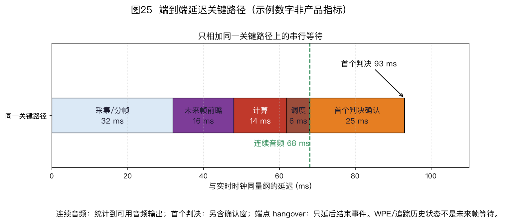

> ⚠️ 本篇是教程第 10 章。前后篇见下方导航。
>
> 🏠 首页导读：[00_overview.md](./00_overview.md) ｜ 上一篇：[09_source-tracking.md](./09_source-tracking.md) ｜ 下一篇：[11_selection-guide.md](./11_selection-guide.md)

---

## 10. 工程实现、评测与产业实践

本章把前九章的算法放进真实系统，讨论模块启用条件、信号取点、资源预算和验收方法。

本章常用缩写如下：

| 缩写 | 中文名与英文全称 |
|---|---|
| AFE | 音频前端（Audio Front End） |
| AEC | 声学回声消除（Acoustic Echo Cancellation） |
| WPE | 加权预测误差去混响（Weighted Prediction Error） |
| NS / AGC | 噪声抑制（Noise Suppression）/自动增益控制（Automatic Gain Control） |
| VAD | 语音活动检测（Voice Activity Detection） |
| KWS / ASR | 关键词唤醒（Keyword Spotting）/自动语音识别（Automatic Speech Recognition） |
| SRO | 采样率偏移（Sampling Rate Offset） |
| RTF | 实时因子（Real-Time Factor） |

本章中的 RTF 均指实时因子；波束形成中的“目标相对传递函数”（relative transfer function）不缩写为 RTF，以免混淆。

### 10.1 参考链路与端到端延迟

音频前端没有适用于所有产品的固定流水顺序。图 23 给出的是一条参考链路，只表达模块间的依赖，不表示每个项目都要启用全部模块。

音频主链是“多通道采集 → AEC → WPE → 解析波束形成 → 单通道 NS/AGC → KWS/ASR”。

定位与追踪读取多通道特征，只向解析波束提供带时间戳的方向状态。说话人分割约束 GSS/cACGMM 掩码；掩码与同一 WPE 阶段输出、未做方向归一化的多通道 STFT 一起形成目标/干扰 SCM，再送入波束形成。

神经或连续语音分离（Continuous Speech Separation，CSS）是 WPE 后绕过解析波束的替代音频路径，不与“GSS 掩码—SCM—波束”合并成一个模块。

- 设备不播放声音，或不需要边播边听时，可以不启用 AEC。
- 晚期混响已不影响目标指标时，可以不启用 WPE。
- 目标方向固定时，波束形成可以直接使用已知方向，不必持续定位和追踪。
- 只有多人重叠且下游确实需要独立语流时，才需要语音分离。
- VAD、远端活动检测和双讲检测是控制信号。它们不应画成主音频流中的串行处理框。

图 23 按较完整的语音交互系统绘制。远端音频先经过混音、均衡和音量控制；AEC 的 render tap 取在这些播放处理之后、DAC/功放之前，扬声器经房间和机壳耦合回麦克风形成声学回路。虚线表示活动控制，实线表示音频、特征或统计量依赖。

图中 AEC 的“最先处理”是指：启用 AEC 时，应在会破坏播放参考与回声之间线性关系的 NS、AGC 等处理之前消除回声，并不表示任何系统都必须以 AEC 开头。

确定实际模块后，还要重新核对各信号取点。AEC 通常位于会改变回声路径关系的非线性处理之前。参考信号应覆盖实际播放链中的增益、均衡和混音变化。若参考取在这些处理之前，AEC 看到的参考与扬声器实际播放内容不一致。WPE、波束和 NS 的先后则要结合实现判断：多通道 WPE 需要多通道输入；单通道 WPE 可以放在波束之后；神经网络若联合完成波束与去混响，也不能再套用传统串行顺序。

#### 10.1.1 延迟不能把每个模块的耗时直接相加

端到端延迟应沿实际关键路径测量，并分成五类：

| 类别 | 含义 | 常见来源 |
|---|---|---|
| 前瞻或算法等待 | 输出当前样本前必须等待的未来输入 | 居中窗、双向网络、判决确认窗 |
| 缓冲 | 驱动、直接存储器访问（Direct Memory Access，DMA）、网络或帧拼接等待 | 声卡周期、抖动缓冲、整帧推理 |
| 计算 | 当前数据到输出完成的执行时间 | 快速傅里叶变换（Fast Fourier Transform，FFT）、矩阵分解、神经网络推理 |
| 调度 | 任务虽已就绪但尚未运行 | 操作系统抢占、队列拥塞、加速器排队 |
| 解码与交互 | 前端之后的关键路径 | 流式 ASR 解码、网络往返、播报准备 |

同一帧内有多个模块串行执行时，它们的计算时间要相加；并行分支取耗时最长的关键分支；流水重叠的等待只沿关键路径计一次。在线 WPE 只使用历史帧时，本身不需要未来帧，但其分帧、平滑和实现缓冲仍可能产生延迟。

可把第 $p$ 条路径写成

$$
L_p=L_{\text{lookahead}}+L_{\text{buffer}}+L_{\text{compute}}+L_{\text{schedule}}+L_{\text{decode}},
\qquad L_{\text{e2e}}=\max_p L_p .
\tag{10-1}
$$

图 25(a) 把“采集/帧就绪等待”示意为 32 ms，再与未来帧前瞻 16 ms、首个判决确认 25 ms、计算 14 ms 和调度 6 ms 组成一条 93 ms 的示例关键路径。这里的 32 ms 是工作表示例，不等同于 STFT 窗长，也不是所有 32 ms 窗都会增加 32 ms 算法等待；窗的左右对齐、声卡周期、帧移和模块何时开始计算都会改变实际值。

图 25(b) 另行区分三条口径：连续增强音频只计其实际前瞻、缓冲、计算与调度；首个 KWS/ASR 判决还可能等待确认窗；端点 hangover 只延后“语音结束”事件，不应自动计入连续音频或首个判决。

WPE 历史帧、追踪状态、递归协方差和因果 AGC 时间常数是历史状态，不能机械当作未来等待。

这些数字只说明记账方法，没有包含图外可能存在的解码和交互延迟。实际系统应在声学输入与最终输出之间记录时间戳或回采脉冲，分别测量冷启动、稳定运行和最不利调度条件。

把 STFT 窗长从 32 ms 改为 16 ms，也不等于必然省下 16 ms：只有依赖完整窗或未来样本的等待发生变化，关键路径才会缩短。

延迟报告不能只有平均值。稳定运行阶段至少给出中位数（p50）与尾延迟（如 p95、p99）、样本数和测量时长；冷启动另报模型加载、内存分配和状态填充所需时间。若系统存在不同设备、网络或调度模式，应分别报告，而不是把所有样本混成一个分位数。测量点也要写清，例如“音频驱动时间戳 → 第一块可播放增强 PCM”与“音频入口 → 首个 ASR token”是两条不同关键路径。

#### 10.1.2 实时回调只搬运数据

声卡回调线程的首要目标是按时交付下一块音频。回调中临时分配大数组、等待互斥锁、访问磁盘、打印日志或执行时间不确定的模型推理，都可能让驱动错过期限。常见结构是：回调只复制交织或非交织样本、记录设备时间戳和状态位，再把固定大小的数据块写入预分配的环形缓冲；工作线程从缓冲读取并执行 AEC、波束和后端。回调与工作线程的时钟、缓冲单位和丢帧策略必须写清。

环形缓冲已满时，系统需要事先选择“丢最旧块”“丢新块”或“降级处理”。任何一种策略都会改变输出：丢块破坏连续状态，等待会阻塞采集，积压则增大延迟。本书的 [`RingBuffer`](../codes/array_tutorial/engineering.py) 采用“丢最旧样本”的可见基线，并累计 `dropped`；它用来说明容量和溢出语义，不是无锁实时队列。

[`simulate_deadline_queue`](../codes/array_tutorial/engineering.py) 用一条串行工作队列区分三件事：处理完成晚于本帧期限、队列达到高水位、容量已满而丢帧。平均 RTF 小于 1 仍可能出现其中任何一种。正式设备还要记录驱动报告的 underrun/overrun（合称 xrun）、线程优先级、CPU 频率策略和并发负载。

参考接口可按下表检查：

| 模块 | 启用条件 | 主要输入 | 主要输出 | 首要检查 |
|---|---|---|---|---|
| 采集与同步 | 多通道输入需要保持时序关系 | 麦克风、时钟 | 对齐的多通道脉冲编码调制（Pulse-Code Modulation，PCM）样本 | 映射、削波、丢帧、相对时延 |
| AEC | 本机播放可能进入麦克风 | 麦克风；播放处理之后、DAC/功放之前的 render tap；远端活动/双讲状态 | 回声减弱的麦克风信号、残余回声与适配状态 | 参考是否覆盖混音/EQ/音量、参考—麦克风整体延迟、削波、双讲稳定性 |
| WPE | 晚期混响影响任务 | 多通道或单通道 STFT | 去混响 STFT | 预测延迟、阶数、语音损伤 |
| 定位/追踪 | 波束或应用需要方向/轨迹 | 多通道特征、活动状态、测量时间 | 坐标系、测量/发布时间、状态与协方差、活动/存在概率、轨迹 ID 与有效期 | 坐标变换、过期外推、漏检/虚警、ID 生命周期；接口细节见 §9.4 |
| GSS 掩码/SCM/解析波束 | 已知活动日志且需要多人空间增强 | 分割活动标注、多通道 STFT、GSS 掩码、目标/干扰 SCM 或方向 | 每目标增强信号、条件数/有效样本诊断 | diarization→掩码→SCM→BF 的依赖不能省略；掩码不是 SCM，方向只控制解析 BF |
| 神经分离/CSS/TSE | 重叠内容需多流，或有可靠目标条件 | 多通道特征；可选注册语音、视觉或方向条件 | 固定/动态输出流、单目标音轨 | 左右上下文、首帧延迟、跨块排列、身份泄漏、域外泛化；它是解析波束的替代路径 |
| NS/AGC | 残余噪声或电平范围影响后端 | 增强信号 | 抑噪、稳电平信号 | 语音损伤、增益抽动、削波 |
| KWS/ASR | 应用需要关键词检测或语音识别 | 音频或特征 | 事件或文本 | 取点、缓存、误报与漏报 |

### 10.2 拾音、同步与增益

麦克风选型至少要看自噪声、声学过载点、灵敏度、频响和通道一致性。单个器件的典型值不能代替整机测试：声孔、密封、挡板、电源噪声和装配偏差都会改变阵列响应。

脉冲密度调制（Pulse-Density Modulation，PDM）、芯片间音频总线（Inter-IC Sound，I²S）和时分复用（Time-Division Multiplexing，TDM）是常见数字接口，但一根数据线能承载多少通道取决于器件、时钟和控制器配置，不能只按接口名称判断。阵列处理还要确认通道是否共享采样时钟、帧同步是否一致，以及驱动是否会独立丢样。

16 位、24 位和 32 位浮点描述的是数字样本格式。32 位浮点便于保留中间动态范围，不能提高麦克风的声学过载点，也不能消除模拟前端的底噪或削波。某些录音设备以浮点文件保存多增益通路合成后的信号，但这仍不等于“无需增益设计”。

#### 10.2.1 SRO：先区分初始时差和采样率偏移

设参考设备采样率为 $f_s$，另一设备满足 $f_{\mathrm{device}}=f_s(1+\varepsilon)$。经过 $T$ 秒后，两路时间轴的相对漂移一阶近似为

$$
\Delta t(T)=\varepsilon T .
\tag{10-2}
$$

100 ppm（parts per million，百万分之一）即 $\varepsilon=100\times10^{-6}$。若不校正，1 秒累积 100 μs，10 分钟累积 60 ms。这里的 60 ms 是时间轴长期累积的错位，不能直接当成每一秒都存在的到达时间差（Time Difference of Arrival，TDOA），也不能据此直接换算成固定的波达方向（Direction of Arrival，DOA）偏差。定位退化取决于重对齐周期、分析窗、频带、阵列孔径和估计器。

工程处理分三步：

1. 估计相对速率；
2. 按估计值重采样；
3. 持续跟踪温漂。

互相关峰漂移、相位漂移或专用导频都可用于估计。更新周期和允许残差应由最长连续运行时间、相干性要求及任务指标反推，不宜照搬固定 ppm 门限。

能够共享硬件时钟时，应优先消除 SRO 来源；不能共享时钟时，再评估在线补偿。

初始时差表现为整条“延迟—时间”曲线的截距，稳定 SRO 表现为斜率，偶发丢样则表现为阶跃。三者不能只靠首尾两个点可靠区分。工程上可分块估计互相关峰，先检查峰值置信度，再对可信的“时间—相对延迟”点做直线拟合；残差中若出现近似一个或多个采样间隔的突跳，应先查丢样和时间戳，而不是把所有变化都拟合成 ppm。

[`estimate_sro_ppm`](../codes/array_tutorial/engineering.py) 把相对延迟定义为“参考时间减设备时间”，再拟合截距和斜率；正斜率表示设备采样率较高，与 [`resample_sro_to_reference`](../codes/array_tutorial/engineering.py) 的符号一致。若横轴使用参考时间，精确斜率为 $\varepsilon/(1+\varepsilon)$；函数按小偏移的一阶近似把斜率乘 $10^6$ 报为 ppm，在音频设备常见的几十至数百 ppm 范围内用于教学。要求更高时应反解 $\varepsilon=s/(1-s)$，其中 $s$ 是拟合斜率。重采样函数用线性插值演示长度和方向；线性插值没有足够的带外抑制，只适合教学检查。设备实现要换成有抗混叠滤波和跨块状态的异步采样率转换器，并测量补偿后的相位残差。

#### 10.2.2 增益变化与 AEC

AEC 前的时变增益会改变它要辨识的等效回声路径。设计时应记录每一级增益位于参考取点之前还是之后，并确保 AEC 能获知或跟踪这些变化。常见做法是：AEC 收敛和双讲期间保持前置增益稳定；发生削波风险时允许保护性衰减，同时重置或减小自适应步长。锁定时间、解锁条件和允许步进都应通过本机回声路径和双讲集确定，不存在通用的秒数或 dB 阈值。

阵列标定应覆盖相对增益、相位/时延和麦克风坐标。位置误差造成的相位误差为

$$
\Delta\phi=2\pi f\,\Delta r/c .
\tag{10-3}
$$

例如 $\Delta r=0.5\ \text{mm}$、$f=4\ \text{kHz}$、$c=343\ \text{m/s}$ 时，$\Delta\phi\approx2.1^\circ$。这说明高频和深零陷波束更敏感，不表示 0.5 mm 是所有产品的统一公差。

标定不能止于得到一组系数。可执行流程应包含：确认通道编号和设备时间戳；在多个已知方向播放宽带信号；估计相对增益、固定时延和随频率变化的相位；核对实际麦克风坐标与坐标系；把系数连同设备序列、采样率、温度和标定日期保存；最后在未参与拟合的方向复测波束图和 DOA。更换声孔、密封件、麦克风或采集板后，要重新判断旧系数是否仍适用。

### 10.3 NS、控制信号与唤醒分支

#### 10.3.1 单通道 NS 的方法和边界

单通道 NS 常放在波束输出之后，因为此处计算量较小，也不会反过来破坏传统 AEC 的线性关系。但联合增强网络、多通道掩码估计或为定位专设的增强支路可能采用不同顺序。应依据训练输入和模块假设决定取点。

| 方法 | 基本思想 | 主要风险 |
|---|---|---|
| 谱减 | 从带噪功率谱中减去噪声估计 | 谱下限过低会产生音乐噪声 |
| 维纳滤波 | 按估计信噪比设置频点增益 | 噪声和先验信噪比估计滞后 |
| 子空间法 | 分离语音主子空间与噪声子空间 | 阶数估计和矩阵分解成本 |
| 最小均方误差短时谱幅度估计（Minimum Mean-Square Error Short-Time Spectral Amplitude，MMSE-STSA） | 最小化短时谱幅度的均方误差 | 分布假设与参数估计失配 |
| 最小均方误差对数谱幅度估计（Minimum Mean-Square Error Log-Spectral Amplitude，MMSE-LSA） | 最小化对数谱幅度的均方误差 | 低信噪比下仍可能有语音损伤 |
| 神经网络掩码/映射 | 从数据学习谱或波形映射 | 域外噪声、伪影和内容改变 |

MMSE-STSA 和 MMSE-LSA 不是同一目标：前者估计短时谱幅度，后者在对数谱幅度域定义误差。噪声估计也不必“只在 VAD 判无话时更新”。最小统计量、软语音存在概率和神经网络软掩码都能在语音段缓慢更新；关键是避免把语音持续吸收到噪声模型中。

#### 10.3.2 控制状态不能只看一个 VAD 比特

控制状态需要涵盖近端语音、远端播放和双讲。下表列出这些状态下的更新条件；具体实现可以使用离散状态，也可以使用连续的活动概率。

| 状态 | AEC 自适应 | NS 噪声估计 | 波束/空间统计 | WPE 更新 | ASR/KWS |
|---|---|---|---|---|---|
| 仅远端播放 | 参考有效且无削波时可更新 | 残余回声未污染噪声估计时可更新 | 避免把回声当目标 | 视残余回声而定 | 需要播放时唤醒时，KWS 可监听 AEC 后信号 |
| 仅近端语音 | 保持；没有有效远端参考可供辨识 | 软更新或保持 | 更新目标统计，谨慎更新噪声统计 | 可按功率加权更新 | 送入后端 |
| 双讲 | 由双讲检测降低步长或采用鲁棒更新 | 软更新或保持 | 分离目标与干扰统计 | 不应仅因“有语音”而冻结 | 保留近端语音 |
| 无近端、无远端 | 保持 | 更新背景模型 | 更新噪声统计 | 按实现选择保持或更新 | 后端可休眠，KWS 是否常开由应用需求决定 |

WPE 正是利用语音及其晚期混响的统计关系估计预测滤波器，不能用“VAD 有话就冻结”作为通用规则。AEC 的控制则必须结合远端活动和双讲检测；仅用近端 VAD 无法判断滤波器是否有可学习的回声参考。

VAD 的迟滞、挂起和预卷缓存应由语料中的短词、停顿和噪声脉冲调节。

KWS 是否绕过 VAD、是否持续运行、从 AEC 后还是增强后取信号，取决于功耗和训练域。

阈值需要在指定误唤醒率下报告漏唤醒率，不能只给一个孤立分数。

#### 10.3.3 VAD 与 AGC 的最小可运行基线

能量 VAD 虽然简单，却能把控制逻辑讲清。启动阈值应高于继续阈值，避免能量在单一阈值附近来回切换；hangover 在能量下降后继续保持若干帧，减少词尾被截断。预卷缓存解决的是词首：VAD 刚触发时，把触发前保留的短时音频一并送给后端。三个时间量都要换算成帧数，并在短词、长停顿和脉冲噪声上分别验证。

[`HysteresisVAD`](../codes/array_tutorial/engineering.py) 输入线性均方能量，不接受 dB 阈值；把 dBFS 门限传给它会造成口径错误。`hangover_frames=2` 表示首次跌破继续阈值的两帧仍保持活动，第三帧才关闭。该基线没有噪声自适应、频带特征和神经网络，也不自行保存预卷；预卷可用 [`RingBuffer`](../codes/array_tutorial/engineering.py) 保留触发前的固定帧数，并在 VAD 由假变真时先取出缓存。

AGC 要区分“把正常语音逐渐推向目标电平”和“立刻避免削波”。增益上升可以缓慢释放，增益下降需要更快；即使平滑状态来不及下降，当前块也要受安全上限约束。[`PeakProtectAGC`](../codes/array_tutorial/engineering.py) 给出这种峰值保护基线。它不估计响度，也不能修复模拟前端已经发生的削波。验收时要同时画输入电平、增益、输出峰值和削波比例，并在 AEC 双讲期间检查增益变化是否破坏回声路径模型。

### 10.4 定点化、算力与功耗预算

#### 10.4.1 从浮点实现到目标芯片

定点化要检查四件事：

- 数值范围；
- 累加位宽；
- 非线性函数近似；
- 模块间缩放。

协方差矩阵求解与 WPE 线性方程组尤其要观察条件数；对角加载能改善数值稳定性，但加载量应相对矩阵尺度定义。32 位或更宽的累加器可以减少乘加溢出，不能保证病态矩阵求解正确。

训练后量化（Post-Training Quantization，PTQ）先用校准数据确定量化尺度；量化感知训练（Quantization-Aware Training，QAT）在训练中模拟量化误差。选哪一种应由目标芯片的算子、代表性数据上的任务指标和最不利输入测试决定。不能预先承诺固定的指标下降量或加速倍数。

定点格式还要明确舍入和饱和规则。本书的 [`q15_quantize`](../codes/array_tutorial/engineering.py) 把 $[-1,1)$ 映射到有符号 Q1.15：乘 $32768$、按最近偶数舍入，再饱和到 $[-32768,32767]$。因此 $-1$ 可以精确表示，$+1$ 只能饱和为 $32767/32768$。[`q15_dot`](../codes/array_tutorial/engineering.py) 用 64 位整数累加乘积，只在输出时除以 $2^{15}$、按最近偶数舍入并饱和；目标 DSP 若使用不同累加位宽或逐乘积舍入，就不应期待 bit-exact 相同。测试既要覆盖正常小数，也要覆盖 $\pm1$、超范围输入和累加器极值；不能只比较平均误差。

SIMD（单指令多数据）优化从数据布局开始。连续的频点、通道或抽头便于向量加载，跨步访问和频繁转置会抵消乘加加速。报告 SIMD 收益时要写明标量基线、指令集、编译选项、数组对齐、块尺寸、线程数和是否包含格式转换。运行时派发还要保留标量回退，并让两条路径通过同一组数值容差或 bit-exact 测试；“编译器打开了向量化”不能代替这些检查。

#### 10.4.2 不混用指令数、乘加次数和实时因子

- 每秒乘加次数（Multiply-Accumulate Operations per Second，MAC/s）或每秒百万次乘加（Million MAC/s，MMAC/s）适合描述已经明确算子图和计数规则的算法计算量。
- 每秒百万条指令（Millions of Instructions per Second，MIPS）依赖指令集、并行宽度、存储访问和编译器。同一算法在不同处理器上的 MIPS 不可直接比较。
- RTF 定义为处理时长除以音频时长。RTF 小于 1 只说明平均速度足够；还要检查单帧最坏耗时、调度抖动和队列增长。

“帧耗时/帧长”得到的是 RTF，不是等效 MIPS。预算表应记录测量平台和版本：

| 模块 | 配置与输入尺寸 | MAC/s 或分析复杂度 | 最坏帧耗时 | RTF | 峰值内存 | 平均/峰值功率 |
|---|---|---:|---:|---:|---:|---:|
| 示例模块 | 麦数、采样率、帧长、模型版本 | 在同一计数规则下统计 | 在目标芯片实测 | 同一段音频实测 | 高水位实测 | 功率仪实测 |

电池容量应换算为能量。若标称电压为 $V$、容量为 $C_{\mathrm{Ah}}$，标称能量近似为 $E=VC_{\mathrm{Ah}}\ \mathrm{Wh}$，其中 Wh（watt-hour）表示瓦时。续航估算为

$$
t\approx\frac{E\,\eta}{P_{\text{avg}}},
\tag{10-4}
$$

其中 $\eta$ 包含可用容量、转换效率和老化裕量，$P_{\text{avg}}$ 是包含占空比的整机平均功率。只给毫安时（mAh）而不给电压和平均功耗，无法推出续航。

### 10.5 评测体系

每项指标只能回答一部分问题。面向完整系统的评测通常还需覆盖任务效果、语音质量、稳定性、资源占用和长时间运行。

| 对象 | 可用指标 | 不能单独说明什么 |
|---|---|---|
| AEC | 回声返回损失增强（Echo Return Loss Enhancement，ERLE）、双讲恢复、残余回声主观分 | ERLE 高不等于近端语音无损 |
| 定位 | 角误差、漏检率、虚警率、均方根误差（Root Mean Square Error，RMSE） | 单源 RMSE 不代表多人追踪稳定 |
| 波束/分离 | 尺度不变信号失真比（Scale-Invariant Signal-to-Distortion Ratio，SI-SDR）、串扰；多输出转写用 cpWER、ORC-WER 或 sa-WER | 单个客观分不代表听感或内容正确；多输出指标的排列/身份口径见第 11 章“多人重叠”决策表 |
| 说话人分割 | 分割错误率（Diarization Error Rate，DER）、Jaccard 错误率（Jaccard Error Rate，JER） | 必须固定 collar、重叠计分、参考区域和评分工具版本；分割正确不等于分离内容正确 |
| 增强 | 短时客观可懂度（Short-Time Objective Intelligibility，STOI）、旧研究复现中的感知语音质量评估（Perceptual Evaluation of Speech Quality，PESQ）、感知客观听音质量分析（Perceptual Objective Listening Quality Analysis，POLQA）、主观听测 | 客观模型可能在新失真上失准 |
| 追踪 | 最优子模式分配距离（Optimal Sub-Pattern Assignment，OSPA）、轨迹完整度、轨迹中断/碎片数、轨迹身份切换（ID switch） | 位置准确不等于身份连续；OSPA 的 $p,c$ 和角度距离见 §9.4 |
| 系统 | 端到端延迟、RTF、功耗、崩溃/丢帧 | 平均值不代表尾延迟和最坏状态 |

OSPA 把定位误差与目标数量错误合成一个集合距离；经典 OSPA 本身不保留身份标签，因此不能用它代替轨迹身份切换指标。报告还应给出轨迹中断/碎片数、ID 切换和关联规则，而不是用一个集合距离覆盖全部时序失败。

ITU-T 已于 2024 年 1 月 5 日撤销 [P.862（PESQ）](https://www.itu.int/rec/T-REC-P.862/en "citation")，并在官方页面指向 [P.863（POLQA）](https://www.itu.int/rec/T-REC-P.863/en "citation")。因此，PESQ 适合在必须对照旧论文时按原条件复现；新的标准合规性表述不应把 P.862 写成现行建议书。P.863 是现行的客观语音质量建议书，但其适用范围和版本仍需随正式报告记录。

[ITU-T P.835（07/2026）](https://www.itu.int/rec/T-REC-P.835/en "citation")用于对含噪语音处理系统做主观听测，分别评价语音信号（Signal，SIG）、背景噪声（Background，BAK）和总体效果（Overall，OVRL）。它适合区分“噪声是否减弱”和“语音是否受损”，但不能直接评价 DOA、轨迹身份或空间位置。正式报告应写明标准版本、听测材料、听众筛选、播放设备和统计区间。

[ITU-T P.566（07/2026）](https://www.itu.int/rec/T-REC-P.566/en "citation")的官方条目将其列为“已生效，待发布”（in force / to be published）的单端机器学习多维语音质量模型。在正式文本发布前，本书不从二手资料扩写输出维度或评分细则。P.566 的单端客观预测不能代替 P.835 主观听测，也不评价 DOA、轨迹或空间位置。

### 10.6 数据、仿真与复现

公开数据集适合建立可复现基线，不能代替目标设备录音。选择数据时要核对采样率、麦克风几何、房间、说话人数、重叠率、参考真值和许可证。训练、调参、最终测试应按房间或说话人隔离，避免相邻片段泄漏。

录音和声纹还要有数据治理清单：

- 记录采集目的与用户同意范围；
- 区分原始音频、转写文本、声纹嵌入和调试日志；
- 说明数据在端侧还是云侧处理，传输与静态存储怎样加密，哪些角色可以访问；
- 规定保留期限、删除与撤回流程；
- 导出故障样本前做身份信息检查；
- 第三方数据集按许可证限制保存和再分发。

目标说话人提取使用的注册声纹可能比普通缓存更敏感，不能因为只保存嵌入而默认无法关联个人。

具体法律和认证要求取决于部署地区与产品用途，应由相应合规审查确认。

房间冲激响应仿真也要写全条件。以下代码按 [pyroomacoustics 0.10.0](https://pypi.org/project/pyroomacoustics/0.10.0/ "citation") 编写，说明 `max_order` 与混响时间的关系；安装命令见项目 README：

~~~python
import pyroomacoustics as pra

room_dim = [6.0, 5.0, 3.0]
target_rt60 = 0.45
absorption, max_order = pra.inverse_sabine(target_rt60, room_dim)
room = pra.ShoeBox(
    room_dim,
    fs=16000,
    materials=pra.Material(absorption),
    max_order=max_order,
)
~~~

`inverse_sabine` 根据目标混响时间 $T_{60}$ 和房间尺寸给出吸收参数及建议的镜像源截断阶数；$T_{60}$ 表示声能衰减 60 dB 所需的时间。

这里的 `target_rt60=0.45` 是设计目标，不是已经测得的仿真结果。生成房间冲激响应（Room Impulse Response，RIR）后，还应由 RIR 的 Schroeder 能量衰减曲线估计实际 $T_{60}$，并报告拟合区间。衰减动态范围不足时，不应把短区间外推值写成直接测得的 60 dB 衰减时间。

`max_order` 控制镜像反射的截断深度，不能单独决定 $T_{60}$。可逐步增加 `max_order`，直到测得 $T_{60}$、RIR 总能量和目标任务结果在预定容差内不再明显变化。若始终不收敛，应调整房间或仿真方法，而不是只抬高阶数。

论文或报告还应记录：

- 目标与实测 $T_{60}$；
- 声源和麦克风坐标；
- 材料模型、随机种子与噪声生成方法；
- pyroomacoustics 版本和拟合方法。

### 10.7 分布式阵列

分布式系统要分别解决三类问题：

1. **时间轴**：初始时差、SRO、丢包和网络抖动要分开估计。长录音首尾对齐只能发现累计误差，不能代替运行时监测。
2. **坐标与增益**：节点位置、朝向、通道增益和频响决定导向矢量能否共用。节点移动后要更新几何。
3. **融合**：集中式波束需要传多通道信号或统计量，对同步和带宽要求高；通道选择和识别结果融合要求较低，但损失空间信息。应把弱节点加入后的退化列为测试项。

验收阈值应由网络带宽、最长会话和目标任务确定。例如，要求一小时内相位相干的系统与只做句级识别的系统，对残余 SRO 的要求不会相同。

### 10.8 阵列形态与场景约束

公开产品的麦克风数量、位置和算法会随硬件版本及地区型号变化。若没有可追溯的一手资料，不应从拆解照片推断算法链。本教程因此只讨论可迁移的设计条件：

| 场景 | 先确认的约束 | 可能启用的模块 | 必测状态 |
|---|---|---|---|
| 带扬声器的音箱/会议终端 | 播放声压、参考取点、覆盖角 | AEC；按混响决定 WPE；按覆盖决定定位/波束 | 远端单讲、近端单讲、双讲、音乐播放 |
| 会议室 | 房间混响、座位分布、重叠说话比例 | 多波束或分离；晚期混响明显时用 WPE | 单人、抢话、键盘/空调、不同座位 |
| 车载 | 舱位、车速相关噪声、多个时钟域 | 分区波束、SRO 补偿、参考完整的 AEC | 怠速、行驶、开窗、空调、音乐与通话并发 |
| 耳机/助听设备 | 上下行路径、佩戴泄漏、低延迟和电池约束 | 固定/自适应双麦波束、NS、反馈抑制 | 不同佩戴、风噪、自己说话、最坏增益 |
| 机器人 | 运动自噪声、阵列姿态、惯性测量单元（Inertial Measurement Unit，IMU）时间戳 | 运动前馈、姿态补偿、定位/追踪 | 静止、转头、行驶、风扇/电机变速 |
| 手机/手持设备 | 握持、遮挡、横竖屏、通话模式 | 通道选择、波束/NS、模式切换 | 手指挡孔、风噪、贴脸、免提、录像 |

球阵的可用球谐阶数同时受空间采样、阵列半径、频率和模态噪声放大限制。这里 $k=2\pi f/c$ 是波数，$r$ 是球阵半径，$kr$ 是无量纲频率。

表示到 $N$ 阶的完整球谐系数共有 $(N+1)^2$ 个，因此离散阵元数至少要能支撑相应的空间采样；实际还要留出几何和数值稳定性余量。

可用阶数在高频受阵元空间混叠限制，在低频又受 $kr$ 较小和径向滤波噪声放大限制。不能用 $N=\lceil kr\rceil+1$ 一条式子替代完整设计，也不能把“某阶需要多少系数”直接等同于任意摆放的同数麦克风一定可用。

三个非共点麦克风已经构成阵列。若几何非共线，它们能提供二维空间信息；若接近共线，则某些方向存在镜像或条件数问题。手机的主要限制通常是孔径小、结构遮挡和工作模式变化，而不是“三麦构不成阵列”。

### 10.9 从模型到设备

部署前先固定输入尺寸、算子版本、量化方式和线程配置，再测算力与内存。模型参数从 32 位浮点量化到 8 位整数时，参数存储在理想情况下约缩小四倍；端到端速度取决于硬件是否有相应整数内核、访存和算子融合，不能据此承诺“快四倍”。

低功耗常驻任务和高算力按需任务可以分开：例如 KWS 在低功耗处理器上运行，唤醒后再启动 ASR 或分离网络。但 AEC、波束、WPE 是否常驻取决于是否需要持续边播边听、录音或通话，不应把“唤醒前关闭完整前端”写成固定方案。

端侧、云侧或混合部署要比较隐私、断网可用性、网络尾延迟、更新能力和能耗。对品牌产品的实现方式没有公开证据时，只能写成候选架构，不能当作产品事实。

#### 10.9.1 开源实现怎样用作工程对照

开源项目解决的是链路中的不同部分，不能因为都能处理音频就横向替换。下面只列本书正文能够说明用途和边界的项目；固定来源、提交、许可证和核实日期统一记录在 [`codes/SOURCES.lock.json`](../codes/SOURCES.lock.json)，代码、模型权重和数据集许可证分别检查。

| 官方项目 | 可以对照什么 | 不能由它证明什么 |
|---|---|---|
| [WebRTC AEC3 固定提交](https://webrtc.googlesource.com/src/+/0467d2b91cc20b9b001c2bbb73d43ea6b2491f3e/modules/audio_processing/aec3/) | 实时 AEC 的延迟估计、线性消除和残余回声抑制分工，详见 §6.1.9 | 不能把内部常数当成本产品阈值，也不覆盖阵列定位和 WPE |
| [PortAudio 19.7.0 固定提交](https://github.com/PortAudio/portaudio/tree/3f7bee79a65327d2e0965e8a74299723ed6f072d) | 跨平台设备枚举、阻塞与回调式音频输入输出；该提交按官方 Release Notes 定位 | 不负责跨设备同步、重采样、AEC 或波束形成 |
| [pyroomacoustics 0.10.0 发布记录](https://pypi.org/project/pyroomacoustics/0.10.0/) | 房间、RIR、DOA 与波束的 Python 原型 | 仿真通过不等于目标设备达到实时性或实录效果 |
| [nara_wpe 0.0.11 发布记录](https://pypi.org/project/nara-wpe/0.0.11/) | 离线、块在线和递归 WPE 的接口对照 | 安装命令不能证明所选接口因果，也不能证明当前 Python 环境兼容 |
| [ONNX Runtime 固定源码快照](https://github.com/microsoft/onnxruntime/tree/48795e0281bcaa6b3b63b28af5e078b4c41e995f) | 模型执行、执行提供程序和量化后的设备部署；链接固定到本轮核实的完整提交，不把未发布版本写成正式发布 | 它是运行时，不定义 NS、分离或波束算法的训练目标 |

WebRTC 与 PortAudio 规模较大，本仓库不复制其源码。需要对照时按锁定清单获取，并在隔离环境构建。`codes/array_tutorial/` 中的程序是本书教学基线，作用是复算约定和边界；它们不冒充上游项目，也不构成产品性能承诺。

模型落地时还要固定输入采样率、通道顺序、块长、动态轴、归一化、状态张量、算子集、运行时版本和线程配置。冷启动测量包含模型读取、图优化、权重上传和首轮内核准备；稳定运行延迟要在 warm-up 后另测。更新模型前保存可回滚版本，并用同一硬件、同一数据和同一计时范围比较。

### 10.10 联调与验收

联调应按依赖关系排查，不必强行把所有模块串成一个固定顺序。

| 阶段 | 检查内容 | 验收口径怎样确定 |
|---|---|---|
| 采集 | 通道映射、时间戳、削波、丢帧、自噪声、SRO | 由器件规格、最长运行时间和下游容差确定 |
| AEC | 参考对齐、路径覆盖、单讲收敛、双讲稳定、路径变化恢复 | 分别报告 ERLE、近端损伤和恢复时间；覆盖目标播放状态 |
| WPE | 晚期混响衰减、直达声损伤、长时稳定 | 在目标房间和说话距离上与关闭 WPE 对照 |
| 定位/追踪 | 角误差、漏检、虚警、人数、轨迹身份切换、轨迹中断 | 按覆盖区和应用允许误差设线，包含交叉与遮挡 |
| 波束/分离 | 目标保持、干扰抑制、失配鲁棒性、串扰 | 同时报任务指标与语音损伤，不只报 SI-SDR |
| NS/AGC | 噪声残留、语音损伤、抽动、削波 | 覆盖噪声类型和输入电平，补 P.835 主观听测 |
| KWS/ASR | 指定误报率下的漏报率、WER/CER、首尾截断 | 使用目标语言、距离、噪声、说话人和播放状态 |
| 系统 | 关键路径延迟、RTF、峰值内存、平均/峰值功耗、长时间稳定性 | 在目标硬件、发布配置和最不利并发状态实测 |

每个验收阈值都应包含测量条件、统计量和样本量。例如“角误差小于 5°”还要说明声源角度分布、距离、房间、信噪比，以及该数值是均值还是某个分位数。教程中的算例只能用于验证计算，不能直接作为产品验收阈值。

在线监控应记录足以定位故障、但不默认保存原始语音的字段。本书给出的 [`telemetry_schema.json`](../codes/engineering/telemetry_schema.json) 采用以下口径；它是最小示例，不含用户身份、转写文本或原始音频。

| 字段组 | 单位与统计口径 |
|---|---|
| `timestamp_ns`、`frame_index` | 单调采集时钟域；时间戳指本帧首样本，不是墙上时间 |
| `queue_depth` | 发布该条记录时仍在等待的帧数，不含正在执行的帧 |
| `xrun_count`、`dropped_samples` | 从流启动起的累计值；丢样按时间样本计，不按通道展开 |
| `clipping_fraction` | 本帧所有通道标量样本中的削波比例 |
| `sro_ppm` | 相对指定参考设备、在已配置估计窗内得到的采样率偏移 |
| `rtf`、`deadline_miss` | 本帧关键路径处理时长除以音频时长，以及是否越过本帧期限 |
| `agc_gain`、`model_version` | 本帧线性幅度增益；完整有序模型链的稳定版本标识 |

`simulate_deadline_queue` 的 `queue_high_water` 包含正在处理的帧，故不能直接写进上表的等待队列深度。实际产品若要记录敏感内容，应按 §10.6 的同意、访问、保留和删除规则另行设计。

故障注入要对应恢复动作。固定延迟跳变用于检查 AEC 重对齐；单通道增益或相位扰动用于检查标定和波束鲁棒性；插入或删除样本用于区分丢样与 SRO；CPU 负载脉冲用于检查队列、尾延迟和降级；截断或 NaN 模型输出用于检查旁路和重置。每次试验都要记录注入位置、持续时间、期望状态转换和恢复时间，不能只确认进程没有崩溃。

常见故障可按依赖关系缩小范围：

| 现象 | 先查 | 再查 |
|---|---|---|
| 播放时残余回声突然增大 | 参考取点、整体延迟、削波、前置增益变化 | 滤波器长度和双讲控制 |
| 语音发闷或辅音丢失 | NS 增益、WPE 预测延迟、AGC 抽动 | 波束指向失配和标定 |
| 定位随时间缓慢漂移 | 时钟域、SRO、丢样 | 几何和温漂后的标定 |
| 唤醒差但 ASR 正常 | KWS 取点、缓存、训练域和阈值曲线 | VAD 是否错误截断 KWS 输入 |
| 平均实时但偶尔爆音 | 最坏帧耗时、调度抖动、缓冲下溢 | 平均 RTF 和内存带宽 |

### 10.11 本章小结

1. 图 23 是参考依赖图，不是所有设备必须执行的固定流水线。
2. 延迟、算力和续航必须在目标硬件上按明确口径测量；窗口长度、MIPS 和 mAh 不能互相替代。
3. 门控至少要区分近端语音、远端播放和双讲；单个 VAD 比特不足以控制 AEC、WPE 和全部后端。
4. 固定阈值和品牌案例不能替代项目条件。每个验收数字都要带场景、统计口径和来源。

---

> 📄 [回首页](./00_overview.md)
