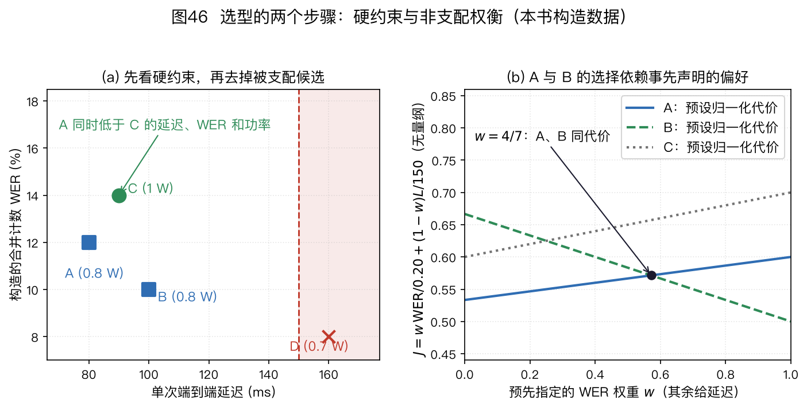
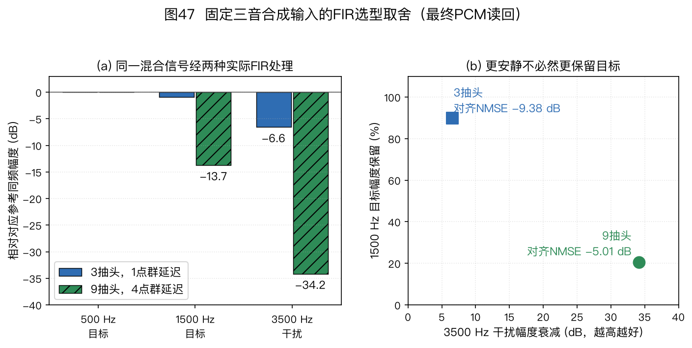
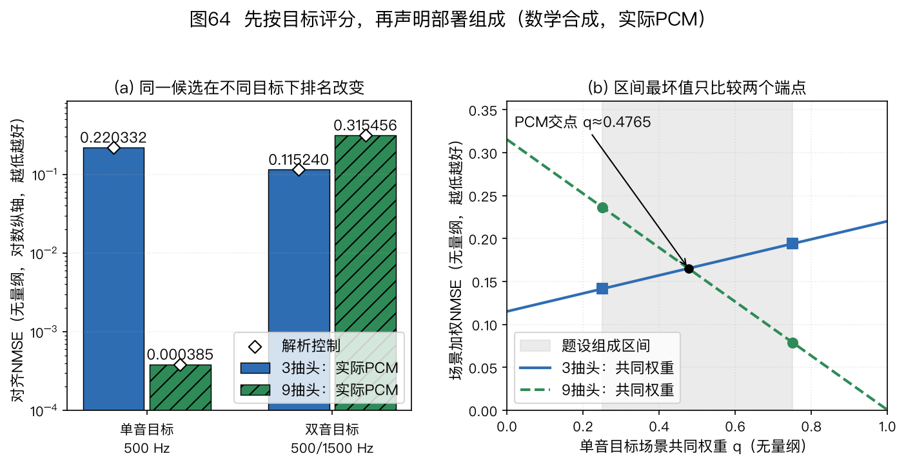

> ⚠️ 本篇是教程第 11 章。前后篇见下方导航。
>
> 🏠 首页导读：[00_overview.md](00_overview.md) ｜ 上一篇：[10_engineering-practice.md](10_engineering-practice.md) ｜ 下一篇：[12_appendix-symbols-math.md](12_appendix-symbols-math.md)

---

## 11. 总结与选型指南

选型应从任务和约束开始。同一个四麦阵列用于固定座位通话、多人会议或机器人跟随时，合适的处理链可能完全不同。本章先确定目标，再选择几何和模块，最后按第 10 章的方法验证。

本章常用缩写如下：

| 缩写 | 中文名与英文全称 |
|---|---|
| DOA | 波达方向（Direction of Arrival） |
| AEC | 声学回声消除（Acoustic Echo Cancellation） |
| WPE | 加权预测误差去混响（Weighted Prediction Error） |
| NS / VAD | 噪声抑制（Noise Suppression）/语音活动检测（Voice Activity Detection） |
| RTF | 实时因子（Real-Time Factor） |
| SRO | 采样率偏移（Sampling Rate Offset） |
| CSS | 连续语音分离（Continuous Speech Separation）：连续输出少量语流，并处理跨块拼接 |
| TSE | 目标说话人提取（Target Speaker Extraction）：按注册语音、视觉或方向条件提取指定目标 |
| ASR | 自动语音识别（Automatic Speech Recognition）：把语音转换为文字 |
| KWS | 关键词检测（Keyword Spotting）：检测唤醒词等指定词语 |
| STOI / ESTOI | 短时客观可懂度（Short-Time Objective Intelligibility）及其扩展（Extended STOI）：需要匹配参考的可懂度指标 |

各定位、波束和追踪算法的全称在首次出现处给出。

### 11.1 先回答六个问题

1. **系统要输出什么？** 输出一个方向、连续轨迹、增强语音、分别输出的多人语流、指定目标的一条语流，还是识别文本？多人输出还要说明人数固定还是随时间变化、整句处理还是连续流、是否需要保持说话人身份。输出不同，所需模块不同。只做固定方向录音时，不需要在线定位；只做方向显示时，也未必需要波束形成和 NS。

2. **覆盖区域和声源距离是什么？** 线阵在已知目标平面或扇区的条件下可利用轴向时差，但三维中相同轴投影仍有歧义；圆阵可用于水平面环绕覆盖。平面阵可以约束俯仰，却不能仅凭理想自由场相位区分阵面上下镜像；需半空间先验或非共面麦克风等额外信息。球阵及其他三维几何也要检查采样与标定条件。形态不是按“几只麦”直接决定的。

3. **空间分辨率和最高工作频率是什么？** 孔径影响角分辨率，阵元间距限制无空间混叠频带。增大孔径有利于低频方向信息，减小间距有利于高频无混叠。两者冲突时，可以增加阵元、限制工作频带或采用非均匀几何；不能只报一个间距就宣称覆盖全频带。

4. **有哪些干扰？** 本机播放造成回声时才需要 AEC；晚期混响妨碍任务时再考虑 WPE；多人重叠且要输出独立语流时才考虑分离；稳定背景噪声可能用解析 NS 即可，复杂域外噪声则要验证神经网络的泛化。

5. **目标是否移动、人数是否变化？** 单个慢速目标可从简单平滑或卡尔曼滤波开始。人数变化、交叉和遮挡要求显式处理轨迹出生、消失和数据关联。概率假设密度（Probability Hypothesis Density，PHD）滤波、带标签多伯努利（Labeled Multi-Bernoulli，LMB）滤波或其他随机有限集方法不会因“人数多”自动成为合适方案；还要考虑观测模型、身份连续性要求和实现成本。

6. **硬件、成本和合规边界是什么？** 写明采样率、麦数、时钟域、算力、峰值内存、功耗、关键路径延迟、隐私和认证要求。按目标产量列出物料清单（Bill of Materials，BOM）及其采购成本；已计入 BOM 的接口和结构物料不在其他成本项中重复计入，未计入的部分以及标定、维护费用另列。成本预算须与算力、功耗和延迟预算分开。使用注册声纹或云端录音时，还要写明同意、访问、保留和删除方式，见第 10 章 §10.6。每秒百万条指令（Millions of Instructions per Second，MIPS）不能脱离处理器型号比较，电池续航要用瓦时（Wh）与整机平均功耗估算，见第 10 章 §10.4。

### 11.2 按条件选择模块

#### 方法类别与启用条件

先把表中常用方法名与任务对应起来：

- 广义互相关相位变换（Generalized Cross-Correlation with Phase Transform，GCC-PHAT）从麦克风对估计相对时延；导向响应功率相位变换（Steered Response Power with Phase Transform，SRP-PHAT）在候选方向或位置上汇总多麦克风对的证据。
- 多重信号分类（Multiple Signal Classification，MUSIC）用噪声子空间与候选方向导向矢量的正交关系搜索谱峰；旋转不变子空间法（Estimation of Signal Parameters via Rotational Invariance Techniques，ESPRIT）用信号子空间及平移不变子阵解算方向。两者都要检查源数、快拍数和阵列模型。
- 最小方差无失真响应（Minimum Variance Distortionless Response，MVDR）在目标无失真约束下减小输出功率；线性约束最小方差（Linearly Constrained Minimum Variance，LCMV）可同时施加多条方向或响应约束。协方差估计和导向失配会影响两者。

| 决策对象 | 适合先尝试的方案 | 何时换方案 | 同时检查的风险 |
|---|---|---|---|
| 单源 DOA | GCC-PHAT 或 SRP-PHAT 基线 | 需要更高分辨率且协方差条件满足时，评估 MUSIC 或 ESPRIT；复杂混响下可评估学习方法 | 阵列歧义、混响、宽带融合、虚警 |
| 固定方向增强 | 延时求和或固定超指向（superdirective）波束 | 噪声场变化且统计量可估计时，评估 MVDR 或 LCMV 波束形成 | 白噪声增益、方向失配、标定 |
| 自适应波束 | MVDR 或 LCMV 加稳健化 | 目标相对传递函数或导向矢量难以估计时，评估掩码辅助或联合模型 | 协方差秩、对角加载、目标泄漏 |
| 晚期混响 | 先用关闭 WPE 的基线 | 晚期混响确实限制词错误率（Word Error Rate，WER）、可懂度或听感时启用 WPE | 预测延迟、阶数、直达声损伤 |
| 本机回声 | 有播放泄漏时启用 AEC | 非线性扬声器、路径变化或多扬声器时增加相应建模 | 参考取点、整体延迟、双讲 |
| 多人重叠 | 只需一路增强时先试多波束选择或掩码波束 | 需要保留重叠中的全部语音内容时评估分离/CSS；只需指定一人且有可靠目标条件时评估 TSE | 最大同时说话数、固定/变化总人数、整句/连续流、跨块排列、身份、内容改变、算力 |
| 轨迹平滑 | α-β 或卡尔曼滤波 | 多目标交叉、漏检和虚警明显时换多目标滤波 | 坐标系、时间戳、轨迹身份切换、轨迹中断 |
| 残余噪声 | 维纳或最小均方误差（Minimum Mean-Square Error，MMSE）等解析基线 | 非平稳噪声下基线不足时评估神经 NS | 语音损伤、域外噪声、下游 WER |

算法名只确定了方法类别，还没有确定参数。WPE 的预测延迟和阶数、MVDR 的加载量、AEC 的滤波器覆盖范围、VAD 的挂起时间都应由目标数据和硬件测量得到，不应作为通用默认值从别的产品复制。

#### 多人内容与身份的评分口径

多人重叠场景先区分三种识别口径：

- 拼接最小排列词错误率（Concatenated minimum-Permutation Word Error Rate，cpWER）先按说话人拼接参考与假设，再寻找一个全局最优的说话人排列；
- 最优参考组合词错误率（Optimal Reference Combination Word Error Rate，ORC-WER）允许参考语句在输出流之间做最优组合，不要求一条输出流全程对应同一个人；
- 说话人归属词错误率（Speaker-Attributed Word Error Rate，sa-WER）把词转写与说话人标签一起评价，归属错误会影响结果。

三者不能互换：ORC-WER 偏向检查内容是否被完整识别，cpWER 还要求全局输出流一致，sa-WER 用于确实需要身份归属的任务。

#### 四词手算：两条流在第二段交换

下表的“春天、夏天、秋天、冬天”各算一个词元；每段中甲、乙同时说话，分离器在第二段把两人的内容放进了相反的输出槽位。本例只比较词内容与流分配，不涉及分词歧义或时间容差。

| 时间段 | 甲的参考 | 乙的参考 | 输出流 1 | 输出流 2 |
|---|---|---|---|---|
| 1 | 春天 | 夏天 | 春天 | 夏天 |
| 2 | 秋天 | 冬天 | 冬天 | 秋天 |

按说话人拼接的参考是甲“春天 秋天”和乙“夏天 冬天”；实际输出分别是流 1“春天 冬天”、流 2“夏天 秋天”。四个词的内容都在输出中，但第二段换了流。

cpWER 只能为**整条**输出流选择一次全局排列。不交换流时，甲的“秋天→冬天”和乙的“冬天→秋天”各产生一次替换；交换两条流时，第一段的“春天→夏天”和“夏天→春天”各产生一次替换。因此两种全局排列的最小编辑数都是 2，参考总词数为 4，cpWER 为 $2/4=50\%$。

ORC-WER 按**参考语句**选择输出流：第一段的“春天”给流 1、“夏天”给流 2，第二段的“秋天”给流 2、“冬天”给流 1。两条重组参考流于是分别等于两条输出流，编辑数为 0，ORC-WER 为 $0/4=0\%$。

这个零分只说明按该语句分配口径内容齐全，不能证明流 1 始终属于甲。sa-WER 还需要明确每个输出词的说话人标签及其评分定义，本例没有给出这些标签，故不计算 sa-WER。以上小例遵循下方固定版 MeetEval 对 cpWER 全局排列与 ORC-WER 逐语句分配的定义，不把二者当成同一个评分器的不同阈值。

实现时还要记录分段与重叠处理、标记规则，以及固定的评分工具版本或提交。本文核实于 2026-09-22，并将 MeetEval 对 cpWER、ORC-WER、MIMO-WER 和 DI-cpWER 的算法说明钉在提交 [`6e3dc81284f2d6928f7ef9e620fd3b6906daa429`](https://github.com/fgnt/meeteval/blob/6e3dc81284f2d6928f7ef9e620fd3b6906daa429/doc/algorithms.md)；该锁定文档没有把 sa-WER 列作同一工具的实现，使用 sa-WER 时应另行固定定义与评分器。复现实验还应记录实际安装包版本或完整提交号，不能只写会移动的 `main`。

原始 CSS 槽位可由不同说话人轮流复用。若三位说话人分别说一个词 `a`、`b`、`c`，两个槽输出 `a c` 和 `b`，内容全对仍会有非零 cpWER：一个槽不能同时一一匹配两位参考说话人。E11-16 将算出 cpWER 为 $2/3$，ORC-WER 为零。

用于内容验收时可选择固定分段和时间顺序的 ORC-WER；需要按人验收时，先说明分割与身份关联怎样形成整场的说话人转写，再计算 cpWER 或明确规定的归属指标。

[MeetEval 作者论文](https://arxiv.org/pdf/2307.11394)的 §3.2～3.5 区分这些分配约束。ORC-WER 不能在一句内部任意换流，并按参考语句时序组合；改变参考分段也可能改变最优分配。因此参考分段、同起点的排序规则和时间约束必须随评分配置固定。

#### 话段边界与时间也属于评分协议

词元相同，并不保证评分问题相同。ORC-WER 把一条完整参考话段分配给一条输出流；若把同一句拆成多个话段，就增加了可选分配。应根据预定标注规则固定参考边界，不能根据某个系统的输出重新切分。[E11-23](#e11-23)用同样的两个词计算切分前后的差异。

普通编辑距离还会允许很早的参考词与很晚的同词假设匹配。在长会议中，同一个常用词会反复出现；这样的匹配可能掩盖时间错误。时间约束评分还需给出词时间区间、容差、时间戳来自真实标注还是近似，以及边界接触时是否允许匹配。[MeetEval 2023 原论文 §4，印刷第29～30页](https://www.isca-archive.org/chime_2023/neumann23_chime.pdf "citation")说明时间约束及词级时间近似的作用。

[E11-24](#e11-24)只展开单词序列的时间约束编辑距离，不把这个小核当成完整的时间约束最小排列词错误率（Time-Constrained minimum-Permutation Word Error Rate，tcpWER）工具。真实多人评分还要处理全局流分配、文本规范化、话段排序和时间容差。固定原实现的端点约定与论文定义须分别核对，不能仅凭同名接口认定一致。

#### 输出槽位与目标条件

| 任务条件 | 一路波束/掩码波束 | 连续语音分离（CSS） | 目标说话人提取（TSE） |
|---|---|---|---|
| 需要的输出 | 一路增强音频 | 固定或少量输出流；每条流同一时刻至多承载一人，不同流可同时输出重叠的说话人 | 被注册语音、视觉或方向指定的一人 |
| 人数变化 | 可跟随一个选中目标；不负责完整输出所有人 | 总参会人数可多于输出流数；流数由最大同时说话数和系统设计决定 | 非目标人数可变化，但目标条件必须持续有效 |
| 时间范围 | 可逐帧或分块在线处理 | 连续长录音；必须说明分块、上下文和拼接 | 可整句或流式；需报告注册和首帧延迟 |
| 身份连续 | 由追踪/分割模块提供 | 分离槽位不等于永久身份，通常还需分割或声纹关联 | 目标条件提供身份线索，但会受注册信道和冒用影响 |
| 主要验收 | 目标保持、串扰、语音损伤、WER | 重叠段遗漏、跨块换人、cpWER/ORC-WER/sa-WER、延迟 | 目标遗漏、非目标泄漏、错误目标、隐私与删除 |

这张表比较的是任务条件，不表示 CSS 或 TSE 一定优于解析波束。若应用只消费一路音频，多输出分离会增加排列和资源问题；若应用要完整转写未知参会者，要求预先注册每个人的 TSE 又会成为功能性限制。

### 11.3 几何与算法要一起选

阵列几何决定观测中有哪些空间信息，算法决定如何使用这些信息。

- **双麦或近似线阵**：可以估计沿阵列轴投影的时差并形成方向性；三维中具有同一轴向投影的方向构成锥面，在指定平面中还可能有镜像二解。近似共线的小偏离可能只提供很弱的额外信息。适合已知目标扇区、孔径和外形受限的设备。
- **非共线三麦及平面阵**：能提供两个独立的平面投影约束，但理想自由场下阵面上下镜像仍不可分。精度还受孔径、频带、遮挡和标定影响，不能把“三麦”简单归为单麦处理。
- **圆阵**：便于覆盖水平面。阵元数和半径应由所需角分辨率、最高频率与结构尺寸共同确定，不存在“全向必须至少四麦、六麦最好”的通用答案。
- **球阵或三维阵**：适合需要俯仰角、声场分析或多方向波束的任务。可用球谐阶数受阵元采样、无量纲频率 $kr$（$k=2\pi f/c$ 为波数，$r$ 为球阵半径）、径向滤波噪声放大和标定误差共同限制，详见 §10.8。
- **稀疏阵**：差分共阵可增加二阶统计中的虚拟滞后数，但不会凭空增加独立物理通道，也不保证宽带、相干声源和有限快拍下都能得到同样的自由度。应按第 3 章的适用条件验证。

白噪声增益（White Noise Gain，WNG）和指向性指数（Directivity Index，DI）之间常有取舍。更窄的波束或更深的零陷可能放大传感器自噪声和标定误差。对角加载、WNG 约束和限制工作频带都能改善鲁棒性，但通常会牺牲一部分空间选择性。

#### 平面镜像为什么不能靠换算法消除

沿用第 2 章远场单位方向与导向相位约定。令三个麦克风坐标依次为 $(0,0,0)$、$(0.04,0,0)$、$(0,0.04,0)$ m，两个候选方向为 $\boldsymbol u_+=(0.6,0,0.8)^\top$ 与 $\boldsymbol u_-=(0.6,0,-0.8)^\top$。两者的长度均为 1。

以第一麦为参考，另外两麦的坐标与方向点乘，在两种方向下都等于 $0.024$ m 和 $0$。因此所有频率上的相对传播相位相同，理想观测本身不能区分这两个方向；增加快拍或更换谱峰搜索法不会产生缺少的垂直信息。

若增加坐标为 $(0,0,0.04)$ m 的第四麦，它的投影分别为 $+0.032$ m 与 $-0.032$ m。取 $c=343\ \mathrm{m/s}$、$f=1$ kHz，对应导向相位分别为 $\pm2\pi f(0.032)/c\approx\pm0.58619$ rad，于是这对方向可分。这只是对该镜像二解的复算，不保证任意频率和方向均无空间混叠。更完整的几何可辨识性练习见第 3 章 E03-10。

### 11.4 四个场景怎样推导方案

下表给的是推导方法，不是产品清单。

| 场景 | 条件变化 | 方案怎样变化 |
|---|---|---|
| 带扬声器的语音终端 | 若要求播放时仍能唤醒或通话 | AEC 成为必要候选；数字参考应覆盖实际混音、均衡与播放增益。圆阵、线阵或平面阵由覆盖区域和外形决定。无明显晚期混响时不必默认加 WPE。 |
| 会议室 | 若多人重叠较少，只需一路会议音频 | 先比较多波束选择和自适应波束。只有重叠说话造成任务失败，且需要独立语流时，再增加分离。远距离和长混响房间要用实测决定 WPE。 |
| 车载 | 若麦克风跨多个时钟域 | 先解决 SRO 和时间戳，再谈分区波束。播放参考需覆盖音乐、导航和通话混音。算法要在怠速、行驶、开窗和空调状态分别测试。 |
| 耳机或助听设备 | 若监听路径对延迟和电池很敏感 | 监听与通话上行可采用不同链路。固定双麦波束和轻量 NS 是候选基线，不是必选答案；法规、反馈路径、佩戴变化和听觉安全优先。 |

同一场景也可能得出不同答案。例如会议设备安装在墙边时，覆盖区域可能只有半空间；放在桌中央时则要覆盖周向。前者可能适合线阵或弧形阵，后者可能适合圆阵。覆盖区域确定后，才能据此选择阵列形态和麦克风数量。

数字播放参考无法自动包含后续功放和扬声器的非线性。是否另取电参考、增加非线性模型或限制播放工作范围，要按硬件条件选择；“参考覆盖播放处理”不意味着要求所有系统都在模拟声学输出之后取参考，见第 6 章与第 10 章图 23。

### 11.5 把候选方案写成可验证的规格

#### 11.5.1 先写规格和证据口径

为了复现实验并比较方案，候选方案的规格应覆盖以下内容：

| 项目 | 应写内容 |
|---|---|
| 任务 | 输入、输出、目标声源数、是否需要身份连续 |
| 几何 | 坐标、尺寸公差、声孔和遮挡、工作频带 |
| 场景 | 距离、角度、房间、噪声、播放和运动状态 |
| 链路 | 每个模块的启用条件、取点、旁路和控制信号 |
| 资源 | 目标硬件上的 RTF、已测帧耗时范围、峰值内存、平均/峰值功耗及测量条件 |
| 成本 | 目标产量、BOM 采购成本；未计入 BOM 的接口与结构成本、标定和维护费用另列，已计物料不重复计入；区分一次性与逐台成本 |
| 延迟 | 前瞻、缓冲、计算、调度和解码关键路径 |
| 指标 | 任务指标、语音损伤、稳定性、置信区间和样本量 |
| 异常处理 | 通道失效、方向低置信度、网络断开和算力过载时的行为 |

可以先建立最小基线，再一次增加一个模块，便于定位变化来自哪一步。增加模块后要同时检查收益、语音损伤、延迟、功耗和失败样例。若模块之间存在输入依赖或相互作用，还需测试组合，不能把“一次加一个”当成保证找到最佳组合的搜索算法。

如果 WPE 没有改善目标房间的结果，或分离网络虽然提高了尺度不变信号失真比（Scale-Invariant Signal-to-Distortion Ratio，SI-SDR）却增加了内容错误，就不应因为流程图里画了它而保留。

开源实现也要按任务筛选。项目名称不能代替算法条件：

- PortAudio 解决设备输入输出，不解决跨设备同步。
- ONNX Runtime 执行模型，不规定模型训练目标。
- pyroomacoustics 适合房间与阵列原型，不证明目标设备实时。
- WebRTC AEC3 可以对照实时回声链路，但其内部参数不是其他产品的默认值。

选择开源项目时应把规范仓库、固定提交或发布、许可证、支持平台、输入输出契约、维护状态和最小测试一起写入方案，详见 §10.9.1 与 [`codes/chapters/ch00/SOURCES.lock.json`](../codes/chapters/ch00/SOURCES.lock.json)。

本书按 [`codes/chapters/ch00/COVERAGE.md`](../codes/chapters/ch00/COVERAGE.md) 将算法分为“本仓库可运行基线、外部参考实现、原理索引、明确排除”四种状态。适配器只是调用外部实现的一种方式，不是第五种覆盖状态。教学实现通过单元测试，只能说明约定和边界算例正确；它没有经过目标设备的实时、长稳和主观听测，不能直接标成工业实现。

工程选型还要把“源码能获取”与“接口能接入、平台能编译、设备能通过验收”分开。Linux 会议终端可研究 ALSA/PipeWire 的设备和参考路由；Cortex-M 端侧模型可研究 TFLM/CMSIS-NN 的算子与内存；XMOS 或 SOF 固件则需要对应硬件、工具链及拓扑。

每条候选都应补一项故障试验，例如拔插后恢复、参考切换、跨块状态清零、缓冲不足或线程过载，具体入口见[工业部署研究](../codes/chapters/ch00/research/03_industrial_deployment.md)。

候选的输入输出与评分工具同样需要筛选。libsoxr、libsamplerate 的比例协议不能照搬；libsndfile 的时间帧数不能当成通道标量数；libebur128 的响度与真峰值也不是语音质量分。

有干净参考时才可按相应条件使用 STOI/ESTOI 或 ViSQOL，静音过多、有效帧不足、参考错配及模型缺失必须进入失败记录。评分输入与失效边界见[第 10 章评测体系](10_engineering-practice.md#sec-10-5)，固定源码入口另见[工业部署研究](../codes/chapters/ch00/research/03_industrial_deployment.md)。

#### 11.5.2 完整决策例：未知参会者的连续转写

假设会议中共有 2～6 名未注册说话人，人数随时间变化，但任一时刻最多两人同时说话。系统要连续输出全部内容给 ASR，并要求端到端延迟可测但尚未给定阈值。先用硬约束筛选，再进入实测：

| 条件或证据 | 一路掩码波束 | 两路 CSS | 注册声纹 TSE | 决定 |
|---|---|---|---|---|
| 必须保留重叠双方内容 | 单路输出可能丢失其中一人，未通过硬约束 | 两路分别承载同一时刻最多两人的语音，设计目标与要求一致 | 每次只提取已指定目标，未通过“全部未知说话人”约束 | 保留两路 CSS 候选 |
| 总参会人数为 2～6 人且随时间变化 | 可选择当前目标，但不输出完整集合 | 不同说话人可在不同时段复用两路输出；需验证静默流和跨块排列 | 需事先获得每位目标条件，本场景没有 | 记录 CSS 的人数与槽位管理风险 |
| 连续长录音 | 可流式 | 必须报告块长、左右上下文、拼接和状态重置 | 模型若支持可流式，但功能约束已淘汰 | 对 CSS 设置延迟测试项 |
| 身份与识别评测 | 本候选的单目标 WER 不能代表被舍弃者的内容 | 原始槽位按固定协议报 ORC-WER；形成说话人转写后再评 cpWER 或归属指标 | 需另测错误目标和声纹冒用 | 先按无注册转写口径验收 |
| 资源与质量证据 | 作为低成本基线保留 | 在目标硬件测 p50/p95/p99 延迟、RTF、内存、遗漏和内容错误 | 功能约束不满足，不参加性能比较 | CSS 只有实测净收益后才采用 |

这个例子中，2～6 是整场会议的总参会人数，两路输出由“最多同时两人重叠”决定，二者并不冲突；输出槽位也不代表永久说话人身份。例子没有填写性能分数，因为算力和准确率必须在目标硬件与目标会议数据上测量。

这里淘汰的是只保留一个目标的具体波束候选，不是证明“一条文本流不能包含多人内容”。如果改用多人串行化转写等后端，必须重新定义输出、参考顺序和评分协议，再作为另一候选评估。

若需求改成“始终只听主持人，且主持人可注册”，硬约束会改变，TSE 才重新成为候选。

#### 硬约束要区分通过、失败与证据不足

先明确每条阈值约束的是确定预算、测量值还是概率。例如“任何输出不得超过 150 ms”和“该负载下延迟的 p99 不超过 150 ms”是不同要求。有限样本最大值并不自动等于系统的最坏情况保证；平均 RTF 合格也不能替代逐次截止期检查。

若已有可信的指标范围，可比较整个范围与上界：范围全部合格才通过，范围全部超限则失败，跨越阈值或缺少必要指标时记为证据不足。范围是确定误差界、统计置信区间还是观测的最小至最大值，也要分别写明；后两者不能无条件当作确定界。E11-14 用两个指标演示三态判断。

比较两个候选也应保留这些区间。若一个候选的最差端点仍好于另一个的最好端点，可以作出确定支配判断；区间交叠时，中点上的排序不能证明真实排序。[E11-21](#e11-21)把候选间支配与相对硬阈值的判断分开计算。

#### 合格候选之间仍可能没有唯一最好方案

硬约束筛选后，把质量、延迟与功耗放在同一张表中。如果 A 在所有约定指标上都不差于 C，且至少一项更好，可说 A 支配 C；留下的非支配候选往往各有代价。这个定义见[多目标设计原文第 7 页“Multi-Objective Optimization Problem Statement”节的式(3)](https://ntrs.nasa.gov/api/citations/20170007991/downloads/20170007991.pdf)，本书只采用其中的支配关系，不采用其轨迹优化算法。

若确实需要一个总分，应先统一指标方向，再除以明确的尺度并给出权重。不能把“毫秒+错误率+瓦”直接相加，也不能在看到结果后选择最有利于某候选的权重。E11-10 显示同一组非支配候选怎样随事先选择的权重改变排序。样本均值上的支配关系仍可能受估计误差影响，不能自动推广到所有场景。

即使指标是精确输入，遍历线性权重也可能遗漏某个非支配候选。[E11-20](#e11-20)给出三个有理数点：其中一个候选无法使任何线性加权总分最小，却能在明确的阈值任务中被选中。加权总分是一种表达偏好的方式，不能代替完整的可行性与非支配检查。

*图 46：E11-10 的四个构造候选。(a) 横轴为延迟（ms），纵轴为 WER；功率分别为 A/B 0.8 W、C 1.0 W、D 0.7 W。先要求延迟不超过 150 ms、功率不超过 1 W，D 即使 WER 最低也不合格。合格集合中 A 支配 C，A 与 B 则各有优势。(b) 按式(11-4)比较 A/B 的归一化代价；质量权重 $w=4/7$ 时两者同分，权重变化会改变选择。图中的数值用于本书推导，不是四台设备的实测；(a) 的二维散点不能代替未画出的功率检查。*

#### 固定评测组成，并检查模块之间的相互作用

候选应使用共同的场景清单、参考、分词与评分器。部署场景比例与测试抽样比例不同时，先报告各场景结果，再按预先指定的共同权重汇总。E11-11 中，每个场景都较好的候选反而有更差的混合总分，原因只是两套测试的场景比例不同。

失败文件保留数量与原因。只有指标本身存在已知上下界时，才可对缺失项构造完整均值的可能范围；这个范围不等于补出了分数，也不是置信区间，见 E11-12。多个场景各自具有 95% 覆盖率，也不意味着所有区间同时具有 95% 覆盖率，E11-13 给出联合处理。

对于两个可能互相影响的模块 A、B，可在同一数据上测基线、仅 A、仅 B、A+B 四种配置。E11-15 用差中之差量化交互；它说明单模块增益不能简单相加，不证明实际的 WPE、波束或分离必有某种交互。调参和选择在开发集完成后，应锁定候选与验收规则，再运行独立测试。反复查看测试结果来改配置会改变原先声明的证据条件。

#### 部署场景组成未知时怎样比较

场景权重已知时，可按式(11-5)计算共同目标。若只能确定某个场景的占比范围，应保留各场景损失，并计算这个范围内的最坏组成；不能把范围中点擅自称为部署概率。对于两个场景，加权损失是占比的线性函数，因此闭区间内的最大值在端点取得。

另一种任务是要求每个场景都尽量好，此时比较的是各场景损失的最大值。它相当于允许场景占比取整个范围，而非只取某个已知的占比区间。两种任务都可以用于选型，但目标和结果须分别命名。[E11-25](#e11-25)把同两种FIR放在单音、双音目标场景中，分别复算固定组成、组成不确定与逐场景最坏损失，并读取八个独立PCM文件。

### 11.6 练习

#### 题 1：带播放的周向语音终端（E11-05）

需求是水平面周向覆盖，设备会播放音乐，主要任务是唤醒和单人指令。两种示意圆阵半径都为 4 cm，分别放 4 麦和 6 麦；声速取 343 m/s，需求频率上限 4 kHz。先以相邻麦弦长 $2r\sin(\pi/M)$ 与 $c/(2d_{\rm adjacent})$ 作**单对筛查**，再写出必要模块和两个关键对照实验。这个筛查不保证整个圆阵流形没有其他歧义。

**答案要点**：四麦相邻弦长为 $0.08\sin45°\approx0.05657$ m，对应筛查界约 3032 Hz，低于 4 kHz；六麦相邻弦长为 $0.08\sin30°=0.04$ m，对应 4287.5 Hz，高于 4 kHz。按本题相邻单对条件，只保留六麦候选继续研究，仍需用完整阵列几何和工作频带核对歧义与波束质量。

播放时仍需拾音，因此两方案都要评估 AEC，并确保参考覆盖播放处理。定位或多方向固定波束可用于周向选择；WPE 和分离不是默认必选。

关键对照至少包括“静音播放与音乐播放下的唤醒曲线”和“AEC 开关下的近端语音损伤及残余回声”。本题的几何数字是本书构造的筛查输入，不是任何产品的性能。运行 [`exercises_engineering.py`](../codes/chapters/ch00/cross_chapter/exercises_engineering.py) 的 `E11-05` 可复算两行候选。

#### 题 2：多人会议（E11-06）

房间混响明显，偶尔有人抢话，系统只接受一路输出，端到端延迟不得超过 150 ms。三条链路分别为单路波束、波束加 WPE、两路分离器；其延迟依次为 90、115、180 ms。

前两种单路方案按同一份 100 个参考词、同一分词规则评分，分别有 25 和 20 个词错误。两路分离器尚无规定的流与参考匹配、合并评分协议，因此本题不给它单路 WER。先用输出路数和延迟两个硬条件筛选，再比较具有相同口径的词错误率。什么时候值得进一步验证 WPE，什么时候才需要重新考虑分离？

**答案要点**：两路分离器输出两路且延迟 180 ms，先被题设硬条件淘汰；不能给它填一个未定义评分口径的单路 WER。两种合格的单路方案在同一参考与分词规则下，示意 WER 分别为 $25/100=25\%$、$20/100=20\%$，相差 5 个词错误，即 5 个百分点。

还需在目标房间的独立会话上比较 WER、可懂度、语音损伤和资源，再决定是否启用 WPE；这一份示意数据不能给出统计显著性或一般优劣结论。

若需求改为必须完整保留重叠双方内容，应重定输出路数与延迟约束，并为所有候选固定同一目标内容、分词和多人评分协议；可按任务选用 ORC-WER 或 cpWER，不能把两路输出的未知错误数与上述单路 WER 排序。`E11-06` 的代码只执行题设筛选，不产生识别结果。

#### 题 3：跨时钟车载阵列（E11-07）

四只麦克风分属两个时钟域。示意初始错位为 2 ms，相对 SRO 恒定为 80 ppm，允许重对齐间的**新增**错位不超过 0.1 ms。比较每 10 s 和每 1 s 重对齐两种候选。本题按 SRO 乘时间作一阶预算，保留三位以内有效数字；精确的同索引时间差另见 E11-18。为什么不能先调波束权重？还应先测什么？

**答案要点**：10 s 新增漂移是 $80\times10^{-6}\times10=0.8$ ms，失败；1 s 是 0.08 ms，通过题设的漂移条件。按这一阶预算，只靠周期性重对齐的最长间隔约为 $0.0001\text{ s}/(80\times10^{-6})=1.25$ s。

初始 2 ms 必须另行对齐，不能把它误当成 SRO 斜率；丢样会产生阶跃，也不能靠改变斜率解释。应先测初始时差、累计漂移、丢样和时间戳稳定性，完成重采样或时钟同步后再标定几何与增益，最后调波束。

`E11-07` 只复算已知恒定 SRO；温漂、时间戳噪声和行驶状态仍要在设备上验收。

#### 题 4：把空间带宽、同步与延迟放进同一张选型表（E11-01）

候选四麦均匀线阵间距为 4 cm，声速取 343 m/s，需求频带上限为 4 kHz。两个采集设备的最坏相对 SRO 为 80 ppm，目前每 5 min 才重新对齐一次，而允许的通道错位不超过 0.1 ms。本题忽略重对齐残差，采用 SRO 乘时间的一阶预算。

连续处理路径的采集/分帧、前瞻、计算、调度和解码分别为 16、8、22、5、70 ms；候选分离器若串行加入，还会增加 48 ms 前瞻和 18 ms 计算。要求端到端延迟小于 150 ms。判断阵元间距、同步周期、基础路径和分离器是否满足硬约束。

**答案要点**：

1. **阵元间距**：空间混叠边界为 $f_{\mathrm{alias}}=c/(2d)=343/(2\times0.04)\approx4288$ Hz，因此 4 kHz 仍低于该理想远场边界，但余量只有约 288 Hz，实际还要考虑麦位误差与宽带过渡。
2. **同步周期**：80 ppm 经过 300 s 的漂移为 $80\times10^{-6}\times300=0.024$ s，即 24 ms，远超 $0.1\ \mathrm{ms}$；若只靠周期性重对齐，最大间隔应不超过 $0.1\ \mathrm{ms}/(80\times10^{-6})=1.25$ s。
3. **基础路径**：总延迟为 $16+8+22+5+70=121$ ms，满足 150 ms，但只剩 29 ms 裕量。
4. **加入分离器**：串行加入后为 $121+48+18=187$ ms，不满足约束；除非改变可并行依赖、减少前瞻或更换后端后，重新测得关键路径低于 150 ms，否则不应启用该候选。仅让不同块流水执行主要改善吞吐，不能自动扣除单个输出在串行依赖中必须经历的等待。

**代码复算 E11-01**：运行 `.venv/bin/python -m codes.chapters.ch00.cross_chapter.exercises_engineering`，核对 `alias_boundary_hz=4287.5`、`drift_300s_ms=24`、`maximum_alignment_interval_s=1.25` 和两条延迟。只要其中一个硬约束不满足，就不能用另一个指标的收益抵消。该练习验证算术和筛选逻辑，没有测量设备延迟。

#### 题 5：评分覆盖与电池预算（E11-02）

候选模型计划评测 10 个文件，只有 8 个成功评分，成功文件的平均分为 3.8。能否直接报告“完整测试集得分 3.8”？应同时给出哪些数量？

同一设备示意电池为 3.7 V、2000 mAh，电池可用容量、老化裕量及电池至负载的转换效率合计系数为 0.8；**在转换电路输出端**测得的整机负载功率，低功耗状态为 0.2 W、占时间 10%，处理状态为 1.2 W、占时间 90%。估计负载平均功率和续航。这里的输入是预算示意，不是某产品规格；若改在电池端测功率，转换效率不能再计入系数。

**答案要点**：评分覆盖为 $8/10=80\%$，3.8 只能标成成功子集的平均分；应保留总数 10、成功数 8、失败数 2、失败原因和各场景分布。缺失项不能擅自填 0 分，也不能悄悄从完整测试集删除；是否判整次评测无效应遵守预先规定的规则。

容量先换成 $2$ Ah，标称能量为 $3.7\times2=7.4$ Wh；按题设综合系数，**可交付负载**的估算能量为 $7.4\times0.8=5.92$ Wh。负载平均功率为 $0.2\times0.1+1.2\times0.9=1.10$ W，续航约 $5.92/1.10=5.38\ \mathrm{h}\text{。}$`E11-02` 输出这组中间值；温度、各因素随电流的变化和状态转换消耗没有单独建模，所以它是估计，不是续航验收。

#### 题 6：平均文件分数与合并计数（E11-03）

两个文件分别有 10、90 个参考词，替换、删除和插入的错误数之和分别为 1、45。先计算各文件 WER，再比较“每个文件等权平均”和“先合并错误数与参考词数”的结果。假设两文件都成功评分，分词与文本规范化完全一致。

**答案要点**：两文件的 WER 为 $1/10=10\%$ 和 $45/90=50\%$。文件等权的宏平均为 $(10\%+50\%)/2=30\%$；合并计数为 $(1+45)/(10+90)=46\%$，相当于按参考词数加权。

两个值回答不同问题：前者给每个文件同样权重，后者给每个参考词同样权重。不能把宏平均写成合并计数 WER，也不能在比较模型时临时更换聚合方式。实际评测还要按任务固定说话人/会话归属、空参考文件与失败文件的处理方式；本题没有计算语音转写或多人排列。

#### 题 7：p99 为什么还需要注明计算方法（E11-04）

20 个示意延迟按升序为 $[1,2,\ldots,19,100]$ ms。采用最近秩定义：对非空数组及分位数比例 $0<q\le1$，取升序数组中从 1 开始数的第 $\lceil nq\rceil$ 项。计算 p50、p95、p99，再与 NumPy 的 `method="linear"` 比较。

**答案要点**：最近秩为 $\lceil20\times0.50\rceil=10$、$\lceil20\times0.95\rceil=19$、$\lceil20\times0.99\rceil=20$，三个结果依次为 10 ms、19 ms 和 100 ms。

线性插值则在从 0 开始的位置 $q(n-1)$ 取值：p50 位于 9.5，得到 10.5 ms；p95 位于 18.05，在 19 与 100 ms 间插值，得到 $19+0.05\times81=23.05$ ms；p99 位于 18.81，得到 $19+0.81\times81=84.61$ ms。[NumPy 分位数文档的 Notes 小节](https://numpy.org/doc/stable/reference/generated/numpy.quantile.html "citation")给出该插值定义，核实于 2026 年 9 月 28 日。

两组结果来自不同的报告约定。预先选定方法，连同样本数、测量时长与测点一起记录；不要用仅 20 个样本宣称已经稳定估计实际系统的 99% 尾部。两种计算都不能补回未观测到的罕见卡顿。

#### 题 8：零次失败能证明多低的风险（E11-08）

一次独立会话中，只要发生截止期违约就算失败。事先固定相同测试条件，独立重复 $n$ 次，假设各次失败概率同为 $p$。现在观察到零次失败；分别取 $n=20,100,1000$，求失败概率的单侧 95% 精确二项上界。若希望该上界不超过 1%，至少需要多少次零失败试验？

**答案要点**：一次成功概率为 $1-p$；独立的 $n$ 次全部成功概率相乘，得到 $(1-p)^n$。把这次观察的尾概率设为 $\alpha=0.05$ 并反解：

$$\begin{aligned}
(1-p_{\mathrm U})^n&=\alpha,\\
p_{\mathrm U}&=1-\alpha^{1/n}.
\end{aligned}\tag{11-1}$$

$n=20$ 时 $p_{\mathrm U}=1-0.05^{1/20}\approx13.9108\%$；100 次时约 2.9513%，1000 次时约 0.2991%。所有组的观察失败率都为 0，但支持的风险上界不同。公式是本书从二项分布零计数概率反解的单侧界；[NIST 精确二项区间说明](https://itl.nist.gov/div898/handbook/prc/section2/prc241.htm)提供一般计数情形的背景，其双侧公式分配 $\alpha/2$，不能直接把本题的单侧 0.05 换成 0.025 而仍称同一上界。

要求 $1-0.05^{1/n}\le0.01$，等价于 $0.05^{1/n}\ge0.99$。取对数得到 $\ln(0.05)/n\ge\ln(0.99)$；两侧涉及负数，整理为 $n\ge\ln(0.05)/\ln(0.99)\approx298.073$，向上取整为 299。该预定试验设计下，299 次零失败才满足这一上界条件；不能不停测试直到某一段碰巧没有失败，再只汇报那一段。

这里“95%”描述重复使用该构造程序时的覆盖性质，不是在观察后断言“固定的真实 $p$ 有 95% 概率落在区间内”。同一录音的连续帧常相关，不能把 1000 帧当作 1000 次独立会话；每个场景失败概率不同，也不能未经说明套用相同 $p$ 的模型。实际验收应预先定义失败、独立试验单元、场景抽样和停止规则，并保留失败数及分母。

运行 `.venv/bin/python -m codes.chapters.ch00.cross_chapter.tracking_time_exercises`，核对[脚本](../codes/chapters/ch00/cross_chapter/tracking_time_exercises.py)中的 `E11-08`。实现使用 `log1p`、`expm1` 减轻小上界的相减精度损失；[测试](../tests/test_codes_time_state_exercises.py)再把上界代回 $(1-p)^n=0.05$，并检查 298 与 299 的边界。本题只检查统计推理，没有宣称某设备通过了验收。

#### 题 9：平均错误减少，配对证据足够吗（E11-09）

事先固定六次相互独立的会话，同一会话的两个候选使用完全相同的输入、参考转写和评分规则，每次都有 100 个参考词。候选 A 的词错误总数依次为 $[12,8,20,5,15,10]$，候选 B 为 $[10,9,14,5,12,9]$；全部文件均成功评分。这些是教学计数，没有运行识别模型。

先求两者的合并计数 WER、降低的百分点和相对降幅。再按预先指定的单侧问题“B 在一个非平局会话中更可能获胜吗”，做一个最小配对符号检验。零假设是：在非平局条件下，B 胜与负各有一半概率，且各会话的符号相互独立；平局保留在总数中，但不进入这次二项计数。

**计算平均改变量。** A 的错误数合计为 $12+8+20+5+15+10=70$；B 合计为 $10+9+14+5+12+9=59$。参考总词数为 $6\times100=600$，两者 WER 分别是 $70/600\approx11.6667\%$、$59/600\approx9.8333\%$。

因此降低 $(70-59)/600\times100\approx1.8333$ 个百分点，相对降幅为 $(70-59)/70\approx15.7143\%$。先保留整数计数，再对最终百分数舍入，不能用已经四舍五入的 WER 反算错误数。

**检查配对方向。** 逐会话计算 A 减 B 的错误数，得到 $[2,-1,6,0,3,1]$。正数表示 B 错误更少：四胜、一负、一平。对于五个非平局会话，零假设下共有 $2^5=32$ 种等可能符号排列；至少四胜包括“恰四胜”的 $\binom54=5$ 种和“五胜”的 $\binom55=1$ 种。

一般地，设 $n$ 为非平局数、$w$ 为 B 的胜数，单侧尾概率为

$$
p_{\mathrm{sign}}=\sum_{k=w}^{n}\binom nk 2^{-n}.
\tag{11-2}
$$

本题 $p_{\mathrm{sign}}=(5+1)/32=0.1875$。配对差取符号、平局排除和零假设二项模型见 [NIST 的 Sign Test 说明](https://www.itl.nist.gov/div898/software/dataplot/refman1/auxillar/signtest.htm "citation")（核实：2026-09-26）；式(11-2)按本题预定的“B 更好”方向取上尾，不能在看过结果后再挑单侧方向。

**怎样解释。** B 的合并错误数确实少 11 个，但在预先选定的 0.05 显著性水平下，这六次会话不足以拒绝“非平局胜负各半”。这不证明两个候选等效，也不否定已经观察到的下降。符号检验只计方向，一次少 1 个词和少 6 个词都算一胜，所以它检验的不是平均 WER 降幅；两种结果应同时报告，不能互相替代。

运行 `.venv/bin/python -m codes.chapters.ch00.cross_chapter.engineering_boundary_exercises` 可核对 `E11-09`；[独立测试](../tests/test_codes_engineering_boundaries.py)枚举全部 32 种符号，而不由被测函数生成期望值。所有会话平局时，代码保留总数并返回“没有非平局配对”，不伪造一个显著性分数。实际评测应按独立会话或其他预定单元设计配对；同一长录音切成许多相关短段，不能自动增加独立证据。

#### 题 10：硬约束之后，哪个候选更好（E11-10）

四个候选的构造数据如下。延迟上界为 150 ms、功率上界为 1 W；这些数在本题中视为确定输入，不是设备测量。WER 越低越好，先判断可行性，再找非支配候选。

| 候选 | 延迟 $L$（ms） | WER | 功率（W） |
|---|---:|---:|---:|
| A | 80 | 12% | 0.8 |
| B | 100 | 10% | 0.8 |
| C | 90 | 14% | 1.0 |
| D | 160 | 8% | 0.7 |

**筛选与支配。** D 虽有最低 WER 和功率，仍因延迟超限而不可行。A、B、C 通过两个硬条件。令 $f_j(x)$ 表示候选 $x$ 的第 $j$ 个待最小化指标，A 支配 C 须同时满足：第一行对所有指标 $j$ 成立，第二行对至少一个指标 $k$ 成立。

$$
\begin{aligned}
f_j(A)&\le f_j(C),\\
f_k(A)&<f_k(C).
\end{aligned}\tag{11-3}
$$

A 的三个指标都优于 C，因此删除 C 不会损失这张表中的任一指标。A 比 B 快，但 B 的 WER 更低，二者功率相同，因此都保留。这里只得到给定有限候选集中的非支配集合，不能声称已找到所有可能设计的全局最优前沿。

**把偏好写出来。** 为比较 A、B，题设将 WER 用 20% 归一化、延迟用 150 ms 归一化，并令 $w$ 为质量权重：

$$
\begin{aligned}
J_w(x)&=w\frac{\operatorname{WER}(x)}{0.20}\\
&\quad +(1-w)\frac{L(x)}{150\ \mathrm{ms}},\\
0&\le w\le1.
\end{aligned}\tag{11-4}
$$

两项及总分均无量纲，分数越低越好。代入 A、B，得到 $J_w(A)=3w/5+8(1-w)/15$，$J_w(B)=w/2+2(1-w)/3$。令两式相等，整理为 $7w/30=2/15$，所以交点为 $w=4/7$。

当 $w=0.5$ 时，两分数为 $17/30\approx0.5667$ 和 $7/12\approx0.5833$，选 A；当 $w=0.8$ 时，为 $44/75\approx0.5867$ 和 $8/15\approx0.5333$，选 B。改变归一化尺度也会改变这类加权分数，因此尺度与权重都必须预先声明。本题没有把功率再加入软分数，因为它已用于硬筛选且 A、B 的功率相同。

运行[本章选型练习](../codes/chapters/ch11/chapter11_experiments.py)的 `E11-10` 可核对可行集合、支配关系与两组分数。该排序只针对题设指标；未测的语音损伤、可靠性或隐私要求不能由低总分自动抵消。

#### 题 11：每个场景都较好，为何总分反而较差（E11-11）

两组测试的安静/噪声场景比例不同。下表给出参考词数和错误数，所有文件均评分成功。分别计算两候选的场景 WER、合并 WER，再按预定的两场景各 50% 权重比较。

| 候选与场景 | 参考词数 | 错误数 | 场景 WER |
|---|---:|---:|---:|
| A，安静 | 900 | 90 | 10% |
| A，噪声 | 100 | 30 | 30% |
| B，安静 | 100 | 8 | 8% |
| B，噪声 | 900 | 252 | 28% |

**先看组成。** B 在两个场景中均低 2 个百分点，但 A 的合并 WER 是 $(90+30)/1000=12\%$，B 是 $(8+252)/1000=26\%$。B 的测试把更多参考词放在困难场景，所以这个混合总体差异不能解释成 A 的算法更好。

令场景 $j$ 的 WER 为 $e_j$，预定共同权重为 $\omega_j$。分层汇总定义为

$$
\begin{aligned}
e_{\mathrm{mix}}&=\sum_{j=1}^{J}\omega_j e_j,\\
\omega_j&\ge0,\qquad\sum_{j=1}^{J}\omega_j=1.
\end{aligned}\tag{11-5}
$$

取两权重均为 0.5，A 为 $0.5\times10\%+0.5\times30\%=20\%$，B 为 $0.5\times8\%+0.5\times28\%=18\%$。这个量是按场景权重定义的汇总，不是原始测试集的合并计数 WER。两种量都可报告，但名称和分母必须保留。

本题只演示组成偏差，不能用四个计数证明真实总体差异显著；真实比较还要保持同场景内的内容、说话人和采集条件可比。运行 `E11-11` 可核对两种聚合方式。

#### 题 12：评分失败后，完整均值还可能是多少（E11-12）

沿用 E11-02 的 10 个文件、8 个成功分数平均为 3.8，另加一个明确假设：本题指标的合法范围为 $[1,5]$。另一候选 B 的全部 10 个分数均成功，平均为 3.6。能否确定 A、B 谁更好？分数越高越好。

令 $N$ 为计划项数、$m$ 为成功项数、成功分数之和为 $S$，未知分数各在 $[a,b]$ 内。把缺失项的最小和最大可能总分分别加入，得到

$$
\begin{aligned}
\bar z_{\min}&=\frac{S+(N-m)a}{N},\\
\bar z_{\max}&=\frac{S+(N-m)b}{N}.
\end{aligned}\tag{11-6}
$$

本题 $S=8\times3.8=30.4$。两项若均为 1，完整均值为 $(30.4+2)/10=3.24$；若均为 5，则为 $(30.4+10)/10=4.04$。所以 A 的可能均值范围是 $[3.24,4.04]$，包含 B 的 3.6，无法据此确定排序。成功子集的 3.8 大于 3.6 不能解决缺失信息。

这是在假定上下界成立时的代数范围，不是统计置信区间，也没有为失败文件生成评分。若失败意味着评分对象根本未定义，仍应先报告失败而非承诺存在一个潜在分数；没有已知有限上下界时，不能套用本题的有限范围。运行 `E11-12` 可核对两个端点。

#### 题 13：三个场景分别通过，能否同时作出同样声明（E11-13）

三个预先规定的场景各做 100 次试验，均观察到零失败。每个场景内部满足 E11-08 的固定次数、独立同分布二项假设，但三个场景的真实失败概率可以不同。先算各自单侧 95% 上界，再要求三个上界**同时**覆盖各自真值的概率至少为 95%。

令 $A_j$ 表示第 $j$ 个区间覆盖其固定真值的事件，单项失覆盖率至多为 $\alpha_j$。由并集上界，

$$
\begin{aligned}
P\!\left(\bigcap_{j=1}^{J}A_j\right)
&\ge1-\sum_{j=1}^{J}P(A_j^{\mathrm c})\\
&\ge1-\sum_{j=1}^{J}\alpha_j.
\end{aligned}\tag{11-7}
$$

这是 [NIST Bonferroni 方法](https://www.itl.nist.gov/div898/handbook/prc/section4/prc473.htm)所述的一般不等式；这里将它用于有限个二项上界，不使用该页后续的均值比较公式。式(11-7)不要求三个区间事件相互独立。

各自取 $\alpha_j=0.05$ 时，式(11-1)给出每个上界约 2.9513%，但上述联合保证只有至少 85%，不能仍称联合 95%。要保证联合至少 95%，可预先平均分配 $\alpha_j=0.05/3$。对于零失败和各自次数 $n_j$，

$$
\begin{aligned}
\alpha_j&=\alpha/J,\\
p_{\mathrm U,j}&=1-(\alpha/J)^{1/n_j}.
\end{aligned}\tag{11-8}
$$

代入 $J=3$、$n_j=100$，得到每个上界约 4.0117%。联合要求更强，所以单项界变宽。

若希望三个上界都不超过 1%，各场景预定次数须满足 $n_j\ge\ln(0.05/3)/\ln(0.99)$，向上取整为 408。407 次零失败时上界约 1.00094%，408 次约 0.99850%。这是一种保守且透明的分配方法，不宣称样本数在所有联合方法中最小。运行 `E11-13` 可检查 407/408 边界；不能事后挑选零失败场景才作联合声明。

#### 题 14：阈值附近应保留第三种状态（E11-14）

要求延迟不超过 150 ms、功率不超过 1 W。下表暂将区间视为确定的误差范围，而非有限样本的极值或置信区间。判断每个候选是通过、失败还是证据不足。

| 候选 | 延迟范围（ms） | 功率范围（W） |
|---|---|---|
| A | [142,148] | [0.85,0.95] |
| B | [147,153] | [0.85,0.95] |
| C | [151,155] | [0.8,0.9] |
| D | [140,145] | 未提供 |

对某个上界约束 $v\le b$，可信范围为 $[\ell,u]$ 时，单项规则为

$$
\operatorname{state}=\begin{cases}
\text{通过},&u\le b,\\
\text{失败},&\ell>b,\\
\text{证据不足},&\text{其余或缺失}.
\end{cases}\tag{11-9}
$$

多个必要约束中，有一项失败即可拒绝；全部通过才通过；否则保留证据不足。A 的两个上端点均未超限，故通过。B 的延迟范围跨过 150 ms，即使中点恰为 150 ms也不足以通过。C 的延迟下端点已超过上界，故失败。D 虽满足延迟条件，缺少功率范围，故证据不足。

若范围改成统计置信区间，应说明其覆盖率和多项联合方式；若只是已测最小值至最大值，更不能保证未来仍在范围内。运行 `E11-14` 可核对四种输入；通过这一代数判断不等于某设备完成了可靠性验收。

#### 题 15：单模块都变差，组合为何可能变好（E11-15）

在同一份 100 个参考词上，四个构造配置的词错误数为：无模块20、仅 A 为22、仅 B 为23、A+B 为10。先计算单独加入的变化，再检查组合变化能否由二者相加得到。

因为分母相同，错误数恰等于以百分数表示的 WER。仅 A 比基线增加 2 个百分点，仅 B 增加 3 个百分点。若变化可相加，组合应为 $20\%+2\%+3\%=25\%$，实际题设却为 10%。

用 $e_{ab}$ 表示 A、B 的开关状态为 $a,b\in\{0,1\}$ 时的 WER。交互差定义为

$$
\begin{aligned}
I&=(e_{11}-e_{01})\\
&\quad -(e_{10}-e_{00})\\
&=e_{11}-e_{10}-e_{01}+e_{00}.
\end{aligned}\tag{11-10}
$$

代入得到 $10-22-23+20=-15$ 个百分点。另一种读法是：没有 B 时，A 的变化为 $22-20=+2$ 个百分点；已有 B 时，A 的变化为 $10-23=-13$ 个百分点，两者相差 $-15$ 个百分点。WER 越低越好，因此本构造例的组合比相加预测少错。

运行 `E11-15` 可复算四种配置。只有四个构造计数不能证明真实系统有显著交互，更不能外推到任何指定算法；还应在独立会话上重复配对比较，并同时验收额外资源。本题说明逐次删除“单独无收益”的模块可能漏掉组合，而不是要求所有候选都枚举所有组合。

#### 题 16：三位说话人复用两个输出槽（E11-16）

甲、乙、丙按时间各说一个不同词元 `a`、`b`、`c`，没有同时重叠。CSS 输出槽 1 为 `a c`，槽 2 为 `b`。比较直接按槽位计算的 cpWER 与按这三个单词语句计算的 ORC-WER；不假设输出已有身份标签。

**cpWER。** 参考说话人流为 `a`、`b`、`c`。为作一一匹配，将假设补一个空流。把 `a c` 匹配甲需一次插入，把 `b` 匹配乙为零，把空流匹配丙需一次删除，总编辑数2。若将 `a c` 匹配丙，也仍需一次插入和另一空流的一次删除。

无法得到低于2的总编辑数：长度为2的槽至少比任一长度为1的参考多一个词，空槽又至少漏掉一个词。因此最小编辑数为2，参考总词数3，cpWER为 $2/3\approx66.67\%$。

**ORC-WER。** 把参考语句 `a`、`c` 依序分给槽1，把 `b` 分给槽2，重组参考恰为 `a c`、`b`，总编辑数0，所以 ORC-WER 为0。它只证明这组固定分段与顺序下内容齐全，不证明已恢复三人的身份。

运行 `E11-16`，本书小规模代码枚举全局匹配和逐语句分配作独立核查；它不运行分离或识别模型，也不冒充完整 MeetEval 接口。若参考改成不同语句边界，ORC 可选分配会变化，因此不能为了降低错误率事后修改参考分段。

#### 题 17：唤醒阈值必须同时看漏检与误触发（E11-17）

四个标注为唤醒的正事件，其构造分数为 $[0.9,0.8,0.55,0.45]$；另外2小时不含唤醒词的音频中，四个已去重负事件的分数为 $[0.7,0.4,0.3,0.1]$。分数大于等于阈值就触发。比较阈值0.5与0.75，不把这些构造分数称为模型实测或校准概率。

令 $N_{\rm miss}$ 为漏掉的正事件数、$N_+$为全部正事件数，$N_{\rm FA}$为负音频中的误触发次数、$T_-$为负音频时长（小时）。本题采用

$$
\begin{aligned}
r_{\rm miss}&=N_{\rm miss}/N_+,\\
\nu_{\rm FA}&=N_{\rm FA}/T_-.
\end{aligned}\tag{11-11}
$$

前者无量纲，后者单位为次/小时。阈值0.5漏掉0.45，且被0.7误触发，故漏检率 $1/4=25\%$、误触发率 $1/2=0.5$ 次/小时。阈值0.75漏掉0.55与0.45，但没有负事件触发，故漏检率50%、误触发率0次/小时。零次观测不等于真实风险为零；[E11-22](#e11-22)在明确的固定暴露、恒定率模型下计算上界，它不同于 E11-08 的按试验失败概率。

若给漏检和误触发赋予每次事件的示意代价 $c_m,c_f$，该固定样本上的代价为

$$
C=c_mN_{\rm miss}+c_fN_{\rm FA}.
\tag{11-12}
$$

取 $(c_m,c_f)=(2,5)$，两阈值代价分别为 $2+5=7$、$2\times2=4$，偏好0.75；取 $(10,1)$，则为11、20，偏好0.5。若另有漏检率不超过25%的硬约束，0.75即被排除，不能用较低软代价挽回。

运行 `E11-17` 可复算事件判定。代价依赖任务偏好和正负事件暴露比例；换部署频率后应重新加权。实际KWS还须固定事件匹配窗、去重与触发后抑制规则，不把重叠帧的每次越阈都当成独立误触发。

#### 题 18：把残余对齐误差也放进SRO预算（E11-18）

快时钟采样率为 $f_s(1+\epsilon)$，慢时钟为 $f_s$。先令 $\epsilon=80\times10^{-6}$，以慢时钟第 $n$ 点的时刻 $T=n/f_s$ 为基准，计算同索引两点的物理时间差，比较 E11-07 的一阶预算。

快时钟同索引点的时刻为 $T/(1+\epsilon)$，相减得到 $\Delta t=\epsilon T/(1+\epsilon)$，正号表示快时钟该点更早。$T=1,10,300$ s 时，精确结果依次约为0.0799936、0.7999360、23.9980802 ms。允许时间差0.1 ms、初始残差为零时，最长间隔为 $0.0001(1+\epsilon)/\epsilon=1.2501$ s。

这里的口径必须保持一致：同一物理时刻 $t$，两时钟的理想累计样本数差为 $f_s\epsilon t$，除以名义 $f_s$ 后是精确的 $\epsilon t$；它与同索引两点的时间差不是同一个量。第10章式(10-3)给出这一区分。E11-01/07用 $\epsilon T$ 近似后者，在题设精度下保留24 ms与1.25 s。

**加入实际预算余量。** 再假设一次重对齐后仍可能留下绝对误差 $b=20\ \mu\mathrm{s}$，快时钟偏差位于正区间 $[70,90]$ ppm，总允许误差 $B=100\ \mu\mathrm{s}$。因 $\epsilon/(1+\epsilon)$ 在此区间递增，采用上端 $\epsilon_{\max}=90\times10^{-6}$，并按误差同向的最坏情况相加：

$$
\begin{aligned}
q&=\frac{\epsilon_{\max}}{1+\epsilon_{\max}},\\
b+qT&\le B,\\
T&\le(B-b)/q.
\end{aligned}\tag{11-13}
$$

代入剩余余量 $B-b=80\ \mu\mathrm{s}$，得到 $T\le0.8889689$ s，比“无残差且恒80 ppm”的1.2501 s短。这个相加是确定的最坏情况预算，不是独立随机误差的均方合成。若残差已大于总预算，应先解决初始对齐；若偏差区间跨零、随温度变化或含丢样，应重新计算上界并分开处理阶跃。运行 `E11-18` 可核对精确值与两种预算。

#### 题 19：噪声压得更多，为何总误差反而更大（E11-19）

本题实际处理数学合成音频，用两种有限冲激响应（FIR）滤波器说明目标保持与噪声抑制的取舍。它不运行语音识别，也不评估自然语音的听感。取采样率 $f_s=16000$ Hz、长度 32000 点，令 $t=n/f_s$，两端用 20 ms 线性淡入淡出 $a(t)=\min\{1,t/0.02,(2-t)/0.02\}$。定义目标为 500 Hz 与 1500 Hz 两个等幅余弦，噪声为 3500 Hz 余弦，每个分量幅度均为 0.2：

$$
\begin{aligned}
s[n]&=0.2a(t)\bigl[\cos(2\pi500t)\\
&\qquad +\cos(2\pi1500t)\bigr],\\
v[n]&=0.2a(t)\cos(2\pi3500t),\\
x[n]&=s[n]+v[n].
\end{aligned}
$$

两个候选都只接收混合 $x$，分别采用 3 抽头与 9 抽头等权 FIR，并把系数统一缩放到 500 Hz 幅度响应为 1。不要分别对导出文件作峰值归一化，也不要提前从算法输入中去掉噪声。

**第一步：从有限求和推导频响。** 令 $\omega=2\pi f/f_s$。长度为 $L$ 的普通滑动平均，其频响是 $H_L^{(0)}(f)=L^{-1}\sum_{k=0}^{L-1}e^{-j\omega k}$。将等比数列的和取出中心相位，并令 $d_L=(L-1)/2$，得到

$$
\begin{aligned}
D_L(f)&=\frac{\sin(L\omega/2)}{L\sin(\omega/2)},\\
H_L^{(0)}(f)&=e^{-j\omega d_L}D_L(f),\\
b_L&=|D_L(500)|,\\
h_L[k]&=\frac{1}{Lb_L}.
\end{aligned}\tag{11-14}
$$

最后一行适用于 $k=0,\ldots,L-1$，其余抽头为零；本题两个 $b_L$ 均非零。$f=0$ 等可去奇点用有限求和或连续极限求值。归一化后的频响是 $H_L(f)=e^{-j\omega d_L}D_L(f)/b_L$。注意 $D_L(f)$ 是带符号实数，幅度响应才取绝对值；不能在重建波形时丢掉负号。

对 $L=3$，$D_3(f)=[1+2\cos(2\pi f/f_s)]/3$，所以每个抽头为 $1/[1+2\cos(\pi/16)]\approx0.33765868$。对 $L=9$，代入正弦比得到每个抽头约 0.12679924。两种滤波器的群延迟分别为1点和4点，即0.0625 ms与0.25 ms；音频保留这些延迟。实际线性卷积用零初始历史，并保留前32000个输出样本。

**第二步：先核对稳态解析值。** 将1500 Hz和3500 Hz代入式(11-14)，3抽头的幅度保留约为0.89916454与0.46940656，9抽头约为0.20591080与0.01959116。两个候选都保持500 Hz，但9抽头同时大幅压低了属于目标的1500 Hz分量。

这些保留量是幅度的绝对值。9抽头在3500 Hz去除群延迟后的带符号响应约为 $-0.01959116$，重建时须保留这个相位翻转；本例两种候选的1500 Hz响应均为正。下面的损伤项采用带符号响应，不能对任意FIR都用幅度保留量减1。

令 $A_L(f)=D_L(f)/b_L$，并只在去掉启动、淡入淡出和尾截断影响的稳态区评分。将输出区间比源区间后移 $d_L$ 点，定义误差 $e_L[n]=y[n+d_L]-s[n]$，并简记 $a_v=A_L(3500)$。归一均方误差（Normalized Mean-Square Error，NMSE）及3500 Hz噪声幅度衰减为

$$
\begin{aligned}
\mathcal E_L&=\frac{\sum_{n\in\mathcal I}|e_L[n]|^2}
{\sum_{n\in\mathcal I}|s[n]|^2},\\
\mathcal E_{L,\mathrm{dB}}&=10\log_{10}\mathcal E_L,\\
R_{v,L}&=-20\log_{10}|a_v|.
\end{aligned}\tag{11-15}
$$

这里 $\mathcal I=\{1600,\ldots,30399\}$，源区间为半开区间 $[1600,30400)$；两种候选取 $[1601,30401)$ 与 $[1604,30404)$。不拟合额外增益。该区间长度为1.8 s，三个频率均包含整数周期，交叉项之和为零。500 Hz误差为零，两个目标分量的总能量是单个等幅余弦的两倍，故可独立得到

$$
\begin{aligned}
2\mathcal E_L&=[A_L(1500)-1]^2\\
&\quad +A_L(3500)^2.
\end{aligned}
$$

代入后，3抽头的 $\mathcal E_L\approx0.11525515$，即 $-9.38340$ dB；9抽头约为0.31548074，即 $-5.01027$ dB。噪声衰减则分别为6.56902 dB与34.15880 dB。NMSE越低越好，而本题噪声衰减越大越好：9抽头的噪声更小，但目标损伤使总误差更大。

**第三步：核对实际PCM读回，保留同一评分口径。** 四路波形统一乘以0.8，导出16位PCM WAV，再从文件域计算。幅度由直流项与三个已知频率的正弦、余弦联合最小二乘拟合得到；目标1500 Hz保留量除以同域干净参考的拟合幅度，噪声3500 Hz保留量除以同域混合输入的拟合幅度。NMSE与同域干净PCM按上述已知延迟对齐，不作增益拟合。实际读回为：

| 候选 | 1500 Hz目标幅度保留 | 3500 Hz噪声衰减（dB） | 对齐NMSE（dB） |
|---|---|---|---|
| 3抽头 | 0.89923 | 6.56914 | −9.38396 |
| 9抽头 | 0.20593 | 34.15796 | −5.01061 |

这些PCM值与上面的解析、浮点值稍有差异，原因是共同增益后的量化。拟合只用于评分；滤波器没有访问真值分量。依赖已知且互不重叠的三个频率，使本题能分别检查目标和噪声，不能把这种评分直接用于频谱重叠的自然语音与噪声。

*图 47：合成三音经 3/9 抽头 FIR 的 PCM 读回；四份 WAV 共用增益 0.8，分别保留 1、4 点延迟，NMSE 评分时对齐。(a) 同频幅度比：500/1500 Hz 目标除以干净 PCM，3500 Hz 干扰除以混合 PCM。(b) 3500 Hz 抑制、1500 Hz 保留及对齐 NMSE。仅示合成取舍，不代表自然语音、ASR 或听感。*

**听音与复现。** 先调低播放音量。以下四个文件都有2 s、16 kHz、单通道，使用共同增益；按“干净目标—混合输入—3抽头—9抽头”的次序听，并留意更安静的候选是否也削弱目标分量。

[干净目标](../codes/chapters/ch11/audio/selection_clean.wav)

[混合输入](../codes/chapters/ch11/audio/selection_mixture.wav)

[3抽头输出](../codes/chapters/ch11/audio/selection_fir3.wav)

[9抽头输出](../codes/chapters/ch11/audio/selection_fir9.wav)

运行 [chapter11_experiments.py](../codes/chapters/ch11/chapter11_experiments.py) 的 `E11-19` 可核对解析、浮点与PCM三种结果。入口先只读检查总清单、当前生成源摘要和四个正式WAV，再从实际PCM重算；文件缺失或摘要不符时拒绝评分，不自动重生。整数参考平方和为791595378000，3/9抽头误差平方和分别为91223542800和249713672400，除以同一参考能量后再取dB，量化解码的公共尺度会在比值中相消。

完整参数和音频解释见[音频研究手册第33节](../codes/chapters/ch00/research/05_exercises_and_audio.md#33-选型取舍更安静的滤波器也可能损伤更多目标)。这里只评分稳态区，不把启动瞬态与文件末端被截掉的卷积尾部隐去后宣称全段都达到同一误差，也不由听到更安静推断ASR或听感必然更好。

#### 题 20：非支配候选为何仍可能被所有线性权重遗漏（E11-20）

三个构造候选的两个指标均已按事先声明的尺度归一化，且都越小越好：A为 $(0,1)$，B为 $(3/5,3/5)$，C为 $(1,0)$。不涉及设备测量误差。先找非支配集合，再问线性总分 $J_w=wx+(1-w)y$、$0\le w\le1$ 能否选择B。

**检查非支配。** A的第一指标小于B，但第二指标大于B；C的第二指标小于B，但第一指标大于B。A与C也各有一项优势，所以三者均不被其他候选支配。

代入总分：A为 $1-w$，B恒为 $3/5$，C为 $w$。若B要成为最小值，必须同时不高于A和C。前一个条件给出 $3/5\le1-w$，即 $w\le2/5$；后一个给出 $3/5\le w$，即 $w\ge3/5$。两条件没有交集，故任何权重都不会选中B，允许并列最小也不能改变结论。

**换成明确的阈值任务。** 若要求第二指标 $y\le3/5$，并在通过者中最小化第一指标，A失败，B与C合格；B的第一指标为 $3/5<1\text{，}$因此选B。这里改变的是任务偏好，数据和候选没有改变。

这个有限反例说明，加权求和未必覆盖所有非支配候选，不说明加权求和没有用途。实际设计空间、非线性偏好和测量误差仍需另外处理。运行 E11-20 可核对非支配集合、两条权重不等式及阈值筛选；期望值来自上述有理数计算。

#### 题 21：区间内确定支配与跨硬阈值是两个判断（E11-21）

三个候选的延迟和WER范围如下。假定它们是确定包含真实指标的矩形界，允许每个候选在框内取任意点；不是置信区间，也没有给点出现的概率。两项均越小越好。

| 候选 | 延迟范围（ms） | WER范围 |
|---|---|---|
| A | [80,90] | [0.10,0.12] |
| B | [100,110] | [0.14,0.16] |
| C | [85,95] | [0.11,0.13] |

令候选A第 $j$ 项的界为 $[\ell_{A,j},u_{A,j}]$，B类似。下面是一条确定支配的充分条件：

$$\begin{aligned}
u_{A,j}&\le\ell_{B,j}\quad\text{对所有 }j,\\
u_{A,k}&<\ell_{B,k}\quad\text{对至少一个 }k.
\end{aligned}\tag{11-16}$$

理由是，任何真实取值都有 $f_j(A)\le u_{A,j}\le\ell_{B,j}\le f_j(B)$；至少一项中间严格小于，就保证该项真实值也严格小于。A的最差延迟90仍小于B的最好延迟100，最差WER0.12仍小于B的最好WER0.14，因此A必支配B。

**交叠时不强行排序。** A与C不满足这一证据条件。取A为 $(90,0.12)$、C为 $(85,0.11)$，则C支配A；改取A为 $(80,0.10)$、C为 $(95,0.13)$，则A支配C。两组取值均合法，所以仅凭给定界无法确定两者的支配方向。条件不成立也不等于证明二者在真实点上必为非支配。

再加硬条件“延迟不超过92 ms”。A上端90合格，B下端100超限，C的区间跨92，分别得到通过、失败、证据不足。这个结果判断的是候选与任务上界的关系，不是两个候选之间谁支配谁。

运行 E11-21，核对确定支配、两组反例和三态结果。若额外知道各指标间的相关约束，应检查实际联合可行集；矩形范围没有利用这类信息。把观测最小值至最大值直接当成未来的确定界，也不满足本题前提。

#### 题 22：两小时零误触发能支持多低的小时率（E11-22）

事先固定 $T=2\ \mathrm{h}$ 的负音频暴露，观察到零误触发。假设计数服从齐次泊松过程（Homogeneous Poisson Process，HPP）：单位小时率 $\lambda$ 恒定，不相交时间段的计数独立，长度为T的区间计数具有均值 $\lambda T$。这些是题设的统计模型，不是由零计数验证出的事实。

泊松概率质量函数在计数零处给出 $P(N=0)=e^{-\lambda T}$。令单侧尾概率为 $\alpha=0.05$，解出小时率上界，再解出目标小时率对应的测试时长：

$$\begin{aligned}
e^{-\lambda_{\mathrm U}T}&=\alpha,\\
\lambda_{\mathrm U}&=\frac{-\ln\alpha}{T},\\
\lambda_{\mathrm U}\le\lambda_0
&\Longleftrightarrow T\ge\frac{-\ln\alpha}{\lambda_0}.
\end{aligned}\tag{11-17}$$

对数作用在无量纲概率上，T用小时，因此上界单位是次/小时。代入 $-\ln0.05\approx2.99573227355\text{，}$得到 $\lambda_{\mathrm U}\approx1.49786613678$ 次/小时。观察率确实为0，但2小时零事件不足以支持“真实小时率不超过0.1”的单侧95%声明。

若希望零计数下的上界不超过 $\lambda_0=0.1$ 次/小时，应预定至少 $2.99573227355/0.1\approx29.95732273554$ 小时，并按该固定暴露方案完成测试。不能持续测试、只选一段零事件区间来报告同一覆盖声明。

推导与 [NIST 的 HPP 说明中“Confidence Interval Equation and Zero Fails Case”](https://www.itl.nist.gov/div898/handbook/apr/section4/apr451.htm "citation")一致：其零失败平均事件间隔下界为 $T/(-\ln\alpha)$，取倒数得到式(11-17)。[NIST 泊松分布定义](https://www.itl.nist.gov/div898/handbook/eda/section3/eda366j.htm "citation")中的计数均值，在这里代为 $\lambda T$；相关原文核实于2026-10-02。

**边界。** 该率与E11-08一次会话是否失败的概率不是同一个量。非平稳背景、成簇误触发以及触发后抑制/去重引入的依赖，都可能破坏HPP前提。真实KWS应先固定事件定义、暴露条件和停止规则，再选择统计模型。运行 E11-22 只复算式(11-17)，没有测量唤醒系统。

#### 题 23：同样两个词，参考话段切分为何改变ORC（E11-23）

同一个人完整说一句 a b，参考中只有一个含两个词的完整话段。系统给出两个槽：槽1为a，槽2为b。参考总词数始终为2。先按这个完整话段求ORC-WER与cpWER，再比较把参考错误地改为两个单词话段a、b后的结果；说话人标签始终不变。

**完整话段的ORC。** 一条参考话段只能整体归一槽。若给槽1，重组参考为a b和空串：槽1缺b，一次删除；槽2相对空参考多b，一次插入。总错误为2。若给槽2，则槽2缺a、槽1多a，总错误仍为2。只有两种可选分配，所以最小值为 $2/2=100\%$。

**人为切分后的ORC。** 若把参考换成两个话段，可以把a给槽1、b给槽2，两边完全相等，总编辑数0，ORC-WER变为0。词和系统输出都没变，改变的是可选分配集合。这个零值不能反过来证明原系统已完整保留一句在同一槽中的输出。

**cpWER保持什么。** 按说话人拼接后，两种参考切分都得到a b。为匹配两个假设槽，参考补一条空流；无论如何全局排列，都有一条流少一个词、另一条相对空流多一个词，因此cpWER仍为 $2/2=100\%$。

ORC的整话段分配和时间顺序条件见 [MeetEval 2023 §3.3～3.4，式(4)～(5)，印刷第29页](https://www.isca-archive.org/chime_2023/neumann23_chime.pdf "citation")。运行 E11-23 独立枚举本题全部分配与排列；不运行ASR或分离模型。真实参考边界应按数据集规则固定，不能为某个候选事后切分，也不能把本题ORC变化称为识别内容提升。

#### 题 24：同一个词在错误时刻出现，词错误还能为零吗（E11-24）

只有一个参考词a，时间区间为 $[0,1]\ \mathrm{s}$；假设也只有a，却在 $[10,11]\ \mathrm{s}$。先求普通单位代价编辑距离，再令时间容差 $c=0$，要求词对时间区间严格重叠才能作正确匹配或替换。插入、删除各代价1。

令参考、假设词序列为 $r_1,\ldots,r_m$ 与 $h_1,\ldots,h_n\text{，}$ $D_{ij}$为两者前缀的最小代价。边界 $D_{i0}=i$、$D_{0j}=j$。以 $\chi_{ij}$表示在固定时间协议下词对能匹配，则

$$\begin{aligned}
c_{ij}&=\begin{cases}
\mathbf1[r_i\ne h_j],&\chi_{ij}=1,\\
2,&\chi_{ij}=0,
\end{cases}\\
D_{ij}&=\min\{D_{i-1,j}+1,\ D_{i,j-1}+1,\\
&\hspace{36mm}D_{i-1,j-1}+c_{ij}\}.
\end{aligned}\tag{11-18}$$

允许时相同词代价0、不同词代价1；不允许时对角代价设为2，与一次删除加一次插入相同，所以不会获得便宜的跨时替换。它只是记录最小错误代价，不主张每个最优编辑路径都有唯一的错误类别。

普通编辑距离忽略时间，同词直接匹配，错误为0。时间区间相隔9 s，在本题零容差下不能匹配；$D_{11}=\min\{2,2,2\}=2$，参考词数1，时间约束词错误率为 $2/1=200\%$。插入会使WER超过100%，不能强制截到100%。

若假设改在 $[0.2,0.8]\ \mathrm{s}$，与参考正重叠，结果为0。若容差足够大，也可恢复原先的同词匹配；容差必须预定，不能为了改善某系统的评分事后放宽。

本书小核采用严格区间相交：对参考 $[a,b]$、假设 $[u,v]$，将参考扩为 $[a-c,b+c]$，再检查 $a-c<v$ 且 $b+c>u$。仅端点接触不算重叠。它对照锁定MeetEval原C++核的边界；论文时间gap定义的等号与固定实现的区别，以及受控原方法执行范围，另见[评分接口研究](../codes/chapters/ch00/research/03_industrial_deployment.md#meeting-kernel-contracts)。本题两主例均避开等号，不能把本书小核称为已运行完整tcpWER包装器。

运行 E11-24 可逐格核对式(11-18)。复杂多人场景还须按相应cp/ORC协议求流分配，并处理真实标注误差与词级时间近似；单词例不能证明某个ASR系统的时间标注可靠。

#### 题 25：场景组成变化后，哪种FIR才是合适候选（E11-25）

沿用E11-19的3/9抽头系数和500 Hz幅度归一规则，定义两个同采样率、同干扰的数学场景。S场景目标仅为幅度0.2的500 Hz余弦；D场景目标为幅度均0.2的500 Hz与1500 Hz两余弦。两场景干扰均为幅度0.2的3500 Hz余弦。都用2 s源、$20\ \mathrm{ms}$共同包络、16 kHz采样和零初始历史；滤波器只接收混合，没有访问真值。

**固定输入能量。** 在包络恒1、整数周期的稳态窗，导出增益前，S目标功率为 $0.2^2/2=0.02$，D目标功率为 $2\times0.2^2/2=0.04$，干扰功率均为0.02。因此两场景输入SNR分别为0 dB和 $10\log_{10}2\approx3.0103\ \mathrm{dB}$。只改变目标频谱同时改变了总目标能量，不能把这两个场景当成相同SNR的横向性能实验。

每个场景的两个候选共用完全相同的混合。八份文件统一导出增益0.8；参考和混合补8个零；3抽头输出保留2点真实卷积尾后补6个零，9抽头输出保留8点真实卷积尾，每份32008点。群延迟仍为3抽头1点、9抽头4点，评分按已知延迟对齐，不拟合额外增益，也不评分包络边缘和补尾。

**逐场景解析。** 用式(11-14)去除群延迟的带符号响应 $A_L$。S场景500 Hz目标保持，只有3500 Hz干扰产生误差；误差与目标的单音能量相同尺度，NMSE为 $A_L(3500)^2$。D场景还增加1500 Hz目标损伤，目标总能量加倍，故NMSE为 $\{[A_L(1500)-1]^2+A_L(3500)^2\}/2$。代入同一组系数，得到：

| 候选 | S单音目标NMSE | D双音目标NMSE |
|---|---:|---:|
| 3抽头 | 0.2203425170 | 0.1152551537 |
| 9抽头 | 0.0003838135 | 0.3154807375 |

NMSE均是线性无量纲比值。9抽头在S中更好，在D中更坏；这与E11-19中它同时抑制1500 Hz目标的解释一致。

**固定共同组成。** 令单音场景权重为q，双音权重为 $1-q$；两候选用相同q。记上表两列为 $\mathcal E_{L,S},\mathcal E_{L,D}$，则

$$\begin{aligned}
J_L(q)&=q\mathcal E_{L,S}+(1-q)\mathcal E_{L,D},\\
0&\le q\le1.
\end{aligned}\tag{11-19}$$

先平均每个场景的NMSE，而不是先混合不同目标能量的分子分母，也不是先取dB再平均。令 $J_3(q)=J_9(q)$，整理差值：常数项为 $0.1152551537-0.3154807375$，q的系数为 $(0.2203425170-0.1152551537)-(0.0003838135-0.3154807375)\text{。}$用未舍入值求得交点约0.4765184941。

q为0.25时，3/9抽头总分约为0.1415269945、0.2367065065，选3抽头；q为0.75时，约为0.1940706761、0.0791580445，选9抽头。候选没有变，排序反转来自任务组成变化，不能称为滤波器本身突然变好。

**组成未知与逐场景最坏。** 若部署只知道 $q\in[q_-,q_+]=[0.25,0.75]$，则每个候选在这个组成范围中的最坏分数为端点最大值；若要求每个场景都尽量好，则取两列中的最大值：

$$\begin{aligned}
R_L&=\max_{q\in[q_-,q_+]}J_L(q)\\
&=\max\{J_L(q_-),J_L(q_+)\},\\
S_L&=\max\{\mathcal E_{L,S},\mathcal E_{L,D}\}.
\end{aligned}\tag{11-20}$$

第一行的端点结论来自 $J_L$是线性函数。组成范围内，3/9抽头的 $R_L$分别为0.1940706761、0.2367065065，选3抽头。逐场景最坏的 $S_L$分别为0.2203425170、0.3154807375，也选3抽头，但目标和数值不同。后者相当于允许q取整个 $[0,1]$，不能把它与已限定组成区间的风险混写。q范围也不是q的概率分布，不据此声称统计置信度。

*图 64：左侧分别画S/D场景的实际PCM线性NMSE柱与解析点，纵轴用对数刻度；右侧用实际PCM结果计算两候选的共同组成总分，标出单音权重区间0.25～0.75及交点。解析交点与PCM交点分别约0.4765184941、0.4765204439，不将量化后的末位差异称为算法性能变化。限定组成最坏值与逐场景最大损失按式(11-20)分别计算。仅示本书数学合成频点的目标损伤和抑噪取舍，不代表自然语音或产品质量。*

**实际文件怎样计分。** 源参考取半开区间 `[1600,30400)`，共有28800个采样；3/9抽头输出分别取 `[1601,30401)`、`[1604,30404)`，只补偿上述已知群延迟。把PCM16解码整数记为目标 $r_n$、对齐输出 $o_n$，逐点求 $E=\sum_n(o_n-r_n)^2$、$D=\sum_n r_n^2$，则NMSE为 $E/D$。若转成浮点功率，分子和分母都除以 $28800\times32768^2$，该因子在比值中消去。每个场景两候选共用同一个D，两个场景的D分别计算。

严格只读核对正式八个WAV、清单与当前生成源后，实际整数结果为：

| 场景与候选 | 目标整数能量D | 误差整数能量E | 实际PCM线性NMSE |
|---|---:|---:|---:|
| S，3抽头 | 395812398600 | 87210066600 | 0.2203318211 |
| S，9抽头 | 395812398600 | 152494200 | 0.0003852689 |
| D，3抽头 | 791595378000 | 91223542800 | 0.1152401155 |
| D，9抽头 | 791595378000 | 249713672400 | 0.3154562032 |

实际PCM结果代入式(11-19)，q为0.25时总分约0.1415130419、0.2366884696，仍选3抽头；q为0.75时约0.1940588947、0.0791530025，仍选9抽头。组成区间最坏值分别约0.1940588947、0.2366884696；逐场景最大值分别约0.2203318211、0.3154562032。两种最坏任务仍都选3抽头，数值与解析计算分别保留。

**试听与复现。** 先调低音量。每个场景按目标、混合、3抽头、9抽头的顺序比较；两场景的目标不同，不能单凭听起来更安静给总体评分。

[S单音目标](../codes/chapters/ch11/scenario_audio/selection_single_target.wav)

[S混合输入](../codes/chapters/ch11/scenario_audio/selection_single_mixture.wav)

[S三抽头输出](../codes/chapters/ch11/scenario_audio/selection_single_fir3.wav)

[S九抽头输出](../codes/chapters/ch11/scenario_audio/selection_single_fir9.wav)

[D双音目标](../codes/chapters/ch11/scenario_audio/selection_dual_target.wav)

[D混合输入](../codes/chapters/ch11/scenario_audio/selection_dual_mixture.wav)

[D三抽头输出](../codes/chapters/ch11/scenario_audio/selection_dual_fir3.wav)

[D九抽头输出](../codes/chapters/ch11/scenario_audio/selection_dual_fir9.wav)

独立资产的生成与只读检查入口为 [generate_selection_audio.py](../codes/chapters/ch11/examples/generate_selection_audio.py)：在仓库根目录运行 `.venv/bin/python -m codes.chapters.ch11.examples.generate_selection_audio --check`。去掉 `--check`才会重新生成文件，评分入口不会自行修复或覆盖损坏资产。

运行 E11-25，入口将解析与浮点模型、正式PCM评分分开。独立清单见 [MANIFEST.json](../codes/chapters/ch11/scenario_audio/MANIFEST.json)，检查只读，不通过时拒绝评分。目标、混合与输出独立量化，因此实际PCM误差从输出和同域目标逐点相减求能量，不把解析频率衰减直接充作文件评分。只有已知且互不重叠的频点，使本例能解释目标和噪声各自作用；它不运行盲增强、ASR或主观听测。

### 11.7 后续阅读

要实现算法，可回到第 4～9 章查看定位、波束、AEC、WPE、分离和追踪。要制定整机预算和验收计划，见[第 10 章](10_engineering-practice.md)。[附录 A](12_appendix-symbols-math.md)汇总符号与数学工具，[附录 B](13_appendix-guide.md)给出进一步阅读、练习和排错入口。

---

> 📄 [回首页](00_overview.md)
