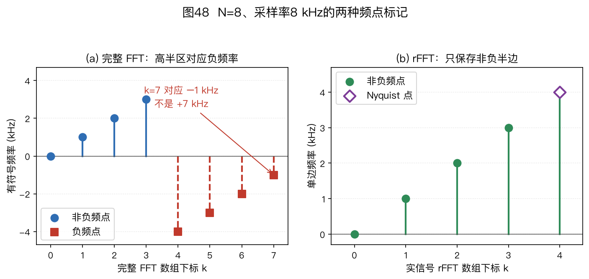
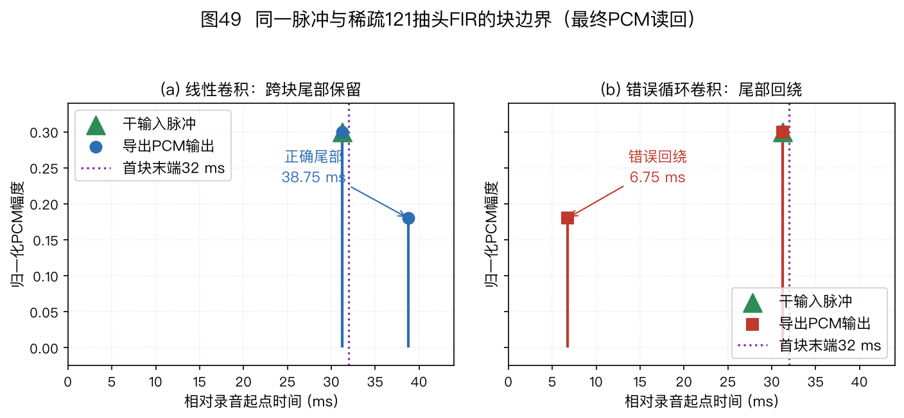
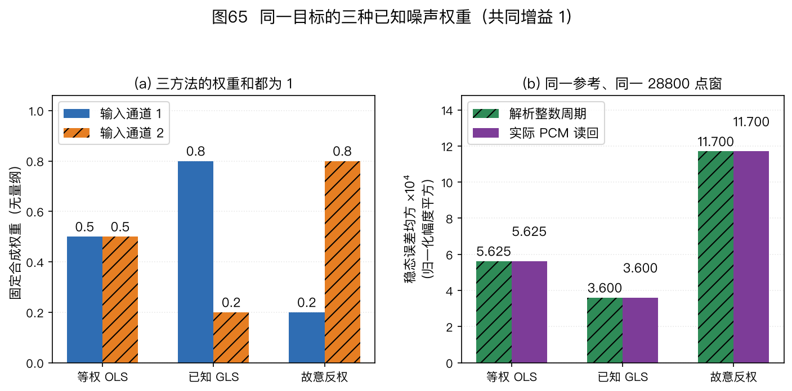

> ⚠️ 本篇是附录 A（正文共 11 章，另有两篇扩展专题和附录 A/B），可独立查阅，前后篇见下方导航。
>
> 🏠 首页导读：[`00_overview.md`](00_overview.md) ｜ 上一篇：[15_distributed-enhancement.md](15_distributed-enhancement.md) ｜ 下一篇：[13_appendix-guide.md](13_appendix-guide.md)

---

## 附录 A：符号、术语与数学基础

本附录的 12.1～12.3 汇总符号、术语和数学工具，12.4 用小矩阵、短序列与边界反例练习复算；下一篇是附录 B。遇到不熟悉的符号，可以先查 12.1，再回到使用它的章节核对模型条件；同一个字母在不同算法中可能有不同含义。

### 12.1 符号表

约定同 §2.3：**斜体 = 标量，头顶箭头 = 向量，加粗大写 = 矩阵**；$^H$ 表示共轭转置，$^\top$ 表示转置，$\hat{\ }$ 表示估计值。$X(f)$、$X(f_k,\ell)$ 这类大写字母按语音文献惯例表示逐频点复数**标量**。

本书采用前向傅里叶核 $e^{-\mathrm j2\pi ft}$。

阵列坐标约定为：麦 1 位于 $x=0$，麦 2 位于 $+x$；正横为 0°，正角朝麦 2；$\vec u$ 从阵列指向声源，传播方向为 $-\vec u$。

球谐公式常改用从 $+x$ 轴起算的方位角 $\alpha$ 和从 $+z$ 轴起算的极角 $\vartheta$。与本书从 $+y$ 朝 $+x$ 起算的声源方位角 $\theta$、从水平面起算的俯仰角 $\phi_{\mathrm{el}}$ 对接时，应先换算 $\alpha=\pi/2-\theta$（按 $2\pi$ 周期取值）、$\vartheta=\pi/2-\phi_{\mathrm{el}}$，再调用相应公式或接口，见[§5.8](05_beamforming.md#sec-5-8)。

**字母复用**（与 §2.3 一致）：受文献惯例所限，$k$ 可表示频点索引、波数或 WPE 的滞后帧号；$D$ 可表示阵列孔径或 PHD 强度函数；$\lambda$ 可表示波长、WPE 功率谱或矩阵特征值；$K$ 可表示声源数或 WPE 预测阶数；$s$ 可表示源信号或追踪状态。具体含义以所在公式的定义为准。

需要区分 STFT 网格时，本书用 $k$ 表示频点索引、$\ell$ 表示帧索引；连续时间仍用 $t$，离散采样索引用 $n$。实信号的**单边谱**取 $0\leq k\leq\lfloor N/2\rfloor$，对应非负频率 $f_k=kf_s/N$（Hz）。若存储完整 $N$ 点 DFT，后半段索引表示负频率：偶数 $N$ 的 $k>N/2$ 或奇数 $N$ 的 $k>(N-1)/2$ 应解释为 $(k-N)f_s/N$。偶数 $N$ 的 Nyquist 格点 $k=N/2$ 对实信号自共轭，可按单边谱约定记作 $+f_s/2$；不能把完整 DFT 的末格直接解释成接近 $+f_s$ 的新物理频率。E12-06 给出八点算例。

若必须给**完整双边频谱**的每个格点指定有符号代表频率，本书采用与 NumPy 的 fftfreq 接口一致的排列：

$$f_k^{\mathrm{full}}=
\begin{cases}
kf_s/N,&0\leq k<\lceil N/2\rceil,\\
(k-N)f_s/N,&\lceil N/2\rceil\leq k<N.
\end{cases}\tag{12-1}$$

偶数 $N$ 的 Nyquist 格点在式(12-1)中记为 $-f_s/2$，在实信号单边谱中记为 $+f_s/2$；这两个复指数在整数采样时刻完全相同，并不是两个可独立观测的频点。[NumPy 完整频率排列](https://numpy.org/doc/stable/reference/generated/numpy.fft.fftfreq.html "citation")与[实谱单边排列](https://numpy.org/doc/stable/reference/generated/numpy.fft.rfftfreq.html "citation")分别说明了这两种约定（NumPy 2.5 在线文档，2026-09-28 核实）。

| 符号 | 含义 |
|---|---|
| $M$, $d$, $D$ | 麦数、阵元间距、阵列孔径 |
| $N_{\mathrm{tar}}$（第8章OverIVA） | 单独输出的目标数量；$N_{\mathrm{tar}}<M$，不同于式(8-1)统计全部物理声源的$N$。背景可含多种混合干扰 |
| $c$, $\lambda$, $f$，$f_k$ | 声速（示例常取 343 m/s）、波长、连续物理频率（Hz）、单边 DFT/STFT 第 $k$ 个频点的非负物理频率 $f_k=kf_s/N$；完整双边 DFT 的负频率索引按上文换算 |
| $\theta$, $\theta_0$ | 正横方向起算的入射角、波束指向角；端射为 $\pm90°$ |
| $\vec u(\theta)$ | 从阵列指向声源的单位向量；声波传播方向为 $-\vec u$ |
| $\phi_{\mathrm{el}}$, $\vec u(\theta,\phi_{\mathrm{el}})$（第9章三维方向） | 俯仰从水平面朝+z为正，范围$[-90^\circ,90^\circ]$；方位仍从+y朝+x为正。极点方位无定义，积分的球面面积因子以弧度写成$\cos\phi_{\mathrm{el}}$（E09-26） |
| $\mathbf R_{\mathrm{WA}}$（第9章姿态） | 把阵列坐标的指源单位向量转换到世界坐标的已知正交旋转，行列式为+1、逆变换为其转置；不是空间协方差。右手z轴正旋转与本书方位的正方向相反（E09-26） |
| $\vec{r}_m$, $\vec{p}$ | 第 $m$ 个麦克风的位置向量、声源位置向量 |
| $t$, $n$, $k$, $\ell$, $L$ | 连续时间、离散采样索引、频点索引、帧索引、用于统计的快拍数；第 2 章式(2-6)、式(2-7)及本附录式(12-3)均用 $L$。其他章节若用 $T$ 或复用 $k$ 作滞后号，以当地公式的定义为准 |
| $\psi$ | 相邻两麦在指向补偿后的残余相位差（§2.6、§5.2）；E09-26局部另定义为右手绕+z的已知姿态角，两者不能混用 |
| $\vec{a}(\theta)$, $\vec{w}$ | 导向矢量、波束权重 |
| $\hat{\mathbf{R}}$, $\mathbf{R}_{nn}$, $\mathbf{R}_{ss}$ | 空间协方差矩阵、噪声协方差矩阵、目标协方差矩阵 |
| $\mathbf{\Gamma}$ | 球面各向同性弥散噪声场的相干矩阵；水平面入射模型另见 §5.1 |
| $\mathbf{E}_n$（$\mathbf{E}_s$） | 噪声（信号）子空间的特征向量基（§4.6） |
| $\sigma^2$ | 噪声方差/功率（白噪声下协方差为 $\sigma^2\mathbf{I}$） |
| $\mathbf{C}$, $\vec{f}$ | LCMV 约束矩阵与约束值向量，$\mathbf{C}^H\vec{w}=\vec{f}$（§5.5） |
| $\vec{e}_r$ | 参考麦选择向量（第 $r$ 位为 1 的单位向量，见[第 5 章 MWF 专题](05_beamforming.md#sec-u-fb93744989)的参考麦选择，MWF/SDW 用） |
| $U,u$（专题Ⅱ） | 节点总数与节点索引；节点 $u$ 持有 $M_u$ 个本地麦克风，总麦数为 $M=\sum_u M_u$ |
| $S,Q$（专题Ⅱ） | 潜在共同信号维数与每节点广播维数；原证明常要求 $Q=S$。此处 $Q$ 不是房间声学的声源指向因子 |
| $\mathbf T_u,\vec h_u$（专题Ⅱ） | $\mathbf T_u^H$将全观测压缩为节点可用观测，$\vec h_u$是相应接收权重；压缩后代价仍针对同一节点参考目标 |
| $\mathbf{B}$ | GSC 阻塞矩阵，满足 $\mathbf{B}^H\vec{a}(\theta_0)=\vec{0}$（§5.6） |
| $\Phi(f)$ | 在 §4.2 表示 GCC 的频率加权函数；在 §5.7 表示功率谱。两处符号相同，含义须根据所在公式区分。 |
| $\mathbf{P}$, $\mathbf{K}$, $\mathbf{Q}$, $\mathbf{F}$, $\mathbf{H}$ | 卡尔曼滤波：误差协方差、卡尔曼增益、过程噪声协方差、状态转移、观测矩阵（§9.2） |
| $\mu_j$, $c_j$, $L_j$（第9章IMM） | 模式后验概率、经过行转移矩阵的模式先验、模式条件观测似然密度。标量度制角观测的$L_j$单位为$\mathrm{deg}^{-1}$，它不是无量纲事件概率；缺测不提供新$L_j$（E09-24） |
| $\kappa_{\mathrm{vMF}}$, $\vec\mu_{\mathrm{vMF}}$, $A(k)$（第9章球面概率） | vMF无量纲集中度、单位集中方向、期望向量的长度。E09-26局部缩写为$k$和$\vec m$；均匀分布集中方向无定义。它们不同于IMM模式概率$\mu_j$、PHD杂波强度$\kappa_t(z)$和标量均值（E09-26） |
| $V$, $A$, $S$, $\bar\alpha$ | 房间体积、等效吸声面积、总表面积、平均吸声系数（§2.4） |
| $\mu_{\mathrm{NLMS}}$ | 归一化最小均方（Normalized Least Mean Squares，NLMS）步长（§6.1）；第 6 章给出理想无噪声单步收缩条件 $0<\mu<2$；它不是任意有色随机输入的均方稳定保证，实际取值还受正则项、观测误差和时变路径影响 |
| $\mu_{\mathrm{SDW}}$ | 语音失真加权多通道维纳滤波（Speech-Distortion-Weighted Multichannel Wiener Filter，SDW-MWF）的失真—降噪折中系数（[第 5 章 MWF 专题](05_beamforming.md#sec-u-fb93744989)）；与上一行的 NLMS 步长不是同一物理量 |
| $\varepsilon_{\mathrm{NLMS}}$ | 归一化最小均方（Normalized Least Mean Squares，NLMS）更新分母中的小正数，与输入能量同量纲，使零输入时分母仍为正，并限制低能量时的更新幅度（§6.1） |
| $\delta$, $\eta$ | 绝对对角加载 $\mathbf R+\delta\mathbf I$ 中的 $\delta$ 与 $\mathbf R$ 同量纲；相对加载 $\mathbf R+\eta\,\mathrm{tr}(\mathbf R)\mathbf I/M$ 中的 $\eta$ 无量纲（§5.4） |
| $\tau_{ij}$，TDOA | $\tau_{ij}=t_i-t_j$；到达时间差（Time Difference of Arrival，TDOA）。远场下 $\tau_{m1}=-(\vec r_m-\vec r_1)^\top\vec u/c$ |
| $T_{60}$，DRR，$d_c$ | 混响时间、直达混响比（Direct-to-Reverberant Ratio，DRR；dB 域读数）、临界距离 |
| WNG，DI，HPBW，SLL | 白噪声增益（White Noise Gain，WNG）、指向性指数（Directivity Index，DI）、半功率波束宽度（Half-Power Beamwidth，HPBW）、旁瓣电平（Side-Lobe Level，SLL） |
| RTF | 波束与空间模型中指相对传递函数（Relative Transfer Function）；工程与选型中指实时因子（Real-Time Factor），即声明统计区间内累计服务耗时/新推进音频时长；重叠分析窗不能把重复样本再计入分母。第10章遥测的可选`frame_service_rtf`另记单帧比，两者不互代。两种RTF缩写按章节语境区分 |
| $h(n)$，$\hat{\vec{w}}$，ERLE | 回声路径、AEC 自适应滤波器、回声返回损失增强（Echo Return Loss Enhancement，ERLE） |
| $G(k,f)$, $\Delta$, $K$ | WPE 预测系数、保护延迟、预测阶数。第 7 章局部用 $k$ 表示滞后帧号、$f$ 表示**无量纲离散频点索引**，不同于上表按 Hz 计的连续物理频率 $f$；换算及索引范围见 §7.1 |
| $\mathbf A$, $\mathbf P$, $\vec q$, $\vec b$（专题Ⅰ） | 成像传播字典、PSF矩阵、参考位置的候选源均方值、扫描输出均方值；$P_{ij}=|\vec w_i^H\vec a_j|^2$，行是扫描格、列是源格。与第9章卡尔曼误差协方差$\mathbf P$分开定义（§14.4） |
| CSM、$\mathbf R$（专题Ⅰ） | 互谱矩阵（Cross-Spectral Matrix）；未归一化FFT外积、每Hz谱密度、每频点均方值与单频复幅度均方矩阵有不同标度，见§14.3；数字量未校准时不能称Pa² |
| PHD/RFS | 概率假设密度（Probability Hypothesis Density，PHD）/随机有限集（Random Finite Set，RFS） |

表中 $\psi$ 的“残余”是相对于目标指向 $\theta_0$ 而言：来自 $\theta$ 的波先按 $\theta_0$ 补偿，之后相邻两麦还相差

$$\psi=\frac{2\pi d}{\lambda}(\sin\theta-\sin\theta_0)\text{。}$$

这里 $d/\lambda$ 和正弦差都无量纲，所以 $\psi$ 的单位是弧度。$\theta=\theta_0$ 时残余相位为零，各通道在目标方向对齐；偏离目标方向时，残余相位决定主瓣、零点和旁瓣的位置（§5.2）。

球面各向同性弥散噪声模型下，第 $i,j$ 个麦克风的相干系数写成

$$[\mathbf{\Gamma}]_{ij}=\operatorname{sinc}\!\left(\frac{2fd_{ij}}{c}\right),\qquad \operatorname{sinc}(x)=\frac{\sin(\pi x)}{\pi x}\text{。}$$

$d_{ij}$ 是两麦间距，$f$ 是 Hz 频率，$c$ 是声速；当 $i=j$ 或 $f=0$ 时取极限值 1。这一形状依赖声源从三维球面各方向入射的假设。若声源只从水平面各方向入射，相应形状为零阶贝塞尔函数 $J_0(2\pi f d_{ij}/c)$；两种声场不能混为同一个矩阵模型（§5.1）。

手算（12.1）：在无失真归一化、各通道自噪声独立且等功率时，$M=6$ 的 DSB WNG 是多少 dB？$2\times2$ 对角协方差 $\mathrm{diag}(4, 1)$ 的特征值是哪两个数？

答案：$10\log_{10}6\approx7.8$ dB；对角阵的特征值就是对角元 4 和 1。这里的特征向量是两条传感器空间坐标轴，不一定对应真实空间中的两个入射方向。

### 12.2 术语词典

下表按主题解释正文和相关文献中常见的术语。

#### 信号与数学基础

| 术语 | 解释 |
|---|---|
| STFT（短时傅里叶变换） | 把波形分成重叠短帧，并对每帧计算频谱，得到时间—频率复数表示。窗长与帧移按频率分辨率、时变性和延迟要求选择；逐频点处理可把宽带问题近似拆成多个窄带问题（§2.5） |
| 快拍（snapshot） | 某一帧、某一频点上，$M$ 个麦克风复数谱排成的列向量——阵列的一张“空间照片”（§2.5） |
| 空间协方差矩阵 $\hat{\mathbf{R}}$ | 阵列文献常把快拍外积的时间平均称为空间协方差。若未减均值，它严格说是未中心化样本二阶矩；与采用相同分母的中心化样本协方差只在**本批快拍的样本均值恰为零**时相等。总体零均值并不能保证有限样本均值为零。它是 Capon/MVDR/MUSIC 的常见输入，准确口径见第 2 章式(2-6)、式(2-7)。 |
| 特征分解 / 子空间 | 把厄米矩阵拆成特征值与特征向量。要把 $K$ 个较大特征值对应的特征向量解释为 $K$ 维信号子空间，需源协方差满秩、由各源导向矢量组成的矩阵满列秩、$K<M$、空间白噪声、源与噪声的交叉二阶矩为零及模型正确；有限快拍还会带来估计误差。其余噪声底特征向量张成噪声子空间（图6d、§4.6） |
| 超定方程组 | 方程比未知数多，通常无精确解、只可求最小二乘解——TDOA 定位的麦对多于未知数时就是这样（见§4.4） |
| 双曲线定位 | 在二维平面，一对麦测出的非退化距离差对应以两麦为焦点的双曲线的一支；在三维空间，对应双叶双曲面的一叶。多个独立麦对的交集可约束声源位置，退化时也可能没有唯一交点（§4.4）。 |
| 常规波束分辨率 / 超分辨 | 常规波束主瓣宽度的量级约为 $\lambda/D$；子空间方法在模型正确、信噪比和快拍数足够时可形成更窄谱峰，因此称为超分辨（§2.6、§4.6） |
| 波束图（beampattern） | 波束形成器对各个方向的增益图，主瓣/旁瓣/零陷都在上面读（图7a） |
| 自由度（DOF） | 可调参数的个数。逐频点 $M$ 麦复权重有 $M$ 个复数参数；每条**独立的复线性约束**通常减少一个复自由度，重复约束不再额外消耗，约束相矛盾则无可行解（§5.5）。稀疏阵用差分协同阵在满足二阶统计模型条件时增加虚拟维数，不能把它当作额外的物理麦克风（§3.3）。 |
| 抽头（tap） | FIR 滤波器的一个系数。“128 个抽头”表示 128 个系数；按多项式阶数定义时对应 127 阶，阅读文献时需核对作者采用的口径（§6.1） |
| 优先效应（precedence effect） | 先到声与短延迟后到声携带不同方向线索时，在两声相似、延迟及听觉任务满足相应条件下，方位判断常更偏向先到声；不表示所有反射都被忽略。[第 1 章 §1.1](01_problem-definition.md#sec-1-1)给出定义与 Wallach 等 1949 年原始出处；§2.4 解释房间反射模型。 |
| 拉格朗日乘子法 | 带约束求极值的标准工具：“约束写成等式加到目标里，再求导令零”，MVDR 的闭式解就是这么推的（§5.4） |
| GCC-PHAT 频谱相位加权 | 每个频点把非零互功率谱 $G_{12}(f)$ 除以 $|G_{12}(f)|$，使其模为 1、保留相位；零模频点须跳过或作数值保护。它改变时延估计中的频率权重，不能据此声称麦克风间噪声已被空间白化（§4.2）。[Knapp 与 Carter 的 GCC 原始论文](https://doi.org/10.1109/TASSP.1976.1162830 "citation") |
| 空间噪声白化（spatial noise whitening） | 在同一频点、正定噪声协方差 $\mathbf R_{nn}$ 已知时，对通道快拍施加矩阵 $\mathbf W$，使 $\mathbf W\mathbf R_{nn}\mathbf W^H=\mathbf I$；导向矢量也须改为 $\mathbf W\vec a$。它处理的是通道间的噪声协方差，不能与 GCC-PHAT 的逐频点标量加权混用。估计误差或病态矩阵需另行处理（E12-04）。 |
| sinc 函数 | 本书定义 $\mathrm{sinc}(x)=\sin(\pi x)/(\pi x)$。球面各向同性弥散场中的两麦相干系数具有 sinc 形式；若声源只在水平面各向同性分布，则对应零阶贝塞尔函数 $J_0(2\pi fd/c)$（§5.1）。另一些文献把 sinc 定义为 $\sin x/x$，代入公式前必须先核对定义 |
| SNR（信噪比） | 信号功率与噪声功率之比，常以 dB 表示。输出 SNR 减去输入 SNR 得到 SNR 增益。SER 在 AEC 语境中比较近端目标与回声功率，使用时应明确分子、分母和测量时段（§5.1、§6.1） |
| dB（分贝） | 比值的对数表示；功率比使用 $10\log_{10}$，幅度比使用 $20\log_{10}$。两种写法只有在两边功率与幅度平方使用相同比例常数时才对应同一物理变化（§12.3.2）。 |
| FFT（快速傅里叶变换） | 离散傅里叶变换的高效算法，把一帧时域样本转换为各频点的复数谱；STFT 对连续短帧重复这一运算（§2.5） |
| DNN（深度神经网络） | 由多层参数化变换组成、通过数据优化的模型。本教程主要用于估计时频掩码、方向概率或增强信号（§4.7、§5.9） |
| 远场 / 近场 | 远场中波前可近似为平面，导向模型主要由方向决定；近场采用球面波模型，还要考虑距离和通道幅度差。$2D^2/\lambda$ 可作为检查波前相位曲率的距离尺度，但不是单独决定远近场的硬边界；还要检查 $r\gg D$、允许的相位误差和通道幅度差（§2.2） |

#### 房间声学

| 术语 | 解释 |
|---|---|
| RIR（房间脉冲响应） | 在指定声源、接收位置和系统近似线性时，RIR 描述从声源到麦克风的声学传递路径；干净信号与 RIR 卷积可得到该路径下的接收信号（§2.4） |
| $T_{60}$ | 混响时间：房间声能衰减 60 dB 所需时间。具体数值取决于房间体积、表面吸声和测量频带 |
| 直达混响比（Direct-to-Reverberant Ratio，DRR） | 直达声能量 ÷ 混响声能量，dB 域读数：DRR（dB）>0 直达占优，DRR（dB）<0 混响占优；负值绝对值越大，混响能量相对越高 |
| 临界距离 $d_c$ | 在给定声源指向性与扩散场假设下，直达声和混响声能量相等、即 DRR=0 的距离；Sabine 近似下常写成 $d_c\approx0.057\sqrt{QV/T_{60}}$，其中 $Q$ 是声源指向因子。取全向声源 $Q=1$ 时才化为 $0.057\sqrt{V/T_{60}}$（§2.4） |
| 镜像法 | 把墙面反射等效成墙后镜像声源的仿真方法（Allen & Berkley 1979），pyroomacoustics 的核心 |
| 弥散噪声场 | 来自大量方向、没有单一主导入射方向的声场模型。晚期混响常用这一模型近似；麦克风附近的湍流风噪通常不满足各向同性弥散场假设 |

#### 自适应滤波、增强与分离

| 术语 | 解释 |
|---|---|
| LMS / NLMS / RLS | 最小均方（Least Mean Squares，LMS）结构简单；归一化最小均方（Normalized LMS，NLMS）按输入功率归一化步长；递归最小二乘（Recursive Least Squares，RLS）利用输入相关矩阵的递推逆，通常收敛更快，但计算量和存储量也更大。实际差距取决于输入相关性、滤波长度和参数设置（[GSC §5.6](05_beamforming.md#sec-5-6)、[NLMS §6.1.2](06_aec.md#sec-6-1-2)、[RLS §6.2.5](06_aec.md#sec-6-2-5)） |
| 音乐噪声 | 谱减类方法过度估计噪声后残留的随机孤立谱峰，听起来像叮咚作响的流水声（§5.7） |
| ICA / IVA | ICA 利用源间统计独立性估计解混矩阵；IVA 把同一输出在各频点的分量组成向量联合估计，以降低频点间排列不一致（§8.3） |
| NMF（非负矩阵分解） | 把非负谱量近似表示为谱基与激活的乘积；它本身不直接给出多通道解混矩阵，见[§8.3](08_speech-separation.md#sec-8-3) |
| AuxIVA | 辅助函数型独立向量分析；联合频点估计解混矩阵，输出各源的复数谱，仍需处理尺度和跨录音身份，见[§8.3](08_speech-separation.md#sec-8-3) |
| ILRMA | 独立低秩矩阵分析；结合确定型解混与NMF源功率模型，交替更新解混、谱基与激活，见[§8.3](08_speech-separation.md#sec-8-3) |
| MNMF | 多通道NMF；联合拟合源功率谱与空间协方差，常用多通道维纳滤波重构源图像。能表示欠定模型不等于这些源必然可辨认，见[§8.3](08_speech-separation.md#sec-8-3) |
| FastMNMF | 利用空间矩阵共同合同对角化加速MNMF；该共享表示有模型条件，不能省略对角化变换的Jacobian项，见[§8.3](08_speech-separation.md#sec-8-3)及E08-25～26 |
| cACGMM | 复角中心高斯混合模型；拟合归一化复观测的方向分布并输出责任度或掩码，方向归一化后不直接保留声功率尺度，见[§8.4.2](08_speech-separation.md#sec-8-4-2) |
| CSS（连续语音分离） | 在长录音上分窗分离、匹配输出排列并拼接；需要同时解决重叠区身份、尺度与相位问题，见[§8.6](08_speech-separation.md#sec-8-6) |
| TSE（目标说话人提取） | 按说话人嵌入等目标条件输出指定说话人的语音；条件可靠性与未见说话人的泛化需单独验证，见[§8.6](08_speech-separation.md#sec-8-6) |
| PIT | 排列不变训练在训练时选择与参考源匹配代价最小的输出排列；它不保证跨长录音的身份连续（§8.1） |
| DANSE | 分布式自适应节点特定信号估计（Distributed Adaptive Node-Specific Signal Estimation）；节点交换压缩本地信号并更新接收权重。参数更新异步与采样时钟异步分别处理，见[专题Ⅱ](15_distributed-enhancement.md) |
| GEVD | 广义特征值分解（Generalized Eigenvalue Decomposition）；在噪声度量中分解混合统计。GEVD-MWF按选定秩重构目标协方差，不等于最大信噪比的GEV波束，见[专题Ⅱ§15.12](15_distributed-enhancement.md#sec-15-12) |

#### 波束形成与阵列度量

| 术语 | 解释 |
|---|---|
| 导向矢量 $\vec{a}(\theta)$ | 指定频率和声源方向或位置时，各通道相对参考的复响应向量，包含幅度与相位；理想远场、同增益全向麦模型常简化为仅有相位差，近场与实测流形还要保留幅度差（§2.3） |
| 转向（steering） | 把波束对准某个方向：按导向矢量补偿各通道时延/相位 |
| 主瓣 / 旁瓣 / 零陷 | 波束图中目标指向附近的主要响应区、主瓣外的局部峰，以及响应接近零的方向（图 7a） |
| 栅瓣 | 空间采样混叠产生的高旁瓣；均匀线阵在特定间距和转向下可出现与主瓣等高的方向歧义（§2.6、图 7b） |
| 白噪声增益（White Noise Gain，WNG） | 衡量波束权重对各通道独立等功率白噪声的放大或抑制；在等幅理想目标导向、目标已对齐且无失真归一化下，$M$ 元等权 DSB 达到 $10\log_{10}M$ dB（§2.6） |
| 指向性指数（Directivity Index，DI） | 指定各向同性弥散场与归一化口径下的方向性收益（§2.6） |
| 半功率波束宽度（Half-Power Beamwidth，HPBW）/旁瓣电平（Side-Lobe Level，SLL） | HPBW 是主瓣两个 −3 dB 点间的角宽；SLL 是最高旁瓣相对主瓣的电平（§2.6、§5.2） |
| CRLB / CRB（克拉美－罗下界，Cramér–Rao Lower Bound） | 给定概率模型和正则条件下，无偏估计器方差的下界；模型、参数化或偏差条件改变，下界也改变（§2.6） |
| MVDR（最小方差无失真响应） | 在 $\vec{w}^H\vec{a}=1$ 的约束下最小化输出噪声功率。它保护目标方向或 RTF，同时压低噪声（§5.4） |
| MWF（多通道维纳滤波） | 最小化指定参考目标与输出之间的均方误差，允许目标失真与噪声残留共同进入代价；SDW-MWF 改变噪声项的权重。秩一化简和极限的条件见本表后的独立说明及[第 5 章 MWF 专题](05_beamforming.md#sec-u-fb93744989)。 |
| 相对传递函数（Relative Transfer Function，RTF） | 各通道相对参考通道的声学传递响应；是否包含早期反射取决于估计目标和时间窗，混响中 MVDR 常保护 RTF 而不是自由场导向矢量（§5.4） |
| 对角加载 | 求逆前在协方差矩阵上增加对角项，以改善条件数并降低对失配的敏感性。绝对加载写成 $\mathbf R+\delta\mathbf I$，相对加载写成 $\mathbf R+\eta\operatorname{tr}(\mathbf R)\mathbf I/M$；两种参数的量纲和缩放行为不同（§5.4、§12.3） |
| 相干源 | 在所分析频点，完全相干的多个源分量互为固定复数倍，使源协方差降秩；未去相关的标准 MUSIC 因此失去相应信号子空间条件。高度相关但非完全相干时未必严格降秩，却可能更难在有限快拍下分辨；空间平滑可在满足阵列与维数条件时改善这一问题（§4.6） |
| 空间平滑 | 第4章把物理线阵切成重叠子阵，对子阵协方差取平均，以孔径代价恢复相干源所需的秩；其元素单位为观测幅度平方。第3章差分协同阵的滞后向量外积平滑则基于二阶统计再构造矩阵，元素单位为观测幅度四次方；两者输入与统计对象不同，不能直接混用（[§4.6](04_doa-estimation.md#sec-4-6)、[§3.3](03_array-geometry.md#sec-3-3)） |
| 差分协同阵 | 由全部阵元位置差组成的有符号滞后集合。在互不相干源和通道响应一致等条件下，可由二阶统计重构虚拟协方差；连续滞后数、虚拟矩阵维数和物理孔径须分别计算，不能把差集的正负跨度当作物理孔径增加一倍（§3.3） |
| GEV 波束形成器 | 最大化输出信噪比的波束形成器（广义特征值问题的解），与 MVDR（见本组 MVDR 行）并列的掩码后处理选项（§5.9） |
| GSS（导引源分离） | 利用方向或说话人活动信息引导空间聚类与波束形成的分离方法；常用 cACGMM 估计时频掩码，并用活动标注约束输出排列（§8.4） |
| WDO（W-不重叠正交性，W-disjoint orthogonality） | 近似认为不同源在时频平面的非零支撑较少重叠，从而可逐时频点选取主导声源；它强于“互不相关”。例如两组系数 $[1,1]$ 与 $[1,-1]$ 的内积为 0，但两个位置都同时非零，故不能由正交或零互协方差推出 WDO。强混响或多人同时发声会削弱这一近似（§8.6）。[Yılmaz 与 Rickard 原始论文](https://doi.org/10.1109/TSP.2004.828896 "citation") |

#### MWF 的参考目标、秩一化简与噪声权重极限

多通道维纳滤波（Multichannel Wiener Filter，MWF）的参考目标是所选麦克风上的目标声像，不必等于原始源信号。语音失真加权多通道维纳滤波（Speech-Distortion-Weighted Multichannel Wiener Filter，SDW-MWF）最小化“目标失真 + $\mu$ 倍残余噪声”的均方代价。本书第 5 章式(5-12)定义 $\vec w_{\mathrm{SDW}}=(\mathbf R_{ss}+\mu\mathbf R_{nn})^{-1}\mathbf R_{ss}\vec e_r$；当目标与噪声的互二阶矩 $E[\vec s\vec n^H]=\mathbf0$ 时，$\mu=1$ 对应混合观测的普通MWF；零均值且不相关是一组充分条件。若存在非零均值，只说“协方差为零”还不够。增大 $\mu$ 会提高残余噪声的代价。相关原始模型及参考取点见[第 5 章专题](05_beamforming.md#sec-u-fb93744989)。

若目标是秩一模型 $\mathbf R_{ss}=\phi_s\vec a\vec a^H$，源功率 $\phi_s>0$，权重参数 $\mu>0$，噪声协方差 $\mathbf R_{nn}$ 厄米正定，并把参考响应归一化为 $a_r=\vec e_r^H\vec a=1$，则令 $q=\vec a^H\mathbf R_{nn}^{-1}\vec a>0$，可把 SDW-MWF 写成无失真 MVDR 权重乘实标量 $G_\mu=\phi_s q/(\mu+\phi_s q)$。此处 $\mu>0$ 保证正定噪声项使总矩阵可逆；$\mu\to0^+$ 的秩一极限不等于把 $\mu=0$ 直接代入一般矩阵逆。参考归一化条件不能省略：一般复参考响应还会带来 $a_r^*$ 因子，输出保护的是该参考声像。[第 5 章 E05-20](05_beamforming.md#e05-20)给出复参考的具体计算；[Wang 等作者预印本（2017），§§2、3.1～3.2，式(1)～(13)](https://arxiv.org/pdf/1707.00201 "citation")说明了对应的失真加噪声目标和秩一形式。

对于固定、半正定的 $\mathbf R_{ss}$，若 $\mathbf R_{nn}$ 正定，可把总矩阵写成 $\mu(\mathbf R_{nn}+\mathbf R_{ss}/\mu)$，括号中的矩阵最小特征值不低于 $\lambda_{\min}(\mathbf R_{nn})>0$，其逆范数有统一上界。因此总逆矩阵包含趋零的 $1/\mu$，权重在 $\mu\to\infty$ 时趋零。若噪声矩阵有零空间，这个论证缺少可逆的极限矩阵，不能照搬。E12-12 比较正定噪声与噪声零空间；“每个有限 $\mu$ 下总矩阵可逆”不是权重必趋零的充分条件。

#### 定位与追踪

| 术语 | 解释 |
|---|---|
| 到达时间差（Time Difference of Arrival，TDOA） | 本书定义 $\tau_{ij}=t_i-t_j$；同一声源到达一对麦克风的带符号时间差，是远场和近场定位的重要观测量（§2.1） |
| DOA（波达方向） | 声从哪个方向来，一般指角度。TDOA 是两路麦克风信号的到达时间差；紧凑阵列中常为几十到几百微秒。远场模型下，可结合麦克风间距和声速把 TDOA 换算成入射角（§4.1、§4.4） |
| ITD / ILD | 本书ITD取左耳到达时间减右耳到达时间，ILD取右耳声级减左耳声级（§1.1）；符号由这两种分别定义的差决定。双耳时间差（Interaural Time Difference，ITD）/双耳声级差（Interaural Level Difference，ILD）。双重理论把低频细结构 ITD 与高频 ILD 视为主要线索，但不是硬分界：低频可有 ILD，调制高频声也可提供包络 ITD（§1.1） |
| HRTF | 头相关传递函数：头、耳廓和躯干对声音的方向相关滤波；其谱形是判断俯仰和减少前后混淆的重要线索之一，并非唯一线索（§1.1） |
| 鸡尾酒会效应 | 人类在多人嘈杂环境中选择性聆听的能力；对应机器的波束形成 + 语音分离（§1.1、§8.1） |
| GCC-PHAT | 广义互相关的相位变换加权：每个非零互谱频点先除以该频点的模，再对频率求逆变换并按约定搜索时延峰。噪声、混响、周期信号或零互谱频点可能造成多峰、偏峰或无定义，峰值不是无需核查的真值（§4.2、E12-09）。 |
| SRP-PHAT | 遍历候选位置并汇总各麦对 PHAT 相关值的定位方法，是常用的稳健基线之一（§4.3） |
| Capon / MUSIC / ESPRIT | Capon 逐方向计算最小方差谱；MUSIC 利用导向矢量与噪声子空间的正交性形成伪谱；ESPRIT 利用阵列的平移不变结构直接估计参数。三者的协方差、源数和几何条件不同（§4.5、§4.6） |
| GDOP（几何精度因子） | 同样的时延误差经过不同几何布局会产生不同的位置误差。阵列孔径较小、麦对基线方向单一或目标位于不利方位时，几何误差放大通常更明显（§4.4） |
| VAD（语音活动检测） | 判断“当前帧有没有人在说话”，给定位/更新做门控 |
| 时频掩码（Time-Frequency Mask，TF-mask） | 定义在时频网格上的权重或选择函数，用于加权目标、干扰或噪声统计量。二值掩码和理想比值掩码常限制在 $[0,1]$，但复值掩码、幅度比掩码及某些网络输出可以超出该区间；使用时必须写明类型、取值域和作用对象（§5.4、§5.9） |
| 新息（innovation） | 卡尔曼滤波里“观测 − 预测”的差，用它修正状态估计（§9.2） |
| EKF（扩展卡尔曼滤波） / UKF（无迹卡尔曼滤波） | 两种非线性卡尔曼滤波。EKF 用雅可比做局部线性化；UKF 让一组 sigma 点通过非线性函数。UKF 可减小某些非线性变换的近似误差，但不保证总比 EKF 稳或准，仍取决于模型、调参和数值实现（§9.2） |
| JPDA / MHT | 多目标追踪中解决“观测属于谁”的两类经典方法：联合概率数据关联 / 多假设跟踪（§9.3） |
| 锥面模糊 | 线阵只观测方向在阵列轴上的投影，同一时延可对应绕阵列轴的一圈方向；平面阵的两侧则是法向镜像歧义，二者不要混为一种（§3.1） |
| FIR 滤波器 | 有限长冲激响应滤波器：输出 = 输入最近若干样本的加权和，抽头数（抽头见本表“信号与数学基础”组）就是加权长度（§5.1、§6.1） |
| 重采样（粒子滤波） | 按当前权重抽取粒子索引并重置等权；高权粒子被保留或复制的机会较大，但不是确定性删小留大（[§9.2.4 算例 9-2：粒子加权与重采样](09_source-tracking.md#sec-9-2-4)） |
| 概率假设密度（Probability Hypothesis Density，PHD）滤波 | 传播随机有限集（Random Finite Set，RFS）的一阶矩（强度函数）。某一区域上 $D(\vec x)$ 的积分给出该区域内目标数的期望值；实际目标状态常从强度峰或高斯分量提取，峰的个数本身不等于人数（§9.3） |
| OSPA（最优子模式分配距离） | 多目标追踪误差度量，同时罚定位误差和人数错误（§10.5 评测指标表） |

#### 系统与硬件

| 术语 | 解释 |
|---|---|
| AEC | 声学回声消除（Acoustic Echo Cancellation，AEC）：用已知的播放信号做参考，估计回声副本再相减（§6.1） |
| DTD（双讲检测） | 检测近端语音与远端播放同时活动的状态，用于冻结、减小步长或切换到稳健的 AEC 更新策略（[§6.4](06_aec.md#sec-6-4)） |
| 回声返回损失增强（Echo Return Loss Enhancement，ERLE） | 衡量同一窗口内回声分量的能量衰减；真实录音通常用远端单讲近似。双讲若无独立回声及残余回声真值，不能用混合输入／总输出功率比代替；设备、路径、取点与窗口须说明（§6.7） |
| WPE | 加权预测误差去混响：用过去帧预测晚期混响拖尾再减掉（§7.1） |
| SI-SDR / STOI / PESQ / WER | 尺度不变信号失真比 / 短时客观可懂度 / 感知语音质量客观评估 / 词错误率。它们的输入、对齐、单位和解释不同；PESQ 是旧研究常用客观指标，不是受试者主观评分，ITU-T P.862 的撤销及 P.863 现行口径见 §10.5。 |
| SDR / SIR / SAR | BSS Eval 原始指标组：信号失真比 / 信号干扰比 / 信号伪影比。原始定义允许参考滤波对齐；不同工具和版本的尺度、排列及滤波窗口口径不能直接互换。复现旧论文时记录具体实现与版本，和尺度不变的 SI-SDR 分开报告（§10.5）。 |
| MEMS 麦克风 | 使用微机电工艺制造的微型麦克风，是小型阵列中的常见器件 |
| PDM / I2S / TDM | 常见数字音频接口。单线承载的通道数、时隙和位宽由具体控制器及协议配置决定；阵列通道应共享或校准采样时钟（§10.2） |
| dBA | A 计权声级：按规定的 A 计权频率响应处理后得到的声级。它不是未加权 dB，比较数据时要核对参考量和计权方式 |
| AOP（声学过载点） | 在数据手册规定的测试条件下，麦克风输出达到指定失真阈值时的输入声压级；比较器件时必须同时核对阈值、频率和供电条件（§10.2） |
| 孔径（aperture） | 阵列的最大跨度 $D$。常规波束的角宽具有 $\lambda/D$ 的量级关系，系数随几何、转向和加权变化；它不能统一代表所有DOA算法的分辨率或估计误差，见[§3.1](03_array-geometry.md#sec-3-1)及[§2.6](02_basics-signal-model.md#sec-2-6) |
| 阵列流形（manifold） | 全体候选方向或位置的导向矢量集合，即阵列的方向响应模型；几何定义见 §2.3，实测标定见 §3.4 与 §10.2 |
| AFE（音频前端） | Audio Front End：位于采集与识别、通信或交互后端之间的音频处理部分，可包含 AEC、去混响、波束、降噪和电平控制；实际模块由任务决定（§10.1） |
| 双讲（double-talk） | 远端播放与近端用户同时发声。近端语音出现在麦克风或误差信号中，不应出现在理想的远端参考信号中；它会使 AEC 的误差不再只含路径失配，因此需用 DTD 控制自适应更新（[§6.4](06_aec.md#sec-6-4)） |
| MOS（平均意见分） | 按规定听测流程收集受试者评分并取统计量。量表、问题、材料和受试者筛选由具体标准规定；客观模型只能在其验证范围内近似预测主观质量（§10.5） |
| CHiME | 面向复杂声学场景的公开挑战系列，不同届次覆盖远场识别、会议转写、分离或增强等不同任务；数据生成方式和指标应按当届说明读取（附录 B 13.2） |
| KWS（关键词唤醒） | Keyword Spotting：检测预设关键词的模型。可作为低功耗常驻任务，也可与 VAD、AEC 或增强共享前端；取点和运行方式由功耗及训练数据决定（§10.3、§10.9） |
| BOM（物料清单） | Bill of Materials：列明设备所需物料及数量；按目标产量的采购单价汇总才得到 BOM 成本。未列入清单的接口、结构增量及标定、维护费用另行核算，已列入的物料不得重复计费（§11.1） |
| HATS（人工头） | Head and Torso Simulator：带耳廓、耳模拟器和躯干声学结构的测试装置；测量话筒位于设备规定的测量位置，并按其校准口径表示耳参考点或近似鼓膜处的声压，不能写成“话筒置于人的鼓膜”。装置定义与耳模拟器的测量位置须分别查 [ITU-T P.58（03/2023，§§3.1.3～3.1.5、9.2）](https://www.itu.int/rec/T-REC-P.58/en "citation") 与 [ITU-T P.57（06/2021）](https://www.itu.int/rec/T-REC-P.57/en "citation")（2026-09-28 核实）。 |
| NLP（非线性处理） | Non-Linear Processing：AEC 里接在线性滤波器之后的残余回声抑制（谱减式/神经式），对付扬声器非线性失真等线性滤波器消不掉的部分；[§6.8](06_aec.md#sec-6-8)解释处理结构，[§6.12](06_aec.md#sec-6-12)解释工作点。注意与自然语言处理（Natural Language Processing）同缩写，语境区分 |
| PBFDAF | 分区块频域自适应滤波：把长回声路径分块并用 FFT 计算卷积与更新。第 6 章式(6-5)与同配置的频域多抽头 NLMS 更新逐分量相同；相对逐样本时域实现能节省多少计算取决于滤波长度、分块、FFT 库和硬件（§6.2） |
| IPNLMS | 改进比例 NLMS：按抽头幅度分配各系数的更新量。原论文常用 $\alpha$ 表示混合系数，第6章改记 $\kappa$。$\kappa=-1$ 时各抽头权重均为 $1/L$，还须取 $\varepsilon_{\mathrm{NLMS}}=L\delta_{\mathrm{IPNLMS}}$ 才与相应NLMS正则项完全一致；$\kappa=1$ 为纯比例端点，零初值可能使所有更新权重为零；$\kappa=0$ 混合均匀与比例两部分。具体取值要与所用公式和数据一同验证（§6.2） |
| CNG（舒适噪声） | Comfort Noise Generation：残余抑制压得太狠时补回的轻微背景噪声，避免通话“死寂”听感（§6.8） |
| pAEC | 个性化 AEC：把目标说话人的声纹嵌入作为条件，在双讲中增强目标说话人；定义和隐私要求见 §6.5、§6.13 |
| barge-in（打断） | 设备播放 TTS 或音乐时用户直接说话的交互状态。系统需在自发声期间保留近端语音或唤醒词，并让 VAD/KWS 使用合适的 AEC 后取点（§6.5） |
| TCLw | 加权终端耦合损耗：免提终端回声衰减的测试指标。阈值、信号和收敛窗口必须按产品适用的标准版本及测试条款核对，不能跨标准套用一个固定数值（§6.7） |

手算（12.2）：幅度减半是多少 dB？功率减半又是多少 dB？这是两个不同的物理变化；§12.3.2 还会说明同一物理变化怎样用幅度比或功率比等价表示。

答案：幅度减半为 $20\log_{10}0.5\approx-6$ dB；功率减半为 $10\log_{10}0.5\approx-3$ dB。前者对应功率变为四分之一，后者对应幅度变为 $1/\sqrt{2}$。

### 12.3 预备知识速览

本节为已接触三角函数、复数和初步线性代数的读者集中解释正文反复使用的数学操作。每个式子先看输入维度、单位与成立条件，再看计算；较长的算法推导仍留在对应正文。

#### 12.3.1 复数与相位：时延的符号

本书用 $e^{+j2\pi ft}$ 表示正频率复正弦，并采用前向傅里叶变换 $X(f)=\int x(t)e^{-j2\pi ft}\,\mathrm dt$。复数可写成 $z=Ae^{j\phi}$，且 $e^{j\phi}=\cos\phi+j\sin\phi$。

在此约定下，延迟 $\tau$ 对应乘子 $e^{-j2\pi f\tau}$。对麦 1 参考的远场导向矢量，$\tau_{m1}=-(\vec r_m-\vec r_1)^\top\vec u/c$，所以

$$a_m=e^{-j2\pi f\tau_{m1}}=e^{+j2\pi f(\vec r_m-\vec r_1)^\top\vec u/c}\text{。}$$

例如麦 2 在麦 1 的 $+x$ 侧 $0.04$ m、声源位于 $\theta=+30^\circ$，以 $c=343$ m/s、$f=1$ kHz 计算，$\tau_{21}=-0.04\sin30^\circ/343\approx-58.31$ μs。因此麦 2 **先收到**，但其正频率导向分量相对麦 1 的相位为 $-2\pi(1000)\tau_{21}\approx+0.3664$ rad。负到达时差与正频域相位并不矛盾，分别来自到达时间的定义和前向傅里叶核。

若采用相反傅里叶约定，相关公式的相位符号也要整体改变，不能只改其中一式（§2.3、§4.2）。

#### 12.3.2 分贝：幅度比与功率比

能量或功率比用 $10\log_{10}(\cdot)$，幅度比在两边使用相同的“功率与幅度平方”比例常数时用 $20\log_{10}(\cdot)$。系数相差一倍，是因为相应功率与幅度平方成正比。

因此，同一物理变化用两种比值表示时，dB 数相同：幅度变为 0.5 时功率变为 0.25，$20\log_{10}0.5=10\log_{10}0.25\approx-6$ dB。

| dB | 幅度比 | 功率比 |
|---|---|---|
| 约 +6.02 dB | ×2 | ×4 |
| 约 +3.01 dB | ×1.414（$\sqrt{2}$） | ×2 |
| 0 dB | ×1 | ×1 |
| 约 −3.01 dB | ×0.707（$1/\sqrt{2}$） | **×1/2（半功率点）** |
| 约 −6.02 dB | **×1/2（幅度减半）** | ×1/4 |
| −20 dB | ×0.1 | ×0.01 |

对数把连乘转为相加，便于表示跨越多个数量级的增益、信噪比和衰减。

dB 练习：① 功率先乘 4 再乘 2，总增益是多少 dB？② 电压增益为 −6 dB 时，幅度比约为多少？

答案：① $10\log_{10}(4\times2)\approx9$ dB；② 幅度约减半，功率约为原来的四分之一。

**SNR 换算例。** 目标功率为 3、噪声功率为 1 时，线性 SNR 为 3，对应 $10\log_{10}3\approx4.8$ dB。若处理后输出 SNR 为 12 dB，则 SNR 增益约为 $12-4.8=7.2$ dB。输入 SNR、输出 SNR 和 SNR 增益是三个不同的量（§5.1）。

#### 12.3.3 卷积与相关

卷积 $y=x*h$ 表示信号 $x$ 经过线性时不变系统 $h$ 后的输出；在固定声源和接收位置的近似下，$h$ 可以取房间脉冲响应（§2.4）。

对离散时间序列，$y[n]=\sum_k h[k]x[n-k]$。先选定输出时刻 $n$，再把各个过去输入 $x[n-k]$ 乘上对应路径系数 $h[k]$ 并相加；附录练习 E12-01 用两个抽头逐项计算。

相关 $R(\tau)$ 衡量两段信号在相对位移 $\tau$ 下的相似度；峰值位置可作为时延候选（§4.2）。

先约定有限序列在给定范围以外取零。对复数序列，本书的相关与时延次序为

$$R_{12}[q]=\sum_{n\in\mathbb Z}x_1[n]x_2^*[n-q]\text{。}\tag{12-2}$$

$q$ 是整数采样延迟，第二路的星号是复共轭；实值录音中可省略星号。在**无噪声、同波形同极性且正相关峰唯一**的延迟例子里，若第一路比第二路晚到一采样，最大正峰在 $q=+1$；交换两路，峰位变为 $-1$。

例如 $x_2=[1,0,0]$、$x_1=[0,1,0]$，则 $R_{12}[1]=1$，$R_{12}[0]=R_{12}[-1]=0$。若第一路脉冲反相，$q=+1$ 处会是负峰，不能直接套用“取最大正峰”的规则。E12-09 会把同极性脉冲的全部滞后列出。

有限序列若不补足零而直接在原长度上用 FFT 相乘，得到的是**循环相关**，边界绕回会改变峰及其含义。[SciPy 1.18.0 的相关定义](https://docs.scipy.org/doc/scipy/reference/generated/scipy.signal.correlate.html "citation")采用同一复共轭次序（在线文档 2026-09-28 核实）；使用其他接口仍须核对其参数顺序和滞后数组。

傅里叶变换把线性卷积转成频域乘法，配合快速傅里叶变换可降低长卷积的计算量，但分帧、补零和重叠相加仍要按实现条件处理。

这里的卷积恒等式属于精确代数，float64 FFT 还有舍入误差与有限数值支持范围。输入有限不保证中间频谱、乘积或最终输出都可可靠表示；教学核对检测到的支持丢失明确报错，不能把中间下溢得到的零解释为真实静音。一般 FFT 结果也不承诺逐点精确，E12-01、E12-08 的普通尺度例子只检验补零和块边界。

#### 12.3.4 期望、方差与协方差矩阵

期望 $E[\cdot]$ 表示概率模型下的平均；有限数据里的样本平均是对实际观测求和，两者不能直接画等号。实变量的方差是偏离均值的平方平均；复变量须取**模平方** $E|z-Ez|^2$，这样功率才是非负实数。两个复变量的协方差也要给第二项取共轭。对一批 $M$ 维列快拍 $\vec x_1,\ldots,\vec x_L$，阵列文献常用的未中心化矩阵为

$$\hat{\mathbf R}=\frac1L\sum_{\ell=1}^{L}\vec x_\ell\vec x_\ell^H,
\qquad
\vec x_\ell\in\mathbb C^M,\quad
\hat{\mathbf R}\in\mathbb C^{M\times M}\text{。}\tag{12-3}$$

外积的第 $i,j$ 项是 $x_{i,\ell}x_{j,\ell}^*$，所以 $\hat R_{ji}=\hat R_{ij}^*$。任取 $\vec v\in\mathbb C^M$，
$\vec v^H\hat{\mathbf R}\vec v=L^{-1}\sum_\ell|\vec v^H\vec x_\ell|^2\geq0$；这说明式(12-3)是厄米、半正定矩阵，但不保证正定或可逆。例如只有一张两麦快拍 $\vec x=[1,\mathrm j]^\top$ 时，外积为 $\left[\begin{smallmatrix}1&-\mathrm j\\ \mathrm j&1\end{smallmatrix}\right]$，特征值为 $2$ 和 $0$，秩只有 $1$。

如果在同一批快拍上先计算样本均值 $\bar{\vec x}$，再用相同分母 $L$ 计算中心化矩阵 $\hat{\mathbf C}_L$，逐项展开得到 $\hat{\mathbf R}=\hat{\mathbf C}_L+\bar{\vec x}\bar{\vec x}^H$（第 2 章式(2-7)）。因此两者逐批相等的条件是**本批** $\bar{\vec x}=0$。即使产生这些快拍的随机过程总体均值为零，有限一批数据的样本均值也可能不为零；E12-02 用复快拍直接算出差别，E12-10 再检查中心化如何影响秩。

厄米半正定只验证了二阶矩的合法形状，不自动给出 proper 复高斯概率模型。实信号的 DC 与偶数长度 Nyquist 格点是实量，不能直接套用内点的非退化 proper 复高斯密度；端点建模与适用范围见[第 7 章 §7.1](07_wpe-dereverberation.md#sec-7-1)。

#### 12.3.5 最小二乘

方程比未知数多时通常没有精确解。最小二乘求使总残差平方最小的 $\hat{\vec{x}}$：

$$\min_{\vec{x}}\|\mathbf{A}\vec{x}-\vec{b}\|^2\text{。}$$

设 $\mathbf A\in\mathbb C^{m\times p}$、$\vec x\in\mathbb C^p$、$\vec b\in\mathbb C^m$。残差 $\vec r=\mathbf A\vec x-\vec b$ 是 $m$ 维，平方范数 $\|\vec r\|_2^2=\vec r^H\vec r$ 是非负实数。展开为 $\vec x^H\mathbf A^H\mathbf A\vec x-\vec x^H\mathbf A^H\vec b-\vec b^H\mathbf A\vec x+\vec b^H\vec b$；对 $\vec x^*$ 求驻点，得到正规方程

$$\mathbf A^H\mathbf A\hat{\vec x}=\mathbf A^H\vec b\text{。}\tag{12-4}$$

式(12-4)左、右两边都是 $p$ 维列向量。当 $\mathbf A$ 满列秩时，$\mathbf A^H\mathbf A$ 正定且可逆，闭式解为 $\hat{\vec{x}}=(\mathbf{A}^H\mathbf{A})^{-1}\mathbf{A}^H\vec{b}$；若不满列秩，不能直接使用这个普通逆矩阵。

闭式表达式不是要求程序显式形成逆矩阵；即使满列秩，形成 $\mathbf A^H\mathbf A$ 也会使二范数条件数由 $\kappa_2(\mathbf A)$ 变为 $\kappa_2(\mathbf A)^2$。小奇异值因此更容易受舍入误差影响。QR 或奇异值分解（Singular Value Decomposition，SVD）通常更适合作为数值求解入口；E12-11 用一个对角矩阵把条件数平方算出来。

秩不足时最小二乘解可能不唯一，Moore–Penrose 伪逆给出其中二范数最小的一解。`numpy.linalg.lstsq` 同时返回秩与奇异值；判秩取决于截断比率 `rcond` 和浮点精度，须连同输入版本或显式参数记录。对秩不足的输入，接口返回的残差数组可能是空的；空数组不等于“残差已测为零”，应自行计算 $\|\mathbf A\hat{\vec x}-\vec b\|_2$。[NumPy 2.5 最小二乘接口说明](https://numpy.org/doc/stable/reference/generated/numpy.linalg.lstsq.html "citation")（在线文档 2026-09-28 核实）。E12-03 给出两列完全相关的例子。

式(12-4)等价于 $\mathbf A^H\vec r=\vec0$：最优残差与 $\mathbf A$ 每个列方向正交。拟合向量 $\mathbf A\hat{\vec x}$ 是 $\vec b$ 在这些列张成空间上的正交投影。令其他系数产生增量 $\vec d$，展开 $\|\vec r+\mathbf A\vec d\|_2^2$，交叉项因 $\mathbf A^H\vec r=0$ 消失，只剩 $\|\vec r\|_2^2+\|\mathbf A\vec d\|_2^2$，所以任何这样的改变量都不能进一步减小残差。E12-14 用两维复向量核对共轭和正交性。

对复标量 $z=u+\mathrm jv$，形式偏导 $\partial/\partial z^*=\tfrac12(\partial/\partial u+\mathrm j\partial/\partial v)$，$\partial/\partial z=\tfrac12(\partial/\partial u-\mathrm j\partial/\partial v)$。实值目标的 $\partial J/\partial z^*=0$ 等价于实部、虚部两个偏导同时为零；向量按分量使用同一规则。本节展开式的导数是 $\mathbf A^H\mathbf A\vec x-\mathbf A^H\vec b$，因此得到式(12-4)。这些偏导的定义与实坐标解释见[Kreutz–Delgado 作者预印本（2009），§§3.1～3.2，式(8)、(9)、(18)、(19)](https://arxiv.org/pdf/0906.4835 "citation")；无须假设实值平方误差是关于 $z$ 的解析函数。

TDOA 几何解算（§4.4）和 WPE 系数估计（§7.2）都会用到这一思想。已知噪声权重如何改变正交度量见 §12.3.9。

#### 12.3.6 带约束的最小化：MVDR 拉格朗日推导

先取同一频点的噪声协方差 $\mathbf R=\mathbf R_{nn}\in\mathbb C^{M\times M}$ 为厄米正定矩阵，目标导向矢量 $\vec a\in\mathbb C^M$ 非零，权重 $\vec w\in\mathbb C^M$ 满足 $\vec w^H\vec a=1$；$\lambda\in\mathbb C$ 是约束乘子。这些前提保证逆矩阵与后面的正实数分母存在；协方差仅半正定时需另行求解，见 E12-05。

**第 1 步：写拉格朗日函数。** 复约束必须同时包含约束及其共轭，常写成实值函数

$$\mathcal L(\vec w,\lambda)=\vec{w}^H\mathbf{R}\vec{w}+2\operatorname{Re}\!\left\{\lambda^*(\vec{w}^H\vec{a}-1)\right\}\text{。}$$

**第 2 步：求驻点。** 对 $\vec w^*$ 做 Wirtinger 求导并令零，得到 $\mathbf R\vec w+\lambda^*\vec a=0$。

**第 3 步：写出比例关系。** 乘子的命名可吸收共轭与负号，因此得到 $\vec w\propto\mathbf R^{-1}\vec a$。

**第 4 步：代回约束。** 写 $\vec w=\kappa\mathbf R^{-1}\vec a$，则 $\vec w^H\vec a=\kappa^*\vec a^H\mathbf R^{-1}\vec a=1$。若 $\mathbf R$ 厄米正定，分母 $q=\vec a^H\mathbf R^{-1}\vec a$ 是正实数，所以 $\kappa=1/q$，得到 $\vec w=\mathbf R^{-1}\vec a/(\vec a^H\mathbf R^{-1}\vec a)$，即 §5.4 式(5-9)。

若协方差奇异，不能直接使用这一逆矩阵形式；需另行处理秩或加载。LCMV 把标量约束和乘子换成向量形式（§5.5）。

**Wirtinger 求导。** 对实值目标函数，可在 Wirtinger 微积分中把 $\vec{w}$ 和 $\vec{w}^*$ 视为形式上独立的变量，对 $\vec{w}^*$ 求偏导并令其为零。§5.4 给出了与实部、虚部分别求导等价的完整推导。

#### 12.3.7 特征值分解

对厄米（Hermitian）协方差矩阵可写 $\mathbf{R}=\mathbf{E}\boldsymbol\Lambda\mathbf{E}^H$。特征向量是传感器观测空间中的正交主轴，特征值表示沿这些主轴的能量；它们通常不等于真实空间中的 DOA。

MUSIC（§4.6）在源统计满秩、导向矩阵满列秩、源数小于麦数、空间白噪声、源与噪声交叉二阶矩为零及模型正确的条件下，把较大特征值对应的特征向量所张成的空间解释为信号子空间，把噪声底对应的特征向量所张成的空间解释为噪声子空间。特征值是标量；张成空间的是特征向量。白噪声条件不自动消除源—噪声交叉项，[第 2 章 E02-17](02_basics-signal-model.md#sec-u-f997371ee0)给出反例。

调用 `numpy.linalg.eigh` 前仍要独立核查输入的厄米性与半正定性。该接口按 `UPLO` 选择一个三角部分，并忽略对角元素的虚部；它可以从一个不合法的原输入返回有限特征值，不能把调用成功视作协方差验证。[NumPy 2.5 官方参数与 Notes](https://numpy.org/doc/stable/reference/generated/numpy.linalg.eigh.html "citation")及 E12-18 说明了具体行为。厄米半正定输入也可能是奇异矩阵，合法不等于可逆。

手算（12.3）：协方差 $\begin{bmatrix}4&0\\0&1\end{bmatrix}$ 的特征值和特征向量各是什么？若两个共轭对称的非对角元都变成 0.5，哪个特征值变大？

答案：特征值为 4 和 1，对应特征向量可取 $[1,0]^{\top}$ 和 $[0,1]^{\top}$。非对角元都变为 0.5 后，特征方程为 $(4-\lambda)(1-\lambda)-0.5^2=0$，即 $\lambda^2-5\lambda+3.75=0$。两个根为 $(5\pm\sqrt{10})/2$，约 4.08 和 0.92，仍都非负；在这个固定对角元的例子里，非零通道相关使特征值间隔增大。这不是“所有相关性增加都会改善定位”的结论，MUSIC 还需要源模型、阵列几何和足够的快拍。

#### 12.3.8 病态矩阵与对角加载

当最大、最小奇异值相差很大时，矩阵条件数高，求逆在不利扰动方向上可能显著放大数据和舍入误差；不是每个扰动都达到这一最坏放大量。低频小间距的超指向设计（§5.3）是常见例子。

- 绝对加载写作 $\mathbf R+\delta\mathbf I$，$\delta$ 与协方差元素同量纲；
- 相对加载写作 $\mathbf R+\eta\operatorname{tr}(\mathbf R)\mathbf I/M$，$\eta$ 无量纲，整体缩放 $\mathbf R$ 时加载也同比缩放。

对厄米半正定矩阵，正加载可抬高小特征值，并可能改变最优权重和指向性。变化不是必然：若 $\mathbf R=\operatorname{diag}(4,1)$、$\vec a=[1,0]^\top$，任意正加载下的归一化 MVDR 都是 $[1,0]^\top$。报告参数时必须说明采用哪一种口径，不能只写一个无单位的“$\varepsilon$”。

[附录 B §13.6.2 的第 5 章题 8：改变六麦圆阵半径并比较 WNG、DI 与条件数](13_appendix-guide.md#sec-13-6-2)提供相应练习；它不是综合编号 E13-08。数值由脚本参数决定，不预设固定区间。

#### 12.3.9 已知噪声加权：在哪个度量下投影？

设观测模型为 $\vec b=\mathbf A\vec x_*+\vec n$，其中 $\mathbf A\in\mathbb C^{m\times p}$ 是设计矩阵，$\vec x_*\in\mathbb C^p$ 是真实参数，$\vec b,\vec n\in\mathbb C^m$ 分别是观测和噪声。$\vec n$ 均值为零，已知协方差 $\mathbf C=E[\vec n\vec n^H]$ 厄米正定。本节的 $\mathbf C$ 是 $m\times m$ 噪声协方差，不是符号表中的 LCMV 约束矩阵。普通最小二乘（Ordinary Least Squares，OLS）把每个观测残差等权计入；加权最小二乘（Weighted Least Squares，WLS）用 $\mathbf C^{-1}$ 计入观测可信度。相关噪声需要矩阵权重，不能只按对角元素分别相除。

令 $\vec r=\mathbf A\vec x-\vec b$，加权目标与满列秩闭式解为

$$\begin{aligned}
\hat{\vec x}_{\mathrm{WLS}}
&=\mathop{\arg\min}_{\vec x}\ \vec r^H\mathbf C^{-1}\vec r,\\
\mathbf A^H\mathbf C^{-1}\mathbf A\hat{\vec x}_{\mathrm{WLS}}
&=\mathbf A^H\mathbf C^{-1}\vec b,\\
\hat{\vec x}_{\mathrm{WLS}}
&=(\mathbf A^H\mathbf C^{-1}\mathbf A)^{-1}
\mathbf A^H\mathbf C^{-1}\vec b\text{。}
\end{aligned}\tag{12-5}$$

$\mathbf A^H\mathbf C^{-1}\mathbf A$ 是 $p\times p$；满列秩与正定 $\mathbf C$ 保证它正定。选择可逆的 $m\times m$ 噪声白化矩阵 $\mathbf W$ 使 $\mathbf W\mathbf C\mathbf W^H=\mathbf I$，则 $\mathbf W^H\mathbf W=\mathbf C^{-1}$，加权代价就是 $\|\mathbf W\mathbf A\vec x-\mathbf W\vec b\|_2^2$。白化后必须同时变换设计矩阵和观测。本书从这一等式推导式(12-5)；[LAPACK 作者《用户指南》第 3 版的广义线性模型说明](https://netlib.org/lapack/lug/node28.html "citation")也给出可逆噪声因子下的加权最小二乘等价关系。

驻点条件是 $\mathbf A^H\mathbf C^{-1}\vec r=\vec0$，所以加权残差在 $\mathbf C^{-1}$ 度量下与设计列正交。它一般不满足普通的 $\mathbf A^H\vec r=0$。E12-15 直接算出这两个量的区别。

若 $\mathbf A$ 与真实 $\mathbf C$ 已知、$\mathbf A$ 满列秩，式(12-5)是线性无偏估计：代入 $E\vec b=\mathbf A\vec x_*$ 后得到 $E\hat{\vec x}=\vec x_*$。E12-15 在两观测标量模型中直接比较无偏权重的方差；这不要求噪声高斯，也不保证每一次观测都比 OLS 更接近真值。噪声模型估错、协方差奇异或设计矩阵本身带误差时，需要另行检验。用共同目标的两路确定性音频比较权重见 E12-19；那些正交频点不是独立随机过程的实测证明。

#### 12.3.10 数值截断与正则：删去还是收缩弱方向？

奇异值分解把设计矩阵写成 $\mathbf A=\mathbf U\boldsymbol\Sigma\mathbf V^H$，其中非负奇异值 $\sigma_i$ 表示对应方向的观测强度。没有截断时，一个非零奇异方向的逆因子是 $1/\sigma_i$，小奇异值会放大该方向上的观测误差。截断奇异值分解（Truncated Singular Value Decomposition，TSVD）选择一个阈值，直接不估计低于保留标准的方向；它改变了有效估计空间。

二次正则又称 ridge 或 Tikhonov 正则，在残差外惩罚参数范数。令 $\delta>0$，两种解在奇异坐标下为

$$\begin{aligned}
\hat{\vec x}_{\mathrm{TSVD}}
&=\sum_{\sigma_i>\rho\sigma_{\max}}
\frac{\vec u_i^H\vec b}{\sigma_i}\vec v_i,\\
\hat{\vec x}_{\delta}
&=\mathop{\arg\min}_{\vec x}
\bigl(\|\mathbf A\vec x-\vec b\|_2^2
+\delta\|\vec x\|_2^2\bigr),\\
(\mathbf A^H\mathbf A+\delta\mathbf I)\hat{\vec x}_{\delta}
&=\mathbf A^H\vec b,\\
\hat{\vec x}_{\delta}
&=\sum_i\frac{\sigma_i}{\sigma_i^2+\delta}
(\vec u_i^H\vec b)\vec v_i\text{。}
\end{aligned}\tag{12-6}$$

$\vec u_i\in\mathbb C^m$、$\vec v_i\in\mathbb C^p$ 分别是左、右奇异向量；和式遍历薄 SVD 的奇异方向。$\rho\geq0$ 是无量纲的相对截断比率，本式显式定义保留 $\sigma_i>\rho\sigma_{\max}$ 的项；实际接口阈值的相等边界还须按该实现核对。$\delta$ 与 $\mathbf A^H\mathbf A$ 的元素同量纲，不能把 `rcond` 的无量纲数直接当作加性加载量。零奇异值在 ridge 的和式中贡献零，正则后的正规矩阵则因 $\delta>0$ 可逆。这里的零中心范数惩罚表达了对参数规模的偏好，没有增加观测信息。

式(12-6)由把 $\mathbf A=\mathbf U\boldsymbol\Sigma\mathbf V^H$ 代入目标、逐奇异方向求驻点得到。TSVD 的弱方向贡献直接为零，ridge 的弱方向贡献随 $\delta$ 连续缩小；二者都可能引入相对于真实参数的偏差，却不是同一个优化问题。E12-16 用 $10^{-8}$ 的弱方向比较完整解、截断解和半幅收缩。

[LAPACK 作者的最小二乘说明](https://netlib.org/lapack/lug/node27.html "citation")区分满秩 QR/LQ 与秩不足的最小范数解；[NumPy 2.5 `lstsq` 文档的 `rcond` 和 Returns](https://numpy.org/doc/stable/reference/generated/numpy.linalg.lstsq.html "citation")说明数值判秩及空残差数组。以上接口说明核实于 2026-10-02。程序还应报告显式阈值与实际残差，不能仅因返回了有限参数就称原问题已被可靠辨识。

### 12.4 计算练习

E12-01～04 可通过 `.venv/bin/python -m codes.chapters.ch00.cross_chapter.exercises_engineering` 复算；E12-05 的奇异矩阵反例使用 `.venv/bin/python -m codes.chapters.ch00.cross_chapter.spatial_model_exercises`。E12-06～19 使用 `.venv/bin/python -m codes.chapters.appendix_a.appendix_a_experiments`。题中数组均为本书构造的输入；下列答案先从短序列或代数独立求出，再用代码核对。图 48～49 与配套音频只说明明确给定的离散模型，不等于自然语音或实测房间。

#### E12-01：FFT 乘法为什么需要补零

取 $x=[1,2]$、$h=[1,0.5]$，下标都从 0 开始。求完整线性卷积，再比较 FFT 长度为 2 和 3 时的结果。

线性卷积逐点为 $y_0=1\times1=1$、$y_1=1\times0.5+2\times1=2.5$、$y_2=2\times0.5=1$，共 $2+2-1=3$ 点。

FFT 长度为 2 时，频域相乘给出的是 2 点循环卷积，第三点绕回第零点，结果为 $[1+1,2.5]=[2,2.5]$。补零到 3 点或更长，才可容纳这次完整线性卷积；FFT 长度不必是 2 的幂，但不同长度的执行效率可能不同。

这道题只检查一次有限卷积。连续音频还需要正确保留重叠与历史，不能对每个短块独立补零、丢掉尾部，再假定拼接结果等于整段卷积。

#### E12-02：未中心化二阶矩为什么不总等于协方差

一个频点上有两路麦克风、两个快拍（$L=2$），列向量为 $\vec x_1=[1,\mathrm j]^\top$、$\vec x_2=[1,-\mathrm j]^\top$。分别计算以快拍数 2 为分母的二阶矩，以及先减样本均值的协方差。本题不使用无偏估计的 $L-1$ 分母。

两个外积为

$$
\vec x_1\vec x_1^H=\begin{bmatrix}1&-\mathrm j\\\mathrm j&1\end{bmatrix},\qquad
\vec x_2\vec x_2^H=\begin{bmatrix}1&\mathrm j\\-\mathrm j&1\end{bmatrix}.
$$

相加除以 2 得 $\mathbf I$。均值是 $\bar{\vec x}=[1,0]^\top$；减均值后的两列为 $[0,\mathrm j]^\top$ 和 $[0,-\mathrm j]^\top$，所以中心化结果为 $\operatorname{diag}(0,1)$。

第一路始终为 1，有二阶矩能量，却没有相对样本均值的波动。这个例子说明减均值会改变秩，不能把两种估计混着解释。复外积还必须使用共轭转置：$\mathrm j\,\mathrm j^*=1$，若误写成 $\mathrm j^2=-1$，会把非负功率算成负数。

#### E12-03：零残差是否意味着参数唯一

给定

$$
\mathbf A=\begin{bmatrix}1&1\\2&2\end{bmatrix},\qquad
\vec b=\begin{bmatrix}2\\4\end{bmatrix}.
$$

求所有满足 $\mathbf A\vec x=\vec b$ 的解，并找出范数最小者。`numpy.linalg.lstsq` 应报告多大的秩？

第二行是第一行的两倍，只有 $x_1+x_2=2$ 这一条独立约束，所以在复数域里所有解可写成 $[t,2-t]^\top$，其中 $t\in\mathbb C$。不能把复数向量的范数写成分量直接平方之和；正确的平方二范数为

$$\left\|\begin{bmatrix}t\\2-t\end{bmatrix}\right\|_2^2
=|t|^2+|2-t|^2
=2|t-1|^2+2\text{。}$$

模平方非负，因此 $t=1$ 唯一使范数最小；最小范数解为 $[1,1]^\top$，矩阵秩为 1。作为边界检查，取 $t=\mathrm j$ 时，真实平方范数为 $|\mathrm j|^2+|2-\mathrm j|^2=1+5=6$，而误写 $t^2+(2-t)^2$ 会得到非实数 $2-4\mathrm j$。奇异值的解析值为 $\sqrt{10}$ 和 0；浮点运算可能把后者显示成接近零的小正数。运行代码时记录 NumPy 版本、截断比率和对应的奇异值阈值，不把显示出来的近零值当成数学上的独立观测。

残差为零只说明输入方程被满足，没有说明两个参数可分别辨认。增加同一参数方向的重复行仍不改变秩：即使重复测量的噪声相互独立，也不能消除参数零空间。要从观测中辨认两个参数，新增行必须提供新的参数方向；例如追加 $[1,-1]$ 可使设计矩阵从秩1升至秩2，而追加 $[1,1]$ 仍是秩1。明确的先验约束也可选出一个解，但该信息来自先验，不能称为观测新增了方向。

#### E12-04：频谱相位加权能使空间噪声白化吗？

在一个固定频点，设两麦噪声零均值，协方差为 $\mathbf R_{nn}=\operatorname{diag}(4,1)$，两个通道的噪声功率单位相同。求一个对角白化矩阵 $\mathbf W$，算出白化后的噪声协方差；若目标导向矢量原为 $\vec a=[1,1]^\top$，处理后应使用哪一个导向矢量？最后判断只对互功率谱作 PHAT 加权能否得到同样的结果。

第一路噪声功率是第二路的 4 倍，所以把第一路幅度乘 $1/2$，第二路保持原样：

$$
\mathbf W=\begin{bmatrix}1/2&0\\0&1\end{bmatrix},\quad
\mathbf W\mathbf R_{nn}\mathbf W^H
=\begin{bmatrix}(1/2)^2\!\times4&0\\0&1^2\!\times1\end{bmatrix}
=\mathbf I,\quad
\mathbf W\vec a=\begin{bmatrix}1/2\\1\end{bmatrix}。
$$

这里两个特征值由 $4,1$ 变为 $1,1$，但目标导向矢量也改变了。若用白化后的数据与原导向矢量 $[1,1]^\top$ 匹配，空间模型就不一致。这个矩阵例子由本书构造，并非实测噪声。

PHAT 的运算对象却是**一个频点的一对通道的互功率谱**：当 $G_{12}(f)\ne0$ 时，$G_{12}(f)/|G_{12}(f)|$ 是一个模为 1 的复数，不会把两路快拍分别乘上 $1/2$ 和 $1$。例如两路确定的复频谱值为 $X_1=2$、$X_2=1$ 时，互谱为 2，PHAT 后为 1，但这不是把噪声协方差变成单位阵。

本题两路噪声互不相关，理论噪声互功率谱为 0；此时 PHAT 还须跳过或保护分母，更不能从零互谱推得 $\mathbf W$。这反驳了“PHAT 等于空间白化”的说法，但不否定 PHAT 在时延估计中抑制源谱幅度影响的用途。复算入口为 [`exercises_engineering.py`](../codes/chapters/ch00/cross_chapter/exercises_engineering.py) 的 `E12-04`。

第 4 章 E04-11 进一步给出非对角噪声协方差与完整方向搜索：只白化协方差会得到 −4.8°，同步变换导向才得到给定的 0° 真值。那是已知噪声模型下的确定性例子，不是一般噪声中的定位精度保证。

#### E12-05：奇异协方差中，把逆换成伪逆是否总能得到 MVDR？

考虑明确的一组输入：

$$\mathbf R=\begin{bmatrix}0&0\\0&1\end{bmatrix},\qquad
\vec a=\begin{bmatrix}1\\1\end{bmatrix},\qquad
\min_{\vec w}\ \vec w^H\mathbf R\vec w
\quad\text{使 }\vec w^H\vec a=1\text{。}$$

这里第一通道在该理想模型中完全没有噪声，第二通道噪声功率为 1；目标在两路的响应都是 1。协方差是半正定而非正定，不能直接套用第 5 章式(5-9)的可逆前提。

**第一步：先用原问题求答案。** 令权重为 $[w_1,w_2]^\top$。约束是 $w_1^*+w_2^*=1$，目标函数是 $|w_2|^2$。非负量的下界为 0；取 $w_2=0,w_1=1$ 同时满足约束并达到下界，因此 $\vec w_*=[1,0]^\top$ 是全局最优解，输出噪声功率为 0。

**第二步：检查机械替换的结果。** 本题 Moore–Penrose 伪逆为 $\mathbf R^+=\operatorname{diag}(0,1)$。若未经条件检查就用

$$\vec w_+=\frac{\mathbf R^+\vec a}{\vec a^H\mathbf R^+\vec a}
=[0,1]^\top,$$

它的分母为 1，约束也确实满足，但输出噪声功率为 1。程序没有除零、没有 NaN、也没有违反名义响应，却仍然没有解对原优化问题。

原因在于 $\mathbf R^+$ 把零特征值方向映射成零；而本题第一通道方向恰好可以在不付噪声代价的同时满足目标约束。机械替换把这个有用的零空间分量丢掉了。这个反例只推翻“所有奇异协方差都可以这样替换”的说法，不表示伪逆在所有波束或最小二乘问题中都无效。

**第三步：对照正加载的极限。** 对 $\delta>0$，$\mathbf R_\delta=\mathbf R+\delta\mathbf I=\operatorname{diag}(\delta,1+\delta)$ 可逆，式(5-9)给出

$$\vec w_\delta
=\frac{[1/\delta,\ 1/(1+\delta)]^\top}{1/\delta+1/(1+\delta)}
=\begin{bmatrix}(1+\delta)/(1+2\delta)\\\delta/(1+2\delta)\end{bmatrix}\text{。}$$

为了比较同一声场，仍用原始 $\mathbf R$ 评分，输出噪声功率为 $[\delta/(1+2\delta)]^2$：

| 方法或加载量 | 第一权重 | 第二权重 | 原声场输出噪声功率 |
|---|---:|---:|---:|
| 机械替换为伪逆 | 0.000000 | 1.000000 | 1.000000 |
| $\delta=1$ | 0.666667 | 0.333333 | 0.111111 |
| $\delta=0.1$ | 0.916667 | 0.083333 | 0.006944 |
| $\delta=0.01$ | 0.990196 | 0.009804 | 0.000096 |
| 直接解原约束问题 | 1.000000 | 0.000000 | 0.000000 |

当 $\delta\to0^+$，加载解趋向 $[1,0]^\top$，并不趋向机械替换的 $[0,1]^\top$。数值截断、伪逆与加载极限是不同操作，不能仅因都涉及“小特征值”就互换。

**工程解释。** 真实麦克风一般不会拥有完全零噪声通道；这个精确半正定模型用于揭示优化前提，不能据此推荐把实际加载降到零。有限快拍、通道重复或秩约束模型都可能产生奇异样本协方差。此时应先判断目标是否含零空间分量，再选加载、明确的子空间约束或其他相应求解方法。E12-03 中伪逆给出最小范数最小二乘解的结论仍然成立，那是另一个目标函数与约束问题。

本题是本书自行构造的代数反例，运行 `.venv/bin/python -m codes.chapters.ch00.cross_chapter.spatial_model_exercises` 的 `E12-05` 可核对可行性、两种输出功率与加载极限；[源码](../codes/chapters/ch00/cross_chapter/spatial_model_exercises.py)使用给定矩阵，不把反例扩写成通用奇异 MVDR 求解器。

#### E12-06：完整 FFT 的末格是接近采样率的正频率吗？

给定 $N=8$、$f_s=8$ kHz，列出完整 DFT 从 $k=0$ 到 $7$ 的有符号代表频率，以及实信号单边 FFT 保留的频率。再分别考虑 $x[n]=\cos(2\pi n/8)$ 与 $z[n]=(-1)^n$（$n=0,\ldots,7$）：两者的非零频点在哪里？本题使用前向 DFT 无 $1/N$、逆变换带 $1/N$ 的约定。

**频率格。** 格点间隔是 $f_s/N=1$ kHz。由式(12-1)，完整频率依次是 $[0,1,2,3,-4,-3,-2,-1]$ kHz；实输入单边谱是 $[0,1,2,3,4]$ kHz。故 $k=7$ 代表 $-1$ kHz，不是 $+7$ kHz。$k=4$ 在完整 fftfreq 口径记作 $-4$ kHz，在单边 rfftfreq 口径记作 $+4$ kHz。

**复谱核对。** $\cos(2\pi n/8)=\tfrac12e^{\mathrm j2\pi n/8}+\tfrac12e^{-\mathrm j2\pi n/8}$，所以无归一化完整 DFT 只有 $X[1]=X[7]=8/2=4$ 非零。$(-1)^n=e^{\mathrm j\pi n}=e^{-\mathrm j\pi n}$ 对整数 $n$ 完全相同，因此它只有 $Z[4]=8$ 一个 Nyquist 格点；不能把 $+4$ 与 $-4$ kHz 各计成一份独立能量。正负频率分量对实余弦互为共轭，但填入阵列导向相位时须用与所取谱格一致的有符号频率。

图 48（a）按 fftfreq 约定画出 $N=8$、$f_s=8$ kHz 的全部格点，$k=4$ 记为 $-4$ kHz；（b）只保存实信号的非负格点，$k=4$ 记为 $+4$ kHz。两幅图中的 Nyquist 标注是**同一个离散格点**，不是两次观测。图示给的是频率坐标约定，不表示补零增加了频率分辨能力。[代码复算](../codes/chapters/appendix_a/appendix_a_experiments.py)还列出余弦的两个非零格点。

#### E12-07：复向量为什么不能用普通转置计算能量？

取 $\vec x=[1,\mathrm j]^\top$。分别计算 $\vec x^H\vec x$ 和 $\vec x^\top\vec x$，并说明哪个可作为模平方之和。

共轭转置后，$\vec x^H=[1,-\mathrm j]$，所以 $\vec x^H\vec x=1+(-\mathrm j)\mathrm j=2$。普通转置却给 $\vec x^\top\vec x=1+\mathrm j^2=0$；它发生相消，不能表示这路非零向量的能量。与 E12-02 一样，外积 $\vec x\vec x^H=\left[\begin{smallmatrix}1&-\mathrm j\\\mathrm j&1\end{smallmatrix}\right]$ 是厄米半正定的，但单个外积的秩仅为 1。这个确定性复向量只说明复共轭的必要性；要称为统计功率，仍须定义平均区间或概率模型。

#### E12-08：连续信号分块后，尾部能直接丢弃吗？

输入 $x=[1,2,3,4]$、两抽头 FIR $h=[1,0.5]$，每块新输入 $B=2$ 点。求完整线性卷积；再比较“每块独立做长度 2 的 FFT 乘法，把两点逆 FFT 结果直接拼接”的错误结果。本题是确定性离散序列，不涉及窗函数或房间测量。

整段线性卷积为 $[1,2.5,4,5.5,2]$。正确的重叠相加逐块计算如下：

| 输入块 | 本块长度 3 的线性卷积 | 放回全局时间轴 |
|---|---|---|
| $[1,2]$，从 $n=0$ 起 | $[1,2.5,1]$ | 放在 $n=0,1,2$ |
| $[3,4]$，从 $n=2$ 起 | $[3,5.5,2]$ | 放在 $n=2,3,4$ |

两块在 $n=2$ 重叠，故该点为 $1+3=4$，其余点照原位置保留。错误的两点循环卷积则分别为 $[2,2.5]$、$[5,5.5]$，拼接成 $[2,2.5,5,5.5]$：第一块尾项 1 绕回到 $n=0$，第二块尾项 2 绕回到 $n=2$，末尾 $n=4$ 也丢失。E12-01 只检查一次短卷积；本题说明连续分块时还必须保留并相加跨块尾部。对于长度 $B$ 的新输入和 $L_h$ 抽头 FIR，每块的线性结果长 $B+L_h-1$，FFT 长度至少达到这个长度才可避免本块循环别名。

图 49 把上述两点手算扩展到下文的 16 kHz PCM 脉冲音频，而不是直接画小序列 $x=[1,2,3,4]$。（a）为正确线性卷积，（b）为刻意构造的错误逐块循环卷积；两图使用相同的 $B=512$、$h[0]=1$、$h[120]=0.6$、输入脉冲与共同导出增益 1。首脉冲在 $n=500$（$31.25\,\mathrm{ms}$），竖虚线标出 $n=512$（$32\,\mathrm{ms}$）块边界。正确尾部在 $n=620$（$38.75\,\mathrm{ms}$），错误实现却将尾部绕回到 $n=108$（$6.75\,\mathrm{ms}$）。左、右两图的纵轴都是最终 PCM 读回幅度；图中的提前脉冲不是物理声学预回声。

下面三个[数学合成音频](../codes/chapters/ch00/research/05_exercises_and_audio.md)把同一问题换成可听的块边界。先降低音量，再分别播放。

- [干脉冲](../codes/chapters/appendix_a/audio/math_block_dry.wav)
- [正确线性 FIR](../codes/chapters/appendix_a/audio/math_block_linear.wav)
- [错误逐块循环](../codes/chapters/appendix_a/audio/math_block_circular.wav)

三路均为 16 kHz、2 s、单声道 PCM16，使用同一导出增益 1；输入含 10 个幅度 0.3 的数学脉冲，位置为 $500+3072i$（$i=0,\ldots,9$），滤波器仅 $h[0]=1,h[120]=0.6$，块长 512。第一个脉冲的正确副脉冲在 $n=620$，错误循环实现却把它绕回本块的 $n=108$。导出 PCM 读回分别约为 0.299988 和 0.179993；错误文件的 $n=620$ 为 0。这是刻意构造的错误分块示例，不是实测房间回声，也不等于听测通过。

本题入口先严格只读核验主清单、生成源摘要和三个实际 WAV，再读取 PCM 样值；浮点模型结果另列。资产缺失或摘要不一致时检查失败，不自动重生。实际 PCM 的首脉冲为 $9830/32768$，线性副脉冲及错误绕回脉冲均为 $5898/32768$；本题展示有限支持下的普通 FFT 数值结果，不承诺所有有限输入都能可靠计算。

当前唯一 FFT 教学核采用保守支持规则：两个输入都含非零值时，各自非零绝对值的二进制指数跨度不得超过 40，最小非零乘积须处于正常 float64 数的支持区，并检查中间频谱和输出是否有限。超出这些限制会明确报错；这不等于精确数学卷积不可表示，更不等于结果为零。限制用于拒绝已发现的中间支持丢失，不保证一般相消场景下的逐点相对精度。

#### E12-09：交换互相关的两路输入会怎样改变延迟符号？

给定 $x_1=[0,1,0]$、$x_2=[1,0,0]$，两段以同一全局 $n=0$ 起点记录，范围外补零。按式(12-2)计算 $q=-2,-1,0,1,2$ 的 $R_{12}[q]$ 和交换输入后的 $R_{21}[q]$，指出峰位与哪一路较晚到。

$x_1$ 仅在 $n=1$ 为 1，$x_2$ 仅在 $n=0$ 为 1。$R_{12}[q]$ 的唯一非零项要求 $n=1$ 且 $n-q=0$，所以 $q=+1$；依上述滞后顺序，五个值为 $[0,0,0,1,0]$。交换后唯一非零项要求 $n=0$ 且 $n-q=1$，所以 $q=-1$，五个值为 $[0,1,0,0,0]$。这是“麦 1 比麦 2 晚一采样”在本书相关定义下的符号。若改用另一调用顺序、未补零的循环相关或周期信号，这一单峰表不能直接照搬；GCC-PHAT 还会进一步按频率归一化互谱，并非只做这里的普通相关。

#### E12-10：减样本均值会怎样改变协方差的秩？

在一个固定频点，取两个三通道快拍 $\vec x_1=[1,0,0]^\top$、$\vec x_2=[0,1,0]^\top$。都以 $L=2$ 为分母，计算未中心化二阶矩、样本均值与中心化协方差，再比较它们的秩和特征值。本题不使用无偏估计分母 $L-1$。

两个外积之和除以 2 得 $\hat{\mathbf R}=\operatorname{diag}(1/2,1/2,0)$，秩为 2，特征值为 $1/2,1/2,0$。样本均值为 $\bar{\vec x}=[1/2,1/2,0]^\top$；中心化后的两个向量互为相反数，分别为 $[1/2,-1/2,0]^\top$ 与 $[-1/2,1/2,0]^\top$。由此

$$\hat{\mathbf C}_2=
\begin{bmatrix}
1/4&-1/4&0\\
-1/4&1/4&0\\
0&0&0
\end{bmatrix},
\qquad
\operatorname{eig}(\hat{\mathbf C}_2)=\{1/2,0,0\}\text{。}$$

它是半正定但秩只有 1，并满足 $\hat{\mathbf R}-\hat{\mathbf C}_2=\bar{\vec x}\bar{\vec x}^H$。两快拍中心化后至多剩 $L-1=1$ 个独立方向；这不是“真实声源必定只有一个”的估计，不能只为提高估计秩而任意决定是否去均值。E12-02 用复数两通道展示了同一恒等式的另一种输入。

#### E12-11：为什么不建议直接形成正规方程？

取 $\mathbf A=\operatorname{diag}(1,10^{-4})$、$\vec b=[1,10^{-4}]^\top$。求 $\mathbf A\vec x=\vec b$ 的解、$\mathbf A$ 的二范数条件数，以及式(12-4)左边矩阵 $\mathbf A^H\mathbf A$ 的二范数条件数。

$\mathbf A$ 的两个奇异值为 $1$ 和 $10^{-4}$，所以 $\kappa_2(\mathbf A)=10^4$。正规方程矩阵为 $\operatorname{diag}(1,10^{-8})$，条件数升至 $10^8$；右边是 $\mathbf A^H\vec b=[1,10^{-8}]^\top$。解析解仍为 $\vec x=[1,1]^\top$，在这个可精确描述的小例中，“条件数增大”不等于已经测得某个特定求解器产生了误差。它说明真实数据若含扰动或有限精度误差，直接形成正规方程可能更敏感；复杂矩阵优先考虑 QR/SVD，并按任务评估代价。

#### E12-12：SDW-MWF 的噪声权重趋大时一定归零吗？

取目标协方差 $\mathbf R_{ss}=\operatorname{diag}(1,0)$，参考选择向量 $\vec e_r=[1,0]^\top$。先令噪声协方差为 $\mathbf R_{nn}=\operatorname{diag}(0,1)$，再改为 $\mathbf I$；两种情况下都用 $\vec w_\mu=(\mathbf R_{ss}+\mu\mathbf R_{nn})^{-1}\mathbf R_{ss}\vec e_r$，逐一计算 $\mu=1,10,10^6$ 的权重及 $\mu\to\infty$ 的极限。

**噪声有零空间。** 第一种矩阵的和为 $\operatorname{diag}(1,\mu)$，对每个 $\mu>0$ 都可逆。右边为 $[1,0]^\top$，所以三个权重均为 $[1,0]^\top$，极限也不为零。第一通道恰在噪声零空间中，增大它的噪声惩罚不会改变该通道的输出；这不表示真实麦克风有完全无噪声通道。

**噪声正定。** 将噪声矩阵改为 $\mathbf I$，则 $\vec w_\mu=[1/(1+\mu),0]^\top$。$\mu=1,10,10^6$ 时第一权重分别为 $0.5$、约 $0.090909$、约 $9.99999\times10^{-7}$，极限为零。两组的目标与参考完全相同，改变的只有噪声矩阵是否正定。因此“$\mu$ 趋大则零输出”必须写出充分条件；“总矩阵每次可逆”本身不足以推出极限。[代码复算](../codes/chapters/appendix_a/appendix_a_experiments.py)返回两组权重，结果属于本书代数反例，不是实际语音质量比较。

#### E12-13：绝对与相对对角加载在整体缩放后有何不同？

本书手算：取两麦同一频点的协方差 $\mathbf R=\operatorname{diag}(4,1)$、$M=2$、非零目标导向矢量 $\vec a=[1,1]^\top$。分别以绝对参数 $\delta=1$ 和相对参数 $\eta=0.4$ 加载，按第 5 章式(5-9)求 MVDR 权重及加载矩阵的二范数条件数。然后仅将 $\mathbf R$ 乘以 10，保持 $\delta$、$\eta$ 的数值不变，重新计算。这里的数是确定性代数输入，不是估计协方差或硬件实测值。

**先算加载量。** 原矩阵的平均对角元素为 $\operatorname{tr}(\mathbf R)/M=(4+1)/2=2.5$，所以相对加载增加 $\eta\operatorname{tr}(\mathbf R)/M=0.4\times2.5=1$，恰与绝对加载 $\delta=1$ 相同，两者都得到 $\operatorname{diag}(5,2)$。$\delta$ 和协方差元素同量纲；$\eta$ 无量纲，乘上平均对角元素后的加性项才具有协方差量纲。

**再求权重。** 对任意正对角加载矩阵 $\mathbf D=\operatorname{diag}(d_1,d_2)$，有 $\mathbf D^{-1}\vec a=[1/d_1,1/d_2]^\top$，式(5-9)的归一化分母为 $\vec a^H\mathbf D^{-1}\vec a=1/d_1+1/d_2$，因此 $\vec w=[d_2/(d_1+d_2),\ d_1/(d_1+d_2)]^\top$。初始加载时分母为 $1/5+1/2=7/10$，权重为 $[2/7,5/7]^\top$；约束检查为 $\vec w^H\vec a=2/7+5/7=1$。正对角矩阵的二范数条件数是较大对角元除以较小对角元，此处为 $5/2=2.5$。

整体缩放后的 $10\mathbf R=\operatorname{diag}(40,10)$，其平均对角元素为 25。固定 $\delta=1$ 时加性项仍是 1，归一化分母为 $1/41+1/11=52/451$；固定 $\eta=0.4$ 时加性项变为 $0.4\times25=10$，归一化分母为 $1/50+1/20=7/100$。代入上面的二元权重式得到：

| 情况 | 加载矩阵 $\mathbf D$ | MVDR 权重 $\vec w$ | $\kappa_2(\mathbf D)$ |
|---|---|---|---:|
| 初始，两种参数 | $\operatorname{diag}(5,2)$ | $[2/7,5/7]^\top$ | $2.5$ |
| $10\mathbf R$，绝对 $\delta=1$ | $\operatorname{diag}(41,11)$ | $[11/52,41/52]^\top$ | $41/11\approx3.7273$ |
| $10\mathbf R$，相对 $\eta=0.4$ | $\operatorname{diag}(50,20)$ | $[2/7,5/7]^\top$ | $2.5$ |

相对加载随 $\mathbf R$ 同比例变化，所以在仅把协方差乘 10、导向矢量不变的这道代数题中，加载矩阵也整体乘 10，归一化 MVDR 权重与条件数保持不变。固定数值的绝对加载没有这种尺度不变性。

若协方差使用固定物理单位，且有独立标定的加性噪声底或固定正则强度，可以选同量纲的绝对加载；若输入功率或协方差归一化尺度会变化，并希望保留相同的相对加载强度，可选无量纲参数。参数仍须依据噪声估计误差、目标失真和所需约束检验，不能凭本题的条件数给不同物理场景的语音性能排名。

$\mathbf R=\mathbf0$ 时纯相对加载量也为零，无法使矩阵可逆；协方差若明显不满足厄米半正定，加载也不能替代输入检查。

#### E12-14：复数最小二乘残差正交于谁？

本书构造两条复观测：$\mathbf A=[1,\mathrm j]^\top$、$\vec b=[1,1]^\top$，未知数 $x$ 是复标量。取残差 $\vec r=\mathbf A x-\vec b$，求最小二乘解、残差平方范数及 $\mathbf A^H\vec r$；再检查把共轭转置误换成普通转置会发生什么。

共轭转置是 $\mathbf A^H=[1,-\mathrm j]$，因此 $\mathbf A^H\mathbf A=1+(-\mathrm j)\mathrm j=2$，$\mathbf A^H\vec b=1-\mathrm j$。式(12-4)给出 $\hat x=(1-\mathrm j)/2$。两条拟合观测为 $[(1-\mathrm j)/2,(1+\mathrm j)/2]^\top$，减去 $\vec b$ 后得到

$$\vec r=
\begin{bmatrix}\frac{-1-\mathrm j}{2}\\\frac{-1+\mathrm j}{2}\end{bmatrix},
\qquad
\|\vec r\|_2^2=\frac12+\frac12=1\text{。}$$

逐项检查正交条件：$\mathbf A^H\vec r=(-1-\mathrm j)/2+(-\mathrm j)(-1+\mathrm j)/2=0$。观测无法完全落在 $\mathbf A$ 的一维复列空间内，最优残差仍非零，但沿该设计列再改参数已经不能减小它。

若改用普通转置，则 $\mathbf A^\top\mathbf A=1+\mathrm j^2=0$，尽管设计列非零而且满列秩。这个“零分母”由错误内积造成，不是原问题不可辨识。E12-07 说明共轭模平方定义能量，本题进一步说明它如何进入参数拟合。复算入口为 [`appendix_a_experiments.py`](../codes/chapters/appendix_a/appendix_a_experiments.py) 的 `E12-14`。

#### E12-15：已知噪声协方差怎样改变最小二乘答案？

观测模型 $\vec b=\mathbf A x_*+\vec n$ 中，$\mathbf A=[1,1]^\top$，$E\vec n=0$，已知 $\mathbf C=E[\vec n\vec n^H]=\operatorname{diag}(1,4)$。本次观测为 $\vec b=[0,2]^\top$。分别求 OLS 和式(12-5)的 WLS，检查残差正交条件，并比较两种线性估计在这个统计模型中的方差。

OLS 的分子是 $0+2=2$，分母是 $1+1=2$，所以 $\hat x_{\mathrm{OLS}}=1$。WLS 使用 $\mathbf C^{-1}=\operatorname{diag}(1,1/4)$，分子为 $0+2/4=1/2$，分母为 $1+1/4=5/4$，因此 $\hat x_{\mathrm{WLS}}=(1/2)/(5/4)=2/5$。它把方差较小的第一条观测赋予更大权重，可写成 $(4/5)b_1+(1/5)b_2$。

WLS 残差为 $\vec r=[2/5,-8/5]^\top$。左乘 $\mathbf A^H\mathbf C^{-1}$ 得 $2/5+(-8/5)/4=0$，满足加权正交条件；普通内积却是 $\mathbf A^H\vec r=2/5-8/5=-6/5$。加权残差代价为 $(2/5)^2+(1/4)(-8/5)^2=4/5$。OLS 的残差 $[1,-1]^\top$ 在普通内积下正交，但它的加权代价是 $1+1/4=5/4$。两种最优性针对不同度量。

对所有满足权重和为 1 的线性估计 $\hat x=t b_1+(1-t)b_2$，估计误差均值为零，方差为 $|t|^2+4|1-t|^2=5|t-4/5|^2+4/5$；这个模平方式也适用于复数权重 $t$。所以最优的 $t=4/5$ 给出方差 $4/5$，OLS 的 $t=1/2$ 给出 $5/4$。这个标量模型直接证明了本题的方差比较，不需要把一次观测的残差当成统计平均。

本题只给出一次 $\vec b$，没有给出 $x_*$；不能据 $2/5$ 与 1 的大小判断谁在这一次更接近真值。错误的噪声权重可能降低真实性能；设计矩阵自身有观测误差时也不再是本题模型。E12-19 在同目标、同噪声输入上比较正确与反向权重。代码返回两种系数、残差度量与解析方差。

#### E12-16：数值判秩截断与 ridge 是否是同一种操作？

取 $\mathbf A=\operatorname{diag}(1,10^{-8})$、$\vec b=[1,10^{-8}]^\top$。完整精确解为 $[1,1]^\top$。分别以显式 `rcond=1e-10` 和 `rcond=1e-6` 调用 `numpy.linalg.lstsq`，记录奇异值、有效阈值、数值秩及实际残差；再按式(12-6)求 $\delta=10^{-16}$ 的 ridge 解。本题不把不同截断值称为同一估计任务的自动优劣排序。

最大奇异值为 1，另一个为 $10^{-8}$。第一种阈值为 $10^{-10}$，两个值均超过阈值，数值秩为 2，解为 $[1,1]^\top$，解析残差为零。第二种阈值为 $10^{-6}$，弱方向被截断，数值秩为 1，最小范数解为 $[1,0]^\top$。它的残差是 $[0,-10^{-8}]^\top$，范数 $10^{-8}$，平方范数 $10^{-16}$。

两次原接口的 residual 数组都为空：本题 $m=p=2$，满足文档中 $m\leq p$ 的空数组条件，即使第一种满秩也如此。必须用原矩阵和返回解自行计算残差，不能把空数组当作零误差。题中数值秩依赖所选阈值，数学矩阵的秩始终为 2。

ridge 的两条标量方程为 $(1+\delta)x_1=1$ 和 $(10^{-16}+\delta)x_2=10^{-16}$。取 $\delta=10^{-16}$，精确解为 $[1/(1+10^{-16}),1/2]^\top$：弱方向保留了一半，而非被截断为零。第一分量在 float64 中可能舍入为 1；这不表示正则在数学上完全没有改变它。

ridge 残差满足 $\mathbf A^H\vec r=-\delta\hat{\vec x}_\delta$，不满足普通 LS 的零残差投影条件。$\delta$ 的单位与 $\mathbf A^H\mathbf A$ 相同，`rcond` 无量纲。E12-11 算条件数平方，本题说明求解器的截断选择与有明确惩罚目标的收缩不能混称。返回结果保留 NumPy 版本、显式 `rcond`、阈值、原 residual 数组与自行计算的残差。

#### E12-17：复相关漏共轭会把真正的延迟峰抵消吗？

取 $x_2=[1,\mathrm j,0]$、$x_1=[0,1,\mathrm j]$，两段全局起点相同，范围外为零；第一路是第二路晚一采样。按式(12-2)逐项求 $q=-2,-1,0,1,2$ 的相关，再交换输入，并与漏掉共轭的错误运算比较。

正确计算在 $q=0$ 时只有 $1\times\mathrm j^*=-\mathrm j$，在 $q=1$ 时为 $1\times1^*+\mathrm j\times\mathrm j^*=2$，在 $q=2$ 时为 $\mathrm j\times1^*=\mathrm j$；负滞后没有重叠非零项。因此五个值为 $[0,0,-\mathrm j,2,\mathrm j]$，模最大的峰在 $q=1$。

令求和变量换成 $m=n-q$，再取共轭，可得 $R_{21}[q]=R_{12}^*[-q]$。本题交换后的五个值为 $[-\mathrm j,2,\mathrm j,0,0]$，峰在 $q=-1$。交换时既反转滞后又取共轭；只有实值序列可以只看普通反序。

漏共轭时，$q=1$ 的两项变为 $1\times1+\mathrm j\times\mathrm j=0$，五值为 $[0,0,\mathrm j,0,\mathrm j]$。真正同波形延迟的峰被错误相消，不能以这个结果判断没有延迟。这里用有限复序列检验代数约定，不代表任意有噪或周期信号都会有唯一时延峰，也没有加入 PHAT 权重。

#### E12-18：eigh 返回有限特征值能证明输入是协方差吗？

本题实际调用 NumPy 的厄米特征分解接口，输入分别为 $\mathbf A=\left[\begin{smallmatrix}1&100\\0&2\end{smallmatrix}\right]$ 与 $\mathbf D=\operatorname{diag}(1+5\mathrm j,2-3\mathrm j)$。对第一矩阵分别选择 `UPLO='L'` 和 `'U'`；对第二矩阵检查虚对角怎样处理。保存返回特征值和特征向量 $\mathbf E$，用原输入计算 Frobenius 残差 $\|\mathbf A\mathbf E-\mathbf E\boldsymbol\Lambda\|_F$，不要只用接口自己重建的厄米矩阵评分。

选择下三角时，实际解释的厄米矩阵是 $\operatorname{diag}(1,2)$，所以特征值为 1、2，特征向量可取单位阵。原输入乘单位阵与返回对角特征值矩阵相差上三角的 100，Frobenius 残差为 100。原输入不厄米，尽管这两数也恰好是其三角矩阵特征值，返回的那套正交向量并不是原矩阵的特征分解。

选择上三角时，实际解释的矩阵是 $\left[\begin{smallmatrix}1&100\\100&2\end{smallmatrix}\right]$。特征方程 $(1-\lambda)(2-\lambda)-10000=0$ 给出 $\lambda=1.5\pm\sqrt{10000.25}$，约为 $-98.50125$、$101.50125$。这次解释的矩阵还有一个负特征值。它与原输入的差位于下三角，范数为 100；右乘酉矩阵 $\mathbf E$ 不改变 Frobenius 范数，所以针对原输入的特征方程残差仍为 100，浮点值可能有舍入差。

对 $\mathbf D$，接口忽略虚对角后处理 $\operatorname{diag}(1,2)$，返回实特征值 1、2。对原输入评分的残差范数为 $\sqrt{|5\mathrm j|^2+|-3\mathrm j|^2}=\sqrt{34}$，不是零。虚对角不能作为合法复随机变量的自协方差。

以上行为是[NumPy 官方 `eigh` 文档 Parameters、Notes 和非厄米示例](https://numpy.org/doc/stable/reference/generated/numpy.linalg.eigh.html "citation")明确规定的接口合同，不是上游 bug。调用者先核原输入是否厄米、统计模型是否半正定，再求解；数值舍入容差也应说明。有限输出不证明输入协方差合法，更不证明可逆或源数正确。

#### E12-19：已知噪声权重如何进入实际双通道输出？

本书构造同目标的两通道模型 $x_1[n]=s[n]+n_1[n]$、$x_2[n]=s[n]+n_2[n]$，采样率 $16000\ \mathrm{Hz}$、32000 点。定义共同包络 $e[n]=\min(1,n/640,(31999-n)/640)$，$0\leq n<32000$，两端恰为零；源和噪声分别为

$$\begin{aligned}
s[n]&=0.2e[n]\cos(2\pi700n/16000),\\
n_1[n]&=0.03e[n]\cos(2\pi3500n/16000),\\
n_2[n]&=0.06e[n]\cos(2\pi4000n/16000)\text{。}
\end{aligned}$$

这是已知分量的确定性数学合成音频。评分窗取半开区间 $[1600,30400)$，共 28800 点、1.8 秒，包络在整个窗口内为 1，各频率恰有整数周期且互相正交。目标均方为 $P_s=0.2^2/2=0.02$；两路噪声均方为 $0.03^2/2=0.00045$ 与 $0.06^2/2=0.0018$，比值为 1:4。窗内零互乘是这些频率和取点的结果，不是两路独立随机噪声的实测证明。

比较 OLS 权重 $(1/2,1/2)$、已知相对协方差 $\operatorname{diag}(1,4)$ 对应的 GLS 权重 $(4/5,1/5)$，以及故意反权 $(1/5,4/5)$。广义最小二乘（Generalized Least Squares，GLS）在这里指使用完整已知噪声协方差的 WLS。三个输出都是 $y=w_1x_1+w_2x_2$，权重和为 1，所以目标响应均为 1，不需要通过牺牲目标幅度解释误差差异。

本题的均方误差（Mean Squared Error，MSE）和归一化均方误差（Normalized Mean Squared Error，NMSE）均比较固定时间轴、固定增益的输出与目标。令 $\mathcal W=\{1600,\ldots,30399\}$、$N_{\mathcal W}=28800$，参考 $s$ 的窗口能量须为正，定义

$$\begin{aligned}
\mathrm{MSE}_{\mathcal W}
&=\frac1{N_{\mathcal W}}\sum_{n\in\mathcal W}|y[n]-s[n]|^2,\\
\mathrm{NMSE}_{\mathcal W}
&=\frac{\sum_{n\in\mathcal W}|y[n]-s[n]|^2}
{\sum_{n\in\mathcal W}|s[n]|^2}\text{。}
\end{aligned}\tag{12-7}$$

MSE 的单位是数字幅度平方，NMSE 无量纲；解析或浮点比较使用对应浮点目标，PCM 比较使用实际读回的量化目标。不能混用两种参考分母。将解析目标项消去，误差是 $y-s=w_1n_1+w_2n_2$。窗口内交叉平均为零，解析误差均方为 $w_1^2P_{n_1}+w_2^2P_{n_2}$：

| 权重 | 误差均方的逐项计算 | 解析 MSE | 解析 NMSE（除以 $0.02$） |
|---|---|---:|---:|
| OLS | $0.25(0.00045)+0.25(0.0018)$ | 0.0005625 | 0.028125 |
| GLS | $0.64(0.00045)+0.04(0.0018)$ | 0.0003600 | 0.018000 |
| 反权 | $0.04(0.00045)+0.64(0.0018)$ | 0.0011700 | 0.058500 |

GLS 的较小误差来自正确地降低高噪声通道的权重。反向使用同样的不等权重反而更差，因此“不等权”本身不是收益来源。前题的方差模型与本题的确定性窗内二阶量可以导出相同权重，但不能据这个例子宣称已经估出了未知噪声协方差。

图 65 左面板比较三组权重，右面板区分解析误差与实际 PCM 读回误差。目标响应均为 1，使用共同导出增益 1；它展示给定噪声模型下的线性合成，不是实语音、盲估计或工业性能。浮点分量可分别计算，PCM 总误差则直接比较量化输出与量化目标，不把后者拆成独立量化噪声之和。

先降低音量，再比较以下五个文件。输入文件为左路 $x_1$、右路 $x_2$ 的双声道，其他文件单声道；均为同一时间轴、16 kHz、32000 点 PCM16。

- [目标参考](../codes/chapters/appendix_a/weighted_audio/weighted_target.wav)
- [双通道输入](../codes/chapters/appendix_a/weighted_audio/weighted_array.wav)
- [OLS 输出](../codes/chapters/appendix_a/weighted_audio/weighted_ols.wav)
- [GLS 输出](../codes/chapters/appendix_a/weighted_audio/weighted_gls.wav)
- [反权输出](../codes/chapters/appendix_a/weighted_audio/weighted_reversed.wav)

输出由同一未量化输入加权后分别量化；发布的双通道输入另外量化，重加权其 PCM 不要求与发布输出逐字节相同。没有为评分拟合额外增益或时延。PCM16 按整数除以 32768 解码；若 $E_I$ 是输出与目标的整数差平方和、$D_I$ 是目标整数平方和，MSE 的分母为 $28800\times32768^2$，NMSE 为 $E_I/D_I$。各文件摘要、真实生成源、解析/浮点/PCM 三种口径与实际整数和见[独立清单](../codes/chapters/appendix_a/weighted_audio/MANIFEST.json)。

正式五个 WAV 经严格只读核验后，本书再用标准库 `wave`、`struct` 读出整数样值独立求和。28800 点目标整数能量为 $D_I=618489148320$，MSE 的整数分母为 $28800\times32768^2=30923764531200$。结果如下；表中 PCM 小数为舍入显示，精确比值可由整数和复算。

| 输出 | 实际整数误差平方和 $E_I$ | 实际 PCM MSE | 实际 PCM NMSE |
|---|---:|---:|---:|
| OLS | 17394760800 | $5.62504632\times10^{-4}$ | 0.028124601 |
| GLS | 11131529760 | $3.59966839\times10^{-4}$ | 0.017997939 |
| 反权 | 36180064800 | $1.16997608\times10^{-3}$ | 0.058497493 |

浮点目标均方约为 $0.020000000000000004$，三个浮点 NMSE 在舍入精度内分别为 $0.028125$、$0.018000$、$0.058500$；PCM 表采用实际量化参考的 $D_I$，不把解析 $0.02$ 当作其精确分母。两种结果的微小差别来自量化和浮点舍入，不改变本例权重的排序。这些数值是固定模型、固定窗口的客观读回，不是多次随机实验或听测统计。

复算命令为 `.venv/bin/python -m codes.chapters.appendix_a.appendix_a_experiments`，资产严格只读核验为 `.venv/bin/python -m codes.chapters.appendix_a.examples.generate_weighted_audio --check`；生成模型位于 [`weighted_audio.py`](../codes/chapters/appendix_a/core/weighted_audio.py)。入口检查正式文件，不自动重生缺失或过期资产。本例频率、噪声比例与稳定窗口均已知；有限包络边缘不纳入此解析评分，也没有执行人工听测。真实噪声相关、协方差未知、时变或目标两路响应不同的情况，应重新建模而不能照搬这组权重。

---

> 📄 本篇信息：配图 3 张 ｜ [回首页](00_overview.md)
