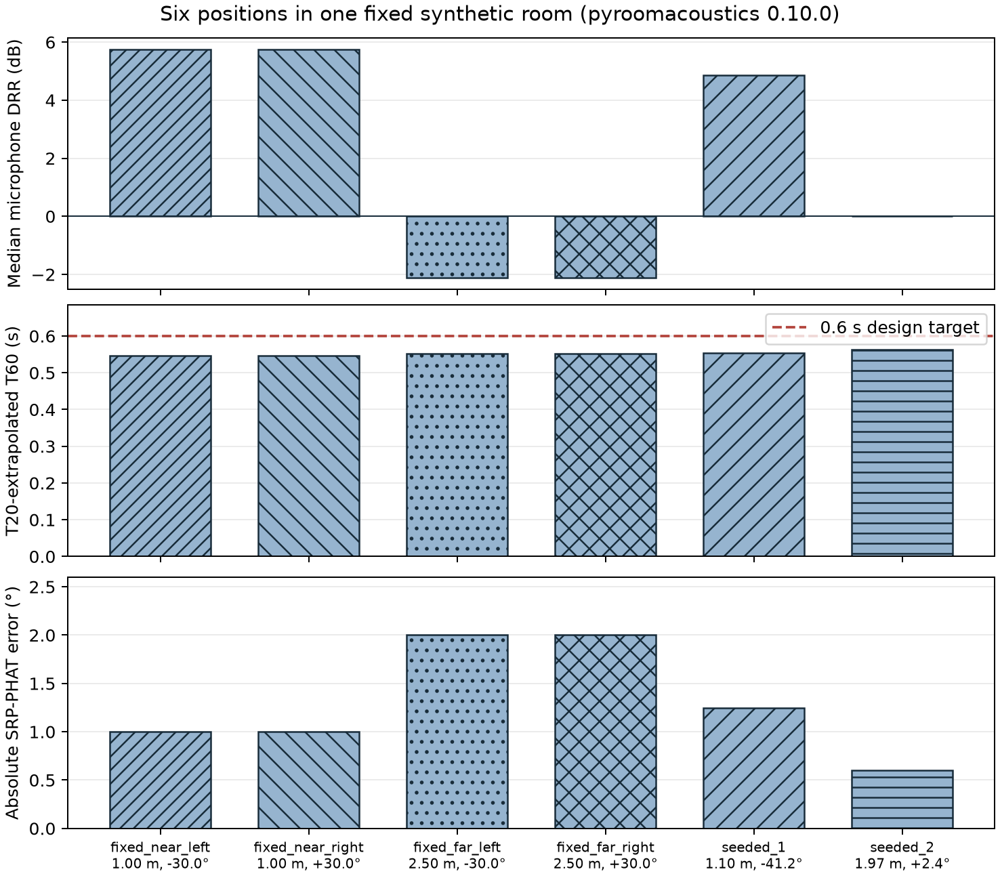
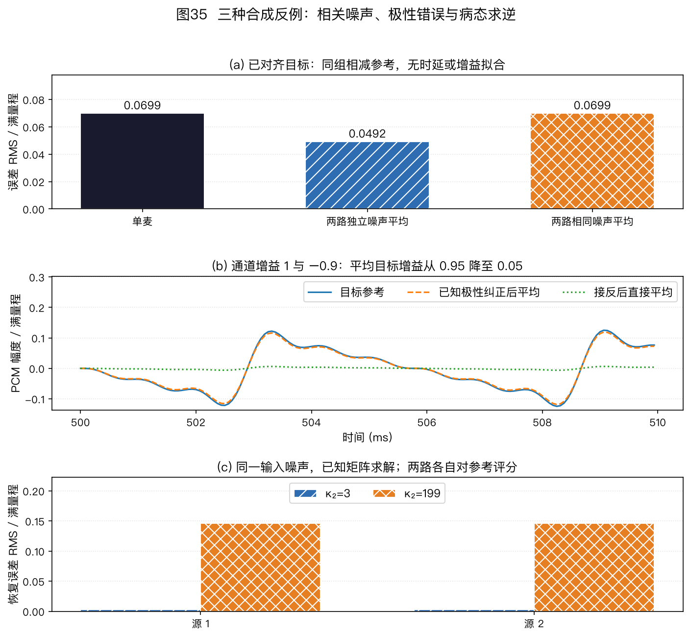

> ⚠️ 本篇是附录 B（正文共 11 章，另有附录 A/B），可独立查阅，前后篇见下方导航。
>
> 🏠 首页导读：[`00_overview.md`](./00_overview.md) ｜ 上一篇：[12_appendix-symbols-math.md](./12_appendix-symbols-math.md) ｜ 下一篇：（无）

---

## 附录 B：学习路径、领域地图、排错、练习与复现

### 13.1 研究生学习路径

下面的阅读与实验顺序从经典模型开始，再过渡到公开基线、数据集和硬件实验。

1. **基础阅读**：Van Veen & Buckley, *Beamforming: A Versatile Approach to Spatial Filtering*（IEEE ASSP Mag. 1988）；Krim & Viberg, *Two Decades of Array Signal Processing*（IEEE SPM 1996）。
2. **语音场景**：Kumatani、McDonough 与 Raj, [*Microphone Array Processing for Distant Speech Recognition: From Close-Talking Microphones to Far-Field Sensors*](https://doi.org/10.1109/MSP.2012.2205285)（*IEEE Signal Processing Magazine* 29(6):127–140，2012）；Gannot et al., *A Consolidated Perspective on Multimicrophone Speech Enhancement and Source Separation*（IEEE/ACM TASLP 2017）。Kumatani 等另有题名前半段相同的 *Towards Real-World Deployment*，查找时不能省略副标题。
3. **原始论文**：Capon（1969）、Griffiths & Jim GSC（1982，*An Alternative Approach to Linearly Constrained Adaptive Beamforming*, IEEE Trans. Antennas Propag. 30(1):27–34）、Schmidt MUSIC（1986）、Roy & Kailath ESPRIT（1989）、Allen & Berkley 镜像法（1979）、Nakatani et al. WPE（IEEE TASLP 2010）、Pal & Vaidyanathan 嵌套阵（IEEE TSP 2010）。
4. **回声消除**：Hänsler & Schmidt, *Acoustic Echo and Noise Control*（Wiley 2004）；近年进展看 ICASSP AEC Challenge 系列报告。
5. **DNN 方向**：Chakrabarty 与 Habets, [*Multi-Speaker DOA Estimation Using Deep Convolutional Networks Trained With Noise Signals*](https://doi.org/10.1109/JSTSP.2019.2901664)（*IEEE JSTSP* 13(1):8–21，2019）；Gu et al. 全神经波束形成（IEEE/ACM TASLP, vol.31, pp.849–862, DOI 10.1109/TASLP.2022.3229261）。
6. **实验顺序**：每一步增加一种新的验证条件，前一步的可复算结果应留作后一步的对照。

    1. 运行 `codes/` 中只依赖 NumPy 的教学实现，核对手算结果、数组维度和退化边界。
    2. 在隔离环境中用 pyroomacoustics 验证 DSB、MVDR、MUSIC 和 SRP-PHAT 基线，记录房间、阵列和随机种子。
    3. 运行 `scripts/` 中的两个绘图脚本，按当前参数复现 40 张编号图，并逐图核对正文条件。
    4. 按研究任务选择公开数据和固定版本参考系统，分别核对代码、模型与数据的许可和评测口径。
    5. 在可用的多通道硬件上测实时性、同步和标定；仿真结果不能代替设备测量。

### 13.2 领域地图：教材、会议、期刊与挑战赛

本节按教材、会议、期刊、挑战赛和历史脉络组织，可按需要查阅。

**教材与专著**（由浅到深）：

| 书 | 特点 |
|---|---|
| Benesty, Chen & Huang, *Microphone Array Signal Processing*（Springer 2008） | 覆盖阵列模型、定位、波束形成与多通道增强 |
| Brandstein & Ward (eds.), *Microphone Arrays: Signal Processing Techniques and Applications*（Springer 2001） | 经典论文式合集，各章由领域奠基人撰写 |
| Tashev, *Sound Capture and Processing: Practical Approaches*（Wiley 2009） | 从工程视角讨论捕获链路、器件和实现权衡 |
| Johnson & Dudgeon, *Array Signal Processing: Concepts and Techniques*（Prentice Hall 1993） | 通用阵列信号处理经典（雷达/声呐同源理论） |
| Van Trees, *Optimum Array Processing*（Wiley 2002） | 系统推导最优阵列处理，适合查阅数学细节 |
| Vincent, Virtanen & Gannot (eds.), *Audio Source Separation and Speech Enhancement*（Wiley 2018） | 分离与增强方向的现代合集 |
| Rafaely, *Fundamentals of Spherical Array Processing*（Springer，一版2015，DOI 10.1007/978-3-662-45664-4；二版 online 2018、版权2019，DOI 10.1007/978-3-319-99561-8） | 系统介绍球阵与球谐域处理，可配合 §5.8 阅读 |

**会议**：ICASSP（信号处理旗舰会）、Interspeech（语音领域旗舰会）、WASPAA（音频与声学信号处理研讨会，两年一届）、IWAENC（声学信号增强研讨会）、HSCMA（免提语音通信与麦克风阵列研讨会）、DCASE Workshop（声事件与场景）。

**期刊**：IEEE/ACM Transactions on Audio, Speech, and Language Processing（TASLP，本领域主刊）、IEEE JSTSP（信号处理选题特刊）、JASA（美国声学学会刊）、Speech Communication。

**挑战赛**用于了解公开任务和评测口径。

CHiME 覆盖远场、多说话人和多通道语音处理；CHiME-9 设置 MCoRec 多会话鸡尾酒会转写与会话聚类、ECHI 低延迟助听对话增强。[CHiME 官方](https://www.chimechallenge.org/ "citation")于 2026 年 7 月公布 CHiME-10 的 ECHI-2、URGENT、SG-TSE 三项任务；挑战计划于 2027 年 2 月 4 日开放，提交期暂定为 2027 年 8～9 月。日程可能调整，参赛时应以官方页面为准。

DCASE 2026 已于 2026 年 6 月 15 日结束，并在 7 月 1 日公布结果；Task 3 是 Semantic Acoustic Imaging SELD，与 DCASE 2024 Task 3 的距离估计设置不同。以上状态核实于 2026 年 9 月，任务定义与结果见 [DCASE 2026 官方页面](https://dcase.community/challenge2026/ "citation")和[结果公告](https://dcase.community/articles/dcase2026-challenge-results-published "citation")。

其他公开评测包括 REVERB 去混响评测、ICASSP DNS/AEC Challenge，以及已结束的 [SPEAR Challenge 2023](https://signalprocessingsociety.org/publications-resources/data-challenges/speech-enhancement-augmented-reality-spear-challenge-2023 "citation")。SPEAR 使用头戴式 6 通道设备研究 AR 语音增强；它的年份、阵列和任务条件不应外推为当前持续榜单。

**历史脉络**（本领域是雷达/声呐技术向语音的迁移史）：

| 年代 | 里程碑 |
|---|---|
| 1940s–60s | 雷达/声呐阵列处理奠基（Bartlett 波束扫描） |
| 1969 | Capon 最小方差谱估计（为地震学阵列而做） |
| 1972 | Frost 时域约束自适应波束形成 |
| 1979–82 | Allen & Berkley 镜像法房间仿真；Griffiths & Jim 提出 GSC |
| 1985 | Flanagan 等报告了可计算转向的大孔径会议室麦克风阵列 |
| 1986–89 | MUSIC（1986）与 ESPRIT（1989）用子空间结构估计到达方向；分辨能力仍受孔径、信噪比、快拍数和模型失配限制 |
| 1990s | Elko 差分麦克风阵列进入助听器与桌面会议设备 |
| 2001–08 | Brandstein & Ward、Benesty 等教材出版，语音阵列知识体系化 |
| 2010 | Nakatani 提出 WPE 去混响；Pal & Vaidyanathan 提出嵌套阵 |
| 2011 | 首届 CHiME 挑战赛，远场语音成为公开评测对象 |
| 2014 | Amazon Echo 把多麦克风远场语音带入一类消费设备；具体阵列规格随硬件代次而变 |
| 2015–18 | CHiME-3/4/5 的公开任务推动了掩码辅助波束与 GSS 等方法的可复现比较 |
| 2019–24 | DNN 定位/追踪（ACCDOA：声源活动与方向联合输出，Shimada et al., ICASSP 2021）、端到端一体化；CHiME-7/8 大模型后端；STARSS23（DCASE 2024 Task 3 使用的开发与评测数据集）支持声源距离估计子任务 |
| 2025–26 | CHiME-9 设置 MCoRec 与 ECHI；2026 年 7 月公布 CHiME-10 三项任务；DCASE 2026 Task 3 转为 Semantic Acoustic Imaging SELD，并于 2026 年 7 月公布挑战结果 |

DCASE 2024 Task 3 的官方任务页明确将开发集和评测集称为 STARSS23，数据集名中的年份不应随挑战年份改写。[DCASE 2024 Task 3 官方说明](https://dcase.community/challenge2024/task-audio-and-audiovisual-sound-event-localization-and-detection-with-source-distance-estimation "citation")

### 13.3 研究前沿速览（2024—）

本节把正文中的经典方法与 2024 年以来若干公开研究方向相连。具体成绩只在原论文的数据、实现和评测条件下成立；带日程的内容以对应挑战赛官方页面为准。

#### 研究方向一：预训练模型用作远场识别后端

CHiME-7/8（2023/2024）部分参赛系统使用 Whisper、WavLM 等预训练模型作为识别后端，也有系统保留 GSS（导引源分离，详见 §8.4）和解析波束。这些参赛系统只能说明相应架构在该届数据和评测中被实现，不能据此断言整个领域已转向某一种架构。[CHiME-7/8 综述预印本，arXiv:2507.18161](https://arxiv.org/abs/2507.18161 "citation")

#### 研究方向二：阵列无关系统

CHiME-8 的 DASR 系统报告描述了不固定阵列拓扑的设计。其泛化范围只能以报告中的训练阵列、测试设备、任务和打分脚本为边界。[CHiME-8 DASR](https://www.isca-archive.org/chime_2024/cornell24_chime.html "citation")

#### 研究方向三：目标说话人提取

目标说话人提取（Target Speaker Extraction，TSE）用注册语音、视觉或方向提示描述目标，再从混合语音中提取相应音轨。AR 眼镜阵列和手机结构辅助方向提取提供了不同的条件输入形式。

TEA-PSE（ICASSP 2022，DOI 10.1109/ICASSP43922.2022.9747765；后续版本 arXiv:2303.07704）和 [CIENet](https://ieeexplore.ieee.org/document/10284995/ "citation") 使用注册语音提供说话人条件，再通过条件注入或帧级对齐提取目标。

SonicSieve 采用另一种线索：被动声学微结构改变方向相关响应，让神经网络利用方向特征提取语音，不是由注册声纹指定身份。它依赖对应的声学结构与训练数据，不能当作任意手机加软件即可获得的效果。原论文为 CHI 2026；本书仅说明方法条件，不转引摘要中的性能数字。[作者机构项目页](https://www.witechlab.com/sonicsieve.html "citation")、[作者论文 v3，2026-02-11，摘要与方法部分](https://arxiv.org/abs/2504.10793v3 "citation")（核实：2026-09-22）。

§6.5 的个性化 AEC 与这类条件提取方法相关，但训练目标和回声参考结构仍需分别定义。

#### 研究方向四：生成式语音增强与推理加速

SGMSE+（Richter et al., IEEE/ACM TASLP 2023）在复数 STFT 域使用基于随机微分方程的扩散模型；StoRM（Lemercier et al., IEEE/ACM TASLP 2023）把判别式回归与生成过程结合，以减少采样负担。[SGMSE+ 代码与论文](https://github.com/sp-uhh/sgmse "citation")、[StoRM 代码与论文](https://github.com/sp-uhh/storm "citation")。

这类方法可能改善特定数据上的感知质量，也可能生成参考中不存在的语音细节，因此要同时评估听感、内容一致性和下游 WER。流匹配、蒸馏和一致性模型试图减少采样步数。

FlowSep（ICASSP 2025）把整流流用于 VAE 隐空间中的文本查询通用音频分离，其结论不能直接外推到多通道语音增强。[FlowSep, DOI 10.1109/ICASSP49660.2025.10890129](https://doi.org/10.1109/ICASSP49660.2025.10890129 "citation")

多通道生成模型还需显式处理跨通道相位、空间协方差和实时性，目前与 §5.9 的掩码加解析波束属于不同成熟度的技术路线。

#### 研究方向五：TF-GridNet 与复数谱映射骨干

第 8 章的解析盲分离依赖源独立性和明确的混合模型；TF-GridNet 改用训练数据学习时频结构。网络输入是混合语音的复数短时频谱，实部和虚部作为特征；输出是各目标语音频谱的实部和虚部，再经逆变换回到波形。一个处理块分别沿当前帧的频率方向、同一频带的时间方向和跨帧注意力路径交换信息，因此名称中的“网格”指时间与频率两个方向的交替处理。[作者期刊版论文摘要与方法](https://arxiv.org/abs/2211.12433 "citation")

Wang 等的 ICASSP 2023 单通道会议版研究无混响的单通道说话人分离；IEEE/ACM TASLP 2023 期刊扩展进一步讨论噪声、混响和多通道条件。[会议版](https://doi.org/10.1109/ICASSP49357.2023.10094992 "citation")、[期刊版](https://doi.org/10.1109/TASLP.2023.3304482 "citation")。

最小复现应先固定其中**一个**版本，写明输入通道数、目标源数、谱变换、训练权重和测试集，再把输出与同条件的第 8 章基线比较。锁定版本 ESPnet 的 [`TFGridNet` 实现](https://github.com/espnet/espnet/blob/be79590bb2ff26ffb01bc825c5f68cb9418b7f0d/espnet2/enh/separator/tfgridnet_separator.py "citation")还明确要求核对混合和目标的方差归一化。

源码可读取并不表示本书已经训练或运行该模型。具体 SI-SDRi 只按所选论文的数据版本、混合方式和表号引用，不能把两版结果混在一起。

#### 研究方向六：几何无关前端的期刊研究

Kamo et al. 在 *Computer Speech & Language* 95:101820（2026）中整理了几何无关的多说话人远场识别系统，并在真实会议数据上评估。[Kamo et al., *Computer Speech & Language*](https://www.sciencedirect.com/science/article/pii/S0885230825000452 "citation") 它与 CHiME-8 的系统共同说明，不固定阵列拓扑可以作为明确的系统设计目标；泛化范围仍以论文的训练阵列、测试设备和数据为边界。

#### 研究方向七：CHiME-9 与大模型后端

CHiME-9 设置了两个输入与目标都不同的任务。MCoRec 使用房间中央的 360° 视频和音频，要求转写说话内容，并判断哪些人属于同一段会话；ECHI 则研究让佩戴者听清对话对象的低延迟增强。后一任务的[官方规则](https://www.chimechallenge.org/challenges/chime9/task2/rules "citation")要求流式处理且算法延迟至多 20 ms。两任务不能共用一张“CHiME-9 语音增强”成绩表。[CHiME-9 官方任务页](https://www.chimechallenge.org/challenges/chime9/index "citation")

DiCoW（Polok et al., *Computer Speech & Language* 95:101841，2026）针对多人混合录音中“只转写指定一人”的问题，把说话人分割给出的活动信息作为条件输入 Whisper；输出是该目标的文字，而不是分离后的干净音轨。这与先分离出波形再送入普通识别器的做法不同。[DiCoW 原论文摘要与方法](https://www.sciencedirect.com/science/article/pii/S088523082500066X "citation")、[作者代码入口](https://github.com/BUTSpeechFIT/DiCoW "citation")。

复现时至少要固定分割标签的来源、目标说话人、录音片段和识别评分方式，并与不加说话人条件的识别结果对照；若分割标签错位，也要检查词漏识别。该方法不能直接当作 ECHI 的 20 ms 助听增强基线。

#### 研究方向八：扩散先验用于无监督盲分离

ArrayDPS（Xu et al., ICML 2025）处理“没有阵列几何、房间冲激响应和配对分离标签”的多通道盲分离问题。AuxIVA 通过源独立性直接迭代解混矩阵；ArrayDPS 改为从单说话人扩散先验采样，并在每个采样步骤内估计相对房间冲激响应，用该近似混合模型计算似然梯度。

它仍假设说话人数已知、各通道同步、混合可由卷积模型近似，而且单说话人先验要覆盖测试语音域；扩散先验不能替代源数估计、同步或域外验证。

最小复现可沿用官方 SMS-WSJ 配置：两名说话人、3 通道、8 kHz，先下载作者提供的单说话人扩散模型，再运行 `separate.py`，设置 `num_speakers=2`、`n_channels=3`、`num_steps=400`，将输出与其 IVA 初始化按同一 SI-SDR 实现比较，同时记录总耗时和峰值显存。官方说明要求显存大于 7 GB；400 步扩散采样还嵌套相对 RIR 优化，因此它是离线研究候选，不应直接列入低延迟流式基线。[ArrayDPS 论文（PMLR 267）](https://proceedings.mlr.press/v267/xu25f.html "citation")、[官方实现与复现命令](https://github.com/ArrayDPS/ArrayDPS "citation")。

#### 专题：神经网络前端的泛化失配与四类对策

本专栏解释阵列或房间改变后性能下降的原因，并展开上面“阵列无关系统”与“几何无关前端的期刊研究”涉及的四类对策。

神经网络前端可能在训练阵列和房间上表现良好，换到新的几何、声学条件或任务后却明显退化，这就是**泛化失配**。下面把失配分为阵列、声学、任务与数据三类，再从数据、表示、训练和部署四方面讨论缓解方法。

**失配三源**：

1. **阵列失配**：训练与部署的几何、通道数、麦克风一致性或采样时钟不同。若网络依赖固定通道编号及其相位关系，更换阵列后这些特征不再成立，端到端波束尤其容易受影响（§5.9 第 2 条）。
2. **声学失配**：混响时间、噪声类型和说话人距离改变。训练数据未覆盖相应混响尾部或噪声结构时，掩码估计误差会传递到协方差和 MVDR 权重。
3. **任务与数据失配**：仿真未包含麦位误差、挡板散射或非平坦频响；训练与测试的语言不同；面向听感训练的增强模型被直接用于 ASR。最后一种情况还要检查生成式模型是否改变语音内容（见上面的“生成式语音增强与推理加速”）。

**四类对策**：

1. **数据**：混合多种阵列几何、房间、采样率和噪声进行训练，并用少量目标设备录音适配。目标是覆盖可能变化的相位和幅度关系，而不是穷举设备。
2. **表示**：让网络输出掩码、协方差或说话人活动等中间量，再由 MVDR 或 GSS 等解析方法施加无失真约束（§5.9 第 1 条）。这种分工仍需验证中间量是否真正跨几何泛化。
3. **训练**：随机丢弃通道、置换通道顺序并扰动麦克风坐标，分别模拟通道失效、可变麦数和标定误差；网络结构还要满足相应的置换不变或等变性质。
4. **部署**：先做通道一致性和几何标定，再根据置信度、资源和失败模式选择模型或解析基线。模型分级只是候选架构，是否有净收益要在目标硬件上测量。

**阵列无关系统的常见结构**：各通道先独立提取特征，再用注意力或池化聚合成对通道顺序不敏感、可接受可变通道数的表示。中间量可选掩码、协方差或说话人活动；分离与波束部分采用 GSS 等解析方法，或使用满足几何无关要求的神经前端。后端再用预训练识别模型吸收残余失配。

CHiME-8 DASR 与上面的“几何无关前端的期刊研究”给出了两类公开实例。复现时应画出实际流程图，并逐项标明训练数据、通道聚合方式、解析约束和测试阵列范围。

**TAC 与 VarArray**。TAC（Transform-Average-Concatenate）先对各通道独立变换，再跨通道平均并把聚合结果拼回各通道，从结构上支持可变通道数和通道置换。

VarArray 把 TAC、Conformer 分离和通道间相位差特征用于几何无关的连续语音分离，并在 AMI 会议转写上报告端到端 sa-WER 结果。它们为后续跨设备系统提供了结构基础。[VarArray, ICASSP 2022, DOI 10.1109/ICASSP43922.2022.9746876](https://doi.org/10.1109/ICASSP43922.2022.9746876 "citation")

### 13.4 常见问题与调试指南

下面按“现象 → 优先检查项”列出八类常见问题。

1. **MUSIC 没有峰 / 峰位置不稳定** → 先看样本协方差的秩与条件数。若直接用 $T$ 个 $M$ 维快照计算未中心二阶矩，矩阵秩不超过 $T$，所以 $T<M$ 时必然奇异；若先估计并减去样本均值，中心化后的 $T$ 个向量线性和为零，秩上限通常降为 $T-1$，所以 $T\le M$ 时必然奇异。快照数超过这一最低门槛也不代表估计已经稳定。

    再检查源数 $K$ 和噪声底是否可分，最后检查直达声与反射是否强相干。空间平滑只适用于具有可分重叠子阵的几何，而且会缩短有效孔径；它不是所有混响场景的必选项（§2.5、§4.6）。

2. **GCC-PHAT 峰位置在离散时延格点间跳变** → 没有做亚采样时延估计，或原始时延网格太粗；也可能是强反射峰超过直达峰（图13）。图12采用 16 倍互谱补零插值，不是三点抛物线拟合；其他实现也可采用相关峰插值或相位斜率拟合（§4.2）。

3. **波束形成后目标语音反而失真** → 先查 DOA、RTF 和通道标定是否一致，再检查噪声协方差的估计方式。

    噪声协方差既可由目标缺席帧估计，也可由时频掩码加权估计；关键是尽量排除目标泄漏，同时保留足够有效快拍。混响中还要确认约束对象是否应改用 RTF（§5.4、§5.9）。

4. **超指向输出噪声很大** → 检查 WNG、协方差条件数、通道增益相位和阵列流形误差。容许的失配没有统一 dB 门槛，应从目标 WNG、最高工作频率和实测波束图反推；可用对角加载或显式 WNG 约束改善稳健性（§5.3、§5.4）。

5. **AEC 残余回声较大** → 优先检查参考取点、参考与麦克风的整体延迟、扬声器削波以及滤波器覆盖时间。参考不同步是需要排查的原因之一，不是所有设备的固定首因。

    若线性路径已收敛而仍有与播放相关的非线性残余，再评估非线性处理（NLP）或学习型 AEC（§6.1）。

6. **SRP-PHAT 出现镜像假峰**：先区分三种原因，不能把所有对称峰都归于麦间距。

    - 几何不可辨识：线阵可能存在前后或锥面歧义，平面阵可能存在上下镜像；增加频带未必能消除相同 TDOA，见 §3.1。
    - 空间混叠：检查工作频率、间距与转向；超过半波长失去全视场无混叠保证，但并非每个方向必然出现等高栅瓣，见 §2.6 和本附录练习 2。
    - 多径反射：强反射可能形成镜像声源峰，应结合直达声可见性、搜索区域与房间条件判断。限制搜索空间需要明确的场景先验，不能仅为删除不喜欢的峰。

7. **多麦录音各通道逐渐错位** → 先区分固定的初始时差、独立丢样和 SRO。单设备可让通道共享采样时钟；分布式设备无法共享时钟时，要估计相对采样率并重采样。PDM/TDM 是接口形式，不自动保证跨设备同步（§10.2）。

8. **仿真很好、实测很差** → 逐项加入麦位误差、通道增益相位误差、壳体散射、频响差异、时钟偏移和扬声器非线性，寻找哪一项能复现实测退化。

    位置容差应按最高频率允许的相位误差换算，不存在对所有阵列通用的毫米阈值。完成标定后，再在容差范围和多个位置上复测。

### 13.5 核心公式速查卡

下表汇总正文中的关键公式，便于复习和查阅。公式成立条件仍以对应章节为准。

| 公式 | 含义 | 章节 |
|---|---|---|
| $10\log_{10}M$ | 无失真归一化、各通道独立等功率白噪声下，$M$ 元 DSB 的 WNG（dB） | §1、§5.2 |
| $r_F=2D^2/\lambda$ | Fraunhofer 相位曲率检查尺度；不是远近场硬分界。使用平面波模型还要检查 $r\gg D$、阵元幅度差和允许的相位误差 | §2.2 |
| $T_{60} = 0.161V/A$ | 赛宾公式：房间混响时间 | §2.4 |
| $d_c = 0.057\sqrt{QV/T_{60}}$ | 临界距离：直达/混响相等处；$Q$ 为声源指向因子，$Q=1$ 时才化为原来的全向式 | §2.4 |
| $\vec{x} = \vec{a}(\theta)s + \vec{n}$ | 远场窄带阵列信号模型 | §2.3 |
| $\hat{\mathbf{R}} = \frac{1}{T}\sum_t \vec{x}\vec{x}^H$ | 空间协方差矩阵估计 | §2.5 |
| $d < \lambda/2$ | ULA 在整个闭可视角域内避免端点歧义的充分条件；$d=\lambda/2$ 时两个端火方向 $-90^\circ$ 与 $+90^\circ$ 可产生相同阵元采样，限定转向范围时可另行分析 | §2.6 |
| HPBW、DI、WNG | 分别按主瓣两个半功率点、全空间方向响应平均、独立等功率通道噪声定义；见式(2-3)～式(2-5) | §2.6 |
| CRB 公式 | 给定统计模型与正则条件下，无偏 DOA 估计方差的下界；见式(2-6) | §2.6 |
| $\hat\theta = \arcsin(c\hat\tau_{12}/d)$ | 双麦时延差 → 角度；本书定义 $\tau_{12}=t_1-t_2$，并以 $X_1X_2^*$ 的 GCC 峰估计它 | §2.1、§4.2 |
| $R(\tau)=\int \Phi X_1X_2^* e^{j2\pi f\tau}df$ | GCC 加权互相关 | §4.2 |
| $\hat{\vec{p}} = \arg\max_{\vec{r}} \sum R^{PHAT}$ | SRP-PHAT 全阵列投票 | §4.3 |
| $P_C = 1/(\vec{a}^H\hat{\mathbf{R}}^{-1}\vec{a})$ | Capon 谱 | §4.5 |
| $P_{MU} = 1/(\vec{a}^H\mathbf{E}_n\mathbf{E}_n^H\vec{a})$ | MUSIC 伪谱 | §4.6 |
| $\vec{w}_{DSB} = \vec{a}/M$ | 延迟求和波束 | §5.2 |
| $\lvert B(\theta)\rvert = \left\lvert\frac{\sin(M\psi/2)}{M\sin(\psi/2)}\right\rvert$ | 等权 ULA 的归一化阵因子，$\psi=2\pi d(\sin\theta-\sin\theta_0)/\lambda$ | §5.2 |
| $\vec{w}_{SD}=\dfrac{\mathbf{\Gamma}^{-1}\vec{a}}{\vec{a}^H\mathbf{\Gamma}^{-1}\vec{a}}$ | 超指向：在无失真约束下最小化弥散噪声输出 | §5.3 |
| $\vec{w}_{MVDR} = \mathbf{R}_{nn}^{-1}\vec{a}/(\vec{a}^H\mathbf{R}_{nn}^{-1}\vec{a})$ | 最小方差无失真 | §5.4 |
| LCMV 权重，见式(5-4) | 多约束最小方差解；完整表达式和符号在表后单列 | §5.5 |
| SDW-MWF 权重，见式(5-5) | 失真可调维纳滤波；完整表达式和符号在表后单列 | §5.5 |
| $e=d-y$ | GSC 中固定波束输出 $d$ 减去自适应抵消输出 $y$；在阻塞矩阵理想、支路自由度足够且优化收敛时与相应 LCMV 等价 | §5.6 |
| NLMS 更新式 | AEC 自适应滤波 | §6.1 |
| $\mathrm{ERLE}=10\log_{10}\dfrac{\sum_n|y(n)|^2}{\sum_n|e_{\mathrm{echo}}(n)|^2}$ | 同一远端单讲窗口内的回声返回损失增强；$y=x*h$ 为消除前回声，$e_{\mathrm{echo}}$ 为消除后回声分量 | §6.1 |
| WPE 预测模型，见式(7-1) | 当前观测分成预测残响和早期成分；完整表达式在表后单列 | §7.1 |
| KF 五步 | 预测-更新-增益循环；圆周角新息先做 wrap，浮点实现可用 Joseph 协方差更新 | §9.2 |

表中三个较长的表达式单独列出，以便在网页和 A4 页面上读清上下标。这里沿用对应章节的定义与成立条件，没有重新给公式编号。

**LCMV 权重，见式(5-4)**：$\mathbf R$ 为用于最小化输出功率的协方差矩阵；$\mathbf C$ 的列是各约束导向向量，$\vec f$ 给出对应响应。若所需逆矩阵不存在，须回到 §5.5 检查约束是否独立及正则化条件。

$$
\vec w_{LCMV}
=\mathbf R^{-1}\mathbf C
\left(\mathbf C^H\mathbf R^{-1}\mathbf C\right)^{-1}\vec f .
$$

**SDW-MWF 权重，见式(5-5)**：$\mathbf R_{ss}$、$\mathbf R_{nn}$ 分别是目标与噪声协方差矩阵，$\vec e_r$ 选出参考麦；$\mu>0$ 调节噪声惩罚与目标失真。它不是一般条件下的 MVDR 解，具体目标函数和秩一特例见 §5.5。

$$
\vec w_{SDW}
=\left(\mathbf R_{ss}+\mu\mathbf R_{nn}\right)^{-1}\mathbf R_{ss}\vec e_r .
$$

**WPE 预测模型，见式(7-1)**：$X(n,f)$ 是当前帧第 $f$ 个频点的观测；$G^*(k,f)X(n-k,f)$ 用过去帧预测晚期混响，$E(n,f)$ 是保留的早期成分。$\Delta$ 为预测延迟，$K$ 为抽头数；多通道时系数和历史观测改为向量，见 §7.1。

$$
X(n,f)=E(n,f)+\sum_{k=\Delta}^{\Delta+K-1}G^*(k,f)X(n-k,f) .
$$

**PHD 预测，见式(9-9)**：新生目标强度加存活目标的状态转移。

$$\begin{aligned}
D_{t\vert t-1}(\vec x)&=\gamma_t(\vec x)\\
&\quad+\int p_S(\vec\xi)f_{t\vert t-1}(\vec x\mid\vec\xi)D_{t-1}(\vec\xi)\,d\vec\xi.
\end{aligned}$$

**PHD 更新，见式(9-10)**：漏检项加每条观测的“目标/杂波”归一化贡献。

$$\begin{aligned}
D_t&=(1-p_D)D^-\\
&\quad+\sum_{z\in Z_t}\dfrac{p_Dg(z\mid x)D^-}{\kappa(z)+\int p_Dg(z\mid\xi)D^-(\xi)d\xi}.
\end{aligned}$$

预测式中，$D_{t-1}(\vec\xi)$ 是上一时刻在状态 $\vec\xi$ 处的目标强度，$p_S$ 是存活概率，$f_{t\vert t-1}$ 是状态转移密度，$\gamma_t$ 是新生目标强度。预测把“存活并移动的旧目标”和“新生目标”相加。

更新式中，$D^-=D_{t\vert t-1}$ 是更新前强度，$Z_t$ 是本帧观测集合，$p_D$ 是检测概率，$g(z\mid x)$ 是目标在状态 $x$ 时产生观测 $z$ 的似然，$\kappa(z)$ 是该观测处的杂波强度。分母把杂波与所有可能目标来源放在同一观测口径下比较；这些量的连续状态积分及多观测含义见 §9.3。

**单状态格演示。** 假设上一时刻此格的强度为 $0.6$，存活概率 $0.9$，转移仍留在本格，新生强度 $0.26$。预测强度为 $D^-=0.26+0.9\times0.6=0.8$。

若本帧只有一个观测，令 $p_D=0.75$、该格观测似然 $g=0.5$、同单位杂波强度 $\kappa=0.1$。漏检项为 $(1-0.75)\times0.8=0.2$；观测项为 $(0.75\times0.5\times0.8)/(0.1+0.75\times0.5\times0.8)=0.75$；更新强度为 $0.95$。

这是把积分退化为单格求和的本书手算，不是“该观测有 95% 概率属于目标”，也不能替代多目标、多观测的关联计算。

### 13.6 思考与练习

练习按章节排列。修改脚本参数时，应同时记录随机种子、实验条件和输出指标。数值题附参考答案，综合题附思路提示。

**练习涉及的绘图函数**：先阅读参数与生成模型。需要改参数时，在个人实验副本中运行并保存到独立输出目录，不直接覆盖本书的出版插图。

| 函数名 | 它画的是什么 | 用在哪道题 |
|---|---|---|
| `fig_geometries` | 阵列形态布局 | 题4 |
| `fig_gcc_phat` | GCC-PHAT 原理 | 题5 |
| `fig_doa_spectrum` | DOA 空间谱 | 题6 |
| `fig_wng_di` | WNG–DI 权衡 | 题8 |
| `fig_wpe` | WPE 去混响 | 题9 |
| `fig_tracking` | 粒子滤波追踪 | 题13 |

动手题用的绘图函数都在 `scripts/` 里，具体对应关系见上表。第 16 题还要安装 pyroomacoustics 0.10.0；它是房间声学仿真的扩展依赖，命令见该题和项目 README。

章内还有带稳定编号 `E01-01` 等的计算练习，由[练习与音频实验手册](../codes/research/05_exercises_and_audio.md)统一索引。下面的 1～17 题采用另一套编号，与 E 号题各自独立。工程练习 E10、选型练习 E11 和数学练习 E12 的运行入口是 `codes/examples/exercises_engineering.py`，可先手算再比对输出。

#### 13.6.1 基础与几何：第 1～3 章的题 1～4

**第 1 章（问题定义）**

1. 思考题：为什么“双耳 + 自由转头”通常比静止双耳更容易消除前后混淆？

    **提示**：静止时并非只有两个数；ITD、ILD 和 HRTF 的频谱线索都随频率变化。某些镜像方向仍会产生相近线索，转头后这些线索按不同轨迹变化，动态观测可打破歧义。联系 §1.1 与 §3.1 的几何对称性。

**第 2 章（基础）**

2. 手算：3 麦线阵、间距 3 cm、声源 45°、频率 2 kHz，写出导向矢量；该频率是否满足全视场无混叠条件？6 kHz 呢？

    **参考答案**：2 kHz 时 $\lambda=17.15$ cm，$\psi=\frac{2\pi d}{\lambda}\sin45°\approx0.777$ rad，$\vec{a}=[1,\ e^{+\mathrm{j}0.777},\ e^{+\mathrm{j}1.554}]^\top$；正角声源先到达 $+x$ 侧的后续阵元，按本书的傅里叶变换约定对应正的相对相位。$d<\lambda/2$，满足全视场安全条件。

    6 kHz 时 $\lambda\approx5.72$ cm，$d>\lambda/2$，不再保证所有方向无混叠。但对本题 $\theta_0=45°$，候选歧义满足 $\sin\theta=\sin45°\pm\lambda/d\approx0.707\pm1.91$，两解都落在 $[-1,1]$ 外，因此该转向本身没有可见等高栅瓣。条件被突破不等于每个转向都必然出现栅瓣。

3. 用赛宾公式估算你所在房间的 $T_{60}$ 与临界距离 $d_c$，判断 3 m 对话处在直达占优还是混响占优区。

    **参考示例**：取 5 m × 4 m × 2.8 m 客厅，体积 $V=5\times4\times2.8=56\ \mathrm{m^3}$，六面总面积 $S=2(5\times4+5\times2.8+4\times2.8)=90.4\ \mathrm{m^2}$。若把各面简化为相同的平均吸声系数 $0.2$，等效吸声面积为 $A=0.2S=18.08\ \mathrm{m^2}$，所以赛宾估计 $T_{60}=0.161\times56/18.08\approx0.499$ s。

    若声源指向因子 $Q=1$，临界距离 $d_c=0.057\sqrt{1\times56/0.499}\approx0.604$ m。3 m 大于此值，在该均匀吸声、近似扩散声场模型下属于混响占优区；改变 $Q$ 会按 $\sqrt Q$ 改变临界距离。真实房间的材料并不均匀，直接声可能被遮挡，不能把这道算例的 $T_{60}$ 或 $d_c$ 当作该客厅的实测值。

**第 3 章（几何）**

4. 打开 `fig_geometries` 按题面改：把 6+1 圆环改成 8 麦；改麦数时坐标、标题、图注要一起改。思考：中心麦能提供什么新信息？

    **提示**：它可作为参考通道，并新增从中心到各环麦的基线；“到各环麦距离相等”描述的是几何布局，不表示任意入射方向下都与环麦等相位。固定半径时增加环上麦数会缩短相邻间距，但不会增加最大孔径。

#### 13.6.2 定位与波束：第 4、5 章的题 5～8

**第 4 章（定位）**

5. 打开 `fig_gcc_phat`，逐步增加噪声并比较 PHAT 与普通互相关。记录每个随机种子、信号谱和混响条件下的峰值误差，不预设固定 SNR 崩溃点。

    **提示**：PHAT 去掉幅度谱着色，可能让峰变尖，也可能在低信噪比频带放大相位噪声。它的优势取决于源谱、噪声谱和反射结构。

6. 在 `fig_doa_spectrum()` 中把两源间隔从 50° 缩到 15°、8°，观察 Bartlett、Capon、MUSIC 的谱峰。

    **比较基准**：8 元半波 ULA 的离散阵因子 HPBW 近似为 $0.886\lambda/(Md)\approx12.7°$；用物理跨度 $D=(M-1)d=3.5\lambda$ 得到的 $\lambda/D\approx16.4°$ 只是孔径尺度。

    不要预先规定谁在某个角度必然失败。实际结果取决于 SNR、快拍数、源相关性、加载和峰值判据。MUSIC 在理想独立源条件下可能分辨小于常规主瓣宽度的两源，但不保证在失配或相干源下保持这一能力。

**第 5 章（波束形成）**

7. 从拉格朗日函数推出 MVDR 闭式解，再回 §5.4 对答案。

    **提示**：构造实值函数 $L=\vec{w}^H\mathbf{R}_{nn}\vec{w}+2\operatorname{Re}\{\lambda^*(\vec{w}^H\vec{a}-1)\}$，对 $\vec{w}^*$ 求导，得到 $\vec{w}\propto\mathbf{R}_{nn}^{-1}\vec{a}$，再代入约束定比例系数。

8. 在 `fig_wng_di()` 中把麦距从 4 cm 改成 2 cm 与 8 cm，画出 WNG、DI 和协方差条件数，再比较有无对角加载。记录脚本实际输出，不预设某个频率的固定 dB 数。

    **解释重点**：低频 $kd$ 很小时，各阵元观测接近相同，弥散噪声相干矩阵容易病态；超指向解需要大幅度、相互抵消的权重，因而 WNG 下降。增大间距可能改善低频条件数，也可能在高频引入空间混叠，不能只看一端。

#### 13.6.3 增强、分离与追踪：第 6～9 章的题 9～13

**第 7 章（去混响）**

9. 打开 `fig_wpe` 按题面修改：把 $T_{60}$ 从 0.6 s 改为 0.3 s 与 1.0 s，再把 `prediction_delay` 从 6 改为 1，其他参数保持 `prediction_order=10`、`iters=3`。记录每次试验的参数，比较图中拖尾与语音谱结构的变化。

    **提示**：当前 `wpe_past_frames` 要求 `delay>=1`，因此 `delay=0` 会报错，不是可比较的算法配置。8 ms 帧移时，`delay=6` 从 48 ms 历史开始预测，`delay=1` 则从 8 ms 开始，更容易将需保留的早期成分纳入预测。

**第 6 章（AEC）**

10. 手算（AEC，接算例 6-1）：回声路径 $\vec{h}=[0.8,\ 0.3,\ 0.1]^\top$，参考为单位脉冲 $x(0)=1$、其余时刻为 0；3 抽头 NLMS，$\hat{\vec{w}}(0)=\vec{0}$，$\mu=0.5$。在 $\|\vec{x}\|^2>0$ 时为便于手算取 $\varepsilon=0$；零能量时按 §6.1.2 的规则跳过更新。手算 $n=0,1,2,3$ 的 $d(n)$、$e(n)$ 与 $\hat{\vec{w}}(n+1)$，并解释为什么 3 步之后滤波器恰好停在 $0.5\vec{h}$。

    **参考答案**：$d=[0.8,\ 0.3,\ 0.1,\ 0]$，因为单位脉冲卷上 $\vec{h}$ 就是 $\vec{h}$ 本身。

    - $n=0$：$\vec{x}=[1,0,0]^\top$，$\hat y=0$，$e=0.8$，$\|\vec{x}\|^2=1$，$\hat{\vec{w}}\leftarrow[0.4,\ 0,\ 0]^\top$；
    - $n=1$：$\vec{x}=[0,1,0]^\top$，$\hat y=0$，$e=0.3$，$\hat{\vec{w}}\leftarrow[0.4,\ 0.15,\ 0]^\top$；
    - $n=2$：$\vec{x}=[0,0,1]^\top$，$e=0.1$，$\hat{\vec{w}}\leftarrow[0.4,\ 0.15,\ 0.05]^\top$；
    - $n=3$：$\vec{x}=\vec{0}$，按零能量规则跳过更新。

    前三个回归向量已经依次覆盖三个正交方向，但每个方向只更新一次；$\mu=0.5$ 使每个抽头只走完一半误差，所以终点恰为 $0.5\vec{h}$。若要继续收敛到 $\vec{h}$，需要在这些方向上获得更多非零更新；持续的白噪声或语音通常同时提供重复观测和多方向激励。

11. 论述题：为什么多数时变波束系统把 AEC 放在波束形成之前？有没有例外？

    **思路提示**：若权重随追踪变化，波束后的等效回声路径 $h_{\mathrm{eff}}(t)=\vec{w}(t)^H\vec{h}(t)$ 也随时间变化，单路 AEC 更难跟踪。若波束固定或采用联合多通道回声模型，波束后 AEC 并非数学上不可能，只是路径变化、双讲控制和多波束复用要重新设计。

**第 8 章（语音分离）**

12. 手算与设计题：

    1. 某两输出分离器对两条参考语音的损失矩阵为 $\begin{bmatrix}1.2&0.3\\0.4&1.5\end{bmatrix}$，求 PIT 选择的排列与总损失。
    2. 取两个双通道时频快照 $\mathbf X_1=[1,1]^\top$、$\mathbf X_2=[1,-1]^\top$，目标掩码 $\gamma=[0.75,0.25]$，计算目标协方差和互补掩码协方差。
    3. 若把模型用于连续会议，还要增加哪三类处理？

    **参考答案**：

    1. 保持排列的损失为 $1.2+1.5=2.7$，交换排列为 $0.3+0.4=0.7$，故选择交换。
    2. 两组权重和都为 1，$\mathbf R_{\mathrm{tar}}=0.75\mathbf X_1\mathbf X_1^H+0.25\mathbf X_2\mathbf X_2^H=\begin{bmatrix}1&0.5\\0.5&1\end{bmatrix}$，互补掩码得到 $\mathbf R_{\mathrm{int}}=\begin{bmatrix}1&-0.5\\-0.5&1\end{bmatrix}$。
    3. 连续会议至少要定义分块与上下文、重叠块拼接、跨块排列/输出流管理；需要身份时还要增加分割或说话人关联。

    互补掩码在这个二分类题中成立，不能据此把多说话人加噪声场景中的 $1-\gamma$ 一律称为纯噪声。

**第 9 章（追踪）**

13. 打开 `fig_tracking`，按下面的条件修改：

    - **当前基线**：200 个粒子、$7^\circ$ 观测噪声、“高斯目标 + 均匀杂波”混合似然（杂波权重 0.1）、第 48～57 帧连续缺测、$0°～120°$ 有限搜索扇区的镜面反射边界，以及有效粒子数低于 $N/2$ 时的系统重采样；
    - **实验变量**：把生成观测的标准差和 `particle_filter_doa(..., observation_std=...)` 同时从 7° 改为 20°，分别用 $N=200,500,1000$ 运行；
    - **其余保持不变**：杂波权重、缺测区间、有限扇区边界和系统重采样阈值沿用当前基线；
    - **要记录**：轨迹 RMSE、`n_eff` 的最小值/中位数、`resampled` 为真的帧数、`reflection_fraction` 的最大值/中位数与不低于 5% 的帧数，并单独报告缺测段 RMSE。

    **提示**：当前图用橙色竖线标出重采样帧，用紫色叉号标出反射粒子比例不低于 5% 的帧，但没有绘制 `n_eff` 或反射比例曲线；需要曲线时应增加子图。只改一处噪声参数是观测模型失配实验。粒子数增加是否改善结果，应由这些记录判断。

#### 13.6.4 工程预算与方案选型：题 14～15

**第 10 章（工程实现）**

14. 思考题：一台 6 麦音箱的项目需求规定“唤醒到应答 < 300 ms”。按 §10.1 的延迟分类和关键路径公式拆分预算，并指出三处优先优化项。

    **提示**：分别列出前瞻、缓冲、计算、调度和解码/交互。把 STFT 窗长从 32 ms 改为 16 ms 只会改变依赖完整窗的等待，不会自动把端到端延迟减半；WPE 流式化和后端分级也要以实测关键路径验收。

    运行 `.venv/bin/python -m codes.examples.ch10_engineering_baselines`，再把调度示例中的两个 18 ms 处理帧逐步增大。记录未能在下一帧到来前完成的次数（程序字段 `deadline_misses`）、接收但尚未完成的帧数峰值（`queue_high_water`，含正在处理的帧）和丢帧数。该模拟器只有一条串行工作线程，不含操作系统抢占；它验证记账方式，不是目标硬件性能测试。

**第 11 章（选型）**

15. 思考题：给“车载 4 麦分布式 + 强发动机噪声 + 免唤醒连续对话”场景写一段选型论证，分别说明几何、定位、波束和 AEC。

    **提示**：按 §11.1 的六个问题补齐条件；检查分布式 SRO 风险（§10.2）、低频噪声下超指向的 WNG、AEC 参考是否覆盖车机实际播放处理，以及连续对话期间哪些模块需要保持运行。功耗预算见 §10.4 和 §10.9。

#### 13.6.5 房间仿真：第 16 题的输入、测量和结果

16. **确定性房间仿真：距离、直达声与混响声能量比、定位误差。** 用 pyroomacoustics 0.10.0 生成目标 $T_{60}=0.6$ s 的房间冲激响应（Room Impulse Response，RIR），再用本书的 SRP-PHAT 教学实现估计单声源方向。先运行 `.venv/bin/python -m codes.examples.room_srp_exercise --check`：这一步只检查配置，不需要安装 pyroomacoustics，也没有运行房间仿真。

#### 第 16 题：输入与声学模型

房间为 $12\times10\times6$ m 的长方体，阵列中心在 $(6,5,3)$ m，四麦位于该中心的水平面上，偏移分别为 $(\pm0.03,\pm0.03)$ m。声速 $343$ m/s，采样率 16 kHz。角度以 $+y$ 为 0°，朝 $+x$ 为正。

声源与阵列同高：四个固定条件为距离 1 m、2.5 m 各配 $-30°$、$+30°$；另有两个用 PCG64 种子 20260924 从距离 1～2.5 m、方向 $-60°$～$+60°$ 分别均匀抽取的位置。每个条件用独立、固定种子的 1 s 白高斯噪声作激励，不叠加环境噪声；这是一间理想合成房间中的六个位置，不是六次独立房间实测。

脚本按 pyroomacoustics 0.10.0 的 `inverse_sabine` 口径，由目标混响时间反求均匀墙面的能量吸收系数 $\alpha$，并核对该函数给出的建议镜像阶数。先由房间三边求体积 $V=12\times10\times6=720\ \mathrm{m^3}$；再把六面成对相加，得到总表面积 $S=2(12\cdot10+12\cdot6+10\cdot6)=504\ \mathrm{m^2}$。代入声速 $c=343\ \mathrm{m/s}$ 和目标 $T_{60}=0.6\ \mathrm s$：

$$
\alpha=\frac{24\ln(10)V}{cST_{60}}
=\frac{24\ln(10)\cdot720}{343\cdot504\cdot0.6}
\approx0.38360.\tag{13-1}
$$

按该版本源码的镜像覆盖口径，三组边长分别计算 $ab/\sqrt{a^2+b^2}$，并取最小的一组；本房间的最小值来自 10 m 与 6 m 两边，为 $10\cdot6/\sqrt{10^2+6^2}=60/\sqrt{136}\approx5.145$ m。将未舍入的尺度代入源码的阶数规则，得到 $\lceil343\cdot0.6/(60/\sqrt{136})-1\rceil=40$；$\lceil\,\rceil$ 表示向上取整，临近整数时不能先舍入中间量。镜像法关闭随机扰动、射线追踪和空气吸收；实际使用的阶数单独写进结果。

式(13-1)中的 $\alpha$ 和“目标 0.6 s”都只是建模输入，不能写成已实现的衰减时间。公式口径可对照[固定版本源码清单](../codes/SOURCES.lock.json)中锁定的 pyroomacoustics `acoustics.py` 的 `inverse_sabine`。

#### 第 16 题：运行与指标计算

在单独的虚拟环境安装 `pyroomacoustics==0.10.0` 和绘图依赖，再从仓库根目录用该环境的 Python 运行 `python -m codes.examples.room_srp_exercise --run --plot /tmp/room_srp_exercise.png`；这里的 `python` 指隔离环境的解释器，不要求改变仓库 `.venv`。`--run` 输出逐位置 JSON，图按六个位置分别画四麦 DRR 中位数、由 $T_{20}$ 外推的 $T_{60}$ 与 DOA 绝对误差；每个位置标明距离和角度，避免相同距离、近乎相同 DRR 的左右对称点在散点图中重叠。

定位脚本用 512 点 Hann 窗、128 点帧移、300～2000 Hz 频带，在 $-80°$ 到 $+80°$ 的 1° 网格扫描；报告 $|\hat\theta-\theta|$，故网格量化与近场/远场模型差异均计入误差。四麦最远间距为 $0.06\sqrt2\approx0.0849$ m，低于 2 kHz 对应的半波长 $343/(2\cdot2000)=0.08575$ m，这控制了所用频带内的空间混叠。

直达声与混响声能量比（Direct-to-Reverberant Ratio，DRR）比较同一只麦克风接收到的直达声能量与反射声能量。每个位置、每只麦分别生成完整 RIR $h_{\mathrm{full}}[n]$，以及“墙面能量吸收率设为 1、仍保留相同镜像阶数”的直达声 RIR $h_{\mathrm{direct}}[n]$。两者的几何、采样率、RIR 长度与 pyroomacoustics 默认的 10 Hz 零相位高通边界一致；完全吸收的墙面使非零阶镜像声能为零。

先逐采样点相减，得到反射部分 $h_{\mathrm{reverb}}[n]=h_{\mathrm{full}}[n]-h_{\mathrm{direct}}[n]$；再分别平方求和，得到 $E_{\mathrm{direct}}=\sum_nh_{\mathrm{direct}}[n]^2$ 和 $E_{\mathrm{reverb}}=\sum_nh_{\mathrm{reverb}}[n]^2$。最后计算

$$
\mathrm{DRR}=10\log_{10}\!\left(\frac{E_{\mathrm{direct}}}{E_{\mathrm{reverb}}}\right).\tag{13-2}
$$

本题的 RIR 为实数，所以平方不需再取模；式(13-2)中若两项能量相等，DRR 为 0 dB。反射能量很小时，DRR 为较大的正数；这个数描述该仿真位置的直达与反射比例，不是定位准确率。

只用零阶镜像生成较短的 RIR 再补零，会使两条 RIR 在不同长度下分别经历零相位滤波，差中可能混入滤波边界效应；处理位置与默认参数见[固定版 `room.py` 的 RIR 构建代码](https://github.com/LCAV/pyroomacoustics/blob/0dd39f2614b7fc44b2cc63dbe7d60f4641068890/pyroomacoustics/room.py#L2348-L2432)及[默认参数](https://github.com/LCAV/pyroomacoustics/blob/0dd39f2614b7fc44b2cc63dbe7d60f4641068890/pyroomacoustics/parameters.py#L185-L195)。四麦 DRR 先各自计算，再取中位数；中位数并非把四麦能量先合并后计算的 DRR。

**混响时间怎样算。** 从完整 RIR 的 Schroeder 倒向能量积分曲线，在 $-5$ 到 $-25$ dB 区间拟合 dB 对时间的直线，按斜率外推至 $-60$ dB；本题将它称为“$T_{20}$ 外推的 $T_{60}$”，不是实测房间混响时间。逐麦值与中位数都保留，区间不够时脚本报错。

以 1 m、$-30°$ 条件的第 1 只麦为例，本书仿真的直达 RIR 能量约为 0.96774，反射 RIR 能量约为 0.24448，因而该麦 DRR 为 $10\log_{10}(0.96774/0.24448)\approx5.975$ dB；四麦 DRR 的中位数为 5.755 dB。同一只麦的 $-5$～$-25$ dB 拟合斜率约为 $-109.682$ dB/s，故外推 $T_{60}=-60/(-109.682)\approx0.547$ s。计算先用未舍入值，下面仅展示约数。

#### 第 16 题：六个位置的结果

**本书仿真结果。** 2026 年 9 月 24 日用 pyroomacoustics 0.10.0、Python 3.13.12、NumPy 2.5.3、SciPy 1.18.1 实际运行脚本；镜像阶数为 40，声学和定位条件均如上，`PRA_NUM_THREADS=2`。表中的 $T_{60}$、DRR 都是四麦逐麦指标的中位数；方位估计按 1° 网格输出。为免把近似值当作精确值，下表距离、真方位、$T_{60}$、DRR 和绝对误差均保留三位小数。

| 声源位置 | 距离 (m) | 真方位 (°) | $T_{20}$ 外推 $T_{60}$ (s) | DRR (dB) | SRP 方位 (°) | 绝对误差 (°) |
|---|---:|---:|---:|---:|---:|---:|
| 固定近左 | 1.000 | −30.000 | 0.546 | 5.755 | −29 | 1.000 |
| 固定近右 | 1.000 | +30.000 | 0.546 | 5.755 | +29 | 1.000 |
| 固定远左 | 2.500 | −30.000 | 0.553 | −2.113 | −32 | 2.000 |
| 固定远右 | 2.500 | +30.000 | 0.553 | −2.113 | +32 | 2.000 |
| 种子位置 1 | 1.099 | −41.244 | 0.555 | 4.866 | −40 | 1.244 |
| 种子位置 2 | 1.973 | +2.396 | 0.563 | −0.003 | +3 | 0.604 |



这张本题补充图的上、中、下栏分别用 dB、s、角度表示四麦 DRR 中位数、$T_{20}$ 外推的 $T_{60}$ 中位数和 SRP-PHAT 方位绝对误差。横轴标明六个已经固定的声源位置、距离与真方位；中栏虚线是 0.6 s 建模目标。图仅表示这一间合成房间的六个源位，不代表跨房间的统计分布。

最后一行 DRR 的未舍入值为 −0.00304 dB，接近零。六个由仿真 RIR 估得的 $T_{60}$ 在约 0.546～0.563 s，低于 Sabine 反推时设定的 0.6 s；目标参数不能替代实际 RIR 的衰减估计。

#### 第 16 题：镜像阶数检查

默认脚本对固定近左位置另算 32 阶结果，并与 40 阶比较：四麦 $T_{60}$ 中位数相差约 $2.08\times10^{-6}$ s，DRR 中位数相差约 $7.55\times10^{-7}$ dB，低于本题自定的 0.02 s 与 0.5 dB 判据。本书还实际以 `--max-order 48` 重跑六个位置：与 40 阶相比，六个位置的 $T_{60}$ 中位数变化都小于 $10^{-6}$ s，DRR 中位数变化都小于 $10^{-6}$ dB，1° 网格的方位估计不变。这些比较说明所列指标对 40～48 阶的截断不敏感，不证明频谱细节或其他几何设置也已收敛；改变房间、源位或指标后须重新检查。

#### 第 16 题：试听文件与复现

仓库已将六组源信号、四麦完整房间输出和四麦仅直达输出，共 18 个 PCM WAV 单独保存在 `codes/room_audio/`，参数、共同增益、种子和逐文件摘要见[房间音频清单](../codes/room_audio/MANIFEST.json)；[逐组试听入口](../codes/research/05_exercises_and_audio.md#17-六位置房间响应与定位)列出全部文件。

每组使用与定位估计相同的固定白高斯噪声输入；全部文件采用同一个显式增益，不逐文件峰值归一化，保留传播时延和增益差异。文件是数学合成白噪声，不是真实语音或实测房间录音；试听前先降低播放音量。它们与主清单的 64 个 `codes/audio/` 样本分别管理。

若要重新生成到个人实验目录，先在装有锁定版 pyroomacoustics 0.10.0 的隔离环境中运行 `python -m codes.examples.room_srp_exercise --run --audio-dir /tmp/room-srp-audio-new`；为防覆盖，该目录必须尚不存在。

#### 第 16 题：能得出的结论

**解读边界。** 固定的 $\pm30°$ 条件分别在 1 m 与 2.5 m 比较；这间合成房间中，远位置的 DRR 较低，绝对 DOA 误差由 1° 变成 2°。

距离变化也改变了声源相对墙面的位置和反射路径，这两个成对条件不足以估计跨房间、跨方向的平均因果效应。另两个随机位置同时改变距离与方向，更不能凭六点的总体相关性归因于距离。临界距离只给 DRR 量级参考，定位误差不保证在那里出现拐点。

脚本未加入麦克风失配、加性噪声、声源高度变化或真实房间扩散结构；讨论这些因素时须另做控制实验。`--check` 的输出只有配置，没有上述仿真指标。

#### 13.6.6 公开系统复核：题 17

17. **（研究拓展）**读一篇 CHiME-8 参赛系统报告（见 §13.3 引用），按报告实际结构画出前端流程图，与本书图23 对照。

    逐项标出定位、分割、GSS/波束、增强和 ASR 后端是否存在，不先假定高排名系统都采用同一架构；再说明其阵列无关设计依赖哪些训练数据或解析模块。

#### 13.6.7 补充计算：试听归一化

**E13-01：试听归一化会隐藏什么。** 两段四点信号分别为 $a=[0,0.4,-0.4,0]$、$b=[0,0.2,-0.2,0]$，仅用于手算，不应当作可听语料。求两者电平差，再比较“共同乘 2”和“各自除以自身峰值”两种处理。

答案：$b$ 的幅度是 $a$ 的一半，电平低 $20\log_{10}2\approx6.0206$ dB。共同乘 2 后，两者峰值是 0.8 和 0.4，原来的比例保留。各自除以自身峰值后，都变成 $[0,1,-1,0]$，差值为零，衰减被归一化消除了。

运行 `.venv/bin/python -m codes.examples.exercises_engineering` 中的 `E13-01` 可复核这组数字。实际试听使用[音频实验手册](../codes/research/05_exercises_and_audio.md)列出的较长素材。比较残余回声电平或 AGC 行为时，不能先分别拉到同一峰值再宣称电平没有变化；若只比较音色，可另建等响度试听版本，但仍保留未经该处理的评分输入。



图 35 读取 16 kHz、PCM16 导出文件，每组使用共同增益，随机种子 20260923，时长 2 s。

**(a)** 两路目标已对齐，噪声标准差均为 0.07；独立噪声平均后误差 RMS 下降，复制相同噪声则不下降。

**(b)** 输入目标增益为 1 与 −0.9；极性未纠正时平均只保留 0.05 倍目标，已知纠正后为 0.95 倍。波形展示 500～510 ms。

**(c)** 两个已知混合矩阵的二范数条件数分别为 3、199，同一输入噪声标准差为 0.003。每一路恢复结果与对应源参考逐样本相减，统计全段 RMS，不拟合额外时延或增益。柱形表示同一固定随机样本，不代表统计均值；不同子图条件不同，不能跨组排名。模型、矩阵及 13 个对照文件见[音频手册第 9～11 节](../codes/research/05_exercises_and_audio.md)。

### 13.7 复现说明

先运行代码基线的单元测试和第 10 章示例，核对确定性输出：

```bash
.venv/bin/python -m unittest tests.test_codes_engineering -v
.venv/bin/python -m codes.examples.ch10_engineering_baselines
.venv/bin/python -m codes.examples.exercises_engineering
.venv/bin/python -m codes.examples.tracking_time_exercises
```

第 10 章示例使用确定性输入，覆盖 SRO 直线拟合与线性重采样、VAD 迟滞与语音结束保持时间、峰值保护 AGC、固定容量环形缓冲、处理超时与队列模拟，以及 Q1.15 饱和量化。线性重采样、Python 环形缓冲和调度模拟都是教学基线，不应替换带抗混叠滤波的流式重采样器、无锁实时队列或目标系统测量。

新增的[状态与时间练习](../codes/examples/tracking_time_exercises.py)分别对应 E09-07 的旧权重递推、E09-08 的测量到消费时间外推、E10-15 的预卷与结束事件、E11-08 的零失败风险上界。先按题面独立手算，再检查代码中间值；四题均有[独立边界测试](../tests/test_codes_time_state_exercises.py)，不需要模型权重或声卡。

继续做设备实验时，可按[工业实现研究](../codes/research/03_industrial_deployment.md)的 I01～I28 选择一个主题，例如采集与路由、连续重采样、VAD/AGC/NS、DSP 固件、模型运行时或评分。先固定源码提交，再记录依赖、编译、模型、声学输入和故障状态；“已下载”只能说明源码在本机，不能代替“已编译、已运行、已测量”。

会议识别复现还要固定数据准备与文本规范化。CHiME-8 的官方 `chime-utils` 提供 SegLST 转写格式、该届规范化及 cpWER/tcpWER 评分；其中缺失场景的忽略选项会改变实际计分范围。应保留每个场景的输入文件数、失败数和最终参与评分的清单，并先用正确转写、说话人交换、漏词和时间戳偏移的小夹具检查评分口径。[CHiME-8 官方评分实现](https://github.com/chimechallenge/chime-utils/tree/152882404f572d40769ef02bf91c5a9a9cfc9c78 "citation")

绘图脚本都在 `scripts/` 里。图 34～36 和图 37～38 读取或复算指定教学数据，图 39 是算法流程图，图 40 复算时钟漂移音频；先生成音频，再运行两个绘图脚本。图片写入 `figures/`，共 40 张：

```bash
.venv/bin/python codes/examples/generate_audio_samples.py
.venv/bin/python scripts/make_figures.py      # 图 1～25、图 33～36、40
.venv/bin/python scripts/make_aec_figures.py  # 图 26～32、37～39（回声消除专题）
```

Windows 上把 `.venv/bin/python` 换成 `.venv\Scripts\python`，其余不变。

运行时间随硬件、软件版本和负载变化。报告耗时时应同时记录这些条件、运行次数和统计方式。

代码基线只依赖 `numpy`；绘图脚本依赖 `numpy` 和 `matplotlib`，并使用固定随机种子，因此相同环境和参数下应得到相同结果。每个脚本生成哪些图、练习需要哪些扩展依赖，见 `scripts/README.md`；代码覆盖范围、上游来源和许可证见 `codes/README.md`、`codes/COVERAGE.md` 与 `codes/SOURCES.lock.json`。

---

> 📄 本篇信息：编号图 1 张（图35），另有房间题结果图 ｜ [回首页](./00_overview.md)
