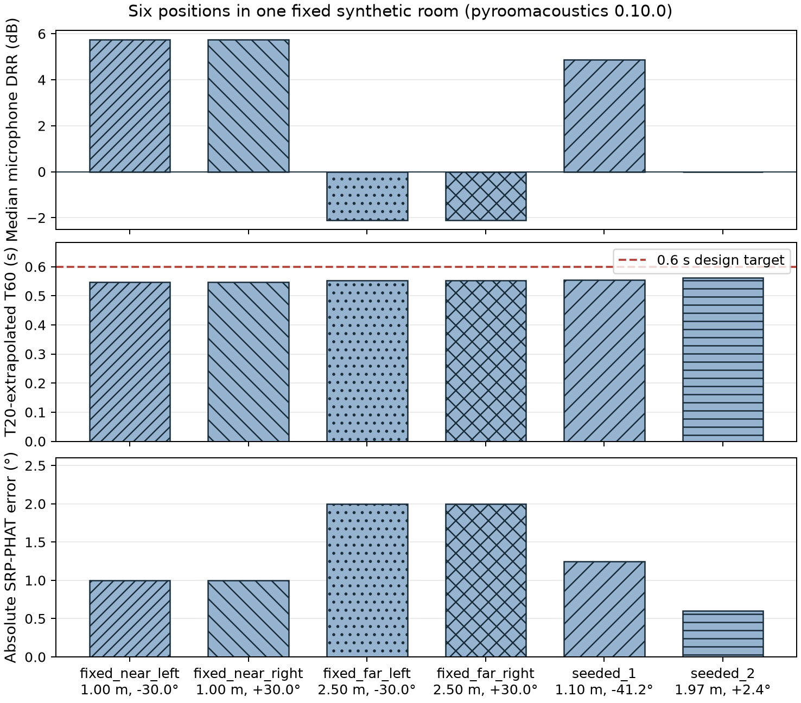
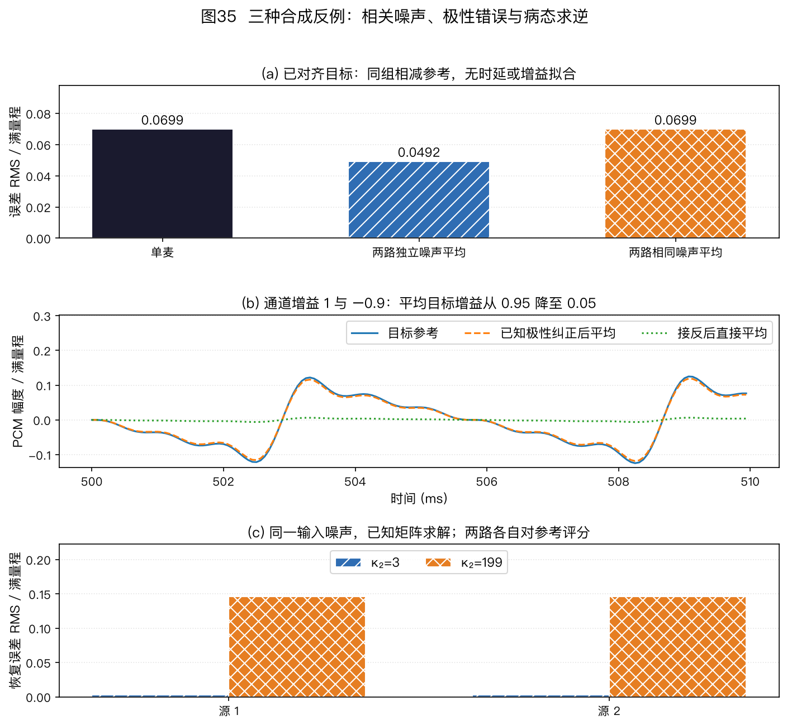
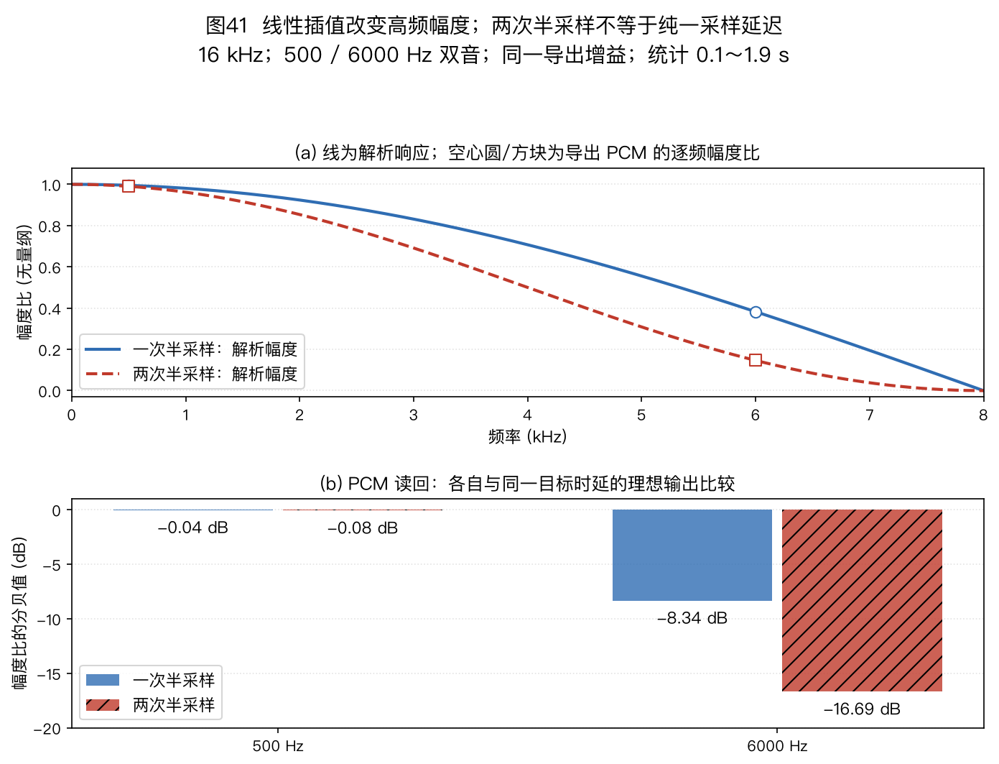
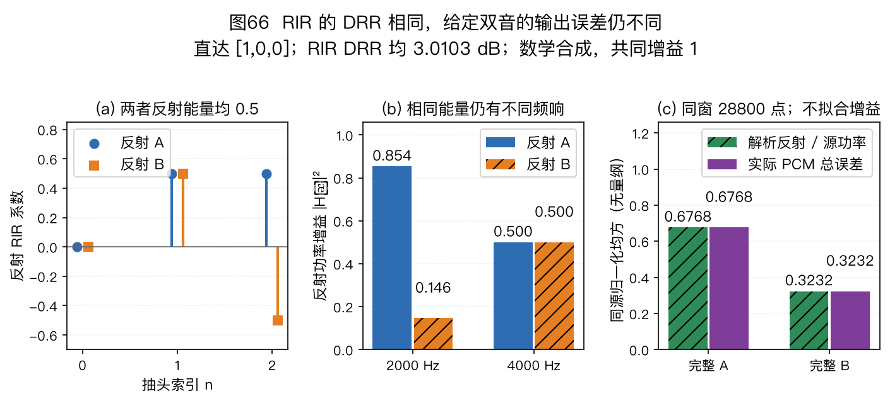

> ⚠️ 本篇是附录 B（正文共 11 章，另有附录 A/B），可独立查阅，前后篇见下方导航。
>
> 🏠 首页导读：[`00_overview.md`](00_overview.md) ｜ 上一篇：[12_appendix-symbols-math.md](12_appendix-symbols-math.md) ｜ 下一篇：（无）

---

## 附录 B：学习路径、领域地图、排错、练习与复现

### 13.1 研究生学习路径

下面的阅读与实验顺序从经典模型开始，再过渡到公开基线、数据集和硬件实验。

1. **基础阅读**：Van Veen & Buckley, [*Beamforming: A Versatile Approach to Spatial Filtering*](https://doi.org/10.1109/53.665 "citation")（IEEE ASSP Mag. 1988）；Krim & Viberg, [*Two Decades of Array Signal Processing Research: The Parametric Approach*](https://doi.org/10.1109/79.526899 "citation")（IEEE SPM 1996）。
2. **语音场景**：Kumatani、McDonough 与 Raj, [*Microphone Array Processing for Distant Speech Recognition: From Close-Talking Microphones to Far-Field Sensors*](https://doi.org/10.1109/MSP.2012.2205285)（*IEEE Signal Processing Magazine* 29(6):127–140，2012）；Gannot et al., *A Consolidated Perspective on Multimicrophone Speech Enhancement and Source Separation*（IEEE/ACM TASLP 2017）。Kumatani 等另有题名前半段相同的 *Towards Real-World Deployment*，查找时不能省略副标题。
3. **原始论文**：Capon（1969）、[Griffiths & Jim 的 GSC](https://doi.org/10.1109/TAP.1982.1142739 "citation")（1982，*An Alternative Approach to Linearly Constrained Adaptive Beamforming*）、[Schmidt 的 MUSIC](https://doi.org/10.1109/TAP.1986.1143830 "citation")（1986）、Roy & Kailath 的 ESPRIT（1989）、Allen & Berkley 的镜像法（1979）、[Nakatani 等的 WPE](https://doi.org/10.1109/TASL.2010.2052251 "citation")（2010）、[Pal & Vaidyanathan 的嵌套阵](https://doi.org/10.1109/TSP.2010.2049264 "citation")（2010）。各论文定义和后续实现的差异应再回对应算法章核对。
4. **回声消除**：Hänsler & Schmidt, *Acoustic Echo and Noise Control*（Wiley 2004）；近年进展看 ICASSP AEC Challenge 系列报告。
5. **DNN 方向**：Chakrabarty 与 Habets, [*Multi-Speaker DOA Estimation Using Deep Convolutional Networks Trained With Noise Signals*](https://doi.org/10.1109/JSTSP.2019.2901664)（*IEEE JSTSP* 13(1):8–21，2019）；Gu et al. 全神经波束形成（IEEE/ACM TASLP, vol.31, pp.849–862, DOI 10.1109/TASLP.2022.3229261）。
6. **实验顺序**：每一步增加一种新的验证条件，前一步的可复算结果应留作后一步的对照。

    1. 运行 `codes/` 中只依赖 NumPy 的教学实现，核对手算结果、数组维度和退化边界。
    2. 在隔离环境中用 pyroomacoustics 验证 DSB、MVDR、MUSIC 和 SRP-PHAT 基线，记录房间、阵列和随机种子。
    3. 先按 §13.7 生成图所依赖的音频和追踪清单，再运行 `scripts/` 中的两个绘图脚本，按当前参数复现 66 张编号图，并逐图核对正文条件。
    4. 按研究任务选择公开数据和固定版本参考系统，分别核对代码、模型与数据的许可和评测口径。
    5. 在可用的多通道硬件上测实时性、同步和标定；仿真结果不能代替设备测量。

### 13.2 领域地图：教材、会议、期刊与挑战赛

本节按教材、会议、期刊、挑战赛和历史脉络组织，可按需要查阅。

**教材与专著**（由浅到深）：

| 书 | 特点 |
|---|---|
| Benesty, Chen & Huang, *Microphone Array Signal Processing*（Springer 2008） | 覆盖阵列模型、定位、波束形成与多通道增强 |
| Brandstein & Ward (eds.), *Microphone Arrays: Signal Processing Techniques and Applications*（Springer 2001） | 经典论文式合集，各章由领域奠基人撰写 |
| Tashev, *Sound Capture and Processing: Practical Approaches*（Wiley 2009） | 从工程视角讨论捕获链路、器件和实现权衡 |
| Johnson & Dudgeon, *Array Signal Processing: Concepts and Techniques*（Prentice Hall 1993） | 通用阵列信号处理经典（雷达/声呐同源理论） |
| Van Trees, *Optimum Array Processing*（Wiley 2002） | 系统推导最优阵列处理，适合查阅数学细节 |
| Vincent, Virtanen & Gannot (eds.), *Audio Source Separation and Speech Enhancement*（Wiley 2018） | 分离与增强方向的现代合集 |
| Rafaely, *Fundamentals of Spherical Array Processing*（Springer，一版2015，DOI 10.1007/978-3-662-45664-4；二版 online 2018、版权2019，DOI 10.1007/978-3-319-99561-8） | 系统介绍球阵与球谐域处理，可配合 §5.8 阅读 |

**会议**：ICASSP（信号处理旗舰会）、Interspeech（语音领域旗舰会）、WASPAA（音频与声学信号处理研讨会，两年一届）、IWAENC（声学信号增强研讨会）、HSCMA（免提语音通信与麦克风阵列研讨会）、DCASE Workshop（声事件与场景）。

**期刊**：IEEE/ACM Transactions on Audio, Speech, and Language Processing（TASLP，本领域主刊）、IEEE JSTSP（信号处理选题特刊）、JASA（美国声学学会刊）、Speech Communication。

**挑战赛**用于了解公开任务和评测口径。

CHiME 覆盖远场、多说话人和多通道语音处理；CHiME-9 设置 MCoRec 多会话鸡尾酒会转写与会话聚类、ECHI 低延迟助听对话增强。[CHiME-10 官方任务页](https://www.chimechallenge.org/challenges/chime10/index "citation")列出 ECHI-2、URGENT、SG-TSE 三项任务；[官方日程页](https://www.chimechallenge.org/challenges/chime10/dates "citation")列出计划于 2027 年 2 月 4 日开放、提交期暂定为 2027 年 8～9 月。上述日程核实于 2026 年 10 月 2 日，参赛时应重新核对官方日期。

DCASE 2026 的挑战期及系统提交于 2026 年 6 月 15 日截止，并在 7 月 1 日公布结果；Task 3 是 Semantic Acoustic Imaging SELD，与 DCASE 2024 Task 3 的距离估计设置不同。以上状态核实于 2026 年 10 月 2 日，任务定义、[提交日期](https://dcase.community/challenge2026/submission "citation")与结果见 [DCASE 2026 官方页面](https://dcase.community/challenge2026/ "citation")和[结果公告](https://dcase.community/articles/dcase2026-challenge-results-published "citation")。

其他公开评测包括 REVERB 去混响评测、ICASSP DNS/AEC Challenge，以及已结束的 [SPEAR Challenge 2023](https://signalprocessingsociety.org/publications-resources/data-challenges/speech-enhancement-augmented-reality-spear-challenge-2023 "citation")。SPEAR 使用头戴式 6 通道设备研究 AR 语音增强；它的年份、阵列和任务条件不应外推为当前持续榜单。

**历史脉络**（本领域是雷达/声呐技术向语音的迁移史）：

| 年代 | 里程碑 |
|---|---|
| 1940s–60s | 雷达/声呐阵列处理奠基（Bartlett 波束扫描） |
| 1969 | Capon 最小方差谱估计（为地震学阵列而做） |
| 1972 | Frost 时域约束自适应波束形成 |
| 1979–82 | Allen & Berkley 镜像法房间仿真；Griffiths & Jim 提出 GSC |
| 1985 | Flanagan 等报告了可计算转向的大孔径会议室麦克风阵列 |
| 1986–89 | MUSIC（1986）与 ESPRIT（1989）用子空间结构估计到达方向；分辨能力仍受孔径、信噪比、快拍数和模型失配限制 |
| 1990s | Elko 差分麦克风阵列进入助听器与桌面会议设备 |
| 2001–08 | Brandstein & Ward、Benesty 等教材出版，语音阵列知识体系化 |
| 2010 | Nakatani 提出 WPE 去混响；Pal & Vaidyanathan 提出嵌套阵 |
| 2011 | 首届 CHiME 挑战赛，远场语音成为公开评测对象 |
| 2014 | Amazon Echo 把多麦克风远场语音带入一类消费设备；具体阵列规格随硬件代次而变 |
| 2015–18 | CHiME-3/4/5 的公开任务推动了掩码辅助波束与 GSS 等方法的可复现比较 |
| 2019–24 | DNN 定位/追踪（ACCDOA：声源活动与方向联合输出，Shimada et al., ICASSP 2021）、端到端一体化；CHiME-7/8 大模型后端；STARSS23（DCASE 2024 Task 3 使用的开发与评测数据集）支持声源距离估计子任务 |
| 2025–26 | CHiME-9 设置 MCoRec 与 ECHI；2026 年 7 月公布 CHiME-10 三项任务；DCASE 2026 Task 3 转为 Semantic Acoustic Imaging SELD，并于 2026 年 7 月公布挑战结果 |

DCASE 2024 Task 3 的官方任务页明确将开发集和评测集称为 STARSS23，数据集名中的年份不应随挑战年份改写。[DCASE 2024 Task 3 官方说明](https://dcase.community/challenge2024/task-audio-and-audiovisual-sound-event-localization-and-detection-with-source-distance-estimation "citation")

### 13.3 研究前沿速览（2024—）

本节把正文中的经典方法与 2024 年以来若干公开研究方向相连。具体成绩只在原论文的数据、实现和评测条件下成立；带日程的内容以对应挑战赛官方页面为准。

#### 研究方向一：预训练模型用作远场识别后端

CHiME-7/8（2023/2024）部分参赛系统使用 Whisper、WavLM 等预训练模型作为识别后端，也有系统保留 GSS（导引源分离，详见 §8.4）和解析波束。这些参赛系统只能说明相应架构在该届数据和评测中被实现，不能据此断言整个领域已转向某一种架构。[CHiME-7/8 综述预印本，arXiv:2507.18161](https://arxiv.org/abs/2507.18161 "citation")

#### 研究方向二：阵列无关系统

Cornell 等的 CHiME-8 DASR 报告定义远场多说话人识别任务，并给出 ESPnet 与 NeMo 两条基线。它不是一套特定通道聚合网络的系统报告；两条基线的分割、前端和识别配置应分别核对。原文 §5 介绍基线，§6 分析结果，泛化范围以相应训练条件、测试设备、任务和评分脚本为界。[CHiME-8 DASR 原报告](https://www.isca-archive.org/chime_2024/cornell24_chime.pdf "citation")

#### 研究方向三：目标说话人提取

目标说话人提取（Target Speaker Extraction，TSE）用注册语音、视觉或方向提示描述目标，再从混合语音中提取相应音轨。AR 眼镜阵列和手机结构辅助方向提取提供了不同的条件输入形式。

[TEA-PSE 原工作](https://doi.org/10.1109/ICASSP43922.2022.9747765 "citation")发表于 ICASSP 2022；[TEA-PSE 3.0](https://arxiv.org/abs/2303.07704 "citation")是面向后续挑战的另一个版本，不能把两者的实现或成绩混为同版。[CIENet 原工作](https://cmsworkshops.com/ICASSP2024/view_paper.php?PaperNum=3147 "citation")发表于 ICASSP 2024。它把注册语音与混合语音的时频表示送入注意力交互，计算随帧变化的目标相关权重，进而提取目标；[作者预印本的方法说明](https://arxiv.org/abs/2402.17146 "citation")可帮助核对这一步。这里的条件不是只把整段注册语音压成一个固定向量后直接拼接到混合谱上。

SonicSieve 采用另一种线索：被动声学微结构改变方向相关响应，让神经网络利用方向特征提取语音，不是由注册声纹指定身份。它依赖对应的声学结构与训练数据，不能当作任意手机加软件即可获得的效果。原论文为 CHI 2026；本书仅说明方法条件，不转引摘要中的性能数字。[作者机构项目页](https://www.witechlab.com/sonicsieve.html "citation")、[作者论文 v3，2026-02-11，摘要与方法部分](https://arxiv.org/abs/2504.10793v3 "citation")（核实：2026-09-22）。

§6.5 的个性化 AEC 与这类条件提取方法相关，但训练目标和回声参考结构仍需分别定义。

#### 研究方向四：生成式语音增强与推理加速

SGMSE+（Richter et al., IEEE/ACM TASLP 2023）在复数 STFT 域使用基于随机微分方程的扩散模型；StoRM（Lemercier et al., IEEE/ACM TASLP 2023）把判别式回归与生成过程结合，以减少采样负担。[SGMSE+ 代码与论文](https://github.com/sp-uhh/sgmse "citation")、[StoRM 代码与论文](https://github.com/sp-uhh/storm "citation")。

这类方法可能改善特定数据上的感知质量，也可能生成参考中不存在的语音细节，因此要同时评估听感、内容一致性和下游 WER。流匹配、蒸馏和一致性模型试图减少采样步数。

FlowSep（ICASSP 2025）把整流流用于 VAE 隐空间中的文本查询通用音频分离，其结论不能直接外推到多通道语音增强。[原论文](https://doi.org/10.1109/ICASSP49660.2025.10890129 "citation")与[作者源码](https://github.com/Audio-AGI/FlowSep/tree/d8164db58bd461ef5bb6df8ffd372b536ee6afb4 "citation")已定位；该固定源码未见明确的根目录再分发许可，运行还需分别取得模型检查点和依赖资产。本书只将其列为研究入口，没有复制源码、取得模型或运行推理。

多通道生成模型还需显式处理跨通道相位与空间协方差。与 §5.9 的掩码加解析波束比较时，应固定输出目标、采样步数、前瞻、状态和计算预算，分别测内容保持与空间一致性；方法名称不能代替成本或因果性检查。

最小复现还要核对实际生效的采样器、权重与输入准备。锁定 SGMSE 的 `ScoreModel.enhance()` 在 OUVE 分支按 `self.sde.sampler_type` 分派，不能只记录同名调用参数；该入口还以输入峰值归一化，静态源码没有零输入保护，因此不能直接将全零片段当作合法推理测试。这里是固定入口的源码检查，没有运行模型权重；配置与边界见[生成式实现研究](../codes/chapters/ch00/research/04_source_reproduction.md#appendix-b-reproduction)。

#### 研究方向五：TF-GridNet 与复数谱映射骨干

第 8 章的解析盲分离依赖源独立性和明确的混合模型；TF-GridNet 改用训练数据学习时频结构。网络输入是混合语音的复数短时频谱，实部和虚部作为特征；输出是各目标语音频谱的实部和虚部，再经逆变换回到波形。一个处理块分别沿当前帧的频率方向、同一频带的时间方向和跨帧注意力路径交换信息，因此名称中的“网格”指时间与频率两个方向的交替处理。[作者期刊版论文摘要与方法](https://arxiv.org/abs/2211.12433 "citation")

Wang 等的 ICASSP 2023 单通道会议版研究无混响的单通道说话人分离；IEEE/ACM TASLP 2023 期刊扩展进一步讨论噪声、混响和多通道条件。[会议版](https://doi.org/10.1109/ICASSP49357.2023.10094992 "citation")、[期刊版](https://doi.org/10.1109/TASLP.2023.3304482 "citation")。

最小复现应先固定其中**一个**版本，写明输入通道数、目标源数、谱变换、训练权重和测试集，再把输出与同条件的第 8 章基线比较。锁定版本 ESPnet 的 [`TFGridNet` 实现](https://github.com/espnet/espnet/blob/be79590bb2ff26ffb01bc825c5f68cb9418b7f0d/espnet2/enh/separator/tfgridnet_separator.py "citation")还明确要求核对混合和目标的方差归一化。

源码可读取并不表示本书已经训练或运行该模型。具体 SI-SDRi 只按所选论文的数据版本、混合方式和表号引用，不能把两版结果混在一起。

#### 研究方向六：几何无关前端的期刊研究

Kamo et al. 在 *Computer Speech & Language* 95:101820（2026）中整理了几何无关的多说话人远场识别系统，并在真实会议数据上评估。作者 v2 原文的第2节与第4.1～4.3.6节给出实际模块顺序：先局部说话人分割，再以 GSS 输出提取说话人嵌入，跨块全局聚类并估计人数，随后用目标说话人语音活动检测（TS-VAD）细化活动区间。活动、人数和身份在这些步骤中分别估计，不能把它们统称为一个分离掩码。

增强部分按特征值（EV）与早晚能量比（C50）选择通道，再做 WPE 与 GSS，接空间预测多通道维纳滤波（SP-MWF）；参考选择依据输出 SNR，之后做盲解析归一化（BAN）并送入 ASR。这里概述原系统的处理顺序，不将每一步扩为另一套算法教程；定义与手算分别见第 5、7、8 章。几何无关指不要求固定阵列坐标，不保证任意异步设备或未见声学域都有效。[期刊正式页面](https://www.sciencedirect.com/science/article/pii/S0885230825000452 "citation")、[作者 v2 方法与系统配置](https://arxiv.org/html/2502.09859v2 "citation")。

#### 研究方向七：CHiME-9 与大模型后端

CHiME-9 设置了两个输入与目标都不同的任务。MCoRec 使用房间中央的 360° 视频和音频，要求转写说话内容，并判断哪些人属于同一段会话；ECHI 则研究让佩戴者听清对话对象的低延迟增强。后一任务的[官方规则](https://www.chimechallenge.org/challenges/chime9/task2/rules "citation")要求流式处理且算法延迟至多 20 ms。两任务不能共用一张“CHiME-9 语音增强”成绩表。[CHiME-9 官方任务页](https://www.chimechallenge.org/challenges/chime9/index "citation")

DiCoW（Polok et al., *Computer Speech & Language* 95:101841，2026，[DOI 10.1016/j.csl.2025.101841](https://doi.org/10.1016/j.csl.2025.101841 "citation")）针对多人混合录音中“只转写指定一人”的问题，把说话人分割给出的活动信息作为条件输入 Whisper；输出是该目标的文字，而不是分离后的干净音轨。这与先分离出波形再送入普通识别器的做法不同。

作者[演示仓固定提交](https://github.com/BUTSpeechFIT/DiCoW/tree/e9326bd536bf632e823357438b210102903ba620 "citation")内有两个不同入口：[`example.py` 使用 DiCoW v1 与 Pyannote 3.1](https://github.com/BUTSpeechFIT/DiCoW/blob/e9326bd536bf632e823357438b210102903ba620/example.py#L8-L14 "citation")，[`app.py` 使用 DiCoW v2 与 Pyannote 3.1](https://github.com/BUTSpeechFIT/DiCoW/blob/e9326bd536bf632e823357438b210102903ba620/app.py#L31-L39 "citation")；不能仅凭仓库提交号把两者叫作同版。原工作相关的[训练/推理源码仓固定版本](https://github.com/BUTSpeechFIT/TS-ASR-Whisper/tree/0ea6679d44405f5ff39188030123524686c198e9 "citation")另行锁定。演示仓后续主分支引入 DiariZen 等新依赖，不应把这套后续演示条件倒写为上述固定提交的必需条件。

源码、模型和数据分开核对许可：上述代码按 Apache-2.0，[DiCoW v1 权重](https://huggingface.co/BUT-FIT/DiCoW_v1 "citation")与[DiCoW v2 权重](https://huggingface.co/BUT-FIT/DiCoW_v2 "citation")的模型卡各标 CC BY 4.0；后续演示使用的 [DiariZen 权重](https://github.com/BUTSpeechFIT/DiariZen/blob/main/MODEL_LICENSE "citation")按 CC BY-NC 4.0，不能由代码许可推断其商用权利。[Pyannote 3.1](https://huggingface.co/pyannote/speaker-diarization-3.1 "citation")模型还须核对门控获取条件与访问凭据。取得源码不表示权重已获许可或系统已经运行。

复现时至少要固定分割标签的来源、目标说话人、录音片段和识别评分方式，并与不加说话人条件的识别结果对照；若分割标签错位，也要检查词漏识别。该方法不能直接当作 ECHI 的 20 ms 助听增强基线。

#### 研究方向八：扩散先验用于无监督盲分离

ArrayDPS（Xu et al., ICML 2025）处理“没有阵列几何、房间冲激响应和配对分离标签”的多通道盲分离问题。AuxIVA 通过源独立性直接迭代解混矩阵；ArrayDPS 改为从单说话人扩散先验采样，并在每个采样步骤内估计相对房间冲激响应，用该近似混合模型计算似然梯度。

它仍假设说话人数已知、各通道同步、混合可由卷积模型近似，而且单说话人先验要覆盖测试语音域；扩散先验不能替代源数估计、同步或域外验证。

原论文 §2 的输出目标是参考麦克风处各说话人的**混响源图像**，不是一律恢复无混响干净声。虚拟源用于建立相对响应模型，评分参考仍须按该输出取点准备。[ArrayDPS 正式论文（PMLR 267），§2～§3](https://proceedings.mlr.press/v267/xu25f.html "citation")。

最小复现可沿用作者 SMS-WSJ 配方：两名说话人、3 通道、8 kHz，核对单说话人扩散模型及数据权利，固定 `num_speakers=2`、`n_channels=3`、`num_steps=400`，将输出与 IVA 初始化按同一参考与评分实现比较，并记录总耗时、采样种子和峰值显存。论文的 FCP 谱变换为 512 点 FFT、64 点帧移；固定源码与 README 配方使用 512/128 点，功率地板和历史帧数也应按实际消费层记录，不能把同名默认配置直接称为论文配置。官方 README 要求显存大于 7 GB；400 步采样还嵌套相对 RIR 优化，因此是离线研究候选，不能据此宣称低延迟流式运行。[固定作者实现](https://github.com/ArrayDPS/ArrayDPS/tree/750ac2b7c75458f4ca5bad203dafda528f575e55 "citation")。

核心 `Sampler` 的混合重构指导不读取干净测试源；固定 `separate.py` 驾驶器却在第161行用 `sources[:,0,:]` 计算 SDR，并在第180～186行据真值指标与预算决定继续或停止。该驾驶器可以用于离线评价，不能原样作为没有参考语音的部署停止规则。

原文 §4.2 另区分五次采样指标的均值与标准差、用真值挑最高指标的 Max 诊断，以及只按混合重构质量选择样本的 ML 规则。Mean 不表示把五条波形直接平均，Max 是 oracle 对照，ML 与上述真值停止也不同。本书只读原文与固定源码，没有取得权重或运行扩散推理；许可、参数层和最小合同检查见[ArrayDPS 实现研究](../codes/chapters/ch00/research/02_aec_wpe_separation.md#sec-u-3b78d29bc2)。

#### 专题：神经网络前端的泛化失配与四类对策

本专栏解释阵列或房间改变后性能下降的原因，并展开上面“阵列无关系统”与“几何无关前端的期刊研究”涉及的四类对策。

神经网络前端可能在训练阵列和房间上表现良好，换到新的几何、声学条件或任务后却明显退化，这就是**泛化失配**。下面把失配分为阵列、声学、任务与数据三类，再从数据、表示、训练和部署四方面讨论缓解方法。

**失配三源**：

1. **阵列失配**：训练与部署的几何、通道数、麦克风一致性或采样时钟不同。若网络依赖固定通道编号及其相位关系，更换阵列后这些特征不再成立，端到端波束尤其容易受影响（§5.9 第 2 条）。
2. **声学失配**：混响时间、噪声类型和说话人距离改变。训练数据未覆盖相应混响尾部或噪声结构时，掩码估计误差会传递到协方差和 MVDR 权重。
3. **任务与数据失配**：仿真未包含麦位误差、挡板散射或非平坦频响；训练与测试的语言不同；面向听感训练的增强模型被直接用于 ASR。最后一种情况还要检查生成式模型是否改变语音内容（见上面的“生成式语音增强与推理加速”）。

**四类对策**：

1. **数据**：混合多种阵列几何、房间、采样率和噪声进行训练，并用少量目标设备录音适配。目标是覆盖可能变化的相位和幅度关系，而不是穷举设备。
2. **表示**：让网络输出掩码、协方差或说话人活动等中间量，再由 MVDR 或 GSS 等解析方法施加无失真约束（§5.9 第 1 条）。这种分工仍需验证中间量是否真正跨几何泛化。
3. **训练**：随机丢弃通道、置换通道顺序并扰动麦克风坐标，分别模拟通道失效、可变麦数和标定误差；网络结构还要满足相应的置换不变或等变性质。
4. **部署**：先做通道一致性和几何标定，再根据置信度、资源和失败模式选择模型或解析基线。模型分级只是候选架构，是否有净收益要在目标硬件上测量。

**阵列无关系统的常见结构**：各通道先独立提取特征，再用注意力或池化聚合成对通道顺序不敏感、可接受可变通道数的表示。中间量可选掩码、协方差或说话人活动；分离与波束部分采用 GSS 等解析方法，或使用满足几何无关要求的神经前端。后端再用预训练识别模型吸收残余失配。

CHiME-8 DASR 的两条任务基线与上面的“几何无关前端的期刊研究”提供了可分别检查的公开流程。复现时应画出实际流程图，并逐项标明训练数据、通道聚合方式、解析约束和测试阵列范围。

**TAC 与 VarArray**。TAC（Transform-Average-Concatenate）对各通道使用同一变换，跨通道平均，再将平均特征拼回每一路。平均特征对通道置换不变，逐通道输出则随输入同样置换，称为置换等变。网络可接受不同通道数，不表示增加不同观测后输出仍相同；只复制一条通道还会改变平均权重。[原论文 §2.1，式(1)～式(4)](https://arxiv.org/html/1910.14104v3 "citation")与[E13-11 的标量手算](#e13-11)区分这些性质。

VarArray 把 TAC、Conformer 分离和通道间相位差特征用于几何无关的连续语音分离，并在 AMI 会议转写上报告端到端 sa-WER 结果。它们为后续跨设备系统提供了结构基础。[VarArray, ICASSP 2022, DOI 10.1109/ICASSP43922.2022.9746876](https://doi.org/10.1109/ICASSP43922.2022.9746876 "citation")

### 13.4 常见问题与调试指南

下面按“现象 → 优先检查项”列出八类常见问题。

1. **MUSIC 没有峰 / 峰位置不稳定** → 先看样本协方差的秩与条件数。若直接用 $T$ 个 $M$ 维快照计算未中心二阶矩，矩阵秩不超过 $T$，所以 $T<M$ 时必然奇异；若先估计并减去样本均值，中心化后的 $T$ 个向量线性和为零，秩必不超过 $\min(M,T-1)$，所以 $T\le M$ 时必然奇异。快照数超过这一最低门槛也不代表估计已经稳定。

    再检查源数 $K$ 和噪声底是否可分，最后检查直达声与反射是否强相干。空间平滑只适用于具有可分重叠子阵的几何，而且会缩短有效孔径；它不是所有混响场景的必选项（§2.5、§4.6）。

2. **GCC-PHAT 峰位置在离散时延格点间跳变** → 没有做亚采样时延估计，或原始时延网格太粗；也可能是强反射峰超过直达峰（图13）。图12采用 16 倍互谱补零插值，不是三点抛物线拟合；其他实现也可采用相关峰插值或相位斜率拟合（§4.2）。

3. **波束形成后目标语音反而失真** → 先查 DOA、RTF 和通道标定是否一致，再检查噪声协方差的估计方式。

    噪声协方差既可由目标缺席帧估计，也可由时频掩码加权估计；关键是尽量排除目标泄漏，同时保留足够有效快拍。混响中还要确认约束对象是否应改用 RTF（§5.4、§5.9）。

4. **超指向输出噪声很大** → 检查 WNG、协方差条件数、通道增益相位和阵列流形误差。容许的失配没有统一 dB 门槛，应从目标 WNG、最高工作频率和实测波束图反推；可用对角加载或显式 WNG 约束改善稳健性（§5.3、§5.4）。

5. **AEC 残余回声较大** → 优先检查参考取点、参考与麦克风的整体延迟、扬声器削波以及滤波器覆盖时间。参考不同步是需要排查的原因之一，不是所有设备的固定首因。

    若线性路径已收敛而仍有与播放相关的非线性残余，再评估[非线性处理（NLP）及其工作点](06_aec.md#sec-6-12)，或[学习型 AEC](06_aec.md#sec-6-5)；AEC3 的残余抑制结构见[§6.8](06_aec.md#sec-6-8)。

6. **SRP-PHAT 出现镜像假峰**：先区分三种原因，不能把所有对称峰都归于麦间距。

    - 几何不可辨识：线阵可能存在前后或锥面歧义，平面阵可能存在上下镜像；增加频带未必能消除相同 TDOA，见 §3.1。
    - 空间混叠：检查工作频率、间距与转向；超过半波长失去全视场无混叠保证，但并非每个方向必然出现等高栅瓣，见 §2.6 和本附录练习 2。
    - 多径反射：强反射可能形成镜像声源峰，应结合直达声可见性、搜索区域与房间条件判断。限制搜索空间需要明确的场景先验，不能仅为删除不喜欢的峰。

7. **多麦录音各通道逐渐错位** → 先区分固定的初始时差、独立丢样和 SRO。单设备可让通道共享采样时钟；分布式设备无法共享时钟时，要估计相对采样率并重采样。PDM/TDM 是接口形式，不自动保证跨设备同步（§10.2）。

8. **仿真很好、实测很差** → 逐项加入麦位误差、通道增益相位误差、壳体散射、频响差异、时钟偏移和扬声器非线性，寻找哪一项能复现实测退化。

    位置容差应按最高频率允许的相位误差换算，不存在对所有阵列通用的毫米阈值。完成标定后，再在容差范围和多个位置上复测。

### 13.5 核心公式速查卡

下表汇总正文中的关键公式，便于复习和查阅。公式成立条件仍以对应章节为准。

| 公式 | 含义 | 章节 |
|---|---|---|
| $10\log_{10}M$ | 目标导向向量各元模为 1、无失真归一化、各通道独立等功率白噪声时，$M$ 元 DSB 的 WNG（dB）；阵元响应含不等增益时不可直接套用 | §1、§5.2 |
| $r_F=2D^2/\lambda$ | Fraunhofer 相位曲率检查尺度；不是远近场硬分界。使用平面波模型还要检查 $r\gg D$、阵元幅度差和允许的相位误差 | §2.2 |
| $T_{60} = 0.161V/A$ | 赛宾公式：房间混响时间 | §2.4 |
| $d_c = 0.057\sqrt{QV/T_{60}}$ | 临界距离：直达/混响相等处；$Q$ 为声源指向因子，$Q=1$ 时才化为原来的全向式 | §2.4 |
| $\vec{x} = \vec{a}(\theta)s + \vec{n}$ | 远场窄带阵列信号模型 | §2.3 |
| $\hat{\mathbf{R}} = \frac{1}{T}\sum_t \vec{x}\vec{x}^H$ | 未中心化的样本空间二阶矩；阵列文献常称空间协方差估计 | §2.5 |
| $d < \lambda/2$ | ULA 在整个闭可视角域内避免端点歧义的充分条件；$d=\lambda/2$ 时两个端火方向 $-90^\circ$ 与 $+90^\circ$ 可产生相同阵元采样，限定转向范围时可另行分析 | §2.6 |
| HPBW、DI、WNG | 分别按主瓣两个半功率点、全空间功率响应平均、不相关等功率通道噪声定义；见式(2-11)～式(2-13) | §2.6 |
| CRB 公式 | 给定统计模型与正则条件下，无偏 DOA 估计方差的下界；见式(2-14) | §2.6 |
| $\hat\theta = \arcsin(c\hat\tau_{12}/d)$ | 双麦时延差 → 角度；本书定义 $\tau_{12}=t_1-t_2$，并以 $X_1X_2^*$ 的 GCC 峰估计它 | §2.1、§4.2 |
| $R(\tau)=\int \Phi X_1X_2^* e^{j2\pi f\tau}df$ | GCC 加权互相关 | §4.2 |
| $\hat{\vec{p}} = \arg\max_{\vec{r}} \sum R^{PHAT}$ | SRP-PHAT 全阵列投票 | §4.3 |
| $P_C = 1/(\vec{a}^H\hat{\mathbf{R}}^{-1}\vec{a})$ | Capon 谱 | §4.5 |
| $P_{MU} = 1/(\vec{a}^H\mathbf{E}_n\mathbf{E}_n^H\vec{a})$ | MUSIC 伪谱 | §4.6 |
| $\vec{w}_{DSB} = \vec{a}/M$ | 单位模导向向量下的延迟求和权重，此时 $\vec a^H\vec a=M$；一般导向幅度下的无失真匹配权重为 $\vec a/(\vec a^H\vec a)$ | §5.2 |
| $\lvert B(\theta)\rvert = \left\lvert\frac{\sin(M\psi/2)}{M\sin(\psi/2)}\right\rvert$ | 等权 ULA 的归一化阵因子，$\psi=2\pi d(\sin\theta-\sin\theta_0)/\lambda$ | §5.2 |
| $\vec{w}_{SD}=\dfrac{\mathbf{\Gamma}^{-1}\vec{a}}{\vec{a}^H\mathbf{\Gamma}^{-1}\vec{a}}$ | 超指向：在无失真约束下最小化弥散噪声输出 | §5.3 |
| $\vec{w}_{MVDR} = \mathbf{R}_{nn}^{-1}\vec{a}/(\vec{a}^H\mathbf{R}_{nn}^{-1}\vec{a})$ | 最小方差无失真 | §5.4 |
| LCMV 权重，见式(5-11) | 多约束最小方差解；完整表达式和符号在表后单列 | §5.5 |
| SDW-MWF 权重，见式(5-12) | 失真可调维纳滤波；完整表达式和符号在表后单列 | [第 5 章 MWF 专题](05_beamforming.md#sec-u-fb93744989) |
| $e=d-y$ | GSC 中固定波束输出 $d$ 减去自适应抵消输出 $y$；在阻塞矩阵理想、支路自由度足够且优化收敛时与相应 LCMV 等价 | §5.6 |
| NLMS 更新式 | AEC 自适应滤波 | §6.1 |
| $\mathrm{ERLE}=10\log_{10}\dfrac{\sum_n|y(n)|^2}{\sum_n|e_{\mathrm{echo}}(n)|^2}$ | 同一远端单讲窗口内的回声返回损失增强；$y=x*h$ 为消除前回声，$e_{\mathrm{echo}}$ 为消除后回声分量 | [§6.7，式(6-29)](06_aec.md#sec-6-7) |
| WPE 预测模型，见式(7-1) | 当前观测分成预测残响和早期成分；完整表达式在表后单列 | §7.1 |
| KF 五步 | 状态与协方差预测→计算增益→状态与协方差更新；圆周角新息先做 wrap，浮点实现可用 Joseph 协方差更新 | §9.2 |

表中三个较长的表达式单独列出，以便在网页和 A4 页面上读清上下标。这里沿用对应章节的定义与成立条件，没有重新给公式编号。

**LCMV 权重，见式(5-11)**：$\mathbf R$ 为用于最小化输出功率的协方差矩阵；$\mathbf C$ 的列是各约束导向向量，$\vec f$ 是 $\mathbf C^H\vec w=\vec f$ 的约束值。实际输出复响应为 $\vec w^H\mathbf C=\vec f^H$；逐列指定输出复响应 $g_k=\vec w^H\vec c_k$ 时，应输入约束值 $f_k=g_k^*$。实数 $0/1$ 例子无法检出误用复共轭。若所需逆矩阵不存在，须回到 §5.5 检查约束是否独立及正则化条件。

$$
\vec w_{LCMV}
=\mathbf R^{-1}\mathbf C
\left(\mathbf C^H\mathbf R^{-1}\mathbf C\right)^{-1}\vec f .
$$

**SDW-MWF 权重，见式(5-12)**：$\mathbf R_{ss}$、$\mathbf R_{nn}$ 分别是目标与噪声协方差矩阵，$\vec e_r$ 选出参考麦；$\mu>0$ 调节噪声惩罚与目标失真。它不是一般条件下的 MVDR 解，具体目标函数和秩一特例见[第 5 章 MWF 专题](05_beamforming.md#sec-u-fb93744989)。

$$
\vec w_{SDW}
=\left(\mathbf R_{ss}+\mu\mathbf R_{nn}\right)^{-1}\mathbf R_{ss}\vec e_r .
$$

**WPE 预测模型，见式(7-1)**：沿用第 7 章的局部记号，$f$ 是离散频点索引（不同于第 2 章以 Hz 计的物理频率 $f$）；$X(n,f)$ 是当前帧该频点的观测；$G^*(k,f)X(n-k,f)$ 用过去帧预测晚期混响，$E(n,f)$ 是希望保留早期成分的预测残差，并不保证等于真实早期成分。$\Delta$ 为预测延迟，$K$ 为抽头数；多通道时系数和历史观测改为向量，见[§7.3](07_wpe-dereverberation.md#sec-7-3)。

$$
X(n,f)=E(n,f)+\sum_{k=\Delta}^{\Delta+K-1}G^*(k,f)X(n-k,f) .
$$

**PHD 预测，见式(9-22)**：新生目标强度加存活目标的状态转移。

$$\begin{aligned}
D_{t\vert t-1}(x)&=\gamma_t(x)\\
&\quad+\int p_S(\xi)f_{t\vert t-1}(x\mid\xi)D_{t-1}(\xi)\,d\xi.
\end{aligned}$$

**PHD 更新，见式(9-23)**：漏检项加每条观测的“目标/杂波”归一化贡献。

$$\begin{aligned}
D_t(x)&=[1-p_D(x)]D^-(x)\\
&\quad+\sum_{z\in Z_t}\dfrac{p_D(x)g(z\mid x)D^-(x)}{\kappa(z)+\int p_D(\xi)g(z\mid\xi)D^-(\xi)d\xi}.
\end{aligned}$$

预测式中，$x$、$\xi$ 是目标状态，可分别是单个标量或包含方位、角速度等分量的状态向量；积分遍历与状态维度相同的空间。$D_{t-1}(\xi)$ 是上一时刻在状态 $\xi$ 处的目标强度，$p_S$ 是存活概率，$f_{t\vert t-1}$ 是状态转移密度，$\gamma_t$ 是新生目标强度。预测把“存活并移动的旧目标”和“新生目标”相加。

更新式中，$D^-=D_{t\vert t-1}$ 是更新前强度，$Z_t$ 是本帧观测集合，$p_D(x)$ 是状态 $x$ 处的检测概率，$g(z\mid x)$ 是目标在该状态产生观测 $z$ 的似然，$\kappa(z)$ 是该观测处的杂波强度。分母中的 $p_D(\xi)$ 必须随积分状态变化；仅在检测概率与状态无关时才能将其视为常数。分母把杂波与所有可能目标来源放在同一观测口径下比较；这些量的连续状态积分及多观测含义见 §9.3。

**单状态格演示。** 假设上一时刻此格的强度为 $0.6$，存活概率 $0.9$，转移仍留在本格，新生强度 $0.26$。预测强度为 $D^-=0.26+0.9\times0.6=0.8$。

若本帧只有一个观测，并在这一个状态格上取常数 $p_D=0.75$、该格观测似然 $g=0.5$、同单位杂波强度 $\kappa=0.1$。漏检项为 $(1-0.75)\times0.8=0.2$；观测项为 $(0.75\times0.5\times0.8)/(0.1+0.75\times0.5\times0.8)=0.75$；更新强度为 $0.95$。

这是把积分退化为单格求和的本书手算，不是“该观测有 95% 概率属于目标”，也不能替代多目标、多观测的关联计算。

### 13.6 思考与练习

练习按学习主题排列，题 9 先用去混响图作对照，题 10～11 再回到回声消除。修改脚本参数时，应同时记录随机种子、实验条件和输出指标。数值题附参考答案，综合题附思路提示。

**练习涉及的绘图函数**：先阅读参数与生成模型。需要改参数时，在个人实验副本中运行并保存到独立输出目录，不直接覆盖本书的出版插图或 `codes/chapters/ch00/reports/`。这些函数是出版图生成器，并非自动接受参数、同步改图注和报告的实验接口。记录实际输入时，要同时核对标题、图内固定文字、坐标、图注和 JSON 报告；任何一项仍写旧值，就不能用该图说明新条件。

| 函数名 | 它画的是什么 | 用在哪道题 |
|---|---|---|
| `fig_geometries` | 阵列形态布局 | 题4 |
| `fig_gcc_phat` | GCC-PHAT 原理 | 题5 |
| `fig_doa_spectrum` | DOA 空间谱 | 题6 |
| `fig_wng_di` | WNG–DI 权衡 | 题8 |
| `fig_wpe` | WPE 去混响 | 题9 |
| `fig_tracking` | 粒子滤波追踪 | 题13 |

动手题用的绘图函数都在 `scripts/` 里，具体对应关系见上表。第 16 题还要安装 pyroomacoustics 0.10.0；它是房间声学仿真的扩展依赖，命令见该题和项目 README。

章内还有带稳定编号 `E01-01` 等的计算练习，由[练习与音频实验手册](../codes/chapters/ch00/research/05_exercises_and_audio.md)统一索引。下面的 1～17 题采用另一套编号，与 E 号题各自独立。`codes/chapters/ch00/cross_chapter/exercises_engineering.py` 覆盖工程、选型和数学的基础计算组；谱减、状态时间和事件边界等题使用各自的独立入口。请按题面或手册中的稳定 ID 选择程序，先手算再比对输出，不能把一个入口当作全部 E10、E11、E12 题的执行器。

#### 13.6.1 基础与几何：第 1～3 章的题 1～4

**第 1 章（问题定义）**

1. 思考题：为什么“双耳 + 自由转头”通常比静止双耳更容易消除前后混淆？

    **提示**：静止时并非只有两个数；ITD、ILD 和 HRTF 的频谱线索都随频率变化。某些镜像方向仍会产生相近线索，转头后这些线索按不同轨迹变化，动态观测可打破歧义。联系 §1.1 与 §3.1 的几何对称性。

**第 2 章（基础）**

2. 手算：3 麦线阵、间距 3 cm、声源 45°、频率 2 kHz，写出导向矢量；该频率是否满足全视场无混叠条件？6 kHz 呢？

    **参考答案**：2 kHz 时 $\lambda=17.15$ cm，$\psi=\frac{2\pi d}{\lambda}\sin45°\approx0.777$ rad，$\vec{a}=[1,\ e^{+\mathrm{j}0.777},\ e^{+\mathrm{j}1.554}]^\top$；正角声源先到达 $+x$ 侧的后续阵元，按本书的傅里叶变换约定对应正的相对相位。$d<\lambda/2$，满足全视场安全条件。

    6 kHz 时 $\lambda\approx5.72$ cm，$d>\lambda/2$，不再保证所有方向无混叠。但对本题 $\theta_0=45°$，候选歧义满足 $\sin\theta=\sin45°\pm\lambda/d\approx0.707\pm1.91$，两解都落在 $[-1,1]$ 外，因此该转向本身没有可见等高栅瓣。条件被突破不等于每个转向都必然出现栅瓣。

3. 用赛宾公式估算你所在房间的 $T_{60}$ 与临界距离 $d_c$，判断 3 m 对话处在直达占优还是混响占优区。

    **参考示例**：取 5 m × 4 m × 2.8 m 客厅，体积 $V=5\times4\times2.8=56\ \mathrm{m^3}$，六面总面积 $S=2(5\times4+5\times2.8+4\times2.8)=90.4\ \mathrm{m^2}$。若把各面简化为相同的平均吸声系数 $0.2$，等效吸声面积为 $A=0.2S=18.08\ \mathrm{m^2}$，所以赛宾估计 $T_{60}=0.161\times56/18.08\approx0.499$ s。

    若声源指向因子 $Q=1$，临界距离 $d_c=0.057\sqrt{1\times56/0.499}\approx0.604$ m。3 m 大于此值，在该均匀吸声、近似扩散声场模型下属于混响占优区；改变 $Q$ 会按 $\sqrt Q$ 改变临界距离。真实房间的材料并不均匀，直接声可能被遮挡，不能把这道算例的 $T_{60}$ 或 $d_c$ 当作该客厅的实测值。

**第 3 章（几何）**

4. 在个人实验副本中查看 `fig_geometries` 生成的图 8(e)：原图是环上 6 麦加中心 1 麦，共 7 麦。保持中心麦和圆环半径不变，把环上改为 7 麦，使总数为 8 麦；坐标、标题和图注须同时改为“7+1”。思考：中心麦能提供什么新信息？

    **提示**：它可作为参考通道，并新增从中心到各环麦的基线；“到各环麦距离相等”描述的是几何布局，不表示任意入射方向下都与环麦等相位。固定半径时增加环上麦数会缩短相邻间距，但不会增加最大孔径。

#### 13.6.2 定位与波束：第 4、5 章的题 5～8

**第 4 章（定位）**

5. 图 12 的 `fig_gcc_phat` 当前只计算并绘制 PHAT，不含普通互相关曲线。在独立实验副本里保留同一对输入 $x_1,x_2$，先按图 33 或 §4.2 的定义另算普通互相关，再在相同的物理时延范围内比较两种峰位。逐步增加同口径噪声，固定或逐次记录随机种子、源谱、噪声功率、FFT 长度、时延插值方法与峰位误差；原图没有房间 RIR，若要讨论混响须另外构造并记录 RIR。不要把整数格的普通互相关与 16 倍插值的 PHAT 峰误差直接排高低，也不预设固定 SNR 崩溃点。

    **提示**：PHAT 去掉幅度谱着色，可能让峰变尖，也可能在低信噪比频带放大相位噪声。它的优势取决于源谱、噪声谱和反射结构。

6. 在个人副本的 `fig_doa_spectrum()` 中把两源间隔从 50° 缩到 15°、8°，观察 Bartlett、Capon、MUSIC 的谱峰；先写明两源各自角度及中心方向。原图标题固定写着 $(-20°,30°)$，改 `srcs` 后还须改标题、真值标记、图注与输出文件名，并记录 20 dB 每阵元总输入 SNR、400 快拍、源数 2 和峰值判据。

    **比较基准**：8 元半波 ULA 的离散阵因子 HPBW 近似为 $0.886\lambda/(Md)\approx12.7°$；用物理跨度 $D=(M-1)d=3.5\lambda$ 得到的 $\lambda/D\approx16.4°$ 只是孔径尺度。

    不要预先规定谁在某个角度必然失败。实际结果取决于 SNR、快拍数、源相关性、加载和峰值判据。MUSIC 在理想独立源条件下可能分辨小于常规主瓣宽度的两源，但不保证在失配或相干源下保持这一能力。

**第 5 章（波束形成）**

7. 从拉格朗日函数推出 MVDR 闭式解，再回 §5.4 对答案。

    **提示**：构造实值函数 $L=\vec{w}^H\mathbf{R}_{nn}\vec{w}+2\operatorname{Re}\{\lambda^*(\vec{w}^H\vec{a}-1)\}$，对 $\vec{w}^*$ 求导，得到 $\vec{w}\propto\mathbf{R}_{nn}^{-1}\vec{a}$，再代入约束定比例系数。

8. 图 15 的 `fig_wng_di()` 当前绘出 WNG、DI 及**已加载**超指向解，没有协方差条件数曲线或未加载解。在个人副本中保持六麦圆阵，依次把半径和相邻弦长从 4 cm 改为 2 cm、8 cm；另用同一频率格计算弥散噪声矩阵的二范数条件数，并在可逆条件下另算未加载解。原图底注固定写着 4 cm，修改参数后须改底注和图注，并记录加载量、求解失败频点及同一频率下的 WNG/DI。未加载矩阵奇异时报告未定义或求解失败，不把任意伪逆输出当作原解。

    **解释重点**：低频 $kd$ 很小时，各阵元观测接近相同，弥散噪声相干矩阵容易病态；超指向解需要大幅度、相互抵消的权重，因而 WNG 下降。增大间距可能改善低频条件数，也可能在高频引入空间混叠，不能只看一端。

#### 13.6.3 增强、分离与追踪：第 6～9 章的题 9～13

**第 7 章（去混响）**

9. 在个人副本中用 `fig_wpe` 的合成模型作参数敏感性观察：将 **RIR 指数尾的名义衰减参数**从 0.6 s 改为 0.3 s 与 1.0 s，再把 `prediction_delay` 从 6 改为 1，其他参数保持 `prediction_order=10`、`iters=3`。这不是从生成 RIR 重新测得的 $T_{60}$；当前 RIR 只保留 0.8 s，接收信号又裁到干净输入的 1.4 s，名义 1.0 s 的尾部尤其受截断影响。逐次记录尾长、实际保留区间、种子、DRR、静音段能量占比和活动段谱误差，只描述此截断模型内的变化，不把几张图当成同条件的房间性能排名。图 21 底注固定写 0.6 s、$\Delta=6$；改参数后须同步改底注、图注与独立报告，或保留原出版图并用表格记录新结果。

    **提示**：当前 `wpe_past_frames` 要求 `delay>=1`，因此 `delay=0` 会报错，不是可比较的算法配置。8 ms 帧移时，`delay=6` 从 48 ms 历史开始预测，`delay=1` 则从 8 ms 开始，更容易将需保留的早期成分纳入预测。

**第 6 章（AEC）**

10. 手算（AEC，接算例 6-1）：回声路径 $\vec{h}=[0.8,\ 0.3,\ 0.1]^\top$，参考为单位脉冲 $x(0)=1$、其余时刻为 0；3 抽头 NLMS，$\hat{\vec{w}}(0)=\vec{0}$，$\mu=0.5$。在 $\|\vec{x}\|^2>0$ 时为便于手算取 $\varepsilon=0$；零能量时按 §6.1.2 的规则跳过更新。手算 $n=0,1,2,3$ 的 $d(n)$、$e(n)$ 与 $\hat{\vec{w}}(n+1)$，并解释为什么 3 步之后滤波器恰好停在 $0.5\vec{h}$。

    **参考答案**：$d=[0.8,\ 0.3,\ 0.1,\ 0]$，因为单位脉冲卷上 $\vec{h}$ 就是 $\vec{h}$ 本身。

    - $n=0$：$\vec{x}=[1,0,0]^\top$，$\hat y=0$，$e=0.8$，$\|\vec{x}\|^2=1$，$\hat{\vec{w}}\leftarrow[0.4,\ 0,\ 0]^\top$；
    - $n=1$：$\vec{x}=[0,1,0]^\top$，$\hat y=0$，$e=0.3$，$\hat{\vec{w}}\leftarrow[0.4,\ 0.15,\ 0]^\top$；
    - $n=2$：$\vec{x}=[0,0,1]^\top$，$e=0.1$，$\hat{\vec{w}}\leftarrow[0.4,\ 0.15,\ 0.05]^\top$；
    - $n=3$：$\vec{x}=\vec{0}$，按零能量规则跳过更新。

    前三个回归向量已经依次覆盖三个正交方向，但每个方向只更新一次；$\mu=0.5$ 使每个抽头只走完一半误差，所以终点恰为 $0.5\vec{h}$。若要继续收敛到 $\vec{h}$，需要在这些方向上获得更多非零更新；持续的白噪声或语音通常同时提供重复观测和多方向激励。

11. 论述题：为什么多数时变波束系统把 AEC 放在波束形成之前？有没有例外？

    **思路提示**：若权重随追踪变化，波束后的等效回声路径 $h_{\mathrm{eff}}(t)=\vec{w}(t)^H\vec{h}(t)$ 也随时间变化，单路 AEC 更难跟踪。若波束固定或采用联合多通道回声模型，波束后 AEC 并非数学上不可能，只是路径变化、双讲控制和多波束复用要重新设计。

**第 8 章（语音分离）**

12. 手算与设计题：

    1. 某两输出分离器对两条参考语音的损失矩阵为 $\begin{bmatrix}1.2&0.3\\0.4&1.5\end{bmatrix}$，求 PIT 的最优排列及损失和。
    2. 取两个双通道时频快照 $\mathbf X_1=[1,1]^\top$、$\mathbf X_2=[1,-1]^\top$，目标掩码 $\gamma=[0.75,0.25]$，计算目标协方差和互补掩码协方差。
    3. 若把模型用于连续会议，还要增加哪三类处理？

    **参考答案**：

    1. 保持排列的损失为 $1.2+1.5=2.7$，交换排列为 $0.3+0.4=0.7$，故选择交换。
    2. 两组权重和都为 1，$\mathbf R_{\mathrm{tar}}=0.75\mathbf X_1\mathbf X_1^H+0.25\mathbf X_2\mathbf X_2^H=\begin{bmatrix}1&0.5\\0.5&1\end{bmatrix}$，互补掩码得到 $\mathbf R_{\mathrm{int}}=\begin{bmatrix}1&-0.5\\-0.5&1\end{bmatrix}$。
    3. 连续会议至少要定义分块与上下文、重叠块拼接、跨块排列/输出流管理；需要身份时还要增加分割或说话人关联。

    本题用互补掩码表示另一类；多说话人加噪声时，$1-\gamma$不能一律解释为纯噪声。

**第 9 章（追踪）**

13. 打开 `fig_tracking`，按下面的条件修改：

    - **当前基线**：200 个粒子、$7^\circ$ 观测噪声、“高斯目标 + 均匀杂波”混合似然（杂波权重 0.1）、第 48～57 帧连续缺测、$0°～120°$ 有限搜索扇区的镜面反射边界，以及有效粒子数低于 $N/2$ 时的系统重采样；
    - **实验变量**：把生成观测的标准差和 `particle_filter_doa(..., observation_std=...)` 同时从 7° 改为 20°，分别用 $N=200,500,1000$ 运行；
    - **其余保持不变**：杂波权重、缺测区间、有限扇区边界和系统重采样阈值沿用当前基线；
    - **要记录**：轨迹 RMSE、`n_eff` 的最小值/中位数、`resampled` 为真的帧数、`reflection_fraction` 的最大值/中位数与不低于 5% 的帧数，并单独报告缺测段 RMSE。

    **提示**：当前图 22(b) 已画出更新后、重采样前的 `n_eff`；主图用橙色竖线标重采样帧、紫色叉号标反射粒子比例不低于 5% 的帧，但没有逐帧反射比例曲线，需要时另加子图。生成观测的标准差与滤波器假设须按题面同时改；只改一处属于观测模型失配实验。原图报告的观测噪声值固定写 7°，改为 20° 时须同步修改个人副本的报告参数。不同粒子数是否改善结果，应由相同观测序列、各自随机流与所列评分判断。

#### 13.6.4 工程预算与方案选型：题 14～15

**第 10 章（工程实现）**

14. 思考题：一台 6 麦音箱的项目需求规定“唤醒到应答 < 300 ms”。按 §10.1 的延迟分类和关键路径公式拆分预算，并指出三处优先优化项。

    **提示**：分别列出前瞻、缓冲、计算、调度和解码/交互。把 STFT 窗长从 32 ms 改为 16 ms 只会改变依赖完整窗的等待，不会自动把端到端延迟减半；WPE 流式化和后端分级也要以实测关键路径验收。

    运行 `.venv/bin/python -m codes.chapters.ch10.examples.ch10_engineering_baselines`，再把调度示例中的两个 18 ms 处理帧逐步增大。记录未能在下一帧到来前完成的次数（程序字段 `deadline_misses`）、接收但尚未完成的帧数峰值（`queue_high_water`，含正在处理的帧）和丢帧数。该模拟器只有一条串行工作线程，不含操作系统抢占；它验证记账方式，不是目标硬件性能测试。

**第 11 章（选型）**

15. 思考题：给“车载 4 麦分布式 + 强发动机噪声 + 免唤醒连续对话”场景写一段选型论证，分别说明几何、定位、波束和 AEC。

    **提示**：按 §11.1 的六个问题补齐条件；检查分布式 SRO 风险（§10.2）、低频噪声下超指向的 WNG、AEC 参考是否覆盖车机实际播放处理，以及连续对话期间哪些模块需要保持运行。功耗预算见 §10.4 和 §10.9。

#### 13.6.5 房间仿真：第 16 题的输入、测量和结果

16. **确定性房间仿真：距离、直达声与混响声能量比、定位误差。** 用 pyroomacoustics 0.10.0 生成目标 $T_{60}=0.6$ s 的房间冲激响应（Room Impulse Response，RIR），再用本书的 SRP-PHAT 教学实现估计单声源方向。先运行 `.venv/bin/python -m codes.chapters.appendix_b.examples.room_srp_exercise --check`：这一步只检查配置，不需要安装 pyroomacoustics，也没有运行房间仿真。

**第 16 题：输入与声学模型**

房间为 $12\times10\times6$ m 的长方体，阵列中心在 $(6,5,3)$ m，四麦位于该中心的水平面上，偏移分别为 $(\pm0.03,\pm0.03)$ m。声速 $343$ m/s，采样率 16 kHz。角度以 $+y$ 为 0°，朝 $+x$ 为正。

声源与阵列同高：四个固定条件为距离 1 m、2.5 m 各配 $-30°$、$+30°$；另有两个用 PCG64 种子 20260924 从距离 1～2.5 m、方向 $-60°$～$+60°$ 分别均匀抽取的位置。每个条件用独立、固定种子的 1 s 白高斯噪声作激励，不叠加环境噪声；这是一间理想合成房间中的六个位置，不是六次独立房间实测。

脚本按 pyroomacoustics 0.10.0 的 `inverse_sabine` 口径，由目标混响时间反求均匀墙面的能量吸收系数 $\alpha$，并核对该函数给出的建议镜像阶数。先由房间三边求体积 $V=12\times10\times6=720\ \mathrm{m^3}$；再把六面成对相加，得到总表面积 $S=2(12\cdot10+12\cdot6+10\cdot6)=504\ \mathrm{m^2}$。代入声速 $c=343\ \mathrm{m/s}$ 和目标 $T_{60}=0.6\ \mathrm s$：

$$
\alpha=\frac{24\ln(10)V}{cST_{60}}
=\frac{24\ln(10)\cdot720}{343\cdot504\cdot0.6}
\approx0.38360.\tag{13-1}
$$

按该版本源码的镜像覆盖口径，三组边长分别计算 $ab/\sqrt{a^2+b^2}$，并取最小的一组；本房间的最小值来自 10 m 与 6 m 两边，为 $10\cdot6/\sqrt{10^2+6^2}=60/\sqrt{136}\approx5.145$ m。将未舍入的尺度代入源码的阶数规则，得到 $\lceil343\cdot0.6/(60/\sqrt{136})-1\rceil=40$；$\lceil\,\rceil$ 表示向上取整，临近整数时不能先舍入中间量。镜像法关闭随机扰动、射线追踪和空气吸收；实际使用的阶数单独写进结果。

式(13-1)中的 $\alpha$ 和“目标 0.6 s”都只是建模输入，不能写成已实现的衰减时间。公式口径可对照[固定版本源码清单](../codes/chapters/ch00/SOURCES.lock.json)中锁定的 pyroomacoustics `acoustics.py` 的 `inverse_sabine`。

**第 16 题：运行与指标计算**

在单独的虚拟环境安装 `pyroomacoustics==0.10.0` 和绘图依赖，再从仓库根目录用该环境的 Python 运行 `python -m codes.chapters.appendix_b.examples.room_srp_exercise --run --plot /tmp/room_srp_exercise.png`；这里的 `python` 指隔离环境的解释器，不要求改变仓库 `.venv`。`--run` 输出逐位置 JSON，图按六个位置分别画四麦 DRR 中位数、由 $T_{20}$ 外推的 $T_{60}$ 与 DOA 绝对误差；每个位置标明距离和角度，避免相同距离、近乎相同 DRR 的左右对称点在散点图中重叠。

定位脚本先把 1 s 激励与四麦完整 RIR 线性卷积，**只截取每路卷积输出的半开区间 $[0,16000)$ 样本**作为 SRP 输入，而不是对导出的整段房间 WAV 扫描。它使用 512 点周期 Hann 窗、128 点帧移；本仓库 STFT 默认 `center=True`，即分析前首尾各补 256 个零。选取 300～2000 Hz 的频点，在 $-80°$ 到 $+80°$ 的 1° 网格扫描；报告 $|\hat\theta-\theta|$，故网格量化与近场/远场模型差异均计入误差。四麦最远间距为 $0.06\sqrt2\approx0.0849$ m，低于 2 kHz 对应的半波长 $343/(2\cdot2000)=0.08575$ m，这控制了所用频带内的空间混叠。

直达声与混响声能量比（Direct-to-Reverberant Ratio，DRR）比较同一只麦克风接收到的直达声能量与反射声能量。每个位置、每只麦分别生成完整 RIR $h_{\mathrm{full}}[n]$，以及“墙面能量吸收率设为 1、仍保留相同镜像阶数”的直达声 RIR $h_{\mathrm{direct}}[n]$。两者的几何、采样率、RIR 长度与 pyroomacoustics 默认的 10 Hz 零相位高通边界一致；完全吸收的墙面使非零阶镜像声能为零。

先逐采样点相减，得到反射部分 $h_{\mathrm{reverb}}[n]=h_{\mathrm{full}}[n]-h_{\mathrm{direct}}[n]$；再分别平方求和，得到 $E_{\mathrm{direct}}=\sum_nh_{\mathrm{direct}}[n]^2$ 和 $E_{\mathrm{reverb}}=\sum_nh_{\mathrm{reverb}}[n]^2$。最后计算

$$
\mathrm{DRR}=10\log_{10}\!\left(\frac{E_{\mathrm{direct}}}{E_{\mathrm{reverb}}}\right).\tag{13-2}
$$

本题的 RIR 为实数，所以平方不需再取模；式(13-2)中若两项能量相等，DRR 为 0 dB。反射能量很小时，DRR 为较大的正数；这个数描述该仿真位置的直达与反射比例，不是定位准确率。

只用零阶镜像生成较短的 RIR 再补零，会使两条 RIR 在不同长度下分别经历零相位滤波，差中可能混入滤波边界效应；处理位置与默认参数见[固定版 `room.py` 的 RIR 构建代码](https://github.com/LCAV/pyroomacoustics/blob/0dd39f2614b7fc44b2cc63dbe7d60f4641068890/pyroomacoustics/room.py#L2348-L2432)及[默认参数](https://github.com/LCAV/pyroomacoustics/blob/0dd39f2614b7fc44b2cc63dbe7d60f4641068890/pyroomacoustics/parameters.py#L185-L195)。四麦 DRR 先各自计算，再取中位数；中位数并非把四麦能量先合并后计算的 DRR。

**混响时间怎样算。** 从完整 RIR 的 Schroeder 倒向能量积分曲线，在 $-5$ 到 $-25$ dB 区间拟合 dB 对时间的直线，按斜率外推至 $-60$ dB；本题将它称为“$T_{20}$ 外推的 $T_{60}$”，不是实测房间混响时间。逐麦值与中位数都保留，区间不够时脚本报错。

以 1 m、$-30°$ 条件的第 1 只麦为例，本书仿真的直达 RIR 能量约为 0.96774，反射 RIR 能量约为 0.24448，因而该麦 DRR 为 $10\log_{10}(0.96774/0.24448)\approx5.975$ dB；四麦 DRR 的中位数为 $5.755\,\mathrm{dB}$。同一只麦的 $-5$～$-25$ dB 拟合斜率约为 $-109.682$ dB/s，故外推 $T_{60}=-60/(-109.682)\approx0.547$ s。计算先用未舍入值，下面仅展示约数。

**第 16 题：六个位置的结果**

**本书仿真结果。** 历史运行于 2026 年 9 月 24 日，用 pyroomacoustics 0.10.0、Python 3.13.12、NumPy 2.5.3、SciPy 1.18.1 实际运行脚本；镜像阶数为 40，声学和定位条件均如上，`PRA_NUM_THREADS=2`。表中的 $T_{60}$、DRR 都是四麦逐麦指标的中位数；方位估计按 1° 网格输出。为免把近似值当作精确值，下表距离、真方位、$T_{60}$、DRR 和绝对误差均保留三位小数。

| 声源位置 | 距离 (m) | 真方位 (°) | $T_{20}$ 外推 $T_{60}$ (s) | DRR (dB) | SRP 方位 (°) | 绝对误差 (°) |
|---|---:|---:|---:|---:|---:|---:|
| 固定近左 | 1.000 | −30.000 | 0.546 | 5.755 | −29 | 1.000 |
| 固定近右 | 1.000 | +30.000 | 0.546 | 5.755 | +29 | 1.000 |
| 固定远左 | 2.500 | −30.000 | 0.553 | −2.113 | −32 | 2.000 |
| 固定远右 | 2.500 | +30.000 | 0.553 | −2.113 | +32 | 2.000 |
| 种子位置 1 | 1.099 | −41.244 | 0.555 | 4.866 | −40 | 1.244 |
| 种子位置 2 | 1.973 | +2.396 | 0.563 | −0.003 | +3 | 0.604 |

逐位置原始数值、每麦指标、镜像阶数和参数见[机器可读的房间仿真结果报告](../codes/chapters/appendix_b/room_audio/RESULTS.json)。上表展示值按注明精度舍入，复算差值或检查收敛时应优先读取报告的未舍入值；该报告对应本书固定的 pyroomacoustics 0.10.0 隔离运行，不是独立房间实测。

2026 年 10 月 2 日按同一条件重新运行；当前报告的 `environment` 保存 Python、NumPy、SciPy、pyroomacoustics 版本与线程数，`source_sha256` 保存实际源摘要。六个方位输出仍为 $[-29,29,-32,32,-40,3]^\circ$，DRR与T20外推值的末位随当前数值实现略有变化，表中三位小数保持一致。该重跑记录与上述历史日期分开，不把当前报告改称历史运行的原始字节。



这张本题补充图的上、中、下栏分别用 dB、s、角度表示四麦 DRR 中位数、$T_{20}$ 外推的 $T_{60}$ 中位数和 SRP-PHAT 方位绝对误差。横轴标明六个已经固定的声源位置、距离与真方位；中栏虚线是 0.6 s 建模目标。图仅表示这一间合成房间的六个源位，不代表跨房间的统计分布。

最后一行 DRR 的未舍入值为 −0.00304 dB，接近零。六个由仿真 RIR 估得的 $T_{60}$ 在约 0.546～0.563 s，低于 Sabine 反推时设定的 0.6 s；目标参数不能替代实际 RIR 的衰减估计。

**第 16 题：镜像阶数检查**

默认脚本对固定近左位置另算 32 阶结果，并与 40 阶比较：四麦 $T_{60}$ 中位数相差约 $2.08\times10^{-6}$ s，DRR 中位数相差约 $7.54\times10^{-7}$ dB，低于本题自定的 0.02 s 与 0.5 dB 判据。这只能说明**固定近左、这两个标量指标**在 32 与 40 阶间变化很小，不能推广到六个位置，也不能证明频谱或方位估计已收敛。

若要检查更高阶，可另用隔离环境运行 `python -m codes.chapters.appendix_b.examples.room_srp_exercise --run --max-order 48`，将新报告的六个位置逐项与固定的 40 阶[结果报告](../codes/chapters/appendix_b/room_audio/RESULTS.json)比较，记录 $T_{20}$ 外推值、DRR、方位网格输出、时长及失败项。此处给出实验步骤，不把未保存的 48 阶结果写成已验证数值；改变房间、源位或指标后也须重新检查。

**第 16 题：试听文件与复现**

仓库已将六组源信号、四麦完整房间输出和四麦仅直达输出，共 18 个 PCM WAV 单独保存在 `codes/chapters/appendix_b/room_audio/`，参数、共同增益、种子和逐文件摘要见[房间音频清单](../codes/chapters/appendix_b/room_audio/MANIFEST.json)；[逐组试听入口](../codes/chapters/ch00/research/05_exercises_and_audio.md#17-六位置房间响应与定位)列出全部文件。

每组使用与定位估计相同的固定白高斯噪声输入；全部文件采用同一个显式增益，不逐文件峰值归一化，保留传播时延和增益差异。导出的完整房间与仅直达 WAV 都按完整卷积长度保存，超过 1 s；完整房间文件含混响尾部，仅直达文件在短直达响应之后主要是补零。前述 SRP 指标只分析前 16000 个样本，试听整段 WAV 并不是同一时间窗的定位实验。文件是数学合成白噪声，不是真实语音或实测房间录音；试听前先降低播放音量。它们由附录 B 的房间清单管理，与总清单记录、分章存放的 109 个主音频样本分别管理。

若要重新生成到个人实验目录，先在装有锁定版 pyroomacoustics 0.10.0 的隔离环境中运行 `python -m codes.chapters.appendix_b.examples.room_srp_exercise --run --audio-dir /tmp/room-srp-audio-new`；为防覆盖，该目录必须尚不存在。

**第 16 题：能得出的结论**

**解读边界。** 固定的 $\pm30°$ 条件分别在 1 m 与 2.5 m 比较；这间合成房间中，远位置的 DRR 较低，绝对 DOA 误差由 1° 变成 2°。

距离变化也改变了声源相对墙面的位置和反射路径，这两个成对条件不足以估计跨房间、跨方向的平均因果效应。另两个随机位置同时改变距离与方向，更不能凭六点的总体相关性归因于距离。临界距离只给 DRR 量级参考，定位误差不保证在那里出现拐点。

脚本未加入麦克风失配、加性噪声、声源高度变化或真实房间扩散结构；讨论这些因素时须另做控制实验。`--check` 的输出只有配置，没有上述仿真指标。

#### 13.6.6 公开系统复核：题 17

17. **（研究拓展）**读一篇 CHiME-8 参赛系统报告（见 §13.3 引用），按报告实际结构画出前端流程图，与本书图23 对照。

    逐项标出定位、分割、GSS/波束、增强和 ASR 后端是否存在，不先假定高排名系统都采用同一架构；再说明其阵列无关设计依赖哪些训练数据或解析模块。

#### 13.6.7 补充计算：试听归一化

**E13-01：试听归一化会隐藏什么。** 两段四点信号分别为 $a=[0,0.4,-0.4,0]$、$b=[0,0.2,-0.2,0]$，仅用于手算，不应当作可听语料。求两者电平差，再比较“共同乘 2”和“各自除以自身峰值”两种处理。

答案：$b$ 的幅度是 $a$ 的一半，电平低 $20\log_{10}2\approx6.0206$ dB。共同乘 2 后，两者峰值是 0.8 和 0.4，原来的比例保留。各自除以峰值后，两者均为 $[0,1,-1,0]$，差值为零；归一化隐藏了衰减。

运行 `.venv/bin/python -m codes.chapters.ch00.cross_chapter.exercises_engineering` 中的 `E13-01` 可复核这组数字。实际试听使用[音频实验手册](../codes/chapters/ch00/research/05_exercises_and_audio.md)列出的较长素材。比较残余回声电平或 AGC 行为时，不能先分别拉到同一峰值再宣称电平没有变化；若只比较音色，可另建等响度试听版本，但仍保留未经该处理的评分输入。



图 35 读取 16 kHz、PCM16 导出文件，每组使用共同增益，随机种子 20260923，时长 2 s。

**(a)** 两路目标已对齐，噪声标准差均为 0.07；独立噪声平均后误差 RMS 下降，复制相同噪声则不下降。

**(b)** 输入目标增益为 1 与 −0.9；极性未纠正时平均只保留 0.05 倍目标，已知纠正后为 0.95 倍。波形展示 500～510 ms。

**(c)** 两个已知混合矩阵的二范数条件数分别为 3、199，同一输入噪声标准差为 0.003。每一路恢复结果与对应源参考逐样本相减，统计全段 RMS，不拟合额外时延或增益。柱形表示同一固定随机样本，不代表统计均值；不同子图条件不同，不能跨组排名。模型、矩阵及 13 个对照文件见[音频手册第 9～11 节](../codes/chapters/ch00/research/05_exercises_and_audio.md)。

#### 13.6.8 分数延迟：时延对了，幅度为何仍会变

<a id="e13-02"></a>

**E13-02：两次半采样插值能否代替一次整采样延迟。** 在16 kHz采样率下，信号包含幅度均为0.18的500 Hz和6000 Hz正弦。用线性插值分别实现一次半采样延迟、连续两次半采样延迟。求每个频率的幅度比与分贝值，并说明两次处理后的输出能否等同于纯一采样延迟。这里研究固定时延滤波，不估计时钟速率。

**先写一个输出样本。** 设小数延迟为 $\alpha\in[0,1]$ 个采样，线性插值在当前与前一个样本之间取加权平均：$y[n]=(1-\alpha)x[n]+\alpha x[n-1]$。例如 $\alpha=0.5$、相邻两点为0.2与0.6，则输出为0.4。它利用两点间的直线近似原波形，并未知道两点之间真实的连续信号。

该固定分数延迟模型及其幅度误差见Julius O. Smith III《Physical Audio Signal Processing》（2010）[Fractional Delay Filtering by Linear Interpolation，图4.1～4.2](https://ccrma.stanford.edu/~jos/pasp/Fractional_Delay_Filtering_Linear.html)，核对日期2026-09-26。下面的双音数例与推导为本书计算。

把 $x[n]=e^{j\omega n}$ 代入，$\omega=2\pi f/f_s$ 是每采样的相位增量，得

$$
\begin{aligned}
y[n]&=e^{j\omega n}\bigl[(1-\alpha)+\alpha e^{-j\omega}\bigr],\\
H_\alpha(e^{j\omega})&=(1-\alpha)+\alpha e^{-j\omega}.
\end{aligned}\tag{13-3}
$$

用频响乘其复共轭，交叉项为 $2\alpha(1-\alpha)\cos\omega$，所以

$$
|H_\alpha(e^{j\omega})|^2
=1-4\alpha(1-\alpha)\sin^2(\omega/2).\tag{13-4}
$$

当 $\alpha=0$ 或1时，没有插值误差；在直流 $\omega=0$ 处也没有幅度损失。一般频率下，式(13-4)小于1，说明它包含低通作用。这里比较的是离散时间固定延迟滤波器，不能把连续插值核的频响直接当成此二抽头滤波器的响应。

**半采样是容易算清的一种情况。** 提取公共相位后，两个相量关于该相位对称：

$$
H_{1/2}(e^{j\omega})
=e^{-j\omega/2}\cos(\omega/2),\qquad
H_{1/2}^2(e^{j\omega})=e^{-j\omega}\cos^2(\omega/2).\tag{13-5}
$$

在 $0\le f<f_s/2$ 范围，余弦为正，一次处理的相位对应半采样延迟；两次处理对应一采样延迟，但幅度又乘了一次余弦。纯一采样延迟的频响是 $e^{-j\omega}$，幅度恒为1。到奈奎斯特频率时线性插值幅度为零，零响应没有可定义的相位。

| 频率 | $\omega/2=\pi f/f_s$ | 一次幅度比 | 两次幅度比 | 一次幅度比的分贝值 | 两次幅度比的分贝值 |
|---|---|---|---|---|---|
| 500 Hz | $\pi/32$ | 0.995185 | 0.990393 | −0.04 dB | −0.08 dB |
| 6000 Hz | $3\pi/8$ | 0.382683 | 0.146447 | −8.34 dB | −16.69 dB |

表中幅度先以未舍入值计算，再用 $20\log_{10}|H|$ 转成dB；两次处理的dB值是一次的两倍，功率比则为幅度比的平方。例如6000 Hz一次输出正弦幅度为 $0.18\times0.382683\approx0.068883$，两次约为0.026360。500 Hz变化很小不能证明整个频带的插值都准确。

还有一个不依赖正弦的检查：单位脉冲经过两次 $[1/2,1/2]$ 卷积得到 $[1/4,1/2,1/4]$；纯一采样延迟应给 $[0,1,0]$。两者中点相同，形状仍不同。



图41(a)的实线与虚线由式(13-5)计算；空心圆和方块从已导出PCM读回，分别测一次和两次处理。(b)按同一口径将PCM幅度比转成dB，柱内纹理区分两次处理。输入为2 s双音，两端各$20\,\mathrm{ms}$线性淡入淡出；四文件共用导出增益1，不分别归一化。

**怎样核验音频。** 对[四个插值对照文件](../codes/chapters/ch00/research/05_exercises_and_audio.md#22-线性分数延迟的幅度失真)，只统计半开区间 $[1600,30400)$ 点，即0.1～1.9 s，避开初始化和淡入淡出。该区间包含500 Hz的900个周期和6000 Hz的10800个周期，可用 $2|\sum_n x[n]e^{-j2\pi fn/f_s}|/N$ 分别测两种频率的幅度。分母参考须是对应半采样或一采样的理想输出。

运行 `.venv/bin/python -m codes.chapters.appendix_b.interpolation_exercise`，可同时得到解析值、PCM幅度及其比值；PCM16量化使结果与解析值略有差异。理想输出由已知连续双音在目标时刻求值得到，不是从离散输入恢复出的估计。此题没有房间、噪声或真人语音，不能据音色差异给真实语音质量评分。

选择分数延迟器时应按目标频带检查幅度、相位、延迟和状态，不能只核对插值位置。高阶FIR、全通或带限重采样有不同误差与代价；本题未运行这些替代方案。已实际编译的STK `DelayL` 固定接口对照及其状态重置反例见[工业研究I29](../codes/chapters/ch00/research/03_industrial_deployment.md#i29stkdelayl)。

#### E13-03：六个位置中，距离越远就一定越难定位吗？

**输入。** 只用第 16 题六行固定仿真表，不重新生成房间。先分别固定方位 $-30^\circ$ 与 $+30^\circ$，比较各侧 1 m 和 2.5 m 的 DRR 与绝对 DOA 误差；再查看两个种子位置。这是同一合成房间内的描述性差值，不是跨房间因果效应。

左右两组近点 DRR 都展示为 $5.755$ dB，远点都展示为 $-2.113$ dB；直接相减展示值会得 $-7.868$ dB，但按[未舍入报告](../codes/chapters/appendix_b/room_audio/RESULTS.json)先相减再保留三位小数，两侧均为 $\Delta\mathrm{DRR}=-7.869$ dB。绝对误差各从 $1.000^\circ$ 变成 $2.000^\circ$，即增加 $1.000^\circ$。左右两侧共享一间房间且几何镜像，不能当成跨房间独立重复；但六个条件的白噪声激励各使用独立固定种子，并非四个条件复用了同一波形。故表中的近远差同时混入源波形实现和随位置改变的反射路径，不能叫“仅改变距离”的配对因果估计。种子位置 1 在 $1.099$ m 时误差 $1.244^\circ$；种子位置 2 在 $1.973$ m 时误差反而是 $0.604^\circ$。这否定了“六行误差随距离严格单调增加”，却不能证明增大距离会改善定位，因为方向、墙面相对位置和反射路径也变了。

[附录 B 逐步实验](../codes/chapters/appendix_b/appendix_b_experiments.py)的 E13-03 复算两组位置条件差并列出种子点。若要检验距离本身的效应，需要预定同方向、同一房间、相同的随机波形与源谱、噪声、重复输入和评分规则，并逐位置记录随声源移动而改变的墙面反射路径；本题没有完成这样的控制实验。

#### E13-04：四麦 DRR 的中位数能用合并能量代替吗？

**第一步：先逐麦。** 构造四只麦的直达与反射 RIR 能量对 $(E_{\mathrm d},E_{\mathrm r})$，单位均为相同数字幅度平方，分别为 $(1,1)$、$(4,1)$、$(1,4)$、$(4,1)$。按式(13-2)逐麦计算：

| 麦克风 | $E_{\mathrm d}$ | $E_{\mathrm r}$ | DRR（dB） |
|---|---:|---:|---:|
| 1 | 1 | 1 | $0$ |
| 2 | 4 | 1 | $10\log_{10}4\approx6.0206$ |
| 3 | 1 | 4 | $10\log_{10}(1/4)\approx-6.0206$ |
| 4 | 4 | 1 | $10\log_{10}4\approx6.0206$ |

按从小到大排序，中位数是 $(0+6.0206)/2\approx3.0103$ dB。若先合并能量，直达和为 10、反射和为 7，只得 $10\log_{10}(10/7)\approx1.5490$ dB。两数回答不同问题。第 16 题的表采用前一种“逐麦 DRR 的中位数”，不能用后一数值却沿用原列名。

**第二步：输出叠加。** 另取短 RIR $h_{\mathrm d}=[1,0]$、$h_{\mathrm r}=[0,1/2]$ 及源 $x=[1,1]$。完整线性卷积给出 $y_{\mathrm d}=[1,1,0]$、$y_{\mathrm r}=[0,1/2,1/2]$，总输出 $[1,3/2,1/2]$。因此 $\|y_{\mathrm d}\|^2=2$、$\|y_{\mathrm r}\|^2=1/2$，但总能量为

$$
\|y_{\mathrm d}+y_{\mathrm r}\|^2
=\|y_{\mathrm d}\|^2+\|y_{\mathrm r}\|^2
+2\langle y_{\mathrm d},y_{\mathrm r}\rangle
=2+\tfrac12+1=\tfrac72.
$$

交叉项来自两种输出在同一采样点叠加；不能把总输出能量误写为 $2+1/2$。本题是手算夹具，不是房间 RIR 的重测。运行[逐步实验](../codes/chapters/appendix_b/appendix_b_experiments.py)的 E13-04 可复核排序、卷积和交叉项；不从总输出功率比反推已经分离的物理 DRR。

#### E13-05：从 T20 的斜率怎样外推 T60？

**固定观测。** 假设同一条 RIR 的 Schroeder 倒向能量积分曲线在 $0.05$、$0.15$、$0.25$ s 的相对值恰为 $-5$、$-15$、$-25$ dB。这三个点是本书构造的直线夹具，不是第 16 题的实算 RIR。用时间作横轴、dB 作纵轴，在 $-5$～$-25$ dB 区间拟合直线。

首尾两点的斜率是 $[-25-(-5)]/(0.25-0.05)=-100\ \mathrm{dB/s}$；中间点也在该直线上，最小二乘斜率相同。从 $-5$ 下降到 $-25$ dB 用了 $T_{20}=0.20$ s；按同一斜率外推，$T_{60}=-60/(-100)=0.60$ s，亦即 $3T_{20}$。若将所有采样时刻平移 $0.10$ s，斜率和外推时长均不变。

这个 $0.60$ s 不表示数据已测到 $-60$ dB，也不保证真实尾声始终线性衰减。有限录音的噪声底、拟合区间不足、非下降斜率或分段斜率变化均需报告；不能在没有有效 $-5$～$-25$ dB 区间时强行给出 $T_{20}$。[逐步实验](../codes/chapters/appendix_b/appendix_b_experiments.py)的 E13-05 只复算这三个给定点；房间题仍以固定 RIR 的逐麦拟合为准。

#### E13-06：一对麦、一个频点如何给 SRP 候选方向打分？

**符号与几何。** 沿用 §4.2 的 $X_1X_2^*$ 和 $\tau_{12}=t_1-t_2$。两麦沿 $x$ 轴相距 $d=0.04$ m，声速 $c=343$ m/s；从 $+y$ 正横方向向 $+x$ 为正角。理想单源在 $+30^\circ$ 时第二麦先到，故 $\tau_{12}=d\sin30^\circ/c=0.020/343\ {\rm s}\approx58.3090\ \mu{\rm s}$。

在 $f=1000$ Hz 单一正频点，PHAT 互谱相位为 $-\phi$，其中 $\phi=2\pi f\tau_{12}\approx0.366366$ rad。仅为手算，定义实数候选分数 $s(\theta)=\operatorname{Re}\{e^{-j\phi}e^{+j2\pi f\,d\sin\theta/c}\}$。它只是 §4.3 多麦对、多频点 SRP 累积式的一个相位项，不是完整定位器。

| 候选方向 | 候选时延 | 净相位 | 单频点分数 |
|---|---|---|---:|
| $-30^\circ$ | $-\tau_{12}$ | $-2\phi$ | $\cos(2\phi)\approx0.743349$ |
| $0^\circ$ | $0$ | $-\phi$ | $\cos\phi\approx0.933635$ |
| $+30^\circ$ | $+\tau_{12}$ | $0$ | $1$ |

这个无噪、精确相位且真方向在三点网格中的例子选中 $+30^\circ$。交换麦顺序会使互谱相位与预测时延同时反号；只改一边会得到错误方向。单频点存在周期相位歧义，一个麦对也不能证明三维位置唯一；第 16 题实际使用四麦、300～2000 Hz 多频点与 $-80^\circ$～$+80^\circ$ 网格。[逐步实验](../codes/chapters/appendix_b/appendix_b_experiments.py)的 E13-06 复核三个分数。

#### E13-07：房间 WAV 的共同增益和峰时延各说明什么？

**题目与格式。** 只读回[房间独立清单](../codes/chapters/appendix_b/room_audio/MANIFEST.json)中固定近左的三份已发布 PCM16 WAV，不生成新房间。核对采样率、通道数、帧数及摘要，再问这三份文件的峰值和源到麦克风的互相关峰分别能说明什么。源为单通道 16000 帧；完整房间和仅直达文件均为四通道 38497 帧，采样率皆为 16 kHz。

**共同增益。** 清单中的量化前最大绝对幅度按源、完整、仅直达顺序约为 $4.11995$、$5.15997$、$4.05164$；所有 18 份房间 WAV 共用清单所记增益 $g\approx0.151697$。三者乘以此增益后，依次约为 $0.624984$、$0.782752$、$0.614621$。精确值见清单。这些是清单记录的**PCM 量化前**数值；按 PCM16 舍入后再读回，峰值略有变化。三个导出峰不相等并不表示逐文件归一化，也不能用峰值比直接计算 RIR 的 DRR。

**时延。** 按清单坐标，固定近左源到第 1 麦的距离约为 $1.011811$ m，单纯几何传播折合 $1.011811\times16000/343\approx47.198$ 样本。已发布源 PCM 与仅直达 PCM 的四麦互相关主峰依次在 $+87,+89,+85,+86$ 样本；第一麦的 87 点约比几何传播多 40 点。所用 pyroomacoustics 分数延迟滤波器长度为 81 点，相关峰还包含该滤波器的固定群延迟，不能把 87 点全当作声学传播，再乘 $c/f_s$ 报成物理距离。该白噪声相关峰也不是 SRP 的 DOA 输出。

[逐步实验](../codes/chapters/appendix_b/appendix_b_experiments.py)的 E13-07 读回格式、逐文件摘要、共同增益和四麦相对源的相关峰，不改写 18 份 WAV。量化前峰值和 PCM 读回峰值要分列；相关峰不能直接当作未经滤波的传播时延。

#### E13-08：看见开源代码就算复现论文了吗？

**三个有意简化的证据包。** A 只核对作者仓库 URL、一个完整提交号和代码许可，未本地取得源码。B 在 A 基础上取得并校验固定提交，记录依赖版本、成功构建，且在给定短输入上运行一个入口；没有论文测试数据和评分。C 在 B 基础上取得许可允许使用的模型与数据，固定相应输入准备、测试划分、参数和评分器，保存每项结果、失败数、硬件条件与同条件基线。判断三者可否写“已定位源码”“已运行一个入口”“已复现论文性能”。

| 证据包 | 固定作者源码身份 | 本地构建及短输入运行 | 同条件模型、数据、评分与基线 | 可写的最强结论 |
|---|---|---|---|---|
| A | 是 | 否 | 否 | 已定位固定源码；没有本地取得或运行证据 |
| B | 是 | 是 | 否 | 一个入口在记录条件下运行；没有论文性能复现证据 |
| C | 是 | 是 | 是 | 可报告此次评价与原文的实际差异；只有满足预定判据才称结果得到复现 |

这是证据判定题，并非本书已运行 FlowSep、DiCoW、ArrayDPS 或全部 CHiME 系统。代码、模型权重、训练数据和评测数据的许可分别核查；仓库可读、源码已取得、入口可运行与论文同条件结果各属不同层次。[逐步实验](../codes/chapters/appendix_b/appendix_b_experiments.py)的 E13-08 只枚举上述固定字段与允许表述，不联网或执行外部项目。

#### E13-09：前 1 秒与整段 PCM 作 SRP，为何不是同一结果？

**题目与固定输入。** 对第 16 题已发布的六个 `*_full.wav`，先按[房间音频清单](../codes/chapters/appendix_b/room_audio/MANIFEST.json)核对文件摘要、四通道顺序、16 kHz 采样率和 PCM16 格式；把有符号样本除以 32768 读回浮点数。每个文件做两次定位：第一次只取每麦的半开区间 $[0,16000)$ 点，第二次取该 WAV 的全部帧。两次均使用本书 `stft` 的 512 点周期 Hann 窗、128 点帧移和 `center=True`（首尾各补 256 个零），选取 300～2000 Hz 内的离散频点，即 $f_k=k\cdot16000/512$ 中的 $k=10,\ldots,64$、实际为 312.5～2000 Hz；用四麦 SRP-PHAT 在 $-80^\circ$～$+80^\circ$ 的 1° 网格搜索，声速取 343 m/s。问六个位置的峰值方向如何变化，并解释可推断的范围。

**计算步骤。** 对每个时间窗分别取 STFT，再逐频点、逐麦对形成 PHAT 归一化互谱；按候选方位的预测时延做相位对齐，累积所有选中频点和麦对的实部，取网格最大值的方向。两个时间窗均从**同一份已发布 PCM**取样，故文件、通道和阵列几何未变；变化的是纳入的时域样本及随之产生的频谱帧。以固定近左为例，前 16000 点的最大位置是 $-29^\circ$，整段 38497 点的最大位置是 $-35^\circ$，差为 $-6^\circ$。完整六行独立 PCM 读回结果为：

| 声源位置 | 完整 WAV 帧数 | 前 1 秒 SRP 方位 | 整段 SRP 方位 | 后者减前者 |
|---|---:|---:|---:|---:|
| 固定近左 | 38497 | $-29^\circ$ | $-35^\circ$ | $-6^\circ$ |
| 固定近右 | 38497 | $+29^\circ$ | $+35^\circ$ | $+6^\circ$ |
| 固定远左 | 38532 | $-32^\circ$ | $-41^\circ$ | $-9^\circ$ |
| 固定远右 | 38532 | $+32^\circ$ | $+39^\circ$ | $+7^\circ$ |
| 种子位置 1 | 38507 | $-40^\circ$ | $-47^\circ$ | $-7^\circ$ |
| 种子位置 2 | 38478 | $+3^\circ$ | $+3^\circ$ | $0^\circ$ |

这是[逐步实验 E13-09](../codes/chapters/appendix_b/appendix_b_experiments.py)对发布 **PCM 量化后**波形的读回计算；第 16 题[原结果报告](../codes/chapters/appendix_b/room_audio/RESULTS.json)则来自仿真中**量化前**的完整卷积前 16000 点，两者不可不标条件地混作同一次测量。此例恰好在前 1 秒得到同样的整度网格方向，不意味着两种输入的谱和所有 SRP 分数相同。以固定近左为例，峰分数分别约为 $0.843335$ 和 $0.460251$；它是该算法的归一化扫描分数，不是目标方位为真的概率或置信度。

整段 WAV 含源停止后的房间尾部和较低幅度或静默的帧；改变窗长还会改变帧数、末尾补零位置与 PHAT 权重。六行中五行的最大网格方向变化，一行未变，只能说明**这个时间窗选择对此固定仿真的定位结果有影响**。不能把方向或分数变化单独归因于距离、混响增强或量化误差，也不能当作真实房间的统计规律。对比第 16 题的已发布结果时，应采用相同的前 16000 点口径。

#### E13-10：DRR 一样，反射声的频谱也一样吗？

**题目与固定输入。** 构造两个长度为 3 的实数离散 RIR，直达部分都为 $h_{\mathrm d}=[1,0,0]$，反射部分分别为 $h_{\mathrm r}^{(A)}=[0,\tfrac12,\tfrac12]$ 与 $h_{\mathrm r}^{(B)}=[0,\tfrac12,-\tfrac12]$。定义完整 RIR 为 $h^{(i)}=h_{\mathrm d}+h_{\mathrm r}^{(i)}$。先用式(13-2)求两者 DRR，再分别在数字角频率 $\omega=0$ 与 $\omega=\pi$ 计算反射及完整 RIR 的频率响应。频率响应沿用 $H(e^{j\omega})=\sum_{n=0}^{2}h[n]e^{-j\omega n}$；这里的 $\pi$ 是离散时间奈奎斯特角频率，不另指定物理采样率。

**第一步：算能量。** 两个反射部分的能量都为 $(1/2)^2+(1/2)^2=1/2$，直达能量均为 1。因此两者均有 $\mathrm{DRR}=10\log_{10}(1/(1/2))=10\log_{10}2\approx3.0103$ dB。符号翻转没有改变平方和，所以一个 DRR 标量分不开 A 与 B。

**第二步：算两个频点。** $H_{\mathrm r}^{(A)}(e^{j\omega})=\tfrac12e^{-j\omega}+\tfrac12e^{-j2\omega}$，$H_{\mathrm r}^{(B)}(e^{j\omega})=\tfrac12e^{-j\omega}-\tfrac12e^{-j2\omega}$；直达部分在两个频点都为 1。代入 $e^{-j0}=1$、$e^{-j\pi}=-1$ 与 $e^{-j2\pi}=1$：

| RIR | 反射响应 $H_{\mathrm r}(0)$ | 反射响应 $H_{\mathrm r}(\pi)$ | 完整响应 $H(0)$ | 完整响应 $H(\pi)$ |
|---|---:|---:|---:|---:|
| A：两个反射同号 | $1$ | $0$ | $2$ | $1$ |
| B：第二个反射反号 | $0$ | $-1$ | $1$ | $0$ |

这里的 $H(0)$ 与 $H(\pi)$ 是**带符号的实数频率响应**；若比较幅度，须另取绝对值。反射总能量相同，只约束跨全频带的平方积分，不固定每个频点的幅度与相位。因而 DRR 相同不足以保证增强、波束或定位算法的频率响应相同。[逐步实验 E13-10](../codes/chapters/appendix_b/appendix_b_experiments.py)复核能量与两个频点。本题是人为构造的短 RIR，不含真实墙面、连续衰减或噪声，不能由它计算物理 $T_{60}$ 或推断某个实际阵列的性能。

#### E13-11：TAC 的平均不变，逐通道输出为何只是等变？

<a id="e13-11"></a>

**输入与模型。** 只看一帧，各通道特征为 $x_m$。所有通道共享变换 $P$，平均之后再共享变换 $R$，将两类特征沿特征轴拼接送入共享映射 $S$，最后加回本通道特征：

$$
 u_m=P(x_m),\quad \bar u=\frac1M\sum_{m=1}^M u_m,\quad
 o_m=x_m+S\bigl([u_m,R(\bar u)]\bigr).\tag{13-6}
$$

这里 $M$ 是通道数，拼接后的维度须符合 $S$ 的输入，$S$ 的输出须与残差 $x_m$ 同维。原 TAC 的映射是学习得到的，本题改用固定标量 $P(x)=2x$、$R(z)=z$、$S([u,v])=u+v$，不训练网络。取 $x=[1,3]$，分别计算原输入、交换通道、只复制第一个通道、全部通道复制一遍的输出。

**逐步计算。** 原输入给 $u=[2,6]$，平均为 $\bar u=(2+6)/2=4$。输出第一路为 $1+2+4=7$，第二路为 $3+6+4=13$。

| 输入通道特征 | 变换后平均 $\bar u$ | 逐通道输出 |
|---|---|---|
| $[1,3]$ | $4$ | $[7,13]$ |
| 交换为 $[3,1]$ | $4$ | $[13,7]$ |
| 只复制首通道为 $[1,1,3]$ | $10/3$ | $[19/3,19/3,37/3]$ |
| 全部复制为 $[1,3,1,3]$ | $4$ | $[7,13,7,13]$ |

置换没有改变求和与通道数，所以平均不变；各路共享 $P$ 和 $S$，因此输出随输入同样置换。只复制第一路时，它在平均中的占比从 $1/2$ 变成 $2/3$，全部通道的聚合特征与输出都改变。等倍复制全部通道则把求和与分母同时乘2，平均保持不变。

这些性质依赖共享映射、正确的通道平均和逐通道残差；插入固定通道编号、将通道展平成固定长向量，或给不同通道不同参数，都需重新证明。该夹具说明结构性质，不能证明新增麦克风必然提高分离质量，也不表示已执行原作者的训练模型。原始结构见[TAC §2.1，式(1)～式(4)](https://arxiv.org/html/1910.14104v3 "citation")；[逐步实验](../codes/chapters/appendix_b/appendix_b_experiments.py)返回四组中间量。

#### E13-12：共同缩放不会改变 DRR，为什么直接平方会算错？

<a id="e13-12"></a>

**计算目标。** 取实数直达与反射分量，再构成完整 RIR。若两条分量同时乘同一个非零幅度 $c$，两项能量都乘 $c^2$，式(13-2)中的比例不变。但在浮点数里，先平方再求和可能得到零或无穷；这不等于输入真的没有能量。

令 $s_{\mathrm d}=\max_n|h_{\mathrm d}[n]|$、$s_{\mathrm r}=\max_n|h_{\mathrm r}[n]|$，并定义 $q_{\mathrm d}=\sum_n(h_{\mathrm d}[n]/s_{\mathrm d})^2$、$q_{\mathrm r}=\sum_n(h_{\mathrm r}[n]/s_{\mathrm r})^2$。两项分量非零时，本书把相同比例改写为

$$
\mathrm{DRR}=20\bigl(\log_{10}s_{\mathrm d}-\log_{10}s_{\mathrm r}\bigr)
 +10\bigl(\log_{10}q_{\mathrm d}-\log_{10}q_{\mathrm r}\bigr).\tag{13-7}
$$

此式先保存幅度的数量级，再计算归一化平方和，不需要先形成巨大或极小的能量比例。若某一分量严格为零，须先按指标定义单独处理：直达非零、反射零为正无穷；反之为负无穷；两者皆零不能定义比例。本书的有限指标接口要求两项均非零，对这些零能量情况明确报错，不用一个有限哨兵值替代指标定义。

**共同尺度例。** 用 $h_{\mathrm d}=[1,0]$、$h_{\mathrm r}=[0,1/2]$，能量为 $1$ 与 $1/4$，所以 DRR 为 $10\log_{10}4\approx6.0206\ \mathrm{dB}$。共同乘 $10^{200}$ 或 $10^{-200}$ 后，数学结果仍为6.0206 dB；原始平方分别可能溢出或下溢，式(13-7)保留相同对数差。

**比例本身也可能超出浮点范围。** 若直达幅度为 $10^{160}$、反射幅度为 $10^{-160}$，归一化平方和都为1，DRR 是 $20(160-(-160))=6400\ \mathrm{dB}$。6400这个对数结果可表示，并不要求 $10^{640}$ 的能量比也可表示。将两个幅度指数分别改为80与−80，同理得有限的3200 dB，能量比仍可能溢出。这里是数值边界夹具，不是物理房间可能达到的测量精度。

对 Schroeder 曲线也有同类问题：$E[n]=\sum_{k=n}^{N-1}h[k]^2$，相对曲线为 $10\log_{10}(E[n]/E[0])$。共同非零幅度缩放应当在比例中消去，因此可先按整条 RIR 的最大幅度缩放再累计能量。缩放只保护数值计算，不补回有限尾部、噪声底或缺失的 $-5$～$-25$ dB 拟合区间；也不能把量化后的全零文件当作未量化弱信号。

再固定 $h[n]=\exp(-3\ln(10)n/(0.6f_s))$、$f_s=16000\ \mathrm{Hz}$、$n=0,\ldots,31999$。其幅度平方每0.6 s下降60 dB，理想无限尾倒向能量也按同一斜率衰减；保存2 s尾部后，在规定区间拟合应得接近0.6 s的外推值。分别将整条 RIR 乘1、$10^{-200}$ 与 $10^{200}$，曲线与拟合结果应在数值精度内相同。这是有限指数夹具的缩放控制，不是三次房间测量。

本书的[房间指标核](../codes/chapters/appendix_b/core/room_metrics.py)保留普通路径，对检测到的差分溢出、归一化非零分量或功率支持丢失明确拒绝。它是有限 float64 支持的教学实现，式(13-7)不保证任意极端动态范围都能计算。

#### E13-13：时间原点和时间单位为何不应改变 T20 外推？

<a id="e13-13"></a>

**固定数据与目标。** 给定同一衰减直线的三点，先拟合 dB 对时间的斜率，再外推 $T_{60}=-60/\beta$。时间平移应只改变截距；改用另一时间单位应连同斜率单位换算，不能改变物理时长。若大时间起点使设计矩阵两列接近相关，先减去起点并按跨度条件化：

$$
\begin{aligned}
 t_0&=t_{\min},\qquad \Delta t=t_{\max}-t_{\min}>0,\\
 z_i&=\frac{t_i-t_0}{\Delta t},\qquad d_i=\alpha+\beta_z z_i,\\
 \beta&=\frac{\beta_z}{\Delta t},\qquad T_{60}=-\frac{60\Delta t}{\beta_z}.
\end{aligned}\tag{13-8}
$$

$d_i$ 为相对能量 dB，$z_i$ 无量纲，$\beta_z$ 为每单位 $z$ 的dB变化。截距 $\alpha$ 对应平移后的起点；不必用一个极大的绝对时间截距再反求衰减时长。

**大起点手算。** 令 $t=[10^{16},10^{16}+2,10^{16}+4]\ \mathrm{s}$，对应 $d=[-5,-15,-25]\ \mathrm{dB}$。时间跨度为4 s，故 $z=[0,1/2,1]$；拟合给 $\alpha=-5$、$\beta_z=-20$。原单位斜率为 $-20/4=-5\ \mathrm{dB/s}$，$T_{20}=20/5=4\ \mathrm{s}$，$T_{60}=12\ \mathrm{s}$。不要将未条件化的浮点最小二乘输出直接当作另一种物理衰减。

**单位尺度手算。** 再用 $t=[0,10^{-200},2\times10^{-200}]$ 与相同的三个dB值。$z$仍为 $[0,1/2,1]$，$\beta_z$仍为 $-20$；原时间单位斜率为 $-10^{201}$，$T_{20}=2\times10^{-200}$、$T_{60}=6\times10^{-200}$。反向使用大跨度 $[0,10^{200},2\times10^{200}]$ 时，斜率为 $-10^{-199}$，$T_{20}=2\times10^{200}$、$T_{60}=6\times10^{200}$。通用直线公式的输出时间单位随输入单位变化；但本仓接口参数 `times_s` 与返回字段明确固定为秒。原始时刻若以毫秒记录，须先除1000再传入接口，不能把毫秒数字直接输入后仍将返回值标成秒。

条件化不能创造已经丢失的时刻差。例如浮点数中 $10^{20}+1$ 可能与 $10^{20}$ 相同，此时输入已经没有可分辨跨度，接口应拒绝。重复或非递增时间、非有限输入、非下降拟合，以及未覆盖规定衰减区间，均需分别检查。该题只拟合给定EDC点，不是从三点就证明真实房间衰减线性；[E13-05](#sec-u-199b14fd60)和第16题说明拟合区间与外推的声学条件。

#### E13-14：两个同 DRR 的短 RIR，实际 PCM 输出还一样吗？

<a id="e13-14"></a>

**输入与参考。** 将 E13-10 的短 RIR 用于可听频带：采样率16 kHz，源为2000 Hz与4000 Hz各幅度0.1的余弦，长度32000点，乘共同包络 $\min(1,n/320,(31999-n)/320)$，端点为零。两组直达 RIR 都为 $[1,0,0]$，反射分别为 $[0,1/2,1/2]$ 与 $[0,1/2,-1/2]$。做完整线性卷积，五文件均保存32002点，共同导出增益1；同一源参考补两点尾零，不逐文件归一化。

反射 RIR 能量都为 $1/2$，所以 DRR 同为3.0103 dB。源谱却会对它们不同的频率响应加权。完整卷积能量的 Parseval 表达式是

$$
 E_{y_{\mathrm r}}=\frac1{2\pi}\int_{-\pi}^{\pi}
 |X(e^{j\omega})|^2|H_{\mathrm r}(e^{j\omega})|^2\,d\omega.\tag{13-9}
$$

$X$ 是有限源序列的离散时间傅里叶变换，$H_{\mathrm r}$ 是反射滤波器；积分覆盖全频带。固定RIR平方和只对应不加源谱权重的滤波器能量，不能直接等同于某条源波形的反射输出能量。

**稳态两频手算。** 只统计源时轴半开区间 $[1600,30400)$ 共28800点，此处包络恒为1，两个频率分别包含3600与7200个整数周期。反射幅度平方为 $|H_{\mathrm r}^{(A)}|^2=\cos^2(\omega/2)$、$|H_{\mathrm r}^{(B)}|^2=\sin^2(\omega/2)$；每个源余弦功率均为 $0.1^2/2=0.005$。

两频功率相加，同号反射A得 $0.005(1+\sqrt2/4)\approx0.006767767$，异号反射B得 $0.005(1-\sqrt2/4)\approx0.003232233$。下表将频点增益与最终功率分列。

| 反射输出 | 2000 Hz幅度平方 | 4000 Hz幅度平方 | 稳态误差功率 |
|---|---|---|---|
| A：同号反射 | $(2+\sqrt2)/4$ | $1/2$ | 0.006767767 |
| B：异号反射 | $(2-\sqrt2)/4$ | $1/2$ | 0.003232233 |

这里“误差”是完整输出减同源直达参考，解析值等于对应反射输出。源参考功率为0.01，因此两项解析NMSE约为0.6767767与0.3232233。整段尾部能量和该稳态窗口功率仍是不同统计量。

实际 PCM 按有符号整数除32768解码，完整输出与**发布源参考**逐样本相减，不拟合额外增益或时延。两文件各自量化后，完整输出减参考不必逐字节等于单独量化的反射文件。解析、未量化浮点和实际PCM的指标分别记录在[独立清单](../codes/chapters/appendix_b/response_audio/MANIFEST.json)；严格检查入口为 `.venv/bin/python -m codes.chapters.appendix_b.examples.generate_response_audio --check`，数值题由[附录 B 逐步实验](../codes/chapters/appendix_b/appendix_b_experiments.py)调用同一真实清单。

**PCM整数复算。** 在上述窗口，源参考的整数平方和为 $D=309262788000$；每个完整输出减参考的整数差平方和记作 $E$。MSE先除以 $N\cdot32768^2=30923764531200$，单位是解码数字幅度平方；NMSE则直接用 $E/D$，无量纲。

| 完整输出 | 整数误差平方和 $E$ | 实际PCM MSE | 实际PCM NMSE |
|---|---:|---:|---:|
| A | 209299622400 | 0.00676824525 | 0.676769500 |
| B | 99939578400 | 0.00323180505 | 0.323154231 |

这些整数来自逐样本读回后的差与平方和，除法先用完整整数，表中才舍入。量化后的源与输出一起参与评分，因此PCM结果不必等于解析反射功率；不能用单独发布的反射WAV能量替换此处的完整输出减参考误差。两组共有相同的RIR DRR，而此固定源谱下B的误差较小，只支持这组两频、窗口与指标的结论。



图66左面板显示两条短FIR的反射系数，中面板比较2000 Hz与4000 Hz的反射增益平方，右面板比较给定源谱下的解析反射NMSE与完整输出的实际PCM误差。RIR能量比相同不固定其相位或输出能量。它是已知短FIR的数学合成对照，不是实测房间、盲去混响或听测成绩。

先降低播放音量，再按相同音量设置比较下列文件：

- [同源参考](../codes/chapters/appendix_b/response_audio/response_source.wav)
- [A反射输出](../codes/chapters/appendix_b/response_audio/response_reflection_a.wav)
- [B反射输出](../codes/chapters/appendix_b/response_audio/response_reflection_b.wav)
- [A完整输出](../codes/chapters/appendix_b/response_audio/response_full_a.wav)
- [B完整输出](../codes/chapters/appendix_b/response_audio/response_full_b.wav)

这些文件保留相同源、增益与两点卷积尾。试听可以帮助辨认频谱差异，不能替代上述误差计算，也不证明对真实语音的感知质量优劣。

### 13.7 复现说明

先运行代码基线的单元测试和第 10 章示例，核对确定性输出：

```bash
.venv/bin/python -m unittest tests.test_codes_engineering -v
.venv/bin/python -m codes.chapters.ch10.examples.ch10_engineering_baselines
.venv/bin/python -m codes.chapters.ch00.cross_chapter.exercises_engineering
.venv/bin/python -m codes.chapters.appendix_b.appendix_b_experiments
.venv/bin/python -m codes.chapters.ch00.cross_chapter.tracking_time_exercises
.venv/bin/python -m codes.chapters.ch00.cross_chapter.engineering_boundary_exercises
```

第 10 章示例使用确定性输入，覆盖 SRO 直线拟合与线性重采样、VAD 迟滞与语音结束保持时间、峰值保护 AGC、固定容量环形缓冲、处理超时与队列模拟，以及 Q1.15 饱和量化。线性重采样、Python 环形缓冲和调度模拟都是教学基线，不应替换带抗混叠滤波的流式重采样器、无锁实时队列或目标系统测量。

附录 B 逐步实验运行 E13-03～14 的固定手算与只读 PCM 检查，其中 E13-09 逐份核对房间 WAV 摘要后读取波形、重新计算两个时间窗的 SRP。它不运行第 16 题的房间仿真，也不下载第 17 题提及的外部系统；房间仿真要按第 16 题使用隔离依赖，并区分[结果报告](../codes/chapters/appendix_b/room_audio/RESULTS.json)的实际运行证据与本书构造的数学小例。

新增的[状态与时间练习](../codes/chapters/ch00/cross_chapter/tracking_time_exercises.py)分别对应 E09-07 的旧权重递推、E09-08 的测量到消费时间外推、E10-15 的预卷与结束事件、E11-08 的零失败风险上界。先按题面独立手算，再检查代码中间值；四题均有[独立边界测试](../tests/test_codes_time_state_exercises.py)，不需要模型权重或声卡。

[工程边界练习](../codes/chapters/ch00/cross_chapter/engineering_boundary_exercises.py)再区分三类容易混淆的量：E10-16 的恰好完成与真正超期，E10-17 的采样时刻、回调时刻与对应输出时刻，E11-09 的平均错误下降与独立配对方向证据。它们分别用整数刻度、同一时钟的构造时间戳和全部符号排列作独立核查，不将调度模型、时间单位或教学计数写成硬件实测。

继续做设备实验时，可按[工业实现研究](../codes/chapters/ch00/research/03_industrial_deployment.md)的 I01～I32 选择一个主题，例如采集与路由、连续重采样、VAD/AGC/NS、DSP 固件、模型运行时或评分。先固定源码提交，再记录依赖、编译、模型、声学输入和故障状态；“已下载”只能说明源码在本机，不能代替“已编译、已运行、已测量”。

会议识别复现还要固定数据准备与文本规范化。CHiME-8 的官方 `chime-utils` 提供 SegLST 转写格式、该届规范化及 cpWER/tcpWER 评分；其中缺失场景的忽略选项会改变实际计分范围。应保留每个场景的输入文件数、失败数和最终参与评分的清单，并先用正确转写、说话人交换、漏词和时间戳偏移的小夹具检查评分口径。[CHiME-8 官方评分实现](https://github.com/chimechallenge/chime-utils/tree/152882404f572d40769ef02bf91c5a9a9cfc9c78 "citation")

绘图脚本都在 `scripts/` 里。图 34～36 和图 37～38 读取或复算指定教学数据，图 39 是算法流程图；图 40～49 又分别使用时钟漂移、线性插值、GSS、CSS、追踪音频、波束、选型及附录 A 的确定性数据。先生成主音频与独立的追踪音频/清单，再运行两个绘图脚本；图 44 使用后者。图50提供有限窗STFT卷积的六点对照；图51、52分别计算近共面几何的线性敏感性与六麦圆环多频流形；图53、54分别解释非酉聚焦噪声与指定双频相干模型的池化秩。图55解释导数约束的复响应和噪声期望代价，图56解释给定条件增益下的Bayes后验与几何组合。

图50～56均由确定性参数计算，不把图55期望标成单次PCM实测。

图57是两观测APA的精确几何；图58读取独立APA清单，分开同源浮点分量与实际PCM总功率。需先生成其六个WAV，单seed曲线不是多次随机实验。

图59读取第7章独立六WAV清单：先画已知路径逆的解析噪声增益及保留反射，再并列总体期望误差和固定27200点窗口的实际PCM误差。先运行该章生成器；这是数学合成的已知两稀疏路径，不是盲WPE或真实房间性能。

图60读取第8章独立六WAV清单：先比较500 Hz的幅度上限和1250 Hz的相位旋转，再分别显示解析与27200点实际PCM误差。先运行 `codes.chapters.ch08.examples.mask_representation_demo`；已知目标构造的掩码只检验表示边界，不是盲分离或网络性能。

图61从第9章E20与E21的指定解析模型生成：相关观测不能被重复计为独立证据，在忽略传播时延、以源状态时刻取瞬时方位的模型中，固定阵列不能辨认未知距离与速度的共同尺度。这不等于固定接收时钟的迟滞声学波形也完全相同。它不读取音频、不做随机抽样；数值报告在 `codes/chapters/ch09/reports/figure61_tracking_information.json`。

图62计算第10章的给定噪声软更新、有限尾部逆积分和非抢占阻塞。图63读取第10章[独立六WAV清单](../codes/chapters/ch10/noise_audio/MANIFEST.json)，分开浮点分解与实际PCM总误差；已知方差对照使用额外真值，不能称盲估计。

图64读取第11章同源单音与双音场景的八WAV清单，区分解析与实际PCM误差、共同场景权重和最坏场景。图65读取附录A的已知噪声权重五WAV，比较正确权重与反权重。图66读取本附录的同DRR短RIR五WAV，说明源谱和反射相位怎样改变输出；后三组也须先生成各自独立清单。

图67～69由声学成像专题的解析控制生成，分别检查PSF、相干失配、完整CSM剥离、校准与区域量。其16道练习和五份独立音频见[扩展专题Ⅰ](14_acoustic-imaging.md)。

图片写入 `figures/`，共 69 张编号图，另有第16题的房间补充图：

```bash
.venv/bin/python codes/chapters/ch00/examples/generate_audio_samples.py
.venv/bin/python -m codes.chapters.ch01.examples.generate_binaural_cues
.venv/bin/python -m codes.chapters.ch02.examples.generate_stft_convolution
.venv/bin/python -m codes.chapters.ch03.examples.generate_geometry_audio
.venv/bin/python -m codes.chapters.ch04.examples.generate_focus_audio
.venv/bin/python -m codes.chapters.ch05.examples.generate_derivative_audio
.venv/bin/python -m codes.chapters.ch08.examples.gss_teaching_demo
.venv/bin/python -m codes.chapters.ch09.examples.moving_source_audio
.venv/bin/python -m codes.chapters.ch09.examples.chapter09_tracking_audio
.venv/bin/python -m codes.chapters.ch06.examples.generate_apa_audio
.venv/bin/python -m codes.chapters.ch07.examples.mint_teaching_demo
.venv/bin/python -m codes.chapters.ch08.examples.mask_representation_demo
.venv/bin/python -m codes.chapters.ch10.examples.generate_noise_mismatch
.venv/bin/python -m codes.chapters.ch11.examples.generate_selection_audio
.venv/bin/python -m codes.chapters.appendix_a.examples.generate_weighted_audio
.venv/bin/python -m codes.chapters.appendix_b.examples.generate_response_audio
.venv/bin/python scripts/make_figures.py      # 图 1～25、图 33～36、40～69
.venv/bin/python scripts/make_aec_figures.py  # 图 26～32、37～39（回声消除专题）
```

Windows 上把 `.venv/bin/python` 换成 `.venv\Scripts\python`，其余不变。

运行时间取决于硬件、软件版本和负载；报告耗时时，应写明这些条件、运行次数与统计口径。

代码基线只依赖 `numpy`；绘图脚本依赖 `numpy` 和 `matplotlib`，并使用固定随机种子，因此相同环境和参数下应得到相同结果。每个脚本生成哪些图、练习需要哪些扩展依赖，见 `scripts/README.md`；代码覆盖范围、上游来源和许可证见 `codes/chapters/README.md`、`codes/chapters/ch00/COVERAGE.md` 与 `codes/chapters/ch00/SOURCES.lock.json`。

---

> 📄 本篇信息：编号图 3 张（图35、图41、图66），另有房间题结果图 ｜ [回首页](00_overview.md)
