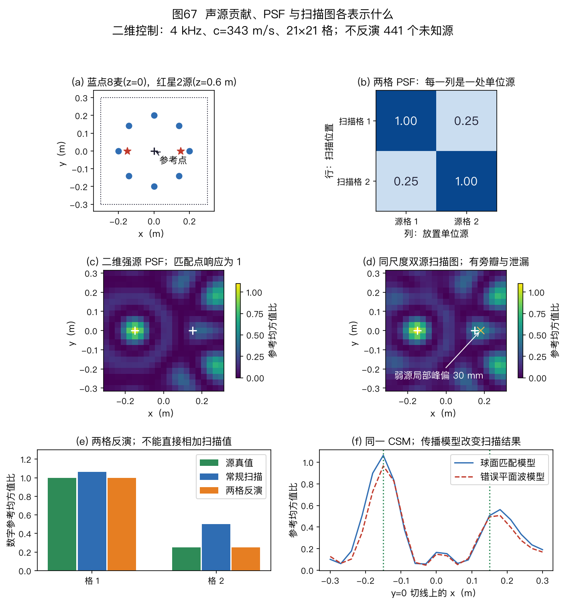
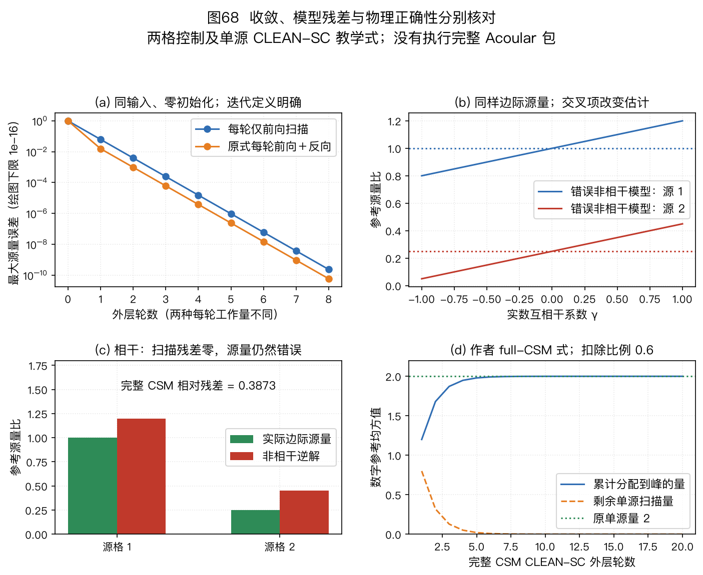
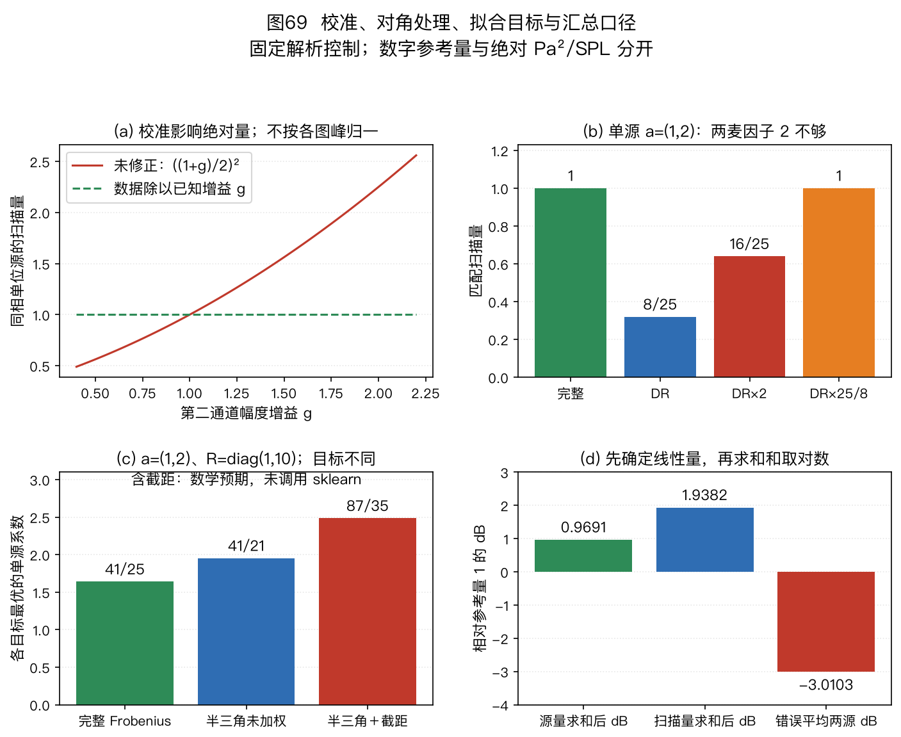

> 本篇是扩展专题Ⅰ。文件、公式和练习使用稳定身份 14；第 1～11 章的学习主线与附录 A/B 的既有标识保留。本篇接在选型指南之后，数学预备内容可随时回查附录。
>
> 🏠 首页导读：[00_overview.md](00_overview.md) ｜ 上一篇：[11_selection-guide.md](11_selection-guide.md) ｜ 下一篇：[12_appendix-symbols-math.md](12_appendix-symbols-math.md)

---

## 扩展专题Ⅰ：声学成像与噪声源诊断

### 14.1 从“声音在哪里”到“哪个区域贡献了多少声音”

#### 一张噪声地图回答什么

运行中的设备可能同时产生轴承声、风扇声和壳体振动声。只看一支麦克风的频谱，能知道某个频带的声压较大，却难以判断它来自设备的哪一处。麦克风阵列提供多路同步观测；不同位置的源到各麦的距离不同，因此各通道之间保留了幅度和相位差。

声学成像在一组候选位置上计算与观测相符的源贡献，把结果画成空间图。这里的“图”表示给定频点或频带的源量分布。它可以用来选择降噪部位，比较改动前后某一区域的贡献，或检查弱源是否被强源的旁瓣遮住。

一个高亮点需要结合传播模型解释：它可能是实际源，也可能是反射像、离网格源的分配结果、错误深度的投影，或通道失配造成的假峰。图片清晰度不能单独证明源强和源位正确。

#### 与定位、增强和语义成像的区别

第 4 章的到达方向估计（Direction of Arrival，DOA）主要输出方向或位置；第 5 章的波束形成可以输出供重建的复数谱，最终得到增强波形。本篇用相似的空间权重计算二阶统计量，并进一步估计源强。一个算法可能同时提供几个输出，但这些输出需要分别定义和验证。

| 任务 | 主要输出 | 验证时需要什么 |
|---|---|---|
| DOA / 声源定位 | 方向或位置 | 几何真值与定位误差 |
| 波束增强 | 波形或复数谱 | 参考目标、失真与噪声口径 |
| 本篇的噪声源成像 | 空间源量与区域量 | 传播、单位、统计模型与积分区域 |
| 语义声学成像 | 类别、事件及其空间区域 | 类别标签、区域标注与任务评分协议 |

本篇的输入不会自动包含“风扇”“轴承”等类别。把源图叠到照片上，只提供几何关联；识别部件和判断故障原因还需要运行状态、频谱、结构知识或额外的分类模型。

#### 方法名称与学习顺序

| 缩写 | 英文全称 | 本篇中的作用 |
|---|---|---|
| CSM | Cross-Spectral Matrix | 同一频点的通道功率与互谱矩阵 |
| PSF | Point Spread Function | 一个单位候选源在全部扫描点留下的响应 |
| DAMAS | Deconvolution Approach for the Mapping of Acoustic Sources | 用 PSF 方程和非负截断迭代估计源分布 |
| CLEAN-SC | CLEAN based on spatial Source Coherence | 逐次扣除与当前峰相干的统计成分 |
| CMF | Covariance Matrix Fitting | 直接拟合观测 CSM 的源统计模型 |
| NNLS | Non-Negative Least Squares | 在非负约束下最小化指定的平方残差 |

学习顺序是：建立传播向量，形成 CSM，计算扫描二次型，理解 PSF，再学习反演和成分剥离。DAMAS、CLEAN-SC、CMF各改变其中不同的一步，不能只按“图更尖”排列优劣。

#### 先修内容与本篇的量

相位和多通道模型可回查[第 2 章](02_basics-signal-model.md#sec-2-3)，几何和校准可回查[第 3 章](03_array-geometry.md)，权重与共轭内积可回查[第 5 章](05_beamforming.md#sec-5-1)。复数、协方差和最小二乘预备知识见[附录 A](12_appendix-symbols-math.md#sec-12-3)。

沿用全书的箭头向量、粗体矩阵和共轭转置 $H$。$M$ 是麦数，$J$ 是候选网格点数，$L$ 是快拍数；$n$ 是采样索引，$k$ 是频点索引，$\ell$ 是帧或快拍索引。波数用 $\kappa=2\pi f/c$（rad/m），不与频点 $k$ 混用。

传播矩阵记作 $\mathbf A\in\mathbb C^{M\times J}$，PSF 矩阵记作 $\mathbf P\in\mathbb R^{J\times J}$，CSM 主线记作 $\mathbf R\in\mathbb C^{M\times M}$。第 9 章的 $\mathbf P$ 表示状态误差协方差，与本篇的 PSF 矩阵不同。

### 14.2 先给每个候选源一个传播模型

#### 同一频点的多源观测

固定频点 $f_k$，把第 $\ell$ 个快拍的通道复数系数排成 $\vec x_\ell\in\mathbb C^{M\times1}$。第 $j$ 个候选源的系数是标量 $s_{j,\ell}$，传播向量是 $\vec a_j\in\mathbb C^{M\times1}$：

$$\begin{aligned}
\vec x_\ell&=\sum_{j=1}^{J}\vec a_j s_{j,\ell}+\vec n_\ell,\\
&=\mathbf A\vec s_\ell+\vec n_\ell,\\
\mathbf A&=[\vec a_1,\ldots,\vec a_J].
\end{aligned}\tag{14-1}$$

$\vec s_\ell$ 是 $J\times1$ 源系数向量，$\vec n_\ell$ 是 $M\times1$ 加性噪声向量。一个空网格点允许源系数为零。用网格表示实际源，是对空间位置的离散化；实际源不一定恰好落在网格上。

本篇每次省略频点参数时，传播向量、权重、CSM和源量始终对应同一个频点。多个频点各自求解后怎样合成频带结果，见 §14.10。

#### 距离衰减与相位的正负

在静止、无流动、自由场单极子近似下，令麦坐标为 $\vec r_m$，源网格坐标为 $\vec p_j$，参考位置为 $\vec r_0$。距离是 $r_{mj}=\|\vec p_j-\vec r_m\|$、$r_{0j}=\|\vec p_j-\vec r_0\|$，均以 m 计。用局部记号 $\Delta r_{mj}$表示麦克风相对于参考位置的路程差，单位也是 m。相对于参考位置的传播向量为：

$$\begin{gathered}
\Delta r_{mj}=r_{mj}-r_{0j},\\
a_{mj}(f)=\frac{r_{0j}}{r_{mj}}\exp[-\mathrm j\kappa\Delta r_{mj}],\\
\kappa=\frac{2\pi f}{c}.
\end{gathered}\tag{14-2}$$

幅度项说明更远的麦收到的声压较小；相位项说明路程更长意味着到达更晚。式(14-2)要求距离非零，并忽略遮挡、反射、声源指向性和流场折射。采用这个模型的源量 $s_j$，是该源在参考位置贡献的声压系数。[Sarradj 2012，§2、式(1)～(4)](https://doi.org/10.1155/2012/292695 "citation")

本书前向傅里叶核为 $e^{-\mathrm j2\pi ft}$，因此正时延乘 $e^{-\mathrm j2\pi f\tau}$。第 5 章的正角远场模型出现正相位，是因为靠近声源一侧的阵元相对于参考麦具有负时延；两种写法一致。

本篇双麦锚点例取第二源在麦 2 相对于麦 1 **晚到**，相位为 $e^{-\mathrm j2\pi/3}$。若把所有相关向量都取共轭，PSF和扫描功率可以不变，但 CSM非对角虚部会反号。公式、音频延迟与复数矩阵应保持同一约定。

#### 参考位置规定了源量的尺度

参考位置可以不是一支实际麦。阵列中心参考便于比较设备源区，但每个源与中心的距离可能不同。无量纲传播向量已吸收距离比，源系数保留该参考位置的声压单位。

改变参考位置会同时改变 $\vec a_j$ 和 $s_j$，使乘积 $\vec a_js_j$保持不变。传播向量变大时，相应的源系数必须变小，不能只改变字典而保持同一个数值真值。E14-14逐步复算这一变换。

源强的定义还有其他选择，例如源端的体积速度、单位范数传播列下的系数或指定距离处的声压。不同定义都可建立模型，但其单位与归一化应显式转换，不能把不同论文中的同名“power”直接并列。

### 14.3 从同步录音形成互谱矩阵

#### 一次外积包含什么

先取已经固定尺度的复数系数。总体二阶矩与有限快拍估计为：

$$\begin{aligned}
\mathbf R&=\mathbb E[\vec x\vec x^H],\\
\hat{\mathbf R}&=\frac1L\sum_{\ell=1}^{L}\vec x_\ell\vec x_\ell^H.
\end{aligned}\tag{14-3}$$

两个通道时，一次外积是

$$\vec x_\ell\vec x_\ell^H=
\begin{pmatrix}
|x_{1,\ell}|^2&x_{1,\ell}x_{2,\ell}^*\\
x_{2,\ell}x_{1,\ell}^*&|x_{2,\ell}|^2
\end{pmatrix}.$$

对角元保存各通道的平方量。非对角元同时保存幅度关系和相位关系，两个非对角元互为共轭。把共轭转置误写成普通转置，会破坏这些性质。

完整估计对任意向量 $\vec v$ 有

$$\begin{aligned}
\vec v^H\hat{\mathbf R}\vec v
&=\frac1L\sum_\ell|\vec v^H\vec x_\ell|^2\\
&\ge0.
\end{aligned}$$

因此完整估计半正定。这并不要求样本均值恰为零。本式没有减样本均值，严格说是未中心化二阶矩；中心化协方差还要减去 $\bar{\vec x}\bar{\vec x}^H$，见 E12-02。

#### 峰值复幅度与均方复系数

用实信号 $x[n]=\operatorname{Re}\{z e^{\mathrm j\omega n}\}$表示一个非端点正弦，$z$是峰值复幅度。在整数周期稳定窗内，平均平方值是 $|z|^2/2$。因此可定义均方复系数 $s=z/\sqrt2$，再用式(14-3)直接形成与时域均方量相符的 CSM：

$$\begin{aligned}
\mathbf R_{\rm tone}&=\frac1{2L}\sum_{\ell=1}^{L}\vec z_\ell\vec z_\ell^H\\
&=\frac1L\sum_{\ell=1}^{L}\vec s_\ell\vec s_\ell^H.
\end{aligned}\tag{14-4}$$

这个因子只针对所述实正弦及稳态口径。DC常量和Nyquist交替序列的平均平方分别为幅度平方，不能再除以2。本篇音频的 $0.2$、$0.1$ 是峰值幅度，对应单源均方量 $0.02$、$0.005$。

#### FFT窗、频率间隔和单边谱

若直接使用未归一化 $N$ 点FFT，先固定窗 $v[n]$、窗平方和 $U=\sum_{n=0}^{N-1}v[n]^2$，并令 $\vec X_\ell[k]$ 为窗后各通道FFT向量。对实信号单边谱，$0\le k\le\lfloor N/2\rfloor$：

$$\begin{aligned}
\mathbf S[k]&=\frac{\epsilon_k}{L f_s U}\\
&\quad\times\sum_{\ell=1}^{L}\vec X_\ell[k]\vec X_\ell[k]^H,\\
\mathbf R_{\rm bin}[k]&=\mathbf S[k]\Delta f,\\
\Delta f&=\frac{f_s}{N}.
\end{aligned}\tag{14-5}$$

内部正频点 $\epsilon_k=2$；DC点与偶数 $N$ 的Nyquist点 $\epsilon_k=1$。$\mathbf S$的单位为Pa²/Hz，$\mathbf R_{\rm bin}$的单位为Pa²，前提是输入声压已经校准到Pa。数字音频则使用相应的数字幅度平方单位。

不能用 $\sum v[n]$代替 $U$做同一种统计归一化。前者与正弦幅度校正有关，后者用于上述谱平方量。窗会把一条谱线分配到相邻频格，所以某一格的值变化不等于总平方量变化。E14-13用24点矩形窗和周期Hann窗完整复算。

#### 非相干源假设发生在哪一步

把式(14-1)代入总体二阶矩。若源与噪声满足 $\mathbb E[\vec s\vec n^H]=\mathbf0$，交叉项消失，先得到 $\mathbf R=\mathbf A\mathbf R_s\mathbf A^H+\mathbf R_n$。零均值时，源与噪声不相关可以保证这一条件；非零均值时，仅中心化后不相关还不够。其中 $\mathbf R_s=\mathbb E[\vec s\vec s^H]$是源二阶矩，零均值时也是源协方差。只有当不同源的互谱为零，它才是对角阵：

$$\begin{aligned}
\mathbf R&=\sum_{j=1}^{J}q_j\vec a_j\vec a_j^H\\
&\quad+\mathbf R_n,\\
q_j&=\mathbb E|s_j|^2\ge0.
\end{aligned}\tag{14-6}$$

若源之间相关，矩阵中还含有 $R_{s,jh}\vec a_j\vec a_h^H$（$j\ne h$）的交叉项。它们可以增强或削弱扫描响应，不能等效为若干非负独立源的功率再相加。

总体互谱为零不保证一次有限观测互谱恰为零。长时间平均可能降低统计波动，但重叠窗不是独立快拍；周期编码恰好正交的教学例也不是随机独立性实验。E14-04明确区分单帧相干、跨帧抵消和时间窗条件。

### 14.4 扫描图为什么出现主瓣和旁瓣

#### 从复数输出到扫描二次型

在第 $i$ 个扫描点，用权重 $\vec w_i$形成 $y_i=\vec w_i^H\vec x$。输出的平方量为

$$\begin{aligned}
b_i&=\mathbb E|y_i|^2\\
&=\mathbb E[(\vec w_i^H\vec x)(\vec x^H\vec w_i)]\\
&=\vec w_i^H\mathbf R\vec w_i.
\end{aligned}\tag{14-7}$$

维度依次是 $(1\times M)(M\times M)(M\times1)$，结果为实标量。完整半正定CSM下，理论上 $b_i\ge0$；浮点结果可有舍入级虚部，显著虚部或负值应检查输入与处理方式。

本篇教学扫描取单位匹配响应权重：

$$\begin{aligned}
\vec w_i&=\frac{\vec a_i}{\vec a_i^H\vec a_i},\\
\vec w_i^H\vec a_i&=1.
\end{aligned}\tag{14-8}$$

匹配单源的扫描值是其 $q_i$。在等幅远场模型下 $\vec a_i^H\vec a_i=M$，本式退化为第5章的 $\vec a_i/M$。等功率空间白噪声 $\mathbf R_n=\sigma^2\mathbf I$贡献 $\sigma^2\|\vec w_i\|^2$；两麦等权时为 $\sigma^2/2$。

#### 匹配点单位响应不保证三维峰位

近场中，改变扫描深度会同时改变传播相位和幅度。式(14-8)的分母也随候选位置变化；它保证真实位置处的响应尺度，却不保证所有其他位置响应都较小。

Sarradj比较的四种权重分别补偿相位、补偿幅度、最小白噪声单位响应，以及固定权重范数。其单源分析区分了“真实位置为峰”和“真实位置源强尺度准确”两个要求。这些权重不能无条件同时满足两者。[Sarradj 2012，§2.1～2.5、式(7)～(13)](https://doi.org/10.1155/2012/292695 "citation")

本篇二维控制把深度固定在已知平面，便于检查PSF。对未知深度设备直接照搬该控制，必须额外检查深度偏差、权重归一化和定位误差。

#### 一个单位源的整张图是PSF

将式(14-6)代入式(14-7)，逐项展开：

$$\begin{aligned}
b_i&=\sum_jq_j\vec w_i^H\vec a_j\vec a_j^H\vec w_i\\
&\quad+b_{n,i},\\
&=\sum_jq_j|\vec w_i^H\vec a_j|^2+b_{n,i},\\
P_{ij}&=|\vec w_i^H\vec a_j|^2,\\
\vec b&=\mathbf P\vec q+\vec b_n.
\end{aligned}\tag{14-9}$$

$P_{ij}$ 是位于第 $j$ 格、源量为1的源，对第 $i$ 个扫描点的贡献。固定列 $j$，遍历所有行 $i$，就得到该源的整张PSF。固定行 $i$，则能看到其他候选源怎样污染这一扫描点。

式(14-8)下 $P_{ii}=1$；完整CSM的PSF元素非负。一个源的响应可以在许多格上非零，形成主瓣和旁瓣，因此扫描值不直接等于逐格真实源量。近场或大源区的PSF还随源位置变化，不能自动简化为一个平移不变卷积核。

#### 两个格点的完整手算

本书手算取无量纲传播向量与均方复系数：

$$\begin{aligned}
\vec a_1&=\begin{pmatrix}1\\1\end{pmatrix},\\
\vec a_2&=\begin{pmatrix}1\\e^{-\mathrm j2\pi/3}\end{pmatrix},\\
\vec w_i&=\vec a_i/2,\\
\vec q&=\begin{pmatrix}1\\1/4\end{pmatrix}.
\end{aligned}\tag{14-10}$$

交叉内积是 $\vec w_1^H\vec a_2=(1+e^{-\mathrm j2\pi/3})/2$，其模平方为 $1/4$。于是

$$\begin{aligned}
\mathbf P&=\begin{pmatrix}1&1/4\\1/4&1\end{pmatrix},\\
\vec b&=\mathbf P\vec q\\
&=\begin{pmatrix}1+1/16\\1/4+1/4\end{pmatrix}\\
&=\begin{pmatrix}17/16\\1/2\end{pmatrix}.
\end{aligned}\tag{14-11}$$

第一格的扫描值含第二源的 $1/16$贡献；第二格含第一源的 $1/4$贡献。直接相加扫描值得到 $25/16$，真实逐源量相加则为 $5/4$。两者差别来自空间响应重叠，不是声能从设备中凭空增加。



图67用本书已知传播模型展示PSF与扫描图。两格例的列响应按式(14-11)复算；二维控制使用8麦、4 kHz、固定深度和441个网格点。图中的量按共同参考归一化，源为非相干单极子模型；不代表真实设备测量或不同算法的工业排名。E14-06分别检查峰位和格点总和，避免把颜色更集中的结果当作全部量都正确。

### 14.5 从PSF方程学习DAMAS与NNLS

#### 为什么需要非负反演

已知 $\mathbf P$和扫描图 $\vec b$后，想估计 $\vec q\ge0$。非负的原因来自式(14-6)中的均方量定义；相干交叉项不属于这些独立源均方量。

如果 $\mathbf P$可逆且数据恰好匹配，线性解可以恢复本例的 $[1,1/4]^\top$。一般网格中，相邻PSF可能几乎相同，或有完全相同的列；噪声、有限统计和传播误差也会使方程不能精确成立。更多格点增加未知数，不会自动增加观测信息。

DAMAS的原始依据是Brooks、Humphreys的PSF方程与带非负截断的迭代。下面沿用本篇符号，对应其AIAA2004论文式(18)、(23)、(24)。[NASA原论文](https://ntrs.nasa.gov/api/citations/20080015889/downloads/20080015889.pdf "citation")

#### 原DAMAS一轮包含两个更新方向

先从 $\vec q^{(0)}=\vec0$出发，前向遍历 $i=1,\ldots,J$。计算第 $i$ 个分量时，用 $\tilde q_j$表示第 $j$ 个分量当前最新可用的值：

$$\tilde q_j=
\begin{cases}
q_j^{\rm new},&j<i,\\
q_j^{\rm old},&j>i.
\end{cases}$$

先扣除其他格的贡献，得到临时余量 $t_i$，再更新当前分量：

$$\begin{aligned}
t_i&=b_i-\sum_{j\ne i}P_{ij}\tilde q_j,\\
q_i&\leftarrow\max\left\{0,\frac{t_i}{P_{ii}}\right\}.
\end{aligned}\tag{14-12}$$

“new”表示本次遍历已经更新的值，“old”表示尚未更新的值。每算出一个分量就立即供后面的分量使用；计算值小于零时截成零。这是带非负截断的Gauss–Seidel型更新。

原论文规定每轮还要从 $J$到1反向遍历，用相同的即时更新规则；此时 $j>i$的分量已经更新，$j<i$的分量尚未更新，$\tilde q_j$按这一反向顺序取最新值。只完成前向遍历的教学结果应称“一次前向sweep”；它与原论文一次双向迭代的中间状态不同。本书代码分别报告这两种更新。

#### 三次前向sweep的中间数

将式(14-11)代入。第1次：$q_1=17/16$，再用它算 $q_2=1/2-(1/4)(17/16)=15/64$。第2次：$q_1=17/16-(1/4)(15/64)=257/256$，$q_2=1/2-(1/4)(257/256)=255/1024$。

| 前向sweep数 | $q_1$ | $q_2$ |
|---|---:|---:|
| 1 | $17/16=1.0625$ | $15/64=0.234375$ |
| 2 | $257/256=1.00390625$ | $255/1024=0.2490234375$ |
| 3 | $4097/4096\approx1.00024414$ | $4095/16384\approx0.24993896$ |

本例的误差逐次缩小，因为两个列的重叠没有造成严重病态。将非对角值改为接近1时，两个源更难分开，更新会慢得多。迭代次数、源量变化和扫描残差应分别保存；达到次数上限不能标作已收敛，变化小也不能证明源强正确。

#### 扫描域NNLS改变了目标

非负最小二乘明确最小化整个扫描残差：

$$\min_{\vec q\ge0}\frac12
\|\mathbf P\vec q-\vec b\|_2^2.
\tag{14-13}$$

其梯度为 $\vec g=\mathbf P^\top(\mathbf P\vec q-\vec b)$。非负约束下，一个最优解须满足：

$$\begin{gathered}
\vec q\ge0,\qquad \vec g\ge0,\\
q_i g_i=0\quad\text{对每个 }i.
\end{gathered}\tag{14-14}$$

正的分量处梯度必须为零；零分量处若梯度为正，沿允许的正方向增大它只会增加目标。因此在边界上允许正梯度。E14-08从这个条件检查答案。

取同一 $\mathbf P$、$\vec b=[1,0]^\top$。截断GS固定点是 $[1,0]^\top$，平方残差为 $1/16$；NNLS为 $[16/17,0]^\top$，平方残差为 $1/17$。原DAMAS不能一概称为式(14-13)的优化器。这也说明算法名之外还要检查实际更新和目标。

### 14.6 CLEAN-SC如何逐次扣除相干成分

#### 峰值与其相干通道结构

CLEAN-SC从当前残差CSM $\mathbf D$计算扫描图，再选一个峰。它用观测中的相干结构构造待扣除成分，减少对理论PSF形状的依赖。它仍然需要传播权重来选择峰；几何失配与峰位偏差不会因此自动消失。[Sijtsma，NLR-TP-2007-345，§2.4、§4.6](https://reports.nlr.nl/server/api/core/bitstreams/813b0521-b37c-4aff-be61-7a8bceaa06d4/content "citation")

本节先讲**完整CSM**版本。设峰下标为 $p$，峰值为 $B>0$，loop gain为无量纲的 $0<\phi\le1$：

$$\begin{aligned}
B&=\vec w_p^H\mathbf D\vec w_p,\\
\vec h&=\frac{\mathbf D\vec w_p}{B},\\
\mathbf G&=B\vec h\vec h^H,\\
\mathbf D_{\rm next}&=\mathbf D-\phi\mathbf G.
\end{aligned}\tag{14-15}$$

$\vec h$描述与峰值输出相干的通道结构，$\mathbf G$是其秩一CSM。扣除比例 $\phi$较小时，同一成分可能在后续轮中再次被扣除；相应标在干净图上的量也应累计 $\phi B$，不能每次扣除一半却记满额。

若剩余扫描值全为零，就不能再除以峰值。零输入、相对停止阈值和最大迭代数需要分别处理。舍入容差用于识别数值误差，不能把显著不定的输入矩阵伪装成有效CSM。

#### 为什么完整CSM扣除后仍可半正定

由式(14-15)，$\vec w_p^H\vec h=B/B=1$。当 $\mathbf D\succeq0$时，设 $\vec u=\mathbf D^{1/2}\vec w_p/\sqrt B$，则 $\vec u^H\vec u=1$。本书代数推导得到：

$$\begin{aligned}
\mathbf G&=\frac{\mathbf D\vec w_p\vec w_p^H\mathbf D}{B},\\
\mathbf D-\mathbf G&=\mathbf D^{1/2}\\
&\quad\times(\mathbf I-\vec u\vec u^H)\mathbf D^{1/2},\\
\mathbf D-\mathbf G&\succeq0.
\end{aligned}\tag{14-16}$$

$\mathbf I-\vec u\vec u^H$在 $\vec u$方向为零，在正交方向为1。取 $0<\phi<1$时还保留部分该方向量，所以同样半正定。这个证明只说明统计矩阵扣除的性质，没有证明每次扣除的成分就是一处真实独立源。

#### 双源首轮完整计算与干净图

对式(14-10)的非相干双源，CSM是

$$\mathbf R=
\begin{pmatrix}
5/4&7/8+\mathrm j\sqrt3/8\\
7/8-\mathrm j\sqrt3/8&5/4
\end{pmatrix}.$$

第一格峰值 $B=17/16$，矩阵乘权重得到

$$\mathbf R\vec w_1=\frac1{16}
\begin{pmatrix}
17+\mathrm j\sqrt3\\
17-\mathrm j\sqrt3
\end{pmatrix}.$$

逐元素除以 $B$，得到

$$\vec h=\begin{pmatrix}
1+\mathrm j\sqrt3/17\\
1-\mathrm j\sqrt3/17
\end{pmatrix}.$$

计算 $\mathbf G=B\vec h\vec h^H$并取 $\phi=1$后，残差为 $\mathbf D_{\rm next}=(3/17)\begin{pmatrix}1&-1\\-1&1\end{pmatrix}$，特征值为0与 $6/17$。残差满足半正定，但 $\vec h$并不等于真实第一源的 $[1,1]^\top$，因为峰也受第二源影响。

干净图可把累计量放在峰位置，或按指定窄显示核展开。核宽是显示选择；改变核宽不会增加阵列观测的信息。若用峰图解释源量，还应保留残差CSM，说明是否将剩余部分纳入区域分析。

#### 完整CSM与删对角版本不能换用公式

原论文的删对角版本使用被删元素的补偿。令 $\mathbf H(\vec h)$只保存 $\vec h\vec h^H$中被排除的元素；删对角时它为相应对角阵。原式(26)写成本篇符号是：

$$\vec h=
\frac{\mathbf D_{\rm trim}\vec w_p/B+\mathbf H(\vec h)\vec w_p}
{\sqrt{1+\vec w_p^H\mathbf H(\vec h)\vec w_p}}.
\tag{14-17}$$

右侧仍含 $\vec h$，需要内部迭代，并配套使用原文的扫描归一化；直接把 $\mathbf D_{\rm trim}$代入式(14-15)，不会自动得到原删对角算法。[Sijtsma，式(24)～(27)、§4.6](https://reports.nlr.nl/server/api/core/bitstreams/813b0521-b37c-4aff-be61-7a8bceaa06d4/content "citation")

本书 E14-11实现的是作者完整CSM公式的教学链。它与外部实现某个名为CLEAN-SC的分支应分别验证，不用接口名代替公式核对。

### 14.7 保留互谱矩阵：直接拟合源统计模型

#### 从矩阵元素构造字典

扫描图是CSM经一组权重得到的投影。也可以直接拟合式(14-6)。将矩阵按同一种次序展开为列向量，记 $\operatorname{vec}$为这一操作：

$$\begin{aligned}
\vec c&=\operatorname{vec}(\hat{\mathbf R}),\\
\vec h_j&=\operatorname{vec}(\vec a_j\vec a_j^H),\\
\mathbf H&=[\vec h_1,\ldots,\vec h_J],\\
\min_{\vec q\ge0}\;&\|\mathbf H\vec q-\vec c\|_2^2.
\end{aligned}\tag{14-18}$$

$\mathbf H$为 $M^2\times J$复数矩阵。这里的 $\vec h_j$是向量化的字典列，和 §14.6 的 $M$维CLEAN-SC成分 $\vec h$不同，维度可帮助区分。式(14-18)是本书简化的非负CSM拟合，不含自动噪声估计、稀疏预算或源相关建模。

相同的最小化也可写成矩阵Frobenius范数平方。该范数逐项加总全部元素的模平方，不只看几个扫描点。

#### 实向量化为什么有平方根2

Hermitian残差 $\mathbf E$的对角元为实数，两个对称非对角元模长相等，所以

$$\begin{aligned}
\|\mathbf E\|_F^2&=\sum_m E_{mm}^2\\
&\quad+2\sum_{m<n}(\operatorname{Re}E_{mn})^2\\
&\quad+2\sum_{m<n}(\operatorname{Im}E_{mn})^2.
\end{aligned}\tag{14-19}$$

因此实字典可以只保存对角实部，以及上三角非对角实部和虚部；后两者都乘 $\sqrt2$。若只是删除下三角而不加权，非对角残差会少计一半，目标改变了。它仍可以是一个明确指定的加权拟合，但不能称与完整Frobenius目标严格相同。

若求解器只接受实数，目标 $\vec q$仍然是实数非负源量；不能通过丢弃字典虚部来让输入变实。虚部保存了传播相位的重要信息。

#### 原CMF还有噪声与稀疏约束

Yardibi等的原CMF联合拟合白噪声，并限制非负源系数总量。其单位范数传播列记作 $\tilde{\mathbf A}$，源系数记作 $\vec d$，以区别本篇参考位置的 $\vec q$：

$$\begin{aligned}
\mathbf R_{\rm model}&=\tilde{\mathbf A}\operatorname{diag}(\vec d)\\
&\quad\times\tilde{\mathbf A}^H+\sigma^2\mathbf I,\\
\min_{\vec d,\sigma^2}\;&\|\hat{\mathbf R}-\mathbf R_{\rm model}\|_F^2,\\
\text{s.t.}\;&d_j\ge0,\quad\sigma^2\ge0,\\
&\sum_jd_j\le\Lambda.
\end{aligned}\tag{14-20}$$

式(14-20)中的 $\mathbf R_{\rm model}$包括源与空间白噪声的模型CSM。原文还给出 $\Lambda$的谱估计选择，定义依赖其列归一化和源量尺度。[Yardibi等2008，§V、式(20)、(22)](https://doi.org/10.1121/1.2896754 "citation") 不能把式(14-18)与该完整目标混同，也不能用原文的量直接约束未经尺度转换的参考声压量。

E14-16只在已知空间白噪声模型下，教学性联合估计 $q$、$\sigma^2$，不加入原论文的稀疏预算。代码先解无约束最小二乘并报告结果是否非负；本题答案恰好非负，不代表接口自动求解了非负约束问题。该例能说明噪声模型改变字典，也能展示一麦下两种贡献不可辨识。

#### 两种残差需要分别解释

扫描残差是 $\mathbf P\vec q-\vec b$，CSM残差是 $\sum_jq_j\vec a_j\vec a_j^H-\hat{\mathbf R}$。它们有不同维度、权重和被保留的信息；数值不能直接比较大小。

用正确尺度的CSM拟合，有机会揭示某些扫描投影未显示的失配。但较小CSM残差也不自动证明唯一源位、独立源条件或正确物理单位。冗余列、错误传播模型和有限统计仍需要另外检查。

### 14.8 对角删除：少一种污染，也少一部分目标

#### 对角项包含目标与通道噪声

对角删除（Diagonal Removal，DR）把CSM自谱置零。先将CSM的对角矩阵记为 $\mathbf D_R$：

$$\begin{gathered}
\mathbf D_R=\operatorname{diag}(R_{11},\ldots,R_{MM}),\\
\mathbf R_{\rm trim}=\mathbf R-\mathbf D_R.
\end{gathered}\tag{14-21}$$

理想互不相关的通道噪声只出现在总体CSM对角上，DR可去掉这部分。但目标源的 $q_j|a_{mj}|^2$也位于对角上，一起被删除。有限观测的噪声互谱可能不为零；风噪也可能跨通道相关，不能由DR保证清除。

不含对角的权重扫描和PSF应同步建立，不能用删对角扫描图配完整CSM的PSF。原DAMAS论文分别给出标准与DR的PSF式(17)、(20)、(21)。其DR非对角PSF可为负。[Brooks、Humphreys，原论文第6页](https://ntrs.nasa.gov/api/citations/20080015889/downloads/20080015889.pdf "citation")

#### 为什么会出现负扫描值

取 $\mathbf R_{\rm trim}=\begin{pmatrix}0&1/2\\1/2&0\end{pmatrix}$和 $\vec w=[1/2,-1/2]^\top$。矩阵乘权重得到 $[-1/4,1/4]^\top$，再左乘 $\vec w^H$得到 $-1/4$。

该矩阵特征值为 $1/2$和 $-1/2$，已经不是半正定CSM。负二次型说明DR修改了统计量，不能解释为物理声能小于零。将显示值截成零只是显示或额外处理步骤，应保留截断前值以检查残差。

#### 麦数补偿因子有适用条件

对单个候选源、式(14-8)的权重，DR后的匹配响应为 $1-\sum_m|a_{mi}|^4/(\vec a_i^H\vec a_i)^2$。若要在这一候选点恢复单位响应，补偿因子为

$$\gamma_i=
\frac{(\vec a_i^H\vec a_i)^2}
{(\vec a_i^H\vec a_i)^2-\sum_m|a_{mi}|^4}.
\tag{14-22}$$

分母为零时无法这样补偿；例如只有一个非零通道时，DR把该源全部信息删掉了。等幅 $|a_{mi}|=1$时，本式为 $M/(M-1)$，要求 $M>1$。

取 $\vec a=[1,2]^\top$、$\vec w=\vec a/5$，原匹配响应为1，DR后为 $8/25=0.32$。乘两麦因子2仍为0.64；该例的正确匹配恢复因子是 $25/8$。近场幅度不等时，统一麦数因子不必准确，E14-07复算这一点。

### 14.9 哪些条件改变后，漂亮的图会误导

#### 相干双源：零扫描残差仍可错解

仍用式(14-10)的传播向量，令源复系数始终为 $[1,1/2]^\top$的共同倍数，且共同系数均方为1。两个源完全相干，边际功率为1和 $1/4$，但不能用式(14-6)省略互谱。

单次公共系数取1时，通道向量为 $[3/2,\;3/4-\mathrm j\sqrt3/4]^\top$。用局部复数记号 $\zeta$简写CSM非对角元素的分子，CSM与扫描是

$$\begin{gathered}
\zeta=9+\mathrm j3\sqrt3,\\
\mathbf R_{\rm coh}=\frac18
\begin{pmatrix}
18&\zeta\\
\zeta^*&6
\end{pmatrix},\\
\vec b=\begin{pmatrix}21/16\\3/4\end{pmatrix}.
\end{gathered}\tag{14-23}$$

这里 $R_{12}=\zeta/8$，$R_{21}=\zeta^*/8$，两个非对角元素仍互为共轭。

误用非相干PSF方程，求得 $\vec q_{\rm wrong}=[6/5,9/20]^\top$。代入 $\mathbf P\vec q_{\rm wrong}$恰好等于扫描图，扫描残差为零；源量却不是边际功率。重构CSM的两个对角都为 $33/20$，与真实 $9/4$、$3/4$不同，完整CSM平方残差为 $27/20$。

这个反例说明“该扫描图能用非负源解释”不等于“解释就是实际独立源功率”。对于反射与直达声强相干的情形，CLEAN-SC也可能把它们归成一组相干成分；峰位置不应直接拆成多个物理源。

#### 重复字典列与有限孔径

若两个候选位置在所用频率和阵列上具有相同传播列，交换或重新分配二者的源量不改变CSM。非负约束不能区分它们；例如重复两列的总量1，可分成 $[1,0]$、$[1/2,1/2]$或 $[0,1]$。

相近而非完全相同的列会产生病态问题。图上更细的网格可以更精确地表示位置，却可能降低数值可辨识性和增加计算量。选网格时应同时检查孔径、频率、列相关、误差敏感性和区域总量，而不只检查像素尺寸。

#### 离网格、源区外与深度错误

实际源在两个格点之间时，反演可能把它分配给相邻几个点；候选源区没有覆盖实际源时，模型可能沿边界放置能解释泄漏的源量。原DAMAS论文第10～13页讨论了离网格及扫描边界控制，相关建议取决于其阵列和频率，不应当作全部工业场景的固定网格规范。[原论文](https://ntrs.nasa.gov/api/citations/20080015889/downloads/20080015889.pdf "citation")

二维网格把所有源放在同一个平面，适合已知源面控制。实际源不在此平面时，距离、幅度和相位都失配，地图可能偏移。改成三维网格增加了搜索范围，也增加了未知量；单侧平面阵的深度分辨能力仍可能很弱。

#### 有限快拍、坏道和过度解释

增加快拍数可以降低某些统计波动，但源的移动和运行状态变化会让长时间平均混合不同传播或功率状态。只固定一组CSM再改变软件中的“快拍数”参数，不是重新采集独立统计实验。

通道增益、相位和位置误差会改变模型PSF。若某路失效，应按实际参与通道重新建立字典、权重和统计矩阵；不能仅把失败数据置零却仍使用原阵列全部通道的归一化。



图68的四个面板依次比较前向与双向GS、改变源互相干系数、相干源的错误非相干逆解，以及作者完整CSM单源CLEAN-SC的累计扣除。双向每轮工作量较大，不能只按外层轮数评价速度；相干例可有零扫描残差而源量错误。不同面板不是同一性能指标，不按其纵轴数值给算法排名。E14-03、E14-05、E14-11提供对应计算。

### 14.10 地图求和、频带积分和物理单位

#### 点源量与面积密度

若 $q_j$已经表示第 $j$ 格分配的离散源量，区域 $\mathcal G$的总量为

$$Q_{\mathcal G}=\sum_{j\in\mathcal G}q_j.
\tag{14-24}$$

单位与 $q_j$相同，通常为参考声压Pa²或数字幅度²。不要额外乘格面积；否则同一个离散源会随网格尺寸变化而改变总量。

若另行定义连续源密度 $\rho_q(\vec p)$，单位为Pa²/m²，离散近似才是 $Q_{\mathcal G}\approx\sum_j\rho_{q,j}\Delta A_j$。密度与每格量之间的转换应在网格细化时同步进行，E14-15比较两个定义。

区域求和还依赖非相干源模型和共同参考尺度。相干源的边际功率相加不包含交叉项；以不同参考位置定义的量也不能未经转换直接相加。

#### 线性总量转成声压级

校准到Pa、且给定频带的均方量为 $Q>0$时，声压级（Sound Pressure Level，SPL）为

$$\begin{aligned}
L_p&=10\log_{10}\frac{Q}{p_{\rm ref}^2},\\
p_{\rm ref}&=20\,\mu\mathrm{Pa}.
\end{aligned}\tag{14-25}$$

一份 $1\ \mathrm{Pa}^2$对应约93.9794 dB SPL；再加 $0.25\ \mathrm{Pa}^2$后，总量1.25对应约94.9485 dB SPL。不能把93.9794与87.9588直接相加或平均来得到合成声压级。

数字合成音频的共同导出增益1不代表绝对声压校准。没有Pa转换时，应报告数字均方量，或以明确的共同数字参考量作相对dB。零量的对数为负无穷；画图用下限时需标出显示范围，不把下限当作已估计的源量。

#### 频带积分和频率权重

若逐格保存的是bin平方量，频带 $\mathcal B$内直接线性求和；若保存的是PSD，先乘对应频率宽度：

$$\begin{gathered}
Q_{\mathcal G,\mathcal B}
=\sum_{k\in\mathcal B}\sum_{j\in\mathcal G}q_j[k]\\
=\sum_{k\in\mathcal B}\sum_{j\in\mathcal G}S_{q,j}[k]\Delta f_k.
\end{gathered}\tag{14-26}$$

等号要求两种保存形式互相按频格宽度转换，不是同一个数组能不分单位地两用。改变FFT长度时，PSD与bin值变化方式不同，频带积分应保持与窗、采样和边界口径一致。

若使用幅度频率权重 $W(f)$，平方量乘 $|W(f)|^2$。A计权、线性频带或指定工程权重是不同结果；本篇例子不把未加权数字量称为A计权声级。

#### 从Pa²到W需要额外模型

声功率单位W，涉及穿过包围面的声强积分。只获得源图参考位置的Pa²，并没有测出该包围面的法向声强。

作为理想自由场各向同性辐射的辅助换算，若距离 $r$处的均方声压为 $q$，局部为向外行进波，介质密度 $\rho$和声速 $c$已知，则

$$W=4\pi r^2\frac{q}{\rho c}.
\tag{14-27}$$

$q/(\rho c)$单位W/m²，乘球面积才得到W。式(14-27)需要自由场、指向性和辐射几何条件；设备遮挡、近场反应性、反射和流动都会影响换算。各源到参考位置的距离不同时，各源的换算因子也不同。本篇地图默认保留参考声压量，不直接改名为W声功率图。

### 14.11 工业测量与先进方法的选择

#### 通道校准怎样进入CSM

令原数字通道为 $\vec d$，校准矩阵为 $\mathbf K(f)$。它可以含灵敏度转换与已知复数频响校正；按同一频点应用：

$$\begin{aligned}
\vec x&=\mathbf K\vec d,\\
\mathbf R_x&=\mathbf K\mathbf R_d\mathbf K^H.
\end{aligned}\tag{14-28}$$

若全部通道幅度多乘2，所有平方量多乘4，相对变化约6.0206dB；峰位置可能不变，但绝对量错误。若一条通道额外旋转180°，原本同相的双麦平均可能成为相消，不能通过共同声级校正修复。

增益相位、坐标、时钟与传感器健康是不同检查。第3章已经讲解校准与参考误差，本节只把它们接入成像统计链。校正后还应保留原观测、系数、单位和来源，以便区分传感器异常与软件处理。



图69的四个面板依次控制第二通道幅度增益、不等幅单源的DR补偿、不同CSM拟合目标，以及区域求和与dB。第一面板用已知逆增益恢复单位扫描响应；其余面板对应 E14-07、E14-12、E14-10。图中截距解是独立数学控制，没有运行原scikit-learn估计器。这些固定解析控制不是自动阵列标定、现场测量或某设备精度指标。

#### 现场校准与运行记录

NASA的现场部署研究区分部署前后台架基线和在场响应漂移监测。已知声源仍需考虑指向性、传播损失、天气以及扬声器自身变化；相对监测不自动给出全部通道的绝对幅相标定。[Humphreys等2017，§II～III](https://ntrs.nasa.gov/api/citations/20170006081/downloads/20170006081.pdf "citation")

成像记录至少保留实际通道顺序、麦坐标、坐标系与源面、采样率、窗和帧移、声速、频带、CSM单位、校准系数、DR与补偿策略、网格、停止条件、积分区域。照片叠图还需相机姿态和配准方式，否则设备部位标签与声学坐标可能不对应。

无流自由场模型用于风洞或旋转设备前，须检查传播条件。增加求解迭代只能更努力地拟合已有模型，不能补回遗漏的剪切层、运动或通道同步。

#### 高级成像方法改变哪一步

| 方法 | 改变的模型或计算 | 本篇采用范围 |
|---|---|---|
| DAMAS-C / CMF-C | 将独立源功率扩为包含源间互谱的源协方差 | 用相干反例解释收录理由；完整优化留作研究入口 |
| HR-CLEAN-SC | 将源成分提取位置与最终定位峰分开，选择受其他源污染较少的源标记位置 | 说明它针对成分混合与峰位；不把高分辨名称当作保证 |
| SODIX | 同时处理源位置与指向性，拟合更多与通道/方向有关的源参数 | 适合研究单极子假设失效；本篇数据不足以验证一般指向性反演 |
| 移动、旋转声源成像 | 传播时延与距离随发射/接收时刻改变，需轨迹或运动模型 | 链接第9章传播时刻概念；静止CSM教学结果不外推 |
| 流场成像 | 在传播向量中加入流动、折射或剪切层影响 | 作为模型选择边界；不以无流字典声称已修正风洞传播 |
| 近场声全息（NAH） | 从测量面重建近场声场、源面振动或声强，依赖其波传播逆问题 | 属相邻测量目标；不将PSF点源反演称为完整声全息 |

不同方法是否值得进一步使用，由已经出现的失效决定：相干交叉项需要源协方差模型，指向性失配需要更丰富传递模型，移动需要时变传播，声全息需要其对应测量面和逆传播条件。只增加一个方法名称，不会给本篇静止单极子例子增加这些条件。

DAMAS-C与CMF-C保留源协方差的非对角项，使模型能表示相干源。代价是从每格一个非负标量变成一个半正定源协方差矩阵；参数更多，辨识约束也改变。原CMF-C以完整源协方差拟合CSM，并约束其迹；不能把式(14-18)的非负标量拟合简单改名为CMF-C。[Yardibi等2008，§VI式(26)](https://doi.org/10.1121/1.2896754 "citation") 本篇先用 E14-05证明为什么需要这个扩展，完整求解不并入初学者的三种主线核。

HR-CLEAN-SC先获得候选源，再在对应主瓣中选择源标记位置：那里对目标源仍有响应，但来自其他候选源的PSF污染较少。用标记位置提取相干成分后，再扫描该成分来更新源位置。它仍需要可信的候选源和传播模型；若标记位置对目标源几乎失敏，提取也会不稳定。[Sijtsma、Snellen 2016，§2.5](https://www.bebec.eu/fileadmin/bebec/downloads/bebec-2016/papers/BeBeC-2016-S1.pdf "citation") 本篇保留其解决问题的过程，不把它的论文实验分辨率当作本书已验证结果。

SODIX直接拟合CSM，并为每个源到每支麦的方向引入非负幅度参数。一个源不再由一个统一的 $q_j$决定所有通道幅度；源位置数乘麦数的未知量可能超过CSM的独立信息，需要方向和空间平滑等约束。[Funke等2014，式(6)～(10)](https://elib.dlr.de/94587/1/BeBeC-2014-11_Funke_SODIX.pdf "citation") 本篇双麦两格数据并不能承担一般指向性反演，因此只提供原模型入口。

NAH的关键是测量面到重建面的逆传播。除行进波外，近场中还有随距离指数衰减的倏逝分量；逆传播会放大它们对应的测量噪声。测量距离、空间采样、有限孔径与正则化是其核心条件。[Maynard等1985，§III](https://doi.org/10.1121/1.392911 "citation") 它值得作为近场场量重建的相邻专题，但本篇点源功率字典与16题不构成该测量流程。

#### 开源实现要逐项核对接口

Acoular提供传播、频谱、PSF、DAMAS、CLEAN-SC和CMF等维护者实现。[官方仓库](https://github.com/acoular/acoular "citation") 本书固定源码身份、方法级执行范围与差异见[空间算法研究手册](../codes/chapters/ch00/research/01_spatial_and_tracking.md)。

对照时要核对：CSM使用 $xx^H$还是其转置、谱值是否已含单边因子与频格宽度、DR默认是否开启、PSF与扫描是否同样处理、GS遍历方向、CMF实向量权重、求解器截距、列归一化及原单位恢复。每项都会影响数值；方法类名相同不能省略这些检查。

原论文公式、本书教学核、固定上游原调用和隔离修正调用分别记录。源码取得不等于方法已运行，限定函数调用也不等于风洞完整整链运行。第三方数据、音频与代码的许可分别检查，复现命令只使用明确的本地来源。

本书[当前上游成像接口报告](../codes/chapters/ch14/reports/upstream_imaging_contracts.json)固定Acoular 26.08、提交 `13d3d7df74ac1a8135c7ec71da098cbbc03d8652`，记录原调用前后的源码身份与洁净状态。单源 $q=2$、循环增益0.6、20轮控制中，固定原实现的完整CSM支路返回约4.812502861；作者式(14-15)与本书独立核返回约1.999999978。这个差异只对应报告中的原支路和参数，不能把原输出写成作者公式的验证。

报告还区分不加权半三角与完整Frobenius目标，以及默认截距的独立代数控制。原scikit-learn估计器未运行，不能把 E14-12的截距算例称为其运行结果。完整稀疏选集仍记录 `source_selection_mismatch`；所用原文件已核身份不等于完整选集核对通过。

### 14.12 本书代码与音频怎样使用

#### 先运行不写文件的练习

本书核心实现位于[声学成像数值核](../codes/chapters/ch14/core/imaging.py)，16题的结果目录位于[练习入口](../codes/chapters/ch14/chapter14_exercises.py)。从仓库根目录运行：

```bash
.venv/bin/python -m codes.chapters.ch14.chapter14_exercises
```

`run_experiments()`返回可序列化结果字典，其中 `exercises`按稳定ID包含 E14-01～E14-16。纯数学控制、浮点音频和真实PCM读回结果分别命名；各题答案说明采用哪一种口径。

#### 已知延迟音频保留什么

本篇独立音频使用24 kHz采样、2 kHz正弦、两个通道和20个编码块。第一源两路同延迟；第二源麦2相对麦1多4点因果延迟，正频率相位为 $-2\pi(2000)(4/24000)=-2\pi/3$。峰值幅度分别为0.2、0.1，共同导出增益1。

两个源的跨块相位编码使选定快拍上的互谱抵消；另有固定相位相干控制。每块2400点，评分只取块内半开区间 $[252,2160)$，共20×1908=38160点，避开转换边缘。文件保存48004点，保留4点传播尾；完整文件时域平方量与上述稳定窗量不混算。

这些信号是数学合成正弦和已知延迟，不是自然语音、真实设备录音、盲估位置或正式听测。试听不能判断PSF逆问题是否正确，实际PCM必须按清单的尺度重新读回再形成统计量。

独立目录中的五个WAV与清单用途如下。它们不并入主109个合成样本，也不与真实录音混算。

| 文件 | 用途 |
|---|---|
| [第一源](../codes/chapters/ch14/imaging_audio/source_1.wav) | 峰值0.2的共同源参考 |
| [第二源：相位编码](../codes/chapters/ch14/imaging_audio/source_2_phase_code.wav) | 跨块相位变化，控制平均源互谱 |
| [第二源：相干控制](../codes/chapters/ch14/imaging_audio/source_2_coherent.wav) | 与第一源保持固定相位关系 |
| [双通道：相位编码](../codes/chapters/ch14/imaging_audio/array_phase_code.wav) | 已知4点差分延迟、跨块互谱抵消控制 |
| [双通道：相干控制](../codes/chapters/ch14/imaging_audio/array_coherent.wav) | 相同传播、相干源失效控制 |
| [独立清单](../codes/chapters/ch14/imaging_audio/MANIFEST.json) | 真实源摘要、PCM摘要、窗口与浮点/读回统计量 |

从仓库根目录重生或只读核对，分别运行：

```bash
.venv/bin/python -m codes.chapters.ch14.examples.generate_imaging_audio
.venv/bin/python -m codes.chapters.ch14.examples.generate_imaging_audio --check
```

`--check`按当前源在内存回放并严格核对普通成员、清单和真实PCM；它不改写WAV。更改生成源后应重生整组并检查清单，不手改一个WAV或把量化结果换成解析值。

#### 解析、浮点与PCM分别核对

解析均方量为 $[0.02,0.005]$。两格扫描解析值为 $0.02[17/16,1/2]=[0.02125,0.01]$；源量总和0.025，扫描总和0.03125。

浮点合成受有限窗与生成边界约束，PCM另有量化。把实际PCM结果除以共同参考0.02可与两格数学锚比较，但这种归一化不能把数字量变成Pa²。代码保存原始数字量和归一化量，校验时保留真实误差，不把读回值手改成解析整数。

### 14.13 练习与逐步答案

下面各题均对应本章练习入口的同名ID。未另述时，小矩阵采用精确给定输入，不代表随机场景平均；小数只在最后显示时舍入。题干与答案分开，矩阵含复数时始终使用共轭转置。

<a id="e14-01"></a>

#### E14-01：复幅度平方为什么还要除以2

**题干。** 实正弦为 $x[n]=0.2\cos(2\pi n/12)$，在整数周期稳定窗中计算均方量。若把峰值复幅度直接形成外积，会多出多少倍？将两个麦的幅度一起翻倍后，CSM怎样变化？

**答案。** 写成 $\operatorname{Re}\{0.2e^{\mathrm j2\pi n/12}\}$，峰值复幅度 $z=0.2$。余弦平方在完整周期中平均为 $1/2$，因此均方量为 $0.2^2/2=0.02$，均方根为 $0.2/\sqrt2\approx0.14142136$。

直接使用 $zz^*$得到0.04，是均方量的2倍。式(14-4)使用 $zz^*/2$，或者先取 $s=z/\sqrt2$再形成 $ss^*$，得到同一个0.02。

全部通道幅度翻倍，外积两边各增加一个2，CSM变为原来的4倍。这个例子只说明已知非端点正弦的数字尺度；DC与Nyquist端点见 E14-13，绝对Pa校准见 §14.11。

<a id="e14-02"></a>

#### E14-02：逐元素算出两格PSF

**题干。** 使用式(14-10)，给出 $\mathbf A$、$\mathbf W=[\vec w_1,\vec w_2]$、复数响应 $\mathbf W^H\mathbf A$、PSF及 $\vec q=[1,1/4]^\top$的扫描图。哪些矩阵元素含共轭？

**答案。** $e^{-\mathrm j2\pi/3}=-1/2-\mathrm j\sqrt3/2$。两列传播向量范数平方都为2，所以 $\mathbf W=\mathbf A/2$。展开内积：

$$\mathbf W^H\mathbf A=
\begin{pmatrix}
1&1/4-\mathrm j\sqrt3/4\\
1/4+\mathrm j\sqrt3/4&1
\end{pmatrix}.$$

逐元素取模平方得到 $\mathbf P$，不是用普通矩阵乘法把响应矩阵平方。非对角元的模平方为 $1/16+3/16=1/4$，因此PSF为式(14-11)。乘 $\vec q$得到 $[17/16,1/2]^\top$。

CSM采用 $\mathbf A\operatorname{diag}(\vec q)\mathbf A^H$，上右元为 $1+(1/4)e^{+\mathrm j2\pi/3}=7/8+\mathrm j\sqrt3/8$，下左元为其共轭。传播负相位与上右元正虚部不矛盾；它来自外积中第二通道的共轭。

<a id="e14-03"></a>

#### E14-03：一次双向迭代与一次前向遍历相同吗

**题干。** 从零向量求解式(14-11)，比较前向遍历和原论文双向迭代的前两次结果。再把 $\mathbf P,\vec b$同时乘2；若忘记除以对角元，会发生什么？将非对角PSF改为0.99，解释慢收敛。

**答案。** 前向遍历的前两次结果见 §14.5。一次原双向迭代完成前向 $[17/16,15/64]^\top$后，反向先更新第2个值；它仍为 $15/64$，再更新第1个值为 $257/256$。因此双向第1轮结果是 $[257/256,15/64]^\top$。

双向第2轮前向更新后得到 $[257/256,255/1024]^\top$，再反向更新第1个值到 $4097/4096$。该轮结果为 $[4097/4096,255/1024]^\top$。两种遍历更新了不同的中间状态，不能按同一个次数名称比较。

把整个方程乘2，式(14-12)的分子和分母同时乘2，答案不变。若继续假定 $P_{ii}=1$，更新会改变尺度；检查归一化后的真实对角元，是实现前的必要步骤。

当非对角元为0.99，矩阵特征值为1.99和0.01，条件数199。对仍为正的这组迭代，两个更新串联使误差因子为 $0.99^2=0.9801$。代码100次前向遍历得到约 $[1.03383325,0.21650508]^\top$，仍与 $[1,0.25]^\top$有差别。0.99列重叠控制只说明本例的收敛速度，不是任意PSF的统一收敛证明。

<a id="e14-04"></a>

#### E14-04：时间正交能保证同频谱不相干吗

**题干。** 对同频余弦与正弦，完整周期时域内积为零。是否可删去它们的同频源互谱？再用20块相位编码，解释跨块互谱抵消与单块相干的区别。

**答案。** 若均方复系数为 $s_1=1$、$s_2=-\mathrm j/2$，源互谱 $s_1s_2^*=\mathrm j/2$不为零；幅值平方相干系数为 $|\mathrm j/2|^2/(1\times1/4)=1$。时域正交只约束相应的实内积，不能据此删掉复互谱的虚部。

按本题传播向量形成通道外积，扫描值为

$$\begin{aligned}
b_1&=\frac{17}{16}-\frac{\sqrt3}{4}\\
&\approx0.62948730,\\
b_2&=\frac12-\frac{\sqrt3}{4}\\
&\approx0.06698730.
\end{aligned}$$

误用非相干PSF逆解得到

$$\begin{aligned}
\vec q_{\rm wrong}&=\begin{pmatrix}
1-\sqrt3/5\\
1/4-\sqrt3/5
\end{pmatrix}\\
&\approx\begin{pmatrix}
0.65358984\\
-0.09641016
\end{pmatrix}.
\end{aligned}$$

逆解出现负值。将这个值截为零会改变残差，却不会恢复被遗漏的相干模型。

音频控制的第一个源幅度恒定，第二源交替相位使20个选定快拍的源互谱平均抵消。每块内部仍是固定相位同频信号；只有按既定编码和稳定窗平均，才得到所声明的近零互谱。PCM量化后代码保留实际互谱，不用解析零覆盖读回值。

<a id="e14-05"></a>

#### E14-05：扫描残差为零是否证明源功率正确

**题干。** 使用式(14-23)，求非相干PSF逆解，并比较扫描与完整CSM残差。改变源相干程度时，应该保存哪个条件？

**答案。** 解两条方程 $q_1+q_2/4=21/16$、$q_1/4+q_2=3/4$，得 $q_1=6/5$、$q_2=9/20$。代入两条式子都精确满足，扫描平方残差为零。

用这组源量重构CSM，上右元为 $39/40+\mathrm j9\sqrt3/40$，对角元都为 $33/20$。重构减实际的对角误差为 $-3/5$、$9/10$，上右误差为 $-3/20-\mathrm j3\sqrt3/20$。按式(14-19)求和：

$$\begin{aligned}
\|\mathbf E\|_F^2&=\frac9{25}+\frac{81}{100}\\
&\quad+2\left(\frac9{400}+\frac{27}{400}\right)\\
&=\frac{27}{20}.
\end{aligned}$$

真实边际功率仍是1和 $1/4$；错误来自省略互谱。代码还改变源二阶矩的相关系数，计算各相关条件的矩阵，并保存相关系数与逆解。不同相关条件不是同一统计模型下的随机重复试验。

<a id="e14-06"></a>

#### E14-06：重复列、离网格与二维441格控制

**题干。** 给 $\mathbf P$所有元素均为1、$\vec b=[1.25,1.25]^\top$，检查两个不同非负解。再令实际传播向量为 $[1,e^{-\mathrm j\pi/3}]^\top$，但仍用本章两格字典反演。最后检查二维扫描的峰位与网格总和。

**答案。** $[1,0.25]^\top$、$[0.75,0.5]^\top$都产生同一 $\vec b$。零初值前向GS得到 $[1.25,0]^\top$，也满足方程。非负性没有消除重复列带来的多解。

离网格源单位量为1，两个扫描值均为 $3/4$。反演给出 $[3/5,3/5]^\top$，扫描残差为零，分配总量却是1.2。重构与实际CSM的完整Frobenius平方残差为 $2/5$，实际CSM范数平方为4，相对Frobenius误差为 $\sqrt{0.1}\approx0.31622777$。这是一处离网格相干通道源，不能据逆解说成两处已恢复物理源。

二维控制使用半径0.2 m的8麦圆阵，全部麦在 $z=0$，$c=343$ m/s、$f=4$ kHz。扫描面 $z=0.6$ m，$x,y$均从−0.3到0.3 m，间隔0.03 m，故21×21=441格。两源位为 $(-0.15,0,0.6)$和 $(0.15,0,0.6)$ m，参考中心源量为1和0.25。

代码按球面传播形成CSM。两真实源位处的PSF交叉值约0.25508837，扫描值约1.06377209和0.50508837。在各源周围0.09 m范围内找局部峰，强源峰恰在真值，弱源峰在 $(0.18,0,0.6)$ m，偏移0.03 m。弱源的峰偏移来自叠加后的扫描图，即使两源都在网格上，局部扫描峰也不保证位于真值。

整张扫描格点值总和约72.17393775，不能当作真实源量总和1.25。该控制执行了扫描与PSF列计算，没有声称441变量反演唯一或已经完成实设备诊断。

<a id="e14-07"></a>

#### E14-07：删对角后PSF还能照旧使用吗

**题干。** 删除 E14-02 的CSM对角，并按等幅两麦条件乘补偿因子2。计算扫描值、新PSF以及矩阵特征值；再检查不等幅传播向量 $[1,2]^\top$。

**答案。** 每个等幅权重的范数平方为 $1/2$，删除共同对角 $5/4$后，扫描值先减 $5/8$。乘2得到 $[7/8,-1/4]^\top$。

等幅两格的新PSF为

$$\begin{aligned}
\mathbf P_{\rm DR}&=2\mathbf P-\mathbf1\mathbf1^\top\\
&=\begin{pmatrix}1&-1/2\\-1/2&1\end{pmatrix}.
\end{aligned}$$

乘真实 $[1,1/4]^\top$，恰得上述扫描图。使用原PSF无法表示同一个处理过程。

删对角矩阵非对角模长为 $\sqrt{(7/8)^2+3/64}=\sqrt{13}/4$，特征值是 $\pm\sqrt{13}/4\approx\pm0.90138782$。将第二扫描值截零会改变拟合目标。

不等幅例的自谱为1与4。匹配权重 $[1/5,2/5]^\top$，两个保留互谱各为2，DR匹配二次型为 $2(1/5)(2/5)2=8/25$。式(14-22)给出 $25/(25-17)=25/8$，不能用统一因子2代替。

<a id="e14-08"></a>

#### E14-08：截断GS与NNLS为什么得出两个答案

**题干。** 使用本章 $\mathbf P$与 $\vec b=[1,0]^\top$，求截断GS固定点、NNLS与无约束逆解。检查这组非负扫描值能否来自有效完整CSM。

**答案。** 前向GS更新为 $q_1=1-q_2/4$、$q_2=\max(0,-q_1/4)$。从零开始立即得到 $[1,0]^\top$并保持不变。残差 $[0,1/4]^\top$，平方残差 $1/16$。

在边界 $q_2=0$，NNLS目标的平方残差是 $(q_1-1)^2+q_1^2/16$。求导置零得 $q_1=16/17$。残差为 $[-1/17,4/17]^\top$，平方残差 $1/17$。

按式(14-14)的半平方目标，梯度为 $[0,15/68]^\top$；正分量梯度零、零分量梯度正，满足约束最优条件。若使用没有 $1/2$的平方目标，梯度整体乘2，条件不变。无约束逆解是 $[16/15,-4/15]^\top$，违反非负源量定义。

令 $\vec v=\sqrt{4/3}[1,e^{+\mathrm j\pi/3}]^\top$、$\mathbf R=\vec v\vec v^H$，它是有效半正定CSM。对本章两个权重扫描，得到 $[1,0]^\top$。所以反例无需负CSM；它只与指定非相干两格模型不相容。代码的有限NNLS枚举小规模约束面，最多允许8个变量，不是441格通用工业优化器。

<a id="e14-09"></a>

#### E14-09：增益校准怎样改变扫描绝对值

**题干。** 目标原两路系数为 $[1,1]^\top$，第二通道增益 $g$分别为0.5、1、2。用固定权重 $[1/2,1/2]^\top$计算扫描；再用 $\mathbf K=\operatorname{diag}(1,1/g)$校正CSM。

**答案。** 未校准输出为 $(1+g)/2$，扫描平方量为 $(1+g)^2/4$。三种增益下依次为0.5625、1、2.25。

原观测CSM为 $\begin{pmatrix}1&g\\g&g^2\end{pmatrix}$。左右分别乘 $\mathbf K$与 $\mathbf K^H$，恢复全1矩阵，三个扫描值都恢复1。只校正CSM一侧会破坏外积结构，不能代替式(14-28)。

本题校正系数由真值给定，不是从未知设备数据估计的。若噪声在增益后进入通道，逆补偿还会改变它的统计量；校准不能只比较目标响应而省略噪声位置。

<a id="e14-10"></a>

#### E14-10：区域总量、dB与实际PCM读回

**题干。** 比较两格真实源量与扫描总量，以共同数字参考1转换为dB。平均两个源的dB是否等于总量dB？再用本篇音频尺度核对浮点与PCM结果。

**答案。** 真实总量1.25，对应 $10\log_{10}1.25\approx0.96910013$ dB re 1；扫描总量1.5625对应约1.93820026 dB re 1。两者使用同一数字参考，差别来自PSF重叠。

两个源分别为0与约−6.02059991 dB re 1，平均为约−3.01029996 dB re 1。它表示另一种统计量，不是两个非相干源的总均方量。

音频真值是峰值0.2、0.1，对应均方0.02、0.005；解析源量总和0.025，扫描总和0.03125。入口将实际PCM重新解码，按20块稳定窗提取复幅度，显式除2形成CSM。清单各样本的 `pcm_measurements`保存真实读回数值，不以解析值替换量化后的误差。

本题报告数字量及以0.02为参考的归一化量。不能把这些相对dB标作dB SPL，也不能把数学合成音频声称为真实录音。

<a id="e14-11"></a>

#### E14-11：完整CSM的CLEAN-SC逐步剥离

**题干。** 单源 $\mathbf R=2\mathbf1\mathbf1^\top$，权重 $\vec w=\mathbf1/2$，$\phi=0.6$，计算前3轮与20轮累计量。再用本章双源CSM、$\phi=1$，检查残差归零是否等于恢复真实源功率。

**答案。** 单源第1轮 $B=2$、$\vec h=\mathbf1$，扣除量对应 $\phi B=1.2$，残差为原来0.4倍。第2轮峰0.8、扣除0.48；第3轮峰0.32、扣除0.192。累计为1.2、1.68、1.872。

20轮累计量是 $2(1-0.4^{20})\approx1.9999999780$，剩余扫描为 $2\times0.4^{20}\approx2.1990\times10^{-8}$。本题是作者完整CSM公式，未使用删对角内部定点迭代。

双源第1轮已在 §14.6计算。残差为 $(3/17)\begin{pmatrix}1&-1\\-1&1\end{pmatrix}$，第2个扫描峰为 $9/68$。扣完后完整矩阵残差归零，但累计峰图为 $[17/16,9/68]^\top$，并不是真实 $[1,1/4]^\top$。

首个成分的传感器平均迹量 $\operatorname{tr}(\mathbf G_1)/2=73/68$，第二个为 $3/17$，二者相加1.25。峰图标量、CSM迹贡献与原独立源功率不同；这一小例不能把零矩阵残差解释为真实两源已恢复。

<a id="e14-12"></a>

#### E14-12：完整Frobenius、半三角与截距

**题干。** 已知传播向量 $\vec a=[1,2]^\top$，观测 $\mathbf R=\operatorname{diag}(1,10)$。用 $q\vec a\vec a^H$拟合，比较完整Frobenius和不加权半三角目标。额外添加常数截距后，它仍是同一个源模型吗？

**答案。** 模板为 $\begin{pmatrix}1&2\\2&4\end{pmatrix}$。将完整平方目标记为 $F(q)$，展开得到

$$\begin{aligned}
F(q)&=(q-1)^2+(4q-10)^2\\
&\quad+2(2q)^2\\
&=25q^2-82q+101.
\end{aligned}$$

最小值位置 $q=41/25=1.64$，平方残差33.76。

只计一次上三角非对角残差时，目标为 $21q^2-82q+101$，答案 $q=41/21\approx1.95238095$。相同输入改变了矩阵元素的权重，得出不同解。

不加权实字典为 $[1,4,2,0]^\top$，目标为 $[1,10,0,0]^\top$。若再加一列全1，独立最小二乘解为斜率 $87/35\approx2.48571429$、截距 $-8/5$。这列常数同时改变对角、非对角实部与虚部，不能解释为CSM中的白噪声 $\sigma^2\mathbf I$。

该截距结果是本书独立代数对照，没有运行原scikit-learn估计器。原CMF的白噪声字典和稀疏约束见式(14-20)，E14-16再计算合法的白噪声项。

<a id="e14-13"></a>

#### E14-13：窗能量、PSD与端点因子

**题干。** $f_s=24000$ Hz、$N=24$，信号 $0.2\cos(2\pi\,2n/24)$。分别使用矩形窗和周期Hann窗，按式(14-5)算单边bin均方量。再给DC常量0.2与Nyquist序列 $0.2(-1)^n$计算端点。

**答案。** $\Delta f=1000$ Hz。矩形窗 $U=24$，$k=2$的未归一化FFT为 $N\times0.2/2=2.4$；bin均方量为 $2\times2.4^2/(24\times24)=0.02$，PSD为 $0.02/1000=2\times10^{-5}$数字幅度²/Hz。

周期Hann窗 $v[n]=(1-\cos(2\pi n/24))/2$，窗和12，窗平方和9。将窗后信号记为 $x_v[n]=v[n]x[n]$，展开得到

$$\begin{aligned}
x_v[n]&=0.1\cos(2\pi\,2n/24)\\
&\quad-0.05\cos(2\pi n/24)\\
&\quad-0.05\cos(2\pi\,3n/24).
\end{aligned}$$

正频格1、2、3的FFT幅值分别0.6、1.2、0.6。

bin均方量分别为 $1/300$、$1/75$、$1/300$，相加0.02。单格值与矩形窗不同，总量在本题条件下相同。仅取中心格会漏掉窗引起的谱分配。

DC与Nyquist的FFT端点幅值都是4.8，$\epsilon=1$，bin量为 $4.8^2/(24\times24)=0.04$。它们在单边谱中没有另一个独立共轭格，不可翻倍；也不能套用正弦均方除2规则。

<a id="e14-14"></a>

#### E14-14：参考点变化后，CSM为什么不变

**题干。** 使用 E14-06的两个源，参考位置由原点变为 $(0,0,0.2)$ m。计算每个源新的参考均方量，并证明实际传感器CSM不变。

**答案。** 两源到原参考的距离平方为 $r_0^2=0.15^2+0.6^2=0.3825$，到新参考的距离平方为 $r_1^2=0.15^2+0.4^2=0.1825$。自由场参考量变化因子为 $r_0^2/r_1^2=153/73$。

新量为

$$\begin{aligned}
\vec q'&=\begin{pmatrix}153/73\\153/292\end{pmatrix}\\
&\approx\begin{pmatrix}2.09589041\\0.52397260\end{pmatrix}.
\end{aligned}$$

新参考更接近源，参考声压平方量更大，但真实传感器录音没有变化。

由式(14-2)，新传播向量为 $\vec a'_j=\vec a_j(r_1/r_0)e^{\mathrm j\kappa(r_1-r_0)}$。源系数相应取 $s'_j=s_j(r_0/r_1)e^{-\mathrm j\kappa(r_1-r_0)}$，乘积仍为 $\vec a_js_j$。外积中的公共相位抵消，$q'_j\vec a'_j\vec a_j'^H=q_j\vec a_j\vec a_j^H$。

代码分别建立两个字典和源量，重构CSM只剩浮点舍入级差异。不能只增大源真值而使用旧传播向量；改变归一化也没有使实际设备辐射更多声音。

<a id="e14-15"></a>

#### E14-15：频带宽度与格面积属于哪个量

**题干。** 两个频格的PSD为0.01、0.02数字幅度²/Hz，宽度分别100、200 Hz。另给两个空间格的数值1、0.25：分别解释它们是每格量和面积密度时的区域总量，面积均为0.04 m²。

**答案。** 频带积分为 $0.01\times100+0.02\times200=5$数字幅度²。直接加PSD得到0.03，单位仍为数字幅度²/Hz，不能当作上述频带均方量。

若1和0.25为离散每格量，区域总量为1.25，不乘面积。若它们是数字幅度²/m²的密度，区域量为 $(1+0.25)\times0.04=0.05$数字幅度²。两种给定数值相同，所定义的量不同。

把一个0.04 m²格拆为四个0.01 m²格，若密度保持1，总量仍为0.04；对应每子格量应为0.01。若把原每格量1原样复制到四格，总量会错变成4。频率密度和面积密度都需要乘对应宽度，但它们是不同积分轴。

<a id="e14-16"></a>

#### E14-16：已知白噪声模型能否分开源与噪声

**题干。** 已知单源传播 $\vec a=[1,2]^\top$，$\mathbf R=\begin{pmatrix}2.5&4\\4&8.5\end{pmatrix}$，拟合 $q\vec a\vec a^H+\sigma^2\mathbf I$。给出两个字典列的内积与解。若只有一支麦、$R=2.5$，还能分开吗？

**答案。** 完整Frobenius实向量化的两列是 $[1,4,2\sqrt2,0]^\top$与 $[1,1,0,0]^\top$。Gram矩阵为 $\begin{pmatrix}25&5\\5&2\end{pmatrix}$，右侧为 $[52.5,11]^\top$。

两条方程是 $25q+5\sigma^2=52.5$、$5q+2\sigma^2=11$。第二式乘5再减第一式，得 $5\sigma^2=2.5$，因此 $\sigma^2=0.5$、$q=2$。重构对角为2.5、8.5，互谱为4，逐项匹配观测。

本书接口在已知字典下解无约束最小二乘，并另外返回是否非负。该例解恰好满足非负要求；它未实现原CMF的稀疏预算、自动选择源网格或复杂噪声模型。

一麦、传播为1时，源和白噪声的两列都为 $[1]$，设计秩只有1。观测只限定 $q+\sigma^2=2.5$，无穷多非负拆分成立。代码报告不可辨识并不返回任意拆分量；最小范数拆成两半只是额外数值选择，不能称为已估计实际噪声。

### 14.14 原始资料与继续阅读

以下资料支撑本篇的观测模型、算法差异和测量条件，核实日期为2026-10-04。公式重写和小例计算属于本书推导；引用资料中的实验性能不作为本书运行结果。

- Brooks, T. F.、Humphreys, W. M.，*A Deconvolution Approach for the Mapping of Acoustic Sources (DAMAS) Determined from Phased Microphone Arrays*，AIAA2004-2954：式(18)～(24)及第10～13页网格、区域与反射边界。[NASA原始PDF](https://ntrs.nasa.gov/api/citations/20080015889/downloads/20080015889.pdf "citation")；期刊版发表于JSV294，2006，[正式DOI](https://doi.org/10.1016/j.jsv.2005.12.046 "citation")。NASA所提供此PDF为18页会议版本，不把两个版本页码混用。
- Sijtsma, P.，*CLEAN based on spatial source coherence*，NLR-TP-2007-345，2007：式(26)～(30)、§4.3～4.6。[NLR原报告](https://reports.nlr.nl/server/api/core/bitstreams/813b0521-b37c-4aff-be61-7a8bceaa06d4/content "citation")。
- Yardibi, T.等，*Sparsity constrained deconvolution approaches for acoustic source mapping*，JASA123(5)，2008：§II、§V式(22)、§VI式(26)。[正式DOI](https://doi.org/10.1121/1.2896754 "citation")。
- Sarradj, E.，*Three-Dimensional Acoustic Source Mapping with Different Beamforming Steering Vector Formulations*，2012：§2四种权重、§3二维/三维控制。[正式DOI](https://doi.org/10.1155/2012/292695 "citation")。
- Humphreys, W. M.等，*Evaluation of Methods for In-Situ Calibration of Field-Deployable Microphone Phased Arrays*，AIAA2017-4176：§II～IV的基线、修正与现场响应监测。[NASA原始PDF](https://ntrs.nasa.gov/api/citations/20170006081/downloads/20170006081.pdf "citation")。
- Sijtsma, P.、Snellen, M.，*High resolution CLEAN-SC*，BeBeC-2016-S1：§2.5的源标记选择与位置更新。[作者会议原文](https://www.bebec.eu/fileadmin/bebec/downloads/bebec-2016/papers/BeBeC-2016-S1.pdf "citation")。
- Funke, S.、Dougherty, R. P.、Michel, U.，*SODIX in comparison with various deconvolution methods*，BeBeC-2014-11：式(6)～(10)的指向性参数与平滑条件。[DLR原文](https://elib.dlr.de/94587/1/BeBeC-2014-11_Funke_SODIX.pdf "citation")。
- Maynard, J. D.、Williams, E. G.、Lee, Y.，*Nearfield acoustic holography: I. Theory of generalized holography and the development of NAH*，JASA78(4)，1985：§III的传播与倏逝分量。[正式DOI](https://doi.org/10.1121/1.392911 "citation")。
- Acoular维护者的[官方仓库](https://github.com/acoular/acoular "citation")及本书[来源锁定表](../codes/chapters/ch00/SOURCES.lock.json)，用于检查固定实现身份；方法级数值对照与算法边界见[空间算法研究手册](../codes/chapters/ch00/research/01_spatial_and_tracking.md)。

---

[返回导读](00_overview.md) ｜ [上一篇：总结与选型指南](11_selection-guide.md) ｜ [下一篇：附录 A](12_appendix-symbols-math.md)
