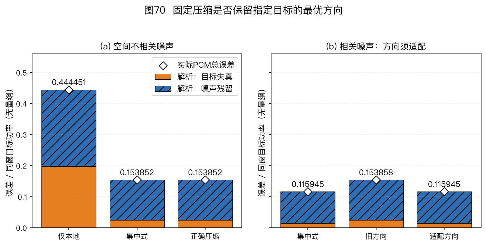
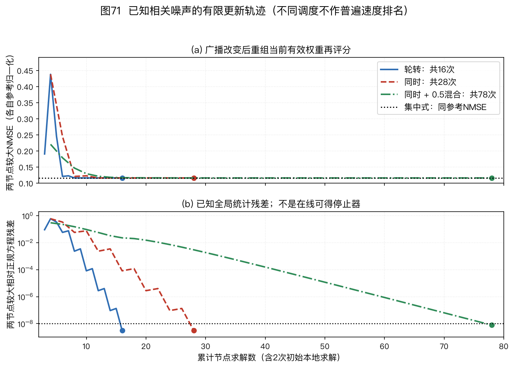
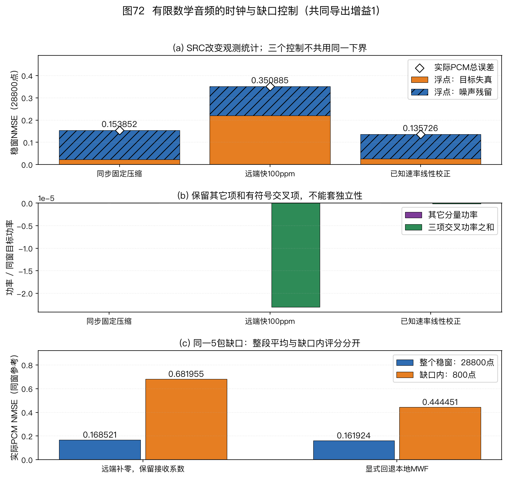

> 本篇是扩展专题Ⅱ，文件、公式和练习使用稳定身份15。它接在声学成像专题之后，介绍多个拾音节点怎样在有限通信下协作增强声音；数学预备内容可回查附录A。
>
> 🏠 首页导读：[00_overview.md](00_overview.md) ｜ 上一篇：[14_acoustic-imaging.md](14_acoustic-imaging.md) ｜ 下一篇：[12_appendix-symbols-math.md](12_appendix-symbols-math.md)

---

## 扩展专题Ⅱ：分布式麦克风协同增强

### 15.1 多个节点为何要交换声音

#### 先确定协作的输出目标

会议桌上的两台设备各有两支麦克风。一台靠近说话人，另一台可能更接近噪声源。远端设备的观测既可能提供较清楚的目标，也可能提供本地缺少的噪声参考。只选择声压最大的设备，会把这两种用途混在一起；把各设备的识别文本合并，又不会保留跨设备的波形相位关系。

本篇讨论的是**波形级协作增强**：每个节点保留自己的多通道观测，接收其他节点广播的少数线性组合，再形成自己的增强输出。节点可以估计不同位置的目标声像，因此各输出未必应逐样本相同。通信减少了哪些观测维数、各节点想保留哪一份目标、时钟和广播滤波何时变化，都需要进入模型。

第10章[§10.7](10_engineering-practice.md#sec-10-7)给出了时间轴、校准和融合三类工程问题。本篇进一步回答：不传全部原始通道，什么时候仍能达到集中式线性估计？广播滤波器怎样更新？有限帧、量化和掉线又会改变什么？

| 方式 | 节点间主要交换什么 | 输出与限制 |
|---|---|---|
| 集中式增强 | 原始多通道样本或明确的等价统计量 | 一个融合中心求解；原始样本需按时间对齐 |
| 通道选择 | 质量分数、被选中的音轨 | 选择可用输入；不使用被舍弃通道的全部空间信息 |
| 波形级分布式增强 | 压缩后的波形或复数谱及必要控制信息 | 各节点求自己的估计；须核对压缩与同步条件 |
| 识别结果融合 | 词元、置信信息和说话人标签 | 输出文本；不能据此宣称集中式波束波形被保留 |

#### 本篇的术语与先修内容

| 缩写 | 中文名与英文全称 | 在本篇中做什么 |
|---|---|---|
| WASN | 无线声学传感器网络（Wireless Acoustic Sensor Network） | 多个具备麦克风和处理器的节点交换观测 |
| LMMSE | 线性最小均方误差（Linear Minimum Mean-Squared Error） | 在规定的线性输出中最小化目标估计误差 |
| MWF | 多通道维纳滤波（Multichannel Wiener Filter） | 用混合观测估计指定参考目标声像 |
| DANSE | 分布式自适应节点特定信号估计（Distributed Adaptive Node-specific Signal Estimation） | 联合更新本地估计与向外广播的线性组合 |
| TI | 拓扑无关（Topology Independent） | 本篇用于区分采用融合、传播协议的拓扑扩展 |
| GEVD | 广义特征值分解（Generalized Eigenvalue Decomposition） | 相对噪声统计识别目标子空间 |
| WOLA | 加权重叠相加（Weighted Overlap-Add） | 从有限分析帧重建连续输出 |
| SRO | 采样率偏移（Sampling Rate Offset） | 不同采样时钟的相对速率误差 |

先阅读[第5章MWF专题](05_beamforming.md#sec-u-fb93744989)，复数内积、二阶矩与正规方程见[附录A §12.3](12_appendix-symbols-math.md#sec-12-3)。本篇从单频、固定精确统计开始；这个数学起点没有网络等待、统计估计或时钟恢复功能。

### 15.2 把本地观测与节点参考分别写出来

#### 全局列向量按节点分块

网络有$U$个节点。节点$u$有$M_u$路麦克风，合计$M=\sum_uM_u$。固定频点$k$，第$\ell$帧的本地复数列观测为$\vec x_u[k,\ell]\in\mathbb C^{M_u}$。把各节点的通道按明确顺序堆叠，得到$\vec x\in\mathbb C^M$：

$$\begin{gathered}
\vec x=[\vec x_1^\top,\ldots,\vec x_U^\top]^\top,\\
\vec x=\vec a s+\vec n,\qquad d_u=c_us.
\end{gathered}\tag{15-1}$$

$s$是该频点的标量目标系数；$\vec a$是$M$维传递向量；$\vec n$是$M$维噪声。$d_u$是节点$u$要估计的标量目标，$c_u$是它的参考响应。若选择节点$u$中的第$r_u$支麦作为参考，$c_u$就是$\vec a$在该位置的元素。参考目标不包括那支麦的噪声。

沿用全书前向傅里叶核$e^{-\mathrm j2\pi ft}$和输出$\vec w^H\vec x$。频点用$k$，帧用$\ell$，样本用$n$；节点用$u,v$，更新次数用$i$。潜在目标子空间维数用$S$，每节点广播维数用$Q$。波数若用于传播模型，写成$\kappa=2\pi f/c$，不与频点$k$混用。

传递向量既可来自自由场，也可包含频率相关房间响应。单频模型本身没有规定实波形中的滤波长度或因果等待；这些条件在§15.13单独讨论。

#### 功率单位与零均值条件

先假定目标和噪声零均值、二阶矩有限，且$E[s\vec n^H]=\vec0^H$。定义

$$\begin{aligned}
\phi_s&=E|s|^2,\\
\mathbf R_{nn}&=E[\vec n\vec n^H],\\
\mathbf R_{xx}&=E[\vec x\vec x^H]\\
&=\phi_s\vec a\vec a^H+\mathbf R_{nn}.
\end{aligned}\tag{15-2}$$

$\phi_s$是目标系数功率；两矩阵都是$M\times M$厄米矩阵。数字信号采用数字幅度平方单位；只有校准过的声压输入才可把相应量写成Pa²。传递向量和滤波权重在这里无量纲。用不同FFT归一化时，观测矩阵、互相关向量和目标功率必须一起转换。

有限观测的外积平均是未中心化二阶矩。总体零均值不保证当前一批样本均值为零，不能把有限外积平均自动等同于先减均值的样本协方差，见[附录A E12-02](12_appendix-symbols-math.md#sec-u-152b8861e4)。本篇解析例直接给定总体二阶矩；后面的确定性音频则另给有限稳定窗口径。

### 15.3 集中式MWF究竟最小化什么

#### 对任意权重先写完整代价

节点$u$若能访问全部$M$路观测，用$\hat d_u=\vec w_u^H\vec x$估计$d_u$。定义目标功率$\phi_{d_u}=E|d_u|^2$及$M$维互相关列向量$\vec r_{xd_u}=E[\vec x d_u^*]$。均方误差（Mean-Squared Error，MSE）为

$$\begin{aligned}
J_u(\vec w)&=E|d_u-\vec w^H\vec x|^2\\
&=\phi_{d_u}-2\operatorname{Re}(\vec w^H\vec r_{xd_u})\\
&\quad+\vec w^H\mathbf R_{xx}\vec w.
\end{aligned}\tag{15-3}$$

展开时，$(d_u-\vec w^H\vec x)^*=d_u^*-\vec x^H\vec w$；两个交叉项互为共轭，所以合成实部。式(15-3)的三项都有目标幅度平方单位。这条公式适用于最优、未收敛或陈旧权重，不能只在求解器返回时才使用。

若$\mathbf R_{xx}$厄米正定，对$\vec w^*$求导得到$\mathbf R_{xx}\vec w-\vec r_{xd_u}$。令它为零，得到正规方程、唯一解和最小代价：

$$\begin{aligned}
\mathbf R_{xx}\vec w_u^\star&=\vec r_{xd_u},\\
\vec w_u^\star&=\mathbf R_{xx}^{-1}\vec r_{xd_u},\\
J_u^\star&=\phi_{d_u}\\
&\quad-\vec r_{xd_u}^H\mathbf R_{xx}^{-1}\vec r_{xd_u}.
\end{aligned}\tag{15-4}$$

程序应求解线性方程，不必显式构造逆矩阵。最小代价的最后一行仅适用于对应问题的最优解；广播改变而权重尚未重算时，要回到式(15-3)。集中式与节点特定目标的原始问题见[Bertrand与Moonen，2010，Part I §II-A、式(1)、(2)](https://homes.esat.kuleuven.be/~abertran/reports/09-65.pdf "citation")；这里的代价展开与后续手算为本书推导。

#### 参考目标不能从混合录音直接读出

指定参考麦只规定要保护哪个目标声像，没有提供干净$d_u$。实际系统还要估计$\vec r_{xd_u}$。目标与噪声不相关时，可用目标二阶矩乘参考选择向量；语音活动与噪声段用于估计统计，仍可能存在误判或失配。把混合参考$x_{r_u}$直接当作干净$d_u$，会把参考麦噪声也列入希望重建的内容。

第5章的普通MWF对应$\mu=1$。语音失真加权MWF改变噪声代价，并非本篇固定代价的同一个求解器。不同节点任意使用不同噪声权重时，也不能直接套用共享目标下的同一收敛结论。

### 15.4 秩一模型中的参考尺度与共轭

#### 一个公共源，各节点仍有不同目标

把式(15-1)代入互相关定义，源噪声不相关给出

$$\begin{aligned}
\vec r_{xd_u}&=E[(\vec a s+\vec n)c_u^*s^*]\\
&=\phi_s\vec a c_u^*,\\
\phi_{d_u}&=|c_u|^2\phi_s.
\end{aligned}\tag{15-5}$$

假定$\phi_s>0$、$\vec a\ne\vec0$、$\mathbf R_{nn}\succ0$，令$q=\vec a^H\mathbf R_{nn}^{-1}\vec a>0$。先验证

$$\begin{aligned}
\mathbf R_{xx}\mathbf R_{nn}^{-1}\vec a
&=(\mathbf R_{nn}+\phi_s\vec a\vec a^H)
  \mathbf R_{nn}^{-1}\vec a\\
&=(1+\phi_s q)\vec a.
\end{aligned}$$

因此式(15-4)可化成

$$\begin{aligned}
\vec w_u^\star
&=\frac{\phi_sc_u^*}{1+\phi_sq}
  \mathbf R_{nn}^{-1}\vec a,\\
J_u^\star&=\frac{|c_u|^2\phi_s}{1+\phi_sq},\\
\operatorname{NMSE}_u^\star
&=\frac{J_u^\star}{\phi_{d_u}}
 =\frac1{1+\phi_sq}.
\end{aligned}\tag{15-6}$$

归一化均方误差（Normalized MSE，NMSE）要求目标功率严格为正。$\phi_sq$无量纲，因此分母可以与1相加。目标功率为零时，不能用除零得到的值作NMSE；参考响应$c_u=0$也不满足后文单目标非零参考条件。

#### 为什么不能平均所有节点的绝对MSE来排名

若节点1估计$s$，节点2估计$2s$，最优权重相差两倍，节点2的绝对MSE是节点1的四倍。但节点2目标功率也大四倍，两者按各自目标归一后的NMSE相同。绝对误差较大不能单独说明节点2增强更差。

复数参考更能检查共轭。例如$c_u=1+\mathrm j$，权重应乘$1-\mathrm j$；输出中的共轭转置再把该因子变回$1+\mathrm j$。漏掉这一步会把参考相位反转。参考声像与秩一化简的关系也见[第5章 E05-20](05_beamforming.md#e05-20)。

### 15.5 压缩后的协方差与有效全局权重

#### 广播是一组线性组合

先不更新广播滤波器。节点$v$选定$\mathbf F_v\in\mathbb C^{M_v\times Q}$，广播$Q$维列向量$\vec z_v=\mathbf F_v^H\vec x_v$。节点$u$使用自己的全部通道及其他节点的广播，得到

$$\begin{gathered}
\tilde{\vec x}_u=
 [\vec x_u^\top,\vec z_{-u}^\top]^\top,\\
L_u=M_u+(U-1)Q,\\
\tilde{\vec x}_u=\mathbf T_u^H\vec x,\qquad
\mathbf T_u\in\mathbb C^{M\times L_u}.
\end{gathered}\tag{15-7}$$

$\vec z_{-u}$按固定节点次序堆叠，省略本节点广播。$\mathbf T_u$的本地列在节点$u$通道块中放单位阵，远端列在相应节点块中放$\mathbf F_v$，其他位置为零。它描述节点实际能访问的线性观测，不是把远端原通道解压出来。

对同一广播版本、同一频点和同一时间统计，局部二阶矩与互相关为

$$\begin{aligned}
\tilde{\mathbf R}_u
 &=\mathbf T_u^H\mathbf R_{xx}\mathbf T_u,\\
\tilde{\vec r}_u&=\mathbf T_u^H\vec r_{xd_u},\\
\tilde{\mathbf R}_u\vec h_u^\star
 &=\tilde{\vec r}_u.
\end{aligned}\tag{15-8}$$

$\tilde{\mathbf R}_u$为$L_u\times L_u$，$\tilde{\vec r}_u$与$\vec h_u^\star$均为$L_u$维。若$\mathbf R_{xx}\succ0$且$\mathbf T_u$满列秩，对非零$\vec b$有$\vec b^H\tilde{\mathbf R}_u\vec b=(\mathbf T_u\vec b)^H\mathbf R_{xx}(\mathbf T_u\vec b)>0$，局部矩阵才保证正定。零广播、重复广播或过多广播列会破坏该前提。

#### 局部系数与全局作用不是同一向量

局部输出$\hat d_u=\vec h_u^H\tilde{\vec x}_u$可写成对全部原通道的等效输出：

$$\begin{aligned}
\hat d_u&=\vec h_u^H\mathbf T_u^H\vec x\\
&=(\mathbf T_u\vec h_u)^H\vec x,\\
\vec w_{u,\mathrm{eff}}&=\mathbf T_u\vec h_u.
\end{aligned}\tag{15-9}$$

例如单路广播$z_v=\vec f_v^H\vec x_v$，本节点对它施加局部系数$g_{uv}$，输出项是$g_{uv}^*z_v$。在原通道上的有效权重为$\vec f_vg_{uv}$；不能把$g_{uv}$当作远端麦权重，也不能多取一次共轭。

为改善数值尺度，程序可以给压缩列乘可逆对角矩阵$\mathbf D$。新坐标$\mathbf T'_u=\mathbf T_u\mathbf D$应配套$\vec h'_u=\mathbf D^{-1}\vec h_u$，使有效权重保持相同。代码内部归一化后的局部系数因此可能与正文未归一化手算不同；比较时应检查$\mathbf T\vec h$和输出，而不只比较$\vec h$的数字。

### 15.6 怎样证明固定压缩对指定任务无损

#### 平方误差给出可检查的判据

令$\vec e=\mathbf T_u\vec h-\vec w_u^\star$。将$\vec w_u^\star+\vec e$代入式(15-3)，交叉项含$\mathbf R_{xx}\vec w_u^\star-\vec r_{xd_u}$，由正规方程为零。本书得到

$$\begin{aligned}
J_u(\mathbf T_u\vec h)-J_u(\vec w_u^\star)
&=\vec e^H\mathbf R_{xx}\vec e\\
&\ge0.
\end{aligned}\tag{15-10}$$

正定性使右边仅在$\vec e=\vec0$时为零。所以固定压缩达到集中式LMMSE，当且仅当存在$\vec h$使$\mathbf T_u\vec h=\vec w_u^\star$，即

$$\vec w_u^\star\in\operatorname{range}(\mathbf T_u).
\tag{15-11}$$

$\operatorname{range}(\mathbf T_u)$是压缩列张成的权重子空间。压缩没有增加观测；它限制了原通道上能实现哪些权重。满秩局部矩阵只保证局部解唯一，并不保证式(15-11)成立。

多个目标的集中式权重若组成$\mathbf W^\star$，要同时无损就要求它的每一列都属于该空间。因而广播维数的选择与共同目标子空间有关，不能单凭“每节点有多支麦”决定一路必够。

#### “无损”应限定到哪个估计问题

式(15-11)保证指定目标、指定二阶统计与线性输出类中的最优MSE保持。它不保证原通道可逆重建，也不保证对另一目标或另一噪声模型无损。一般概率分布下，非线性条件均值还可能利用线性组合没有保存的信息。

若要把压缩称作完整概率意义的充分统计，还须另外检查条件分布等要求；联合高斯模型下的相关结论也要写清分布前提。本篇统一使用“对指定LMMSE任务无损”，不把线性代价的等价扩大成一般信息无损。

### 15.7 白噪声锚点：两支远端麦何时能合成一路

#### 集中式与只用本地的差别

本书构造两节点、各两麦的实数单频模型。节点1含全局通道1、2，节点2含通道3、4。取

$$\begin{gathered}
\vec a=[1,\tfrac12,2,-\tfrac12]^\top,\\
\phi_s=1,\qquad\mathbf R_{nn}=\mathbf I_4,\qquad d_1=s.
\end{gathered}$$

这里$q=1+1/4+4+1/4=11/2$。由式(15-6)，集中式结果为

$$\begin{gathered}
\vec w_1^\star=\frac1{13}[2,1,4,-1]^\top,\\
J_1^\star=\frac2{13}\approx0.153846.
\end{gathered}$$

输出目标响应为$\vec w_1^{\star\top}\vec a=11/13$，目标失真为$4/169$，残余噪声为$\|\vec w_1^\star\|^2=22/169$，两项和为$26/169=2/13$。MWF允许少量目标衰减来减少噪声，不能把响应$11/13$写成严格无失真。

只用节点1的$q_{\mathrm{local}}=1+1/4=5/4$，得到本地权重$[4,2]^\top/9$、MSE$4/9\approx0.444444$。集中式增加了当前代价下有用的观测；这个结果尚未说明实际网络能提供相同信息。

#### 压缩矩阵与局部方程逐项计算

选广播$z_2=2x_3-\tfrac12x_4$。节点1的输入为$[x_1,x_2,z_2]^\top$，其压缩矩阵为

$$\mathbf T_1=
\begin{bmatrix}
1&0&0\\0&1&0\\0&0&2\\0&0&-\tfrac12
\end{bmatrix}.$$

压缩后的目标响应为$[1,1/2,17/4]^\top$，噪声矩阵为$\operatorname{diag}(1,1,17/4)$。将目标外积加回噪声，得到

$$\tilde{\mathbf R}_1=
\begin{bmatrix}
2&\tfrac12&\tfrac{17}4\\
\tfrac12&\tfrac54&\tfrac{17}8\\
\tfrac{17}4&\tfrac{17}8&\tfrac{357}{16}
\end{bmatrix}.$$

局部互相关就是前述压缩目标响应。解式(15-8)得到$\vec h_1=[2,1,2]^\top/13$；乘回$\mathbf T_1$得到$[2,1,4,-1]^\top/13$，与集中式完全相同。

这个例子满足式(15-11)：远端最优权重恰与$[2,-1/2]^\top$平行。节点2若估计自己的参考$2s$，集中式权重乘2，绝对MSE为$8/13$；其NMSE仍是$2/13$。这里是已知固定统计下的一次无损压缩控制，没有估计未知导向或运行自适应广播。

### 15.8 相关噪声反例：目标方向之外也有有用观测

#### 只改噪声，旧广播便不再足够

保持目标向量、功率和节点划分，将噪声矩阵改成

$$\mathbf R_{nn}=
\begin{bmatrix}
1&0&\tfrac15&\tfrac45\\
0&1&0&0\\
\tfrac15&0&1&0\\
\tfrac45&0&0&1
\end{bmatrix}.$$

四个特征值为$1,1,1\pm\sqrt{17}/5$，最小值约0.175379，严格正定。直接解噪声方程得到$\mathbf R_{nn}^{-1}\vec a=[25,4,11,-24]^\top/8$，所以$q=61/8$。集中式结果是

$$\begin{gathered}
\vec w_1^\star=\frac1{69}[25,4,11,-24]^\top,\\
J_1^\star=\frac8{69}\approx0.115942.
\end{gathered}$$

如果仍广播$z_2=2x_3-\tfrac12x_4$，它的噪声与本地第一麦的互相关为$(1/5)\times2+(4/5)\times(-1/2)=0$。局部噪声矩阵恰与白噪声例相同，局部解仍为$[2,1,2]^\top/13$，总MSE仍是$2/13$。

远端集中式最优权重$[11,-24]^\top/69$与旧广播方向不平行，违反式(15-11)。损失为$2/13-8/69=34/897\approx0.0379041$。这不是局部方程算错，也不是统计矩阵非正定；被限制的权重空间不包含集中式解。

#### 没有目标的组合为何还能帮助增强

另看$p_2=\tfrac12x_3+2x_4$。它的目标响应为$(1/2)\times2+2\times(-1/2)=0$，目标完全相消；噪声却与$n_1$具有互相关$(1/5)\times(1/2)+(4/5)\times2=17/10$。

$p_2$能提供与本地噪声相关的观测。最优远端方向可分解成

$$\begin{bmatrix}11\\-24\end{bmatrix}
=8\begin{bmatrix}2\\-\tfrac12\end{bmatrix}
-10\begin{bmatrix}\tfrac12\\2\end{bmatrix}.$$

第一项沿旧目标方向，第二项沿目标为零的噪声观测方向。只保存目标方向，恰好丢掉第二项。因而“远端广播听起来几乎没有目标”不能单独作为无用判据。

改用已知适配广播$z_2'=11x_3-24x_4$，节点1局部解变成$[25,4,1]^\top/69$，其有效全局权重恢复集中式解。这个单路广播同时包含两种方向；无需把原远端两通道完整解压回来，但需要找到合适的方向。DANSE的自适应更新正是为避免永久固定一个错误广播而设计。

### 15.9 顺序DANSE：本地估计与向外广播分别更新

#### 单路广播的状态与一次更新

在$Q=1$情况下，将节点$u$的局部权重分成$M_u$维本地部分$\vec f_u$和$U-1$维接收组合部分$\vec g_u$。广播仅由本地观测生成，增强输出则还使用远端广播：

$$\begin{aligned}
z_u&=\vec f_u^H\vec x_u,\\
\hat d_u&=\vec f_u^H\vec x_u+\vec g_u^H\vec z_{-u}.
\end{aligned}\tag{15-12}$$

广播$z_u$与完整增强输出$\hat d_u$不是同一个信号。若把完整输出再次广播，就会改变其他节点的输入依赖，不能把这种程序仍叫作这里的原始全连接DANSE。

顺序轮转更新在每个更新事件只选择一个节点。固定其他节点广播后，活动节点解式(15-8)，提取新的本地和接收部分；本地部分控制此后广播，接收部分控制本节点输出。随后轮到下一个节点。原算法与参数分块见[Part I §III-A、式(6)～(14)](https://homes.esat.kuleuven.be/~abertran/reports/09-65.pdf "citation")。

在实际持续流中，广播更新作用于未来观测，旧样本不会因滤波器变化而不断重发。固定统计教学程序可以用$\mathbf T_u^H\mathbf R_{xx}\mathbf T_u$立即重算新广播的统计；实际设备只能从新广播样本形成估计，或采用明确的统计转换。两条路线的等待和误差不同。

#### 三次更新的精确手算

沿用§15.7白噪声模型，节点1估计$s$，节点2估计$2s$。初始$\vec f_1=\vec f_2=[1,0]^\top$，各节点广播第一支本地麦。

第一次轮到节点1，其输入为$[x_1,x_2,x_3]^\top$。观测目标响应为$[1,1/2,2]^\top$，白噪声下$q=21/4$，局部权重为$[4,2,8]^\top/25$。新的本地广播权重是$[4,2]^\top/25$，有效全局权重为$[4,2,8,0]^\top/25$，MSE为$4/25$。

第二次节点2使用$[x_3,x_4,z_1]^\top$、目标$2s$。此时$z_1=(4x_1+2x_2)/25$，局部权重为$[8/13,-2/13,25/13]^\top$。乘回压缩矩阵得到$[4,2,8,-2]^\top/13$，等于节点2集中式权重，其绝对MSE为$8/13$。新的节点2广播权重为$[8,-2]^\top/13$。

第三次节点1使用这一新广播，局部解为$[2/13,1/13,1/2]^\top$。远端有效权重是$(1/2)[8,-2]^\top/13=[4,-1]^\top/13$，本地部分是$[2,1]^\top/13$，所以达到节点1集中式解$[2,1,4,-1]^\top/13$，MSE为$2/13$。

#### 陈旧接收权重会暂时增加误差

第二次更新后，节点1尚未重新求解，仍持有第一次的接收系数$8/25$。广播$\vec f_2$却已改变，因此节点1实际有效权重变成$[52,26,64,-16]^\top/325$。目标响应是$201/325$，目标失真为$15376/105625$，噪声残留为$7732/105625$，总MSE是$23108/105625\approx0.218774$，比第一次的0.16更大。

第三次更新才消除这一陈旧系数造成的失配。理论收敛不能被解释成所有节点实际输出在每次全网更新后都单调改善。报告必须保留本地权重、接收权重、各广播版本和评分时刻；只记录活动节点刚求出的最小代价，会漏掉另一个节点的暂时退化。



图70　解析柱将目标失真与噪声残留分开，实际PCM点使用重读文件的总误差。白噪声的正确压缩可无损；相关噪声中的旧方向有损，适配方向恢复指定目标的集中式值。固定方向比较不等于运行完整自适应DANSE。

### 15.10 顺序、同时、松弛与异步的保证分别是什么

#### 固定精确统计的顺序收敛

原始顺序DANSE的单目标定理要求观测矩阵满秩，各节点目标是同一潜在标量的非零复数倍，使用精确二阶统计并轮转更新。其多维推广要求广播/估计维数与共同目标子空间维数相同，各节点目标变换满秩。[Part I §III-B Theorem III.1、§IV-B Theorem IV.1](https://homes.esat.kuleuven.be/~abertran/reports/09-65.pdf "citation")。

这些条件解释了为何一个共同目标可在收敛后由每个远端节点广播一路，却没有保证任意预先固定的一路压缩都无损。相关噪声不必一律排除；需要正确的全局统计和能更新到相应方向的算法。§15.8反例否定的是旧固定压缩的普遍无损性。

#### 同时更新使用的输入马上改变

同时更新让各节点基于同一旧广播状态分别求新局部解，再一起替换广播。各节点求解时假定的远端方向随后都变了；局部最优不自动组成全网收敛步骤。为了分开这些层次，本书既运行固定统计的同步更新，也用E15-21的固定二次型反例解释耦合；后者不是DANSE算法的替代实现。

简化松弛广播将旧本地滤波与新局部解混合：

$$\vec f_u^{i+1}
=(1-\alpha_i)\vec f_u^i
+\alpha_i\vec f_{u,\mathrm{new}}.
\tag{15-13}$$

$0<\alpha_i\le1$。接收滤波是否同样混合、何时用于输出，以及广播版本何时生效，都须由接口规定。固定$\alpha_i$能在某些模型中平滑更新，但不能单凭“系数小于1”证明一般收敛。本书四麦锚点上的同时与有限松弛控制可以收敛，不能人为把它们描述成已经出现极限环。

#### 有证明的松弛版本多了一步优化

[Part II §IV-B、式(22)～(28)、Theorem IV.1](https://homes.esat.kuleuven.be/~abertran/reports/09-178.pdf "citation")中的$rS$-DANSE$^{+}$还先在全部当前广播组成的空间中优化组合矩阵。对$Q$维广播，记该额外优化的自节点块为$\mathbf G_{uu}^{i+1}$，本地新解映射为$\mathcal F_u$，其更新包含

$$\begin{aligned}
\mathbf F_u^{i+1}
&=(1-\alpha_i)\mathbf F_u^i\mathbf G_{uu}^{i+1}\\
&\quad+\alpha_i\mathcal F_u(\{\mathbf F_v^i\}).
\end{aligned}\tag{15-14}$$

它与式(15-13)的简化规则不同。原文证明要求满秩观测、共同目标子空间及满秩目标变换、精确统计，以及

$$\begin{gathered}
\alpha_i\in(0,1],\\
\lim_{i\to\infty}\alpha_i=0,\\
\sum_{i=0}^{\infty}\alpha_i=\infty.
\end{gathered}\tag{15-15}$$

最后一项避免总更新量过早耗尽。原文此处没有要求$\sum_i\alpha_i^2<\infty$。$1/(i+1)$满足三个条件；固定0.5不满足趋零条件，$2^{-i-1}$不满足累计和发散条件。原文§IV-C对去掉额外优化的简化版本保留了仿真观察、未给同一正式证明的区别。

原论文用$J$表示节点数、$K$表示广播/估计维数、$Q$表示潜在目标维数。本篇对应$U,Q,S$，故原条件$K=Q$在这里是$Q=S$，不是节点数等于源数。

#### 异步更新仍需样本时间轴

参数异步意味着各节点不必在相同迭代事件更新；不等于各采样时钟可以失同步。Part II §IV-D、脚注8明确保留采样层同步，异步定理还要求各节点持续获得更新机会。节点永久离线或长期只收到陈旧广播时，不能沿用完整更新序列的保证。

有限快拍、非平稳声音、广播坐标改变、VAD误判、加载、网络等待和量化都会使实际路径超出固定精确统计定理。它们应分别用模型控制与设备试验检查，而不是把最终误差接近集中式的一次例子当作所有条件下的证明。

### 15.11 多目标与网络拓扑：广播维数决定保留哪些方向

#### 两个目标不能只检查一个权重

将标量源推广为$S$维源向量，观测模型是$\vec x=\mathbf A\vec s+\vec n$，其中$\mathbf A\in\mathbb C^{M\times S}$。节点$u$需要$Q$维目标$\vec d_u=\mathbf B_u\vec s$，$\mathbf B_u\in\mathbb C^{Q\times S}$。集中式权重$\mathbf W_u\in\mathbb C^{M\times Q}$满足$\hat{\vec d}_u=\mathbf W_u^H\vec x$。按列求解正规方程即可得到各输出，但共享的压缩矩阵必须同时容纳所有目标权重：

$$\begin{aligned}
\mathbf R_{xx}\mathbf W_u^\star
&=\mathbf R_{xd_u},\\
\operatorname{range}(\mathbf W_u^\star)
&\subseteq\operatorname{range}(\mathbf T_u).
\end{aligned}\tag{15-16}$$

这里$\mathbf R_{xd_u}\in\mathbb C^{M\times Q}$。一个目标的无损性不能代替整个输出矩阵的无损性；各输出MSE之和是误差协方差的迹，还应分别记录每个输出。

取两个互不相关、方差均为1的源，$\mathbf R_{nn}=\mathbf I_4$，并令

$$\mathbf A=\begin{bmatrix}
1&0\\0&1\\1&1\\1&-1
\end{bmatrix}.
\tag{15-17}$$

两列内积为0、各自平方范数为3。集中式每个源的线性估计误差为$1/(1+3)=1/4$。节点1只有$x_1=s_1+n_1$和$x_2=s_2+n_2$。节点2广播$x_3+x_4=2s_1+n_3+n_4$，只增加了$s_1$的信息；此时$s_2$仍只能从$x_2$估计，MSE为$1/2$。

这个广播能够无损地帮助估计$s_1$，却完全丢掉了远端的$s_2$方向。若还广播$x_3-x_4=2s_2+n_3-n_4$，两个独立方向都可恢复。这里增加广播维数有明确的信息理由，不能只用“源数多”作为经验口号。

#### 完全图、树与通信求和不是同一个实现

全连接DANSE允许每个节点接收其他节点的压缩信号。实际网络可能只有邻居链路，不能直接把全连接输入搬到缺边的网络。对树形网络，一个教学控制是将各节点标量$z_u$先沿树向根累加，再将总和传回；节点从总和中减去自己的贡献，可得到其他节点贡献的和。

例如链$1\leftrightarrow2\leftrightarrow3$，以2为根：1和3分别发送$z_1,z_3$；根形成$z_1+z_2+z_3$，再向两叶发送总和。一次同样本求和用了4条定向边消息。只有当样本标签一致、路径完整且到达顺序受控时，这个和才代表同一时刻的网络观测；把不同时刻的数据相加会改变估计模型。

树上求和本身没有说明应如何更新广播滤波。拓扑无关DANSE还引入对广播坐标的变换：原作者稿用$\mathbf P_u=\mathbf W_{uu}\mathbf G_u^{-1}$，形成全网和减去自身，并使本地输入保持$M_u+Q$维。逆矩阵存在、连通网络上准确形成同样本总和、共同目标与统计条件都属于算法的一部分。[TI-DANSE §III、§IV Theorems 1/2](https://homes.esat.kuleuven.be/~abertran/reports/15-87.pdf "citation")。

因此E15-23只检查树上的消息路径与计数，不称为完整TI-DANSE。网络发生变化时，还需重新建立树、保证每个参与节点可达，并明确哪些滤波状态和统计量能够继续使用。

### 15.12 GEVD与近年的扩展：每种方法究竟改变哪一步

#### 白化把噪声度量变成欧氏度量

直接求解$\mathbf R_{xx}\vec w=\vec r_{xd}$需要可靠的目标交叉统计。实际语音增强常由目标活动段与噪声段估计总协方差和噪声协方差，再以广义特征值分解（GEVD）估计低秩目标结构。

假设$\mathbf R_{nn}$正定，取其Hermitian正定平方根，白化后的矩阵为

$$\begin{aligned}
\mathbf C&=\mathbf R_{nn}^{-1/2}
\mathbf R_{xx}\mathbf R_{nn}^{-1/2},\\
\mathbf C\vec v_j&=\lambda_j\vec v_j,\\
\vec q_j&=\mathbf R_{nn}^{-1/2}\vec v_j,\\
\mathbf R_{xx}\vec q_j
&=\lambda_j\mathbf R_{nn}\vec q_j.
\end{aligned}\tag{15-18}$$

$\mathbf C$、$\lambda_j$无量纲，$\vec q_j$的尺度由噪声归一化决定。若$\mathbf R_{xx}=\mathbf R_{nn}+\mathbf R_{ss}$且目标协方差为半正定，则所有$\lambda_j\ge1$；超过1的方向表示高于噪声底的目标结构。有限估计可能出现小于1的特征值，必须说明截断、秩选择与加载策略。

在噪声白化坐标里，MWF在第$j$个方向的增益是$1-1/\lambda_j$。保留若干目标方向，相当于改变了所用目标协方差模型；被删除方向不再保证保留真实完整LMMSE所需的信息。[GEVD-DANSE §III、式(9)～(17)](https://ftp.esat.kuleuven.be/SISTA/abertran/reports/GEVD_DS_TSP2016.pdf "citation")。

#### 一个可手算的小例子

取$\vec a=[1,2]^\top$、$\phi_s=1$和

$$\mathbf R_{nn}=\begin{bmatrix}1&1/2\\1/2&1\end{bmatrix}.
\tag{15-19}$$

$\mathbf R_{nn}^{-1}\vec a=[0,2]^\top$，所以$q=\vec a^\top\mathbf R_{nn}^{-1}\vec a=4$。总协方差相对噪声的广义特征值是$1+q=5$与1。估计$s$的权重为$[0,2/5]^\top$、MSE为$1/5$。

也可以采用另一种等价白化：先分解$\mathbf R_{nn}=\mathbf L\mathbf L^H$，再使用$\mathbf L^{-1}\mathbf R_{xx}\mathbf L^{-H}$；特征向量映回原坐标时乘$\mathbf L^{-H}$。Cholesky因子$\mathbf L$不是Hermitian平方根，不能把式(15-18)中的左右因子机械替换成同一个$\mathbf L^{-1}$。

本例的分解与白化矩阵都可直接复算：

$$\begin{gathered}
\mathbf L=\begin{bmatrix}1&0\\1/2&\sqrt3/2\end{bmatrix},\\
\mathbf L^{-1}\vec a=\begin{bmatrix}1\\\sqrt3\end{bmatrix},\qquad
\mathbf L^{-1}\mathbf R_{xx}\mathbf L^{-H}
=\begin{bmatrix}2&\sqrt3\\\sqrt3&4\end{bmatrix}.
\end{gathered}$$

白化目标向量的平方范数是4，所以后一矩阵沿目标方向的特征值为5，正交方向为1；噪声白化后目标谱值为$\lambda-1$，MWF收缩为$1-1/\lambda$。普通分解与GEVD的差别因此可以从具体矩阵核对。

第一支麦没有直接进入输出并非程序失败。第二支麦已经提供目标及噪声的最佳组合；在这个相关噪声模型中再加第一支麦不会进一步降低线性误差。E15-24用白化计算、广义特征方程和直接正规方程三条路线核对这一结论。

#### 扩展方法的条件与实现边界

| 方法 | 改变的关键步骤 | 需要保留的边界 |
|---|---|---|
| GEVD-DANSE | 将本地目标统计建模为选定秩的GEVD结构，再更新广播 | 顺序收敛讨论依赖准确统计、可靠局部噪声矩阵与所用秩；低于真实目标维数时，目标已经改变 |
| SRO感知DANSE | 从相干性随时间的变化估计采样率偏差，累积相位校正与整数样本滑移 | 静止节点/声源、稳定SRO及估计可靠性；参数异步不能代替采样同步 |
| TI-GEVD-DANSE | 在树/求和结构内使用GEVD本地解，并规范化共享坐标 | 规范化必须同时作用于协方差和滤波器；秩不足的收敛不沿用满秩目标定理 |
| TI-DANSE+ | 根节点保留分支部分和，估计后向其他节点传送，并恢复节点目标坐标 | 根节点度数影响局部维数，需说明根更新、树变化和统计批次 |

GEVD-DANSE原文对顺序更新与同时更新的证据强度不同，同时更新部分主要是实验观察；不能将表中第一行变成全部更新调度均有证明的结论。[原文§IV-B/C/F、§V-A](https://ftp.esat.kuleuven.be/SISTA/abertran/reports/GEVD_DS_TSP2016.pdf "citation")。

SRO论文将跨帧相干性乘积用于速率估计，再将累积延迟转成频率相关相位和整数滑移；它不是简单给每帧加一个固定相位。其仿真中的VAD和传输条件也不是丢包鲁棒性的证据。[SRO-DANSE §IV-A～C、式(11)～(20)](https://arxiv.org/html/2211.02489v2 "citation")。

TI-GEVD的共享规范化是为控制不同节点组合矩阵的共同尺度漂移，不等于只把每个向量各自除以范数。[2024作者稿§III/IV](https://ftp.esat.kuleuven.be/sista/pdidier/eusipco2024/eusipco24_pdidier_submission_v1.pdf "citation")。TI-DANSE+会议稿使用理想协方差的单频实验；2026扩展预印本补充了满秩共同目标下的顺序定理，并讨论避免跨广播版本混合统计的批处理。[2025会议稿§III/IV](https://arxiv.org/html/2506.20001v1 "citation")、[2026扩展稿§III-C、§III-G](https://arxiv.org/html/2506.02797v2 "citation")。

本专题的教学代码实现固定统计的模型控制、规定的更新调度、通信计数和有限音频控制。上述高级方法用来解释研究问题与进一步阅读，不因此成为本仓库已经运行的实现。

#### TI-dMWF：一次发现与估计需要不同的源模型

2026-07-06的[TI-dMWF预印本§2～3、Theorem 1与Remark 1](https://arxiv.org/html/2607.05561v1 "citation")采用全局/严格局部源模型：每个语音或噪声源由所有节点观测，或只由一个节点观测。原模型还要求潜在源互不相关、全局混合子空间满列秩。根节点的麦克风数须不小于全局源总维数，不能只数目标语音；各节点作为根分别执行发现与估计。

发现阶段先向叶节点传播根的指定原通道，再由叶向根级联LMMSE压缩、拼接不同分支，最后在根求MWF；这与TI-DANSE的广播求和不同。

不需要DANSE式在固定统计下迭代寻找压缩方向，不意味着压缩矩阵永远固定，也不意味着没有统计学习或多跳等待。若某源仅由两个以上节点组成的严格子集观测，原最优性证明不再适用；论文中的偏离模型仿真不能替代该保证。本书只建立原理与条件导航，未运行可核的TI-dMWF实现。不能将E15-23的树上求和当作此算法的复现。

### 15.13 有限WOLA：统计更新、广播更新与波形生效有三个时刻

#### 从单频模型到有边界的波形

式(15-1)省略了频点$k$与帧$\ell$。WOLA实现先对每节点信号加分析窗、作FFT，在各频点应用广播与接收滤波，再用合成窗和重叠相加输出。这里需要同时处理帧长度、跳长、窗、延迟与尾部；不能把每个频点精确的代数等式直接称为完整波形无损。

当广播由过去若干帧的滤波状态形成、协方差又从这些广播估计时，三个时刻应单独记录：收到观测的时刻、统计/权重更新事件的时刻、新广播真正进入其他节点输入的时刻。旧广播统计通常不等于把新$\mathbf T$代入式(15-8)所得矩阵。若不建立明确的转换，混合两种广播坐标会产生与声音变化无关的估计偏差。

固定统计教学核采用已知$\mathbf R$，每次直接计算$\mathbf T^H\mathbf R\mathbf T$，可隔离方向与调度问题。WOLA代码需要估计、遗忘因子、活动检测和样本等待；这条实际链不由精确统计控制的收敛曲线代替。

#### 固定作者MATLAB源的静态合同

本仓库核对了固定作者源码的更新顺序，区分向外广播滤波$\mathbf W_{\mathrm{ext}}$与本节点内部输出滤波$\mathbf W_{\mathrm{int}}$。顺序令牌限制外部目标`Wext_target`的事件更新；实际`Wext`仍逐帧朝旧目标平滑，内部滤波也继续更新，所以“本次不是该节点的令牌”并不表示该节点所有状态冻结。

这一固定文件使用普通特征值分解，先从`real(D)`对角中选最大值，再对选中的值取绝对值；它没有按绝对值大小重新排序，也不是§15.12的GEVD白化方法。比如特征值为−4和−1时，该顺序先选−1、取绝对值得1，不能说选中了绝对值最大的4。此例检查原控制流，不将带负特征值的矩阵当作合法目标协方差。

VAD读取帧首样本，不能将该判决描述成整帧目标活动的准确检测。广播先使用旧外部状态，更新事件经过缓冲次序后，要到后续第二帧才进入所发送广播。这些都是具体代码顺序，不能用理想算法框图猜测。

该源使用对称Hann窗；对应分析/合成和跳长不能直接宣称满足完美COLA重构。它也没有排出全部尾帧或添加对角加载。IWAENC论文中的有限WOLA描述与这一固定实现的具体窗和缓冲行为应分别核查。[IWAENC 2010 §II-C、§III](https://homes.esat.kuleuven.be/~abertran/reports/IWAENC10.pdf "citation")。

这次对作者MATLAB文件完成的是固定身份的静态审查，未运行MATLAB/Octave，也未接入真实无线网络。源码可见、某方法被提取核对、完整流式整链实测，是三个不同状态；后续实验必须继续保留这个区别。

### 15.14 通信、矩阵存储与更新预算怎样算

#### 先声明计数的信号表示

原始PCM16单声道、采样率16kHz的有效载荷是$16000\times16=256000$ bit/s，即32 kB/s。32位浮点时域流是64 kB/s。两秒记录对应64000与128000字节，均未计文件头、包头、校验、加密、重传和纠错。

频域流不能只写“一个复数”。若每帧传实FFT的$N/2+1$个频点，每个复数的实部/虚部各32位，跳长$H$，每节点广播$Q$路，则有效载荷为

$$B_{\mathrm{spec}}
=\frac{f_s}{H}\left(\frac N2+1\right)Q\times64
\quad\text{bit/s}.
\tag{15-20}$$

例如$f_s=16000,N=512,H=256,Q=1$，所得为1028000 bit/s。DC/Nyquist是否以实数发送、是否省略冗余、是否量化、是否仅发部分频点都会改变这个数。压缩成一路能减少通道数，却未必比单通道PCM16的负载更低。

一次无线广播能被多个邻居同时听到时，发送端只发送一份；若系统用逐接收者单播，全连接网络中每个节点需要$U-1$份。可比较全网$U$次发送与$U(U-1)$次单播，但不能忽略广播接收所需的无线覆盖、冲突和调度。树上一次汇聚再分发总和是$2(U-1)$条定向边消息，并有多跳等待。

#### 每节点更小不保证全网更小

标量全连接教学模型在节点$u$保留$M_u$路原始观测和其他$U-1$路广播，局部维数$L_u=M_u+U-1$。一个密集复矩阵按complex128存储需$16L_u^2$字节；使用总协方差、噪声协方差两套矩阵时乘2。节点权重、分解工作区、历史帧和报文缓冲另算。

集中式矩阵维数是$M=\sum_uM_u$。取$U=4,M_u=2$：集中式一套8维矩阵需要1024字节；每节点5维矩阵400字节，全网一套合计1600字节。分布式降低每台设备的矩阵尺寸，同时增加全网复制和通信，这是两个不同资源指标。若有$F$个频点，再乘$F$；独立保存各帧历史时还要乘相应历史长度。

不要只从更新轮数推断求解次数。顺序一事件通常更新一个节点，同时一事件可更新$U$个节点；实际WOLA的内部滤波更新可能又有自己的周期。应分别记录全网事件数、本地矩阵分解/求解数，以及哪个频点/广播版本参与了求解。密集求解常随维数呈立方级增长，但小例子的存储字节和调用次数不能证明某硬件的实际实时性能。

#### 残差必须检查当前有效权重

迭代停止除了看连续两次广播变化，还可以检查目标节点当前有效全局权重的正规方程残差：

$$\begin{aligned}
\vec\rho_u&=\mathbf R_{xx}\vec w_{u,\mathrm{eff}}-\vec r_{xd_u},\\
\epsilon_u&=\frac{\|\vec\rho_u\|_2}{\|\vec r_{xd_u}\|_2}.
\end{aligned}\tag{15-21}$$

$\epsilon_u$无量纲，零分母需另设规则。只检查活动节点局部坐标中的正规方程，可能遗漏压缩方向的全局损失；只检查旧全局权重，又可能遗漏§15.9的陈旧接收系数。预算曲线应按实际输出的当前广播重组权重，并与同一参考、同一统计的集中式值比较。



图71　在同一已知协方差模型中记录顺序、同时与$\alpha=0.5$控制的实际节点求解数、缓存输出及当前全局残差。它展示有限教学更新路径；不同目标尺度、初始化、停止阈值或统计模型都可能改变路径，不代表一般网络上的速度排名。

### 15.15 音频、采样率偏差与丢包：有限记录怎样诚实评分

#### 音频是已知混合模型的可听控制

本专题使用16kHz、32000点的两秒数学合成记录，目标由700/1300Hz组成，噪声方向由1900/2300/2900/3500Hz组成，所有导出文件共同增益为1。观测是即时线性混合，没有房间传播尾部，也没有自然语音或盲活动检测。

目标的两条余弦峰幅分别为0.1、0.06，稳窗均方功率为$P=0.0068$。音频协方差是前面单位方差模型整体乘$P$，因此权重和NMSE保持不变，绝对数字幅度平方MSE则乘$P$。未乘$P$的$2/13$不能直接叫音频绝对均方误差。

评分窗为$1600:30400$，共28800点。同步基础混合记录所用频率在这段窗内完成整数周期，使已知分量的有限窗交叉项抵消。这是构造出来的有限记录正交性；不能用它证明随机源独立、真实声音不相关或算法能够盲估噪声。

白噪声模型的正交分量构造与相关噪声模型的混合构造服务于§15.7/15.8中的协方差。音频中比较集中式、仅本地、旧固定压缩和适配压缩，是为了听出已知观测方向的作用。固定压缩控制没有运行完整DANSE更新，也没有变成设备性能排名。

#### 三层评分分别回答三个问题

解析层根据已知协方差计算式(15-3)；浮点层根据实际导出前的目标与噪声分量计算有限窗功率；PCM层必须重读实际量化文件，用同窗、同参考做整数误差统计。PCM16按32768解码，不能把整数32767当作另一种归一化后混算。

设实际整数参考为$D[n]$，实际整数输出为$Y[n]$，评分窗为$\mathcal I$。总PCM误差及归一化误差为

$$\begin{aligned}
E_{\mathrm{PCM}}&=\sum_{n\in\mathcal I}(Y[n]-D[n])^2,\\
P_{\mathrm{ref}}&=\sum_{n\in\mathcal I}D[n]^2,\\
\mathrm{NMSE}_{\mathrm{PCM}}&=E_{\mathrm{PCM}}/P_{\mathrm{ref}}.
\end{aligned}\tag{15-22}$$

求和应使用足以容纳平方与累计值的整数类型。量化后的参考与输出各有误差，PCM总误差不能直接用浮点的目标失真加噪声残留取代。这里不后验拟合增益，不通过寻找最佳延迟降低误差；延迟只有在模型预先规定后才可按该规则对齐。

#### 采样率偏差控制改变观测，而非只改标签

偏移、漂移和缺口的基础区别见[第10章§10.2](10_engineering-practice.md#sec-10-2)。本专题时钟控制对同一远端流引入已知采样率偏差，再用已有插值SRC控制补偿；它检查时间轴失配会怎样破坏广播组合，并未实现SRO论文的盲估计器。

插值改变噪声的方差与时间相关性。因而补偿控制的某次有限记录NMSE可以低于未插值同步模型的$2/13$：这表示两个评分对象具有不同观测统计，不能称为超过同一模型的LMMSE下界。公平比较应重新计算SRC后的统计，或将结果明确命名为不同模型的有限记录控制。

实际控制设远端快100ppm、初始偏移0。设备端采到32004点以提供插值右端支持，校正输出32000点；最后同索引时刻漂移约3.19958个参考样本。257点分块保留状态的结果与整段调用逐点相同。浮点融合稳窗NMSE由约0.350880变为0.135724；同步模型为$2/13\approx0.153846$。这些数是按已知速率插值的结果，不能描述成盲估计器恢复了集中式最优。

缺口也必须规定策略。补零使远端数据在缺口内消失；沿用上一包会引入陈旧内容；回退本地滤波会改变该段的有效全局权重。三种策略须使用相同缺口位置、同一评分窗，并明确计入缺口段还是只计有效样本。没有一种策略可仅凭平均误差较小就宣称对任意网络丢包鲁棒。

本次实际音频比较补零和本地回退两种策略，缺口为$16000:16800$的800点，即5个160点包。全稳窗浮点NMSE分别约0.168516、0.161918；缺口内补零的解析值为$461/676$，回退为$4/9$。重读PCM的缺口NMSE分别约0.681955、0.444451。全窗与缺口窗结果分别解释“整段平均影响”和“缺口期间的输出”，不能互相替代。



图72　时钟控制区分目标失真、噪声与实际PCM总误差；缺口控制保留全稳窗及缺口窗两个分母。插值改变噪声模型，已知缺口触发回退；两者都不是未知SRO或任意丢包的鲁棒性验证。

#### PCM16远端传输的误差界

若两路远端麦先分别量化为PCM16，再按固定权重组合，每路无削波舍入误差满足$|e_m[n]|\le\Delta/2$，$\Delta=1/32768$。固定远端权重$\vec w_r$引入的组合误差满足

$$\begin{aligned}
|e_{\mathrm{link}}[n]|
&\le\frac\Delta2\sum_m|w_{r,m}|,\\
\frac1{|\mathcal I|}\sum_{n\in\mathcal I}|e_{\mathrm{link}}[n]|^2
&\le\left(\frac\Delta2\sum_m|w_{r,m}|\right)^2.
\end{aligned}\tag{15-23}$$

对白噪声集中权重的远端部分$[4,-1]^\top/13$，振幅界为$5\Delta/26$。该界是远端输入量化导致的浮点输出增量；最终输出再次量化时另有一次舍入误差。若实际传输的是先合成后量化的广播$z$，界应使用接收系数乘该广播的量化步长，不能机械复用逐麦传输界。削波、丢包与速率漂移也不在这一舍入界内。

本次实际传输控制量化的是$z_2=2x_3-x_4/2$，接收系数为$2/13$。因此对应振幅界是$\Delta/13\approx2.347506\times10^{-6}$，实际浮点输出相对未量化控制的最大增量约$2.347005\times10^{-6}$，处于独立舍入界内。这是对真正编码、重读后的远端广播计算的结果。

#### 可以复算的入口与音频组

数值核见[distributed.py](../codes/chapters/ch15/core/distributed.py)，音频模型见[distributed_audio.py](../codes/chapters/ch15/core/distributed_audio.py)。数学正文使用列压缩矩阵$\mathbf T$、$\tilde{\vec x}=\mathbf T^H\vec x$；代码参数`projection`使用观测行，即$\mathbf B=\mathbf T^H$，并在内部归一化非零行。局部权重数值会随坐标尺度变化，代码输出的有效全局权重、协方差模型和MSE才是与正文手算的共同核对对象。复数广播滤波$\vec f^H\vec x$对应代码中的共轭行，不能直接将$\vec f^\top$填入。

代码的`compressed_weights`对应内部归一化观测坐标，`raw_compressed_weights`对应传入的原始广播坐标；缓存接收系数与重组当前输出使用后一组。`outputs_at_last_solve`仅保存上次求解时的全局提案，`cached_outputs`才是用当前广播重组后的实际权重。两者可在广播变化后不同，E15-09/10要求分别评分。

从仓库根目录运行以下入口。生成命令写17个WAV及独立清单；`--check`只读核对18个普通成员、当前真实源摘要、参数与完整字节重放，不重新获取上游实现。

```bash
.venv/bin/python -m codes.chapters.ch15.examples.generate_distributed_audio
.venv/bin/python -m codes.chapters.ch15.examples.generate_distributed_audio --check
```

`chapter15_exercises.run_experiments()`返回包含24个稳定题号的`exercises`及独立元数据；`run_covariance_experiments()`返回固定模型、压缩比较与三种更新轨迹；音频核的`run_experiment()`返回有限音频报告和待导出数组。

教学更新中，松弛只混合发送的本地广播部分；缓存的活动输出保留未松弛的局部提案，随后按当前广播重新组装。这是明确规定的有限教学接口，不能代替作者MATLAB内部/外部滤波的整条流式调度。

该模型以所有当前输出的正规方程相对残差不超过$10^{-8}$停止。“缓存”指保留本地输出滤波和远端接收系数，每次广播改变后仍将这些系数乘当前广播，重新组装实际有效全局权重；不能将旧全局权重一直冻结。初始化、阈值与模型改变后求解次数都可能变化，不能用某次控制宣称一般顺序算法比同时更新更快。

具体预算控制使用§15.8相关噪声、节点目标$s,2s$及初始广播$[1,1/2]^\top,[2,-1/2]^\top$。顺序、同时、固定半步分别用14、26、76次节点更新达到上述阈值，包含两次本地初始化后为16、28、78次求解。顺序控制第二次更新后节点1的实际MSE约0.437870，虽然其上次求解提案代价为$2/13$；记录实际广播后的输出能够看见这一暂时退化。

| 音频组 | 实际文件 | 该组回答的问题 |
|---|---|---|
| 两节点参考 | [节点1](../codes/chapters/ch15/distributed_audio/reference_node1.wav)、[节点2](../codes/chapters/ch15/distributed_audio/reference_node2.wav) | 同一源的不同目标尺度 |
| 四通道观测 | [白噪模型](../codes/chapters/ch15/distributed_audio/array_white.wav)、[相关噪模型](../codes/chapters/ch15/distributed_audio/array_correlated.wav) | 已知方向和相关结构；通道顺序为$x_1,x_2,x_3,x_4$ |
| 本地与白噪最优 | [仅本地](../codes/chapters/ch15/distributed_audio/local_node1.wav)、[集中式](../codes/chapters/ch15/distributed_audio/central_white.wav)、[正确压缩](../codes/chapters/ch15/distributed_audio/compressed_white.wav) | 远端方向如何降低指定参考误差 |
| 相关噪压缩 | [集中式](../codes/chapters/ch15/distributed_audio/central_correlated.wav)、[适配压缩](../codes/chapters/ch15/distributed_audio/compressed_correlated.wav)、[旧方向](../codes/chapters/ch15/distributed_audio/stale_correlated.wav) | 旧方向丢掉噪声观测，适配方向恢复 |
| 节点2目标 | [相关噪集中式节点2](../codes/chapters/ch15/distributed_audio/central_node2_correlated.wav) | 用节点2参考评分，不能复用节点1PCM分母 |
| 实际广播传输 | [远端广播](../codes/chapters/ch15/distributed_audio/remote_scalar_white.wav)、[PCM16传输后融合](../codes/chapters/ch15/distributed_audio/transport_pcm16_white.wav) | 先量化远端广播，再用重读值融合 |
| 采样率偏差 | [错位融合](../codes/chapters/ch15/distributed_audio/clock_misaligned_white.wav)、[已知速率线性补偿](../codes/chapters/ch15/distributed_audio/clock_linear_corrected_white.wav) | 同一连续声音在不同采样时间轴上的观测 |
| 缺口处理 | [补零](../codes/chapters/ch15/distributed_audio/packet_zerofill_white.wav)、[本地回退](../codes/chapters/ch15/distributed_audio/packet_local_fallback_white.wav) | 同一800点缺口中的策略与两个评分窗 |

重读PCM的几个整数对照是：白噪集中式$32352145920/210281178240$，相关噪集中式$24381142920/210281178240$，相关噪旧方向$32353470360/210281178240$。这些是整数误差能量与参考能量之比，即NMSE。节点2参考独立量化，分母为841117066920，不是节点1分母的精确4倍；不能从解析尺度关系伪造PCM整数分母。完整结果保留在独立[MANIFEST.json](../codes/chapters/ch15/distributed_audio/MANIFEST.json)。

完整研究入口见[工业实现手册](../codes/chapters/ch00/research/03_industrial_deployment.md)与[练习、音频和复现实验手册](../codes/chapters/ch00/research/05_exercises_and_audio.md)。读实验时先确认当前源摘要、评分参考和运行范围，再看误差数字。

### 15.16 二十四道练习：从压缩方向到完整实验合同

前十二题以模型推导与更新状态为主，后十二题把秩、资源、传输、评分与原论文条件接起来。除明确指定其他参考外，标量例默认目标为$s$、$\phi_s=1$。每次写出有效全局权重后，都应回到式(15-3)核对总误差。

<a id="e15-01"></a>
#### E15-01　节点分块和不同参考分别放在哪里

**题目。** 两节点各有两支麦，$\vec a=[1,1/2,2,-1/2]^\top$。写出节点观测、全局观测与维数。节点1目标$s$，节点2目标$2s$，两个节点的$\vec r_{xd}$怎样变化？能否将两个绝对MSE直接比较？

**解答。** $\vec x_1=[x_1,x_2]^\top$、$\vec x_2=[x_3,x_4]^\top$均为$2\times1$；全局堆叠为$4\times1$，$\mathbf R_{xx}$为$4\times4$。交叉向量分别为$\vec a$与$2\vec a$，参考功率分别为1与4。相同观测下第二个目标权重为第一个的2倍、绝对MSE为4倍，按各自目标功率归一化后的误差相同。比较绝对MSE前必须说明参考尺度。

<a id="e15-02"></a>
#### E15-02　集中式白噪声MWF完整分解

**题目。** 令$\mathbf R_{nn}=\mathbf I_4$，手算集中式权重、目标响应、目标失真、噪声残留与MSE。

**解答。** $q=1+1/4+4+1/4=11/2$，$\vec w=[2,1,4,-1]^\top/13$。响应$\vec w^\top\vec a=11/13$；失真$(11/13-1)^2=4/169$，噪声功率$\vec w^\top\vec w=22/169$，合计$26/169=2/13$。用$\mathbf R_{xx}\vec w=\vec a$独立核对，避免只核总误差遗漏分量。

<a id="e15-03"></a>
#### E15-03　仅本地观测付出了多少代价

**题目。** 节点1只用$x_1,x_2$估计$s$，求权重及MSE，并与E15-02比较。

**解答。** 本地$q=5/4$，$\vec w_{\mathrm{local}}=[4,2]^\top/9$，响应$5/9$、失真$16/81$、噪声$20/81$，MSE为$4/9$。放进全局坐标得到$[4,2,0,0]^\top/9$。这个比较只证明给定模型中远端观测有用，没有证明任意远端压缩都保留这种收益。

<a id="e15-04"></a>
#### E15-04　一路正确广播怎样恢复四麦最优解

**题目。** 节点2广播$z_2=2x_3-x_4/2$，节点1使用$[x_1,x_2,z_2]^\top$。写出$\mathbf T$、压缩噪声协方差、交叉向量、局部权重与全局权重。

**解答。** $\mathbf T$前三行分别为$[1,0,0]$、$[0,1,0]$、$[0,0,2]$，第四行为$[0,0,-1/2]$。压缩噪声为$\operatorname{diag}(1,1,17/4)$，交叉向量$[1,1/2,17/4]^\top$。局部解$\vec h=[2,1,2]^\top/13$，乘回$\mathbf T$得到E15-02的权重与MSE。必须使用$\mathbf T^H\mathbf R\mathbf T$，不能把广播噪声方差错设为1。

<a id="e15-05"></a>
#### E15-05　旧压缩为何在相关噪声中有损

**题目。** 在E15-02噪声矩阵增加$R_{nn,13}=R_{nn,31}=1/5$、$R_{nn,14}=R_{nn,41}=4/5$，保留旧$z_2$。证明噪声矩阵正定，算集中式和压缩式MSE，指出被丢方向。

**解答。** 特征值为$1,1,1\pm\sqrt{17}/5$，最小值大于0。$\mathbf R_{nn}^{-1}\vec a=[25,4,11,-24]^\top/8$，$q=61/8$，集中式权重$[25,4,11,-24]^\top/69$，MSE$8/69$。旧广播与$n_1$的噪声协方差为$2/5-(1/2)(4/5)=0$，压缩问题仍得到$2/13$；损失为$34/897$。$x_3/2+2x_4$的目标响应为0，却与$n_1$噪声相关，它是有用的噪声观测方向，旧广播将其丢掉了。

<a id="e15-06"></a>
#### E15-06　适配噪声统计后的广播

**题目。** 对E15-05，改广播为$z_2'=11x_3-24x_4$。求局部解并验证无损。

**解答。** 输入交叉向量为$[1,1/2,34]^\top$，其总协方差为

$$\begin{bmatrix}2&1/2&17\\1/2&5/4&17\\17&17&1853\end{bmatrix}.
\tag{15-24}$$

局部权重$[25,4,1]^\top/69$，乘回压缩矩阵得到集中式权重，MSE$8/69$。远端方向$[11,-24]^\top=8[2,-1/2]^\top-10[1/2,2]^\top$，明确加入了E15-05被遗漏的噪声方向；它不是只放大原广播。

**代码坐标。** 程序传入的适配广播方向为$[11,-24]^\top/69$，所以原广播坐标接收系数为$[25/69,4/69,1]^\top$；上面手算广播未除69，接收向量为$[25,4,1]^\top/69$。乘回各自压缩矩阵后得到同一有效权重，不能直接比较两组接收系数。

<a id="e15-07"></a>
#### E15-07　复参考的共轭不能省略

**题目。** 白噪模型改目标为$d=(1+\mathrm j)s$，求交叉向量、权重、绝对MSE与NMSE。

**解答。** $\vec r_{xd}=(1-\mathrm j)\vec a$，权重$(1-\mathrm j)[2,1,4,-1]^\top/13$。由于输出使用$\vec w^H\vec x$，得到的目标相位为$1+\mathrm j$。目标功率为2，绝对MSE$4/13$，NMSE$2/13$。如果交叉统计误用$1+\mathrm j$，输出相位会反向，不能靠正确的权重范数发现此错。

**代码控制。** 同一编号的程序另用复传播向量$[1,\mathrm j/2,2,-1/2]^\top$、参考麦2，目标为$(\mathrm j/2)s$。其参考功率为$1/4$，绝对MSE为$1/26$，NMSE仍为$2/13$；这是另一复参考输入，不应拿其绝对MSE对照上面目标功率2的手算。

<a id="e15-08"></a>
#### E15-08　广播尺度改变但有效权重不变

**题目。** 令E15-04的广播滤波变成$\vec f'=\gamma\vec f$，$\gamma=2\mathrm j$。广播、接收权重怎样变化？何时不能直接归一化？

**解答。** $z'=\gamma^*z=-2\mathrm jz$，接收系数应变为$g'=g/\gamma$，故$(g')^*z'=g^*z$。新统计须按新压缩坐标同时变换。若只归一化广播而沿用旧接收系数/旧统计，实际权重改变；零向量不能归一化，接近零时还会放大数值误差。内部数值核采用归一化坐标时，可与手算原坐标不同，但有效权重必须一致。

**代码控制。** 程序另用实尺度$10^{-300},10^{300},10^{-10},10^{10}$检查归一化数值范围；题干的$2\mathrm j$负责检查复共轭与尺度变换，两种控制验证不同细节。

<a id="e15-09"></a>
#### E15-09　真正轮转更新与陈旧状态快照

**题目。** 按§15.9的初值和目标运行节点$1\to2\to1$，每步保存两个节点广播、本地权重、接收系数和实际有效全局权重。为何第二步不能宣称全网输出均改善？

**解答。** 活动节点的三个解依次为$[4,2,8]^\top/25$、$[8,-2,25]^\top/13$、$[2/13,1/13,1/2]^\top$；注意第二个解的坐标为$[x_3,x_4,z_1]$。第二步后节点1仍用$g_1=8/25$，其当前有效权重是$[52,26,64,-16]^\top/325$，MSE$23108/105625$。第三步重求后才达到$2/13$。若代码使用归一化广播，应先乘回坐标尺度再核对这些原坐标手算值。

**代码控制。** 该编号的代码采用E15-05相关噪声、初始广播$[1,1/2]^\top,[2,-1/2]^\top$的六次更新轨迹。它与上面白噪声、$[1,0]^\top$初值的三步手算分别核对，不能把相关噪声轨迹的旧快照当作本题白噪声答案。

<a id="e15-10"></a>
#### E15-10　有限预算要报告方向和全局残差

**题目。** 只允许一、二、三次顺序更新时，怎样检查离集中式还有多远？只看活动节点的局部解残差够不够？

**解答。** 对每个节点按当前广播组装$\mathbf T_u\vec h_u$，用该节点参考计算式(15-3)，再检查式(15-21)。局部残差为0仅说明它在当时压缩空间内达到最优；全局残差可非零。第二步节点1还存在陈旧接收权重，必须重组后评分。预算中要计实际矩阵求解数，避免把一轮包含两节点更新却记成一次求解。

**复算步骤。** 先用E15-05的相关矩阵、初始广播$[1,1/2]^\top,[2,-1/2]^\top$运行控制，再逐项读取`outputs_at_last_solve`与`cached_outputs`：前者是过去求解时的全局提案，后者由当前广播和缓存原始接收系数重组。用后一组权重计算$\mathbf R_{xx}\vec w-\vec r_{xd_u}$，并按参考分别计算MSE；检查两次初始化也计入总求解。达到$10^{-8}$阈值的顺序控制为14次更新、16次总求解，这是该模型的实际调用计数。

<a id="e15-11"></a>
#### E15-11　同时和有限松弛控制怎样读

**题目。** 对E15-05四麦相关噪锚点分别使用同时更新与固定$\alpha=1/2$的简化松弛，初值与E15-10一致。保存当前有效权重、误差、方向与求解次数，怎样解释结果？

**解答。** 各节点基于同一旧状态求解，再按接口规则一起替换；松弛时需明确混合本地/接收哪一部分。该锚点的控制可收敛，不能为了展示风险虚构周期。有限运行接近集中式只说明此模型、此初始化与此预算下的观察；固定$1/2$不满足式(15-15)的趋零条件，程序也没有式(15-14)额外$\mathbf G$优化，故不能援用$rS$-DANSE$^+$定理。

**复算步骤与结果。** 在同一旧广播快照上给两个节点构造各自投影、求局部解。普通同时控制替换新本地广播；半步控制只将广播本地部分与旧方向各取一半。缓存提案的本地输出系数与接收系数，再乘新广播重组实际权重，分别用目标$s$与$2s$评分。

所有节点当前残差低于$10^{-8}$时，同时控制为26次更新/28次总求解，半步为76/78；最终NMSE趋近$8/69$。

次数不是不同调度在任意模型上的保证，步长证据也不能从有限曲线推断。

<a id="e15-12"></a>
#### E15-12　多目标广播的秩不足

**题目。** 使用式(15-17)，节点1需要$s_1,s_2$，节点2仅广播$x_3+x_4$。求两个集中式MSE、该广播下$s_2$的MSE，并提出最小修改。

**解答。** 两个集中式MSE均为$1/4$；广播对$s_2$响应为0，节点1只能用$x_2$，MSE为$1/2$。增加$x_3-x_4$保留第二方向，或者对明确只需$s_1$的任务保留一路。检验$\operatorname{range}(\mathbf W^\star)$包含关系比只检验$\operatorname{rank}(\mathbf T)$更准确，因为高秩压缩也可能保留了错误方向。

<a id="e15-13"></a>
#### E15-13　零压缩和本地回退

**题目。** 远端广播滤波为零向量时，压缩协方差有何问题？怎样回退？零广播为什么不是“噪声已经全部消除”？

**解答。** 广播为恒零，对应$\mathbf T$列为零，$\mathbf T^H\mathbf R\mathbf T$出现零行/列。普通正定求解器应拒绝这一退化输入。删除无信息列，改求本地问题，则白噪锚点返回$4/9$；或者按已声明规则处理秩亏，但不能把任意求逆成功视为正确。零广播同时删掉目标与噪声，不能称为高质量增强；输出参考功率为零时NMSE也需要专门规则。

<a id="e15-14"></a>
#### E15-14　非半正定输入、病态矩阵与加载目标

**题目。** 对角为1、非对角为2的$2\times2$矩阵能否作为噪声协方差？$\operatorname{diag}(1,10^{-12})$又有何不同？加入$\delta\mathbf I$是否只改变求解方式？

**解答。** 第一矩阵特征值为3与$-1$，不是合法协方差，应检查上游估计或建模，不能把负“噪声功率”送进指标。第二矩阵正定但条件数为$10^{12}$，对舍入及统计误差敏感。

加载后求解的目标成为$J(\vec w)+\delta\|\vec w\|_2^2$，其权重不再是原$J$的无约束最优解；或解释为增加独立白噪声的另一个模型，评分仍要声明用原统计还是加载统计。加载量与协方差单位相同，不能无依据地把所有场景固定为同一数值。

**检查步骤。** 先验证Hermitian对称性和有限元素，再看特征值或正定分解，不把任意对称矩阵当合法噪声。对病态例写出两个特征值的比值，随后分别记录原矩阵、加载量、加载后解和原目标$J$。从式(15-3)补上$\delta\vec w^H\vec w$后求导，正规方程变成$(\mathbf R_{xx}+\delta\mathbf I)\vec w=\vec r$，这一步说明改变的是优化问题；不能用加载后矩阵的最小代价替代原模型评分。

**代码控制。** 程序的拒绝/加载控制使用$\mathbf R_{nn}=\operatorname{diag}(1,10^{-14})$、$\mathbf R_{ss}=\operatorname{diag}(1,0)$，总观测矩阵为$\operatorname{diag}(2,10^{-14})$。它比题干的$10^{-12}$例更病态；记录实际加载量约$10^{-3}$及原目标误差，不能把其条件数写成题干的$10^{12}$。

<a id="e15-15"></a>
#### E15-15　PCM、浮点、复谱与发送方式

**题目。** 计算16kHz一路PCM16、float32和$N=512,H=256$的complex64单边谱流有效负载。四节点每节点广播一路时，全网广播与逐接收者单播各发多少份？

**解答。** 三种一路负载依次是256000、512000、1028000 bit/s。complex64表示整个复数64位，不能再乘2。全网一次广播周期发送4份，逐接收者单播发送$4\times3=12$份；这些是有效数据份数，未计重传、帧头和无线介质占用。先明确格式，再比较通道压缩，避免把时域和频域的“一路”当同样字节数。

**代码控制。** `resource_control`另取帧移128，复谱每路为2056000bit/s，两节点合计4112000bit/s；题干取帧移256，帧率减半，故单路为1028000bit/s。输出核对须同时注明节点数和帧移，不能只比较两个裸码率。

<a id="e15-16"></a>
#### E15-16　每节点、全网矩阵与实际求解次数

**题目。** 四节点各两麦、各广播一路，使用complex128保存一套局部协方差。求每节点与全网字节数，再与集中式比较。为什么更新事件数不能直接作为运算预算？

**解答。** 局部维数$2+3=5$，每节点$25\times16=400$字节，全网1600；集中式$8^2\times16=1024$字节。两套矩阵乘2，频点数再乘$F$。

同步事件含多个节点求解，顺序事件通常只含一个；初始化和停止检查是否真的求解也需记录。教学核只将实际本地求解计入预算，不用理论事件数替代调用数。

**检查步骤。** 先列每节点实际输入维数，计算一套密集矩阵，再汇总所有节点；最后加入噪声/总统计和频点数。这个四节点资源例与前面的两节点更新预算是两个配置，不能把1600字节配上两节点求解次数作为一台系统的资源报告。矩阵字节只覆盖已声明数组，不包括分解工作区、滤波历史、消息队列和解释器对象。

<a id="e15-17"></a>
#### E15-17　已知SRO与线性SRC控制

**题目。** 比较同步远端流、已知时钟偏差流、按已知偏差插值补偿流。检查实际浮点分量与PCM误差；若补偿比同步基线更低，怎样解释？

**解答。** 用同一源、窗、参考和固定权重，改变远端时间轴，并记录SRC插值坐标与越界策略。补偿检查已知偏差处理，没有估计未知SRO。插值还平滑/混合噪声，因而改变$\mathbf R_{nn}$；低于原同步$2/13$不是突破同模型下界。应将其记为另一观测统计下的有限控制，另做该统计的集中式对照才能评价其最优性。

**复算步骤与结果。** 在$f_d=16000(1+100\times10^{-6})$时，设备样本$m$对应$m/f_d$秒，参考样本$n$应插值设备坐标$m=n f_d/16000$。先用这条坐标验证正负方向，再检查32004点设备支持能输出32000个有效参考点。保持SRC状态，257点分块与整段调用必须一致。稳窗融合浮点NMSE约$0.350880\to0.135724$；同时记录远端重建误差，区分时间轴恢复与最终目标估计两个指标。

<a id="e15-18"></a>
#### E15-18　缺口策略必须使用同一评分分母

**题目。** 远端广播连续丢失一段包，比较补零与本地回退。为什么同时给出全稳窗和缺口窗更有用？

**解答。** 补零仍用原接收权重，但远端贡献在缺口内为零；本地回退用本地问题的权重，缺口外恢复原控制。短缺口在全窗中可能被稀释，缺口窗能显示策略实际生效时的代价。两个窗分别保存样本数、参考能量和误差能量，不能直接平均两个dB数，也不能只删去丢失样本却把结果叫完整记录误差。持续收到旧包时，需再加入陈旧内容控制，不能假定等于补零。

**独立手算。** 缺口内补零的有效权重为$[2,1,0,0]^\top/13$，目标响应$5/26$，失真$441/676$，噪声$5/169=20/676$，总误差$461/676$。回退权重为$[4,2,0,0]^\top/9$，MSE$4/9$。本记录缺口800点，稳窗28800点，故全窗浮点NMSE为$(1-800/28800)(2/13)+(800/28800)J_{\mathrm{gap}}$，依次约0.168516、0.161918。整数PCM值需重读，不能把这条浮点加权式伪写为实际整数测量。

<a id="e15-19"></a>
#### E15-19　真正的PCM16远端传输及界

**题目。** 将白噪控制的远端广播$z_2=2x_3-x_4/2$实际量化为PCM16并重读，再应用接收系数$2/13$。独立求浮点输出增量及其界。与分别量化远端两麦的情况有何不同？

**解答。** 广播舍入误差至多$\Delta/2$，融合振幅界为$\Delta/13$，均方界为其平方。实际最大浮点增量约$2.347005\times10^{-6}$，低于$2.347506\times10^{-6}$的界。若分别量化两麦，再用远端权重$[4,-1]^\top/13$组合，则按式(15-23)得到另一振幅界$5\Delta/26$。

应评分“使用PCM远端输入的浮点输出减使用原浮点输入的输出”，单独保存最终输出PCM评分；二者参考不同。只有真实重读量化数组才算运行了传输控制，给浮点变量贴PCM名称不算。

<a id="e15-20"></a>
#### E15-20　解析、浮点分量和PCM整数评分

**题目。** 给四种权重控制记录解析目标失真/噪声残留，导出前分量功率，重读PCM的整数$E_{\mathrm{PCM}}/P_{\mathrm{ref}}$。为何三列可以接近却不必相等？

**解答。** 解析层针对给定协方差；有限正交窗能让浮点构造复现该模型；实际PCM对参考和输出各自舍入，总误差含量化影响。整数分子/分母应随报告保留，不后验拟合增益、延迟或剔除较差样本。若窗口换成非整数周期，分量交叉项可能不再抵消，此时必须保留实际有限总误差，不能强行修到解析值。

<a id="e15-21"></a>
#### E15-21　固定Jacobi耦合的发散反例

**题目。** 令$\mathbf R$为对角1、非对角0.9的$3\times3$矩阵，$\vec r=[1,1,1]^\top$。从零开始同时更新$\vec w^{i+1}=\vec w^i+\alpha(\vec r-\mathbf R\vec w^i)$，比较$\alpha=1$与$1/2$。

**解答。** $\mathbf R$特征值为2.8、0.1、0.1，是正定矩阵。$\alpha=1$的迭代矩阵特征值为$-1.8,0.9,0.9$；对称初值下各分量依次为$1,-0.8,2.44,-3.392$，发散。$\alpha=1/2$时特征值为$-0.4,0.95,0.95$，各分量依次为$0.5,0.3,0.38,0.348$，趋向$1/2.8=5/14$。

**推导步骤。** 减去精确解，误差递推为$\vec e^{i+1}=(\mathbf I-\alpha\mathbf R)\vec e^i$。沿特征值$\lambda$的误差每步乘$1-\alpha\lambda$，故本固定问题的收敛要求所有$|1-\alpha\lambda|<1$，即$0<\alpha<2/2.8=5/7$。$\alpha=1$超出此范围，$1/2$在范围内。这里可以使用固定步长，因为这是另一条固定线性迭代的谱半径条件。

这个固定Jacobi控制只展示“各分块各自改善不能推出同时替换稳定”的耦合问题。它没有DANSE的广播子空间变换，不能用它声称E15-11已经发散，也不能将其步长条件当作DANSE原定理。

<a id="e15-22"></a>
#### E15-22　原定理的三个步长条件

**题目。** 检查$1/(i+1)$、固定$1/2$、$2^{-i-1}$、$1/(i+1)^2$是否满足式(15-15)。满足条件是否就能给简化更新套用定理？

**解答。** 第一序列在$(0,1]$、趋零且总和发散，满足全部。固定$1/2$不趋零；后两种趋零但总和有限。此定理针对带额外$\mathbf G$优化的$rS$-DANSE$^+$，还需精确统计、满秩观测及共同目标满秩变换，并非只看步长。原$K=Q$应按该论文的局部定义映射为本篇广播维数$Q$等于潜在目标维数$S$。

**无限和的理由。** 将调和项按$[2^j,2^{j+1}-1]$分组，每组至少贡献约$1/2$，所以总和无界。几何序列总和恰为1；平方倒数由积分比较得到有限和。有限程序输出前若干项只能展示取值，不能独立证明无限极限或总和。先作上述解析判断，再将结论与具体算法的额外优化和目标条件配套核对。

<a id="e15-23"></a>
#### E15-23　树上同样本求和的消息路径

**题目。** 链$1\leftrightarrow2\leftrightarrow3$以1为根，给定同一样本的$z_1=1,z_2=2,z_3=3$。列出各定向消息，求每节点其他节点贡献之和。遗漏一条边或使用旧样本会怎样？

**解答。** 上行$3\to2:3$、$2\to1:2+3=5$；根加自身1得总和6，下行$1\to2:6$、$2\to3:6$。每节点取$6-z_u$，依次得到5、4、3，一次共4条边消息。一般树为$2(U-1)$条。只把直接邻居值相加时，端点各漏掉另一个端点；多跳累加补齐信息，也增加路径等待。断边使全网和缺项，旧样本混入使其不再表示共同时间轴。这个练习没有TI-DANSE的坐标变换与滤波更新，只是通信原语控制。

<a id="e15-24"></a>
#### E15-24　GEVD白化与直接MWF相互核对

**题目。** 使用式(15-19)噪声矩阵与$\vec a=[1,2]^\top$，求白化总协方差的两个特征值，验证最优权重和误差，并说明保留/删除方向的含义。

**解答。** $\mathbf R_{nn}^{-1}\vec a=[0,2]^\top$，$q=4$；白化总协方差为$\mathbf I+\vec b\vec b^H$，其中$\vec b=\mathbf R_{nn}^{-1/2}\vec a$、$\|\vec b\|^2=4$。沿$\vec b$的特征值为5、正交方向为1。直接MWF权重$[0,2/5]^\top$，响应$4/5$、失真$1/25$、噪声$4/25$，总MSE$1/5$。本例确为秩一目标，删除特征值1的纯噪声方向合理；实际有限统计中以秩截断删方向仍需可靠估计，不能按最大普通特征值代替噪声白化。

**矩阵核对。** 噪声特征值为$3/2,1/2$，据此构造对称平方根及其逆。将白化特征向量$\vec v$映回$\vec q=\mathbf R_{nn}^{-1/2}\vec v$，检查$\vec q^H\mathbf R_{nn}\vec q=1$及$\mathbf R_{xx}\vec q-\lambda\mathbf R_{nn}\vec q=\vec0$。最后独立将$[0,2/5]^\top$代入原正规方程；这样能发现白化左右乘、特征向量映回或$\lambda-1$与$\lambda$混淆造成的错误。
