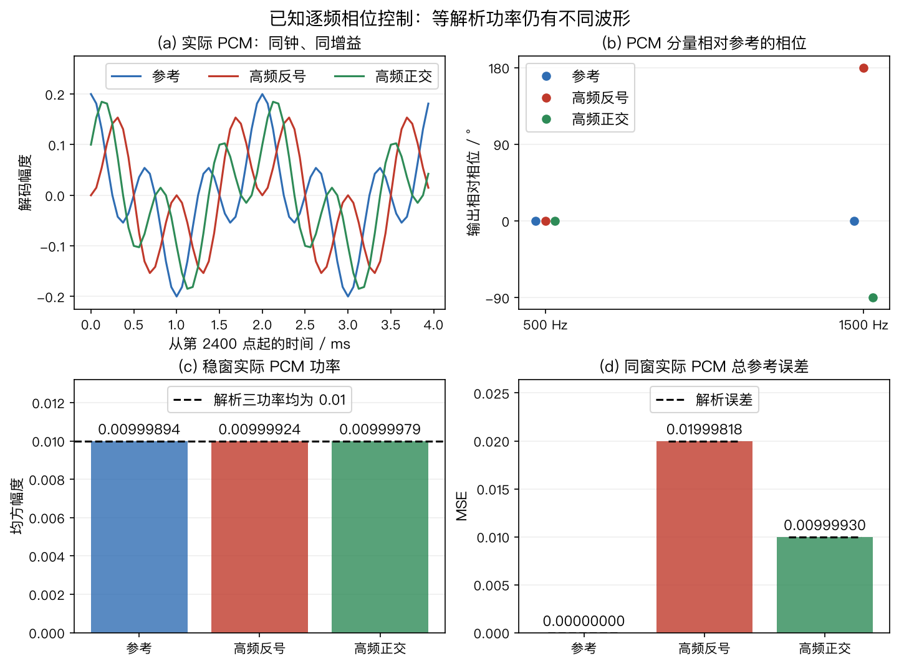

# 章节代码练习与音频实验

先按章节做手算，再运行对应脚本，最后听同一模型产生的音频。代码输出不是预填的答案表；程序从输入重新计算结果，回归测试另外保留手算、解析边界或已知模型作为判据。

本页索引 352 道带稳定编号的代码题，以及独立的真实录音练习 R01。`E01-01` 表示第 1 章的第 1 道代码题；附录 B 中另有按 1～17 编号的综合题，两套题号各自使用。

E06-07～E06-20 使用无量纲回声模型检查 AEC 的计算与边界，其中 E06-11～20 可用精确答案程序核对。第 15、16 节另提供参数不同的合成音频；试听文件本身不是题目真值。

第 3～11、13～16、18、21～30、32～34 节对应主清单的 109 个数学合成样本。第 17 节的 18 个房间白噪声合成样本使用独立清单；第 12 节使用另行授权的真实同步录音。第 31 节的 2 份从 PCM 形成定位观测的追踪样本也使用独立清单。第35～39节分别保存双耳、有限窗卷积、多频几何、已知聚焦与导数约束的独立样本。第48节保存分布式协同增强的17个独立样本；第47节保存成像的五个快拍样本。第46节另保存附录B同DRR短RIR的五个独立样本；第55节保存第5章逐频相位的三份独立PCM；第56节保存第6章已知播放增益与历史尾声的六份独立PCM；第57节保存第7章已知到达与历史索引的六份独立PCM。不同音频的来源和可作的比较不同，试听前先查看各节的条件。

主音频按章存放，统一由[生成器](../examples/generate_audio_samples.py)和[清单](../audio/MANIFEST.json)管理。清单记录每组模型、种子、共同导出增益、采样率、通道、帧数、量化误差、运行环境、源文件摘要与逐 WAV 摘要；不把某组的谐波模板套到其他组。PCM16 编码按最近偶数舍入，不加抖动或自动限幅，RMS 对全部通道与采样一起计算。运行生成器并附加 `--check` 时只在内存重算和读回比对，不重写资产；严格字节核对也比较 Python、NumPy 和平台记录，异机不通过不等于算法错误。生成中断造成清单与 WAV 不一致时，先保留异常目录，再生成到新的空目录核对，通过后更新受影响资产并构建图和网站；不要手改单个生成文件。样本没有真人录音或模型权重，客观读回和浏览器加载不等于正式听测。

[共享文件IO](../io_contracts.py)负责写入前的普通父目录、文件成员与严格JSON检查；各生成器继续负责自己的模型、清单结构和评分。已有非空目录须符合该资产的完整成员集合，重复键、非有限数值与把布尔值写成数值参数都会被拒绝。检查适用于本地非并发工作流，不把有限的写前检查当成并发文件系统安全保证。

## 1. 按章节运行

在仓库根目录执行，依赖沿用本书环境。E04-12会导入绘图脚本中的插值函数，因此还使用项目已有的Matplotlib；该调用不生成图片或写文件：

```bash
.venv/bin/python -m codes.chapters.ch09.chapter09_experiments
.venv/bin/python -m codes.chapters.ch10.chapter10_experiments
.venv/bin/python -m codes.chapters.appendix_a.appendix_a_experiments
.venv/bin/python -m codes.chapters.appendix_b.appendix_b_experiments
.venv/bin/python -m codes.chapters.appendix_b.examples.generate_response_audio --check
.venv/bin/python -m codes.chapters.ch09.examples.chapter09_tracking_audio --check
.venv/bin/python -m codes.chapters.ch08.chapter08_experiments
.venv/bin/python -m codes.chapters.ch07.chapter07_experiments
.venv/bin/python -m codes.chapters.ch06.chapter06_experiments
.venv/bin/python -m codes.chapters.ch01.chapter01_experiments
.venv/bin/python -m codes.chapters.ch02.chapter02_experiments
.venv/bin/python -m codes.chapters.ch03.chapter03_experiments
.venv/bin/python -m codes.chapters.ch05.chapter05_experiments
.venv/bin/python -m codes.chapters.ch04.chapter04_experiments
.venv/bin/python -m codes.chapters.ch00.cross_chapter.exercises_spatial
.venv/bin/python -m codes.chapters.ch00.cross_chapter.spatial_model_exercises
.venv/bin/python -m codes.chapters.ch00.cross_chapter.enhancement_structure_exercises
.venv/bin/python -m codes.chapters.ch00.cross_chapter.engineering_boundary_exercises
.venv/bin/python -m codes.chapters.appendix_b.interpolation_exercise
.venv/bin/python -m codes.chapters.ch00.cross_chapter.spatial_precision_exercises
.venv/bin/python -m codes.chapters.ch00.cross_chapter.enhancement_step_exercises
.venv/bin/python -m codes.chapters.ch00.cross_chapter.tracking_time_exercises
.venv/bin/python -m codes.chapters.ch00.cross_chapter.exercises_enhancement
.venv/bin/python -m codes.chapters.ch06.aec_algorithm_minicases
.venv/bin/python -m codes.chapters.ch06.aec_advanced_exercises
.venv/bin/python -m codes.chapters.ch06.aec_ipnlms_subband_demo
.venv/bin/python -m codes.chapters.ch06.aec_crossband_demo
.venv/bin/python -m codes.chapters.ch06.aec_rls_kalman_comparison
.venv/bin/python -m codes.chapters.ch00.cross_chapter.exercises_engineering
.venv/bin/python -m codes.chapters.ch09.tracking_crossing_dropout_demo
.venv/bin/python -m codes.chapters.ch10.spectral_subtraction_demo
.venv/bin/python -m codes.chapters.ch03.coarray_covariance_exercise
.venv/bin/python -m codes.chapters.ch04.doa_resolution_trials
.venv/bin/python codes/chapters/ch00/examples/generate_audio_samples.py --check
.venv/bin/python -m unittest discover -s tests -p 'test_codes*.py' -v
```

| 章节与题目 | 重点 | 代码入口 |
|---|---|---|
| 第 1 章 E01-01～10 | 相关噪声、幅度和功率、不等噪声方差、有限记录交叉项、残余时差、球头、混合分解、ILD/WNG与频率相关响应 | [空间练习](../cross_chapter/exercises_spatial.py)（01～03）；[基础逐步实验](../../ch01/chapter01_experiments.py)（04～10） |
| 第 2 章 E02-01～06 | 帧数、复协方差、边缘重建、有效权重、递推启动与整体权重缩放 | [空间练习](../cross_chapter/exercises_spatial.py) |
| 第 2 章 E02-09～20 | 球面与平面响应、三维 DI、EDC 与时轴、CRB、四点 STFT、样本中心化及完整卷积、已知激励辨识与跨帧一致性 | [声学模型逐步实验](../../ch02/chapter02_experiments.py) |
| 第 3 章 E03-01～07 | 差集重数、端射角误差、三维方位、近远场、复增益标定及物理协方差到虚拟协同阵 | [空间练习](../cross_chapter/exercises_spatial.py)（01～06）；[协同阵 E03-07](../../ch03/coarray_covariance_exercise.py) |
| 第 3 章 E03-08～18 | 精确波束宽度、完整相位歧义、平面镜像、后置噪声正则化、复增益最小二乘、互质洞、双麦差分、带噪参考、接近共面、多频相位、已知方向基线与固定延迟 | [几何与校准实验](../../ch03/chapter03_experiments.py) |
| 第 4 章 E04-01～09 | 延迟正号、相干源秩、栅瓣歧义、空间平滑、MDL、双源分辨率重复抽样与 ESPRIT 最小二乘 | [空间练习](../cross_chapter/exercises_spatial.py)（01～07、09）；[分辨率 E04-08](../../ch04/doa_resolution_trials.py) |
| 第 4 章 E04-12～25 | Nyquist插值、SRP直求和、PHAT平均顺序、ESPRIT基与分支、GN/GLS一步、CRLB、纯音歧义、聚焦噪声、AIC/MDL、多频秩、root-MUSIC多项式、相干反射假峰及人工CTF首比 | [定位逐步实验](../../ch04/chapter04_experiments.py) |
| 第 5 章 E05-01～05 | 秩一条件、MVDR 加载、输出残噪、复响应约束与有限干扰抑制 | [空间练习](../cross_chapter/exercises_spatial.py) |
| 第 5 章 E05-08～24 | GSC总体/快拍、Frost投影、Zelinski非负性、相干噪声反解、失配自消、GEV尺度、球谐秩、门控音频、非负掩码、导数与范数球约束、Souden参考、Bayes增益、逐频相位与通道掩码统计 | [波束逐步实验](../../ch05/chapter05_experiments.py) |
| 第 6 章 E06-01～20 | NLMS、分区卷积、子带交叉项及全交叉更新、IPNLMS 正则项、RLS 遗忘与批量核对、Kalman 双讲与协方差；另含回声模型边界 | [增强练习](../cross_chapter/exercises_enhancement.py)（01～06）；[AEC 小例](../../ch06/aec_algorithm_minicases.py)（07～10）；[进阶手算](../../ch06/aec_advanced_exercises.py)（11～20） |
| 第 6 章 E06-22～33 | 多参考共同分母与可辨识性、因果对齐、漂移、参考断流、NCC、先验评分、冻结、PSD、dB平均、归一化偏差和注入增量分解 | [AEC逐步实验](../../ch06/chapter06_experiments.py) |
| 第6章 E06-40～42 | 已知播放增益与卷积顺序、参考当前静音与纯回声尾声、三个实际PCM评分窗 | [逐样本控制](../../ch06/core/reference_timing.py)、[章节入口](../../ch06/chapter06_experiments.py)、[六WAV生成/核验](../../ch06/examples/generate_reference_audio.py)；完整展开见§56 |
| 第 7 章 E07-01～05 | 有效帧、复数预测、秩亏加载、离线因果性、WPD | [增强练习](../cross_chapter/exercises_enhancement.py) |
| 第 7 章 E07-08～21 | 复数拟合、功率约束、历史置换、秩、窗重叠、递推先验、MINT、资源、WPD加载与目标损伤音频、倒谱相位、设计求解及逆滤波噪声 | [WPE逐步实验](../../ch07/chapter07_experiments.py) |
| 第7章 E07-22～24 | 接收与源时刻、历史因果边界、T60功率单位与真实整数PCM控制 | [唯一数值核](../../ch07/core/prediction_delays.py)、[章节入口](../../ch07/chapter07_experiments.py)、[六WAV生成/只读核验](../../ch07/examples/generate_delay_audio.py)；逐步展开见§57 |
| 第 8 章 E08-01～07 | SI-SDR、排列、已知解混、回投影、掩码地板、跨块身份与 GSS 静音门控 | [增强练习](../cross_chapter/exercises_enhancement.py) |
| 第 8 章 E08-12～32 | 复数逐行IP、联合回投影、零参考、混合一致性、方向与功率、活动对称性、先验反例、NMF更新、欠定分解、合同对角化、相消掩码与CSS关联音频、白化反例、联合对角边界、雅可比、加权一致性、掩码表示、极性、投影次序、PCA/背景约束及连续增益 | [分离逐步实验](../../ch08/chapter08_experiments.py) |
| 第 9 章 E09-01～06 | 缺测、环绕、粒子、两类过程噪声、新息门控与交叉身份错配 | [增强练习](../cross_chapter/exercises_enhancement.py)（01～05）；[追踪交叉与限速](../../ch09/tracking_crossing_dropout_demo.py)（06） |
| 第 9 章 E09-10～26 | EKF一步、无迹矩、圆周歧义与正先验支持、JPDA方差、人数分布、OSPA/GOSPA、固定延迟平滑、单位换算、过程噪声及PCM观测追踪、相关观测、尺度歧义、存在概率与迟到观测 | [追踪逐步实验](../../ch09/chapter09_experiments.py)；音频独立见§31 |
| 第 10 章 E10-01～14 | 时钟、VAD、缓冲、期限、定点、增益、帧/字节、块适配、功率谱减与全链资源预算 | [工程练习](../cross_chapter/exercises_engineering.py)（01～12、14）；[谱减演示](../../ch10/spectral_subtraction_demo.py)（13） |
| 第 10 章 E10-18～27 | 重叠帧 RTF、谱减均值与地板、Q15、关键路径、时钟相位、内存寿命、流式插值、混叠、遥测与整块 AGC 音频 | [工程逐步实验](../../ch10/chapter10_experiments.py) |
| 第 11 章 E11-01～07 | 资源约束、失败率统计、WER 聚合、延迟分位数和三个场景选型决策 | [工程练习](../cross_chapter/exercises_engineering.py) |
| 第 11 章 E11-10～25 | 非支配候选、场景权重、评分缺失、同时风险、硬界三态、模块交互、CSS槽位、唤醒阈值、精确SRO、FIR取舍、非支持加权、区间支配、零FA暴露、话段/时间及跨场景选型 | [选型逐步实验](../../ch11/chapter11_experiments.py)；音频见§33与§44 |
| 附录 A E12-01～04 | 卷积、复二阶矩、秩亏最小二乘、空间白化与 PHAT 的区别 | [工程练习](../cross_chapter/exercises_engineering.py) |
| 附录 A E12-06～19 | 有符号 FFT 频点、复内积、分块卷积、相关符号、有限快拍秩、正规方程条件数、SDW 噪声零空间极限、加载尺度、复LS残差、已知噪声WLS、数值秩、共轭反序和 `eigh` 前提 | [附录 A 逐步实验](../../appendix_a/appendix_a_experiments.py)；音频见§34与§45 |
| 附录 B E13-01 | 同组共同增益与独立归一化 | [工程练习](../cross_chapter/exercises_engineering.py) |
| 附录 B E13-03～14 | 六位置配对、DRR与频响、T20、SRP相位和评分窗口、房间PCM、证据层级、TAC结构、幅度与时间尺度及同DRR输出 | [附录 B 逐步实验](../../appendix_b/appendix_b_experiments.py)；房间资产见§17，四题逐步答案与独立五WAV见§46 |

另有12道逐步练习，均保留原题编号并追加：

| 题号 | 输入到答案的关键步骤 | 执行入口 |
|---|---|---|
| E02-07、E04-10、E05-06 | 遗忘因子换成物理时间；TDOA闭合与共享参考误差；WNG对应的最坏失配响应界 | [空间精算](../cross_chapter/spatial_precision_exercises.py) |
| E06-21、E07-06、E08-08～10 | 批量无偏与在线扰动；WPE共享功率；AuxIVA一次IP更新；非负谱模型；SCM到波束权重 | [增强步骤](../cross_chapter/enhancement_step_exercises.py) |
| E09-07～08、E10-15、E11-08 | 两帧粒子先验；观测时间外推；VAD预卷/挂起的半开样本区间；零失败单侧风险界 | [时间状态](../cross_chapter/tracking_time_exercises.py) |

另有11道模型与边界题，接在原题序列之后：

| 题号 | 学习问题 | 运行入口 |
|---|---|---|
| E02-08、E04-11、E05-07、E12-05 | 单边频谱功率；有色噪声白化MUSIC；WNG反求加载；奇异协方差伪逆反例 | [空间模型](../cross_chapter/spatial_model_exercises.py) |
| E07-07、E08-11、E09-09 | WPD分解；cACG形状更新；IMM交互混合与模型间散布 | [增强结构](../cross_chapter/enhancement_structure_exercises.py) |
| E10-16～17、E11-09 | 同刻完成/到达的边界；ADC至DAC样本时间；配对符号检验 | [工程边界](../cross_chapter/engineering_boundary_exercises.py) |
| E13-02 | 线性分数延迟的逐频幅度误差与PCM验证 | [插值练习](../../appendix_b/interpolation_exercise.py) |
| E13-03～14 | 六位置合成房间、短向量解析边界、PCM分窗、假设证据卡、共享聚合、尺度保护与源谱加权 | [附录 B 逐步实验](../../appendix_b/appendix_b_experiments.py) |

各题的题干、代入、中间量、答案与解释边界写在对应章节。它们不增加算法种类统计，也不把确定性数值实验当作语音质量评测。

E03-06 用两次已知方向的窄带复谱比复算固定通道增益，再用方向未知的单次观测展示不可辨识性；题目与逐步答案见[第 3 章](../../../../chapters/03_array-geometry.md#e03-06)。E08-07 给固定混合权重和空间密度，复算恒活动背景类在全员静音时的后验，见[第 8 章](../../../../chapters/08_speech-separation.md#e08-07)。两题都是确定性数学输入，不附会成已测阵列标定或完整 GSS 分离音频；现有 109 个 WAV 不提供这两题的真值。

E03-07 从三只物理麦的位置 $\{0,1,3\}$ 和给定协方差出发，按有符号差分滞后平均，构造四阶虚拟 Toeplitz 矩阵；单快拍反例提醒读者，物理协方差半正定不保证填出的虚拟矩阵也半正定。题干、手算与限制见[第 3 章](../../../../chapters/03_array-geometry.md#e03-07)，可运行入口为[协同阵练习](../../ch03/coarray_covariance_exercise.py)。虚拟滞后不是四只独立采集麦克风。

E04-09 在[第 4 章 §4.6](../../../../chapters/04_doa-estimation.md#sec-4-6)先从两行子阵写出单源最小二乘正规方程，再用扰动后的第三个子空间分量核对旋转因子、残差和角度。理想向量给出 $30^\circ$、零残差；扰动向量给出约 $28.90^\circ$、残差范数 $0.1$。两个数字由明确给定的复向量计算，不是快拍数、SNR 或算法方差的实测结果。E04-08 已用 200 次独立双源复谱抽样比较 Bartlett、Capon 和 MUSIC；每种条件保留成功/失败计数与 Wilson 区间，见[第 4 章](../../../../chapters/04_doa-estimation.md#e04-08)与[脚本](../../ch04/doa_resolution_trials.py)。该结果只适用于固定的八麦窄带阵列、网格和源数条件。

E12-04 在[附录 A](../../../../chapters/12_appendix-symbols-math.md#sec-12-4)比较空间矩阵白化和 GCC-PHAT 的频谱相位加权：$R_{nn}=\operatorname{diag}(4,1)$ 时可取 $W=\operatorname{diag}(0.5,1)$，得到 $WR_{nn}W^H=I$，而导向矢量 $[1,1]^\top$ 要同步变为 $[0.5,1]^\top$。对一个复数互谱除以其模只得到标量相位，不能完成这项跨通道协方差变换。运行[工程练习](../cross_chapter/exercises_engineering.py)查看矩阵乘法输出。

E09-06 使用确定性角度观测：交叉帧两轨均预测 $40^\circ$，B 的 $39^\circ$ 先于 A 的 $41^\circ$ 输入。两种一对一配对的平方残差和均为 $2\ \mathrm{deg}^2$；指定并列规则产生两次身份错配，但未滤波观测集合的 OSPA 为 0。另从 $P_0=I$、$Q=\operatorname{diag}(0.1,0.01)$ 出发连续预测两次，角度方差为 $2.10$、$5.21\ \mathrm{deg}^2$；每秒最多转 $5^\circ$ 的控制角为 $25^\circ$、$30^\circ$。这些答案可由[独立测试](../../../../tests/test_codes_tracking_crossing_dropout.py)逐项复核，适用边界见[第 9 章练习](../../../../chapters/09_source-tracking.md#sec-9-6)；它没有语音或设备 WAV，不应借用追踪试听样本作身份真值。

E10-14 把六帧的服务时间、队列容量、内存与示意电池功耗放在同一预算中。平均 RTF 为 0.75，但六帧有三次超过 10 ms 期限；峰值 667.5 KiB、示意平均功耗 0.95 W，不能用平均吞吐合格推出尾延迟合格。E11-05～07 分别用圆阵间距、会议单路延迟和车载时钟偏移做“先硬约束后软指标”的具名候选筛选。输入与完整答案见[第 10 章](../../../../chapters/10_engineering-practice.md#sec-10-4-3)、[第 11 章](../../../../chapters/11_selection-guide.md#sec-11-6)及[工程练习代码](../cross_chapter/exercises_engineering.py)。这些数值是教学条件，不是设备验收。

## 2. 合成音频试听前的约定

第 3～11、13～16、18、21～30、32～34 节的 109 个样本均为本书数学合成，不是真人语音或实测房间。听到的谐波音、噪声和声像变化用于分辨计算操作，不能据此评价可懂度、语音自然度、识别准确率或真实设备性能。没有执行正式听音实验或给出 MOS。

每组文件共用一个增益，导出峰值不超过约 0.8；设备播放音量不由文件保证。请从低音量开始，不要为了听残差而立即把音量调高。播放器不自动播放，不做单个文件的响度匹配。

数值评分应读回 WAV，固定通道、参考、时段和时延。清单中的参考只对本组数学模型有意义。AEC 采用已知双讲时段冻结，不是检测器；分离采用已知矩阵求逆，不是盲分离；双声道声像不是阵列 DOA 真值。

[音频清单](../audio/MANIFEST.json) 给出逐文件哈希、幅度、量化误差及源码摘要。[生成器](../examples/generate_audio_samples.py)可重建全部文件；无须下载外部音频。

## 3. 对齐与平均

两通道接收同一调幅谐波复合音，通道 1 比通道 2 晚 3 个采样，即 187.5 μs。两通道独立噪声的标准差均为 0.07。正确对齐的输出将通道 2 延迟 3 个采样后平均；参考也延迟 3 个采样。

依次比较单麦、未对齐平均与对齐平均。先观察波形和误差，再听音色变化。评分排除开头 3 个采样，不能直接把未对齐输出相对延迟参考的误差全归因于噪声。模型没有麦克风指向性、空间相关噪声或 HRTF。

[延迟后的目标参考](../../ch01/audio/spatial_reference.wav)

[两通道阵列输入](../../ch01/audio/spatial_array.wav)

[单麦输入](../../ch01/audio/spatial_mic1.wav)

[未对齐平均](../../ch01/audio/spatial_unaligned.wav)

[对齐后平均](../../ch01/audio/spatial_aligned.wav)

对应 E01-01、E02-03、E04-01；进一步把两个独立噪声改成同一噪声，检查“麦数翻倍”的白噪声增益前提。

## 4. AEC 与已知双讲冻结

播放参考由固定噪声及合成谐波构成；回声路径只有第 0、12、24 个采样非零，系数为 0.7、−0.3、0.15。NLMS 长度 32，步长 0.4，从零权重开始。1.2～1.8 s 加入近端合成音，冻结版在这一已知区间停止更新，但继续输出残差。

比较两种残差时，分别看 0.6～1.1 s 的远端单讲和 1.2～1.8 s 的双讲。ERLE 只在前一区间计算，双讲段应另看近端损伤。不能把“残差更安静”直接当作近端语音保留更好；这里的冻结掩码来自合成真值，不能证明真实双讲检测有效。

[播放参考](../../ch06/audio/aec_far.wav)

[近端参考](../../ch06/audio/aec_near.wav)

[麦克风混合](../../ch06/audio/aec_microphone.wav)

[已知双讲冻结残差](../../ch06/audio/aec_frozen.wav)

[不冻结残差](../../ch06/audio/aec_unfrozen.wav)

对应 E06-01～03。真实 AEC 还涉及参考取点、时钟偏差和非线性；见 [Speex 官方回声消除说明](https://www.speex.org/docs/manual/speex-manual/node7.html)。此处只做确定线性模型实验，不引用挑战赛分数。

## 5. WPE 的预测与目标损伤

输入是干净谐波复合音加 40 ms、80 ms 两个副本，增益分别为 0.6、0.3。末尾补 0.25 s 零，保留全部有限回声尾部。这不是按 T60 标定的房间脉冲响应。

STFT 窗长 512、帧移 128，居中补边；离线 WPE 使用 4 个抽头、3 帧保护延迟和 3 次迭代。第一个有效回归帧为零基索引 6，之前频谱保持输入值。iSTFT 裁到含尾部的原始长度，不施加额外整体时移。

[无回声合成参考](../../ch07/audio/wpe_dry.wav)

[稀疏回声输入](../../ch07/audio/wpe_reverberant.wav)

[离线 WPE 输出](../../ch07/audio/wpe_output.wav)

对应 E07-01～03。先比较停音后的尾部，再检查有声段的谐波是否被压低。目标本身可预测时，WPE 也可能移除目标结构；输出功率下降不等于目标恢复更好。这里不以一个周期性样本评价真实语音去混响。

## 6. 已知矩阵解混

两个合成源使用不同基频。混合矩阵为 `[[1, 0.5], [0.2, 1]]`，行是麦克风、列是源；直接解线性方程恢复源。矩阵已知、无噪声、没有卷积混响，因此这只是检查排列和混合约定的代数基准。

[源 1](../../ch08/audio/separation_source1.wav)

[源 2](../../ch08/audio/separation_source2.wav)

[两通道混合](../../ch08/audio/separation_mixture.wav)

[已知矩阵恢复源 1](../../ch08/audio/separation_recovered1.wav)

[已知矩阵恢复源 2](../../ch08/audio/separation_recovered2.wav)

对应 E08-02～03。把矩阵第二行改得接近第一行并加入同量级噪声，检查逆变换的噪声放大。不能由无噪声可逆例子推出 AuxIVA 或神经分离在真实房间的表现。

## 7. 失真、低电平和丢帧

削波文件先放大 3 倍，在 ±0.3 截断，再除以 3；这里只补偿前级放大，不恢复被截去的信息。低电平文件乘 0.02 后直接量化成 PCM16。丢帧文件把 0.9～1.0 s 置零，不做丢包隐藏。

[原始合成音](../../ch10/audio/engineering_reference.wav)

[削波后返回原增益](../../ch10/audio/engineering_clipped.wav)

[低电平量化](../../ch10/audio/engineering_low_level.wav)

[100 ms 丢帧](../../ch10/audio/engineering_dropout.wav)

对应 E10-05、E13-01，也是 E10-06 增益控制题的失真反例材料，但不是该题 AGC 的输出。先用同一个播放音量比较；若为了检查量化误差而另行放大，必须注明新增增益，不再把该播放对照称为共同增益比较。

## 8. 双声道声像与真实方向

[等功率双声道声像移动](../../ch09/audio/tracking_pan.wav)

左右增益分别为 `cos(phi)` 和 `sin(phi)`，phi 从 0 变到 π/2，因此两通道平方和等于原信号平方。耳机中听到的左右移动由增益控制产生，不包含传播时延、头相关传递函数或房间变化，不能拿来测 DOA 跟踪误差。E09 的轨迹练习使用另行定义的角度观测与真值。

## 9. 相关噪声不会因重复采样而减半

两路目标已经对齐，权重各为 0.5。本组只改变噪声关系：独立版为两个独立生成的零均值高斯序列，同噪声版把第一路噪声原样复制到第二路。每路噪声标准差均为 0.07；随机种子为 20260923，时长 2 s，采样率 16 kHz。

独立情况下，平均噪声的总体方差为 $(0.07^2+0.07^2)/4=0.00245$；完全相同时为 $0.07^2=0.0049$。因此相对单麦的理论噪声功率改善分别为 3.0103 dB 和 0 dB。有限样本的前一个数值会波动，后一个对照则逐样本等于单麦。本书仿真不把一次随机实现当作普遍性能曲线。

[对齐目标参考](../../ch05/audio/correlation_reference.wav)

[单麦目标加噪声](../../ch05/audio/correlation_single.wav)

[独立噪声两路平均](../../ch05/audio/correlation_independent.wav)

[相同噪声两路平均](../../ch05/audio/correlation_common.wav)

对应 E01-01、E01-03。读回 PCM 后，逐文件减去同组参考，比较全段误差均方，不做时延或增益拟合。同噪声平均与单麦应完全相同；不要为了“听出不同”调高音量。这个例子没有定向干扰或弥散声场，不能替代 DI 测量。

## 10. 极性接反与目标抵消

两路无噪声、无相对时延的输入为 $x_1=s$、$x_2=-0.9s$。直接平均得到 $(s-0.9s)/2=0.05s$；已知第二路接反，先乘 −1 再平均得到 $0.95s$。错误输出相对纠正输出的电平为 $20\log_{10}(0.05/0.95)\approx-25.58$ dB。全部输出保留同一导出增益，未把安静的输出单独放大。

[极性实验目标参考](../../ch03/audio/polarity_reference.wav)

[一路接反的两通道输入](../../ch03/audio/polarity_array.wav)

[未纠正极性的平均输出](../../ch03/audio/polarity_uncorrected.wav)

[已知极性纠正后的平均输出](../../ch03/audio/polarity_corrected.wav)

对应 E10-09。双通道输入在播放器中按左右声道呈现，不等于算法平均，也不保证任何播放设备上都发生声学抵消；应比较两个单通道平均输出。这里已知故障位置，没有实现自动极性检测；实际幅相失配也未必能用一个负号修正。

## 11. 可逆矩阵也会放大噪声

参考文件两路分别是 173 Hz 和 293 Hz 基频的调幅谐波。两种已知矩阵为 `A₁=[[1,0.5],[0.5,1]]` 和 `A₂=[[1,0.99],[0.99,1]]`。在两组麦克风混合中加入完全相同的两路噪声，每路标准差 0.003，再分别求解各自矩阵。不交换输出排列，不拟合额外增益，输出第一、二路与参考第一、二路逐一比较。

对形式为 `[[1,a],[a,1]]` 的矩阵，两个正特征值是 $1+a$、$1-a$，所以二范数条件数分别是 3、199。恢复误差的第一路为 $(n_1-a n_2)/(1-a^2)$；第二路为 $(n_2-a n_1)/(1-a^2)$。因此接近 $a=1$ 时，两路小幅输入误差可以被明显放大。条件数是最坏方向的相对敏感度，不等于这个随机样本的 RMS 放大倍数。[NumPy `cond` 二范数定义](https://numpy.org/doc/stable/reference/generated/numpy.linalg.cond.html)

[两路原始源参考](../../appendix_a/audio/conditioning_reference.wav)

[条件数 3 的含噪混合](../../appendix_a/audio/conditioning_well_input.wav)

[条件数 199 的含噪混合](../../appendix_a/audio/conditioning_ill_input.wav)

[条件数 3 的已知矩阵恢复](../../appendix_a/audio/conditioning_well_output.wav)

[条件数 199 的已知矩阵恢复](../../appendix_a/audio/conditioning_ill_output.wav)

对应 E08-03、E12-03。参考、两种混合和两种恢复共用同一增益；强噪声恢复结果可能决定全组衰减量，实际值见清单。两路参考是源信号，两路输入是麦克风信号，不能因为都是双通道就直接逐路比较输入与参考。这个实验不是 AuxIVA、ILRMA 或神经分离的效果评测，也不能说明正则化一定无损。

## 12. R01：真实河流录音中的通道相关项

本节使用 Joachim Thiemann、Nobutaka Ito、Emmanuel Vincent 发布的 [DEMAND v1.0](https://zenodo.org/records/1227121) NRIVER 河流场景。官方音频及说明采用 [CC BY-SA 3.0](https://creativecommons.org/licenses/by-sa/3.0/)，本书摘录及派生音频沿用同一数据许可。详见随文件分发的[署名和修改记录](../../ch02/real_audio/ATTRIBUTION.txt)、[许可说明](../../ch02/real_audio/LICENSE.txt)及[完整清单](../../ch02/real_audio/MANIFEST.json)。这项数据许可不替代独立代码的许可。

16 只 Sony ECM-C10 由同一台采集设备同步记录，阵列四行交错，最近邻间距 5 cm，官方说明给出的安装误差约 ±2 mm。通道增益未经相互校准。本实验用上游从 48 kHz 重采样到 16 kHz 的版本，各通道固定摘取半开样本区间 `[0,160000)`，即前 10 s；没有从多个片段中按效果挑选。实际原文件为 4,800,064 帧，不能把约 300 s 的文字说明当作精确帧数。设备、几何及处理出处见[官方说明 §3～5](https://zenodo.org/records/1227121/files/DEMAND.pdf?download=1)。

**题目。** 保留原始通道次序、增益和直流分量，分别对通道 1～2、1～16 做零时延等权平均。比较实际数字功率与忽略通道交叉项后的预测。这里没有目标语音、干净参考或声源位置真值，不能计算语音增强 SNR、SI-SDR 或定位准确率。

**计算口径。** PCM 整数除以 32768 得到数字幅度，未中心化二阶矩为 $R_{ij}=T^{-1}\sum_n x_i[n]x_j[n]$。平均后的未量化功率是 $P_{\mathrm{mean}}=M^{-2}\sum_{i,j}R_{ij}$；删去非对角项后的预测为 $P_{\mathrm{diag}}=M^{-2}\sum_iR_{ii}$。它保留每路实际功率，因此不额外假设麦克风等增益；只有交叉项可忽略时，两种计算才一致。保留非零均值时，仅说“统计独立”不足以保证二阶交叉项为零。

全组导出增益为 1，不去均值、不时移、不逐文件归一化。平均结果按最近偶数舍入到 PCM16，再读回计算 $P_{\mathrm{PCM}}$；每个样本量化误差最多半个 PCM 整数单位。以下功率单位均为数字满刻度幅度平方，不是声压平方。

| 量 | 两通道 | 十六通道 |
|---|---:|---:|
| 对角预测 $P_{\mathrm{diag}}$ | $5.653225\times10^{-6}$ | $6.857479\times10^{-7}$ |
| 交叉项贡献 | $1.030489\times10^{-6}$ | $1.124068\times10^{-6}$ |
| 量化前均值功率 $P_{\mathrm{mean}}$ | $6.683714\times10^{-6}$ | $1.809816\times10^{-6}$ |
| WAV 读回功率 $P_{\mathrm{PCM}}$ | $6.683733\times10^{-6}$ | $1.809875\times10^{-6}$ |
| $10\log_{10}(P_{\mathrm{PCM}}/P_{\mathrm{diag}})$（dB） | 0.7272 | 4.2148 |

**答案解释。** 以两通道为例，对角预测加交叉项约为 $(5.653225+1.030489)\times10^{-6}=6.683714\times10^{-6}$，与直接求平均后计算的功率一致；WAV 读回的微小差别来自量化。两种通道数下，忽略交叉项都低估了这段录音的平均输出功率。16 通道结果不能用“独立白噪声随麦数增加而减小”直接解释。

相对通道 1，两个输出的数字功率分别变化约 −2.2566 dB、−7.9303 dB，但没有目标信号分量可供检验，因此这些数不是 SNR 增益。把同一录音切成十个连续 1 s 块后，相对对角预测的差分别落在 0.2521～2.3554 dB、2.2286～9.4000 dB；这是相邻子段的最小值到最大值，不是独立重复实验的置信区间。全段结果应先累积线性功率，再取对数。

[16 通道同步输入：供下载和程序分析](../../ch02/real_audio/demand_nriver_16ch_10s.wav)

[通道 1：试听对照](../../ch02/real_audio/demand_nriver_ch01_10s.wav)

[两通道零时延平均](../../ch02/real_audio/demand_nriver_mean02_10s.wav)

[十六通道零时延平均](../../ch02/real_audio/demand_nriver_mean16_10s.wav)

先调低播放音量，并用相同设备音量比较三个单声道文件。16 通道输入不依赖浏览器自动混音来验收；本书没有执行正式听音评价，也不以环境标签保证片段经过人工无语音听辨。

**复算。** 在仓库根目录运行 `.venv/bin/python codes/chapters/ch02/examples/prepare_real_recordings.py --check`，离线核对固定 PCM 摘要、派生 WAV、清单与全部指标；检查不重写文件。完整数据条件、逐块答案和显式下载/重建命令见[真实录音说明](../../ch02/real_audio/README.md)。原始归档约 98.7 MB，只保存在不进入 Git 的下载目录；本书纳入的四个 WAV 共 6,080,176 字节。

本节说明的是一个未校准真实阵列片段的二阶统计关系，不能外推为全部河流环境、任意阵列或语音算法的性能。资料与数据核实日期为 2026-09-22。

## 13. 非线性回声：基频拟合正确仍有残差

固定线性时不变滤波器在稳态下不能生成输入中没有的频率。Speex 官方回声消除说明的 Troubleshooting 段明确提醒，扬声器非线性失真不属于其线性自适应滤波器可表示的模型；Interspeech 2021 AEC Challenge 原文 §2.2 也在合成条件中单列非线性。下面用本书自行构造的三次模型复算这个限制，不复现挑战赛数据或成绩。[Speex 官方说明](https://www.speex.org/docs/manual/speex-manual/node7.html)、[挑战赛原文 §2.2](https://www.microsoft.com/en-us/research/uploads/prod/2021/08/245_Full-Paper.pdf)

**输入与口径。** 16 kHz 采样，$N=32000$，$n=0,\ldots,N-1$。播放参考是 $x[n]=0.4\sin(2\pi500n/16000)$，麦克风只有回声 $d[n]=x[n]+2x^3[n]$。没有近端、噪声、传播时延或随机输入；系数 2 对应本例的数字幅度单位，不是实测扬声器参数。分析全段半开区间 `[0,32000)`，不去均值、不加窗、不对齐或重拟合额外增益。

**计算。** 用 $\sin^3\omega=(3\sin\omega-\sin3\omega)/4$ 展开，得到 $d=0.496\sin\omega-0.032\sin3\omega$。这段恰含 1000 个基频周期，两项正交。全段最佳标量最小二乘拟合为 $\hat d=gx$，其中 $g=\sum xd/\sum x^2=1.24$；所以 $\hat d=0.496\sin\omega$，残差 $e=d-\hat d=-0.032\sin3\omega$。

| 量（量化前解析值） | 结果 | 怎样复算 |
|---|---:|---|
| 最佳拟合增益 | 1.24 | $0.496/0.4$ |
| 回声功率 | 0.123520 | $(0.496^2+0.032^2)/2$ |
| 残差功率 | 0.000512 | $0.032^2/2$ |
| 该无噪远端单讲段的 ERLE | 23.8247 dB | $10\log_{10}(0.123520/0.000512)$ |

功率以数字满刻度幅度平方为单位。表中使用未量化信号；PCM16 读回会有半个量化步长以内的逐样本舍入误差。四个 WAV 共用增益 1，没有把残差单独放大。图 36 从实际 PCM 读取前 8 ms 波形，以及全段 DFT 的 500 Hz、1500 Hz 单边峰值幅度；它们不是 PSD 或带参考的 dBFS 数值。

[500 Hz 播放参考](../../ch06/audio/nonlinear_reference.wav)

[三次非线性回声](../../ch06/audio/nonlinear_echo.wav)

[最佳标量线性估计](../../ch06/audio/nonlinear_estimate.wav)

[相减后的三次谐波残差](../../ch06/audio/nonlinear_residual.wav)

对应 E06-06；运行增强练习查看计算结果，再读回音频核对。先调低设备音量，以相同音量比较。本组没有淡入淡出，保留完整整数周期以核对正交分解；不拿播放起止边界评价听感。

这个例子不是 NLMS 收敛实验，也不是任意线性时变处理器的性能上限。对稳态单频输入，固定线性时不变滤波器只能改变同一频率的幅度与相位，不能消除这里独立的三次谐波；有限长滤波器的启动瞬态另当别论。非线性残余存在不代表必须使用神经网络，带已知非线性基函数的模型也可能表示它。真实宽带语音、时变路径、背景噪声和双讲仍需另外实验。资料核实日期：2026-09-22。

## 14. 四麦分数采样时差

这组音频对应第 4 章的 E04-07，不是把上一节双麦整数时差换个文件名。四麦均匀线阵的坐标为 $[0,0.04,0.08,0.12]$ m，正横为 $0^\circ$，固定方向 $30^\circ$，声速 343 m/s，采样率 16 kHz。相邻通道在该方向的到达时差为 $-58.3090\ \mu\mathrm{s}$，约 $-0.932945$ 采样点；第四麦相对第一麦早到约 $2.798834$ 点。为避免合成音频在时间零点前开始，合成器加了约 2 ms 的共同固定传播时延；该共同项不改变通道间时差。

输入是 383 Hz 的六谐波音，加一个标准差 0.04 的固定种子宽带序列；四通道再分别加标准差 0.02 的独立传感器噪声。种子为 20260924。模型在离散源序列上用线性插值实现分数点传播，越出 2 s 范围补零；对齐时又按已知几何做一次因果线性插值。导出采用一组共同增益，本次为 1；无单文件峰值匹配、增益拟合或时移拟合。它是可控的远场平面波练习，不是实测房间，也不包含方向估计误差。

| 文件 | 通道 | 作用 |
|---|---:|---|
| [无噪麦 1 参考](../../ch04/audio/fractional_reference.wav) | 1 | 包含固定传播时延，但没有传感器噪声 |
| [四麦输入](../../ch04/audio/fractional_array.wav) | 4 | 麦 1～4 按 $x$ 递增排列 |
| [直接平均](../../ch04/audio/fractional_unaligned.wav) | 1 | 不补偿通道间传播时差 |
| [几何对齐后平均](../../ch04/audio/fractional_aligned.wav) | 1 | 把麦 2～4 因果延迟到最晚的麦 1，再等权平均 |

**计算步骤。** 从 WAV 读回 PCM16 后，取 `[320,31680)` 样本，即 20～1980 ms。在该区间逐样本减去无噪麦 1 参考，平方后取平均。直接平均的数字均方误差为 $0.004222765$，几何对齐后为 $0.0000822202$，单位都是归一化数字幅度的平方。两数来自这一组固定噪声、固定插值与已知方位的实现结果，不能当成未知房间中算法的统计提升，也不能用它们推出主观语音质量。

**独立手算。** 仅取第六谐波 2298 Hz 并暂时去掉噪声和插值，四麦直接平均的理想幅度比为 $|\sin(2\phi)/(4\sin(\phi/2))|\approx0.607893$，其中 $\phi=2\pi(2298)(0.04\sin30^\circ/343)\approx0.841910$ rad；理想完全对齐时为 1。该单频幅度比不是上面的全频均方误差。运行 [`exercises_spatial.py`](../cross_chapter/exercises_spatial.py) 查看 `E04-07` 的几何、相量计算与随仓实际PCM误差，再运行[音频生成器](../examples/generate_audio_samples.py)的 `--check` 核对文件与参数清单。

浏览器可能会把四通道输入自动混成双声道，不能靠该自动混音判断每一麦的方位或时差。请用能查看独立通道的播放器或脚本读入四通道 WAV；试听单声道文件前先调低设备音量。这里真正可检验的结论是本模型下分数点对齐恢复了目标相干叠加，不是“四麦一定优于单麦”。

## 15. 同源短路径 AEC 的线性残差

这一组是第 6 章四类方法的**已知模型、单次合成**对照，不是自然语音或实际声学录音。采样率 16 kHz，长度 12000 点（0.75 s），参考由种子 20260925 的高斯序列（标准差 0.12）加 310 Hz 正弦（幅度 0.09）组成。前 6000 点采用四抽头路径 $[0.65,0,-0.2,0]$，从第 6000 点起改为 $[0.1,-0.45,0,0.5]$；麦克风还加独立的零均值高斯背景噪声，生成标准差 0.005。没有近端语音或双讲。

所有算法读相同的参考和麦克风序列，输出**每次更新前**的因果线性残差，没有另外的延迟或事后增益拟合。NLMS 与 IPNLMS 都用四抽头、步长 0.4；IPNLMS 取 $\kappa=0$。RLS 每样本遗忘因子为 0.995、初始正则量为 1；实数矩阵 Kalman 取状态转移 1、$Q=10^{-5}I$、$\Psi=0.0025$、初始 $P=I$。这些参数是教学演示的固定选择，不能由表中数字推断最优调参或工业排名。全部输入参数、导出共同增益和逐文件摘要见[清单](../audio/MANIFEST.json)的 `aec_methods` 组；本组实际共同导出增益为 1，不逐文件归一化。

| 文件 | 作用 |
|---|---|
| [播放参考](../../ch06/audio/aec_methods_reference.wav) | 所有算法共享的参考 |
| [已知真值回声](../../ch06/audio/aec_methods_true_echo.wav) | 仅用于受控评分；算法不读取它 |
| [麦克风输入](../../ch06/audio/aec_methods_microphone.wav) | 已知回声加背景噪声 |
| [NLMS 先验残差](../../ch06/audio/aec_methods_nlms_residual.wav) | 逐样本式(6-3) |
| [IPNLMS 先验残差](../../ch06/audio/aec_methods_ipnlms_residual.wav) | 逐样本式(6-11) |
| [RLS 先验残差](../../ch06/audio/aec_methods_rls_residual.wav) | 逐样本式(6-18) |
| [Kalman 先验残差](../../ch06/audio/aec_methods_kalman_residual.wav) | 短实数 FIR 的式(6-22)，不是完整 FDKF |

**评分口径。** 以下数字在量化前的 float64 序列上计算。令 $y$ 为已知回声、$d$ 为麦克风、$e_a$ 为算法 $a$ 的先验残差，则算法预测的线性回声为 $\hat y_a=d-e_a$；表中的误差是 $\operatorname{mean}_{n\in I}(y[n]-\hat y_a[n])^2$，单位为归一化数字幅度的平方。它排除了麦克风背景噪声真值，不能直接等同于播放 WAV 的残差功率。三段半开样本区间分别为 `[3000,6000)`、`[6000,6200)`、`[9000,12000)`；中间的 200 点单独检查突变后的短暂恢复。所有行是同一个随机实现、没有重复抽样或误差区间。数字保留约三位有效数；不能把条件不同的现有论文结果拼入此表。

| 方法 | 突变前误差均方 | 突变后前 200 点误差均方 | 后期误差均方 |
|---|---:|---:|---:|
| NLMS | $1.15\times10^{-5}$ | $4.84\times10^{-4}$ | $1.15\times10^{-5}$ |
| IPNLMS | $1.24\times10^{-5}$ | $4.81\times10^{-4}$ | $1.16\times10^{-5}$ |
| RLS | $2.60\times10^{-7}$ | $5.23\times10^{-3}$ | $1.90\times10^{-7}$ |
| 矩阵 Kalman | $4.50\times10^{-7}$ | $3.75\times10^{-3}$ | $3.50\times10^{-7}$ |

本例的 RLS 和 Kalman 在稳定窗口的线性回声误差较小，但以固定参数在突变后的 200 点内恢复较慢。IPNLMS 在这组四抽头路径上没有显示普遍领先；路径稀疏度、输入谱、各方法参数和窗口都会改变结果。表只支持**这一次、这些条件**下的对照。若要测双讲、长回声路径、子带滤波器组延迟或真实设备时钟漂移，需另建有相应真值与时序记录的实验；本组 WAV 不提供这些结论。试听前先调低音量，残差更安静也不是近端保真证据，因为本组根本没有近端语音。

## 16. 两带 Haar 的交叉项音频

第 6 章图37和 E06-11～12 的四点手算足以证明表示能力差异；本组把同一**一采样延迟模型**延长到 8000 点（16 kHz、0.5 s），便于检查音频和导出链。参考信号用独立种子 20260926 生成：标准差 0.12 的高斯序列加幅度 0.08、频率 2100 Hz 的正弦。真实路径固定为 $h=[0,1]$，负时间补零。没有近端、背景噪声、扬声器或房间测量。

本书的[两带代码](../../ch06/core/aec_subband.py)先计算精确当前/历史块 $2\times2$ 映射，再**直接删去已知矩阵的非对角项**形成受限模型。这不是运行并训练对角或全交叉子带 NLMS 后得到的输出，不能用其差额声称自适应子带 AEC 的残差或 ERLE。四个文件采用相同导出增益 1，没有逐文件峰值归一化：

| 文件 | 解释 |
|---|---|
| [播放参考](../../ch06/audio/aec_subband_reference.wav) | 两带分析前的时域输入 |
| [真实一拍回声](../../ch06/audio/aec_subband_true_echo.wav) | 精确交叉带模型合成后等于时域延迟 |
| [只保留同带项的模型输出](../../ch06/audio/aec_subband_diagonal_model.wav) | 直接删非对角项，不是训练后的自适应输出 |
| [缺失交叉项](../../ch06/audio/aec_subband_missing_cross_terms.wav) | 前两种模型输出相减，仅用于结构核对 |

在全部 `[0,8000)` 点、量化前 float64 值上，已知真回声与受限模型输出之差的均方为约 $0.008929$，真实回声本身的均方约 $0.017749$，单位为归一化数字幅度平方。两个数只是本次固定输入的代数结果；高频、块边界与同带/交叉带项的关系比一个总功率比更重要。实际工程子带滤波器组常使用更长原型和不同抽取率，其延迟、混叠与最佳对角近似均不能由本组推断。试听前先调低设备音量。

另一个[全交叉自适应演示](../../ch06/aec_crossband_demo.py)使用不同的无量纲合成输入：固定随机种子 20260923，2000 个标准正态块值各重复成两个时域样本；一拍延迟为真路径，先用 1500 块训练，后 500 块冻结权重。它的留出集全交叉残差均方在这组 float64 输出中为 0，对角残差约 $0.489674$；该数字不对应上表四个 WAV，也不是实机 ERLE。要试听**自适应**输出，必须从同一实验的参考、麦克风、估计与残差重新生成并保留统一导出增益，不能借用已知矩阵删项的文件。

## 17. 六位置房间响应与定位

这组样本对应[附录 B 第 16 题](../../../../chapters/13_appendix-guide.md)，与主清单的 109 个合成 WAV 分开保存。[参数和逐文件摘要](../../appendix_b/room_audio/MANIFEST.json)记录固定的 12 m × 10 m × 6 m 房间、4 麦方阵、16 kHz、pyroomacoustics 0.10.0、镜像阶数 40、每位置独立的 1 s 白高斯噪声和全部 18 个 PCM16 文件。

[六位置独立数值报告](../../appendix_b/room_audio/RESULTS.json)保留逐麦 T20 外推混响时间、DRR、SRP 估计、32/40 阶检查，以及运行源、结果图和音频清单的 SHA-256；报告剔除了耗时和临时输出路径。六个位置中四个用于近/远、左/右成对观察，另两个由种子 20260924 固定。定位时只取完整卷积波形起始半开区间 $[0,16000)$，即第一秒，再用 512 点 Hann 窗、128 点帧移和中心补零的 STFT 打分；四通道完整试听 WAV 保留更长的卷积尾，整份输入重新定位不能直接与报告方位比较。

三类音频使用**同一个**导出增益，约为 $0.15169690$（精确值见清单），不对源、直达或完整输出分别归一化，也不补偿传播延迟。直达文件与完整文件各含按清单顺序排列的四个麦克风通道。

| 声源位置 | 源（1 通道） | 仅直达（4 通道） | 完整房间（4 通道） |
|---|---|---|---|
| 近左，1 m、−30° | [源](../../appendix_b/room_audio/fixed_near_left_source.wav) | [直达](../../appendix_b/room_audio/fixed_near_left_direct.wav) | [完整](../../appendix_b/room_audio/fixed_near_left_full.wav) |
| 近右，1 m、+30° | [源](../../appendix_b/room_audio/fixed_near_right_source.wav) | [直达](../../appendix_b/room_audio/fixed_near_right_direct.wav) | [完整](../../appendix_b/room_audio/fixed_near_right_full.wav) |
| 远左，2.5 m、−30° | [源](../../appendix_b/room_audio/fixed_far_left_source.wav) | [直达](../../appendix_b/room_audio/fixed_far_left_direct.wav) | [完整](../../appendix_b/room_audio/fixed_far_left_full.wav) |
| 远右，2.5 m、+30° | [源](../../appendix_b/room_audio/fixed_far_right_source.wav) | [直达](../../appendix_b/room_audio/fixed_far_right_direct.wav) | [完整](../../appendix_b/room_audio/fixed_far_right_full.wav) |
| 种子位置 1，约 1.10 m、−41.24° | [源](../../appendix_b/room_audio/seeded_1_source.wav) | [直达](../../appendix_b/room_audio/seeded_1_direct.wav) | [完整](../../appendix_b/room_audio/seeded_1_full.wav) |
| 种子位置 2，约 1.97 m、+2.40° | [源](../../appendix_b/room_audio/seeded_2_source.wav) | [直达](../../appendix_b/room_audio/seeded_2_direct.wav) | [完整](../../appendix_b/room_audio/seeded_2_full.wav) |

先把源与仅直达输出的起点和电平关系看清，再比较同位置的完整房间尾部；多通道文件应逐麦读取，不依赖浏览器自动下混。由于白噪声并非语音，不从试听推断语音可懂度、自然度或 WPE/AEC 性能。

脚本用同长度、同高通边界的直达和完整 RIR 计算 DRR，并给出六位置实际仿真的 $T_{20}$ 外推 $T_{60}$ 与**前 1 s**音频的 SRP-PHAT 方位误差。逐步计算和边界解释见附录；用整份完整房间 WAV 定位会额外计入尾部，不能直接与报告表对照。可单独打开[三栏结果图](../../appendix_b/room_audio/ROOM_RESULTS.png)，其三幅量分别是四麦 DRR 中位数、外推混响时间中位数和方位绝对误差，不能跨量纲比较柱高。

这 18 个文件是**合成白噪声**，不是实测房间或真人录音。结果图和音频由[同一脚本](../../appendix_b/examples/room_srp_exercise.py)生成；在已安装锁定 pyroomacoustics 的隔离环境中可用 `--run --plot 新图路径 --audio-dir 新目录 --results 新结果路径` 重新导出，三个路径都必须尚不存在，再根据两个清单和结果报告核对摘要。站点副本由构建脚本按清单验证后发布，不修改主清单的 109 个 WAV。

E13-03 只比较同一房间内固定左右角度的近/远配对：按正文三位小数表相减，远位置的 DRR 各低 7.868 dB，绝对 DOA 误差各多 1°；按结果报告未舍入值相减，左右约为 7.868634271、7.868634299 dB，不能把两种精度混写。两个种子位置的距离增加而误差下降，故不能由六点推出单调关系或距离的独立因果效应。

E13-04 的四麦短例分别计算逐麦 DRR 的中位数和先合并能量的 DRR，并用两抽头 RIR 卷积展示直达/反射波形重叠时的交叉项。

E13-05 用三个已知 EDC 点复算 -100 dB/s 斜率与 0.6 s 的 T20 外推混响时间；这不是本房间 RIR 的测值。

E13-06 从双麦互谱正负相位与三个候选 SRP 分数检验符号；E13-07 只重读已发布的近左三路 PCM16，不重新仿真。源为 16000 点、单声道；直达和完整输出为 38497 帧、四通道。源与直达第 1 麦的相关峰在 87 样本，几何传播约 47.2 样本，差值包含 pyroomacoustics 固定长度 81 的分数时延滤波器约 40 样本偏置；不能把 87 点全当成空气传播。PCM 峰值和清单共同增益仍是不同层级的证据，只有清单与已运行的生成过程能解释后者。

E13-08 的 A/B/C 三条**假设**证据卡分别到已核来源、固定输入执行、同协议评分，不能当作本书新增三次上游实跑。E13-09 对六份已发布完整房间 PCM 逐一比较前 1 s 与整份输入的 SRP 方位，定位差异是评分窗口变化，不能归因于算法准确率变化。E13-10 用同能量但不同符号的两条短反射 RIR 说明 DRR 相同并不保证频率响应相同。[代码入口](../../appendix_b/appendix_b_experiments.py)与[独立测试](../../../../tests/test_codes_appendix_b_experiments.py)逐项列出这些边界。

E13-11～14进一步核对共享通道聚合、DRR数值尺度、T20时间条件化与同DRR源谱加权；四题完整答案及五个独立短FIR输出见[§46](#sec-u-a6996550c6)。

## 18. 功率谱减、谱地板与残留

这组对应[第 10 章 §10.3.2](../../../../chapters/10_engineering-practice.md#sec-10-3-2)和 E10-13。采样率 16 kHz、时长 2 s；目标是 173 Hz 基频的六谐波合成音，最初 0.4 s 静音，起音使用 20 ms 平滑。种子 20260927 产生标准差 0.07 的独立白高斯噪声。它不是语音、真实环境噪声或经声压校准的录音。

生成器使用 512 点周期 Hann 窗、128 点帧移、居中 STFT 和加权重叠相加。已知前 0.4 s 只有噪声，取完全落在此前奏内的 47 帧（帧索引 2～48）逐频点平均 $|Y|^2$，得到固定噪声功率估计。功率谱减的超减系数为 1；地板分别为观测功率的 0 和 0.04，保留带噪复谱的相位。这里的“噪声专用”区间由合成真值指定，不含自动语音检测或在线噪声跟踪。五个 PCM16 文件使用同一个导出增益 1，不做时移或逐文件电平匹配；完整参数、摘要和量化误差见[音频清单](../audio/MANIFEST.json)的 `spectral_subtraction` 组。

| 文件 | 听与算的对象 |
|---|---|
| [无噪目标](../../ch10/audio/spectral_clean.wav) | 前 0.4 s 为零，供差值计算的已知数学参考 |
| [独立噪声](../../ch10/audio/spectral_noise.wav) | 固定种子的噪声真值；谱减函数本身不读取它 |
| [带噪输入](../../ch10/audio/spectral_noisy.wav) | 目标加噪声，前奏用于估计固定噪声谱 |
| [4% 谱地板输出](../../ch10/audio/spectral_floor04.wav) | $\beta=0.04$，保留正功率频点至少 0.2 的幅度增益 |
| [零谱地板输出](../../ch10/audio/spectral_floor00.wav) | $\beta=0$；比较稀疏残留或音色变化，不能凭听感排总体名次 |

先用 E10-13 的单频点手算核对 $D=4$、两个扣噪功率 $5$ 与 $-3$，再运行 [`spectral_subtraction_demo.py`](../../ch10/spectral_subtraction_demo.py)核对输出功率 $5$ 与 $0.04$。随后读取五个 WAV，在 `[0,6400)` 前奏上比较同增益数字 RMS：本次固定随机样本约为带噪 $0.06974$、4% 地板 $0.04037$、零地板 $0.03806$。这些值属于这一组有限长度、一个随机种子的样本，不是多次实验的均值；地板较低导致残留功率较低也不证明语音更清晰。后 1.6 s 则要同时听目标音色与残留，不能只比较静音段能量。

零地板可把若干时频格压到零，可能留下听起来颗粒化的“音乐噪声”；固定谱地板缓和深度抑制，也会保留更多噪声。该现象的原始方法依据是 [Boll 1979，IEEE TASSP，式(2)～(5)](https://doi.org/10.1109/TASSP.1979.1163209)；本组只展示一个教学配置，没有正式听测。MMSE-STSA、MMSE-LSA、WebRTC NS 或 RNNoise 的噪声估计、统计目标与控制状态均不同，不能把这些 WAV 当作它们的运行结果。主清单统一索引 109 个 WAV，各组的条件与文件摘要见[参数清单](../audio/MANIFEST.json)。

## 19. 活动导引的 GSS 教学链：五个独立样本

[独立清单](../../ch08/gss_audio/MANIFEST.json)记录 2 s、16 kHz、固定种子的两源双麦数学合成输入、共同导出增益、音频摘要及 SI-SDR 评分区间；[中间状态](../../ch08/gss_audio/STATE.npz)保存活动、后验掩码、空间协方差和权重。五个 WAV 不计入主清单的 109 个。依次比较[第一路源](../../ch08/gss_audio/source_1.wav)、[第二路源](../../ch08/gss_audio/source_2.wav)、[双麦混合](../../ch08/gss_audio/mixture.wav)、[正确活动输出](../../ch08/gss_audio/enhanced_correct.wav)与[目标全漏标输出](../../ch08/gss_audio/enhanced_missed.wav)。

这一组的去均值 SI-SDR 在参考麦为 1.28 dB，正确活动输出为 13.76 dB；目标全漏标时按代码约定旁路回参考麦。它只显示给定合成模型和外部活动标签的处理链能运行，以及活动错误会破坏目标输出。无混响输入中 WPE 旁路；官方 CuPy/Lhotse GPU-GSS 与 CHiME 语料均未运行，不把这组数字当作原论文复现成绩。公式、完整条件和失效边界见[第 8 章 §8.4.5](../../../../chapters/08_speech-separation.md#sec-8-4-5)及[源码](../../ch08/examples/gss_teaching_demo.py)。

## 20. 自由场移动声源：三路独立样本

三个文件共用导出增益，保存声源线性轨迹、每10 ms的方位和同一发射事件的双麦传播时差真值、迟滞方程数值残差及文件摘要，不计入主109个样本。三个试听控件、独立真值清单和完整复算条件统一见[§31.5](#sec-31-5)。

这里的双麦差异来自传播距离与传播时差，而[第 8 节的声像移动](../../ch09/audio/tracking_pan.wav)仅调左右增益。自由场模型没有反射、头部传递函数、麦克风指向性或设备时钟偏差；源信号是合成纯音，不是真人语音。试听只能帮助定位模型差异，角度与 TDOA 要按清单和[第 9 章 §9.5](../../../../chapters/09_source-tracking.md#sec-9-5)的公式、代码计算，不能由左右声像直接判断定位误差。

## 21. 起点对齐以后，采样时钟仍会逐渐失步

两只理想共址麦克风记录同一个连续信号：500 Hz 与 1500 Hz 正弦各为幅度 0.18，时长 8 s，两端用20 ms线性淡入淡出。没有传播时差、噪声或房间反射，唯一改变是采样时钟。第一路每秒取16000点，第二路每秒取16001.6点，即快100 ppm；两路从同一物理时刻开始。

把两个序列都标作16 kHz、按相同索引相加，就把不同物理时刻的声音当成同时到达。第 $n$ 点分别对应 $t_1=n/16000$ 和 $t_2=n/16001.6$。令 $\epsilon=10^{-4}$，则时间差为

$$
t_1-t_2=\frac{\epsilon}{1+\epsilon}t_1.
$$

这里正差表示相同索引下第二路实际采样更早。名义时间4 s时，差为0.399960 ms，即6.399360个名义采样；8 s端点的解析差为12.798720个采样，文件最后一点位于8 s之前。不能把同索引时间差与“同一物理时刻累计多采了多少点”的 $f_s\epsilon t$ 精确公式混写，二者的时间变量不同。

对淡入淡出之外的单频成分，用和差化积可独立核对双路均值：

$$
\frac{\sin(2\pi f t_1)+\sin(2\pi f t_2)}2
=\sin\!\bigl(\pi f(t_1+t_2)\bigr)
 \cos\!\bigl(\pi f(t_1-t_2)\bigr).
$$

前一项是振荡，后一项改变幅度。1500 Hz的第一个包络零点满足时间差 $1/(2f)=0.333333$ ms，对应名义时间约3.333667 s；500 Hz要约10.001 s才到第一个零点，因此8 s文件内不会发生该低频成分的首次完全抵消。输入目标未变，输出音色和能量却随时间变化。图40把解析单频包络与实际双音PCM的分块功率分开显示。

[共同时钟目标参考](../../ch10/audio/clock_reference.wav)

[两个时钟的双通道输入](../../ch10/audio/clock_array.wav)

[按相同索引直接平均](../../ch10/audio/clock_index_mean.wav)

[理想共同时钟平均目标](../../ch10/audio/clock_oracle_mean.wav)

四文件共用增益1，量化为PCM16；不做输出响度匹配。最后一个文件由已知连续信号在共同时刻重新求值得到，与参考一致。它给出补偿器应追求的理想目标，没有运行时钟估计或实际重采样，不能被记为补偿算法的性能。

生成入口为[音频源](../core/audio_samples.py)的 `clock_drift_case`；独立和差化积与PCM误差检查见[测试](../../../../tests/test_codes_clock_audio.py)。实际连续重采样需保存分数相位、滤波历史、消费/产出计数及末尾排空状态，见[第10章](../../../../chapters/10_engineering-practice.md#sec-10-2)和[工业接口实验](04_source_reproduction.md)。

## 22. 线性分数延迟的幅度失真

四文件使用16 kHz、2 s、500/6000 Hz等幅双音和两端20 ms线性淡入淡出。理想输出按连续信号直接求半采样/一采样时刻；实际插值器用[0.5,0.5]一次或两次因果卷积，历史初值为零。全部共用导出增益1，不分别匹配峰值或响度。

[理想半采样延迟](../../ch02/audio/interpolation_ideal_half.wav)

[一次线性半采样插值](../../ch02/audio/interpolation_linear_half.wav)

[理想一采样延迟](../../ch02/audio/interpolation_ideal_one.wav)

[两次线性半采样插值](../../ch02/audio/interpolation_linear_twice.wav)

先分别比较前两项、后两项，保持设备音量相同。不要把半采样与一采样输出直接逐点相减后把全部误差解释为幅度损伤；它们的目标时延不同。6000 Hz经一次/两次插值的理论幅度比分别为0.382683、0.146447，500 Hz则为0.995185、0.990393。推导、脉冲反例和图41见[附录B E13-02](../../../../chapters/13_appendix-guide.md#e13-02)。

[运行入口](../../appendix_b/interpolation_exercise.py)在[1600,30400)采样区间逐频投影，输出解析幅度和PCM读回值；[独立测试](../../../../tests/test_codes_interpolation.py)用卷积、三角恒等式和量化界核对。没有时钟估计或真实录音，理想目标也不计作已运行补偿器；源文件说明和每个WAV摘要见[主清单](../audio/MANIFEST.json)。

## 23. 相差一个采样的目标平均

对应第 1 章 E01-05。两个通道只有同一个目标，第二路比第一路晚一个采样；没有噪声。输入为 16 kHz、2 s 的 1000 Hz 与 4000 Hz 等幅双音，每个分量幅度为 0.18，两端各有 20 ms 线性淡入淡出。源模型、通道次序和评分区间保存在[主清单](../audio/MANIFEST.json)，生成函数为[音频源](../core/audio_samples.py)中的 `alignment_error_case`。

[延迟一采样的目标参考](../../ch02/audio/alignment_reference.wav)

[双通道输入：第二路晚一采样](../../ch02/audio/alignment_array.wav)

[没有对齐就平均](../../ch02/audio/alignment_unaligned.wav)

[把第一路延迟一采样后平均](../../ch02/audio/alignment_aligned.wav)

一采样为 62.5 μs。没有对齐时，平均后的两个分量幅度分别乘以 0.980785 与 0.707107，电平变化约为 −0.169 dB 与 −3.010 dB；因此同一次时间错位会对高频造成更大的损失。补偿后的输出与参考相同，四个文件共用导出增益 1，不逐文件归一化。

幅度检查使用半开区间 `[1600,30400)`，避开淡入淡出及启动补零，在各自频率上作复指数投影。未对齐平均带有半采样的公共相位延迟，正确对齐后公共延迟为一采样；不能直接把两个输出逐点相减的误差全部解释成幅度损失。

本题观察目标自身的相消，没有噪声分量，因此上述 dB 不是 SNR 改善量。补偿量来自已知真值，没有运行方向或时延估计器。试听可以帮助感知音色变化，不能代替幅度计算，也不构成人体双耳或设备实验。计算入口为[基础逐步实验](../../ch01/chapter01_experiments.py)，独立半角公式和 PCM 量化检查见[测试](../../../../tests/test_codes_chapter01_experiments.py)。


## 24. 分开比较衰减时间与直达混响比

对应第 2 章 E02-11。四个文件均为本书数学合成的 16 kHz、PCM16、单声道 2.5 s 音频。共同输入是种子 2026092801 的高斯噪声，乘以 0.08，在半开区间 [2400,8800) 取非零值，两端各用 160 点线性淡入淡出。参考也延迟 192 点，即 12 ms，与全部条件的直达分量对齐。

[延迟对齐的干参考](../../ch07/audio/room_decay_dry.wav)

[短衰减，RIR 的 DRR 为 0 dB](../../ch07/audio/room_decay_short_drr0.wav)

[长衰减，RIR 的 DRR 为 0 dB](../../ch07/audio/room_decay_long_drr0.wav)

[长衰减，RIR 的 DRR 为 6 dB](../../ch07/audio/room_decay_long_drr6.wav)

三条响应都含幅度 1 的直达脉冲；随机尾从响应的 32 ms 开始，比直达晚 20 ms，持续 1.2 s。尾部先用同一组种子 2026092802 的高斯序列乘指数幅度包络，再整体缩放到指定能量。指数为 $-3\ln(10)n/(f_sT)$，其中 $n$ 从尾起点计数、$T$ 是名义衰减时间。这样幅度在 $T$ 秒后降为千分之一，平方包络降为百万分之一；单次随机尾及总响应的实测阈值仍须另外计算。

| 条件 | 名义 $T$（s） | 尾部能量 | RIR 的 DRR（dB） | 总 EDC 首次 −60 dB：绝对/直达后（ms） | 尾 EDC：尾起点后（ms） |
|---|---:|---:|---:|---:|---:|
| 短尾、0 dB | 0.2 | 1 | 0 | 221.7500 / 209.7500 | 199.6875 |
| 长尾、0 dB | 0.6 | 1 | 0 | 599.6250 / 587.6250 | 600.6250 |
| 长尾、6 dB | 0.6 | 0.251189 | 6 | 562.1875 / 550.1875 | 600.6250 |

EDC 是对响应平方从末尾反向求和后除以总能量，表中读数为首次达到 $10^{-6}$ 的采样；时间分辨率为 0.0625 ms，表格保留四位小数以准确表示该离散采样网格。第三行与第二行采用完全相同的尾部形状，只缩小幅度，因此尾部自身归一化 EDC 不变，而含直达能量的总 EDC 阈值改变。短尾与长尾的 DRR 相同，也不表示尾声持续时间相同。

先比较短尾和长尾的 0 dB 条件，再比较两个长尾条件。三条件共用输入和随机尾，不是三次独立随机试验。此模型没有墙面、方向、多麦传播或实测噪声底，不是物理房间模型；名义 $T$ 与单次阈值也不是 ISO 标准测量结果。

输出使用补零后的完整线性卷积，保留的 40000 点包含全部非零尾声。直达、尾部和总输出能量在该完整区间计算，必须包含两分量的交叉项；不能把 RIR 的 DRR 当作有限长度源输出的精确能量比。四路共同导出增益为 1，没有逐文件归一化或估计时延、增益补偿。表中值来自量化前的响应，试听文件为 PCM16；没有执行正式听音实验。

生成函数 `room_decay_case`、输入/响应摘要与精确参数见[音频源](../core/audio_samples.py)和[主清单](../audio/MANIFEST.json)。[逐步实验](../../ch02/chapter02_experiments.py)另给五点响应的有理数手算；[独立测试](../../../../tests/test_codes_chapter02_experiments.py)用时域卷积、尾部支持区间和缩放不变性核对生成器。


## 25. 双麦差分的增益失配与理想校正

对应第 3 章 E03-14。四个文件均为本书数学合成音频，16 kHz、PCM16、2 s，包含一个双声道阵列输入和三个单声道输出。它们共用导出增益 1，不单独放大后方残差。请保持相同的低设备音量比较，不自动播放；没有进行正式主观听测。

[双通道输入：后路增益为 1.01](../../ch03/audio/dma_calibration_array.wav)

[理想目标差分参考](../../ch03/audio/dma_calibration_target.wav)

[未校正增益的差分输出](../../ch03/audio/dma_calibration_mismatch.wav)

[用已知增益校正的差分输出](../../ch03/audio/dma_calibration_corrected.wav)

两个理想全向麦前后相隔 1 cm，声速为 343 m/s，所以麦间传播时间为 $\tau=0.01/343$ s，即 29.1545 μs、0.466472 个采样。共同基准传播延迟 $b=2$ ms。前方源 $F(t)$ 是幅度 0.25、1000 Hz 的正弦，在 0.1～0.7 s 激励；后方源 $Q(t)$ 是幅度 0.25、1600 Hz 的正弦，在 0.9～1.5 s 激励。两源各有 10 ms 的线性淡入淡出，区间外为零；正弦相位均取 $2\pi ft$。源时间、接收时间和评分区间分别记录在清单中。

麦 1 在前，麦 2 在后且多出 1% 增益。连续时间的接收模型是

$$
\begin{aligned}
x_1(t)&=F(t-b)+Q(t-b-\tau),\\
x_2(t)&=1.01\,[F(t-b-\tau)+Q(t-b)].
\end{aligned}
$$

程序直接在所需时刻求上述连续正弦及包络，再以 16 kHz 采样。它没有先把 WAV 输入送入某个分数延迟滤波器；因此这里的精确时间移位是信号模型，不是数字延迟器实现精度的结果。

未校正输出为 $y_u(t)=x_1(t)-x_2(t-\tau)$。先将麦 2 除以已知的 1.01，再作同样的时间移位与相减，得到校正输出。理想目标参考保留真实差分幅度和相位：

$$
y_{\rm ref}(t)=F(t-b)-F(t-b-2\tau).
$$

该参考不是原始前方正弦。差分器本身会衰减前方信号，并改变其相位；不能另作峰值归一化来隐藏这一变化。

对前方稳态 1000 Hz，令 $p=2\pi\times1000\tau$。理想目标的幅度比为 $2\sin p=0.364321$，失配输出为 $|1-1.01e^{-2\mathrm jp}|=0.366275$。乘以源幅度 0.25 后，两者分别约为 0.0910802 和 0.0915686。

对后方单独激励，两路经过补偿延迟后严格对齐；未校正差分的幅度比为 $|1-1.01|=0.01$，因此后方残余幅度为 $0.25\times0.01=0.0025$。相对单麦后方输入，这是 −40 dB；它与前方归一化波束图的零陷电平分母不同，也不是信噪比改善量。本例没有添加噪声。

| 稳态区间 | 理想目标参考幅度 | 未校正幅度 | 真值校正幅度 |
|---|---:|---:|---:|
| 前方 1000 Hz，[2400,10400) 点 | 0.0910802 | 0.0915686 | 0.0910802 |
| 后方 1600 Hz，[15200,23200) 点 | 0 | 0.0025000 | 0 |

表中是连续模型采样后、PCM16 量化前的复指数投影结果，两个评分段都长 0.5 s，避开传播起止与包络。数字零表示理想模型零响应；浮点校正与目标参考的最大差约 $2.8\times10^{-17}$，导出后两个 PCM 文件字节相同。PCM 量化误差另按半个最低有效位检查，不把浮点残差当作真实设备零陷深度。

实际重读已发布的 PCM16 文件后，在相同区间重新作复指数投影，得到下表。每段均为 8000 点；此处的幅度是采样后单频投影的估计值，分开列出量化前后的结果，不能把约 $10^{-6}$ 的变化解释成设备测量精度。

| PCM 重读稳态区间 | 理想目标参考幅度 | 未校正幅度 | 真值校正幅度 |
|---|---:|---:|---:|
| 前方 1000 Hz，[2400,10400) 点 | 0.0910787 | 0.0915694 | 0.0910787 |
| 后方 1600 Hz，[15200,23200) 点 | 0 | 0.0024974 | 0 |

这一实验解释“目标听起来变化很小，后方抑制却已受失配限制”的原因。已知增益校正不等于已估计出实际麦克风误差；真实设备还需要处理通道噪声、频率相关增益、延时误差、反射与壳体散射。生成函数 `dma_calibration_case` 见[音频源](../core/audio_samples.py)，[第 3 章实验入口](../../ch03/chapter03_experiments.py)给出两段的独立频率投影；[测试](../../../../tests/test_codes_chapter03_experiments.py)用和差化积、后方幅度残差、共同增益和 PCM 读回验证。

## 26. 纯音的时差歧义与宽频相位约束

第 4 章 E04-18 使用 `doa_ambiguity` 组的两个双声道文件：`doa_ambiguity_tone.wav` 是 2000 Hz 纯音，`doa_ambiguity_broadband.wav` 是 365 个频率分量组成的宽频多正弦。二者均为数学合成的等幅自由场来声，长 2 s、16 kHz；没有真实录音、混响或附加噪声，也没有主观听音评价。两个文件共同导出增益为 1，没有逐文件峰值归一化。

令参考源为 $s[n]$。文件中的第一通道为 $x_1[n]=s[n-2]$，第二通道为 $x_2[n]=s[n]$，所以 $\tau_{12}=2/16000=125\,\mu\mathrm s$。负下标补零；保留前 32000 点。两源在延时前均施加 320 点平方正弦淡入与淡出，端点包含在包络中。因此有限文件的起止形状包含额外线索，不能把全文件 GCC 只出现一个最大值解释成稳态纯音已经全局可辨。

设双麦间距 $d=0.2$ m、声速 $c=343$ m/s，时差的物理范围为 $|\tau_{12}f_s|\le9.329446$ 点。2000 Hz 的周期是 8 点，$+2$ 点和 $-6$ 点都在该范围内，且稳态跨通道相位相同。按本书正横角约定，两者分别对应 $12.379^\circ$ 和 $-40.025^\circ$。

宽频文件不是连续白噪声。生成器取长度 1024 的实数逆 FFT，在正频率格 $k=20,\ldots,384$ 上设置单位模复谱，其相位来自种子 2026092804 的 PCG64 均匀随机流；其余频率格为零。对该周期信号乘 $0.2\sqrt{1024/2}$，周期重复后加包络。365 个频率覆盖 312.5～6000 Hz，间隔 15.625 Hz；纯音的幅度为 0.2。二者具有不同波形和能量，不能凭播放响度比较定位好坏。

评分仅使用 [8192,9216) 点的一个完整稳态周期，矩形窗、1024 点 FFT。纯音只取 $k=128$，宽频只取实际激励的 365 个频率格。先对每个格的 $X_1X_2^*$ 归一化，再乘候选时差对应的相位补偿，最后取实部平均。这是指定频率集合的相位一致性分数，不是方向概率，也不把量化产生的其他频率格当作已知声源频率。

| 候选时差 | 纯音稳态评分 | 宽频多正弦评分 |
|---|---:|---:|
| −6 点 | 1.000000 | −0.044267 |
| +2 点 | 1.000000 | 1.000000 |

宽频的错误候选可独立写为 $365^{-1}\sum_{k=20}^{384}\cos(\pi k/64)$，约为 −0.0442767764。这个结果说明不同频率共同约束可以排除纯音的一组周期别名；它不证明任意多源、噪声或混响条件都能可靠定位，也不消除几何镜像等另一类歧义。

[实验入口](../../ch04/chapter04_experiments.py)直接读回内存中真实编码的 PCM16 字节，重新计算上述评分。两个通道保持严格整数移位关系，因此选定稳态频率的补偿相位在量化后仍成立，表中评分在浮点误差内不变；这不表示量化没有改变波形。纯音与宽频文件的最大绝对量化误差分别约为 $1.5181\times10^{-5}$、$1.5254\times10^{-5}$，均不超过半个最低有效位 $1/(2\times32768)$。[独立测试](../../../../tests/test_codes_chapter04_experiments.py)另用等比级数、物理时差范围、PCM 通道逐点移位和半量化步长验证。

听音时可比较纯音与多正弦的频谱丰富程度，但普通耳机播放两个通道并不是阵列定位实验。这里没有计算 SNR 改善量、实际算法错误率或可听辨识阈值。

先调低播放音量。

[纯2 kHz双通道音频](../../ch04/audio/doa_ambiguity_tone.wav)

[宽频多正弦双通道音频](../../ch04/audio/doa_ambiguity_broadband.wav)


## 27. GSC 目标泄漏与更新冻结

第39节另有E05-18～22的约束、参考与概率复算，以及四个独立三麦PCM文件。

第 5 章 E05-16 使用 `gsc_gate` 组，展示一次实际执行的逐样本自适应处理：阻塞支路漏入目标后，继续最小化输出功率会发生什么。四文件均为 2 s、16 kHz，组内共同导出增益为 1；没有逐文件归一化、真人语音、真实录音或主观听测。先调低播放音量。

[目标参考](../../ch05/audio/gsc_reference.wav)

[双声道输入](../../ch05/audio/gsc_array.wav)

[持续更新 GSC 输出](../../ch05/audio/gsc_always_adapt.wav)

[真值时间门控 GSC 输出](../../ch05/audio/gsc_gate_frozen.wav)

### 27.1 输入是瞬时混合，不是传播阵列

令目标为 $s[n]$、干扰为 $i[n]$，两路输入为 $x_1=s+i$、$x_2=0.96s+0.5i$。这个实数瞬时混合矩阵只隔离目标增益失配与更新门控的作用；没有把宽带常数系数解释成某个真实方向的自由场传播。

干扰由 440 Hz、880 Hz 两个零初相正弦相加，幅度分别为 0.18、0.12，只在 [0,8000) 点存在。目标由 220 Hz、330 Hz、660 Hz 三个零初相正弦相加，幅度分别为 0.16、0.10、0.07，只在 [9600,32000) 点存在。两段首尾各乘 320 点线性淡入淡出：分别用 `linspace(0,1,320,endpoint=False)` 和 `linspace(1,0,320,endpoint=False)`，其余活动区间包络为 1。[8000,9600) 点全静音。没有随机数或附加通道噪声。

固定权重 $[1/2,1/2]^\top$ 给出 $d=0.98s+0.75i$；阻塞向量 $[1/2,-1/2]^\top$ 给出 $u=0.02s+0.25i$。名义目标是两通道同幅，真实第二通道却低 4%，所以 $u$ 中目标项不为零。两路均按文件中的原始样本时间处理，不加时延或拟合增益。

### 27.2 先输出，再更新

[标量 GSC 实现](../../ch05/core/gsc.py)保留复数权重状态 $h$，本例的输入与权重都为实数。每一点先计算 $e[n]=d[n]-h^*[n]u[n]$，再按第 5 章的 NLMS 规则更新下一点的系数。步长为 0.1，保护量为 $10^{-8}$，其单位与 $|u|^2$ 相同，初始系数为零。

持续更新条件在全段启用更新；门控条件只在 $n<8000$ 时更新，此后冻结系数，但继续产生输出。门控来自预先知道的分段真值，不能说已经实现了 SPP、VAD 或设备中的说话检测。状态实现支持连续分块，空块不改变状态；复位会清除系数和已处理点数。

仅干扰时，$d=0.75i$、$u=0.25i$，理想最优系数为 3。实际运行在第 8000 点处理后已得到约 3。目标开始后，若继续更新，则 $d=0.98s$、$u=0.02s$，最小输出功率的系数趋于 49，目标也被消去。若冻结在 3，输出为 $(0.98-3\times0.02)s=0.92s$。

门控保护了继续进入自适应支路的目标，但没有修正原来的增益失配；0.92 的响应仍不是严格无失真。这里也没有以目标消失的低输出功率证明“降噪更好”。

### 27.3 分开核对数学真值与实际 PCM

评分区间为 [16000,30000) 点，即 1～1.875 s，完全位于稳态目标段。没有干扰，因而不计算 SNR 改善量。对参考 $r$ 与输出 $e$，报告两个无量纲量：投影增益为 $\sum r e/\sum r^2$；归一参考误差为 $\sqrt{\sum(e-r)^2/\sum r^2}$。投影只用于诊断，没有用它重新缩放输出，也没有拟合或补偿时间偏移。

| 参考口径 | 更新条件 | 投影增益 | 归一误差 |
|---|---|---:|---:|
| 未量化数学目标 | 持续更新 | 约 0 | 1.0000 |
| 未量化数学目标 | 冻结更新 | 0.9200 | 0.0800 |
| 实际 PCM 目标文件 | 持续更新 | 0.0000 | 1.0000 |
| 实际 PCM 目标文件 | 冻结更新 | 0.9200 | 0.0800 |

同一更新条件的两种参考口径显示到四位小数相同，不表示量化没有影响。用真实编码字节读回后，冻结条件的 PCM 对 PCM 投影增益为 0.92000339795，归一误差为 0.07999664761；持续更新在评分区间量化为零，所以对应值正好是 0 和 1。所有文件的最大绝对量化误差都不超过半个 PCM16 最低有效位 $1/65536$。

[生成源](../core/audio_samples.py)中的 `gsc_gate_case()` 保存模型、更新参数、权重检查点和两种参考口径；[实验入口](../../ch05/chapter05_experiments.py)的 E05-16 保留浮点模型，并实际读取随仓四个PCM，核对主清单当前源摘要、文件摘要、格式和共同增益后另输出`published_audio.actual_pcm_measurements`。整数参考能量为304641828594，持续/冻结误差平方和分别304641828594与1949544302，分母样本数14000；缺失或过期资产会失败，不重新生成来掩盖失败。[独立回归](../../../../tests/test_codes_gsc.py)用解析混合、复数单步、连续分块、冻结、复位和 PCM 字节重新验证。音频只用于理解这一受控失效机制，不能据此推广到真实语音可懂度、房间混响或工业实现性能。

## 28. AEC 参考断流与历史尾

第 6 章 E06-26 从六点手算扩展到一组真正执行滤波的合成音频。四文件均为 2 s、16 kHz、单声道 PCM16，共同导出增益为 1。处理器已知正确路径，只隔离参考丢失的后果；没有真人录音、估计的双讲标签或主观听测。先调低播放音量。

[合成近端目标](../../ch06/audio/aec_dropout_target.wav)

[回声与近端相加的麦克风输入](../../ch06/audio/aec_dropout_microphone.wav)

[参考完整时的先验残差](../../ch06/audio/aec_dropout_complete_reference_residual.wav)

[参考断流时的先验残差](../../ch06/audio/aec_dropout_missing_reference_residual.wav)

### 28.1 播放仍在继续，算法参考却缺了一段

物理播放参考由种子 20261028 的 PCG64 随机流生成：32000 点独立均匀噪声，取值范围为 [−0.18,0.18]，再加幅度 0.08、310 Hz、零初相正弦。近端目标由 220 Hz、330 Hz、660 Hz 三个零初相正弦相加，幅度分别为 0.12、0.08、0.04。两种信号首尾各乘 320 点平方正弦包络：首段为从 0 到 π/2、包含端点的等距角度之正弦平方，末段为其倒序。中间段包络为 1；没有额外传感器噪声。

真实回声路径长 256 点，仅第 0、80、240 个抽头非零，分别为 0.7、−0.3、0.15，负时刻参考补零。回声是该路径与完整播放参考的因果卷积，保留前 32000 点，再与近端目标相加得到麦克风输入。三个非零抽头的延迟为 0、5、15 ms；这只是指定的稀疏 FIR，不是实测房间或混响时间。

两种处理条件共用同一麦克风输入。完整条件收到全部参考；断流条件只把算法参考的 [12000,16000) 点，即 [0.75,1.00) s，替换为零。真实播放没有停止，因而这段回声仍在麦克风中。不能把它解释为远端静音，也不能用缩短麦克风文件来模拟。

### 28.2 正确权重不能补回未知的播放样本

[生成源](../core/audio_samples.py)中的 `aec_dropout_case()` 实际调用 `NLMSState`，初始权重等于真值路径、历史全零，全部采样冻结更新。每一点仍推进参考历史，输出是当前权重预测后的先验残差。这一条件排除了路径辨识、收敛速度和检测器错误，不代表设备可以获得真值路径。

若完整参考记为 $x$、实际可用参考记为 $x_a$、近端目标记为 $s$，则逐点恒等式为 $e-s=h*(x-x_a)$。完整参考使右侧为零；断流时，丢失的当前样本及其延迟副本都会造成剩余回声。参考在第 16000 点恢复，但最后一个缺失样本是第 15999 点，其 240 点延迟副本到第 16239 点才结束；第 16240 点，即 1.015 s，才完全恢复。

这个“240 点历史尾”由真实非零抽头位置决定，不是算法新增了 240 点输出延迟。文件时间原点相同，未做拟合增益、时移对齐或逐文件归一化。未量化输出与上述独立卷积恒等式的最大绝对差约为 $8.33\times10^{-17}$。

### 28.3 使用实际 PCM 目标评分

评分量是同一窗口内的 $\sum(e-s)^2/\sum s^2$，无量纲。它保留增益与时移差异，不是双讲 ERLE、SNR 或语音可懂度分数。下表分别给出断流窗口、恢复后的历史尾以及完全恢复窗口；区间均为左闭右开。

三个窗口依次是算法参考缺失的 [12000,16000) 点、参考已恢复但历史仍受污染的 [16000,16240) 点，以及历史影响已清除的 [16240,30000) 点。完整参考条件的三个 PCM 评分均为零；下表只列断流参考条件。

| 窗口 | PCM 对 PCM | 未量化真值 |
|---|---:|---:|
| 参考缺失 | 0.773953 | 0.773953 |
| 恢复后的历史尾 | 0.064831 | 0.064832 |
| 历史已清除 | 0 | 小于 $2\times10^{-32}$ |

PCM 列从真实编码字节读回，以 `aec_dropout_target.wav` 为参考；未量化列另用浮点目标和输出计算，没有混用参考。完整条件的 PCM 与目标文件逐点相同，所以三个评分恰为零；这来自已知真值路径的理想模型，不是对真实 AEC 精度的承诺。每个文件的量化误差都不超过半个 PCM16 最低有效位 $1/65536$。

[独立回归](../../../../tests/test_codes_aec_dropout_audio.py)不用自适应更新公式作为答案，而是将缺失参考分别延迟 0、80、240 点后加权相加，核对处理输出、恢复边界、共同增益和 PCM 评分。[E06-26 运行入口](../../ch06/chapter06_experiments.py)保留小规模手算；本组音频用于说明其时间过程，不能据此比较工业实现或推出通用听感结论。

## 29. WPE 可预测目标与已知路径逆

第 7 章 E07-17 比较同一数学观测的两种处理：一条知道正确路径，另一条从全段观测估计 WPE 预测器。四个文件均为 2 s、16 kHz、单声道 PCM16，共同导出增益 1。没有真人录音、传感器噪声或主观听测。先调低播放音量。

[可预测的目标纯音](../../ch07/audio/wpe_predictable_target.wav)

[反馈延迟生成的观测](../../ch07/audio/wpe_predictable_reverberant.wav)

[已知路径的精确逆输出](../../ch07/audio/wpe_predictable_oracle_inverse.wav)

[离线 WPE 输出](../../ch07/audio/wpe_predictable_output.wav)

### 29.1 固定输入与可以精确求逆的路径

目标 $s[n]$ 在 [4000,16000) 点，即 [0.25,1.00) s 内为幅度 0.12、1000 Hz 的正弦，起始相位为零；其他采样为零。活动区首末各 320 点乘平方正弦淡窗：首段是包含端点的 0～π/2 等距角度之正弦平方，末段取其倒序。这里不使用其他音频组的六谐波包络，也没有随机输入。

观测按 $x[n]=s[n]+0.65x[n-512]$ 递推，负时刻的 $x$ 为零，只保留前 32000 点。这相当于一个每隔 512 点出现一次、幅度依次为 $1,0.65,0.65^2,\ldots$ 的脉冲列与目标卷积。间隔为 32 ms，恰为目标纯音的 32 个周期。它展示重复回声和目标周期性，不能解释为实测房间、扩散混响或某个已测混响时间。

若路径已知，用 $x[n]-0.65x[n-512]$ 可以逐点还原 $s[n]$。生成器实际执行这一逆操作；浮点结果与目标的最大绝对差小于 $3\times10^{-17}$，PCM16 编码后两文件逐点相同。这条诊断需要真值路径，不是 WPE 辨识出来的结果，也不是一般房间一定存在短而稳定的精确逆。

### 29.2 实际 WPE 如何处理这个输入

[生成源](../core/audio_samples.py)的 `wpe_predictable_case()` 调用本书 `offline_wpe()`，参数为一个预测抽头、四帧保护延迟、三次迭代、相对加载 $10^{-6}$ 和相对功率地板 $10^{-5}$。STFT 使用 512 点周期 Hann 窗、128 点帧移、`center=True`；首尾各补 256 个零，得到 257 个频点、251 帧。功率不做时间平滑；每次拟合使用全段有效帧，因此该处理不是因果流式算法。

逆 STFT 用平方窗和归一的加权重叠相加，移除开头 256 点补零后取 32000 点。四个文件保持共同样本原点，没有单独峰值归一化、时移拟合或增益补偿。有限的起止边界、淡入淡出和 STFT 窗都参与了实际估计；不能用无限稳态正弦的单个频率公式替代这次有限文件的输出。

32 ms 前的目标仍与当前目标高度相关，WPE 可以同时预测到目标本身。保护延迟并不能保证保留一切有用信号；本例即使存在正确短逆，盲预测也不必找到它。两秒文件之外仍有递推尾声，但下列评分没有包含文件之外的部分。

### 29.3 尾声减少与目标增益分开评分

稳态评分窗口为 [6400,14400) 点，即 [0.40,0.90) s。对该窗口内的参考 $s$ 与待评文件 $y$，投影增益是 $g=\sum ys/\sum s^2$；相对平方参考误差是 $\sum(y-s)^2/\sum s^2$。二者均无量纲。投影增益只作为诊断，不用它重新缩放文件；误差保留增益偏差，不是经最优尺度校准的 SI-SDR。

| 参考口径 | 文件 | 投影增益 | 相对平方参考误差 |
|---|---|---:|---:|
| 未量化目标 | 观测 | 2.804563 | 3.263101 |
| 未量化目标 | WPE | 0.528143 | 0.223401 |
| PCM 目标 | PCM 观测 | 2.804637 | 3.263370 |
| PCM 目标 | PCM WPE | 0.528155 | 0.223090 |
| PCM 目标 | PCM 已知逆 | 1 | 0 |

两个参考口径分别计算，不能拿浮点目标去解释 PCM 对 PCM 的微小差异。已知逆的浮点误差在舍入精度内，不声称浮点算术数学上恰好等于零。

尾声窗口为 [16000,32000) 点，即 [1.00,2.00) s，目标已经停止。实际 PCM 观测与 PCM WPE 的平均平方幅度分别为 0.001113609114 和 0.000076061501；后者相对前者的功率比为 −11.655679 dB，即下降约 11.66 dB。这个指标只度量同一尾声窗口的能量变化，不是 SNR、ERLE、语音可懂度或普遍的 WPE 性能。目标稳态增益约 0.528 同时说明输出并非单位增益保真恢复。

运行 `.venv/bin/python -m codes.chapters.ch07.chapter07_experiments` 查看 E07-17 参数与全部未舍入数值。[独立测试](../../../../tests/test_codes_wpe_predictable_audio.py)用显式几何脉冲列复核观测，用不归一输入、不解矩阵的单抽头加权商复核三次 WPE 迭代，再从真实编码字节读回评分。生成源保存全部窗口、模型、处理参数及两种参考口径；原有音频不因新增本组而重设增益。

## 30. 跨块输出槽的重叠区排列关联

### 30.1 输入与实际执行范围

E08-23 提供一组 4 个数学合成 WAV，运行 `.venv/bin/python -m codes.chapters.ch08.chapter08_experiments` 可查看参数与数值；生成入口仍是主音频生成器。关联实现位于 [css.py](../../ch08/core/css.py)，输入只有前后两块在相同时间区间内的两槽波形，不读取干净参考。

两条参考源为振幅 0.12、频率 250 Hz 与 625 Hz 的正弦。采样率 16 kHz、时长 2 s，共 32000 点；首尾各 320 点采用包含端点的平方正弦淡入淡出。给定模拟分离槽为 $v_1=s_1+0.1s_2$、$v_2=s_2+0.1s_1$；这一残串音模型是人为指定的，未在本组运行盲分离或神经网络。

第一块覆盖 [0,19200) 点，槽位顺序为 $(v_1,v_2)$；第二块覆盖 [12800,32000) 点，顺序交换为 $(v_2,v_1)$。两块重叠 [12800,19200) 点，即 [0.8,1.2) s，共 6400 点。先对重叠波形分别去均值，再计算每对槽位的归一化绝对相关。矩阵的行是前块槽，列是后块槽；两个候选分数分别为保持和交换后的平均相关。

| 候选 | 平均绝对相关 | 解释 |
|---|---:|---|
| 保持槽位 | $20/101\approx0.198020$ | 两槽各被另一源占优的输出接续 |
| 交换槽位 | 1 | 同一个模拟输出在重叠时间段完全对应 |

这段包含两种正弦的整数周期，正交性可独立给出 $2(0.1)/(1+0.1^2)=20/101$。计算值与解析值的微小差异来自浮点运算；它不是从量化 WAV 估计的相关矩阵。

### 30.2 拼接、播放与评分

确定排列后才重排第二块。重叠区用互补线性权重拼接，后块权重为包含端点的 `linspace(0,1,6400)`；前块权重为其补数。重叠之外保留对应块的样本。对齐结果在浮点舍入范围内恢复 $(v_1,v_2)$，仍含 0.1 倍串音，并非完全恢复干净源。

四文件均以公共增益 1 导出 PCM16，无逐文件归一化。参考、直接拼接和关联输出各含两条轨；混合文件为单声道 $s_1+s_2$。请先调低播放音量。

[两条参考源](../../ch08/audio/css_overlap_reference.wav)

[单声道混合](../../ch08/audio/css_overlap_mixture.wav)

[未关联而直接拼接](../../ch08/audio/css_overlap_naive.wav)

[关联后拼接](../../ch08/audio/css_overlap_aligned.wav)

评分使用整段 [0,32000) 点、固定槽到参考源对应关系，分别去均值，无 PIT、时移或增益拟合。SI-SDR 本身包含定义中的标量投影；这里“无增益拟合”指没有在指标之外改写导出波形。PCM 分数使用 PCM 参考，浮点分数另列。

| 取点 | PCM 槽 1 SI-SDR / dB | PCM 槽 2 SI-SDR / dB |
|---|---:|---:|
| 同一混合分别对两个参考 | −0.000014 | 0.000017 |
| 未关联直接拼接 | −3.340759 | −3.340535 |
| 关联后拼接 | 19.998888 | 19.999653 |

未量化的对应分数为：直接拼接 −3.340710/−3.340711 dB，关联后 20.000000/20.000000 dB（显示六位小数）。量化后的细微差异不能解释为说话人或方向差别。改善来自修复已给定模拟输出的槽位交换，不是本组新运行了一个更好的分离器。

### 30.3 不确定时拒绝猜测

教学关联器要求四条参与比较的重叠轨中心化 RMS 均大于 $10^{-8}$；最佳匹配的每对绝对相关至少为 0.5，最佳与次佳平均分差严格大于 0.05。这些是显式策略参数，不是身份正确的概率。

全静音或去均值后为常量的重叠返回 `low_energy_overlap`；两槽波形相同会产生同分，返回 `ambiguous_assignment`；匹配相关不足返回 `weak_correlation`。这些情况的排列为 `None`，不能把枚举中的第一个排列伪装成确定身份。

函数只估计排列，不校正极性、增益、时间偏移，也不识别注册说话人。单个可靠重叠不保证静音后重新出现、三个以上声源、串音突变或长时间身份连续。算法看到重叠样本后才能比较，本组是离线两块演示，没有测量实时延迟或人工听感。

[独立测试](../../../../tests/test_codes_css_overlap.py)用正交四点向量检查排列和不确定边界，用解析串音模型检查拼接，用读回 PCM 的平方相关恒等式重新计算分数；[练习测试](../../../../tests/test_codes_chapter08_experiments.py)另核对 $20/101$ 的相关锚点。

## 31. 移动宽带源：从传播时差到定位与缺测追踪

本组由[`chapter09_tracking_audio.py`](../../ch09/examples/chapter09_tracking_audio.py)生成到独立目录 `codes/chapters/ch09/tracking_audio/`，包含两份WAV及[参数、逐帧状态与评分清单](../../ch09/tracking_audio/MANIFEST.json)。两个文件都是16 kHz、2 s的数学合成音频；参考为单声道，观测为双声道。它们与既有三个移动源文件、主音频清单分别管理。

**试听前先调低音量。** 本组展示运动传播、源静音和传感器噪声。追踪器输出角度、角速度和协方差，不输出增强波形，因此没有把角度序列加工成所谓“追踪后音频”。本文只报告客观计算与 PCM 读回，未进行人工听感评价。

[源参考](../../ch09/tracking_audio/source.wav)

[带噪双麦观测](../../ch09/tracking_audio/array_noisy.wav)

### 31.1 连续源、发射时刻与接收时刻

源由 32 个正弦相加，频率依次为 300、400、……、3400 Hz，每个分量幅度为 $1/\sqrt{32}\text{。}$相位由种子 9001 的 PCG64 随机流在 $[-\pi,\pi)$ 抽取；同一随机流接着按声道优先的顺序产生两路各 32000 点高斯噪声。噪声在共同导出增益之前的标准差为 0.01，各通道独立。

包络定义在**源的发射时轴**：首末各 20 ms 线性淡入、淡出；0.80～0.82 s 淡出至零，0.82～1.08 s 保持零，1.08～1.10 s 恢复。只有源停止发声，传感器噪声仍在。接收端窗口既有传播延迟，又可能跨过包络边界，不能把发射时轴的静音区间直接当成定位器的缺测区间。

两麦坐标为 $(-0.05,0)$ m 与 $(0.05,0)$ m，源从 $(-0.8,1.5)$ m 以 $(0.8,0)$ m/s 匀速运动，声速为 343 m/s。每个接收样本先解第9章式(9-27)的迟滞发射时刻，再求连续源波形并乘指定的 $1/r$ 压力增益。该模型不包含房间反射、麦克风方向性或完整运动单极子的辐射幅度修正，不是设备录音。

源参考与双麦观测共用一个导出增益，取两个文件未量化峰值最大者的倒数再乘 0.7。实际增益保存在清单的 `common_export_gain` 中；不逐文件归一化。导出为小端交织 PCM16，按乘 32768 后四舍五入量化，读回时除以 32768。

### 31.2 定位器看到什么，状态属于哪个时刻

每帧长 512 点、步长 160 点，共 197 帧。起始采样编号为 $n_0$ 时，观测与滤波状态的时间标记为 $(n_0+255.5)/16000$ s，即离散采样窗的中心；最早可用时刻为 $(n_0+512)/16000$ s，即半开区间的整个块已到齐。两者相差 16.03125 ms，不包含额外计算、调度或消息传输延迟。

检测器先对未加窗的双声道块计算均方根。为保持固定门限的量纲，PCM 分析只除去清单中已知的共同导出增益；它不根据当前块重新归一化。RMS 严格大于 0.04 时才执行 GCC-PHAT，否则记为缺测。这个规则只读取观测样本，不读取源的静音真值。

通过能量门的块乘 `numpy.hanning(512)` 对称窗，再调用 `gcc_phat(通道1, 通道0)`，限制最大时差为 $0.1/343$ s，并作三点抛物线插值。返回符号为 $\tau_{10}=t_1-t_0$；远场角度换算使用 $\arcsin(-343\tau_{10}/0.1)$，正角从正 $y$ 轴转向正 $x$ 轴。若插值结果超出反正弦的物理域，记为缺测，不把结果强行截成端射角。

首次有效观测把 Kalman 状态初始化为“观测角度、零角速度”，协方差为 $\operatorname{diag}(4,400)$，分别对应度平方与角速度方差。随后每 10 ms 先预测，再在有有效观测时更新。测量方差取 $R=4\ \mathrm{deg}^2$；连续白角加速度谱密度取 $q=100\ \mathrm{deg}^2/\mathrm{s}^3$，由实际步长生成 $Q$。这些是教学配置，没有用设备数据标定。缺测时仅预测；返回状态中的 `state_phase` 区分初始化、后验和纯预测。

这组重叠窗口的定位误差相关，固定 $R$ 又是指定值，所以图中的角度方差不能直接宣称为经过校准的真实误差覆盖率。实验也没有执行轨迹出生、身份识别或波束形成。

### 31.3 PCM 与未量化指标分开计算

评分真值按接收窗中心求到阵列中心的迟滞发射时刻，再计算该发射位置相对正 $y$ 轴的方位。时差真值则比较**同一次发射事件**到两麦的传播时间。有限窗内源仍在运动，GCC 的单个时差是局部近似；远场反正弦换算也不等同于精确近场几何。因此，方向误差不能全部解释成滤波器本身的误差。

实际 PCM 读回后重新运行 RMS 门、GCC-PHAT 和 Kalman。结果为 173 帧有观测、24 帧缺测；缺测窗中心从 0.83596875 s 到 1.06596875 s。173 帧中的首帧用于初始化，其余有效帧才执行观测更新。

| 数据与统计区间 | 原始定位角 RMSE（度） | Kalman 角 RMSE（度） |
|---|---:|---:|
| 未量化，173 个相同有效观测帧 | 2.806401 | 1.155576 |
| PCM，173 个相同有效观测帧 | 2.822620 | 1.150540 |
| 未量化，24 个缺测帧 | 无观测，不评分 | 0.370061 |
| PCM，24 个缺测帧 | 无观测，不评分 | 0.352571 |

这是一个固定输入序列，未对多个房间、轨迹或噪声实现重复抽样，不能据此推出普遍的改善率。量化会改变弱频谱分量，经 PHAT 归一化后可能改变插值峰；因此两条分析链的数值并不完全相同。清单分别保留 `float_analysis` 和 `pcm_analysis`，每条链都有逐帧有效标记、角度、时差、状态方差和评分分母。

### 31.4 如何复算与检查边界

从仓库根目录运行 `.venv/bin/python -m codes.chapters.ch09.examples.chapter09_tracking_audio` 生成这组三文件；运行同一命令并加 `--check` 时只在内存重算、读取并比对资产，不改写文件。生成器记录直接依赖源文件摘要、Python/NumPy 与平台信息；源代码或发布数据失配时检查失败。跨环境字节不一致应按清单核查原因，不能通过重写文件伪造检查成功。

[E09-19](../../../../chapters/09_source-tracking.md#e09-19)通过[`chapter09_experiments.py`](../../ch09/chapter09_experiments.py)返回本组关键结果。入口先核验当前真实源、独立清单和两个实际文件，然后读取 `array_noisy.wav` 的 PCM16，再计算门控、定位和滤波；未量化模型另行返回。文件缺失、清单过期或数值被改写都会失败，不从内存重新生成一份样本代替实际文件，也不在失败时修复正式目录。

E09-10～18分别检验 EKF、UT、圆周均值、关联后验混合、人数分布、集合指标、固定延迟平滑、单位转换与过程噪声合成。粒子滤波使用持续的对数权重；线性显示下溢为零的粒子仍可能具有有限对数权重。要重新指定数学先验，调用 `set_prior_weights(...)`：其中明确指定的零会删除支持。重采样删除的祖先也不会由后续观测自动恢复。三种情况分别记录，不能把它们都称为零概率。

[音频独立回归](../../../../tests/test_codes_tracking_audio.py)用迟滞时间的二次方程解核查 Newton 结果，以正弦加法恒等式重造量化采样，重新计算 PCM 的分母与误差，并验证窗末之后的样本不能影响已经产生的状态。[状态边界回归](../../../../tests/test_codes_tracking_boundaries.py)另测负方差、合法奇异矩阵、极大角度、粒子正先验支持、失败时状态与随机流不变，以及旧三个移动源 WAV 的字节保持。

### 31.5 同一连续源的静止与移动传播

另一组由 [`moving_source_audio.py`](../../ch09/examples/moving_source_audio.py)生成，仍为16 kHz、2 s，但源是220与320 Hz正弦，20 ms渐起，没有传感器噪声和静音缺测。双麦位置、初始源位置与移动速度和上组相同；静止对照将速度设为零。三个文件使用同一导出增益0.7/未量化最大绝对幅度，不逐文件调响度。

- [源时轴参考](../../ch09/moving_audio/source.wav)
- [静止源的双麦接收](../../ch09/moving_audio/static_array.wav)
- [匀速移动源的双麦接收](../../ch09/moving_audio/moving_array.wav)

[独立真值与源摘要清单](../../ch09/moving_audio/MANIFEST.json)每160点登记一次轨迹。其角度和时差以同一次**发射事件**为基准：先给定发射时刻的位置，再计算该事件到两麦的距离差。WAV则在接收时轴上逐点解迟滞时间；不能把清单第一个时刻的几何距离差当作同索引接收样本的传播差。传播增益是指定的1/r压力模型，没有加入完整运动单极子的幅度修正。

运行 `.venv/bin/python -m codes.chapters.ch09.examples.moving_source_audio --check` 只核验源、清单和全部实际字节。两组生成器都在写入前检查目录、父目录及成员，拒绝用户符号链接、意外子目录和额外文件；失败的只读检查不更改 WAV、清单或修改时间。这个合同由[发布回归](../../../../tests/test_quality_tracking_audio.py)另行测试；网页的两个入口也核查可见控件、手动播放、清单链接与实际副本。

### 31.6 四个信息与时序算例

以下四题都是本书指定的数学模型，不使用音频性能指标。运行 `.venv/bin/python -m codes.chapters.ch09.chapter09_experiments` 返回E09-10～26的17个扩展答案；本章其余9个稳定编号由既有跨章及交叉轨迹入口提供，共26题。

| 题目与输入 | 复算结果 | 需要区分什么 |
|---|---|---|
| [E09-20：相关观测](../../../../chapters/09_source-tracking.md#e09-20)：标量先验均值0、方差1，两次观测都是1；测量方差各1，相关系数0.9 | 联合增益每项10/39，后验均值20/39、方差19/39；误按独立计算得到2/3、1/3 | 两份相同数值不等于两份独立证据；重叠窗相关性需要标定，不能借用此例的0.9代替设备测量 |
| [E09-21：纯方位尺度](../../../../chapters/09_source-tracking.md#e09-21)：固定观察点，p₀=(1,2)m、v=(1,0)m/s，与位置/速度共同放大2倍比较 | t=0、1、2s的角度都是26.565051°、45°、56.309932°；三行雅可比秩3、尺度方向为零空间 | 瞬时几何方位模型忽略传播时延；未知距离与未知速度的共同尺度不可辨认，不宣称两条轨迹的迟滞接收WAV完全等价 |
| [E09-22：空观测](../../../../chapters/09_source-tracking.md#e09-22)：单目标Bernoulli存在先验4/5、无杂波；检测概率分别0.9和0.1 | 后验存在概率分别2/7和18/23；相同初始期望人数的Poisson PHD空观测强度分别2/25和18/25 | 存在概率与期望人数依赖不同先验；没有检测不能直接等同于不存在、静音或身份丢失 |
| [E09-23：迟到观测](../../../../chapters/09_source-tracking.md#e09-23)：随机游走初始方差、过程和测量方差均1，z₁=2、z₂=−1 | 联合/历史重放在t₂的均值−1/8、方差5/8；丢弃z₁为−3/4、3/4；误把z₁当当前观测为3/7、3/7 | 观测属于哪个时刻会改变联合协方差；较小的错误方差不证明结果更可信 |

图61把前两题的确定性信息边界画成曲线，数值由[同次绘图报告](../../ch09/reports/figure61_tracking_information.json)保存；它不绘制真实误差覆盖率。[独立练习测试](../../../../tests/test_codes_chapter09_experiments.py)从分数、条件化和零空间路线核对四题，不用一份实现的输出证明该实现本身。

工业接口的另一条可复算入口是[当前追踪合同审计](01_spatial_and_tracking.md#tracking-contract-audit)。它固定ODAS、SAF、FilterPy和Stone Soup版本，分开记录原C调用、提取控制流、原函数调用和未执行的完整系统；历史报告不改写成此次结果。

## 32. 分块 AGC：时间常数相同，输出仍可能不同

本节对应 [E10-27](../../../../chapters/10_engineering-practice.md#sec-u-e59476dd53)。四个文件来自同一段 2 s、16 kHz 单通道数学合成音频，不是语音、房间录音或设备实测。载波为 500 Hz 正弦，幅度在 0.525、0.8、1.2 s 依次从 0.1 变为 0.9、0.03、0.25；首尾各有 20 ms 线性淡入、淡出。幅度阶跃是为了暴露分块边界的作用，不能把它当作自然语音模型。

建议降低播放设备音量，再依次比较同一段输入和三种处理输出：

- [共同输入](../../ch10/audio/agc_blocks_input.wav)
- [10 ms 分块，按实际块长计算系数](../../ch10/audio/agc_blocks_10ms.wav)
- [100 ms 分块，按实际块长计算系数](../../ch10/audio/agc_blocks_100ms.wav)
- [100 ms 分块，却沿用 10 ms 系数](../../ch10/audio/agc_blocks_100ms_wrong_alpha.wav)

### 32.1 输出何时可用

三条链调用同一个 [`PeakProtectAGC`](../../ch10/core/engineering.py)，目标峰值为 0.8，最大增益为 8，初始增益为 1，压低增益的时间常数为 20 ms，释放时间常数为 200 ms。正确系数使用 $\alpha=1-\exp(-H/(f_s\tau))$；第三条链故意把 $H=160$ 的系数用于 $H=1600$ 的块。

每块先读取全部样本并求峰值，再为整块选择一个增益。10 ms 块的首块输出在 0.01 s 才可用，100 ms 块的首块输出在 0.1 s 才可用。音频文件把处理结果放回对应的样本位置，便于按相同内容比较；它没有另外插入设备播放等待时间。不能据文件中的对齐波形声称算法零延迟。

0.5～0.6 s 的大块包含 0.525 s 开始的强音，因此这个块在强音之前的部分也被压低。若缓冲到 0.6 s 后才输出，这种处理可实现；若要求在 0.52 s 就输出前面的样本，便还不知道后续峰值。按块长修改时间常数系数，并不能让这种峰值统计对任意分块方式保持不变。

安全限制把增益约束到 $1/\max|x|$，但目标峰值 0.8 的平滑控制可能尚未收敛，所以未导出浮点峰值可以到 1。四个文件统一乘 0.7 后再以最近偶数舍入量化到 PCM16；每条链都使用这同一个增益，不分别调整响度。

### 32.2 分开核算浮点和实际 PCM

下面统计输出 RMS 除以同区间输入 RMS。它只量化电平变化，不是 SNR、降噪量或主观质量分数。本节没有人工听测结论。

| 处理链 | 0.5～0.52 s，浮点 / PCM | 0.6～0.7 s，浮点 / PCM | 1.0～1.1 s，浮点 / PCM |
|---|---:|---:|---:|
| 10 ms 正确系数 | 7.466769 / 7.466753 | 0.889917 / 0.889926 | 5.999283 / 5.999099 |
| 100 ms 正确系数 | 0.932932 / 0.932921 | 0.889186 / 0.889193 | 6.413297 / 6.412901 |
| 100 ms 沿用 10 ms 系数 | 1.111111 / 1.111177 | 1.023677 / 1.023682 | 1.949774 / 1.950021 |

三个评分区间分别为半开样本区间 `[8000,8320)`、`[9600,11200)`、`[16000,17600)`。PCM 分母来自实际量化的输入文件，分子来自实际量化的处理文件；不把未量化参考混入 PCM 指标。主清单的 `groups.agc_blocks` 保留 `float_analysis`、`pcm_analysis`、完整参数与每块增益。`block_records` 分开记录块起点、排他的终点和 `available_time_s`，后者是计算取得整块输入后的最早可用时刻，未包含硬件、线程调度或播放排队。

### 32.3 练习与复算入口

[`chapter10_experiments.py`](../../ch10/chapter10_experiments.py) 的 `run_experiments()` 返回 E10-18～33 十六个稳定编号。它从输入重新计算答案，包括重叠帧 RTF、谱减截断偏差、Q15 舍入点、任务依赖、时钟漂移与相位、临时内存生命周期、跨块时钟相位、无抗混叠抽取、遥测单位及本节音频。

运行 `.venv/bin/python -m codes.chapters.ch10.chapter10_experiments` 可查看 JSON。运行 `.venv/bin/python codes/chapters/ch00/examples/generate_audio_samples.py` 生成主音频；附加 `--check` 时只在内存重算并比对正式文件与清单，不写入文件。E10-27先核验当前主清单、实际文件与真实源，再解码四个WAV复算PCM结果；缺失或失配不会自动修复。

本组生成源是 [`agc_blocks_case`](../core/audio_samples.py)，没有第三方录音或模型依赖。

[独立练习回归](../../../../tests/test_codes_chapter10_experiments.py)从简单解析答案、另一种增益递推写法及实际 PCM 重读结果交叉核对；[数值边界回归](../../../../tests/test_codes_engineering_ch10_boundaries.py)另检查微小复频谱、有限大平均功率、异号极大插值、分配预算、超长定点累加界、巨大整数遥测和失败时状态不变。采样率补偿接口的默认上限是每通道 10,000,000 个输出时间样本，超限会在分配前拒绝；这仍不是全部临时数组的内存预算保证。

## 33. 选型取舍：更安静的滤波器也可能损伤更多目标

本组对应第11章的 E11-19，由 [`selection_tradeoff_case`](../core/audio_samples.py) 产生四个 16 kHz、2 s、单声道 PCM16 文件。这里的目标由两条纯音组成，干扰是第三条纯音；它们都是数学合成信号，不是真人语音、房间录音或设备实测。两个候选都对同一段混合输入执行实际 FIR 卷积，没有先用真值拆开目标与干扰再分别处理。

**请先调低播放设备音量，并保持同一音量比较。** 本节只报告客观计算与 PCM 读回，没有人工试听结论，也没有运行语音识别器。

- [双音目标参考](../../ch11/audio/selection_clean.wav)
- [目标加单频干扰的共同输入](../../ch11/audio/selection_mixture.wav)
- [3 抽头处理输出](../../ch11/audio/selection_fir3.wav)
- [9 抽头处理输出](../../ch11/audio/selection_fir9.wav)

### 33.1 固定输入与两条因果处理链

采样时刻为 $t=n/16000$，$n=0,\ldots,31999$。目标是幅度各为 0.2 的 500 Hz 和 1500 Hz 余弦，干扰是幅度 0.2 的 3500 Hz 余弦，初相均为零。三个分量共同乘包络 $\min(t/0.02,(2-t)/0.02,1)$：首尾各 20 ms 线性淡入、淡出，中间为 1；没有随机输入。

长度为 $L$ 的候选从等权系数 $1/L$ 出发，计算其在 500 Hz 的幅度响应，再把全部系数除以该幅度。因此两个候选都在 500 Hz 具有单位幅度响应，却不保证保留其他频率。3 抽头的每个系数约为 0.337658678，9 抽头约为 0.126799243；完整系数在[主清单](../audio/MANIFEST.json)的 `groups.selection_tradeoff.parameters.filters` 中。

处理使用零初始历史的因果线性卷积，仅保存前 32000 点，末尾延伸部分不另导出。两个对称 FIR 的群延迟为 $(L-1)/2$，即 1 点和 4 点，分别是 0.0625 ms 和 0.25 ms。输出文件保留这些延迟，没有把音频提前移动。这里的群延迟也不包括设备缓冲、计算和调度耗时。

四个文件统一乘 0.8 后编码为小端 PCM16，按乘 32768 后最近偶数舍入，不加抖动、不逐文件归一化。滤波器系数的 500 Hz 归一是算法定义；四文件的共同导出增益是另一操作，两者分别记录。

### 33.2 频率保持与整体误差回答不同问题

浮点解析响应由系数的复指数和计算。PCM 指标则从正式 WAV 读取（先核20个生成源与文件摘要），对稳态区间联合拟合直流项以及 500、1500、3500 Hz 的正弦和余弦，再由每对系数的平方和开根号求幅度。1500 Hz 保留量用输出幅度除以实际 PCM 目标参考的同频幅度；3500 Hz 衰减用实际 PCM 混合输入的同频幅度作基准，再计算负的幅度比对数。

这个分频方法依赖本题已知且互不重叠的纯音频率。量化会产生其他成分，最小二乘只报告指定频率的投影。真实语音和噪声占据相同频带时，不能这样直接从混合输出读出各自的干净分量。

| 候选 | 1500 Hz 幅度保留，浮点 / PCM | 3500 Hz 衰减，浮点 / PCM（dB） |
|---|---:|---:|
| 3 抽头 | 0.899165 / 0.899233 | 6.569017 / 6.569140 |
| 9 抽头 | 0.205911 / 0.205934 | 34.158798 / 34.157961 |

9 抽头压低干扰更多，同时丢失更多 1500 Hz 目标。若任务要求保留目标的两条频率，不能只根据干扰衰减量选择它；若任务只需要 500 Hz 分量，评价目标又不同。这是一个固定输入的取舍例，不是两种滤波器的普遍排名。

再计算输出对干净目标的归一化均方误差，记为误差能量除以参考能量。源参考取半开区间 `[1600,30400)`，即 0.1～1.9 s；3 抽头和9抽头输出分别取 `[1601,30401)`、`[1604,30404)`。这样只按已知群延迟对齐，不拟合增益，也不让淡变、启动历史或末尾截断主导统计。PCM 误差的参考和输出都来自 PCM，浮点误差的两者都来自未量化波形。

| 候选 | 对齐后整体 NMSE，浮点（dB） | 对齐后整体 NMSE，PCM（dB） |
|---|---:|---:|
| 3 抽头 | −9.383396 | −9.383963 |
| 9 抽头 | −5.010272 | −5.010609 |

该误差同时包含残余干扰和目标幅相变化，越低表示与本题固定参考越接近。它不是 SI-SDR，也不代表可懂度、WER 或主观语音质量。清单分别保存 `analytic_response`、`float_analysis`、`pcm_analysis`，不能把解析幅度直接抄成 PCM 测量。

### 33.3 决策练习与独立验证

运行 `.venv/bin/python -m codes.chapters.ch11.chapter11_experiments`，由 [`run_experiments()`](../../ch11/chapter11_experiments.py) 从题设输入和实际文件计算 E11-10～25：硬约束后的 Pareto 集、场景组成反转、失败评分的可行范围、同时风险界、区间约束三态、模块交互、槽位与说话人评分、唤醒成本、精确时钟误差预算，以及本节音频。E11-19和E11-25实际处理合成波形，其他分数都是明确构造的筛选数据，不是运行产品或识别模型取得的性能。

[`selection.py`](../../ch11/core/selection.py) 的词错误枚举仅接受最多4个说话人/槽位、6个参考话段、每侧24个词，便于读者逐项复算。该槽位枚举没有时间戳约束、文本规范化或大型语料优化，不能替代生产评分器；新增的单流时间编辑核另按E11-24的合同调用。符号检验另保留整数观测的原始次序；极小正概率下溢时同时给出对数概率与状态。

[独立回归](../../../../tests/test_codes_chapter11_experiments.py)用闭式三角和核对 FIR 响应，用逐样本求和检查因果启动，以整数周期傅里叶投影独立核验 PCM 幅度，并用实际 PCM 参考重算误差。其他题用明确分数、边界反例、编辑距离与二项概率恒等式核对。

运行 `.venv/bin/python codes/chapters/ch00/examples/generate_audio_samples.py` 生成主音频；附加 `--check` 只在内存重算并读取比对，不修改正式文件。清单包含生成源摘要、环境、共同增益、文件摘要和每组模型条件；音频可加载不等于已经进行人工听测。

## 34. 附录 A：分块 FFT 的尾部为什么不能消失

本节对应 [E12-08](../../../../chapters/12_appendix-symbols-math.md#sec-u-af429c1fb4)。第 6 章 E06-07 从分区回声消除结构研究循环卷积的有效半块；这里固定最小滤波器和稀疏脉冲，直接检查**分块之间的尾部去向**。只做时域数学合成与 FFT 卷积，不模拟房间、语音、回声消除或设备。先用附录 A 的四点手算确认卷积结构，再查看这一组 2 s、16 kHz、单声道 PCM16 音频。

**试听前请调低播放设备音量，并保持同一音量比较。** 三个文件的编码增益都是 1，没有逐文件归一化。本节没有人工听测结果，脉冲之间的听感差别不能替代样本索引验证。

- [共同干脉冲](../../appendix_a/audio/math_block_dry.wav)
- [保留跨块尾部的线性卷积](../../appendix_a/audio/math_block_linear.wav)
- [故意错误的逐块循环卷积](../../appendix_a/audio/math_block_circular.wav)

### 34.1 固定模型与边界位置

干信号共 32000 点，除了 $n=500+3072i$（$i=0,1,\ldots,9$）处的幅度 0.3 脉冲，其余点均为零。各脉冲相隔六个 512 点块，时域上可单独检查每次事件，且这组滤波器的相邻脉冲响应不会重叠。随机种子不适用。滤波器为 121 抽头因果 FIR，只有 $h[0]=1$ 与 $h[120]=0.6$ 非零。第一脉冲的直接响应在 $n=500$，正确的延迟响应应在 $n=620$。两者相差 120 点，即 7.5 ms。

正确链将每个最多 512 点的输入块和滤波器补零到 $512+121-1=632$ 点，用实 FFT 乘法求出该块的完整线性卷积，再把其尾部**加到**后续块的相同绝对样本位置。最后截取前 32000 点导出；最后一枚脉冲及其延迟响应都在这个范围内，不会丢失非零尾部。[`fft_overlap_add`](../../appendix_a/core/math_foundations.py)保留了这个求和过程。SciPy 的[离散傅里叶变换教程](https://docs.scipy.org/doc/scipy/tutorial/fft.html)也区分未补零的循环卷积与适当补零后的线性卷积；实际 `oaconvolve` [官方接口](https://docs.scipy.org/doc/scipy/reference/generated/scipy.signal.oaconvolve.html)使用重叠相加，但本书没有把它作为音频生成的求解器。

故意错误链在每个 512 点块内作 512 点 FFT 相乘和逆变换，直接拼接各块，**既不保留历史，也不叠加尾部**。第一块中 $500+120=620$ 超出 512 点，循环运算按模 512 折回到 $620-512=108$。于是错误文件在 $n=108$ 出现一个本不应提前到达的响应，且在正确的 $n=620$ 没有该响应。这是数字处理错误形成的块内回绕，不是声学预回声、物理负传播时延或算法的预测能力。

| 首次事件的绝对位置 | 干信号浮点 / PCM | 正确线性浮点 / PCM | 错误循环浮点 / PCM |
|---|---:|---:|---:|
| $n=108$，6.75 ms | 0 / 0 | 0 / 0 | 0.18 / 0.179992676 |
| $n=500$，31.25 ms | 0.3 / 0.299987793 | 0.3 / 0.299987793 | 0.3 / 0.299987793 |
| $n=620$，38.75 ms | 0 / 0 | 0.18 / 0.179992676 | 0 / 0 |

表中的浮点零忽略 FFT 计算产生的约机器精度残值；导出的 PCM16 零确为零。PCM 数值来自将每条完整波形编码成小端 PCM16 **再读回**的采样，不是把浮点结果直接抄进表。幅度 0.3 与 0.18 分别舍入到整数 9830 与 5898，再除以 32768 得表中读数。十个脉冲使正确与错误文件在二十个非零样本位置不同：每一回错误链都把一枚延迟响应从下一块挪到当前块的前部，直接响应仍在原位。计数阈值为 $10^{-12}$，只用于排除 FFT 舍入残值，不用于主观听感判断。

### 34.2 复算与代码边界

运行 `.venv/bin/python -m codes.chapters.appendix_a.appendix_a_experiments` 可查看 E12-06～19 的 JSON 输出。其中 E12-08先由[只读检查器](../../appendix_a/examples/check_main_math_audio.py)核20个真实生成源、清单与完整组三文件重放，再以 `wave/struct` 读取正式PCM的指定位置和整数误差，缺失或过期直接失败，不自动修复。E12-13 列出同一正对角协方差在原尺度与十倍尺度下，绝对及迹相对加载的实际加性项、MVDR 权重、条件数和目标响应。[音频生成源](../core/audio_samples.py)的 `math_block_case` 明确保存脉冲位置、滤波器、块长、两种计算路径、共同增益和最后一枚非零响应。完整文件参数与 SHA-256 见[主音频清单](../audio/MANIFEST.json)的 `groups.math_block` 和三条 `files` 记录。

FFT教学核只接受有限实一维数值输入。两输入均有非零项时，每条输入的非零二进制指数跨度不超过40，非零项乘积满足保守的规格化范围检查；还核对FFT和谱乘法中间值有限。这是明确的支持政策，不是逐点相对误差保证。跨度极大、非规格化乘积或中间溢出会被拒绝，即使最终数学结果可以表示；调用者不能把拒绝改写成数学卷积不存在。[边界测试](../../../../tests/test_codes_appendix_a_boundaries.py)以直接有理数和极端输入检查这些情况。此次重生109份正式主WAV后，全部文件字节保持原样，只有真实源摘要随修改更新。

[独立测试](../../../../tests/test_codes_appendix_a_experiments.py)用直接逐脉冲放置构造预期输出，不调用被测 FFT 函数来形成期望；再编码并读回 PCM，核对文件格式、峰值位置、量化和边界。[单边谱测试](../../../../tests/test_codes_spatial_model.py)另检查可表示的 $10^{308}$ 均方在谱计算时不能被中间平方误判为溢出，以及低于浮点可表示范围的严格正功率不能被误报为数学零。运行 `.venv/bin/python codes/chapters/ch00/examples/generate_audio_samples.py --check` 只会重算并比对清单与 WAV，不修改文件。新组的比较只支持这个确定性错误示例，不表示实际产品会产生同样大小的听感伪影。


## 35. 双耳时间差、声级差与相反线索

本组对应第 1 章 E01-08，与主清单的 109 个样本分开管理。五个文件都是数学合成的双声道 PCM16，通道次序为左、右，采样率 16 kHz，共 32008 帧，即 2.0005 s。共同导出增益为 1。没有真人、头部散射、耳廓滤波或房间响应，也没有进行正式听测。

源为长 2 s 的四音信号：500、800、1300、2400 Hz，每项幅度 0.08，首尾各有 20 ms 线性淡入淡出。左右只作整数时移和正幅度缩放；8 点对应 500 μs。所有文件保留延迟尾部，不单独归一化。定义 ITD 为左耳到达时刻减右耳到达时刻，ILD 为右 RMS 除左 RMS 的 20 倍常用对数。

| 文件 | 左延迟 | 左、右增益 | 解析 ITD | 解析 ILD | PCM ITD / ILD |
|---|---|---|---|---|---|
| [同相同幅参考](../../ch01/binaural_audio/reference.wav) | 0 点 | 1、1 | 0 μs | 0 dB | 0 点 / 0.0000 dB |
| [仅时间差](../../ch01/binaural_audio/itd_only.wav) | 8 点 | 1、1 | +500 μs | 0 dB | 8 点 / 0.0000 dB |
| [仅声级差](../../ch01/binaural_audio/ild_only.wav) | 0 点 | 0.5、1 | 0 μs | +6.02 dB | 0 点 / +6.0207 dB |
| [两种线索同向](../../ch01/binaural_audio/consistent.wav) | 8 点 | 0.5、1 | +500 μs | +6.02 dB | 8 点 / +6.0207 dB |
| [两种线索相反](../../ch01/binaural_audio/conflicting.wav) | 8 点 | 1、0.5 | +500 μs | −6.02 dB | 8 点 / −6.0207 dB |

声级差比较同一段源内容：未延迟通道取半开区间 [1600,30400)，延迟通道取 [1608,30408)，各 28800 点。稳态源均方为四项正弦均方之和，即 4×0.08²/2=0.0128；半幅通道均方为 0.0032。PCM 读回后分别为约 0.01280018 与 0.00319997，量化导致 ILD 略有差别。共同缩放不改变两耳比例，单独改变一个通道会改变比例。

ITD 测量保留原始时间关系，在 −16～+16 点范围内搜索归一化线性相关的最大值。固定右窗口，每个候选都比较同长度的左窗口；分母为两段能量乘积的平方根。相关分数不是概率。多音结构及有限搜索范围属于本例条件，不能凭这一次正确结果保证任意声音、任意范围内都没有模糊峰。

试听前先调低音量，使用保留左右通道的耳机。同向例的右通道先到且更强，相反例的右通道先到而左通道更强；可以比较个人听到的偏向，不把听感换算为人体角度、阈值或定位准确率。单声道合并和独立通道增益会改变线索。

[独立清单](../../ch01/binaural_audio/MANIFEST.json)记录解析参数、浮点与 PCM 结果、完整相关曲线及真实生成源和文件 SHA-256。[数值核](../../ch01/core/binaural_cues.py)生成模型，[入口](../../ch01/examples/generate_binaural_cues.py)复用主 PCM 编解码并保存清单。从仓库根目录运行：

```bash
.venv/bin/python -m codes.chapters.ch01.examples.generate_binaural_cues --check
.venv/bin/python -m codes.chapters.ch01.chapter01_experiments
```

第一项只在内存重算并读取核对，不重写音频或清单；第二项包括混合功率恒等式E01-07、双耳线索E01-08、固定目标响应下的WNG E01-09，以及[第49节](#49-方向相关频谱同一响应怎样产生不同的全带声级差)的频率相关响应E01-10。它们的概念、逐步计算和失效条件见[第一章](../../../../chapters/01_problem-definition.md)。

## 36. 第二章：有限窗卷积、二阶交叉项与窗归一化

对应正文 E02-16～18。它们补三个不同的计算环节，保留原 E02-01～15 的编号与适用条件。
实现见[第二章单章入口](../../ch02/chapter02_experiments.py)与[有限窗卷积核](../../ch02/core/stft_convolution.py)。

### 36.1 E02-16：先乘窗再卷积，为什么会改变结果

输入 $u=[1,2,3,4]$，滤波器 $h=[1,0,1/2]$，周期 Hann 窗 $g=[0,1/2,1,1/2]$，帧移2点。
完整线性卷积长度为 $4+3-1=6$；把输入补两个零，以共同六点输出支持分析，不能先把卷积尾截掉。
居中帧起点为−2、0、2、4，合成窗平方和依次为 $[1,1/2,1,1/2,1,1/2]$，六点都有有效支持。

首个以0起点的加窗输入是 $[0,1,3,2]$。其四点单边谱是 $[6,-3+j,0]$；
四点滤波器谱为 $[3/2,1/2,3/2]$，逐频点相乘得到 $[9,-3/2+j/2,0]$。
完整卷积的首窗却是 $[0,1,7/2,5/2]$，其谱为 $[7,-7/2+3j/2,0]$。
两者不是同一个谱，问题已经发生在模型步骤中。

| 输出样本位置 | 0 | 1 | 2 | 3 | 4 | 5 |
|---|---:|---:|---:|---:|---:|---:|
| 完整线性卷积 | 1 | 2 | 3.5 | 5 | 1.5 | 2 |
| 四点逐帧乘法后WOLA | 1 | 3 | 3 | 4.5 | 0 | 1 |
| 每帧补八点、保留原四点支持后WOLA | 1 | 2 | 3 | 4.5 | 0 | 1 |
| 未修改谱的WOLA | 1 | 2 | 3 | 4 | 0 | 0 |

八点FFT足以容纳一个四点加窗帧与三抽头滤波器的线性卷积，因而去除了该帧的圆折叠。
这里的控制仍只取原四点窗支持再合成，丢弃了帧滤波尾；窗与时移的耦合也没有消失。
所以它不是完整的滤波器组卷积算法。未修改谱能恢复原输入，也不能证明任意逐帧乘法能精确模拟房间传播。
新[图50](../../../../figures/fig50_stft_convolution.png)与[数值报告](../../ch02/reports/figure50_stft_convolution.json)
显示这些相同时间原点下的六点输出；跨帧与跨带模型来源见
[Avargel与Cohen2007作者原文§II、式(7)～(11)](https://webee.technion.ac.il/Sites/People/IsraelCohen/Publications/TASL_May2007.pdf)。

### 36.2 同一间歇源的三条试听与实际PCM计算

四个正弦分量为440、997、1733、2819Hz，各幅度0.06。16kHz下的2秒源在
`[3200,6400)`、`[11200,15200)`、`[19200,23200)`、`[26400,29600)` 点间歇出现，每段边缘320点线性淡变。
滤波器为单位直达与延迟320点、幅度0.5的反射，即20ms时移；这是人为稀疏FIR，不是测量RIR。
输入先补320点零，三路共同保留32320点（2.02秒），导出增益均为1、不拟合时延或逐文件调音量。
STFT使用512点周期Hann、128点帧移、两端各补256点并补齐最后一帧，实际有254帧；
保留区间的合成窗平方和最小1.25、最大约1.5。

| 文件 | 实际运算 | 怎样比较 |
|---|---|---|
| [未修改谱往返](../../ch02/stft_audio/stft_roundtrip.wav) | 原源补完整支持后分析、原样合成 | 与原源的独立往返误差检查，不把自比较的零误差当重建证据 |
| [完整时域卷积](../../ch02/stft_audio/full_convolution.wav) | 同一源与同一FIR的全线性卷积 | 逐帧近似的共同滤波参考 |
| [逐帧乘法近似](../../ch02/stft_audio/framewise_mtf.wav) | 每帧复谱乘512点滤波器谱，再原窗WOLA | 比较滤波模型误差，不归因为未改谱重建失败 |

以下是[独立清单](../../ch02/stft_audio/MANIFEST.json)保存的实际结果。
所有均方分母固定为32320；相对误差能量的分母是同域完整卷积参考的能量，
浮点为113.6514737677、PCM为113.6513846247。PCM列比较两份实际读回的PCM，没有与未量化参考混用。
输入、输出、评分时间原点一致，没有另行对齐固定时延或增益。

| 输出对完整卷积参考 | 浮点误差均方 | PCM误差均方 | 浮点相对误差能量 | PCM相对误差能量 |
|---|---:|---:|---:|---:|
| 未修改谱往返 | 0.0007067123 | 0.0007067108 | 0.2009736 | 0.2009733 |
| 完整卷积本身 | 0 | 0 | 0 | 0 |
| 逐帧乘法 | 0.0006304544 | 0.0006304503 | 0.1792875 | 0.1792864 |

第一行刻意与滤波后信号比较，所以非零值主要来自缺少反射，不能叫作往返重建误差。
真正未修改谱的浮点往返对原源最大绝对误差约 $8.3\times10^{-17}$；其量化输出另与独立量化原源逐点比较。
这些量只属于这一输入、窗和FIR；没有语音、噪声消除效果、混响时间或听感评分。
试听前调低音量，在三个文件间保持相同播放器和设备设置。

```bash
.venv/bin/python -m codes.chapters.ch02.examples.generate_stft_convolution
.venv/bin/python -m codes.chapters.ch02.examples.generate_stft_convolution --check
```

`--check`重算清单和PCM并只读核对六个实际源SHA、环境、完整文件集合和已发布的字节；不会修复现有文件。
该组三条WAV不并入主109样本，也不是附录A的无窗分块圆卷积试听。网页发布时另检查实际PCM负载长度、摘要、
副本字节和三个有标签、不自动播放的控件；文件能加载不表示已经完成人工听测。

### 36.3 E02-17：空间白噪声还缺一个条件

令独立的 $s,u,v$ 各取等概率±1，源导向为 $\vec a=[1,1]^\top$；
$n_1=-s/2+u/2+v/\sqrt2$，$n_2=-s/2+u/2-v/\sqrt2$。
噪声对角二阶矩为 $1/4+1/4+1/2=1$，非对角为 $1/4+1/4-1/2=0$，所以 $\mathbf R_{nn}=\mathbf I$。

源贡献为全1矩阵 $\mathbf J$；但源与噪声的二阶交叉项为 $\mathbf C_{sn}=[-1/2,-1/2]$，
两项交叉贡献合计为 $-\mathbf J$。于是观测二阶矩 $\mathbf R_{xx}=\mathbf J+\mathbf I-\mathbf J=\mathbf I$，两个特征值都是1。
八个等权组合的穷举没有随机抽样误差；有限浮点残差不能解释成额外声源。

这个人造反例说明：空间白噪声、源数小于麦数和满秩还不够，
模型还需要 $\mathbb E[s\vec n^H]=\mathbf 0$，才能从 $\mathbf R_{xx}=\mathbf A\mathbf R_{ss}\mathbf A^H+\mathbf R_{nn}$ 解释信号特征值。
它没有宣称普通设备噪声总与目标相关。当前频点没有功率的源、相干源和空间有色噪声也有各自的退化条件。

### 36.4 E02-18：幅度校正与功率校正分开计算

八点周期Hann的窗和为4、窗平方和为3，所以相干增益 $G=4/8=1/2$、功率增益 $U=3/8$。
等效噪声带宽为 $8\times3/4^2=1.5$ 个频率格；乘以实际网格间隔才得到Hz。

单位幅度、整频点 $k=2$ 的纯音，其目标谱模长为2。
未经窗校正的幅度 $2|X[2]|/8=0.5$；正确幅度 $2|X[2]|/\sum g=1$。
这里采用未缩放前向FFT，且正负频率配对完整、目标不是DC或Nyquist端点。

| 输入与统计方式 | 乘窗均方 | 除以 $U$ | 错除以 $G^2$ |
|---|---:|---:|---:|
| 本题八点 $k=2$ 单位纯音 | 0.1875 | 0.5 | 0.75 |
| 全256个等权八点±1向量的期望 | 0.375 | 1 | 1.5 |

第二行是完整穷举的独立零均值白样本总体，每点方差1，不是一次白噪声录音的测量保证。
第一行功率恢复只对本题纯音成立。一般有限非平稳信号，除窗平方和得到的是窗加权功率，
不保证等于未经加权的原记录均方；不能用一个校正数抹去加窗造成的信息取舍。
PSD还须写采样率、Hz分母、单边折叠和去均值策略。
[SciPy periodogram官方Notes](https://docs.scipy.org/doc/scipy/reference/generated/scipy.signal.periodogram.html)
明确`density`与`spectrum`的尺度比为 $f_s\sum g^2/|\sum g|^2$；本例未运行SciPy，
只按该定义与本书FFT独立复算。

三题与端点扩问可统一运行：

```bash
.venv/bin/python -m codes.chapters.ch02.chapter02_experiments
```


## 37. 第三章：参数可辨识、数值稳定与多频证据

E03-15～17分别补足带噪参考、接近共面、多频相位三个不同问题。运行[单章入口](../../ch03/chapter03_experiments.py)可复算这三题与旧E03-08～14；[受外部相位锚约束的标定演示](../../ch03/examples/self_calibration_demo.py)仍为单独示例。未知源方向、未知通道增益和未知几何不是同一估计问题，不能用“自校准”一词省去各自前提。

### 37.1 E03-15：参考噪声进入分母

输入为四个等权组合，$s=[1,1,-1,-1]$、$e=[0.5,-0.5,0.5,-0.5]$，可观测参考 $z=s+e$，输出 $y=2s$。这些是示意数学数据，不是麦克风噪声测量。普通复数最小二乘的共轭内积分子为 $z^Hy=8$，分母为 $z^Hz=5$，估值为1.6；真实干净输入的通道增益为2。

两者不同的原因可以逐项看见：信号噪声交叉项 $\sum s_i e_i$ 为0，但分母还保留 $\sum e_i^2=1$。如果可用干净输入，分母才是4。本题没有使用噪声方差补偿器，也没有给估计器真值增益。

| 用可观测参考作预测 | 参数 | 预测误差向量 | 平方和 / 四点 | 残差均方 |
|---|---:|---|---:|---:|
| 普通最小二乘 | 1.6 | $[-0.4,1.2,-1.2,0.4]$ | 3.2 | 0.8 |
| 真实物理增益 | 2 | $[-1,1,-1,1]$ | 4 | 1 |

拟合残差与参考正交，$z^Hr=0$，只证明最小二乘的正规条件。训练残差更小不能证明恢复了物理参数。完整重复四点100次，分子、分母同时乘100，估值仍是1.6；这不是另一次独立噪声实验。

[正文式(3-17)](../../../../chapters/03_array-geometry.md#e03-15)在信号、参考噪声零均值且不相关时给总体二阶比值 $gP_s/(P_s+P_e)$。总体期望之比不等于任意有限样本比例的期望；输出噪声相关或源噪声相关时要重新展开交叉项。

### 37.2 E03-16：接近共面，却没有降秩

四个坐标为原点、x轴40mm、y轴40mm、z轴高度 $h$。各轴同以m计算，$G=\operatorname{diag}(0.04,0.04,h)$；真方向为 $(0.3,0.4,\sqrt{0.75})$。仅第三条TDOA加1μs时，[正文式(3-18)](../../../../chapters/03_array-geometry.md#e03-16)给无约束线性逆的 $\Delta u_z=-343\times10^{-6}/h$。

| 高度 / mm | 秩 | 条件数 | 无约束 $\Delta u_z$ | 上下镜像第三TDOA间隔 / μs |
|---|---:|---:|---:|---:|
| 40 | 3 | 1 | −0.008575 | 201.9884 |
| 4 | 3 | 10 | −0.085750 | 20.1988 |
| 0.4 | 3 | 100 | −0.857500 | 2.0199 |

三者都可逆。高度缩小100倍，相同输入扰动的线性分量变化扩大100倍，镜像间隔则缩小100倍。图51按同一模型画这两种尺度，不将分量变化标成角误差或CRB。

原始逆解还须检查单位长度。最小高度给 $(0.3,0.4,0.008525)$，平方长度约0.250073；它不是合法单位方向。归一化会改变本题原先准确的平面内投影，不能代替带单位约束、误差权重和物理边界的拟合。准确平面内投影已能确定 $|u_z|$，第三观测在这个特殊模型中主要区分正负；本题不冒称约束最优角估计器的精度分布。

### 37.3 E03-17：逐频消除公共源幅度

沿用六麦半径37.5mm圆环，阵元角为 $m\pi/3$，方位角从+y向+x，参考阵元为 $m=0$。两个固定水平方向为 $(a,\pm b)$，$b=343/(8000\sqrt3\times0.0375)$、$a=\sqrt{1-b^2}$，方位48.69221°与131.30779°。换频率不改变这些坐标和方向。

8kHz两方向的相对导向比为六个1；4kHz为 $[1,-1,-1,1,-1,-1]$。后者不能由一个公共复数倍把完整导向匹配。每频未知源幅度按[正文式(3-19)](../../../../chapters/03_array-geometry.md#e03-17)消元：$\hat\beta=a_c^Ha_t/(a_c^Ha_c)$，归一化残差为 $1-|a_c^Ha_t|^2/(\|a_c\|^2\|a_t\|^2)$。

在4kHz，内积为−2，两个平方范数均6，所以复拟合系数为−1/3、相干幅度为1/3、相干功率为1/9、残差为8/9。8kHz则分别为1、1、1、0。公共源幅可以逐频变化；若进一步允许每个通道有自由未知响应，此辨识结论不成立。

两个频点也可能重复同一歧义。四麦间距0.1m的ULA取方向正弦±0.8575，相邻两方向投影差0.1715m。在2kHz它是一波长，4kHz是两波长，两频都重合；1kHz才得到 $[1,-1,1,-1]$ 和残差1。频率集合须实际检查，不能按频点数量判断。

### 37.4 三份独立连续传播音频

[圆心时间轴双频源参考](../../ch03/geometry_audio/geometry_reference.wav)

[方向u的六通道观测](../../ch03/geometry_audio/geometry_u.wav)

[方向v的六通道观测](../../ch03/geometry_audio/geometry_v.wav)

三文件为32kHz、PCM16、64000点（2s），源参考单声道，两观测各六声道；共同导出增益1，没有逐文件放大。每个纯音幅度0.08，频率4/8kHz；源激励区间[0.1,1.9)s，两边20ms线性淡变。共同传播基准为2ms，再按每个阵元的实际位置投影求到达时刻。圆心参考是 $F(t-b)$，不冒充参考麦0的精确激励，也不送给候选方向求解。

[唯一信号与测量核](../../ch03/core/geometry_audio.py)直接在连续源时刻求值，不宣称已经实现采样后的分数延迟滤波器。32kHz保证8kHz位于Nyquist以下；若改成16kHz，该频点不能一般表示任意复相位。最晚非零传播支持小于2s，保留尾部；有限包络边缘可以给出额外时差，8kHz稳定相位等价不意味着有限记录的所有采样等价。

评分仅取[0.15,1.85)s，即4800:59200、每通道54400点，避开淡变和传播边界。四列实数cos/sin最小二乘联合分离两频，以cos系数减去j倍sin系数得到复数谱幅。观测方向求解只用六个通道的复幅与几何候选，每频消除一个公共未知复源幅；归一化分母是该频六通道复幅平方和，不把时间样本均方或源参考能量混作分母。

解析、浮点、实际PCM评分和量化误差分别保存于[独立清单](../../ch03/geometry_audio/MANIFEST.json)，不计入109主样本。六个真实源为信号核、生成器、geometry.py、conventions.py、共享PCM编解码源和[共享文件IO](../io_contracts.py)；清单绑定各自SHA和每份WAV实际SHA。[生成入口](../../ch03/examples/generate_geometry_audio.py)加 `--check` 时严格只读，重读实际PCM评分并拒绝缺失、额外、过期或变更的资产。

播放前调低音量，所有网页控件不自动播放。浏览器或设备可能下混六声道，试听变化不是方向识别成绩；没有正式听测、真实语音、房间噪声或硬件标定。图52是理想解析流形，音频中的实际PCM拟合是另一层证据。

实际 PCM 重读后，对方向 $\vec u$ 的六路观测逐频拟合，4 kHz 的相量平方和为 0.0383951，错误方向残差平方和约 0.0341280，比例为 0.8888644；正确方向比例约 $3.46\times10^{-9}$。8 kHz 的相量平方和为 0.0383981，两方向的残差比例均约 $3.91\times10^{-9}$。这些小残差来自 PCM 量化后的相量估计，不能写成数学上的零；浮点模型在错误方向分别给出 $8/9$ 与接近浮点舍入误差的零。原始有效数字、复系数和分母完整保存在清单中。


## 38. 第四章的聚焦、源数与相关误差实验

先运行[第四章唯一练习入口](../../ch04/chapter04_experiments.py)核对E04-19～23，再读[第四章§4.9](../../../../chapters/04_doa-estimation.md#sec-4-9)的展开。以下都是本书可复算的指定模型；总体协方差与手工指定残差不冒充真实麦克风采集或随机试验。

### 38.1 五道题怎样相互区别

| 编号 | 固定输入 | 要核对的步骤与结果 | 不能由结果推出什么 |
|---|---|---|---|
| E04-19 | 两频、两阵元，a=[1,1]，源功率1、白噪声I；T₁=I、T₂=[[2,−1],[−1,2]] | 聚焦后的总协方差[[4,−1],[−1,4]]、噪声[[3,−2],[−2,3]]；目标与正交轴总功率3/5、噪声1/5；白化后3/1 | Ta映射正确不保证白噪声仍白；不能省去噪声模型就称已知白化可部署 |
| E04-20 | 降序特征值[9,4,1.2,0.8]、100个复高斯独立快拍的统计公式 | 尾部几何/算术均值比形成拟合项，再分别加AIC与MDL罚项；AIC选3、MDL选2 | 指定一组谱不是100次仿真；两种绝对分数不可相互比较或解释成概率 |
| E04-21 | 单位正方形四麦，线性化点(0.5,0.5)m；距离误差σ=0.01m，指定残差[0.02,−0.01,0.03]m | 共享参考使C=σ²(I+11ᵀ)；GLS步长(−0.0212132,0)m、OLS(−0.0188562,0.0023570)m；局部GLS协方差σ²I/2 | 一次GLS点误差较小不是必然；本例指定残差的GLS误差反而较大；一步线性化不是完整Chan定位 |
| E04-22 | 四麦ULA、d=0.1715m、±30°；1/3kHz、源2额外延迟4个16kHz采样 | 两频源比分别−j/+j；单频及未聚焦池化秩1，已知酉置换聚焦后的等权池化秩2 | 单频相干不保证跨频源比相同；已知分量置换不是盲定位，3kHz空间别名仍存在 |
| E04-23 | 三麦、单个正横源的解析噪声投影Q=I−11ᵀ/3 | 多项式−(z−1)²(z²+4z+1)/3；根1（二重）与−2±√3；只选已知K=1对应的单位圆根 | 另一个内根不是第二声源；二重根的数值分裂不应被当成新目标 |

图53分别显示非酉聚焦前提下的噪声轴、总功率和正确白化；图54显示相干源的单频与池化特征值。两图使用解析总体矩阵，不用试听结果支持矩阵秩。

### 38.2 四份独立聚焦音频

[单声道源参考](../../ch04/focus_audio/focus_reference.wav)

[额外延迟四个采样的源2](../../ch04/focus_audio/focus_delayed_source.wav)

[未聚焦四通道观测](../../ch04/focus_audio/focus_array.wav)

[已知分量酉置换后的四通道观测](../../ch04/focus_audio/focus_known_focused.wav)

四个文件均为数学合成PCM16，采样率16kHz、每通道32024点（2.0015s），共同导出增益1；源参考和源2各一通道，其余各四通道。源支持32000点，首尾320点平方正弦淡入/淡出。传播统一加12点，保留完整24点尾部；通道m=0…3的两源传播组合为D₍₁₂₊₄ₘ₎F+D₍₁₆₋₄ₘ₎F。四通道系统或浏览器可能下混，先降低音量；耳听差异不证明声源个数或定位精度。

源F由1kHz与3kHz两个幅度均为0.08的余弦相加。源2是同一F延迟四点，其相对源比在1kHz为exp(−jπ/2)=−j，在3kHz为exp(−j3π/2)=+j。四阵元在3kHz的两列导向与1kHz交换；已知阵元置换[0,3,2,1]把两列各映回参考频率。这个置换作用于生成器标记的3kHz分量，1kHz分量保持原样；输入方向和各分量均已知。

有限淡入/淡出包含旁频，不能把这个有限记录称为全谱CSSM实现。证据仅使用2400:29600稳定窗，每通道N=27200；对1/3kHz的cos/sin四列做真实最小二乘拟合，以cos系数减j乘sin系数定义复幅度z。固定除以已知幅度0.08后逐频取zzᴴ，再以分母2等权池化；这是每频单相量外积，不是N个独立统计快拍的样本协方差。

解析情况下，每频与未聚焦池化的升序特征值均为[0,0,0,8]，已知聚焦池化为[0,0,4,4]。浮点合成和实际PCM读回的值、拟合残差、固定幅度归一化、通道/样本分母、相量、秩阈值、六个真实源摘要及各WAV摘要均记录在[独立清单](../../ch04/focus_audio/MANIFEST.json)。PCM按整数除以32768恢复，不使用32767。实际PCM未聚焦池化的最大特征值约8.000268，其余数值绝对值小于2×10⁻¹⁵；已知聚焦池化的两个正特征值约4.000134与4.000284，其余绝对值小于4×10⁻¹⁶。秩使用相对最大绝对特征值的10⁻¹⁰阈值；小负数为浮点外积分解误差，不作为负功率。量化后数字的变化只说明该编码和拟合口径，不是算法误差概率。

### 38.3 生成与只读检查

[信号与评分唯一实现](../../ch04/core/focus_audio.py)使用第三章几何和第二章数值约定；[生成器](../../ch04/examples/generate_focus_audio.py)复用主PCM编码与解码核。主清单109个WAV不包含本节四个文件。

```bash
.venv/bin/python -m codes.chapters.ch04.examples.generate_focus_audio
.venv/bin/python -m codes.chapters.ch04.examples.generate_focus_audio --check
.venv/bin/python -m codes.chapters.ch04.chapter04_experiments
```

`--check`读取现存文件，核对集合、当前源SHA、真实PCM参数及评分，再重算确定性合成字节；它不重写文件、修清单或用重新编码代替实际读回。源码取得、原方法实验与完整网络运行分别记录；外部实现的限定对照见[空间研究](01_spatial_and_tracking.md)，不把E04-23的解析多项式当成完整root-MUSIC求解器。

## 39. 导数约束、范数球、复参考与概率增益

本节连接第5章[E05-18～22](../../../../chapters/05_beamforming.md#e05-18)，先核对小规模代数，再读实际PCM。五题均由[章节入口](../../ch05/chapter05_experiments.py)从输入重新计算；原方法对照另见[固定pb_bss审计](01_spatial_and_tracking.md#beamformer-upstream-audit)。原函数返回有限值不代表约束可行，源码取得也不代表整包或完整网络已经成功运行。

### 39.1 E05-18：复响应的一阶平坦与噪声代价

三麦关于相位中心对称，噪声协方差为diag(1,2,4)，导向为[e⁻ʲᵠ,1,eʲᵠ]。φ是相邻阵元的无量纲相位步长，以rad表示；它不是直接的DOA角。名义φ=0处导向为[1,1,1]，导数列为[−j,0,j]。

单位名义响应和零复响应导数共同要求w₁=w₃=t、w₂=1−2t。把它们代入噪声功率，得到5t²+2(1−2t)²；求导为26t−8，因此t=4/13，权重为[4,5,4]/13。输出噪声为10/13，名义线性WNG为169/57。

单约束最小噪声权重为[4,2,1]/7，噪声4/7、名义WNG7/3，但复响应导数为−3j/7。φ=0.2时，两者的复响应分别约0.985762−0.085144j和0.987733。幅度接近1仍可能有相位误差；零导数只保证名义附近的一阶性质，不保证所有方向均无失真。完整推导与图55见[正文E05-18](../../../../chapters/05_beamforming.md#e05-18)。

### 39.2 E05-19：真正优化的范数球幅度约束

白噪双麦的名义导向为[1,1]，允许任意复数误差范数不超过0.2。要求整个球内响应幅度至少1，等价于名义幅度减0.2倍权重范数至少1。最小噪声解平行于名义导向，每路权重为1/(2−0.2√2)，约0.582357835。

名义响应约1.164715670，最坏幅度为1，输出白噪功率约0.678281296。此时名义响应不是1，必须在WNG分子保留响应平方；完整名义WNG仍为2，不能使用单位响应才成立的1/‖w‖²。误差半径达到√2时，球内含零导向，非零幅度下界不可行。幅度下界没有同时保证每种误差下的单位复响应或相位一致，详见[正文E05-19](../../../../chapters/05_beamforming.md#e05-19)。

### 39.3 E05-20：Souden保留的是哪一路目标声像

原始传递向量b=[2,1+j]，目标源功率3，噪声diag(2,1)。q=bᴴRₙ⁻¹b=4，秩一目标协方差为3bbᴴ。迹形式化简后的权重包含共轭参考因子conj(bᵣ)，输出对原始源的响应为bᵣ，而非固定1。

| 参考通道（从0计数） | Souden权重 | 对原始b的复响应 |
|---|---|---|
| 0 | [0.5,0.5+0.5j] | 2 |
| 1 | [0.25−0.25j,0.5] | 1+j |

第二通道参考的普通MWF将对应Souden权重乘12/13，输出噪声为72/169，参考声像失真为6/169，总参考MSE为6/13。改用a=b/bᵣ的RTF时，单位响应对应的是这一路声像，不能把参照偷偷换回原始源。

全秩目标diag(2,1)、噪声I时，迹列为[2/3,0]，第一通道目标失真为2/9。相同输入的一般MWF恰好也是[2/3,0]，但秩一MWF迹化简为[1/2,0]；这一个巧合不证明任意全秩模型都等价，更不是全秩无失真保证。逐步复算见[正文E05-20](../../../../chapters/05_beamforming.md#e05-20)，固定原函数的正常、退化、异常和模型外结果均保留在[真实审计报告](../../ch05/reports/upstream_beamformers.json)。

### 39.4 E05-21：先验、后验与几何组合不是同一个量

在同一时频点，H₀表示语音缺席、H₁表示存在。给定零均值圆对称复高斯模型，归一化噪声方差1、存在时总方差4；ξ=3、γ=4时，两个似然分别与exp(−4)和exp(−1)/4成正比。先验缺席概率q需与似然一起进入Bayes，不能直接当成后验存在概率pₛ。

本题给定存在时幅度增益0.8、缺席下限0.1，按对数增益加权后取指数，得到几何组合。完整后验推导、组合公式及图56见[正文E05-21](../../../../chapters/05_beamforming.md#e05-21)。

| 先验缺席q | 后验存在pₛ | 给定条件增益的几何组合 |
|---|---:|---:|
| 0.5 | 0.8339252302 | 0.5663821077 |
| 0.2 | 0.9525741268 | 0.7248700496 |

条件增益0.8是输入，本题没有计算LSA指数积分，也没有实现MCRA或IMCRA的完整噪声递推。用于语音增益的pₛ也不能直接替代控制噪声更新的概率。原方法来源是Cohen与Berdugo2001原文§2、式(6)～(16)，并非本书有限两音音频的已运行语音后滤器。

### 39.5 E05-22：同一三麦输入的实际PCM

四个文件均为本书自由场数学合成，16kHz、每通道32002点、共同导出增益1。三麦x坐标为−0.04/0/0.04m，声速343m/s，声源角7.8439416794°；1000/3000Hz两音各幅度0.08，对应φ=0.1/0.3。连续源首尾使用20ms线性包络；共同传播基准1点、几何相对延迟±0.254647908947点，保留完整尾部。各观测麦独立加入白噪声，方差为0.02²×[1,2,4]，PCG64种子20260522。它不是语音、实录、房间混响或在线协方差估计。

[共同因果目标参考](../../ch05/derivative_audio/derivative_reference.wav)

[三麦带噪观测](../../ch05/derivative_audio/derivative_array.wav)

[单约束固定权重输出](../../ch05/derivative_audio/derivative_single.wav)

[零导数固定权重输出](../../ch05/derivative_audio/derivative_constrained.wav)

两个输出使用39.1的实数权重，都是因果一抽头加权和。它们先对同一未量化阵列观测加权再分别量化；发布的阵列WAV另行量化，因此重新加权PCM阵列不要求与发布输出逐字节相同。参考为阵列中心且同样延迟一采样的目标；没有后验时移或增益补偿。播放器的下混与主观试听不能替代三通道或复响应计算。

固定评分窗为2400:29600点，每通道N=27200。实际PCM以整数除以32768恢复；总参考MSE是整数误差平方和除以N×32768²，归一误差是整数误差平方和除以参考整数能量后取平方根。实际参考整数能量为186923231400。

| 真实PCM输出 | 整数误差平方和 | 总参考MSE | 归一参考误差 |
|---|---:|---:|---:|
| 单约束 | 8342042475 | 0.0002856298704 | 0.2112538139 |
| 零导数 | 8968847446 | 0.0003070915476 | 0.2190466816 |

四列实cos/sin最小二乘另外估计两频复响应，得到的是带噪有限样本估计，不是干净目标真值；拟合只用于诊断，未用于重缩放输出或评分对齐。比如1000Hz单约束/零导数估计约为0.992012−0.044655j和0.992563−0.002591j，完整复值、幅度与相位分别随清单保存。

理论单约束/零导数的干净目标失真约为6.04855×10⁻⁵与2.44765×10⁻⁶，独立噪声期望为2.28571×10⁻⁴与3.07692×10⁻⁴。图55展示的是这些解析期望。实际未量化样本的噪声与干净误差可能有非零有限交叉项，因此实际分解按下表逐项保留；它们不替代上面的PCM总误差。

| 未量化有限样本输出 | 干净目标失真 | 噪声功率 | 两倍交叉项 | 总参考MSE |
|---|---:|---:|---:|---:|
| 单约束 | 0.00006048553938 | 0.0002258701205 | −0.00000073596250 | 0.0002856196974 |
| 零导数 | 0.000002447647893 | 0.0003048796287 | −0.00000024487081 | 0.0003070824058 |

两种权重使用同一噪声实现，比较属于配对的一个固定样例，不是多次独立抽样。零导数显著减小目标复响应误差，却在本噪声条件下有较大总参考误差。PCM只报告可从真实混合文件与参考取得的量，不虚构干净/噪声分量可被分别观测。

[独立清单](../../ch05/derivative_audio/MANIFEST.json)绑定八个真实源，包括唯一波束核和协方差核，保存解析期望、未量化分解、实际PCM、参数、分母与逐文件SHA。最大量化误差不超过1/65536，无逐文件归一化、抖动或自动限幅。生成和检查入口如下：

```bash
.venv/bin/python -m codes.chapters.ch05.examples.generate_derivative_audio
.venv/bin/python -m codes.chapters.ch05.examples.generate_derivative_audio --check
.venv/bin/python -m codes.chapters.ch05.chapter05_experiments
```

[唯一波形与评分实现](../../ch05/core/derivative_audio.py)与[生成器](../../ch05/examples/generate_derivative_audio.py)分工明确：`--check`读取实际文件、重新评分并核对字节和源摘要，不重生来掩盖失效。网站复制检查核集合、来源、WAV格式、摘要与可用播放器，数值评分由这个只读检查和[独立回归](../../../../tests/test_codes_ch05_derivative_audio.py)承担。四样本不计入主109清单，也不称工业性能或正式听测。

## 40. 仿射投影的观测窗口、冻结与有色参考

第六章保留此前33题，并增加E06-34～39。前五题由[APA完整缩例](../../ch06/aec_affine_projection_demo.py)复算，最后一题由[独立音频入口](../../ch06/examples/generate_apa_audio.py)实际生成或用`--check`只读重算。唯一[状态核](../../ch06/core/aec_affine_projection.py)先输出当前先验回声与残差，再用同一旧权重重算窗口中各观测的误差；不是把此前各时刻已输出的残差拼接起来。

| 题 | 问题与可复算结果 | 条件与边界 |
|---|---|---|
| [E06-34](../../../../chapters/06_aec.md#e06-34) | 当前/过去两列[2,1]、[1,0]，d=[5/4,1/2]；Gram加I为[[6,2],[2,2]]，小系统解[3/16,1/16]，更新[7/16,3/16] | 初值0、μ=1、δ=1；两后验误差[3/16,1/16]，正则后不等于0；δ=0满秩得到[1/2,1/4] |
| [E06-35](../../../../chapters/06_aec.md#e06-35) | 首次更新后w=[1/4,0]；重算旧误差1/4而非复用旧输出1/2，正确新w=[1/2,1/8]，错误拼接给[9/16,1/16] | 同一批窗口误差必须采用同一更新前权重；当前真正先验输出仍保持因果 |
| [E06-36](../../../../chapters/06_aec.md#e06-36) | 冻结旧观测d=10后恢复仍会用它，新w=[45/16,−35/16]；显式清投影观测窗后新w=[5/12,5/24] | 清窗保留参考FIR历史[1]与权重；冻结一次不保证污染观测未来不被复用 |
| [E06-37](../../../../chapters/06_aec.md#e06-37) | 两列都是[1,1]，δ=0普通满秩解被拒；δ=1得到[.4,.4]，x/d同乘10须δ乘100才保持权重 | 正则可计算不提供新的独立方向；δ单位为参考数字幅度平方，μ无量纲 |
| [E06-38](../../../../chapters/06_aec.md#e06-38) | 真路径[1,2]与错误先验[2,1]，在相同参考两列上都零训练误差；冻结留出[1,−1]残差分别0/−2 | 外部先验可选解，却不恢复训练矩阵的秩；这是代数诊断，不冒称2025方法整链复现 |
| [E06-39](../../../../chapters/06_aec.md#e06-39) | 同源NLMS与APA2/4训练后冻结，无噪时较快辨识，含噪时本次高阶留出误差较大 | 一个固定seed、μ/δ相同的数学样例，不外推最佳参数、语音质量或工业排名 |

### 同输入的两个条件

采样率16kHz，源长32000点，AR参考$x[n]=0.98x[n-1]+\eta[n]$，$x[-1]=0$、$\sigma_\eta=0.015$。16抽头实路径仅0/3/7/13处为0.6/−0.2/0.1/0.05。PCG64 seed20261001先抽32000激励，再抽32013个独立观测噪声，噪声标准差0.003；无噪对照使用完全相同的参考和路径。μ=0.2、δ=0.001，K=1/2/4，初始权重及参考历史为零，启动投影窗只含已经收到的真实观测。

训练使用浮点输入[0,24000)，每次先预测再更新；[24000,32000)冻结权重并继续推进历史，用共同8000点评分。保留13个非零因果卷积尾点，共32013点，但尾不计入训练或留出分母。没有事后时移、增益拟合或逐文件归一。图57展示精确几何，图58读取这一独立实验的浮点轨迹和实际PCM结果。

| 方法 | 无噪训练末相对路径误差 | 含噪训练末相对路径误差 | 含噪浮点干净回声预测MSE | 含噪浮点总先验残差MSE |
|---|---:|---:|---:|---:|
| NLMS，K=1 | 8.1369×10⁻⁷ | 0.0593313 | 1.84160×10⁻⁶ | 1.07079×10⁻⁵ |
| APA，K=2 | 接近浮点数值精度 | 0.130719 | 2.94649×10⁻⁶ | 1.16993×10⁻⁵ |
| APA，K=4 | 接近浮点数值精度 | 0.210347 | 6.13290×10⁻⁶ | 1.48440×10⁻⁵ |

浮点真值可以分开干净预测误差、观测噪声及两者的有限窗交叉项；本次共同观测噪声MSE为8.85524×10⁻⁶。总残差不是前两项简单相加，交叉项也须保留。更高K较快利用多个回归方向，却可增大系数噪声；改变μ、δ、噪声或路径会改变取舍，不能把本次一个样例写成一般算法排名。

### 六个实际PCM样本

六文件共同导出增益1、PCM16、单声道；属于数学合成噪声，不是自然语音、房间录音或设备测试。不要用试听来证明投影、路径辨识或语音质量。播放器不自动播放，初次试听从低音量开始。

| 文件 | 在实验中的位置 |
|---|---|
| [有色参考](../../ch06/apa_audio/apa_reference.wav) | 播放参考模型，末13点为零输入以保留回声尾 |
| [真实模型回声](../../ch06/apa_audio/apa_true_echo.wav) | 生成器已知线性路径的合成真值 |
| [含噪麦克风](../../ch06/apa_audio/apa_microphone.wav) | 模型回声与观测端噪声相加 |
| [NLMS先验残差](../../ch06/apa_audio/apa_nlms_residual.wav) | K=1，每点输出在更新前计算 |
| [APA2先验残差](../../ch06/apa_audio/apa_apa2_residual.wav) | K=2，相同μ、δ及输入 |
| [APA4先验残差](../../ch06/apa_audio/apa_apa4_residual.wav) | K=4，相同μ、δ及输入 |

[独立清单](../../ch06/apa_audio/MANIFEST.json)绑定八个真实源、各文件摘要、状态轨迹、参数、浮点分量与实际PCM评分。[音频源](../../ch06/core/apa_audio.py)给出随机性、路径、先后顺序、冻结边界与有效分母。运行`.venv/bin/python -m codes.chapters.ch06.examples.generate_apa_audio --check`会实际读回六文件并重算，也在内存重放当前源，不改写文件。

| 实际PCM输出 | 留出整数平方和 | 总先验残差MSE | 麦克风/残差总功率比（dB） |
|---|---:|---:|---:|
| NLMS | 91975291 | 1.07073331×10⁻⁵ | 22.0492 |
| APA2 | 100494856 | 1.16991410×10⁻⁵ | 21.6644 |
| APA4 | 127508700 | 1.48439663×10⁻⁵ | 20.6305 |

实际PCM按int16/32768解码；MSE为整数平方和除以$32768^2\times8000$。麦克风整数平方和为14743087038，功率比用这一共同分子。此比值包含观测噪声，不能称干净回声分量ERLE。自适应器训练输入是浮点，发布PCM的读回评分不意味着重新以PCM训练；已量化的mic/echo差也不是独立测到的干净噪声分量。

## 41. 第七章：相位、设计矩阵与已知路径逆的噪声代价

四题分别检查不同的失败机制，不把训练残差变小统一解释为目标恢复。

| 题目 | 输入与关键计算 | 答案与边界 |
|---|---|---|
| [E07-18](../../../../chapters/07_wpe-dereverberation.md#e07-18) | 两路径 `[1,0.5]` 与 `[0.5,1]`，比较8点DFT的幅度、相位与实倒谱 | 功率同为 `1.25+cos(ω)`，实倒谱相同；π/2处复响应不同，零点−0.5与−2的因果逆稳定性不同。有限DFT倒谱含周期混叠，不能把它当连续倒谱精确值 |
| [E07-19](../../../../chapters/07_wpe-dereverberation.md#e07-19) | `A=[[1,1],[0,10⁻⁹]]`、`b=[0,−10⁻⁹]`，分别求正规方程与原设计最小二乘 | 数学解 `[1,−1]`；形成 `AᴴA` 后小方向可被舍入丢失。原设计SVD可保留本例方向，不能恢复观测中原本没有的信息 |
| [E07-20](../../../../chapters/07_wpe-dereverberation.md#e07-20) | 固定直接响应 `u₁+u₂=1`，反射系数0.5/0.49，λ=10⁻⁴ | 精确逆−49/50、噪声增益4901；约束正则−16/17、剩余反射0.33、噪声增益545。代价0.1634以源功率归一，不是实际PCM误差 |
| [E07-21](../../../../chapters/07_wpe-dereverberation.md#e07-21) | 两稀疏已知FIR场景、同两路后路径噪声，直接从六PCM整数评分 | 共同27200点窗；理论、未量化分量、真实PCM分开。双通道播放不等于算法合成输出，也不能用响度代替误差评分 |

### 同一源、两场景和三组固定权重

源为200/500/900/1200Hz四个零初相位余弦，各幅度0.05。16kHz、32000点源，首尾各320点平方正弦淡变，负时刻补零；再保留512点完整反射尾，共32512点。第一路径为 `δ+0.5δ₅₁₂`，第二路径分别为 `δ−0.5δ₅₁₂` 和 `δ+0.49δ₅₁₂`。512点表示32ms延迟；路径系数接近不等于已知两房间或两个几何方向接近。

随机种子20261001、PCG64；先生成 `2×32512` 个0/1整数映射为±1，再乘 `sqrt(5×10⁻⁷)`。两路噪声在路径之后加入，两场景共享同一对噪声。总体上两路噪声与源独立、相互独立且方差相等；这一有限实现的源噪声交叉项和两噪声相关仍须保留。源无需是白噪声。

精确逆权重分别为 `[0.5,0.5]` 与 `[−49,50]`，正则权重为 `[−16,17]`；全部直接项响应都是1。若后路径噪声方差为σ²，输出噪声的总体方差为 `σ²‖u‖²`。固定源稳态功率0.005，所以 λ=σ²/0.005=10⁻⁴。正则的0.33反射幅度会贡献额外参考误差；这是明示的噪声与反射取舍，不是精确逆成功。

### 六个实际PCM与共同评分窗

试听前调低设备音量；六文件共同导出增益1、PCM16，无逐文件峰值归一、后验增益或时移拟合。它们是数学四音和合成噪声，不是自然语音、实测房间或一般MINT求解器。

| 样本 | 位置 |
|---|---|
| [共同源参考](../../ch07/mint_audio/mint_reference.wav) | 完整源时轴，末512点参考为零 |
| [分离系数双通道观测](../../ch07/mint_audio/mint_well_array.wav) | 两稀疏路径与共同噪声，按first/second通道排列 |
| [接近系数双通道观测](../../ch07/mint_audio/mint_near_array.wav) | 只改变第二条路径反射系数 |
| [分离系数精确逆](../../ch07/mint_audio/mint_well_exact.wav) | 固定权重0.5/0.5 |
| [接近系数精确逆](../../ch07/mint_audio/mint_near_exact.wav) | 固定权重−49/50 |
| [接近系数正则逆](../../ch07/mint_audio/mint_near_regularized.wav) | 固定权重−16/17 |

评分使用半开窗 `[2400,29600)`，每通道27200点。PCM解码为int16/32768；先以整数累加 `D=Σr²`、`E=Σ(y−r)²` 和 `C=Σyr`，再计算总参考MSE `E/(32768²×27200)`、相对平方误差 `E/D` 与投影增益 `C/D`。投影增益只用于诊断，不重新缩放输出。末尾 `[32000,32512)` 的512点另记，不混入稳定窗分母。

[独立清单](../../ch07/mint_audio/MANIFEST.json)绑定五个真实源、六WAV摘要与参数，保存总体期望、有限浮点的干净反射/噪声/两倍交叉项，以及实际PCM的整数统计。图59把反射系数差的解析曲线与这一次实际PCM总误差分别标注；单seed不提供总体抽样置信区间。当前路径已知，处理没有从录音估计路径，不能外推盲WPE、目标可懂度或产品性能。

```bash
.venv/bin/python -m codes.chapters.ch07.examples.mint_teaching_demo
.venv/bin/python -m codes.chapters.ch07.examples.mint_teaching_demo --check
.venv/bin/python -m codes.chapters.ch07.chapter07_experiments
```

[生成入口](../../ch07/examples/mint_teaching_demo.py)的 `--check` 先读取实际六文件、核来源和字节、重算PCM评分，再在内存重放当前源；不重写文件来修复过期清单。[唯一模型与评分核](../../ch07/core/mint_teaching.py)保留输入位置、完整尾和评分口径。

## 42. 有界实掩码、无界实掩码与复掩码的表示能力

本组对应第8章 E08-28 与图60。六份16kHz、PCM16、单声道文件各32000点，共同导出增益1。目标为 $0.1\cos(2\pi500t)-0.1\sin(2\pi1250t)$；另一源为 $-0.08\cos(2\pi500t)+0.1\cos(2\pi1250t)$。混合在500Hz发生部分相消，在1250Hz改变相位。它们是数学纯音，不是语音或实录。

先对未加包络的完整2秒周期混合做实数FFT，只保留已知频点1000与2500，其余数值泄漏格置零。有界实掩码在两格取1和0.5；无界实掩码取5和0.5；复数理想掩码取5和 $(1+j)/2$。逆变换后才对全部六路施加相同的320点平方正弦淡入、淡出，端点为零。试听文件上的包络产生额外谱分量，因此这里不是对试听文件估计STFT掩码，也不宣称已运行盲分离或神经网络。

500Hz的目标复幅为0.1，混合复幅为0.02；恢复需增益5，有界实掩码无法做到。1250Hz的目标复幅为0.1j，混合为0.1+0.1j；实掩码0.5只得到0.05+0.05j，复掩码 $(1+j)/2$ 才恢复目标相位。详细计算见正文 E08-22、E08-28；复掩码原始定义见 Williamson、Wang、Wang（2016）§III-A，式(7)～(18)，[作者公开论文](https://the-aspire-group.github.io/publication_files/williamsonetal.cRM.2016.pdf)。

评分固定在半开采样区间[2400,29600)，即27200点，避开淡变且包含两频的完整周期。不拟合时移或增益，按PCM整数除以32768解码。目标整数能量为292062085900；均方误差分母为 $27200\times32768^2=29205777612800$。下表以目标为共同参考，数值越小表示该受控例子的逐样本误差越小。

| 输出 | 解析稳态MSE | 实际PCM误差平方和 | 实际PCM MSE | 实际PCM相对平方误差 |
|---|---:|---:|---:|---:|
| 有界实掩码 | 0.0057 | 166479798100 | 0.0057002351 | 0.57001510 |
| 无界实掩码 | 0.0025 | 73012418550 | 0.0024999306 | 0.24998938 |
| 复数理想掩码 | 0 | 0 | 0 | 0 |

复数输出与目标的当前PCM逐字节相同；这只证明已知参考构造出的两频表示可恢复该输入。不能据此断言学习到的掩码、真实噪声或混响条件也有零误差。相位诊断另以绝对采样时轴上的四个cos/sin列联合最小二乘拟合，保留复幅、相位和残差，未用拟合结果补偿输出。

| 试听文件 | 作用 |
|---|---|
| [目标源](../../ch08/mask_audio/mask_target.wav) | 全部输出的共同评分参考 |
| [另一源](../../ch08/mask_audio/mask_other.wav) | 相消与相位变化的成因 |
| [混合](../../ch08/mask_audio/mask_mixture.wav) | 两源逐点相加 |
| [有界实掩码](../../ch08/mask_audio/mask_bounded_real.wav) | 相消处增益不足，复相位不能旋转 |
| [无界实掩码](../../ch08/mask_audio/mask_unbounded_real.wav) | 恢复500Hz幅度，1250Hz仍有相位误差 |
| [复数理想掩码](../../ch08/mask_audio/mask_complex_oracle.wav) | 已知目标下恢复两频幅度与相位 |

请先调低音量。[独立清单](../../ch08/mask_audio/MANIFEST.json)保存五个真实源、每份WAV摘要、解析/浮点/实际PCM结果及整数分母；[生成与只读检查入口](../../ch08/examples/mask_representation_demo.py)使用 `--check` 时不修复资产。六文件不并入主109个样本，也未进行人工听测。

## 43. 第十章：噪声统计失配与工程计算条件

### 43.1 五个可独立手算的反例

下面五题是指定模型的计算，没有声卡、模型推理或主观听测。先复算中间量，再用[第十章入口](../../ch10/chapter10_experiments.py)核对。第十章共有33道稳定题；该入口提供E10-18～33的16个答案，其余由既有跨章入口提供。

| 题目 | 固定输入与复算结果 | 成立范围 |
|---|---|---|
| [E10-28：噪声软更新](../../../../chapters/10_engineering-practice.md#e10-28) | 功率连续为9，指示为1、1、0，存在统计平滑系数1/2，初始噪声1；软更新依次为9/5、54/25、603/200 | 局部极小值和指示由题面给定，只实现原MCRA噪声递推子链；不是完整噪声估计器，存在统计也不是增强后验 |
| [E10-29：有限尾部](../../../../chapters/10_engineering-practice.md#e10-29) | 平方脉冲响应为2的负n次幂，10 Hz；四点逆积分为15/8、7/8、3/8、1/8；无限模型T60约1.993157 s，四点端点外推约1.530493 s | 仅11.760913 dB动态范围，不称RT20；补零不会补回被删去的尾部 |
| [E10-30：非抢占阻塞](../../../../chapters/10_engineering-practice.md#e10-30) | A每10 ms执行2 ms，B每100 ms执行15 ms，总利用率0.35；B在−1 ms启动，A在0到达、14启动、16完成 | 这一具体响应为16 ms；15+2=17 ms是可能阻塞加服务的上界，二者不是同一个时间线 |
| [E10-31：外部时钟尺度](../../../../chapters/10_engineering-practice.md#e10-31) | 设备100 ppm、计时器0 ppm，与设备200.01 ppm、计时器100 ppm，都给比值10001/10000 | 单设备相对名义采样率而外部计时尺度未知时不可分别辨识；两真实设备在同物理区间的样本计数比可消去共同尺度 |
| [E10-32：填充RTF分母](../../../../chapters/10_engineering-practice.md#e10-32) | 固定wrapper在1000点、512窗、256移下调用5次，内部计时分母1280点；假定五次合计服务时间10 ms、16 kHz，内部RTF0.125，按源时长为0.16 | 原控制流的限定合同，不是ONNX模型速度测量；输出裁切1000点不自动修正计时分母 |

图62由[绘图源](../../../../scripts/make_figures.py)计算前三题；[同次报告](../../ch10/reports/figure62_engineering_limits.json)保留分数、逆积分与任务时刻。图63另使用下节的实际PCM统计，不能混作同一种实验依据。[工业接口研究](03_industrial_deployment.md)将五项固定源码合同的实际运行、替身和未执行范围分开；旧历史报告继续保留当时环境。

### 43.2 同一噪声突变的六个音频

[E10-33](../../../../chapters/10_engineering-practice.md#e10-33)由[生成器](../../ch10/examples/generate_noise_mismatch.py)和[唯一数值核](../../ch10/core/noise_mismatch.py)产生六份16 kHz、32000点、PCM16单声道数学合成音频。独立[清单](../../ch10/noise_audio/MANIFEST.json)记录参数、真实源摘要、逐文件摘要、浮点分解和实际PCM评分，不并入主109样本。

- [500与1500 Hz目标参考](../../ch10/noise_audio/noise_reference.wav)
- [同一次噪声实现](../../ch10/noise_audio/noise_component.wav)
- [目标与噪声共同输入](../../ch10/noise_audio/noise_mixture.wav)
- [纯噪声前奏估计后固定的处理](../../ch10/noise_audio/noise_fixed.wav)
- [目标活跃区污染了估计的处理](../../ch10/noise_audio/noise_polluted.wav)
- [已知逐样本噪声方差的离线对照](../../ch10/noise_audio/noise_known_variance.wav)

请调低设备音量，并保持同一播放音量。这里只有客观计算与PCM读回，没有人工听测、语音识别或真实设备结论。

目标两频率振幅为0.12与0.08，前0.4 s没有目标；目标首尾各320点渐起渐落。噪声使用同一个种子20261001，在1.2 s之前标准差为0.03，之后为0.12。因此期望噪声功率增加16倍。六文件共用导出增益1，不逐条调整峰值或响度。

处理使用512点周期Hann窗、128点帧移，功率过减系数1与地板系数0.04。固定估计用47个纯噪声前奏帧；污染估计用34个目标活跃帧。两者一旦估好，在全段保持不变。已知方差对照对每个分析窗计算逐样本方差乘窗平方之和；跨过1.2 s的窗要同时计入两侧，不能只按窗中心选一种方差。这个对照使用生成真值，不能被称为盲估计或实际自适应降噪。

### 43.3 分开评分分母与误差分量

两个评分窗口是半开区间[9600,16000)与[22400,28800)，均6400点，分别位于噪声变化前后。参考和处理输出采用相同索引、共同导出增益；不拟合增益或移动波形来减小误差。误差包含窗处理和固定噪声估计造成的全部差异。

实际PCM评分先从六个WAV读回有符号整数。参考能量是参考样本平方的整数和；误差平方和是处理样本减参考样本后再平方的整数和。归一化误差用后者除以前者；线性MSE还要除以6400及32768的平方。报告保留这两个整数和与样本分母，避免把未量化参考混入PCM评分。

浮点分量诊断使用同一实际增益分别作用于已知目标和已知噪声。总体误差等于目标损伤能量、残余噪声能量和两者的有限记录交叉项之和。交叉项可能为负，不能假定每个窗口都恰好为零。PCM量化后只报告真实总误差；没有把量化误差随意分配为目标损伤或残余噪声。

### 43.4 重建与只读核验

在仓库根目录运行：

```bash
.venv/bin/python -m codes.chapters.ch10.examples.generate_noise_mismatch
.venv/bin/python -m codes.chapters.ch10.examples.generate_noise_mismatch --check
.venv/bin/python -m codes.chapters.ch10.chapter10_experiments
```

第一条生成独立六WAV与清单。第二条只读取、完整重算并比较，不修复任何文件；第三条的E10-33同样使用正式资产而非临时重建替代。生成器在写入前检查完整父目录链和目录成员，拒绝符号链接、特殊文件、意外子目录和额外文件。检查还拒绝重复JSON字段、非有限或溢出数值、源码过期与PCM不符。输入、输出与评分的独立边界检查由对应测试负责，构建器在发布媒体副本前再核验。

## 44. 第十一章：候选边界与两个目标场景

### 44.1 六个决策问题分别补足什么

本节对应第11章 E11-20～25。它们都从明确输入计算，只有最后一题实际处理数学合成波形；没有运行识别模型、自然语音听测或设备评测。

| 练习 | 固定输入与独立复算 | 能作出的判断与限制 |
|---|---|---|
| [E11-20](../../../../chapters/11_selection-guide.md#e11-20) | 同尺度双指标 A=(0,1)、B=(3/5,3/5)、C=(1,0)；按第一指标权重w计算，B不差于A需w≤2/5，不差于C又需w≥3/5 | 三点均非支配，但线性加权永不选B；额外硬约束可选B，不证明全局设计空间被穷尽 |
| [E11-21](../../../../chapters/11_selection-guide.md#e11-21) | 确定矩形区间逐坐标比较：A每项上界不超过B下界，至少一项严格；交叠的A/C可取出两种相反支配关系 | 相对阈值的三态与候选间确定支配分别判断；区间不当成概率分布 |
| [E11-22](../../../../chapters/11_selection-guide.md#e11-22) | 固定2小时、恒定率泊松计数、零误触发；单侧95%率上界为−ln(0.05)/2≈1.497866次/小时 | 零观测不能报真实零风险；这不是按会话的二项比例界，去重抑制和场景非平稳需另建模型 |
| [E11-23](../../../../chapters/11_selection-guide.md#e11-23) | 两词整话段`a b`，两槽分别`a`、`b`；完整话段一次分配时ORC错误2/2，事后拆成两话段则0/2 | 改分段就改了允许的分配，不能为降低分数调整参考边界；cp全局说话人流仍有2个错误 |
| [E11-24](../../../../chapters/11_selection-guide.md#e11-24) | 同词`a`分别位于[0,1]与[10,11]；普通编辑0，零容差禁止跨时匹配时只能插入加删除，共2 | 词错误可超过100%；时间核、外层全局排列与真实ASR分别记录，固定源码触点边界不能外推其他版本 |
| [E11-25](../../../../chapters/11_selection-guide.md#e11-25) | 两任务场景各实际执行3/9抽头FIR，按已知延迟对齐；同场景NMSE再按共同单音权重汇总 | 未知组成区间的最坏混合误差与逐场景最坏误差不同；目标组成和功率已改变，不是等总目标功率的实验 |

[章节入口](../../ch11/chapter11_experiments.py)返回每道题的输入、中间量、计数与结果；[唯一选型核](../../ch11/core/selection.py)明确要求有序词元序列。裸字符串不是词元流，中文分词应先按冻结协议完成。配对符号检验保留整数及精确有理数次序，不能把很接近的两项转换成同一浮点后报平局。

固定 MeetEval 两个原C++核的独立执行范围见[工业评分研究](03_industrial_deployment.md#meeting-kernel-contracts)与[实际合同报告](../../ch11/reports/meeting_kernel_contracts.json)。这些原核结果不替代完整生产包、语句分配或身份关联的运行记录，旧报告的依赖失败也不因此改写为成功。

### 44.2 两场景共用候选定义和导出增益

采样率为16 kHz，输入前32000点为2秒；每个文件另外保留8点，共32008点。单音场景目标是500 Hz余弦，双音场景目标是500 Hz和1500 Hz余弦，干扰都是3500 Hz余弦。每条频率幅度均为0.2，同乘首尾20 ms线性淡变包络。稳态目标功率分别为0.02和0.04，干扰功率为0.02，故输入SNR分别为0和约3.0103 dB。两个任务的目标组成不同，不能称为保持总目标功率只改变场景标签。

两个候选均只接收所在场景的混合音频，采用E11-19相同的3/9抽头系数定义：等权系数除以其500 Hz幅度响应。输出保留1/4点群延迟，按因果完整线性卷积计算。原参考、混合输入与3抽头较短结果补零到32008点，与9抽头完整尾部采用同一保存长度；补零不产生额外声源观测。

八份文件共同乘导出增益0.8，使用PCM16最近偶数舍入，不逐文件归一化。滤波器的500 Hz系数归一和共同导出增益是两个操作，清单分别记录。请先调低设备音量，并保持同一播放音量比较。

单音目标场景：

- [500 Hz目标参考](../../ch11/scenario_audio/selection_single_target.wav)
- [单音目标加3500 Hz干扰](../../ch11/scenario_audio/selection_single_mixture.wav)
- [单音场景3抽头输出](../../ch11/scenario_audio/selection_single_fir3.wav)
- [单音场景9抽头输出](../../ch11/scenario_audio/selection_single_fir9.wav)

双音目标场景：

- [500/1500 Hz目标参考](../../ch11/scenario_audio/selection_dual_target.wav)
- [双音目标加3500 Hz干扰](../../ch11/scenario_audio/selection_dual_mixture.wav)
- [双音场景3抽头输出](../../ch11/scenario_audio/selection_dual_fir3.wav)
- [双音场景9抽头输出](../../ch11/scenario_audio/selection_dual_fir9.wav)

### 44.3 先看每个场景，再选择汇总目标

源参考固定取半开区间[1600,30400)，共28800点；输出窗后移已知群延迟。不拟合额外增益，不把八点尾部混入稳态分母。解析值由带符号有限三角和与整数周期正交性得到，未量化结果另保留目标损伤、残余干扰与交叉项；实际PCM总误差则从各WAV重读整数，用误差平方和除以同场景实际参考平方和。

| 场景 | 3抽头解析NMSE | 9抽头解析NMSE |
|---|---:|---:|
| 单音目标 | 0.22034251695 | 0.00038381348 |
| 双音目标 | 0.11525515369 | 0.31548073752 |

单音目标只有500 Hz，两个候选都保持其稳态响应；9抽头残余干扰更少。双音目标包含1500 Hz，9抽头同时损伤了目标，所以总误差更大。不存在脱离目标定义的唯一排名。PCM量化后的独立整数和与误差保存在[八文件清单](../../ch11/scenario_audio/MANIFEST.json)，不把上述解析表改名成PCM测量。

令q为单音目标场景的共同权重。在解析控制中，q=0.25时两候选混合NMSE分别约0.141527和0.236707，选3抽头；q=0.75时约0.194071和0.079158，选9抽头。切换点约0.476518。先在同一场景求归一误差，再作共同权重的线性组合；这不是合并所有参考能量的误差比，也不是平均dB值。

若只知q属于[0.25,0.75]，每个候选的混合代价关于q为直线，其区间最大值在一个端点取得。两个最大值约为0.194071和0.236707，按这个预定目标选3抽头。若改为所有单场景中最差的NMSE，则分别是0.220343和0.315481；两种目标在本例选择相同，但分母与数值不同，不能混用。权重区间本身不提供概率或置信覆盖率。

图64读取实际PCM与同源解析控制，对应[数值报告](../../ch11/reports/figure64_selection_scenarios.json)。图中两场景误差、共同权重与不确定组成界分别显示，不把合成取舍写成自然语音质量或设备排名。

### 44.4 重建、核验与实际运行范围

```bash
.venv/bin/python -m codes.chapters.ch11.examples.generate_selection_audio
.venv/bin/python -m codes.chapters.ch11.examples.generate_selection_audio --check
.venv/bin/python -m codes.chapters.ch11.chapter11_experiments
```

生成源为[场景核](../../ch11/core/selection_audio.py)与[独立生成入口](../../ch11/examples/generate_selection_audio.py)，复用既有PCM编解码和[共享文件IO](../io_contracts.py)。清单绑定四个真实源摘要，保存八条WAV各自摘要、共同增益、完整尾长、窗口与整数分母。独立目录只接受八WAV与清单共九个普通文件；父链、额外成员、链接、非有限/重复JSON与过期源均拒绝。`--check`在内存完整重放并核对现有文件，失败时不改写或修复文件。

E11-19另核主清单的20个真实源与四条主音频，PCM成绩来自正式文件，浮点结果继续来自数学模型。新八WAV不并入主109，旧四WAV不替换成补尾的新场景文件。频率投影、实际文件整数误差、浏览器加载与播放控制的核验只能支持各自范围，不能替代人工听测、真实语音评测或目标硬件验收。

## 45. 附录 A：已知噪声权重与求解器前提

本节对应[E12-14～19](../../../../chapters/12_appendix-symbols-math.md#e12-14)。复最小二乘的正交条件使用共轭转置；已知噪声协方差改变残差的度量；截断小奇异值与ridge改变求解目标的方式不同。三件事先分开复算，再用同一双通道输入检查权重的代价。

### 45.1 六道新题分别核对什么

| 题号 | 输入和计算 | 能支持的结论 |
|---|---|---|
| E12-14 | $A=[1,j]^{\mathsf T}$、$b=[1,1]^{\mathsf T}$；解为$(1-j)/2$，残差平方和1 | $A^Hr=0$；误用$A^{\mathsf T}A=0$会破坏正规方程 |
| E12-15 | 相同目标的两观测，噪声方差比1:4；已知协方差下权重4/5、1/5 | OLS随机误差方差5/4，GLS为4/5；不是每次噪声样本都更好 |
| E12-16 | $A=\operatorname{diag}(1,10^{-8})$；显式`rcond`为$10^{-10}$和$10^{-6}$ | 数值秩分别2、1；方阵返回空`residuals`仍可能有非零实际残差 |
| E12-17 | 三点复序列逐滞后乘加，再交换序列 | $R_{21}[q]=R_{12}^*[-q]$，没有共轭会丢掉正确峰 |
| E12-18 | 非Hermitian两三角与含虚对角输入，记录`eigh`实际有效矩阵 | API按指定三角和实对角处理；返回特征值不证明原矩阵满足前提 |
| E12-19 | 同一合成输入的三种固定权重，读回五WAV与整数分母 | 已知正确权重改善本模型的总误差；没有估计协方差或进行语音质量评测 |

[Netlib LAPACK Users' Guide 的 Linear Least Squares、式(2.1)与表2.3](https://www.netlib.org/lapack/lug/node27.html)区分满秩、秩亏与最小范数；[Generalized Linear Least Squares、式(2.3)后的可逆噪声因子说明](https://www.netlib.org/lapack/lug/node28.html)给出加权最小二乘等价关系。[NumPy `lstsq`](https://numpy.org/doc/2.5/reference/generated/numpy.linalg.lstsq.html)和[`eigh`](https://numpy.org/doc/2.5/reference/generated/numpy.linalg.eigh.html)分别说明阈值、残差返回条件及输入三角约定。接口资料核实于2026-10-02；本书实际运行NumPy2.5.3，不推断宿主链接的LAPACK版本。

### 45.2 同一目标、两种噪声和三种权重

五个文件均为数学合成PCM16，16 kHz、32000点，公共导出增益1。双通道文件的通道1在前。目标是700 Hz、幅度0.2的余弦，两路噪声分别为3500 Hz、幅度0.03和4000 Hz、幅度0.06的余弦。所有分量共用包络`min(1,n/640,(31999-n)/640)`，首尾零点保留；这是瞬时加权，没有卷积尾或处理时延。

- [共同目标参考](../../appendix_a/weighted_audio/weighted_target.wav)
- [同一双通道输入](../../appendix_a/weighted_audio/weighted_array.wav)
- [等权OLS输出](../../appendix_a/weighted_audio/weighted_ols.wav)
- [正确方差权重GLS输出](../../appendix_a/weighted_audio/weighted_gls.wav)
- [反置权重输出](../../appendix_a/weighted_audio/weighted_reversed.wav)

试听时保持同一音量。三种权重分别为(0.5,0.5)、(0.8,0.2)、(0.2,0.8)，各自总和1，保持相同目标。稳定窗固定为半开区间[1600,30400)，共28800点、1.8 s。三条频率在该窗内各有整数周期，因此有限窗交叉均值为零；这不是随机独立性或高斯噪声假设。目标功率0.02，两噪声功率0.00045、0.0018，已知比例1:4。

### 45.3 解析、浮点分量与实际整数PCM

解析残余功率为$0.00045w_1^2+0.0018w_2^2$。权重保持目标，故解析目标失真和交叉项均零。未量化波形另保存实际浮点分量及重构残值，不能把有限精度零强写成解析零。

| 输出 | 解析MSE | 实际PCM误差整数平方和$E$ | 实际PCM MSE | 实际PCM NMSE |
|---|---:|---:|---:|---:|
| OLS | 0.0005625 | 17394760800 | 0.0005625046324 | 0.028124601454 |
| GLS | 0.00036 | 11131529760 | 0.0003599668387 | 0.017997938671 |
| 反置 | 0.00117 | 36180064800 | 0.0011699760798 | 0.058497493284 |

实际PCM参考整数平方和共同为$D=618489148320$。每条PCM MSE按$E/(28800\cdot32768^2)$求出，NMSE按$E/D$求出；参考与输出都来自正式文件，不混用浮点参考，也不拟合增益或时移。上述整数值由实际`wave/struct`读回复算，与[独立清单](../../appendix_a/weighted_audio/MANIFEST.json)一致。图65的[数值报告](../../appendix_a/reports/figure65_weighted_noise.json)保留同一整数分子、分母与绘图源摘要。

### 45.4 重建、只读核验与原上游求解器

```bash
.venv/bin/python -m codes.chapters.appendix_a.examples.generate_weighted_audio
.venv/bin/python -m codes.chapters.appendix_a.examples.generate_weighted_audio --check
.venv/bin/python -m codes.chapters.appendix_a.appendix_a_experiments
```

[教学核](../../appendix_a/core/weighted_audio.py)与[生成入口](../../appendix_a/examples/generate_weighted_audio.py)复用主PCM编解码和[共享文件IO](../io_contracts.py)，绑定四个真实源摘要。独立目录只接受五WAV和清单共六个普通文件；拒绝链接父链、额外成员、重复或非有限JSON、过期源与不符的PCM。`--check`读取实际文件并在内存完整重放，失败时不写入或修复。新五文件不混入主109份WAV。

[当前原核执行报告](../../appendix_a/reports/upstream_solver_contracts.json)另绑定pb_bss固定提交`10acc347fc9ea21e3d312806a0bd751d0d0af183`对应的源码身份、MIT许可与完整原`solve.py`摘要。完整模块加载后仅调用`stable_solve`四例：浮点秩亏、整数秩亏、非奇异整数控制和PSD零空间。整数秩亏例观察到原回退以整数`zeros_like(B)`接收浮点最小二乘结果，产生全零；报告保留这个失败，不修补上游或改写历史运行报告。另两例直接运行NumPy显式阈值，不称为pb_bss参数实验。

PSD例进一步用独立约束推导说明：方程最小二乘返回值经归一化，不保证求得MVDR零噪声最优解。没有调用原上游波束形成器、完整包、模型、GPU或硬件。源码入口与实际执行范围详见[复现手册的求解器合同](04_source_reproduction.md#appendix-solver-contracts)；[独立测试](../../../../tests/test_codes_upstream_solver_contracts.py)核对精确身份、输入不变、解析期望和已知dtype失败。

## 46. 附录 B：通道聚合、数值尺度与同DRR输出

本节补齐[E13-11～14](../../../../chapters/13_appendix-guide.md#e13-11)的输入、中间量、答案与独立音频。四题分别处理结构性质、幅度尺度、时间尺度和源谱加权；它们不是四种新的分离算法，也不把静态源码检查或数学合成WAV当作原神经网络、真实房间或听测成绩。

### 46.1 E13-11：平均不变与逐通道等变

**输入和目标。** 只处理一帧通道特征。所有通道使用相同的映射，先令 $u_m=P(x_m)$，再求 $\bar u=M^{-1}\sum_m u_m$；各路输出为 $o_m=x_m+S([u_m,R(\bar u)])$。拼接发生在特征轴，残差相加的两项必须同维。该结构来自[TAC作者论文v3 §2.1式(1)～(4)](https://arxiv.org/html/1910.14104v3 "citation")；以下改用本书固定标量映射，避免把训练参数与结构性质混在一起。

取 $P(x)=2x$、$R(z)=z$、$S([u,v])=u+v$。于是 $o_m=3x_m+\bar u$。给定 $x=[1,3]$，逐项求 $u=[2,6]$，平均 $(2+6)/2=4$，故输出为 $[3\times1+4,3\times3+4]=[7,13]$。

| 控制输入 | 变换后特征 $u$ | 平均 $\bar u$ | 输出 $o$ |
|---|---|---|---|
| 原两通道 $[1,3]$ | $[2,6]$ | $4$ | $[7,13]$ |
| 交换顺序 $[3,1]$ | $[6,2]$ | $4$ | $[13,7]$ |
| 只复制首通道 $[1,1,3]$ | $[2,2,6]$ | $10/3$ | $[19/3,19/3,37/3]$ |
| 全部复制一次 $[1,3,1,3]$ | $[2,6,2,6]$ | $4$ | $[7,13,7,13]$ |

**为什么这些性质不同？** 对任何置换，求和与通道数均不变，所以聚合平均不变。共享映射又使每一路保留与输入相同的对应关系，因此输出跟着重排，称为置换等变；不能把 $[7,13]$ 与 $[13,7]$ 写成同一个按索引排列的向量。

只复制首路时，其权重由 $1/2$ 改成 $2/3$，故连原有通道的输出也改变。等倍复制全部通道则同时扩大求和与分母，平均不变。支持不同通道数只说明结构可以处理不同 $M$，不保证新观测不改变结果或一定改善分离。固定通道编号、各路不同参数、固定参考麦的外围模块，都要另外检查；不能仅由内部TAC推断整个网络任意置换不变。

[逐步入口](../../appendix_b/appendix_b_experiments.py)返回每组的输入、变换、平均、平均变换与输出。作者固定源码的[合同报告](../../appendix_b/reports/tac_contracts.json)状态为 `passed_static_contracts`，仅验证提交、许可、文件摘要与十项AST结构；原模块导入和原函数调用均为空，没有执行Torch、训练权重或原 `forward`。固定提交、通道前缀约定和FaSNet参考通道边界见[来源手册](04_source_reproduction.md#tac-contracts)。

### 46.2 E13-12：共同幅度尺度与安全能量对数

**固定模型。** 取 $h_{\mathrm d}=[1,0]$、$h_{\mathrm r}=[0,1/2]$，完整RIR为 $[1,1/2]$。直达能量1，反射能量1/4，DRR为 $10\log_{10}4\approx6.0205999133\ \mathrm{dB}$。共同乘一个非零幅度 $c$，两项能量都乘 $c^2$，这个比例不变。

对 $c=10^{200}$，直接求 $c^2$ 会溢出；对 $c=10^{-200}$，直接平方可能下溢为零。它们不是“无反射”或“无信号”。分别按各分量最大幅度 $s_{\mathrm d},s_{\mathrm r}$ 归一化，令 $q_{\mathrm d}=\sum_n(h_{\mathrm d}[n]/s_{\mathrm d})^2$，反射同理。能量对数差等价于

$$
\mathrm{DRR}=20(\log_{10}s_{\mathrm d}-\log_{10}s_{\mathrm r})
+10(\log_{10}q_{\mathrm d}-\log_{10}q_{\mathrm r}).
$$

本例两条归一化非零分量均为1，故 $q_{\mathrm d}=q_{\mathrm r}=1$，结果只需 $20\log_{10}(1/(1/2))$。共同尺度在两项对数中抵消，不需要先形成极大的能量比。

再把直达、反射幅度分别设为 $10^{160}$ 与 $10^{-160}$，得到 $20(160-(-160))=6400\ \mathrm{dB}$。这个有限结果可以表示，而能量比 $10^{640}$ 不能在float64中形成。两指数改为80与−80时同理得3200 dB。两例仅检验实现边界，不表示真实房间可测到这样的动态范围。

**EDC的共同尺度。** 对 $E[n]=\sum_{k=n}^{N-1}h[k]^2$，相对dB曲线为 $10\log_{10}(E[n]/E[0])$，共同 $c^2$ 同样消去。可先按整条RIR的最大幅度缩放，再计算倒向能量。取 $h[n]=\exp(-3\ln(10)n/(0.6f_s))$、$f_s=16000$、$n=0,\ldots,31999$；幅度平方的理想斜率为 $-60/0.6=-100\ \mathrm{dB/s}$。三种共同尺度1、$10^{-200}$、$10^{200}$在固定 $-5$～$-25$ dB区间的拟合外推均接近0.6 s，入口实际返回约0.6000000000000003 s。

数学上，直达非零而反射零对应正无穷DRR，反之为负无穷，两项皆零无定义；本书有限指标接口对这些情况明确拒绝。它还拒绝反射差分溢出、归一化时非零幅度分量或非零平方支持丢失。该核只覆盖声明的float64范围，不能承诺任意有限输入都可计算。EDC控制使用无噪声指数夹具；归一化不能补回缺失尾部、噪声底或缺少拟合区间，更不能从已经量化成全零的PCM恢复弱信号。

### 46.3 E13-13：先移时间原点，再恢复斜率单位

**数据与计算。** 输入dB为 $[-5,-15,-25]$，秒单位时刻为 $[10^{16},10^{16}+2,10^{16}+4]$。直接把极大时刻与常数列送入最小二乘会恶化数值条件。令 $t_0=t_{\min}$、$\Delta t=t_{\max}-t_{\min}$，先用无量纲坐标 $z_i=(t_i-t_0)/\Delta t$ 拟合 $d_i=\alpha+\beta_z z_i$。

本例 $\Delta t=4\ \mathrm{s}$，$z=[0,1/2,1]$。三点精确共线，给 $\alpha=-5$、$\beta_z=-20$；恢复原单位斜率 $\beta=\beta_z/\Delta t=-5\ \mathrm{dB/s}$。下降20 dB的时长 $T_{20}=20/5=4\ \mathrm{s}$，外推60 dB的时长 $T_{60}=3T_{20}=12\ \mathrm{s}$。巨大绝对起点只影响原坐标截距，不应改变持续时间。

| 秒单位输入时刻 | 条件化坐标 | 原单位斜率（dB/s） | $T_{20}$（s） | $T_{60}$（s） |
|---|---|---:|---:|---:|
| $[10^{16},10^{16}+2,10^{16}+4]$ | $[0,1/2,1]$ | $-5$ | $4$ | $12$ |
| $[0,10^{-200},2\times10^{-200}]$ | $[0,1/2,1]$ | $-10^{201}$ | $2\times10^{-200}$ | $6\times10^{-200}$ |
| $[0,10^{200},2\times10^{200}]$ | $[0,1/2,1]$ | $-10^{-199}$ | $2\times10^{200}$ | $6\times10^{200}$ |

**单位与边界。** 通用直线公式的时间结果随输入时间单位变化；本仓接口 `times_s` 和返回的 `*_s` 明确使用秒。毫秒记录先除1000再输入，不能将毫秒数值直接送入后仍将返回值读作秒。

若 $10^{20}+1$ 已经舍入成 $10^{20}$，减起点不能恢复丢失的时间差。接口检查有限、严格递增的时刻、规定下降区间、负斜率以及可表示的正 $T_{20}/T_{60}$；不把缩短拟合区间当作成功。这只是对指定点拟合，不证明真实房间的EDC线性，也不能将T20外推值当作未经条件限定的直接测量T60。[房间指标核](../../appendix_b/core/room_metrics.py)和[边界测试](../../../../tests/test_codes_appendix_b_boundaries.py)分别保留实现及独立数值控制。

### 46.4 E13-14：相同RIR能量比为何产生不同输出

**源、路径和参考。** 两条已知短FIR的直达部分均为 $[1,0,0]$，反射分别为 $[0,1/2,1/2]$ 和 $[0,1/2,-1/2]$。直达能量1、反射能量1/2，故两条RIR的DRR均为 $10\log_{10}2\approx3.0103\ \mathrm{dB}$。源为2000 Hz与4000 Hz各幅度0.1的余弦，16 kHz、32000点，乘共同包络 `min(1,n/320,(31999-n)/320)`，端点为零。完整线性卷积保留两点尾，源参考补两点零；五文件均为PCM16单声道、32002点、共同导出增益1。

先调低音量，再保持相同播放设置比较以下文件：

- [同源参考](../../appendix_b/response_audio/response_source.wav)
- [同号路径A的反射输出](../../appendix_b/response_audio/response_reflection_a.wav)
- [异号路径B的反射输出](../../appendix_b/response_audio/response_reflection_b.wav)
- [A完整输出](../../appendix_b/response_audio/response_full_a.wav)
- [B完整输出](../../appendix_b/response_audio/response_full_b.wav)

这组不混入主清单109个样本，也不混入18个房间仿真白噪声文件。短FIR、源分量和路径均已知，没有估计DRR、盲去混响、真人语音或正式主观听测。

**第一步：算每个频率的反射响应。** 取数字角频率 $\omega=2\pi f/f_s$。两条反射响应是 $H_{\mathrm r}^{(A)}=\tfrac12e^{-j\omega}+\tfrac12e^{-j2\omega}$、$H_{\mathrm r}^{(B)}=\tfrac12e^{-j\omega}-\tfrac12e^{-j2\omega}$，幅度平方分别为 $\cos^2(\omega/2)$、$\sin^2(\omega/2)$。代入2000 Hz的 $\omega=\pi/4$ 和4000 Hz的 $\omega=\pi/2$：

| 反射 | 2000 Hz幅度平方 | 4000 Hz幅度平方 | 稳态反射功率 |
|---|---|---|---|
| A | $(2+\sqrt2)/4$ | $1/2$ | $0.005(1+\sqrt2/4)\approx0.006767766953$ |
| B | $(2-\sqrt2)/4$ | $1/2$ | $0.005(1-\sqrt2/4)\approx0.003232233047$ |

**第二步：由源谱加权。** 固定源时轴半开区间[1600,30400)，$N=28800$，包络恒为1，两音分别含3600、7200个周期，交叉均值为零。每音功率为 $0.1^2/2=0.005$，源总功率为0.01，因此上表两项就是未量化完整输出减源参考的稳态误差功率。解析NMSE分别为0.676776695297、0.323223304703。

对完整有限卷积，Parseval等式把反射输出能量写为 $\frac1{2\pi}\int_{-\pi}^{\pi}|X(e^{j\omega})|^2|H_{\mathrm r}(e^{j\omega})|^2\,d\omega$。RIR平方和相同，只固定未加源谱权重的滤波器能量；不是任意源输入下反射输出能量相同的条件。该积分是完整序列能量，不能直接冒充选定稳定窗的均方。

**第三步：分清总输出功率与误差。** 未量化完整输出 $y=x+y_{\mathrm r}$ 的功率含交叉项，$P_y=P_x+P_{y_{\mathrm r}}+2\langle x,y_{\mathrm r}\rangle$。本例A的两倍交叉项约−0.001464466094，B约0.008535533906，故完整输出功率约0.015303300859、0.021767766953。完整输出相对源参考的误差是 $y-x=y_{\mathrm r}$，所以误差功率仍是上表反射功率；不要以总输出更大或更小替代误差结论。有限窗正交来自所选频率和整数周期，不是随机独立性。

**第四步：从正式PCM重新求整数误差。** 参考和完整输出均从正式WAV读回。用原PCM整数逐样本作差，误差平方和记为 $E$，参考整数平方和为 $D=309262788000$。MSE为 $E/(28800\times32768^2)$，分母为30923764531200，单位是解码数字幅度平方；NMSE为 $E/D$，无量纲。不拟合时移或增益。

| 完整输出 | 解析稳态MSE | 实际PCM整数误差平方和 $E$ | 实际PCM MSE | 实际PCM NMSE |
|---|---:|---:|---:|---:|
| A | 0.006767766953 | 209299622400 | 0.00676824524999 | 0.676769499989 |
| B | 0.003232233047 | 99939578400 | 0.00323180505075 | 0.323154230893 |

整数分子、分母由标准库 `wave/struct`独立读回复算，与[正式清单](../../appendix_b/response_audio/MANIFEST.json)一致。源参考与完整输出分别量化，完整PCM输出减参考不必逐点等于另行量化的反射WAV；不能用反射文件的整数能量替换表中的 $E$。浮点分量与PCM总误差分别保留在清单的 `floating_point` 与 `pcm_analysis`，不将其混成一条“实测反射功率”。

图66的[数值报告](../../appendix_b/reports/figure66_equal_drr_response.json)保留解析频点增益、解析反射NMSE及同一实际PCM整数分子和分母。图的左面板是短FIR反射系数，中面板是两频反射增益平方，右面板比较解析反射NMSE与完整输出的实际PCM误差；解析与PCM接近不等于字节相同。

### 46.5 独立重建、只读核验和来源范围

```bash
.venv/bin/python -m codes.chapters.appendix_b.examples.generate_response_audio
.venv/bin/python -m codes.chapters.appendix_b.examples.generate_response_audio --check
.venv/bin/python -m codes.chapters.appendix_b.appendix_b_experiments
```

[响应核](../../appendix_b/core/response_audio.py)与[生成入口](../../appendix_b/examples/generate_response_audio.py)复用主PCM编解码；清单绑定这两个源、`audio_samples.py` 和[共享文件IO](../io_contracts.py)四个真实源摘要。独立目录只接受五WAV和清单共六个普通文件，拒绝额外成员、符号链接、重复或非有限JSON、过期源及不符PCM。`--check`读取正式文件并在内存完整重放，失败时不重生或修复资产；验证前后文件字节与修改时刻保持不变。

[独立响应测试](../../../../tests/test_codes_response_audio.py)核对解析频响、尾部、评分窗、整数分母与资产拒绝边界；[附录逐步测试](../../../../tests/test_codes_appendix_b_experiments.py)另核对四题中间量。[TAC来源合同](04_source_reproduction.md#tac-contracts)与[来源报告](../../appendix_b/reports/tac_contracts.json)是静态证据，不能用本书标量夹具或这五WAV补写成原神经模型成功执行。


## 47. 扩展专题Ⅰ：声学成像的源量、模型与快拍音频

对应[声学成像正文](../../../../chapters/14_acoustic-imaging.md)。这里把代码入口、输入和复算目标集中起来；完整概念与分步答案放在正文。16题采用E14稳定身份，阅读顺序在第11章后、附录前，原E12/E13不改号。

### 47.1 十六题分别核对什么

在仓库根目录运行：

```bash
.venv/bin/python -m codes.chapters.ch14.chapter14_exercises
```

入口只读计算，输出严格JSON中的`exercises`，不因缺失音频就自动重生。先看题设，再核对量的单位和参考位置；满足一个代数约束不代表源模型正确。

| 稳定题号 | 独立学习难点 | 应复核的量或失败例 |
|---|---|---|
| E14-01 | 正频率复幅度、峰幅、RMS与均方 | `.2 cos`的复幅度`.2`与均方`.02`不同；幅度翻倍使CSM四倍 |
| E14-02 | 从复幅度响应到PSF与扫描值 | 行为扫描格、列为源格；复响应先取模平方，两个不同矩阵不能混用 |
| E14-03 | 顺序迭代与停止 | 前两次手算、一般对角除法、原双向与教学前向的工作量、近重复列慢收敛 |
| E14-04 | 跨快拍交叉项与时间正交 | 平衡相位码交叉项抵消；同频cos/sin仍完全谱相干；过渡评分窗污染 |
| E14-05 | 相干源的假成功 | 源真值`(1,.25)`，错误非相干逆解`(1.2,.45)`，扫描零残差但完整CSM残差非零 |
| E14-06 | 重复列、离网格与二维泄漏 | 非负多解；一个中间源被解成`.6,.6`；球面441格弱源局部峰偏30mm |
| E14-07 | 对角删除修改了观测 | 目标自谱也被删除；不定矩阵和负扫描值；裁零不是物理证明 |
| E14-08 | DAMAS截断更新与扫描NNLS | 固定点`(1,0)`与NNLS`(16/17,0)`；平方残差分别`1/16`与`1/17` |
| E14-09 | 已知增益与数据校准 | 同一观测的未修正/矩阵K数据校准，不按每图峰值归一化 |
| E14-10 | 单频区域量与正式PCM | 源总量`1.25`、扫描量总和`1.5625`；先线性求和再dB；题入口独立合成PCM并内存解码，正式五WAV由--check读回 |
| E14-11 | 完整CSM CLEAN-SC分量 | `B,h,G,D`逐项计算；扣除比例与累计分配量；相干成分不自动等于真源 |
| E14-12 | 完整Frobenius与半三角目标 | 非对角实/虚部分乘√2；最优`41/25`与`41/21`；含截距数学预期另列 |
| E14-13 | 窗能量与单边谱端点 | FFT外积→每Hz密度→每频点均方；DC/Nyquist不翻倍，实际完整帧数计数 |
| E14-14 | 改变源参考位置 | 传播列与每源量同时变换，传感器CSM不变；不同参考量不能直接比较 |
| E14-15 | 频带积分及点量/密度 | bin线性相加，PSD乘频宽；点量不再乘面积，面密度才乘格面积 |
| E14-16 | 白噪声与源量的可辨识性 | 两麦已知字典联合估计`q=2,σ²=.5`；一麦只有总量，不能人为拆分 |

所有核心方法的唯一实现见[imaging.py](../../ch14/core/imaging.py)，主程序见[chapter14_exercises.py](../../ch14/chapter14_exercises.py)，独立手算、边界及音频测试见[test_codes_imaging.py](../../../../tests/test_codes_imaging.py)。有限活动集NNLS只支持至多8列的教学小系统，441格实验只扫描和计算已知两源PSF，没有对441未知量枚举反演。单源噪声拟合是明确的小型已知统计控制，未加入原CMF的全部稀疏约束。

### 47.2 五份已知传播快拍WAV

所有文件为24kHz、PCM16、48004采样点、共同导出增益1；前48000点是20个2400点块，最后4点保留完整因果传播尾。第一源峰幅`.2`，第二源`.1`，两者使用相同块包络；第二源到第二麦相对延迟4点。

| 文件 | 通道 | 内容 |
|---|---:|---|
| [source_1.wav](../../ch14/imaging_audio/source_1.wav) | 1 | 共同第一源，2kHz，块间相位不变 |
| [source_2_phase_code.wav](../../ch14/imaging_audio/source_2_phase_code.wav) | 1 | 第二源在20快拍取平衡正负相位码 |
| [source_2_coherent.wav](../../ch14/imaging_audio/source_2_coherent.wav) | 1 | 第二源始终与第一源同相 |
| [array_phase_code.wav](../../ch14/imaging_audio/array_phase_code.wav) | 2 | 相位码条件的真实两路PCM混合，麦1在前 |
| [array_coherent.wav](../../ch14/imaging_audio/array_coherent.wav) | 2 | 同相条件的真实两路PCM混合，麦1在前 |

听源2编码与同相两段，能观察块间相位切换。再听两路混合，块间混合幅度会随编码变化。声像或响度不能验证源位置、源功率反演或工业成像分辨率；五文件未作响度匹配或正式主观测试。

相位编码条件的“非相干”只指这个明确快拍集合中源互谱交叉项抵消。它没有证明一个随机过程的独立性。同频cos/sin在整数周期内的时间内积虽为零，正频率复幅度却保持确定关系，不能替代这个跨快拍控制。

### 47.3 评分窗、复幅度与单位

每块使用半开区间`[252,2160)`，1908点，恰为159个2kHz周期。20块共38160点、1.59s；起点252避开共同淡入和4点传播后的过渡。完整48004点仍保留供播放与字节核验；传播尾没有偷偷裁掉。

从每个实际PCM快拍提取复幅度：

$$\begin{aligned}
Z_{m\ell}&=\frac{2}{1908}\sum_{n\in I_\ell}x_m[n]
e^{-\mathrm j2\pi 2000n/24000},\\
\mathbf R&=\frac{1}{2\cdot20}\sum_{\ell=1}^{20}
\vec Z_\ell\vec Z_\ell^H.
\end{aligned}$$

`1/2`把实数单频峰幅的平方转换为均方值。这是明确单频控制的均方CSM；它不是未归一化STFT外积，也不是每Hz PSD。教学归一化尺度预先固定`.2²/2=.02`，不通过拟合增益获得。

负空间相位来自因果延迟：2kHz在24kHz下延迟4点为`exp(−j2π/3)`。非相干的归一化CSM上三角虚部为正，下三角为负。通道互换、正频率核或外积共轭错误会改变这个方向。

清单分别保存解析、浮点和实际PCM结果。编码条件的PCM扫描约`(1.0624789445,.4999786056)`，同相条件约`(1.3124436678,.7499583719)`；非相干模型对同相PCM的逆解约`(1.1999510131,.4499706186)`，仍然错误。正式数字以[完整清单](../../ch14/imaging_audio/MANIFEST.json)为准，不能把浮点直接当作量化文件得分。分别量化的两源相加也不必等于先混合再量化的阵列文件。

### 47.4 重建与严格只读核验

```bash
.venv/bin/python -m codes.chapters.ch14.examples.generate_imaging_audio
.venv/bin/python -m codes.chapters.ch14.examples.generate_imaging_audio --check
```

唯一[生成器](../../ch14/examples/generate_imaging_audio.py)与[快拍数值核](../../ch14/core/imaging_audio.py)复用主PCM编解码和公共IO。目录严格接受五WAV及一个清单，检查普通父链、成员类型、完整实际源摘要、PCM字节与评分；`--check`只读内存重放，不能修复或覆盖资产。五样本不并入主109份清单。

图67～69由[绘图源](../../../../scripts/make_figures.py)生成，报告分别在[ch14/reports/](../../ch14/reports/)。图67的二维控制用8麦半径`.2m`环阵、`z=.6m`源面、4kHz球面传播和441格；弱源局部扫描峰偏到`.18m`。每格扫描值会重复计入响应，直接相加72.17394不是两源参考总量1.25。

### 47.5 固定上游的方法合同

[原Acoular限定工具](../../ch14/examples/audit_upstream_imaging_contracts.py)默认只输出终端，只有显式`--report`写当前[合同报告](../../ch14/reports/upstream_imaging_contracts.json)。原源码身份、完整选集不匹配、限定方法相符、已确认差异和依赖缺失分别保存；详细条件见[空间源码研究](01_spatial_and_tracking.md#imaging-contract-audit)。

本书CLEAN-SC教学核采用作者完整CSM公式；固定Acoular的full支路在独立单源控制中会过量分配，不能作为正确答案。CMF半三角权重及默认截距也分别改变目标。原类方法的提取调用不等于Traits对象图、Numba JIT、HDF5、sklearn估计器或真实风洞整链运行。

<a id="distributed-exercises-audio"></a>

## 48. 分布式协同增强：从指定目标到真实广播状态

### 48.1 先确定要估计什么

[扩展专题Ⅱ](../../../../chapters/15_distributed-enhancement.md)在第5章MWF基础上增加节点间的任务相关压缩。四个观测的已知目标响应为$[1,1/2,2,-1/2]^\top$；节点1估计$s$，节点2估计$2s$。不是从少量广播恢复每个原通道，而是检查最优权重是否属于所保留的观测空间。传播方向、协方差和目标均已知，不能称为盲网络增强。

白噪声控制中，节点1集中式权重为$[2,1,4,-1]^\top/13$，NMSE为$2/13$；仅本地为$4/9$。相关噪声控制的最优权重为$[25,4,11,-24]^\top/69$，NMSE为$8/69$；沿用白噪声的远端方向仍是$2/13$。同一种压缩维数不保证同一种信息损失，必须同时核目标、噪声统计和广播方向。

### 48.2 24题的输入、答案与代码控制

唯一[题目入口](../../ch15/chapter15_exercises.py)调用[数值核](../../ch15/core/distributed.py)，不打印一份硬编码答案替代计算。正文逐题给出计算过程；下表用于找到真正需要复算的量。

| 题号 | 输入与核心检查 | 手算或实际控制结果 |
|---|---|---|
| E15-01 | 四麦分两节点，选择本地参考与块协方差 | 共轭外积、参考提取与各节点目标分别定义 |
| E15-02 | 空间不相关单位噪声 | $q=11/2$；权重$[2,1,4,-1]^\top/13$；失真$4/169$、噪声$22/169$ |
| E15-03 | 仅保留节点1两麦 | 权重$[4,2]^\top/9$；MSE$4/9$ |
| E15-04 | 广播$2x_3-x_4/2$ | 原坐标接收权重$[2,1,2]^\top/13$，有效权重恢复集中式 |
| E15-05 | 噪声交叉项$R_{13}=1/5,R_{14}=4/5$ | 最小特征值$1-\sqrt{17}/5>0$；旧方向损失$34/897$ |
| E15-06 | 适配广播$11x_3-24x_4$ | 手算局部权重$[25,4,1]^\top/69$；代码广播方向另除69、接收系数相应变换，有效权重相同，MSE$8/69$ |
| E15-07 | 正文目标$(1+\mathrm j)s$；代码另用复传播向量的第二麦参考 | 正文MSE$4/13$；代码MSE$1/26$，各自目标功率不同，NMSE均$2/13$ |
| E15-08 | 正文复尺度$2\mathrm j$；代码另检极大/极小实尺度 | 广播与接收系数/统计一起变换，有效全局权重不变；零向量另处理 |
| E15-09 | 正文白噪声、初值$[1,0]^\top$三步；代码另留相关噪声六步 | 第二次广播后节点1实际MSE$23108/105625$；旧求解快照不能替代实际输出 |
| E15-10 | 相关噪声、目标响应分块初值 | 当前全局残差低于$10^{-8}$需要14次更新，加2次初始化共16次 |
| E15-11 | 同一相关噪声与初值，同时及半步混合 | 26/28与76/78次更新/总求解；不是$rS$-DANSE$^+$原定理算法 |
| E15-12 | 两独立潜在目标，远端只发$x_3+x_4$ | 完整观测两目标MSE均$1/4$；压缩后第二目标为$1/2$ |
| E15-13 | 零广播 | 普通正定求解拒绝；显式删除无信息列后回退本地$4/9$ |
| E15-14 | 非PSD、病态与加载 | 非对角2/对角1的矩阵特征值3/−1；加载改变目标，原目标另评分 |
| E15-15 | PCM16、float32、复谱与发送份数 | 16kHz每路PCM256kbit/s；FFT512/H256复谱1.028Mbit/s；代码H128需加倍 |
| E15-16 | 四节点各两麦、每节点一路广播，complex128 | 局部维数5；单矩阵400B/节点、1600B/全网，集中式1024B |
| E15-17 | 已知100ppm、连续状态SRC | 32004设备点支持32000参考点；257点分块与整段逐点相同 |
| E15-18 | 连续5个160点包缺失 | 缺口内补零$461/676$、本地回退$4/9$；稳窗与缺口窗分别评分 |
| E15-19 | 实际远端标量先量化再读回 | 接收增量上界$(2/13)/(2\cdot32768)$，约$2.347506\times10^{-6}$ |
| E15-20 | 解析、浮点分量与整数PCM | 实际整数E/D独立重读；不拟合增益/时延，分母随参考量化 |
| E15-21 | 三变量Jacobi控制，非DANSE | 同时迭代特征值−1.8导致发散；半步控制可收敛，不能当DANSE反例 |
| E15-22 | 三项步长条件 | $1/(i+1)$满足趋零且总和发散；固定/几何步长不满足全部条件 |
| E15-23 | 三节点链、指定根1、标量1/2/3 | 四条定向消息；总和6，减自身后5/4/3；不包含TI滤波变换 |
| E15-24 | 已知二麦正定噪声的rank-1 GEVD | 广义特征值5/1，权重$[0,0.4]^\top$、MSE0.2；非完整网络GEVD |

```bash
.venv/bin/python -m codes.chapters.ch15.chapter15_exercises
.venv/bin/python -m codes.chapters.ch15.chapter15_exercises --exercise E15-09
.venv/bin/python -m codes.chapters.ch15.chapter15_exercises --exercise E15-24
```

广播状态变化时，接收系数可以暂时不更新，但接收到的信号已经改变。`outputs_at_last_solve`是过去求解时的提案；`cached_outputs`由当前广播和缓存接收系数组合。图71用后者评分，预算按真实矩阵求解计数，含两次初始本地求解。上述停止器使用已知全局统计，不伪装成现实节点可直接得到的在线残差。

### 48.3 17份音频分别改变了什么

所有文件16kHz、32000点、共同导出增益1。目标700/1300Hz的峰幅为0.1/0.06，稳窗均方功率0.0068；四个干扰方向使用1900/2300/2900/3500Hz，指定seed1502026。即时混合没有卷积尾部。这里的“white”只表示所声明窗内的空间协方差为$0.0068\mathbf I$，经该目标功率归一化后才为单位阵，声音仍是有限确定性余弦，不是时间白噪声，也不证明统计独立。

| 文件 | 通道及比较对象 |
|---|---|
| [reference_node1.wav](../../ch15/distributed_audio/reference_node1.wav) | 一路干目标$s$；节点1共同参考 |
| [reference_node2.wav](../../ch15/distributed_audio/reference_node2.wav) | 一路干目标$2s$；独立量化的节点2参考 |
| [array_white.wav](../../ch15/distributed_audio/array_white.wav) | 四路观测$x_1,x_2,x_3,x_4$，空间不相关干扰 |
| [array_correlated.wav](../../ch15/distributed_audio/array_correlated.wav) | 同源四路观测，已知相关干扰 |
| [local_node1.wav](../../ch15/distributed_audio/local_node1.wav) | 仅节点1两路观测的MWF |
| [central_white.wav](../../ch15/distributed_audio/central_white.wav) | 空间不相关模型的集中式参考 |
| [compressed_white.wav](../../ch15/distributed_audio/compressed_white.wav) | 相同输入的正确固定压缩，与上一份字节相同是设计控制 |
| [central_correlated.wav](../../ch15/distributed_audio/central_correlated.wav) | 相关模型的集中式参考 |
| [compressed_correlated.wav](../../ch15/distributed_audio/compressed_correlated.wav) | 相同输入的已知适配方向，与上一份字节相同 |
| [stale_correlated.wav](../../ch15/distributed_audio/stale_correlated.wav) | 相关模型沿用旧白噪声方向，信息损失 |
| [central_node2_correlated.wav](../../ch15/distributed_audio/central_node2_correlated.wav) | 节点2集中式输出，参考是$2s$ |
| [remote_scalar_white.wav](../../ch15/distributed_audio/remote_scalar_white.wav) | 远端广播$2x_3-x_4/2$，不是增强输出 |
| [transport_pcm16_white.wav](../../ch15/distributed_audio/transport_pcm16_white.wav) | 远端广播先真实PCM16量化/重读再融合 |
| [clock_misaligned_white.wav](../../ch15/distributed_audio/clock_misaligned_white.wav) | 远端快100ppm、按相同索引直接融合 |
| [clock_linear_corrected_white.wav](../../ch15/distributed_audio/clock_linear_corrected_white.wav) | 已知真实速率、连续状态线性SRC后融合 |
| [packet_zerofill_white.wav](../../ch15/distributed_audio/packet_zerofill_white.wav) | 指定800点缺口远端补零，冻结接收系数 |
| [packet_local_fallback_white.wav](../../ch15/distributed_audio/packet_local_fallback_white.wav) | 相同缺口显式切换到本地MWF |

### 48.4 用真实整数评分，保留不同分母

评分稳窗为1600:30400，共28800点；缺口窗16000:16800，共800点。解析协方差、导出前浮点分量与实际PCM总误差各自存入[清单](../../ch15/distributed_audio/MANIFEST.json)。整数参考$D[n]$和输出$Y[n]$分别计算$E=\sum(Y-D)^2$、$D_{\rm energy}=\sum D[n]^2$；NMSE为两者之比，不平均dB。下面每行来自实际WAV整数，不由理论倍数构造。

| 输出 | 稳窗整数E | 稳窗整数参考能量 | PCM NMSE |
|---|---:|---:|---:|
| `local_node1` | 93459728160 | 210281178240 | 0.444451229 |
| `central_white` | 32352145920 | 210281178240 | 0.153851839 |
| `compressed_white` | 32352145920 | 210281178240 | 0.153851839 |
| `central_correlated` | 24381142920 | 210281178240 | 0.115945436 |
| `compressed_correlated` | 24381142920 | 210281178240 | 0.115945436 |
| `stale_correlated` | 32353470360 | 210281178240 | 0.153858137 |
| `central_node2_correlated` | 97517652480 | 841117066920 | 0.115938264 |
| `transport_pcm16_white` | 32351043960 | 210281178240 | 0.153846598 |
| `clock_misaligned_white` | 73784582591 | 210281178240 | 0.350885339 |
| `clock_linear_corrected_white` | 28540554452 | 210281178240 | 0.135725673 |
| `packet_zerofill_white` | 35436873520 | 210281178240 | 0.168521376 |
| `packet_local_fallback_white` | 34049578760 | 210281178240 | 0.161924044 |

节点2分母841117066920不是节点1分母210281178240的精确四倍：单独量化后，解析幅度倍数不再推出整数能量倍数。PCM总误差含参考/输出量化，不能用浮点分量功率直接取代。

### 48.5 时钟、交叉功率与缺口控制

已知速率16,001.6Hz的远端输入提供32,004点；校正输出32,000点，没有无效参考点。最后同索引漂移约3.19958个参考样本。远端波形重建NMSE约从0.743173变为0.002916，最终融合浮点稳窗NMSE约从0.350880变为0.135724；两指标的参考和分母不同，不能互相替代。同步控制为2/13，SRC控制改变噪声与频率响应，不能称其超越原观测模型的LMMSE下界。

图72分开画目标失真、残余噪声、其它分量及有符号交叉功率。缺口补零的全稳窗PCM NMSE约0.168521，缺口内约0.681955；本地回退分别约0.161924与0.444451。相同缺口中全窗平均误差较小不意味着缺口期间仍维持全网增强。实际远端PCM16运输另检查半步长误差界，不能用最终输出量化代替传输量化。

### 48.6 重建、只读回放与原源码范围

```bash
.venv/bin/python -m codes.chapters.ch15.examples.generate_distributed_audio
.venv/bin/python -m codes.chapters.ch15.examples.generate_distributed_audio --check
.venv/bin/python -m codes.chapters.ch15.examples.audit_upstream_distributed_contracts
```

唯一[生成器](../../ch15/examples/generate_distributed_audio.py)绑定九个真实源摘要，严格接受17个WAV和清单共18个普通成员。`--check`只读重放完整PCM字节、浮点分量、真实整数指标与来源，不改资产。硬链接、符号链接、额外成员、重复JSON键、非有限数字与来源失配均不能被记为通过。

图70～72由[绘图源](../../../../scripts/make_figures.py)生成，相关[报告目录](../../ch15/reports/)保留全部计算状态。固定MATLAB代码仅静态合同与独立数字控制，未运行WOLA；固定paderwasn只提取三个原NumPy助手受限调用，16组中13组匹配、1组短输入差异及2组无观测都原样保留。详见[来源与许可](04_source_reproduction.md#distributed-reproduction)及[工业时间轴与载荷](03_industrial_deployment.md#distributed-network-deployment)。本书没有真实网络、原完整DANSE/TI整链、自然语音或正式主观听测结果。

## 49. 方向相关频谱：同一响应怎样产生不同的全带声级差

### 49.1 先固定响应，再改变源谱

[第1章 E01-10](../../../../chapters/01_problem-definition.md)使用已知人工 FIR $h_L=[1,0.5]$、$h_R=[1,-0.5]$，把同一单声道源分别卷积为左右两路。它们没有测量人体或方向，只用于理解真实方向响应中也会遇到的源谱加权问题。

采样率为16kHz，源包含1kHz、7kHz两音。等幅条件的峰幅为 $(0.1,0.1)$，改变源谱的条件为 $(0.12,0.04)$。两种源总功率不同；比较全带左右功率比时，共同幅度缩放会消去，但两频率的相对权重不会消去。

完整源长32000点，首尾各20ms线性淡入淡出。先对未量化源做完整卷积，再分别量化源文件与双通道输出文件；不是把已经量化的源 WAV 重新滤波。输出长32001帧，最后一帧是一采样卷积尾部。四文件共同导出增益为1，不逐文件归一化，双通道次序为左、右。

| 条件 | 单声道源 | 双通道人工响应输出 |
|---|---|---|
| 两音等幅 | [flat_source.wav](../../ch01/spectral_audio/flat_source.wav) | [flat_stereo.wav](../../ch01/spectral_audio/flat_stereo.wav) |
| 改变源谱 | [tilted_source.wav](../../ch01/spectral_audio/tilted_source.wav) | [tilted_stereo.wav](../../ch01/spectral_audio/tilted_stereo.wav) |

试听前调低播放音量并保留左右通道。这些有限确定性正弦不是自然语音、测量 HRTF 或主观定位试验。

### 49.2 逐频复比与全带功率使用不同权重

前向傅里叶变换采用负指数核。延迟一个样本对应 $e^{-\mathrm j\omega}$，因此 $H_L=1+0.5e^{-\mathrm j\omega}$、$H_R=1-0.5e^{-\mathrm j\omega}$。在两耳与源谱均非零的频率，输出复比 $Y_R/Y_L=H_R/H_L$ 消去了共同源谱。ILD 定义为右减左的声级差 $20\log_{10}|H_R/H_L|$，IPD 为该复比的主值相位，取 $[-\pi,\pi)$。

| 频率 | 左功率增益 | 右功率增益 | 解析 ILD | 解析 IPD |
|---|---:|---:|---:|---:|
| 1kHz | 2.173879533 | 0.326120467 | −8.238574dB | +27.032701° |
| 7kHz | 0.326120467 | 2.173879533 | +8.238574dB | +27.032701° |

全带功率则把每音的输入均方 $A_f^2/2$ 乘相应功率增益，再在线性域相加。等幅条件每音均方为0.005，所以两耳都是0.0125。改变源谱后每音均方分别为0.0072、0.0008，左功率约0.015912829，右功率约0.004087171，全带 ILD 约−5.903246dB。不能平均两个逐频 dB 值代替上述计算。

### 49.3 从实际整数复算，而不是用解析功率替代

固定评分半开窗为1600:30400，共28800点，一采样历史也位于稳态区间。两个频率分别包含1800、12600个整周期，浮点解析模型中的交叉项平均为零。PCM16 按整数除以32768解码；逐声道平方和 $E$ 的共同分母为 $D=28800\times32768^2=30923764531200$。

| 源谱 | 左整数平方和 E | 右整数平方和 E | 左 PCM 均方 | 右 PCM 均方 | 全带 PCM ILD |
|---|---:|---:|---:|---:|---:|
| 等幅 | 386556004800 | 386556004800 | 0.012500289 | 0.012500289 | 0dB |
| 改变 | 492118106400 | 126383569200 | 0.015913913 | 0.004086940 | −5.903787dB |

逐频测量在同窗内用 $2/28800$ 倍的负指数投影。这里的非 DC、非 Nyquist 整周期正弦，所得复幅度的模是峰幅，不是 RMS；左右比值中的共同系数消去。量化后逐频 ILD/IPD 不再精确等于理论响应。例如等幅1kHz条件实测约−8.237377dB、+27.027252°，改变源谱1kHz条件约−8.239027dB、+27.023913°。

[独立清单](../../ch01/spectral_audio/MANIFEST.json)分别保留解析功率、未量化浮点测量、PCM 重读测量与实际整数分母。PCM 全带功率包括所有量化样本，逐频投影只取两个指定频率；两个口径不能直接互换。

### 49.4 边界、代码入口与只读回放

源在某频率没有能量时，不能通过两耳的 $0/0$ 观测恢复响应。某耳响应为零时，复比或有限 ILD 也可能失效，双耳相位无定义。唯一[数值核](../../ch01/core/spectral_cues.py)拒绝零窗口、零通道、舍入级投影泄漏及不能表示为正有限数的功率或增益；它不以数值地板冒充真实源分量。

本例两个 FIR 不是纯延迟，即使得到相位也不能除以 $2\pi f$ 得到唯一 ITD。没有从方向到响应的校准流形，还不能反演唯一方向；有噪声、反射或多个源时，共同源谱消去的模型也需重新检查。

```bash
.venv/bin/python -m codes.chapters.ch01.examples.generate_spectral_cues
.venv/bin/python -m codes.chapters.ch01.examples.generate_spectral_cues --check
.venv/bin/python -m codes.chapters.ch01.chapter01_experiments
```

[生成器](../../ch01/examples/generate_spectral_cues.py)绑定数值核、自身、共享 PCM 编解码与 IO 合同四个真实源 SHA，严格接受四个 WAV 和清单五个普通成员。`--check`在内存重建完整 PCM 字节并核对当前源、参数、环境与所有评分，只读且不修补资产。章节练习先完成这一核验，再输出测量及解析边界检查；该入口自身不是音频生成依赖。


## 50. 第二章：已知激励怎样估计路径，尾部和量化怎样影响答案

E02-19 的完整推导见[正文题目](../../../../chapters/02_basics-signal-model.md#sec-u-30cdf46bd5)。E02-15/16 已知路径求输出，本题已知激励和输出求路径；MINT 则已知路径求声源的组合逆补偿。先分清未知量，才可以比较求解和误差。

### 50.1 四点手算与不同支持先验

激励为`[1,1/2]`，路径为`[1,0,1/2]`，完整输出为`[1,1/2,1/2,1/4]`。四点激励谱是`[3/2,1−j/2,1/2,1+j/2]`，输出逐频等于激励谱乘路径谱。采用绝对正则项`epsilon=1/4`的逐频平方误差加路径谱幅度惩罚，估计谱为`[27/20,5/12,3/4,5/12]`；逆变换为四抽头`[11/15,3/20,19/60,3/20]`。

如果事先知道路径只有三抽头，完整四行线性Toeplitz目标的同强度正则解是`[67/84,3/28,8/21]`。它与四抽头解前三项的差为`[9/140,−3/70,9/140]`；两者的差异来自支持约束，不能裁掉第四项冒充有约束解。

激励`[1,1]`的四点DFT在Nyquist为零，直接频点除法缺信息；已知三抽头及完整四点线性输出时，Toeplitz矩阵却满列秩，仍可唯一恢复该路径。可辨识性要跟观测和参数空间一起判断，不能只见一个谱零就给整个有限模型判不可能。

### 50.2 四份实际WAV与完整IR评分

16kHz的激励有32000点，数字幅度0.2，设计瞬时频率由100指数上升到6000Hz，双边淡变按`min(1,n/160,(31999−n)/160)`取样。末样本的瞬时频率约5999.23236Hz，有限DFT不严格限于设计频段。数字路径只有`h[0]=0.8`和`h[160]=0.25`非零；输出保留完整160点尾，共32160点。后路径噪声标准差0.003，种子2026100402，仅一次固定样例。截尾条件把32000之后的160点置零，保留相同记录长度。

播放前调低音量，四条文件保持共同增益1及相同设备设置。试听的是激励和路径输出，不是估计IR；声音听起来接近不能代替路径估计评分。

- 已知测试激励：[sweep_source.wav](../../ch02/sweep_audio/sweep_source.wav)
- 完整传播输出：[sweep_complete.wav](../../ch02/sweep_audio/sweep_complete.wav)
- 输出之后加噪：[sweep_noisy.wav](../../ch02/sweep_audio/sweep_noisy.wav)
- 丢失传播尾后补零：[sweep_cut.wav](../../ch02/sweep_audio/sweep_cut.wav)

先在浮点域生成卷积和噪声，再把各文件分别量化为PCM16；因此实际PCM激励经过真实路径，不必逐点等于实际PCM完整输出。以下整数功率由实际文件读回，解码除以32768。E是整数样本平方和，D是样本数乘32768²；E/D为整条记录的数字均方，不是声压功率或IR误差。

| 实际文件 | 样本数 | 整数平方和E | 整数分母D |
|---|---:|---:|---:|
| `sweep_source.wav` | 32000 | 682551316575 | 34359738368000 |
| `sweep_complete.wav` | 32160 | 479665609386 | 34531537059840 |
| `sweep_noisy.wav` | 32160 | 479941314935 | 34531537059840 |
| `sweep_cut.wav` | 32160 | 479595214158 | 34531537059840 |

反卷积FFT长度65536，估计没有裁支持、拟合增益或移动时延。已知真实路径补到同样长度，参考能量固定为0.8²+0.25²=0.7025。下表是全部65536点估计误差平方和除以该参考能量；实际PCM列的逆解仍是浮点IR，不能把它叫作整数IR误差。每一域的绝对正则项单独取`epsilon=rho*max(|U|²)`，不能混用浮点与PCM激励的谱最大值。

| 观测条件 | 相对参数rho | 浮点完整IR相对误差 | 实际PCM完整IR相对误差 |
|---|---:|---:|---:|
| 完整 | 0e+00 | 1.3681144e-23 | 0.42315764 |
| 完整 | 1e-08 | 0.13136503 | 0.13289149 |
| 完整 | 1e-06 | 0.21815084 | 0.21816416 |
| 完整 | 1e-04 | 0.24749115 | 0.24749168 |
| 输出后加噪 | 0e+00 | 107437.12 | 65979.904 |
| 输出后加噪 | 1e-08 | 62.86357 | 66.371779 |
| 输出后加噪 | 1e-06 | 0.41263535 | 0.41394282 |
| 输出后加噪 | 1e-04 | 0.24926292 | 0.24926621 |
| 尾部置零 | 0e+00 | 289.65461 | 300.99159 |
| 尾部置零 | 1e-08 | 1.1514012 | 1.1623974 |
| 尾部置零 | 1e-06 | 0.26413575 | 0.26420721 |
| 尾部置零 | 1e-04 | 0.25344926 | 0.25345023 |

完整无噪声浮点的零正则结果接近数值零，但独立量化后PCM的相对误差约0.42315764。弱频点的直接除法把微小量化差放大到整条IR；这不是额外的房间反射。输出后加噪和截尾的零正则结果更差，不能用补零恢复丢失观测。

PCM完整零正则的真值支持`[0,161)`内相对误差约0.0040808014，支持外相对能量约0.41907684，两项相加才是约0.42315764。只展示两个峰或裁掉支持外区间会掩盖大部分错误。这个161点支持仅用于教学诊断，估计器没有得到该先验；已知支持约束求解是前一小节的另一目标。

正则参数增大后有噪声的弱频点放大下降，但完整无噪声例同样产生偏差；不能按这一个真值样例宣布通用最优参数。全部24行、支持内外能量、当前五真实源SHA及PCM量化边界保存在[独立清单](../../ch02/sweep_audio/MANIFEST.json)。这套资产不并入主109，不是实房间、设备标定、自然语音、非线性谐波分离或正式听测。

### 50.3 源码与只读复算

唯一[数值核](../../ch02/core/deconvolution.py)实现逐频正则逆，真实零频点、平方下溢、分子下溢、分母溢出与无激励状态分别处理。评分对不能表示的能量或比值明确拒绝；资源点数上限不是数学可辨识界。浮点极尺度回归与独立分数解见[数学测试](../../../../tests/test_codes_deconvolution.py)，实际文件/JSON/普通父链及只读不修行为见[资产测试](../../../../tests/test_codes_sweep_audio.py)。

```bash
.venv/bin/python -m codes.chapters.ch02.examples.generate_sweep_audio
.venv/bin/python -m codes.chapters.ch02.examples.generate_sweep_audio --check
.venv/bin/python -m codes.chapters.ch02.chapter02_experiments
```

[生成器](../../ch02/examples/generate_sweep_audio.py)严格只接受四WAV和清单五个普通文件；先核普通父链和完整成员，再在内存完整重放。`--check`实际读取现有PCM、核字节和整数分母，绑定数值核、生成器、约定、共享PCM与IO五真实源，不写文件，不为失败补摘要。章节入口先执行这一核验，再返回本题手算和真实清单结果。

固定pyfar六个原函数另有[当前合同报告](../../ch02/reports/upstream_model_contracts.json)和[研究说明](01_spatial_and_tracking.md#sec-2-4)；短例也用epsilon=1/4，8kHz/1024点扫频则是独立原接口控制。人工Signal/FFT/补零适配与完整原包未执行的边界分开，不把本书四WAV当成原Farina实验复现。

## 51. 第二章：端点合法的谱为何还可能不一致

E02-20 的详细矩阵和逐样本最小二乘见[正文题目](../../../../chapters/02_basics-signal-model.md#sec-u-9fc99c5f2f)。四点矩形窗、帧移2、保留四点、居中零延拓给出起点−2/0/2三个帧。单边谱分别指定`[0,0,0]`、`[0,2,0]`、`[0,0,0]`，每帧DC/Nyquist为实数，保留区间窗平方和也都为2。

中帧逆变换为`[1,0,−1,0]`，但两邻帧全零；它们分别要求共享的物理样本0和2同时为0与±1，故没有波形同时满足这些指定谱。WOLA把两套要求平均为`[1/2,0,−1/2,0]`，重新分析得到`[1/2,−1/2,1/2]`、`[0,1,0]`、`[−1/2,−1/2,−1/2]`。再次分析—合成不再改变它，说明已回到可实现的谱集合。

完整DFT误差的单边权重为`[1,2,1]`；原能量8、重分析能量4、残差能量4，相对残差1/2。内部频点等权一次会丢掉负频率配对，改变最小二乘度量。只有说明配套合成和度量，才可以称正交投影；完美重构本身保证的首先是幂等一致性操作。

唯一[数值核](../../ch02/core/stft_consistency.py)复用现有STFT，不重写共享实现。[独立测试](../../../../tests/test_codes_stft_consistency.py)按完整DFT与逐样本折中计算；单章入口返回E02-20的三帧、波形和三项能量。该题不用音频文件，两个共享样本的矛盾已经足以复算；它不执行Griffin–Lim幅度迭代，不证明分离质量或说话人身份改善。


## 52. E03-18：已知方向、位置与固定通道时延

先读[正文E03-18](../../../../chapters/03_array-geometry.md#e03-18)，运行[单章入口](../../ch03/chapter03_experiments.py)。唯一[线性逆核](../../ch03/core/baseline_calibration.py)接收已知单位方向、有向时差和已知声速，不从录音估计声源方向。固定基线为 $(0.04,0.03,0.02)$m，声速343m/s，通道1的固定电子延迟为20μs；正值使通道1更晚。

### 52.1 四方向的手算与退化对照

时差是传播投影与固定相对延迟之和。未知延迟乘声速成为长度，使增广矩阵的四列都无量纲、四个未知都以米计；不能把以秒和以米混列的条件数直接解释为几何性能。

| 已知方向 | 基线投影/m | 理想总时差/μs | 解题作用 |
|---|---:|---:|---|
| +x | 0.04 | −96.618076 | 和−x的平均消去位置投影 |
| −x | −0.04 | +136.618076 | 两方向平均得20μs，半差乘声速得4cm |
| +y | 0.03 | −67.463557 | 已知固定延迟后求3cm |
| +z | 0.02 | −38.309038 | 已知固定延迟后求2cm |

四方位同俯仰30°时，高度列始终是−1/2。方向矩阵秩3，增广矩阵仍仅秩3；高度加1cm、电子延迟加约14.577260μs后观测全部不变。核明确拒绝给出唯一估计，正则化或伪逆代表解不能证明恢复真值。声速也未知时还有长度尺度歧义；方向测量误差、频率相关通道相位和速率漂移均超出当前线性模型。

### 52.2 六份连续传播合成音频

[500Hz单声道源](../../ch03/baseline_audio/baseline_source.wav)

[+x训练双声道观测](../../ch03/baseline_audio/baseline_train_px.wav)

[−x训练双声道观测](../../ch03/baseline_audio/baseline_train_nx.wav)

[+y训练双声道观测](../../ch03/baseline_audio/baseline_train_py.wav)

[+z训练双声道观测](../../ch03/baseline_audio/baseline_train_pz.wav)

[第五方向留出双声道观测](../../ch03/baseline_audio/baseline_heldout.wav)

六文件都为16kHz、32000点、PCM16、共同导出增益1。源幅度0.2，激励[0.1,1.9)s，两端20ms线性淡变；两通道有共同2ms传播基准，再给通道1增加当前方向的总时差。信号通过连续源时刻求值产生，未使用采样后插值滤波器。源支持和最晚传播尾都在2s记录内。

测量只取2400:29600，共27200点、850个500Hz周期，避开传播包络边缘。在每个通道上用cos/sin两列拟合，复相量为cos系数减j倍sin系数，再由通道相量比的主值相位反推总时差。这里已知时差绝对值小于1ms；单音不能确定跨越整周的时差，也不能处理任意未知电子相位。

四训练方向的读回时差交给唯一逆核，留出方向 $(0.6,0.8,0)$不参与拟合。理想留出时差为约−119.941691μs；报告分别比较由估计参数预测的时差、留出文件实际相量时差和给定真值。另保存把固定延迟强设为零时的位置偏差，训练残差和留出残差不能混称“定位精度”。

[独立清单](../../ch03/baseline_audio/MANIFEST.json)分开解析、浮点与实际PCM的相量、时差、训练估计和留出检验。功率另用稳定窗的真实PCM整数平方和E及分母D记录，每通道D为27200×32768²，总功率分母还乘通道数；不能把双声道能量和除以单通道分母。六个真实依赖和每WAV都绑定SHA，生成环境、量化误差、同增益和固定方向完整保存。

[生成器](../../ch03/examples/generate_baseline_audio.py)加`--check`严格只读重放；额外文件、链接父链、过期源或改动样本都会失败。不与主109或旧多频几何三WAV混算。播放前调低音量，控件不自动播放；这些数学单音没有自然语音、混响、设备录音或主观听测，浏览器回放不能代替时差读回和未知条件验证。


## 53. E04-24：相干反射的秩一和有限假峰

本节连接第4章新增练习与[直达路径研究](01_spatial_and_tracking.md#sec-u-1ca23edba5)。目的不是训练一个直达声检测器，而是用相同已知源构造“单频相干度高、复相量外积秩一、MUSIC仍偏向另一方向”的可复算反例。只有把直达分量和反射分量的真值单独给出，才可以做这里的分量诊断；未知真实录音没有这份分解。

### 53.1 四个实际WAV的关系

[4000Hz源参考](../../ch04/reflection_audio/reflection_reference.wav)

[已知两麦直达分量](../../ch04/reflection_audio/reflection_direct.wav)

[同一源的反射分量](../../ch04/reflection_audio/reflection_component.wav)

[直达加反射的总观测](../../ch04/reflection_audio/reflection_mixed.wav)

参考是一声道，其余是双声道。所有文件16kHz、32012点、PCM16，共同导出增益1；源长32000点、幅度0.1、两端320点平方正弦淡变，再施加因果整数延迟。参考尾部补12点零，其他文件保留完整传播尾。不是截掉尾部再把文件名写成完整响应。

直达两通道延迟都是8点；反射两通道分别12/11点。4000Hz每周期4点，反射相对直达的第一通道多4点，稳定相位相同；第二通道少于第一通道1点，复相位多π/2。因此消去共同源幅和共同延迟后，直达向量是[1,1]，反射向量是[1,j]，总向量是[2,1+j]。

采用c=343m/s，半波距343/(2×4000)=0.042875m，第二麦沿+x。直达宽侧为0°，反射平面波分量为30°；通道导向约定与正文正号相同。额外4点公共反射延迟只在当前频率恰好整周期，不意味着任意频率的反射都与直达同相。

### 53.2 从相量到假方向，逐层看统计量

稳定窗2400:29600，共27200点，恰有6800个周期。用固定cos/sin基求通道复相量，再除已知源幅度，得到总向量v。相量外积vvᴴ是给定模型的单向量外积，不是通过“随机独立声源”形成的总体协方差。本例直达与反射来自同一波形，恰是相干控制。

两个通道的归一化复比(1+j)/2相位为π/4，但幅度只有1/√2。若只把相位塞进半波距ULA角公式，得到asin(1/4)=14.4775121859°，既不是直达0°，也不是反射30°。幅度比不为1已经提示总场不符合单位幅度单平面波流形，不能忽略这一失配再称它为干净直达。

正文用噪声投影I−vvᴴ/6逐项求MUSIC分母。最大伪谱是9+6√2≈17.4852813742，最小分母是1−2√2/3≈0.0571909584；它有限，不是某个真实方向上严格正交造成的无穷峰。0°与30°伪谱都为3。

如果另构造虚拟协方差vvᴴ+0.1I，特征值为6.1和0.1，比例61。这只是独立解析噪声控制；四个WAV没有加入这份白噪声。无噪分量的归一化相干度平方为1、信号秩一，也仍不能证明直达。

### 53.3 实际PCM整数与浮点分开

每通道稳定窗分母D=27200×32768²=29205777612800。下表直接按PCM整数平方和计算，既没有增益拟合，也没有减掉量化误差。双声道总功率还要除以2D，不能把两通道分子相加后仍除以D。

| 实际文件/通道 | 整数能量E | 每通道分母D | 实际PCM均方 |
|---|---:|---:|---:|
| 参考，直达各通道，反射各通道 | 146046714400 | 29205777612800 | 0.005000610370188952 |
| 总观测通道0 | 584186857600 | 29205777612800 | 0.020002441480755806 |
| 总观测通道1 | 292093428800 | 29205777612800 | 0.010001220740377903 |

对应解析均方是0.005、0.02、0.01；量化后略有变化。此频率和相位配置的量化水平3277与6554恰好保持2倍关系，实际PCM复比仍为0.5+0.5j；不能由这一个相位控制推断任意连续相位下量化都不改变比值。

[清单](../../ch04/reflection_audio/MANIFEST.json)保存解析、浮点、PCM相量/复比、给定模型的秩与虚拟噪声控制，以及每通道和总功率整数分母。边缘包络没有进入相位评分；整段算法可能利用包络差得到其他信息，不能把稳窗反例外推成所有宽带录音不可定位。

### 53.4 运行、只读核验与边界

```bash
.venv/bin/python -m codes.chapters.ch04.examples.generate_reflection_audio
.venv/bin/python -m codes.chapters.ch04.examples.generate_reflection_audio --check
.venv/bin/python -m codes.chapters.ch04.chapter04_experiments
```

[唯一数学音频核](../../ch04/core/reflection_audio.py)和[生成器](../../ch04/examples/generate_reflection_audio.py)绑定约定、共享PCM与IO共五个真实源。目录严格为四WAV及清单五个普通文件；生成前检查固定参数、父链和完整成员，`--check`在内存完整重放而不补文件或改摘要。发布另读真实交织PCM逐整数复算功率，核对源与网站副本字节。

试听前调低音量；不自动播放。四文件不并入主109、旧聚焦四WAV或房间白噪声样本，不能称自然语音、真实房间或正式听测。这个反例展示证据不足，没有实现频率平滑DPD、声场指向性DPD或盲DP-RTF。

## 54. E04-25：首CTF比与整路径比为什么不同

本题没有增加一套音频：精确的四个人工帧已经足以逐行求解，若把它们随意写成WAV会让读者误认为已经执行真实STFT分析窗与跨频近似。它与上一题的4000Hz物理载频分别定义，不互相替代。

固定Q=2，a=[1,1/2]、b=[1+j,1/4−j/2]，源帧s=[1,0,0,1]，负序号置零。完整帧卷积得到五帧x=[1,1/2,0,1,1/2]、y=[1+j,1/4−j/2,0,1+j,1/4−j/2]；回归采用其中p=1、2、3三帧，末帧尾保留但不参与本三行求解。交换卷积a*y=b*x，再按a0=1归一化，未知量g=[b0/a0,b1/a0,−a1/a0]，相应回归是y_p=g0 x_p+g1 x_(p−1)+g2 y_(p−1)。

p=1、2、3给出三行[1/2,1,1+j]、[0,1/2,1/4−j/2]、[1,0,0]。这是普通转置的代数方程，不是把列取共轭后的复内积。第三行先解g0=1+j，再将它代入第一行，与第二行形成2×2方程。最后得到g1=1/4−j/2、g2=−1/2，行列式−1/4−j非零，条件数约3.3402476969。

首系数比1+j幅度√2、相位45°。另定义人工帧调制频率ω=π/2，在该帧频率处A=1−j/2，B=1/2+3j/4，B/A=0.1+0.8j，幅度约0.8062257748、相位约82.87498365°。这里的ω描述帧序列调制，不是某个STFT物理bin的Hz；整路径之比已经混合两个CTF抽头，不能当作首路径比。

若改为稳定持续复指数，相关设计行成比例，秩只有1；即使记录很长，三个归一化未知量仍不唯一。已知初始化边界若另进入观测，会增加额外激励，必须单独说明。Q设错、a0接近零、带噪设计列或路径变化则需要新的估计模型。

[章节代码](../../ch04/chapter04_experiments.py)直接从公开输入卷积、组矩阵、求解并检查持续单音的秩，不预填结果。真实DP-RTF的CTF窗权、首反射间隔、PSD噪声差分、活动段及候选响应匹配见[研究58](01_spatial_and_tracking.md#sec-u-1ca23edba5)；这道教学代数题不是作者MATLAB系统或实房间定位复现。


<a id="phase-reference-audio"></a>

## 55. 第5章：逐频相位、波形参考与通道掩码

本节连接正文 [E05-23](../../../../chapters/05_beamforming.md#e05-23) 与 [E05-24](../../../../chapters/05_beamforming.md#e05-24)。前者检查“逐频功率和目标噪声比保持”能否推出“参考波形保持”；后者检查逐通道预滤波后的空间向量、有效秩和协方差归一。题目的计算由[章节入口](../../ch05/chapter05_experiments.py)重新执行，下面的音频只属于E05-23已知分量控制。

### 55.1 为什么非零复缩放仍会改变波形

若每频权重变为 $c_f\vec w_f$，按本书的 $y_f=\vec w_f^H\vec x_f$ 约定，输出乘的是 $c_f^*$。同频的目标功率和噪声功率都乘 $|c_f|^2$，所以在两者功率均有定义且噪声功率非零时，SNR不变。但各频的相对相位也随之改变；幅度归一没有自动选定目标相位。

本音频没有加入噪声，因而不计算音频SNR。两路相同目标的基础权重均为 $[1/2,1/2]^T$，已知500Hz与1500Hz分量峰幅各0.1。只把高频权重乘以 $-1$ 或 $+\mathrm j$，分别重合成为低频余弦减高频余弦、低频余弦加高频正弦。这里的正弦正号来自共轭应用；它的输出相量相对参考为 $-\mathrm j$。

三份文件均为16kHz、32000点、2s单声道PCM16，共同导出增益1。头尾320点使用含端点的平方正弦包络；仅取包络恒为1的半开窗[2400,29600)，共27200点，包含850个低频周期和2550个高频周期。生成过程按已知分量重合成后施加共同包络，没有从录音估计频率分量，没有执行GEV、STFT、BAN或语音增强系统。

### 55.2 从解析功率到实际PCM整数

完整整数周期使两个余弦、正弦分量在稳窗内正交。每个分量功率为 $0.1^2/2=0.005$，故三种波形的解析总功率都为0.01。反号输出减参考后只剩幅度0.2的高频余弦，解析MSE为0.02；正交输出减参考后，两个正交高频分量各贡献0.005，解析MSE为0.01。分别除以参考功率0.01，解析NMSE为2和1。

实际PCM先按整数 $q$ 读回，解码为 $q/32768$。下表的输出能量 $E_y=\sum q_y^2$、误差能量 $E_e=\sum(q_y-q_r)^2$ 都从真实文件逐整数累加。均方分母为 $D=27200\times32768^2=29205777612800$；归一误差分母为共同参考整数能量292026771800。没有拟合时延或重新缩放输出，也没有从误差中扣除量化。

| 文件 | 输出整数能量E_y | 误差整数能量E_e | 实际PCM功率E_y/D | 实际PCM总MSE E_e/D | 实际PCM NMSE |
|---|---|---|---|---|---|
| 参考 | 292026771800 | 0 | 0.009998938418 | 0.000000000000 | 0.000000000000 |
| 高频反号 | 292035584600 | 584062356400 | 0.009999240167 | 0.019998178585 | 2.000030178055 |
| 高频正交 | 292051763500 | 292037208100 | 0.009999794129 | 0.009999295755 | 1.000035737477 |

量化后的三份功率略有差异；解析相等不能代替这三个实际数。逐频复幅度另用稳窗cos/sin投影诊断，定义为余弦系数减 $\mathrm j$ 倍正弦系数，只用于查看相位，没有据此补偿输出。

两种改变也不是同一个纯时延：若500Hz分量保持，$500\tau$ 必须为整数，于是 $1500\tau=3(500\tau)$ 也是整数，不能同时产生高频反号或正交相位。该结论只对应本例选定的两频及响应，不意味着一般相位响应都不可表示为延迟。



[图73绘图源](../../../../scripts/make_beamforming_figures.py)先严格只读重放资产，再读取真实PCM；[数值报告](../../ch05/reports/figure73_phase_reference.json)绑定五个音频源、两份绘图源、清单和各WAV摘要。图(a)是同一时轴的真实PCM片段，(b)只标两个已知频率的相位，(c)(d)分开实际功率、参考误差与解析控制。

### 55.3 试听与只读复算

先调低音量。播放器不自动播放；试听差别不是正式可懂度、感知质量或设备声学性能评价。

[同钟观察参考](../../ch05/phase_audio/phase_reference.wav)

[高频反号输出](../../ch05/phase_audio/phase_flip.wav)

[高频正交输出](../../ch05/phase_audio/phase_quadrature.wav)

[独立清单](../../ch05/phase_audio/MANIFEST.json)分别保存解析、未量化浮点、真实PCM投影和整数E/D；五个真实源与三WAV的SHA均来自当前字节。目录只接受三WAV与清单四个普通成员，额外成员、符号链接、重复JSON键、非有限数值及参数类型变化会被拒绝。

```bash
.venv/bin/python -m codes.chapters.ch05.examples.generate_phase_audio --check
.venv/bin/python -m codes.chapters.ch05.chapter05_experiments
.venv/bin/python scripts/make_beamforming_figures.py
```

`--check`仅内存重算、读回与核对，不能靠重写资产通过；若修改真实生成源，先重新生成并核验，再重画图与构建站点。

### 55.4 通道掩码为什么要重新检查空间模型

E05-24固定原目标向量 $\vec a=[1,1]^T$。各通道乘平方根掩码 $[1,1/2]$ 后，向量变为 $[1,1/2]^T$，其外积为 $[[1,1/2],[1/2,1/4]]$。若噪声协方差设为单位阵，从这个处理后的RTF算得权重 $[0.8,0.4]^T$；应用于处理后目标时响应为1，应用于原目标时却为1.2。必须说明协方差和最终权重应用在预滤波前还是预滤波后，不能只凭单位归一说原声像不失真。

若两帧掩码轮换为 $[1,1/4]$ 和 $[1/4,1]$，处理后两向量为 $[1,1/2]^T$ 与 $[1/2,1]^T$。除以帧数2的外积均值为 $[[5/8,1/2],[1/2,5/8]]$，特征值是9/8和1/8，行列式9/64，有效秩2。原两帧同为 $[1,1]^T$，外积均值秩1；逐通道、逐帧变化可以改变这个结构，而不是在原矩阵外乘一个公共数。

对应共同标量掩码0.625时，除以帧数得到0.625乘全1矩阵；按正文式(5-21)除以掩码和则得到全1矩阵。这是两个不同分母。上面逐通道控制采用每帧预滤波后除以帧数，并不使用式(5-21)的掩码和归一；其半正定性也不保证保留原始RTF或秩。2026年的滑窗方法原文与完整算法未运行边界见[空间研究补充](01_spatial_and_tracking.md#per-channel-mask-evidence)。

## 56. 第6章：播放增益的位置与历史回声

本节对应正文[E06-40](../../../../chapters/06_aec.md#e06-40)、[E06-41](../../../../chapters/06_aec.md#e06-41)和[E06-42](../../../../chapters/06_aec.md#e06-42)。先用五点与十二点手算弄清运算顺序，再核对六份独立PCM。路径和增益均为给定真值，没有训练、时延估计、增益拟合、近端声或噪声；它们解释接口条件，不提供产品排名。

### 56.1 五个样本：当前增益不能搬到卷积之后

E40令早参考为 $x=[1,1,1,1,0]$，播放增益为 $g=[1,1,2,2,2]$，声学路径为 $h=[1,1/2]$。最后的0用于保留完整一采样尾声；增益在这一点仍为2。晚参考先逐点相乘，得到 $r=[1,1,2,2,0]$，再作卷积。

真实回声第0点为 $1$，第1点为 $1+(1/2)1=1.5$；切换后的第2点为 $2+(1/2)1=2.5$，第3点为 $2+(1/2)2=3$；第4点仍有 $(1/2)2=1$。完整结果是 $[1,1.5,2.5,3,1]$。

若用早参考和同一冻结路径，预测为 $[1,1.5,1.5,1.5,0.5]$，先验残差为 $[0,0,1,1.5,0.5]$。若将这个预测再乘当前增益，得到 $[1,1.5,3,3,1]$，残差为 $[0,0,-0.5,0,0]$。第2点错在历史项：真实项仍乘过去的增益1，后乘方案却把它乘成当前增益2。

一般差值按各抽头相加：每项是 $h[\ell]\{g[n-\ell]-g[n]\}x[n-\ell]$。相关历史支持内增益相同，或各差项恰为0，是可以直接核对的交换条件；不同抽头差项相消也可能使某一点总差为0。只有零延迟抽头的路径、恒定增益都是充分条件；不能由某一稳定窗误差0推出切换瞬间也成立。晚参考直接进入同一已知路径时，五点残差均为0。

“仅一个非零抽头”本身还不够：若 $h=[0,1]$，$x=[1,1,0]$、$g=[1,2,2]$，真实前三点为 $[0,1,2]$，预测后乘增益却为 $[0,2,2]$。这个延迟单抽头同样访问过去的增益。

### 56.2 三帧：参考静音不等于回声消失

E41令首帧参考为 $[1,-1,1,-1]$，随后两帧为0；路径只有延迟4点的系数 $1/2$。麦克风的三帧依次是0、$[1/2,-1/2,1/2,-1/2]$、0，近端真值始终为0。

帧内去均值RMS的参考值为 $[1,0,0]$，麦克风值为 $[0,1/2,0]$。采用活动门限0.1、NCC门限0.8的教学规则，依次给出`far_only`、`near_only`、`silence`。第二帧实际只有历史回声，因而`near_only`是当前两路活动关系的标签，不能当作近端说话的证据。

每帧至少一路方差为0，NCC分母为0。程序返回的0只是未定义占位，不能解释成“测得不相关”。已知五抽头NLMS冻结系数、继续推进历史缓存时，十二个样本的先验残差仍全为0。这里是物理播放停止，不是丢失本应存在的播放参考；两种故障需要分别判断。

### 56.3 六份连续音频的共同条件

E42将这个运算顺序扩为可播放的数学模型。采样率16kHz，源32000点，保留1600点完整传播尾后，每份单声道PCM16共33600点。早参考是 $0.08\cos(2\pi500t)+0.06\sin(2\pi730t)$；首尾各320点用端点包含的正弦平方淡入淡出。中间按1600点周期构造，两个频率在该周期内分别整50、73周。

播放增益在第16000点由1变2，并在尾部保持2；晚参考为增益乘早参考。路径只有 $h[0]=0.7$、$h[1600]=0.35$ 两个非零抽头，两个NLMS状态均用这个已知1601点路径初始化，全33600点冻结系数，历史继续更新。共同导出增益为1，所有文件同一因果时轴，没有按文件归一化或补偿拟合。

| 文件 | 取点或输出 | 查看重点 |
|---|---|---|
| [早参考](../../ch06/reference_audio/reference_early.wav) | 播放增益之前 | 源在第32000点后为0 |
| [晚参考](../../ch06/reference_audio/reference_late.wav) | 播放增益之后、固定声学路径之前 | 第16000点开始放大两倍 |
| [真实数学回声](../../ch06/reference_audio/reference_echo.wav) | 晚参考经过给定路径 | 播放停止后仍有100ms尾声 |
| [早参考固定路径残差](../../ch06/reference_audio/reference_early_residual.wav) | 回声减冻结的早参考预测 | 增益切换后及尾部均可非零 |
| [预测后乘增益残差](../../ch06/reference_audio/reference_wrong_gain_residual.wav) | 回声减当前增益乘早参考预测 | 切换附近仍有历史增益失配 |
| [晚参考固定路径残差](../../ch06/reference_audio/reference_late_residual.wav) | 回声减冻结的晚参考预测 | 浮点舍入与量化结果分别保存 |

播放器加载只核对可读取的媒体。试听前降低音量；零残差文件是已知路径控制，不代表在线算法已经学习成功，也不是语音、房间实录或正式听测。

### 56.4 三个评分窗：解析值与实际PCM分别复算

切换窗是 $[16000,17600)$ 的1600点，稳定窗是 $[19200,28800)$ 的9600点；两窗都避开源包络，覆盖整数周期，源解析功率是 $(0.08^2+0.06^2)/2=0.005$。历史延迟恰为该双音公共周期，因此本例的早参考固定路径预测为 $1.05x[n]$。这一简化依赖已声明频率和延迟，不能搬到一般语音。

切换窗内当前增益为2、延迟项增益仍为1，回声是 $(0.7\times2+0.35\times1)x=1.75x$。早参考残差为 $0.7x$，解析功率 $0.7^2\times0.005=0.00245$；后乘方案残差为 $-0.35x$，解析功率为0.0006125。

稳定窗内两个历史增益均为2，回声是 $2.1x$。早参考残差为 $1.05x$，解析功率为0.0055125；后乘方案与晚参考方案的解析残差均为0。尾窗为 $[32000,33600)$ 的1600点，包含源淡出经延迟传播的包络，须按实际有限样本求均方，不能继续套0.005的恒包络周期平均。

读取正式WAV的PCM整数 $q[n]$，逐窗先求 $E=\sum q[n]^2$，再除以 $D=N\times32768^2$。切换窗和尾窗各用 $D=1717986918400$；稳定窗用 $D=10307921510400$。分母是PCM幅度单位和采样数，不是回声参考能量，下面的 $E/D$ 是均方幅度，不是NMSE或ERLE。

| 取点或输出 | 切换窗整数E | 稳定窗整数E | 尾窗整数E |
|---|---|---|---|
| 早参考 | 8589947251 | 51539683506 | 0 |
| 晚参考 | 34359936344 | 206159618064 | 0 |
| 回声 | 26306750961 | 227291471160 | 3716443945 |
| 早参考固定路径残差 | 4209136228 | 56821523154 | 929133267 |
| 预测后乘增益残差 | 1052295351 | 0 | 0 |
| 晚参考固定路径残差 | 0 | 0 | 0 |

例如切换窗早参考残差的实际PCM均方为 $4209136228/1717986918400\approx0.00245003974$，与解析0.00245接近但不逐位相等。量化前模型、量化后输出和解析控制分别记录，不能用解析数替换正式PCM整数。[独立清单](../../ch06/reference_audio/MANIFEST.json)保存三层测量、六文件摘要、八真实生成源与完整参数。

### 56.5 实际PCM尾声的十个活动标签

尾窗切为十个160点帧。正式晚参考PCM十帧全零，正式回声PCM十帧的去均值RMS均超过0.001门限，教学活动规则于是全部给出`near_only`。每帧NCC均未定义，程序的0占位与`tail_ncc_defined=false`共同保存；近端真值十帧均为不存在。

各标签在完整帧收到之后才可用：第32160、32320、……、33600点。若用同帧判据决定该帧更新，必须缓存完整帧，不能在帧首预知帧尾。图74(d)的RMS直接从实际PCM求出；给定稀疏路径的历史尾声不能换成仅看当前参考的语音检测结论。

### 56.6 运行入口、生成源与工业接口边界

```bash
.venv/bin/python -m codes.chapters.ch06.chapter06_experiments
.venv/bin/python -m codes.chapters.ch06.examples.generate_reference_audio --check
.venv/bin/python scripts/make_reference_figures.py
```

第一项执行E40/41短核，第二项在内存完整重放六文件并核对当前源、严格JSON、固定参数和普通七成员目录，不补文件、不改清单。首次生成去掉`--check`。唯一[音频核](../../ch06/core/reference_audio.py)复用NLMS、NCC和共享PCM/IO；[生成器](../../ch06/examples/generate_reference_audio.py)与[发布测试](../../../../tests/test_ch06_reference_publication.py)分别核对资产和网站副本。

[图74源](../../../../scripts/make_reference_figures.py)读取核验后的PCM，[同次报告](../../ch06/reports/figure74_reference_timing.json)绑定八音频源、两绘图源、清单与六WAV摘要，分开给定增益、实际残差、解析/PCM功率和尾声帧RMS。WebRTC的音量变化通知与XMOS特定模式的参考活动保持属于各自控制接口，不能由它们推断参考样本已自动乘增益、历史已完整保留或近端声已被识别；固定源码边界见[AEC研究](02_aec_wpe_separation.md)与[工业部署](03_industrial_deployment.md)。


<a id="known-arrival-audio"></a>

## 57. 第7章：到达时间、预测历史与功率单位

本节对应[E07-22～24](../../../../chapters/07_wpe-dereverberation.md#e07-22)和[图75](../../../../figures/fig75_prediction_delays.png)。先写清每个接收样本来自哪个源时刻，再拟合一个实数历史系数。晚期功率衰减是另一个独立统计模型，不能拿该功率曲线代替下面的PCM测量。

### 57.1 先从四个整数样本检查时刻

取无量纲源时刻s[0]=s[4]=1，其余为零。参考到达延迟为3，辅助为0；正数表示更晚到达。在接收t=6、7、8、9上，参考当前向量为[0,1,0,0]。若辅助历史只后移3单位，也得到[0,1,0,0]，它包含的是参考当前的同一个源事件。

拟合目标为最小化四个样本的平方误差，不作随机期望假设。统一历史的平方和R=1，与参考的内积r=1，所以g=r/R=1，残差全部为零。更安静来自删除了希望保留的目标。

要让辅助历史对应参考之前3单位的源事件，其接收延迟应为3+3−0=6。此时历史为[1,0,0,0]，R=1、r=0、g=0，参考得以保留。这只依赖该指定脉冲支持；一般语音过去与当前仍可相关。这里只放一个辅助回归列，避免将两条相同的校正历史误说成满秩多通道回归。

### 57.2 同一接收时轴的六份正式PCM

六文件为16 kHz、PCM16、每通道33024点，时长2.064 s。阵列文件第一通道是晚到参考，第二通道是早到辅助；其余为单声道。源有21个1536点周期，共32256点；每周期在0:128和512:640点放入同一个500 Hz、幅度0.1余弦脉冲，两端采用包含端点的128点sin²包络。不存在随机噪声、真实语音或实际阵列几何。

物理参考传播延迟是384点，辅助为0。统一辅助历史后移384点，校正历史后移768点。全部文件补至共同表示长度33024，以保留最长历史支持；384点的传播尾和768点的最大历史padding是不同量，不能把后者换算成房间传播距离。

| 正式音频 | 查看条件 | 能说明什么 |
|---|---|---|
| [晚到参考](../../ch07/delay_audio/delay_reference.wav) | 单声道，共同接收时轴 | 希望保留的目标取点 |
| [双通道观测](../../ch07/delay_audio/delay_array.wav) | 晚参考在前、早辅助在后 | 同一源事件先后到达两路 |
| [统一历史](../../ch07/delay_audio/delay_common_history.wav) | 辅助后移384点 | 与参考当前逐点相同 |
| [校正历史](../../ch07/delay_audio/delay_aligned_history.wav) | 辅助后移768点 | 同一源事件的波形比参考后移24ms；同一接收点读取更早源事件 |
| [统一历史残差](../../ch07/delay_audio/delay_common_residual.wav) | g=1，正式输出为零 | 零输出可能是完全目标误消 |
| [校正历史残差](../../ch07/delay_audio/delay_aligned_residual.wav) | g=0，与参考字节相同 | 仅该脉冲支持下目标保留 |

先调低播放音量，保持共同播放设置。六条共用导出增益1，没有逐文件归一化；零输出和与参考同字节的输出是刻意的数学控制，不是两份独立语音增强成绩。客观读回与浏览器播放不能代替正式听测。

### 57.3 一次固定窗拟合，再分别核功率和误差

只在半开区间[1536,30720)拟合，包含19个完整源周期，共29184点。得到的单系数随后冻结，用于整个保留记录；这不是逐帧在线适配或跨频WPE。两回归都人为指定lambda=1、不加正则，没有估计功率、到达差、输出增益或输出对齐。

逐点量化之前，每个脉冲的有限平方和约0.238123002250763，稳定窗参考均方约0.000310055992514。实际PCM参考平方和为9715561194；均方分母是29184×32768²=31336081391616，因此实际均方约0.000310043909849。两种数值不同来自实际量化，不能只复制解析值到PCM栏。

| 取点/每通道 | 实际PCM功率平方和 | 相对参考的整数误差平方和 | 参考归一误差NMSE |
|---|---:|---:|---:|
| 参考、统一历史、校正残差 | 9715561194 | 0 | 0 |
| 校正历史、阵列早辅助 | 9715561194 | 19431122388 | 2 |
| 统一残差 | 0 | 9715561194 | 1 |

功率按各通道平方和除以31336081391616计算；参考误差按差平方和除以9715561194计算。阵列早辅助和校正历史在指定窗的脉冲支持与晚参考不重叠，所以其误差是两者能量之和；这不是随机独立性证据。实际PCM回归也给统一g=1、校正g=0，内积与平方和分别保存，不能将先验解析系数伪称为盲估时差结果。

### 57.4 T60是功率60dB，不是幅度的倍率复用

[E07-23](../../../../chapters/07_wpe-dereverberation.md#e07-23)限定源已经停止、处于所选频带的晚期混合区间，以统计指数自由衰减近似其谱方差。T60=0.6s、时间步8ms时，75步是0.6s；功率比例必须到10⁻⁶。每步功率倍率为10^(−6×0.008/0.6)=0.8317637711，幅度倍率才是其平方根0.9120108394。若错误地用幅度倍率更新方差，75步只降30dB。

这不是说每条随机房间波形的逐点能量都严格呈该直线，也不是WPE希望保留的早期方差lambda。源仍激励时需要另计新输入能量，不能将自由衰减当作完整Habets晚期估计器。图75(d)只画此独立单位控制，其余三面板才对应源索引或实际PCM。

### 57.5 真实来源、重建与只读检查

```bash
.venv/bin/python -m codes.chapters.ch07.chapter07_experiments
.venv/bin/python -m codes.chapters.ch07.examples.generate_delay_audio
.venv/bin/python -m codes.chapters.ch07.examples.generate_delay_audio --check
.venv/bin/python scripts/make_delay_figures.py
```

[独立清单](../../ch07/delay_audio/MANIFEST.json)绑定五个真实源：源时刻与回归唯一核、波形核、生成器、共享PCM编解码与文件IO。严格接受六WAV和清单共七个普通成员；父链链接、额外文件、重复JSON键、非有限值、参数真实类型和过期源摘要均检查。`--check`从正式字节重算实际整数分子/分母，并完整内存重放，不写入、不修复资产。

[数值测试](../../../../tests/test_codes_prediction_delays.py)使用独立小向量、延迟索引和解析功率端点；[音频测试](../../../../tests/test_quality_delay_audio.py)另用标量三角和与标准库PCM解码核验。图75的[数值报告](../../ch07/reports/figure75_prediction_delays.json)绑定实际清单、六WAV及两绘图源摘要。主109份音频保持独立管理；真实录音、盲时差、完整STFT-WPE、神经网络和硬件性能均不在该实验范围内。


## 58. 第8章：两个一致性次序、过定背景与连续增益

### 58.1 六点手算检查两个一致性操作

[E08-30](../../../../chapters/08_speech-separation.md#e08-30)共用第2章唯一STFT核：4点矩形窗、2点帧移、不中心补零，混合为六个1。第一路两帧分别为四个0与四个1，第二路全零；第一路修正比例分别为3/4与1/4，不能当作跨帧常数。

先修混合再合成重分析，第一路波形为`[3/4,3/4,7/8,7/8,1,1]`；反向操作后合成为`[3/4,3/4,3/4,3/4,1,1]`。两波形最大差1/8，而后一操作谱与其合成再分析的最大差为1/4；未归一化DFT的谱差与样本差分别记录。两路最终波形均相加为原混合，不能据此证明每路是正确目标。

改成跨时频固定权重可作交换控制；全零初值不能用来声称本例已经产生不同波形。纯数值核为[consistency_teaching.py](../../ch08/core/consistency_teaching.py)，完整共享点平均和控制边界在正文，无须把六个常数点包装为试听样本。

### 58.2 PCA保留能量，背景约束检查交叉量

[E08-31](../../../../chapters/08_speech-separation.md#e08-31)的三麦二阶矩`diag(9,4,1)`指定强背景为第一方向、两目标为后两方向。保留最大两个主成分丢掉第三方向。加同一正标量δI不会改变特征值排序，被删除的方向也不会恢复。另一独立两麦控制给定目标行`[1,1/2]`与矩阵`[[2,1],[1,2]]`，复算背景行`[4/5,-1]`、交叉量0、两路二阶矩3.5与1.68、扩展行列式−1.4。

[overiva_teaching.py](../../ch08/core/overiva_teaching.py)只解给定目标行后的坐标约束；复数共轭与奇异坐标块分别测试。没有盲估目标行，也不以二阶正交代替独立性。作者MIT原代码取得、轴序与PCA入口边界见[增强研究B03](02_aec_wpe_separation.md)。

### 58.3 连续输出排列已正确，极性与增益仍可错误

[E08-32](../../../../chapters/08_speech-separation.md#e08-32)与图76采用四个独立双声道WAV：16kHz、32000点，共同gain1；两声道为固定输出槽位的500/1500Hz数学正弦，各端320点平方正弦包络。前块`[0,19200)`、当前块`[12800,32000)`已同钟同序，当前输出是−2倍；6400点观测重叠回归得到直接应用系数−1/2，不用干净参考估计该系数。

过渡权重为`j/6399`，含两端；未校正倍率为`1−3r`，仅翻极性为`1+r`，完整校正为1。主评分窗`[2400,29600)`含渐变，后窗`[19200,29600)`只含稳定倍数；不能把后窗解析相对误差9、1、0套到主窗。左/右声道代表槽位，不代表双耳或麦克风位置。

| 输出 | 主窗两路实际PCM整数误差 | 后窗每路实际PCM整数误差 |
|---|---|---:|
| 未校正 | 605638471357；605638513911 | 502527654850 |
| 仅极性 | 67298151177；67298221568 | 55841196450 |
| 完整标量校正 | 0；0 | 0 |

主窗每路参考整数能量146027417700、MSE分母29205777612800；后窗分别为55834012650与11166914969600。图76合并两路线性整数误差，再除合并参考能量，未平均dB。完整校正WAV与参考同字节，但主窗浮点仍保留约2.52/2.66×10⁻³⁶的MSE；实际PCM与浮点对象不能合并成一个“零误差”。SI-SDR消去非零标量，不能用它单独验证增益。

[共同参考](../../ch08/css_audio/css_reference.wav)

[未校正](../../ch08/css_audio/css_naive.wav)

[仅翻极性](../../ch08/css_audio/css_polarity.wav)

[完整标量校正](../../ch08/css_audio/css_corrected.wav)

[独立清单](../../ch08/css_audio/MANIFEST.json)绑定六个真实源、两个评分窗和四WAV的SHA；观测块另作内存PCM回归仅用于量化诊断，不重新应用到正式输出。唯一[标量核](../../ch08/core/css.py)、[长信号核](../../ch08/core/css_audio.py)与[生成器](../../ch08/examples/generate_css_audio.py)可复做：

```bash
.venv/bin/python -m codes.chapters.ch08.chapter08_experiments
.venv/bin/python -m codes.chapters.ch08.examples.generate_css_audio --check
```

只读核验拒绝多余成员、链接、元数据漂移和真实源变化，不自动修补。这个实验没有运行CSS分离器、识别说话人、修复任意时延或频率相位，也不是自然语音或正式听测。


<a id="tracking-model-lifecycle-sphere-exercises"></a>

## 59. 第9章：模式密度、实际PCM生命周期与球面方向

### 59.1 两个模式与连续缺测的逐步计算

[E09-24](../../../../chapters/09_source-tracking.md#e09-24)以度制局部展开角度作为唯一状态，每步1s；两个随机游走模式的过程方差为0、4平方度，测量方差为1平方度，初值均为均值0、方差1。行转移矩阵为`[[.9,.1],[.2,.8]]`，初始模式概率为`[.8,.2]`。观测序列是`[3,None,None]`，缺测不等于零新息。

[标量IMM核](../../ch09/core/imm_teaching.py)返回交互权重、预测矩、新息方差、完整对数密度、模式后验与总体矩。首次先验为`[.76,.24]`，新息方差为`[2,6]`；完整密度分别约0.029732572306、0.076933161403，单位为每度。首次融合均值约1.949674569138度，方差约0.897358874054平方度；连续缺测后方差约2.556447667640、4.117809823150。第二矩复算须保留两个模式均值的差异，不能只加权模式内方差。

核保留持续对数模式质量，线性显示下溢与真实零先验分开。改变角度单位时，均值、方差和密度雅可比一起换算；不可达模式和超出浮点支持的矩计算明确拒绝。这是已知模式的小例，没有从麦克风音频学习机动、偏置或模式转移，也不需要把三个数学状态包装成音频。

### 59.2 同一实际双麦PCM的事件与两种龄期

[E09-25](../../../../chapters/09_source-tracking.md#e09-25)复用§31的两份音频，不新增WAV：

- [双麦观测](../../ch09/tracking_audio/array_noisy.wav)
- [源参考](../../ch09/tracking_audio/source.wav)

这两份是16kHz、32000点数学合成音频，先只读核验独立清单，再读取PCM重新形成GCC观测；有效标记来自实际检测，不能用源静音真值替换。运行前先降低播放音量。

唯一[生命周期核](../../ch09/core/lifecycle.py)维护已关联单槽：连续3个有效帧确认，候选遇缺测取消；已确认轨迹只在声明龄期严格超过0.20s后退役。局部ID单调分配，不证明识别出不同人物。每个512点窗、160点步长用每秒32000个整数tick表示，窗中心与整窗可用时刻相差513tick，即16.03125ms。

| 协议 | 首次确认事件可用时刻（s） | 退役帧与可用时刻 | 再次确认可用时刻（s） | 已确认发布帧数/总帧数 |
|---|---:|---|---:|---|
| 可用时刻减最近测量时刻 | 0.052 | 第100帧，1.032s，龄期6593tick | 1.112 | 187/197 |
| 状态时刻减最近测量时刻 | 0.052 | 第102帧，1.052s，龄期6720tick | 1.112 | 189/197 |

状态龄期协议在第101帧恰为6400tick而保持轨迹；两协议都在整窗可用时刻才能发布事件。两者是明确不同的时间合同，不能混名或把提前的状态时刻当作真实数据已经到齐。默认协议最后有效观测是第81帧中心26431tick；第99/100帧的可用龄期为6273/6593tick，可直接用整数减法复算。

[只读示例](../../ch09/examples/tracking_lifecycle_demo.py)保存完整197行与5个事件，分开状态时刻、发布时间、最近测量、候选计数及ID。[图77数值报告](../../ch09/reports/figure77_tracking_lifecycle.json)绑定12个真实源、清单和两WAV的摘要。原连续KF只作为诊断，不随管理器重置或自动预测到发布时刻；没有运行Bernoulli/LMB、多目标关联、永久身份或工业评测。

### 59.3 已知姿态与一次静态球面概率

[E09-26](../../../../chapters/09_source-tracking.md#e09-26)复算本书+y零点、朝+x为正的方位及朝+z为正的俯仰。右手绕+z旋转90度后，阵列方位30度变为世界方位−60度；逆矩阵为转置。非零向量归一化的协方差用一阶雅可比变换，只描述局部切平面，不能宣称精确归一Gaussian分布。

[球面核](../../ch09/core/spherical_tracking.py)分别核正交旋转、单位方向、极点和自然参数抵消。vMF先验集中度3、方向+y，独立似然集中度4、方向+x，后验自然向量`[4,3,0]`给出集中度5、单位方向`[.8,.6,0]`。期望长度约0.800090803982，小于1；集中方向不是期望向量。均匀球面分布按立体角计密度，等角网格须包含俯仰余弦的面积因子，极点方位标记未定义。

```bash
.venv/bin/python -m codes.chapters.ch09.chapter09_experiments
.venv/bin/python -m codes.chapters.ch09.examples.tracking_lifecycle_demo
.venv/bin/python -m codes.chapters.ch09.examples.chapter09_tracking_audio --check
.venv/bin/python scripts/make_tracking_figures.py
```

前三个命令只读复算；最后一条真实生成图77与数值报告。来源与原始方法边界见[空间研究§61](01_spatial_and_tracking.md#tracking-model-lifecycle-sphere)，数值与失败输入的独立测试见[IMM/球面回归](../../../../tests/test_codes_ch09_imm_spherical.py)、[生命周期回归](../../../../tests/test_codes_ch09_lifecycle.py)和[发布合同回归](../../../../tests/test_quality_ch09_lifecycle_publication.py)。本节未实现动态球面滤波、未知姿态估计或真实房间定位，客观PCM核验也不是正式听测。
